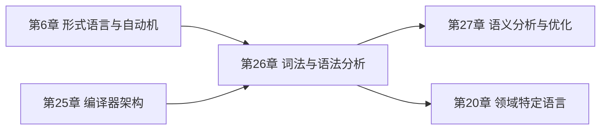
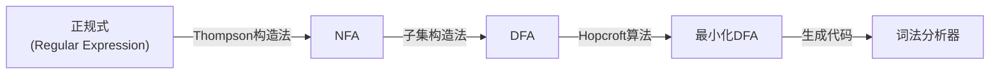
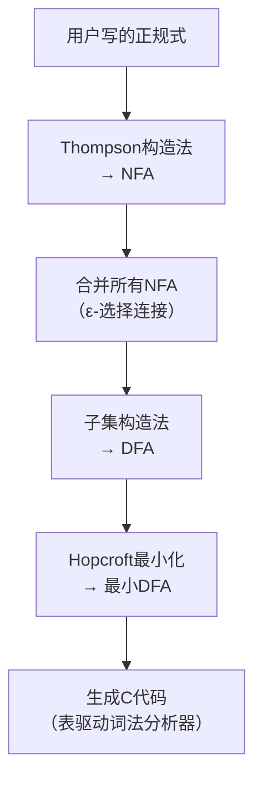
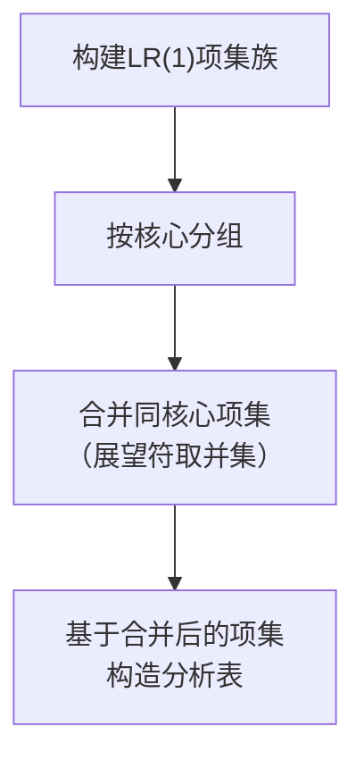

# 第26章 词法与语法分析

## 章节定位

词法分析与语法分析是编译器前端的两个核心阶段，也是形式语言理论在实践中最成功的应用领域。词法分析将字符流转换为记号（Token）流，语法分析将记号流组织为抽象语法树（AST）。这两个阶段的理论基础——正规语言与上下文无关语言——构成了计算机科学理论体系的重要支柱。

## 核心主题

本章围绕词法分析与语法分析的理论与实践展开，涵盖以下核心主题：

**词法分析的理论链条**：从正规式（Regular Expression）出发，经过Thompson构造法得到非确定有限自动机（NFA），再通过子集构造法转换为确定有限自动机（DFA），最后通过Hopcroft算法进行DFA最小化。这一完整的理论链条展示了从简洁的描述到高效的实现的系统方法。

**语法分析的核心算法**：系统介绍自顶向下分析（LL分析）和自底向上分析（LR分析）两大类算法。LL分析包括FIRST/FOLLOW集构造、LL(1)预测分析表、递归下降分析器；LR分析包括LR(0)项集、SLR分析表、LR(1)规范分析、LALR分析表。两类算法各有优势，在实际编译器中都有广泛应用。

**语法分析器生成器**：深入分析Lex/Flex和Yacc/Bison等经典工具的原理与使用，同时介绍ANTLR、tree-sitter等现代工具，以及解析器组合子（Parser Combinator）这一函数式编程范式下的分析器构造方法。

**错误恢复技术**：讨论紧急模式恢复、短语级恢复等错误恢复策略，这些技术对于构建实用的编译器至关重要。

## 与其他章节的关系



- **第6章 形式语言与自动机**：本章的理论基础（正规语言、上下文无关语言）
- **第25章 编译器架构**：本章是编译器前端的详细实现
- **第27章 语义分析与优化**：语法分析产出的AST是语义分析的输入
- **第20章 领域特定语言**：DSL的解析技术直接应用本章内容

## 学习目标

完成本章学习后，读者应能：

1. 从正规式构造NFA和DFA，并进行DFA最小化
2. 构造FIRST/FOLLOW集和LL(1)预测分析表
3. 理解LR(0)、SLR、LR(1)、LALR分析器的构造方法
4. 使用Lex/Flex和Yacc/Bison构建词法和语法分析器
5. 设计信息完整的AST并实现高效的内存管理
6. 设计和实现错误恢复策略
7. 理解增量解析和容错解析在IDE中的应用

---

## 26.1 词法分析：从正规式到状态机

词法分析是编译器的第一个阶段，其任务是将源代码的字符流转换为有意义的记号（Token）流。这一过程的理论基础是正规语言和有限自动机。



### 26.1.1 正规式与正规语言

正规式（Regular Expression）是描述正规语言（Regular Language）的代数表示。正规式基于三个基本操作：连接（Concatenation）、选择（Union/Alternation）和闭包（Kleene Star）。

**形式化定义**：设Σ为字母表，则正规式的定义如下递归给出：

1. ∅是正规式，表示空语言
2. ε是正规式，表示只包含空串的语言{ε}
3. 对每个a∈Σ，a是正规式，表示{a}
4. 如果R和S是正规式，则R|S（选择）、RS（连接）和R*（闭包）都是正规式
5. 只有有限次应用上述规则得到的表达式才是正规式

**编译器中的Token定义示例**：

标识符:   letter (letter | digit)*
整数:     digit+
浮点数:   digit+ '.' digit+ (('E'|'e') ('+'|'-')? digit+)?
空白:     (' ' | '\t' | '\n')+
注释:     '/*' (任何非*后不跟/的字符 | '*'+ 非/非*)* '*'+ '/' 

正规式等价的判定问题是可判定的，即存在算法可以判断两个正规式是否描述相同的语言。这是正规式在编译器中被广泛使用的重要原因之一。

### 26.1.2 Thompson构造法：正规式→NFA

Thompson构造法（Thompson's Construction）由Ken Thompson于1968年提出，是一种将正规式转换为等价的非确定有限自动机（NFA）的系统方法。该方法是构造词法分析器的理论基础。

**基本构造规则**：

| 正规式 | NFA模式 | 说明 |
|--------|---------|------|
| 单字符 a | →(s0)---a--→(s1) | 两个状态，一条标记为a的边 |
| 空串 ε | →(s0)---ε--→(s1) | 两个状态，一条ε边 |
| 选择 R\|S | 新起始→ε→NR/NS→ε→新终止 | 新增起始和终止状态，ε分支 |
| 连接 RS | NR→ε→NS | NR的终止状态连接NS的起始状态 |
| 闭包 R* | 新起始→ε→NR→ε→新终止，加回边 | 支持零次或多次匹配 |

**选择规则的NFA结构**：

        →[新起始状态]
        /    \
       ε      ε
      /        \
    (NR起始)  (NS起始)
    ...        ...
    (NR终态)  (NS终态)
      \        /
       ε      ε
        \    /
        →[新终止状态]

**闭包规则的NFA结构**：

    →[新起始状态]---ε---→[新终止状态]
           ↑               ↑
           ε               ε
           ↓               ↓
        (NR起始)→...→(NR终态)
           ↑               ↓
           ←-----ε---------→

**Thompson构造法的伪代码**：

```python
def thompson_construct(regex):
    """将正规式转换为NFA"""
    if regex == epsilon:
        s0, s1 = new_state(), new_state()
        add_transition(s0, EPSILON, s1)
        return NFA(start=s0, accept=s1)

    elif regex is a character 'a':
        s0, s1 = new_state(), new_state()
        add_transition(s0, 'a', s1)
        return NFA(start=s0, accept=s1)

    elif regex is union R|S:
        NR = thompson_construct(R)
        NS = thompson_construct(S)
        s0, s1 = new_state(), new_state()
        add_transition(s0, EPSILON, NR.start)
        add_transition(s0, EPSILON, NS.start)
        add_transition(NR.accept, EPSILON, s1)
        add_transition(NS.accept, EPSILON, s1)
        return NFA(start=s0, accept=s1)

    elif regex is concatenation RS:
        NR = thompson_construct(R)
        NS = thompson_construct(S)
        add_transition(NR.accept, EPSILON, NS.start)
        return NFA(start=NR.start, accept=NS.accept)

    elif regex is Kleene star R*:
        NR = thompson_construct(R)
        s0, s1 = new_state(), new_state()
        add_transition(s0, EPSILON, NR.start)
        add_transition(s0, EPSILON, s1)
        add_transition(NR.accept, EPSILON, NR.start)
        add_transition(NR.accept, EPSILON, s1)
        return NFA(start=s0, accept=s1)
```

**Thompson构造法的性质**：

- 状态数最多为2m（m为正规式的长度），即O(n)复杂度
- 每个状态最多有两条出边（标记为ε）或一条出边（标记为字符）
- 恰好有一个开始状态和一个接受状态
- 构造过程是自底向上的，每个子表达式的NFA独立构造后再组合

### 26.1.3 子集构造法：NFA→DFA

NFA在执行时需要同时追踪多个可能的状态，这导致了不确定性。子集构造法（Subset Construction / Powerset Construction）将NFA转换为等价的DFA，消除这种不确定性。

**NFA与DFA的定义对比**：

| 特征 | NFA | DFA |
|------|-----|-----|
| 转移函数 | δ: Q × (Σ∪{ε}) → P(Q) | δ: Q × Σ → Q |
| ε-转移 | 支持 | 不支持 |
| 同一输入的转移 | 可以有多个 | 恰好一个 |
| 执行方式 | 同时追踪多个状态 | 只在一个状态 |
| 识别能力 | 与DFA等价 | 与NFA等价 |
| 空间复杂度 | 较小 | 可能指数级膨胀 |

**ε-闭包（ε-Closure）**：从状态集合S出发，只通过ε-转移能到达的所有状态的集合。这是子集构造法的基础操作。

```python
def epsilon_closure(states):
    """计算状态集合的ε-闭包"""
    closure = set(states)
    stack = list(states)
    while stack:
        state = stack.pop()
        for next_state in state.epsilon_transitions:
            if next_state not in closure:
                closure.add(next_state)
                stack.append(next_state)
    return frozenset(closure)
```

**子集构造法主算法**：

```python
def subset_construction(nfa):
    """将NFA转换为等价的DFA"""
    # DFA的起始状态 = NFA起始状态的ε-闭包
    start = epsilon_closure({nfa.start})

    # Dstates: DFA的状态集合（每个状态是NFA状态的集合）
    dstates = {start}
    dtran = {}       # DFA转移表
    worklist = [start]  # 未处理的DFA状态

    while worklist:
        T = worklist.pop()

        for symbol in nfa.alphabet:
            # 计算从T经符号a能到达的NFA状态集合
            moved = set()
            for state in T:
                moved |= nfa.delta(state, symbol)

            U = epsilon_closure(moved)

            if U and U not in dstates:
                dstates.add(U)
                worklist.append(U)

            if U:
                dtran[(T, symbol)] = U

    # DFA的接受状态：包含NFA接受状态的所有DFA状态
    dfa_accept = {T for T in dstates if T &amp; nfa.accept}

    return DFA(start=start, transitions=dtran, accept=dfa_accept)
```

**复杂度分析**：

- DFA的状态数最多为2^n（n为NFA的状态数），这是指数级的
- 实践中，大多数情况下生成的DFA状态数远少于理论上限
- 对于编译器中的词法分析，NFA/DFA的状态数通常在可接受范围内

### 26.1.4 DFA最小化（Hopcroft算法）

DFA最小化将一个DFA转换为状态数最少的等价DFA。最小化DFA在给定语言的意义下是唯一的（同构意义下）。

**Hopcroft算法**是目前已知最高效的DFA最小化算法，时间复杂度为O(n log n)。

**基本思想**：通过不断细化分区（Partition）来区分不同的状态。如果两个状态在任何输入串下都到达相同的结果（都接受或都拒绝），则它们是等价的，可以合并。

```python
def hopcroft_minimization(dfa):
    """Hopcroft DFA最小化算法"""
    # 初始分区：接受状态和非接受状态
    P = {frozenset(dfa.accept), frozenset(dfa.states - dfa.accept)}
    W = {frozenset(dfa.accept)}  # 待处理的分区集合

    while W:
        A = W.pop()

        for symbol in dfa.alphabet:
            # X: 经符号a能到达A中状态的所有状态
            X = frozenset({
                q for q in dfa.states
                if dfa.delta(q, symbol) in A
            })

            for Y in list(P):
                I = X &amp; Y      # Y中能到A的
                J = Y - X      # Y中不能到A的

                if I and J:
                    P.discard(Y)
                    P.add(I)
                    P.add(J)

                    if Y in W:
                        W.discard(Y)
                        W.add(I)
                        W.add(J)
                    else:
                        if len(I) <= len(J):
                            W.add(I)
                        else:
                            W.add(J)

    return build_min_dfa(dfa, P)
```

**关键优化**：每次选择较小的集合加入工作集W，这保证了算法的O(n log n)复杂度。直观理解：较小的集合更容易被分裂，优先处理可以减少总迭代次数。

### 26.1.5 词法分析器的实现模式

手动实现词法分析器通常采用两种模式，各有优劣：

**表驱动模式**：将DFA编码为转移表，运行时查表执行。

```c
// 转移表：state × char -> next_state
int dfa_table[NUM_STATES][256];

// 接受状态标记：state -> token_type (-1表示非接受)
int accept_state[NUM_STATES];

TokenType scan(const char *input) {
    int state = 0;  // 起始状态
    int last_accept = -1;
    const char *last_accept_pos = NULL;
    const char *pos = input;

    while (state >= 0) {  // -1表示死状态
        if (accept_state[state] >= 0) {
            last_accept = accept_state[state];
            last_accept_pos = pos;
        }
        state = dfa_table[state][(unsigned char)*pos];
        pos++;
    }

    // 回退到最后一个接受状态（最长匹配）
    pos = last_accept_pos;
    return last_accept;
}
```

**直接编码模式**：将DFA转换为嵌套的switch/if语句，避免查表开销。

```c
Token next_token() {
    switch (state) {
        case 0:
            if (isalpha(current_char)) { state = 1; }
            else if (isdigit(current_char)) { state = 2; }
            break;
        case 1:
            if (isalnum(current_char)) { /* 继续匹配 */ }
            else { return ID; }  // 接受：标识符
            break;
        case 2:
            if (isdigit(current_char)) { /* 继续匹配 */ }
            else { return NUM; }  // 接受：整数
            break;
    }
}
```

**两种模式的对比**：

| 维度 | 表驱动模式 | 直接编码模式 |
|------|-----------|------------|
| 代码大小 | 小（只需转移表） | 大（每个状态对应代码） |
| 执行速度 | 中等（查表开销） | 快（直接跳转，CPU分支预测友好） |
| 可维护性 | 高（修改表即可） | 低（修改代码结构） |
| 适用场景 | 状态数多的复杂文法 | 状态数少的简单文法 |
| 典型工具 | Flex生成的词法分析器 | 手写的简单词法分析器 |

**DFA压缩技巧**：直接存储完整的转移表（256×状态数字节）可能太大。常用的压缩方法包括：

- **二维压缩**：将转移表分解为基址表和偏移表
- **默认转移**：大多数转移指向默认状态（通常是错误状态），只为非默认转移存储数据
- **行压缩**：如果多行转移表相同，只存储一份

### 26.1.6 Lex/Flex词法分析器生成器

Lex（及其GNU实现Flex）是经典的词法分析器生成器。用户通过正规式定义Token模式，Lex自动生成对应的词法分析器。

**Lex规范的结构**：

```lex
%{
/* C声明和包含头文件 */
#include "parser.h"
%}

/* 定义部分 */
DIGIT    [0-9]
LETTER   [a-zA-Z]
ID       {LETTER}({LETTER}|{DIGIT})*
INT      {DIGIT}+
WS       [ \t\n]+

%%
/* 规则部分 */
{INT}    { yylval.num = atoi(yytext); return NUM; }
{ID}     { yylval.str = strdup(yytext); return ID; }
"+"      { return PLUS; }
"-"      { return MINUS; }
{WS}     { /* 忽略空白 */ }
.        { printf("Unknown character: %s\n", yytext); }

%%
/* C代码部分 */
int yywrap() { return 1; }
```

**Lex的内部工作流程**：



**最长匹配原则与优先级原则**：

- **最长匹配原则**：当输入可以匹配多个规则时，Lex选择匹配最长输入的规则。例如，输入`int`会匹配关键字规则（如果定义了）而非标识符规则。
- **优先级原则**：当多个规则匹配相同长度的输入时，Lex选择在规范中先出现的规则。因此关键字规则应放在标识符规则之前。

**实际使用中的注意事项**：

- 规则的顺序很重要——当多个规则匹配相同长度时，选择第一个
- 使用`%option yylineno`启用行号追踪
- 使用`%option noyywrap`避免链接时需要yywrap函数
- 使用`%option reentrant`生成可重入的词法分析器（线程安全）

---

## 26.2 上下文无关文法基础

上下文无关文法（Context-Free Grammar，CFG）是描述编程语言语法结构的数学模型，为语法分析提供理论框架。

### 26.2.1 CFG的形式化定义

CFG是一个四元组G = (V, T, P, S)，其中：

- **V**：有限的非终结符（变量）集合
- **T**：有限的终结符集合（V ∩ T = ∅）
- **P**：有限的产生式集合，每个产生式形如A → α，其中A∈V，α∈(V∪T)*
- **S∈V**：开始符号

**示例——算术表达式的CFG**：

E → E + T | T
T → T * F | F
F → ( E ) | id

这个文法正确反映了算术运算的优先级：乘法（*）优先于加法（+），括号优先级最高。

### 26.2.2 推导与语言

**直接推导**：如果A → γ是产生式，且α和β是文法符号串，则αAβ ⇒ αγβ。

**推导序列**：零步或多步推导的序列，记为⇒*。

**句型（Sentential Form）**：从开始符号可以推导出的任何符号串。

**句子（Sentence）**：只包含终结符的句型。

**语言**：L(G) = {w ∈ T\* | S ⇒\* w}，即文法G生成的语言是所有可以从S推导出的终结符串的集合。

### 26.2.3 Chomsky层次

Chomsky层次将文法按产生式限制分为四个类型，对应不同计算能力的自动机：

| 类型 | 名称 | 产生式限制 | 对应自动机 | 典型应用 |
|------|------|-----------|-----------|---------|
| 0 | 无限制文法 | α → β（α非空） | 图灵机 | 理论研究 |
| 1 | 上下文相关文法 | \|α\| ≤ \|β\| | 线性有界自动机 | 自然语言 |
| 2 | 上下文无关文法 | A → β（A为非终结符） | 下推自动机 | 编程语言语法 |
| 3 | 正规文法 | A → aB 或 A → a | 有限自动机 | 编程语言词法 |

编译器的词法分析使用正规文法（类型3），语法分析使用上下文无关文法（类型2）。这种分层是编译器前端架构的理论基础。

### 26.2.4 文法变换：消除左递归与提取左因子

自顶向下分析（如LL分析）不能处理左递归文法和公共左因子，因此需要对文法进行预处理。

**消除直接左递归**：

原始产生式：A → Aα | β
消除后：
A → βA'
A' → αA' | ε

**消除间接左递归的通用算法**：

原始产生式：
S → Aa | b
A → Ac | Sd | ε

处理步骤：
1. 将S的产生式代入A：
   A → Ac | (Aa | b)d | ε
   A → Ac | Aad | bd | ε

2. 消除直接左递归：
A → (bd | ε)A'
A' → (c | ad)A' | ε

**提取左因子**：用于消除LL分析中的选择冲突。

原始产生式：A → αβ1 | αβ2
提取后：
A → αA'
A' → β1 | β2

**消除左递归的完整算法**：

```python
def eliminate_left_recursion(grammar):
    """消除文法中的左递归"""
    nonterminals = grammar.nonterminals  # 排序为A1, A2, ..., An

    for i, Ai in enumerate(nonterminals):
        for j in range(i):
            Aj = nonterminals[j]
            # 将 Ai → Ajγ 替换为 Ai → δ1γ | δ2γ | ... | δkγ
            # 其中 Aj → δ1 | δ2 | ... | δk
            new_productions = []
            for prod in grammar.productions_of(Ai):
                if prod.startswith(Aj):
                    gamma = prod[len(Aj):]
                    for Aj_prod in grammar.productions_of(Aj):
                        new_productions.append(Aj_prod + gamma)
                else:
                    new_productions.append(prod)
            grammar.set_productions(Ai, new_productions)

        # 消除Ai的直接左递归
        direct_lr = [p for p in grammar.productions_of(Ai)
                      if p.startswith(Ai)]
        non_lr = [p for p in grammar.productions_of(Ai)
                   if not p.startswith(Ai)]

        if direct_lr:
            Ai_prime = new_nonterminal()
            new_Ai = [p + Ai_prime for p in non_lr]
            new_Ai_prime = [p[len(Ai):] + Ai_prime for p in direct_lr]
            new_Ai_prime.append(EPSILON)
            grammar.set_productions(Ai, new_Ai)
            grammar.set_productions(Ai_prime, new_Ai_prime)
```

---

## 26.3 自顶向下分析：LL分析

LL分析从开始符号出发，自顶向下地推导出输入串。LL(k)中的k表示前瞻的Token数量。

### 26.3.1 FIRST集与FOLLOW集

**FIRST集**的定义：FIRST(α)是从α可以推导出的所有句型的第一个终结符的集合。如果α可以推导出ε，则ε也属于FIRST(α)。

```python
def compute_first(grammar):
    """计算所有文法符号的FIRST集"""
    first = {}
    for terminal in grammar.terminals:
        first[terminal] = {terminal}
    for nonterminal in grammar.nonterminals:
        first[nonterminal] = set()

    changed = True
    while changed:
        changed = False
        for A, productions in grammar.productions.items():
            for prod in productions:
                symbols = prod.split()
                i = 0
                while i < len(symbols):
                    Xi = symbols[i]
                    before = len(first[A])
                    first[A] |= (first[Xi] - {EPSILON})
                    if EPSILON in first[Xi]:
                        i += 1
                    else:
                        break
                else:
                    if EPSILON not in first[A]:
                        first[A].add(EPSILON)
                        changed = True
                if len(first[A]) > before:
                    changed = True
    return first
```

**FOLLOW集**的定义：FOLLOW(A)是可以紧跟在非终结符A之后的所有终结符的集合。对于开始符号S，$（输入结束标记）属于FOLLOW(S)。

```python
def compute_follow(grammar, first):
    """计算所有非终结符的FOLLOW集"""
    follow = {A: set() for A in grammar.nonterminals}
    follow[grammar.start_symbol] = {$}

    changed = True
    while changed:
        changed = False
        for A, productions in grammar.productions.items():
            for prod in productions:
                symbols = prod.split()
                for i, B in enumerate(symbols):
                    if B in grammar.nonterminals:
                        beta = symbols[i+1:]
                        if beta:
                            first_beta = compute_first_of_string(beta, first)
                            before = len(follow[B])
                            follow[B] |= (first_beta - {EPSILON})
                            if EPSILON in first_beta:
                                follow[B] |= follow[A]
                        else:
                            before = len(follow[B])
                            follow[B] |= follow[A]
                        if len(follow[B]) > before:
                            changed = True
    return follow
```

**计算实例**：对文法 E → T E', E' → + T E' | ε, T → F T', T' → * F T' | ε, F → ( E ) | id

| 符号 | FIRST集 | FOLLOW集 |
|------|---------|----------|
| E | {(, id} | {), $} |
| E' | {+, ε} | {), $} |
| T | {(, id} | {+, ), $} |
| T' | {*, ε} | {+, ), $} |
| F | {(, id} | {*, +, ), $} |

### 26.3.2 LL(1)预测分析表

LL(1)预测分析表M[A, a]指明了当栈顶非终结符为A且当前输入为a时应使用的产生式。

```python
def build_ll1_table(grammar, first, follow):
    """构造LL(1)预测分析表"""
    table = {}
    for A in grammar.nonterminals:
        table[A] = {}

    for A, productions in grammar.productions.items():
        for prod in productions:
            first_alpha = compute_first_of_string(prod, first)
            for a in (first_alpha - {EPSILON}):
                table[A][a] = prod

            if EPSILON in first_alpha:
                for b in follow[A]:
                    table[A][b] = prod

    # 检查冲突
    for A in table:
        for a in table[A]:
            if isinstance(table[A][a], list) and len(table[A][a]) > 1:
                raise ConflictError(f"LL(1) conflict at M[{A}, {a}]")

    return table
```

**LL(1)文法的判定条件**：一个文法是LL(1)的，当且仅当预测分析表的每个单元格中至多有一个产生式。等价地，对于任意两个产生式A → α \| β：

- FIRST(α) ∩ FIRST(β) = ∅
- 如果α能推导出ε，则FIRST(β) ∩ FOLLOW(A) = ∅
- 如果β能推导出ε，则FIRST(α) ∩ FOLLOW(A) = ∅

### 26.3.3 LL(1)预测分析器

```python
def ll1_parse(input_tokens, table, start_symbol):
    """LL(1)预测分析器"""
    stack = ['$', start_symbol]
    ip = 0
    a = input_tokens[ip]

    while stack[-1] != '$':
        X = stack[-1]

        if X == a:
            stack.pop()
            ip += 1
            a = input_tokens[ip] if ip < len(input_tokens) else '$'
        elif X in table and a in table[X]:
            production = table[X][a]
            stack.pop()
            symbols = production.split()
            if symbols != [EPSILON]:
                for Yi in reversed(symbols):
                    stack.append(Yi)
        else:
            error(f"Syntax error: unexpected {a}, expected {X}")

    if a == '$':
        return "accept"
    else:
        error("Input not fully consumed")
```

### 26.3.4 递归下降分析器

递归下降分析器是LL(1)分析器的直接编码实现，每个非终结符对应一个函数。这是实践中最常用的语法分析方法，GCC、Clang等工业级编译器都使用递归下降。

**核心模式——表达式解析器（Python）**：

```python
class Parser:
    """递归下降表达式解析器"""
    def __init__(self, tokens):
        self.tokens = tokens
        self.pos = 0
        self.current = tokens[0]

    def advance(self):
        self.pos += 1
        self.current = (self.tokens[self.pos]
                        if self.pos < len(self.tokens) else None)

    def expect(self, token_type):
        if self.current and self.current.type == token_type:
            self.advance()
        else:
            self.error(f"Expected {token_type}, got {self.current}")

    # Expr → Term (('+' | '-') Term)*
    def parse_expr(self):
        left = self.parse_term()
        while self.current and self.current.type in (PLUS, MINUS):
            op = self.current
            self.advance()
            right = self.parse_term()
            left = BinaryExpr(op, left, right)
        return left

    # Term → Factor (('*' | '/') Factor)*
    def parse_term(self):
        left = self.parse_factor()
        while self.current and self.current.type in (STAR, SLASH):
            op = self.current
            self.advance()
            right = self.parse_factor()
            left = BinaryExpr(op, left, right)
        return left

    # Factor → NUMBER | '(' Expr ')'
    def parse_factor(self):
        if self.current.type == NUMBER:
            val = NumberExpr(self.current.value)
            self.advance()
            return val
        elif self.current.type == LPAREN:
            self.advance()
            expr = self.parse_expr()
            self.expect(RPAREN)
            return expr
        else:
            self.error("Expected number or '('")
```

**C语言版本**（消除左递归后的文法）：

```c
// 文法：E → T E'   E' → + T E' | ε
//         T → F T'   T' → * F T' | ε
//         F → ( E ) | id

void E() {
    T();
    E_prime();
}

void E_prime() {
    if (current_token == PLUS) {
        match(PLUS);
        T();
        E_prime();
    }
    // else: ε产生式，什么都不做
}

void T() {
    F();
    T_prime();
}

void T_prime() {
    if (current_token == STAR) {
        match(STAR);
        F();
        T_prime();
    }
    // else: ε产生式
}

void F() {
    if (current_token == ID) {
        match(ID);
    } else if (current_token == LPAREN) {
        match(LPAREN);
        E();
        match(RPAREN);
    } else {
        error("expected id or (");
    }
}
```

**递归下降的优势**：

- 易于手写和调试
- 错误信息好（函数调用栈可以直接定位错误位置）
- 可以灵活处理上下文相关语法（通过语义谓词）
- 对LL(1)不够的情况，可以通过多Token前瞻、回溯、试探性解析来扩展

**处理非LL(1)情况的技巧**：

1. **多Token前瞻**：预读多个Token再做决策
2. **回溯（Backtracking）**：尝试一种解析方式，失败则回退到决策点尝试另一种
3. **语义谓词**：使用符号表中的类型信息辅助决策（如C++中区分类型名和变量名）
4. **试探性解析（Tentative Parsing）**：先尝试性地解析一段代码，根据结果决定真正的解析路径

```python
# 试探性解析：C语言中区分类型转换和乘法
def parse_cast_or_mul(self):
    saved_pos = self.save_position()
    try:
        self.expect(LPAREN)
        type_name = self.try_parse_type()
        if type_name and self.current.type == RPAREN:
            self.advance()
            expr = self.parse_unary()
            return CastExpr(type_name, expr)
    except ParseError:
        pass

    # 回退：按乘法表达式解析
    self.restore_position(saved_pos)
    return self.parse_multiplicative()
```

---

## 26.4 自底向上分析：LR分析

LR分析是比LL分析更强大的语法分析方法。LR分析器从输入开始，逐步将Token归约为非终结符，最终归约到开始符号。

### 26.4.1 LR(0)项集

LR分析基于项（Item）的概念。LR(0)项是产生式加上一个点（·），点标记了分析的进度：

产生式：A → XYZ

对应的LR(0)项：
A → ·XYZ    // 还没有看到任何符号
A → X·YZ    // 已经看到了X
A → XY·Z    // 已经看到了XY
A → XYZ·    // 已经看到了XYZ（归约项）

**项集（Item Set）** 是一组项的集合，表示分析器在某个状态下的所有可能分析进度。

**闭包运算（Closure）**：如果项集I包含项A → α·Bβ，则对于B的每个产生式B → γ，项B → ·γ也属于闭包。

```python
def closure(I):
    """计算项集I的闭包"""
    result = set(I)
    changed = True
    while changed:
        changed = False
        for item in result:
            A, alpha, B, beta = item
            if B is not None:  # A → α·Bβ
                for gamma in grammar.productions_of(B):
                    new_item = (B, '', gamma, None)
                    if new_item not in result:
                        result.add(new_item)
                        changed = True
    return result
```

**GOTO函数**：GOTO(I, X)是从项集I经符号X到达的项集。

```python
def goto(I, X):
    """计算GOTO(I, X)"""
    J = set()
    for item in I:
        A, alpha, B, beta = item
        if B == X:  # A → α·Xβ
            new_alpha = alpha + X
            new_beta = beta[1:] if beta else None
            J.add((A, new_alpha, beta[0] if beta else None, new_beta))
    return closure(J)
```

**LR(0)自动机构建**：

```python
def build_lr0_item_sets(grammar):
    """构建LR(0)项集族"""
    start_item = (grammar.augmented_start, '', grammar.start_symbol, None)
    C = {frozenset(closure({start_item}))}
    worklist = list(C)

    while worklist:
        I = worklist.pop()
        for X in grammar.all_symbols():
            J = goto(I, X)
            if J and frozenset(J) not in C:
                C.add(frozenset(J))
                worklist.append(frozenset(J))

    return C
```

### 26.4.2 SLR分析表

SLR（Simple LR）在LR(0)的基础上使用FOLLOW集来解决移进-归约冲突。

```python
def build_slr_table(grammar):
    """构造SLR分析表"""
    C = build_lr0_item_sets(grammar)
    ACTION = {}
    GOTO = {}

    for i, I in enumerate(C):
        for item in I:
            A, alpha, B, beta = item

            if B is not None and B in grammar.terminals:
                j = state_index(goto(I, B))
                ACTION[(i, B)] = ('shift', j)

            elif B is None and A != grammar.augmented_start:
                for a in follow[A]:
                    ACTION[(i, a)] = ('reduce', A, alpha)

            elif B is None and A == grammar.augmented_start:
                ACTION[(i, '$')] = ('accept',)

        for X in grammar.nonterminals:
            if goto(I, X):
                GOTO[(i, X)] = state_index(goto(I, X))

    return ACTION, GOTO
```

**SLR的局限性**：SLR使用FOLLOW集来决定归约，有时会产生不必要的冲突。当FOLLOW(A)包含某些终结符时，即使在不应该归约的状态下也会生成归约动作。LR(1)通过引入展望符（Lookahead）来解决这个问题。

### 26.4.3 LR(1)规范分析

LR(1)项是一个二元组[A → α·β, a]，其中a是展望符，表示归约时下一个输入必须是a。

```python
def closure_lr1(I):
    """计算LR(1)项集的闭包"""
    result = set(I)
    changed = True
    while changed:
        changed = False
        for item in result:
            A, alpha, B, beta, lookahead = item
            if B is not None:
                beta_a = (beta or '') + lookahead
                first_beta_a = compute_first_of_string(beta_a)
                for gamma in grammar.productions_of(B):
                    for b in first_beta_a:
                        new_item = (B, '', gamma, None, b)
                        if new_item not in result:
                            result.add(new_item)
                            changed = True
    return result
```

LR(1)分析表的构造与SLR类似，但归约决策使用项中的展望符而非FOLLOW集。这使得LR(1)能够更精确地解决冲突，但代价是状态数可能远多于LR(0)/SLR。

### 26.4.4 LALR分析表

LALR（Look-Ahead LR）分析表是LR(1)分析表的一种简化，将具有相同核心（Core，即不考虑展望符的项集）的LR(1)项集合并。

**构造流程**：



**四种LR分析器的对比**：

| 分析器 | 项的形式 | 状态数 | 冲突解决能力 | 适用场景 |
|--------|---------|--------|------------|---------|
| LR(0) | A → α·β | 最少 | 最弱 | 理论基础 |
| SLR | A → α·β | 与LR(0)相同 | 中等 | 简单文法 |
| LR(1) | [A → α·β, a] | 最多 | 最强 | 复杂文法 |
| LALR | [A → α·β, a] | 与SLR相同 | 接近LR(1) | 实际编译器 |

**LALR的优势**：

- 状态数与SLR相同（远少于LR(1)）
- 分析能力比SLR强，接近LR(1)
- 大多数编程语言的文法都是LALR(1)文法
- 是Bison等工具的默认分析方法

### 26.4.5 LR分析器的工作过程

LR分析器使用一个状态栈和一个符号栈：

```python
def lr_parse(input_tokens, ACTION, GOTO):
    """LR分析器主循环"""
    stack = [0]
    ip = 0
    a = input_tokens[ip]

    while True:
        s = stack[-1]

        if (s, a) in ACTION and ACTION[(s, a)][0] == 'shift':
            t = ACTION[(s, a)][1]
            stack.append(a)
            stack.append(t)
            ip += 1
            a = input_tokens[ip] if ip < len(input_tokens) else '$'

        elif (s, a) in ACTION and ACTION[(s, a)][0] == 'reduce':
            _, A, alpha = ACTION[(s, a)]
            for _ in range(2 * len(alpha)):
                stack.pop()
            t = stack[-1]
            stack.append(A)
            stack.append(GOTO[(t, A)])

        elif (s, a) in ACTION and ACTION[(s, a)][0] == 'accept':
            return "accept"

        else:
            error(f"Syntax error at position {ip}")
```

**移入-归约过程示例**：对文法 E → E + T | T, T → T * F | F, F → ( E ) | id，分析输入 `id * id + id`：

步骤 | 状态栈      | 符号栈      | 输入         | 动作
-----|------------|-------------|--------------|------------
1    | 0          |             | id*id+id$    | shift
2    | 0 5        | id          | *id+id$      | reduce F→id
3    | 0 3        | F           | *id+id$      | reduce T→F
4    | 0 2        | T           | *id+id$      | shift
5    | 0 2 7      | T*          | id+id$       | shift
6    | 0 2 7 5    | T*id        | +id$         | reduce F→id
7    | 0 2 7 10   | T*F         | +id$         | reduce T→T*F
8    | 0 2        | T           | +id$         | reduce E→T
9    | 0 1        | E           | +id$         | shift
10   | 0 1 6      | E+          | id$          | shift
11   | 0 1 6 5    | E+id        | $            | reduce F→id
12   | 0 1 6 3    | E+F         | $            | reduce T→F
13   | 0 1 6 9    | E+T         | $            | reduce E→E+T
14   | 0 1        | E           | $            | accept

**LL分析与LR分析的核心区别**：

| 维度 | LL分析（自顶向下） | LR分析（自底向上） |
|------|------------------|-------------------|
| 分析方向 | 从开始符号推导到输入 | 从输入归约到开始符号 |
| 使用的信息 | 只看前瞻Token | 利用栈中已移进的所有信息 |
| 左递归 | 不能处理 | 可以处理 |
| 文法类 | LL(k) ⊂ LR(k) | LR(k) ⊃ LL(k) |
| 实现方式 | 递归下降或预测表 | 移进-归约表驱动 |
| 直观性 | 更直观 | 较难理解 |


---

## 26.5 语法分析器生成器

### 26.5.1 Yacc/Bison

Yacc（Yet Another Compiler Compiler）及其GNU实现Bison是经典的LALR(1)语法分析器生成器。

**Yacc规范的结构**：

```yacc
%{
#include <stdio.h>
%}

%token NUM ID
%left '+' '-'
%left '*' '/'
%right UMINUS

%%
program: /* empty */
       | program expr '\n' { printf("= %d\n", $2); }
       ;

expr: NUM                { $$ = $1; }
    | ID                 { $$ = lookup($1); }
    | expr '+' expr      { $$ = $1 + $3; }
    | expr '-' expr      { $$ = $1 - $3; }
    | expr '*' expr      { $$ = $1 * $3; }
    | expr '/' expr      { $$ = $1 / $3; }
    | '(' expr ')'       { $$ = $2; }
    | '-' expr %prec UMINUS { $$ = -$2; }
    ;

%%

int main() { return yyparse(); }
int yyerror(char *s) { fprintf(stderr, "%s\n", s); }
```

**Yacc的工作流程**：

1. 解析用户的文法规则
2. 计算FIRST/FOLLOW集
3. 构造LALR(1)分析表
4. 生成基于表驱动的LALR分析器
5. 用户的语义动作嵌入到分析器的归约操作中

**优先级和结合性声明**：Yacc通过`%left`、`%right`、`%nonassoc`声明来解决算符优先级冲突。这些声明的作用是在LALR分析表中自动添加优先级信息，避免文法的二义性。优先级从低到高递增，同一行声明的运算符优先级相同。

### 26.5.2 ANTLR与其他现代工具

**ANTLR（ANother Tool for Language Recognition）** 是现代最强大的解析器生成器之一，支持LL(*)分析：

| 特性 | Yacc/Bison | ANTLR | tree-sitter |
|------|-----------|-------|-------------|
| 分析方法 | LALR(1) | LL(\*) | GLR |
| 输入格式 | .y文件 | .g4文件（分离词法/语法） | 语法DSL |
| 输出语言 | C | Java/C++/Python/JS等 | C（嵌入式） |
| 错误恢复 | error符号 | 自适应LL(\*)恢复 | 内置错误容忍 |
| IDE支持 | 有限 | ANTLR IDE插件 | 通过binding |
| 适用场景 | 编译器 | DSL、协议解析、IDE工具 | 编辑器高亮、代码分析 |

**ANTLR的关键优势**：

- **分离的词法和语法**：.g4文件可以同时定义词法规则和语法规则，自动处理它们之间的交互
- **自适应LL(\*)**：ANTLR4使用自适应前瞻，自动处理左因子消除，用户无需手动重写文法
- **访问者和监听者模式**：自动生成遍历AST的代码框架
- **语义谓词**：支持`{条件}?`语法的语义谓词，处理上下文相关语法

**tree-sitter** 是现代增量解析器的代表，被广泛用于编辑器（Atom、VS Code）：

- **增量解析**：只重新解析修改影响的部分，性能极高
- **错误容忍**：即使有语法错误也能产出部分AST
- **无歧义**：语法规则设计为无歧义，避免二义性文法
- **跨语言**：绑定支持C、Python、Rust、JavaScript等

### 26.5.3 解析器组合子

解析器组合子（Parser Combinator）是函数式编程范式下的语法分析器构造方法。核心思想是将解析器视为函数，通过组合函数来构建复杂的解析器。

**解析器的类型定义**（Haskell风格）：

```haskell
type Parser a = String -> [(a, String)]
-- 一个解析器接受输入字符串，返回（解析结果, 剩余输入）的列表
```

**基本解析器**：

```haskell
-- 匹配单个满足条件的字符
satisfy :: (Char -> Bool) -> Parser Char
satisfy pred (c:cs) | pred c = [(c, cs)]
satisfy _ _ = []

-- 匹配特定字符
char :: Char -> Parser Char
char c = satisfy (== c)
```

**解析器组合子**：

```haskell
-- 选择：先尝试p1，失败则尝试p2
(<|>) :: Parser a -> Parser a -> Parser a
(p1 <|> p2) inp = p1 inp ++ p2 inp

-- 零次或多次
many :: Parser a -> Parser [a]
many p = many1 p <|> return []

-- 一次或多次
many1 :: Parser a -> Parser [a]
many1 p = do x <- p; xs <- many p; return (x:xs)
```

**使用组合子构建表达式解析器**：

```haskell
expr :: Parser Int
expr = do t <- term
          (do char '+'; e <- expr; return (t + e)) <|> return t

term :: Parser Int
term = do f <- factor
          (do char '*'; t <- term; return (f * t)) <|> return f

factor :: Parser Int
factor = (do char '('; e <- expr; char ')'; return e)
         <|> number
```

**Python实现的解析器组合子**：

```python
class Parser:
    """解析器基类"""
    def __init__(self, parse_fn):
        self.parse_fn = parse_fn

    def parse(self, input, pos=0):
        return self.parse_fn(input, pos)

    def __or__(self, other):
        """选择组合子 p1 | p2"""
        def parse(input, pos):
            result = self.parse(input, pos)
            if result is not None:
                return result
            return other.parse(input, pos)
        return Parser(parse)

    def __rshift__(self, fn):
        """映射组合子 p >> fn"""
        def parse(input, pos):
            result = self.parse(input, pos)
            if result is not None:
                value, new_pos = result
                return (fn(value), new_pos)
            return None
        return Parser(parse)

def char(c):
    """匹配单个字符"""
    def parse(input, pos):
        if pos < len(input) and input[pos] == c:
            return (c, pos + 1)
        return None
    return Parser(parse)

def many(p):
    """零次或多次匹配"""
    def parse(input, pos):
        results = []
        while True:
            result = p.parse(input, pos)
            if result is None:
                break
            value, pos = result
            results.append(value)
        return (results, pos)
    return Parser(parse)
```

**解析器组合子的优劣势对比**：

| 维度 | 优势 | 劣势 |
|------|------|------|
| 组合性 | 小解析器组合为大解析器，模块化好 | — |
| 类型安全 | 编译时检查组合是否合法 | — |
| 表达力 | 支持上下文相关语法、无限lookahead | — |
| 可嵌入 | 直接嵌入宿主语言 | 依赖宿主语言特性 |
| 性能 | Packrat解析保证O(n) | 通常比LALR分析器慢 |
| 错误信息 | — | 生成好的错误信息需要额外工作 |
| 左递归 | — | 朴素实现不支持左递归 |

现代解析器组合子库（Rust的nom、Haskell的Parsec/Megaparsec、Scala的scala-parser-combinators）已经克服了许多早期的缺陷。在工业应用中，Rust生态的nom广泛用于二进制格式解析，Haskell的Megaparsec被用于构建真实的编译器。

---

## 26.6 AST的设计与构建

抽象语法树（AST）是语法分析的输出，也是后续语义分析、代码优化和代码生成的输入。AST的设计直接影响编译器后续阶段的效率。

### 26.6.1 AST节点设计

好的AST设计应该满足以下原则：

**完整性**：保留源代码中的所有语法结构，不丢失信息。例如，括号虽然不影响计算结果，但在AST中应该保留其位置信息以便错误报告。

**层次化**：不同抽象层次的节点应该有清晰的继承或组合关系。

```python
# 基类
class ASTNode:
    def __init__(self, location):
        self.location = location  # 源代码位置，用于错误报告

# 表达式节点
class Expr(ASTNode): pass

class NumberExpr(Expr):
    def __init__(self, value, location):
        super().__init__(location)
        self.value = value

class BinaryExpr(Expr):
    def __init__(self, op, left, right, location):
        super().__init__(location)
        self.op = op        # 运算符Token
        self.left = left     # 左操作数
        self.right = right   # 右操作数

# 语句节点
class Stmt(ASTNode): pass

class IfStmt(Stmt):
    def __init__(self, condition, then_branch, else_branch, location):
        super().__init__(location)
        self.condition = condition
        self.then_branch = then_branch
        self.else_branch = else_branch  # 可能为None
```

**AST设计的权衡**：

| 维度 | 详细AST | 精简AST |
|------|--------|--------|
| 信息量 | 保留所有语法细节 | 只保留语义信息 |
| 内存占用 | 较大 | 较小 |
| 适用场景 | IDE支持、代码格式化 | 编译优化 |
| 示例 | Clang的完整AST（含括号、逗号等） | GCC的精简AST |

### 26.6.2 位置信息追踪

在词法分析阶段就应该记录每个Token的源代码位置（文件名、行号、列号、长度），并将位置信息附加到AST节点上。这对于错误报告至关重要。

```c
typedef struct {
    const char *filename;
    int line;
    int column;
    int length;
} SourceLocation;
```

**Clang的SourceLocation编码**：Clang使用一个32位整数编码源位置，通过SourceManager将其映射到文件名和行列号。源文件被分为多个区域（如主文件、头文件、宏展开等），每个区域有独立的偏移量。32位的ID通过位操作编码区域和偏移量。这种紧凑的编码减少了AST的内存开销。

**宏展开追踪**：Clang能够追踪到错误的源头——既显示了宏调用的位置，也显示了宏展开后实际出错的位置：

// 在宏展开中的错误定位
#define ADD(a, b) ((a) + (b))
int x = ADD(1, "hello");

// Clang的错误信息
test.c:2:17: error: invalid operands to binary expression ('int' and 'const char *')
int x = ADD(1, "hello");
            ~~~^~~~~~~~
test.c:1:23: note: expanded from macro 'ADD'
#define ADD(a, b) ((a) + (b))
                   ~~~^~~~~

### 26.6.3 内存管理：Arena分配

AST通常在编译过程中大量分配，编译结束后一次性释放。有效的内存管理策略对编译器性能至关重要。

**Arena分配（Arena Allocation）**：预分配一大块内存，所有AST节点从中分配。优点是分配速度快（只需移动指针）、释放简单（一次性释放整个区域）、缓存友好（节点在内存中连续存放）。

```c
// 简单的Arena分配器
typedef struct Arena {
    char *current;
    char *end;
    struct Arena *next;
} Arena;

void *arena_alloc(Arena *arena, size_t size) {
    size = (size + 7) &amp; ~7;  // 8字节对齐
    if (arena->current + size > arena->end) {
        arena_grow(arena, size);
    }
    void *ptr = arena->current;
    arena->current += size;
    return ptr;
}

void arena_free_all(Arena *arena) {
    // 一次性释放所有分配的内存
    while (arena) {
        struct Arena *next = arena->next;
        free(arena);
        arena = next;
    }
}
```

**内存管理策略对比**：

| 策略 | 分配速度 | 释放方式 | 缓存友好性 | 内存碎片 |
|------|---------|---------|-----------|---------|
| Arena分配 | 极快（移动指针） | 一次性释放 | 高（连续存放） | 无 |
| malloc/free | 较慢（系统调用） | 逐个释放 | 低（随机存放） | 有 |
| unique_ptr | 中等 | 自动逐个释放 | 低 | 有 |
| 标记-清除GC | 中等 | 自动批量释放 | 低 | 有 |

在性能敏感的编译器中，Arena分配仍然是主流选择。Clang和GCC都使用Arena分配器管理AST节点。

---

## 26.7 错误恢复

编译器的实用性很大程度上取决于错误恢复能力。好的错误恢复不仅要检测到错误，还要准确定位错误位置、提供有意义的错误信息、并在错误后继续解析以发现更多错误。

### 26.7.1 紧急模式恢复

紧急模式恢复（Panic Mode Recovery）是最简单但实用的错误恢复策略：当检测到语法错误时，丢弃输入符号直到找到一个同步符号（Synchronizing Token），然后从该点继续分析。

```python
def panic_mode_recovery(parser, sync_set):
    """紧急模式恢复：跳过Token直到遇到sync_set中的Token"""
    while parser.current and parser.current.type not in sync_set:
        parser.advance()
    # parser.current现在是同步点，或者输入已结束
```

**同步点的选择策略**：

- 语句的起始Token（如`if`、`while`、`return`）
- 分隔符（如`;`、`}`）
- 较高层非终结符的FOLLOW集

```yacc
/* Yacc中的紧急模式恢复示例 */
stmt: IF '(' expr ')' stmt
    | error ';'    /* 错误恢复：跳过分号 */
    ;
```

紧急模式恢复的优点是简单可靠，缺点是可能跳过大量输入，导致后续代码无法被正确分析。

### 26.7.2 短语级恢复

短语级恢复（Phrase-Level Recovery）在检测到错误时，对剩余输入或分析栈进行局部修改以继续分析：

```python
def phrase_level_recovery(parser, expected_token):
    """短语级恢复：在错误位置尝试插入/删除/替换Token"""
    # 策略1：插入缺失的符号
    if expected_token is a common_delimiter:
        insert(expected_token)
        continue_parsing()

    # 策略2：删除多余的符号
    if current_token can_be_safely_skipped:
        discard(current_token)
        continue_parsing()

    # 策略3：替换错误的符号
    if current_token is close_to(expected_token):
        replace(current_token, expected_token)
        continue_parsing()
```

**短语级恢复的实现示例**：

```python
def parse_statement(self):
    if self.current.type == IF:
        self.advance()
        self.expect(LPAREN)
        condition = self.parse_expr()
        # 短语级恢复：如果缺少右括号，假设它存在
        if self.current.type != RPAREN:
            self.report_error("Expected ')'")
            # 不消耗Token，假设缺失了右括号
        else:
            self.advance()
        then_branch = self.parse_statement()
        # ...
```

### 26.7.3 错误产生式与Bison的error符号

**错误产生式（Error Productions）**：为常见的语法错误编写专门的产生式，提供更有意义的错误消息。

// 正常产生式
Stmt → 'if' '(' Expr ')' Stmt

// 错误产生式：处理忘记写括号的情况
Stmt → 'if' Expr ')' Stmt   { error("missing '('") }
Stmt → 'if' '(' Expr Stmt   { error("missing ')'") }

**Bison的error符号**：Bison提供特殊的`error`符号用于错误恢复：

```yacc
statement:
    expr ';'         { /* 正常语句 */ }
  | error ';'        { yyerrok; /* 错误恢复：跳到分号后继续 */ }
  ;
```

当遇到语法错误时，分析器弹出栈中的状态直到遇到包含`error`转移的状态，然后跳过输入Token直到找到可以跟在`error`后面的Token。`yyerrok`宏用于重置分析器的错误状态。

**错误恢复策略对比**：

| 策略 | 实现复杂度 | 错误信息质量 | 恢复效果 | 适用场景 |
|------|-----------|------------|---------|---------|
| 紧急模式 | 低 | 一般 | 跳过大量代码 | 快速原型 |
| 短语级恢复 | 中 | 较好 | 局部修正 | IDE工具 |
| 错误产生式 | 高 | 优秀 | 精确恢复 | 工业编译器 |

**Go语言的错误恢复哲学**：Go编译器采用"快速失败"策略——遇到第一个错误就停止编译。Go团队认为，一个错误往往会引发大量级联错误，报告太多错误反而会误导用户。这与GCC/Clang的"继续但限制"策略（默认限制为100个错误）形成对比。

---

## 26.8 增量解析与IDE支持

现代IDE要求解析器支持增量更新和容错解析，以提供实时的代码分析和编辑辅助功能。

### 26.8.1 增量词法分析

当用户在编辑器中修改了一个字符，传统的做法是重新扫描整个文件。增量词法分析只重新扫描受影响的区域。

**基于行的增量**：由于大多数编辑操作影响单行或多行，可以在每行的起始位置缓存词法分析状态。修改某行后，从该行的起始状态重新扫描，直到状态与下一行的缓存状态一致。

**性能对比**：对于一个10000行的文件，修改其中一行：
- 全量扫描：需要处理10000行
- 增量扫描：通常只需处理1-3行，加速数百倍

### 26.8.2 容错解析

IDE中的代码经常是不完整的（用户正在输入中）。容错解析器需要能够处理：

- 缺失的Token（如还没输入的分号、括号）
- 多余的Token（如误输入的字符）
- 不完整的结构（如只有开头没有结尾的函数定义）

**Roslyn（C#编译器）的容错解析策略**：Roslyn的解析器在遇到错误时不丢弃Token，而是将错误Token放入"缺失列表"（MissingList），并生成包含错误的完整AST。这使得IDE可以在不完整的代码上提供代码补全和重构功能。

**tree-sitter的错误容忍机制**：tree-sitter在遇到语法错误时，会将无法解析的Token标记为"错误节点"（ERROR node），然后尝试从下一个可以恢复的位置继续解析。这种机制保证了即使有大量语法错误，也能产出一个包含所有可解析部分的AST。

### 26.8.3 语法高亮和代码折叠

现代IDE的语法高亮使用词法分析的结果，代码折叠使用语法分析的结果。为了支持实时编辑，这些分析必须足够快速：

- **语法高亮**：通常使用增量词法分析，在每次按键后更新
- **代码折叠**：使用增量语法分析，只重新分析修改影响的AST子树
- **代码补全**：在光标位置进行局部解析，确定补全上下文

---

## 26.9 性能优化

### 26.9.1 词法分析器的性能优化

**关键字查找的优化**：标识符和关键字的区分是词法分析的性能瓶颈之一。常用的优化方法：

1. **完美哈希**：为关键字集合构建完美哈希函数，O(1)查找
2. **Trie树**：将关键字组织为Trie，逐字符匹配
3. **首字符过滤**：根据标识符的首字符快速排除大部分非关键字

**字符串处理优化**：字符串字面量和标识符的处理是词法分析的另一大开销。优化技巧：

- **字符串内化（String Interning）**：避免重复存储相同的字符串。所有相同的标识符共享同一个字符串对象，比较时只需比较指针。
- **增量哈希计算**：避免多次扫描同一个字符串。

### 26.9.2 语法分析器的性能优化

**AST构建的延迟化**：在只需要语法检查而不需要AST的应用（如代码格式化工具的某些部分）中，可以跳过AST构建，显著减少内存分配和构造开销。

**并行解析**：将文件分割为多个区域，每个区域独立解析，然后合并结果。Go语言的编译器使用这种方法实现了快速的并行编译。

**内存预分配**：预估AST节点数量，一次性分配足够的内存。这可以减少频繁的内存分配调用。Arena分配器天然支持这种优化。

---

## 26.10 实战案例：三大编译器前端

理论知识需要在真实编译器中验证。本节分析三个有代表性的编译器前端实现，展示词法和语法分析技术在实际工程中的应用。

### 26.10.1 GCC的C++前端——处理世界上最复杂的语法

**C++语法的特殊挑战**：

C++的语法是上下文相关的（Context-sensitive），这是GCC前端面临的最大挑战。

**最令人困惑的解析（Most Vexing Parse）**：

```cpp
// 这是声明了一个函数还是定义了一个对象？
Timer t(stream());  // C++标准规定这是函数声明！
// 正确的定义对象写法：
Timer t((stream()));  // 额外的括号
Timer t = Timer(stream());
```

GCC的解析器需要维护符号表来区分类型名和变量名。当遇到一个标识符时，如果它在当前作用域中是类型名，则语法分析走一条路径；如果是变量名，则走另一条路径。

**模板的尖括号问题**：

```cpp
// 这里 >> 是右移运算符还是两个模板的关闭括号？
vector<vector<int>> v;  // C++11之前这是语法错误
```

GCC在C++11之后修改了词法规则，使得`>>`在模板上下文中被正确解析为两个`>`。

**GCC前端的架构**：

cp/lex.cc       → 词法分析器（手写）
cp/parser.cc    → 语法分析器（递归下降）
cp/semantics.cc → 语义分析
cp/pt.cc        → 模板处理
cp/name-lookup.cc → 名称查找

GCC的词法分析器是手写的，不使用Flex等生成器。这主要是因为C++的词法分析需要与语法分析和语义分析深度耦合：标识符的类型（类型名还是变量名）需要在词法分析时就知道。

GCC的C++解析器大约有30000行C++代码，是GCC中最大的单个文件之一。它使用关键字类型表动态更新、语义信息辅助决策、以及试探性解析（Tentative Parsing）来处理C++的上下文相关性。

### 26.10.2 Clang的前端——模块化和精确性的典范

**Clang前端的架构**：

lib/Lex/        → 词法分析库
  Lexer.cpp     → 手写词法分析器
  Preprocessor.cpp → 预处理器

lib/Parse/      → 语法分析库
  Parser.cpp    → 递归下降解析器

lib/AST/        → AST定义和操作
  ASTContext.cpp → AST的内存管理和类型系统

lib/Sema/       → 语义分析
  SemaExpr.cpp  → 表达式的语义分析
  SemaDecl.cpp  → 声明的语义分析

**与GCC的关键区别**：Clang的解析器（Parser）和语义分析器（Sema）是分离的，但它们紧密协作。解析器在遇到歧义时会调用语义分析器来获取信息：

```cpp
// Clang解析器处理标识符时的逻辑
ExprResult Parser::ParseCastExpression() {
    Token Tok = getCurToken();
    if (Tok.is(tok::identifier)) {
        IdentifierInfo *II = Tok.getIdentifierInfo();
        if (Actions.getTypeName(*II, getCurToken().getLocation())) {
            // 是类型名，按类型转换表达式解析
            return ParseTypeName();
        } else {
            // 是变量名，按标识符表达式解析
            return ParseIdExpression();
        }
    }
}
```

**libTooling——可复用的前端框架**：Clang的一个重大工程贡献是libTooling，它将Clang的前端能力暴露为可编程的API。基于libTooling构建的工具包括：

- **clangd**：语言服务器，为VS Code等IDE提供代码补全、跳转、重构等功能
- **clang-tidy**：代码检查工具，包含数百条检查规则
- **clang-format**：代码格式化工具

### 26.10.3 Go语言编译器——极简高效的单遍解析

**Go语法的设计哲学**：Go语言的语法设计明确以编译器友好为目标。

- **不需要前向声明**：Go中函数可以任意顺序定义
- **没有循环依赖的类型定义**：类型解析可以在单遍中完成
- **显式的导入**：不允许隐式依赖
- **没有预处理器**：词法分析器不需要处理宏展开

**Go编译器的前端架构**：

syntax/         → 词法分析和语法分析
  scanner.go    → 词法分析器（手写，约1500行）
  parser.go     → 语法分析器（递归下降，约3000行）
  nodes.go      → AST节点定义

Go的词法分析器是所有主流语言中最简洁的之一。它使用一个简单的状态机，逐字符扫描，大约1500行代码。Go的语法分析器大约3000行代码，采用纯递归下降方法，每个语法规则对应一个解析函数。Go语法的简单性使得这个解析器不需要任何前瞻（或最多一个Token的前瞻）。

**Go的编译速度优势**：

- **单遍解析**：在语法分析阶段就完成了大部分语义分析
- **导出数据格式**：编译一个包时生成".a"文件，导入包时只需读取导出信息
- **并行编译**：包之间没有循环依赖，多个包可以并行编译

### 26.10.4 三个前端的对比分析

| 维度 | GCC C++前端 | Clang前端 | Go前端 |
|------|-----------|----------|--------|
| 语法分析方法 | 递归下降 + 试探 | 递归下降 + 语义辅助 | 纯递归下降 |
| 代码量 | ~30000行 | ~15000行 | ~3000行 |
| 语言复杂度 | 极高（上下文相关） | 极高（上下文相关） | 低（单遍可解析） |
| 错误恢复 | 多策略 | 多策略+宏追踪 | 快速失败 |
| 可复用性 | 差（深度耦合） | 优（libTooling） | 中（内部使用） |
| 解析速度 | 较慢 | 中等 | 极快 |

这些对比说明了一个重要的工程原则：**语言设计和编译器实现是共同设计的**。Go的简洁语法不是偶然的——它是Go团队有意为之的设计决策，目的是实现快速编译和简单的工具链。而C++的复杂语法则是数十年语言特性累积的结果，编译器前端需要在兼容性的约束下不断演进。

---

## 26.11 常见误区

词法分析与语法分析虽然是编译器中研究最成熟的领域，但在学习和实践中仍然存在许多常见误区。

### 误区一：正则表达式可以匹配所有有规律的文本

**错误认识**：正则表达式是一种"万能"的文本匹配工具，可以匹配任何有规律的模式。

**实际情况**：正则表达式只能匹配正规语言（Regular Language），其表达能力严格弱于上下文无关语言。以下是正则表达式无法匹配的经典例子：

1. **嵌套括号**：`{...{...}...}`——正则表达式无法匹配任意深度的嵌套结构，因为这需要计数能力
2. **回文**：`abcba`——正则表达式无法判断一个字符串是否是回文
3. **a^n b^n**：匹配n个a后跟n个b（如`aaabbb`）——正则表达式无法确保a和b的数量相等

**正确的理解**：正则表达式适合词法分析（识别Token），但语法分析（识别嵌套结构）必须使用上下文无关文法。

### 误区二：LL(1)文法和LR(1)文法的表达能力相同

**错误认识**：LL(1)和LR(1)只是分析方法不同，它们能处理的文法范围相同。

**实际情况**：LR(1)文法严格包含LL(1)文法：

- **LL(1)不能处理左递归**：LL(1)文法必须消除所有左递归
- **LL(1)的前瞻受限**：LL(1)分析器在选择产生式时只能看一个Token

**经典反例**：

S → A a | b A c | B c | b B a
A → d
B → d

这个文法是LR(1)的但不是LL(1)的，因为LL(1)分析器在看到`d`时无法决定它应该归约为`A`还是`B`。

### 误区三：语法分析器生成器比手写解析器慢

**错误认识**：使用Flex/Bison等工具生成的解析器性能不如手写的递归下降解析器。

**实际情况**：性能比较取决于具体场景：

1. **词法分析器**：Flex生成的DFA词法分析器通常比手写的更快
2. **语法分析器**：Bison生成的LALR(1)分析器与手写递归下降相当
3. **真正的性能差异**主要在于AST构建方式、内存布局的缓存友好性、错误恢复的实现方式

**选择手写的主要原因**是灵活性，而非性能：处理上下文相关语法、实现更好的错误恢复、与语义分析紧密耦合。

### 误区四：错误恢复越激进越好

**错误认识**：解析器应该尽可能多地报告错误，跳过尽可能多的Token来继续解析。

**实际情况**：过于激进的错误恢复会导致级联错误（Cascading Errors）——一个错误触发的恢复动作导致后续的正确代码也被误报为错误。

**最佳实践**：

1. **选择保守的同步点**：跳到分号、右大括号等明确的同步点
2. **限制错误恢复深度**：避免嵌套的错误恢复
3. **去重错误信息**：多个错误指向同一位置时，只报告最相关的一个

### 误区五：Unicode处理只是简单地支持宽字符

**错误认识**：支持Unicode只需要将`char`替换为`wchar_t`或使用UTF-32编码。

**实际情况**：Unicode处理远比想象的复杂：

1. **编码多样性**：UTF-8是变长编码（1-4字节），不能直接用数组索引定位字符
2. **Unicode规范化**：`é`可以是一个码点（U+00E9），也可以是`e`+组合重音符号（U+0065+U+0301）。词法分析器需要处理这种等价性
3. **标识符规则**：不同语言对Unicode标识符的规则不同
4. **正则表达式的Unicode支持**：`\w`在不同实现中可能匹配不同的Unicode字符范围

```python
# Python的Unicode规范化
import unicodedata

# NFC规范化：组合字符序列 → 预组合字符
s1 = unicodedata.normalize('NFC', 'é')  # 单个码点 U+00E9
s2 = unicodedata.normalize('NFC', 'é')  # e + 组合重音 → é

# 词法分析器应该在比较标识符前进行规范化
def normalize_identifier(name):
    return unicodedata.normalize('NFC', name)
```

### 误区六：递归下降解析器无法处理所有LL文法

**错误认识**：递归下降解析器只能处理LL(1)文法。

**实际情况**：纯递归下降确实对应LL(1)分析，但实际的递归下降解析器可以通过以下技巧处理更复杂的文法：

1. **多Token前瞻**：预读多个Token再做决策
2. **回溯**：尝试一种解析方式，失败则回退
3. **语义谓词**：使用符号表信息辅助决策
4. **试探性解析**：先尝试性地解析，根据结果决定真正的解析路径

### 误区七：解析器组合子只是学术玩具

**错误认识**：解析器组合子只在函数式编程课程中有用，实际编译器不会使用。

**实际情况**：解析器组合子在工业级工具中得到了广泛应用。Rust的nom广泛用于二进制格式和配置文件解析，Haskell的Megaparsec被用于构建真实的编译器，Scala标准库中的Parser Combinator被用于各种DSL解析器。

**局限性**：解析器组合子通常实现LL(*)或Packrat解析，对左递归文法需要特殊处理。在处理极其复杂的语法（如C++）时，手写解析器的灵活性仍然更有优势。

---

## 26.12 练习方法

词法分析与语法分析是编译器前端的核心技术，理论体系成熟但工程实践复杂。本节提供一套循序渐进的练习方案。

### 26.12.1 理论推导练习

**练习一：正规式到NFA的Thompson构造**

给定正规式 `(a|b)*abb`，使用Thompson构造法画出对应的NFA。构造步骤：
1. 先构造单字符a、b的NFA
2. 构造a|b的NFA（使用选择构造）
3. 构造(a|b)*的NFA（使用闭包构造）
4. 依次连接a、b、b的NFA

**练习二：子集构造法**

对练习一中得到的NFA，使用子集构造法转换为DFA。要求列出所有可达的DFA状态、画出完整的DFA转移图、标记接受状态。

**练习三：DFA最小化**

对练习二中得到的DFA，使用Hopcroft最小化算法进行状态合并，画出最小化后的DFA。

**练习四：FIRST集和FOLLOW集计算**

给定文法 E → T E', E' → + T E' | ε, T → F T', T' → * F T' | ε, F → ( E ) | id，计算每个非终结符的FIRST集和FOLLOW集（参考答案见26.3.1节表格）。

**练习五：LL(1)预测分析表构造**

基于练习四的FIRST集和FOLLOW集，构造LL(1)预测分析表。然后使用该表分析输入串`id + id * id`。

**练习六：LR(0)项目集族构造**

对练习四的文法（先扩展为S'→E），构造LR(0)项目集族，画出LR(0)自动机的状态转移图。

**练习七：SLR分析表**

在练习六的基础上，使用FOLLOW集构造SLR分析表，分析输入串`id + id * id`。

### 26.12.2 工具使用练习

**练习八：Flex/Bison计算器**

使用Flex和Bison实现一个支持四则运算、括号嵌套、变量赋值和引用的计算器。要求实现符号表管理和错误恢复。

**Flex部分**：

```lex
%{
#include "calc.tab.h"
%}

%%
[0-9]+(\.[0-9]+)?  { yylval.dval = atof(yytext); return NUMBER; }
[a-zA-Z_][a-zA-Z0-9_]*  { yylval.sval = strdup(yytext); return IDENTIFIER; }
[+\-*/=();]        { return yytext[0]; }
[ \t\n]            ; /* 跳过空白 */
.                  { fprintf(stderr, "Unexpected character: %c\n", yytext[0]); }
%%
```

**练习九：JSON词法分析器**

使用Flex实现一个JSON词法分析器，支持对象、数组、字符串（含转义字符）、数字（整数、浮点数、科学计数法）、布尔值和null。

**练习十：解析器组合子实现**

使用Python实现一组基本的解析器组合子（参考26.5.3节的代码），然后构建一个算术表达式解析器。

### 26.12.3 综合项目练习

**练习十一：手写递归下降解析器**

为一个简化的C语言子集编写递归下降解析器，支持变量声明、函数定义、if-else、while循环、表达式。要求不使用任何生成器工具。

**练习十二：增量词法分析器**

为一个简单的配置文件格式实现增量词法分析器，维护每行起始位置的词法分析状态缓存。验证增量分析与全量分析的结果一致，并比较性能。

**练习十三：错误恢复比较**

基于练习八的计算器，实现三种错误恢复策略（恐慌模式、短语级恢复、错误产生式）并比较效果。评估指标包括错误检测数量、信息准确性、误报率。

### 26.12.4 推荐学习路径

**初学者路径（2-3周）**：练习一至练习三 → 练习四至练习五 → 练习八

**进阶路径（3-4周）**：练习六至练习七 → 练习十至练习十一

**高级路径（4-6周）**：练习十二至练习十三 → 阅读GCC或Clang源码中的解析器部分

---

## 26.13 本章小结

本章系统介绍了编译器前端的两个核心阶段——词法分析与语法分析的理论基础、实现技术和工程实践。

### 核心要点回顾

**词法分析的理论链条**：从正规式出发，经Thompson构造法得到NFA，通过子集构造法转换为DFA，再用Hopcroft算法最小化，最终得到高效的状态转移表。这一完整链条展示了从简洁描述到高效实现的系统方法。Flex等工具自动完成这一过程，手写词法分析器则需要理解每一步的原理。

**语法分析的两大流派**：自顶向下分析（LL分析、递归下降）以直观的方式从起始符号推导到输入串，自底向上分析（LR分析）从输入串归约到起始符号。LL分析适合手写解析器，LR分析具有更强的文法适应性。LALR(1)分析器在状态数量和分析能力之间取得了最佳平衡，是Bison等工具的默认选择。

**错误恢复的工程意义**：编译器的实用性很大程度上取决于错误恢复能力。恐慌模式恢复、短语级恢复和错误产生式各有适用场景。好的错误恢复不仅要检测到错误，还要准确定位错误位置、提供有意义的错误信息、并在错误后继续解析以发现更多错误。

**AST的设计权衡**：AST的设计需要平衡完整性（保留足够信息）、简洁性（避免冗余）和效率（内存布局、分配策略）。Arena分配是AST内存管理的主流方案，位置信息追踪对错误报告至关重要。

**增量解析与IDE支持**：现代IDE要求解析器支持增量更新和容错解析。基于行的增量词法分析、容错语法分析、以及libTooling等可复用前端框架，使得语言服务成为可能。

### 贯穿全章的核心思想

**语言设计与编译器实现的协同**：Go语言的简洁语法使得编译器前端只需约3000行代码，而C++的复杂语法需要约30000行。语言设计决策直接影响编译器前端的复杂度和性能。

**理论与工程的桥梁**：自动机理论为词法分析提供了坚实的理论基础，上下文无关文法理论为语法分析提供了统一框架。掌握这些理论不仅是理解编译器的前提，也是设计DSL、编写解析工具、处理文本数据的通用技能。

**工具与手写的权衡**：解析器生成器（Flex/Bison、ANTLR）提供了快速构建解析器的途径，手写解析器则提供了最大的灵活性和可控性。实际工程中，两者常常结合使用——用生成器处理词法分析，手写处理语法分析。

词法与语法分析是编译器前端的基石，也是计算机科学理论在实践中最成功的应用之一。掌握这些技术，为理解后续的语义分析、代码优化和代码生成奠定了坚实的基础。

---

## 参考文献

1. Aho, A. V., Lam, M. S., Sethi, R., & Ullman, J. D. (2006). *Compilers: Principles, Techniques, and Tools* (2nd ed.). Pearson.（龙书）
2. Hopcroft, J. E., Motwani, R., & Ullman, J. D. (2006). *Introduction to Automata Theory, Languages, and Computation* (3rd ed.). Pearson.
3. Thompson, K. (1968). Programming Techniques: Regular expression search algorithm. *Communications of the ACM*, 11(6), 419-422.
4. Aho, A. V., & Ullman, J. D. (1972). *The Theory of Parsing, Translation, and Compiling*. Prentice-Hall.
5. DeRemer, F. L. (1969). Practical Translators for LR(k) Languages. *MIT Press*.
6. DeRemer, F. L., & Pennello, T. (1982). Efficient Computation of LALR(1) Look-Ahead Sets. *ACM TOPLAS*.
7. Johnson, S. C. (1975). Yacc: Yet Another Compiler Compiler. *Bell Labs*.
8. Lesk, M. E., & Schmidt, E. (1975). Lex - A Lexical Analyzer Generator. *Bell Labs*.
9. Ford, B. (2004). Parsing Expression Grammars: A Recognition-Based Syntactic Foundation. *POPL 2004*.
10. Hutton, G., & Meijer, E. (1998). Monadic Parsing in Haskell. *Journal of Functional Programming*.
11. Parr, T. (2013). *The Definitive ANTLR 4 Reference*. Pragmatic Bookshelf.
