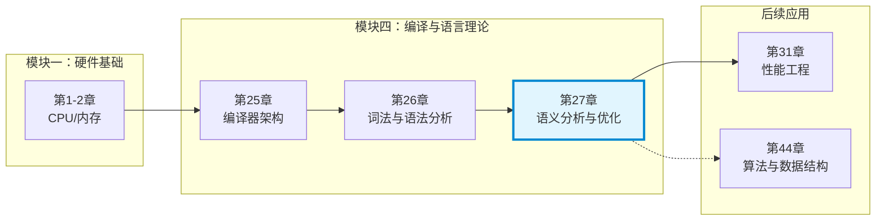
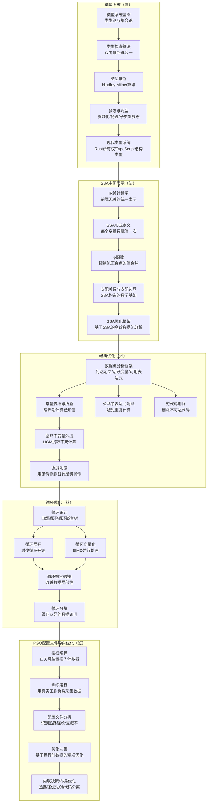
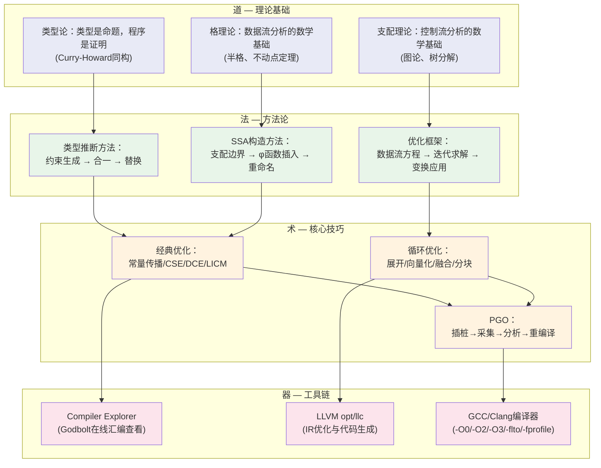

# 第27章 语义分析与优化 — 章节概览

## 为什么这一章重要

想象两个程序员写出了功能完全相同的程序，一个运行速度是另一个的10倍。代码逻辑一模一样，唯一的区别是——快的那个经过了编译器的深度优化。这不是偶然。现代编译器的优化能力，往往比手写汇编还要出色。GCC和Clang在启用`-O3`后生成的机器码，经常能让资深系统程序员自叹不如。

让我们看一组真实数据来感受编译器优化的威力：

| 优化级别 | 典型性能提升 | 编译时间增加 | 代码体积变化 |
|---------|------------|------------|------------|
| `-O0` → `-O1` | 20%-50% | +5% | 略增 |
| `-O1` → `-O2` | 10%-30% | +15% | 增加10%-20% |
| `-O2` → `-O3` | 5%-15% | +30% | 增加20%-40% |
| `-O3` + PGO | 再增10%-30% | +50%（含训练） | 基本不变 |
| `-O3` + PGO + LTO | 再增5%-15% | +100% | 可能减少 |

但编译器优化不是魔法。它建立在一套严密的理论框架之上：**类型系统保证语义正确性，中间表示（IR）提供统一的优化舞台，数据流分析提供精确的程序洞察，循环优化榨取硬件的并行能力，配置文件导向优化（PGO）则用真实运行数据指导最终决策**。这五根支柱共同构成了现代编译器优化的完整体系。

更深层地说，这一章揭示了一个贯穿计算机科学的核心思想：**抽象的力量**。类型系统用类型约束消除一类错误；SSA形式用不变量简化数据流分析；常量传播和死代码消除用静态推理替代动态计算；向量化用单条指令表达循环语义。每一次抽象，都是在更高的层次上消除复杂性——这正是软件工程的本质。

本章是"编译与语言理论"模块的收官之作。第25章搭建了编译器的宏观架构，第26章打通了从源代码到语法树的前端通道，本章则深入编译器的"大脑"——语义分析和优化器，揭示编译器如何"理解"代码并让代码跑得更快。学完这一章，你将完成从"能写代码"到"能写出编译器友好的高性能代码"的认知跃迁。

## 本章在全书中的位置

本章属于**模块四：编译与语言理论**（第25-27章），是该模块的第三章也是最后一章。从全书知识体系来看：

本章的输出将直接影响你对后续章节的理解：

- **第31章 性能工程**：编译器优化是性能工程的重要手段，理解优化原理才能做出正确的性能调优决策
- **第44章 算法与数据结构**：SSA构造中的支配树算法、数据流分析中的格理论，都是高级数据结构的典型应用
- **第19章 程序分析与验证**（如有）：本章的数据流分析技术是程序静态分析的理论基础

## 本章学习目标

完成本章学习后，你将能够：

1. **理解类型系统的本质**：掌握类型系统的理论基础（子类型、多态、类型推断），理解 Hindley-Milner 类型推断算法的工作原理，能够分析 TypeScript、Rust、Haskell 等语言的类型系统设计哲学及其对性能和安全性的影响
2. **掌握 SSA 中间表示**：理解 SSA（Static Single Assignment）形式的定义、构造方法（基于支配边界）和关键特性（φ 函数），能够看懂 LLVM IR 和 GCC GIMPLE 中的 SSA 表示，理解 SSA 如何简化数据流分析和优化
3. **精通经典编译优化**：系统掌握常量传播、常量折叠、公共子表达式消除（CSE）、死代码消除（DCE）、循环不变量外提（LICM）、强度削减等核心优化技术，理解每种优化的前提条件、实现方法和适用场景
4. **深入理解循环优化**：掌握循环展开（Loop Unrolling）、循环向量化（Loop Vectorization）、循环融合（Loop Fusion）、循环分块（Loop Tiling）等关键优化，理解 SIMD 指令集（SSE/AVX/NEON）与向量化的关系，能够在实际代码中预测和验证循环优化的效果
5. **理解 PGO 的工程价值**：掌握 Profile-Guided Optimization 的完整工作流程（插桩→采集→分析→优化），理解 PGO 如何弥补静态分析的局限，了解 PGO 在 Clang/GCC/MSVC 中的实现差异和实际性能收益
6. **能够阅读和分析编译器输出**：使用 Compiler Explorer（Godbolt）、`-S`、`-emit-llvm` 等工具查看编译器生成的汇编/IR，诊断优化是否生效、分析性能瓶颈

## 核心概念速览

在深入学习之前，先对本章涉及的核心概念建立初步印象。这些概念将在后续各节中详细展开：

| 概念 | 一句话定义 | 属于哪个模块 | 重要程度 |
|------|-----------|------------|---------|
| 类型系统 | 一组规则，为程序中每个表达式分配或检查类型 | 类型系统 | ★★★★★ |
| Hindley-Milner推断 | 无需类型标注，自动推导表达式类型的算法 | 类型系统 | ★★★★☆ |
| SSA（静态单赋值） | 每个变量只被赋值一次的中间表示形式 | SSA | ★★★★★ |
| φ函数（phi function） | 在控制流汇合点合并不同路径上的变量值 | SSA | ★★★★★ |
| 支配边界 | 决定φ函数插入位置的数学概念 | SSA | ★★★★☆ |
| 数据流分析 | 在程序的所有可能执行路径上追踪信息流动的框架 | 经典优化 | ★★★★★ |
| 常量传播 | 编译期确定变量值并替换引用 | 经典优化 | ★★★★☆ |
| 死代码消除 | 删除永远不会被执行或结果不会被使用的代码 | 经典优化 | ★★★★☆ |
| 循环展开 | 将循环体复制多份以减少循环控制开销 | 循环优化 | ★★★★☆ |
| 循环向量化 | 将标量操作转换为SIMD向量操作 | 循环优化 | ★★★★★ |
| PGO | 用真实运行数据指导编译器优化决策 | PGO | ★★★★☆ |

## 知识架构总览

## 前置知识

本章内容建立在以下知识基础之上。如果对这些概念不熟悉，建议先回顾对应章节：

| 知识领域 | 具体要求 | 对应章节 | 重要程度 |
|----------|---------|---------|---------|
| 编译器架构 | 理解前端/中端/后端的职责划分，了解中间表示（IR）的概念 | 第25章 | ★★★ |
| 词法与语法分析 | 能够区分词法分析和语法分析的产物，理解AST的结构 | 第26章 | ★★☆ |
| CPU架构 | 理解指令流水线、缓存层次、SIMD指令集（SSE/AVX） | 第01章 | ★★★ |
| 内存系统 | 理解缓存行、缓存局部性、内存访问模式对性能的影响 | 第02章 | ★★☆ |
| 数据结构与算法 | 理解图的遍历（支配树）、集合运算、哈希表 | 第44章 | ★★☆ |
| 进程与线程 | 理解并发执行模型，了解JIT与AOT的区别 | 第04章 | ★☆☆ |

> **提示**：即使没有完整的前置知识，也可以先阅读本章的类型系统部分（27.1）和 SSA 部分（27.2），建立基本概念后再回头补充。循环优化和 PGO 部分对 CPU 架构和内存系统的理解要求较高，建议先回顾第1章和第2章的相关内容。

## 道法术器：本章的知识层次

本章严格遵循"道→法→术→器"的四层递进结构，每一层都建立在上一层的理解之上：

理解这个层次结构很重要：**道是根基**（类型论和格理论是几十年不变的数学工具），**法是桥梁**（将理论转化为可执行的算法），**术是应用**（具体的优化技术），**器是落地**（用工具验证和实践）。跳过"道"直接学"术"，你只能照搬；理解了"道"，你才能在新场景下创造性地应用。

## 学习路径

## 预计学习时间

| 内容模块 | 阅读理解 | 动手实践 | 合计 | 难度 |
|---------|---------|---------|------|------|
| **类型系统与推断** | 2h | 1h | 3h | ★★★★ |
| **SSA中间表示** | 1.5h | 1.5h | 3h | ★★★★ |
| **经典编译优化** | 2h | 1.5h | 3.5h | ★★★☆ |
| **循环优化** | 1.5h | 1.5h | 3h | ★★★★ |
| **PGO配置文件导向优化** | 1h | 1.5h | 2.5h | ★★★☆ |
| **Compiler Explorer实战** | 0.5h | 1h | 1.5h | ★★☆☆ |
| **本章小结** | 0.5h | — | 0.5h | ★☆☆☆ |
| **总计** | **9h** | **8.5h** | **17.5h** | — |

> **零基础读者**：建议预留22小时，包含补充前置知识（CPU架构、数据结构）的时间。
> **有编译器经验的开发者**：可跳过类型系统基础和SSA构造细节，重点关注循环优化和PGO，预计8-10小时。
> **后端开发工程师（补课型）**：重点看SSA和经典优化，理解JVM/GraalVM的优化原理，预计6-8小时。
> **性能工程师**：直接看循环优化和PGO，配合Compiler Explorer验证，预计5-7小时。

## 核心问题清单

在学习本章之前，带着以下问题阅读效果更佳。每个问题都对应本章的一个核心知识点：

### 基础问题（入门）
1. 类型系统到底在做什么？为什么说"类型就是约束"？没有类型系统的语言（如早期JavaScript）会遇到什么问题？
2. SSA 中的"静态单赋值"是什么意思？为什么每个变量只赋值一次会让优化变得更简单？
3. 常量传播和常量折叠有什么区别？编译器在什么时机做这些优化？

### 进阶问题（理解）
4. φ 函数（phi function）解决了什么问题？它在控制流汇合点如何工作？
5. 循环向量化为什么能大幅提升性能？它对代码有什么约束条件（数据对齐、依赖关系、尾部处理）？
6. PGO 为什么比传统的 `-O3` 优化更有效？静态分析的局限在哪里？

### 深度问题（精通）
7. Hindley-Milner 类型推断算法的合一（unification）过程是如何工作的？它的时间复杂度是多少？
8. 支配边界（dominance frontier）的数学定义是什么？如何用它来插入φ函数以构造SSA形式？
9. 为什么说"优化不改变程序语义"是编译器优化的铁律？有哪些看似安全实则会改变语义的"优化"？

> **自测建议**：如果你能轻松回答基础问题中的2个以上，说明你有一定的编译基础，可以适当加快前两个模块的节奏。如果基础问题都觉得陌生，建议先花1小时快速浏览第25章和第26章的核心概念。

## 章节文件导航

本章内容分为五大模块，外加实战练习和小结。每个文件都可以独立阅读，但建议按以下顺序学习以获得最佳效果：

### 类型系统与类型推断模块

| 文件 | 核心内容 | 关键概念 | 预计用时 |
|------|---------|---------|---------|
| `理论基础/01-类型的本质` | 类型的定义、类型系统的分类（强/弱/静态/动态）、子类型关系 | 类型安全、类型等价、鸭子类型 | 45min |
| `理论基础/02-类型推断算法` | Hindley-Milner类型推断、合一算法、双向类型检查 | 类型变量、约束生成、W算法 | 60min |
| `理论基础/03-多态与泛型系统` | 参数化多态、特设多态、子类型多态、有界量化 | 泛型擦除、特化、monomorphization | 40min |
| `理论基础/04-现代类型系统设计` | Rust所有权系统、TypeScript结构类型、依赖类型入门 | 所有权、借用、生命周期、phantom type | 50min |

### SSA中间表示模块

| 文件 | 核心内容 | 关键概念 | 预计用时 |
|------|---------|---------|---------|
| `理论基础/05-IR设计哲学` | 为什么需要中间表示、三地址码、SSA的诞生背景 | IR层级、图灵完备IR、portability | 30min |
| `核心技巧/01-SSA形式与φ函数` | SSA的严格定义、φ函数的语义与插入规则 | 严格赋值、汇聚点、值合并 | 40min |
| `核心技巧/02-支配关系与SSA构造` | 支配树、支配边界、基于支配边界的φ函数插入算法 | dominator tree、DF集合、增量构造 | 50min |
| `核心技巧/03-SSA消解与优化框架` | 从SSA回到普通IR、基于SSA的高效数据流分析 | 临界边分裂、变量重命名、稀疏条件常量传播 | 30min |

### 经典编译优化模块

| 文件 | 核心内容 | 关键概念 | 预计用时 |
|------|---------|---------|---------|
| `核心技巧/04-数据流分析框架` | 数据流方程、迭代算法、到达定义、活跃变量、可用表达式 | 前向/后向分析、格理论、不动点 | 45min |
| `核心技巧/05-常量传播与折叠` | 编译期常量求值、条件常量传播、部分求值 | 常量折叠、传播范围、间接常量传播 | 25min |
| `核心技巧/06-公共子表达式消除` | 精确CSE、部分冗余消除、全局值编号 | 冗余检测、可用性、GVN | 25min |
| `核心技巧/07-死代码消除与内联` | 不可达代码删除、未使用变量消除、函数内联与代价模型 | 活跃性分析、内联阈值、代码膨胀 | 30min |
| `核心技巧/08-循环不变量外提与强度削减` | LICM的实现、循环不变量的判定、强度削减的代数基础 | 循环不变量、可移动性、归纳变量 | 35min |

### 循环优化模块

| 文件 | 核心内容 | 关键概念 | 预计用时 |
|------|---------|---------|---------|
| `核心技巧/09-循环识别与变换基础` | 自然循环识别、循环嵌套树、循环边界分析 | 回边、循环头、exit block | 25min |
| `核心技巧/10-循环展开` | 固定展开、动态展开、展开因子选择、尾部处理 | 展开收益、指令缓存压力、ILP | 25min |
| `核心技巧/11-循环向量化` | 标量到向量的转换、数据对齐、依赖分析、尾部掩码处理 | SIMD、strip mining、mask load | 35min |
| `核心技巧/12-循环融合、裂变与分块` | 数据局部性优化、cache-aware循环变换、寄存器分块 | 循环嵌套优化、tiling、interchange | 35min |

### PGO配置文件导向优化模块

| 文件 | 核心内容 | 关键概念 | 预计用时 |
|------|---------|---------|---------|
| `实战案例/01-PGO完整工作流` | 插桩编译→训练采集→配置文件分析→优化重编译的完整流程 | PGO数据、热路径、分支概率 | 25min |
| `实战案例/02-PGO优化决策详解` | 基于配置文件的内联、布局、虚拟调用优化 | 函数热度、basic block layout、devirtualization | 20min |
| `实战案例/03-Clang与GCC的PGO实现` | LLVM PGO与GCC PGO的工具链对比与实战 | `-fprofile-instr-use`、`-fprofile-generate`、LTO集成 | 20min |

### 辅助模块

| 文件 | 核心内容 | 建议用时 |
|------|---------|---------|
| `04-常见误区.md` | 8个关于编译优化和类型系统的常见错误认知与纠正方法 | 20min |
| `05-练习方法.md` | 5个循序渐进的实践练习：手写类型推断、构造SSA、在Compiler Explorer中验证优化、实现简单常量传播、PGO对比实验 | 60min |
| `06-本章小结.md` | 核心知识点回顾、优化技术速查表、进一步学习建议与推荐资源 | 15min |

## 本章涉及的工具清单

在学习和实践本章内容时，你将使用以下工具。建议提前安装或熟悉：

| 工具 | 用途 | 获取方式 | 必要性 |
|------|------|---------|--------|
| **Compiler Explorer (Godbolt)** | 在线查看编译器生成的汇编/IR，对比不同优化级别 | https://godbolt.org | ★★★★★ |
| **LLVM opt** | 对LLVM IR进行优化，观察单个优化pass的效果 | `apt install llvm` 或随Clang安装 | ★★★★☆ |
| **LLVM llc** | 将LLVM IR编译为汇编代码 | 随LLVM安装 | ★★★★☆ |
| **Clang** | 支持丰富的优化选项和诊断报告 | `apt install clang` | ★★★★☆ |
| **GCC** | 另一个主流编译器，PGO实现与Clang不同 | `apt install gcc` | ★★★☆☆ |
| **`-Rpass`系列标志** | 查看编译器优化报告（哪些优化生效/未生效） | Clang内置 | ★★★★☆ |
| **`-S -emit-llvm`** | 生成LLVM IR文本，便于阅读和分析 | Clang/LLVM内置 | ★★★★☆ |
| **perf / VTune** | 采集运行时性能数据，验证优化效果 | Linux/Intel工具 | ★★★☆☆ |

> **最小环境**：如果你只安装一个工具，选择Compiler Explorer——它零安装、零配置，打开浏览器就能用。如果需要本地实验，安装LLVM工具链（`apt install llvm clang`）就够了。

## 适合谁读

| 读者类型 | 建议阅读方式 | 预期收获 |
|---------|------------|---------|
| **编译原理初学者** | 按顺序完整阅读，重点理解类型系统和SSA | 建立编译优化的完整知识框架 |
| **后端开发工程师** | 快速过类型系统，重点看经典优化和循环优化 | 理解JVM/GraalVM的优化原理，写出对编译器友好的代码 |
| **性能工程师** | 重点看循环优化和PGO，配合Compiler Explorer实操 | 掌握编译器级别的性能调优方法 |
| **语言设计者** | 全部精读，重点关注类型系统设计和SSA | 理解类型系统和IR设计对优化能力的影响 |
| **系统架构师** | 浏览全章，重点关注PGO和现代类型系统 | 理解编译优化在大规模系统中的工程价值 |
| **Rust/Go开发者** | 重点看所有权类型系统和循环向量化 | 理解语言特性如何影响生成代码的质量 |
| **前端/JS开发者** | 重点看类型系统（理解TypeScript设计）和PGO（V8优化） | 理解V8 JIT编译器如何优化JavaScript |
| **游戏开发者** | 重点看循环向量化、循环分块、PGO | 理解引擎底层的性能优化策略 |

## 学完能做什么

完成本章后，你将具备以下实际能力：

1. **能够解释**：为什么类型安全的语言（Rust、Haskell）往往性能更好——类型信息为编译器优化提供了更多确定性
2. **能够阅读**：使用 Compiler Explorer 查看编译器生成的汇编代码，识别循环展开、向量化、常量折叠等优化是否生效
3. **能够分析**：判断一段代码是否对编译器友好——是否存在阻碍优化的别名（aliasing）、不可预测的分支、循环依赖等问题
4. **能够应用**：在实际项目中启用 PGO，通过插桩→训练→重编译的流程获得 10%-30% 的性能提升
5. **能够诊断**：分析编译器优化报告（`-Rpass`、`opt-viewer`），理解为什么某个优化没有被触发，以及如何调整代码使其生效
6. **能够设计**：在设计DSL或内部语言时，选择合适的IR形式（SSA/Sea-of-Nodes）和类型系统，为后续优化打下基础
7. **能够验证**：通过对比 `-O0`、`-O2`、`-O3`、PGO 等不同优化级别的编译产物，量化优化的实际收益

## 实战项目预告

本章不仅是理论学习，更包含多个可动手实践的项目。以下是学完本章后你能完成的实战项目：

### 项目一：Compiler Explorer 优化探索
在 Godbolt 上编写简单的C/C++代码，逐步调整优化级别（`-O0` → `-O1` → `-O2` → `-O3`），观察汇编输出的变化。识别哪些优化生效了（常量折叠、循环展开、向量化），哪些没有（并分析原因）。

### 项目二：手写简单常量传播
用Python或C实现一个简单的常量传播优化器：输入一段三地址码，输出优化后的三地址码。这个练习将帮助你深入理解数据流分析的工作原理。

### 项目三：PGO 性能对比实验
选择一个实际项目（如数据库查询引擎、图像处理库），分别用 `-O2` 和 `-O2 + PGO` 编译，用基准测试对比性能差异。分析 PGO 在哪些场景下收益最大。

### 项目四：SSA构造可视化
实现一个简单的SSA构造器：输入控制流图，输出SSA形式的IR。在过程中可视化支配树和φ函数的插入位置，理解支配边界算法的实际工作过程。

> **提示**：这些项目在 `05-练习方法.md` 中有详细的步骤指导。建议学完对应模块后立即动手实践，理论+实践的学习效果远优于纯阅读。

## 学习建议

1. **不要跳过理论**：类型系统和格理论看起来"没用"，但它们是理解后续所有优化技术的基础。花1小时理解格理论，可以节省5小时的"为什么这样做"的困惑。

2. **善用 Compiler Explorer**：这是本章最重要的学习工具。每学一个优化技术，就去 Godbolt 上写一段代码验证。看到汇编输出的变化比读十页文字更有效。

3. **关注"为什么不能优化"**：编译器优化的难点不在于"能优化什么"，而在于"为什么不能优化某些看似安全的变换"。理解优化的限制比记住优化技术更有价值。

4. **建立直觉**：读完每节后，尝试在脑中"手动模拟"编译器的优化过程。比如看到一段代码，先想"编译器会怎么做"，再用 `-S` 验证。

5. **记录你的发现**：用Compiler Explorer做的实验、手动模拟的结果、发现的有趣现象，都记下来。这些笔记在日后工作中会非常有价值。
