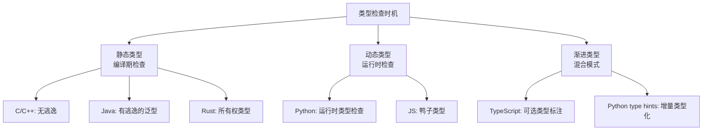
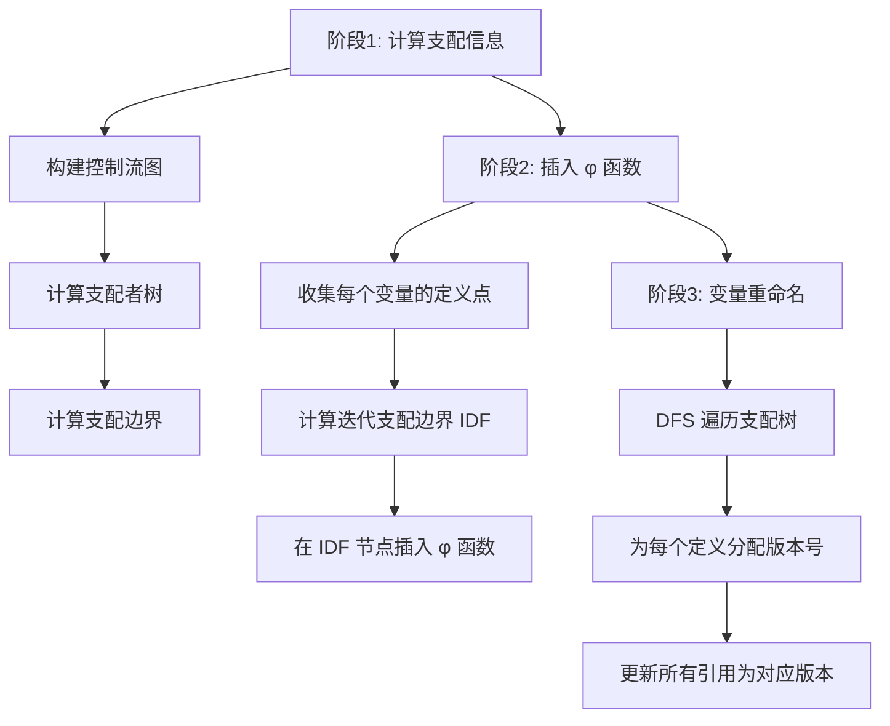

# 27.1 理论基础：语义分析与优化

## 27.1.1 语义分析的本质与定位

### 什么是语义分析

编译器的工作可以概括为三个递进阶段：**理解结构 → 理解含义 → 生成代码**。词法分析和语法分析解决的是"这段代码的结构是什么"，而语义分析要回答一个更深层的问题："这段代码在做什么，它有没有意义？"


语义分析处于编译器前端的最后阶段，它接收语法分析器产出的抽象语法树（AST），产出一棵附加了丰富语义信息的**标注树（Annotated AST）**。这个过程中完成的工作包括：

- **类型检查**：验证每个表达式的类型是否符合语言的类型规则
- **名称解析**：将每个标识符引用绑定到其声明处
- **作用域管理**：维护嵌套的声明-使用关系
- **语义约束验证**：检查 break 是否在循环内、return 类型是否匹配等
- **符号表构建**：为后续阶段提供完整的声明信息

### 语义分析为什么重要

没有语义分析的编译器就像一个只认识单词但不懂语法的翻译——它能逐字翻译，但无法发现句子的逻辑错误。考虑以下代码：

```c
int x = "hello";        // 类型不匹配
if (x + 1) { ... }      // 条件表达式类型错误
printf("%d", x);         // 格式化字符串不匹配
```

这些代码在语法上完全合法——`int x = "hello"` 符合赋值语句的语法模式。但语义上它是错误的。语义分析的任务就是捕获这类问题。

更关键的是，语义分析不仅用于**检查错误**，它产出的信息是后续所有优化的基础。没有类型信息，编译器无法决定一个加法是整数加法还是浮点加法；没有精确的名称解析，编译器无法判断两个同名变量是否指向同一个对象。可以说，**语义分析的质量直接决定了优化器的能力上限**。

### 语义分析在不同语言中的角色差异

不同编程语言对语义分析的依赖程度差异巨大：

| 语言类别 | 代表语言 | 语义分析的深度 | 特点 |
|---------|---------|--------------|------|
| 静态强类型 | Rust, Haskell, Java | 极深 | 编译期捕获几乎所有类型错误，类型信息驱动优化 |
| 静态弱类型 | C, C++ | 深但有漏洞 | 大量未定义行为绕过类型系统，需要程序员自觉 |
| 动态强类型 | Python, Ruby | 运行时为主 | 编译期只做语法检查，类型检查推迟到运行时 |
| 动态弱类型 | JavaScript, Perl | 极少 | 隐式类型转换泛滥，类型信息几乎不用于优化 |

这种差异直接影响了语言的性能上限和安全性。静态强类型语言的编译器拥有最多的语义信息，因此能做最激进的优化——Rust 和 Haskell 的零成本抽象就建立在此基础上。

---

## 27.1.2 类型系统：语义分析的核心支柱

### 类型的本质：一种约束系统

类型（Type）的本质是一组**值的集合**加上一组**允许的操作**。`Int` 类型表示所有整数值的集合，以及整数上允许的加减乘除等操作。类型系统是一套规则，用于决定程序中的每个表达式属于哪个类型。

这种"类型即约束"的观点来自类型论（Type Theory），由 Bertrand Russell 在 20 世纪初为解决集合论悖论而提出。在编程语言中，类型约束实现了三个核心目标：

1. **安全性（Safety）**：防止程序执行无意义的操作。类型系统保证"良类型的程序不会出错"（Well-typed programs cannot go wrong），这是 Robin Milner 的经典定理。
2. **文档性（Documentation）**：类型标注是程序意图的精确描述。`function transfer(from: Account, to: Account, amount: Decimal): Receipt` 比 `function transfer(a, b, c)` 表达了多得多的信息。
3. **优化性（Optimization）**：类型信息帮助编译器生成更高效的代码。知道一个变量是 `Int` 而不是 `Object`，编译器可以直接生成整数运算指令而无需装箱/拆箱。

### 类型系统的分类体系

类型系统可以从多个维度进行分类，理解这些分类有助于把握不同语言的设计哲学：

**按检查时机分类**：

- **静态类型（Static Typing）**：在编译期完成所有类型检查。C、Java、Rust、Go、Haskell 属于此类。优点是能提前发现错误、生成更高效的代码；缺点是语法冗余度较高。
- **动态类型（Dynamic Typing）**：在运行时进行类型检查。Python、Ruby、JavaScript、Lua 属于此类。优点是灵活性高、代码简洁；缺点是错误发现延迟、运行时开销大。
- **渐进类型（Gradual Typing）**：介于两者之间，允许程序中部分区域有类型标注，部分区域使用动态类型。TypeScript、Python 的 type hints、Dart 属于此类。



**按类型等价性分类**：

- **名义类型（Nominal Typing）**：两个类型相等当且仅当它们有相同的名字。Java、C++ 的类类型是名义的——即使两个类结构完全一样，名字不同就不相等。这提供了精确的控制，但降低了灵活性。
- **结构类型（Structural Typing）**：两个类型相等当且仅当它们的结构相同。Go 的接口和 TypeScript 的类型兼容性是结构化的——任何拥有正确方法签名的类型都自动实现了对应接口。这更灵活但可能导致意外的类型兼容。

```go
// Go: 结构类型 —— 鸭子类型的精神
type Writer interface {
    Write([]byte) (int, error)
}

// bytes.Buffer 没有显式声明实现了 Writer
// 但因为它有 Write([]byte)(int, error) 方法，所以自动满足 Writer
var w Writer = &amp;bytes.Buffer{}  // OK：结构匹配
```

**按类型安全性分类**：

- **强类型（Strongly Typed）**：不允许隐式类型转换，不同类型之间不能直接运算。Python 和 Haskell 是强类型的——`"hello" + 1` 会直接报错。
- **弱类型（Weakly Typed）**：允许隐式类型转换，不同类型之间可以"自动"转换。C 和 JavaScript 是弱类型的——`"hello" + 1` 在 JS 中返回 `"hello1"`（数字被隐式转换为字符串）。

注意：强/弱和静态/动态是正交的概念。Python 是动态强类型（运行时检查，但不允许隐式转换），C 是静态弱类型（编译期检查，但允许大量隐式转换）。

### 类型检查的理论基础

类型检查的理论核心是**类型规则（Type Rules）**，用自然演绎的推理规则形式化表达。每条规则的形式为：

前提₁  前提₂  ...  前提ₙ
──────────────────────────
        结论

例如，函数应用的类型规则：

Γ ⊢ e₁ : T₁ → T₂    Γ ⊢ e₂ : T₁
────────────────────────────────────
          Γ ⊢ e₁(e₂) : T₂

其中 Γ 是类型环境（Typing Context），存储变量到类型的映射。这条规则读作："如果在环境 Γ 下，e₁ 的类型是 T₁→T₂，e₂ 的类型是 T₁，那么 e₁(e₂) 的类型是 T₂。"

**子类型规则（Subtyping）**也是类型系统的核心。如果类型 S 是类型 T 的子类型（S <: T），那么 S 类型的值可以在需要 T 类型的上下文中使用：

Γ ⊢ e : S    S <: T
─────────────────────
     Γ ⊢ e : T

子类型的典型例子：在 Java 中，`String` 是 `Object` 的子类型，因此可以将 `String` 传递给接受 `Object` 参数的方法。

协变与逆变是子类型规则的两个重要变体：

| 变换方向 | 规则 | 典型场景 |
|---------|------|---------|
| 协变（Covariance） | `S <: T → C[S] <: C[T]` | 数组类型：`String[] <: Object[]` |
| 逆变（Contravariance） | `S <: T → C[T] <: C[S]` | 函数参数：若 `T <: S`，则 `(S→R) <: (T→R)` |
| 不变（Invariance） | `C[S]` 与 `C[T]` 无子类型关系 | Java 的 `List<String>` ≠ `List<Object>` |

### Hindley-Milner 类型推断

类型推断（Type Inference）是类型系统最精妙的成就之一——让编译器自动推导出所有变量的类型，程序员无需编写任何类型标注。Hindley-Milner（HM）类型系统是 ML、Haskell 等函数式语言的理论基础，由 Roger Hindley（1969）和 Robin Milner（1978）独立提出。

HM 系统的核心概念：

**类型变量（Type Variable）**：表示未知类型，通常用 α, β, γ 等表示。在推断过程中，类型变量最终会被替换为具体类型。

**多态类型（Polymorphic Type）**：用全称量词（∀）绑定类型变量，表示"对于所有类型 α，都成立"。例如恒等函数的类型是 `∀α. α → α`——对任意类型 α，它接受一个 α 值并返回一个 α 值。

**合一算法（Unification Algorithm）**：找到一个替换 θ，使得两个类型在 θ 下变得相同。这是类型推断的核心操作：

```python
def unify(t1, t2, subst):
    """合一算法：找到使 t1 和 t2 相等的最小替换"""
    t1 = apply_subst(subst, t1)
    t2 = apply_subst(subst, t2)
    
    if t1 == t2:
        return subst
    
    if is_type_var(t1):
        if occurs_in(t1, t2):
            raise TypeError(f"无限类型：{t1} 出现在 {t2} 中")
        return extend(subst, t1, t2)
    
    if is_type_var(t2):
        if occurs_in(t2, t1):
            raise TypeError(f"无限类型：{t2} 出现在 {t1} 中")
        return extend(subst, t2, t1)
    
    if is_constructor(t1) and is_constructor(t2):
        if t1.name != t2.name or len(t1.args) != len(t2.args):
            raise TypeError(f"类型不匹配：{t1} vs {t2}")
        for a1, a2 in zip(t1.args, t2.args):
            subst = unify(a1, a2, subst)
        return subst
    
    raise TypeError(f"无法合一：{t1} 和 {t2}")
```

出现检查（Occurs Check）防止构造无限类型——例如不能让 α = List(α)，因为这会导致无限展开。

**Algorithm W**：HM 类型推断的经典算法，通过一次对 AST 的遍历即可推导出所有表达式的类型。它结合了类型变量创建、约束生成、合一和泛化四个操作：

```python
def algorithm_w(env, expr):
    """Hindley-Milner 类型推断算法 W"""
    match expr:
        case Var(name):
            # 查找变量的类型方案并实例化
            scheme = lookup(env, name)
            return fresh_instance(scheme)
        
        case Lam(param, body):
            # 为参数创建新的类型变量
            beta = new_type_var()
            env_prime = extend(env, param, Scheme(beta))
            (subst, tau) = algorithm_w(env_prime, body)
            return (subst, apply_subst(subst, beta) → tau)
        
        case App(e1, e2):
            (s1, tau1) = algorithm_w(env, e1)
            (s2, tau2) = algorithm_w(apply_subst(s1, env), e2)
            beta = new_type_var()
            s3 = unify(apply_subst(s2, tau1), tau2 → beta)
            return (s3 ∘ s2 ∘ s1, apply_subst(s3, beta))
        
        case Let(name, e1, e2):
            (s1, tau1) = algorithm_w(env, e1)
            env_prime = apply_subst(s1, env)
            # 泛化：将自由类型变量用全称量词绑定
            scheme = generalize(env_prime, tau1)
            env_prime_prime = extend(env_prime, name, scheme)
            (s2, tau2) = algorithm_w(env_prime_prime, e2)
            return (s2 ∘ s1, tau2)
```

**Let-多态（Let-Polymorphism）** 是 HM 系统的关键特性。在 `let f = ... in f 1 + f "hello"` 中，`f` 在 `let` 绑定中被泛化为 `∀α. α → α`，因此 `f 1` 和 `f "hello"` 可以使用不同的类型实例化。但如果 `f` 是通过 `λ` 表达式定义的（如 `(\f -> f 1 + f "hello") (\x -> x)`），则不会被泛化，合一会失败——因为 `f` 只能有一个具体类型。这个区分对理解 ML/Haskell 的行为至关重要。

### 类型系统与编译优化的关系

类型信息对编译器优化至关重要，体现在以下几个层面：

1. **方法内联决策**：知道调用目标的精确类型，编译器可以将虚方法调用（Virtual Call）转换为直接调用，甚至直接内联。Java 的 HotSpot JIT 通过类型推测（Type Profiling）实现这一点。

2. **内存布局优化**：知道结构体的字段类型和对齐要求，编译器可以生成更紧凑的内存布局和更高效的访问指令。Rust 的 `repr(C)` 和 `repr(packed)` 就是对内存布局的显式控制。

3. **向量化决策**：知道循环变量的精确类型，编译器才能决定是否以及如何使用 SIMD 指令。C++ 的 `std::valarray` 比 `std::vector` 更容易被向量化，正是因为它的类型语义限制了指针别名。

4. **消除冗余检查**：在动态类型语言中，每次运算都需要检查操作数的类型。JIT 编译器通过类型推测消除这些检查——如果一个循环 99% 的时间都处理 `int`，JIT 可以生成专门的 `int` 版本代码，只在类型不匹配时回退到通用路径。

---

## 27.1.3 数据流分析：优化的数学基础

### 为什么需要数据流分析

编译器优化的核心问题是：**在不改变程序语义的前提下，找到并利用程序的冗余**。要回答"哪些计算是冗余的"，编译器需要理解程序中数据的流动方式——哪个变量在哪些程序点有定义，哪些定义能到达哪些使用点，哪些变量在哪些程序点是活跃的。

数据流分析（Data Flow Analysis）正是解决这类问题的统一框架。它通过在控制流图上迭代求解一组方程，计算每个程序点上的程序性质。

### 格理论：数据流分析的数学骨架

数据流分析建立在**格理论（Lattice Theory）**之上。格是一个偏序集（Partially Ordered Set），其中任意两个元素都有最小上界和最大下界。

**格的形式化定义**：一个格 (L, ⊑) 满足：

- **自反性**：∀x. x ⊑ x
- **反对称性**：x ⊑ y ∧ y ⊑ x → x = y
- **传递性**：x ⊑ y ∧ y ⊑ z → x ⊑ z
- **最小上界（Join / Least Upper Bound）**：x ⊔ y = LUB(x, y)
- **最大下界（Meet / Greatest Lower Bound）**：x ⊓ y = GLB(x, y)

在编译器数据流分析中，常用的格包括：

| 格类型 | 元素 | 偏序关系 | 合并操作 | 典型分析 |
|-------|------|---------|---------|---------|
| 幂集格 | 变量子集 | ⊆ | ∪ (并集) | 活跃变量分析 |
| 常量格 | ⊤, 常量值, ⊥ | 自上而下：⊤→常量→⊥ | ⊔（取最具体值） | 常量传播 |
| 布尔格 | true, false, ⊥ | false ⊑ true ⊑ ⊤ | 保守合并 | 条件常量传播 |

**常量传播的格**特别值得深入理解：

        ⊤ (未确定/未计算)
       / | \
      /  |  \
    c₁  c₂  c₃  ...  (各种常量值)
      \  |  /
       \ | /
        ⊥ (非常量/冲突)

- `⊤` 表示"还没有信息"——分析刚开始时所有变量都处于 ⊤ 状态
- 常量值是中间层——变量被确定为某个具体常量
- `⊥` 表示"不是常量"——变量在不同路径上有不同的值，或者被重新赋值

当两个路径汇合时，如果两条路径上变量的值不同（一个 `3`，一个 `5`），则合并结果为 `⊥`（非常量）。当两个 ⊤ 合并时，结果仍然是 ⊤。这保证了分析的**保守性**——宁可漏报（把非常量判断为常量的情况不会发生），不可误报（把常量判断为非常量是安全的）。

### 不动点迭代：数据流分析的求解方法

数据流分析的核心是一个迭代求解过程：不断应用传递函数更新每个程序点的值，直到达到**不动点（Fixed Point）**——即所有值不再变化。

为什么能保证终止？关键在于**格的高度有限**。每次迭代至少有一个变量的值在格中"向上移动"（从 ⊥ 到某个常量，或从 ⊤ 到 ⊥），而格的高度是有限的，因此迭代次数有上界。

具体分析的时间复杂度为 **O(n² × h)**，其中 n 是程序中的变量数/表达式数，h 是格的高度。对于集合格，h = n + 2；对于常量格，h = 常量数 + 2。

### 三种经典数据流分析

**活跃变量分析（Liveness Analysis）**：确定在程序的每个点上，哪些变量的值可能在未来被使用。这是**反向分析**——信息从程序出口向入口传播。

活跃变量分析是**寄存器分配**的基础：只有活跃的变量才需要保留在寄存器中，不活跃的变量占用的寄存器可以释放。

数据流方程（反向）：
  IN[B]  = USE[B] ∪ (OUT[B] \ DEF[B])
  OUT[B] = ∪ IN[Succ(B)]     // Succ(B) 是 B 的所有后继

其中：
- `DEF[B]`：在 B 中被定义（赋值）的变量集合
- `USE[B]`：在 B 中被使用（引用）且在使用前未被定义的变量集合

例：
  a = b + c    // USE={b,c}, DEF={a}
  d = a + e    // USE={a,e}, DEF={d}
  
  这个块的 IN = {b,c,e,d}  （a 在第一个语句使用前是活跃的）

**到达定值分析（Reaching Definitions）**：确定在程序的每个点上，哪些变量的定义可能到达该点而未被覆盖。这是**正向分析**——信息从程序入口向出口传播。

到达定值分析是**常量传播**和**死代码消除**的基础：如果一个变量在某个程序点只有一个"到达的定义"，且该定义是常量赋值，就可以进行常量替换。

数据流方程（正向）：
  OUT[B] = GEN[B] ∪ (IN[B] \ KILL[B])
  IN[B]  = ∪ OUT[Pred(B)]     // Pred(B) 是 B 的所有前驱

其中：
- `GEN[B]`：B 中产生的定义集合（所有赋值语句）
- `KILL[B]`：B 中杀死的定义集合（对同一变量的其他定义）

**可用表达式分析（Available Expressions）**：确定在程序的每个点上，哪些表达式已经被计算过且其操作数未被修改。这是公共子表达式消除（CSE）的基础。

数据流方程（正向，使用交集）：
  OUT[B] = GEN[B] ∪ (IN[B] \ KILL[B])
  IN[B]  = ∩ OUT[Pred(B)]     // 注意：用交集 ∩，不是并集 ∪

与到达定值分析的关键区别在于合并操作：可用表达式使用**交集（∩）**而非并集（∪）。这是因为一个表达式只有在**所有**到达路径上都可用时，才真正可用。而在到达定值分析中，一个定义只要在**某条**路径上能到达，就是到达的。

### 数据流分析框架的统一视角

所有经典数据流分析都可以统一到以下框架中：

分析框架 = (L, ⊔, f₁, f₂, ..., fₙ, z)

L      = 格（值域和偏序关系）
⊔      = 合并操作（meet 或 join）
f₁..fₙ = 每个程序点的传递函数
z      = 初始元素（⊥ 或 ⊤，取决于方向）

| 分析 | 方向 | 格 | 合并 | 初始值 | 传递函数 |
|-----|------|-----|------|-------|---------|
| 活跃变量 | 反向 | 幂集 | ∪ | ∅ | (S\DEF)∪USE |
| 到达定值 | 正向 | 幂集 | ∪ | ∅ | (S\KILL)∪GEN |
| 可用表达式 | 正向 | 幂集 | ∩ | 全集 | (S\KILL)∪GEN |
| 常量传播 | 正向 | 常量格 | ⊔ | ⊤ | 根据赋值更新 |

这个统一框架的重要意义在于：**一次理解，处处适用**。掌握了格理论和不动点迭代，你就掌握了所有经典数据流分析的共同本质。后续学习新的分析技术时，只需要确定新的格、传递函数和合并操作即可。

---

## 27.1.4 SSA：现代编译器的理论基石

### SSA 的定义与核心思想

SSA（Static Single Assignment，静态单赋值）是现代编译器最重要的中间表示形式。它的核心思想极其简单：**程序中的每个变量只被赋值一次**。

```python
# 普通代码
x = 1
y = x + 2
x = 3        # x 被第二次赋值
z = x + y

# SSA 形式
x₁ = 1
y₁ = x₁ + 2
x₂ = 3
z₁ = x₂ + y₁
```

这看似简单的约束带来了深远的影响：在 SSA 形式中，**变量的定义和使用之间有直接的定义-使用链（def-use chain）**——你不需要在程序中搜索就能知道一个变量在哪里被定义、在哪里被使用。这极大简化了数据流分析和优化。

### 为什么 SSA 简化了优化

考虑常量传播这个简单优化。在普通代码中：

```c
x = 5;
y = x + 1;      // y = 6，但需要数据流分析才能确认
z = x + y;      // z = 11，但需要跨语句追踪 x 的值
x = 10;         // x 被重新赋值
w = x + y;      // w = 16，这里 x = 10
```

编译器需要进行到达定值分析才能确定每个 `x` 引用对应哪个定义。在 SSA 中：

```c
x₁ = 5;
y₁ = x₁ + 1;    // 直接知道 x₁ = 5，所以 y₁ = 6
z₁ = x₁ + y₁;   // 直接知道 x₁ = 5, y₁ = 6，所以 z₁ = 11
x₂ = 10;
w₁ = x₂ + y₁;   // 直接知道 x₂ = 10, y₁ = 6，所以 w₁ = 16
```

**每个变量只有一个定义点**——不需要数据流分析就能找到定义。常量传播变成了简单的变量替换，而不需要先做到达定值分析。

### φ 函数：控制流汇合点的值合并

SSA 的唯一障碍是控制流汇合——当两条路径合并时，同一个变量在不同路径上可能有不同的定义：

if (cond) {
    x₁ = 1;      // 路径 A
} else {
    x₂ = 2;      // 路径 B
}
y₁ = x? + 1;     // x 的值取决于从哪条路径来

φ 函数（Phi Function）解决这个问题。它在控制流汇合点放置，从不同的前驱路径中选择正确的值：

if (cond) {
    x₁ = 1;      // 路径 A
} else {
    x₂ = 2;      // 路径 B
}
x₃ = φ(x₁, x₂);  // 如果从 A 来，x₃ = x₁；如果从 B 来，x₃ = x₂
y₁ = x₃ + 1;      // 现在 y₁ = 2（1+1）或 3（2+1）

φ 函数不是实际的机器指令——它只是一个记号，指示编译器在代码生成阶段根据实际的控制流路径选择正确的值。φ 函数的参数个数等于进入该基本块的前驱个数。

### 支配关系：φ 函数插入的理论基础

φ 函数应该放在哪里？这需要**支配关系（Domination）**的概念。

**支配（Domination）**：如果从入口到节点 n 的所有路径都经过节点 d，则 d **支配** n，记为 d dom n。

**严格支配（Strict Domination）**：d 严格支配 n 如果 d dom n 且 d ≠ n。

**直接支配者（Immediate Dominator，idom）**：d 是 n 的直接支配者，如果 d 严格支配 n，且不存在 d' 使得 d 严格支配 d' 且 d' 严格支配 n。直接支配者是树形关系——每个节点（除入口外）恰好有一个直接支配者。

**支配边界（Dominance Frontier）**：节点 x 的支配边界 DF(x) 是所有满足以下条件的节点 y 的集合：x 支配 y 的某个前驱，但 x 不严格支配 y。直觉上，支配边界就是 x 的支配范围的"边界"——超过这个边界，x 的支配力就消失了。

φ 函数的插入规则基于**迭代支配边界**：一个变量 v 需要在节点 n 放置 φ 函数，当且仅当 n 在某个 v 的定义点的迭代支配边界中。这个算法的时间复杂度是线性的（在 SSA 形式下）。

### SSA 构造的完整流程

SSA 构造分为三个阶段：



**阶段一：支配信息计算**。使用 Lengauer-Tarjan 算法（时间复杂度接近线性）计算支配者树和支配边界。这是后续所有基于 SSA 的优化的基础。

**阶段二：φ 函数插入**。对每个变量 v，收集其所有定义点 defsites(v)，然后计算 iterated dominance frontier IDF(defsites(v))。IDF 中的每个节点都需要为 v 插入一个 φ 函数。

**阶段三：变量重命名**。DFS 遍历支配树，为每个变量的每次定义分配唯一版本号（x₁, x₂, ...），并更新所有引用指向正确的版本。这一步使用栈来跟踪当前作用域内的变量版本——进入支配子树时 push，退出时 pop。

### LLVM IR 中的 SSA

LLVM IR 是 SSA 形式的典型代表。看一个具体的例子：

```c
// C 代码
int foo(int a, int b) {
    int c;
    if (a > b) {
        c = a;
    } else {
        c = b;
    }
    return c;
}
```

对应的 LLVM IR：

```llvm
define i32 @foo(i32 %a, i32 %b) {
entry:
    %cmp = icmp sgt i32 %a, %b
    br i1 %cmp, label %if.then, label %if.else

if.then:
    br label %if.end

if.else:
    br label %if.end

if.end:
    ; φ 函数：根据控制流来源选择正确的值
    %c.0 = phi i32 [ %a, %if.then ], [ %b, %if.else ]
    ret i32 %c.0
}
```

注意 φ 函数的语法：`%c.0 = phi i32 [ %a, %if.then ], [ %b, %if.else ]` 表示如果从 `if.then` 来则 `%c.0 = %a`，如果从 `if.else` 来则 `%c.0 = %b`。

---

## 27.1.5 控制流分析：优化的导航地图

### 控制流图（CFG）

控制流图（Control Flow Graph, CFG）是有向图 G = (N, E)，其中 N 是基本块的集合，E 是控制流边的集合。CFG 是所有程序分析和优化的基础数据结构。

**基本块（Basic Block）**是一个最大化的指令序列，满足两个条件：
1. 只有一个入口点（第一条指令）
2. 只有一个出口点（最后一条指令是跳转/分支/返回）

基本块的识别算法：
1. 第一条指令是领导指令（leader）
2. 跳转指令的目标是领导指令
3. 跳转指令的下一条指令是领导指令
4. 函数调用后的指令是领导指令（因为调用可能不返回）

CFG 的边反映了所有可能的执行路径：
- **无条件跳转**：一条边
- **条件分支**：两条边（true 分支和 false 分支）
- **函数调用**：可能有边到被调用函数（过程间分析时）和返回点

### 支配关系的深入理解

支配关系是理解循环、SSA 构造和多种优化的关键。让我们用一个具体例子来理解：

       Entry
      /     \
     A       B
     |       |
     C   →   D
     |       |
     E   →   F
      \     /
       Exit

在这个 CFG 中：
- Entry 支配所有节点（所有路径都从 Entry 开始）
- A 和 B 都被 Entry 支配，但不互相支配
- C 被 Entry 和 A 支配
- D 被 Entry 支配（不被 A 或 B 单独支配，因为存在 Entry→B→D 的路径不经过 A）
- F 被 Entry 支配（但不被 C 或 D 单独支配）

**支配者树**将支配关系组织成树形结构——每个节点的父节点是其直接支配者。这棵树编码了"谁控制谁"的层次关系。

支配者树的一个重要推论：**如果节点 d 在支配者树中是节点 n 的祖先，那么 d 支配 n**。这提供了一种快速判断支配关系的方法。

### 自然循环的识别

循环是程序中最关键的优化目标——程序的大部分执行时间通常花在循环中（"90/10 法则"）。自然循环（Natural Loop）是编译器识别和优化循环的基础。

**回边（Back Edge）**：如果 CFG 中存在边 n→d，且 d 支配 n，则这条边是回边。回边对应着循环的"跳回"。

**自然循环**：回边 n→d 定义的自然循环由以下节点组成：d，以及所有不经过 d 就能到达 n 的节点。d 是循环的**头节点（Header）**——它是从循环外进入循环的唯一入口。

自然循环的性质保证了优化的正确性：
1. 有唯一的入口节点（支配循环中的所有节点）
2. 从循环外到循环内的任何路径都经过入口节点
3. 循环内的任何节点都可以到达回边的源节点

---

## 27.1.6 语义保持：优化的铁律

### 语义等价的定义

编译器优化的铁律是**不改变程序语义**。形式化地说，优化前后的程序对于所有合法输入必须产生相同的输出。

这听起来简单，实则复杂。"语义"本身就是个微妙的概念：

- **操作语义（Operational Semantics）**：程序通过执行步骤产生的效果来定义语义
- **指称语义（Denotational Semantics）**：程序的语义是其输入到输出的数学映射
- **公理语义（Axiomatic Semantics）**：通过前置条件和后置条件来描述程序行为

编译器优化通常基于操作语义来证明正确性——展示优化前后的程序在每一步执行中都产生相同的效果。

### 看似安全实则危险的"优化"

以下几种情况中，看似无害的代码变换实际上会改变语义：

**1. 空指针解引用优化**

```c
// 原代码
int x = *p + 1;

// "优化"后：既然 x 只被使用一次，直接用 *p + 1
use(*p + 1);
```

这个变换在语义上是不等价的！如果 p 是空指针，原代码在赋值时就解引用了空指针（UB），而变换后推迟到 use 时。如果 use 被条件保护（如 `if (p != NULL)`），优化后的代码可能永远不触发空指针解引用，而原代码一定会。

**2. 编译期求值与运行时求值**

```c
// 原代码
int x = 1 / 0;  // 未定义行为

// "优化"：编译器可以直接删除这行代码
// 因为 1/0 是 UB，编译器可以假设它不会发生
```

**3. 内存写入的消除**

```c
// 原代码
x = 42;
x = 0;  // 第一次写入被覆盖

// "优化"：删除第一次写入
x = 0;
```

这个优化看起来正确，但如果 x 是一个 memory-mapped I/O 寄存器，删除第一次写入可能改变硬件行为。这就是为什么 `volatile` 关键字如此重要——它告诉编译器不要优化掉看似冗余的内存访问。

### 不动点语义与优化的正确性

许多优化（如常量传播、死代码消除）本身是迭代进行的——反复应用优化规则直到程序不再变化（达到不动点）。优化的正确性依赖于：

1. **每一步变换都保持语义**：单步优化不能改变程序行为
2. **不动点存在**：优化过程一定能终止
3. **不动点是语义等价的**：最终结果与原程序语义相同

这构成了一个**抽象解释（Abstract Interpretation）**框架：程序的语义在抽象域上被近似计算，近似是保守的（只可能遗漏优化机会，不会引入错误）。

---

## 27.1.7 优化技术的全景图

### 优化的分类体系

编译器优化可以从多个维度分类：

**按作用范围分类**：

| 范围 | 描述 | 典型优化 | 依赖的分析 |
|------|------|---------|-----------|
| 局部优化 | 单个基本块内 | 常量折叠、公共子表达式消除 | 无 |
| 循环优化 | 单个循环内 | 循环展开、强度削减、LICM | 循环识别 |
| 过程间优化 | 跨函数边界 | 内联、过程间常量传播 | 调用图分析 |
| 全局优化 | 整个编译单元 | 全局值编号、死代码消除 | 数据流分析 |

**按变换类型分类**：

- **窥孔优化（Peephole Optimization）**：在小窗口内（通常 2-3 条指令）寻找可优化的模式。例如 `x * 2` → `x << 1`，`x + 0` → `x`。
- **冗余消除（Redundancy Elimination）**：消除重复计算。包括公共子表达式消除（CSE）、部分冗余消除（PRE）、全局值编号（GVN）。
- **代码移动（Code Motion）**：将计算从频繁执行的路径移到不频繁执行的路径。例如循环不变量外提（LICM）。
- **强度削减（Strength Reduction）**：用廉价操作替代昂贵操作。例如乘法 → 移位，数组索引 → 指针递增。

### 基于 SSA 的优化

SSA 不仅简化了分析，还催生了一系列强大的优化技术：

**全局值编号（GVN）**：为每个表达式分配一个唯一编号，相同编号的表达式计算结果相同。在 SSA 上，GVN 可以高效地检测并消除冗余计算。

**稀疏条件常量传播（SCCP）**：一种在 SSA 上进行的、比传统常量传播更精确的分析。它同时维护两个工作集——SSA 值的工作集和 CFG 边的工作集——并仅分析可执行的代码路径。SCCP 能发现条件分支中不可能执行的路径，从而消除更多死代码。

**部分冗余消除（PRE）**：公共子表达式消除和循环不变量外提的统一框架。PRE 消除在某些路径上冗余但在其他路径上不冗余的表达式，通过在不冗余的路径上插入计算来实现。

// 部分冗余示例
if (cond) {
    t = a + b;    // 路径 A 计算了 a+b
}
y = a + b;         // 在路径 A 上冗余，在路径 B 上不冗余

// PRE 优化后
if (cond) {
    t = a + b;
} else {
    t = a + b;    // 路径 B 上也计算 a+b
}
y = t;             // 统一使用 t

### 从静态分析到配置文件导向优化

静态分析的核心局限是：**编译器在编译期不知道程序的实际行为**。哪个分支更常走？哪个函数调用最频繁？循环实际执行多少次？这些问题的答案在编译期是未知的。

配置文件导向优化（Profile-Guided Optimization, PGO）通过在运行时收集程序行为数据来弥补这一缺陷。PGO 的工作流程：

1. **插桩编译**：在代码中插入计数器，生成带监控的可执行文件
2. **训练运行**：用代表性工作负载运行程序，收集执行频率数据
3. **分析与优化**：基于收集的数据指导内联决策、基本块布局、分支预测等

PGO 的典型收益：
- **函数内联**：对热路径上的函数优先内联，避免代码膨胀
- **基本块布局**：将经常执行的路径放在连续的内存位置，提升指令缓存命中率
- **分支优化**：将更可能执行的分支放在 fallthrough 位置，减少分支预测失败
- **虚方法优化**：基于类型反馈信息进行推测性去虚化（Devirtualization）

Google 的报告显示，在 Chromium 等大型项目中，PGO 可以带来 10%-30% 的性能提升。

---

## 27.1.8 关键指标与评估框架

评估编译器优化的效果需要关注以下指标：

| 指标 | 含义 | 测量方法 | 典型优化目标 |
|------|------|---------|------------|
| 执行时间 | 程序完成任务所需时间 | `perf stat`, `time` | 所有优化的最终目标 |
| 指令数 | 生成的机器指令数量 | `-S` 生成汇编后统计 | 窥孔优化、强度削减 |
| 缓存命中率 | 数据/指令缓存的命中比例 | `perf stat -L` | 循环分块、内联 |
| 代码大小 | 生成的目标代码字节数 | `size` 命令 | 内联阈值控制 |
| 编译时间 | 编译器完成优化所需时间 | `-ftime-trace` | 过程间分析的开销 |
| 寄存器使用 | 超出物理寄存器数量的溢出 | 活跃变量分析 | 寄存器分配 |

### 使用 Compiler Explorer 验证优化

[Compiler Explorer (Godbolt)](https://godbolt.org) 是验证编译器优化最直观的工具。它可以实时展示 C/C++ 代码在不同编译器和优化级别下生成的汇编代码。

验证优化的基本流程：

1. 编写测试代码
2. 选择编译器和优化级别（-O0 vs -O2 vs -O3）
3. 观察生成的汇编指令
4. 识别优化是否生效

```c
// 测试常量折叠
int square(int x) {
    return x * x;
}

// -O0：生成 mul 指令
// -O2：如果调用点参数已知，可能直接折叠为常量

// 测试循环展开
int sum(int arr[], int n) {
    int s = 0;
    for (int i = 0; i < n; i++)
        s += arr[i];
    return s;
}

// -O3：可能自动展开循环（如果 n 的范围可推断）
// -O3 -march=native：可能向量化为 SIMD 指令
```

### 查看编译器优化决策

大多数编译器提供了报告优化决策的选项：

```bash
# GCC：查看优化报告
gcc -O3 -fopt-info-all -c file.c

# Clang：查看优化报告
clang -O3 -Rpass=.* -Rpass-missed=.* file.c

# LLVM：查看中间表示
clang -O2 -emit-llvm -S file.c -o file.ll
opt -O2 file.ll -S -o file_opt.ll  # 查看优化后的 IR
```

---

## 本节小结

本节建立了理解语义分析与编译优化所需的理论基础：

1. **语义分析是编译器的"理解"阶段**——它将语法正确的代码转化为语义完整的标注树，为后续优化提供必要的类型和名称信息。

2. **类型系统是约束的表达**——通过类型规则（如推理规则），编译器能自动验证程序的安全性。Hindley-Milner 类型推断实现了"不写类型标注也能获得类型安全"的优雅方案。

3. **数据流分析基于格理论**——通过在控制流图上迭代求解不动点方程，编译器能精确掌握每个程序点上的数据性质（哪些定义到达、哪些变量活跃、哪些表达式可用）。

4. **SSA 简化了优化的复杂性**——每个变量只赋值一次的约束使得定义-使用链直接可见，催生了 GVN、SCCP、PRE 等一系列强大优化。

5. **控制流分析是优化的导航**——支配关系帮助定位循环、指导 φ 函数插入；自然循环识别是循环优化的前提。

6. **语义保持是铁律**——所有优化变换都必须保持程序的语义等价性，这是编译器正确性的根本保障。

7. **静态分析有其局限**——PGO 通过运行时数据弥补了编译期信息不足的问题，代表了优化技术的最高水平。

这些理论不是孤立的知识点，而是层层递进的体系：类型系统提供语义信息 → 数据流分析提取程序性质 → SSA 简化分析和优化 → 控制流分析指导优化位置 → 最终生成高效的机器代码。理解这个体系，就能把握编译器优化的全貌。
