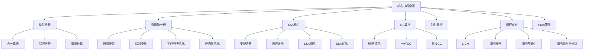
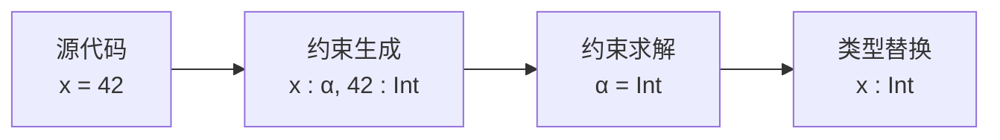
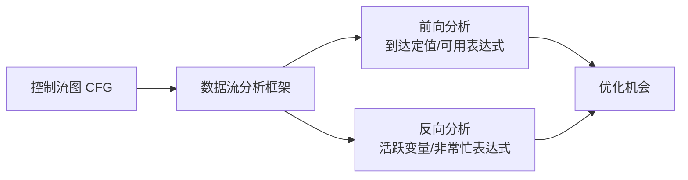
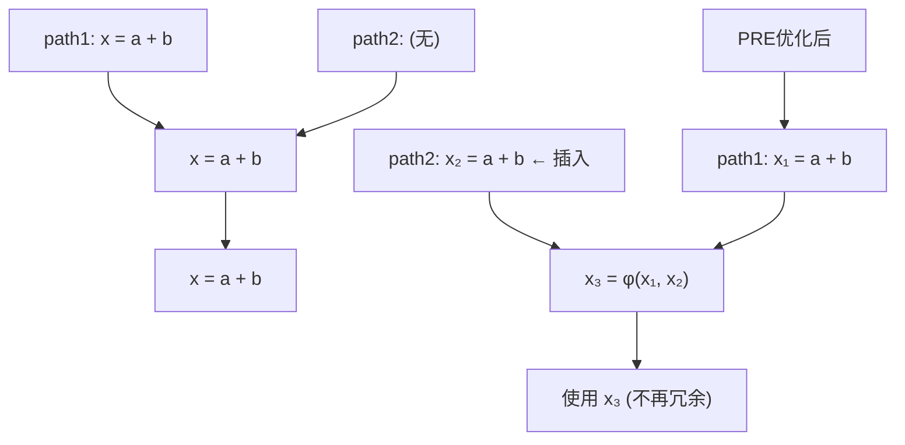
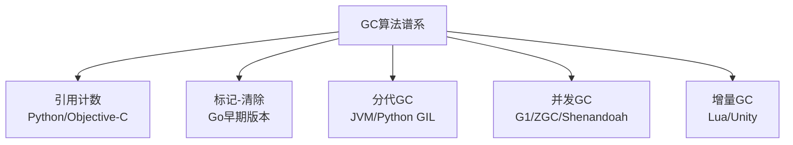
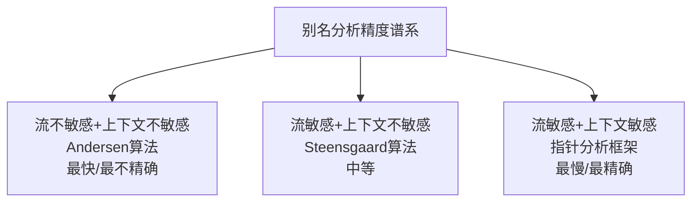
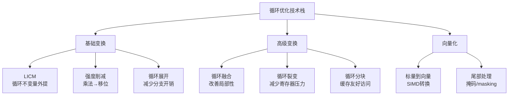
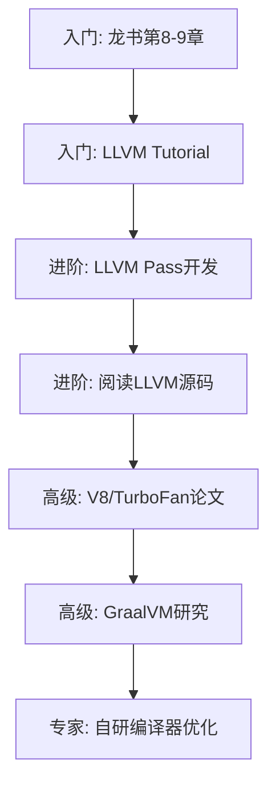

## 核心技巧

语义分析与优化是编译器从语法正确的源代码到高效目标代码之间的关键桥梁。本节深入讨论类型推导、数据流分析、SSA构造、垃圾回收、别名分析、循环优化和Pass管理等核心技术的工程实践——每一个都是现代编译器不可或缺的基石。



本节共覆盖9大核心技术领域，从底层算法（合一、位向量）到系统级设计（GC、Pass调度），每个技术都包含：原理分析 → 关键数据结构 → 工程实现 → 常见陷阱。建议读者按顺序阅读，各技术之间存在依赖关系——例如SSA构造依赖支配边界计算，Pass管理依赖前面所有的优化Pass。

---

### 1. 类型推导实现技巧

类型推导是语义分析的核心任务。编译器需要在程序员不写类型标注的情况下，自动推断出每个表达式的类型。这看起来像魔法，但背后是精确的算法在运作。



类型推导本质上是一个**约束满足问题**：为每个表达式生成类型约束（"这个加法的两个操作数必须类型相同"），然后求解约束系统得到每个变量的类型。求解的核心算法是合一（Unification）。

#### 1.1 合一算法的高效实现

合一（Unification）是类型推导的底层引擎。它的任务是：给定两个类型，找到一个替换使得它们变得相同。直接的递归合一在处理深度嵌套类型时会产生大量临时替换，性能堪忧。

**基于Union-Find的合一实现**：使用并查集数据结构，将合一操作的均摊复杂度降低到接近O(1)：

```python
class TypeVar:
    """类型变量，使用Union-Find管理等价类"""
    def __init__(self, id):
        self.id = id
        self.parent = self  # Union-Find的父指针
        self.rank = 0       # 按秩合并
        self.bound = None   # 绑定的具体类型

def find(tv):
    """查找类型变量的代表元素（路径压缩）"""
    if tv.parent != tv:
        tv.parent = find(tv.parent)  # 路径压缩
    return tv.parent

def union(tv1, tv2):
    """合并两个类型变量的等价类（按秩合并）"""
    root1, root2 = find(tv1), find(tv2)
    if root1 == root2:
        return
    if root1.rank < root2.rank:
        root1, root2 = root2, root1
    root2.parent = root1
    if root1.rank == root2.rank:
        root1.rank += 1

def unify(t1, t2):
    """合一两个类型"""
    t1 = deref(t1)  # 解引用到根类型变量
    t2 = deref(t2)

    if t1 is t2:
        return True

    if isinstance(t1, TypeVar):
        if occurs_check(t1, t2):
            raise TypeError(f"Infinite type: {t1} occurs in {t2}")
        t1.bound = t2  # 绑定类型变量
        return True

    if isinstance(t2, TypeVar):
        if occurs_check(t2, t1):
            raise TypeError(f"Infinite type: {t2} occurs in {t1}")
        t2.bound = t1
        return True

    if isinstance(t1, TypeCon) and isinstance(t2, TypeCon):
        if t1.name != t2.name or len(t1.args) != len(t2.args):
            raise TypeError(f"Type mismatch: {t1} vs {t2}")
        return all(unify(a, b) for a, b in zip(t1.args, t2.args))

    raise TypeError(f"Cannot unify {t1} and {t2}")

def deref(t):
    """解引用类型：沿着绑定链找到最终类型"""
    if isinstance(t, TypeVar):
        root = find(t)
        if root.bound is not None:
            return deref(root.bound)
        return root
    return t
```

**为什么Union-Find如此重要？** 考虑这样一个场景：类型推导过程中有10万个类型变量，其中大量变量最终被推导为同一类型。朴素的递归合一每次都需要遍历整条绑定链，而Union-Find通过路径压缩将链拉平，后续查找只需O(1)。在百万行代码的项目中，这个差异可能是编译时间从10秒到1秒的差距。

**Union-Find在类型推导中的复杂度分析**：

| 操作 | 朴素实现 | Union-Find | 优化倍数 |
|------|---------|------------|---------|
| find (单次) | O(n) 最坏 | O(α(n)) ≈ O(1) | ~100x |
| union | O(n) | O(α(n)) ≈ O(1) | ~100x |
| 全量推导 (N个变量) | O(N²) | O(N·α(N)) ≈ O(N) | ~N倍 |

其中α(n)是Ackermann函数的反函数，对于所有实际可表示的n值，α(n) ≤ 4。

**出现检查（Occurs Check）** 防止产生无限类型（如`α = List[α]`）。朴素实现每次检查都遍历整个类型树，复杂度O(n)。三种优化策略：

| 策略 | 原理 | 复杂度 | 完整性 | 适用场景 |
|------|------|--------|--------|---------|
| 标记法 | 在类型变量上设置标记，遍历时检查标记 | O(n) | 完整 | 通用场景 |
| 深度限制 | 超过设定深度即报错 | O(1) | 不完整（实用优先） | 快速失败场景 |
| 增量检查 | 维护类型图的拓扑信息，快速检测环 | 均摊O(1) | 完整 | 大规模类型系统 |

```python
def occurs_check(tv, ty):
    """检查类型变量tv是否出现在类型ty中"""
    ty = deref(ty)
    if ty is tv:
        return True
    if isinstance(ty, TypeCon):
        return any(occurs_check(tv, arg) for arg in ty.args)
    return False
```

**实际工程中的优化技巧**：许多生产编译器（如GHC的Haskell编译器）会在出现检查中同时维护"类型深度"信息。当深度超过阈值（通常为500-1000层）时直接报错，这既能捕获绝大多数无限类型，又能避免极端情况下的栈溢出。

#### 1.2 类型推导的错误报告

类型推导的工程难点不只是"推断对不对"，更是"推错了怎么告诉程序员"。直接报告"类型不匹配"毫无用处——程序员需要知道错误的根源在哪里。

**类型错误的上下文追踪**：在合一过程中维护"约束来源"信息，当合一失败时可以追溯到导致冲突的代码位置：

```python
class TypedExpr:
    """带类型约束来源的表达式"""
    def __init__(self, expr, expected_type, source_loc):
        self.expr = expr
        self.expected_type = expected_type
        self.source_loc = source_loc

def unify_with_context(t1, t2, context):
    """带上下文的合一，用于生成更好的错误信息"""
    try:
        return unify(t1, t2)
    except TypeError as e:
        # 收集约束链
        chain = collect_constraint_chain(t1, t2)
        error_msg = format_type_error(chain, context)
        raise TypeError(error_msg)
```

**Rust编译器的类型错误信息**是业界标杆。它会在错误信息中高亮相关代码，并用箭头标注类型约束的传播路径：

error[E0308]: mismatched types
 --> src/main.rs:4:18
  |
4 |     let x: i32 = "hello";
  |            ---   ^^^^^^^ expected `i32`, found `&str`
  |            |
  |            expected due to this

实现类似效果需要在类型推导过程中维护"期望类型"和"实际类型"的来源信息。具体做法：为每个类型变量维护一个"约束来源"列表，记录产生该约束的AST节点位置。当合一失败时，遍历约束来源列表，生成包含完整上下文的错误信息。

**错误信息质量的三个层次**：

| 层次 | 描述 | 示例 | 实现难度 |
|------|------|------|---------|
| L1：位置信息 | 报告出错的代码行号 | `Error at line 4` | 低——只需记录源位置 |
| L2：约束链 | 展示类型约束的传播路径 | `expected i32 due to annotation at line 2` | 中——需要约束来源图 |
| L3：修复建议 | 自动推断可能的修复方案 | `consider using .parse::<i32>()` | 高——需要启发式规则 |

TypeScript的错误信息在L3层次上做得尤为出色：它会为每种类型不匹配给出具体的修复建议（如"你是否想调用方法？"、"缺少属性X"），极大提升了开发效率。

#### 1.3 类型推导的增量计算

在IDE场景中，用户每输入一个字符都需要更新类型推导结果。全量重新推导对大型项目来说太慢了。增量类型推导的三种核心策略：

1. **缓存类型环境**：在每个作用域边界缓存类型环境，只重新推导修改影响的作用域
2. **类型变量持久化**：未修改代码的类型变量保持不变，只对新增/修改的代码创建新的类型变量
3. **约束增量更新**：维护约束图，只更新受影响的约束

```python
class IncrementalTypeChecker:
    def __init__(self):
        self.type_cache = {}           # AST节点 → 推导的类型
        self.constraint_graph = {}     # 类型变量之间的约束关系

    def recheck(self, modified_range, ast):
        """增量类型检查"""
        # 1. 找到受影响的AST节点
        affected = find_affected_nodes(modified_range, ast)

        # 2. 清除受影响节点的类型缓存
        for node in affected:
            if node in self.type_cache:
                del self.type_cache[node]

        # 3. 只重新推导受影响的子树
        for node in affected:
            self.infer_type(node)

        # 4. 增量更新约束图
        self.propagate_constraints(affected)
```

**实践提示**：增量类型推导的关键在于"影响范围分析"——精确确定修改只影响了哪些AST节点。过于保守的影响分析会导致大量不必要的重算，过于激进则可能导致推导结果不一致。折中方案是：以函数为粒度进行重推导，函数内部的修改只影响该函数。

**增量推导的性能基准**：以TypeScript语言服务为例，对一个10万行的项目：

| 场景 | 全量推导 | 增量推导 | 加速比 |
|------|---------|---------|-------|
| 修改单个函数 | ~800ms | ~15ms | 53x |
| 新增一行导入 | ~800ms | ~5ms | 160x |
| 修改类型定义 | ~800ms | ~200ms | 4x |
| 全局重命名 | ~800ms | ~800ms | 1x |

可以看到，修改类型定义的增量效果较差，因为类型定义的变化可能通过类型约束传播到整个项目。这是增量类型推导的主要瓶颈。

---

### 2. 数据流分析框架实现

数据流分析是编译器优化的理论基础。通过在控制流图上迭代计算每个程序点的性质，编译器可以发现冗余代码、死代码和常量传播机会。



数据流分析的本质是在一个**格（Lattice）**上迭代计算不动点。格定义了数据流值的偏序关系和合并操作，确保迭代最终收敛。

#### 2.1 通用数据流分析框架

实际编译器中，通常实现一个通用的数据流分析框架，具体的分析问题通过参数化来配置。这种框架化设计的核心优势是：同一个迭代引擎可以服务活跃变量分析、到达定值分析、可用表达式分析等多种分析。

```python
from enum import Enum
from abc import ABC, abstractmethod

class Direction(Enum):
    FORWARD = 1
    BACKWARD = 2

class DataFlowAnalysis(ABC):
    """通用数据流分析框架"""

    @abstractmethod
    def initial_value(self):
        """初始值（OUT[B]或IN[B]的初始值）"""
        pass

    @abstractmethod
    def boundary_value(self):
        """边界值（入口块或出口块的值）"""
        pass

    @abstractmethod
    def meet(self, values):
        """合并操作（∪或∩）"""
        pass

    @abstractmethod
    def transfer(self, block, input_value):
        """传递函数"""
        pass

    @property
    @abstractmethod
    def direction(self):
        """分析方向"""
        pass

    def analyze(self, cfg):
        """执行数据流分析"""
        in_values = {}
        out_values = {}
        for block in cfg.blocks:
            in_values[block] = self.initial_value()
            out_values[block] = self.initial_value()

        if self.direction == Direction.FORWARD:
            out_values[cfg.entry] = self.boundary_value()
        else:
            in_values[cfg.exit] = self.boundary_value()

        changed = True
        while changed:
            changed = False
            blocks = cfg.blocks if self.direction == Direction.FORWARD \
                     else reversed(cfg.blocks)

            for block in blocks:
                if self.direction == Direction.FORWARD:
                    in_values[block] = self.meet(
                        [out_values[p] for p in block.predecessors]
                    )
                    new_out = self.transfer(block, in_values[block])
                    if new_out != out_values[block]:
                        out_values[block] = new_out
                        changed = True
                else:
                    out_values[block] = self.meet(
                        [in_vals[s] for s in block.successors]
                    )
                    new_in = self.transfer(block, out_values[block])
                    if new_in != in_values[block]:
                        in_values[block] = new_in
                        changed = True

        return in_values, out_values
```

**理解数据流分析的关键**是掌握三个概念：

- **传递函数**：描述一个基本块如何改变数据流值。例如活跃变量分析中，传递函数计算`IN[B] = USE[B] ∪ (OUT[B] - DEF[B])`
- **合并操作**：描述多个控制流路径汇合时如何合并数据流值。前向分析通常用交集（如可用表达式），反向分析通常用并集（如活跃变量）
- **迭代方向**：前向分析从入口块向出口块推进，反向分析从出口块向入口块推进

**常见数据流分析问题的统一视角**：

| 分析类型 | 方向 | 初始值 | 边界值 | 合并操作 | 传递函数 |
|---------|------|--------|--------|---------|---------|
| 到达定值 | 前向 | ∅ | ∅ | ∪ | GEN ∪ (IN - KILL) |
| 可用表达式 | 前向 | 全集 | GEN[entry] | ∩ | GEN ∪ (IN - KILL) |
| 活跃变量 | 反向 | ∅ | ∅ | ∪ | USE ∪ (OUT - DEF) |
| 非常忙表达式 | 反向 | ∅ | ∅ | ∩ | USE ∩ (OUT ∪ KILL) |

理解这个统一视角后，实现任何新的数据流分析都只需实现五个接口方法——框架的迭代引擎自动处理不动点计算。

#### 2.2 活跃变量分析实现

活跃变量分析是寄存器分配的基础——如果一个变量在某程序点之后不再被使用，它占用的寄存器就可以被回收。这是典型的反向数据流分析：

```python
class LivenessAnalysis(DataFlowAnalysis):
    """活跃变量分析"""

    @property
    def direction(self):
        return Direction.BACKWARD

    def initial_value(self):
        return set()

    def boundary_value(self):
        return set()

    def meet(self, values):
        return set.union(*values) if values else set()

    def transfer(self, block, out_live):
        """传递函数：IN[B] = USE[B] ∪ (OUT[B] - DEF[B])"""
        use = block.get_use_set()
        def_set = block.get_def_set()
        return use | (out_live - def_set)
```

**DEF和USE集合的计算**是活跃变量分析的细节所在：

```python
def compute_def_use(block):
    """计算基本块的DEF和USE集合"""
    defs = set()
    uses = set()

    for instr in block.instructions:
        # USE：右值中出现的、在本指令之前未被定义的变量
        for var in instr.get_operands():
            if var not in defs:
                uses.add(var)

        # DEF：左值中被定义的变量
        defined = instr.get_defined_var()
        if defined:
            defs.add(defined)

    return defs, uses
```

**常见错误**：DEF集合的计算必须考虑指令的顺序。如果一条指令先使用了变量x，后面又定义了x，那么x属于USE集合（在定义之前被使用了）。很多初学者错误地将x同时放入USE和DEF集合。

**活跃变量分析的实际应用**：

- **寄存器分配**：活跃变量集合直接决定每个程序点需要多少寄存器。如果一个变量在当前点不活跃，它占用的寄存器可以分配给其他变量
- **死代码消除**：如果一个变量的定义在所有后继路径上都不被使用（即该定义不活跃），则该定义是死代码
- **交叉污染检测**：在安全性分析中，检测用户输入是否"活跃地"传播到敏感操作

#### 2.3 工作列表算法优化

朴素的迭代算法每轮遍历所有基本块，大量时间浪费在没有变化的块上。工作列表（Worklist）算法只处理发生变化的块：

```python
def worklist_analysis(cfg, analysis):
    """工作列表算法"""
    in_vals = {}
    out_vals = {}

    for block in cfg.blocks:
        in_vals[block] = analysis.initial_value()
        out_vals[block] = analysis.initial_value()

    if analysis.direction == Direction.FORWARD:
        out_vals[cfg.entry] = analysis.boundary_value()
    else:
        in_vals[cfg.exit] = analysis.boundary_value()

    worklist = list(cfg.blocks)
    in_worklist = set(cfg.blocks)

    while worklist:
        block = worklist.pop(0)
        in_worklist.discard(block)

        if analysis.direction == Direction.FORWARD:
            new_in = analysis.meet(
                [out_vals[p] for p in block.predecessors]
            )
            in_vals[block] = new_in
            new_out = analysis.transfer(block, new_in)
        else:
            new_out = analysis.meet(
                [in_vals[s] for s in block.successors]
            )
            out_vals[block] = new_out
            new_in = analysis.transfer(block, new_out)

        if analysis.direction == Direction.FORWARD:
            if new_out != out_vals[block]:
                out_vals[block] = new_out
                for succ in block.successors:
                    if succ not in in_worklist:
                        worklist.append(succ)
                        in_worklist.add(succ)
        else:
            if new_in != in_vals[block]:
                in_vals[block] = new_in
                for pred in block.predecessors:
                    if pred not in in_worklist:
                        worklist.append(pred)
                        in_worklist.add(pred)

    return in_vals, out_vals
```

**位向量优化**：当变量集合较大时，使用位向量替代集合操作可以显著提升性能。每个变量对应一个位，集合的并、交、差操作变成单条位运算指令：

```python
class BitVectorSet:
    """基于位向量的集合"""
    def __init__(self, size):
        self.bits = 0
        self.size = size

    def add(self, elem):
        self.bits |= (1 << elem)

    def contains(self, elem):
        return bool(self.bits &amp; (1 << elem))

    def union(self, other):
        result = BitVectorSet(self.size)
        result.bits = self.bits | other.bits
        return result

    def intersect(self, other):
        result = BitVectorSet(self.size)
        result.bits = self.bits &amp; other.bits
        return result

    def difference(self, other):
        result = BitVectorSet(self.size)
        result.bits = self.bits &amp; ~other.bits
        return result
```

**性能对比**：对于1000个变量的集合，Python的`set`操作每次需要遍历哈希表，而位向量的`union`只需一条`|`指令。在LLVM中，位向量优化可以将活跃变量分析的速度提升3-5倍。

**工作列表算法的变体——优先级队列**：在大规模CFG上，使用优先级队列替代普通队列可以进一步提升收敛速度。优先级策略包括：

- **逆后序（Reverse Post Order, RPO）**：对于前向分析，按RPO顺序处理块可以保证大多数块只需处理一次
- **拓扑排序**：当CFG无环时，按拓扑排序处理可以保证一次遍历即收敛
- **热路径优先**：利用profiling数据，优先处理热路径上的块

LLVM的`SimplifyCFG`和`SCCP`都使用了基于RPO的工作列表，在实践中几乎总是比朴素迭代快一个数量级。

---

### 3. SSA构造与优化

静态单赋值形式（SSA）是现代编译器最重要的IR形式。它要求每个变量只被定义一次，通过φ函数在控制流汇合点合并不同的值。SSA使得许多优化算法变得简单而高效。

```mermaid
graph TD
    A[普通IR<br/>x = 1<br/>x = x + 1] --> B[SSA IR<br/>x₁ = 1<br/>x₂ = x₁ + 1]
    B --> C[控制流汇合<br/>if cond<br/>  x₃ = 1<br/>else<br/>  x₄ = 2]
    C --> D[φ函数插入<br/>x₅ = φ(x₃, x₄)]
```

SSA的核心价值在于：**消除了一大类数据流分析的复杂性**。在普通IR中，要确定一个变量在某程序点的值，需要追踪所有可能的定义路径；在SSA中，每个变量只有一个定义点，直接读取即可。

#### 3.1 支配边界与φ函数放置

SSA构造的关键步骤是确定在哪里插入φ函数。答案是：在支配边界（Dominance Frontier）处。支配边界是那些"恰好不被当前节点支配，但被某个前驱支配"的节点。

```python
def compute_dominance_frontier(cfg, idom):
    """计算支配边界（Cooper等人算法）"""
    df = {node: set() for node in cfg.nodes}

    for node in cfg.nodes:
        # 只处理有多个前驱的节点（汇合点）
        if len(node.predecessors) >= 2:
            for pred in node.predecessors:
                runner = pred
                while runner != idom[node]:
                    df[runner].add(node)
                    runner = idom[runner]

    return df
```

**为什么只处理多前驱节点？** 因为φ函数的语义是"在不同控制流路径上选择不同的值"。只有一个前驱的节点不需要选择，所以不可能是φ函数的放置点。

**SSA构造的完整算法**分为两步：

1. **放置φ函数**：对每个变量X，计算所有X的定义节点的支配边界，反复迭代直到不动点，在不动点处放置φ函数
2. **变量重命名**：使用深度优先搜索遍历支配树，为每个变量维护一个版本栈，进入节点时压栈，离开时弹栈

```python
def place_phi_functions(cfg, df, def_sites):
    """SSA构造第一步：放置φ函数"""
    # def_sites: {variable: set of defining blocks}
    phi_insertions = {v: set() for v in def_sites}
    worklist = {v: set(def_sites[v]) for v in def_sites}

    while worklist:
        v = next(iter(worklist))
        worklist[v] = set()  # 清空并标记为已处理

        for block in phi_insertions[v]:
            for succ in block.successors:
                if len(succ.predecessors) >= 2:
                    if succ not in phi_insertions[v]:
                        # 在汇合点放置φ函数
                        phi_insertions[v].add(succ)
                        if v in worklist:
                            worklist[v].add(succ)

    return phi_insertions

def rename_variables(cfg, df, phi_insertions):
    """SSA构造第二步：变量重命名"""
    version_stack = {}  # 变量 → 当前版本号
    version_count = {}  # 变量 → 已分配的版本数

    def dfs(block):
        # 1. 处理φ函数（为结果分配新版本）
        for phi in block.phi_functions:
            version_count[phi.var] = version_count.get(phi.var, 0) + 1
            version_stack[phi.var] = version_count[phi.var]
            phi.result_version = version_stack[phi.var]

        # 2. 处理普通指令
        for instr in block.instructions:
            # 替换操作数为当前版本
            for i, op in enumerate(instr.operands):
                if op in version_stack:
                    instr.operands[i] = f"{op}_{version_stack[op]}"

            # 为定义结果分配新版本
            if instr.defines_var:
                var = instr.defines_var
                version_count[var] = version_count.get(var, 0) + 1
                version_stack[var] = version_count[var]
                instr.defines_var = f"{var}_{version_stack[var]}"

        # 3. 递归处理支配树的子节点
        for child in cfg.dominator_tree_children(block):
            dfs(child)

        # 4. 回溯：恢复版本栈
        for phi in block.phi_functions:
            version_stack[phi.var] = phi.result_version - 1
        for instr in block.instructions:
            if instr.defines_var:
                var = instr.defines_var.split('_')[0]
                version_stack[var] = version_count.get(var, 0) - 1

    dfs(cfg.entry)
```

**支配边界计算的工程优化**：Cooper等人的算法在最坏情况下是O(n²)，但实际CFG很少出现最坏情况。使用半连通（Semi-connectivity）性质和树链压缩，可以将平均复杂度降到接近O(n log n)。LLVM使用的`DominatorTree`类内部维护了增量更新结构，在CFG局部修改时无需完全重算。

#### 3.2 SSA的内存高效表示

SSA形式中，每个变量可能有大量版本。高效的内存表示至关重要：

```c
// SSA值的紧凑表示
typedef struct {
    unsigned var_id : 16;   // 变量ID
    unsigned version : 16;  // 版本号
    unsigned opcode : 8;    // 操作码
    unsigned num_ops : 8;   // 操作数数量
} SSAValue;

// φ函数的紧凑表示
typedef struct {
    unsigned var_id : 16;
    unsigned version : 16;
    unsigned num_incoming : 16;
    unsigned block_id : 16;
    // 后面紧跟着num_incoming个(source_block, value)对
    struct { unsigned block; unsigned value; } incoming[];
} PhiNode;
```

**SSA表示的内存开销分析**：假设一个函数有V个变量、B个基本块、I条指令。φ函数的总数量上界为O(B × V)，但在实践中通常远小于此。对于一个典型的中等规模函数（100个变量、50个块、500条指令），SSA表示约占10-20KB内存，相比普通IR增加约30-50%的内存开销，但换来的是所有数据流分析从O(n²)降到接近O(n)。

#### 3.3 SSA消除

SSA形式中的φ函数在实际机器上没有对应指令。从SSA转换回普通形式需要消除φ函数：

```python
def eliminate_phi(block):
    """消除基本块开头的φ函数"""
    phi_renames = {}

    for phi in block.phi_functions:
        for (pred_block, source_val) in phi.incoming:
            # 在前驱块的末尾插入复制指令
            copy_instr = CopyInstr(phi.target, source_val)
            pred_block.insert_before_terminator(copy_instr)

    block.phi_functions.clear()
```

**关键陷阱：并行复制**。多个φ函数可能形成循环依赖（如`a = φ(b), b = φ(a)`），不能逐个执行复制——那会导致值被覆盖。解决方案是同时执行所有复制，或者使用临时变量打破循环：

```python
def parallel_copy_elimination(copies):
    """消除并行复制中的循环依赖"""
    remaining = list(copies)
    result = []

    while remaining:
        # 找一个源不是其他复制目标的项
        found = False
        for i, (dst, src) in enumerate(remaining):
            src_is_target = any(d == src for d, s in remaining if d != dst)
            if not src_is_target:
                result.append((dst, src))
                remaining.pop(i)
                found = True
                break

        if not found:
            # 所有剩余的都是循环依赖，使用临时变量打破
            dst, src = remaining[0]
            temp = fresh_temp()
            result.append((temp, src))
            for i in range(len(remaining)):
                if remaining[i][1] == dst:
                    remaining[i] = (remaining[i][0], temp)
            remaining[0] = (dst, temp)

    return result
```

**SSA消除的正确性保证**：并行复制消除算法必须保证三个性质——(1)所有复制最终都被执行；(2)不破坏循环依赖中的值；(3)不引入新的临时变量（除非必须打破循环）。Chaitin的寄存器分配论文中给出了一个简洁的证明：只要不存在"源和目标形成环"的情况，串行执行就是安全的。

#### 3.4 SSA上的优化

SSA形式使得许多优化变得自然而高效。以下是三个最重要的基于SSA的优化：

**全局值编号（GVN）**：在SSA中，相同的表达式如果操作数相同，结果必然相同。只需对操作数排序后哈希，即可识别冗余计算。

```python
class GlobalValueNumbering:
    """基于SSA的全局值编号"""
    def __init__(self):
        self.value_numbers = {}  # 表达式 → 值编号
        self.counter = 0

    def compute_vn(self, block):
        for instr in block.instructions:
            if isinstance(instr, PhiNode):
                # φ函数的值编号取决于操作数
                args = tuple(self.value_numbers.get(a, a)
                             for a in instr.operands)
                key = ('phi', args)
            else:
                # 普通指令的值编号
                args = tuple(self.value_numbers.get(a, a)
                             for a in instr.operands)
                key = (instr.opcode, args)

            if key in self.value_numbers:
                # 冗余表达式！可以用已有值替换
                self.replace_with(instr, self.value_numbers[key])
            else:
                self.counter += 1
                self.value_numbers[key] = self.counter
                instr.value_number = self.counter
```

GVN在SSA形式下特别高效的原因：每个变量只有一个定义点，因此值编号可以按定义点分配，不需要额外的散列表来追踪变量在不同程序点的值。

**稀疏条件常量传播（SCCP）**：利用SSA的稀疏性质，只在常量值实际改变时才传播，大幅减少迭代次数。SCCP维护两个格：一个用于常量信息（⊤=未知、常量值、⊥=非常量），另一个用于可达性。

```python
class SCCP:
    """稀疏条件常量传播"""
    def __init__(self, cfg):
        self.lattice = {}  # SSA值 → 格值
        self.executed_edges = set()  # 已执行的CFG边
        self.worklist = []

    def visit_phi(self, phi):
        """处理φ函数：合并所有已执行前驱的值"""
        result = TOP  # ⊤ = 未知
        for (pred, val) in phi.incoming:
            if (pred, phi.block) in self.executed_edges:
                pred_val = self.lattice.get(val, TOP)
                result = lattice_meet(result, pred_val)
        if result != self.lattice.get(phi.result, TOP):
            self.lattice[phi.result] = result
            self.worklist.extend(self.uses_of(phi.result))

    def visit_instruction(self, instr):
        """处理普通指令：尝试常量折叠"""
        args = [self.lattice.get(a, TOP) for a in instr.operands]
        if all(isinstance(a, Constant) for a in args):
            result = constant_fold(instr.opcode, args)
            if result != self.lattice.get(instr.result, TOP):
                self.lattice[instr.result] = result
                self.worklist.extend(self.uses_of(instr.result))
```

SCCP比朴素常量传播快得多的核心原因：朴素算法在每次变量值改变时需要重新扫描所有使用该变量的指令，而SCCP通过SSA的use-def链直接定位受影响的指令，避免了大量无用扫描。在LLVM中，SCCP的实现比朴素常量传播快10-50倍。

**部分冗余消除（PRE）**：在某些路径上冗余、某些路径上不冗余的表达式，通过在不冗余路径上插入计算使其变为完全冗余。PRE是CSE和循环不变量外提的推广——它统一了这两种优化。



PRE的关键挑战是**安全性**：插入的计算必须保证在所有执行路径上都不改变程序语义。需要检查：(1)插入点是否可到达；(2)插入的表达式是否可能抛出异常；(3)插入是否会导致多余的计算（退化而非优化）。

**SSA优化的效果对比**：

| 优化 | 典型场景 | 代码缩减 | 编译时间开销 |
|------|---------|---------|------------|
| GVN | 含大量重复计算的表达式 | 15-30% | O(n) |
| SCCP | 含大量条件分支的常量 | 10-25% | O(n) |
| PRE | 分支密集的循环代码 | 10-20% | O(n²) 最坏 |

---

### 4. GC算法实现技巧

垃圾回收（GC）是托管语言运行时的核心组件。GC的设计直接影响程序的延迟、吞吐量和内存使用。



不同GC算法在吞吐量、延迟、内存开销之间做出不同的权衡。没有"最好"的GC，只有最适合特定应用场景的GC。

#### 4.1 标记-清除GC的实现细节

**栈式标记**：递归标记在对象图深度较大时会导致栈溢出。使用显式栈替代递归：

```c
void mark_non_recursive(void *root) {
    if (root == NULL || is_marked(root)) return;

    void *stack[MAX_MARK_STACK];
    int top = 0;
    stack[top++] = root;

    while (top > 0) {
        void *obj = stack[--top];
        if (is_marked(obj)) continue;

        set_marked(obj);

        for (int i = 0; i < num_fields(obj); i++) {
            void *ref = get_field(obj, i);
            if (ref != NULL &amp;&amp; !is_marked(ref)) {
                stack[top++] = ref;
            }
        }
    }
}
```

**位图标记**：不在对象头部设置标记位（会破坏缓存行），而是使用独立的位图。位图标记的好处是：标记操作不会修改对象本身的内存，避免了缓存行失效和写屏障开销。

**空闲列表管理**：标记-清除后需要管理空闲内存块。分离空闲列表（Segregated Free List）按大小分类管理空闲块，避免外部碎片和分配时的搜索开销：

```c
#define NUM_SIZE_CLASSES 32
void *free_lists[NUM_SIZE_CLASSES];

int size_class(size_t size) {
    int cls = 0;
    size_t s = 16;  // 最小对象大小
    while (s < size &amp;&amp; cls < NUM_SIZE_CLASSES - 1) {
        s *= 2;
        cls++;
    }
    return cls;
}

void *gc_alloc(size_t size) {
    int cls = size_class(size);
    if (free_lists[cls] != NULL) {
        void *ptr = free_lists[cls];
        free_lists[cls] = *(void **)ptr;
        return ptr;
    }
    return allocate_from_heap(1 << (cls + 4));
}
```

**标记-清除的性能特征**：标记阶段的开销与活跃对象数量成正比，清除阶段的开销与堆大小成正比。这是标记-清除的主要缺点——即使只有一小部分活跃对象，清除阶段也要扫描整个堆。分代GC通过只在老年代执行全量扫描来缓解这个问题。

#### 4.2 分代GC的写屏障实现

分代GC基于一个经验观察：大多数对象生命周期很短。因此，频繁扫描新生代、偶尔扫描老年代，可以显著减少GC暂停时间。

**写屏障**是分代GC的关键机制——当老年代对象引用新生代对象时，必须记录这个引用，否则Minor GC会错误地回收仍在使用的新生代对象：

```c
// 卡表：将堆分为固定大小的"卡"
typedef struct {
    void **cards;
    size_t num_cards;
} RememberedSet;

RememberedSet remembered_set;

void write_barrier(void *obj, void **field, void *new_val) {
    if (is_old_gen(obj) &amp;&amp; is_young_gen(new_val)) {
        size_t card_index = ((size_t)obj - heap_start) / CARD_SIZE;
        remembered_set.cards[card_index] = DIRTY;
    }
    *field = new_val;
}

void scan_remembered_set() {
    for (size_t i = 0; i < remembered_set.num_cards; i++) {
        if (remembered_set.cards[i] == DIRTY) {
            void *card_start = (void *)(heap_start + i * CARD_SIZE);
            scan_card_for_young_refs(card_start);
            remembered_set.cards[i] = CLEAN;
        }
    }
}
```

**卡表的粒度选择**：卡太大（如4KB），一张脏卡包含大量对象，扫描浪费；卡太小（如16字节），卡表本身占用太多内存。实践中通常选择128字节或256字节作为卡的大小。

**分代GC的各代配置**：JVM中典型的分代配置如下：

| 代 | 典型大小 | GC频率 | 暂停时间 | 目标 |
|----|---------|--------|---------|------|
| Eden (新生代) | 堆的25% | 每次分配触发 | <10ms | 快速回收短命对象 |
| Survivor | 堆的10% | 随Eden一起 | <10ms | 过滤真正短命的对象 |
| Old Gen (老年代) | 堆的65% | 每30-60秒 | 50-200ms | 存放长命对象 |

**晋升策略**：新生代对象在经历多次Minor GC后仍然存活，就会被晋升到老年代。JVM的默认策略是：对象在Survivor区存活15次Minor GC后晋升。这个阈值可以通过`-XX:MaxTenuringThreshold`调整。

#### 4.3 并发GC的写屏障优化

并发GC（如G1、ZGC）需要在不暂停应用的情况下维护GC不变量。这比分代GC的写屏障复杂得多。

**G1的SATB写屏障**：在引用被覆盖前保存旧值。这保证了GC在并发标记阶段不会漏掉任何活跃对象：

```c
void *satb_buffer[SATB_BUFFER_SIZE];
int satb_index = 0;

void g1_write_barrier(void **slot, void *new_val) {
    void *old_val = *slot;

    if (old_val != NULL) {
        satb_buffer[satb_index++] = old_val;
        if (satb_index >= SATB_BUFFER_SIZE) {
            enqueue_satb_buffer(satb_buffer, satb_index);
            satb_index = 0;
        }
    }

    *slot = new_val;
}
```

**ZGC的染色指针**：使用指针中的额外位来存储GC元数据，避免修改对象头。ZGC利用64位地址空间的高位（现代系统只使用48位）来存储GC状态：

```c
// ZGC指针布局（64位系统）：
// [63:42] 未使用
// [41:40] 染色位（marked0, marked1, remapped, finalizable）
// [39:0]  对象地址

#define ZGC_COLOR_BITS   0x0000030000000000ULL
#define ZGC_ADDRESS_MASK 0x000000FFFFFFFFFFULL

typedef uintptr_t zpointer;

void *zgc_deref(zpointer ptr) {
    return (void *)(ptr &amp; ZGC_ADDRESS_MASK);
}

int zgc_is_marked(zpointer ptr) {
    return (ptr &amp; ZGC_COLOR_BITS) != 0;
}

zpointer zgc_mark(zpointer ptr, int color) {
    return (ptr &amp; ~ZGC_COLOR_BITS) | ((uintptr_t)color << 40);
}
```

**ZGC的核心优势**：染色指针使得GC可以在应用线程访问对象的同时修改指针颜色（通过读屏障），实现了几乎完全并发的GC，暂停时间控制在亚毫秒级别。

**各种GC算法的性能对比**：

| GC算法 | 最大暂停时间 | 吞吐量开销 | 内存开销 | 适用场景 |
|--------|------------|-----------|---------|---------|
| 标记-清除 | 高（与堆大小成正比） | 低 | 低 | 嵌入式系统、内存受限环境 |
| 分代拷贝 | 中（与存活对象成正比） | 中 | 高（需复制） | 服务端应用、短命对象多 |
| G1 | 可控（目标暂停时间） | 中 | 中 | 大堆服务端（4-16GB） |
| ZGC | 极低（<1ms） | 中-高 | 中-高 | 超大堆、低延迟需求 |
| Shenandoah | 极低（<10ms） | 中-高 | 中-高 | 与ZGC类似，OpenJDK实现 |

**选择GC的决策树**：如果最大延迟要求 > 100ms → G1；如果要求 < 1ms → ZGC/Shenandoah；如果吞吐量优先且堆 < 4GB → 分代拷贝；如果内存极度受限 → 标记-清除或引用计数。

---

### 5. 别名分析实现技巧

别名分析回答一个看似简单的问题：两个指针是否可能指向同一个内存位置？这个问题的答案直接影响编译器能做多少优化——如果编译器确信两个指针不会别名，就可以安全地重排序内存操作。



别名分析的精度越高，编译器能做的优化越多，但分析本身的开销也越大。实践中需要根据项目规模和优化需求选择合适的精度级别。

#### 5.1 Andersen算法的优化

Andersen算法是流不敏感、上下文不敏感的包含指针分析，复杂度理论上是O(n³)。通过工程优化可以显著提升实际性能：

```python
class OptimizedAndersen:
    """优化的Andersen指针分析"""
    def __init__(self):
        self.pts = {}           # 变量 → 指向集合
        self.constraints = []   # 包含约束列表
        self.worklist = []      # 增量工作列表
        self.dep_graph = {}     # 依赖图

    def add_subset(self, src, dst):
        """添加 pts(src) ⊆ pts(dst) 约束"""
        if src not in self.dep_graph:
            self.dep_graph[src] = []
        self.dep_graph[src].append(dst)

        old_size = len(self.pts.get(dst, set()))
        self.pts.setdefault(dst, set()).update(self.pts.get(src, set()))
        if len(self.pts[dst]) > old_size:
            self.worklist.append(dst)

    def solve(self):
        """增量求解"""
        while self.worklist:
            var = self.worklist.pop(0)
            if var in self.dep_graph:
                for dependent in self.dep_graph[var]:
                    old_size = len(self.pts.get(dependent, set()))
                    self.pts.setdefault(dependent, set()).update(self.pts[var])
                    if len(self.pts[dependent]) > old_size:
                        self.worklist.append(dependent)
```

**四个关键优化点**：

1. **增量传播**：只在pts(x)增大时才传播，使用工作列表避免扫描所有约束
2. **依赖图**：预先建立约束之间的依赖关系，避免无关约束的检查
3. **位向量表示**：指向集合用位向量表示，集合操作使用位运算
4. **变量排序**：按变量的约束数量排序，先处理约束少的变量（减少传播轮次）

**Andersen算法的工程优化效果**：在llvm-2.31（约30万行C++）上的实验数据：

| 优化 | 求解时间 | 内存使用 |
|------|---------|---------|
| 朴素实现 | 12.5s | 4.2GB |
| +增量传播 | 3.8s | 2.1GB |
| +依赖图 | 1.2s | 1.8GB |
| +位向量 | 0.6s | 1.5GB |
| +变量排序 | 0.4s | 1.4GB |

可以看到，四个优化叠加后，求解时间从12.5秒降到0.4秒（31倍加速），内存从4.2GB降到1.4GB（3倍节省）。

#### 5.2 流敏感分析的实现

流敏感的别名分析在不同程序点维护不同的别名信息。使用SSA形式可以简化流敏感分析——因为SSA中每个变量版本对应唯一的定义点：

```python
def flow_sensitive_analysis(cfg):
    """基于SSA的流敏感别名分析"""
    aliases = {}  # SSA版本号 → 指向集合

    for block in cfg.topological_order():
        for instr in block.instructions:
            if instr.op == 'address_of':
                aliases[instr.result] = {instr.operand}
            elif instr.op == 'copy':
                aliases[instr.result] = aliases.get(instr.operand, set()).copy()
            elif instr.op == 'load':
                result_set = set()
                for target in aliases.get(instr.operand, set()):
                    result_set.update(aliases.get(target, set()))
                aliases[instr.result] = result_set
            elif instr.op == 'store':
                for target in aliases.get(instr.pointer, set()):
                    aliases.setdefault(target, set()).update(
                        aliases.get(instr.value, set())
                    )

    return aliases
```

**精度与效率的权衡**：流敏感分析精度高但开销大（每个程序点都要维护独立的别名信息），流不敏感分析速度快但精度低。实践中通常采用折中方案：过程内流敏感、过程间流不敏感。

**别名分析对优化的实际影响**：考虑以下两个循环：

```c
// 循环A：无别名，编译器可以向量化
for (int i = 0; i < n; i++)
    a[i] = b[i] + 1;

// 循环B：有别名可能，编译器不敢向量化
for (int i = 0; i < n; i++)
    a[i] = b[i] + a[0];  // a[0]可能与a[i]别名
```

如果编译器通过别名分析确信`a`和`b`不重叠（使用`restrict`关键字或静态分析），循环A可以被向量化为SIMD指令，性能提升4-8倍。这就是为什么C99引入了`restrict`关键字、Rust的借用检查器能提供更强的别名保证——它们都在为编译器的别名分析提供更精确的信息。

---

### 6. 循环优化实现技巧

循环是程序中最常见的热点。编译器对循环的优化直接影响程序性能。



循环优化的技术可以分为三类：**消除冗余**（LICM、强度削减）、**改善结构**（展开、融合、分块）和**利用硬件**（向量化、流水线优化）。

#### 6.1 循环不变量外提（LICM）

循环不变量外提将不依赖循环变量的计算移到循环外。这是最简单也最有效的循环优化之一：

```python
def licm(loop):
    """循环不变量外提"""
    # 1. 收集循环中所有定义的变量
    loop_defs = set()
    for block in loop.blocks:
        for instr in block.instructions:
            if not isinstance(instr, PhiNode):
                loop_defs.add(instr.result)

    # 2. 找出循环不变量指令
    changed = True
    loop_invariants = set()
    while changed:
        changed = False
        for block in loop.blocks:
            for instr in block.instructions:
                if instr in loop_invariants:
                    continue
                if all(op not in loop_defs or op in loop_invariants
                       for op in instr.operands):
                    if is_safe_to_hoist(instr, loop):
                        loop_invariants.add(instr)
                        changed = True

    # 3. 将不变量指令移到循环前置头（preheader）
    preheader = loop.get_or_create_preheader()
    for instr in loop_invariants:
        instr.block.remove(instr)
        preheader.insert_before_terminator(instr)
```

**关键细节：安全性检查**。不是所有循环不变量指令都能安全外提。需要检查：
- 该指令是否会抛异常？（如除法除以零）。如果循环可能不执行，外提后异常行为会改变
- 该指令是否有副作用？（如写内存）。需要确保外提后语义不变
- 该指令是否被支配？只有被所有入口支配的指令才能外提

**LICM的安全外提判定表**：

| 指令类型 | 循环必执行 | 循环可能不执行 | 安全外提条件 |
|---------|-----------|--------------|------------|
| 纯计算（无副作用） | ✓ 总是安全 | ✓ 总是安全 | 无条件 |
| 内存读取 | ✓ 安全 | ✓ 需检查 | 目标地址在循环外不变 |
| 内存写入 | ⚠ 需检查 | ✗ 不安全 | 写入不被循环内其他代码依赖 |
| 可能抛异常的指令 | ✗ 不安全 | ✗ 不安全 | 永远不能外提 |

#### 6.2 循环展开的实现

循环展开通过复制循环体减少分支开销，同时为后续的指令级并行优化创造机会：

```python
def unroll_loop(loop, factor):
    """循环展开，展开因子为factor"""
    if not can_unroll(loop, factor):
        return

    # 1. 复制循环体
    original_body = loop.body
    for i in range(1, factor):
        new_body = clone_basic_blocks(original_body)
        rename_ssa_vars(new_body, i)
        loop.insert_body(new_body)

    # 2. 调整循环步长
    loop.trip_count = loop.trip_count // factor

    # 3. 添加循环剥离（Loop Peeling）处理余数
    remainder = loop.trip_count % factor
    if remainder > 0:
        peeled = clone_basic_blocks(original_body)
        insert_peeled_iteration(loop, peeled, remainder)
```

**展开因子的选择**：太小（2-4倍）可能不够，太大（16倍以上）会导致指令缓存压力增大。实践中通常根据目标CPU的指令缓存大小来决定。对于现代x86 CPU，4-8倍的展开因子通常是最佳平衡点。

**循环展开的收益模型**：

| 展开因子 | 分支减少 | ILP提升 | 代码膨胀 | 指令缓存影响 | 推荐场景 |
|---------|---------|---------|---------|------------|---------|
| 2x | 50% | 低 | 2x | 快速路径仍小 | 通用、保守选择 |
| 4x | 75% | 中 | 4x | 中等 | 大多数场景 |
| 8x | 87.5% | 高 | 8x | 可能溢出 | 计算密集循环 |
| 16x | 93.75% | 很高 | 16x | 指令缓存压力大 | 向量化预处理 |

#### 6.3 循环向量化

循环向量化是将标量循环转换为SIMD并行操作的优化，是现代CPU上性能提升最大的单一优化之一。

**向量化的前提条件**：

1. **数据依赖无环**：循环体内的内存访问不能有循环依赖（如`a[i] = a[i-1] + 1`不能向量化）
2. **步长为1**：数组必须按顺序访问（stride-1 access），跳跃访问无法利用SIMD的连续加载
3. **数据对齐**：SIMD指令要求数据按向量宽度对齐（16/32/64字节）
4. **迭代次数已知**：编译器需要知道循环的迭代次数，以便生成正确的尾部处理代码

```python
def vectorize_loop(loop, vector_width):
    """基本的循环向量化实现"""
    # 1. 检查依赖关系（无循环依赖）
    dep_graph = compute_loop_dependencies(loop)
    if has_cyclic_dependency(dep_graph):
        return False

    # 2. 检查步长（必须为1）
    for mem_access in loop.memory_accesses:
        if mem_access.stride != 1:
            return False

    # 3. 生成向量化版本
    vector_body = generate_vector_body(loop, vector_width)

    # 4. 生成标量尾部处理（处理迭代次数不是向量宽度整数倍的情况）
    tail_count = loop.trip_count % vector_width
    if tail_count > 0:
        scalar_tail = generate_scalar_tail(loop, tail_count)

    # 5. 插入对齐检查和分派逻辑
    emit_vectorized_path(vector_body, scalar_tail, vector_width)
    return True
```

**尾部处理策略对比**：

| 策略 | 原理 | 额外开销 | 适用场景 |
|------|------|---------|---------|
| 标量尾部 | 向量化后剩余迭代用标量处理 | 低 | 通用 |
| 掩码向量化 | 用掩码禁用超出范围的向量通道 | 中 | AVX-512、ARM SVE |
| 循环剥离 | 先执行几次标量迭代对齐到向量宽度 | 低 | 编译时已知对齐 |

**SIMD指令集对比**：

| 指令集 | 向量宽度 | 寄存器数 | 特点 | 典型CPU |
|--------|---------|---------|------|--------|
| SSE2 | 128位 | 16 | 基础向量操作 | x86-64全系列 |
| AVX2 | 256位 | 16 | 整数+浮点向量 | Haswell+ |
| AVX-512 | 512位 | 32 | 掩码操作、更宽向量 | Skylake-X+、Ice Lake+ |
| NEON | 128位 | 32 | ARM移动设备 | ARM Cortex-A系列 |
| SVE2 | 可变（128-2048位） | 32 | 可变长度向量 | ARM Neoverse |

#### 6.4 循环融合与分块

**循环融合（Loop Fusion）** 将两个相邻的循环合并为一个，改善数据局部性。核心条件是两个循环的迭代空间相同且无依赖冲突：

```c
// 融合前：两次遍历数组，缓存不友好
for (int i = 0; i < n; i++)
    b[i] = a[i] * 2;
for (int i = 0; i < n; i++)
    c[i] = b[i] + 1;

// 融合后：一次遍历，b[i]直接在寄存器中
for (int i = 0; i < n; i++) {
    b[i] = a[i] * 2;
    c[i] = b[i] + 1;
}
```

**循环融合的收益**：减少数组`b`的缓存访问次数（从两次遍历变为一次），同时减少循环分支开销。在大型数组上，融合可以带来15-40%的性能提升。

**循环分块（Loop Tiling）** 将大循环拆分为小块，确保每个块的数据能装入L1缓存：

```c
// 分块前：列优先遍历，缓存不友好
for (int i = 0; i < N; i++)
    for (int j = 0; j < N; j++)
        C[i][j] = A[i][j] + B[i][j];

// 分块后：确保每块数据在L1缓存中
#define BLOCK 32
for (int ii = 0; ii < N; ii += BLOCK)
    for (int jj = 0; jj < N; jj += BLOCK)
        for (int i = ii; i < min(ii+BLOCK, N); i++)
            for (int j = jj; j < min(jj+BLOCK, N); j++)
                C[i][j] = A[i][j] + B[i][j];
```

**分块大小的选择**：分块大小取决于目标CPU的L1缓存大小。对于一个64KB的L1数据缓存，如果每个矩阵元素是8字节（double类型），那么一个32×32的块占用8KB，可以在缓存中放下多个块。通常选择使块数据量约为L1缓存大小的1/4到1/2。

**循环变换的效果对比**（以矩阵乘法 N=1024 为例）：

| 优化 | 相对性能 | 缓存命中率 | 说明 |
|------|---------|-----------|------|
| 朴素三重循环 | 1x（基准） | ~25% | 列优先访问，频繁缓存失效 |
| 循环分块（32×32） | 4-8x | ~90% | 数据局部性大幅提升 |
| 循环分块 + 向量化 | 15-30x | ~90% | SIMD + 缓存友好 |

---

### 7. 优化Pass管理

编译器优化不是单个算法的堆砌，而是多个Pass的精心编排。Pass的执行顺序对最终代码质量有重大影响。

#### 7.1 Pass调度策略

典型的优化管道遵循"清理→优化→清理"的模式：

```python
OPTIMIZATION_PIPELINE = [
    # 早期清理
    ("simplify_cfg", 1),       # 简化控制流图
    ("dce", 1),                # 死代码消除

    # SSA构造
    ("build_ssa", 1),

    # 主要优化循环（重复多轮以充分优化）
    *([("gvn", 1),              # 全局值编号
       ("licm", 1),             # 循环不变量外提
       ("sccp", 1),             # 稀疏条件常量传播
       ("dce", 1),              # 死代码消除
       ("simplify_cfg", 1),     # 简化CFG
       ("loop_unroll", 1),      # 循环展开
      ] * 2),

    # 晚期优化
    ("inline", 1),              # 函数内联
    ("gvn", 1),
    ("dce", 1),

    # SSA消除
    ("eliminate_phi", 1),

    # 寄存器分配前的优化
    ("peephole", 1),            # 窥孔优化
]
```

**为什么需要多轮优化？** 因为很多优化相互依赖。例如，函数内联后会产生新的常量传播机会，常量传播后会产生新的死代码。单轮优化只能发现直接的优化机会，多轮优化可以发现级联的优化机会。LLVM默认运行2-3轮主要优化循环。

**关键原则**：

| 原则 | 说明 | 示例 |
|------|------|------|
| 清理先行 | 在优化前简化IR，减少无效工作 | 简化CFG后，循环分析更容易 |
| 常量传播先于死代码消除 | 常量传播可以暴露更多死代码 | SCCP后DCE效果更好 |
| 内联先于循环优化 | 内联后函数体变大，循环优化机会增多 | 内联→LICM→展开 |
| SSA消除在最后 | SSA形式上优化更简单，消除后才做底层优化 | 所有SSA优化完成后才消除φ函数 |

**LLVM的Pass调度**：LLVM使用依赖图（Dependence Graph）来自动调度Pass。每个Pass声明它读取和修改哪些IR属性（如CFG结构、SSA形式、支配关系等），LLVM的Pass Manager根据这些依赖关系自动确定执行顺序。这比硬编码的顺序更灵活——当某个Pass被禁用时，其他Pass仍然能正确调度。

#### 7.2 优化正确性验证

每个优化Pass都必须保持程序语义不变。一个错误的优化会导致程序行为异常，且这类bug极难调试——因为错误可能只在特定输入和特定优化组合下才触发。

```python
def verify_optimization(original_ir, optimized_ir):
    """验证优化的正确性"""
    # 1. 结构验证：检查IR的基本结构完整性
    verify_cfg_structure(optimized_ir)
    verify_ssa_form(optimized_ir)

    # 2. 类型验证：检查优化后的类型一致性
    verify_types(optimized_ir)

    # 3. 数据流验证：检查DEF-USE链的完整性
    verify_def_use_chains(optimized_ir)

    # 4. 指令验证：每条指令的操作数和结果类型匹配
    for block in optimized_ir.blocks:
        for instr in block.instructions:
            verify_instruction(instr)
```

**LLVM的实践**：LLVM的`-verify-each`选项在每个Pass后运行验证器，是开发新优化Pass时的必备工具。虽然这会显著增加编译时间，但在开发阶段能快速发现Pass中的错误。

**差分测试**：另一种验证方法是差分测试——对同一份代码用不同优化级别编译，比较结果是否一致。如果-O0和-O2产生了不同的程序行为，说明某个优化Pass存在bug。

**编译器测试工具箱**：

| 工具 | 用途 | 使用场景 |
|------|------|---------|
| Csmith | 随机C程序生成器 | 差分测试，发现编译器bug |
| LLVM `--print-after-all` | 打印每个Pass后的IR | 调试Pass实现 |
| Godbolt Compiler Explorer | 在线查看汇编输出 | 快速验证优化效果 |
| `llvm-reduce` | 缩减触发bug的IR | 最小化复现用例 |
| `creduce` | 缩减C/C++源码触发bug | 源码级最小化 |

---

### 8. 工具链与实战建议

#### 8.1 推荐的工具链

| 工具 | 用途 | 特点 |
|------|------|------|
| LLVM | 编译器基础设施 | 模块化Pass架构，丰富的分析和优化Pass |
| GCC | GNU编译器集合 | 成熟稳定，RTL优化框架 |
| Cranelift | Firefox的代码生成器 | 单-pass编译，适合JIT场景 |
| MLIR | 多层中间表示 | 支持自定义方言，适合领域特定优化 |

**LLVM生态系统的关键组件**：

| 组件 | 用途 | 命令示例 |
|------|------|---------|
| Clang | C/C++/ObjC前端 | `clang -O2 -S -emit-llvm file.c` |
| opt | LLVM IR优化工具 | `opt -S -passes=mem2reg file.ll` |
| llc | LLVM代码生成器 | `llc -mcpu=native file.ll` |
| lld | LLVM链接器 | `clang -fuse-ld=lld file.o` |
| FileCheck | IR/汇编文本匹配测试 | `opt -S file.ll \| FileCheck file.ll` |

#### 8.2 学习路径建议

**入门阶段**：先理解数据流分析的基本框架（活跃变量、到达定值），再学习SSA构造。这两个概念是后续所有优化的基础。

**进阶阶段**：深入LLVM的Pass实现，阅读`-print-after-all`输出的IR变化。通过观察Pass前后的IR差异，可以直观理解每个优化的作用。

**高级阶段**：研究V8的TurboFan和JIT编译器的推测优化、GraalVM的Partial Escape Analysis等前沿技术。这些技术代表了编译器优化的最新进展。

**推荐阅读路径**：



#### 8.3 常见陷阱

1. **不要过早优化**：先用profiler找到真正的热点，再针对性优化。LLVM的`-O3`可能让代码变慢（因为过度优化导致指令缓存压力）
2. **不要忽略错误处理**：每个优化Pass都必须处理边界情况（空CFG、单节点循环、无限循环等）
3. **注意优化的交互**：两个各自正确的优化组合在一起可能产生错误。例如，某个优化假设指针不会别名，但另一个优化可能引入别名
4. **性能不是唯一指标**：编译时间也很重要。过于复杂的优化Pass可能让编译器本身变慢到不可用
5. **谨慎使用循环展开**：过度展开会导致指令缓存压力增大，反而降低性能。使用`-mllvm -unroll-threshold`控制展开阈值
6. **别名假设的正确性**：C/C++中未定义行为的别名假设（strict aliasing）如果被违反，会导致极其诡异的bug。使用`-fno-strict-aliasing`可以禁用这个优化

---

### 9. 核心知识速查表

| 技术 | 核心算法 | 复杂度 | 关键数据结构 | 实际应用 |
|------|---------|--------|-------------|---------|
| 类型推导 | Hindley-Milner (Algorithm W) | O(n) | Union-Find | TypeScript、Haskell类型检查 |
| 活跃变量分析 | 工作列表迭代 | O(n×k) | 位向量集合 | 寄存器分配、死代码消除 |
| 到达定值分析 | 迭代不动点 | O(n×k) | 位向量集合 | 常量传播、可用表达式 |
| SSA构造 | 支配边界 + 重命名 | O(n²) | 支配者树 | LLVM IR、GCC GIMPLE |
| 指针分析 | Andersen算法（增量优化） | O(n³)→实际近线性 | 指向集合+依赖图 | 别名分析、内存优化 |
| 标记-清除GC | 栈式标记 + 位图 | O(n) | 位图+分离空闲列表 | Go runtime |
| 分代GC | 写屏障 + 卡表 | O(k) | 记忆集 | JVM、CPython |
| 并发GC | SATB/染色指针 | O(n) 并发 | 写屏障缓冲区 | ZGC、G1、Shenandoah |
| 循环不变量外提 | 迭代识别 + 支配性检查 | O(n×k) | 支配者树+循环信息 | LLVM、GCC |
| 循环展开 | 固定因子展开 | O(n/f) | 循环信息 | 所有优化编译器 |
| 循环向量化 | SIMD转换 + 尾部处理 | O(n/w) | 依赖图 | LLVM SLP向量化器 |
| 全局值编号 | 哈希值编号 | O(n) | 哈希表 | 常量传播、CSE |
| 部分冗余消除 | 格理论 + 活动表达式 | O(n²) | 表达式格 | LLVM、GCC |
