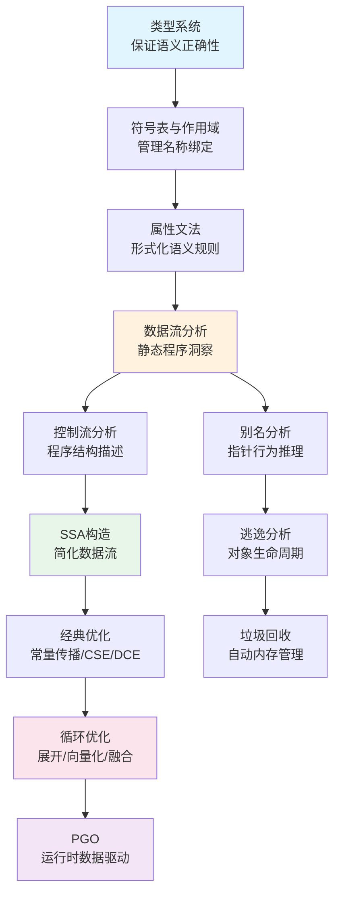

## 本章小结

本章系统地探讨了编译器中"理解代码"与"让代码跑得更快"这两大核心任务。从前端的类型检查、符号表管理，到中端的SSA构造、数据流分析，再到循环优化与配置文件导向优化（PGO），我们构建了一条从源代码到高效目标代码的完整知识链路。以下是对全章内容的系统回顾与深度提炼。

---

## 一、核心知识体系回顾

### 1.1 类型系统：程序安全的第一道防线

类型系统是语义分析的理论基石。它的本质可以用一句话概括：**用类型约束来消除一整类运行时错误**。

**三种核心能力：**

| 能力 | 作用 | 典型应用 |
|------|------|----------|
| **类型检查** | 验证表达式是否符合类型规则 | 编译期捕获类型不匹配错误 |
| **类型推导** | 自动推断表达式类型，减少标注负担 | Hindley-Milner算法（ML/Haskell） |
| **类型安全** | 保证程序不会执行无意义的操作 | 值保护（Progress & Preservation定理） |

**类型系统分类速查：**

按检查时机：  静态类型（编译时） vs 动态类型（运行时）
按严格程度：  强类型（禁止隐式转换） vs 弱类型（允许隐式转换）
按等价判断：  名义类型（基于名称） vs 结构类型（基于结构）
按表达力：    简单类型 → 参数化多态 → 子类型多态 → 高阶类型 → 依赖类型

**Hindley-Milner类型推导的核心机制**：Algorithm W通过三个关键操作实现完整的类型推导——**实例化**（将全称量化的类型方案替换为新类型变量）、**合一**（找到使两个类型一致的替换）、**泛化**（将自由类型变量用全称量词绑定）。合一算法配合Union-Find数据结构，均摊时间复杂度接近O(1)，使得类型推导在实际编译器中高效可行。

**多态的三个层次：**

- **参数化多态**：`∀α. List(α) → Int`，泛型函数对所有类型一视同仁。Rust/C++的单态化（Monomorphization）为每个具体类型生成特化代码，零运行时开销；Java/Go的类型擦除（Type Erasure）在运行时丢弃类型信息，节省二进制大小但引入装箱开销
- **特设多态**（Ad-hoc Polymorphism）：同一个函数名在不同类型上有不同实现。C++的函数重载和运算符重载、Haskell的typeclass、Rust的trait都是特设多态的实现
- **子类型多态**：子类型可以替代父类型使用。Java/C#的继承体系、TypeScript的结构类型都支持子类型多态

### 1.2 符号表与作用域管理

符号表是编译器管理名称声明与绑定的核心数据结构。现代编译器的符号表需要支持三种基本操作：**插入**（添加新的符号声明）、**查找**（根据名称检索信息）、**作用域进出**（维护嵌套的命名空间）。

**实现方案对比：**

| 方案 | 实现 | 优点 | 缺点 |
|------|------|------|------|
| 哈希表+作用域栈 | 每个作用域一个HashMap，栈管理嵌套 | 查找O(1)、实现简单 | 嵌套深时内存开销大 |
| 链表作用域 | 每个作用域链到父作用域 | 内存紧凑 | 查找O(depth) |
| 扁平化符号表 | 全局唯一名称（name mangling） | 查找极快 | 名称膨胀、调试困难 |

**作用域规则的本质区别：** 静态作用域（Lexical Scope）的变量绑定由源代码的文本结构决定——C、Java、Python、Rust都采用这种规则。动态作用域（Dynamic Scope）的变量绑定由运行时调用链决定——早期Lisp、Bash的`local`变量、Emacs Lisp的动态绑定使用这种规则。静态作用域更可预测、更利于优化；动态作用域更适合实现动态绑定模式（如Bash的`$1`在被调用函数中变化）。

### 1.3 属性文法：语义规则的形式化

属性文法将语义信息附加到CFG的文法符号上，为语法树的语义计算提供了精确的数学描述。

- **S-属性文法**：只有综合属性（值从子节点向上传递），适合自底向上分析。典型应用：表达式求值、类型标注
- **L-属性文法**：同时包含综合属性和继承属性（值从父节点/左兄弟节点向下传递），适合自顶向下分析。典型应用：类型检查、作用域管理

### 1.4 数据流分析：编译器优化的理论引擎

数据流分析是编译器优化的核心方法论。其统一框架建立在**格理论（Lattice Theory）**之上。

**格理论的四个要素：**

1. **值域L**：分析抽象域，如"变量集合"、"表达式集合"
2. **偏序关系⊑**：描述信息的精度关系，如集合的包含关系⊆
3. **合并操作⊓/⊔**：在控制流汇合点合并多条路径的信息
4. **传递函数f: L→L**：描述每条指令对抽象值的影响

**三大经典数据流分析：**

| 分析类型 | 方向 | 合并操作 | 核心用途 |
|----------|------|----------|----------|
| **活跃变量分析** | 反向 | 并集∪ | 寄存器分配、死代码消除 |
| **到达定值分析** | 正向 | 并集∪ | 常量传播、可用表达式 |
| **可用表达式分析** | 正向 | 交集∩ | 公共子表达式消除（CSE） |

活跃变量分析的传递函数：`f_d(S) = (S - DEF(d)) ∪ USE(d)`——先移除被定义的变量，再加入使用的变量。到达定值分析的传递函数：`f_d(S) = (S - KILL(d)) ∪ GEN(d)`——先移除被覆盖的定义，再加入新的定义。

数据流分析通过**迭代不动点算法**求解：反复应用传递函数直到分析值不再变化。在有限格上（深度为d，节点数为n），最坏时间复杂度为O(n × d)。

### 1.5 控制流分析：程序结构的图论描述

**控制流图（CFG）**将程序抽象为基本块（Basic Block）和边的有向图。基本块是最大化的连续指令序列，内部没有分支指令和分支目标（除了入口和出口）。

**支配关系**是控制流分析的核心概念：如果从入口到节点n的所有路径都必须经过节点d，则d支配n（d dom n）。**直接支配者（idom）**是支配关系的"最近"上界——idom(n)是支配n的节点中"最浅"的那个。支配者树（Dominator Tree）将支配关系组织成树结构，是SSA构造和许多优化的基础。

**自然循环识别**基于CFG中的回边（Back Edge）：如果存在边n→h使得h支配n，则(n,h)是回边，(h,n)构成一个自然循环。自然循环是循环优化（展开、向量化、融合）的基本单位。

### 1.6 SSA：现代编译器的IR范式

SSA（Static Single Assignment）要求每个变量恰好被赋值一次。这一简单不变量带来了深远的优化便利：

**φ函数**：在控制流汇合点，φ函数根据前驱块选择正确的值：
// 汇合点示例
if (cond)
    x1 = 1
else
    x2 = 2
x3 = φ(x1, x2)    // 根据来自哪个前驱选择值

**SSA构造的支配边界算法**：φ函数必须放置在变量定义的支配边界（Dominance Frontier）处。支配边界DF(n)是满足"d∈DF(n)当且仅当n不被d严格支配，且n的某个前驱被d支配"的节点集合。构造步骤：
1. 计算支配者树
2. 计算每个节点的DF集合
3. 在DF集合中的节点插入φ函数
4. 重复直到没有新φ函数被插入（因为新φ函数也是定义，会产生新的DF）

**SSA上的核心优化：**
- **稀疏条件常量传播（SCCP）**：同时执行常量传播和不可达代码消除，在SSA上极其高效
- **全局值编号（GVN）**：识别语义等价的表达式，消除冗余计算
- **部分冗余消除（PRE）**：在路径冗余而非全局冗余的情况下，也能消除重复计算

### 1.7 高级优化技术

**别名分析（Alias Analysis）**判断两个指针是否可能指向同一内存位置。别名分析的精度直接决定了编译器能做多少优化：
- **May-alias**：可能指向同一位置 → 保守，不能优化
- **Must-alias**：一定指向同一位置 → 激进，可大幅优化
- **No-alias**：一定不指向同一位置 → 安全地并行化

Andersen算法（基于包含约束）和Steensgaard算法（基于等价约束）是两个经典的指针分析框架：Andersen是上下文不敏感的、基于子集的分析，精度高但复杂度O(n³)；Steensgaard是基于联合-查找的，接近线性但精度低。

**逃逸分析**判断对象的生命周期是否超出了创建它的函数/线程。如果对象不逃逸：
- 可以在栈上分配而非堆上分配（避免GC压力）
- 可以消除不必要的同步操作
- 可以将对象分解为标量（Scalar Replacement）

**过程间分析（Interprocedural Analysis）**跨越函数边界进行分析，精度高于单独分析每个函数。典型技术包括上下文敏感的调用图构建、函数内联等。

### 1.8 垃圾回收算法

垃圾回收（GC）是托管语言运行时的核心组件。主要算法及其特点：

| 算法 | 时间复杂度 | 空间开销 | 暂停时间 | 适用场景 |
|------|-----------|----------|----------|----------|
| **标记-清除** | O(堆大小) | 低 | 高（Stop-the-World） | 小型应用 |
| **复制GC** | O(活跃对象) | 50%空间浪费 | 中 | 函数式语言运行时 |
| **标记-整理** | O(堆大小) | 低 | 高 | 大对象较多的场景 |
| **分代GC** | O(活跃对象) | 低 | 低（年轻代） | Java/.NET等主流语言 |
| **增量GC** | 分摊到多轮 | 中 | 低 | 交互式应用 |
| **并发GC** | O(堆大小) | 中 | 极低 | 低延迟要求的应用 |

**三色标记法**是现代并发GC的基础：白色=未访问、灰色=已访问但子节点未扫描、黑色=已完全扫描。GC从根集合开始，逐步将白色→灰色→黑色，最终回收仍为白色的对象。写屏障（Write Barrier）用于在并发标记期间维护不变量，防止漏标。

### 1.9 循环优化：榨取硬件并行能力

循环是程序性能的关键热点。循环优化的核心目标：**减少循环开销、利用缓存局部性、利用SIMD并行**。

**循环展开（Loop Unrolling）**：复制循环体以减少分支开销和增加指令级并行。展开因子的选择需要权衡：
- 太小：分支开销仍然显著
- 太大：指令缓存压力增大、寄存器溢出

**循环向量化（Loop Vectorization）**：将标量操作转换为SIMD向量操作，单条指令处理多个数据元素。SSE处理128位（4个float）、AVX处理256位（8个float）、AVX-512处理512位（16个float）。向量化的前提条件：循环迭代间没有数据依赖（或可安全的反依赖）、数据对齐、可预测的循环次数。

**循环融合与裂变**：
- **融合（Fusion）**：将两个遍历相同数据集的循环合并为一个，改善数据局部性
- **裂变（Fission）**：将一个大循环拆分为两个小循环，降低寄存器压力或为向量化创造条件

**循环分块（Loop Tiling）**：将循环的迭代空间划分为小块（Tile），使每个Tile的数据恰好装入L1/L2缓存。这是矩阵乘法等密集计算的标准优化手段。

### 1.10 PGO：让真实运行数据指导优化

Profile-Guided Optimization（PGO）弥补了静态分析的局限——编译器在编译期不知道哪些分支更热、哪些函数更频繁调用。PGO的完整工作流：

插桩编译 → 训练运行 → 配置文件分析 → 优化重编译
  (-fprofile-generate)    (真实工作负载)   (-fprofile-use)

PGO能带来10%-30%的性能提升，核心收益来源：
- **热路径优先布局**：将频繁执行的代码放在连续的内存地址，提高指令缓存命中率
- **精准内联决策**：只内联热函数，冷函数不内联以减少代码膨胀
- **分支概率优化**：根据实际分支概率重排条件跳转，减少分支预测失败
- **虚拟调用去虚化**：根据运行时类型信息，将虚拟调用转化为直接调用

---

## 二、全章技术脉络

本章的各部分并非孤立存在，而是构成了一条紧密的逻辑链：

**核心洞察：每一次优化都建立在更深层的抽象之上。**
- 类型信息使SSA的φ函数可以少插很多
- SSA使数据流分析变为稀疏的、高效的
- 数据流分析的结果驱动经典优化的决策
- 循环优化依赖控制流分析提供的循环结构
- PGO用真实数据弥补了所有静态分析的局限

---

## 三、关键公式与算法速查

| 概念 | 公式/模型 | 关键说明 |
|------|-----------|----------|
| **Little定律** | L = λW（平均请求数 = 到达率 × 平均处理时间） | 性能分析的数学基础 |
| **活跃变量** | IN[B] = USE[B] ∪ (OUT[B] - DEF[B]) | 反向数据流分析 |
| **到达定值** | OUT[B] = GEN[B] ∪ (IN[B] - KILL[B]) | 正向数据流分析 |
| **可用表达式** | OUT[B] = GEN[B] ∪ (IN[B] - KILL[B]) | 正向+交集合并 |
| **支配关系** | d dom n ⟺ 从入口到n的所有路径都经过d | 控制流分析的核心概念 |
| **支配边界** | DF(n) = {w | n被w的某个前驱支配，但n不被w严格支配} | SSA中φ函数插入位置 |
| **HM合一** | Unify(t₁, t₂) → θ 使得 θ(t₁) = θ(t₂) | 类型推导的核心操作 |
| **LLVM优化** | `-O0` → `-O2` → `-O3` → PGO → LTO | 优化级别的叠加 |
| **GC吞吐量** | G = 活跃对象数 × 单个标记时间 | GC停顿时间估算 |

---

## 四、优化技术决策矩阵

在实际工程中，不同的优化技术适用于不同场景。以下决策矩阵帮助你选择合适的优化路径：

| 优化目标 | 推荐技术 | 适用条件 | 典型收益 |
|----------|----------|----------|----------|
| 减少类型错误 | 静态类型系统 + 类型推导 | 新语言/DSL设计 | 编译期消除一整类bug |
| 消除冗余计算 | CSE/GVN/PRE | 存在重复表达式 | 10%-30%指令减少 |
| 减少分支开销 | PGO + 分支布局 | 有明确的热点路径 | 5%-15%延迟降低 |
| 提升循环性能 | 循环向量化 + 展开 | 数据并行循环 | 2x-8x吞吐提升 |
| 改善缓存局部性 | 循环分块/融合 | 矩阵/数组密集计算 | 3x-10x缓存命中提升 |
| 降低GC压力 | 逃逸分析 + 栈分配 | 小型短生命周期对象 | GC暂停降低50%+ |
| 减少代码膨胀 | 正确的内联策略 | 函数调用频繁 | 指令缓存命中提升 |

---

## 五、实践要点与工程经验

### 5.1 优化三原则

1. **正确性第一**：优化不能改变程序语义。任何违反这一点的"优化"都是bug。编译器优化的铁律是：如果优化后的程序行为与优化前不同，那么这不是优化，而是错误
2. **测量驱动决策**：不要凭直觉优化。先用profiler定位瓶颈，再选择针对性的优化手段。GCC的`-Rpass`和LLVM的`opt-viewer`可以帮助你理解优化是否生效以及为什么没有生效
3. **迭代优化**：编译器优化是一个多Pass的过程。每一遍优化可能为后续优化创造新的机会。理解Pass的执行顺序对于调试优化问题至关重要

### 5.2 阅读编译器输出的技巧

使用Compiler Explorer（godbolt.org）是学习编译器优化最直观的方式：

# GCC查看优化后的汇编
gcc -O2 -S -masm=intel -o - source.c

# Clang查看LLVM IR
clang -S -emit-llvm -O2 -o - source.c

# 查看优化报告
clang -O3 -Rpass=loop-vectorize -Rpass-missed=loop-vectorize source.c

关键观察点：
- **循环是否被展开**：看循环体是否出现多次重复指令
- **循环是否被向量化**：看是否使用了`vmovups`/`vaddps`等AVX指令
- **常量是否被折叠**：看编译期计算是否直接替换为结果值
- **死代码是否被消除**：看未使用的变量是否出现在汇编中
- **函数是否被内联**：看函数调用指令是否被替换为内联代码

### 5.3 常见陷阱

| 陷阱 | 原因 | 解决方案 |
|------|------|----------|
| 循环向量化未生效 | 存在循环依赖（特别是反依赖） | 用`restrict`指针或`#pragma ivdep`消除别名歧义 |
| 内联膨胀 | 过度内联导致指令缓存失效 | 控制内联深度，使用`-finline-limit`设置阈值 |
| PGO训练数据不充分 | 训练运行未覆盖典型场景 | 使用多样的工作负载进行训练 |
| SSAφ函数过多 | 控制流过于复杂 | 简化控制流，考虑区域化（Region-based）SSA |
| GC停顿过长 | 堆过大或存活对象过多 | 调整分代比例，启用并发GC |
| 类型推导失败 | 类型约束过强或存在循环类型 | 添加类型标注打破循环，检查类型变量绑定 |

---

## 六、进阶学习路线

### 6.1 深度方向

**深入方向一：现代编译器架构**
- LLVM的Pass Manager架构和中间表示设计
- GCC的GIMPLE/RTL中间表示和RTL优化Pass
- GraalVM的Sea-of-Nodes IR和投机优化

**深入方向二：程序分析理论**
- 抽象解释（Abstract Interpretation）：将程序语义映射到格上的数学框架
- 模型检测（Model Checking）：验证程序是否满足时序逻辑规约
- 定理证明（Theorem Proving）：形式化验证程序正确性

**深入方向三：语言设计与类型理论**
- 依赖类型（Dependent Types）：类型可以依赖于值，如Idris/Agda
- 效果系统（Effect System）：在类型层面追踪副作用
- 线性类型/唯一类型：Rust所有权系统的理论基础

**深入方向四：运行时系统**
- 并发GC的实现细节：Shenandoah、ZGC、C4等低延迟GC
- JIT编译的类型反馈与推测优化
- AOT vs JIT的权衡与混合方案

### 6.2 推荐资源

**经典教材：**
- *Compilers: Principles, Techniques, and Tools*（Dragon Book）—— 编译器领域的圣经，覆盖了本章所有核心概念
- *Modern Compiler Implementation in ML/Java/C*（Appel）—— 实践导向的编译器实现指南
- *Advanced Compiler Design and Implementation*（Muchnick）—— 高级优化技术的权威参考

**论文与技术报告：**
- K Cooper, Dtorczynski "Analysing the GIMPLE SSA representation" —— GCC SSA的权威解读
- Lengauer & Tarjan "A fast algorithm for finding dominators in a flowgraph" —— 支配者算法原始论文
- Cytron et al. "Efficiently Computing Static Single Assignment Form and the Control Flow Graph" —— SSA构造的奠基性论文
- Wegman & Zadeck "Constant propagation with conditional branches" —— 条件常量传播的经典算法

**在线资源：**
- [Compiler Explorer (godbolt.org)](https://godbolt.org/) —— 在线查看编译器输出，支持多种编译器和优化级别
- [LLVM Tutorial](https://llvm.org/docs/tutorial/) —— LLVM官方教程，从零构建一个编译器
- [Optimizing GHC](https://wiki.haskell.org/Optimising_GHC) —— Haskell编译器优化指南，展现函数式语言的优化思路
- [Chandler Carruth: "Efficiency with Algorithms, Performance with Data Structures"](https://www.youtube.com/watch?v=L7KvuacV9oQ) —— CppCon演讲，展示编译器优化如何与数据结构设计协同

### 6.3 推荐开源项目

| 项目 | 语言 | 关注点 | 地址 |
|------|------|--------|------|
| **LLVM** | C++ | 现代编译器基础设施、SSA IR、Pass框架 | github.com/llvm/llvm-project |
| **GCC** | C | 传统编译器优化、GIMPLE/RTL | gcc.gnu.org |
| **GraalVM** | Java | JIT编译、Sea-of-Nodes、投机优化 | github.com/oracle/graal |
| **MLton** | SML | 全程序优化的ML编译器 | mlton.org |
| **GHC** | Haskell | Hindley-Milner类型推导、惰性求值优化 | gitlab.haskell.org/ghc |

---

## 七、全章最佳实践清单

**类型系统设计：**
- 选择类型系统时，权衡安全性（强/静态）与灵活性（弱/动态）
- 利用类型推导减少标注负担，但关键接口处保留显式类型签名
- Rust式的所有权类型系统在编译期内存安全方面达到了新的高度
- 泛型设计时考虑单态化vs类型擦除的性能权衡

**数据流分析与优化：**
- 从活跃变量分析开始理解数据流框架，它是寄存器分配和死代码消除的基础
- SSA形式是现代优化的基石——学习在SSA上思考优化问题
- 利用Compiler Explorer验证每个优化是否按预期生效
- 使用GCC/Clang的`-Rpass`系列标志诊断优化决策

**循环优化：**
- 先确定瓶颈是否在循环内（profiling），再选择优化手段
- 向量化前确认没有循环依赖——这是最常见的阻碍因素
- 循环分块的关键是让工作集恰好装入缓存，需要了解目标硬件的缓存层次
- 循环展开因子通常为4-8，过多展开会适得其反

**PGO实践：**
- PGO是最具性价比的优化手段之一，工程投入小、收益大
- 训练运行要覆盖真实的工作负载分布，否则优化方向可能偏差
- PGO可以与LTO（Link-Time Optimization）叠加使用，进一步提升效果
- 持续集成中定期执行PGO流程，防止性能退化

**垃圾回收调优：**
- 选择合适的GC算法取决于应用特征：低延迟用并发GC，高吞吐用分代GC
- 监控GC指标（停顿时间、频率、吞吐量）是调优的前提
- 减少短生命周期对象的堆分配是降低GC压力的根本手段
- 逃逸分析帮助编译器将对象分配在栈上，避免进入GC管理

---

## 八、思考题与深度练习

### 基础题（检验理解）

1. **类型系统分类**：TypeScript的类型系统在"静态/动态"和"强/弱"两个维度上分别处于什么位置？与JavaScript相比，TypeScript的类型系统为编译器优化提供了哪些额外信息？

2. **数据流分析**：给定以下代码片段，手动计算活跃变量分析的IN和OUT集合：
a = 3
b = 5
c = a + b
d = c * a
e = d + c
从出口点反向分析，哪些变量在出口点是活跃的？

3. **SSA构造**：将以下代码转换为SSA形式，明确标出φ函数的插入位置：
x = 1
if (cond)
    x = 2
y = x + 1

### 进阶题（深入理解）

4. **HM类型推导**：给定表达式 `let id = fun x -> x in id (id 42)`，追踪Algorithm W的执行过程，写出每一步的类型变量分配和合一操作。最终推导出的类型是什么？

5. **支配边界**：画出以下CFG的支配者树，并计算每个节点的支配边界集合。然后标注所有需要插入φ函数的位置（假设x在B1和B3中被定义）：
B1 → B2 → B3
B1 → B4
B2 → B4
B3 → B4
B4 → B5

6. **PGO决策**：一段代码包含一个频繁调用但很少进入的异常分支。分析以下问题：
   - 静态优化器会如何处理这个分支？
   - PGO如何改善这个场景？
   - 画出优化前后的基本块布局

### 深度题（融会贯通）

7. **优化链路**：假设你有一个矩阵乘法`C = A × B`，分析从源代码到最终优化的完整路径——每一步会触发哪些优化？它们之间的依赖关系是什么？特别说明循环分块如何与向量化协同工作。

8. **类型与优化**：Rust的所有权系统在编译期保证了内存安全。从编译器优化的角度，分析所有权信息如何使以下优化成为可能：(a) 消除不必要的引用计数操作，(b) 推断`noalias`信息，(c) 栈分配决策。

9. **GC设计权衡**：设计一个在线游戏服务器的GC策略。要求：(a) 游戏逻辑的延迟<16ms（60fps），(b) 每秒处理10万条消息，(c) 内存使用<4GB。分析你会选择哪种GC算法、哪些调优参数，以及为什么。

---

## 九、下一章预告

编译器的前端（词法分析、语法分析、语义分析）和中端（SSA构造、数据流分析、循环优化）已经打通。下一章我们将进入编译器的**后端**——从中间表示到目标机器码的转换，包括指令选择、寄存器分配、指令调度等核心技术，揭示编译器如何将抽象的程序描述转化为真正运行在硬件上的高效机器码。
