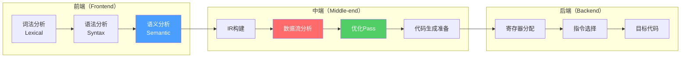
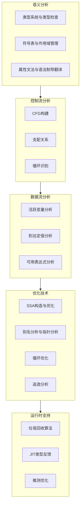
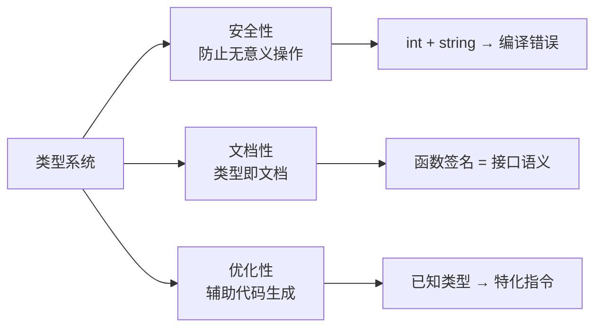
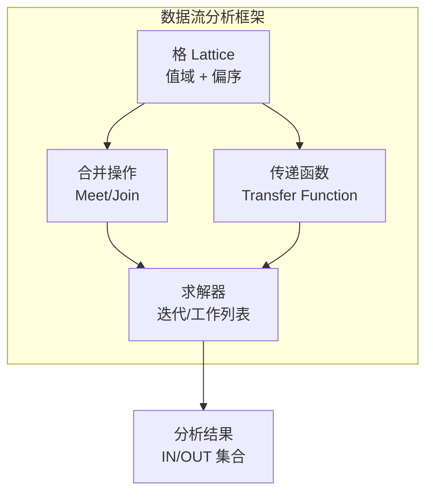
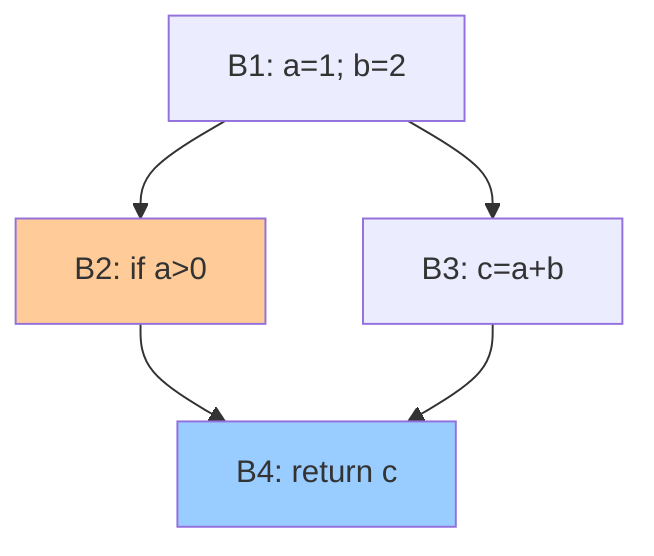
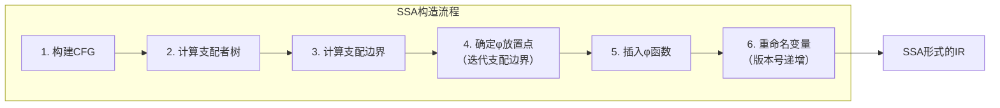
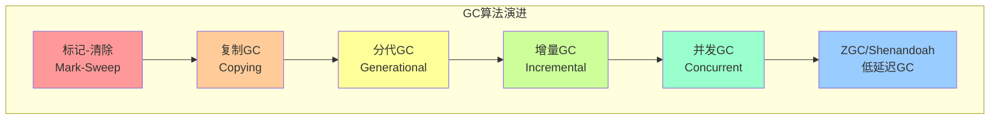
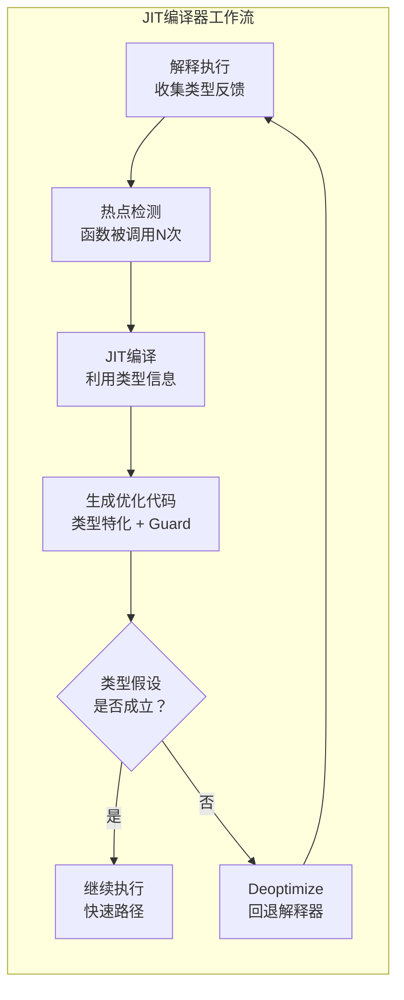

# 第27章 语义分析与优化

## 章节定位

语义分析是编译器前端的最后阶段，负责检查程序的语义正确性并构建更丰富的程序表示。优化则是编译器中端的核心任务，通过一系列保持语义的程序变换来提升生成代码的质量。语义分析与优化共同构成了从语法正确的源程序到高效目标代码之间的桥梁。



本章的核心定位：**语义分析**（蓝色）负责"程序是否正确"，**数据流分析与优化**（红色/绿色）负责"程序是否高效"。两者共同决定了编译器输出代码的质量上限。



## 核心主题

本章围绕语义分析与编译器优化的理论与实践展开，涵盖以下核心主题：

**类型系统与类型检查**：深入讨论类型系统的设计原理，包括类型检查、类型推导（Hindley-Milner算法）、类型安全等核心概念。类型系统不仅是语义分析的核心组件，更是现代编程语言设计的关键决策。

**符号表与作用域管理**：讨论符号表的数据结构设计、作用域规则（静态作用域与动态作用域）、名称解析算法，这些是语义分析的基础支撑。

**数据流分析框架**：系统介绍活跃变量分析、到达定值分析、可用表达式分析等经典数据流分析问题，以及格理论（Lattice Theory）这一统一的分析框架。数据流分析是编译器优化的理论基础。

**控制流分析**：讨论控制流图（CFG）构建、支配关系、自然循环识别等控制流分析技术，这些技术为循环优化和其他全局优化提供支撑。

**SSA构造与优化**：深入讨论静态单赋值形式（SSA）的构造算法（支配边界算法、φ函数放置）以及SSA上的优化技术（GVN、PRE、SCCP）。SSA是现代编译器最重要的IR形式之一。

**高级优化技术**：讨论别名分析、指针分析（Andersen/Steensgaard算法）、逃逸分析、过程间分析等高级优化技术，以及JIT编译中的类型反馈与推测优化。

**垃圾回收算法**：系统介绍标记-清除、复制、分代、增量、并发GC（三色标记法）等垃圾回收算法，GC是托管语言运行时的核心组件。

## 与其他章节的关系

- **第25章 编译器架构**：本章是编译器中端的详细实现
- **第26章 词法与语法分析**：本章的输入是语法分析产出的AST
- **第19章 程序分析与验证**：程序分析的理论基础与本章技术的交叉
- **第21章 性能工程**：编译器优化对程序性能的直接影响

## 学习目标

完成本章学习后，读者应能：
1. 理解类型系统的设计原理与类型推导算法
2. 掌握数据流分析的格理论框架
3. 理解SSA的构造算法与SSA上的优化技术
4. 分析别名分析与指针分析的精度与效率权衡
5. 理解主流垃圾回收算法的原理与权衡


***

# 27.1 理论基础：语义分析与优化

## 27.1.1 类型系统

### 类型系统概述

类型系统（Type System）是一组规则，用于为程序中的每个表达式分配、推导或检查一个类型。类型系统的核心目标是：



- **安全性**：防止程序执行无意义的操作（如将字符串与整数相加）
- **文档性**：类型标注作为程序的文档，帮助理解程序意图
- **优化性**：类型信息帮助编译器生成更高效的代码

类型系统按表达力和检查时机可以分为多种：

**核心理解**：类型系统的本质是"约束"——它限制了程序中每个表达式的可能取值。约束越强（如Rust的所有权系统），安全性越高但表达力可能受限；约束越弱（如JavaScript的隐式转换），灵活性越高但错误风险增大。选择何种类型系统是语言设计中最关键的决策之一。


| 分类 | 示例语言 | 特点 |
|------|---------|------|
| 静态类型 | C, Java, Rust | 编译时检查类型 |
| 动态类型 | Python, Ruby, JavaScript | 运行时检查类型 |
| 强类型 | Java, Python | 不允许隐式类型转换 |
| 弱类型 | C, JavaScript | 允许隐式类型转换 |
| 结构化类型 | Go (接口), TypeScript | 基于结构的类型等价 |
| 名义类型 | Java, C++ | 基于名称的类型等价 |

### 类型检查

类型检查（Type Checking）验证程序中的表达式是否符合类型规则。类型检查规则通常用推理规则（Inference Rules）表示：

函数应用规则：
  Γ ⊢ e₁ : T₁ → T₂    Γ ⊢ e₂ : T₁
  ─────────────────────────────────────
            Γ ⊢ e₁(e₂) : T₂

If表达式规则：
  Γ ⊢ e₁ : Bool    Γ ⊢ e₂ : T    Γ ⊢ e₃ : T
  ────────────────────────────────────────────────
               Γ ⊢ if e₁ then e₂ else e₃ : T

加法规则：
  Γ ⊢ e₁ : Int    Γ ⊢ e₂ : Int
  ───────────────────────────────
         Γ ⊢ e₁ + e₂ : Int

其中Γ（Gamma）是类型环境（Typing Context），存储变量到类型的映射。

### 类型推导：Hindley-Milner算法

Hindley-Milner（HM）类型系统是ML、Haskell等函数式语言的基础，支持完整的类型推导——程序员无需编写任何类型标注。

HM系统的核心概念：

**类型变量（Type Variable）**：表示未知类型，通常用α, β, γ等表示。

**类型构造器（Type Constructor）**：从已有类型构造新类型，如→（函数类型）、List（列表类型）。

**类型方案（Type Scheme）**：包含全称量化的类型，如∀α. α → α。

**替换（Substitution）**：将类型变量映射到具体类型的函数，记为θ。

**合一（Unification）**：找到一个替换θ使得两个类型在θ下相同。

**合一算法**：

function Unify(t1, t2, subst):
    t1 = ApplySubst(subst, t1)
    t2 = ApplySubst(subst, t2)
    
    if t1 == t2:
        return subst
    
    if t1 is type variable α:
        if α occurs in t2:
            error("infinite type: " + α + " in " + t2)  // 出现检查
        return extend(subst, α, t2)
    
    if t2 is type variable α:
        if α occurs in t1:
            error("infinite type")
        return extend(subst, α, t1)
    
    if t1 is T1(a1,...,an) and t2 is T2(b1,...,bm):
        if T1 ≠ T2 or n ≠ m:
            error("type mismatch: " + t1 + " vs " + t2)
        for i = 1 to n:
            subst = Unify(ai, bi, subst)
        return subst
    
    error("cannot unify " + t1 + " and " + t2)

**Hindley-Milner类型推导算法W**：

function AlgorithmW(env, expr):
    switch expr:
        case Variable x:
            // 查找x的类型方案，实例化
            scheme = lookup(env, x)
            return FreshInstance(scheme)
        
        case Lambda(x, body):
            // 为参数创建新的类型变量
            β = new_type_variable()
            // 在扩展的环境中推导body的类型
            env' = extend(env, x, β)
            (subst, τ) = AlgorithmW(env', body)
            return (subst, ApplySubst(subst, β) → τ)
        
        case Apply(e1, e2):
            (s1, τ1) = AlgorithmW(env, e1)
            (s2, τ2) = AlgorithmW(ApplySubst(s1, env), e2)
            β = new_type_variable()
            s3 = Unify(ApplySubst(s2, τ1), τ2 → β)
            return (s3 ∘ s2 ∘ s1, ApplySubst(s3, β))
        
        case Let(x, e1, e2):
            (s1, τ1) = AlgorithmW(env, e1)
            env' = ApplySubst(s1, env)
            // 泛化：将τ1中的自由类型变量量化
            scheme = Generalize(env', τ1)
            env'' = extend(env', x, scheme)
            (s2, τ2) = AlgorithmW(env'', e2)
            return (s2 ∘ s1, τ2)
        
        case Literal(n):
            return (id_subst, Int)
        
        case BoolLiteral(b):
            return (id_subst, Bool)

**泛化（Generalization）**：将类型中自由出现的、不在环境中的类型变量用全称量词绑定：

function Generalize(env, τ):
    // τ中的自由类型变量减去env中的自由类型变量
    free_in_τ = FreeTypeVars(τ)
    free_in_env = FreeTypeVars(env)
    vars = free_in_τ - free_in_env
    return ∀vars. τ

**实例化（Instantiation）**：将类型方案中的全称量词替换为新的类型变量：

function FreshInstance(scheme):
    if scheme = ∀α1...αn. τ:
        β1...βn = new_type_variables(n)
        return Substitute({α1→β1,...,αn→βn}, τ)
    else:
        return scheme

### 符号表管理

符号表（Symbol Table）是编译器中管理声明和作用域信息的核心数据结构。符号表需要支持：

- **插入**：添加新的符号声明
- **查找**：根据名称查找符号信息
- **作用域管理**：进入和退出作用域

常见的符号表实现方式：

**哈希表 + 作用域栈**：

class SymbolTable:
    scopes: Stack<HashMap<String, Symbol>>
    
    function enterScope():
        scopes.push(new HashMap())
    
    function exitScope():
        scopes.pop()
    
    function declare(name, symbol):
        scopes.top().put(name, symbol)
    
    function lookup(name):
        // 从内层作用域向外层查找
        for scope in scopes.reversed():
            if scope.contains(name):
                return scope.get(name)
        return null  // 未找到

**扁平化符号表**：将嵌套的名称展平为全局唯一名称，如C++的name mangling。

### 作用域规则

**静态作用域（Lexical Scope）**：变量的绑定由程序的文本结构决定，与运行时调用关系无关。大多数现代语言使用静态作用域。

// 静态作用域示例
let x = 1 in
let f = fun y -> x + y in
let x = 2 in
f 0  // 结果为1（f中的x绑定到外层的x=1）

**动态作用域（Dynamic Scope）**：变量的绑定由运行时的调用链决定。少数语言（如早期Lisp、Bash）使用动态作用域。

// 动态作用域示例
x = 1
def f(): return x
def g(): x = 2; return f()
g()  // 动态作用域下返回2，静态作用域下返回1

### 名称解析

名称解析（Name Resolution）将程序中的标识符引用绑定到其声明。名称解析通常在语义分析阶段完成。

function ResolveName(name, current_scope):
    scope = current_scope
    while scope is not null:
        if scope.declares(name):
            return scope.getDeclaration(name)
        scope = scope.parent
    error("undefined name: " + name)

对于面向对象语言，名称解析还需要考虑继承、多态等机制。方法解析顺序（MRO）在Python中使用C3线性化算法实现。

***

## 27.1.2 属性文法

属性文法（Attribute Grammar）在CFG的基础上为文法符号附加属性和计算规则，用于描述语言的语义。

### S-属性文法

S-属性文法（Synthesized Attribute Grammar）只有综合属性（Synthesized Attributes），属性值从子节点向父节点传递。

产生式：E → E₁ + T
综合属性：
  E.val = E₁.val + T.val

产生式：T → T₁ * F
综合属性：
  T.val = T₁.val * F.val

产生式：F → ( E )
综合属性：
  F.val = E.val

产生式：F → digit
综合属性：
  F.val = digit.lexval

S-属性文法可以直接在自底向上分析的过程中计算，因为综合属性只需要子节点的属性值。

### L-属性文法

L-属性文法（L-Attributed Grammar）同时包含综合属性和继承属性（Inherited Attributes）。继承属性从父节点或左兄弟节点传递。

产生式：D → T L
继承属性：
  L.inherited_type = T.type
综合属性：
  T.type = lookup(T.name)

产生式：L → L₁ , id
继承属性：
  L₁.inherited_type = L.inherited_type
综合属性：
  addType(id.entry, L.inherited_type)

L-属性文法可以在LL分析的过程中计算，因为继承属性只需要父节点和左兄弟节点的信息。

***

## 27.1.3 数据流分析

### 数据流分析框架

数据流分析（Data Flow Analysis）是编译器优化的理论基础。数据流分析框架由以下要素组成：

**直觉理解**：数据流分析回答的核心问题是："在程序的某个点，我知道什么？"例如，活跃变量分析问"在这一点之后，哪些变量的值还会被用到？"——如果答案是"没有"，那这个变量的赋值就是死代码，可以删除。数据流分析的本质是沿着程序的控制流图传播信息，直到信息稳定不再变化（收敛）。




不同数据流分析问题的对比：

| 分析类型 | 方向 | 合并操作 | 初始值 | 边界值 | 核心用途 |
|---------|------|---------|--------|--------|---------|
| 活跃变量 | 反向 | ∪ (并集) | ∅ | ∅ | 寄存器分配 |
| 到达定值 | 正向 | ∪ (并集) | ∅ | 全集 | 常量传播 |
| 可用表达式 | 正向 | ∩ (交集) | ∅ | ∅ | 公共子表达式消除 |
| 需要表达式 | 反向 | ∩ (交集) | 全集 | ∅ | 部分冗余消除 |


- **格（Lattice）**：值域L，带有偏序关系⊑，最小元素⊥，最大元素⊤
- **合并操作（Meet/Join）**：⊓（meet）或⊔（join）
- **传递函数（Transfer Function）**：f: L → L，描述每条指令对分析值的影响

**格理论基础**：一个格（L, ⊑, ⊓, ⊔）满足：
- 自反性：∀x. x ⊑ x
- 反对称性：x ⊑ y ∧ y ⊑ x → x = y
- 传递性：x ⊑ y ∧ y ⊑ z → x ⊑ z
- 最小上界（join）：x ⊔ y = min{z | x ⊑ z ∧ y ⊑ z}
- 最大下界（meet）：x ⊓ y = max{z | z ⊑ x ∧ z ⊑ y}

### 活跃变量分析

活跃变量分析（Liveness Analysis）确定在程序的每个点上，哪些变量的值可能在后续被使用。活跃变量分析是寄存器分配的基础。

**格**：集合格，L = 2^V（V是变量集合），⊑ = ⊆，⊓ = ∪

**传递函数**（对于语句d: x = ...）：
- DEF(d) = {x}（定义的变量）
- USE(d) = {出现在右值中的变量}（使用的变量）
- f_d(S) = (S - DEF(d)) ∪ USE(d)

**数据流方程**（反向分析）：

IN[B] = USE[B] ∪ (OUT[B] - DEF[B])
OUT[B] = ∪ IN[S]   (S是B的所有后继)

**迭代算法**：

function LivenessAnalysis(cfg):
    // 初始化
    for each block B:
        IN[B] = {}
        OUT[B] = {}
    
    changed = true
    while changed:
        changed = false
        for each block B in reverse order:
            // 计算OUT[B]
            new_out = {}
            for each successor S of B:
                new_out = new_out ∪ IN[S]
            
            // 计算IN[B]
            new_in = USE[B] ∪ (new_out - DEF[B])
            
            if new_in ≠ IN[B] or new_out ≠ OUT[B]:
                changed = true
                IN[B] = new_in
                OUT[B] = new_out

### 到达定值分析

到达定值分析（Reaching Definitions Analysis）确定在程序的每个点上，哪些变量的定义可能到达该点而未被覆盖。

**格**：集合格，L = 2^D（D是定义的集合），⊑ = ⊆，⊓ = ∪

**传递函数**（对于语句d: x = ...）：
- KILL(d) = 所有对x的其他定义
- GEN(d) = {d}
- f_d(S) = (S - KILL(d)) ∪ GEN(d)

**数据流方程**（正向分析）：

OUT[B] = GEN[B] ∪ (IN[B] - KILL[B])
IN[B] = ∪ OUT[P]   (P是B的所有前驱)

### 可用表达式分析

可用表达式分析（Available Expressions Analysis）确定在程序的每个点上，哪些表达式已经被计算过且其操作数未被修改。

**格**：集合格，L = 2^E（E是表达式的集合），⊑ = ⊆，⊓ = ∩

**传递函数**：
- KILL(e) = 使用了e的操作数的变量的所有赋值
- GEN(e) = {e}
- f_d(S) = (S - KILL(d)) ∪ GEN(d)

**数据流方程**（正向分析，使用交集而非并集）：

OUT[B] = GEN[B] ∪ (IN[B] - KILL[B])
IN[B] = ∩ OUT[P]   (P是B的所有前驱，初始为全集)

可用表达式分析使用交集作为合并操作，因为只有当所有路径上都可用时，表达式才可用。

***

## 27.1.4 控制流分析

### 控制流图（CFG）构建

控制流图（Control Flow Graph）是有向图G = (N, E)，其中N是基本块的集合，E是控制流边的集合。



**直觉理解**：CFG是程序的"交通地图"。基本块是"路段"（内部没有岔路口），边是"转弯"。优化器的任务是在这张地图上找到"拥堵点"（热点循环）和"废弃路段"（死代码），然后重新规划"路线"（代码变换）。


**基本块（Basic Block）**：一个最大化的指令序列，除了入口和出口外没有分支目标或分支指令。

function BuildBasicBlocks(instructions):
    leaders = {}  // 领导指令集合
    
    // 第一条指令是领导指令
    leaders.add(instructions[0])
    
    for each instruction i:
        if i is a branch:
            leaders.add(target of i)      // 跳转目标
            leaders.add(next instruction) // 跳转的下一条指令
        if i is a call:
            leaders.add(next instruction) // 调用后的指令
    
    // 根据领导指令划分基本块
    blocks = []
    current_block = []
    for each instruction i:
        if i in leaders and current_block is not empty:
            blocks.append(current_block)
            current_block = []
        current_block.append(i)
    if current_block is not empty:
        blocks.append(current_block)
    
    return blocks

### 支配关系

**支配（Domination）**：如果从入口到节点n的所有路径都经过节点d，则d支配n，记为d dom n。

**直接支配者（Immediate Dominator，idom）**：d是n的直接支配者，如果d dom n且不存在其他节点d'使得d dom d' dom n。

**支配者树（Dominator Tree）**：以直接支配关系为边的树。

**Lengauer-Tarjan算法**计算支配者树：

function LengauerTarjan(cfg):
    // 第一遍：DFS编号
    dfs_num = DFSNumbering(cfg)
    
    // 第二遍：计算semi-dominator
    for each node v in reverse DFS order:
        semi[v] = v
        for each predecessor u of v:
            if dfs_num[u] < dfs_num[v]:
                semi[v] = min(semi[v], dfs_num[u])
            else:
                semi[v] = min(semi[v], semi[Eval(u)])
        
        bucket[semi[v]].add(v)
        Link(parent[v], v)
        
        // 处理bucket[parent[v]]
        for each w in bucket[parent[v]]:
            v = Eval(w)
            if semi[v] == semi[w]:
                idom[w] = semi[w]
            else:
                idom[w] = v  // 延迟计算
        
        bucket[parent[v]] = {}
    
    // 第三遍：修正延迟的idom
    for each node w in DFS order (except root):
        if idom[w] ≠ semi[w]:
            idom[w] = idom[idom[w]]

### 回边与自然循环

**回边（Back Edge）**：如果边n→d的目标d支配源n，则该边是回边。

**自然循环（Natural Loop）**：由回边定义的循环。回边n→d的自然循环是d以及所有不经过d就能到达n的节点。

function FindNaturalLoop(back_edge_n_to_d):
    loop = {d}
    if n ≠ d:
        loop.add(n)
    
    stack = [n]
    while stack is not empty:
        node = stack.pop()
        for each predecessor p of node:
            if p not in loop:
                loop.add(p)
                stack.push(p)
    
    return loop

自然循环的性质：
- 有唯一的入口节点（支配循环中的所有节点）
- 从循环外到循环内的任何路径都经过入口节点
- 循环内的任何节点都可以到达回边的源节点

***

## 27.1.5 优化理论

### 别名分析

别名分析确定程序中指针/引用表达式之间的别名关系。别名分析是许多优化正确性的前提。

**直觉理解**：别名分析回答的问题是："这两个指针可能指向同一块内存吗？"如果答案是"不可能"，编译器就可以安全地重排序内存操作、消除冗余加载、甚至删除同步操作。但精确回答这个问题在理论上是不可判定的，所以实际中只能做近似。


**别名分析的精度等级**：

- **流不敏感（Flow-Insensitive）**：不考虑指令顺序，将整个程序作为一个整体分析
- **流敏感（Flow-Sensitive）**：考虑指令顺序，在不同程序点可能有不同的别名关系
- **上下文不敏感（Context-Insensitive）**：不区分调用点，将所有调用合并
- **上下文敏感（Context-Sensitive）**：区分不同调用点的分析结果

### 指针分析

**Andersen算法**是一种基于包含（Inclusion-based）的流不敏感上下文不敏感指针分析。其核心思想是将指针关系表示为集合包含约束：

约束类型：
1. p = &q    →  q ∈ pts(p)         （地址取值）
2. p = q     →  pts(q) ⊆ pts(p)    （赋值）
3. *p = q    →  ∀o ∈ pts(p): pts(q) ⊆ pts(o)  （间接赋值）
4. p = *q    →  ∀o ∈ pts(q): pts(o) ⊆ pts(p)  （间接读取）

function AndersenAnalysis(program):
    // 收集所有约束
    constraints = CollectConstraints(program)
    
    // 为每个变量初始化指向集合
    pts = {} for each variable
    
    // 迭代求解
    changed = true
    while changed:
        changed = false
        for each constraint:
            if constraint is "pts(q) ⊆ pts(p)":
                old_size = |pts(p)|
                pts(p) = pts(p) ∪ pts(q)
                if |pts(p)| > old_size:
                    changed = true
    
    return pts

Andersen算法的时间复杂度为O(n³)，空间复杂度为O(n²)。

**Steensgaard算法**是一种基于合一（Unification-based）的指针分析，将等价的变量合并为同一等价类。其复杂度接近O(nα(n))（α是反阿克曼函数），远快于Andersen算法但精度较低。

两种指针分析算法的对比：

| 特性 | Andersen算法 | Steensgaard算法 |
|------|-------------|-----------------|
| 约束类型 | 包含（Subset） | 合一（Unification） |
| 时间复杂度 | O(n³) | O(nα(n)) |
| 空间复杂度 | O(n²) | O(n) |
| 精度 | 高（更接近真实指向集） | 低（过度合并等价类） |
| 适用场景 | 需要高精度优化的静态编译器 | 需要快速分析的JIT编译器 |
| 代表实现 | GCC、LLVM | Java字节码分析 |


### 逃逸分析

逃逸分析（Escape Analysis）确定对象是否"逃逸"出创建它的方法或线程。未逃逸的对象可以进行优化：

- **栈分配**：将堆分配改为栈分配，减少GC压力
- **标量替换**：将对象拆分为其字段变量，消除对象分配
- **锁消除**：如果对象不逃逸出当前线程，可以消除同步操作

function EscapeAnalysis(method):
    for each allocation site in method:
        obj = allocation_site
        escaped = false
        
        // 检查对象是否逃逸
        for each use of obj:
            if use is assignment to static field:
                escaped = true  // 逃逸到堆
            if use is assignment to another object's field:
                escaped = true  // 逃逸到堆
            if use is passed to another method:
                escaped = true  // 可能逃逸
            if use is returned from method:
                escaped = true  // 逃逸到调用者
        
        if not escaped:
            // 可以进行栈分配或标量替换
            mark obj as non-escaping

### 过程间分析

过程间分析（Interprocedural Analysis）跨越函数边界进行分析。过程间分析需要处理函数调用，主要挑战是：

- **调用图构建**：在存在函数指针/虚方法调用时，调用图可能是不精确的
- **上下文敏感**：同一函数在不同调用点可能有不同的行为
- **递归处理**：递归调用需要特殊处理

**内联决策**是最重要的过程间优化。内联决策需要权衡：
- 内联后的代码量增加 vs. 优化机会增加
- 编译时间增加 vs. 运行时间减少
- 指令缓存压力 vs. 调用开销消除

***

## 27.1.6 SSA构造

### 支配边界算法

SSA构造的核心是确定在哪里放置φ函数。支配边界（Dominance Frontier）是解决这个问题的关键概念。



**直觉理解**：φ函数是"合流点的类型转换器"。当控制流从不同路径汇合时，同一个变量可能有多个版本，φ函数选择正确版本。支配边界精确地标记了这些合流点——它是"刚好不受某节点支配的汇合点"集合。

**支配边界**：节点x的支配边界DF(x)是满足以下条件的所有节点y的集合：x支配y的某个前驱，但x不严格支配y。

function IteratedDominanceFrontier(defsites, variables):
    // 对每个变量v，计算其迭代支配边界
    for each variable v:
        idf = {}
        worklist = defsites[v]  // v的所有定义点
        
        while worklist is not empty:
            X = worklist.remove()
            for each Y in DF(X):  // X的支配边界
                if Y not in idf:
                    idf.add(Y)
                    if Y not in defsites[v]:
                        worklist.add(Y)
        
        // idf就是需要放置φ函数的节点
        phi_sites[v] = idf

### φ函数放置

完整的SSA构造算法：

function ConstructSSA(cfg):
    // 1. 计算支配者树和支配边界
    dom_tree = ComputeDominatorTree(cfg)
    dom_frontier = ComputeDominanceFrontier(cfg, dom_tree)
    
    // 2. 收集每个变量的定义点
    for each instruction I in cfg:
        if I defines variable v:
            defsites[v].add(I.block)
    
    // 3. 计算需要放置φ函数的节点
    phi_blocks = {}
    for each variable v:
        phi_blocks[v] = IteratedDominanceFrontier(dom_frontier, defsites, v)
    
    // 4. 放置φ函数
    for each variable v:
        for each block B in phi_blocks[v]:
            InsertPhiFunction(B, v)
    
    // 5. 重命名变量
    RenamePass(dom_tree)

重命名使用栈来跟踪当前作用域内的变量版本：

function RenamePass(block):
    for each instruction I in block:
        // 处理定义：分配新版本号
        for each variable v defined by I:
            version[v]++
            rename I's definition to v_version
            stack[v].push(version[v])
        
        // 处理φ函数的参数：使用当前栈顶版本
        // (参数对应于从不同前驱来的版本)
    
    for each successor S of block:
        // 更新S中φ函数的参数
        for each φ function in S:
            phi.setArgument(block, stack[phi.variable].top())
    
    for each child C of block in dom_tree:
        RenamePass(C)
    
    // 回溯：撤销本块的定义
    for each instruction I in block:
        for each variable v defined by I:
            stack[v].pop()

***

## 27.1.7 SSA上的优化

### 全局值编号（GVN）

GVN为每个表达式分配一个唯一的值编号，相同编号的表达式计算结果相同：

function GVN(block):
    // 值编号表：表达式 → 编号
    value_table = {}
    // 编号 → 代表变量
    leader = {}
    next_num = 0
    
    for each instruction I in block:
        if I is "x = op(y, z)":
            // 获取操作数的值编号
            num_y = GetValueNumber(y)
            num_z = GetValueNumber(z)
            
            // 查找是否已有相同表达式
            key = (op, num_y, num_z)
            if key in value_table:
                // 复用已有的结果
                x.value_num = value_table[key]
                ReplaceUses(x, leader[x.value_num])
            else:
                // 分配新的值编号
                next_num++
                x.value_num = next_num
                value_table[key] = next_num
                leader[next_num] = x

### 部分冗余消除（PRE）

PRE是CSE和循环不变量外提的统一框架。PRE消除部分冗余的表达式——在某些路径上冗余但在其他路径上不冗余的表达式。

// 部分冗余示例
if (cond) {
    x = a + b;  // 路径1：计算了a+b
} else {
    // 路径2：没有计算a+b
}
y = a + b;      // 部分冗余：在路径1上冗余，在路径2上不冗余

// PRE优化后
if (cond) {
    x = a + b;
    t = a + b;    // 路径1：保存结果
} else {
    t = a + b;    // 路径2：提前计算
}
y = t;

PRE的分析框架使用可用表达式分析和忙碌表达式分析的组合。

### 稀疏条件常量传播（SCCP）

SCCP在SSA上进行常量传播，利用格理论框架处理条件分支：

格: ⊤ (未确定) → 常量值 → ⊥ (非常量)

function SCCP(cfg):
    // 初始化
    for each SSA name v:
        cell[v] = ⊤
    
    // 工作集
    ssa_worklist = []
    cfg_worklist = []
    
    // 将所有指令和边标记为可执行
    executable_edge = {}
    
    // 初始化：入口块的所有出边可执行
    for each successor S of entry:
        cfg_worklist.append((entry, S))
    
    while ssa_worklist not empty or cfg_worklist not empty:
        // 处理CFG工作集
        while cfg_worklist not empty:
            (B, S) = cfg_worklist.remove()
            if (B, S) not in executable_edge:
                executable_edge[(B, S)] = true
                for each φ in S:
                    EvaluatePhi(phi, ssa_worklist)
                if S has single predecessor B:
                    for each I in S:
                        EvaluateInst(I, ssa_worklist)
        
        // 处理SSA工作集
        while ssa_worklist not empty:
            I = ssa_worklist.remove()
            for each use of I's result:
                EvaluateInst(use, ssa_worklist)
            
            if I is a branch:
                if I's condition is constant:
                    // 标记目标边为可执行
                    cfg_worklist.append(...)

***

## 27.1.8 垃圾回收算法

### 标记-清除（Mark-Sweep）

标记-清除是最基本的GC算法，分为两个阶段：



各GC算法的核心权衡：

| 算法 | 暂停时间 | 吞吐量 | 内存开销 | 碎片 | 典型应用 |
|------|---------|--------|---------|------|---------|
| 标记-清除 | 高（全堆扫描） | 中 | 低 | 有 | 简单嵌入式系统 |
| 复制GC | 中（存活量正比） | 高 | 高（2倍） | 无 | 函数式语言运行时 |
| 分代GC | 低（新生代快） | 高 | 中 | 有 | JVM (Serial/Parallel) |
| 增量GC | 低（分步执行） | 中 | 中 | 有 | 交互式应用 |
| 并发三色标记 | 极低 | 中-高 | 中 | 无/有 | JVM G1/CMS |
| ZGC/Shenandoah | <10ms | 中 | 高 | 无 | 大堆低延迟场景 |


1. **标记阶段**：从根集合出发，标记所有可达对象
2. **清除阶段**：遍历整个堆，回收未标记的对象

function MarkSweepGC(roots):
    // 标记阶段
    for each obj in roots:
        Mark(obj)
    
    // 清除阶段
    for each obj in heap:
        if obj.marked:
            obj.marked = false  // 清除标记以便下次GC
        else:
            Free(obj)  // 回收未标记的对象

function Mark(obj):
    if obj is not null and not obj.marked:
        obj.marked = true
        for each field in obj:
            Mark(field.value)  // 递归标记引用的对象

标记-清除的特点：
- 不需要移动对象，保持地址稳定性
- 产生内存碎片
- 停顿时间与存活对象数量成正比

### 复制GC（Copying GC）

复制GC将堆分为两个半空间（From-Space和To-Space），每次GC将存活对象从From-Space复制到To-Space：

function CopyingGC(roots, from_space, to_space):
    free = to_space.start
    
    // 使用BFS进行对象复制
    for each root in roots:
        root = Copy(root, from_space, to_space, free)
    
    // 处理已复制对象中的引用
    scan = to_space.start
    while scan < free:
        for each field in scan:
            if field points to from_space:
                field = Copy(field.target, from_space, to_space, free)
        scan += scan.size
    
    // 交换from_space和to_space
    swap(from_space, to_space)

function Copy(obj, from, to, free):
    if obj is in from and not obj.copied:
        new_obj = free
        free += obj.size
        memcpy(new_obj, obj, obj.size)
        obj.forward = new_obj  // 设置转发指针
        obj.copied = true
        return new_obj
    elif obj is in from:
        return obj.forward  // 已复制，返回转发指针
    else:
        return obj  // 在to_space中，直接返回

复制GC的特点：
- 没有内存碎片（紧凑分配）
- 只处理存活对象，与存活对象数量成正比
- 需要两倍内存空间
- 移动对象，破坏地址稳定性

### 分代GC（Generational GC）

分代GC基于"大多数对象短命"（Generational Hypothesis）的观察，将堆分为多个代：

- **新生代（Young Generation）**：新分配的对象，GC频率高
- **老年代（Old Generation）**：存活较久的对象，GC频率低
- **永久代/元空间（Metaspace）**：类元数据等

新生代通常进一步分为Eden区和两个Survivor区：

function MinorGC(eden, survivor_from, survivor_to, old_gen):
    // 将Eden和survivor_from中的存活对象复制到survivor_to
    CopyLiveObjects(eden, survivor_to)
    CopyLiveObjects(survivor_from, survivor_to)
    
    // 对象晋升：如果survivor_to满了或对象年龄达到阈值
    for each obj in survivor_to:
        if obj.age >= tenuring_threshold or survivor_to.full:
            Promote(obj, old_gen)
        else:
            obj.age++
    
    // 交换survivor
    swap(survivor_from, survivor_to)
    // 清空Eden
    Clear(eden)

function MajorGC(old_gen):
    // 对老年代进行标记-清除或标记-压缩
    MarkCompactGC(old_gen)

### 增量GC与并发GC

**增量GC**将GC工作分成多个小步骤，与mutator（应用程序）交替执行，减少停顿时间。

**三色标记法**是增量/并发GC的基础：

- **白色**：未被标记的对象（可能是垃圾）
- **灰色**：已被标记但其引用的对象尚未被标记
- **黑色**：已被标记且其引用的对象也已被标记

function TriColorMarking(roots):
    // 初始化
    color all objects white
    gray_set = {}
    
    // 将根对象标记为灰色
    for each root in roots:
        color root gray
        gray_set.add(root)
    
    // 主循环
    while gray_set is not empty:
        obj = gray_set.remove()
        for each reference r in obj:
            if color(r) == white:
                color r gray
                gray_set.add(r)
        color obj black
    
    // 所有白色对象都是垃圾
    for each white object:
        Free(object)

**并发GC的挑战**：mutator可能在GC运行期间修改对象引用，导致：
1. **丢失标记**：黑色对象新引用了白色对象（该白色对象可能被错误回收）
2. **过早回收**：灰色对象删除了对白色对象的唯一引用

解决方案：
- **写屏障（Write Barrier）**：在mutator修改引用时通知GC
- **读屏障（Read Barrier）**：在mutator读取引用时进行检查
- **增量更新（Incremental Update）**：记录被修改的引用
- **快照在先（Snapshot-At-The-Beginning）**：在GC开始时记录堆的快照

***

## 27.1.9 JIT编译中的类型反馈与推测优化

### 类型反馈

类型反馈（Type Feedback）是JIT编译器利用运行时类型信息进行优化的技术。在解释执行阶段，运行时收集每个操作的实际类型信息：




```javascript
// JavaScript示例
function add(a, b) {
    return a + b;
}

// 执行时收集类型反馈
// 调用1: add(1, 2) → a: int, b: int
// 调用2: add(3, 4) → a: int, b: int
// 调用3: add("hello", " world") → a: string, b: string
```

### 推测优化

基于类型反馈，JIT编译器进行推测优化（Speculative Optimization）：

1. **类型特化**：为常见的类型组合生成特化的机器码
2. **Guard插入**：在优化代码中插入类型检查
3. **Deoptimization**：当类型假设被违反时，回退到未优化代码

// 推测优化的伪代码
if (typeof(a) == INT && typeof(b) == INT) {
    // 快速路径：直接整数加法
    result = fast_int_add(a, b)
} else {
    // 慢速路径：通用加法（处理字符串拼接等）
    result = generic_add(a, b)
}

**内联缓存（Inline Cache，IC）**：在每个调用点缓存之前看到的类型和目标：

// 单态内联缓存（Monomorphic IC）
function getProperty(obj, prop):
    if obj.shape == cached_shape:  // 形状检查
        return obj.fields[cached_offset]  // 直接访问
    else:
        // 缓存未命中，执行慢速查找
        result = slowLookup(obj, prop)
        updateCache(obj.shape, result.offset)
        return result

IC的多态程度：
- **单态（Monomorphic）**：只缓存一种类型，最快
- **多态（Polymorphic）**：缓存2-4种类型，较快
- **超态（Megamorphic）**：类型太多，退化为哈希查找

***

## 参考文献

1. Aho, A. V., Lam, M. S., Sethi, R., & Ullman, J. D. (2006). *Compilers: Principles, Techniques, and Tools* (2nd ed.). Pearson.
2. Muchnick, S. S. (1997). *Advanced Compiler Design and Implementation*. Morgan Kaufmann.
3. Hindley, R. (1969). The Principal Type-Scheme of an Object in Combinatory Logic. *Transactions of the AMS*.
4. Milner, R. (1978). A Theory of Type Polymorphism in Programming. *Journal of Computer and System Sciences*.
5. Cytron, R., et al. (1991). Efficiently Computing Static Single Assignment Form and the Control Dependence Graph. *ACM TOPLAS*.
6. Andersen, L. O. (1994). Program Analysis and Specialization for the C Programming Language. *PhD thesis, DIKU*.
7. Steensgaard, B. (1996). Points-to Analysis in Almost Linear Time. *POPL 1996*.
8. Jones, R., Hosking, A., & Moss, E. (2011). *The Garbage Collection Handbook*. CRC Press.
9. Click, C., & Paleczny, M. (1995). A Simple Graph-Based Intermediate Representation. *PEPM 1995*.
10. Hölzle, U., & Ungar, D. (1994). Optimizing Dynamically-Dispatched Calls with Run-Time Type Feedback. *PLDI 1994*.


***

# 第27章 语义分析与优化：核心技巧

语义分析与优化是编译器从语法正确的源代码到高效目标代码之间的关键桥梁。本节深入讨论类型推导实现、数据流分析框架实现、GC算法实现技巧以及SSA构造优化等核心技术的工程实践。

***

## 1. 类型推导实现技巧

### 1.1 合一算法的高效实现

合一（Unification）是类型推导的核心算法。在工程实现中，合一算法需要处理大量类型变量和复杂的类型结构，性能优化至关重要。

**基于Union-Find的合一实现**：

直接的递归合一算法在处理深度嵌套类型时可能产生大量临时替换。使用Union-Find（并查集）数据结构可以将合一操作的均摊复杂度降低到接近O(1)：

```python
class TypeVar:
    """类型变量，使用Union-Find管理等价类"""
    def __init__(self, id):
        self.id = id
        self.parent = self  # Union-Find的父指针
        self.rank = 0       # 按秩合并
        self.bound = None   # 绑定的具体类型

def find(tv):
    """查找类型变量的代表元素（路径压缩）"""
    if tv.parent != tv:
        tv.parent = find(tv.parent)  # 路径压缩
    return tv.parent

def union(tv1, tv2):
    """合并两个类型变量的等价类（按秩合并）"""
    root1, root2 = find(tv1), find(tv2)
    if root1 == root2:
        return
    if root1.rank < root2.rank:
        root1, root2 = root2, root1
    root2.parent = root1
    if root1.rank == root2.rank:
        root1.rank += 1

def unify(t1, t2):
    """合一两个类型"""
    t1 = deref(t1)  # 解引用到根类型变量
    t2 = deref(t2)
    
    if t1 is t2:
        return True
    
    if isinstance(t1, TypeVar):
        if occurs_check(t1, t2):
            raise TypeError(f"Infinite type: {t1} occurs in {t2}")
        t1.bound = t2  # 绑定类型变量
        return True
    
    if isinstance(t2, TypeVar):
        if occurs_check(t2, t1):
            raise TypeError(f"Infinite type: {t2} occurs in {t1}")
        t2.bound = t1
        return True
    
    if isinstance(t1, TypeCon) and isinstance(t2, TypeCon):
        if t1.name != t2.name or len(t1.args) != len(t2.args):
            raise TypeError(f"Type mismatch: {t1} vs {t2}")
        return all(unify(a, b) for a, b in zip(t1.args, t2.args))
    
    raise TypeError(f"Cannot unify {t1} and {t2}")

def deref(t):
    """解引用类型：沿着绑定链找到最终类型"""
    if isinstance(t, TypeVar):
        root = find(t)
        if root.bound is not None:
            return deref(root.bound)
        return root
    return t
```

**出现检查（Occurs Check）的优化**：

出现检查防止产生无限类型（如`α = List[α]`）。朴素实现在每次检查时遍历整个类型树，复杂度为O(n)。优化方法：

1. **标记法**：在类型变量上设置标记，遍历类型t2时检查标记而非比较引用
2. **深度限制**：设置类型嵌套深度上限，超过则报错（实用但不完整）
3. **增量检查**：在合一过程中维护类型图的拓扑信息，快速检测环

```python
def occurs_check(tv, ty):
    """检查类型变量tv是否出现在类型ty中"""
    ty = deref(ty)
    if ty is tv:
        return True
    if isinstance(ty, TypeCon):
        return any(occurs_check(tv, arg) for arg in ty.args)
    return False
```

### 1.2 类型推导的错误报告

类型推导的一个工程难点是错误报告。当合一失败时，直接报告"类型不匹配"往往不够有用——程序员需要知道错误的根源。

**类型错误的上下文追踪**：

在合一过程中维护"约束来源"信息，当合一失败时可以追溯到导致冲突的代码位置：

```python
class TypedExpr:
    """带类型约束来源的表达式"""
    def __init__(self, expr, expected_type, source_loc):
        self.expr = expr
        self.expected_type = expected_type
        self.source_loc = source_loc

def unify_with_context(t1, t2, context):
    """带上下文的合一，用于生成更好的错误信息"""
    try:
        return unify(t1, t2)
    except TypeError as e:
        # 收集约束链
        chain = collect_constraint_chain(t1, t2)
        error_msg = format_type_error(chain, context)
        raise TypeError(error_msg)

def collect_constraint_chain(t1, t2):
    """收集导致类型冲突的约束链"""
    chain = []
    # 追溯类型推导过程中积累的约束
    # 例如：x的类型要求是Int，但y赋值给了x，而y是String
    return chain
```

**Rust的类型推导错误信息**是业界标杆。Rust编译器会在错误信息中高亮相关代码，并用箭头标注类型约束的传播路径：

error[E0308]: mismatched types
 --> src/main.rs:4:18
  |
4 |     let x: i32 = "hello";
  |            ---   ^^^^^^^ expected `i32`, found `&str`
  |            |
  |            expected due to this

实现类似效果需要在类型推导过程中维护"期望类型"和"实际类型"的来源信息。

### 1.3 类型推导的增量计算

在IDE场景中，用户每输入一个字符都需要更新类型推导结果。全量重新推导可能太慢。

**增量类型推导的策略**：

1. **缓存类型环境**：在每个作用域边界缓存类型环境，只重新推导修改影响的作用域
2. **类型变量持久化**：未修改代码的类型变量保持不变，只对新增/修改的代码创建新的类型变量
3. **约束增量更新**：维护约束图，只更新受影响的约束

```python
class IncrementalTypeChecker:
    def __init__(self):
        self.type_cache = {}  # AST节点 → 推导的类型
        self.constraint_graph = {}  # 类型变量之间的约束关系
    
    def recheck(self, modified_range, ast):
        """增量类型检查"""
        # 1. 找到受影响的AST节点
        affected = find_affected_nodes(modified_range, ast)
        
        # 2. 清除受影响节点的类型缓存
        for node in affected:
            if node in self.type_cache:
                del self.type_cache[node]
        
        # 3. 只重新推导受影响的子树
        for node in affected:
            self.infer_type(node)
        
        # 4. 增量更新约束图
        self.propagate_constraints(affected)
```

***

## 2. 数据流分析框架实现

### 2.1 通用数据流分析框架

实际编译器中，通常实现一个通用的数据流分析框架，具体的分析问题通过参数化来配置：

```python
from enum import Enum
from abc import ABC, abstractmethod

class Direction(Enum):
    FORWARD = 1
    BACKWARD = 2

class DataFlowAnalysis(ABC):
    """通用数据流分析框架"""
    
    @abstractmethod
    def initial_value(self):
        """初始值（OUT[B]或IN[B]的初始值）"""
        pass
    
    @abstractmethod
    def boundary_value(self):
        """边界值（入口块或出口块的值）"""
        pass
    
    @abstractmethod
    def meet(self, values):
        """合并操作（∪或∩）"""
        pass
    
    @abstractmethod
    def transfer(self, block, input_value):
        """传递函数"""
        pass
    
    @property
    @abstractmethod
    def direction(self):
        """分析方向"""
        pass
    
    def analyze(self, cfg):
        """执行数据流分析"""
        # 初始化
        in_values = {}
        out_values = {}
        for block in cfg.blocks:
            in_values[block] = self.initial_value()
            out_values[block] = self.initial_value()
        
        # 设置边界值
        if self.direction == Direction.FORWARD:
            out_values[cfg.entry] = self.boundary_value()
        else:
            in_values[cfg.exit] = self.boundary_value()
        
        # 迭代
        changed = True
        while changed:
            changed = False
            blocks = cfg.blocks if self.direction == Direction.FORWARD \
                     else reversed(cfg.blocks)
            
            for block in blocks:
                if self.direction == Direction.FORWARD:
                    in_values[block] = self.meet(
                        [out_values[p] for p in block.predecessors]
                    )
                    new_out = self.transfer(block, in_values[block])
                    if new_out != out_values[block]:
                        out_values[block] = new_out
                        changed = True
                else:
                    out_values[block] = self.meet(
                        [in_values[s] for s in block.successors]
                    )
                    new_in = self.transfer(block, out_values[block])
                    if new_in != in_values[block]:
                        in_values[block] = new_in
                        changed = True
        
        return in_values, out_values
```

### 2.2 活跃变量分析实现

活跃变量分析是寄存器分配的基础，属于反向数据流分析：

```python
class LivenessAnalysis(DataFlowAnalysis):
    """活跃变量分析"""
    
    @property
    def direction(self):
        return Direction.BACKWARD
    
    def initial_value(self):
        return set()  # 空集
    
    def boundary_value(self):
        return set()  # 出口块的活跃变量通常为空（或包含返回值寄存器）
    
    def meet(self, values):
        return set.union(*values) if values else set()
    
    def transfer(self, block, out_live):
        """传递函数：IN[B] = USE[B] ∪ (OUT[B] - DEF[B])"""
        use = block.get_use_set()   # 块中使用但之前未定义的变量
        def_set = block.get_def_set()  # 块中定义的变量
        return use | (out_live - def_set)
```

**DEF和USE集合的计算**：

```python
def compute_def_use(block):
    """计算基本块的DEF和USE集合"""
    defs = set()
    uses = set()
    
    for instr in block.instructions:
        # USE：右值中出现的、在本指令之前未被定义的变量
        for var in instr.get_operands():
            if var not in defs:
                uses.add(var)
        
        # DEF：左值中被定义的变量
        defined = instr.get_defined_var()
        if defined:
            defs.add(defined)
    
    return defs, uses
```

### 2.3 工作列表算法优化

朴素的迭代算法每轮遍历所有基本块，效率较低。工作列表（Worklist）算法只处理发生变化的块：

```python
def worklist_analysis(cfg, analysis):
    """工作列表算法"""
    in_vals = {}
    out_vals = {}
    
    for block in cfg.blocks:
        in_vals[block] = analysis.initial_value()
        out_vals[block] = analysis.initial_value()
    
    # 边界条件
    if analysis.direction == Direction.FORWARD:
        out_vals[cfg.entry] = analysis.boundary_value()
    else:
        in_vals[cfg.exit] = analysis.boundary_value()
    
    # 初始化工作列表：所有块
    worklist = list(cfg.blocks)
    in_worklist = set(cfg.blocks)
    
    while worklist:
        block = worklist.pop(0)
        in_worklist.discard(block)
        
        if analysis.direction == Direction.FORWARD:
            # 计算IN[B]
            new_in = analysis.meet(
                [out_vals[p] for p in block.predecessors]
            )
            in_vals[block] = new_in
            # 计算OUT[B]
            new_out = analysis.transfer(block, new_in)
        else:
            # 计算OUT[B]
            new_out = analysis.meet(
                [in_vals[s] for s in block.successors]
            )
            out_vals[block] = new_out
            # 计算IN[B]
            new_in = analysis.transfer(block, new_out)
        
        # 检查是否发生变化
        if analysis.direction == Direction.FORWARD:
            if new_out != out_vals[block]:
                out_vals[block] = new_out
                # 将后继加入工作列表
                for succ in block.successors:
                    if succ not in in_worklist:
                        worklist.append(succ)
                        in_worklist.add(succ)
        else:
            if new_in != in_vals[block]:
                in_vals[block] = new_in
                for pred in block.predecessors:
                    if pred not in in_worklist:
                        worklist.append(pred)
                        in_worklist.add(pred)
    
    return in_vals, out_vals
```

**位向量优化**：当变量集合较大时，使用位向量替代集合操作可以显著提升性能。Python中可以使用`int`的位操作或`bitarray`库：

```python
class BitVectorSet:
    """基于位向量的集合"""
    def __init__(self, size):
        self.bits = 0
        self.size = size
    
    def add(self, elem):
        self.bits |= (1 << elem)
    
    def remove(self, elem):
        self.bits &amp;= ~(1 << elem)
    
    def contains(self, elem):
        return bool(self.bits &amp; (1 << elem))
    
    def union(self, other):
        result = BitVectorSet(self.size)
        result.bits = self.bits | other.bits
        return result
    
    def intersect(self, other):
        result = BitVectorSet(self.size)
        result.bits = self.bits &amp; other.bits
        return result
    
    def difference(self, other):
        result = BitVectorSet(self.size)
        result.bits = self.bits &amp; ~other.bits
        return result
```

***

## 3. GC算法实现技巧

### 3.1 标记-清除GC的实现细节

**栈式标记（Stack-based Marking）**：

递归标记在对象图深度较大时会导致栈溢出。使用显式栈替代递归：

```c
void mark_non_recursive(void *root) {
    if (root == NULL || is_marked(root)) return;
    
    // 使用显式栈
    void *stack[MAX_MARK_STACK];
    int top = 0;
    stack[top++] = root;
    
    while (top > 0) {
        void *obj = stack[--top];
        if (is_marked(obj)) continue;
        
        set_marked(obj);
        
        // 将所有引用的对象压入栈
        for (int i = 0; i < num_fields(obj); i++) {
            void *ref = get_field(obj, i);
            if (ref != NULL &amp;&amp; !is_marked(ref)) {
                stack[top++] = ref;
            }
        }
    }
}
```

**位图标记（Bitmap Marking）**：

不在对象头部设置标记位（会破坏缓存行），而是使用独立的位图：

```c
// 位图：每个对象对应一个位
unsigned char *mark_bitmap;
size_t heap_start;
size_t object_size;  // 假设所有对象大小相同

void mark_object(void *obj) {
    size_t index = ((size_t)obj - heap_start) / object_size;
    mark_bitmap[index / 8] |= (1 << (index % 8));
}

int is_marked(void *obj) {
    size_t index = ((size_t)obj - heap_start) / object_size;
    return (mark_bitmap[index / 8] >> (index % 8)) &amp; 1;
}
```

**空闲列表管理**：

标记-清除后需要管理空闲内存块。分离空闲列表（Segregated Free List）按大小分类管理空闲块：

```c
// 按大小分桶的空闲列表
#define NUM_SIZE_CLASSES 32
void *free_lists[NUM_SIZE_CLASSES];

int size_class(size_t size) {
    // 计算size属于哪个桶（向上取整到2的幂）
    int cls = 0;
    size_t s = 16;  // 最小对象大小
    while (s < size &amp;&amp; cls < NUM_SIZE_CLASSES - 1) {
        s *= 2;
        cls++;
    }
    return cls;
}

void *gc_alloc(size_t size) {
    int cls = size_class(size);
    if (free_lists[cls] != NULL) {
        void *ptr = free_lists[cls];
        free_lists[cls] = *(void **)ptr;  // 链表头指针
        return ptr;
    }
    // 从堆中分配新的块
    return allocate_from_heap(1 << (cls + 4));
}
```

### 3.2 分代GC的写屏障实现

分代GC需要写屏障来追踪老年代到新生代的引用：

```c
// 记忆集（Remembered Set）：存储老年代到新生代的跨代引用
typedef struct {
    void **cards;     // 卡表：将堆分为固定大小的"卡"
    size_t num_cards;
} RememberedSet;

RememberedSet remembered_set;

// 写屏障：在对象引用被修改时调用
void write_barrier(void *obj, void **field, void *new_val) {
    // 判断是否是跨代引用
    if (is_old_gen(obj) &amp;&amp; is_young_gen(new_val)) {
        // 将obj所在的卡标记为脏
        size_t card_index = ((size_t)obj - heap_start) / CARD_SIZE;
        remembered_set.cards[card_index] = DIRTY;
    }
    // 执行实际的写操作
    *field = new_val;
}

// 卡表扫描：在Minor GC时扫描所有脏卡
void scan_remembered_set() {
    for (size_t i = 0; i < remembered_set.num_cards; i++) {
        if (remembered_set.cards[i] == DIRTY) {
            // 扫描该卡中所有对象，找到指向新生代的引用
            void *card_start = (void *)(heap_start + i * CARD_SIZE);
            scan_card_for_young_refs(card_start);
            remembered_set.cards[i] = CLEAN;
        }
    }
}
```

### 3.3 并发GC的写屏障优化

并发GC（如G1、ZGC）的写屏障需要在不暂停应用的情况下维护GC不变量。

**G1的写屏障（SATB - Snapshot-At-The-Beginning）**：

```c
// SATB写屏障：在引用被覆盖前保存旧值
void *satb_buffer[SATB_BUFFER_SIZE];
int satb_index = 0;

void g1_write_barrier(void **slot, void *new_val) {
    void *old_val = *slot;
    
    // 如果旧值不为空，将其加入SATB缓冲区
    if (old_val != NULL) {
        satb_buffer[satb_index++] = old_val;
        
        // 缓冲区满时，将其加入全局缓冲区列表
        if (satb_index >= SATB_BUFFER_SIZE) {
            enqueue_satb_buffer(satb_buffer, satb_index);
            satb_index = 0;
        }
    }
    
    *slot = new_val;
}
```

**ZGC的染色指针（Colored Pointer）**：

ZGC使用指针中的额外位来存储GC元数据，避免修改对象头：

```c
// ZGC指针布局（64位系统）：
// [63:42] 未使用
// [41:40] 染色位（marked0, marked1, remapped, finalizable）
// [39:0]  对象地址

#define ZGC_COLOR_BITS  0x0000030000000000ULL
#define ZGC_ADDRESS_MASK 0x000000FFFFFFFFFFULL

typedef uintptr_t zpointer;

void *zgc_deref(zpointer ptr) {
    return (void *)(ptr &amp; ZGC_ADDRESS_MASK);
}

int zgc_is_marked(zpointer ptr) {
    return (ptr &amp; ZGC_COLOR_BITS) != 0;
}

zpointer zgc_mark(zpointer ptr, int color) {
    return (ptr &amp; ~ZGC_COLOR_BITS) | ((uintptr_t)color << 40);
}
```

***

## 4. SSA构造优化

### 4.1 支配边界计算的高效实现

支配边界计算是SSA构造的关键步骤。使用Sreedhar和Gao的DJ-graph方法可以更高效地计算：

```python
def compute_dominance_frontier(cfg, idom):
    """计算支配边界（Cooper等人算法）"""
    df = {node: set() for node in cfg.nodes}
    
    for node in cfg.nodes:
        # 只处理有多个前驱的节点
        if len(node.predecessors) >= 2:
            for pred in node.predecessors:
                runner = pred
                while runner != idom[node]:
                    df[runner].add(node)
                    runner = idom[runner]
    
    return df
```

**关键优化**：只处理有多个前驱的节点（汇合点），因为只有这些节点才可能是支配边界的目标。

### 4.2 支配者树的增量更新

当CFG发生小的变化（如添加一条边）时，不需要重新计算整个支配者树。增量更新算法：

```python
def incremental_idom_update(cfg, idom, added_edge):
    """增量更新支配者树"""
    src, dst = added_edge
    
    # 如果src支配dst，添加的边不影响支配关系
    if dominates(idom, src, dst):
        return idom
    
    # 否则需要更新dst及其后代的直接支配者
    # 找到dst的新直接支配者：所有支配dst的节点中，最不严格的
    new_idom = find_new_idom(cfg, idom, dst)
    
    if new_idom != idom[dst]:
        idom[dst] = new_idom
        # 递归更新dst的后代
        update_descendants(cfg, idom, dst)
```

### 4.3 SSA的内存高效表示

SSA形式中，每个变量可能有大量版本。高效的内存表示至关重要：

```c
// SSA值的紧凑表示
typedef struct {
    unsigned var_id : 16;   // 变量ID
    unsigned version : 16;  // 版本号
    unsigned opcode : 8;    // 操作码
    unsigned num_ops : 8;   // 操作数数量
} SSAValue;

// φ函数的紧凑表示
typedef struct {
    unsigned var_id : 16;
    unsigned version : 16;
    unsigned num_incoming : 16;
    unsigned block_id : 16;
    // 后面紧跟着num_incoming个(source_block, value)对
    struct { unsigned block; unsigned value; } incoming[];
} PhiNode;
```

### 4.4 SSA消除（从SSA到可执行代码）

SSA形式中的φ函数在实际机器上没有对应指令。从SSA转换回普通形式需要消除φ函数：

```python
def eliminate_phi(block):
    """消除基本块开头的φ函数"""
    phi_renames = {}  # φ变量 → 源变量的映射
    
    for phi in block.phi_functions:
        for (pred_block, source_val) in phi.incoming:
            # 在前驱块的末尾插入复制指令
            copy_instr = CopyInstr(phi.target, source_val)
            pred_block.insert_before_terminator(copy_instr)
    
    # 删除φ函数
    block.phi_functions.clear()
```

**关键注意点**：

1. **并行复制**：多个φ函数可能形成循环依赖（如`a = φ(b), b = φ(a)`），需要同时执行所有复制，不能逐个执行
2. **临时变量**：使用临时变量打破循环依赖

```python
def parallel_copy_elimination(copies):
    """消除并行复制中的循环依赖"""
    # copies: [(dst1, src1), (dst2, src2), ...]
    
    # 构建依赖图
    # 如果dst_i = src_j且dst_j = src_k，形成链
    remaining = list(copies)
    result = []
    
    while remaining:
        # 找一个没有循环依赖的复制
        for i, (dst, src) in enumerate(remaining):
            # 检查src是否被其他复制的目标覆盖
            src_is_target = any(d == src for d, s in remaining if d != dst)
            if not src_is_target:
                result.append((dst, src))
                remaining.pop(i)
                break
        else:
            # 所有剩余的都是循环依赖，使用临时变量打破
            dst, src = remaining[0]
            temp = fresh_temp()
            result.append((temp, src))
            # 将所有引用src作为目标的复制改为引用temp
            for i in range(len(remaining)):
                if remaining[i][1] == dst:
                    remaining[i] = (remaining[i][0], temp)
            remaining[0] = (dst, temp)
    
    return result
```

***

## 5. 别名分析实现技巧

### 5.1 Andersen算法的优化

朴素的Andersen算法复杂度为O(n³)，通过以下优化可以显著提升性能：

```python
class OptimizedAndersen:
    """优化的Andersen指针分析"""
    
    def __init__(self):
        self.pts = {}       # 变量 → 指向集合
        self.constraints = []  # 包含约束列表
        self.worklist = []     # 增量工作列表
        self.dep_graph = {}    # 依赖图：pts(x)变化时需要检查的约束
    
    def add_subset(self, src, dst):
        """添加 pts(src) ⊆ pts(dst) 约束"""
        # 如果pts(src)尚未有新元素，加入依赖图
        if src not in self.dep_graph:
            self.dep_graph[src] = []
        self.dep_graph[src].append(dst)
        
        # 初始传播
        old_size = len(self.pts.get(dst, set()))
        self.pts.setdefault(dst, set()).update(self.pts.get(src, set()))
        if len(self.pts[dst]) > old_size:
            self.worklist.append(dst)
    
    def solve(self):
        """增量求解（避免每轮扫描所有约束）"""
        while self.worklist:
            var = self.worklist.pop(0)
            if var in self.dep_graph:
                for dependent in self.dep_graph[var]:
                    old_size = len(self.pts.get(dependent, set()))
                    self.pts.setdefault(dependent, set()).update(self.pts[var])
                    if len(self.pts[dependent]) > old_size:
                        self.worklist.append(dependent)
```

**关键优化点**：

1. **增量传播**：只在pts(x)增大时才传播，使用工作列表避免扫描所有约束
2. **依赖图**：预先建立约束之间的依赖关系，避免无关约束的检查
3. **位向量表示**：指向集合用位向量表示，集合操作使用位运算
4. **变量排序**：按变量的约束数量排序，先处理约束少的变量

### 5.2 流敏感分析的实现

流敏感的别名分析需要在不同程序点维护不同的别名信息。使用SSA形式可以简化流敏感分析：

```python
def flow_sensitive_analysis(cfg):
    """基于SSA的流敏感别名分析"""
    # 在SSA形式上，每个变量版本对应唯一的定义点
    # 因此不需要显式维护不同程序点的别名信息
    
    aliases = {}  # SSA版本号 → 指向集合
    
    for block in cfg.topological_order():
        for instr in block.instructions:
            if instr.op == 'address_of':
                # p = &amp;x  →  pts(p) = {x}
                aliases[instr.result] = {instr.operand}
            elif instr.op == 'copy':
                # p = q   →  pts(p) = pts(q)
                aliases[instr.result] = aliases.get(instr.operand, set()).copy()
            elif instr.op == 'load':
                # p = *q  →  pts(p) = ∪{pts(r) | r ∈ pts(q)}
                result_set = set()
                for target in aliases.get(instr.operand, set()):
                    result_set.update(aliases.get(target, set()))
                aliases[instr.result] = result_set
            elif instr.op == 'store':
                # *p = q  →  ∀r ∈ pts(p): pts(r) += pts(q)
                for target in aliases.get(instr.pointer, set()):
                    aliases.setdefault(target, set()).update(
                        aliases.get(instr.value, set())
                    )
    
    return aliases
```

***

## 6. 循环优化实现技巧

### 6.1 循环不变量外提（LICM）

循环不变量外提将不依赖循环变量的计算移到循环外：

```python
def licm(loop):
    """循环不变量外提"""
    # 1. 收集循环中所有定义的变量
    loop_defs = set()
    for block in loop.blocks:
        for instr in block.instructions:
            if not isinstance(instr, PhiNode):
                loop_defs.add(instr.result)
    
    # 2. 找出循环不变量指令
    changed = True
    loop_invariants = set()
    while changed:
        changed = False
        for block in loop.blocks:
            for instr in block.instructions:
                if instr in loop_invariants:
                    continue
                # 条件：所有操作数都在循环外定义，或者是已知的循环不变量
                if all(op not in loop_defs or op in loop_invariants 
                       for op in instr.operands):
                    # 额外检查：该指令不会抛异常（如除法），或者循环至少执行一次
                    if is_safe_to_hoist(instr, loop):
                        loop_invariants.add(instr)
                        changed = True
    
    # 3. 将不变量指令移到循环前置头（preheader）
    preheader = loop.get_or_create_preheader()
    for instr in loop_invariants:
        instr.block.remove(instr)
        preheader.insert_before_terminator(instr)
```

### 6.2 循环展开的实现

循环展开通过复制循环体减少分支开销：

```python
def unroll_loop(loop, factor):
    """循环展开，展开因子为factor"""
    # 1. 检查是否可以安全展开
    if not can_unroll(loop, factor):
        return
    
    # 2. 复制循环体
    original_body = loop.body
    for i in range(1, factor):
        new_body = clone_basic_blocks(original_body)
        # 重命名新块中的SSA变量
        rename_ssa_vars(new_body, i)
        # 将新块插入循环
        loop.insert_body(new_body)
    
    # 3. 调整循环步长
    loop.trip_count = loop.trip_count // factor
    
    # 4. 添加循环剥离（Loop Peeling）处理余数
    remainder = loop.trip_count % factor
    if remainder > 0:
        peeled = clone_basic_blocks(original_body)
        # 将余数循环放在主循环之前或之后
        insert_peeled_iteration(loop, peeled, remainder)
```

***

## 7. 优化Pass管理

### 7.1 Pass调度策略

优化Pass的执行顺序对最终代码质量有重大影响。典型的Pass调度：

```python
OPTIMIZATION_PIPELINE = [
    # 早期清理
    ("simplify_cfg", 1),       # 简化控制流图
    ("dce", 1),                # 死代码消除
    
    # SSA构造
    ("build_ssa", 1),
    
    # 主要优化循环
    *([("gvn", 1),              # 全局值编号
       ("licm", 1),             # 循环不变量外提
       ("sccp", 1),             # 稀疏条件常量传播
       ("dce", 1),              # 死代码消除
       ("simplify_cfg", 1),     # 简化CFG
       ("loop_unroll", 1),      # 循环展开
      ] * 2),                   # 重复两轮
    
    # 晚期优化
    ("inline", 1),              # 函数内联
    ("gvn", 1),
    ("dce", 1),
    
    # SSA消除
    ("eliminate_phi", 1),
    
    # 寄存器分配前的优化
    ("peephole", 1),            # 窥孔优化
]
```

### 7.2 优化正确性验证

每个优化Pass都必须保持程序语义不变。常用的验证方法：

```python
def verify_optimization(original_ir, optimized_ir):
    """验证优化的正确性"""
    # 1. 结构验证：检查IR的基本结构完整性
    verify_cfg_structure(optimized_ir)
    verify_ssa_form(optimized_ir)
    
    # 2. 类型验证：检查优化后的类型一致性
    verify_types(optimized_ir)
    
    # 3. 数据流验证：检查DEF-USE链的完整性
    verify_def_use_chains(optimized_ir)
    
    # 4. 指令验证：每条指令的操作数和结果类型匹配
    for block in optimized_ir.blocks:
        for instr in block.instructions:
            verify_instruction(instr)
```

LLVM的`-verify-each`选项在每个Pass后运行验证器，是开发新优化Pass时的必备工具。


***

# 第27章 语义分析与优化：实战案例

语义分析与优化技术在真实编译器中的实现往往比理论描述复杂得多。本节通过分析LLVM、JVM和V8三个代表性系统的优化实现，展示理论到工程的转化过程。

***

## 案例一：LLVM优化Pass体系——模块化的编译器中端

### 1.1 LLVM的Pass管理架构

LLVM采用Pass管道（Pass Pipeline）架构组织优化。每个优化是一个独立的Pass，通过Pass管理器调度执行。

**LLVM Pass的演进**：

LLVM经历了三代Pass管理器：
- **Legacy Pass Manager**：基于继承的Pass接口，使用`PassManager`和`FunctionPassManager`
- **New Pass Manager**：基于模板和CRTP（Curiously Recurring Template Pattern），编译时类型安全
- **MLIR Pass Manager**：支持嵌套的IR方言（Dialect）和嵌套Pass

```cpp
// LLVM新Pass管理器的Pass定义
struct MyPass : public PassInfoMixin<MyPass> {
    PreservedAnalyses run(Function &amp;F, FunctionAnalysisManager &amp;AM) {
        // 获取分析结果
        auto &amp;DT = AM.getResult<DominatorTreeAnalysis>(F);
        auto &amp;LI = AM.getResult<LoopAnalysis>(F);
        
        // 执行优化...
        bool Changed = optimize(F, DT, LI);
        
        // 报告哪些分析结果仍然有效
        if (!Changed)
            return PreservedAnalyses::all();
        PreservedAnalyses PA;
        PA.preserve<DominatorTreeAnalysis>();
        PA.preserve<LoopAnalysis>();
        return PA;
    }
};

// 注册到Pass管道
void addMyPass(FunctionPassManager &amp;FPM) {
    FPM.addPass(MyPass());
}
```

**Pass依赖管理**：LLVM的分析结果是惰性计算和缓存的。当一个Pass请求某个分析结果时，如果该分析仍然有效（未被之前的Pass使失效），直接返回缓存结果；否则重新计算。这避免了不必要的重复分析。

### 1.2 LLVM的GVN Pass实现

全局值编号（GVN）是LLVM最重要的优化Pass之一。LLVM的GVN实现结合了多种优化技术：

**基于SSA的值编号**：

```cpp
// LLVM GVN的核心逻辑（简化）
class GVNPass : public PassInfoMixin<GVNPass> {
    struct Expression {
        uint32_t opcode;
        Value *op1, *op2;
        Type *ty;
        
        // 用于哈希表查找
        bool operator==(const Expression &amp;other) const {
            return opcode == other.opcode &amp;&amp; op1 == other.op1 
                &amp;&amp; op2 == other.op2 &amp;&amp; ty == other.ty;
        }
    };
    
    DenseMap<Expression, Value*> leaderTable;
    DenseMap<Value*, uint32_t> valueNumbering;
    uint32_t nextVN = 0;
    
    uint32_t lookupOrAssignVN(Value *V) {
        auto it = valueNumbering.find(V);
        if (it != valueNumbering.end())
            return it->second;
        
        if (auto *I = dyn_cast<Instruction>(V)) {
            Expression E;
            E.opcode = I->getOpcode();
            E.op1 = I->getNumOperands() > 0 ? I->getOperand(0) : nullptr;
            E.op2 = I->getNumOperands() > 1 ? I->getOperand(1) : nullptr;
            E.ty = I->getType();
            
            auto it2 = leaderTable.find(E);
            if (it2 != leaderTable.end()) {
                // 已有相同表达式，可以替换
                replaceInstruction(I, it2->second);
                return lookupOrAssignVN(it2->second);
            }
            
            // 新的表达式
            nextVN++;
            valueNumbering[V] = nextVN;
            leaderTable[E] = V;
            return nextVN;
        }
        
        nextVN++;
        valueNumbering[V] = nextVN;
        return nextVN;
    }
};
```

**LLVM GVN的独特之处**：

1. **结合Load消除**：LLVM的GVN不仅消除冗余计算，还消除冗余的内存加载。如果两次加载之间没有对该内存地址的写操作，第二次加载可以复用第一次的结果。

2. **基于MemorySSA的内存依赖分析**：传统方法使用别名分析判断两次加载是否可能冲突。LLVM引入了MemorySSA，将内存操作也表示为SSA形式，使得内存依赖查询更加高效。

3. **PRE（部分冗余消除）集成**：LLVM的GVN包含PRE功能，可以处理在某些路径上冗余、在其他路径上不冗余的表达式。

```cpp
// LLVM中GVN-PRE的简化逻辑
Value *GVNPass::performPRE(Instruction *I, BasicBlock *BB) {
    // 检查表达式在BB的所有前驱是否都可用
    bool available_anywhere = false;
    bool unavailable_anywhere = false;
    
    for (BasicBlock *Pred : predecessors(BB)) {
        if (isAvailable(I, Pred))
            available_anywhere = true;
        else
            unavailable_anywhere = true;
    }
    
    if (available_anywhere &amp;&amp; unavailable_anywhere) {
        // 部分冗余：在PRE中插入表达式
        for (BasicBlock *Pred : predecessors(BB)) {
            if (!isAvailable(I, Pred)) {
                Instruction *Clone = I->clone();
                Pred->getTerminator()->insertBefore(Clone);
                assignValueNumber(Clone);
            }
        }
        // 在BB中用phi合并结果
        return insertPHINode(BB, I->getType());
    }
    
    return nullptr;  // 无法PRE
}
```

### 1.3 LLVM的SROA Pass——聚合体标量替换

SROA（Scalar Replacement of Aggregates）将聚合类型（结构体、数组）的局部变量拆分为独立的标量变量，是LLVM中最重要的优化之一：

```cpp
// 优化前
struct Point { int x, y; };
Point p;
p.x = 1;
p.y = 2;
use(p.x + p.y);

// SROA优化后
int p_x = 1;
int p_y = 2;
use(p_x + p_y);
```

**SROA的实现策略**：

1. **识别可拆分的分配**：局部`alloca`指令，且不会逃逸（不被传递给其他函数、不被取地址后存储到全局变量等）
2. **分析使用模式**：遍历所有对该分配的`load`/`store`/`getelementptr`操作
3. **创建切片（Slice）**：将聚合体按使用的偏移量切分为独立的切片
4. **重写操作**：将`load`/`store`替换为对切片的操作

```cpp
struct AllocaSliceInfo {
    uint64_t begin_offset;  // 切片起始偏移
    uint64_t end_offset;    // 切片结束偏移
    Type *type;             // 切片类型
    SmallVector<Instruction*, 4> loads;
    SmallVector<Instruction*, 4> stores;
};

bool SROAPass::splitAlloca(AllocaInst *AI) {
    // 收集所有使用该alloca的指令
    SmallVector<AllocaSliceInfo, 4> slices;
    
    for (Use &amp;U : AI->uses()) {
        if (auto *GEP = dyn_cast<GetElementPtrInst>(U.getUser())) {
            // 分析GEP的偏移量
            uint64_t offset = analyzeGEPOffset(GEP);
            Type *elemTy = GEP->getResultElementType();
            addToSlice(slices, offset, elemTy, GEP);
        } else if (auto *LI = dyn_cast<LoadInst>(U.getUser())) {
            addToSlice(slices, 0, AI->getAllocatedType(), LI);
        }
    }
    
    // 为每个切片创建新的alloca
    for (auto &amp;slice : slices) {
        AllocaInst *newAI = new AllocaInst(
            slice.type, 0, "", &amp;AI->getParent()->getParent()->getEntryBlock()
        );
        // 重写使用
        rewriteUses(slice, newAI);
    }
    
    // 删除原始alloca
    AI->eraseFromParent();
    return true;
}
```

***

## 案例二：JVM GC优化——从Serial到ZGC的演进

### 2.1 G1 GC的实现细节

G1（Garbage-First）GC是JVM的默认GC算法，其核心设计思想是将堆划分为大小相等的Region，并优先回收垃圾最多的Region。

**Region管理**：

```java
// G1的堆布局（概念性表示）
// 每个Region通常1-32MB
// Region类型：Eden、Survivor、Old、Humongous

class HeapRegion {
    RegionType type;        // Eden/Survivor/Old/Humongous
    int age;                // 对象年龄（用于分代晋升）
    size_t used;            // 已使用字节数
    size_t garbage;         // 垃圾字节数
    CardTable* card_table;  // 该Region的卡表
    
    // RSet（Remembered Set）：记录其他Region到本Region的引用
    RememberedSet rset;
    
    // 标记位图
    BitMap* mark_bitmap;
}
```

**并发标记阶段**：

G1使用并发标记来识别老年代中的存活对象，避免全堆扫描：

G1并发标记阶段：
1. Initial Mark（初始标记）：标记GC Roots直接引用的对象
   - 借用Minor GC的STW时间完成
2. Root Region Scan（根区域扫描）：扫描Survivor区引用的Old区对象
   - 与应用并发执行
3. Concurrent Mark（并发标记）：从GC Roots出发标记所有可达对象
   - 与应用并发执行
   - 使用SATB写屏障维护标记一致性
4. Remark（重新标记）：处理并发标记期间的变化
   - STW，处理SATB缓冲区
5. Cleanup（清理）：统计每个Region的存活对象和垃圾比例
   - 部分STW

**SATB（Snapshot-At-The-Beginning）写屏障**：

```cpp
// G1的SATB写屏障（伪代码）
template <typename T>
void G1BarrierSet::write_ref_field(T* field, T new_val) {
    T old_val = *field;
    if (old_val != nullptr &amp;&amp; is_in_heap(old_val)) {
        // 将旧值记录到SATB缓冲区
        if (!satb_buffer.enqueue(old_val)) {
            // 缓冲区满，提交到全局列表
            flush_satb_buffer();
            satb_buffer.enqueue(old_val);
        }
    }
    *field = new_val;
}
```

**混合GC（Mixed GC）**：

G1的特色是Mixed GC，同时回收年轻代和部分老年代Region：

```cpp
void G1CollectedHeap::do_mixed_gc() {
    // 1. 选择要回收的老年代Region
    // 根据垃圾比例排序，优先选择垃圾最多的Region
    HeapRegionSetCollection mixed_candidates;
    for (auto region : old_regions) {
        if (region->garbage_ratio() > G1HeapWastePercent) {
            mixed_candidates.add(region);
        }
    }
    // 按垃圾比例降序排序
    mixed_candidates.sort_by_garbage_ratio();
    
    // 2. 选择适当数量的Region
    size_t regions_to_collect = calculate_regions_to_collect();
    HeapRegionSet selected = mixed_candidates.take(regions_to_collect);
    
    // 3. 执行回收
    evacuate_regions(selected);
}
```

### 2.2 ZGC的染色指针与并发压缩

ZGC是JVM中最新的低延迟GC算法，目标是将STW停顿时间控制在10ms以内，且不随堆大小增长。

**染色指针（Colored Pointer）**：

ZGC的核心创新是使用指针本身的位来存储GC状态：

64位指针布局（ZGC）：
| 0000 0000 0000 | 0000 | 00 | 000000000000000000000000000000000000000000 |
|    unused(4)    |flags |color|           object address (42 bits)       |

- color位（2位）：00 = Remapped, 01 = Marked0, 10 = Marked1
- flags位（4位）：Finalizable, Remapped, Marked0, Marked1

**多映射（Multi-Mapping）**：

由于染色指针改变了指针的值，同一个物理内存需要映射到多个虚拟地址：

同一个物理内存的多个虚拟地址映射：
Virtual Address 1: 0x0000_0000_0000_0000 + offset  (color = 00)
Virtual Address 2: 0x0000_4000_0000_0000 + offset  (color = 01)
Virtual Address 3: 0x0000_8000_0000_0000 + offset  (color = 10)
                      ↓
Physical Memory: [actual object data]

**并发重定位（Concurrent Relocation）**：

ZGC在对象被访问时才完成重定位（自愈），而不是一次性移动所有对象：

```cpp
oop ZGC::load_barrier(oop *ptr) {
    oop o = *ptr;
    
    // 检查指针是否需要重映射
    if (ZAddress::is_good(o)) {
        return o;  // 指针已经是最新的
    }
    
    // 需要重映射
    if (ZAddress::is_remapped(o)) {
        // 对象已经被重定位，更新指针
        oop new_o = ZForwarding::forwardee(o);
        *ptr = new_o;  // 自愈：更新原始指针
        return new_o;
    }
    
    // 对象尚未被重定位，现在重定位
    oop new_o = ZRelocate::relocate_object(o);
    *ptr = new_o;
    return new_o;
}
```

这种"读屏障+自愈"的策略意味着：不是一次性移动所有对象，而是在应用访问对象时才完成重定位。大部分对象可能永远不需要被实际移动（如果它们在GC周期结束前没有被访问）。

***

## 案例三：V8 TurboFan优化器——JIT编译中的类型推测优化

### 3.1 TurboFan的Sea of Nodes

V8的TurboFan JIT编译器使用"Sea of Nodes"作为中间表示。与传统CFG不同，Sea of Nodes将控制流和数据流统一为节点图：

// 传统CFG：
// Block 1: x = a + b; if (x > 0) goto Block 2 else goto Block 3
// Block 2: y = x * 2; goto Block 4
// Block 3: y = -x; goto Block 4
// Block 4: use(y)

// Sea of Nodes表示：
// 节点之间的边同时表示数据依赖和控制依赖
// 不需要显式的基本块边界

**TurboFan的类型系统**：

TurboFan使用基于范围的类型系统来追踪JavaScript值的类型信息：

```javascript
// JavaScript代码
function add(a, b) {
    return a + b;
}

// TurboFan看到的类型反馈信息：
// add(1, 2)  → a: Int32, b: Int32
// add(3, 4)  → a: Int32, b: Int32
// add(1.5, 2.5) → a: Float64, b: Float64

// TurboFan生成的特化代码：
// 检查a和b是否是Int32
// 如果是：直接执行整数加法（快速路径）
// 如果不是：调用通用加法（慢速路径，处理类型转换）
```

**类型传播与推测优化**：

```cpp
// TurboFan的类型表示（简化）
class Type {
public:
    enum Kind {
        None,        // 空类型
        Number,      // 数字类型
        String,      // 字符串类型
        Boolean,     // 布尔类型
        SignedSmall, // 小整数（31位）
        Signed32,    // 32位有符号整数
        Float64,     // 64位浮点数
        // ... 更多类型
    };
    
    // 类型范围（用于整数）
    int32_t min_value;
    int32_t max_value;
    
    // 类型的交集和并集
    static Type intersect(Type a, Type b);
    static Type union_type(Type a, Type b);
};
```

### 3.2 TurboFan的优化Pipeline

TurboFan的优化流程：

JavaScript源码
    ↓
Bytecode（字节码）
    ↓
Type Feedback（类型反馈收集）
    ↓
Graph Building（构建Sea of Nodes图）
    ↓
Inlining（内联）
    ↓
Typed Lowering（类型特化降级）
  - 如果类型反馈显示a和b是Int32 → 生成Int32Add节点
  - 否则 → 生成通用Add节点 + Guard检查
    ↓
Simplified Lowering（简化降级）
  - 将高级操作降级为低级操作
  - 例如：JSAdd → Int32Add 或 Float64Add
    ↓
Common Machine Language（通用机器语言）
    ↓
Machine-specific Optimization（机器特定优化）
    ↓
Code Generation（代码生成）

**类型特化降级的示例**：

```cpp
// TurboFan中的Typed Lowering（简化）
Reduction TypedLowering::ReduceJSAdd(Node* node) {
    Type left_type = NodeProperties::GetType(node->InputAt(0));
    Type right_type = NodeProperties::GetType(node->InputAt(1));
    
    // 如果两个操作数都是Int32类型
    if (left_type.Is(Type::Signed32()) &amp;&amp; right_type.Is(Type::Signed32())) {
        // 检查是否有溢出风险
        if (left_type.Max() + right_type.Max() <= INT32_MAX &amp;&amp;
            left_type.Min() + right_type.Min() >= INT32_MIN) {
            // 无溢出风险，直接生成Int32Add
            Node* add = graph()->NewNode(
                machine()->Int32Add(),
                node->InputAt(0),
                node->InputAt(1)
            );
            ReplaceWithValue(node, add);
            return Replace(add);
        }
    }
    
    // 如果是Float64类型
    if (left_type.Is(Type::Number()) &amp;&amp; right_type.Is(Type::Number())) {
        // 插入类型检查Guard
        Node* left_float = InsertConversion(node->InputAt(0), 
                                             machine()->ChangeInt32ToFloat64());
        Node* right_float = InsertConversion(node->InputAt(1),
                                              machine()->ChangeInt32ToFloat64());
        Node* add = graph()->NewNode(
            machine()->Float64Add(),
            left_float,
            right_float
        );
        ReplaceWithValue(node, add);
        return Replace(add);
    }
    
    // 通用路径：调用运行时
    return NoChange();
}
```

### 3.3 Deoptimization机制

当推测优化的假设被违反时，TurboFan需要回退到未优化的字节码执行。这个过程称为去优化（Deoptimization）：

```cpp
// Deoptimization的触发
void Deoptimizer::DeoptimizeFunction(JSFunction* function) {
    // 1. 找到当前执行位置对应的字节码偏移
    int bytecode_offset = ComputeBytecodeOffset(function, current_pc);
    
    // 2. 恢复解释器帧
    //    - 将寄存器中的值写回到解释器帧的适当位置
    //    - 恢复闭包上下文
    //    - 恢复栈上局部变量
    
    // 3. 跳转到解释器
    //    - 设置解释器的PC为对应的字节码偏移
    //    - 继续以解释模式执行
}

// Deoptimization数据
struct DeoptimizationData {
    int bytecode_offset;        // 对应的字节码位置
    FrameState* frame_state;    // 帧状态（用于恢复）
    // 每个寄存器/栈槽在字节码帧中的映射
    Translation* translation;
};
```

**Deoptimization的性能影响**：

去优化是昂贵的操作。TurboFan使用以下策略减少去优化频率：

1. **OSR（On-Stack Replacement）**：在函数执行过程中切换到优化代码
2. **Reoptimization**：去优化后收集更多类型信息，重新编译
3. **Lazy Deoptimization**：延迟去优化直到安全点（Safepoint）
4. **类型检查合并**：将多个类型检查合并为一个范围检查

```cpp
// 优化后的类型检查示例
// 原始：分别检查a和b是否是Int32
// if (!IsInt32(a)) deopt();
// if (!IsInt32(b)) deopt();

// 优化后：合并检查
// if (!(IsInt32(a) &amp;&amp; IsInt32(b))) deopt();
// 进一步优化：使用Smi检查（V8中小整数的标记位为0）
// if ((a_tagged &amp; b_tagged &amp; 1) != 0) deopt();
```

***

## 三个系统的对比分析

| 维度 | LLVM | JVM (G1/ZGC) | V8 TurboFan |
|------|------|--------------|-------------|
| 优化时机 | 静态编译时 | JIT + GC运行时 | JIT运行时 |
| 类型信息 | 编译时完全确定 | 运行时完全确定 | 运行时推测 |
| 优化目标 | 峰值性能 | 低延迟GC | 快速启动+峰值性能 |
| IR形式 | SSA (文本/二进制) | 字节码/机器码 | Sea of Nodes |
| GC策略 | 无（手动管理） | G1/ZGC等 | 分代GC (Orinoco) |
| 去优化 | 无需 | 无需 | Deoptimization |
| 编译速度 | 较慢（全量优化） | 中等（分层编译） | 快（基线编译器）|

这三个系统代表了编译优化技术在不同应用场景下的最佳实践。LLVM展示了如何构建一个可复用的、模块化的优化框架；JVM的GC演进展示了如何在极端延迟约束下实现高效的内存管理；V8 TurboFan展示了如何在动态语言中利用运行时反馈实现接近静态语言的性能。


***

# 第27章 语义分析与优化：常见误区

语义分析与优化涉及编译器中最复杂的算法和数据结构，实践中容易陷入各种误区。本节总结常见的错误认识和实践陷阱，帮助读者避免走弯路。

***

## 误区一：类型推导只能用于静态类型语言

**错误认识**：类型推导（如Hindley-Milner算法）只适用于ML、Haskell等静态类型语言，与动态类型语言无关。

**实际情况**：类型推导技术在动态类型语言中有广泛应用，只是形式不同：

1. **JIT编译器中的类型推导**：V8 TurboFan、PyPy等JIT编译器在运行时推导变量类型，用于生成特化代码。这本质上是类型推导，只是发生在运行时而非编译时。

2. **渐进类型系统（Gradual Typing）**：TypeScript、Python的type hints等渐进类型系统允许在动态类型代码中逐步添加类型标注。类型检查器需要推导未标注部分的类型。

3. **类型推导辅助优化**：即使是纯动态语言的编译器，也会使用类型推导来辅助优化。例如，如果编译器能推导出某个变量始终是整数，就可以生成更高效的整数运算代码。

**正确的理解**：类型推导是一种通用的程序分析技术，其核心——合一算法——可以应用于任何需要推导未知信息的场景。Hindley-Milner算法是类型推导的一个特例，而非全部。

***

## 误区二：数据流分析的迭代一定会收敛

**错误认识**：数据流分析的迭代算法一定能终止并给出正确结果。

**实际情况**：迭代算法能收敛的前提条件是：

1. **格必须是有限高度的**：格中任意递增链的长度必须有限。例如，活跃变量分析使用集合格，集合大小有限，因此格高度有限。但如果分析值是整数且没有上界，迭代可能不收敛。

2. **传递函数必须是单调的**：如果x ⊑ y，则f(x) ⊑ f(y)。非单调的传递函数可能导致迭代在两个值之间振荡。

3. **合并操作必须是单调的**：meet或join操作必须保持偏序关系。

**常见陷阱**：

```python
# 错误示例：使用了非单调的传递函数
def bad_transfer(block, input_val):
    # 这个传递函数不是单调的
    if input_val > 100:
        return 0  # 大值变小值
    return input_val + 1
# 结果：可能在0和>100之间振荡，永不收敛

# 正确示例：确保单调性
def good_transfer(block, input_val):
    return min(input_val + 1, 100)  # 单调且有上界
```

**常量传播的特殊问题**：朴素的常量传播分析使用`{⊤, 常量, ⊥}`的格，高度为2。但如果在循环中使用递增操作（如`x = x + 1`），分析会不断尝试新的常量值。解决方案是使用更精细的格（如区间分析的格），或者直接使用稀疏条件常量传播（SCCP），它通过同时分析SSA和CFG来正确处理这种情况。

***

## 误区三：SSA形式会显著增加代码体积

**错误认识**：SSA形式通过引入大量φ函数和变量重命名，会显著增加中间代码的体积。

**实际情况**：

1. **φ函数数量有限**：φ函数只放置在支配边界上，即控制流汇合点。对于结构良好的程序，φ函数的数量远少于变量赋值的数量。经验表明，φ函数通常只占SSA指令总数的1-3%。

2. **SSA反而减少指令**：SSA形式使得许多优化（如常量传播、死代码消除、公共子表达式消除）更加高效，优化后的代码通常比优化前更小。

3. **SSA消除后体积恢复**：SSA形式主要用于优化阶段，最终生成机器码前会消除φ函数（通过插入复制指令），最终代码体积与非SSA形式相当。

**实际数据**：在GCC和LLVM的实践中，SSA形式的中间代码体积通常只比原始中间代码大5-15%，但经过SSA上的优化后，最终代码体积通常更小。

***

## 误区四：GC算法越先进越好

**错误认识**：ZGC、Shenandoah等最新的GC算法总是优于G1、CMS等较老的算法。

**实际情况**：GC算法的选择取决于应用场景的特定需求：

| GC算法 | 吞吐量 | 延迟 | 内存开销 | 适用场景 |
|--------|--------|------|----------|----------|
| Serial | 高 | 高 | 低 | 单核、小堆、客户端 |
| Parallel | 最高 | 中 | 低 | 吞吐量优先的批处理 |
| CMS | 中 | 低 | 中 | Web服务器（已废弃） |
| G1 | 中 | 低 | 中 | 通用服务器（默认） |
| ZGC | 中 | 最低 | 高 | 大堆、超低延迟 |
| Shenandoah | 中 | 最低 | 高 | 大堆、超低延迟 |

**关键权衡**：

1. **吞吐量 vs 延迟**：ZGC的读屏障会增加每次内存访问的开销（约5-10%），降低整体吞吐量。对于批处理任务，Parallel GC可能更快。

2. **内存开销**：ZGC使用多映射（同一物理内存映射到多个虚拟地址），需要额外的地址空间。Shenandoah使用Brooks指针（每个对象额外一个字），增加堆内存占用。

3. **CPU开销**：并发GC需要额外的CPU线程来执行GC工作，在CPU资源紧张的环境中可能适得其反。

**正确的选择方法**：根据应用的SLA（服务水平协议）选择GC。如果要求99.9%的请求在10ms内完成，选择低延迟GC；如果要求最大化批处理吞吐量，选择高吞吐量GC。

***

## 误区五：编译器优化总是能提升性能

**错误认识**：启用更多编译器优化选项（如GCC的-O3）总是能生成更快的代码。

**实际情况**：

1. **代码膨胀**：某些优化（如循环展开、函数内联）会增加代码体积，导致指令缓存（I-Cache）压力增大，反而降低性能。

2. **优化假设不成立**：编译器基于静态信息做优化决策，但运行时条件可能不同。例如：
   - 分支预测优化：编译器假设某个分支更可能被执行，但如果实际运行模式不同，性能可能更差
   - 内联决策：编译器内联的函数在热路径上可能增加寄存器压力

3. **优化的相互干扰**：单独来看有益的优化组合在一起可能产生负面效果。例如，循环展开增加了寄存器需求，而后续的寄存器分配可能因为压力过大而生成大量溢出代码。

```c
// GCC -O3可能导致性能下降的典型场景
// 循环展开后，寄存器需求增加，导致频繁的栈溢出
void process_array(int *arr, int n) {
    // -O2：简洁的循环
    for (int i = 0; i < n; i++) {
        arr[i] = complex_computation(arr[i]);
    }
    
    // -O3可能展开为4路或8路并行
    // 但如果complex_computation需要大量寄存器，
    // 展开后的代码可能因为寄存器溢出而更慢
}
```

**正确的做法**：使用性能分析工具（perf、VTune等）测量不同优化级别的实际性能，而不是盲目选择最高优化级别。在性能关键的热点代码上，可能需要手动微调优化选项。

***

## 误区六：别名分析能精确判断所有指针关系

**错误认识**：通过更精确的别名分析算法，可以完全确定程序中所有指针的别名关系。

**实际情况**：

1. **理论上不可判定**：精确的别名分析是不可判定问题（等价于停机问题）。对于任意的指针操作，不存在算法能精确判断两个指针是否可能指向同一位置。

2. **精度与效率的权衡**：更精确的分析算法（如上下文敏感、流敏感）消耗更多时间和内存。对于大型程序，可能需要在精度和编译时间之间做出权衡。

3. **C/C++的特殊困难**：C/C++中的指针算术、类型转换（`void*`）、联合体（union）等特性使得别名分析特别困难。这也是为什么C/C++编译器的优化效果通常不如Java/JVM的原因之一。

4. **restrict关键字的作用**：C99引入的`restrict`关键字允许程序员向编译器提供别名信息，绕过分析的局限性。但错误的restrict标注会导致未定义行为。

```c
// restrict告诉编译器这两个指针不别名
void add(int *restrict dst, const int *restrict src, int n) {
    for (int i = 0; i < n; i++) {
        dst[i] += src[i];  // 编译器可以安全地向量化
    }
}

// 如果调用者传入别名指针，结果未定义
int arr[100];
add(arr, arr, 100);  // 未定义行为！
```

**正确的期望**：将别名分析视为一种启发式方法，它能消除大部分不必要的依赖假设，但不能保证消除所有。对于别名分析无法处理的情况，使用`restrict`、`__builtin_assume`等机制手动提供信息。

***

## 误区七：逃逸分析一定能消除堆分配

**错误认识**：如果逃逸分析确定对象不逃逸，就一定能将其分配在栈上。

**实际情况**：

1. **逃逸分析本身可能不精确**：保守的逃逸分析可能将实际上不逃逸的对象标记为逃逸。例如，如果对象被传递给一个未分析的外部函数，分析器通常保守地认为它逃逸了。

2. **栈分配的限制**：即使对象不逃逸，某些情况下也无法栈分配：
   - 对象太大，超出栈空间限制
   - 对象包含需要GC管理的引用（栈上对象不会被GC扫描）
   - 对象需要地址稳定性（栈分配的对象在函数返回后地址失效）

3. **标量替换的限制**：标量替换将对象拆分为独立变量，但如果对象的字段之间有复杂的依赖关系（如通过反射访问），标量替换可能不安全。

4. **JVM的实际实现**：HotSpot JVM的逃逸分析在某些情况下选择"标量替换"而非"栈分配"——即完全消除对象分配，将字段作为局部变量使用。这比栈分配更激进，但也更容易实现（不需要修改栈帧布局）。

```java
// HotSpot中逃逸分析的典型场景
public int calculate() {
    Point p = new Point(1, 2);  // 不逃逸
    return p.x + p.y;
}

// 逃逸分析 + 标量替换后：
public int calculate() {
    int p_x = 1;  // Point对象被完全消除
    int p_y = 2;
    return p_x + p_y;
}
```

***

## 误区八：JIT编译器的推测优化不需要考虑失败成本

**错误认识**：JIT编译器可以大胆进行推测优化，因为去优化（Deoptimization）可以"安全"地回退。

**实际情况**：

1. **去优化成本高昂**：去优化需要保存和恢复完整的执行状态，包括所有寄存器、栈帧、闭包上下文等。一次去优化的开销可能相当于数百次普通函数调用。

2. **优化风暴（Optimization Storm）**：如果一个函数反复被去优化和重新优化，会消耗大量CPU时间。V8对此有限制：如果一个函数被去优化多次，会降低其优化级别或完全放弃优化。

3. **类型反馈的稳定性**：推测优化的效果取决于类型反馈的稳定性。如果一个函数接收的类型经常变化（如处理多态数据），推测优化的效果会大打折扣。

4. **Guard的累积成本**：过多的类型检查Guard会增加代码体积和分支预测压力，可能抵消优化带来的收益。

```javascript
// 导致频繁去优化的典型模式
function process(obj) {
    return obj.x + obj.y;
}

// 如果不同调用中obj的形状（shape）不同：
process({x: 1, y: 2});           // shape A
process({x: "a", y: "b"});       // shape B，触发去优化
process({x: 1, y: 2, z: 3});     // shape C，再次去优化
```

**正确的实践**：在JavaScript等动态语言中，保持函数参数类型的稳定性可以获得最佳的JIT优化效果。使用TypeScript等工具辅助维护类型一致性。

***

## 总结

以上误区的共同主题是：**编译器优化是一个充满权衡的领域，不存在"万能"的解决方案**。理解每种技术的适用条件和局限性，比盲目追求"更强"的优化更重要。在实际工程中，应该：

1. 使用性能分析工具验证优化效果，而不是依赖直觉
2. 理解目标平台的特性（缓存大小、分支预测器、GC配置等）
3. 在精度和效率之间做出有意识的权衡
4. 不要假设优化总是有益的——有时候"不做优化"是更好的选择


***

# 第27章 语义分析与优化：练习方法

语义分析与优化是编译器中理论最深、实践最复杂的部分。本节提供一套循序渐进的练习方案，从类型推导到数据流分析，从SSA构造到GC实现，帮助读者在动手实践中掌握核心技术。

***

## 1. 类型推导练习

### 1.1 实现Hindley-Milner类型推导器

**练习一：实现合一算法**

实现一个支持以下类型结构的合一算法：

**直觉理解**：合一（Unification）就像"拼图匹配"——给定两个类型模板，找到一种方式让它们完全相同。如果模板中有些部分是"未知的"（类型变量），就把它们绑定到具体的类型。出现检查防止产生"自引用"的无限类型（如"一个包含自身的列表"）。


```python
# 类型定义
class TypeVar:
    def __init__(self, name):
        self.name = name
        self.bound = None  # 绑定到的具体类型

class TypeCon:
    def __init__(self, name, args=None):
        self.name = name
        self.args = args or []

# 预定义类型
Int = TypeCon("Int")
Bool = TypeCon("Bool")

def make_fun(param_type, return_type):
    return TypeCon("→", [param_type, return_type])

def make_list(elem_type):
    return TypeCon("List", [elem_type])
```

要求实现：
1. `unify(t1, t2)`：合一两个类型，返回替换
2. `occurs_check(tv, ty)`：出现检查，防止无限类型
3. `deref(t)`：解引用类型变量
4. `apply_subst(subst, t)`：应用替换到类型

**测试用例**：
unify(Int, Int)                     → 成功
unify(Int, Bool)                    → 失败：类型不匹配
unify(TypeVar("a"), Int)            → 成功：a = Int
unify(make_fun(Int, TypeVar("a")), make_fun(TypeVar("b"), Bool))
                                    → 成功：a = Bool, b = Int
unify(TypeVar("a"), make_list(TypeVar("a")))
                                    → 失败：无限类型

**练习二：实现Algorithm W**

在合一算法的基础上，实现完整的HM类型推导算法：

```python
def algorithm_w(env, expr):
    """Hindley-Milner类型推导算法W"""
    if isinstance(expr, Var):
        # 变量：查找环境，实例化类型方案
        scheme = env[expr.name]
        return {}, instantiate(scheme)
    
    elif isinstance(expr, Lam):
        # Lambda：创建新的类型变量
        param_type = fresh_type_var()
        new_env = {**env, expr.param: Scheme([], param_type)}
        subst, body_type = algorithm_w(new_env, expr.body)
        return subst, make_fun(apply_subst(subst, param_type), body_type)
    
    elif isinstance(expr, App):
        # 函数应用
        s1, fun_type = algorithm_w(env, expr.func)
        s2, arg_type = algorithm_w(apply_env(s1, env), expr.arg)
        ret_type = fresh_type_var()
        s3 = unify(apply_subst(s2, fun_type), make_fun(arg_type, ret_type))
        return compose_subst(s3, s2, s1), apply_subst(s3, ret_type)
    
    elif isinstance(expr, Let):
        # Let绑定：泛化
        s1, val_type = algorithm_w(env, expr.value)
        new_env = apply_env(s1, env)
        scheme = generalize(new_env, val_type)
        new_env2 = {**new_env, expr.name: scheme}
        s2, body_type = algorithm_w(new_env2, expr.body)
        return compose_subst(s2, s1), body_type
```

**测试用例**：
// 恒等函数
λx.x           → ∀a. a → a

// 应用
(λx.x)(1)      → Int

// Let多态
let id = λx.x in
(id(1), id(true))  → (Int, Bool)

// 递归（需要let rec）
let rec len = λl.
  match l with
  | [] → 0
  | x::xs → 1 + len(xs)
in len [1, 2, 3]  → Int

### 1.2 实现类型检查器

**练习三：为简单语言实现类型检查器**

设计一个包含以下特性的简单语言，并实现类型检查器：
- 整数、布尔值、字符串字面量
- 变量绑定（let表达式）
- 函数定义和调用
- if-then-else表达式
- 算术运算和比较运算
- 列表类型和基本列表操作（cons、head、tail）

要求：
1. 定义AST和类型表示
2. 实现类型环境管理（作用域进入/退出）
3. 实现类型检查函数
4. 提供有意义的类型错误信息

***

## 2. 数据流分析练习

### 2.1 实现通用数据流分析框架

**练习四：实现工作列表算法**

实现一个通用的数据流分析框架，支持正向和反向分析：

```python
class DataFlowFramework:
    def __init__(self, direction, initial, boundary, meet, transfer):
        self.direction = direction
        self.initial = initial
        self.boundary = boundary
        self.meet = meet
        self.transfer = transfer
    
    def analyze(self, cfg):
        # 实现工作列表算法
        pass
```

**练习五：实现活跃变量分析**

使用通用框架实现活跃变量分析：
- DEF[B]：块B中定义的变量
- USE[B]：块B中使用且在使用前未定义的变量
- 传递函数：IN[B] = USE[B] ∪ (OUT[B] - DEF[B])

**测试程序**：
B1: a = 1
    b = 2
    c = a + b
    if c > 0 goto B2 else goto B3

B2: d = a * 2
    goto B4

B3: d = b * 3
    goto B4

B4: result = c + d
    return result

预期结果：在B1入口，a、b活跃；在B4入口，c、d活跃。

**练习六：实现到达定值分析**

实现正向的到达定值分析，确定每个程序点上哪些变量定义"到达"了该点。

**练习七：实现可用表达式分析**

实现正向的可用表达式分析，使用交集（而非并集）作为合并操作。

### 2.2 基于数据流分析的优化

**练习八：实现常量传播**

基于可用表达式分析的结果，实现常量传播优化：
1. 如果一个表达式在某点可用且结果是常量，将使用该表达式的地方替换为常量
2. 处理条件分支中的常量传播

**练习九：实现死代码消除**

基于活跃变量分析的结果，实现死代码消除：
1. 如果一条指令定义的变量在该点之后不活跃，则删除该指令
2. 注意：不能删除有副作用的指令（如函数调用、内存写入）

***

## 3. SSA构造练习

### 3.1 手工构造SSA

**练习十：手工将以下程序转换为SSA形式**

1: x = 1
2: y = 2
3: while (x < 10) {
4:   y = y + x
5:   x = x + 1
6: }
7: z = y + x

要求：
1. 画出控制流图
2. 计算支配者树
3. 计算支配边界
4. 确定φ函数放置位置
5. 重命名变量

**预期结果**：
B1:
  x_1 = 1
  y_1 = 2
  goto B2

B2:
  x_2 = φ(x_1, x_3)
  y_2 = φ(y_1, y_3)
  if x_2 < 10 goto B3 else goto B4

B3:
  y_3 = y_2 + x_2
  x_3 = x_2 + 1
  goto B2

B4:
  z_1 = y_2 + x_2

### 3.2 编程实现SSA构造

**练习十一：实现支配者树计算**

实现Lengauer-Tarjan算法或简单的迭代算法来计算直接支配者（idom）关系。

**练习十二：实现支配边界计算**

基于支配者树，计算每个节点的支配边界。

**练习十三：实现完整的SSA构造**

结合练习十一和十二，实现完整的SSA构造：
1. 计算支配者树和支配边界
2. 放置φ函数
3. 重命名变量

**测试用例**：使用练习十的程序，验证输出的SSA形式正确。

### 3.3 SSA上的优化

**练习十四：实现GVN（全局值编号）**

在SSA形式上实现GVN优化：
1. 为每个表达式分配值编号
2. 相同值编号的表达式只计算一次
3. 替换冗余表达式的使用

**练习十五：实现SCCP（稀疏条件常量传播）**

在SSA形式上实现SCCP：
1. 使用格`⊤ → 常量值 → ⊥`
2. 同时维护SSA工作列表和CFG工作列表
3. 正确处理条件分支（只标记可达的分支目标）

***

## 4. GC实现练习

### 4.1 标记-清除GC

**练习十六：实现简单的标记-清除GC**

在C/C++中实现一个简单的标记-清除垃圾回收器：

```c
// 对象头
typedef struct Object {
    unsigned marked : 1;
    unsigned size : 31;
    struct Object *next;  // 堆链表
    // 对象数据紧随其后
} Object;

// 堆
typedef struct {
    Object *first;
    size_t size;
    size_t used;
} Heap;
```

要求实现：
1. `gc_init(size)`：初始化堆
2. `gc_alloc(size)`：分配对象
3. `gc_mark(root)`：从根对象开始标记
4. `gc_sweep()`：清除未标记对象
5. `gc_collect()`：执行完整的GC周期

**测试**：创建一个包含循环引用的对象图，验证GC能正确回收不可达对象。

### 4.2 复制GC

**练习十七：实现Cheney的复制GC算法**

实现基于BFS的半空间复制GC：

```c
typedef struct {
    char *from_space;
    char *to_space;
    size_t semispace_size;
    char *free_ptr;      // 下一个可用位置
    char *scan_ptr;      // BFS扫描指针
} CopyingGC;
```

**练习十八：实现分代GC（简化版）**

在练习十六的基础上，实现一个简化的分代GC：
1. 将堆分为新生代和老年代
2. 新生代使用复制GC
3. 老年代使用标记-清除GC
4. 实现写屏障和记忆集
5. 实现对象晋升机制

***

## 5. 综合项目

**练习十九：为简单语言构建完整的编译器后端**

为练习三中的简单语言构建完整的后端，包括：
1. AST到SSA IR的转换
2. SSA上的优化（GVN、DCE、LICM）
3. 寄存器分配（图着色或线性扫描）
4. 目标代码生成（x86-64或RISC-V）

**练习二十：性能分析与优化**

使用perf或其他性能分析工具，分析自己编写的编译器生成代码的性能：
1. 识别热点函数
2. 分析缓存命中率
3. 分析分支预测准确率
4. 尝试不同的优化Pass组合，测量性能差异

***

## 推荐学习路径

**初学者路径（3-4周）**：
1. 练习四至练习七（数据流分析框架）
2. 练习十至练习十三（SSA构造）
3. 练习十六（标记-清除GC）

**进阶路径（4-6周）**：
1. 练习一至练习三（类型推导）
2. 练习十四至练习十五（SSA优化）
3. 练习十七至练习十八（高级GC）

**高级路径（6-8周）**：
1. 完成综合项目（练习十九至练习二十）
2. 阅读LLVM或GCC的优化Pass源码
3. 尝试为开源编译器贡献优化Pass


***

# 本章小结

本章系统探讨了编译器语义分析与优化的核心技术，从类型系统理论到垃圾回收算法，从数据流分析框架到SSA构造与优化，构建了一个完整的知识体系。

***

## 核心要点回顾

**类型系统与类型推导**：类型系统是语义分析的核心组件。Hindley-Milner类型推导算法通过合一（Unification）实现了完整的类型推导，其核心——合一算法——是一种通用的约束求解技术。在工程实现中，基于Union-Find的合一算法、类型错误的上下文追踪、以及增量类型推导是关键技术点。类型推导不仅用于静态类型语言，也是JIT编译器进行推测优化的理论基础。

**属性文法与语法制导翻译**：属性文法为上下文无关文法附加语义规则，是语义分析的经典框架。S-属性文法可在自底向上分析中计算，L-属性文法可在自顶向下分析中计算。实际编译器通常不严格遵循属性文法的形式化框架，但其思想——在语法分析过程中计算语义信息——被广泛采用。

**数据流分析框架**：格理论为数据流分析提供了统一的理论基础。活跃变量分析、到达定值分析、可用表达式分析等经典问题都可以在格框架下统一描述。工作列表算法是实际实现中的标准方法，位向量优化可以显著提升性能。数据流分析是几乎所有编译器优化的理论基础。

**控制流分析与SSA形式**：控制流图（CFG）是程序的图表示，支配关系和支配边界是控制流分析的核心概念。SSA（静态单赋值形式）通过φ函数将数据流信息编码到IR中，使得许多优化（GVN、SCCP、PRE）的实现更加简洁高效。SSA是现代编译器（GCC、LLVM、V8）最重要的IR形式。

**垃圾回收算法**：GC是托管语言运行时的核心组件。标记-清除、复制、分代GC各有优劣。三色标记法是增量/并发GC的基础，写屏障和读屏障是维护并发GC正确性的关键机制。ZGC的染色指针和并发压缩代表了GC技术的最新进展。

**高级优化技术**：别名分析和指针分析是许多优化正确性的前提，但精确的别名分析在理论上不可判定。逃逸分析可以消除不必要的堆分配。JIT编译器通过类型反馈和推测优化在动态语言中实现接近静态语言的性能，但去优化的成本需要仔细权衡。

***

## 贯穿全章的核心思想

**理论与工程的平衡**：本章介绍的许多算法在理论上优雅简洁，但在工程实现中需要大量优化和简化。例如，Hindley-Milner算法的理论版本使用替换（Substitution）实现合一，而工程版本使用Union-Find；理论上的数据流分析在无限格上定义，而实际实现使用有限的位向量。理解理论基础有助于做出正确的工程权衡。

**精度与效率的权衡**：这是贯穿语义分析与优化的核心主题。更精确的分析（如上下文敏感的指针分析）能发现更多优化机会，但消耗更多时间和内存。实际编译器必须在分析精度、编译时间和优化效果之间找到平衡点。

**分层与组合**：现代编译器通过分层架构管理复杂性。优化Pass独立实现、通过Pass管理器组合；GC算法分代管理、针对不同代使用不同策略；JIT编译器使用分层编译（基线编译器+优化编译器）平衡启动速度和峰值性能。

掌握语义分析与优化技术，不仅是理解编译器的关键，更是理解程序性能本质的基础。这些技术的思想——静态分析、约束求解、图算法、近似计算——在程序分析、软件验证、安全检测等领域都有广泛应用。

