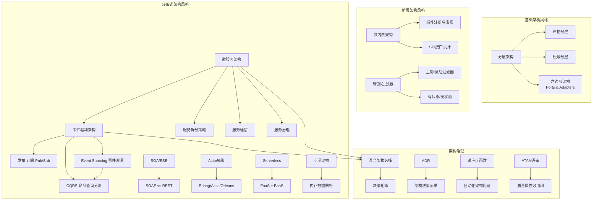
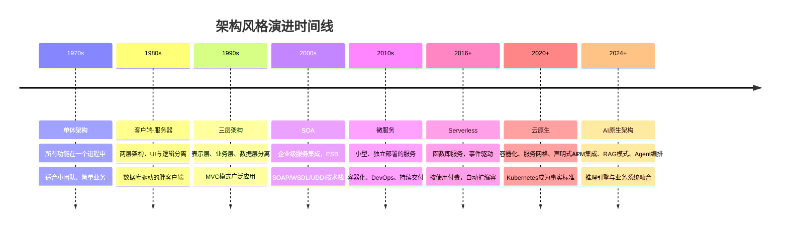
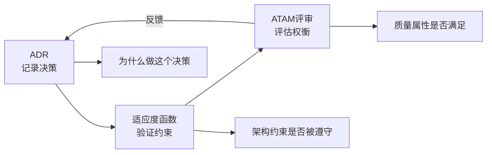
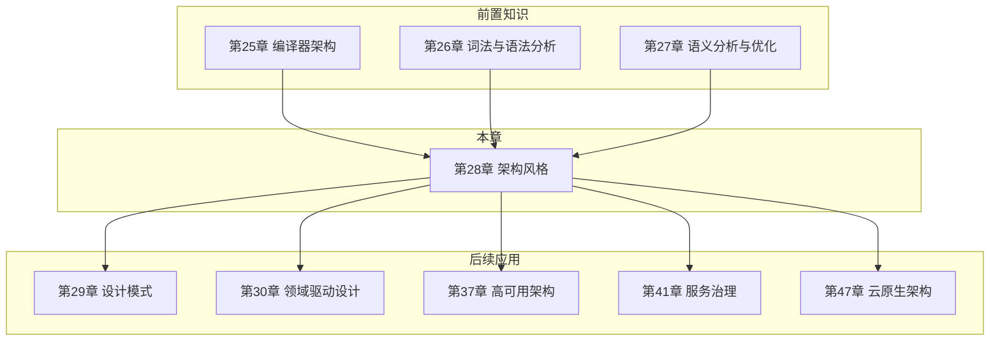

# 第28章 架构风格 · 章节概览

## 本章定位

架构风格是软件系统的"骨架设计模式"——它定义了组件的组织方式、交互规则和约束条件。正如建筑有哥特式、巴洛克式、现代主义等风格，软件架构也有分层架构、事件驱动架构、微服务架构等经典风格。选择正确的架构风格，是系统设计中最重要的决策之一，直接决定了系统的可扩展性、可维护性和演化能力。

为什么这么说？因为架构风格一旦选定，后续几乎所有技术决策——编程语言选型、数据存储方案、团队组织方式、部署流水线设计——都受其约束。更换架构风格的成本极高，往往意味着重写系统。因此，理解每种风格的本质特征、适用边界和演化路径，是每位软件工程师的必备能力。

在本书的知识体系中，本章处于**宏观设计层**：第25-27章的编译器架构是特定领域的架构范式，而本章提炼出适用于所有软件系统的通用架构风格。它是第29章（设计模式）和第30章（领域驱动设计）的架构层面基础——架构风格定义系统的宏观结构，设计模式解决微观的组件交互问题，DDD提供业务建模方法论。三者从宏观到微观，构成完整的软件设计知识体系。

## 核心问题

本章围绕以下关键问题展开：

1. **分类认知**：有哪些经典的架构风格？它们各自适用于什么场景？
2. **选型决策**：如何在微服务、SOA、单体之间做出合理选择？决策依据是什么？
3. **组合协作**：事件驱动架构中发布-订阅、Event Sourcing和CQRS如何协作？
4. **架构治理**：如何用ADR（架构决策记录）记录和追溯架构决策？如何用适应度函数和ATAM评审方法保障架构质量？
5. **演化路径**：单体如何渐进式演化为微服务？中间会经历哪些关键阶段？
6. **反模式识别**：常见架构选型错误有哪些？如何避免过度设计或设计不足？

## 术法道贯通

本章的知识体系遵循"道法术器"的递进逻辑：

### 术：具体实现模式

架构风格的"术"层面，关注的是每种风格的具体实现技术细节：

| 架构风格 | 核心实现技术 | 关键技术选型 |
|----------|-------------|-------------|
| 分层架构 | 分层约束定义、依赖注入 | 严格分层 vs 松散分层的依赖管理策略 |
| 六边形架构 | 端口(Port)定义、适配器(Adapter)实现 | 以领域模型为中心的输入/输出适配 |
| 微服务架构 | 服务拆分、API网关、服务网格 | REST vs gRPC通信、Saga vs TCC事务 |
| 事件驱动架构 | 消息代理选型、事件存储设计 | Kafka vs RabbitMQ、事件序列化方案 |
| Actor模型 | 轻量级Actor创建、消息路由、监督策略 | Erlang/OTP vs Akka vs Orleans取舍 |
| Serverless | 函数生命周期管理、冷启动优化 | AWS Lambda vs Azure Functions vs 阿里云FC |
| 管道-过滤器 | 过滤器接口设计、管道连接方式 | 同步管道 vs 异步管道、有界 vs 无界流 |
| 空间架构 | 数据分区策略、内存数据网格部署 | Hazelcast vs Apache Ignite vs Coherence |

### 法：架构决策方法论

架构风格的"法"层面，关注的是如何在多种风格之间做出合理决策：

- **权衡框架**：每种架构风格都是一组权衡的取舍——微服务用运维复杂度换取独立部署能力，事件驱动用一致性复杂度换取解耦程度。理解这些权衡是架构师的核心能力。
- **适应度函数设计**：将架构约束转化为可自动验证的测试用例，通过ArchUnit、ArchUnit CLI等工具实现架构合规的持续检查。
- **ATAM评审流程**：通过六阶段结构化评审，识别架构决策中的敏感点、权衡点和风险，确保质量属性需求得到满足。
- **ADR文档化**：用标准化格式记录每个架构决策的上下文、方案选项、决策理由和后果，实现架构知识的可追溯性。

### 道：架构本质认知

架构风格的"道"层面，是对架构本质的深层理解：

1. **没有银弹**（Brooks, 1986）：没有任何一种架构风格能解决所有问题。微服务不是万能的，单体也不是过时的。选择取决于团队规模、业务复杂度、运维能力和演化阶段。
2. **约束即设计**（Conway, 1967）：系统的架构结构必然反映组织的沟通结构。架构决策本质上也是组织决策。
3. **演进优于革命**（Evolutionary Architecture）：好的架构不是一开始就完美设计的，而是在持续交付中不断演化的。MonolithFirst原则——先用单体验证业务，再按需拆分。
4. **简单性是终极复杂**（Pascal）：最有效的架构往往是最简单的那个，能解决问题的最简方案就是最好的方案。过度设计的代价往往被低估。

## 知识地图

## 内容结构与学习路径

本章共14个核心小节，按照**分类认知 → 深入理解 → 治理决策**的三层递进结构组织：

### 第一层：架构风格分类与基础（28.1-28.3）

| 小节 | 主题 | 核心内容 | 适用读者 |
|------|------|----------|----------|
| 28.1 | 架构风格分类与演进 | Shaw/Garlan分类体系、从单体到云原生的演进时间线、Conway定律、架构风格的本质是权衡 | 全部 |
| 28.2 | 分层架构 | 严格/松散分层、六边形架构(Ports & Adapters)、洋葱架构、依赖倒置原则、分层反模式 | 入门-中级 |
| 28.3 | 微内核架构 | 插件SPI设计、注册发现机制、OSGi/Eclipse RCP/Spring Boot Starter/WordPress案例、插件间通信模式 | 入门-中级 |

**学习建议**：先建立架构风格的分类认知框架，再逐个深入。分层架构是最基础的风格，理解它才能理解其他风格的"反叛"——为什么微服务要打破分层约束，为什么事件驱动要引入异步通信。建议在28.2节完成后，尝试用六边形架构重构一个小项目，体会端口和适配器的解耦效果。

### 第二层：核心架构风格深入（28.4-28.10）

| 小节 | 主题 | 核心内容 | 适用读者 |
|------|------|----------|----------|
| 28.4 | 事件驱动架构 | Pub/Sub拓扑设计、Event Sourcing原理与事件存储实现、CQRS三种一致性模型(强/最终/因果)、ES+CQRS组合模式、事件风暴(EventStorming)建模 | 中级-高级 |
| 28.5 | 微服务架构 | 拆分策略(业务能力/DDD子域/团队结构)、同步/异步通信选型、Saga分布式事务(编排/协同)、服务注册发现(CAP权衡)、熔断限流(令牌桶/滑动窗口)、服务网格(Istio/Envoy) | 中级-高级 |
| 28.6 | SOA与ESB | ESB架构模式、SOAP vs REST对比、SOA衰落的三个原因(ESB单点/协议复杂/治理缺失)、SOA到微服务的演化路径 | 中级 |
| 28.7 | 管道-过滤器架构 | 过滤器四种类型(主动/被动 × 有状态/无状态)、Unix管道哲学、编译器流水线、Web中间件管道(Express/Koa)、流式处理框架(Kafka Streams/Flink) | 入门-中级 |
| 28.8 | Actor模型 | Actor结构(邮箱/行为/状态)与消息传递语义、三大实现对比(Erlang/OTP轻量级进程+监督树、Akka JVM+集群分片、Orleans虚拟Actor+云原生)、监督树容错机制 | 中级-高级 |
| 28.9 | Serverless架构 | FaaS/BaaS概念与边界、事件驱动模式(消息队列触发/API网关触发/定时触发)、冷启动问题与优化(预热/快照/Provisioned Concurrency)、适用场景(异步处理/定时任务/MVP)与不适用场景(长连接/WebSocket/有状态计算) | 中级 |
| 28.10 | 空间架构 | 处理单元(PU)设计、虚拟化中间件、内存数据网格(IMDG)原理、数据分区与复制策略、Hazelcast/Ignite/GigaSpaces实现对比、与数据库缓存方案的权衡 | 高级 |

**学习建议**：事件驱动和微服务是当前最主流的架构风格，建议重点深入。28.4和28.5是本章核心，建议用一周时间精读并动手实践。Actor模型适合高并发场景（如游戏、IoT），Serverless适合快速原型和事件处理。学习顺序建议：先理解事件驱动的基础概念，再学习微服务如何利用事件驱动实现解耦。

### 第三层：架构治理与决策（28.11-28.14）

| 小节 | 主题 | 核心内容 | 适用读者 |
|------|------|----------|----------|
| 28.11 | 混合架构选择 | 常见组合模式(微服务+事件驱动、分层+微内核等)、决策框架(Conway逆定律/架构适应度)、评估维度矩阵(复杂度/团队/运维/演化)、反模式识别 | 中级-高级 |
| 28.12 | ADR | 架构决策记录格式(MADR/自定义模板)、生命周期管理(提议→决策→已采纳→已废弃)、轻量级vs详细ADR、与RFC流程的协作、最佳实践与常见陷阱 | 全部 |
| 28.13 | 适应度函数 | 原子(单特征验证)/整体(多特征组合)/触发(特定事件时执行)/持续(实时监控)四类适应度函数、ArchUnit/ArchUnit CLI实现、架构适应度函数与测试金字塔的关系 | 高级 |
| 28.14 | ATAM评审 | 六阶段评审流程(演示/调查/测试/集思/分析/报告)、质量属性效用树构建、敏感点/权衡点/风险/非风险识别、ATAM与CBAM(成本效益分析)的结合 | 高级 |

**学习建议**：ADR是最容易落地的架构治理工具，建议立即在自己的项目中开始实践——哪怕只记录一条决策，也是对团队知识资产的积累。适应度函数适合有CI/CD流水线的团队，ATAM适合架构评审委员会或技术委员会使用。建议从ADR开始，逐步引入适应度函数，最后在重大架构决策时使用ATAM。

## 架构风格演进全景

演进的驱动力包括：

1. **规模增长**：从单机到分布式，从千级用户到亿级用户，硬件和网络的发展推动架构不断演化
2. **团队组织**（Conway定律）：系统结构必然反映组织结构。微服务的兴起与"两个披萨团队"的组织模式直接相关
3. **技术进步**：容器化（Docker/Kubernetes）、云计算（公有云/混合云）、自动化运维（CI/CD/GitOps）降低了分布式系统的运维门槛
4. **业务需求**：快速迭代（DevOps）、持续交付（CI/CD）、弹性伸缩（Auto Scaling）要求架构具备更强的演化能力
5. **成本压力**：按需付费（Serverless）、资源利用率优化（容器编排）推动架构向更精细化的方向发展

关键洞察（Fowler, 2014）：架构风格不是越新越好，选择取决于团队规模、业务复杂度和运维能力。**MonolithFirst**原则——先用单体验证业务，再按需拆分微服务。过早采用微服务的代价往往被低估：你需要额外的基础设施（服务网格、分布式追踪、配置中心）和运维能力（容器编排、日志聚合、链路监控），这些成本在业务验证阶段是不必要的。

## 架构风格选择决策矩阵

| 场景特征 | 推荐架构风格 | 核心权衡 | 典型案例 | 常见反模式 |
|----------|-------------|----------|----------|-----------|
| 简单业务 + 小团队（<10人） | 分层架构 / 单体 | 开发效率优先，牺牲独立部署能力 | 内部管理系统、早期创业项目 | 过早引入微服务导致运维负担 |
| 复杂业务 + 大团队（>50人） | 微服务架构 | 独立部署能力优先，增加系统复杂度 | 电商平台、银行核心系统 | 服务粒度过细导致分布式单体 |
| 高并发 + 低延迟（<10ms） | 空间架构 / 事件驱动 | 内存计算优先，增加数据一致性风险 | 秒杀系统、实时竞价、股票交易 | 过度依赖缓存导致数据不一致 |
| 数据密集 + 审计需求 | Event Sourcing + CQRS | 完整审计追踪优先，增加存储成本 | 金融交易、审计系统、医疗记录 | 事件风暴导致查询性能下降 |
| 快速原型 / MVP | Serverless / 单体 | 上市速度优先，牺牲定制能力 | MVP验证、活动页面、内部工具 | 过度优化导致MVP无法快速迭代 |
| 企业集成 + 多系统整合 | API Gateway + 微服务 | 统一入口优先，增加网关复杂度 | 企业中台、多系统整合、遗留系统集成 | ESB成为新的单点瓶颈 |
| 插件化扩展 / 平台化 | 微内核架构 | 可扩展性优先，核心功能受限 | IDE、浏览器、CMS、游戏引擎 | 插件间通信机制设计不当 |
| 流式数据处理 | 管道-过滤器 | 数据流处理优先，有状态处理复杂 | 日志分析、编译器、ETL、实时监控 | 过滤器状态管理不当导致数据丢失 |

> **选型核心原则**：选择架构风格时，先回答三个问题——(1) 团队能否运维这种架构？(2) 业务复杂度是否需要这种架构？(3) 未来3-5年的演化方向是什么？如果团队无法运维微服务，选择单体+模块化是更务实的选择。

## 核心架构风格速览

### 分层架构（Layered Architecture）

将系统组织为表示层、业务层、持久层、数据层，每层只与相邻层交互。这是最经典、最基础的架构风格。

**三种变体**：
- **严格分层**：每层只能调用直接下层，依赖关系清晰但灵活性低
- **松散分层**：允许跨层调用（如表示层直接访问持久层），灵活性高但容易产生"意大利面条式依赖"
- **六边形架构（Ports & Adapters）**：以领域模型为核心，通过端口（Port）定义业务接口，适配器（Adapter）连接外部世界。是现代DDD项目的首选基础架构

**关键优势**：结构清晰、职责明确、易于理解和维护。**主要风险**：层间通信开销大、灵活性不足、容易退化为"胖表示层"反模式。

### 微内核架构（Microkernel Architecture）

最小化核心系统，通过插件扩展功能。核心系统只包含最小必需功能，所有非核心功能通过插件实现。

**关键设计要素**：
- **SPI接口定义**：定义插件必须实现的契约，确保核心系统与插件的解耦
- **插件注册发现**：运行时动态加载和卸载插件，支持热更新
- **插件间通信**：通过事件总线或消息机制实现插件间协作，避免直接依赖

**典型应用**：Eclipse IDE（Java插件体系）、Firefox浏览器（WebExtension API）、WordPress（PHP插件生态）、Spring Boot Starter（自动装配机制）。适合需要高度可扩展性的平台型产品。

### 事件驱动架构（Event-Driven Architecture）

通过事件进行组件间通信和协调。事件是已经发生的事实（不可变），而非请求或命令。

**三个核心子模式**：

1. **Pub/Sub（发布-订阅）**：事件生产者发布事件到主题，订阅者按需消费。实现松耦合通信，但引入了消息代理的复杂性
2. **Event Sourcing（事件溯源）**：将状态变化存储为不可变事件序列，而非直接存储最终状态。支持完整审计、时间旅行和事件回放，但查询性能需要CQRS补偿
3. **CQRS（命令查询职责分离）**：将读操作和写操作分离到不同模型。三种一致性模型：强一致性（同步）、最终一致性（异步）、因果一致性（因果序保证）

**组合模式**：ES+CQRS是最常见的组合——Event Sourcing负责写入（事件存储），CQRS负责查询（物化视图）。两者解决不同问题，组合使用效果最佳。

### 微服务架构（Microservices Architecture）

将系统构建为一组小型服务，每个服务运行在独立进程中，通过轻量级机制（通常是HTTP API）通信。

**核心挑战与解决方案**：

| 挑战 | 解决方案 | 关键权衡 |
|------|----------|----------|
| 服务拆分 | 按业务能力/DDD子域拆分 | 粒度过细→分布式单体，粒度过粗→又回到单体 |
| 服务通信 | REST（简单）/ gRPC（高性能）/ 消息队列（异步） | 同步调用简单但耦合高，异步解耦但一致性复杂 |
| 数据管理 | Database per Service + Saga分布式事务 | 数据一致性 vs 服务自治性 |
| 服务注册发现 | Eureka(最终一致) / Consul(Raft强一致) / Nacos(双模式) | CAP权衡：可用性优先还是一致性优先 |
| 服务治理 | 熔断(Hystrix/Resilience4j)/限流(令牌桶)/重试/超时 | 可用性保护 vs 延迟增加 |
| 服务网格 | Istio/Linkerd/Envoy Sidecar | 运维复杂度 vs 透明化治理 |

**适合场景**：团队规模大（>20人）、业务复杂度高、需要独立部署和演化能力。**不适合场景**：小团队、简单业务、对延迟极度敏感的系统。

### Actor模型

基于消息传递的并发计算模型。Actor之间不共享状态，只通过消息通信，天然并发安全。

**Actor结构**：每个Actor包含邮箱（Mailbox，接收消息）、行为（Behavior，消息处理逻辑）、状态（State，内部数据）。消息是异步的，Actor处理消息后可以创建新Actor、发送消息给其他Actor、改变行为。

**三大实现对比**：

| 实现 | 平台 | 核心特性 | 适合场景 |
|------|------|----------|----------|
| Erlang/OTP | BEAM VM | 轻量级进程（~2KB）、监督树容错、热代码升级 | 电信系统、高可靠分布式系统 |
| Akka | JVM | Actor+集群分片+持久化+CQRS、Typed Actor | 金融系统、实时分析、微服务 |
| Orleans | .NET | 虚拟Actor(Grain)、自动激活/休眠、云原生 | 游戏服务器、IoT、有状态服务 |

**监督树容错**：Erlang/OTP的"let it crash"哲学——Actor失败时由监督者(Supervisor)决定重启策略（one_for_one/one_for_all/one_for_rest），实现自愈能力。

### Serverless架构

将服务器管理完全交给云提供商。FaaS（函数即服务）+ BaaS（后端即服务），按使用付费，自动扩缩容。

**事件触发模式**：
- **消息队列触发**：SQS/Kafka消息触发函数执行
- **API网关触发**：HTTP请求触发函数，适合REST API
- **定时触发**：Cron表达式触发，适合定时任务
- **存储事件触发**：文件上传/修改触发处理函数
- **流处理触发**：Kinesis/DynamoDB Stream触发实时处理

**冷启动问题与优化策略**：
- 预热（Provisioned Concurrency）：保持一定数量的实例常驻
- 快照恢复（Snapshot/Restore）：JVM启动状态序列化，恢复时跳过类加载
- 精简运行时：选择轻量运行时（Rust/Go），减小部署包体积
- 语言选择：Python/Node.js冷启动快于Java/.NET

**适用与不适用场景**：

| 适用 | 不适用 |
|------|--------|
| API后端（REST/GraphQL） | 长连接服务（WebSocket） |
| 事件处理（消息消费） | 有状态计算（数据库事务） |
| 定时任务（Cron Job） | 超长运行任务（>15分钟） |
| 快速原型（MVP） | 高频低延迟（<10ms） |
| 文件处理（图片压缩/视频转码） | 需要本地文件系统 |

### 管道-过滤器架构（Pipe-and-Filter）

将数据处理组织为一系列过滤器，通过管道连接。数据流从输入端流入，经过一系列过滤器处理后从输出端流出。

**过滤器四种类型**：
- **主动过滤器**：主动拉取上游数据，控制数据流速
- **被动过滤器**：被动接收上游推送的数据，被动参与
- **有状态过滤器**：需要维护内部状态（如计数器、窗口）
- **无状态过滤器**：每次处理独立，无内部状态

**典型应用**：Unix Shell管道（`cat | grep | sort | uniq`）、编译器流水线（词法→语法→语义→代码生成→优化）、Web中间件管道（Express/Koa的洋葱模型）、流式处理框架（Apache Kafka Streams、Apache Flink）。

### 空间架构（Space-Based Architecture）

将应用状态存储在内存中，通过复制和分区实现高并发处理。核心思想是"移动计算到数据所在的位置"，而非传统的"移动数据到计算所在的位置"。

**核心组件**：
- **处理单元（Processing Unit, PU）**：包含应用逻辑和内存数据副本，水平扩展的基本单位
- **虚拟化中间件（Virtualized Middleware）**：管理PU的部署、通信、数据同步
- **内存数据网格（IMDG）**：分布式内存存储，支持数据分区、复制和查询

**数据一致性策略**：异步复制（最终一致性）、同步复制（强一致性但性能低）、分区复制（只复制到邻近分区）。

**典型实现**：Hazelcast（Java原生、嵌入式/客户端模式）、Apache Ignite（支持SQL查询、与Spark集成）、GigaSpaces（XAP平台、企业级支持）。适合电商秒杀、金融交易、实时竞价等低延迟高并发场景。

## 架构治理工具链

本章介绍三种架构治理工具，形成完整的"记录→验证→评估"治理闭环：

### ADR（架构决策记录）

轻量级文档，记录架构决策的上下文、决策内容和后果。存储在代码仓库中（通常是`docs/adr/`目录），与代码一起版本控制。

**MADR格式模板**：
- **标题**：简短描述决策（如"ADR-001: 采用微服务架构"）
- **状态**：提议(Proposed) → 已采纳(Accepted) → 已废弃(Deprecated) → 已取代(Superseded by ADR-XXX)
- **上下文**：驱动决策的技术和业务因素
- **决策**：具体选择了什么方案
- **后果**：正面和负面影响
- **选项**：考虑过的其他方案及排除理由

**核心价值**：可追溯性——知道为什么做出某个决策。当团队成员问"为什么用Kafka不用RabbitMQ"时，ADR就是答案。

### 适应度函数（Fitness Functions）

自动化机制，验证架构特征是否得到维护。类似于"架构级别的单元测试"。

**四类适应度函数**：
1. **原子适应度函数**：验证单个架构特征（如"Controller层不能直接访问Repository层"）
2. **整体适应度函数**：验证多个特征的组合（如"所有微服务必须有健康检查端点且响应时间<200ms"）
3. **触发式适应度函数**：在特定事件时执行（如"每次部署前检查依赖版本兼容性"）
4. **持续适应度函数**：实时监控架构指标（如"服务间调用深度不超过5层"）

**实现工具**：ArchUnit（Java架构测试框架，支持自定义规则）、ArchUnit CLI（命令行工具，支持CI/CD集成）、自定义CI Pipeline检查（如ESLint-plugin-import限制模块依赖）。

### ATAM（Architecture Tradeoff Analysis Method）

SEI（Software Engineering Institute）开发的六阶段评审方法，帮助利益相关者理解架构决策的后果。

**六阶段流程**：
1. **演示ATAM方法**：向评审团队介绍ATAM流程和产出物
2. **展示业务驱动因素**：架构师展示系统的主要功能和质量属性需求
3. **展示架构**：架构师描述架构视图和关键设计决策
4. **集思广益**：识别架构方法、生成质量属性效用树
5. **分析架构方法**：深入分析每种方法的敏感点和权衡点
6. **集体投票**：识别风险、非风险、敏感点和权衡点，生成报告

**核心产出**：
- **质量属性效用树**：将质量属性分解为具体场景，标注优先级(H/M/L)
- **敏感点（Sensitivity Point）**：影响某个质量属性的架构决策
- **权衡点（Tradeoff Point）**：同时影响多个质量属性的架构决策
- **风险（Risk）**：可能导致负面后果的决策
- **非风险（Non-risk）**：经过分析认为安全的决策

## 架构风格常见误区

| 误区 | 正确认知 |
|------|----------|
| "微服务一定比单体好" | 微服务引入了分布式系统的复杂性（网络延迟、数据一致性、故障传播），小团队和简单业务用单体+模块化更务实 |
| "越新的架构风格越好" | 架构风格没有好坏，只有适合与否。1970年代的分层架构至今仍是大多数系统的基础 |
| "架构设计一次到位" | 好的架构是演化的，不是设计出来的。先用最简方案验证，再按需演进 |
| "Event Sourcing能解决所有数据问题" | ES引入了事件风暴(event storm)的查询复杂性和存储成本，不适合简单CRUD场景 |
| "Serverless能省所有运维成本" | Serverless将基础设施运维转移给了云厂商，但引入了冷启动、供应商锁定和调试困难等问题 |
| "Actor模型能解决所有并发问题" | Actor适合消息驱动的并发场景，不适合CPU密集型计算或需要共享状态的场景 |
| "六边形架构就是DDD" | 六边形架构是一种架构风格，DDD是一种建模方法论。六边形架构常与DDD结合使用，但两者是独立的概念 |
| "适应度函数能替代架构评审" | 适应度函数验证已知约束，ATAM发现未知风险。两者互补，不能替代 |

## 与其他章节的关系

- **前置知识（第25-27章）**：编译器架构是管道-过滤器风格的经典案例。理解编译器从词法分析到代码生成的流水线，有助于理解管道-过滤器的核心思想——每个阶段只关注自己的职责，通过标准化接口与上下游协作
- **设计模式（第29章）**：架构风格是宏观结构（系统如何拆分为组件），设计模式是微观交互（组件内部如何协作）。架构风格约束设计模式的选择空间，设计模式丰富架构风格的实现手段
- **领域驱动设计（第30章）**：DDD的限界上下文直接指导微服务拆分，聚合根对应Event Sourcing中的事件流。DDD提供业务建模方法论，架构风格提供技术实现框架，两者结合是现代复杂系统设计的最佳实践
- **高可用架构（第37章）**：架构风格的选择直接影响系统的可用性特征——单体架构故障影响全局，微服务架构故障局部化但引入级联失败风险，Actor模型通过监督树实现自愈
- **服务治理（第41章）**：微服务架构风格需要服务治理技术支撑——注册发现、负载均衡、熔断限流、分布式追踪等。没有治理能力的微服务只是"分布式单体"
- **云原生架构（第47章）**：云原生是多种架构风格的综合应用——微服务（应用架构）+ 容器化（部署架构）+ 服务网格（通信架构）+ 声明式API（管理架构）

## 学习路径建议

### 前置技能检查

在开始学习本章之前，确认你已具备以下基础知识：

- [ ] 理解HTTP协议和RESTful API设计
- [ ] 了解基本的设计模式（如MVC、观察者模式）
- [ ] 了解数据库基础（事务、索引、范式）
- [ ] 了解基本的网络编程概念（TCP/UDP、Socket）
- [ ] 了解Linux基础操作和命令行使用

### 入门阶段（2-3小时）

1. **阅读28.1节**：建立架构风格的分类认知框架，理解"架构风格本质上是一组权衡"
2. **精读28.2节**：分层架构是最基础的风格，理解严格分层和松散分层的区别
3. **浏览28.6节**：SOA的历史，理解"为什么会有微服务"——SOA的问题催生了微服务
4. **实践**：尝试画出你当前项目的架构图，标注它属于哪种架构风格

### 进阶阶段（4-6小时）

1. **深入28.4节**：事件驱动架构——理解Pub/Sub、Event Sourcing、CQRS三大子模式及其组合
2. **精读28.5节**：微服务架构——拆分策略、通信机制、Saga分布式事务
3. **实践28.12节**：ADR——在自己的项目中开始记录架构决策，从第一个ADR开始
4. **实践**：用EventStorming方法对一个业务流程建模，识别领域事件和命令

### 高级阶段（3-4小时）

1. **研究28.8节**：Actor模型——理解消息驱动并发的本质，对比Erlang/Akka/Orleans
2. **探索28.10节**：空间架构——内存数据网格的高性能方案
3. **实践28.13节**：适应度函数——用ArchUnit等工具自动化架构约束检查
4. **实践**：在团队中推动ADR实践，建立架构决策的可追溯性

## 关键术语速查

| 术语 | 英文 | 定义 |
|------|------|------|
| 架构风格 | Architectural Style | 描述系统组件组织方式和交互规则的一组约束 |
| 端口与适配器 | Ports & Adapters | 六边形架构的核心概念，端口定义业务接口，适配器连接外部世界 |
| 事件溯源 | Event Sourcing | 将状态变化存储为不可变事件序列的设计模式 |
| CQRS | Command Query Responsibility Segregation | 命令查询职责分离，将读写操作分离到不同模型 |
| 服务网格 | Service Mesh | 处理服务间通信的基础设施层（如Istio、Linkerd） |
| 适应度函数 | Fitness Function | 自动化验证架构特征是否得到维护的机制 |
| ATAM | Architecture Tradeoff Analysis Method | SEI开发的架构权衡分析方法 |
| ADR | Architecture Decision Record | 记录架构决策上下文和理由的轻量级文档 |
| 监督树 | Supervisor Tree | Erlang/OTP中管理Actor生命周期和容错的层级结构 |
| 内存数据网格 | In-Memory Data Grid (IMDG) | 分布式内存存储，支持数据分区、复制和查询 |

## 推荐参考文献

1. Shaw, M. & Garlan, D. "Software Architecture: Perspectives on an Emerging Discipline." Prentice Hall, 1996.
2. Fowler, M. "Patterns of Enterprise Application Architecture." Addison-Wesley, 2002.
3. Newman, S. "Building Microservices." O'Reilly, 2nd Edition, 2021.
4. Ford, N., Parsons, R., & Kua, P. "Building Evolutionary Architectures." O'Reilly, 2nd Edition, 2023.
5. Richards, M. "Software Architecture Patterns." O'Reilly, 2015.
6. Kleppmann, M. "Designing Data-Intensive Applications." O'Reilly, 2017.
7. Vernon, V. "Implementing Domain-Driven Design." Addison-Wesley, 2013.
8. Hohpe, G. & Woolf, B. "Enterprise Integration Patterns." Addison-Wesley, 2003.
9. Ford, N. "Monolith to Microservices: Evolutionary Patterns to Transform Your Monolith." O'Reilly, 2019.
10. Sutherland, J. & Coplien, J.O. "Business Artifacts: A Practice-Based Approach to Business Modeling." 2012.
11. Arcelli, D. et al. "Architecture Patterns for Serverless: A Systematic Mapping Study." IEEE TSE, 2023.
12. Sommerville, I. "Software Engineering." 10th Edition, Pearson, 2015. Chapter 11: Architectural Design.
