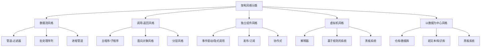
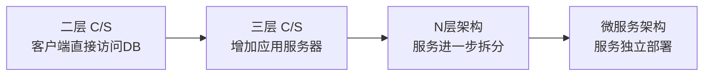
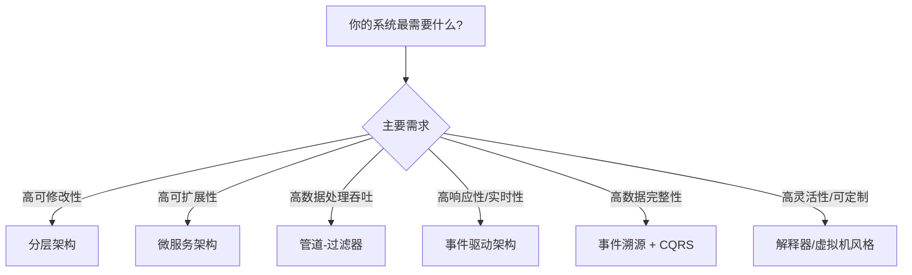
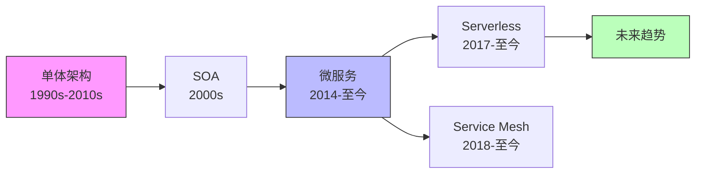

## 架构风格理论基础

### 1. 什么是架构风格

#### 1.1 定义与本质

架构风格（Architectural Style）是对一类软件系统共同结构特征的抽象描述。它不是某个具体系统的设计方案，而是一组**约束集合**——规定了系统中可以出现哪些组件类型、这些组件之间如何连接、它们之间允许何种数据流、以及这些连接遵循何种语义规则。

David Garlan 和 Mary Shaw 在其经典著作《Software Architecture: Perspectives on an Emerging Discipline》中给出了最早的系统化定义：

> 一个架构风格是一组构件类型（component types）、连接件类型（connector types）以及它们的组合约束的集合。

用更直白的话说：架构风格就是"一套已经验证过的、解决特定问题域的系统组织模板"。它告诉你系统中的模块长什么样、怎么连接、数据怎么流动，但不规定具体的业务逻辑。

#### 1.2 架构风格 vs 设计模式 vs 框架

很多初学者会混淆这三个概念，理解它们的区别至关重要：

| 维度 | 架构风格 | 设计模式 | 框架 |
|------|----------|----------|------|
| 抽象层次 | 系统级（System-level） | 类/对象级（Class/Object-level） | 代码级（Code-level） |
| 作用范围 | 整个系统的拓扑结构 | 局部交互的惯用法 | 可复用的半成品代码 |
| 具体程度 | 最抽象，描述约束和模式 | 中等，描述解决特定问题的模板 | 最具体，提供可直接使用的代码 |
| 典型示例 | 分层架构、微服务、事件驱动 | 观察者、策略、工厂模式 | Spring、Django、React |
| 变更成本 | 极高（往往需要重新设计） | 中等（局部重构） | 较低（替换依赖即可） |
| 决策时机 | 项目初期（Architectural Decision） | 开发过程中 | 技术选型阶段 |

一个系统可能同时体现多种架构风格。例如一个电商系统可能整体采用微服务架构风格，服务内部采用分层架构，服务间通信采用事件驱动风格。

#### 1.3 为什么需要架构风格

架构风格的存在价值体现在四个层面：

**知识复用**：每种风格都是前人反复实践后提炼的"最佳路径"。站在巨人的肩膀上，你不需要从零开始思考"一个分布式系统该怎么组织模块"。

**质量属性保障**：不同风格天然地倾向于不同的质量属性。分层架构天然支持可修改性，事件驱动天然支持可演化性，管道-过滤器天然支持可复用性。选择风格就是选择你优先保障的质量属性。

**团队沟通**：当你对团队说"我们用事件驱动架构"，所有资深开发者立刻就能理解系统的大致结构、组件间的交互方式、以及需要关注的技术挑战。架构风格是一种高效的沟通语言。

**决策约束**：架构风格通过明确的约束来减少系统设计中的自由度。表面上看这限制了灵活性，实际上它大幅降低了设计复杂度——你不需要在每个节点上都做决策，风格已经帮你回答了大部分结构性问题。

### 2. 架构风格的分类体系

#### 2.1 按数据流组织方式分类

Mary Shaw 在其分类法中，按数据在系统中的流动方式将架构风格分为五大类：



##### 数据流风格

在数据流风格中，数据沿预定义的路径从一个处理单元流向下一个。每个处理单元独立完成自己的工作，不知道数据从哪里来、到哪里去。

**管道-过滤器（Pipe-and-Filter）**：每个处理步骤是一个独立的过滤器，步骤之间通过管道连接。Unix Shell 命令 `cat access.log | grep "500" | awk '{print $1}' | sort | uniq -c` 就是最经典的管道-过滤器体现。过滤器从 stdin 读入数据，处理后写到 stdout，各个过滤器完全解耦。

**批处理序列（Batch Sequential）**：数据以完整批次从一个处理步骤传递到下一个，每个步骤必须等待上一个步骤完全完成后才能开始。典型的例子是传统的 ETL 流程：抽取（Extract）→ 转换（Transform）→ 加载（Load），每一步处理完一批数据后整体传递。

##### 调用-返回风格

调用-返回风格是最常见的传统架构组织方式，组件之间通过显式的函数调用进行交互。

**分层风格（Layered）**：系统被组织为层次结构，每层只能调用其下一层的服务，不能跨层调用。经典的 OSI 网络模型（7层）、三层架构（表示层→业务层→数据层）都是这一风格的体现。

**主程序/子程序（Main Program/Subroutine）**：最古老也最基本的风格。整个系统由一个主程序控制，它调用子程序来完成各个功能，子程序再调用更下层的子程序，形成严格的调用层级。

##### 独立组件风格

在独立组件风格中，组件是独立运行的进程或线程，它们之间不直接共享状态，而是通过消息传递进行通信。

**事件驱动（Event-Driven）**：组件不主动调用其他组件，而是发出事件（消息），其他组件监听并响应这些事件。GUI 框架、消息队列系统、前端 React/Vue 的状态管理都属于这一风格。

**发布-订阅（Publish-Subscribe）**：事件驱动的一种变体。发布者将事件发布到一个中间代理（broker），订阅者向代理注册自己感兴趣的事件类型。与直接事件驱动相比，它引入了中间层，使得发布者和订阅者完全解耦。

##### 虚拟机风格

虚拟机风格通过在软件中模拟一个执行环境来提供额外的灵活性。

**解释器（Interpreter）**：系统包含一个虚拟机，它能解析并执行某种特定语言编写的程序。编程语言的运行时（如 Python 虚拟机、JVM）、SQL 引擎、正则表达式引擎都属于这一风格。

**基于规则的系统（Rule-Based System）**：也称为产生式系统，由一组"条件-动作"规则组成。一个推理引擎不断检查哪些规则的条件被满足，然后执行对应的规则动作。Drools 规则引擎、业务流程管理（BPM）系统是典型应用。

##### 以数据为中心风格

在以数据为中心的风格中，数据存储是系统的核心，所有组件围绕共享数据进行操作。

**仓库/数据库风格（Repository）**：系统围绕一个中央数据仓库组织，所有组件通过仓库访问和修改共享数据。IDE（如 VS Code 的文件管理器、编辑器、终端共享项目文件）、数据库应用系统是典型代表。

#### 2.2 按组织拓扑分类

除了 Shaw 的经典分类，实际工程中更常用的是按系统的整体拓扑结构来分类：

| 拓扑类型 | 典型架构风格 | 通信方式 | 适用场景 |
|----------|-------------|----------|----------|
| 中心化 | 仓库、主从 | 组件访问中心存储 | 数据密集型应用 |
| 分层 | 分层架构、MVC | 上层调用下层 | 企业应用、Web应用 |
| 扁平/网格 | 对等网络（P2P） | 节点间直接通信 | 文件共享、区块链 |
| 管道 | 管道-过滤器 | 单向数据流 | 数据处理、编译器 |
| 星形/总线 | 事件驱动、消息队列 | 通过中间件路由 | 微服务集成、IoT |
| 分布式 | 微服务、SOA | HTTP/gRPC/消息 | 大规模互联网应用 |

### 3. 六大核心架构风格深度解析

#### 3.1 分层架构（Layered Architecture）

分层架构是最经典、应用最广泛的架构风格。其核心思想是将系统划分为若干水平层次，每层只与相邻层交互。

**结构模型**：

┌─────────────────────────────────┐
│         表示层 (UI Layer)         │  ← 用户界面、输入验证
├─────────────────────────────────┤
│        业务层 (Business Layer)    │  ← 核心业务逻辑、领域规则
├─────────────────────────────────┤
│        持久层 (Persistence Layer) │  ← ORM、数据库访问、缓存
├─────────────────────────────────┤
│         基础设施 (Infrastructure) │  ← 文件系统、消息队列、外部API
└─────────────────────────────────┘

**核心约束**：
- **依赖规则（Dependency Rule）**：每层只能调用其直接下层的服务，不能跨层调用。这是分层架构最重要的约束，违反它会导致层间耦合。
- **接口隔离**：每层只暴露其功能接口，隐藏实现细节。上层不关心下层的实现方式。
- **层的替换性**：理论上可以替换任意一层的实现而不影响其他层（前提是你遵守了依赖规则）。

**三层架构的典型实现**：

```python
# === 表示层 (Presentation Layer) ===
# 职责：处理HTTP请求，参数校验，调用业务层，返回响应
class OrderController:
    def __init__(self, order_service: OrderService):
        self.order_service = order_service  # 依赖注入

    def create_order(self, request: CreateOrderRequest) -> Response:
        # 1. 参数校验（表示层职责）
        if not request.items:
            return Response(status=400, body="购物车不能为空")

        # 2. 调用业务层（不直接访问数据库）
        order = self.order_service.create_order(
            user_id=request.user_id,
            items=request.items
        )

        # 3. 格式化响应
        return Response(status=201, body=order.to_dict())


# === 业务层 (Business Layer) ===
# 职责：核心业务逻辑、领域规则、事务管理
class OrderService:
    def __init__(self, order_repo: OrderRepository, inventory: InventoryService):
        self.order_repo = order_repo
        self.inventory = inventory

    def create_order(self, user_id: str, items: list) -> Order:
        # 业务规则校验
        for item in items:
            if not self.inventory.check_availability(item.sku, item.quantity):
                raise InsufficientStockError(item.sku)

        # 扣减库存（事务性操作）
        self.inventory.reserve(items)

        # 创建订单
        order = Order(user_id=user_id, items=items, status="CREATED")
        self.order_repo.save(order)

        return order


# === 持久层 (Persistence Layer) ===
# 职责：数据持久化、ORM映射、查询优化
class OrderRepository:
    def __init__(self, db_session):
        self.db_session = db_session

    def save(self, order: Order):
        self.db_session.add(OrderModel.from_domain(order))
        self.db_session.commit()

    def find_by_id(self, order_id: str) -> Order:
        model = self.db_session.query(OrderModel).get(order_id)
        return model.to_domain() if model else None
```

**优势与局限**：

| 优势 | 局限 |
|------|------|
| 关注点分离清晰，每层职责明确 | 性能损耗：请求必须层层穿越，即使简单的操作也要经过所有层 |
| 易于理解和开发，团队分工明确 | 级联修改：一个底层变化可能影响所有上层 |
| 易于测试：每层可以独立单元测试 | 过度抽象：对于简单应用，分层可能引入不必要的复杂度 |
| 支持多团队并行开发 | 上下文传递开销：数据在层间转换时可能需要序列化/反序列化 |

**常见误区**：

1. **跨层调用**：表示层直接调用持久层的数据库操作，跳过业务层。这会导致业务逻辑散落在多个层中，维护困难。纠正：所有数据访问必须通过业务层的接口。

2. **贫血业务层**：业务层只有简单的方法转发，真正的业务逻辑写在了持久层的存储过程中或表示层的控制器里。纠正：业务层应该是系统中最厚的一层。

3. **反向依赖**：下层组件依赖了上层的类型或接口（如持久层 import 了业务层的 DTO）。纠正：引入领域模型层或使用依赖倒置原则（DIP）。

#### 3.2 客户端-服务器架构（Client-Server）

客户端-服务器架构将系统分为两个角色：提供服务的服务器和使用服务的客户端。

**演进路径**：



**二层架构**：客户端直接与数据库通信。客户端包含UI逻辑和业务逻辑，数据库负责数据存储。适用于小规模桌面应用，但存在部署困难、业务逻辑无法复用等问题。

**三层架构**：引入独立的应用服务器（中间层），客户端只负责展示，应用服务器处理业务逻辑，数据库负责存储。这是绝大多数企业应用的基础架构。

**N层架构**：根据需要进一步拆分中间层，形成更细粒度的服务层次。

**关键设计决策**：

- **胖客户端 vs 瘦客户端**：胖客户端在客户端执行大量业务逻辑（如桌面应用），减轻服务器压力但增加部署难度；瘦客户端（如浏览器）只负责展示，所有逻辑在服务器端处理。
- **有状态 vs 无状态**：服务器是否需要记住客户端的状态？无状态服务器（如 REST API）更容易水平扩展，有状态服务器（如 WebSocket 会话）通信效率更高但扩展困难。
- **同步 vs 异步通信**：客户端发请求后是否阻塞等待响应？同步通信（HTTP 请求-响应）简单直观，异步通信（消息队列、回调）吞吐量更高。

#### 3.3 事件驱动架构（Event-Driven Architecture, EDA）

事件驱动架构以事件作为系统组件间通信的核心机制。组件不直接调用彼此，而是通过产生和响应事件来协作。

**两种主要拓扑模式**：

**中介者拓扑（Mediator Topology）**：

  事件源 ──→ 事件中介者(Event Mediator) ──→ 编排(Orchestration)
                                              │
                         ┌─────────────────────┼────────────────────┐
                         ↓                     ↓                    ↓
                    处理器A                处理器B              处理器C
                         │                     │                    │
                         └───────────→ 事件总线(Event Bus) ←────────┘
                                              │
                                         事件通道

中介者知道整个事件处理流程的步骤和顺序，负责协调多个处理器按正确顺序执行。适用于业务流程明确、需要保证处理顺序的场景。

**代理者拓扑（Broker Topology）**：

  事件源 ──→ [事件队列/Topic]
                  │
    ┌─────────────┼─────────────┐
    ↓             ↓             ↓
 处理器A       处理器B       处理器C
 (只关心自己    (只关心自己    (只关心自己
  订阅的事件)   订阅的事件)    订阅的事件)

没有中心协调者。每个处理器知道自己订阅什么事件，处理完后可以产生新事件供其他处理器消费。适用于组件间关系松散、需要高度解耦的场景。

**事件驱动的实现技术栈**：

| 层次 | 技术选型 | 特点 |
|------|----------|------|
| 事件生产 | 应用代码、CDC（Change Data Capture） | 应用主动发送 vs 数据库变更捕获 |
| 事件传输 | Kafka、RabbitMQ、Pulsar、NATS | 各有吞吐/延迟/持久化/顺序性侧重 |
| 事件存储 | Kafka log、EventStoreDB、DynamoDB | 事件溯源的持久化基础 |
| 事件消费 | 消费者组、WebSocket、Server-Sent Events | 推模式 vs 拉模式 |
| 事件Schema | Avro、Protobuf、JSON Schema | Schema Registry 管理版本兼容性 |

**事件驱动面临的核心挑战**：

1. **最终一致性**：事件异步传播意味着系统中不同组件在同一时刻可能看到不同状态。你需要设计补偿机制来处理中间状态不一致的情况。

2. **事件顺序保证**：分布式系统中事件到达的顺序可能与发出的顺序不同。Kafka 通过分区（Partition）保证分区内有序，但跨分区无法保证全局有序。

3. **事件溯源复杂性**：将所有状态变化记录为事件序列（Event Sourcing），回放事件来重建状态。这带来了完整的审计日志和时间旅行能力，但也增加了存储开销和系统复杂度。

4. **调试困难**：事件驱动系统的请求链路横跨多个异步处理器，传统的一个请求一个响应的调试方式不再适用，需要依赖分布式追踪（如 Jaeger、Zipkin）和结构化日志。

#### 3.4 微服务架构（Microservices Architecture）

微服务架构将单一应用程序开发为一组小型服务，每个服务运行在自己的进程中，通过轻量级通信机制（通常是 HTTP API）进行交互。

**与单体架构的对比**：

单体架构：
┌──────────────────────────────────────────┐
│              单一应用程序                    │
│  ┌──────┐  ┌──────┐  ┌──────┐  ┌──────┐  │
│  │用户  │  │订单  │  │支付  │  │库存  │  │
│  │模块  │  │模块  │  │模块  │  │模块  │  │
│  └──────┘  └──────┘  └──────┘  └──────┘  │
│              共享数据库                     │
└──────────────────────────────────────────┘

微服务架构：
┌─────────┐ ┌─────────┐ ┌─────────┐ ┌─────────┐
│用户服务  │ │订单服务  │ │支付服务  │ │库存服务  │
│ DB(user) │ │DB(order)│ │DB(payment)│ │DB(stock)│
└─────────┘ └─────────┘ └─────────┘ └─────────┘
    │            │            │            │
    └────────────┴──── API 网关 ────────────┘

**微服务的核心原则**：

1. **单一职责**：每个服务只负责一个明确的业务能力。判断标准是：这个服务是否可以由一个小型团队独立开发、测试和部署？

2. **去中心化治理**：每个服务可以选择最适合自己的技术栈（语言、数据库、框架）。用户服务用 Python + PostgreSQL，推荐服务用 Go + Redis，搜索服务用 Java + Elasticsearch —— 这是微服务允许的。

3. **独立部署**：修改订单服务的代码不需要重新部署用户服务。每个服务有自己的 CI/CD 流水线，可以独立发布。

4. **容错设计**：一个服务的失败不应该导致整个系统崩溃。通过熔断器（Circuit Breaker）、超时、重试、降级等机制来保证系统的整体可用性。

**微服务拆分策略**：

| 拆分维度 | 方法 | 适用场景 | 风险 |
|----------|------|----------|------|
| 业务能力 | 按业务领域拆分（用户、订单、支付） | 业务边界清晰的系统 | 可能遗漏跨领域功能 |
| 子域 | DDD 限界上下文（Bounded Context） | 复杂业务领域 | 需要较强的领域建模能力 |
| 数据 | 按数据所有权拆分 | 数据隔离要求高 | 跨服务查询性能问题 |
| 团队 | 按团队职责拆分（康威定律） | 多团队协作 | 团队间的协调成本 |

**微服务的陷阱**（Microservice Anti-Patterns）：

- **分布式单体**：表面上拆分了服务，但服务间强依赖，修改一个服务必须同时修改多个服务，部署时必须一起发布。这比单体更糟糕——你同时承受了分布式的复杂度和单体的耦合。
- **过度拆分**：将一个内聚的业务模块拆成太多细小服务，导致服务间通信开销巨大，运维复杂度爆炸。一个简单的业务操作需要调用十几个服务。
- **数据一致性忽视**：拆分了服务但没有处理好跨服务的数据一致性问题，导致业务数据出现不一致。

#### 3.5 管道-过滤器架构（Pipe-and-Filter）

管道-过滤器架构将系统组织为一系列独立的处理步骤（过滤器），数据通过管道在这些步骤之间流动。

**核心特征**：

- **过滤器独立性**：每个过滤器完全独立，不知道数据的来源和去向。它从输入管道读取数据，处理后写入输出管道。
- **管道即连接件**：管道是过滤器之间的连接通道，只负责传递数据，不包含任何业务逻辑。
- **可组合性**：过滤器可以自由组合，替换任意一个过滤器不会影响其他过滤器。

**经典应用**：

1. **Unix 管道命令**：`grep | sort | uniq -c | head -10`，每个命令是一个过滤器，`|` 是管道。
2. **编译器**：词法分析 → 语法分析 → 语义分析 → 代码生成 → 优化，每个阶段是一个过滤器。
3. **数据处理流水线**：Apache Spark、Flink 的数据处理模型本质上是管道-过滤器的分布式扩展。
4. **多媒体处理**：FFmpeg 的滤镜链 `ffmpeg -i input.mp4 -vf "scale=1280:720,drawtext=text='Hello'" output.mp4`。

```python
# 管道-过滤器的简单 Python 实现
from typing import Callable, Any

class Filter:
    """过滤器基类"""
    def __init__(self, transform: Callable[[Any], Any]):
        self.transform = transform

    def process(self, data):
        return self.transform(data)


class Pipeline:
    """管道：将多个过滤器串联"""
    def __init__(self):
        self.filters: list[Filter] = []

    def add_filter(self, f: Filter) -> 'Pipeline':
        self.filters.append(f)
        return self  # 支持链式调用

    def execute(self, data):
        result = data
        for f in self.filters:
            result = f.process(result)
        return result


# 使用示例：日志分析管道
pipeline = Pipeline()
pipeline.add_filter(Filter(lambda lines: [l for l in lines if "ERROR" in l]))  # 过滤错误日志
pipeline.add_filter(Filter(lambda lines: [l.split()[2] for l in lines]))       # 提取IP地址
pipeline.add_filter(Filter(lambda ips: sorted(set(ips))))                      # 去重排序

logs = [
    "2024-01-15 10:23:01 ERROR Connection refused 192.168.1.100",
    "2024-01-15 10:23:02 INFO  Request completed 192.168.1.200",
    "2024-01-15 10:23:03 ERROR Timeout exceeded 192.168.1.100",
    "2024-01-15 10:23:04 ERROR Connection refused 10.0.0.50",
]

result = pipeline.execute(logs)
print(result)  # ['10.0.0.50', '192.168.1.100']
```

**管道-过滤器的适用边界**：

| 适合 | 不适合 |
|------|--------|
| 数据转换和处理流水线 | 需要共享状态的交互式应用 |
| 编译器、流媒体处理 | 需要频繁双向通信的系统 |
| 批量数据处理（ETL） | 实时交互性要求高的场景 |
| 嵌入式信号处理 | 过滤器间需要复杂控制流的场景 |

#### 3.6 事件溯源架构（Event Sourcing）

事件溯源不是传统意义上的"风格"，但它作为一种数据组织方式，正在被越来越多的系统采用。其核心理念是：**不存储系统的当前状态，而是存储导致状态变化的所有事件**。

**传统方式 vs 事件溯源**：

传统方式（状态存储）：
数据库中只保存当前状态
  账户余额 = 5000元
  （无法知道这个5000是怎么来的）

事件溯源：
保存所有导致状态变化的事件序列
  Event 1: 账户创建，初始余额 0
  Event 2: 存款 +10000
  Event 3: 转账 -3000
  Event 4: 取款 -2000
  → 当前余额 = 0 + 10000 - 3000 - 2000 = 5000

**事件溯源的优势**：

1. **完整的审计日志**：每一个状态变化都有记录，天然满足金融、医疗等行业的合规要求。
2. **时间旅行**：可以回放任意时刻的事件来重建历史状态，支持"如果当时做了不同决策会怎样"的模拟分析。
3. **事件驱动的天然基础**：事件可以直接发布给下游系统，无需额外的变更数据捕获（CDC）机制。
4. **调试友好**：出问题时可以精确回放事件序列来定位问题发生的确切位置。

**事件溯源的挑战**：

1. **事件 Schema 演进**：当业务变化导致事件结构需要变更时，如何处理历史事件的兼容性？需要设计版本化的事件格式和向上/向下兼容策略。
2. **查询性能**：直接查询事件日志来获取当前状态的效率很低。通常需要维护"物化视图"（Projection）——通过回放事件来构建针对特定查询优化的读模型。
3. **最终一致性**：写入事件和更新物化视图之间存在时间差，读操作可能看到过时的数据。

### 4. 架构风格选择框架

#### 4.1 质量属性驱动选择

选择架构风格的本质是在不同的质量属性之间做权衡。没有一种风格在所有维度上都最优——这正是架构设计的核心挑战。



#### 4.2 架构风格质量属性雷达图

| 架构风格 | 可修改性 | 可扩展性 | 性能 | 可测试性 | 可部署性 | 简单性 |
|----------|----------|----------|------|----------|----------|--------|
| 分层架构 | ★★★★ | ★★★ | ★★★ | ★★★★ | ★★★ | ★★★★ |
| 客户端-服务器 | ★★★ | ★★★ | ★★★★ | ★★★ | ★★★★ | ★★★★ |
| 事件驱动 | ★★★★★ | ★★★★★ | ★★★★★ | ★★ | ★★★ | ★★ |
| 微服务 | ★★★★ | ★★★★★ | ★★★★ | ★★★★ | ★★★★★ | ★★ |
| 管道-过滤器 | ★★★★ | ★★★ | ★★★★★ | ★★★★★ | ★★★★ | ★★★★ |
| 事件溯源 | ★★★★★ | ★★★★ | ★★★ | ★★★ | ★★★ | ★★ |

#### 4.3 混合架构风格

实际系统几乎总是混合使用多种架构风格。以下是常见的混合模式：

**分层 + 事件驱动**：系统整体采用分层架构保证代码组织清晰，层内组件之间通过事件进行松耦合通信。这是最常见的混合方式。

**微服务 + 事件驱动**：服务间通过事件总线（如 Kafka）进行异步通信，每个微服务内部可以自由选择最适合的架构风格。

**CQRS + 事件溯源**：命令查询职责分离（CQRS）将读写操作分离到不同的模型中，事件溯源为写侧提供完整的事件历史。两者配合可以构建高性能、可审计的复杂系统。

**分层 + 管道-过滤器**：在分层架构的数据处理层内，使用管道-过滤器模式来组织数据处理流水线。

```mermaid
graph TD
    subgraph 客户端
        UI[Web/Mobile UI]
    end

    subgraph API层
        GW[API Gateway<br>分层架构]
    end

    subgraph 服务层
        S1[用户服务<br>分层架构]
        S2[订单服务<br>分层架构]
        S3[支付服务<br>分层架构]
    end

    subgraph 事件层
        KB[Kafka<br>事件驱动架构]
    end

    subgraph 数据处理层
        DP[Spark Pipeline<br>管道-过滤器]
    end

    subgraph 数据层
        DB[(PostgreSQL<br>仓库风格)]
        ES[(Elasticsearch<br>仓库风格)]
    end

    UI --> GW
    GW --> S1 &amp; S2 &amp; S3
    S1 &amp; S2 &amp; S3 --> KB
    KB --> DP
    DP --> ES
    S1 &amp; S2 &amp; S3 --> DB
```

### 5. 架构决策记录（ADR）

#### 5.1 什么是 ADR

架构决策记录（Architecture Decision Record，ADR）是记录架构设计中重要决策的轻量级文档。每个 ADR 记录一个决策的上下文、方案选择和最终结果，为未来的团队成员提供决策背景和理由。

#### 5.2 ADR 模板

```markdown
# ADR-{编号}: {决策标题}

## 状态
提议 | 接受 | 废弃 | 替代

## 上下文
描述驱动这个决策的技术和业务背景。
是什么问题迫使我们做出这个决策？

## 决策
我们决定采用 {方案}。
说明为什么选择这个方案。

## 备选方案
### 方案A: {名称}
- 优点：...
- 缺点：...

### 方案B: {名称}
- 优点：...
- 缺点：...

## 后果
### 正面影响
- ...

### 负面影响
- ...

### 风险
- ...
```

#### 5.3 架构决策的记录原则

1. **及时性**：在决策发生时立即记录，不要试图事后补写。事后补写的 ADR 往往遗漏关键的背景信息和权衡过程。
2. **简洁性**：每个 ADR 控制在 1-2 页以内。过长的文档没人愿意读，也难以维护。
3. **可追溯性**：ADR 编号连续，记录决策的时间线。当后续决策替代了之前的决策时，在新 ADR 中引用旧的 ADR 编号。
4. **版本控制**：ADR 应该和代码一起存放在版本控制系统中（如 `docs/adr/` 目录），这样可以利用 Git 的历史来追踪决策的演变。

### 6. 架构风格演进趋势

#### 6.1 从单体到微服务再到？



#### 6.2 当前主要趋势

**Serverless / FaaS**：将架构风格的抽象层次再提升一级。开发者不再关心服务器、容器、甚至服务边界，只需要编写函数并部署到云平台。AWS Lambda、Cloudflare Workers 是代表。架构风格从"如何组织服务"演变为"如何组织函数"。

**Service Mesh**：在微服务架构基础上，将服务间通信的复杂性（负载均衡、熔断、加密、可观测性）从应用层下沉到基础设施层（Sidecar Proxy）。Istio、Linkerd 是代表实现。

**事件驱动 + CQRS 的主流化**：随着 Kafka 等事件中间件的成熟，事件驱动架构从"高级模式"逐渐成为"默认选择"。CQRS 将读写模型分离的模式正在被越来越多的系统采用。

**领域驱动设计（DDD）的回归**：随着微服务拆分实践的深入，人们发现技术层面的拆分（按数据表拆、按API拆）往往导致糟糕的结果。DDD 提供的限界上下文、聚合根、领域事件等概念成为微服务拆分的指导框架。

### 7. 常见误区与纠正

| 误区 | 事实 | 纠正方法 |
|------|------|----------|
| "微服务一定比单体好" | 微服务引入了分布式系统的全部复杂性，小团队/早期产品用单体更高效 | 遵循"先单体后微服务"（Monolith First）原则 |
| "选了架构风格就万事大吉" | 架构风格只是起点，质量取决于实现细节和持续的架构治理 | 建立架构评审机制，定期检查架构债务 |
| "分层架构是最安全的选择" | 分层可能导致性能损耗和过度抽象，不是所有场景都需要严格的分层 | 根据系统规模和变更频率灵活决定分层粒度 |
| "事件驱动可以解决所有解耦问题" | 事件驱动引入了最终一致性和调试复杂性，过度异步会让系统更难理解 | 在需要强一致性的场景保留同步调用 |
| "架构风格是固定不变的" | 架构应该随业务发展持续演进，没有一劳永逸的架构 | 建立架构演进路线图，定期评估当前架构是否匹配业务需求 |
| "只要用了DDD就能做好微服务" | DDD 提供了领域建模的方法论，但微服务还需要处理分布式事务、数据一致性、服务发现等一系列技术挑战 | 将 DDD 作为拆分指南，配合完整的技术解决方案 |

### 8. 本章小结

架构风格是软件架构设计的"词汇表"。掌握这些风格不是为了机械套用，而是为了在面对具体的系统需求时，能够：

1. **准确识别**问题域的核心挑战——是数据一致性？是并发性能？还是业务快速变化？
2. **合理选择**最适合的架构风格或组合——每个风格都有其最优适用场景。
3. **有效权衡**不同质量属性之间的矛盾——没有完美的架构，只有最适合当前约束的架构。
4. **持续演进**——架构不是一次性决策，而是随业务发展不断调整的过程。

后续章节将逐一深入讲解每种架构风格的实战细节、最佳实践和真实案例，帮助你从理论认知上升到工程实践能力。
