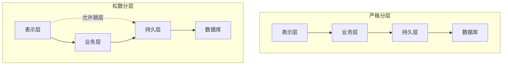
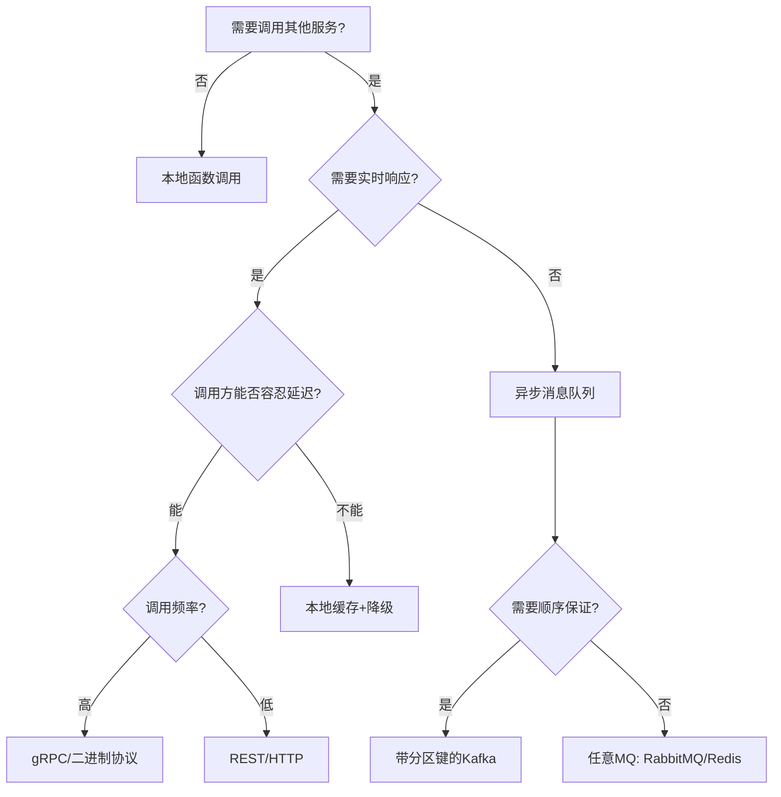
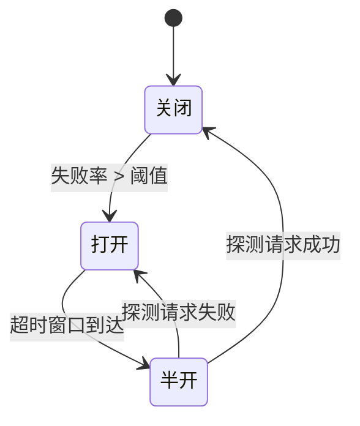
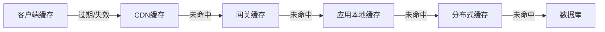

# 核心技巧

本节聚焦架构风格落地过程中的关键实操技术。理论基础回答"是什么"和"为什么"，核心技巧回答"怎么做"——从架构分解、通信设计、数据管理到容错韧性，每一个环节都有具体的工程手法和决策要点。

## 架构分解：从单体到模块化

### 识别架构缝合线

架构分解的第一步不是"怎么拆"，而是"在哪里拆"。识别系统的自然缝合线（seam）决定了后续所有架构决策的质量。

**三大缝合线识别策略：**

| 策略 | 方法 | 适用场景 | 产出 |
|------|------|----------|------|
| 业务能力分解 | 按组织结构中的业务部门划分 | 业务边界清晰的系统 | 业务能力→服务映射表 |
| 领域事件驱动 | 识别领域事件，按事件聚合域 | DDD驱动的系统 | 限界上下文→服务映射 |
| 数据依赖分析 | 分析数据库表间外键和查询路径 | 数据耦合严重的遗留系统 | 数据域→服务映射 |

```python
# 缝合线识别：分析数据库表依赖
def find_seams(schema_sql):
    """
    解析DDL，构建表依赖图，识别低耦合的切割点。
    返回建议的分组方案。
    """
    dependency_graph = parse_foreign_keys(schema_sql)
    coupling_matrix = compute_coupling(dependency_graph)
    
    # 使用社区发现算法找低耦合分组
    communities = detect_communities(coupling_matrix)
    
    seams = []
    for group in communities:
        intra_coupling = avg_intra_coupling(coupling_matrix, group)
        inter_coupling = avg_inter_coupling(coupling_matrix, group)
        seams.append({
            'tables': group,
            'intra_coupling': intra_coupling,
            'inter_coupling': inter_coupling,
            'recommendation': '独立服务' if inter_coupling < 0.3 else '共享服务'
        })
    return seams
```

### 分层架构的分层原则

分层架构是最基础的风格，分层错误会导致维护噩梦。核心原则是**依赖方向单一、层间接口最小化**。

**严格分层 vs 松散分层：**



| 分层方式 | 约束 | 优点 | 缺点 |
|----------|------|------|------|
| 严格分层 | 每层只调用下一层 | 依赖清晰，易于测试 | 层数多，调用链长 |
| 松散分层 | 允许跨层调用 | 灵活，性能好 | 容易退化为"面条代码" |
| 六边形架构 | 业务层居中，I/O在外围 | 业务逻辑独立，可测试性极强 | 学习曲线陡 |

**六边形架构（Ports & Adapters）实操要点：**

```python
# 六边形架构：端口定义
from abc import ABC, abstractmethod

# === 端口（Port）：业务层定义的接口 ===
class OrderPort(ABC):
    """订单业务端口——业务层不知道谁来调用"""
    @abstractmethod
    def place_order(self, order: dict) -> str:
        """下单，返回订单ID"""
        pass

class NotificationPort(ABC):
    """通知端口——业务层不知道通过什么渠道通知"""
    @abstractmethod
    def send(self, recipient: str, message: str) -> bool:
        pass

# === 适配器（Adapter）：技术层的实现 ===
class MySQLOrderAdapter(OrderPort):
    """MySQL适配器——驱动端口的具体实现"""
    def __init__(self, db_connection):
        self.db = db_connection
    
    def place_order(self, order: dict) -> str:
        cursor = self.db.execute(
            "INSERT INTO orders (user_id, product, amount) VALUES (%s, %s, %s)",
            (order['user_id'], order['product'], order['amount'])
        )
        return str(cursor.lastrowid)

class WebhookNotificationAdapter(NotificationPort):
    """Webhook适配器——通过HTTP通知"""
    def __init__(self, webhook_url: str):
        self.url = webhook_url
    
    def send(self, recipient: str, message: str) -> bool:
        response = requests.post(self.url, json={
            'to': recipient, 'message': message
        })
        return response.status_code == 200

# === 业务核心：不依赖任何外部技术 ===
class OrderService:
    def __init__(self, order_port: OrderPort, notify_port: NotificationPort):
        self.order_port = order_port
        self.notify_port = notify_port
    
    def process_order(self, order: dict) -> str:
        # 业务逻辑：验证→下单→通知
        self._validate(order)
        order_id = self.order_port.place_order(order)
        self.notify_port.send(order['user_id'], f"订单{order_id}已确认")
        return order_id
```

### 微内核架构的插件化设计

微内核架构的核心技巧在于**SPI（Service Provider Interface）设计**——如何定义插件契约、发现插件、管理插件生命周期。

**插件注册与发现的三种模式：**

| 模式 | 发现方式 | 典型实现 | 适用场景 |
|------|----------|----------|----------|
| 配置注册 | 配置文件声明 | Nginx的`load_module` | 插件数量固定 |
| 目录扫描 | 扫描约定目录 | Eclipse的`plugins/` | 插件动态增删 |
| 服务发现 | 接口自动发现 | Java的`ServiceLoader` | 标准化生态 |

```java
// Java ServiceLoader实现微内核插件发现
// 1. 定义SPI接口
public interface PaymentPlugin {
    String getName();
    boolean supports(String currency);
    PaymentResult pay(PaymentRequest request);
}

// 2. 插件实现（打包在独立JAR中）
public class AlipayPlugin implements PaymentPlugin {
    @Override
    public String getName() { return "alipay"; }
    
    @Override
    public boolean supports(String currency) {
        return "CNY".equals(currency);
    }
    
    @Override
    public PaymentResult pay(PaymentRequest request) {
        // 调用支付宝SDK
        return AlipaySdk.charge(request.getAmount(), request.getOrderId());
    }
}

// 3. 核心系统自动发现插件
public class PaymentCore {
    private final Map<String, PaymentPlugin> plugins = new HashMap<>();
    
    public PaymentCore() {
        ServiceLoader<PaymentPlugin> loader = ServiceLoader.load(PaymentPlugin.class);
        for (PaymentPlugin plugin : loader) {
            plugins.put(plugin.getName(), plugin);
        }
    }
    
    public PaymentResult process(String pluginName, PaymentRequest request) {
        PaymentPlugin plugin = plugins.get(pluginName);
        if (plugin == null) {
            throw new UnknownPluginException("插件不存在: " + pluginName);
        }
        return plugin.pay(request);
    }
}
```

## 通信设计：同步与异步的选择

### 通信模式决策树

通信方式是架构风格中最关键的技术决策之一，选错会导致级联故障或性能瓶颈。



### 同步通信：REST vs gRPC

| 维度 | REST/HTTP | gRPC/HTTP2 |
|------|-----------|------------|
| 协议 | HTTP/1.1 | HTTP/2 + Protobuf |
| 序列化 | JSON（文本） | Protobuf（二进制） |
| 性能 | 基准 | 比REST快5-10倍 |
| 流式支持 | 有限（SSE/WebSocket） | 原生双向流 |
| 浏览器支持 | 原生支持 | 需要gRPC-Web代理 |
| 调试 | 便捷（curl/Postman） | 需专用工具 |
| 接口定义 | OpenAPI/Swagger | .proto文件 |
| 适用场景 | 对外API、浏览器交互 | 内部服务间通信 |

**gRPC实操示例：**

```protobuf
// user_service.proto
syntax = "proto3";
package userservice;

service UserService {
    // 一元调用
    rpc GetUser(GetUserRequest) returns (UserResponse);
    // 服务端流式
    rpc ListUsers(ListRequest) returns (stream UserResponse);
    // 双向流式
    rpc Chat(stream ChatMessage) returns (stream ChatMessage);
}

message GetUserRequest {
    string user_id = 1;
}

message UserResponse {
    string user_id = 1;
    string name = 2;
    string email = 3;
    int64 created_at = 4;
}
```

```go
// gRPC服务端实现（Go）
type userServer struct {
    pb.UnimplementedUserServiceServer
    repo UserRepository
}

func (s *userServer) GetUser(ctx context.Context, req *pb.GetUserRequest) (*pb.UserResponse, error) {
    user, err := s.repo.FindByID(ctx, req.UserId)
    if err != nil {
        // gRPC标准错误码
        return nil, status.Errorf(codes.NotFound, "用户 %s 不存在", req.UserId)
    }
    return &amp;pb.UserResponse{
        UserId:    user.ID,
        Name:      user.Name,
        Email:     user.Email,
        CreatedAt: user.CreatedAt.Unix(),
    }, nil
}

// gRPC拦截器：统一日志、超时、认证
func loggingInterceptor(
    ctx context.Context,
    req interface{},
    info *grpc.UnaryServerInfo,
    handler grpc.UnaryHandler,
) (interface{}, error) {
    start := time.Now()
    resp, err := handler(ctx, req)
    log.Printf("method=%s duration=%v error=%v",
        info.FullMethod, time.Since(start), err)
    return resp, err
}
```

### 异步通信：消息队列的可靠投递

异步通信看似简单（发消息就行），但可靠投递涉及大量工程细节。

**可靠投递的四层保障：**

┌─────────────────────────────────────────────────┐
│  第4层：幂等消费                                 │
│  消费者通过唯一ID去重，重复消费不影响业务          │
├─────────────────────────────────────────────────┤
│  第3层：死信队列（DLQ）                           │
│  消费失败超过阈值的消息转入DLQ，人工干预处理       │
├─────────────────────────────────────────────────┤
│  第2层：消费确认（ACK）                           │
│  消费者处理成功后手动ACK，失败自动重试             │
├─────────────────────────────────────────────────┤
│  第1层：持久化                                    │
│  消息写入磁盘，Broker重启后可恢复                  │
└─────────────────────────────────────────────────┘

```python
# RabbitMQ可靠消费示例
import pika
import json
import hashlib

class ReliableConsumer:
    def __init__(self, queue_name: str):
        self.connection = pika.BlockingConnection(
            pika.ConnectionParameters('localhost')
        )
        self.channel = self.connection.channel()
        self.channel.queue_declare(queue=queue_name, durable=True)
        # 限制预取数量，防止消费者过载
        self.channel.basic_qos(prefetch_count=10)
        self.seen_ids = set()  # 幂等去重（生产环境用Redis）
    
    def on_message(self, channel, method, properties, body):
        message = json.loads(body)
        msg_id = properties.message_id
        
        # 幂等检查
        if msg_id in self.seen_ids:
            channel.basic_ack(delivery_tag=method.delivery_tag)
            return
        
        try:
            self.process(message)
            self.seen_ids.add(msg_id)
            channel.basic_ack(delivery_tag=method.delivery_tag)
        except Exception as e:
            # 拒绝消息，重新入队
            channel.basic_nack(
                delivery_tag=method.delivery_tag,
                requeue=True  # 重新投递
            )
    
    def start(self, queue_name: str):
        self.channel.basic_consume(
            queue=queue_name,
            on_message_callback=self.on_message
        )
        self.channel.start_consuming()
```

**Kafka vs RabbitMQ选型：**

| 维度 | Kafka | RabbitMQ |
|------|-------|----------|
| 消息模型 | 发布-订阅（Pull） | 队列（Push） |
| 吞吐量 | 百万级/秒 | 万级/秒 |
| 消息顺序 | 分区内严格有序 | 队列内有序 |
| 持久化 | 磁盘顺序写，性能极佳 | 内存+磁盘 |
| 消息回溯 | 支持（保留期内任意偏移量） | 不支持 |
| 延迟 | 毫秒级 | 微秒级 |
| 适用场景 | 日志/事件流/大数据 | 任务队列/业务消息 |

## 数据管理：每种风格的数据库策略

### Database-per-Service模式

微服务架构的核心原则是**每个服务拥有独立的数据存储**，但这带来了一致性挑战。

**跨服务查询的三种解决方案：**

| 方案 | 实现 | 一致性 | 性能 | 复杂度 |
|------|------|--------|------|--------|
| API组合 | 多次调用拼装结果 | 最终一致 | 较慢（N次调用） | 低 |
| CQRS物化视图 | 异步构建只读视图 | 最终一致 | 快（本地查询） | 中 |
| 共享数据库（反模式） | 多服务读同一张表 | 强一致 | 最快 | 高（耦合） |

```python
# API组合模式示例：查询订单详情
class OrderQueryService:
    """组合多个服务的数据，构建订单详情视图"""
    
    def __init__(self, order_client, user_client, product_client):
        self.order_client = order_client
        self.user_client = user_client
        self.product_client = product_client
    
    async def get_order_detail(self, order_id: str) -> dict:
        # 并发调用三个服务
        order, user, product = await asyncio.gather(
            self.order_client.get(order_id),
            self.user_client.get_by_order(order_id),
            self.product_client.get_by_order(order_id),
        )
        
        # 本地组装
        return {
            'order_id': order['id'],
            'status': order['status'],
            'user_name': user['name'],
            'user_phone': user['phone'],
            'product_name': product['name'],
            'product_price': product['price'],
            'total_amount': order['amount'],
        }
```

### Event Sourcing的事件设计

Event Sourcing将系统状态存储为不可变事件序列，事件设计的质量直接决定系统的可演化性。

**事件设计原则：**

```python
# ❌ 错误的事件设计：命令式，暴露实现细节
class OrderUpdatedEvent:
    def __init__(self, order_id, field, old_value, new_value):
        self.order_id = order_id
        self.field = field          # 哪个字段改了？
        self.old_value = old_value  # 改前是什么？
        self.new_value = new_value  # 改后是什么？

# ✅ 正确的事件设计：语义化，表达业务含义
class OrderPlacedEvent:
    def __init__(self, order_id, user_id, items, total_amount):
        self.order_id = order_id
        self.user_id = user_id
        self.items = items            # 商品明细
        self.total_amount = total_amount
        self.occurred_at = datetime.utcnow()
        self.version = 1

class OrderConfirmedEvent:
    def __init__(self, order_id, confirmed_by):
        self.order_id = order_id
        self.confirmed_by = confirmed_by
        self.occurred_at = datetime.utcnow()

class OrderShippedEvent:
    def __init__(self, order_id, tracking_number, carrier):
        self.order_id = order_id
        self.tracking_number = tracking_number
        self.carrier = carrier
        self.occurred_at = datetime.utcnow()
```

**事件版本管理（Event Schema Evolution）：**

```python
# 事件向上兼容的版本迁移
class OrderPlacedEvent:
    def __init__(self, **kwargs):
        self.order_id = kwargs['order_id']
        self.user_id = kwargs['user_id']
        self.items = kwargs['items']
        self.total_amount = kwargs['total_amount']
        
        # V2新增字段：向后兼容
        self.currency = kwargs.get('currency', 'CNY')  # 默认值
        self.shipping_address = kwargs.get('shipping_address', None)
        
        # V3新增字段
        self.gift_message = kwargs.get('gift_message', None)
    
    @classmethod
    def from_dict(cls, data: dict, version: int) -> 'OrderPlacedEvent':
        """根据事件版本反序列化"""
        if version == 1:
            # V1没有currency和shipping_address
            return cls(**data)
        elif version == 2:
            return cls(**data)
        elif version == 3:
            return cls(**data)
        else:
            raise ValueError(f"未知事件版本: {version}")
```

### Saga分布式事务

Saga将长事务拆分为一系列本地事务，每个步骤有对应的补偿操作。

**两种Saga编排模式：**

| 模式 | 编排方式 | 优点 | 缺点 |
|------|----------|------|------|
| 协调式（Choreography） | 事件驱动，服务间自发协调 | 去中心化，松耦合 | 流程分散，难以追踪 |
| 编排式（Orchestration） | 中心协调器统一调度 | 流程清晰，易调试 | 单点风险，耦合较高 |

```python
# 编排式Saga：订单创建流程
class OrderSagaOrchestrator:
    """订单Saga协调器——统一管理分布式事务"""
    
    def __init__(self):
        self.steps = [
            SagaStep(
                name='创建订单',
                action=self._create_order,
                compensation=self._cancel_order,
            ),
            SagaStep(
                name='扣减库存',
                action=self._reserve_inventory,
                compensation=self._release_inventory,
            ),
            SagaStep(
                name='扣减余额',
                action=self._charge_payment,
                compensation=self._refund_payment,
            ),
            SagaStep(
                name='发送通知',
                action=self._send_notification,
                compensation=self._cancel_notification,
            ),
        ]
        self.completed_steps = []
    
    async def execute(self, order_data: dict):
        """按顺序执行，失败时回滚已完成的步骤"""
        for step in self.steps:
            try:
                result = await step.action(order_data)
                self.completed_steps.append((step, result))
            except Exception as e:
                # 失败：逆序执行补偿操作
                await self._compensate(order_data, str(e))
                raise SagaFailedError(
                    f"Saga失败在步骤[{step.name}]: {e}"
                )
    
    async def _compensate(self, order_data: dict, error: str):
        """逆序补偿——后执行的先回滚"""
        for step, result in reversed(self.completed_steps):
            try:
                await step.compensation(order_data, result)
            except Exception as comp_error:
                # 补偿失败：记录日志，人工介入
                log.critical(
                    f"补偿操作失败: step={step.name}, "
                    f"error={comp_error}, original_error={error}"
                )
                await self._alert_ops(step.name, comp_error)
```

## 容错韧性：从单点到分布式容错

### 熔断器模式

熔断器防止故障级联传播，核心是三种状态的转换。



```python
# 熔断器实现
import time
import threading
from enum import Enum

class CircuitState(Enum):
    CLOSED = "closed"       # 正常
    OPEN = "open"           # 熔断
    HALF_OPEN = "half_open" # 探测

class CircuitBreaker:
    def __init__(self, failure_threshold=5, recovery_timeout=30,
                 half_open_max_calls=3):
        self.failure_threshold = failure_threshold
        self.recovery_timeout = recovery_timeout
        self.half_open_max_calls = half_open_max_calls
        
        self.state = CircuitState.CLOSED
        self.failure_count = 0
        self.success_count = 0
        self.last_failure_time = 0
        self._lock = threading.Lock()
    
    def call(self, func, *args, **kwargs):
        with self._lock:
            if self.state == CircuitState.OPEN:
                if time.time() - self.last_failure_time > self.recovery_timeout:
                    self.state = CircuitState.HALF_OPEN
                    self.success_count = 0
                    print("熔断器：OPEN → HALF_OPEN（尝试探测）")
                else:
                    raise CircuitOpenError("熔断器打开，拒绝请求")
            
            if self.state == CircuitState.HALF_OPEN:
                if self.success_count >= self.half_open_max_calls:
                    self.state = CircuitState.CLOSED
                    self.failure_count = 0
                    print("熔断器：HALF_OPEN → CLOSED（恢复正常）")
        
        try:
            result = func(*args, **kwargs)
            self._on_success()
            return result
        except Exception as e:
            self._on_failure()
            raise
    
    def _on_success(self):
        with self._lock:
            if self.state == CircuitState.HALF_OPEN:
                self.success_count += 1
            elif self.state == CircuitState.CLOSED:
                self.failure_count = 0  # 成功重置计数
    
    def _on_failure(self):
        with self._lock:
            self.failure_count += 1
            self.last_failure_time = time.time()
            if self.failure_count >= self.failure_threshold:
                self.state = CircuitState.OPEN
                print(f"熔断器：CLOSED → OPEN（连续失败{self.failure_count}次）")
```

### 限流策略对比

| 策略 | 原理 | 优点 | 缺点 | 适用场景 |
|------|------|------|------|----------|
| 固定窗口 | 固定时间段内计数 | 实现最简单 | 窗口边界突发问题 | 低流量API |
| 滑动窗口 | 滑动时间窗口计数 | 平滑限流 | 实现复杂 | 通用API |
| 令牌桶 | 按速率发放令牌 | 允许突发流量 | 参数调优难 | 高并发入口 |
| 漏桶 | 恒定速率处理请求 | 流量最平滑 | 无法处理突发 | 对外暴露API |

```python
# 令牌桶限流器
import time
import threading

class TokenBucket:
    def __init__(self, rate: float, capacity: int):
        """
        rate: 每秒生成的令牌数
        capacity: 桶的最大容量
        """
        self.rate = rate
        self.capacity = capacity
        self.tokens = capacity
        self.last_refill = time.monotonic()
        self._lock = threading.Lock()
    
    def consume(self, tokens: int = 1) -> bool:
        """尝试消费令牌，成功返回True"""
        with self._lock:
            self._refill()
            if self.tokens >= tokens:
                self.tokens -= tokens
                return True
            return False  # 限流
    
    def _refill(self):
        now = time.monotonic()
        elapsed = now - self.last_refill
        new_tokens = elapsed * self.rate
        self.tokens = min(self.capacity, self.tokens + new_tokens)
        self.last_refill = now

# 使用示例
limiter = TokenBucket(rate=100, capacity=200)  # 100 QPS，允许突发200

@app.route('/api/orders')
def create_order():
    if not limiter.consume():
        return jsonify({'error': '请求过于频繁'}), 429
    return do_create_order()
```

### 优雅降级方案

降级不是"挂了就挂了"，而是"主路径挂了，走备选路径"。

**降级层次：**

Level 0: 完整服务（正常路径）
    ↓ 主服务不可用
Level 1: 缓存降级（返回缓存数据，标记"数据可能过期"）
    ↓ 缓存也不可用
Level 2: 静态降级（返回预设的默认值或兜底页面）
    ↓ 兜底也挂了
Level 3: 功能降级（关闭非核心功能，保障核心链路）
    ↓ 核心功能也受影响
Level 4: 人工干预（告警、切流、回滚）

```python
# 多层降级装饰器
def degraded_fallback(primary_func=None, cache_key=None, 
                       default_value=None, feature_flag=None):
    """声明式降级：指定降级路径"""
    def decorator(func):
        @functools.wraps(func)
        async def wrapper(*args, **kwargs):
            # 检查功能开关
            if feature_flag and not is_enabled(feature_flag):
                return default_value  # Level 2: 功能降级
            
            try:
                return await func(*args, **kwargs)
            except Exception as e:
                # Level 1: 缓存降级
                if cache_key:
                    cached = await redis.get(cache_key)
                    if cached:
                        return {'data': cached, 'stale': True}
                
                # Level 2: 静态降级
                if default_value is not None:
                    return default_value
                
                raise  # 无降级方案，向上抛出
        return wrapper
    return decorator

# 使用
@degraded_fallback(
    cache_key='product:recommendations',
    default_value={'products': [], 'message': '推荐服务暂不可用'},
    feature_flag='enable_recommendations'
)
async def get_recommendations(user_id: str):
    return await recommendation_service.get(user_id)
```

## 性能优化：架构级别的加速手段

### 缓存层次设计

缓存不是"加个Redis"那么简单，架构级别的缓存需要设计多层缓存策略。



| 缓存层 | 命中率目标 | TTL策略 | 失效方式 |
|--------|-----------|---------|----------|
| 客户端缓存 | 60-80% | HTTP Cache-Control | 版本号/ETag |
| CDN缓存 | 80-95% | 5min-24h | 主动刷新/Purge |
| 应用本地缓存 | 90-99% | 10s-5min | TTL + 事件驱动失效 |
| 分布式缓存 | 85-95% | 5min-1h | 写时失效 + TTL兜底 |

```python
# 多级缓存查询
class MultiLevelCache:
    def __init__(self):
        self.local_cache = LRUCache(maxsize=10000)   # L1: 进程内
        self.redis_client = Redis()                    # L2: 分布式
    
    async def get(self, key: str) -> Optional[dict]:
        # L1: 本地缓存
        value = self.local_cache.get(key)
        if value is not None:
            return value
        
        # L2: Redis
        value = await self.redis_client.get(key)
        if value is not None:
            self.local_cache.set(key, value, ttl=30)  # 回填L1
            return json.loads(value)
        
        return None  # 缓存全部未命中，调用数据库
    
    async def set(self, key: str, value: dict, ttl: int = 300):
        # 写入时同时更新两层
        self.local_cache.set(key, value, ttl=min(ttl, 30))
        await self.redis_client.setex(key, ttl, json.dumps(value))
    
    async def invalidate(self, key: str):
        # 失效时同时清除两层（本地缓存靠TTL自然过期）
        self.local_cache.delete(key)
        await self.redis_client.delete(key)
```

### 异步化与非阻塞

在事件驱动和微服务架构中，异步化是提升吞吐量的关键手段。

**同步阻塞 vs 异步非阻塞对比：**

```python
# ❌ 同步阻塞：N个请求 = N个线程阻塞等待
def handle_order_sync(order):
    user = user_service.get(order.user_id)      # 阻塞200ms
    product = product_service.get(order.product)  # 阻塞100ms
    inventory = inventory_service.check(order.product)  # 阻塞150ms
    # 总延迟 = 200 + 100 + 150 = 450ms
    return create_response(user, product, inventory)

# ✅ 异步并发：N个请求 = 最大延迟（非累加）
async def handle_order_async(order):
    user, product, inventory = await asyncio.gather(
        user_service.get_async(order.user_id),
        product_service.get_async(order.product),
        inventory_service.check_async(order.product),
    )
    # 总延迟 = max(200, 100, 150) = 200ms
    return create_response(user, product, inventory)
```

**异步化改造的关键检查点：**

| 检查点 | 问题 | 解决方案 |
|--------|------|----------|
| 数据库查询 | ORM是同步的 | 使用async ORM（SQLAlchemy async/Prisma） |
| HTTP调用 | requests是同步的 | 使用aiohttp/httpx异步客户端 |
| 文件IO | 同步读写阻塞线程 | 使用aiofiles或线程池 |
| 日志写入 | 日志落地可能阻塞 | 异步日志框架（structlog+队列） |
| 消息发送 | 发送失败重试阻塞 | 本地队列+后台worker |

## 测试策略：按架构风格设计测试

### 微服务测试金字塔

         ┌──────────┐
         │ E2E测试  │  5%：关键业务流程
        ┌┴──────────┴┐
        │ 集成测试    │  15%：服务间交互
       ┌┴────────────┴┐
       │ 组件测试      │  20%：单个服务+Mock依赖
      ┌┴──────────────┴┐
      │  单元测试        │  60%：纯业务逻辑
      └────────────────┘

| 测试类型 | 范围 | 工具 | 运行频率 |
|----------|------|------|----------|
| 单元测试 | 单个函数/类 | pytest/JUnit | 每次提交 |
| 组件测试 | 单个服务 | TestContainers + Mock外部 | 每次提交 |
| 集成测试 | 服务间通信 | Docker Compose + 测试环境 | 每日构建 |
| E2E测试 | 完整业务流程 | Cypress/Playwright | 每次发布 |
| 契约测试 | API兼容性 | Pact/Spring Cloud Contract | 每次API变更 |

**契约测试：防止服务间API不兼容**

```python
# Pact契约测试示例：消费者端
from pact import Consumer, Provider

def test_order_service_get_user():
    """订单服务（消费者）对用户服务（提供者）的契约"""
    pact = Consumer('OrderService').has_pact_with(
        Provider('UserService'),
        pact_dir='./pacts'
    )
    
    pact.given('用户ID u123存在')
    pact.upon_receiving('获取用户信息')
    pact.with_request('GET', '/api/users/u123')
    pact.will_respond_with(200, body={
        'user_id': 'u123',
        'name': '张三',
        'email': Like('test@example.com'),
    })
    
    with pact:
        result = UserServiceClient.get_user('u123')
        assert result['name'] == '张三'
```

## 架构适应度函数

适应度函数将架构约束编码为自动化检查，确保架构决策不被后续修改破坏。

### 常见适应度函数分类

| 类型 | 检查内容 | 执行时机 | 工具 |
|------|----------|----------|------|
| 模块依赖 | 依赖方向、循环依赖 | CI构建时 | ArchUnit/jdepend |
| API兼容 | 接口变更向后兼容 | PR审查时 | OpenAPI-diff |
| 性能基线 | 响应时间、吞吐量 | 部署前后 | k6/Gatling |
| 安全基线 | 依赖漏洞、配置安全 | CI构建时 | Snyk/OWASP |
| 耦合度 | 服务间耦合指标 | 周期性 | 自定义脚本 |

```java
// ArchUnit：Java架构约束自动化检查
import com.tngtech.archunit.core.importer.ClassFileImporter;
import com.tngtech.archunit.lang.ArchRule;

public class ArchitectureRules {
    
    // 规则1：领域层不依赖基础设施层
    static final ArchRule domain_should_not_depend_on_infra = 
        noClasses()
            .that().resideInAPackage("..domain..")
            .should().dependOnClassesThat()
            .resideInAPackage("..infrastructure..")
            .because("领域层应独立于技术实现");
    
    // 规则2：Controller层不直接访问Repository
    static final ArchRule controller_should_not_access_repository =
        noClasses()
            .that().resideInAPackage("..controller..")
            .should().dependOnClassesThat()
            .resideInAPackage("..repository..")
            .because("Controller应通过Service间接访问数据");
    
    // 规则3：服务间不允许直接依赖（通过接口通信）
    static final ArchRule services_must_not_reference_each_other =
        noClasses()
            .that().resideInAPackage("..service..")
            .should().dependOnClassesThat()
            .resideInDifferentPackages(
                "..serviceA..", "..serviceB.."
            )
            .because("微服务间应通过API/消息通信");
    
    public static void main(String[] args) {
        var classes = new ClassFileImporter()
            .importPackages("com.example");
        
        domain_should_not_depend_on_infra.check(classes);
        controller_should_not_access_repository.check(classes);
        services_must_not_reference_each_other.check(classes);
    }
}
```

## 常见误区与纠正

| 误区 | 问题 | 纠正 |
|------|------|------|
| 越早拆微服务越好 | 初期业务复杂度低，拆分增加无谓成本 | 遵循MonolithFirst原则，先单体验证再按需拆分 |
| 消息队列万能 | 任何问题都扔MQ，增加系统复杂度 | 同步调用能解决的不需要MQ；MQ适合异步、解耦、削峰 |
| 异步=高性能 | 盲目异步化导致调试困难、数据不一致 | 评估同步调用延迟，<50ms的同步调用可能更优 |
| 缓存越多越好 | 多层缓存一致性维护困难 | 从单层开始，根据实际瓶颈添加缓存层 |
| 只关注功能测试 | 架构约束没有自动化保障 | 用适应度函数将架构规则编码为CI检查 |
| 事件设计成命令 | `OrderFieldUpdatedEvent`语义不明 | 设计为业务事件：`OrderConfirmedEvent` |
| Saga无日志 | 分布式事务出错难以排查 | 每步Saga操作记录事件日志，包含trace_id |

## 架构风格落地检查清单

在选定架构风格后，用以下清单验证落地质量：

□ 通信设计
  ├─ [ ] 明确了同步/异步通信边界
  ├─ [ ] 内部通信选择了合适的协议（REST/gRPC/MQ）
  ├─ [ ] 超时、重试、熔断策略已配置
  └─ [ ] 接口契约已定义（OpenAPI/Protobuf/proto）

□ 数据管理
  ├─ [ ] 数据存储归属已划分（哪个服务拥有哪些数据）
  ├─ [ ] 跨服务查询方案已确定（API组合/CQRS物化视图）
  ├─ [ ] 分布式事务策略已确定（Saga/TCC/最终一致）
  └─ [ ] 数据迁移方案已规划（如从共享库拆分）

□ 容错韧性
  ├─ [ ] 熔断器已配置（阈值、恢复时间、半开请求数）
  ├─ [ ] 限流策略已配置（入口限流、下游限流）
  ├─ [ ] 降级方案已定义（缓存降级、静态降级、功能降级）
  └─ [ ] 健康检查和优雅停机已实现

□ 可观测性
  ├─ [ ] 分布式链路追踪已接入（Jaeger/Zipkin/SkyWalking）
  ├─ [ ] 结构化日志已统一（trace_id贯穿全链路）
  ├─ [ ] 指标采集已覆盖（RED方法：Rate/Error/Duration）
  └─ [ ] 告警规则已配置（核心链路P99延迟、错误率）

□ 测试保障
  ├─ [ ] 单元测试覆盖核心业务逻辑
  ├─ [ ] 契约测试保证API兼容性
  ├─ [ ] 集成测试覆盖关键交互路径
  └─ [ ] 适应度函数已编码为CI检查
