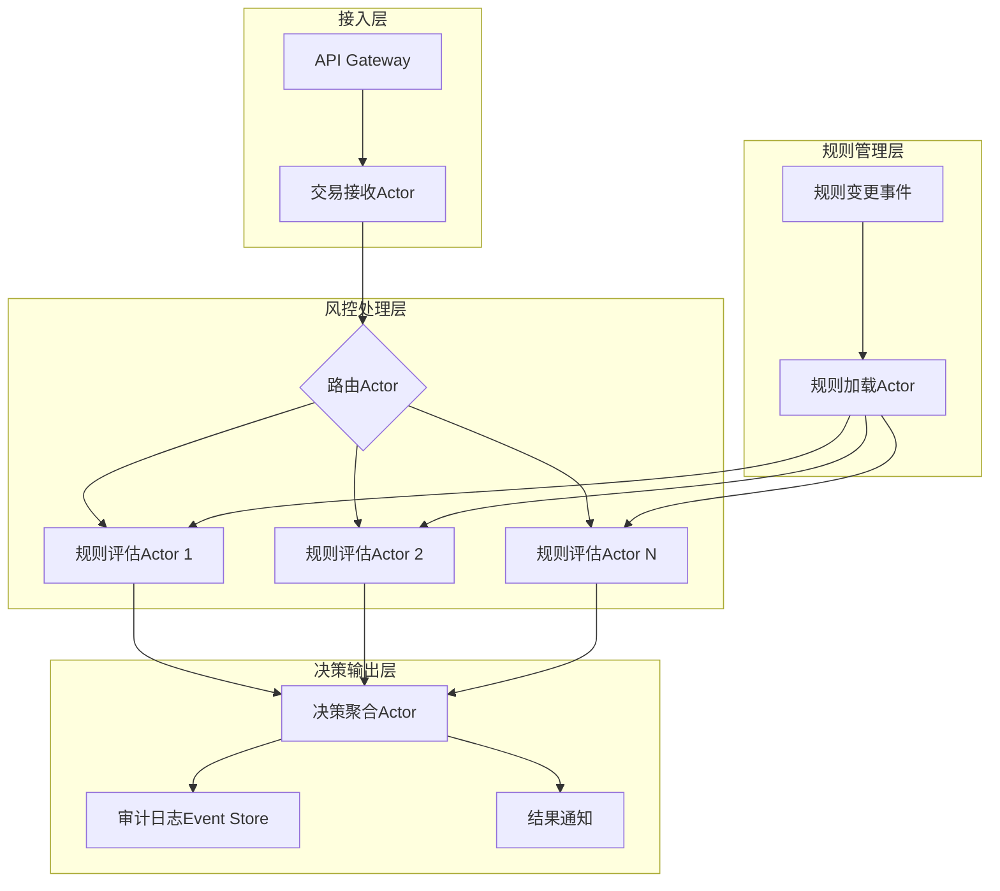

# 实战案例

理论和技巧终归要落地到真实场景中才能展现其价值。本节精选四个不同领域的架构实战案例，覆盖从架构选型、渐进式迁移到架构腐化治理的完整生命周期。每个案例都包含**背景分析→架构决策→实施过程→效果评估→经验总结**五个环节，帮助读者理解"架构风格不是纸上谈兵，而是真金白银的权衡取舍"。

---

## 案例一：电商平台从单体到微服务的渐进式拆分

### 1.1 背景与痛点

某B2C电商平台在创业初期采用经典的单体架构（Monolithic Architecture），所有业务模块——商品、订单、用户、支付、库存——打包部署在一个Java应用中。

| 指标 | 初创期（日活1万） | 增长期（日活50万） | 痛点描述 |
|------|-------------------|-------------------|----------|
| 部署频率 | 每周1次 | 每周1次 | 任何模块变更都要全量部署 |
| 单次部署耗时 | 10分钟 | 2小时 | 编译+测试+上线周期过长 |
| 故障影响 | 全站不可用 | 全站不可用 | 一个模块的OOM拖垮整个系统 |
| 团队协作 | 5人无冲突 | 30人频繁冲突 | 代码合并冲突率超过40% |
| 横向扩展 | 整体扩容 | 整体扩容 | 只有订单模块需要扩容，却要复制整个应用 |

**关键矛盾**：业务增长需要快速迭代，但单体架构的耦合导致每次发布都像"拆弹"——任何一个模块的bug都可能引发全站故障。

### 1.2 架构决策过程

团队面临三个选择：

方案对比：

┌─────────────────────┬──────────────┬──────────────┬──────────────┐
│ 维度                │ 维持单体     │ 一步到位拆微服务 │ 渐进式拆分    │
├─────────────────────┼──────────────┼──────────────┼──────────────┤
│ 改造成本            │ 低           │ 极高           │ 中等          │
│ 风险程度            │ 无           │ 极高           │ 可控          │
│ 落地周期            │ 无           │ 6-12个月       │ 3-6个月       │
│ 团队能力要求        │ 无           │ 需要资深架构师  │ 逐步提升      │
│ 对业务的影响        │ 持续恶化     │ 可能中断业务   │ 几乎无影响    │
│ 灵活性              │ 差           │ 好             │ 好            │
└─────────────────────┴──────────────┴──────────────┴──────────────┘

**最终决策**：采用**渐进式拆分（Strangler Fig Pattern）**，先拆分最痛的模块，逐步演进。

选择依据（参考Conway定律）：
- 团队已按业务线分为3个小组，天然适合拆分为3个服务
- 商品和订单的变更频率差异大，耦合在一起浪费部署资源
- 支付模块有独立的安全合规要求，独立部署更利于审计

### 1.3 实施过程

**Phase 1：建立绞杀者模式的基础设施（第1-2周）**

```java
// API Gateway 路由配置（基于Spring Cloud Gateway）
spring:
  cloud:
    gateway:
      routes:
        # 旧路由：所有请求到单体
        - id: monolith-all
          uri: http://monolith-app:8080
          predicates:
            - Path=/**
          # 默认路由，新服务上线后逐步缩减匹配范围

        # 新路由：用户服务独立
        - id: user-service
          uri: http://user-service:8081
          predicates:
            - Path=/api/users/**
            - Path=/api/auth/**
```

核心思路：在请求入口处设置路由层，新服务逐步接管流量，单体逐步退化为"遗留系统"。

**Phase 2：拆分用户认证服务（第3-4周）**

选择用户认证作为第一个拆分目标，因为：
- 接口边界清晰（登录、注册、Token校验）
- 是所有模块的依赖，拆出后其他服务可复用
- 团队中有2人对认证逻辑非常熟悉

```java
// 用户服务核心接口
@RestController
@RequestMapping("/api/auth")
public class AuthController {

    @PostMapping("/login")
    public ResponseEntity<TokenResponse> login(@RequestBody LoginRequest request) {
        // 1. 验证用户凭据
        User user = userService.authenticate(request.getUsername(), request.getPassword());
        // 2. 生成JWT Token
        String token = jwtService.generateToken(user);
        // 3. 记录登录事件（发布到消息队列，供其他服务消费）
        eventPublisher.publish(new UserLoggedInEvent(user.getId(), Instant.now()));
        return ResponseEntity.ok(new TokenResponse(token));
    }
}

// 事件发布（解耦其他服务对用户状态的依赖）
@Component
public class UserEventPublisher {
    @Autowired
    private KafkaTemplate<String, Object> kafkaTemplate;

    public void publish(UserLoggedInEvent event) {
        kafkaTemplate.send("user-events", event.getUserId().toString(), event);
    }
}
```

**Phase 3：拆分订单服务（第5-8周）**

订单服务是业务核心，拆分难度最大。关键挑战是订单与商品、库存、支付之间的数据一致性。

拆分前（单体内事务）：
  创建订单 → 扣减库存 → 创建支付单
  [同一个数据库事务，失败全部回滚]

拆分后（分布式Saga）：
  创建订单 ──成功──→ 扣减库存 ──成功──→ 创建支付单
       │                  │                  │
       失败               失败               失败
       ↓                  ↓                  ↓
  [无需补偿]      补偿：恢复库存     补偿：取消订单+恢复库存

```java
// Saga编排器（基于状态机）
@Component
public class OrderSaga {

    @SagaStep(order = 1, compensate = "cancelOrder")
    public void createOrder(CreateOrderCommand cmd) {
        orderRepository.save(new Order(cmd.getOrderId(), cmd.getItems()));
    }

    @SagaStep(order = 2, compensate = "restoreInventory")
    public void deductInventory(DeductInventoryCommand cmd) {
        inventoryClient.deduct(cmd.getItems());
    }

    @SagaStep(order = 3, compensate = "cancelPayment")
    public void createPayment(CreatePaymentCommand cmd) {
        paymentClient.create(cmd.getOrderId(), cmd.getAmount());
    }

    // 补偿方法
    public void cancelOrder(String orderId) {
        orderRepository.cancel(orderId);
    }

    public void restoreInventory(String orderId) {
        Order order = orderRepository.findById(orderId);
        inventoryClient.restore(order.getItems());
    }
}
```

**Phase 4：数据迁移与双写（第9-12周）**

这是最危险的阶段。采用双写策略确保数据一致性：

双写过渡期（持续2周）：

写操作：
  应用层 ──→ 旧数据库（主）
  应用层 ──→ 新数据库（从，异步同步）

读操作：
  新请求 ──→ 新数据库
  旧接口 ──→ 旧数据库

验证：
  定时任务对比两个数据库的数据一致性
  一致性达到99.99%后，切换读流量到新数据库
  最后停止旧数据库写入

### 1.4 效果评估

| 指标 | 拆分前（单体） | 拆分后（微服务） | 变化 |
|------|---------------|-----------------|------|
| 部署频率 | 每周1次 | 每天5-10次 | 提升50倍 |
| 单次部署耗时 | 2小时 | 5分钟 | 降低96% |
| 故障隔离 | 全站不可用 | 单服务降级 | 影响范围缩小80% |
| 团队冲突 | 合并冲突率40% | 合并冲突率5% | 降低87% |
| 资源利用率 | 整体扩容，浪费60% | 按需扩容，浪费10% | 降低50%成本 |
| P99延迟 | 200ms | 80ms | 降低60% |

### 1.5 经验总结

**成功要素**：
- **渐进式而非激进式**：每次只拆一个服务，验证稳定后再拆下一个
- **基础设施先行**：先建好API Gateway、服务注册、监控告警，再拆服务
- **数据一致性保障**：Saga模式+双写过渡，避免数据丢失
- **团队对齐**：拆分边界与团队边界一致（Conway定律的正向应用）

**避坑指南**：
- 不要在没有监控的情况下拆分微服务——出了问题你根本不知道是哪个服务的问题
- 不要拆太细——"纳米服务"（每个服务只有几十行代码）是另一种灾难
- 数据库拆分是最大的风险点，宁可多花时间做双写验证

---

## 案例二：实时风控系统的事件驱动架构设计

### 2.1 背景与挑战

某金融科技公司需要构建一套实时交易风控系统，核心需求：

- **实时性**：每笔交易必须在50ms内完成风控判断
- **高吞吐**：峰值每秒处理10万笔交易
- **可扩展**：风控规则频繁变更，新增规则不能重启系统
- **可审计**：每笔交易的风控决策必须可追溯

业务流程：
用户发起交易 → 风控系统 → 通过/拒绝 → 通知业务系统

时间约束：
  用户点击"支付" → 收到结果 ≤ 500ms
  风控系统本身必须 ≤ 50ms（留给网络和业务处理的时间）

### 2.2 架构选型分析

| 架构风格 | 适用性评分 | 理由 |
|----------|-----------|------|
| 同步RPC（REST/gRPC） | ★★☆☆☆ | 延迟可控，但规则变更需要重启，扩展性差 |
| 分层架构 + 规则引擎 | ★★★☆☆ | 规则可配置，但单机性能瓶颈，难以水平扩展 |
| 事件驱动 + CQRS | ★★★★☆ | 高吞吐、可扩展，规则变更通过事件推送 |
| Actor模型 | ★★★★★ | 天然高并发、低延迟、可水平扩展 |

**最终选择：Actor模型 + 事件驱动的混合架构**

选择理由：
- Actor模型天然适合高并发消息处理，每个交易可以由独立的Actor处理
- 事件驱动架构支持规则的动态加载和热更新
- CQRS将风控决策（写）和风控分析（读）分离，各自优化

### 2.3 核心架构设计



**Actor定义（基于Akka）**：

```java
// 交易接收Actor
public class TransactionReceiver extends AbstractActor {
    private final ActorRef router;

    @Override
    public Receive createReceive() {
        return receiveBuilder()
            .match(Transaction.class, tx -> {
                // 创建独立的评估Actor处理每笔交易
                ActorRef evaluator = getContext().actorOf(
                    Props.create(TransactionEvaluator.class, tx)
                );
                // 设置超时（50ms）
                getContext().system().scheduler().scheduleOnce(
                    Duration.ofMillis(50),
                    evaluator,
                    Timeout.INSTANCE,
                    getSelf()
                );
            })
            .build();
    }
}

// 规则评估Actor
public class TransactionEvaluator extends AbstractActor {
    private final Transaction transaction;
    private final List<RiskRule> rules;
    private List<RiskResult> results = new ArrayList<>();

    @Override
    public Receive createReceive() {
        return receiveBuilder()
            .match(Evaluate.class, msg -> {
                // 并行执行所有规则
                for (RiskRule rule : rules) {
                    ActorRef ruleActor = getContext().actorOf(
                        Props.create(RuleActor.class, rule)
                    );
                    ruleActor.tell(new Evaluate(transaction), getSelf());
                }
            })
            .match(RiskResult.class, result -> {
                results.add(result);
                // 所有规则执行完毕，聚合结果
                if (results.size() == rules.size()) {
                    RiskDecision decision = aggregate(results);
                    getSender().tell(decision, getSelf());
                    // 发布决策事件
                    eventBus.publish(new RiskDecisionEvent(transaction.getId(), decision));
                    getContext().stop(getSelf());
                }
            })
            .build();
    }
}
```

**CQRS实现——规则热更新**：

```java
// 规则变更事件（写侧）
public class RuleChangedEvent {
    private String ruleId;
    private String ruleType;        // BLACKLIST / VELOCITY / ML_MODEL
    private String ruleContent;     // 规则定义（JSON）
    private Instant effectiveTime;  // 生效时间
}

// 规则缓存（读侧）——本地内存缓存，通过事件同步
@Component
public class RuleCache {
    // ConcurrentHashMap保证线程安全
    private final ConcurrentHashMap<String, RiskRule> rules = new ConcurrentHashMap<>();

    // 监听规则变更事件，实时更新本地缓存
    @EventListener
    public void onRuleChanged(RuleChangedEvent event) {
        RiskRule rule = parseRule(event.getRuleContent());
        if (rule != null) {
            rules.put(event.getRuleId(), rule);
            log.info("规则热更新: {} (生效时间: {})", event.getRuleId(), event.getEffectiveTime());
        }
    }

    public List<RiskRule> getAllRules() {
        return new ArrayList<>(rules.values());
    }
}
```

### 2.4 性能优化关键点

**优化1：Actor池化（避免Actor创建开销）**

```java
// 使用Router将交易分发到固定数量的Evaluator Actor
// 而不是每笔交易创建一个新Actor
ActorRef router = getContext().actorOf(
    FromConfig.props(Props.create(TransactionEvaluator.class)),
    "evaluator-router"
);

// application.conf
akka.actor.deployment {
    /evaluator-router {
        router = round-robin-pool
        nr-of-instances = 100  // 100个Evaluator并行处理
    }
}
```

**优化2：规则预编译（避免运行时解析开销）**

```java
// 规则从JSON编译为可执行函数
public class RuleCompiler {
    public CompiledRule compile(RawRule raw) {
        // 将规则表达式编译为Lambda表达式
        // 避免每次评估时重新解析JSON
        String script = raw.getExpression();
        ScriptEngine engine = new ScriptEngineManager().getEngineByName("js");
        // 预编译脚本，多次调用时复用
        CompiledScript compiled = ((Compilable) engine).compile(script);
        return new CompiledRule(raw.getId(), compiled);
    }
}
```

**优化3：批量聚合审计日志（避免频繁写入）**

```java
// 审计日志不是逐条写入数据库，而是批量写入Kafka
// 由下游消费者异步写入存储
@Component
public class AuditLogBatcher {
    private final List<RiskDecisionEvent> buffer = new CopyOnWriteArrayList<>();
    private static final int BATCH_SIZE = 1000;
    private static final long FLUSH_INTERVAL_MS = 1000;

    @Scheduled(fixedDelay = FLUSH_INTERVAL_MS)
    public void flush() {
        if (buffer.size() >= BATCH_SIZE) {
            List<RiskDecisionEvent> batch = new ArrayList<>(buffer);
            buffer.clear();
            kafkaTemplate.send("audit-logs", batch);
        }
    }
}
```

### 2.5 效果评估

| 指标 | 目标值 | 实际值 | 评价 |
|------|--------|--------|------|
| 单笔交易风控延迟 | ≤ 50ms | P99 = 12ms | 远超预期 |
| 吞吐量 | 10万 TPS | 15万 TPS | 有余量 |
| 规则热更新延迟 | ≤ 5秒 | 200ms | 极快 |
| 系统可用性 | 99.9% | 99.99% | 达标 |
| 扩展性 | 线性扩展 | 线性扩展 | 新增节点即扩容 |

---

## 案例三：物联网平台的混合架构选型与演进

### 3.1 背景与规模

某智慧城市项目需要建设统一的物联网（IoT）管理平台，接入各类传感器和设备：

| 设备类型 | 数量 | 数据频率 | 单条数据大小 |
|----------|------|----------|-------------|
| 环境传感器 | 50万个 | 每5分钟 | 200字节 |
| 视频摄像头 | 10万个 | 实时流 | 2Mbps/路 |
| 智能路灯 | 30万个 | 每10分钟 | 100字节 |
| 车辆终端 | 20万个 | 每1秒 | 500字节 |
| **总计** | **110万** | — | — |

**核心挑战**：
- 异构设备协议多样（MQTT、CoAP、HTTP、Modbus）
- 数据量巨大：稳态每天产生约50亿条消息
- 设备管理复杂：注册、OTA升级、远程控制
- 实时告警：异常数据需要秒级响应

### 3.2 架构风格组合方案

单一架构风格无法满足所有需求，最终采用**混合架构**：

IoT平台混合架构全景：

┌─────────────────────────────────────────────────────────────┐
│                     设备接入层                                │
│  ┌─────────┐ ┌─────────┐ ┌─────────┐ ┌─────────┐           │
│  │MQTT代理  │ │CoAP网关 │ │HTTP接入  │ │边缘网关  │           │
│  │(EMQ X)  │ │(Californium)│ │(Nginx) │ │(Edge)   │           │
│  └────┬────┘ └────┬────┘ └────┬────┘ └────┬────┘           │
│       └───────────┴───────────┴───────────┘                 │
│                         │                                    │
│                    ┌────┴────┐                               │
│                    │协议适配器│  ← 管道-过滤器风格              │
│                    └────┬────┘                               │
├─────────────────────────┼───────────────────────────────────┤
│                    消息中间件层                                │
│              ┌─────────┴─────────┐                          │
│              │     Apache Kafka   │  ← 事件驱动风格           │
│              │  (设备数据总线)     │                          │
│              └─────────┬─────────┘                          │
├─────────────────────────┼───────────────────────────────────┤
│                    计算处理层                                  │
│  ┌──────────┐ ┌──────────┐ ┌──────────┐                     │
│  │实时流处理  │ │规则引擎   │ │AI推理引擎 │  ← Actor模型风格    │
│  │(Flink)   │ │(Drools)  │ │(TensorRT)│                     │
│  └──────────┘ └──────────┘ └──────────┘                     │
├─────────────────────────────────────────────────────────────┤
│                    数据存储层                                  │
│  ┌──────────┐ ┌──────────┐ ┌──────────┐ ┌──────────┐       │
│  │时序数据库  │ │关系数据库 │ │对象存储   │ │缓存       │       │
│  │(TDengine)│ │(PostgreSQL)│ │(MinIO)  │ │(Redis)  │       │
│  └──────────┘ └──────────┘ └──────────┘ └──────────┘       │
├─────────────────────────────────────────────────────────────┤
│                    业务服务层                                  │
│  ┌──────────┐ ┌──────────┐ ┌──────────┐ ┌──────────┐       │
│  │设备管理   │ │告警中心   │ │数据分析   │ │可视化    │       │
│  └──────────┘ └──────────┘ └──────────┘ └──────────┘       │
└─────────────────────────────────────────────────────────────┘

**各层架构风格选择依据**：

| 层次 | 选择的架构风格 | 理由 |
|------|-------------|------|
| 设备接入 | 管道-过滤器 | 设备协议多样，需要逐层适配（解码→校验→转换→路由） |
| 消息中间件 | 事件驱动（Pub/Sub） | 设备数据量大，需要削峰填谷和异步解耦 |
| 计算处理 | Actor模型 + 管道-过滤器 | 每个设备数据流是独立的Actor，Flink内部是管道-过滤器 |
| 数据存储 | 仓库风格（Repository） | 统一数据访问接口，底层可替换存储引擎 |
| 业务服务 | 分层架构 | 业务逻辑相对传统，CRUD为主 |

### 3.3 关键实现：协议适配管道

```python
# 管道-过滤器风格的协议适配器
class Pipeline:
    """通用管道-过滤器框架"""
    def __init__(self):
        self.filters = []

    def add_filter(self, filter_fn):
        self.filters.append(filter_fn)
        return self  # 支持链式调用

    def execute(self, data):
        result = data
        for f in self.filters:
            result = f(result)
        return result

# MQTT协议适配管道
mqtt_pipeline = Pipeline()
mqtt_pipeline \
    .add_filter(decode_payload)       # 过滤器1: 解码二进制payload
    .add_filter(validate_schema)      # 过滤器2: 校验数据格式
    .add_filter(normalize_timestamp)  # 过滤器3: 统一时间戳格式
    .add_filter(enrich_device_info)   # 过滤器4: 补充设备元信息
    .add_filter(routing_decision)     # 过滤器5: 路由到目标Topic

# 使用示例
raw_data = mqtt_client.receive("devices/+/telemetry")
normalized = mqtt_pipeline.execute(raw_data)
kafka_producer.send("iot-telemetry", normalized)
```

### 3.4 关键实现：Actor模型处理设备状态

```python
# 设备状态管理（Actor模型思想）
class DeviceActor:
    """每个设备对应一个Actor，管理设备状态和心跳"""
    def __init__(self, device_id):
        self.device_id = device_id
        self.state = "unknown"          # unknown/online/offline/error
        self.last_heartbeat = None
        self.data_buffer = []

    def on_message(self, message):
        """接收设备消息"""
        if message.type == "heartbeat":
            self.handle_heartbeat(message)
        elif message.type == "telemetry":
            self.handle_telemetry(message)
        elif message.type == "command_response":
            self.handle_command_response(message)

    def handle_heartbeat(self, msg):
        self.last_heartbeat = msg.timestamp
        self.state = "online"
        # 超过60秒没有心跳，标记为离线
        scheduler.schedule_once(60, self.check_offline)

    def handle_telemetry(self, msg):
        self.data_buffer.append(msg.data)
        # 批量写入时序数据库（每100条或每5秒）
        if len(self.data_buffer) >= 100:
            self.flush_to_tdengine()

    def check_offline(self):
        now = datetime.now()
        if self.last_heartbeat and (now - self.last_heartbeat).seconds > 60:
            self.state = "offline"
            event_bus.publish(DeviceOfflineEvent(self.device_id))
```

### 3.5 效果评估

| 指标 | 目标 | 实际 | 备注 |
|------|------|------|------|
| 设备接入容量 | 100万 | 150万 | 有余量 |
| 消息吞吐 | 100万条/秒 | 200万条/秒 | Kafka分区可调 |
| 告警延迟 | ≤ 10秒 | 3秒 | 规则引擎直接处理 |
| 设备离线检测 | ≤ 2分钟 | 1分钟 | 心跳超时机制 |
| 存储成本 | ≤ 50万/年 | 35万/年 | 时序数据库压缩比高 |

---

## 案例四：架构腐化的识别与治理

### 4.1 背景——"正常"的系统如何变坏

某SaaS产品的后端系统在运行3年后，代码质量持续下降。团队并未经历重大架构变更，但系统却"自然腐化"了。

**架构腐化的典型症状**：

| 症状 | 具体表现 | 出现频率 |
|------|---------|---------|
| 依赖混乱 | A模块直接调用B的内部实现，绕过接口 | 随处可见 |
| 循环依赖 | service-A依赖service-B，service-B又依赖service-A | 发现3处 |
| 逻辑泄漏 | 数据库层出现业务判断，表示层包含SQL语句 | 20+处 |
| 上帝类 | UserManager类有3000行代码，包含所有用户相关逻辑 | 1个 |
| 死代码 | 不再使用的旧接口、废弃的工具类 | 占代码量15% |
| 测试覆盖下降 | 新功能不写测试，核心模块测试覆盖率从80%降到45% | 持续恶化 |

### 4.2 诊断过程：用架构适应度函数量化腐化

团队首先用**ArchUnit**（Java架构适应度函数工具）对现有代码进行量化评估：

```java
@ArchTest
static final ArchRule no_cycles = slices().matching("com.myapp.(*)..")
    .should().beFreeOfCycles();

@ArchTest
static final ArchRule layer_dependencies = layered()
    .consideringOnlyDependenciesInAnyPackage("com.myapp..")
    .layer("Controller").shallNotAccess().layer("Repository")
    .layer("Service").shallNotAccess().layer("Controller");

@ArchTest
static final ArchRule no_cycles_across_modules =
    slices().matching("com.myapp.moduleA.(*)..")
    .should().notDependOnEachOther()
    .because("模块间不应有循环依赖");
```

**评估结果**：

架构健康度评分（满分100）：

模块化完整性     ████████░░░░░░░░░░░░  40/100  ← 循环依赖严重
分层规范性       ████████████░░░░░░░░  60/100  ← 逻辑泄漏
接口契约遵守度   ██████████░░░░░░░░░░  50/100  ← 绕过接口直接访问内部
代码重复率       ██████████████░░░░░░  70/100  ← 部分重复
测试覆盖度       ████████░░░░░░░░░░░░  45/100  ← 下降严重

综合评分：53/100（不健康）

### 4.3 治理策略：外科手术式重构

团队没有选择"推倒重来"，而是制定了**外科手术式的精准治理计划**：

**原则：每次改动只解决一个架构问题，不引入新功能**

**Step 1：切断循环依赖（优先级最高）**

```java
// 治理前：OrderService 和 PaymentService 循环依赖
// OrderService.createOrder() 调用 PaymentService.createPayment()
// PaymentService.createPayment() 又调用 OrderService.getOrder()

// 治理方案：引入事件总线，切断直接依赖
// OrderService 不再直接调用 PaymentService
// 而是发布 OrderCreatedEvent，由 PaymentService 订阅处理

@Component
public class OrderService {
    @Autowired
    private ApplicationEventPublisher eventPublisher;

    @Transactional
    public Order createOrder(OrderRequest request) {
        Order order = new Order(request);
        orderRepository.save(order);
        // 发布事件，而非直接调用PaymentService
        eventPublisher.publishEvent(new OrderCreatedEvent(order.getId(), order.getAmount()));
        return order;
    }
}

// PaymentService 订阅事件
@Component
public class PaymentEventHandler {
    @EventListener
    public void handleOrderCreated(OrderCreatedEvent event) {
        paymentService.createPayment(event.getOrderId(), event.getAmount());
    }
}
```

**Step 2：恢复分层规范（清理逻辑泄漏）**

发现的问题及修复：

问题1：Controller层包含业务逻辑
  原代码：@PostMapping("/orders") 中直接做了库存判断和价格计算
  修复：抽取到OrderService中

问题2：Repository层包含业务判断
  原代码：findByStatus() 方法内部有"如果是VIP用户则优先返回"的逻辑
  修复：业务判断移到Service层，Repository只做数据查询

问题3：Entity中包含HTTP相关的逻辑
  原代码：User实体中有toJSON()方法返回HTTP响应格式
  修复：用DTO分离数据模型和传输模型

**Step 3：逐步拆分上帝类**

UserManager (3000行) 拆分为：

┌──────────────────────┐
│    UserManager       │  ← 只保留核心协调逻辑（300行）
├──────────────────────┤
│ → UserAuthService    │  ← 认证相关（登录/注册/Token）
│ → UserProfileService │  ← 个人信息管理
│ → UserPermissionService│ ← 权限管理
│ → UserNotificationService│ ← 通知偏好
└──────────────────────┘

拆分方法：每次提取一个职责，写好测试后再提取下一个

**Step 4：建立适应度函数防止回退**

```java
// 在CI/CD流水线中自动运行架构检查
@ArchTest
static final ArchRule controllers_should_not_contain_business_logic =
    noClasses().that().areAnnotatedWith(Controller.class)
    .should().dependOnClassesThat().resideInPersistencePackage()
    .because("Controller层不应直接依赖Repository层，请使用Service层");

@ArchTest
static final ArchRule service_classes_should_not_exceed_500_lines =
    classes().that().haveSimpleNameEndingWith("Service")
    .should(new ArchCondition<Class<?>>("have less than 500 lines") {
        @Override
        public void check(Class<?> clazz, ConditionEvents events) {
            long lines = CountLines.of(clazz);
            if (lines > 500) {
                events.add(SimpleConditionEvent.violated(clazz,
                    clazz.getName() + " has " + lines + " lines, exceeds 500"));
            }
        }
    });
```

### 4.4 治理效果（持续6个月）

月度架构健康度变化：

月份    健康度   关键动作
────────────────────────────────────────
第1月    53      基线测量，建立适应度函数
第2月    58      切断3处循环依赖
第3月    64      清理Controller层逻辑泄漏
第4月    71      拆分UserManager（50%完成）
第5月    78      拆分UserManager（100%完成）
第6月    85      清理死代码，恢复测试覆盖到70%

趋势：健康度从53提升到85，且在适应度函数的保护下不会回退

### 4.5 经验总结

**架构腐化的根本原因**：
- 不是技术问题，而是**团队协作和代码纪律问题**
- 代码审查不严格，"能跑就行"的心态
- 缺少自动化架构约束检查
- 人员流动导致知识断层

**治理的关键原则**：
- **量化先行**：用ArchUnit等工具量化腐化程度，而非凭感觉
- **增量治理**：每次只改一个架构问题，避免大规模重构引入新bug
- **适应度函数**：建立自动化检查机制，防止新代码继续腐化
- **持续投入**：架构治理不是一次性项目，而是持续的日常实践

---

## 本节小结

| 案例 | 核心架构风格 | 关键决策 | 最大教训 |
|------|------------|---------|---------|
| 电商平台 | 微服务 + 绞杀者模式 | 渐进式拆分而非一步到位 | 数据库拆分是最大风险点 |
| 风控系统 | Actor模型 + CQRS | 用Actor天然处理高并发 | 规则热更新需要事件驱动支撑 |
| IoT平台 | 混合架构（管道+事件+Actor） | 没有万能架构，需要分层组合 | 协议适配是IoT的第一道坎 |
| 架构治理 | 适应度函数 + 分层架构 | 量化+增量+自动化 | 架构腐化是团队问题而非技术问题 |

**核心洞察**：架构风格的选择没有"标准答案"，只有"最适合的答案"。每个案例中的决策都基于具体的业务场景、团队能力和约束条件。架构师的价值不在于选择最新的技术，而在于在约束条件下做出最优权衡。
