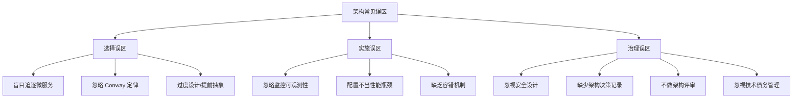
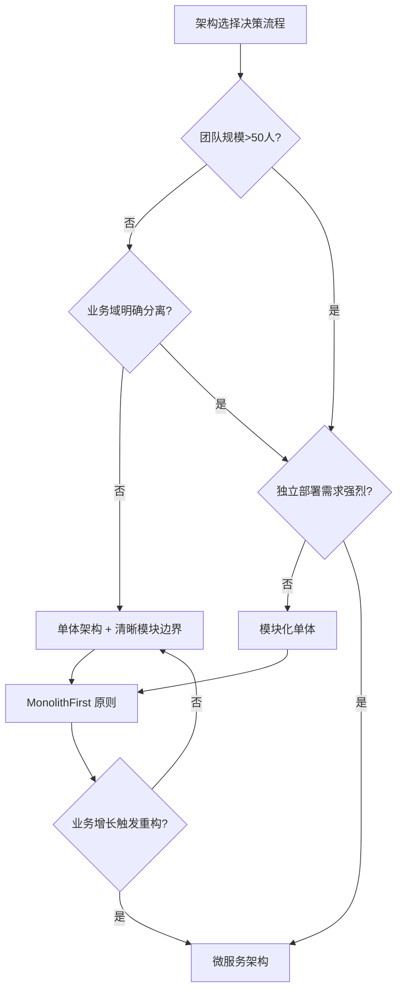
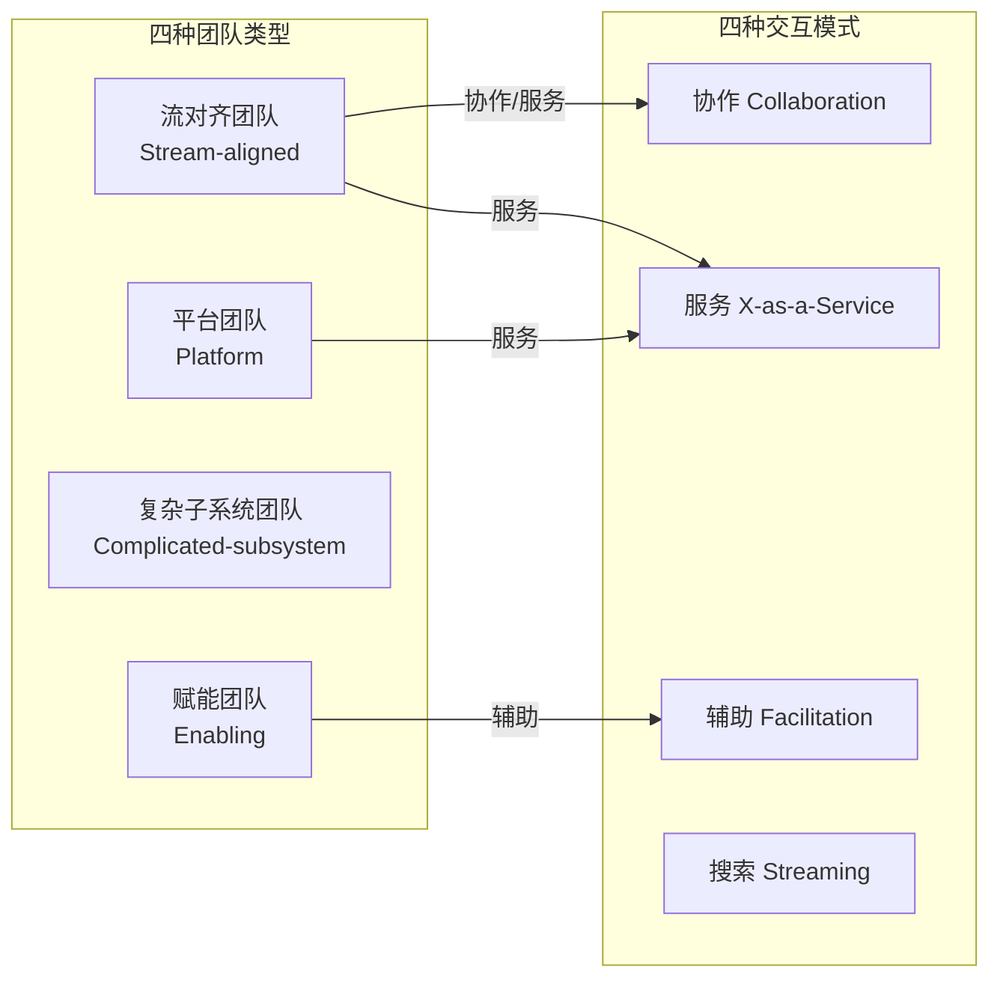
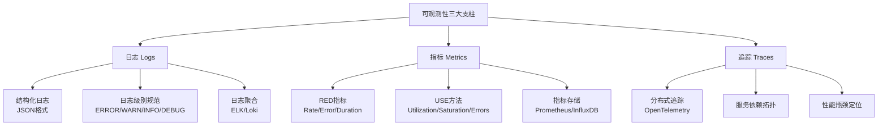
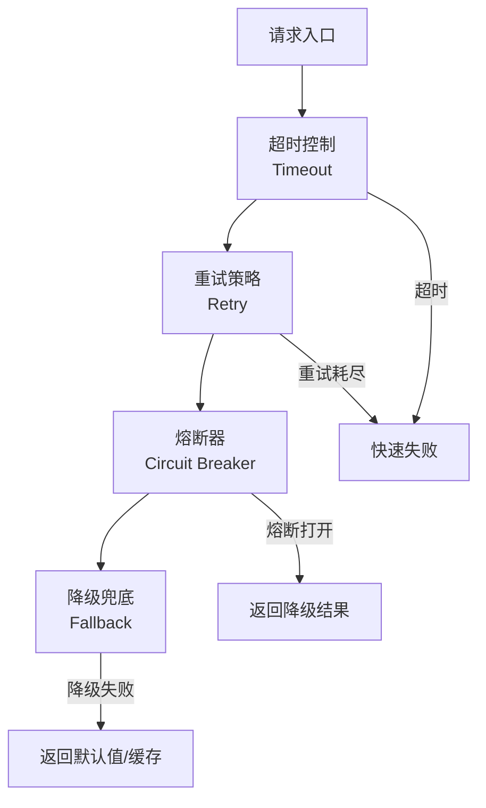
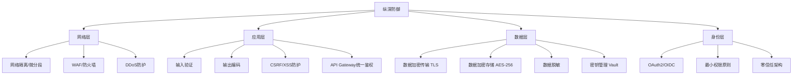
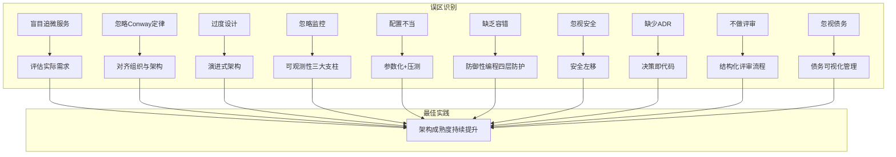

## 常见误区

架构风格的选择与实施是软件系统中最关键也最容易犯错的环节。根据Thoughtworks技术雷达（2024）和IEEE Software的调查数据，超过60%的系统架构问题源于初期决策失误，而这些问题往往可以在实施前通过识别常见误区来避免。本节系统梳理架构风格领域中高频出现的十大误区，从选择、实施到治理三个维度深入剖析，帮助读者建立正确的架构思维。



### 误区一：盲目追逐微服务，忽略实际需求

**错误表现**：团队规模不足10人、业务复杂度不高、系统日均请求量低于10万的情况下，强行将单体应用拆分为微服务架构。拆分后引入Kubernetes、Service Mesh、分布式链路追踪等一整套基础设施，运维复杂度激增，开发效率反而下降。

**为什么会犯这个错**：

1. **技术品牌效应**：微服务在技术社区曝光度极高，大量博客、会议演讲和成功案例让团队产生"不用微服务就落伍"的焦虑
2. **简历驱动开发（Resume-Driven Development）**：技术负责人倾向于选择能丰富个人履历的技术栈，而非最适合业务的方案
3. **规模误判**：将"未来可能需要"当作"现在必须做"，过早引入分布式系统的复杂性

**真实案例**：2019年，某B2B SaaS创业公司（团队8人）在MVP阶段就采用微服务架构，拆分为12个独立服务。结果：
- 每次部署需要协调多个服务的版本兼容性
- 联调时间占开发周期的40%
- 3个服务间的数据一致性问题导致每周至少2次线上事故
- 6个月后回退为单体架构，花费2个月重构

**正确做法**：



Martin Fowler的"MonolithFirst"原则明确指出：先用单体验证业务，当团队规模、业务复杂度或部署频率达到微服务的门槛时，再逐步拆分。微服务的门槛通常是：

| 判断维度 | 单体适用 | 微服务适用 |
|----------|---------|-----------|
| 团队规模 | <30人 | >50人 |
| 业务域数量 | 1-3个核心域 | 5+个独立子域 |
| 部署频率 | 周级或更低 | 多次/天 |
| 独立扩展需求 | 统一扩展 | 不同服务差异>10倍 |
| 技术栈多样性 | 1-2种 | 3+种且差异大 |
| 数据一致性要求 | 强一致性优先 | 最终一致性可接受 |

### 误区二：忽略 Conway 定律，架构与组织脱节

**错误表现**：设计出优美的微服务架构图，但团队组织结构仍是传统的按技术分层（前端组、后端组、DBA组、运维组），导致每个功能变更都需要跨越多个团队协调，沟通成本指数级增长。

**为什么会犯这个错**：

1. **架构设计与组织设计分离**：架构师在白板上画图，不关注实际团队结构
2. **管理层阻力**：调整组织架构涉及人事、汇报线、绩效考核，阻力远大于技术重构
3. **Conway定律不直观**：很多人知道这个定律但低估了它的影响力

**Conway定律（1967）的核心洞见**：

> "设计系统的组织，其产生的设计等价于组织之间的沟通结构。"
> —— Melvin Conway

这意味着：如果你的团队按前端/后端/DBA分组，你的系统必然会按表示层/业务层/数据层分层。如果你希望系统按业务能力拆分，团队也必须按业务能力组织。

**正确做法**：

| 组织结构 | 系统架构结果 | 适用场景 |
|----------|-------------|---------|
| 按技术分层（前端/后端/DBA） | 三层架构、技术组件分层 | 传统企业、技术驱动团队 |
| 按业务能力（订单组/支付组/用户组） | 微服务按业务域拆分 | 互联网公司、业务驱动团队 |
| 按产品线/流（Stream-aligned） | 追求流对齐的架构 | DevOps成熟团队、平台工程 |
| 按平台（Platform team + Stream teams） | 平台化架构 + 自助服务 | 大型组织、内部平台建设 |

Team Topologies（Skelton & Pais, 2019）提出的四种团队拓扑与四种交互模式，是解决Conway定律问题的实用框架：



### 误区三：过度设计，提前抽象

**错误表现**：在项目初期就设计出复杂的分层抽象、引入领域驱动设计的全部概念（聚合根、领域事件、CQRS）、搭建插件化架构，而实际业务需求可能只是一个简单的CRUD管理后台。

**为什么会犯这个错**：

1. **YAGNI反面**：过度追求"架构优雅"，为不存在的需求预留扩展点
2. **经验主义迁移**：将上一个大型项目的架构经验不加筛选地套用到新项目
3. **恐惧驱动**：担心未来无法扩展，在初期就投入大量架构成本

**正确做法**：遵循演进式架构（Evolutionary Architecture）的核心原则：

```python
# 反模式：过早抽象
class OrderRepository(Repository):  # 抽象层
    pass
class SqlOrderRepository(OrderRepository):  # SQL实现
    pass
class MongoOrderRepository(OrderRepository):  # MongoDB实现
    pass
class CacheOrderRepository(OrderRepository):  # 缓存装饰
    pass

# 正确做法：YAGNI，先用最简实现
class OrderRepository:
    def __init__(self, db: Database):
        self.db = db

    def find_by_id(self, order_id: str) -> Order:
        return self.db.query("SELECT * FROM orders WHERE id = ?", order_id)

    # 当确实需要第二个存储后端时，再抽象
    # 当确实需要缓存时，再加装饰器
```

关键原则：**三法则（Rule of Three）**——在有三个具体实现需求之前，不要创建抽象层。前两次重复是巧合，第三次重复才是模式。

### 误区四：忽略监控与可观测性

**错误表现**：系统上线后缺乏完善的监控体系，没有结构化日志、分布式链路追踪和关键指标告警。出了问题只能SSH到服务器上看日志，排查时间从分钟级延长到小时甚至天级。

**为什么会犯这个错**：

1. **监控被视为运维工作**：开发团队认为"功能做完了就交付"，监控是运维的事
2. **可观测性成本被低估**：搭建完整的可观测性体系需要投入基础设施和开发时间
3. **短期思维**：项目初期访问量小，问题少，觉得"暂时不需要"

**为什么会犯这个错**：

1. **监控被当作运维工作**：开发团队认为"功能做完了就交付"，监控体系的建设被推迟
2. **可观测性成本被低估**：搭建完整的可观测性体系需要投入基础设施和开发时间
3. **短期思维**：项目初期访问量小，问题少，觉得"暂时不需要"

**为什么可观测性至关重要**：

在分布式系统中，一个用户请求可能经过10+个服务。没有可观测性，排查问题就像在没有GPS的城市里找一栋没有门牌号的房子。Google的SRE实践表明，完善的可观测性可以将平均故障恢复时间（MTTR）从小时级降低到分钟级。

**正确做法**：建立可观测性三大支柱（Three Pillars of Observability）



**可观测性技术栈推荐**：

| 支柱 | 开源方案 | 商业方案 | 适用规模 |
|------|---------|---------|---------|
| 日志 | ELK Stack、Loki + Grafana | Datadog Logs、Splunk | 全规模 |
| 指标 | Prometheus + Grafana | Datadog、New Relic | 全规模 |
| 追踪 | Jaeger、Zipkin、OpenTelemetry | Datadog APM、Zipkin | 全规模 |
| 全栈 | OpenTelemetry + Grafana Stack | Datadog、Dynatrace | 中大型 |

**最小可行监控方案（适用于初期项目）**：

```yaml
# docker-compose.monitoring.yml
version: '3.8'
services:
  prometheus:
    image: prom/prometheus:latest
    ports:
      - "9090:9090"
    volumes:
      - ./prometheus.yml:/etc/prometheus/prometheus.yml
  grafana:
    image: grafana/grafana:latest
    ports:
      - "3000:3000"
    environment:
      - GF_SECURITY_ADMIN_PASSWORD=admin
  loki:
    image: grafana/loki:latest
    ports:
      - "3100:3100"
```

### 误区五：配置不当，缺乏参数调优

**错误表现**：服务间调用未设置超时、连接池大小使用默认值、线程池配置不合理、数据库连接不设上限。在高并发场景下导致连接耗尽、线程阻塞、级联故障。

**为什么会犯这个错**：

1. **默认值陷阱**：框架默认参数（如HTTP Client的连接超时通常为无限或极长值）在开发环境表现正常，生产环境成为隐患
2. **参数数量过多**：一个典型的微服务涉及几十个可调参数，逐一配置成本高
3. **缺乏压测验证**：没有通过压力测试验证参数在真实负载下的表现

**正确做法**：关键参数必须显式配置，以下是高危参数清单：

```yaml
# 服务配置示例
server:
  # 超时设置
  timeout:
    connect: 3s          # 建立连接超时
    read: 30s            # 读取响应超时
    write: 30s           # 写入请求超时
    idle: 120s           # 空闲连接超时

# 数据库连接池
database:
  pool:
    min-size: 5          # 最小连接数
    max-size: 20         # 最大连接数（根据数据库max_connections和实例数计算）
    max-lifetime: 30m    # 连接最大存活时间
    idle-timeout: 10m    # 空闲连接超时

# 线程池
thread-pool:
  core-size: 10          # 核心线程数 = CPU核心数
  max-size: 50           # 最大线程数 = CPU核心数 * 2（CPU密集）
                         # 或 CPU核心数 * (1 + IO等待时间/CPU时间)（IO密集）
  queue-capacity: 1000   # 任务队列容量
  rejection-policy: caller-runs  # 拒绝策略
```

**关键参数计算公式**：

- **数据库连接池最大值** = (CPU核心数 * 2) + 磁盘数（PostgreSQL推荐公式）
- **HTTP连接池** = 并发请求数 / 平均响应时间（秒）
- **线程池（CPU密集）** = CPU核心数 + 1
- **线程池（IO密集）** = CPU核心数 * (1 + IO等待时间/计算时间)

### 误区六：缺乏容错设计，小故障引发雪崩

**错误表现**：服务间调用没有超时、没有重试、没有熔断、没有降级。一个下游服务的轻微延迟导致调用方线程池耗尽，进而导致整个调用链上的所有服务依次崩溃——经典的级联故障（Cascading Failure）。

**为什么会犯这个错**：

1. **乐观假设**：认为"下游服务不会挂"，忽略了分布式系统中故障是常态
2. **容错代码的复杂性**：超时+重试+熔断+降级的组合逻辑容易出错
3. **测试困难**：容错机制难以在单元测试中验证，通常在生产环境中才能发现问题

**真实案例**：2021年某电商平台大促期间，推荐服务因Redis集群故障响应变慢（从5ms升到2s），由于上游订单服务未设置超时，每个请求占用连接的时间从5ms延长到2s，连接池迅速耗尽，导致订单服务无法处理正常请求，最终整个下单链路崩溃，损失预估超过500万元。

**正确做法**：实现防御性编程的四层防护：



```java
// Java示例：Resilience4j 容错组合
CircuitBreakerConfig config = CircuitBreakerConfig.custom()
    .failureRateThreshold(50)           // 失败率阈值50%
    .slowCallRateThreshold(80)          // 慢调用率阈值80%
    .waitDurationInOpenState(Duration.ofSeconds(30))
    .slidingWindowSize(10)              // 滑动窗口大小
    .build();

CircuitBreaker breaker = CircuitBreaker.of("orderService", config);

// 超时 + 熔断 + 重试组合
Supplier<Order> decoratedSupplier = Decorators.ofSupplier(() -> orderService.getOrder(orderId))
    .withTimeout(Duration.ofSeconds(3))
    .withCircuitBreaker(breaker)
    .withRetry(Retry.of("retry", RetryConfig.custom()
        .maxAttempts(3)
        .waitDuration(Duration.ofMillis(500))
        .retryOnException(e -> e instanceof TimeoutException)
        .build()))
    .withFallback(List.of(TimeoutException.class, CallNotPermittedException.class),
        e -> orderCache.get(orderId))  // 降级：从缓存读取
    .decorate();

Try<Order> result = Try.ofSupplier(decoratedSupplier);
```

**四种容错机制的适用场景**：

| 机制 | 解决的问题 | 配置要点 | 典型工具 |
|------|-----------|---------|---------|
| 超时 | 防止无限等待 | 根据P99延迟设置，通常1.5-3倍 | Hystrix、Resilience4j |
| 重试 | 处理瞬时故障 | 仅对幂等操作重试，指数退避 | Spring Retry、Resilience4j |
| 熔断 | 防止级联故障 | 失败率阈值+滑动窗口+恢复探测 | Hystrix、Resilience4j、Sentinel |
| 降级 | 保证核心功能可用 | 预定义降级策略（缓存/默认值/简化逻辑） | 手动实现 |

### 误区七：安全设计缺失，事后补救成本高

**错误表现**：架构设计阶段只关注功能实现和性能，安全被视为"上线前检查清单"中的一项。结果在安全审计或渗透测试时发现大量架构级安全缺陷，修复成本是设计阶段的10-100倍。

**为什么会犯这个错**：

1. **安全与性能的错误对立**：认为安全措施必然拖慢系统，选择性能而牺牲安全
2. **安全专业知识缺失**：架构师和开发团队缺乏安全架构培训
3. **合规驱动而非风险驱动**：只在监管要求时才考虑安全，而非从风险角度主动设计

**为什么安全必须在架构阶段介入**：

OWASP（开放式Web应用安全项目）的数据表明，架构阶段引入的安全缺陷修复成本约为$100，而部署后修复的成本高达$10,000-$100,000。架构级安全缺陷一旦上线，往往需要重构核心组件才能修复。

**正确做法**：在架构设计中嵌入安全纵深防御（Defense in Depth）



**架构安全检查清单**：

| 安全维度 | 必须检查项 | 常见遗漏 |
|---------|-----------|---------|
| 认证授权 | OAuth2/OIDC集成、JWT签名验证、Token过期机制 | 服务间调用未鉴权、内部API无访问控制 |
| 数据安全 | 传输加密TLS1.3、存储加密、密钥轮换 | 明文存储密码、日志中记录敏感信息 |
| 输入安全 | 参数化查询、输入验证、请求大小限制 | SQL注入、XSS、文件上传未校验 |
| 服务安全 | mTLS服务间认证、API限流、IP白名单 | 内网服务无认证、无DDoS防护 |
| 审计安全 | 操作日志、访问日志、异常告警 | 关键操作无审计、日志可被篡改 |

### 误区八：缺少架构决策记录（ADR）

**错误表现**：团队在架构设计讨论中做出了重要决策（如选择消息队列、数据库类型、服务拆分粒度），但决策过程和理由没有记录。半年后新成员加入，对现有架构产生疑问，找不到任何文档说明"为什么这样做"。最终在不理解原始约束的情况下做出错误的修改决策。

**为什么会犯这个错**：

1. **口头文化的惯性**：小团队习惯于口头讨论决策，认为"大家都知道"
2. **文档恐惧**：将ADR等同于重量级文档，认为写起来太费时
3. **缺乏工具支持**：不知道ADR可以存储在代码仓库中，与代码一起版本控制

**为什么ADR至关重要**：

架构决策是系统中最难改变的部分。没有记录的决策会在团队人员变动后变成"历史谜团"，导致后续维护者要么重复犯错（重新讨论已否定的方案），要么盲目沿用（不理解约束条件的变更会导致决策失效）。

**正确做法**：使用轻量级ADR格式，存储在代码仓库的 `docs/adr/` 目录下

```markdown
# ADR-007: 选择 Kafka 作为事件总线

## 状态
已接受（2024-03-15）

## 上下文
我们需要一个消息中间件来解耦订单服务和库存服务之间的通信。
系统当前日均消息量约500万条，峰值QPS约2000。

### 考虑的方案
1. RabbitMQ
2. Apache Kafka
3. RocketMQ

## 决策
选择 Apache Kafka 作为事件总线。

### 理由
- 吞吐量满足需求：Kafka单节点可达10万QPS，远超当前2000 QPS需求
- 持久化能力：消息持久化到磁盘，支持消息回溯（Event Sourcing需要）
- 生态成熟：Kafka Connect、Kafka Streams、Schema Registry
- 团队已有Kafka使用经验（2人有1年以上经验）

### 否决理由
- RabbitMQ：吞吐量不足，不支持消息回溯，运维复杂度高
- RocketMQ：社区活跃度低于Kafka，云厂商支持有限

## 后果
- 正面：解耦服务通信、支持事件溯源、消息持久化
- 负面：需要维护Zookeeper/KRaft集群、消息延迟比RabbitMQ高约10ms
- 风险：团队需要学习Kafka运维知识（通过内部培训解决）

## 相关决策
- ADR-005: 选择 PostgreSQL 作为主数据库
- ADR-009: 实施 Event Sourcing 模式
```

**ADR模板的完整字段说明**：

| 字段 | 说明 | 是否必填 |
|------|------|---------|
| 标题 | 简明描述决策 | 必填 |
| 状态 | 提议/已接受/已废弃/已取代 | 必填 |
| 上下文 | 决策的背景和约束条件 | 必填 |
| 决策 | 选择的方案和理由 | 必填 |
| 后果 | 正面/负面/风险 | 必填 |
| 相关决策 | 与本决策相关的其他ADR | 推荐 |
| 参考资料 | 外部链接、会议记录 | 可选 |

### 误区九：不做架构评审，质量缺乏保障

**错误表现**：架构设计由个人或少数人完成，缺乏同行评审。设计中的缺陷（如循环依赖、单点故障、性能瓶颈）直到开发阶段甚至上线后才被发现，修复成本成倍增加。

**为什么会犯这个错**：

1. **时间压力**：项目排期紧张，架构评审被视为"额外工作"
2. **权威文化**：高级架构师的设计不容质疑，团队成员不敢提出异议
3. **缺乏方法论**：不知道如何进行架构评审，觉得"评审就是开会讨论"

**正确做法**：建立结构化的架构评审流程

**评审方法一：ATAM（架构权衡分析方法）**

ATAM是SEI（软件工程研究所）开发的六阶段架构评审方法，适用于关键系统。核心产出是质量属性效用树，识别架构中的敏感点和权衡点。


**评审方法二：轻量级架构评审（适用于日常项目）**

```markdown
## 架构评审检查单

### 功能性
- [ ] 架构是否满足所有功能需求？
- [ ] 是否有遗漏的业务场景？

### 可修改性
- [ ] 常见变更场景的修改范围是否可控？
- [ ] 是否存在循环依赖？
- [ ] 组件之间的耦合度是否合理？

### 性能
- [ ] 关键路径的延迟预算是多少？是否可满足？
- [ ] 是否存在单点瓶颈？
- [ ] 资源容量规划是否完成？

### 可用性
- [ ] 单点故障是否识别？是否有冗余方案？
- [ ] 故障恢复时间（RTO）和数据恢复点（RPO）是否明确？
- [ ] 降级策略是否设计？

### 安全性
- [ ] 认证授权方案是否完善？
- [ ] 敏感数据的加密方案是否设计？
- [ ] 是否有安全审计日志？

### 可观测性
- [ ] 监控指标是否定义？
- [ ] 告警策略是否设计？
- [ ] 日志方案是否统一？
```

### 误区十：忽视技术债务管理

**错误表现**：团队为了赶进度大量使用临时方案（Quick Fix），但从不安排时间偿还技术债务。债务像滚雪球一样越积越多，最终系统的修改成本极高，任何小改动都可能引发意外的连锁反应，开发速度降至冰点。

**为什么会犯这个错**：

1. **短期目标优先**：管理层只关注功能交付，不关注代码健康度
2. **技术债务不可见**：不像财务债务有明确的数字，技术债务的"利息"（额外开发时间）难以量化
3. **偿还动力不足**：重构不产生直接可见的业务价值，很难在评审中获得资源

**正确做法**：将技术债务可视化并纳入迭代计划

```python
# 技术债务追踪：在代码中标记 TODO 和技术债务项
# 使用标签系统分类债务类型和优先级

"""
技术债务分类：
- [DEBT-ARCH] 架构级债务：影响系统结构，需要架构重构
- [DEBT-TEST] 测试债务：测试覆盖不足，需要补充测试
- [DEBT-DOC] 文档债务：文档缺失或过时
- [DEBT-PERF] 性能债务：已知的性能瓶颈，需要优化
- [DEBT-SEC] 安全债务：已知的安全风险，需要修复

优先级评估矩阵：
| 影响 \ 频率 | 低频 | 中频 | 高频 |
|------------|------|------|------|
| 高         | P2   | P1   | P0   |
| 中         | P3   | P2   | P1   |
| 低         | P4   | P3   | P2   |

P0：立即修复（每个迭代）
P1：本季度修复
P2：半年内修复
P3：择机修复
P4：记录在案，长期跟踪
"""
```

**技术债务的量化指标**：

| 指标 | 计算方式 | 健康范围 | 警告阈值 |
|------|---------|---------|---------|
| 代码重复率 | 重复代码行/总代码行 | <5% | >10% |
| 圈复杂度 | 每个方法的分支数 | <10 | >20 |
| 测试覆盖率 | 测试覆盖行/总代码行 | >80% | <60% |
| 依赖更新延迟 | 当前版本/最新版本 | 1-2个大版本内 | >3个大版本 |
| 构建时间 | 从代码提交到构建完成 | <10分钟 | >30分钟 |
| 技术债务比率 | 偿还债务所需时间/总开发时间 | <5% | >20% |

## 误区总览与自检清单

以下是本节讨论的十大误区的速查表，建议在架构评审时逐项检查：

| 编号 | 误区 | 核心问题 | 检查要点 | 纠正方法 |
|------|------|---------|---------|---------|
| 1 | 盲目追逐微服务 | 过早引入分布式复杂性 | 团队规模、业务复杂度、部署频率 | MonolithFirst，按需演进 |
| 2 | 忽略Conway定律 | 架构与组织结构脱节 | 团队是否按业务能力组织 | 调整组织结构匹配架构 |
| 3 | 过度设计 | 为不存在的需求预留扩展 | 是否有三个以上具体实现需求 | YAGNI，三法则 |
| 4 | 忽略监控 | 出问题无法定位根因 | 三大支柱是否建立 | 搭建Prometheus+Grafana+ELK |
| 5 | 配置不当 | 默认参数导致生产事故 | 超时/连接池/线程池是否显式配置 | 参数化配置+压测验证 |
| 6 | 缺乏容错 | 小故障引发雪崩 | 超时/重试/熔断/降级是否实现 | Resilience4j/Sentinel |
| 7 | 忽视安全 | 架构级安全缺陷修复成本高 | 纵深防御是否设计 | 安全架构评审前置 |
| 8 | 缺少ADR | 决策不可追溯 | 重要决策是否记录 | ADR存储在代码仓库 |
| 9 | 不做评审 | 缺陷发现太晚 | 评审流程是否建立 | ATAM或轻量级评审 |
| 10 | 忽视技术债务 | 系统腐化不可逆 | 债务是否可视化+有计划偿还 | 债务看板+每迭代偿还 |

## 从误区到最佳实践的转化路径



## 本章小结

架构风格的选择与实施中，最常见的错误并非技术能力不足，而是**决策思维的偏差**。本节梳理的十大误区可以归纳为三类思维陷阱：

1. **追新陷阱**（误区一、三）：盲目追逐新技术、过度设计，忽略了"简单性"本身是架构最重要的质量属性之一
2. **缺失陷阱**（误区四、六、七、八）：监控、容错、安全、决策记录——这些"看不见"的工作往往是系统长期稳定运行的基石
3. **惯性陷阱**（误区二、九、十）：不调整组织结构、不做评审、不管理技术债务——系统在惯性中逐渐腐化

Martin Fowler在《Patterns of Enterprise Application Architecture》中有一句经典总结：

> "任何人都能做出好的架构决策，因为好决策在当下看起来总是显而易见的。真正考验架构师的是在不完整的信息下做出足够好的决策，并在后续演进中不断修正。"

避免误区的核心不是记住所有检查项，而是建立**架构反思的习惯**：每个迭代回顾一次架构决策，每个季度做一次架构评审，每年做一次架构演进规划。架构质量不是一次性投入的结果，而是持续关注的产物。
