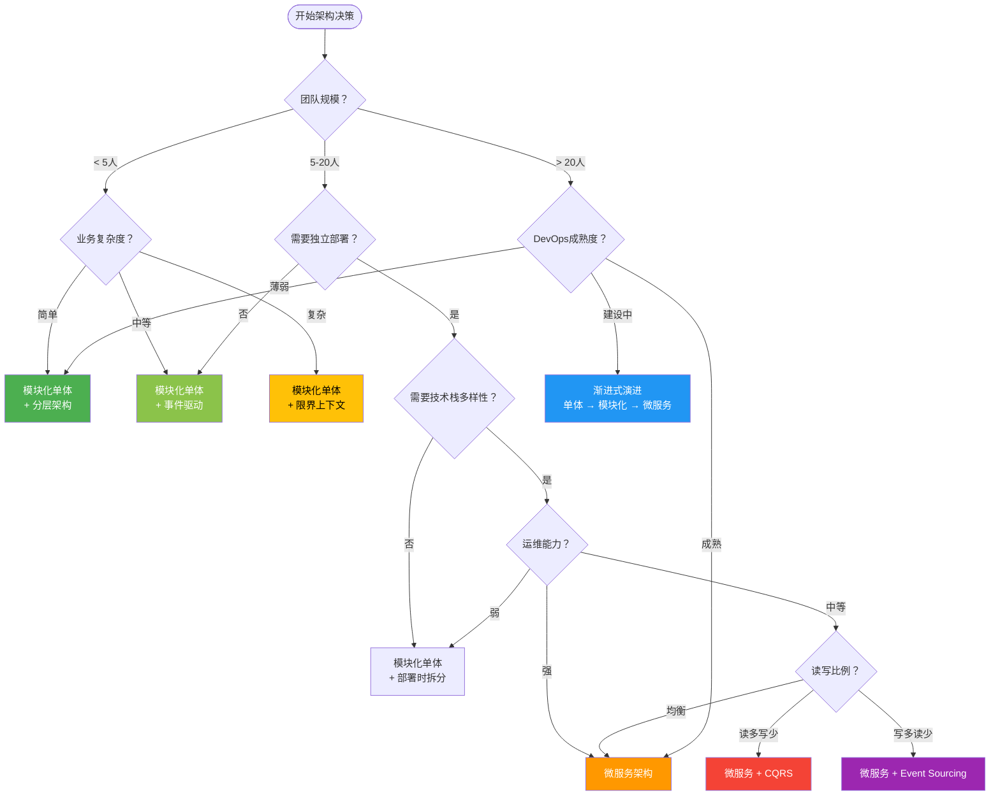

# 第28章 架构风格

## 章节定位

架构风格是软件系统的"骨架设计模式"——它定义了组件的组织方式、交互规则和约束条件。正如建筑有哥特式、巴洛克式、现代主义等风格，软件架构也有分层架构、事件驱动架构、微服务架构等经典风格。选择正确的架构风格，是系统设计中最重要的决策之一，直接决定了系统的可扩展性、可维护性和演化能力。

## 核心问题

- 有哪些经典的架构风格？它们各自适用于什么场景？
- 如何在微服务、SOA、单体之间做出合理选择？
- 事件驱动架构中发布-订阅、Event Sourcing和CQRS如何协作？
- 如何用ADR（架构决策记录）记录和追溯架构决策？
- 如何用适应度函数和ATAM评审方法保障架构质量？

## 内容结构

本章从架构风格的分类与演进入手，依次覆盖：

**分层架构（Layered）**：最经典的架构风格，关注点分离与依赖管理。

**微内核架构（Plugin Architecture）**：核心最小化，功能通过插件扩展。

**事件驱动架构（Event-Driven）**：发布-订阅模式、Event Sourcing、CQRS的完整体系。

**微服务架构**：服务拆分策略、通信机制、数据管理、服务治理。

**SOA与ESB**：面向服务架构的兴衰，SOAP vs REST的对比。

**管道-过滤器架构**：数据流处理的经典模式。

**Actor模型**：消息驱动的并发架构。

**Serverless架构**：函数即服务的范式转变。

**空间架构**：高并发场景的内存数据网格方案。

**混合架构选择**：如何在实际项目中组合多种架构风格。

**架构治理**：ADR、适应度函数、ATAM评审方法。

## 学习路径

理论→技巧→实战→误区→练习。架构风格的学习需要理论与实践并重。建议先理解每种风格的核心思想和适用场景，再通过实战案例加深理解，最后在自己的项目中尝试应用和对比。

## 与其他章节的关系

本章是第29章（设计模式）和第30章（领域驱动设计）的架构层面基础。架构风格定义系统的宏观结构，设计模式解决微观的组件交互问题，DDD提供业务建模方法论。三者从宏观到微观，构成完整的软件设计知识体系。

## 术法道贯通

- **术**：各种架构风格的具体实现模式、通信协议选型、服务拆分技术
- **法**：架构决策的权衡框架、适应度函数的设计方法、ATAM评审流程
- **道**：架构的本质——在约束条件下做出最优权衡，没有银弹，只有适合


***

# 第28章 架构风格 - 理论基础

## 28.1 架构风格分类与演进

### 28.1.1 什么是架构风格

架构风格（Architectural Style）是描述软件系统组织方式的模式集合。Mary Shaw和David Garlan在《Software Architecture: Perspectives on an Emerging Discipline》（1996）中将架构风格定义为："一种描述特定领域中系统组织方式的模式，它定义了一组组件类型、连接件类型以及它们的组合约束。"

**核心要素**：
- **组件（Components）**：承担计算职责的模块
- **连接件（Connectors）**：组件之间的交互机制
- **约束（Constraints）**：组件和连接件的组织规则

**架构风格 vs 设计模式**：
- 架构风格关注系统的宏观结构（系统级）
- 设计模式关注组件间的微观交互（类/对象级）
- 架构风格影响系统的非功能属性（性能、可扩展性、可维护性）
- 设计模式影响代码的可读性、可复用性

### 28.1.2 经典架构风格分类

根据Garlan和Shaw的分类，经典架构风格包括：

架构风格分类：

1. 管道-过滤器（Pipe-Filter）
   - 组件：过滤器（Filter）
   - 连接件：管道（Pipe）
   - 示例：Unix Shell管道、编译器流水线

2. 数据抽象与面向对象（Data Abstraction & OO）
   - 组件：对象
   - 连接件：方法调用
   - 示例：面向对象系统

3. 事件驱动（Event-Based）
   - 组件：事件处理器
   - 连接件：事件总线
   - 示例：GUI框架、消息队列

4. 分层架构（Layered）
   - 组件：层（Layer）
   - 连接件：层间调用
   - 示例：OSI网络模型、三层架构

5. 仓库风格（Repository / Blackboard）
   - 组件：知识源
   - 连接件：共享数据存储
   - 示例：数据库系统、IDE

6. 主程序/子程序（Main Program/Subroutine）
   - 组件：子程序
   - 连接件：调用/返回
   - 示例：结构化程序

### 28.1.3 现代架构风格的演进

架构演进时间线：

1970s: 单体架构（Monolithic）
       所有功能在一个进程中
       代表：大型机应用

1980s: 客户端-服务器（Client-Server）
       两层架构，UI与逻辑分离
       代表：桌面应用+数据库

1990s: 三层架构（3-Tier）
       表示层、业务层、数据层分离
       代表：Java EE、.NET

2000s: SOA（面向服务架构）
       企业级服务集成，ESB
       代表：WebSphere、WCF

2005:  六边形架构（Hexagonal）
       业务逻辑与技术细节解耦
       代表：端口和适配器模式

2010s: 微服务架构（Microservices）
       小型、独立部署的服务
       代表：Netflix、Uber

2014:  事件风暴（Event Storming）
       业务建模方法论
       代表：DDD社区

2016+: Serverless架构
       函数即服务，事件驱动
       代表：AWS Lambda、Cloud Functions

2017:  演进式架构（Evolutionary Architecture）
       适应度函数保障架构演进
       代表：Neal Ford、ThoughtWorks

2018:  Service Mesh
       Sidecar代理处理服务间通信
       代表：Istio、Linkerd

2019:  模块化单体回归（Modular Monolith）
       结合单体简单性和模块化
       代表：Shopify、Basecamp

2020+: 云原生架构（Cloud Native）
       容器化、服务网格、声明式API
       代表：Kubernetes生态

2021:  Dapr（分布式应用运行时）
       应用层分布式能力抽象
       代表：微软开源

2022+: 边缘架构（Edge Architecture）
       计算下沉到边缘节点
       代表：Cloudflare Workers、Deno Deploy

2023+: AI-Native架构
       LLM集成到应用架构
       代表：RAG、Agent架构

2024+: WebAssembly（WASM）架构
       跨语言、安全沙箱、近原生性能
       代表：Spin、WasmEdge

**演进的驱动力**：
- **规模增长**：从单机到分布式，从单体到微服务
- **团队组织**：Conway定律——系统结构反映组织结构
- **技术进步**：容器化、云计算、自动化运维
- **业务需求**：快速迭代、持续交付、弹性伸缩

**关键洞察**（Fowler, 2014）：架构风格不是越新越好，选择取决于团队规模、业务复杂度和运维能力。"MonolithFirst"原则——先用单体验证业务，再按需拆分微服务。

### 28.1.4 Conway定律与架构设计

Mel Conway在1967年提出的Conway定律指出："设计系统的组织，其产生的设计等价于组织之间的沟通结构。"这一洞察深刻影响了架构设计。

**Conway定律的核心观点**：
组织结构 → 系统架构

单一大团队 → 单体架构
多个小团队 → 微服务架构
跨部门协作 → 集成层/ESB

**Inverse Conway Maneuver（逆康威策略）**：
先设计期望的系统架构，然后调整组织结构与之匹配。这是微服务架构成功的关键前提。

传统方式：组织结构 → 被动接受系统架构
逆康威策略：期望架构 → 主动调整组织结构

示例：
期望架构：用户服务、订单服务、支付服务独立
→ 组建用户团队、订单团队、支付团队
→ 每个团队拥有端到端的职责（开发+测试+运维）

**Conway定律的实践意义**：
- **服务边界与团队边界对齐**：一个团队负责一个或少数几个服务
- **跨团队通信通过API**：减少口头沟通，强制接口化
- **团队自治**：每个团队有自己的技术栈选择权
- **共享库 vs 服务**：如果两个团队需要频繁协调，可能需要合并为一个服务

**Conway定律的反面教训**：
常见问题：
1. 团队A修改了服务A的接口，没有通知团队B
   → 服务B调用失败，线上故障

2. 三个团队共享一个数据库
   → 数据库schema变更需要三方协调
   → 变更周期从1天变成2周

3. 一个服务被两个团队共同维护
   → 代码审查标准不一致
   → 功能优先级冲突

解决方案：严格遵循"一个团队一个服务"原则

### 28.1.5 模块化单体（Modular Monolith）

模块化单体是近年来回归的热门架构模式，由Simon Brown、James Lewis和Martin Fowler等人大力推广。它结合了单体的简单性和微服务的模块化优势。

**核心思想**：
模块化单体 vs 传统单体 vs 微服务：

传统单体：
┌──────────────────────────┐
│     单体应用              │
│  模块间随意调用            │
│  共享数据库               │
│  一个部署单元             │
└──────────────────────────┘

模块化单体：
┌──────────────────────────┐
│     单体应用              │
│  ┌────┐ ┌────┐ ┌────┐   │
│  │模块A│ │模块B│ │模块C│   │
│  └──┬─┘ └──┬─┘ └──┬─┘   │
│     │      │      │     │
│  模块间通过接口通信        │
│  每个模块有独立的数据存储   │
│  一个部署单元             │
└──────────────────────────┘

微服务：
┌────┐  ┌────┐  ┌────┐
│服务A│  │服务B│  │服务C│
└──┬─┘  └──┬─┘  └──┬─┘
   │       │       │
 独立部署  独立部署  独立部署
 独立数据库 独立数据库 独立数据库

**模块化单体的设计原则**：
1. 模块边界清晰
   - 每个模块有明确的公共API
   - 模块内部实现对外不可见
   - 模块间通过接口通信，不直接访问内部类

2. 模块独立部署（可选）
   - 模块可以打包为独立的JAR/WASM
   - 模块可以独立升级
   - 支持未来拆分为微服务

3. 数据隔离
   - 每个模块拥有自己的数据库schema
   - 模块间通过API访问数据
   - 不允许跨模块直接SQL查询

4. 依赖管理
   - 显式声明模块依赖
   - 不允许循环依赖
   - 依赖方向从上层到下层

**Java模块化单体示例**：
项目结构：
order-system/
├── modules/
│   ├── user-module/
│   │   ├── src/main/java/
│   │   │   └── com.example.user/
│   │   │       ├── api/           # 公共API（其他模块可调用）
│   │   │       │   └── UserService.java
│   │   │       ├── internal/      # 内部实现（其他模块不可访问）
│   │   │       │   ├── UserRepository.java
│   │   │       │   └── UserValidator.java
│   │   │       └── model/
│   │   │           └── User.java
│   │   └── src/main/resources/
│   │       └── db/migration/      # 独立的数据库迁移
│   │
│   ├── order-module/
│   │   └── src/main/java/
│   │       └── com.example.order/
│   │           ├── api/
│   │           │   └── OrderService.java
│   │           └── internal/
│   │               └── OrderRepository.java
│   │
│   └── payment-module/
│       └── src/main/java/
│           └── com.example.payment/
│               └── api/
│                   └── PaymentService.java
│
├── application/                     # 组装层
│   └── src/main/java/
│       └── Application.java
│
└── build.gradle

**模块化单体 vs 微服务的决策**：
选择模块化单体：
✅ 团队规模 < 20人
✅ 业务复杂度中等
✅ 部署频率要求不高（每天/每周）
✅ 运维能力有限
✅ 需要事务一致性

选择微服务：
✅ 团队规模 > 20人
✅ 业务复杂度高
✅ 需要独立部署和扩展
✅ 需要技术栈多样性
✅ 有成熟的DevOps能力

**模块化单体的演进路径**：
阶段1：传统单体
  所有代码在一个项目中，模块间随意调用

阶段2：模块化单体（当前）
  定义清晰的模块边界，模块间通过接口通信
  每个模块有独立的数据schema

阶段3：部署时模块化（可选）
  模块可以打包为独立的JAR/WASM
  支持独立部署

阶段4：微服务（按需）
  将高频变更或需要独立扩展的模块拆分为服务
  使用绞杀者模式渐进式迁移

**成功案例**：
1. Shopify
   - 从Rails单体迁移到模块化单体
   - 使用Packwerk（Ruby）进行模块化
   - 避免了微服务的复杂度

2. Basecamp/Hey
   - 坚持使用Rails单体
   - 通过模块和命名空间实现组织
   - 证明了单体也能处理大规模

3. 京东
   - 从微服务回归模块化单体
   - 减少了运维复杂度
   - 提高了开发效率

***

## 28.2 分层架构（Layered Architecture）

### 28.2.1 基本结构

分层架构是最广泛使用的架构风格，其核心思想是将系统组织为一系列层次，每层只与相邻层交互。

分层架构的经典模型：

┌─────────────────────────────┐
│       表示层（Presentation）│  ← 用户界面、API网关
├─────────────────────────────┤
│       业务层（Business）    │  ← 业务逻辑、领域规则
├─────────────────────────────┤
│       持久层（Persistence） │  ← 数据访问、ORM
├─────────────────────────────┤
│       数据库（Database）    │  ← 数据存储
└─────────────────────────────┘

依赖规则：上层依赖下层，下层不依赖上层

### 28.2.2 分层架构的变体

**严格分层（Strict Layering）**：
- 每层只能调用紧邻的下一层
- 修改底层不影响上层（接口不变的情况下）
- 典型：OSI七层网络模型

**松散分层（Relaxed Layering）**：
- 上层可以跳过中间层直接调用底层
- 性能更好，但耦合度更高
- 典型：Java EE中的直接数据库访问

**六边形架构（Hexagonal Architecture / Ports and Adapters）**：
- Alistair Cockburn在2005年提出
- 核心：业务逻辑在中心，外部依赖通过端口和适配器连接
- 端口（Port）：业务逻辑定义的接口
- 适配器（Adapter）：实现端口的具体技术
- 优势：业务逻辑与技术细节完全解耦

六边形架构示意：

        ┌─────────┐
        │  Web UI  │
        └────┬────┘
             │ Adapter
   ┌─────────┴─────────┐
   │                   │
   │    业务逻辑       │
   │    （核心域）      │
   │                   │
   └─────────┬─────────┘
             │ Adapter
        ┌────┴────┐
        │ 数据库   │
        └─────────┘

端口：业务逻辑定义的接口（如UserRepository）
适配器：JpaUserRepository、InMemoryUserRepository

### 28.2.3 分层架构的优缺点

**优点**：
- **关注点分离**：每层职责明确
- **可替换性**：可以独立替换某一层（如更换数据库）
- **可复用性**：底层可以被多个上层复用
- **团队分工**：不同团队负责不同层

**缺点**：
- **性能开销**：层间调用增加延迟
- **层间耦合**：上层依赖下层的接口
- **"下沉"问题**：业务逻辑可能泄漏到表示层或数据层
- **测试困难**：集成测试需要启动多层

**适用场景**：
- 企业应用（如ERP、CRM）
- 业务逻辑相对稳定
- 团队按层分工
- 需要多种客户端（Web、移动端、桌面端）

**反模式**：
- **"富表示层"**：业务逻辑大量写在表示层
- **"贫血模型"**：业务层只有getter/setter，没有业务行为
- **"万能服务层"**：Service类包含所有业务逻辑

***

## 28.3 微内核架构（Plugin Architecture）

### 28.3.1 基本结构

微内核架构（Microkernel Architecture），也称为插件架构（Plugin Architecture），其核心思想是最小化核心系统，通过插件扩展功能。

微内核架构示意：

        ┌───────────────────────────────┐
        │         插件注册表            │
        ├───────┬───────┬───────┬───────┤
        │Plugin1│Plugin2│Plugin3│Plugin4│
        └───┬───┴───┬───┴───┬───┴───┬───┘
            │       │       │       │
            ▼       ▼       ▼       ▼
        ┌───────────────────────────────┐
        │          核心系统             │
        │  ┌─────┐  ┌─────┐  ┌─────┐  │
        │  │ API │  │ SPI │  │注册表│  │
        │  └─────┘  └─────┘  └─────┘  │
        └───────────────────────────────┘

API：核心系统对外暴露的接口
SPI：插件必须实现的接口（Service Provider Interface）

### 28.3.2 关键设计要素

**插件接口（SPI）**：
- 定义插件必须实现的契约
- 版本管理：接口变更需要向后兼容
- 生命周期管理：插件的加载、初始化、卸载

**插件注册与发现**：
- 显式注册：插件在配置文件中声明
- 自动发现：扫描类路径或目录
- 依赖注入：通过IoC容器管理插件实例

**插件间通信**：
- 通过核心系统的事件总线
- 通过共享的上下文对象
- 直接引用（不推荐，增加耦合）

### 28.3.3 典型应用

**Eclipse IDE**：
- 核心：OSGi运行时
- 插件：编辑器、调试器、版本控制等
- 每个插件是一个Bundle，有独立的生命周期

**Firefox浏览器**：
- 核心：Gecko引擎
- 插件：扩展、主题、语言包

**Spring框架**：
- 核心：IoC容器、AOP
- 插件：各种Spring模块（Spring MVC、Spring Data等）

**WordPress**：
- 核心：内容管理系统
- 插件：主题、功能扩展

**优缺点**：
- 优点：高度可扩展、核心稳定、独立部署
- 缺点：插件版本兼容性复杂、性能可能受影响、调试困难

***

## 28.4 事件驱动架构（Event-Driven Architecture）

### 28.4.1 基本概念

事件驱动架构（EDA）的核心思想是通过事件进行组件间的通信和协调。组件不直接调用彼此，而是发布事件，由感兴趣的组件订阅和处理。

**核心概念**：
- **事件（Event）**：系统中发生的有意义的状态变化
- **事件生产者（Producer）**：发布事件的组件
- **事件消费者（Consumer）**：订阅和处理事件的组件
- **事件通道（Channel）**：事件传递的媒介（如消息队列）

事件驱动架构的核心模式：

┌──────────┐    Event     ┌──────────┐
│ Producer │ ──────────→  │ Consumer │
└──────────┘              └──────────┘
      │                         ▲
      │    ┌───────────────┐    │
      └──→ │ Event Channel │ ───┘
           │  (Broker)     │
           └───────────────┘

### 28.4.2 发布-订阅模式（Pub/Sub）

发布-订阅是事件驱动架构最常见的实现模式。

**拓扑结构**：

**简单代理（Simple Broker）**：
Producer → Broker → Consumer1
                  → Consumer2
                  → Consumer3

特点：
- Broker负责消息路由
- Producer和Consumer解耦
- 支持一对多广播

**事件中介（Event Mediator）**：
Producer → Mediator → Step1 → Step2 → Step3
                │
                └→ Error Handler

特点：
- Mediator协调多个处理步骤
- 支持复杂的事件处理流程
- 可以处理事件的编排和补偿

**事件网格（Event Mesh）**：
Broker1 ←→ Broker2 ←→ Broker3
   │          │          │
Consumer   Consumer   Consumer

特点：
- 多个Broker互联
- 支持跨地域、跨集群的事件传递
- 高可用和容错

**消息队列实现**：
| 特性 | RabbitMQ | Kafka | RocketMQ | Pulsar |
|------|----------|-------|----------|--------|
| 模型 | 队列 | 日志 | 队列+日志 | 日志 |
| 吞吐量 | 中 | 高 | 高 | 高 |
| 延迟 | 低 | 中 | 低 | 低 |
| 持久化 | 支持 | 强 | 强 | 强 |
| 顺序性 | 队列级 | 分区级 | 队列级 | 分区级 |
| 事务消息 | 支持 | 支持 | 支持 | 支持 |

### 28.4.3 Event Sourcing（事件溯源）

Event Sourcing是一种数据存储模式，核心思想是不存储实体的当前状态，而是存储所有导致状态变化的事件序列。

**基本原理**：
传统方式（状态存储）：
  账户余额 = 1000元（只存储当前状态）

Event Sourcing（事件存储）：
  Event1: 账户创建，初始余额0元
  Event2: 存入1500元
  Event3: 支出500元
  ────────────────────
  当前余额 = 0 + 1500 - 500 = 1000元

**事件存储结构**：
Event Store:

┌──────────┬──────────┬──────────┬──────────┬──────────┐
│ Event ID │ Stream   │ Sequence │ Type     │ Payload  │
├──────────┼──────────┼──────────┼──────────┼──────────┤
│ uuid-1   │ account-1│ 1        │ Created  │ {bal: 0} │
│ uuid-2   │ account-1│ 2        │ Deposited│ {amt:1500│
│ uuid-3   │ account-1│ 3        │ Withdrawn│ {amt: 500│
│ uuid-4   │ account-2│ 1        │ Created  │ {bal: 0} │
└──────────┴──────────┴──────────┴──────────┴──────────┘

每个事件包含：
- 全局唯一ID
- 流标识（Stream ID）：属于哪个聚合
- 序列号：在流中的位置
- 事件类型
- 事件数据（Payload）
- 元数据（时间戳、因果ID等）

**Event Sourcing的优势**：
- **完整审计日志**：所有变化都有记录
- **时间旅行**：可以重放事件到任意时间点的状态
- **调试友好**：可以精确重现问题
- **解耦写入**：事件是不可变的，可以安全地并发写入

**Event Sourcing的挑战**：
- **查询困难**：需要构建物化视图（Read Model）
- **事件版本演化**：事件结构变更需要迁移策略
- **快照管理**：事件太多时需要定期创建快照
- **最终一致性**：读模型有延迟

### 28.4.4 CQRS（命令查询职责分离）

CQRS（Command Query Responsibility Segregation）将系统的读写操作分离到不同的模型中。

**基本结构**：
                    ┌─────────────────┐
                    │   Command Side   │
┌──────────┐       │  ┌───────────┐  │       ┌──────────┐
│  Client   │──CMD──→  │ Command   │  │──EVT──→│ Event    │
│           │       │  │ Handler   │  │       │ Store    │
└──────────┘       │  └───────────┘  │       └────┬─────┘
       │           └─────────────────┘            │
       │                                          │ Project
       │           ┌─────────────────┐            ▼
       │           │   Query Side    │       ┌──────────┐
       └──QUERY───→│  ┌───────────┐  │←──────│ Read     │
                   │  │ Query     │  │       │ Model    │
                   │  │ Handler   │  │       └──────────┘
                   │  └───────────┘  │
                   └─────────────────┘

**CQRS的三种一致性模型**：

**强一致性**：
Command → 写入写模型 → 同步投影到读模型 → 返回

特点：读写完全一致，但延迟高

**最终一致性**：
Command → 写入写模型 → 异步投影到读模型 → 返回
Query  → 读取读模型（可能有延迟）

特点：性能好，但读模型可能有延迟

**事件驱动的CQRS + Event Sourcing**：
Command → 产生Event → 写入Event Store → 异步投影到Read Model
Query  → 读取Read Model

特点：完整的事件历史 + 优化的查询模型

**CQRS的适用场景**：
- 读写比例差异大（如读多写少）
- 读写模型差异大（如写用关系型，读用文档型）
- 需要独立扩展读写能力
- 复杂的业务逻辑（如金融、电商）

**CQRS的风险**：
- 系统复杂度显著增加
- 最终一致性带来用户体验问题
- 需要处理事件丢失和重复
- 团队需要理解事件驱动的思维方式

### 28.4.5 Event Sourcing + CQRS 的组合模式

完整的ES+CQRS架构：

┌─────────────── Command Side ───────────────┐
│                                             │
│  ┌─────────┐    ┌──────────────┐           │
│  │ Command │───→│  Aggregate   │           │
│  │  Bus    │    │  (Domain)    │           │
│  └─────────┘    └──────┬───────┘           │
│                        │ Events            │
│                 ┌──────▼───────┐           │
│                 │ Event Store  │           │
│                 └──────┬───────┘           │
│                        │                   │
└────────────────────────┼───────────────────┘
                         │
                         │ Project
                         ▼
┌─────────────── Query Side ─────────────────┐
│                                             │
│  ┌──────────────┐    ┌──────────────┐      │
│  │  Projections │───→│  Read Model  │      │
│  └──────────────┘    └──────┬───────┘      │
│                             │               │
│  ┌─────────┐         ┌─────▼───────┐       │
│  │  Query  │←────────│   Query     │       │
│  │   API   │         │   Handler   │       │
│  └─────────┘         └─────────────┘       │
│                                             │
└─────────────────────────────────────────────┘

**投影（Projection）的实现**：
function project_event(event):
    switch event.type:
        case "OrderCreated":
            read_model.insert({
                id: event.order_id,
                status: "created",
                items: event.items,
                created_at: event.timestamp
            })
        case "OrderConfirmed":
            read_model.update(event.order_id, {
                status: "confirmed",
                confirmed_at: event.timestamp
            })
        case "OrderCancelled":
            read_model.update(event.order_id, {
                status: "cancelled",
                cancelled_at: event.timestamp
            })

***

## 28.5 微服务架构

### 28.5.1 微服务的定义

Sam Newman在《Building Microservices》（2015）中定义微服务为："一种将系统构建为一组小型服务的方法，每个服务运行在自己的进程中，通过轻量级机制（通常是HTTP API）进行通信。"

Martin Fowler在2014年的文章中总结微服务的核心特征：

微服务的核心特征：

1. 通过服务实现组件化
   - 服务是独立部署的单元
   - 通过API通信，而非库调用

2. 围绕业务能力组织
   - 按业务域划分服务
   - 跨职能团队（开发+测试+运维）

3. 产品而非项目
   - 团队负责服务的整个生命周期
   - "You build it, you run it"

4. 去中心化治理
   - 每个服务可以选择最适合的技术栈
   - 去中心化的数据管理

5. 去中心化数据管理
   - 每个服务拥有自己的数据库
   - 数据一致性通过最终一致性保证

6. 基础设施自动化
   - CI/CD自动化
   - 容器化部署

7. 设计容错
   - 服务可能失败
   - 通过熔断、降级等机制处理故障

8. 演进式设计
   - 服务可以独立演进
   - 支持渐进式重构

### 28.5.2 服务拆分策略

**按业务能力拆分（Business Capability）**：
电商平台示例：

┌──────────┐  ┌──────────┐  ┌──────────┐
│ 用户服务  │  │ 商品服务  │  │ 订单服务  │
│          │  │          │  │          │
│ - 注册   │  │ - 目录   │  │ - 下单   │
│ - 登录   │  │ - 搜索   │  │ - 支付   │
│ - 权限   │  │ - 库存   │  │ - 物流   │
└──────────┘  └──────────┘  └──────────┘

**按子域拆分（DDD Subdomain）**：
核心域（Core Domain）：
  - 订单管理（核心竞争力）

支撑域（Supporting Domain）：
  - 库存管理
  - 物流管理

通用域（Generic Domain）：
  - 用户认证
  - 支付网关
  - 消息通知

**拆分原则**：
- **单一职责**：每个服务只负责一个业务能力
- **高内聚低耦合**：服务内部紧密相关，服务之间松散耦合
- **团队对齐**：一个团队负责一个或少数几个服务
- **数据边界**：每个服务拥有自己的数据存储
- **可独立部署**：修改一个服务不需要重新部署其他服务

**拆分的时机**：
- 单体应用变得难以维护
- 团队规模增长，代码冲突频繁
- 需要独立扩展某些功能
- 需要采用不同的技术栈

### 28.5.3 服务通信

**同步通信**：

REST API：
  客户端 → HTTP请求 → 服务端
  服务端 → HTTP响应 → 客户端

特点：
- 简单直观
- 请求-响应模式
- 客户端需要知道服务端地址
- 服务端可能成为瓶颈

gRPC：
  客户端 → Protobuf请求 → 服务端
  服务端 → Protobuf响应 → 客户端

特点：
- 高性能（二进制协议）
- 支持流式通信
- 强类型接口定义
- 跨语言支持

**异步通信**：

消息队列：
  Producer → 消息队列 → Consumer

特点：
- 松耦合
- 削峰填谷
- 支持一对多
- 处理延迟增加

事件驱动：
  Producer → 事件总线 → Consumer1
                      → Consumer2

特点：
- 高度解耦
- 支持复杂事件处理
- 最终一致性

**通信模式对比**：

| 模式 | 协议 | 耦合度 | 延迟 | 适用场景 |
|------|------|--------|------|----------|
| REST | HTTP | 中 | 低 | CRUD操作 |
| gRPC | HTTP/2 | 中 | 低 | 高性能内部通信 |
| 消息队列 | AMQP | 低 | 中 | 异步处理 |
| 事件驱动 | 自定义 | 低 | 中 | 事件通知 |

### 28.5.4 数据管理

**数据库per服务（Database per Service）**：
┌──────────┐  ┌──────────┐  ┌──────────┐
│ 用户服务  │  │ 商品服务  │  │ 订单服务  │
│   │      │  │   │      │  │   │      │
│   ▼      │  │   ▼      │  │   ▼      │
│ 用户DB   │  │ 商品DB   │  │ 订单DB   │
│ (MySQL)  │  │ (MongoDB)│  │ (PG)    │
└──────────┘  └──────────┘  └──────────┘

每个服务拥有自己的数据库
数据通过API访问，不直接访问其他服务的数据库

**数据一致性**：

**Saga模式**：
分布式事务的解决方案：

编排式Saga（Orchestration）：
  ┌─────────┐
  │ 协调器   │
  └────┬────┘
       │
  ┌────▼────┐  ┌────────┐  ┌────────┐
  │ 创建订单 │→│ 扣减库存│→│ 扣款   │
  └─────────┘  └────────┘  └────────┘

  如果扣款失败：
  ┌─────────┐  ┌────────┐  ┌────────┐
  │ 取消订单 │←│ 恢复库存│←│ 退款   │
  └─────────┘  └────────┘  └────────┘

协同式Saga（Choreography）：
  订单服务 → 订单创建事件 → 库存服务
  库存服务 → 库存扣减事件 → 支付服务
  支付服务 → 支付成功事件 → 订单服务

**CQRS在微服务中的应用**：
查询场景：获取用户的订单详情（包含用户信息、商品信息）

方案1：API组合
  客户端 → 用户服务（获取用户信息）
  客户端 → 订单服务（获取订单信息）
  客户端 → 商品服务（获取商品信息）
  客户端 → 组合结果

方案2：API网关聚合
  客户端 → API网关 → 用户服务
                   → 订单服务
                   → 商品服务
  API网关 → 组合结果 → 客户端

方案3：CQRS
  写入：各服务独立写入
  查询：专门的查询服务，维护物化视图

### 28.5.5 服务治理

**服务注册与发现**：
┌──────────┐    ┌──────────────┐    ┌──────────┐
│ 服务A    │───→│  注册中心    │←───│ 服务B    │
│          │    │ (Eureka/     │    │          │
│          │    │  Consul/     │    │          │
│          │    │  Nacos)      │    │          │
└──────────┘    └──────────────┘    └──────────┘

注册流程：
1. 服务启动时向注册中心注册自己的地址
2. 定期发送心跳保持注册
3. 服务停止时注销

发现流程：
1. 客户端向注册中心查询服务地址
2. 获取服务实例列表
3. 负载均衡选择实例

**负载均衡策略**：
- **轮询（Round Robin）**：依次分配请求
- **加权轮询**：根据服务器性能分配不同权重
- **最少连接**：选择当前连接数最少的服务器
- **一致性哈希**：相同请求总是路由到相同服务器

**熔断器（Circuit Breaker）**：
状态机：

    ┌──────────┐
    │  Closed  │ ← 正常状态，请求通过
    └────┬─────┘
         │ 失败率超过阈值
         ▼
    ┌──────────┐
    │   Open   │ ← 熔断状态，请求直接失败
    └────┬─────┘
         │ 超时后
         ▼
    ┌──────────┐
    │ Half-Open│ ← 半开状态，允许部分请求
    └────┬─────┘
         │ 成功 → Closed
         │ 失败 → Open

**限流（Rate Limiting）**：
常见算法：

1. 固定窗口计数器
   - 每个时间窗口维护一个计数器
   - 超过阈值拒绝请求
   - 问题：窗口边界可能有突刺

2. 滑动窗口计数器
   - 使用多个小窗口统计
   - 平滑请求分布

3. 令牌桶（Token Bucket）
   - 以固定速率生成令牌
   - 请求消耗令牌
   - 允许突发流量

4. 漏桶（Leaky Bucket）
   - 请求进入桶
   - 以固定速率处理
   - 桶满则拒绝

**服务网格（Service Mesh）**：
服务网格架构：

┌─────────────────────────────────────────┐
│              控制平面                    │
│   ┌─────────┐ ┌─────────┐ ┌─────────┐ │
│   │ 配置    │ │ 策略    │ │ 遥测    │ │
│   └─────────┘ └─────────┘ └─────────┘ │
└─────────────────────────────────────────┘
                    │
                    ▼
┌─────────────────────────────────────────┐
│              数据平面                    │
│                                         │
│  ┌──────┐  ┌──────┐  ┌──────┐          │
│  │Pod A │  │Pod B │  │Pod C │          │
│  │┌────┐│  │┌────┐│  │┌────┐│          │
│  ││App ││  ││App ││  ││App ││          │
│  │└────┘│  │└────┘│  │└────┘│          │
│  │┌────┐│  │┌────┐│  │┌────┐│          │
│  ││Side││  ││Side││  ││Side││          │
│  ││car ││  ││car ││  ││car ││          │
│  │└────┘│  │└────┘│  │└────┘│          │
│  └──────┘  └──────┘  └──────┘          │
└─────────────────────────────────────────┘

Sidecar代理处理：
- 服务发现
- 负载均衡
- 熔断限流
- mTLS加密
- 可观测性

**主流服务网格对比**：
┌──────────────┬─────────────┬──────────────┬──────────────┐
│ 特性         │ Istio       │ Linkerd      │ Cilium       │
├──────────────┼─────────────┼──────────────┼──────────────┤
│ 代理         │ Envoy       │ Linkerd2-proxy│ eBPF        │
│ 性能开销     │ 中          │ 低           │ 极低         │
│ 功能丰富度   │ 高          │ 中           │ 高           │
│ 学习曲线     │ 陡峭        │ 平缓         │ 中等         │
│ 社区活跃度   │ 高          │ 中           │ 高           │
│ 适用场景     │ 企业级      │ 中小规模     │ 高性能       │
│ 安装复杂度   │ 高          │ 低           │ 中           │
└──────────────┴─────────────┴──────────────┴──────────────┘

Istio优势：功能最全面，支持灰度发布、故障注入、流量镜像
Linkerd优势：轻量级，性能开销最小，安装简单
Cilium优势：基于eBPF，内核级网络策略，性能最优

**服务网格 vs API网关的选择**：
服务网格：
- 处理服务间通信（东西向流量）
- 无需修改应用代码
- 提供细粒度的流量控制
- 适合微服务数量 > 20的场景

API网关：
- 处理外部到服务的通信（南北向流量）
- 提供认证、限流、路由
- 所有微服务架构都需要
- 适合所有规模

最佳实践：API网关（南北向）+ 服务网格（东西向）

**替代方案——Dapr（分布式应用运行时）**：
Dapr（Distributed Application Runtime）：
- 不使用Sidecar代理
- 通过HTTP/gRPC API提供分布式能力
- 支持多种编程语言
- 组件可替换（Redis、Kafka、PostgreSQL等）

Dapr vs 服务网格：
- Dapr关注应用层能力（状态管理、发布订阅、服务调用）
- 服务网格关注网络层能力（负载均衡、熔断、mTLS）
- 两者可以互补使用

Dapr核心构件（Building Blocks）：
1. 服务调用（Service Invocation）
2. 状态管理（State Management）
3. 发布订阅（Pub/Sub）
4. 可观测性（Observability）
5. 秘密管理（Secrets）
6. Actor模型
7. 分布式锁
8. 配置管理

***

## 28.6 SOA（面向服务架构）

### 28.6.1 SOA的核心思想

SOA（Service-Oriented Architecture）在2000年代是企业级架构的主流方案。其核心思想是将企业IT系统构建为一组可重用的服务，通过标准化接口进行通信。

**SOA的原则**：
- **服务可重用**：服务可以被多个消费者使用
- **服务契约**：服务通过契约（WSDL）定义接口
- **松耦合**：服务之间依赖最小化
- **服务抽象**：隐藏实现细节
- **服务可组合**：服务可以组合成更大的服务
- **服务自治**：服务对自己的行为负责
- **服务无状态**：服务不维护会话状态
- **服务可发现**：服务可以通过注册中心发现

### 28.6.2 ESB（企业服务总线）

ESB是SOA的核心基础设施，负责服务之间的通信、路由、转换和监控。

ESB架构：

┌──────┐    ┌───────────────────────────────┐    ┌──────┐
│SAP   │    │           ESB                 │    │CRM   │
│系统  │───→│ ┌─────┐ ┌─────┐ ┌─────┐     │───→│系统  │
│      │    │ │路由  │ │转换  │ │安全  │     │    │      │
└──────┘    │ └─────┘ └─────┘ └─────┘     │    └──────┘
            │ ┌─────┐ ┌─────┐ ┌─────┐     │
┌──────┐    │ │监控  │ │日志  │ │协议  │     │    ┌──────┐
│遗留  │───→│ │     │ │     │ │转换  │     │───→│外部  │
│系统  │    │ └─────┘ └─────┘ └─────┘     │    │API   │
└──────┘    └───────────────────────────────┘    └──────┘

ESB的功能：
- 消息路由
- 协议转换（SOAP/REST/JMS）
- 数据转换（XML/JSON）
- 安全认证
- 监控和日志

### 28.6.3 SOAP vs REST

SOAP（Simple Object Access Protocol）：

请求示例：
POST /StockQuote HTTP/1.1
Content-Type: text/xml; charset=utf-8
SOAPAction: "http://example.com/GetStockPrice"

<?xml version="1.0"?>
<soap:Envelope xmlns:soap="http://schemas.xmlsoap.org/soap/envelope/">
  <soap:Body>
    <GetStockPrice>
      <StockName>IBM</StockName>
    </GetStockPrice>
  </soap:Body>
</soap:Envelope>

特点：
- 基于XML
- 严格的规范（WSDL、XSD）
- 内置安全（WS-Security）
- 支持事务（WS-Transaction）
- 复杂但功能完整

REST（Representational State Transfer）：

请求示例：
GET /api/stocks/IBM HTTP/1.1
Accept: application/json

响应：
HTTP/1.1 200 OK
Content-Type: application/json

{"symbol": "IBM", "price": 150.25, "timestamp": "2024-01-15T10:30:00Z"}

特点：
- 基于HTTP
- 资源导向
- 无状态
- 简单轻量
- 缓存友好

**SOAP vs REST 对比**：

| 维度 | SOAP | REST |
|------|------|------|
| 协议 | 独立协议 | 基于HTTP |
| 数据格式 | XML | JSON/XML/... |
| 接口定义 | WSDL | OpenAPI/Swagger |
| 安全性 | WS-Security | HTTPS + OAuth |
| 事务 | WS-Transaction | 无标准 |
| 复杂度 | 高 | 低 |
| 性能 | 较低 | 较高 |
| 适用场景 | 企业级集成 | 互联网API |

**SOA的衰落与微服务的兴起**：
- ESB成为单点故障和性能瓶颈
- SOA过于重量级，不适合互联网场景
- 微服务更轻量、更灵活
- 但SOA的思想（服务化、标准化）仍然有价值

***

## 28.7 管道-过滤器架构（Pipe-Filter）

### 28.7.1 基本结构

管道-过滤器架构将数据处理组织为一系列过滤器，通过管道连接。

管道-过滤器架构：

Input → [Filter1] → [Filter2] → [Filter3] → Output

每个过滤器：
- 独立的处理单元
- 有输入端口和输出端口
- 不依赖其他过滤器的状态
- 可以独立运行和测试

**Unix Shell管道**：
```bash
cat access.log | grep "404" | awk '{print $1}' | sort | uniq -c | sort -rn | head -10

等价于：
Filter1: cat access.log      → 读取文件
Filter2: grep "404"          → 过滤404错误
Filter3: awk '{print $1}'    → 提取IP地址
Filter4: sort                → 排序
Filter5: uniq -c             → 去重计数
Filter6: sort -rn            → 按数量排序
Filter7: head -10            → 取前10
```

### 28.7.2 过滤器类型

**主动过滤器（Active Filter）**：
- 主动拉取输入数据
- 主动推送到下一个过滤器
- 控制数据流的速度

**被动过滤器（Passive Filter）**：
- 被动接收输入
- 处理后输出
- 由外部控制数据流

**有状态过滤器（Stateful Filter）**：
- 维护内部状态
- 可以进行聚合、窗口计算
- 示例：统计每分钟的请求数

**无状态过滤器（Stateless Filter）**：
- 不维护状态
- 每个数据独立处理
- 示例：数据转换、过滤

### 28.7.3 典型应用

**数据处理管道**：
Apache Spark / Flink：

数据源 → 读取 → 转换 → 过滤 → 聚合 → 输出

特点：
- 分布式处理
- 支持有状态计算
- 高吞吐量

**编译器管道**：
源代码 → 词法分析 → 语法分析 → 语义分析 → 优化 → 代码生成

每个阶段是独立的过滤器
中间表示（IR）是管道中的数据

**Web请求处理管道**：
请求 → 认证 → 授权 → 验证 → 业务处理 → 响应转换 → 响应

ASP.NET Core中间件管道：
app.UseAuthentication()
   .UseAuthorization()
   .UseRateLimiting()
   .UseMvc()

**优缺点**：
- 优点：高内聚、可复用、可并行、易于理解
- 缺点：不适合交互式应用、数据格式转换开销、错误处理复杂

***

## 28.8 Actor模型

### 28.8.1 基本概念

Actor模型由Carl Hewitt在1973年提出，是一种基于消息传递的并发计算模型。

**Actor的定义**：
Actor是一个计算实体，它可以：
1. 发送消息给其他Actor
2. 创建新的Actor
3. 改变自己的状态（对接收到的消息做出反应）

Actor之间不共享状态，只通过消息通信。

**Actor的结构**：
┌─────────────────────────┐
│         Actor           │
│  ┌───────────────────┐  │
│  │    状态（私有）    │  │
│  └───────────────────┘  │
│  ┌───────────────────┐  │
│  │    行为（处理消息）│  │
│  └───────────────────┘  │
│  ┌───────────────────┐  │
│  │    邮箱（消息队列）│  │
│  └───────────────────┘  │
│  ┌───────────────────┐  │
│  │    引用（地址）    │  │
│  └───────────────────┘  │
└─────────────────────────┘

### 28.8.2 消息传递

Actor通信模型：

Actor A                    Actor B
   │                          │
   │──── message1 ────→      │
   │                          │
   │      ←──── message2 ────│
   │                          │

特点：
- 异步：发送后不等待
- 无共享状态：通过消息传递数据
- 顺序处理：每个Actor一次处理一条消息
- 位置透明：消息可以发送给本地或远程Actor

**消息语义**：
- **At-Most-Once**：消息可能丢失，但不会重复
- **At-Least-Once**：消息不会丢失，但可能重复
- **Exactly-Once**：消息不丢不重（最难实现）

### 28.8.3 Actor模型的实现

**Erlang/OTP**：
-module(counter).
-export([start/0, loop/1]).

start() -> spawn(fun() -> loop(0) end).

loop(Count) ->
    receive
        {increment, Pid} ->
            NewCount = Count + 1,
            Pid ! {ok, NewCount},
            loop(NewCount);
        {get, Pid} ->
            Pid ! {ok, Count},
            loop(Count);
        stop ->
            ok
    end.

特点：
- 轻量级进程（百万级）
- 监督树（Supervisor Tree）
- 热代码升级
- 分布式透明

**Akka（JVM）**：
```java
public class CounterActor extends AbstractActor {
    private int count = 0;

    @Override
    public Receive createReceive() {
        return receiveBuilder()
            .match(Increment.class, msg -> {
                count++;
                getSender().tell(new CountResponse(count), getSelf());
            })
            .match(Get.class, msg -> {
                getSender().tell(new CountResponse(count), getSelf());
            })
            .build();
    }
}

特点：
- JVM上的Actor实现
- 支持集群和分片
- 持久化Actor（Event Sourcing）
- 流处理（Akka Streams）
```

**Microsoft Orleans（.NET）**：
```csharp
public interface ICounterGrain : IGrainWithStringKey
{
    Task<int> Increment();
    Task<int> GetCount();
}

public class CounterGrain : Grain, ICounterGrain
{
    private int _count;

    public Task<int> Increment()
    {
        _count++;
        return Task.FromResult(_count);
    }

    public Task<int> GetCount() => Task.FromResult(_count);
}

特点：
- 虚拟Actor（Grain）
- 自动激活和停用
- 位置透明
- 适合云环境
```

### 28.8.4 Actor模型的优缺点

**优点**：
- **天然并发安全**：无共享状态，无需锁
- **高可扩展性**：可以分布到多台机器
- **容错性**：通过监督树实现故障隔离
- **位置透明**：本地和远程Actor使用相同接口

**缺点**：
- **调试困难**：消息传递的顺序难以追踪
- **请求-响应模式不自然**：需要额外处理回复
- **邮箱溢出**：消息堆积可能导致内存问题
- **状态一致性**：分布式环境下的状态同步

**适用场景**：
- 高并发系统（如聊天、游戏）
- 物联网设备管理
- 实时数据处理
- 分布式系统

***

## 28.9 Serverless架构

### 28.9.1 基本概念

Serverless（无服务器）架构是一种将服务器管理完全交给云提供商的架构模式。开发者只需要关注业务逻辑，不需要管理服务器。

**Serverless的两个核心概念**：

**FaaS（Function as a Service）**：
函数即服务：

开发者编写函数：
function handler(event, context) {
    // 业务逻辑
    return { statusCode: 200, body: "Hello" };
}

云提供商负责：
- 函数的部署和运行
- 自动扩缩容
- 服务器管理
- 负载均衡

计费模式：按调用次数和执行时间计费

**BaaS（Backend as a Service）**：
后端即服务：

云提供商提供：
- 数据库（如DynamoDB、Firebase）
- 存储（如S3、Blob Storage）
- 认证（如Cognito、Auth0）
- 消息队列（如SQS、Pub/Sub）

开发者通过API使用这些服务

### 28.9.2 Serverless的架构模式

**事件驱动的Serverless**：
事件源 → 触发器 → Lambda函数 → 响应

事件源：
- HTTP请求（API Gateway）
- 文件上传（S3）
- 数据库变更（DynamoDB Streams）
- 消息队列（SQS）
- 定时任务（CloudWatch Events）

**Serverless API**：
客户端 → API Gateway → Lambda → DynamoDB
                    ↓
               Lambda → S3
                    ↓
               Lambda → SQS → Lambda

特点：
- 无服务器管理
- 自动扩缩容
- 按使用付费

**Serverless数据处理**：
S3上传 → Lambda触发 → 处理文件 → 写入数据库
                                    ↓
                              发送通知

示例：
用户上传图片 → Lambda压缩 → Lambda生成缩略图 → S3存储
                                              → DynamoDB记录

### 28.9.3 Serverless的优缺点

**优点**：
- **零运维**：不需要管理服务器
- **自动扩缩容**：根据负载自动调整
- **按使用付费**：只为实际使用付费
- **快速部署**：函数可以快速发布

**缺点**：
- **冷启动**：函数首次调用有延迟
- **执行时间限制**：通常有最大执行时间（如15分钟）
- **供应商锁定**：深度依赖云提供商
- **调试困难**：分布式环境下的调试
- **状态管理**：函数无状态，需要外部存储

**冷启动问题与解决方案**：
冷启动（Cold Start）：
  用户请求 → 函数未加载 → 初始化容器 → 加载代码 → 执行
                ↑ 延迟来源（100ms - 10s）

热启动（Warm Start）：
  用户请求 → 容器已存在 → 直接执行
                ↑ 低延迟（1-10ms）

解决方案：
1. 预热策略
   - 定时器定期调用函数（Keep Warm）
   - 使用Provisioned Concurrency（AWS）
   - 使用最小实例数（GCP）

2. 代码优化
   - 减少依赖包大小
   - 延迟初始化（按需加载）
   - 使用编译语言（Go、Rust）替代解释语言

3. 架构优化
   - 函数拆分：大函数拆分为小函数
   - 使用预留并发：关键路径使用Provisioned Concurrency
   - 边缘计算：使用Cloudflare Workers等边缘函数

4. 平台选择
   - AWS Lambda：冷启动100ms-5s
   - Azure Functions：冷启动100ms-2s
   - Cloudflare Workers：冷启动<5ms（V8隔离）
   - Deno Deploy：冷启动<10ms

**Serverless成本分析**：
成本模型：
  总成本 = 请求费用 + 计算费用 + 存储费用 + 网络费用

AWS Lambda示例（us-east-1）：
  请求费用：$0.20 / 100万次请求
  计算费用：$0.0000166667 / GB-秒
  免费额度：每月100万次请求 + 40万GB-秒

场景1：低频API（每天1万次调用，平均100ms，128MB内存）
  月请求费用：30万次 × $0.20/100万 = $0.06
  月计算费用：30万 × 0.1s × 0.125GB × $0.0000166667 = $0.06
  月总成本：$0.12（远低于EC2最小实例$5/月）

场景2：高频API（每天100万次调用，平均50ms，256MB内存）
  月请求费用：3000万次 × $0.20/100万 = $6.00
  月计算费用：3000万 × 0.05s × 0.25GB × $0.0000166667 = $6.25
  月总成本：$12.25（仍低于EC2中等实例$50/月）

场景3：极高频（每天1亿次调用，平均20ms，512MB内存）
  月请求费用：30亿次 × $0.20/100万 = $600
  月计算费用：30亿 × 0.02s × 0.5GB × $0.0000166667 = $500
  月总成本：$1100（此时容器化可能更经济）

成本拐点：
- 日调用 < 100万次：Serverless最经济
- 日调用 100万-1000万次：需要仔细计算
- 日调用 > 1000万次：考虑容器化或专用实例

**适用场景**：
- API后端（低频到中频）
- 事件处理（文件上传、消息消费）
- 定时任务（cron job）
- 数据处理管道（ETL）
- 原型开发和MVP
- Webhook处理

**不适用场景**：
- 长时间运行的任务（>15分钟）
- 需要本地状态的应用
- 对延迟极其敏感的应用（<10ms）
- 需要精细控制基础设施的场景
- 高频恒定负载（成本可能更高）
- 需要GPU计算的场景（虽然AWS已支持Lambda GPU，但成本高）

***

## 28.10 空间架构（Space-Based Architecture）

### 28.10.1 基本概念

空间架构（Space-Based Architecture）由Randy Shoup和Bob Martin等人提出，其核心思想是将应用状态存储在内存中，通过复制和分区实现高并发和高可用。

空间架构示意：

┌─────────────────────────────────────────┐
│              处理单元（Processing Unit）│
│  ┌──────────────────────────────────┐  │
│  │    应用逻辑                      │  │
│  └──────────────────────────────────┘  │
│  ┌──────────────────────────────────┐  │
│  │    内存数据网格（IMDG）          │  │
│  └──────────────────────────────────┘  │
│  ┌──────────────────────────────────┐  │
│  │    消息通道                      │  │
│  └──────────────────────────────────┘  │
└─────────────────────────────────────────┘
         │              │              │
         ▼              ▼              ▼
    ┌─────────┐   ┌─────────┐   ┌─────────┐
    │ PU实例1 │   │ PU实例2 │   │ PU实例3 │
    └─────────┘   └─────────┘   └─────────┘
         │              │              │
         └──────────────┼──────────────┘
                        ▼
              ┌─────────────────┐
              │  持久化数据库   │
              └─────────────────┘

### 28.10.2 核心组件

**处理单元（Processing Unit）**：
- 包含应用逻辑
- 内嵌内存数据网格
- 可以独立部署和扩展

**虚拟化中间件**：
- 负责请求路由
- 管理处理单元的生命周期
- 处理数据同步和复制

**数据网格（Data Grid）**：
- 分布式内存存储
- 支持数据分区和复制
- 高性能读写

**典型实现**：
- Hazelcast
- Apache Ignite
- GigaSpaces

### 28.10.3 适用场景与案例

- **高并发Web应用**：如电商秒杀、在线游戏
- **实时数据处理**：如金融交易、实时分析
- **低延迟应用**：如广告投放、推荐系统

**典型案例：股票交易系统**：
股票行情系统的空间架构：

┌─────────────────────────────────────────────┐
│           处理单元（每只股票一个PU）          │
│  ┌──────────────────────────────────────┐  │
│  │  应用逻辑：行情计算、撮合引擎         │  │
│  └──────────────────────────────────────┘  │
│  ┌──────────────────────────────────────┐  │
│  │  IMDG：内存存储实时行情数据           │  │
│  │  - 当前价格、买卖盘口                 │  │
│  │  - 成交记录                          │  │
│  │  - K线数据                           │  │
│  └──────────────────────────────────────┘  │
│  ┌──────────────────────────────────────┐  │
│  │  消息通道：广播行情变动               │  │
│  └──────────────────────────────────────┘  │
└─────────────────────────────────────────────┘

为什么选择空间架构：
- 延迟要求：毫秒级响应
- 并发量：每秒百万级行情更新
- 数据局部性：每只股票的数据被同一个PU处理
- 数据一致性：同一股票的行情必须一致

**空间架构的演进——从GigaSpaces到现代IMDG**：
技术演进：
2000s: GigaSpaces XAP（商业）
2010s: Hazelcast（开源）、Apache Ignite（开源）
2020s: 云原生IMDG（Redis Cluster、Aerospike）

现代替代方案：
- Redis Cluster：轻量级，适合缓存场景
- Apache Ignite：全功能，支持计算网格
- Hazelcast：Java原生，支持CP/AP切换
- Aerospike：SSD优化，适合超大规模

**空间架构的局限性**：
不适用场景：
1. 数据量超过内存容量
   - 内存成本高
   - 数据持久化复杂
   
2. 强一致性要求
   - IMDG通常提供最终一致性
   - 强一致性会影响性能
   
3. 复杂查询
   - 内存数据不适合复杂SQL查询
   - 需要配合传统数据库使用

4. 团队经验不足
   - 分布式内存系统调试困难
   - 需要专业的运维能力

***

## 28.11 混合架构选择

### 28.11.1 架构风格的组合

实际项目中，很少只使用单一的架构风格。更常见的是根据业务特点组合多种风格。

**常见组合**：
分层架构 + 微服务：
  API网关（表示层）
      ↓
  微服务集群（业务层）
      ↓
  数据存储层

事件驱动 + CQRS + 微服务：
  微服务产生事件
      ↓
  事件总线（Kafka）
      ↓
  CQRS的读写分离
      ↓
  独立的查询服务

模块化单体 + 事件驱动（推荐起步组合）：
  模块化单体内部：
    模块间通过事件解耦
    模块间通过接口通信
    每个模块独立数据schema

### 28.11.2 架构选择的决策流程

**架构选择决策树**：



**评估维度**：

| 维度 | 问题 |
|------|------|
| 复杂度 | 业务复杂度如何？ |
| 规模 | 用户量和数据量有多大？ |
| 团队 | 团队规模和技能水平？ |
| 变化 | 业务变化频率如何？ |
| 性能 | 延迟和吞吐量要求？ |
| 可用性 | SLA要求是什么？ |
| 成本 | 预算和时间限制？ |

**决策矩阵**：
架构风格选择指南：

简单业务 + 小团队 → 分层架构 / 单体
复杂业务 + 大团队 → 微服务架构
高并发 + 低延迟 → 空间架构 / 事件驱动
数据密集 → 事件溯源 + CQRS
快速原型 → Serverless
企业集成 → SOA（现代版本：API Gateway + 微服务）

***

## 28.12 架构决策记录（ADR）

### 28.12.1 什么是ADR

ADR（Architecture Decision Record）是记录架构决策的轻量级文档。Michael Nygard在2011年提出了ADR的格式。

**ADR的格式**：
```markdown
# ADR-001: 使用微服务架构

## 状态
已接受

## 上下文
- 当前单体应用代码超过100万行
- 部署周期长达2周
- 团队规模增长到50人
- 业务需要快速迭代

## 决策
采用微服务架构，按业务能力拆分服务。

## 后果
正面：
- 独立部署，缩短发布周期
- 团队自治，提高开发效率
- 技术多样性，可以选择最适合的技术栈

负面：
- 系统复杂度增加
- 需要投入基础设施建设
- 分布式系统带来的挑战

## 参与者
- 架构师：张三
- 技术负责人：李四
- 日期：2024-01-15
```

### 28.12.2 ADR的最佳实践

**ADR的生命周期**：
提议（Proposed）→ 讨论（Discussion）→ 接受（Accepted）→ 弃用（Deprecated）→ 取代（Superseded）

**ADR的管理**：
- 存储在代码仓库中（与代码一起版本控制）
- 使用Markdown格式
- 按编号排序
- 定期回顾和更新

**ADR的价值**：
- **可追溯性**：知道为什么做出这个决策
- **新人入职**：快速了解系统的设计背景
- **避免重复讨论**：记录已考虑的方案和权衡
- **决策演进**：追踪决策的变化历史

***

## 28.13 架构适应度函数（Fitness Function）

### 28.13.1 什么是适应度函数

Neal Ford和Rebecca Parsons在《Building Evolutionary Architectures》（2017）中提出了架构适应度函数的概念。适应度函数是一种自动化机制，用于验证架构特征是否得到维护。

**适应度函数的分类**：

按类型分类：

1. 原子适应度函数（Atomic）
   - 测试单个架构特征
   - 示例：代码覆盖率 > 80%

2. 整体适应度函数（Holistic）
   - 测试多个架构特征的组合
   - 示例：响应时间 < 200ms 且 可用性 > 99.9%

3. 触发式适应度函数（Triggered）
   - 在特定事件时执行
   - 示例：代码提交时检查循环依赖

4. 持续适应度函数（Continuous）
   - 持续运行和监控
   - 示例：实时监控响应时间

### 28.13.2 适应度函数的实现

**代码质量**：
```java
// ArchUnit测试
@Test
void servicesShouldNotDependOnControllers() {
    noClasses().that().resideInAPackage("..service..")
        .should().dependOnClassesThat()
        .resideInAPackage("..controller..")
        .check(importedClasses);
}
```

**性能**：
```python
# 性能测试
def test_api_response_time():
    response = requests.get("/api/users")
    assert response.elapsed.total_seconds() < 0.2  # 200ms内
```

**架构约束**：
```yaml
# 架构约束检查
rules:
  - name: "数据库访问限制"
    pattern: "controller.*repository"
    message: "Controller不应直接访问Repository"
    severity: error
```

### 28.13.3 适应度函数的实践

**分层架构的适应度函数**：
1. 依赖方向检查：上层不依赖下层的实现细节
2. 层间通信检查：只通过接口通信
3. 循环依赖检查：不允许循环依赖

**微服务架构的适应度函数**：
1. 服务独立性：每个服务可以独立部署
2. API兼容性：新版本向后兼容
3. 数据隔离：服务间不直接访问数据库
4. 弹性测试：服务故障不影响整体可用性

***

## 28.14 架构评审方法（ATAM）

### 28.14.1 ATAM概述

ATAM（Architecture Tradeoff Analysis Method）是卡内基梅隆大学软件工程研究所（SEI）开发的架构评审方法。它帮助利益相关者理解架构决策的后果，识别风险和权衡。

**ATAM的目标**：
- 识别架构方法
- 生成质量属性效用树
- 分析架构方法
- 识别敏感点、权衡点和风险

### 28.14.2 ATAM的流程

ATAM的六个阶段：

阶段1：展示ATAM方法
  - 向利益相关者介绍ATAM流程

阶段2：展示业务驱动因素
  - 业务目标
  - 架构的约束

阶段3：展示架构
  - 架构师介绍架构设计

阶段4：识别架构方法
  - 识别使用的架构模式和策略

阶段5：生成质量属性效用树
  - 识别最重要的质量属性
  - 细化到具体场景
  - 排列优先级

阶段6：分析架构方法
  - 对高优先级场景进行分析
  - 识别敏感点、权衡点和风险

### 28.14.3 质量属性效用树

效用树示例：

效用（Utility）
├── 性能（Performance）
│   ├── 延迟
│   │   ├── API响应时间 < 200ms [H,H]
│   │   └── 页面加载时间 < 2s [M,H]
│   └── 吞吐量
│       ├── 支持10万并发用户 [H,M]
│       └── 每秒处理1000笔交易 [H,H]
├── 可用性（Availability）
│   ├── 系统可用性 > 99.9% [H,H]
│   └── 故障恢复时间 < 5分钟 [M,H]
├── 可修改性（Modifiability）
│   ├── 新功能上线周期 < 1周 [H,M]
│   └── 技术栈更换成本低 [L,M]
└── 安全性（Security）
    ├── 数据加密传输 [H,H]
    └── 访问控制粒度细 [M,M]

[H,M] = [实现难度, 业务重要性]
H=高, M=中, L=低

### 28.14.4 敏感点、权衡点和风险

**敏感点（Sensitivity Point）**：
- 对某个质量属性有显著影响的架构决策
- 示例：缓存策略对性能的敏感点

**权衡点（Tradeoff Point）**：
- 影响多个质量属性的架构决策
- 示例：一致性级别（强一致性 vs 最终一致性）影响性能和数据一致性

**风险（Risk）**：
- 可能导致问题的架构决策
- 示例：使用未经验证的新技术

**非风险（Non-risk）**：
- 已经充分考虑并做出合理决策的点

### 28.14.5 ATAM的输出

ATAM的输出：

1. 一组已识别的架构方法
2. 质量属性效用树
3. 一组风险和非风险
4. 一组敏感点和权衡点
5. 风险主题（风险的分类和关联）
6. 一组待解决问题

这些输出帮助：
- 利益相关者理解架构决策的后果
- 架构师识别需要改进的地方
- 团队对架构质量达成共识

***

## 参考文献

1. Shaw, M. & Garlan, D. "Software Architecture: Perspectives on an Emerging Discipline." Prentice Hall, 1996.
2. Fowler, M. "Patterns of Enterprise Application Architecture." Addison-Wesley, 2002.
3. Fowler, M. "Microservices: a definition of this new architectural term." martinfowler.com, 2014.
4. Newman, S. "Building Microservices." O'Reilly, 2015.
5. Richards, M. "Software Architecture Patterns." O'Reilly, 2015.
6. Ford, N., Parsons, R., & Kua, P. "Building Evolutionary Architectures." O'Reilly, 2017.
7. Cockburn, A. "Hexagonal Architecture." alistair.cockburn.us, 2005.
8. Nygard, M. "Documenting Architecture Decisions." thinkrelevance.com, 2011.
9. Kazman, R. et al. "The Architecture Tradeoff Analysis Method." SEI, CMU, 1998.
10. Hewitt, C., Bishop, P., & Steiger, R. "A Universal Modular ACTOR Formalism for Artificial Intelligence." IJCAI, 1973.
11. Evans, E. "Domain-Driven Design." Addison-Wesley, 2003.
12. Richardson, C. "Microservices Patterns." Manning, 2018.
13. Vernon, V. "Implementing Domain-Driven Design." Addison-Wesley, 2013.
14. Hohpe, G. & Woolf, B. "Enterprise Integration Patterns." Addison-Wesley, 2003.
15. Kleppmann, M. "Designing Data-Intensive Applications." O'Reilly, 2017.
16. Brown, S. "Monolith to Microservices." O'Reilly, 2019.
17. Lewis, J. & Fowler, M. "Microservices." martinfowler.com, 2014.
18. Newman, S. "Monolith to Microservices." O'Reilly, 2019.
19. Ford, N. "Fundamentals of Software Architecture." O'Reilly, 2020.
20. Sadalage, P. & Fowler, M. "NoSQL Distilled." Addison-Wesley, 2012.
21. Hogan, M. "Kubernetes Patterns." O'Reilly, 2019.
22. Burns, B. "Designing Distributed Systems." O'Reilly, 2018.
23. Murat, Y. & Vinoski, S. "Dapr: Distributed Application Runtime." dapr.io, 2021.
24. Cohen, R. "Building Microservices with Go." Packt, 2021.


***

# 第28章 架构风格 - 核心技巧

## 28.1 服务拆分的实用技巧

### 28.1.1 从单体到微服务的渐进式拆分

**Strangler Fig Pattern（绞杀者模式）**：

Martin Fowler提出的绞杀者模式是拆分单体应用最安全的策略。其核心思想是在旧系统旁边逐步构建新系统，通过代理层逐步将流量切换到新系统。

绞杀者模式的演进步骤：

阶段1：识别边界
  ┌──────────────────────────────┐
  │         单体应用              │
  │  ┌─────┐ ┌─────┐ ┌─────┐   │
  │  │模块A │ │模块B │ │模块C │   │
  │  └─────┘ └─────┘ └─────┘   │
  └──────────────────────────────┘

阶段2：在单体前添加代理
  ┌──────┐
  │ 代理  │ ← 路由层
  └──┬───┘
     │
  ┌──▼───────────────────────────┐
  │         单体应用              │
  └──────────────────────────────┘

阶段3：构建新服务，代理路由
  ┌──────┐
  │ 代理  │ ──→ 新服务A（独立部署）
  └──┬───┘
     │
  ┌──▼───────────────────────────┐
  │    单体应用（A模块已迁移）    │
  └──────────────────────────────┘

阶段4：重复直到完成
  ┌──────┐
  │ 代理  │ ──→ 新服务A
  │      │ ──→ 新服务B
  │      │ ──→ 新服务C
  └──────┘

**拆分的识别方法**：

**1. 变更频率分析**：
统计代码变更频率：

模块A：每月变更50次 → 独立服务（高频变更）
模块B：每月变更5次  → 可以保留在单体
模块C：每月变更2次  → 可以保留在单体

原则：变更频率高的模块优先拆分

**2. 团队边界分析**：
团队结构：
- 用户团队：负责用户相关功能
- 订单团队：负责订单相关功能
- 支付团队：负责支付相关功能

按照Conway定律，系统边界应该与团队边界对齐

**3. 数据依赖分析**：
数据库表依赖关系：

用户表 ←── 订单表 ←── 订单项表
   ↑
   └── 支付记录表

依赖紧密的表应该在同一个服务中
跨服务的数据访问通过API

### 28.1.2 服务边界的DDD方法

**限界上下文（Bounded Context）**：
电商系统的限界上下文：

┌─────────────┐  ┌─────────────┐  ┌─────────────┐
│  用户上下文  │  │  商品上下文  │  │  订单上下文  │
│             │  │             │  │             │
│ User:       │  │ Product:    │  │ Order:      │
│ - id        │  │ - id        │  │ - id        │
│ - name      │  │ - name      │  │ - customer  │
│ - email     │  │ - price     │  │ - items     │
│ - password  │  │ - stock     │  │ - total     │
│ - address   │  │ - category  │  │ - status    │
└─────────────┘  └─────────────┘  └─────────────┘

同一个概念（如"用户"）在不同上下文中有不同的含义和属性

**上下文映射（Context Mapping）**：
上下文之间的关系：

1. 合作关系（Partnership）：两个上下文紧密合作
2. 共享内核（Shared Kernel）：共享部分模型
3. 客户-供应商（Customer-Supplier）：一个上下文依赖另一个
4. 防腐层（ACL）：通过适配层隔离外部上下文
5. 开放主机服务（OHS）：通过公开API提供服务
6. 发布语言（PL）：使用公共语言交换数据
7. 各行其道（Separate Ways）：两个上下文完全独立
8. 遵从者（Conformist）：被动接受外部模型

## 28.2 事件驱动架构的实现技巧

### 28.2.1 事件设计原则

**事件的命名**：
好的命名：
- OrderCreated（订单已创建）
- PaymentProcessed（支付已处理）
- InventoryReserved（库存已预留）

不好的命名：
- OrderEvent（太笼统）
- CreateOrder（是命令，不是事件）
- OrderStatusChanged（不够具体）

原则：使用过去式，描述已发生的事实

**事件的结构**：
```json
{
  "eventId": "uuid-1234-5678",
  "eventType": "OrderCreated",
  "timestamp": "2024-01-15T10:30:00Z",
  "version": "1.0",
  "source": "order-service",
  "correlationId": "uuid-abcd-efgh",
  "causationId": "uuid-ijkl-mnop",
  "data": {
    "orderId": "ORD-001",
    "customerId": "CUST-001",
    "items": [
      {"productId": "PROD-001", "quantity": 2, "price": 99.99}
    ],
    "totalAmount": 199.98
  },
  "metadata": {
    "userId": "user-123",
    "ipAddress": "192.168.1.1"
  }
}
```

**事件版本管理**：
版本演进策略：

1. 向后兼容（推荐）
   - 新增字段用默认值
   - 消费者忽略未知字段
   
2. 事件升级
   - V1事件 → 转换器 → V2事件
   - 在投影层处理版本转换

3. 多版本并行
   - 同时发布V1和V2事件
   - 消费者选择自己理解的版本

### 28.2.2 Event Sourcing的快照策略

快照策略：

问题：事件太多时，重放耗时

解决方案：定期创建快照

事件流：E1, E2, E3, ..., E1000, E1001, ..., E2000
快照：  S1@E1000, S2@E2000

恢复状态时：
- 加载最近的快照S2@E2000
- 只需重放E2000之后的事件

快照策略：
- 按事件数量：每N个事件创建快照
- 按时间间隔：每天/每小时创建快照
- 按需创建：检测到重放慢时创建

### 28.2.3 幂等性处理

事件处理的幂等性：

问题：网络故障导致事件重复投递

解决方案：

1. 事件ID去重
   function handle_event(event):
       if already_processed(event.event_id):
           return  # 跳过重复事件
       process(event)
       mark_processed(event.event_id)

2. 乐观锁
   function update_record(id, event):
       current_version = get_version(id)
       if event.expected_version != current_version:
           return  # 版本冲突，跳过
       apply_update(id, event)
       set_version(id, current_version + 1)

3. 数据库唯一约束
   INSERT INTO processed_events (event_id) VALUES (?)
   ON CONFLICT DO NOTHING  # 重复插入忽略

## 28.3 微服务通信的优化技巧

### 28.3.1 API设计最佳实践

**RESTful API设计**：
资源命名：
- 使用名词复数：/api/users, /api/orders
- 使用嵌套表示关系：/api/users/123/orders
- 使用查询参数过滤：/api/orders?status=pending

版本管理：
- URL版本：/api/v1/users
- Header版本：Accept: application/vnd.api.v1+json
- 推荐URL版本（简单明确）

分页：
GET /api/orders?page=2&size=20
响应：
{
  "data": [...],
  "pagination": {
    "page": 2,
    "size": 20,
    "total": 156,
    "pages": 8
  }
}

错误处理：
{
  "error": {
    "code": "VALIDATION_ERROR",
    "message": "Invalid input",
    "details": [
      {"field": "email", "message": "Invalid email format"}
    ]
  }
}

**gRPC接口定义**：
```protobuf
syntax = "proto3";

service OrderService {
  rpc CreateOrder(CreateOrderRequest) returns (Order);
  rpc GetOrder(GetOrderRequest) returns (Order);
  rpc ListOrders(ListOrdersRequest) returns (ListOrdersResponse);
  rpc WatchOrders(WatchOrdersRequest) returns (stream Order);
}

message CreateOrderRequest {
  string customer_id = 1;
  repeated OrderItem items = 2;
}

message Order {
  string id = 1;
  string customer_id = 2;
  repeated OrderItem items = 3;
  OrderStatus status = 4;
  double total_amount = 5;
  google.protobuf.Timestamp created_at = 6;
}
```

### 28.3.2 异步通信模式

**事件驱动的消息模式**：

**发布-订阅**：
场景：订单创建后需要通知多个服务

订单服务 → 订单创建事件 → 事件总线
                         ├→ 库存服务（扣减库存）
                         ├→ 支付服务（发起支付）
                         ├→ 通知服务（发送邮件）
                         └→ 分析服务（记录统计）

**竞争消费者**：
场景：高并发下单处理

订单请求 → 消息队列 → 消费者1
                    → 消费者2
                    → 消费者3

特点：
- 每条消息只被一个消费者处理
- 自动负载均衡
- 支持水平扩展

**请求-异步响应**：
场景：耗时操作

客户端 → 请求 → 服务A
客户端 ← 202 Accepted ← 服务A（返回任务ID）
客户端 → 轮询任务状态 → 服务A
客户端 ← 任务完成 ← 服务A

或者使用回调：
客户端 → 请求（带回调URL） → 服务A
服务A → 完成后回调 → 客户端

### 28.3.3 服务编排 vs 服务协同

**服务编排（Orchestration）**：
中央协调器控制流程：

┌──────────────────────────────────┐
│           编排器                  │
│  ┌─────────────────────────────┐ │
│  │ 1. 调用订单服务创建订单     │ │
│  │ 2. 调用库存服务预留库存     │ │
│  │ 3. 调用支付服务处理支付     │ │
│  │ 4. 调用订单服务确认订单     │ │
│  └─────────────────────────────┘ │
└──────────────────────────────────┘

优点：流程清晰，易于理解和调试
缺点：编排器是单点故障，耦合度高

**服务协同（Choreography）**：
事件驱动的协同：

订单服务 → 订单创建事件
库存服务 ← 监听事件 → 库存预留事件
支付服务 ← 监听事件 → 支付成功事件
订单服务 ← 监听事件 → 订单确认事件

优点：松耦合，服务自治
缺点：流程分散，难以理解和调试

**选择建议**：
- 简单流程 + 需要明确控制 → 编排
- 复杂流程 + 松耦合 → 协同
- 混合使用：核心流程编排，边缘事件协同

## 28.4 架构风格选择的实用框架

### 28.4.1 架构决策矩阵

架构风格选择矩阵：

┌─────────────┬─────────┬─────────┬─────────┬─────────┐
│ 维度        │ 分层    │ 微服务  │ 事件驱动│ Serverless│
├─────────────┼─────────┼─────────┼─────────┼─────────┤
│ 复杂度      │ 低      │ 高      │ 中      │ 低      │
│ 可扩展性    │ 中      │ 高      │ 高      │ 高      │
│ 可维护性    │ 中      │ 高      │ 中      │ 中      │
│ 性能        │ 中      │ 中      │ 高      │ 中      │
│ 团队要求    │ 低      │ 高      │ 中      │ 低      │
│ 运维成本    │ 低      │ 高      │ 中      │ 低      │
│ 适用规模    │ 小-中   │ 中-大   │ 中-大   │ 小-中   │
└─────────────┴─────────┴─────────┴─────────┴─────────┘

### 28.4.2 反模式识别

**微服务的反模式**：
1. 分布式单体
   - 服务拆分了，但仍然紧密耦合
   - 修改一个服务需要重新部署其他服务
   - 解决方案：确保服务可以独立部署

2. 共享数据库
   - 多个服务共享同一个数据库
   - 数据库成为耦合点
   - 解决方案：每个服务拥有自己的数据存储

3. 过度拆分
   - 服务拆得太细，通信开销大
   - 运维复杂度急剧增加
   - 解决方案：按业务能力合理拆分

4. 同步调用链
   - 服务间大量同步调用
   - 一个服务故障导致整个链路失败
   - 解决方案：使用异步通信，实现熔断降级

## 28.5 架构治理的实用技巧

### 28.5.1 ADR的实用模板

```markdown
# ADR-{编号}: {标题}

## 状态
[提议 | 已接受 | 已弃用 | 已取代]

## 上下文
描述决策的背景和约束条件。

## 决策
描述做出的决策。

## 考虑过的方案
1. 方案A：描述
   - 优点：...
   - 缺点：...
2. 方案B：描述
   - 优点：...
   - 缺点：...

## 后果
正面影响：
- ...

负面影响：
- ...

## 参与者
- 决策者：...
- 参与者：...
- 日期：YYYY-MM-DD
```

### 28.5.2 适应度函数的实现示例

**架构约束检查（ArchUnit）**：
```java
@Test
void controllerShouldNotDependOnRepository() {
    noClasses()
        .that().resideInAPackage("..controller..")
        .should().dependOnClassesThat()
        .resideInAPackage("..repository..")
        .because("Controller应通过Service访问数据")
        .check(importedClasses);
}

@Test
void serviceShouldNotDependOnOtherService() {
    noClasses()
        .that().resideInAPackage("..service..")
        .should().dependOnClassesThat()
        .resideInAPackage("..service..")
        .check(importedClasses);
}
```

**性能适应度函数**：
```python
class TestPerformanceFitness:
    def test_api_response_time(self):
        """API响应时间应小于200ms"""
        response = requests.get(f"{BASE_URL}/api/users")
        assert response.elapsed.total_seconds() < 0.2
    
    def test_concurrent_requests(self):
        """系统应支持1000并发请求"""
        with concurrent.futures.ThreadPoolExecutor(max_workers=1000) as executor:
            futures = [
                executor.submit(requests.get, f"{BASE_URL}/api/users")
                for _ in range(1000)
            ]
            results = [f.result() for f in futures]
            success_count = sum(1 for r in results if r.status_code == 200)
            assert success_count >= 990  # 99%成功率
```

### 28.5.3 架构评审清单

架构评审清单：

1. 系统边界
   □ 服务边界是否清晰？
   □ 数据边界是否明确？
   □ 是否存在循环依赖？

2. 通信机制
   □ 同步/异步选择是否合理？
   □ 是否有超时和重试机制？
   □ 是否有熔断和降级？

3. 数据管理
   □ 数据一致性策略是否明确？
   □ 是否有数据备份和恢复策略？
   □ 是否有数据迁移方案？

4. 可扩展性
   □ 系统是否支持水平扩展？
   □ 是否有性能瓶颈？
   □ 是否有容量规划？

5. 可靠性
   □ 是否有故障检测机制？
   □ 是否有自动恢复机制？
   □ 是否有灾难恢复计划？

6. 安全性
   □ 是否有身份认证？
   □ 是否有访问控制？
   □ 是否有数据加密？

7. 可观测性
   □ 是否有日志记录？
   □ 是否有指标监控？
   □ 是否有链路追踪？

## 28.6 架构演进的实用策略

### 28.6.1 架构演进的原则

**渐进式演进**：
不要试图一次性重构整个系统。

演进步骤：
1. 识别当前架构的痛点
2. 确定演进的目标
3. 制定渐进式的迁移计划
4. 每一步都保持系统可用
5. 验证每一步的效果
6. 根据反馈调整计划

**可逆性原则**：
架构决策应该是可逆的。

可逆的决策：
- 使用抽象层隔离具体实现
- 使用特性开关控制新功能
- 使用蓝绿部署支持快速回滚

不可逆的决策：
- 数据库结构变更（需要迁移）
- 公开API变更（需要兼容）
- 协议变更（需要所有客户端更新）

### 28.6.2 架构债务管理

**识别架构债务**：
架构债务的信号：
- 修改一个小功能需要改动多个服务
- 新功能开发需要理解大量遗留代码
- 部署过程复杂且容易出错
- 测试覆盖率低，不敢重构
- 性能问题难以定位和解决

**管理架构债务**：
1. 记录债务
   - 使用ADR记录技术债务
   - 评估债务的影响和优先级

2. 分配预算
   - 每个迭代分配20%时间处理债务
   - 优先处理影响最大的债务

3. 定期重构
   - 在开发新功能时顺便重构
   - 使用Boy Scout Rule：让代码比你来时更好

4. 架构适应度函数
   - 自动化检测架构债务
   - 在CI/CD中集成架构检查

***

## 本节要点

1. 服务拆分应采用渐进式策略（绞杀者模式），结合DDD的限界上下文
2. 事件设计应遵循命名规范，处理版本管理和幂等性
3. 微服务通信应平衡同步和异步，选择编排或协同模式
4. 架构选择应基于决策矩阵，避免常见反模式
5. 架构治理应使用ADR记录决策，用适应度函数自动化检查
6. 架构演进应遵循渐进式和可逆性原则，管理架构债务


***

# 第28章 架构风格 - 实战案例

## 28.1 Netflix的微服务架构演进

### 28.1.1 从单体到微服务

Netflix是微服务架构最著名的实践者之一。其架构演进历程为行业提供了宝贵的经验。

**2008年：单体架构**
早期Netflix的单体架构：

┌──────────────────────────────────┐
│          Netflix.com             │
│  ┌──────────────────────────┐   │
│  │    Java Web Application  │   │
│  │  - 用户管理              │   │
│  │  - 影片目录              │   │
│  │  - 推荐系统              │   │
│  │  - 播放器                │   │
│  │  - 计费系统              │   │
│  └──────────────────────────┘   │
│           │                      │
│     ┌─────▼─────┐               │
│     │  Oracle DB │               │
│     └───────────┘               │
└──────────────────────────────────┘

问题：
- 单点故障：整个系统一起挂
- 部署周期长：需要整体发布
- 扩展困难：无法独立扩展热点功能
- 团队协作困难：代码冲突频繁

**2009-2012年：微服务化**
Netflix微服务架构：

┌─────────────────────────────────────────────────────┐
│                    API Gateway                       │
│               (Zuul → Spring Cloud Gateway)          │
└───────────────────────┬─────────────────────────────┘
                        │
    ┌───────────────────┼───────────────────┐
    │                   │                   │
    ▼                   ▼                   ▼
┌─────────┐      ┌─────────┐        ┌─────────┐
│用户服务  │      │影片服务  │        │推荐服务  │
│(User)   │      │(Catalog)│        │(Rec)    │
└─────────┘      └─────────┘        └─────────┘
    │                   │                   │
    ▼                   ▼                   ▼
┌─────────┐      ┌─────────┐        ┌─────────┐
│Cassandra│      │Cassandra│        │Cassandra│
└─────────┘      └─────────┘        └─────────┘

    ┌─────────┐      ┌─────────┐        ┌─────────┐
    │播放服务  │      │计费服务  │        │通知服务  │
    │(Play)   │      │(Billing)│        │(Notify) │
    └─────────┘      └─────────┘        └─────────┘

### 28.1.2 Netflix的核心组件

**服务发现（Eureka）**：
Eureka工作原理：

┌──────────┐         ┌──────────┐
│ Eureka   │ ←心跳→  │ Eureka   │
│ Server 1 │ ←复制→  │ Server 2 │
└────┬─────┘         └────┬─────┘
     │                    │
     │  注册/发现         │  注册/发现
     ▼                    ▼
┌──────────┐         ┌──────────┐
│ Service A │         │ Service B │
└──────────┘         └──────────┘

服务启动时注册，定期发送心跳
客户端缓存服务列表，定期更新

注：Netflix已将Eureka开源给Spring Cloud社区，
新项目可考虑Consul或Nacos作为替代。

**熔断器（Resilience4j / 早期Hystrix）**：
```java
// 现代方案：Resilience4j（Hystrix已停止维护）
@CircuitBreaker(name = "recommendationService", fallbackMethod = "getDefaultRecommendations")
@RateLimiter(name = "recommendationService")
@TimeLimiter(name = "recommendationService")
public CompletableFuture<List<Movie>> getRecommendations(String userId) {
    return CompletableFuture.supplyAsync(() -> 
        recommendationService.getForUser(userId)
    );
}

public CompletableFuture<List<Movie>> getDefaultRecommendations(String userId) {
    return CompletableFuture.completedFuture(Arrays.asList(
        new Movie("Popular Movie 1"),
        new Movie("Popular Movie 2")
    ));
}

// Resilience4j配置（application.yml）
resilience4j:
  circuitbreaker:
    instances:
      recommendationService:
        slidingWindowSize: 10
        failureRateThreshold: 50
        waitDurationInOpenState: 5s
  timelimiter:
    instances:
      recommendationService:
        timeoutDuration: 3s

熔断器配置：
- 滑动窗口：10个请求后开始统计
- 错误率阈值：50%错误率触发熔断
- 熔断持续时间：5秒后尝试恢复
- 超时限制：3秒超时自动降级
```

**客户端负载均衡（Spring Cloud LoadBalancer）**：
```java
// 现代方案：Spring Cloud LoadBalancer（替代Ribbon）
@Configuration
public class LoadBalancerConfig {
    @Bean
    public ReactorLoadBalancer<ServiceInstance> randomLoadBalancer(
            Environment environment, 
            LoadBalancerClientFactory clientFactory) {
        String name = environment.getProperty("loadbalancer.client.name");
        return new RandomLoadBalancer(
            clientFactory.getLazyProvider(name, ServiceInstanceListSupplier.class),
            name
        );
    }
}

负载均衡策略：
- RoundRobinLoadBalancer：轮询（默认）
- RandomLoadBalancer：随机
- 自定义：加权响应时间、区域感知

注：Ribbon已停止维护，推荐使用Spring Cloud LoadBalancer。
```

**API网关（Zuul / Spring Cloud Gateway）**：
```java
// 现代方案：Spring Cloud Gateway（替代Zuul）
// Zuul 1.x已停止维护，Netflix内部也迁移到自研网关

// Spring Cloud Gateway路由配置（YAML）
spring:
  cloud:
    gateway:
      routes:
        - id: user-service
          uri: lb://user-service
          predicates:
            - Path=/api/users/**
          filters:
            - StripPrefix=1
            - name: CircuitBreaker
              args:
                name: user-service
                fallbackUri: forward:/fallback/user
        - id: order-service
          uri: lb://order-service
          predicates:
            - Path=/api/orders/**
          filters:
            - StripPrefix=1
            - name: RequestRateLimiter
              args:
                redis-rate-limiter.replenishRate: 10
                redis-rate-limiter.burstCapacity: 20

// 全局认证过滤器
@Component
public class AuthGlobalFilter implements GlobalFilter, Ordered {
    @Override
    public Mono<Void> filter(ServerWebExchange exchange, GatewayFilterChain chain) {
        String token = exchange.getRequest().getHeaders().getFirst("Authorization");
        if (!validateToken(token)) {
            exchange.getResponse().setStatusCode(HttpStatus.UNAUTHORIZED);
            return exchange.getResponse().setComplete();
        }
        return chain.filter(exchange);
    }
    
    @Override
    public int getOrder() {
        return -1; // 最高优先级
    }
}

网关功能：
- 路由：将请求转发到对应的微服务
- 过滤：认证、限流、日志
- 负载均衡：与服务发现集成
- 熔断：与Resilience4j集成
- 限流：基于Redis的分布式限流

注：Netflix内部已迁移到Zuul 2.x（基于Netty），
开源社区推荐使用Spring Cloud Gateway。
```

### 28.1.3 Netflix架构的关键经验

**混沌工程（Chaos Engineering）**：
Netflix的混沌猴子（Chaos Monkey）：

在生产环境中随机杀死服务实例，
验证系统的容错能力。

混沌猴子的变体：
- Chaos Monkey：杀死服务实例
- Latency Monkey：注入延迟
- Chaos Kong：模拟整个区域故障
- Chaos Gorilla：模拟可用区故障

目的：通过主动制造故障，发现和修复系统弱点

**关键学习**：
1. **服务独立性**：每个服务可以独立开发、测试、部署
2. **容错设计**：假设任何服务都可能失败
3. **异步通信**：尽量使用事件驱动
4. **数据隔离**：每个服务拥有自己的数据存储
5. **自动化**：CI/CD、监控、告警完全自动化

***

## 28.2 Uber的领域驱动微服务架构

### 28.2.1 Uber的架构演进

**第一阶段：单体架构（2010-2012）**
早期Uber的单体架构：

┌──────────────────────────┐
│     Uber API Server      │
│  ┌────┐ ┌────┐ ┌────┐  │
│  │乘客│ │司机│ │支付│  │
│  └────┘ └────┘ └────┘  │
│         │                │
│    ┌────▼────┐          │
│    │ Postgres │          │
│    └─────────┘          │
└──────────────────────────┘

**第二阶段：微服务架构（2012-2018）**
微服务化后的Uber：

┌─────────────────────────────────────────┐
│              API Gateway                │
└──────────────────┬──────────────────────┘
                   │
    ┌──────────────┼──────────────┐
    │              │              │
    ▼              ▼              ▼
┌──────┐    ┌──────┐      ┌──────┐
│乘客  │    │司机  │      │行程  │
│服务  │    │服务  │      │服务  │
└──────┘    └──────┘      └──────┘

    ┌──────────────┬──────────────┐
    │              │              │
    ▼              ▼              ▼
┌──────┐    ┌──────┐      ┌──────┐
│支付  │    │调度  │      │通知  │
│服务  │    │服务  │      │服务  │
└──────┘    └──────┘      └──────┘

**问题**：微服务数量爆炸（2000+），服务间依赖复杂

**第三阶段：领域微服务（2018-至今）**
领域微服务架构：

┌─────────────────────────────────────────────────────┐
│                    API Gateway                       │
└─────────────────────────┬───────────────────────────┘
                          │
    ┌─────────────────────┼─────────────────────┐
    │                     │                     │
    ▼                     ▼                     ▼
┌─────────┐        ┌─────────┐          ┌─────────┐
│乘客领域 │        │司机领域 │          │行程领域 │
│         │        │         │          │         │
│乘客服务 │        │司机服务 │          │行程服务 │
│认证服务 │        │调度服务 │          │匹配服务 │
│偏好服务 │        │评分服务 │          │定价服务 │
└─────────┘        └─────────┘          └─────────┘

每个领域是一个"宏服务"（Macro Service）
领域内部可以有多个微服务
领域之间通过API和事件通信

### 28.2.2 领域驱动设计的应用

**限界上下文的划分**：
Uber的限界上下文：

1. 乘客上下文（Rider Context）
   - 乘客注册、认证
   - 乘客偏好设置
   - 乘客历史记录

2. 司机上下文（Driver Context）
   - 司机注册、认证
   - 司机状态管理
   - 司机评分

3. 行程上下文（Trip Context）
   - 行程创建、匹配
   - 行程状态管理
   - 行程定价

4. 支付上下文（Payment Context）
   - 支付处理
   - 发票管理
   - 退款处理

**防腐层（ACL）的应用**：
外部地图服务的防腐层：

┌─────────┐    ┌─────────┐    ┌─────────┐
│行程服务  │───→│防腐层   │───→│Google   │
│         │    │(ACL)    │    │Maps API │
└─────────┘    └─────────┘    └─────────┘

防腐层的职责：
- 将内部模型转换为外部API格式
- 处理外部API的错误和异常
- 缓存外部API的结果
- 隔离外部API变更的影响

***

## 28.3 电商系统的CQRS+Event Sourcing实践

### 28.3.1 订单系统的架构设计

订单系统的CQRS+ES架构：

Command Side：
┌─────────────────────────────────────────────┐
│                                             │
│  ┌─────────┐    ┌─────────┐                │
│  │ Command  │───→│ Order   │                │
│  │ Handler  │    │Aggregate│                │
│  └─────────┘    └────┬────┘                │
│                      │ Events              │
│               ┌──────▼───────┐             │
│               │  Event Store │             │
│               │  (EventStoreDB)            │
│               └──────┬───────┘             │
│                      │                     │
└──────────────────────┼─────────────────────┘
                       │
                       │ Projection
                       ▼
Query Side：
┌─────────────────────────────────────────────┐
│                                             │
│  ┌──────────────┐    ┌──────────────┐      │
│  │  Projections │───→│  Read Model  │      │
│  └──────────────┘    │  (Elasticsearch)    │
│                      └──────┬───────┘      │
│                             │               │
│  ┌─────────┐         ┌─────▼───────┐       │
│  │  Query  │←────────│   Query     │       │
│  │   API   │         │   Handler   │       │
│  └─────────┘         └─────────────┘       │
│                                             │
└─────────────────────────────────────────────┘

### 28.3.2 事件设计

```java
// 订单事件定义
public abstract class OrderEvent {
    private String eventId;
    private String orderId;
    private Instant timestamp;
    private int version;
}

public class OrderCreatedEvent extends OrderEvent {
    private String customerId;
    private List<OrderItem> items;
    private Address shippingAddress;
    private Money totalAmount;
}

public class OrderItemAddedEvent extends OrderEvent {
    private String productId;
    private int quantity;
    private Money price;
}

public class OrderConfirmedEvent extends OrderEvent {
    private String confirmedBy;
    private Instant estimatedDelivery;
}

public class OrderShippedEvent extends OrderEvent {
    private String trackingNumber;
    private String carrier;
}

public class OrderDeliveredEvent extends OrderEvent {
    private Instant deliveredAt;
    private String signature;
}
```

### 28.3.3 聚合根设计

```java
public class Order {
    private String orderId;
    private OrderStatus status;
    private String customerId;
    private List<OrderItem> items;
    private Money totalAmount;
    private int version;
    
    // 应用事件重建状态
    public Order(List<OrderEvent> events) {
        for (OrderEvent event : events) {
            apply(event);
        }
    }
    
    // 命令处理
    public List<OrderEvent> createOrder(CreateOrderCommand cmd) {
        if (this.status != null) {
            throw new OrderAlreadyExistsException();
        }
        
        return List.of(new OrderCreatedEvent(
            cmd.getOrderId(),
            cmd.getCustomerId(),
            cmd.getItems(),
            cmd.getShippingAddress()
        ));
    }
    
    public List<OrderEvent> confirmOrder(ConfirmOrderCommand cmd) {
        if (this.status != OrderStatus.CREATED) {
            throw new InvalidOrderStateException();
        }
        
        return List.of(new OrderConfirmedEvent(
            this.orderId,
            cmd.getConfirmedBy()
        ));
    }
    
    // 事件应用
    private void apply(OrderEvent event) {
        if (event instanceof OrderCreatedEvent e) {
            this.orderId = e.getOrderId();
            this.status = OrderStatus.CREATED;
            this.customerId = e.getCustomerId();
            this.items = new ArrayList<>(e.getItems());
            this.totalAmount = calculateTotal();
        } else if (event instanceof OrderConfirmedEvent e) {
            this.status = OrderStatus.CONFIRMED;
        }
        // ... 其他事件处理
        this.version++;
    }
}
```

### 28.3.4 投影实现

```java
@Component
public class OrderProjection {
    
    @EventListener
    public void on(OrderCreatedEvent event) {
        OrderReadModel order = new OrderReadModel();
        order.setOrderId(event.getOrderId());
        order.setCustomerId(event.getCustomerId());
        order.setStatus("CREATED");
        order.setTotalAmount(event.getTotalAmount());
        order.setCreatedAt(event.getTimestamp());
        
        orderRepository.save(order);
    }
    
    @EventListener
    public void on(OrderConfirmedEvent event) {
        orderRepository.updateStatus(
            event.getOrderId(), 
            "CONFIRMED",
            event.getTimestamp()
        );
    }
    
    @EventListener
    public void on(OrderShippedEvent event) {
        orderRepository.updateShipping(
            event.getOrderId(),
            event.getTrackingNumber(),
            event.getCarrier()
        );
    }
}
```

### 28.3.5 查询实现

```java
@RestController
@RequestMapping("/api/orders")
public class OrderQueryController {
    
    @Autowired
    private OrderReadRepository orderRepository;
    
    @GetMapping("/{orderId}")
    public OrderReadModel getOrder(@PathVariable String orderId) {
        return orderRepository.findById(orderId)
            .orElseThrow(() -> new OrderNotFoundException(orderId));
    }
    
    @GetMapping
    public Page<OrderReadModel> searchOrders(
            @RequestParam(required = false) String customerId,
            @RequestParam(required = false) String status,
            @RequestParam(defaultValue = "0") int page,
            @RequestParam(defaultValue = "20") int size) {
        
        OrderSearchCriteria criteria = OrderSearchCriteria.builder()
            .customerId(customerId)
            .status(status)
            .build();
        
        return orderRepository.search(criteria, PageRequest.of(page, size));
    }
}
```

### 28.3.6 实践中的挑战与解决方案

**挑战1：事件版本演化**
问题：事件结构变更如何处理？

解决方案：
1. 向后兼容：新字段有默认值
2. 事件转换器：V1事件 → 转换 → V2事件
3. 多版本投影：投影层处理不同版本的事件

示例：
// V1事件
OrderCreatedEventV1 {
    String orderId;
    String customerId;
    List<OrderItem> items;
}

// V2事件（新增shippingAddress）
OrderCreatedEventV2 {
    String orderId;
    String customerId;
    List<OrderItem> items;
    Address shippingAddress;  // 新增字段
}

// 转换器
class OrderEventConverter {
    OrderCreatedEventV2 convert(OrderCreatedEventV1 v1) {
        return new OrderCreatedEventV2(
            v1.getOrderId(),
            v1.getCustomerId(),
            v1.getItems(),
            Address.unknown()  // 默认值
        );
    }
}

**挑战2：查询性能**
问题：事件重放导致查询慢

解决方案：
1. 快照：定期创建聚合快照
2. 预计算：投影层预计算查询结果
3. 多种读模型：为不同查询创建不同的读模型

示例：
- 订单详情读模型（Elasticsearch）
- 订单统计读模型（ClickHouse）
- 订单列表读模型（PostgreSQL）

**挑战3：最终一致性**
问题：写入后立即查询可能查不到

解决方案：
1. 写后读一致性：写入后从写模型读取
2. 版本号：客户端携带版本号查询
3. 用户提示：告知用户数据可能有延迟

***

## 28.4 Serverless架构的实际应用

### 28.4.1 图片处理服务

Serverless图片处理架构：

用户上传图片 → S3触发器 → Lambda函数
                           │
                           ├→ 压缩图片 → S3存储
                           ├→ 生成缩略图 → S3存储
                           ├→ 提取元数据 → DynamoDB
                           └→ 发送通知 → SNS → 用户

Lambda函数示例（Python）：
def handler(event, context):
    # 获取上传的图片信息
    bucket = event['Records'][0]['s3']['bucket']['name']
    key = event['Records'][0]['s3']['object']['key']
    
    # 下载图片
    image = download_from_s3(bucket, key)
    
    # 压缩图片
    compressed = compress_image(image, quality=85)
    upload_to_s3(bucket, f"compressed/{key}", compressed)
    
    # 生成缩略图
    thumbnail = create_thumbnail(image, size=(200, 200))
    upload_to_s3(bucket, f"thumbnails/{key}", thumbnail)
    
    # 提取元数据
    metadata = extract_metadata(image)
    save_to_dynamodb(key, metadata)
    
    # 发送通知
    send_notification(f"图片 {key} 处理完成")
    
    return {'statusCode': 200}

### 28.4.2 API后端

Serverless API架构：

客户端 → API Gateway → Lambda → DynamoDB
                      ↓
                 Lambda → ElastiCache

API Gateway配置：
- 路由：/users, /orders, /products
- 认证：Cognito User Pool
- 限流：每分钟1000请求
- 缓存：5分钟TTL

Lambda函数组织：
├── users/
│   ├── create.py
│   ├── get.py
│   ├── update.py
│   └── delete.py
├── orders/
│   ├── create.py
│   ├── get.py
│   └── list.py
└── shared/
    ├── database.py
    ├── auth.py
    └── utils.py

### 28.4.3 数据处理管道

Serverless数据处理管道：

数据源 → Kinesis → Lambda → S3
                      ↓
                 Lambda → Redshift
                      ↓
                 Lambda → SNS告警

处理流程：
1. Kinesis接收实时数据流
2. Lambda批量处理数据
3. 处理结果写入S3
4. 聚合数据写入Redshift
5. 异常数据触发告警

配置示例（SAM模板）：
Resources:
  ProcessFunction:
    Type: AWS::Serverless::Function
    Properties:
      Handler: process.handler
      Runtime: python3.9
      Timeout: 300
      MemorySize: 1024
      Events:
        Kinesis:
          Type: Kinesis
          Properties:
            Stream: !GetAtt DataStream.Arn
            BatchSize: 100
            StartingPosition: LATEST

***

## 28.5 混合架构的实际案例

### 28.5.1 电商平台的混合架构

电商平台混合架构：

┌─────────────────────────────────────────────────────────┐
│                      API Gateway                         │
│                   (路由、认证、限流)                      │
└───────────────────────────┬─────────────────────────────┘
                            │
    ┌───────────────────────┼───────────────────────┐
    │                       │                       │
    ▼                       ▼                       ▼
┌─────────┐          ┌─────────┐            ┌─────────┐
│用户服务  │          │商品服务  │            │订单服务  │
│(微服务) │          │(微服务) │            │(微服务) │
└─────────┘          └─────────┘            └─────────┘
    │                    │                      │
    ▼                    ▼                      ▼
┌─────────┐          ┌─────────┐            ┌─────────┐
│用户DB   │          │商品DB   │            │Event    │
│(MySQL)  │          │(MongoDB)│            │Store    │
└─────────┘          └─────────┘            └─────────┘
                                                │
                                                │ Events
                                                ▼
                                          ┌──────────┐
                                          │Kafka     │
                                          │事件总线   │
                                          └────┬─────┘
                                               │
    ┌──────────────────────┬───────────────────┤
    │                      │                   │
    ▼                      ▼                   ▼
┌─────────┐          ┌─────────┐        ┌─────────┐
│库存服务  │          │支付服务  │        │通知服务  │
│(微服务) │          │(微服务) │        │(Serverless)│
└─────────┘          └─────────┘        └─────────┘

架构特点：
- 核心服务使用微服务架构
- 事件驱动实现服务间解耦
- 通知服务使用Serverless（低频、突发）
- 不同服务选择最适合的数据库
- 订单系统使用Event Sourcing

### 28.5.2 架构决策记录

```markdown
# ADR-001: 订单系统采用Event Sourcing

## 状态
已接受

## 上下文
- 订单系统需要完整的操作审计日志
- 业务需要支持订单状态回溯
- 订单数据量大，查询需求多样
- 团队有DDD和事件驱动的经验

## 决策
订单系统采用CQRS + Event Sourcing架构。

## 考虑过的方案

### 方案A：传统CRUD + MySQL
- 优点：简单、团队熟悉
- 缺点：审计日志需要额外实现、查询性能受限

### 方案B：CQRS + Event Sourcing + EventStoreDB
- 优点：完整审计、支持时间旅行、灵活的读模型
- 缺点：学习曲线陡、最终一致性

### 方案C：MongoDB文档存储
- 优点：灵活的schema、良好的查询性能
- 缺点：事务支持有限、审计需要额外实现

## 后果
正面：
- 完整的订单操作历史
- 可以重建任意时间点的订单状态
- 读写分离，查询性能优化

负面：
- 团队需要学习Event Sourcing
- 需要处理最终一致性
- 事件版本管理增加复杂度

## 参与者
- 架构师：张三
- 日期：2024-01-15
```

***

## 本节要点

1. Netflix的微服务架构演进展示了从单体到微服务的渐进式迁移
2. Uber的领域微服务架构解决了微服务数量爆炸的问题
3. 电商系统的CQRS+ES实践展示了事件驱动架构的实际应用
4. Serverless架构适合事件驱动、低频、突发的工作负载
5. 实际项目通常采用混合架构，根据不同场景选择最适合的风格


***

# 第28章 架构风格 - 常见误区

## 误区1：微服务是万能药

### 问题描述

许多团队认为微服务架构是解决所有问题的银弹，在项目初期就盲目采用微服务架构。

**典型表现**：
- 项目刚启动就拆分成几十个微服务
- 没有考虑团队规模和运维能力
- 没有明确的服务边界划分依据

**后果**：
过度微服务化的问题：

1. 运维复杂度爆炸
   - 20个服务 × 3个实例 = 60个需要管理的进程
   - 每个服务需要独立的CI/CD管道
   - 监控、日志、告警系统复杂

2. 分布式系统问题
   - 网络延迟增加
   - 数据一致性难以保证
   - 调试困难

3. 团队负担加重
   - 需要掌握容器化、Kubernetes、服务网格等技术
   - 每个开发者需要理解分布式系统

4. 开发效率下降
   - 简单功能需要修改多个服务
   - 集成测试复杂
   - 本地开发环境搭建困难

### 正确做法

**Martin Fowler的MonolithFirst原则**：
1. 从单体开始
   - 快速验证业务假设
   - 积累对业务的理解
   - 建立CI/CD基础设施

2. 当单体变得痛苦时再拆分
   - 部署周期变长
   - 团队协作困难
   - 需要独立扩展某些功能

3. 渐进式拆分
   - 使用绞杀者模式
   - 从最有价值的模块开始
   - 每次拆分后验证效果

**决策检查清单**：
在决定使用微服务之前，确认以下条件：

□ 团队规模 > 10人
□ 业务复杂度高，需要多个团队协作
□ 有成熟的DevOps文化和工具链
□ 需要独立扩展某些功能
□ 需要采用不同的技术栈
□ 已经有清晰的服务边界划分

如果以上条件不满足，考虑使用模块化单体

***

## 误区2：分布式单体

### 问题描述

虽然将系统拆分为多个服务，但服务之间仍然紧密耦合，修改一个服务需要重新部署其他服务。

**典型表现**：
分布式单体的特征：

1. 服务间强依赖
   - 服务A调用服务B，服务B调用服务C
   - 同步调用形成长链路
   - 一个服务故障导致整个链路失败

2. 共享数据库
   - 多个服务访问同一个数据库
   - 数据库schema变更影响多个服务
   - 无法独立扩展数据库

3. 部署耦合
   - 修改一个服务需要重新部署其他服务
   - 服务版本必须保持一致
   - 无法独立发布

4. 团队耦合
   - 修改一个功能需要多个团队协作
   - 代码审查需要多人参与
   - 发布周期需要协调

**反面案例**：
场景：修改用户注册流程

分布式单体的问题：
1. 修改用户服务的注册逻辑
2. 需要同步修改订单服务（因为订单服务依赖用户表的某个字段）
3. 需要同步修改支付服务（因为支付服务需要用户信息）
4. 需要同步修改通知服务（因为通知服务需要用户邮箱）
5. 四个服务需要同时发布

这实际上还是单体，只是部署单元变多了

### 正确做法

**确保服务独立性**：
1. 独立数据库
   - 每个服务拥有自己的数据存储
   - 通过API访问其他服务的数据
   - 数据库schema变更只影响本服务

2. 异步通信
   - 使用事件驱动减少服务间耦合
   - 服务不需要知道其他服务的存在
   - 一个服务故障不影响其他服务

3. 独立部署
   - 每个服务有独立的CI/CD管道
   - 服务版本独立管理
   - 支持蓝绿部署和金丝雀发布

4. API契约
   - 服务间通过明确的API契约通信
   - API版本管理
   - 向后兼容性保证

***

## 误区3：事件驱动 = 最终一致性问题

### 问题描述

一些团队认为事件驱动架构必然导致数据不一致问题，因此拒绝使用事件驱动。

**误解的根源**：
1. 混淆最终一致性和数据不一致
   - 最终一致性：数据最终会一致，只是有短暂延迟
   - 数据不一致：数据永远不会一致（错误状态）

2. 没有正确处理最终一致性
   - 没有实现幂等性
   - 没有处理事件丢失
   - 没有处理事件重复

3. 过度关注一致性而忽略其他价值
   - 事件驱动带来的解耦价值
   - 事件驱动带来的可扩展性
   - 事件驱动带来的可审计性

### 正确做法

**正确处理最终一致性**：
1. 幂等性设计
   - 每个事件处理都是幂等的
   - 使用事件ID去重
   - 使用乐观锁防止并发问题

2. 事件可靠性
   - 使用持久化的消息队列
   - 实现事务性发件箱模式
   - 处理事件丢失和重复

3. 用户体验设计
   - 告知用户数据可能有短暂延迟
   - 提供操作确认和状态查询
   - 使用乐观UI更新

4. 补偿机制
   - 实现Saga模式处理失败
   - 提供手动修复工具
   - 建立监控和告警机制

**事务性发件箱模式**：
```java
@Transactional
public void createOrder(CreateOrderCommand cmd) {
    // 1. 创建订单（写入数据库）
    Order order = new Order(cmd);
    orderRepository.save(order);
    
    // 2. 将事件写入发件箱（同一个事务）
    OrderCreatedEvent event = new OrderCreatedEvent(order);
    outboxRepository.save(event);
    
    // 3. 事务提交后，发件箱进程异步发送事件
}

// 发件箱进程
@Scheduled(fixedDelay = 1000)
public void processOutbox() {
    List<OutboxEvent> events = outboxRepository.findUnsent();
    for (OutboxEvent event : events) {
        try {
            eventBus.publish(event);
            event.markAsSent();
            outboxRepository.save(event);
        } catch (Exception e) {
            // 重试
        }
    }
}
```

***

## 误区4：SOA已经过时，完全被微服务取代

### 问题描述

一些团队认为SOA（面向服务架构）已经完全过时，不需要了解SOA的思想。

**误解的根源**：
1. 将SOA等同于ESB
   - SOA是一种架构思想
   - ESB是SOA的一种实现方式
   - SOA的思想仍然有价值

2. 没有理解SOA和微服务的关系
   - 微服务是SOA的一种演进
   - 微服务继承了SOA的核心思想
   - 微服务在某些方面简化了SOA

3. 忽视SOA的适用场景
   - 企业级集成仍然需要SOA思想
   - 遗留系统集成需要SOA方法
   - 跨组织的服务共享需要SOA治理

### 正确做法

**SOA思想的现代应用**：
1. 服务标准化
   - 定义统一的API规范（OpenAPI）
   - 建立服务注册和发现机制
   - 实施服务版本管理

2. 服务治理
   - 建立服务目录和元数据管理
   - 实施服务访问控制和审计
   - 监控服务使用情况和性能

3. 服务组合
   - 通过API Gateway组合多个服务
   - 实现服务编排和协同
   - 支持服务的重用和组合

4. 企业集成
   - 使用API Gateway替代ESB
   - 使用事件驱动替代消息队列
   - 使用服务网格替代传统中间件

**SOA vs 微服务对比**：
SOA的核心思想：
- 服务可重用
- 服务契约
- 松耦合
- 服务可组合

微服务的演进：
- 更小的服务粒度
- 独立部署
- 去中心化治理
- 技术多样性

结论：微服务是SOA的一种演进，SOA的核心思想仍然有价值

***

## 误区5：架构决策可以推迟

### 问题描述

一些团队认为架构决策可以在项目后期再做，先快速实现功能。

**误解的根源**：
1. 混淆架构决策和设计决策
   - 架构决策：影响系统整体结构（难以改变）
   - 设计决策：影响局部实现（容易改变）

2. 低估架构决策的影响
   - 架构决策影响系统的非功能属性
   - 架构决策影响团队的工作方式
   - 架构决策影响系统的演化能力

3. 没有理解架构决策的成本
   - 早期架构决策成本低
   - 后期架构变更成本高
   - 某些架构决策不可逆

**后果**：
推迟架构决策的问题：

1. 技术债务累积
   - 临时方案变成永久方案
   - 代码结构混乱
   - 重构成本急剧增加

2. 团队效率下降
   - 开发者不知道如何组织代码
   - 代码审查没有明确标准
   - 新人难以理解系统结构

3. 系统演化困难
   - 无法支持新的业务需求
   - 性能优化空间有限
   - 扩展性受限

### 正确做法

**及时做出架构决策**：
1. 识别关键架构决策
   - 技术栈选择
   - 系统分层
   - 数据存储策略
   - 通信机制
   - 部署架构

2. 使用ADR记录决策
   - 记录决策的上下文和理由
   - 记录考虑过的方案和权衡
   - 记录决策的后果和风险

3. 建立架构评审机制
   - 定期进行架构评审
   - 使用ATAM方法评估架构
   - 识别和管理架构风险

4. 允许架构演进
   - 架构决策不是一成不变的
   - 随着业务发展调整架构
   - 使用适应度函数监控架构质量

**架构决策优先级**：
必须早期决定：
- 编程语言和框架
- 数据库类型
- 部署平台
- 安全架构

可以推迟决定：
- 具体的缓存策略
- 详细的API设计
- 监控和日志方案
- 性能优化细节

***

## 误区6：技术驱动而非业务驱动

### 问题描述

一些团队选择架构风格时过于关注技术特性，而忽略业务需求。

**典型表现**：
技术驱动的决策：

1. "我们要用Kubernetes"
   - 没有考虑团队是否有Kubernetes运维能力
   - 没有考虑应用是否需要容器编排

2. "我们要用Event Sourcing"
   - 没有考虑业务是否需要完整的事件历史
   - 没有考虑团队是否理解事件驱动

3. "我们要用GraphQL"
   - 没有考虑API的使用场景
   - 没有考虑客户端的实际需求

4. "我们要用Service Mesh"
   - 没有考虑服务数量是否足够多
   - 没有考虑运维复杂度

### 正确做法

**业务驱动的架构决策**：
1. 理解业务需求
   - 业务目标是什么？
   - 用户场景是什么？
   - 非功能需求是什么？

2. 评估约束条件
   - 团队规模和技能水平
   - 预算和时间限制
   - 技术生态和工具支持

3. 选择合适的架构风格
   - 根据业务特点选择架构
   - 根据团队能力选择技术
   - 根据约束条件做权衡

4. 验证架构决策
   - 使用原型验证关键技术
   - 使用适应度函数验证架构质量
   - 根据反馈调整架构

**架构选择的决策矩阵**：
业务场景 → 架构风格

简单业务 + 小团队 → 分层架构 / 模块化单体
复杂业务 + 大团队 → 微服务架构
高并发 + 低延迟 → 事件驱动 + CQRS
数据密集 → Event Sourcing
快速原型 → Serverless
企业集成 → API Gateway + 微服务

***

## 误区7：过度设计

### 问题描述

一些团队在系统初期就设计过于复杂的架构，试图解决所有可能的问题。

**典型表现**：
过度设计的特征：

1. 过早优化
   - 系统还没有用户就开始考虑百万级并发
   - 数据量很小就开始分库分表
   - 功能还没实现就开始考虑缓存

2. 过度抽象
   - 为了"未来可能的需求"设计复杂的抽象层
   - 为了"技术多样性"引入多种技术栈
   - 为了"可扩展性"设计过度灵活的架构

3. 忽视简单性
   - 简单问题复杂化
   - 引入不必要的中间件
   - 过度使用设计模式

**后果**：
过度设计的问题：

1. 开发成本增加
   - 代码量增加
   - 学习曲线陡峭
   - 调试困难

2. 维护成本增加
   - 架构复杂度高
   - 需要更多运维人员
   - 故障排查困难

3. 灵活性降低
   - 过度设计反而限制了演化
   - 修改困难
   - 技术债务累积

### 正确做法

**YAGNI原则（You Aren't Gonna Need It）**：
1. 只实现当前需要的功能
   - 不要为"未来可能的需求"设计
   - 当需求出现时再实现

2. 保持简单性
   - 选择最简单的解决方案
   - 避免不必要的复杂度
   - 代码应该是自解释的

3. 渐进式演化
   - 从简单的架构开始
   - 根据实际需求逐步演化
   - 使用重构保持代码质量

**简单性检查清单**：
在做架构决策时，问自己：

□ 这个功能现在需要吗？
□ 这个抽象层现在需要吗？
□ 这个中间件现在需要吗？
□ 这个技术现在需要吗？

如果答案是否定的，考虑推迟实现

***

## 误区8：模块化单体就是"没拆好的单体"

### 问题描述

一些团队认为模块化单体只是传统单体的另一种说法，没有本质区别，因此直接跳到微服务。

**误解的根源**：
1. 混淆概念
   - 传统单体：模块间随意调用，共享数据库
   - 模块化单体：模块边界清晰，通过接口通信，独立数据schema
   - 两者有本质区别

2. 缺乏实践经验
   - 没有尝试过模块化单体
   - 直接从传统单体跳到微服务
   - 错过了中间的最佳实践

3. 被"微服务"概念吸引
   - 认为微服务更"先进"
   - 忽视了微服务的复杂度
   - 没有评估团队的实际能力

### 正确做法

**模块化单体的核心价值**：
1. 保持简单性
   - 一个部署单元，运维简单
   - 事务一致性容易保证
   - 调试和测试简单

2. 模块化边界
   - 为未来拆分微服务做好准备
   - 模块间通过接口通信
   - 每个模块有独立的数据schema

3. 渐进式演进
   - 可以按需将模块拆分为服务
   - 使用绞杀者模式渐进式迁移
   - 每一步都保持系统可用

4. 成功案例
   - Shopify：从Rails单体迁移到模块化单体
   - Basecamp/Hey：坚持使用Rails单体
   - 京东：从微服务回归模块化单体

***

## 本节要点

1. 微服务不是万能药，应根据实际情况选择架构风格
2. 避免分布式单体，确保服务真正独立
3. 事件驱动的最终一致性可以通过正确设计来处理
4. SOA的核心思想仍然有价值，微服务是SOA的演进
5. 架构决策应该及时做出，不能推迟
6. 架构选择应该业务驱动，而非技术驱动
7. 避免过度设计，保持简单性
8. 模块化单体是微服务之前的最佳实践，不要跳过这个阶段


***

# 第28章 架构风格 - 练习方法

## 28.1 思考题

### 基础理解题

**题目1：架构风格分类**
请列举5种经典架构风格，并说明每种风格的核心组件、连接件和约束。

提示：
- 从Garlan和Shaw的分类入手
- 关注每种风格的适用场景
- 思考不同风格的优缺点

**题目2：分层架构 vs 六边形架构**
比较分层架构和六边形架构的异同：

1. 核心思想有何不同？
2. 依赖方向有何区别？
3. 测试策略有何差异？
4. 各自适用什么场景？

提示：
- 分层架构关注关注点分离
- 六边形架构关注业务逻辑与技术细节的解耦
- 思考端口和适配器的概念

**题目3：事件驱动架构的核心概念**
解释以下概念及其关系：
- 事件（Event）
- 发布-订阅（Pub/Sub）
- Event Sourcing
- CQRS

提示：
- 事件是系统中发生的状态变化
- 发布-订阅是事件传递的模式
- Event Sourcing是数据存储的模式
- CQRS是读写分离的模式
- 它们可以组合使用

### 进阶分析题

**题目4：微服务拆分策略**
假设你要设计一个在线教育平台，包含以下功能：
- 用户管理（学生、教师、管理员）
- 课程管理（创建、编辑、发布）
- 学习管理（进度、作业、考试）
- 支付管理（课程购买、退款）
- 通知管理（邮件、短信、站内信）

请设计微服务拆分方案：
1. 如何划分服务边界？
2. 每个服务的数据存储如何设计？
3. 服务间如何通信？
4. 如何处理分布式事务？

提示：
- 使用DDD的限界上下文划分服务边界
- 每个服务拥有自己的数据存储
- 根据场景选择同步或异步通信
- 使用Saga模式处理分布式事务

**题目5：CQRS+Event Sourcing设计**
设计一个银行账户系统的CQRS+Event Sourcing架构：

功能需求：
- 账户开户、销户
- 存款、取款
- 转账
- 查询余额和交易历史

请设计：
1. 事件类型定义
2. 聚合根设计
3. 投影设计
4. 查询接口设计

提示：
- 定义账户相关的事件
- 设计Account聚合根
- 设计余额和交易历史的投影
- 设计查询接口

**题目6：架构决策分析**
分析以下架构决策的权衡：

场景：一个社交网络应用，需要支持：
- 用户发布动态
- 好友关系管理
- 动态推荐
- 实时消息

选择1：单体架构
选择2：微服务架构
选择3：事件驱动架构

分析每种选择的优缺点，并说明你的推荐。

提示：
- 考虑业务复杂度
- 考虑团队规模和技能
- 考虑性能和可扩展性需求
- 考虑运维成本

## 28.2 实践项目

### 项目1：单体到微服务的渐进式拆分

**项目目标**：
将一个单体电商应用拆分为微服务架构。

步骤：
1. 分析现有单体应用的模块结构
2. 识别服务边界（使用DDD限界上下文）
3. 设计API契约
4. 使用绞杀者模式逐步拆分
5. 实现服务间通信
6. 部署和验证

交付物：
- 服务拆分设计文档
- API契约定义（OpenAPI）
- 至少2个服务的实现
- 服务间通信示例

**技术栈建议**：
后端：Spring Boot / Node.js / Go
数据库：PostgreSQL / MongoDB
消息队列：RabbitMQ / Kafka
容器化：Docker / Kubernetes
API网关：Kong / Spring Cloud Gateway

### 项目2：CQRS+Event Sourcing系统

**项目目标**：
实现一个简单的订单系统，使用CQRS+Event Sourcing架构。

功能：
- 创建订单
- 添加商品
- 确认订单
- 发货
- 查询订单状态和历史

步骤：
1. 设计事件类型
2. 实现事件存储
3. 实现聚合根
4. 实现投影
5. 实现查询接口
6. 测试和验证

交付物：
- 事件存储实现
- 聚合根实现
- 投影实现
- API接口
- 测试用例

**技术栈建议**：
事件存储：EventStoreDB / 自定义实现
后端：Java / C# / Go
数据库：PostgreSQL（读模型）
消息队列：Kafka / RabbitMQ

### 项目3：事件驱动的消息系统

**项目目标**：
实现一个简单的事件驱动消息系统。

功能：
- 消息发布
- 消息订阅
- 消息过滤
- 消息持久化

步骤：
1. 设计消息格式
2. 实现消息代理
3. 实现发布者
4. 实现订阅者
5. 实现消息过滤
6. 测试和验证

交付物：
- 消息代理实现
- 发布者/订阅者实现
- 消息过滤示例
- 性能测试报告

**技术栈建议**：
消息队列：RabbitMQ / Kafka
后端：Python / Node.js / Go

### 项目4：Serverless应用

**项目目标**：
实现一个Serverless图片处理服务。

功能：
- 图片上传
- 图片压缩
- 缩略图生成
- 元数据提取
- 结果通知

步骤：
1. 设计架构
2. 配置云服务（AWS / Azure / 阿里云）
3. 实现Lambda函数
4. 配置触发器
5. 测试和验证

交付物：
- 架构设计文档
- Lambda函数实现
- 部署脚本（SAM / Serverless Framework）
- 测试用例

**技术栈建议**：
云平台：AWS / Azure / 阿里云
语言：Python / Node.js
框架：AWS SAM / Serverless Framework
存储：S3 / OSS
数据库：DynamoDB / TableStore

## 28.3 架构评审练习

### 练习1：ATAM评审模拟

**练习目标**：
对一个实际项目进行ATAM评审。

步骤：
1. 选择一个实际项目（可以是开源项目）
2. 识别利益相关者
3. 生成质量属性效用树
4. 分析架构方法
5. 识别敏感点、权衡点和风险

交付物：
- 质量属性效用树
- 敏感点和权衡点列表
- 风险列表
- 改进建议

**示例项目**：
选择以下开源项目之一进行评审：
- Spring PetClinic（微服务示例）
- Netflix的微服务示例
- 电商平台示例
- 社交网络示例

### 练习2：ADR编写

**练习目标**：
为一个架构决策编写ADR。

步骤：
1. 选择一个架构决策（如数据库选型、通信机制选择等）
2. 分析决策上下文
3. 列出考虑的方案
4. 分析每个方案的优缺点
5. 记录最终决策和后果

交付物：
- ADR文档
- 方案对比分析
- 决策理由说明

**示例决策**：
选择以下决策之一编写ADR：
- 数据库选型（SQL vs NoSQL）
- 通信机制（REST vs gRPC vs 消息队列）
- 缓存策略（本地缓存 vs 分布式缓存）
- 部署策略（容器化 vs Serverless）
- 认证方案（JWT vs Session）

### 练习3：适应度函数设计

**练习目标**：
为一个项目设计架构适应度函数。

步骤：
1. 识别关键的架构质量属性
2. 为每个质量属性设计适应度函数
3. 实现适应度函数
4. 集成到CI/CD管道
5. 验证适应度函数的有效性

交付物：
- 适应度函数设计文档
- 适应度函数实现
- CI/CD集成配置
- 测试报告

**示例质量属性**：
选择以下质量属性之一设计适应度函数：
- 代码质量（圈复杂度、重复率）
- 性能（响应时间、吞吐量）
- 安全性（漏洞扫描、依赖检查）
- 可维护性（代码规范、文档覆盖）
- 架构约束（依赖方向、分层规则）

## 28.4 阅读与分析

### 推荐阅读

**书籍**：
1. 《Building Microservices》 - Sam Newman
   重点章节：服务拆分、通信机制、数据管理

2. 《Software Architecture Patterns》 - Mark Richards
   重点章节：分层架构、事件驱动架构、微服务架构

3. 《Building Evolutionary Architectures》 - Neal Ford
   重点章节：适应度函数、架构演进

4. 《Designing Data-Intensive Applications》 - Martin Kleppmann
   重点章节：数据系统、分布式数据

5. 《Domain-Driven Design》 - Eric Evans
   重点章节：限界上下文、上下文映射

**文章**：
1. Martin Fowler的博客
   - Microservices
   - MonolithFirst
   - Event Sourcing

2. ThoughtWorks技术雷达
   - 架构风格的评估和推荐

3. Netflix技术博客
   - 微服务架构演进
   - 混沌工程

4. Uber工程博客
   - 领域微服务架构
   - 服务治理

### 案例分析练习

**练习目标**：
分析一个实际系统的架构，理解其设计决策。

步骤：
1. 选择一个开源项目
2. 分析其架构风格
3. 识别使用的架构模式
4. 分析架构决策的权衡
5. 提出改进建议

交付物：
- 架构分析报告
- 架构图
- 改进建议

**示例项目**：
选择以下项目之一进行分析：
- Netflix的微服务生态系统
- Uber的领域微服务架构
- Spotify的微服务架构
- Amazon的架构演进

## 28.5 学习路径建议

### 初学者路径（1-2周）

第1周：理论基础
- 学习经典架构风格（分层、微内核、管道-过滤器）
- 理解事件驱动架构的核心概念
- 了解微服务的基本原则

第2周：实践入门
- 实现一个简单的分层架构应用
- 实现一个简单的事件驱动系统
- 阅读Martin Fowler的微服务文章

### 进阶路径（3-4周）

第3周：深入学习
- 学习CQRS和Event Sourcing
- 理解Saga模式
- 学习服务治理（注册发现、熔断、限流）

第4周：实践项目
- 实现一个CQRS+Event Sourcing系统
- 实现一个微服务应用
- 学习Docker和Kubernetes基础

### 高级路径（5-8周）

第5-6周：架构设计
- 学习DDD的限界上下文
- 理解架构决策方法（ADR、ATAM）
- 学习适应度函数

第7-8周：综合实践
- 设计一个完整的系统架构
- 进行架构评审
- 编写架构文档

***

## 本节要点

1. 通过思考题加深对架构概念的理解
2. 通过实践项目掌握架构实现技能
3. 通过架构评审练习培养架构评估能力
4. 通过阅读和分析学习业界最佳实践
5. 根据自身水平选择合适的学习路径


***

# 第28章 架构风格 - 本章小结

## 核心概念回顾

本章系统介绍了软件架构风格的理论与实践，从经典架构风格到现代云原生架构，涵盖了架构设计、决策和治理的完整体系。

### 架构风格分类

经典架构风格：
- 分层架构（Layered）：关注点分离，最广泛使用
- 微内核架构（Plugin）：核心最小化，插件扩展
- 管道-过滤器（Pipe-Filter）：数据流处理
- 事件驱动（Event-Driven）：通过事件解耦组件
- Actor模型：消息驱动的并发架构

现代架构风格：
- 微服务架构：小型、独立部署的服务
- 模块化单体（Modular Monolith）：结合单体简单性和模块化优势
- SOA：面向服务架构，企业级集成
- Serverless：函数即服务，事件驱动
- 空间架构：内存数据网格，高并发场景
- 云原生架构：容器化、服务网格、声明式API

### 事件驱动架构的三大模式

1. 发布-订阅（Pub/Sub）
   - 事件生产者发布事件
   - 事件消费者订阅感兴趣的事件
   - 实现组件间松耦合

2. Event Sourcing（事件溯源）
   - 存储所有状态变化事件
   - 不存储当前状态，通过重放事件重建状态
   - 提供完整审计日志和时间旅行能力

3. CQRS（命令查询职责分离）
   - 读写分离到不同模型
   - 写模型处理命令，读模型优化查询
   - 可以结合Event Sourcing使用

### 微服务架构的核心要素

服务拆分：
- 按业务能力拆分
- 使用DDD限界上下文
- 确保服务独立性

服务通信：
- 同步：REST、gRPC
- 异步：消息队列、事件驱动
- 选择依据：实时性、耦合度、复杂度

数据管理：
- 数据库per服务
- Saga模式处理分布式事务
- 最终一致性

服务治理：
- 服务注册与发现
- 负载均衡
- 熔断器和限流
- 服务网格

### 架构决策与治理

架构决策记录（ADR）：
- 记录架构决策的上下文、决策和后果
- 使用标准化格式
- 存储在代码仓库中

架构适应度函数：
- 自动化验证架构质量属性
- 集成到CI/CD管道
- 持续监控架构健康度

ATAM评审方法：
- 识别架构方法
- 生成质量属性效用树
- 分析敏感点、权衡点和风险

## 关键洞察

### 1. 没有银弹

架构风格没有绝对的好坏，选择取决于：
- 业务复杂度和需求
- 团队规模和技能水平
- 运维能力和基础设施
- 预算和时间约束

关键原则：选择最适合当前场景的架构风格
重要提醒：模块化单体是大多数项目的最佳起点

### 2. 渐进式演进

架构演进的正确方式：
- 从简单的架构开始（通常是模块化单体）
- 当简单架构变得痛苦时再演化
- 使用绞杀者模式渐进式迁移
- 每一步都保持系统可用

推荐演进路径：
传统单体 → 模块化单体 → 按需拆分微服务

避免：一次性重构整个系统

### 3. 业务驱动而非技术驱动

架构决策应该：
- 基于业务需求选择架构风格
- 根据团队能力选择技术栈
- 考虑约束条件做权衡
- 验证决策的有效性

避免：被新技术吸引而忽视业务需求

### 4. 事件驱动的价值

事件驱动架构的核心价值：
- 解耦：组件通过事件通信，减少直接依赖
- 可扩展性：支持异步处理和水平扩展
- 可审计性：Event Sourcing提供完整历史
- 灵活性：CQRS支持读写分离优化

代价：
- 最终一致性
- 系统复杂度增加
- 调试困难

## 常见陷阱

1. 过度微服务化
   - 服务拆得太细，通信开销大
   - 运维复杂度急剧增加
   - 解决方案：根据实际需要合理拆分
   - 推荐：先用模块化单体，按需拆分

2. 分布式单体
   - 服务拆分了但仍然紧密耦合
   - 修改一个服务需要重新部署其他服务
   - 解决方案：确保服务真正独立

3. 技术驱动而非业务驱动
   - 被新技术吸引而忽视业务需求
   - 过度设计导致系统复杂
   - 解决方案：基于业务需求选择架构

4. 忽视架构治理
   - 没有记录架构决策
   - 没有自动化验证架构质量
   - 解决方案：使用ADR和适应度函数

5. 忽视Conway定律
   - 组织结构与系统架构不匹配
   - 团队边界与服务边界不对齐
   - 解决方案：使用逆康威策略，先设计期望架构再调整组织

## 实践建议

### 对于初学者

1. 从模块化单体开始
   - 理解关注点分离
   - 掌握基本的架构原则
   - 建立良好的代码组织习惯
   - 学习模块边界设计

2. 学习事件驱动架构
   - 理解发布-订阅模式
   - 了解Event Sourcing和CQRS
   - 实践消息队列的使用

3. 阅读经典文献
   - Martin Fowler的博客
   - Sam Newman的《Building Microservices》
   - Mark Richards的《Software Architecture Patterns》
   - Simon Brown的《Module Monolith》相关文章

### 对于有经验的开发者

1. 深入DDD和微服务
   - 学习限界上下文划分
   - 掌握服务拆分策略
   - 理解分布式事务处理

2. 实践架构决策
   - 编写ADR记录决策
   - 使用ATAM进行架构评审
   - 设计适应度函数验证架构质量

3. 学习架构演进
   - 理解渐进式迁移策略
   - 掌握架构债务管理
   - 学习混沌工程实践

### 对于架构师

1. 建立架构治理体系
   - 制定架构原则和标准
   - 建立架构评审机制
   - 实施架构适应度函数

2. 推动架构演进
   - 识别架构痛点
   - 制定演进路线图
   - 引导团队逐步实施

3. 培养架构思维
   - 理解业务和技术的平衡
   - 掌握架构决策的方法论
   - 建立架构师的影响力

## 延伸阅读

经典文献：
1. Shaw, M. & Garlan, D. "Software Architecture: Perspectives on an Emerging Discipline"
2. Fowler, M. "Patterns of Enterprise Application Architecture"
3. Newman, S. "Building Microservices"
4. Richards, M. "Software Architecture Patterns"
5. Evans, E. "Domain-Driven Design"

现代实践：
6. Ford, N. et al. "Building Evolutionary Architectures"
7. Richardson, C. "Microservices Patterns"
8. Kleppmann, M. "Designing Data-Intensive Applications"
9. Nygard, M. "Release It!"
10. Humble, J. & Farley, D. "Continuous Delivery"

架构深入：
11. Brown, S. "Monolith to Microservices"
12. Ford, N. "Fundamentals of Software Architecture"
13. Burns, B. "Designing Distributed Systems"
14. Hogan, M. "Kubernetes Patterns"

在线资源：
- Martin Fowler的博客（martinfowler.com）
- ThoughtWorks技术雷达（thoughtworks.com/radar）
- Netflix技术博客（netflixtechblog.com）
- Uber工程博客（eng.uber.com）
- Dapr文档（docs.dapr.io）
- Istio文档（istio.io）
- 12-Factor App（12factor.net）

***

## 本章术语表

| 术语 | 英文 | 定义 |
|------|------|------|
| 架构风格 | Architectural Style | 描述系统组织方式的模式集合 |
| 分层架构 | Layered Architecture | 将系统组织为一系列层次的架构风格 |
| 模块化单体 | Modular Monolith | 结合单体简单性和模块化优势的架构模式 |
| 微服务 | Microservices | 小型、独立部署的服务架构 |
| 事件驱动 | Event-Driven | 通过事件进行组件通信的架构风格 |
| Event Sourcing | Event Sourcing | 存储所有状态变化事件的数据存储模式 |
| CQRS | CQRS | 命令查询职责分离的架构模式 |
| 服务网格 | Service Mesh | 处理服务间通信的基础设施层 |
| ADR | Architecture Decision Record | 记录架构决策的文档 |
| ATAM | Architecture Tradeoff Analysis Method | 架构权衡分析方法 |
| 适应度函数 | Fitness Function | 自动化验证架构质量的函数 |
| Conway定律 | Conway's Law | 组织结构决定系统架构的规律 |
| 绞杀者模式 | Strangler Fig Pattern | 渐进式替换旧系统的迁移策略 |
| Dapr | Distributed Application Runtime | 分布式应用运行时，提供应用层能力抽象 |

***

## 下一章预告

下一章将深入探讨**设计模式**，这是在架构风格确定之后，解决组件间微观交互问题的方法论。设计模式从创建型、结构型、行为型三个维度，提供了代码级别的最佳实践。我们将学习如何在架构风格的框架下，选择和应用合适的设计模式，构建高质量的软件系统。
