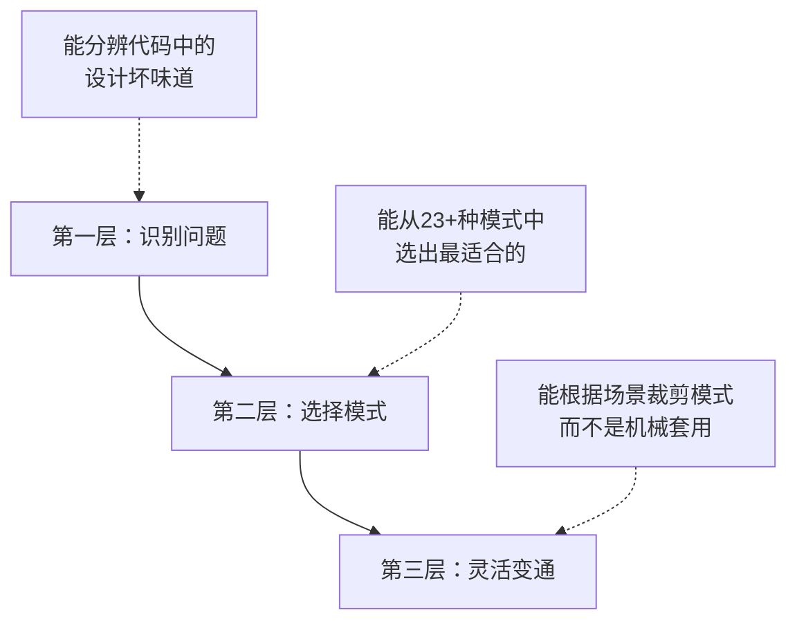
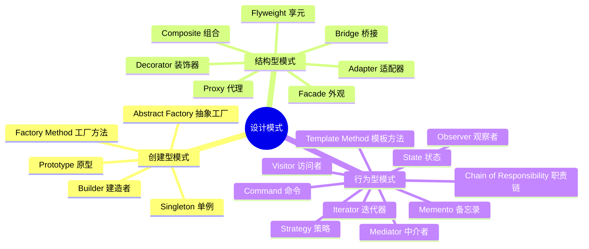
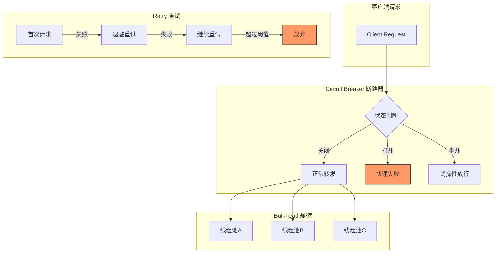
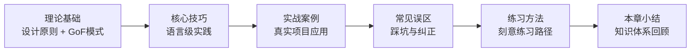
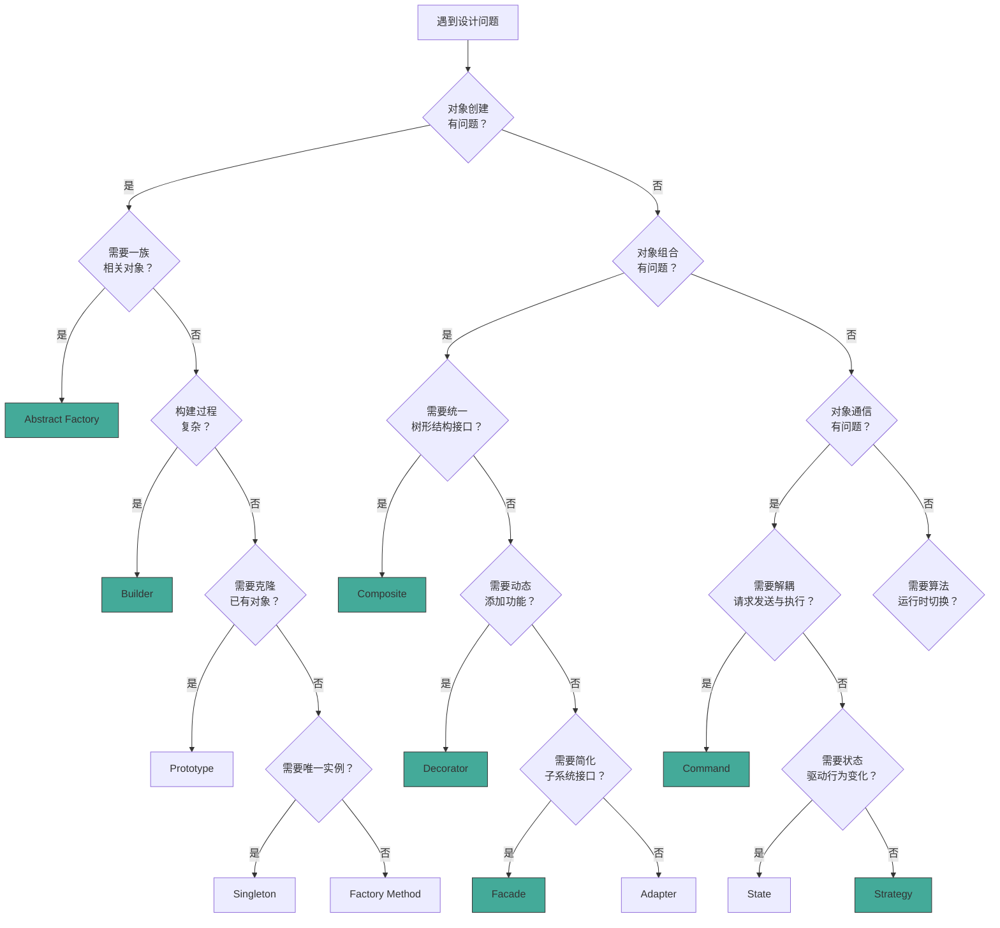

# 第29章：设计模式

## 1. 章节导言：为什么设计模式如此重要

设计模式是软件开发中反复出现的设计问题的成熟解决方案。1994年，Erich Gamma、Richard Helm、Ralph Johnson和John Vlissides（业界通称"四人帮"，GoF）在《Design Patterns: Elements of Reusable Object-Oriented Software》一书中系统化地归纳了23种经典设计模式，奠定了这一领域的理论基础。

设计模式不是可以直接套用的代码模板，也不是必须死记硬背的UML图。它是对特定上下文中反复出现的设计结构和交互方式的**抽象描述**，提供了一套开发者之间高效沟通的**共同词汇**。当你对同事说"这里用Strategy模式解耦"，比写200行注释解释你的意图要高效得多。

**学习设计模式的三个层次：**

- **识别问题**：能分辨代码中的设计坏味道（Shotgun Surgery、Feature Envy、God Class等），知道"这里有问题"
- **选择模式**：理解每种模式解决什么问题，在众多模式中选出最适合当前场景的
- **灵活变通**：根据实际需求裁剪模式，而不是机械地照搬UML图。有时简化版的模式（如用函数代替Strategy类）反而更好

## 2. 设计原则：模式背后的根基

所有设计模式都根植于一组更基础的设计原则。理解这些原则才能理解"为什么需要某个模式"以及在具体场景中如何变通取舍。

### 2.1 SOLID原则

SOLID是Robert C. Martin（Uncle Bob）总结的五个面向对象设计原则，是指导类和模块级设计的基石：

| 原则 | 全称 | 核心思想 | 典型体现模式 |
|------|------|----------|-------------|
| **S** | 单一职责原则（SRP） | 一个类只有一个变化的轴心 | Facade、Mediator |
| **O** | 开闭原则（OCP） | 对扩展开放，对修改关闭 | Strategy、Template Method、Decorator |
| **L** | 里氏替换原则（LSP） | 子类必须能替换父类而不破坏程序正确性 | 所有基于继承的模式 |
| **I** | 接口隔离原则（ISP） | 客户端不应被迫依赖它不使用的接口 | Adapter、Facade |
| **D** | 依赖倒置原则（DIP） | 高层依赖抽象，细节依赖抽象 | Factory Method、Abstract Factory、DI |

### 2.2 其他关键原则

| 原则 | 核心思想 | 注意事项 |
|------|----------|----------|
| **DRY**（Don't Repeat Yourself） | 每条知识在系统中只有一个权威来源 | 两段代码恰好相同但变化动因不同时，容忍适度重复反而更健壮 |
| **YAGNI**（You Aren't Gonna Need It） | 不为"将来可能需要"的功能编写代码 | 简单if-else在只涉及两种策略时可能比Strategy模式更清晰 |
| **KISS**（Keep It Simple, Stupid） | 最简单的可行方案通常是最好的 | 引入模式应该让系统更简单，如果增加了复杂度却没带来灵活性收益，就该放弃 |
| **组合优于继承** | 继承是编译时的静态关系，组合是运行时的动态关系 | Decorator、Strategy、State等模式都体现此原则 |
| **封装变化点** | 识别变化的部分，封装在稳定接口之后 | GoF的核心思想——每个模式都识别了一个变化点并提供封装方案 |

### 2.3 原则之间的张力

设计原则不是教条，它们之间存在微妙的张力：

- **DRY vs 解耦**：过度消除重复可能引入不必要的耦合。两段代码现在相同但将来可能朝不同方向演化，强行抽取公共基类反而制造障碍
- **YAGNI vs OCP**：YAGNI说"不要提前设计"，OCP说"设计要对扩展开放"。平衡点是：**为已知的变化点预留扩展能力，但不为假想的变化增加复杂度**
- **KISS vs 模式**：一个模式如果增加了代码量和理解难度但没有带来明显的灵活性收益，就应该放弃。代码被阅读的次数远多于编写的次数，可读性优先

## 3. GoF 23种经典设计模式全景

GoF将23种设计模式按目的分为三大类：创建型（5种）、结构型（7种）、行为型（11种）。以下是全景图：

### 3.1 创建型模式（5种）

创建型模式关注**对象的创建机制**，将对象的创建与使用分离，提升系统的灵活性和可扩展性。

| 模式 | 一句话定义 | 解决什么问题 | 适用场景 |
|------|-----------|-------------|----------|
| **Factory Method** | 定义创建对象的接口，让子类决定实例化哪个类 | 框架需要创建对象但无法预知具体类型 | 跨平台UI组件、日志框架、数据库驱动 |
| **Abstract Factory** | 提供创建一系列相关对象的接口，无需指定具体类 | 需要确保一组产品风格一致 | 多主题UI、多数据库适配、跨平台工具包 |
| **Builder** | 将复杂对象的构建与表示分离，分步构建 | 构造函数参数过多（telescoping constructor） | HTTP请求构建、SQL查询构建、测试数据生成 |
| **Prototype** | 通过复制已有对象来创建新对象 | 创建对象代价高昂，且需要大量相似对象 | 图形编辑器中的形状复制、文档模板克隆 |
| **Singleton** | 保证一个类只有一个实例并提供全局访问点 | 需要全局唯一的协调者 | 配置管理器、连接池、线程池、日志记录器 |

**模式之间的协作关系：**
- Factory Method通常用在Creator的子类中，是最基础的创建型模式
- Abstract Factory可以包含多个Factory Method
- Builder可以使用Factory Method创建各个部分
- Prototype可以独立使用，也可以与Factory Method结合

### 3.2 结构型模式（7种）

结构型模式关注**类和对象的组合**，用更大的结构来实现新功能或简化设计。

| 模式 | 一句话定义 | 解决什么问题 | 适用场景 |
|------|-----------|-------------|----------|
| **Adapter** | 将一个类的接口转换为客户端期望的另一个接口 | 接口不兼容，无法直接协作 | 第三方库集成、遗留系统迁移、数据格式转换 |
| **Bridge** | 将抽象部分与实现部分分离，使它们可以独立变化 | 两个维度的变化需要正交扩展 | 跨平台渲染引擎、多格式文件解析、驱动程序 |
| **Composite** | 将对象组合成树形结构，统一处理单个对象和组合对象 | 需要对树形结构进行统一操作 | 文件系统、UI组件树、组织架构、菜单系统 |
| **Decorator** | 动态地为对象添加职责，比继承更灵活的扩展方式 | 需要在不修改原有类的情况下扩展功能 | Java I/O流、日志增强、缓存层、权限校验 |
| **Facade** | 为子系统提供统一的简化接口 | 子系统过于复杂，外部使用成本高 | 微服务网关、SDK封装、遗留系统包装 |
| **Flyweight** | 通过共享技术高效地支持大量细粒度对象 | 大量相似对象消耗过多内存 | 字符编辑器、地图渲染、游戏粒子系统 |
| **Proxy** | 为其他对象提供代理以控制对它的访问 | 需要在访问对象前添加控制逻辑 | 远程代理、虚拟代理、保护代理、缓存代理 |

### 3.3 行为型模式（11种）

行为型模式关注**对象之间的通信和职责分配**，描述对象如何协作完成复杂任务。

| 模式 | 一句话定义 | 解决什么问题 | 适用场景 |
|------|-----------|-------------|----------|
| **Strategy** | 封装算法族，使它们可以互相替换 | 多种算法需要在运行时切换 | 排序策略、支付方式、压缩算法、路由策略 |
| **Observer** | 定义一对多的依赖关系，当对象状态变化时自动通知所有依赖者 | 对象状态变化需要通知其他对象 | 事件系统、消息队列、MVC中的View更新、股票行情推送 |
| **Command** | 将请求封装为对象，支持参数化、排队、日志和撤销 | 需要解耦请求的发起者和执行者 | 撤销/重做系统、任务队列、宏命令、事务日志 |
| **Iterator** | 提供顺序访问聚合元素的方法，而不暴露其底层表示 | 需要统一遍历不同数据结构的方式 | 容器遍历、数据库游标、分页查询 |
| **Mediator** | 用一个中介对象封装对象间的交互，减少对象间的直接依赖 | 对象间存在复杂的多对多交互 | 聊天室、空中交通管制、表单组件协调 |
| **State** | 允许对象在内部状态改变时改变其行为 | 对象行为随状态变化且状态转换逻辑复杂 | 订单状态机、游戏角色状态、TCP连接状态 |
| **Template Method** | 定义算法骨架，将某些步骤延迟到子类实现 | 多个类有相似的算法框架但细节不同 | 框架钩子方法、测试基类、数据处理管道 |
| **Visitor** | 在不修改对象结构的前提下定义新操作 | 需要对对象结构执行多种不相关的操作 | 编译器AST遍历、文档导出、类型检查器 |
| **Chain of Responsibility** | 将请求沿链传递，直到某个对象处理它 | 多个对象都有机会处理请求，由运行时决定 | 中间件管道、审批流程、异常处理链、日志级别过滤 |
| **Memento** | 捕获对象内部状态并保存，以便日后恢复 | 需要实现撤销/恢复功能 | 文本编辑器撤销、游戏存档、事务回滚 |

## 4. 并发模式与分布式弹性模式

除了GoF经典23种，本章还覆盖了在现代并发编程和分布式系统中广泛使用的模式。这些模式在云原生架构中不可或缺。

### 4.1 并发模式（4种）

| 模式 | 核心思想 | 典型应用 |
|------|----------|----------|
| **Active Object** | 将方法调用与执行分离，请求被序列化到单独的线程中处理 | 消息队列Worker、Actor模型 |
| **Monitor** | 封装共享资源的访问，通过互斥和条件变量实现同步 | 线程安全的数据结构、生产者-消费者 |
| **Read-Write Lock** | 允许多个读操作并发执行，写操作独占访问 | 缓存系统、配置中心、数据库连接池 |
| **Future/Promise** | 表示一个尚未完成的异步操作的结果占位符 | 异步HTTP请求、并行计算结果聚合 |

### 4.2 分布式弹性模式（5种）

| 模式 | 核心思想 | 典型应用 |
|------|----------|----------|
| **Circuit Breaker（断路器）** | 监控失败率，超过阈值时快速失败而非继续发送请求，避免级联故障 | Hystrix、Resilience4j、Istio |
| **Bulkhead（舱壁）** | 通过资源隔离防止单个故障服务耗尽全部资源 | 线程池隔离、连接池隔离、信号量隔离 |
| **Retry（重试）** | 自动重试失败的请求，配合指数退避避免雪崩 | HTTP客户端重试、消息队列消费重试 |
| **Saga** | 将分布式事务拆分为一系列本地事务，每个事务有对应的补偿操作 | 订单-支付-库存的分布式事务、微服务编排 |
| **Sidecar（边车）** | 将基础设施能力（日志、监控、安全）从应用中剥离为独立进程 | Service Mesh中的Envoy代理、日志收集Agent |

## 5. 本章结构与学习路径

本章按"原则→模式→实战→反思"的路径组织，建议按顺序阅读：

### 各节内容概要

| 节次 | 内容 | 核心收获 |
|------|------|----------|
| **理论基础** | SOLID等设计原则、GoF 23种经典模式、分布式弹性模式 | 理解每个模式的意图、结构、参与者、协作方式和适用场景 |
| **核心技巧** | Go常用设计模式、Python装饰器模式、依赖注入实践 | 在具体语言中落地模式的工程技巧 |
| **实战案例** | 真实项目中的模式选择与组合应用 | 理解模式之间的协作关系，学会在复杂场景中灵活运用 |
| **常见误区** | 过度设计、模式滥用、忽视简单方案等典型错误 | 避免"拿着锤子找钉子"的思维陷阱 |
| **练习方法** | 从识别代码坏味道到动手重构的刻意练习路径 | 建立"看到问题→想到模式→动手实现"的直觉反应 |

## 6. 模式选择决策指南

面对一个设计问题，如何选择合适的模式？以下决策树可以帮助你快速定位：

## 7. 学习建议

1. **先理解原则，再记忆模式**：SOLID、DRY等原则是"道"，模式是"术"。理解了原则，即使忘了某个模式的具体结构，也能推导出来
2. **不要死记UML**：理解每个模式解决什么问题比记住类图更重要。遇到问题时，先想"我需要什么能力"，再查对应模式
3. **从一个模式开始深入**：建议从Strategy或Decorator开始，它们概念直观、应用广泛、容易验证
4. **在真实项目中练习**：读10遍书不如在项目中用1次。找一个你正在维护的项目，识别其中的代码坏味道，尝试用模式重构
5. **警惕过度设计**：不是所有问题都需要模式。简单的if-else、函数式编程、甚至复制粘贴（如果变化动因不同），在简单场景下可能比引入模式更务实
6. **关注模式之间的关系**：很多模式是成对出现的（如Factory Method + Prototype，Decorator + Composite），理解它们的组合比孤立记忆每个模式更有效
