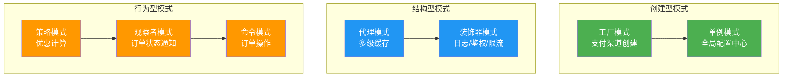
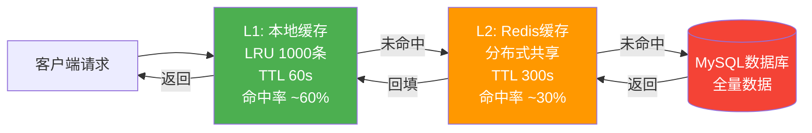
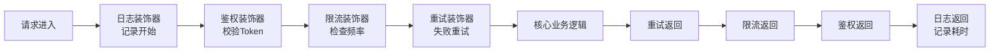
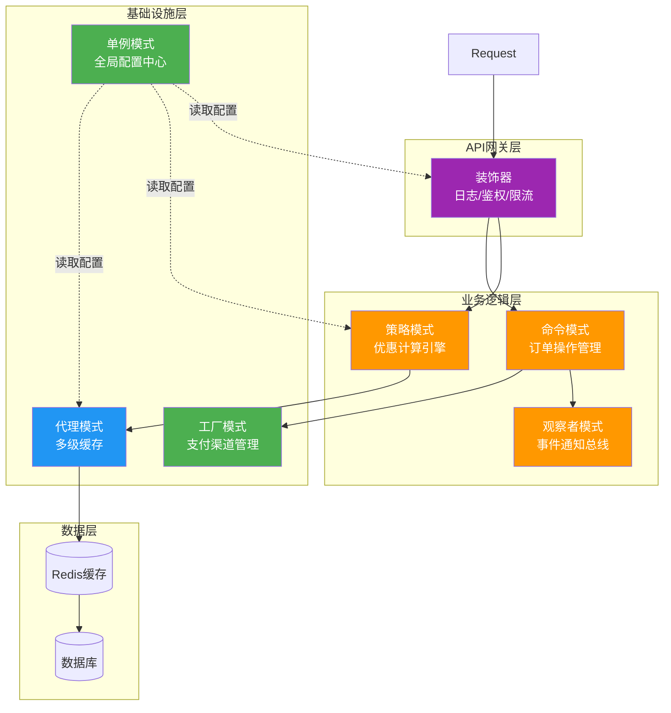

## 实战案例：电商平台设计模式综合应用

本章通过一个完整的电商大促场景，展示如何将多种设计模式组合运用到真实业务系统中。不同于孤立地讲解单个模式，我们将看到模式之间如何协同工作，共同解决复杂的工程问题。

---

### 1. 场景概述

#### 1.1 业务背景

某电商平台准备应对双11大促活动。系统需要处理以下核心流程：

- 用户浏览商品（高并发读）
- 下单购买（库存扣减、优惠计算）
- 支付处理（对接多个支付渠道）
- 订单状态变更通知（消息推送、短信、邮件）
- 系统配置动态调整（限流阈值、开关控制）

#### 1.2 核心挑战

| 挑战 | 具体表现 | 影响 |
|------|---------|------|
| 流量洪峰 | 日常QPS 5000，大促预估50000+ | 系统崩溃风险 |
| 优惠规则复杂 | 满减、折扣、券叠加、会员价 | 规则频繁变更，硬编码难维护 |
| 支付渠道多 | 支付宝、微信、银行卡、余额 | 新渠道接入成本高 |
| 状态通知多 | 短信、邮件、App推送、站内信 | 通知逻辑耦合在订单代码中 |
| 配置需热更新 | 限流阈值、功能开关 | 重启代价大 |

#### 1.3 涉及的设计模式



---

### 2. 工厂模式：支付渠道管理

#### 2.1 问题分析

系统需要对接支付宝、微信支付、银行卡、余额支付等多个渠道。如果在业务代码中直接 `new AlipayClient()`、`new WechatPayClient()`，会导致：

- 每增加一个支付渠道，都要修改业务代码
- 支付渠道的创建逻辑散落在各处，无法统一管理
- 不同渠道的初始化参数差异大，耦合严重

#### 2.2 方案设计

使用工厂模式将支付渠道的创建逻辑集中管理：

```python
from abc import ABC, abstractmethod
from typing import Dict, Type


class PaymentProcessor(ABC):
    """支付处理器抽象基类"""

    @abstractmethod
    def pay(self, order_id: str, amount: float) -> dict:
        """发起支付"""
        pass

    @abstractmethod
    def refund(self, order_id: str, amount: float) -> dict:
        """发起退款"""
        pass

    @abstractmethod
    def query(self, order_id: str) -> dict:
        """查询支付状态"""
        pass


class AlipayProcessor(PaymentProcessor):
    """支付宝支付"""

    def __init__(self, app_id: str, private_key: str):
        self.app_id = app_id
        self.private_key = private_key

    def pay(self, order_id: str, amount: float) -> dict:
        # 调用支付宝SDK
        print(f"[支付宝] 发起支付: 订单{order_id}, 金额{amount}")
        return {"channel": "alipay", "status": "pending"}

    def refund(self, order_id: str, amount: float) -> dict:
        print(f"[支付宝] 发起退款: 订单{order_id}, 金额{amount}")
        return {"channel": "alipay", "refund_status": "processing"}

    def query(self, order_id: str) -> dict:
        return {"channel": "alipay", "status": "paid"}


class WechatPayProcessor(PaymentProcessor):
    """微信支付"""

    def __init__(self, mch_id: str, api_key: str):
        self.mch_id = mch_id
        self.api_key = api_key

    def pay(self, order_id: str, amount: float) -> dict:
        print(f"[微信支付] 发起支付: 订单{order_id}, 金额{amount}")
        return {"channel": "wechat", "status": "pending"}

    def refund(self, order_id: str, amount: float) -> dict:
        print(f"[微信支付] 发起退款: 订单{order_id}, 金额{amount}")
        return {"channel": "wechat", "refund_status": "processing"}

    def query(self, order_id: str) -> dict:
        return {"channel": "wechat", "status": "paid"}


class PaymentFactory:
    """支付工厂 - 统一创建和管理支付处理器"""

    _processors: Dict[str, Type[PaymentProcessor]] = {}

    @classmethod
    def register(cls, channel: str, processor_class: Type[PaymentProcessor]):
        """注册新的支付渠道"""
        cls._processors[channel] = processor_class

    @classmethod
    def create(cls, channel: str, **kwargs) -> PaymentProcessor:
        """根据渠道名创建支付处理器"""
        if channel not in cls._processors:
            raise ValueError(f"不支持的支付渠道: {channel}")
        return cls._processors[channel](**kwargs)

    @classmethod
    def supported_channels(cls) -> list:
        """返回所有支持的渠道"""
        return list(cls._processors.keys())


# 注册渠道
PaymentFactory.register("alipay", AlipayProcessor)
PaymentFactory.register("wechat", WechatPayProcessor)

# 使用
processor = PaymentFactory.create("alipay", app_id="xxx", private_key="yyy")
result = processor.pay("ORDER_001", 99.9)
```

**关键价值**：

- 新增支付渠道时，只需新建一个类并注册，完全不修改现有业务代码
- 工厂类集中管理所有渠道，方便做渠道降级、负载均衡
- 支付逻辑与业务逻辑彻底解耦

---

### 3. 策略模式：优惠计算引擎

#### 3.1 问题分析

电商平台的优惠规则极其复杂且频繁变更：

- 满减：满200减30
- 折扣：会员8折
- 优惠券：满100减10
- 秒杀价：固定低价
- 组合优惠：券+折扣+满减叠加

如果用 `if-else` 堆砌，代码将变成不可维护的噩梦。

#### 3.2 方案设计

```python
from abc import ABC, abstractmethod
from dataclasses import dataclass, field
from typing import List


@dataclass
class OrderItem:
    """订单商品"""
    name: str
    price: float
    quantity: int

    @property
    def subtotal(self) -> float:
        return self.price * self.quantity


@dataclass
class DiscountResult:
    """优惠计算结果"""
    original_price: float
    final_price: float
    discount_amount: float
    breakdown: List[str] = field(default_factory=list)


class DiscountStrategy(ABC):
    """优惠策略抽象类"""

    @abstractmethod
    def calculate(self, items: List[OrderItem], context: dict) -> DiscountResult:
        """计算优惠后的价格"""
        pass

    @property
    @abstractmethod
    def priority(self) -> int:
        """优先级（数字越小越先执行）"""
        pass


class FullReductionStrategy(DiscountStrategy):
    """满减策略：满X减Y"""

    def __init__(self, threshold: float, reduction: float):
        self.threshold = threshold
        self.reduction = reduction

    @property
    def priority(self) -> int:
        return 100

    def calculate(self, items: List[OrderItem], context: dict) -> DiscountResult:
        original = sum(item.subtotal for item in items)
        discount = 0.0
        breakdown = []

        if original >= self.threshold:
            # 满减可叠加（每满一次减一次）
            times = int(original // self.threshold)
            discount = min(times * self.reduction, original * 0.3)  # 封顶30%
            breakdown.append(
                f"满{self.threshold}减{self.reduction}: "
                f"满减{times}次，优惠{discount:.2f}元"
            )

        return DiscountResult(
            original_price=original,
            final_price=original - discount,
            discount_amount=discount,
            breakdown=breakdown,
        )


class MemberDiscountStrategy(DiscountStrategy):
    """会员折扣策略"""

    DISCOUNT_MAP = {
        "normal": 1.0,
        "silver": 0.95,
        "gold": 0.9,
        "diamond": 0.85,
    }

    @property
    def priority(self) -> int:
        return 50  # 会员折扣优先于满减

    def calculate(self, items: List[OrderItem], context: dict) -> DiscountResult:
        original = sum(item.subtotal for item in items)
        level = context.get("member_level", "normal")
        discount_rate = self.DISCOUNT_MAP.get(level, 1.0)

        discount = original * (1 - discount_rate)
        breakdown = []
        if discount > 0:
            breakdown.append(
                f"会员折扣({level} {discount_rate*10:.0f}折): "
                f"优惠{discount:.2f}元"
            )

        return DiscountResult(
            original_price=original,
            final_price=original - discount,
            discount_amount=discount,
            breakdown=breakdown,
        )


class CouponStrategy(DiscountStrategy):
    """优惠券策略"""

    def __init__(self, coupon_id: str, min_amount: float, discount: float):
        self.coupon_id = coupon_id
        self.min_amount = min_amount
        self.discount = discount

    @property
    def priority(self) -> int:
        return 80

    def calculate(self, items: List[OrderItem], context: dict) -> DiscountResult:
        original = sum(item.subtotal for item in items)
        used_coupons = context.get("used_coupons", [])
        discount = 0.0
        breakdown = []

        if self.coupon_id in used_coupons and original >= self.min_amount:
            discount = min(self.discount, original)  # 不超过原价
            breakdown.append(
                f"优惠券[{self.coupon_id}]: "
                f"满{self.min_amount}减{self.discount}，优惠{discount:.2f}元"
            )

        return DiscountResult(
            original_price=original,
            final_price=original - discount,
            discount_amount=discount,
            breakdown=breakdown,
        )


class DiscountEngine:
    """优惠计算引擎 - 组合多个策略"""

    def __init__(self):
        self._strategies: List[DiscountStrategy] = []

    def add_strategy(self, strategy: DiscountStrategy):
        """添加优惠策略"""
        self._strategies.append(strategy)
        # 按优先级排序
        self._strategies.sort(key=lambda s: s.priority)

    def calculate_total(self, items: List[OrderItem], context: dict) -> dict:
        """计算总优惠（按优先级依次应用）"""
        current_price = sum(item.subtotal for item in items)
        all_breakdowns = []
        total_discount = 0.0

        for strategy in self._strategies:
            # 每个策略基于当前价格计算
            result = strategy.calculate(items, context)
            if result.discount_amount > 0:
                # 按当前价格等比缩放折扣
                actual_discount = min(result.discount_amount, current_price * 0.3)
                current_price -= actual_discount
                total_discount += actual_discount
                all_breakdowns.extend(result.breakdown)

        original = sum(item.subtotal for item in items)
        return {
            "original_price": original,
            "final_price": round(current_price, 2),
            "total_discount": round(total_discount, 2),
            "breakdown": all_breakdowns,
        }


# ===== 使用示例 =====
items = [
    OrderItem("iPhone 15", 5999.0, 1),
    OrderItem("AirPods Pro", 1899.0, 1),
    OrderItem("手机壳", 49.0, 2),
]

engine = DiscountEngine()
engine.add_strategy(MemberDiscountStrategy())            # 会员折扣
engine.add_strategy(CouponStrategy("COUPON_100", 100, 50))  # 满100减50券
engine.add_strategy(FullReductionStrategy(200, 30))     # 满200减30

context = {
    "member_level": "gold",     # 金卡会员
    "used_coupons": ["COUPON_100"],
}

result = engine.calculate_total(items, context)
print(f"原价: ¥{result['original_price']}")
print(f"折后: ¥{result['final_price']}")
print(f"节省: ¥{result['total_discount']}")
for line in result["breakdown"]:
    print(f"  - {line}")
```

**模式优势对比**：

| 对比维度 | if-else硬编码 | 策略模式 |
|---------|-------------|---------|
| 新增优惠规则 | 修改已有代码，风险高 | 新增类，零修改已有代码 |
| 规则组合 | 嵌套逻辑混乱，难以调试 | 按优先级自动组合，逻辑清晰 |
| 单元测试 | 需要mock大量分支 | 每个策略独立测试 |
| 运行时动态调整 | 不可能 | 可以动态添加/移除策略 |
| 代码可读性 | 300行if-else难以阅读 | 每个策略50行，职责单一 |

---

### 4. 代理模式：多级缓存

#### 4.1 问题分析

商品详情页是访问量最大的页面，每次请求都需要查询数据库。在大促期间，如果所有请求都打到数据库，连接池将迅速耗尽。

#### 4.2 方案设计

使用代理模式实现多级缓存，层层拦截请求：

```python
import time
import hashlib
import json
from collections import OrderedDict
from abc import ABC, abstractmethod
from typing import Optional, Any


class DataService(ABC):
    """数据服务接口"""

    @abstractmethod
    def get(self, key: str) -> Optional[dict]:
        pass

    @abstractmethod
    def set(self, key: str, value: dict, ttl: int = 3600):
        pass


class DatabaseService(DataService):
    """数据库服务（真实服务）"""

    def __init__(self):
        # 模拟数据库存储
        self._store = {}
        self.query_count = 0  # 监控查询次数

    def get(self, key: str) -> Optional[dict]:
        self.query_count += 1
        print(f"  [DB] 查询数据库: {key} (累计查询: {self.query_count})")
        time.sleep(0.01)  # 模拟数据库查询延迟
        return self._store.get(key)

    def set(self, key: str, value: dict, ttl: int = 3600):
        self._store[key] = value


class LocalCacheProxy(DataService):
    """本地缓存代理（L1缓存）- 进程内LRU缓存"""

    def __init__(self, service: DataService, max_size: int = 1000, ttl: int = 60):
        self._service = service
        self._cache = OrderedDict()
        self._max_size = max_size
        self._ttl = ttl
        self._timestamps = {}
        self.hits = 0
        self.misses = 0

    def _is_expired(self, key: str) -> bool:
        if key not in self._timestamps:
            return True
        return time.time() - self._timestamps[key] > self._ttl

    def get(self, key: str) -> Optional[dict]:
        # 命中本地缓存
        if key in self._cache and not self._is_expired(key):
            self.hits += 1
            self._cache.move_to_end(key)
            print(f"  [L1] 本地缓存命中: {key}")
            return self._cache[key]

        # 未命中，向下一级查询
        self.misses += 1
        result = self._service.get(key)

        if result is not None:
            self.set(key, result)

        return result

    def set(self, key: str, value: dict, ttl: int = 60):
        if len(self._cache) >= self._max_size:
            # 淘汰最久未使用的
            evicted_key, _ = self._cache.popitem(last=False)
            del self._timestamps[evicted_key]

        self._cache[key] = value
        self._timestamps[key] = time.time()
        self._cache.move_to_end(key)

        # 同时写入下一层
        self._service.set(key, value, ttl)

    @property
    def hit_rate(self) -> float:
        total = self.hits + self.misses
        return self.hits / total if total > 0 else 0


class RedisCacheProxy(DataService):
    """Redis缓存代理（L2缓存）- 分布式共享缓存"""

    def __init__(self, service: DataService, ttl: int = 300):
        self._service = service
        self._store = {}  # 模拟Redis
        self._ttl = ttl
        self.hits = 0
        self.misses = 0

    def get(self, key: str) -> Optional[dict]:
        if key in self._store:
            self.hits += 1
            print(f"  [L2] Redis缓存命中: {key}")
            return self._store[key]

        self.misses += 1
        result = self._service.get(key)

        if result is not None:
            self.set(key, result)

        return result

    def set(self, key: str, value: dict, ttl: int = 300):
        self._store[key] = value
        self._service.set(key, value, ttl)

    @property
    def hit_rate(self) -> float:
        total = self.hits + self.misses
        return self.hits / total if total > 0 else 0


# ===== 组装多级缓存 =====
def build_cache_chain():
    """构建 L1(本地) -> L2(Redis) -> DB 的缓存链"""
    db = DatabaseService()
    redis_proxy = RedisCacheProxy(db, ttl=300)
    local_proxy = LocalCacheProxy(redis_proxy, max_size=500, ttl=60)
    return local_proxy, db


# ===== 使用示例 =====
cache, db = build_cache_chain()

# 预热数据
db.set("product:1001", {"name": "iPhone 15", "price": 5999, "stock": 100})
db.set("product:1002", {"name": "AirPods Pro", "price": 1899, "stock": 50})

print("=== 第1次请求（全部未命中）===")
for _ in range(3):
    result = cache.get("product:1001")
    print(f"  结果: {result['name']} ¥{result['price']}")

print("\n=== 第2次请求（L1命中）===")
result = cache.get("product:1001")
print(f"  结果: {result['name']} ¥{result['price']}")

print(f"\n=== 缓存统计 ===")
print(f"  L1命中率: {cache.hit_rate:.1%}")
print(f"  总查询次数: {db.query_count}")
```

**多级缓存架构**：



**关键设计要点**：

- **逐层穿透**：L1未命中才查L2，L2未命中才查DB，每层都独立做缓存
- **逐层回填**：DB查到数据后，逐层回写缓存，保证后续请求命中
- **LRU淘汰**：本地缓存有大小上限，超出时淘汰最久未访问的数据
- **TTL过期**：每层有独立的过期时间，L1短（60s）、L2长（300s）

---

### 5. 观察者模式：订单状态通知

#### 5.1 问题分析

订单状态变更时需要通知多个系统：短信、邮件、App推送、站内信、物流系统、积分系统。如果在订单代码中直接调用每个通知服务，会导致：

- 订单服务与通知服务强耦合
- 新增通知方式必须修改订单代码
- 某个通知服务故障会影响订单主流程

#### 5.2 方案设计

```python
from abc import ABC, abstractmethod
from enum import Enum
from typing import List, Callable
from datetime import datetime
import threading


class OrderStatus(Enum):
    """订单状态"""
    CREATED = "created"
    PAID = "paid"
    SHIPPED = "shipped"
    DELIVERED = "delivered"
    CANCELLED = "cancelled"


class OrderEvent:
    """订单事件"""

    def __init__(self, order_id: str, status: OrderStatus, data: dict = None):
        self.order_id = order_id
        self.status = status
        self.data = data or {}
        self.timestamp = datetime.now()

    def __str__(self):
        return (
            f"OrderEvent(order={self.order_id}, "
            f"status={self.status.value}, time={self.timestamp})"
        )


class EventHandler(ABC):
    """事件处理器接口"""

    @abstractmethod
    def handle(self, event: OrderEvent):
        pass

    @property
    @abstractmethod
    def name(self) -> str:
        pass


class OrderEventBus:
    """订单事件总线 - 管理事件的发布和订阅"""

    def __init__(self):
        self._handlers: dict[OrderStatus, List[EventHandler]] = {
            status: [] for status in OrderStatus
        }
        self._global_handlers: List[EventHandler] = []

    def subscribe(self, status: OrderStatus, handler: EventHandler):
        """订阅特定状态变更"""
        self._handlers[status].append(handler)
        print(f"  订阅注册: {handler.name} -> {status.value}")

    def subscribe_all(self, handler: EventHandler):
        """订阅所有状态变更"""
        self._global_handlers.append(handler)
        print(f"  全局订阅: {handler.name}")

    def unsubscribe(self, status: OrderStatus, handler: EventHandler):
        """取消订阅"""
        self._handlers[status] = [
            h for h in self._handlers[status] if h is not handler
        ]

    def publish(self, event: OrderEvent):
        """发布事件"""
        handlers = (
            self._handlers.get(event.status, []) + self._global_handlers
        )

        for handler in handlers:
            try:
                handler.handle(event)
            except Exception as e:
                # 通知失败不影响主流程，只记录日志
                print(f"  [ERROR] {handler.name} 处理失败: {e}")

    def publish_async(self, event: OrderEvent):
        """异步发布事件（不阻塞主流程）"""
        thread = threading.Thread(target=self.publish, args=(event,))
        thread.daemon = True
        thread.start()


# ===== 具体的事件处理器 =====

class SmsNotificationHandler(EventHandler):
    """短信通知"""

    @property
    def name(self) -> str:
        return "短信通知"

    def handle(self, event: OrderEvent):
        phone = event.data.get("phone", "未知")
        status_text = {
            OrderStatus.PAID: "已支付成功",
            OrderStatus.SHIPPED: "已发货",
            OrderStatus.DELIVERED: "已签收",
            OrderStatus.CANCELLED: "已取消",
        }.get(event.status, str(event.status.value))

        print(f"  [短信] 发送至 {phone}: 订单{event.order_id}{status_text}")


class EmailNotificationHandler(EventHandler):
    """邮件通知"""

    @property
    def name(self) -> str:
        return "邮件通知"

    def handle(self, event: OrderEvent):
        email = event.data.get("email", "未知")
        print(f"  [邮件] 发送至 {email}: 订单{event.order_id} 状态变更")


class PushNotificationHandler(EventHandler):
    """App推送"""

    @property
    def name(self) -> str:
        return "App推送"

    def handle(self, event: OrderEvent):
        user_id = event.data.get("user_id", "未知")
        print(f"  [推送] 发送至用户 {user_id}: 订单{event.order_id}")


class PointsHandler(EventHandler):
    """积分系统 - 订单完成时赠送积分"""

    @property
    def name(self) -> str:
        return "积分系统"

    def handle(self, event: OrderEvent):
        if event.status == OrderStatus.DELIVERED:
            amount = event.data.get("amount", 0)
            points = int(amount)  # 每消费1元得1积分
            print(f"  [积分] 订单{event.order_id} 赠送 {points} 积分")


class LogisticsHandler(EventHandler):
    """物流系统"""

    @property
    def name(self) -> str:
        return "物流系统"

    def handle(self, event: OrderEvent):
        if event.status == OrderStatus.PAID:
            print(f"  [物流] 订单{event.order_id} 创建物流单")
        elif event.status == OrderStatus.SHIPPED:
            print(f"  [物流] 订单{event.order_id} 更新物流状态")


# ===== 使用示例 =====
print("=== 初始化事件总线 ===")
event_bus = OrderEventBus()

# 注册事件处理器
event_bus.subscribe(OrderStatus.PAID, SmsNotificationHandler())
event_bus.subscribe(OrderStatus.PAID, EmailNotificationHandler())
event_bus.subscribe(OrderStatus.PAID, LogisticsHandler())
event_bus.subscribe(OrderStatus.SHIPPED, PushNotificationHandler())
event_bus.subscribe(OrderStatus.SHIPPED, SmsNotificationHandler())
event_bus.subscribe(OrderStatus.DELIVERED, PointsHandler())
event_bus.subscribe_all(LogisticsHandler())  # 物流系统关注所有状态

# 模拟订单流程
print("\n=== 订单支付 ===")
event_bus.publish(OrderEvent(
    "ORD_20241111_001",
    OrderStatus.PAID,
    {"phone": "138****1234", "email": "user@example.com",
     "user_id": "U10001", "amount": 299.0}
))

print("\n=== 订单发货 ===")
event_bus.publish(OrderEvent(
    "ORD_20241111_001",
    OrderStatus.SHIPPED,
    {"user_id": "U10001", "phone": "138****1234"}
))

print("\n=== 订单签收 ===")
event_bus.publish(OrderEvent(
    "ORD_20241111_001",
    OrderStatus.DELIVERED,
    {"amount": 299.0}
))
```

**核心优势**：

- **解耦**：订单服务只负责发布事件，不关心谁在监听
- **可扩展**：新增通知方式只需添加新Handler并订阅，零修改已有代码
- **容错**：单个Handler异常不影响其他Handler和主流程
- **异步化**：可选择同步或异步发布，异步模式不阻塞订单主流程

---

### 6. 装饰器模式：请求处理管道

#### 6.1 问题分析

每个API请求都需要经过日志记录、身份鉴权、参数校验、限流控制等横切关注点（Cross-Cutting Concerns）。如果把这些逻辑写在每个接口方法里，会导致大量重复代码。

#### 6.2 方案设计

```python
import time
import functools
from typing import Callable, Any


# ===== 基础服务接口 =====
class OrderService:
    """订单服务（被装饰的核心服务）"""

    def create_order(self, user_id: str, product_id: str, quantity: int) -> dict:
        """创建订单"""
        return {
            "order_id": f"ORD_{int(time.time())}",
            "user_id": user_id,
            "product_id": product_id,
            "quantity": quantity,
            "status": "created",
        }

    def cancel_order(self, order_id: str) -> dict:
        """取消订单"""
        return {"order_id": order_id, "status": "cancelled"}


# ===== Python装饰器实现（更Pythonic的方式）=====

# 简易限流器
class RateLimiter:
    def __init__(self, max_requests: int, window_seconds: int):
        self.max_requests = max_requests
        self.window = window_seconds
        self._requests: dict[str, list[float]] = {}

    def is_allowed(self, key: str) -> bool:
        now = time.time()
        if key not in self._requests:
            self._requests[key] = []

        # 清除窗口外的请求记录
        self._requests[key] = [
            t for t in self._requests[key] if now - t < self.window
        ]

        if len(self._requests[key]) >= self.max_requests:
            return False

        self._requests[key].append(now)
        return True


_limiter = RateLimiter(max_requests=100, window_seconds=60)


def log_decorator(func: Callable) -> Callable:
    """日志装饰器：记录每次调用的入参和耗时"""

    @functools.wraps(func)
    def wrapper(*args, **kwargs):
        start = time.time()
        print(f"  [LOG] 调用 {func.__name__}()")
        print(f"  [LOG] 参数: {args[1:]}, {kwargs}")

        result = func(*args, **kwargs)

        elapsed = (time.time() - start) * 1000
        print(f"  [LOG] 返回: {result}")
        print(f"  [LOG] 耗时: {elapsed:.1f}ms")
        return result

    return wrapper


def auth_decorator(func: Callable) -> Callable:
    """鉴权装饰器：校验请求者身份"""

    @functools.wraps(func)
    def wrapper(*args, **kwargs):
        # 从kwargs中获取token（模拟鉴权）
        token = kwargs.pop("token", None)
        if not token or not token.startswith("Bearer "):
            raise PermissionError("未授权访问")

        # 模拟token校验
        user_id = token.replace("Bearer ", "")
        print(f"  [AUTH] 用户 {user_id} 鉴权通过")
        kwargs["user_id"] = user_id  # 注入用户信息

        return func(*args, **kwargs)

    return wrapper


def rate_limit_decorator(func: Callable) -> Callable:
    """限流装饰器：控制请求频率"""

    @functools.wraps(func)
    def wrapper(*args, **kwargs):
        key = kwargs.get("user_id", "anonymous")
        if not _limiter.is_allowed(key):
            raise RuntimeError(f"用户 {key} 请求过于频繁，请稍后再试")
        print(f"  [RATE] 限流检查通过: {key}")
        return func(*args, **kwargs)

    return wrapper


def retry_decorator(max_retries: int = 3, delay: float = 0.1):
    """重试装饰器：自动重试失败的操作"""

    def decorator(func: Callable) -> Callable:
        @functools.wraps(func)
        def wrapper(*args, **kwargs):
            last_error = None
            for attempt in range(1, max_retries + 1):
                try:
                    return func(*args, **kwargs)
                except Exception as e:
                    last_error = e
                    print(
                        f"  [RETRY] 第{attempt}次尝试失败: {e}, "
                        f"{delay}s后重试..."
                    )
                    time.sleep(delay)
            raise last_error

        return wrapper
    return decorator


# ===== 组合使用装饰器 =====
class DecoratedOrderService:
    """经过装饰器增强的订单服务"""

    @log_decorator
    @auth_decorator
    @rate_limit_decorator
    @retry_decorator(max_retries=3)
    def create_order(self, user_id: str, product_id: str, quantity: int) -> dict:
        return {
            "order_id": f"ORD_{int(time.time())}",
            "user_id": user_id,
            "product_id": product_id,
            "quantity": quantity,
            "status": "created",
        }


# ===== 使用示例 =====
service = DecoratedOrderService()

print("=== 正常请求 ===")
try:
    result = service.create_order(
        product_id="P1001",
        quantity=2,
        token="Bearer user_001",
    )
    print(f"  结果: {result}")
except Exception as e:
    print(f"  异常: {e}")

print("\n=== 无Token请求 ===")
try:
    service.create_order(product_id="P1001", quantity=2)
except PermissionError as e:
    print(f"  鉴权失败: {e}")
```

**装饰器执行顺序**（由外到内）：



装饰器的执行顺序是从上到下（外层先执行），返回时从下到上（内层先返回），形成一个清晰的处理管道。

---

### 7. 单例模式与命令模式

#### 7.1 单例模式：全局配置中心

系统运行时需要一份全局共享的配置（限流阈值、功能开关、数据库地址等）。使用单例模式确保配置唯一且全局可访问：

```python
import threading
from typing import Any


class ConfigCenter:
    """全局配置中心（双重检查锁单例）"""

    _instance = None
    _lock = threading.Lock()
    _config: dict[str, Any] = {}
    _watchers: list = []

    def __new__(cls):
        if cls._instance is None:
            with cls._lock:
                if cls._instance is None:
                    cls._instance = super().__new__(cls)
        return cls._instance

    def get(self, key: str, default: Any = None) -> Any:
        return self._config.get(key, default)

    def set(self, key: str, value: Any):
        old_value = self._config.get(key)
        self._config[key] = value
        # 通知配置变更
        if old_value != value:
            self._notify(key, old_value, value)

    def batch_update(self, config: dict[str, Any]):
        """批量更新配置"""
        for key, value in config.items():
            self.set(key, value)

    def watch(self, callback):
        """注册配置变更监听器"""
        self._watchers.append(callback)

    def _notify(self, key: str, old_value: Any, new_value: Any):
        for watcher in self._watchers:
            try:
                watcher(key, old_value, new_value)
            except Exception as e:
                print(f"  [CONFIG] 监听器异常: {e}")

    def snapshot(self) -> dict:
        """获取当前配置快照"""
        return dict(self._config)


# ===== 使用示例 =====
config = ConfigCenter()

# 注册配置变更监听
def on_config_change(key, old_val, new_val):
    print(f"  [通知] 配置变更: {key} {old_val} -> {new_val}")

config.watch(on_config_change)

# 初始化配置
config.batch_update({
    "rate_limit.qps": 1000,
    "rate_limit.burst": 200,
    "feature.flash_sale_enabled": True,
    "feature.new_checkout_enabled": False,
    "db.pool_size": 50,
})

# 读取配置
print(f"  限流QPS: {config.get('rate_limit.qps')}")
print(f"  秒杀开关: {config.get('feature.flash_sale_enabled')}")

# 热更新配置
print("\n=== 热更新 ===")
config.set("rate_limit.qps", 5000)  # 大促期间提高限流阈值
config.set("feature.new_checkout_enabled", True)  # 开启新结算流程
```

#### 7.2 命令模式：可撤销的订单操作

订单操作（下单、取消、修改地址）使用命令模式封装，实现操作队列、可撤销、可重放：

```python
from abc import ABC, abstractmethod
from dataclasses import dataclass, field
from typing import List
import time


@dataclass
class Order:
    """订单实体"""
    order_id: str
    user_id: str
    items: List[dict] = field(default_factory=list)
    address: str = ""
    status: str = "created"
    total: float = 0.0


class OrderCommand(ABC):
    """订单命令接口"""

    @abstractmethod
    def execute(self) -> dict:
        """执行命令"""
        pass

    @abstractmethod
    def undo(self) -> dict:
        """撤销命令"""
        pass

    @abstractmethod
    def description(self) -> str:
        pass


class CreateOrderCommand(OrderCommand):
    """创建订单命令"""

    def __init__(self, order: Order):
        self._order = order
        self._created = False

    def execute(self) -> dict:
        self._order.status = "created"
        self._created = True
        return {"action": "create", "order_id": self._order.order_id, "ok": True}

    def undo(self) -> dict:
        if self._created:
            self._order.status = "cancelled"
            self._created = False
            return {"action": "cancel", "order_id": self._order.order_id, "ok": True}
        return {"action": "cancel", "ok": False, "reason": "订单未创建"}

    def description(self) -> str:
        return f"创建订单 {self._order.order_id}"


class UpdateAddressCommand(OrderCommand):
    """修改收货地址命令"""

    def __init__(self, order: Order, new_address: str):
        self._order = order
        self._new_address = new_address
        self._old_address = ""

    def execute(self) -> dict:
        self._old_address = self._order.address
        self._order.address = self._new_address
        return {
            "action": "update_address",
            "order_id": self._order.order_id,
            "from": self._old_address,
            "to": self._new_address,
        }

    def undo(self) -> dict:
        self._order.address = self._old_address
        return {
            "action": "undo_address",
            "order_id": self._order.order_id,
            "restored_to": self._old_address,
        }

    def description(self) -> str:
        return f"修改订单 {self._order.order_id} 地址"


class OrderCommandManager:
    """命令管理器 - 执行、撤销、历史记录"""

    def __init__(self, order: Order):
        self._order = order
        self._history: List[OrderCommand] = []
        self._undo_stack: List[OrderCommand] = []

    def execute(self, command: OrderCommand) -> dict:
        """执行命令并记录历史"""
        result = command.execute()
        self._history.append(command)
        self._undo_stack.clear()  # 执行新命令后清空撤销栈
        print(f"  [执行] {command.description()} -> {result}")
        return result

    def undo_last(self) -> dict:
        """撤销上一步操作"""
        if not self._history:
            return {"ok": False, "reason": "没有可撤销的操作"}

        command = self._history.pop()
        result = command.undo()
        self._undo_stack.append(command)
        print(f"  [撤销] {command.description()} -> {result}")
        return result

    def history(self) -> List[str]:
        """查看操作历史"""
        return [cmd.description() for cmd in self._history]


# ===== 使用示例 =====
order = Order(order_id="ORD_001", user_id="U10001", total=299.0)
manager = OrderCommandManager(order)

print("=== 执行命令序列 ===")
manager.execute(CreateOrderCommand(order))
manager.execute(UpdateAddressCommand(order, "北京市朝阳区xx路100号"))
manager.execute(UpdateAddressCommand(order, "上海市浦东新区yy路200号"))

print(f"\n  当前地址: {order.address}")
print(f"  操作历史: {manager.history()}")

print("\n=== 撤销操作 ===")
manager.undo_last()  # 撤销最后一次地址修改
print(f"  当前地址: {order.address}")

manager.undo_last()  # 撤销第一次地址修改
print(f"  当前地址: {order.address}")
```

---

### 8. 综合架构：模式如何协同工作

当所有模式组合在一起时，形成了一个清晰的分层架构：



#### 8.1 请求的完整生命周期

以用户下单为例，一次请求会依次经过以下模式：

用户点击"立即购买"
  │
  ├─ 1. 装饰器管道：日志记录 → Token鉴权 → 限流检查
  │
  ├─ 2. 缓存代理：查询商品信息
  │     L1本地缓存 → L2 Redis缓存 → 数据库
  │
  ├─ 3. 策略引擎：计算优惠
  │     会员折扣 → 优惠券 → 满减
  │
  ├─ 4. 命令模式：创建订单（可撤销）
  │     CreateOrderCommand.execute()
  │
  ├─ 5. 工厂模式：创建支付处理器
  │     PaymentFactory.create("alipay")
  │
  ├─ 6. 观察者通知：发布订单创建事件
  │     短信通知 + 邮件通知 + 推送 + 积分
  │
  └─ 7. 单例配置：记录限流计数，更新统计数据

#### 8.2 模式选择决策指南

| 业务问题 | 推荐模式 | 为什么不用其他模式 |
|---------|---------|-----------------|
| 多种同类对象需要灵活创建 | 工厂模式 | 简单工厂不够灵活，抽象工厂过于复杂 |
| 同一逻辑有多种算法 | 策略模式 | 状态模式适合状态驱动的切换 |
| 对象访问需要增强控制 | 代理模式 | 装饰器适合功能增强，代理适合访问控制 |
| 对象需要额外职责 | 装饰器模式 | 代理模式侧重控制，装饰器侧重增强 |
| 状态变更需要多方感知 | 观察者模式 | 中介者适合多对象互相通信 |
| 操作需要可撤销/队列化 | 命令模式 | 备忘录模式适合状态恢复 |
| 全局唯一实例 | 单例模式 | 注意测试时需要能重置 |

---

### 9. 常见误区与最佳实践

#### 9.1 模式滥用

**反面教材**：为了用模式而用模式

```python
# 过度设计：简单的配置读取不需要单例
# 如果只是模块级变量就够了
# 错误：强行用单例包装一个dict

# 正确做法：简单场景用简单方案
CONFIG = {"db_host": "localhost", "db_port": 3306}
```

**原则**：先让代码工作，发现痛点后再引入模式。YAGNI（You Ain't Gonna Need It）比过度设计重要得多。

#### 9.2 忽视模式的组合

**反面教材**：只用单一模式解决所有问题

把所有逻辑塞进一个巨大的策略类，或者让观察者承担过多职责。

**正确做法**：每个模式解决一类问题，协同工作：
- 策略模式负责算法选择
- 观察者模式负责事件传播
- 装饰器模式负责横切关注点

#### 9.3 顺序错误

**反面教材**：装饰器叠加顺序不对

```python
# 错误：先限流再鉴权 → 匿名用户也能触发限流计数
@rate_limit_decorator
@auth_decorator
def api_endpoint(): ...

# 正确：先鉴权再限流 → 确保只有合法用户消耗限流配额
@auth_decorator
@rate_limit_decorator
def api_endpoint(): ...
```

#### 9.4 单例陷阱

**常见问题**：单例模式在测试中造成状态污染

```python
# 问题：测试A修改了全局配置，测试B受到影响
# 解决方案：
# 1. 提供 reset 方法（仅用于测试）
# 2. 使用依赖注入替代单例
# 3. 用模块级变量替代（更Pythonic）

# 依赖注入方案（推荐）
class OrderService:
    def __init__(self, config: ConfigCenter):  # 注入而非全局访问
        self._config = config
```

---

### 10. 本节小结

| 设计模式 | 解决的问题 | 核心思想 | 本案例中的应用 |
|---------|-----------|---------|-------------|
| 工厂模式 | 对象创建逻辑散乱 | 封装创建过程，面向接口编程 | 支付渠道统一创建和管理 |
| 策略模式 | 算法频繁变更 | 算法族封装，运行时可替换 | 优惠计算引擎 |
| 代理模式 | 数据访问效率低 | 在不修改目标的前提下增加控制层 | 多级缓存穿透 |
| 观察者模式 | 模块间通知耦合 | 定义一对多依赖，状态变更自动通知 | 订单状态变更通知 |
| 装饰器模式 | 横切关注点重复 | 动态添加职责，透明增强 | 日志/鉴权/限流 |
| 命令模式 | 操作不可逆/不可审计 | 将请求封装为对象 | 订单操作可撤销 |
| 单例模式 | 全局状态管理 | 保证唯一实例 | 全局配置中心 |

**核心认知**：

1. **模式是工具不是目的**——解决实际问题才有价值，不要为了用模式而用模式
2. **模式可以组合**——单个模式解决单点问题，组合使用解决系统级问题
3. **关注变化点**——把变化的部分封装起来，稳定的部分保持不变
4. **先简单后复杂**——从最简单的方案开始，在痛点驱动下逐步引入模式
