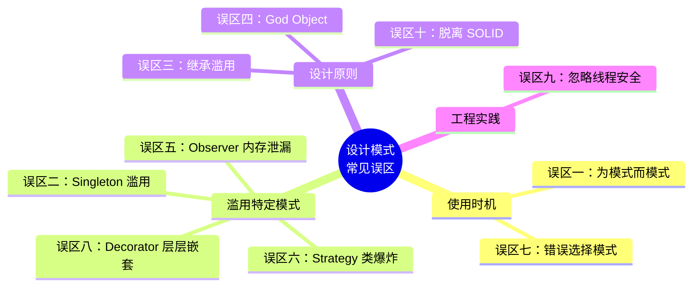
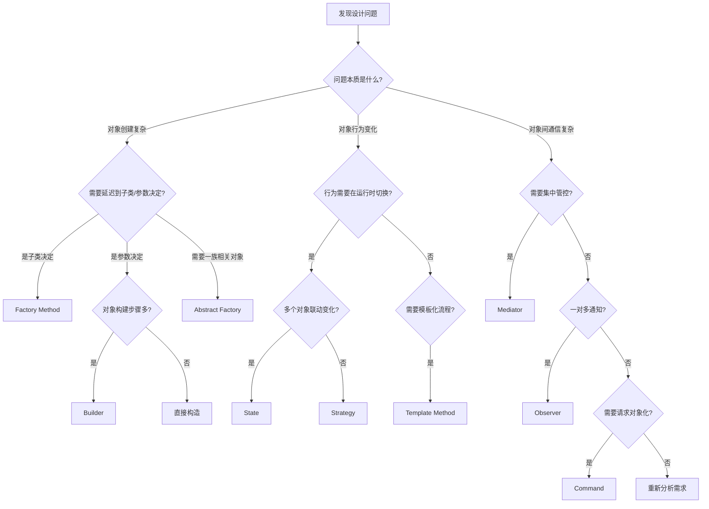
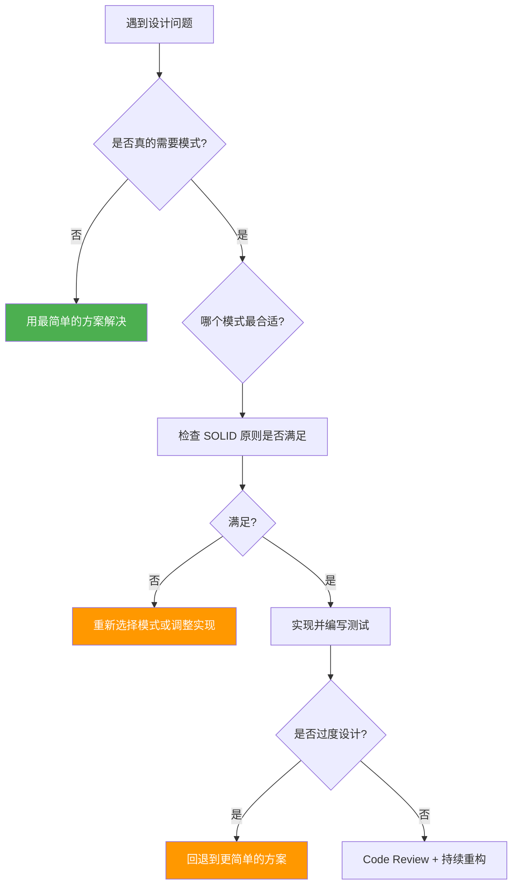

## 设计模式的十大常见误区

> "The purpose of abstraction is not to be vague, but to create a new semantic level at which one can be entirely precise." — Edgar Dijkstra

设计模式是经过数十年工业实践验证的解决方案，但它们也是一把双刃剑。**错误地使用设计模式往往比不使用模式造成的危害更大**——它不仅增加了代码复杂度，还让团队产生"我用了模式所以设计很优雅"的错觉。

本节系统梳理设计模式学习和实践中的十大常见误区，帮助读者建立正确的模式应用观。每个误区都包含：症状识别 → 根因分析 → 代价评估 → 正确做法 → 代码对比，确保你能真正理解"何时用、如何用、以及何时**不用**"。

**十大误区全景图：**



---

### 误区一：为了模式而模式（Pattern Fever）

**症状**：拿到任何问题，第一反应就是"套一个设计模式"。系统只有三种日志输出方式，却硬要实现完整的 Abstract Factory + Strategy + Singleton 三件套；一个简单的配置读取，也要搞出 Builder + Proxy + Observer。

**根因**：对设计模式的崇拜心理，认为"用了模式 = 架构优雅"。这种心理在初学者和刚学完设计模式的开发者中尤为普遍——就像刚学会锤子的人，看什么都像钉子。GOF 原书明确指出："Design patterns should be used only when simplicity and flexibility are needed."（设计模式只在需要简洁和灵活性时使用。）

**代价**：

| 场景 | 过度使用模式的代价 | 正确做法 |
|------|---------------------|----------|
| 简单日志输出 | 3层抽象，10个类，新人需要30分钟理解 | 1个函数，5行代码 |
| 配置读取 | Builder + Proxy，无法直接调试 | 一个 `load_config()` 函数 |
| 用户校验 | Strategy + Chain of Responsibility | 一个 `if-else` 或简单的校验函数 |
| 数据格式转换 | Abstract Factory + Builder + Template Method | 一个 `convert()` 函数 |

**判定准则**：问自己三个问题——

1. 不用模式，这段代码能否在 20 行以内清晰解决？
2. 未来半年内，这段代码的需求是否可能变化？
3. 引入模式后，维护成本是否真正降低？

如果两个以上答案是否定的，就不要用模式。

```python
# ❌ 反面教材：用 Strategy 模式实现简单的折扣计算
from abc import ABC, abstractmethod

class DiscountStrategy(ABC):
    @abstractmethod
    def calculate(self, price: float) -> float:
        pass

class NoDiscount(DiscountStrategy):
    def calculate(self, price: float) -> float:
        return price

class PercentageDiscount(DiscountStrategy):
    def __init__(self, percent: float):
        self.percent = percent
    def calculate(self, price: float) -> float:
        return price * (1 - self.percent / 100)

class FixedDiscount(DiscountStrategy):
    def __init__(self, amount: float):
        self.amount = amount
    def calculate(self, price: float) -> float:
        return max(0, price - self.amount)

# 调用方
def get_discounted_price(price: float, strategy: DiscountStrategy) -> float:
    return strategy.calculate(price)

# 实际上只需要：
def get_discounted_price_v2(price: float, discount_type: str, value: float = 0) -> float:
    if discount_type == "percent":
        return price * (1 - value / 100)
    elif discount_type == "fixed":
        return max(0, price - value)
    return price
# 第二种方案 7 行搞定，第一种需要 4 个类 + 30 行代码
```

**正确做法**：遵循 YAGNI（You Aren't Gonna Need It）原则——不要为假想的未来需求过度设计。当代码确实出现重复、变化点明确、且影响范围达到 3 处以上时，再引入模式重构。Martin Fowler 的 "Rule of Three" 是一个实用的准则：**第三次出现重复时才重构**，前两次先忍住。

---

### 误区二：Singleton 滥用（万能单例）

**症状**：几乎所有的工具类、服务类、配置类都设计成 Singleton，项目中 Singleton 数量超过 10 个。有些团队甚至把 Singleton 作为默认的类创建方式。

**为什么这是个问题**：

1. **隐式全局状态**：Singleton 本质上是全局变量的面向对象封装。全局状态让代码之间的依赖关系变得不可见，任何地方都可以读写同一份数据，形成隐式耦合。
2. **测试地狱**：Singleton 在测试之间共享状态，导致测试用例相互干扰。前一个测试修改了 Singleton 的内部状态，下一个测试拿到的就是脏数据。测试执行顺序不同，结果也不同——这是测试工程中的噩梦。
3. **并发瓶颈**：多线程环境下，Singleton 的线程安全实现（双重检查锁、类级别锁等）会引入性能开销，且实现细节容易出错。
4. **违背依赖倒置原则（DIP）**：Singleton 直接暴露实现细节，调用方无法替换为测试替身。

```java
// ❌ 典型的 Singleton 滥用
public class DatabaseService {
    private static DatabaseService instance;
    private Connection connection;

    private DatabaseService() {
        connection = DriverManager.getConnection("jdbc:mysql://localhost/mydb");
    }

    public static synchronized DatabaseService getInstance() {
        if (instance == null) {
            instance = new DatabaseService();
        }
        return instance;
    }

    // 所有方法直接操作内部 connection
    public ResultSet query(String sql) { ... }
    public int update(String sql) { ... }
}

// ❌ 测试中无法 mock
class UserServiceTest {
    @Test
    void testGetUser() {
        // 无法替换为内存数据库或 mock 对象
        // 测试依赖真实的 MySQL 连接
        DatabaseService db = DatabaseService.getInstance();
        // 如果数据库不可用，测试直接失败
    }
}
```

**正确做法**：

| 替代方案 | 适用场景 | 优势 |
|----------|----------|------|
| 依赖注入（DI） | 需要可替换实现的场景 | 可测试、可替换、依赖清晰 |
| 模块级变量（Python） | 确实需要全局共享的状态 | 简单直接，没有类的开销 |
| 上下文管理器 | 需要共享资源生命周期 | 自动清理，不泄漏 |
| 真正的 Singleton（极少） | 配置中心、线程池等基础设施 | 仅在有明确唯一性需求时使用 |

```python
# ✅ 依赖注入替代 Singleton
class DatabaseService:
    def __init__(self, connection_string: str):
        self.connection = create_connection(connection_string)

class UserService:
    def __init__(self, db: DatabaseService):  # 注入依赖
        self.db = db

    def get_user(self, user_id: int) -> User:
        return self.db.query(f"SELECT * FROM users WHERE id = {user_id}")

# 生产环境
db = DatabaseService("mysql://localhost/mydb")
service = UserService(db)

# 测试环境
mock_db = MockDatabaseService()  # 内存数据库或 mock
test_service = UserService(mock_db)
# 测试不再依赖外部数据库
```

**何时可以使用 Singleton**：日志框架的 Logger、数据库连接池、配置管理器——这些确实需要全局唯一实例。但即便如此，也应优先通过 DI 容器管理其生命周期，而非手写 Singleton。现代框架（Spring、.NET Core、Python 的 dependency-injector）都提供了容器管理的单例，既保证全局唯一性，又保留了可测试性。

---

### 误区三：继承滥用（Inheritance Abuse）

**症状**：类继承链超过 3 层，父类修改一行代码导致十几个子类行为异常。或者为了复用代码而创建深层继承层次，结果修改父类时牵一发而动全身。

**核心原则**：**组合优于继承**（Composition over Inheritance）。这条原则被反复强调，但实际项目中继承滥用仍然极为普遍，因为继承是大多数语言中最直觉的代码复用方式。

**继承的真实问题**：

```java
// ❌ 继承链过长
class Animal { ... }                        // 30个方法
class Mammal extends Animal { ... }          // 覆盖/扩展5个方法
class Dog extends Mammal { ... }             // 覆盖3个方法
class ServiceDog extends Dog { ... }         // 覆盖2个方法
class GuideDog extends ServiceDog { ... }    // 覆盖1个方法

// 现在 Animal 父类新增一个方法 move()，
// 所有子类都继承了这个方法，包括那些不应该移动的子类（如 RobotAnimal）
// 修改父类 = 炸弹
```

**继承的四大陷阱**：

1. **脆弱基类问题（Fragile Base Class）**：基类的微小改动可能在子类中产生意想不到的行为变化，且编译器不会报错。这是面向对象设计中最著名的反模式之一，Barbara Liskov 在 1988 年就提出了警告。
2. **紧耦合**：子类与父类的实现细节深度绑定，父类重构直接破坏子类。子类甚至需要知道父类的内部实现才能正确覆盖方法。
3. **继承层次过深**：超过 3 层继承链，代码可读性和可维护性急剧下降。新加入团队的成员需要理解整个继承层次才能修改一个方法。
4. **多重继承困境**：Java/C# 不支持多重继承，导致需要通过接口 + 默认实现（Mixin）等变通方案，增加了复杂度。Python 支持多重继承但菱形继承问题更难调试。

**正确做法**：优先使用组合（Composition）+ 接口（Interface）：

```python
# ✅ 使用组合 + 策略替代继承
from abc import ABC, abstractmethod

# 行为通过接口定义，而非继承
class MovementStrategy(ABC):
    @abstractmethod
    def move(self) -> str: ...

class WalkMovement(MovementStrategy):
    def move(self) -> str:
        return "行走移动"

class SwimMovement(MovementStrategy):
    def move(self) -> str:
        return "水中游泳"

class FlyMovement(MovementStrategy):
    def move(self) -> str:
        return "空中飞行"

# 组合：动物拥有行为，而非继承行为
class Animal:
    def __init__(self, name: str, movement: MovementStrategy):
        self.name = name
        self.movement = movement  # 组合

    def perform_move(self) -> str:
        return f"{self.name}正在{self.movement.move()}"

# 创建各种动物，无需继承链
dog = Animal("导盲犬", WalkMovement())
duck = Animal("鸭子", SwimMovement())
eagle = Animal("鹰", FlyMovement())
duck_dog = Animal("可凫水犬", WalkMovement())  # 可以自由组合

# 运行时动态改变行为
dog.movement = SwimMovement()  # 狗学会了游泳！
```

**何时继承是合理的**：当你确实在建模"is-a"关系，且继承层次不超过 2-3 层时。典型场景：模板方法模式中的算法骨架、抽象类提供默认实现。但即便如此，也应该遵循 Liskov 替换原则——子类必须能在任何使用父类的地方正确替换父类。

**实用判断标准**：

| 条件 | 推荐方式 | 原因 |
|------|----------|------|
| "has-a" 关系（动物有移动能力） | 组合 + 接口 | 灵活、可运行时替换 |
| "is-a" 关系且不超过 2 层 | 继承 | 直觉清晰、代码简洁 |
| 需要运行时切换行为 | 组合 + 策略 | 继承是编译时确定的 |
| 需要跨类层次复用代码 | Mixin 或工具函数 | 避免创建不自然的继承关系 |

---

### 误区四：God Object（上帝对象）

**症状**：一个类承担了过多职责，文件超过 1000 行，包含 50+ 个方法，既负责业务逻辑、又处理数据持久化、还管理缓存和日志。

**为什么常见**：单人开发时效率高——所有逻辑集中在一个类中，不需要到处跳转。但随着项目增长，这个类就成了定时炸弹。God Object 通常是渐进式形成的：每次加一个"小功能"都不觉得多，日积月累就变成了不可维护的巨石类。

**与 SRP（单一职责原则）的矛盾**：SRP 要求一个类只有一个变化的理由（只有一个引起它变化的原因）。God Object 通常有 5 个以上的变化理由——业务规则变化要改它、数据库 schema 变化要改它、通知方式变化要改它、缓存策略变化也要改它。

# ❌ 典型的 God Object
class OrderService:
    def create_order(self, ...)         # 业务逻辑
    def validate_order(self, ...)       # 参数校验
    def calculate_price(self, ...)      # 价格计算
    def apply_discount(self, ...)       # 折扣逻辑
    def save_to_database(self, ...)     # 数据持久化
    def update_inventory(self, ...)     # 库存管理
    def send_confirmation_email(self, ...) # 邮件通知
    def process_payment(self, ...)      # 支付处理
    def generate_invoice(self, ...)     # 发票生成
    def log_operation(self, ...)        # 日志记录
    def cache_result(self, ...)         # 缓存管理
    def notify_warehouse(self, ...)     # 仓储通知
    # ... 50+ 个方法

**正确做法**：按照职责拆分为多个协作的类：

```python
# ✅ 职责拆分
class OrderValidator:
    """负责订单校验"""
    def validate(self, order: Order) -> ValidationResult: ...

class PriceCalculator:
    """负责价格计算"""
    def calculate(self, order: Order) -> PriceResult: ...

class OrderRepository:
    """负责数据持久化"""
    def save(self, order: Order) -> None: ...

class NotificationService:
    """负责通知"""
    def send_confirmation(self, order: Order) -> None: ...

class OrderService:
    """订单编排器：协调各服务，不含业务逻辑"""
    def __init__(
        self,
        validator: OrderValidator,
        calculator: PriceCalculator,
        repository: OrderRepository,
        notifier: NotificationService,
    ):
        self._validator = validator
        self._calculator = calculator
        self._repository = repository
        self._notifier = notifier

    def create_order(self, request: CreateOrderRequest) -> Order:
        # 编排流程，不含具体逻辑
        order = Order.from_request(request)
        self._validator.validate(order)
        price = self._calculator.calculate(order)
        order.set_price(price)
        self._repository.save(order)
        self._notifier.send_confirmation(order)
        return order
# OrderService 从 1000 行缩减到 30 行
# 每个类都可以独立测试
```

**如何识别 God Object**：代码审查时关注以下信号——类名中包含 `Manager`、`Service`、`Handler`、`Processor` 等万能词但实际做了不相关的事情；修改一个功能时需要理解整个类的代码；类的单元测试文件比业务代码还长；团队中没有人能完整说出这个类的所有职责。

---

### 误区五：观察者模式的内存泄漏

**症状**：使用 Observer 模式后，系统内存持续增长，GC 频繁但回收不到内存，最终 OOM（OutOfMemoryError）。这在长时间运行的应用（Web 服务器、桌面应用）中尤为常见。

**根因**：Observer 和 Subject 之间形成双向引用，导致垃圾回收器无法回收。即使观察者已经不再需要，Subject 仍持有对它的引用。在 Java 中，内部类隐式持有外部类引用，使得泄漏更加隐蔽。

```python
# ❌ 内存泄漏：Subject 持有 observer 引用，即使 observer 已"无用"
class EventBus:
    def __init__(self):
        self._handlers = {}  # event_type -> [handler, ...]

    def subscribe(self, event_type: str, handler):
        self._handlers.setdefault(event_type, []).append(handler)
        # handler 是一个绑定方法，持有对象实例的引用
        # 如果对象被销毁前没有 unsubscribe，引用链就断不掉

    def publish(self, event_type: str, data):
        for handler in self._handlers.get(event_type, []):
            handler(data)

class OrderProcessor:
    def __init__(self, event_bus: EventBus):
        self.event_bus = event_bus
        event_bus.subscribe("order.created", self.handle_created)

    def handle_created(self, data):
        print(f"处理订单: {data}")

# ❌ 如果 OrderProcessor 对象不再使用但没有 unsubscribe，
# EventBus 永远持有它的引用，GC 无法回收
```

**正确做法**：

```python
# ✅ 使用弱引用（Weak Reference）自动清理
import weakref

class SafeEventBus:
    def __init__(self):
        self._handlers = {}  # event_type -> [weakref, ...]

    def subscribe(self, event_type: str, handler):
        # 使用弱引用，当 handler 对象被销毁时自动清除
        ref = weakref.WeakMethod(handler, self._on_handler_destroyed)
        self._handlers.setdefault(event_type, []).append(ref)

    def _on_handler_destroyed(self, ref):
        """弱引用被回收时的回调，清理引用列表"""
        for event_type, handlers in self._handlers.items():
            self._handlers[event_type] = [h for h in handlers if h is not ref]

    def publish(self, event_type: str, data):
        alive_handlers = []
        for ref in self._handlers.get(event_type, []):
            handler = ref()  # 解引用，如果对象已销毁返回 None
            if handler is not None:
                handler(data)
                alive_handlers.append(ref)
        self._handlers[event_type] = alive_handlers
```

**其他防泄漏策略**：

| 策略 | 实现方式 | 优点 | 缺点 |
|------|----------|------|------|
| 弱引用（Weak Reference） | `weakref.WeakMethod` / `WeakReference` | 自动清理，无需手动管理 | 回调函数中需要检查引用是否存活 |
| 手动注销 | 在析构函数或 `__del__` 中调用 `unsubscribe` | 明确的生命周期控制 | 依赖 GC 调用时机，不可靠 |
| 生命周期绑定 | 将 Observer 与上下文绑定（HTTP 请求、UI 窗口） | 上下文结束时自动清理 | 需要框架支持 |
| 事件总线中间件 | 框架层面提供自动清理（Android `LiveData`、Vue `$on('$destroy', ...)`） | 开箱即用 | 依赖特定框架 |

**实际经验**：在 Java 中，使用 `WeakHashMap` 作为事件订阅表；在 C# 中，使用 `WeakEventManager`；在 Python 中，使用上面演示的 `weakref.WeakMethod`。无论哪种语言，**订阅即负责**（subscribe = own the lifecycle）应该成为团队的编码规范。

---

### 误区六：策略模式导致类爆炸

**症状**：每增加一种策略就新建一个类，半年后项目中出现了 50+ 个策略类，文件数爆炸式增长，但每个类只有 10-20 行代码。IDE 的项目导航变成了一场噩梦。

**根因**：将策略模式机械地理解为"每种策略一个类"，忽略了函数式编程提供的更简洁的替代方案。GOF 时代的语言（C++、Java 1.4）确实需要为每个策略创建类，但现代语言有了更好的选择。

```python
# ❌ 类爆炸：20 种支付方式 = 20 个类
class PaymentStrategy(ABC):
    @abstractmethod
    def pay(self, amount: float) -> bool: ...

class AlipayStrategy(PaymentStrategy):
    def pay(self, amount): return alipay.charge(amount)

class WechatPayStrategy(PaymentStrategy):
    def pay(self, amount): return wechat.charge(amount)

class UnionPayStrategy(PaymentStrategy):
    def pay(self, amount): return union.charge(amount)

class CreditCardStrategy(PaymentStrategy):
    def pay(self, amount): return credit.pay(amount)
# ... 还有 16 个
```

**正确做法**：当策略逻辑简单时，使用函数或字典映射：

```python
# ✅ 函数式策略：简洁、灵活、易扩展
def pay_alipay(amount: float) -> bool:
    return alipay.charge(amount)

def pay_wechat(amount: float) -> bool:
    return wechat.charge(amount)

def pay_union(amount: float) -> bool:
    return union.charge(amount)

# 策略注册表
STRATEGIES = {
    "alipay": pay_alipay,
    "wechat": pay_wechat,
    "union": pay_union,
}

def pay(amount: float, method: str) -> bool:
    strategy = STRATEGIES.get(method)
    if not strategy:
        raise ValueError(f"不支持的支付方式: {method}")
    return strategy(amount)

# 扩展新策略只需要添加一个函数 + 一行注册，无需新类
def pay_crypto(amount: float) -> bool:
    return crypto.charge(amount)

STRATEGIES["crypto"] = pay_crypto  # 一行搞定
```

**进阶：装饰器 + 注册表的自动化方案**——当策略数量非常多时，可以用装饰器自动注册，连手动添加到字典都省了：

```python
# ✅ 自动注册策略
STRATEGIES = {}

def register_strategy(name):
    """装饰器：自动将函数注册为策略"""
    def decorator(func):
        STRATEGIES[name] = func
        return func
    return decorator

@register_strategy("alipay")
def pay_alipay(amount: float) -> bool:
    return alipay.charge(amount)

@register_strategy("wechat")
def pay_wechat(amount: float) -> bool:
    return wechat.charge(amount)

# 新增策略只需加装饰器，STRATEGIES 字典完全不用管
@register_strategy("crypto")
def pay_crypto(amount: float) -> bool:
    return crypto.charge(amount)
```

**何时用类、何时用函数**：

| 条件 | 选择 | 原因 |
|------|------|------|
| 策略需要持有状态 | 类 | 函数不便于持有复杂状态 |
| 策略逻辑超过 50 行 | 类 | 可读性和可维护性更好 |
| 策略数量超过 15 个 | 函数 + 注册表 | 避免类爆炸 |
| 策略需要被测试替身 mock | 类或注入的函数 | 均可，取决于测试框架 |
| 策略之间有层级关系（如不同支付渠道的通用流程） | 类 + 继承 | 利用模板方法共享公共逻辑 |

---

### 误区七：错误地选择设计模式

**症状**：用错模式导致代码更难维护。典型例子：用 Observer 替代 Command，用 Singleton 替代 DI，用 Decorator 替代 Strategy。模式选择错误比不使用模式更糟糕，因为它引入了不必要的复杂度却没解决问题。

**常见错误选择对照表**：

| 误选模式 | 实际需求 | 正确选择 | 判断依据 |
|----------|----------|----------|----------|
| Singleton | 需要全局共享的可替换服务 | 依赖注入（DI） | 服务需要可测试、可替换 |
| Observer | 需要请求排队和撤销 | Command | 需要记录操作历史、支持 undo/redo |
| Decorator | 需要在运行时切换算法 | Strategy | 职责不同：Decorator 增强行为，Strategy 替换行为 |
| Composite | 需要扁平的菜单结构 | 简单的列表/数组 | 树形结构才需要 Composite |
| Proxy | 需要延迟加载大对象 | 延迟初始化（Lazy Init） | 代理引入额外抽象层，大材小用 |
| Factory Method | 对象创建逻辑很简单 | 直接调用构造函数 | 工厂的目的是解耦创建逻辑 |
| Observer | 需要同步通知并等待结果 | Mediator 或直接调用 | Observer 是异步松耦合的，不适合同步流程 |

**判断流程图**：



**实际决策框架**：在选择模式之前，先回答三个问题：

1. **问题的本质是什么？**（创建？行为？通信？结构？）
2. **约束条件是什么？**（性能？可测试性？团队熟悉度？语言特性？）
3. **复杂度预算允许吗？**（这个模式引入的抽象层是否值得？）

如果对第三个问题有犹豫，选择更简单的方案。

---

### 误区八：装饰器模式的层层嵌套

**症状**：为了给对象添加多个功能，使用 Decorator 层层嵌套，最终调用栈深达 10+ 层，调试时完全无法定位问题所在。单元测试也变得极其困难——你需要构造嵌套的装饰器链才能测试一个方法。

```python
# ❌ 装饰器地狱
class BaseLogger:
    def log(self, msg): print(msg)

class TimestampDecorator:
    def __init__(self, logger): self._logger = logger
    def log(self, msg): self._logger.log(f"[{timestamp()}] {msg}")

class LevelDecorator:
    def __init__(self, logger): self._logger = logger
    def log(self, msg): self._logger.log(f"[INFO] {msg}")

class FormatDecorator:
    def __init__(self, logger): self._logger = logger
    def log(self, msg): self._logger.log(f"=== {msg} ===")

class FileDecorator:
    def __init__(self, logger): self._logger = logger
    def log(self, msg):
        self._logger.log(msg)
        with open("log.txt", "a") as f: f.write(msg + "\n")

class FilterDecorator:
    def __init__(self, logger, pattern): self._logger = logger; self._pattern = pattern
    def log(self, msg):
        if re.match(self._pattern, msg):
            self._logger.log(msg)

class EncryptDecorator:
    def __init__(self, logger): self._logger = logger
    def log(self, msg): self._logger.log(encrypt(msg))

# 调用时的嵌套地狱：
logger = EncryptDecorator(
    FilterDecorator(
        FileDecorator(
            FormatDecorator(
                LevelDecorator(
                    TimestampDecorator(
                        BaseLogger()
                    )
                )
            ),
            pattern=".*ERROR.*"
        )
    )
)
# 调试时需要逐层追踪 7 个 log 方法
```

**正确做法**：使用管道（Pipeline）模式替代，或将功能扁平化：

```python
# ✅ 扁平化的日志管道
class LogPipeline:
    def __init__(self):
        self._processors = []  # 所有处理器在一个列表中
        self._output = None

    def add_processor(self, processor):
        self._processors.append(processor)
        return self  # 支持链式调用

    def set_output(self, output):
        self._output = output
        return self

    def log(self, msg):
        # 扁平处理，不是层层嵌套
        for processor in self._processors:
            msg = processor.process(msg)
        if self._output:
            self._output.write(msg)

# 使用：清晰的线性流程
logger = (LogPipeline()
    .add_processor(TimestampProcessor())
    .add_processor(LevelProcessor())
    .add_processor(FormatProcessor())
    .add_processor(FilterProcessor(pattern=".*ERROR.*"))
    .set_output(FileOutput("log.txt")))

logger.log("Server started")
# 每一步都可以单独调试，不需要追踪嵌套调用栈
```

**装饰器 vs 管道 vs 中间件的选择**：

| 方案 | 适用场景 | 调试难度 | 灵活性 |
|------|----------|----------|--------|
| 装饰器嵌套 | 功能层 3 个以内 | 中等 | 编译时确定 |
| 管道（Pipeline） | 功能层 3-10 个 | 低（线性流程） | 运行时可配置 |
| 中间件（Middleware） | Web 框架、消息处理 | 低 | 最高，支持异步 |

当装饰器超过 3 层时，就是重构的信号。

---

### 误区九：忽略线程安全

**症状**：在单线程下运行完美的设计模式，部署到多线程环境后出现数据竞争、状态不一致、偶发性崩溃。这类 bug 往往极难复现，因为它们取决于线程调度的时序。

**高危模式清单**：

| 模式 | 常见线程安全问题 | 典型错误 |
|------|------------------|----------|
| Singleton | 双重检查锁定失效 | 忘记 `volatile` 或使用了非原子操作 |
| Observer | 遍历 handler 列表时修改列表 | 发布事件时并发 subscribe/unsubscribe |
| Strategy | 共享策略实例的内部状态被并发修改 | 多个请求共用同一个 Strategy 对象 |
| Builder | build() 被多线程调用 | 建造过程中的临时状态被竞争 |
| State | 状态转换的原子性 | 状态检查和转换之间被打断（TOCTOU） |
| Flyweight | 共享对象被并发修改 | 多个线程同时修改 Flyweight 的内部状态 |

```python
# ❌ Observer 模式的线程安全问题
class EventBus:
    def __init__(self):
        self._handlers = {}

    def subscribe(self, event_type, handler):
        self._handlers.setdefault(event_type, []).append(handler)

    def publish(self, event_type, data):
        # 线程A正在遍历
        for handler in self._handlers.get(event_type, []):
            handler(data)
        # 线程B同时调用了 subscribe，修改了列表
        # → RuntimeError: dictionary changed size during iteration
```

**正确做法**：

```python
# ✅ 线程安全的 EventBus
import threading

class ThreadSafeEventBus:
    def __init__(self):
        self._handlers = {}
        self._lock = threading.RLock()

    def subscribe(self, event_type, handler):
        with self._lock:
            self._handlers.setdefault(event_type, []).append(handler)

    def unsubscribe(self, event_type, handler):
        with self._lock:
            if event_type in self._handlers:
                self._handlers[event_type].remove(handler)

    def publish(self, event_type, data):
        # 关键：在锁内复制列表，锁外执行回调
        # 避免回调中调用 subscribe/unsubscribe 导致死锁
        with self._lock:
            handlers = list(self._handlers.get(event_type, []))
        for handler in handlers:
            handler(data)
```

**其他线程安全准则**：

1. **最小锁粒度**：只锁必要的代码段，不要把整个方法都锁住。锁的范围越大，性能损失越大，死锁风险越高。
2. **避免死锁**：多个锁按固定顺序获取，或使用 `RLock`（可重入锁）。记录所有锁的获取顺序，并在代码审查时检查。
3. **不可变对象优先**：策略对象如果没有状态，天然线程安全。优先设计无状态的策略类。
4. **使用线程安全容器**：`threading.local()`（线程局部变量）、`collections.deque`（线程安全的双端队列）、`queue.Queue`（线程安全的队列）。
5. **Copy-on-Read 模式**：如上面的 EventBus 示例，在锁内复制数据结构，锁外执行操作，既保证一致性又减少锁持有时间。

---

### 误区十：脱离 SOLID 原则使用模式

**症状**：表面上使用了设计模式，但违反了 SOLID 原则，模式反而成了掩盖设计问题的"遮羞布"。这是最隐蔽的误区——代码看起来"很模式化"，但根本原则是错的。

**典型违反场景**：

**1. 违反 SRP（单一职责原则）——Facade 变成 God Object**

```python
# ❌ Facade 承担了过多职责
class ECommerceFacade:
    def create_order(self, ...): ...        # 订单逻辑
    def process_payment(self, ...): ...     # 支付逻辑
    def manage_inventory(self, ...): ...    # 库存逻辑
    def send_notifications(self, ...): ...  # 通知逻辑
    def generate_reports(self, ...): ...    # 报表逻辑
    def handle_returns(self, ...): ...      # 退换货逻辑
# Facade 的目的是简化子系统访问，不是替代所有子系统
```

**2. 违反 OCP（开闭原则）——Strategy 中充满 if-else**

```python
# ❌ 伪 Strategy：看似用模式，实则硬编码
class PaymentProcessor:
    def process(self, method: str, amount: float):
        if method == "alipay":
            return self._alipay(amount)
        elif method == "wechat":
            return self._wechat(amount)
        elif method == "union":
            return self._union(amount)
        # 每次新增支付方式都要修改这个方法
        # 违反 OCP：对扩展关闭，对修改开放
```

**3. 违反 LSP（里氏替换原则）——子类无法正确替换父类**

```python
# ❌ 正方形/长方形问题
class Rectangle:
    def set_width(self, w): self.width = w
    def set_height(self, h): self.height = h
    def area(self): return self.width * self.height

class Square(Rectangle):
    def set_width(self, w):
        self.width = w
        self.height = w  # 强制修改高度
    def set_height(self, h):
        self.width = h   # 强制修改宽度
        self.height = h

# 期望：Square 可以在任何使用 Rectangle 的地方正常工作
def double_area(rect: Rectangle):
    rect.set_width(5)
    rect.set_height(10)
    return rect.area()  # 期望 50

double_area(Rectangle())  # → 50 ✓
double_area(Square())     # → 100 ✗ (正方形的宽高都被强制设为10)
# Square 不是 Rectangle 的合法替换
```

**SOLID 校验清单**——每个设计模式应用后对照检查：

| 原则 | 校验问题 | 不通过的信号 |
|------|----------|--------------|
| **SRP** | 这个类/模块是否只有一个变化的理由？ | 修改一个功能会影响其他不相关功能 |
| **OCP** | 新增功能时是否需要修改已有代码？ | 每次扩展都要改 switch/if-else |
| **LSP** | 子类能否在任何使用父类的地方无缝替换？ | 替换后行为发生了变化 |
| **ISP** | 接口是否最小化？实现类是否需要实现不需要的方法？ | 有空方法体或抛出 `NotImplementedError` |
| **DIP** | 高层模块是否依赖低层模块的抽象？ | 直接 `new` 具体类，无法注入测试替身 |

---

### 总结：设计模式应用的核心原则



**五个核心原则**：

1. **KISS**（Keep It Simple, Stupid）——能用简单方案解决的问题，不要用设计模式。复杂度是软件开发的最大敌人，每引入一层抽象都要有充分的理由。
2. **YAGNI**（You Aren't Gonna Need It）——不要为假想的未来需求过度设计。今天写的代码，60% 的可能性在未来会被重写或删除。
3. **SOLID**——使用模式时必须同时满足五大设计原则，否则模式就是负担。模式是手段，SOLID 才是目的。
4. **组合优于继承**——优先使用接口 + 组合，避免深层继承链。组合提供运行时灵活性，继承只提供编译时复用。
5. **适度重构**——先写简单的代码，等复杂度真正出现时再引入模式重构（Martin Fowler 的 "Rule of Three"：第三次出现重复时才重构）。

**设计模式不是银弹**。它的价值在于提供了一种共享的设计词汇和经过验证的解决方案，但只有在正确的时间、正确的场景下使用，才能真正发挥价值。正如 Martin Fowler 所言："Any fool can write code that a computer can understand. Good programmers write code that humans can understand."——设计模式的目标不是让代码"看起来高级"，而是让代码**更容易被人类理解、维护和扩展**。
