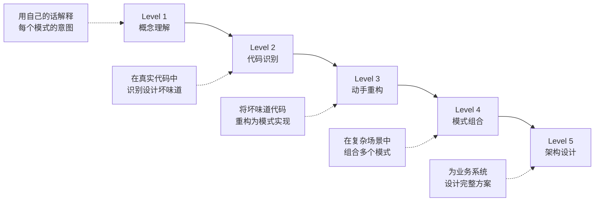
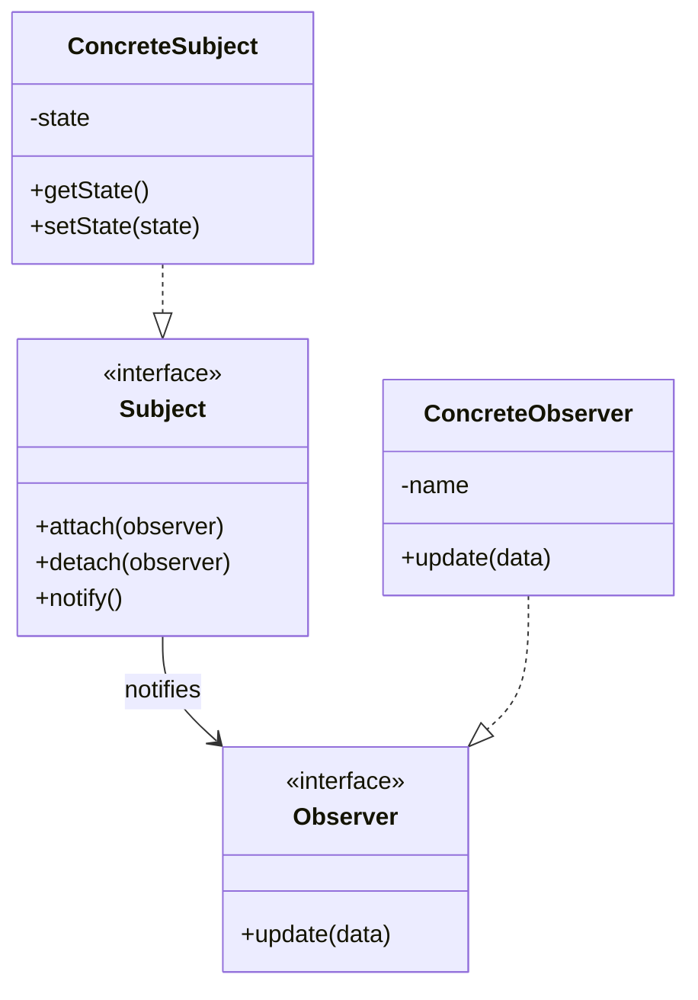
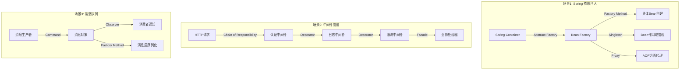
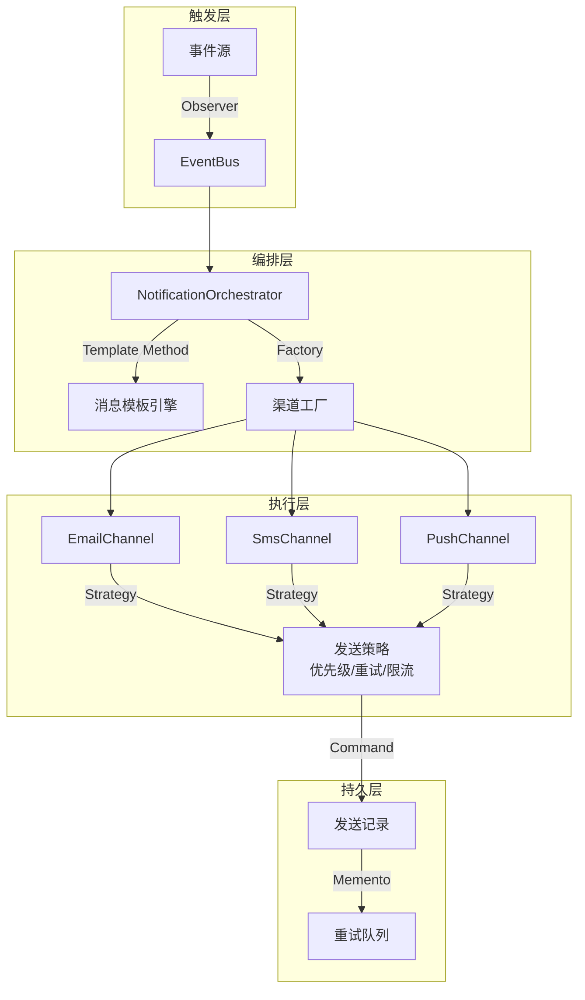
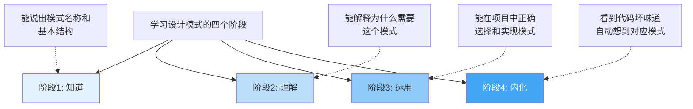

## 练习方法：从"知道"到"内化"的刻意练习路径

设计模式的掌握不能停留在"理解概念"层面，必须通过系统化的刻意练习，将知识转化为编码直觉。Anders Ericsson 的刻意练习理论指出：只有在舒适区之外、有明确目标、即时反馈的条件下反复练习，才能建立真正的专家级能力。

本节设计了一条由浅入深的练习路径，覆盖五个层级：概念理解 → 代码识别 → 动手重构 → 模式组合 → 架构设计。每个练习都有明确的目标、步骤、代码示例和检查标准。



---

### 练习一：概念理解 — 画出模式的"骨架"（预计30分钟）

**目标**：脱离文档，能够独立画出每个核心模式的类图/结构图，并用自己的话解释"为什么需要这个模式"。

**核心理念**：如果你无法用一句话说清一个模式解决了什么问题，说明你还没有真正理解它。

**步骤**：

**1.1 意图卡片法（10分钟）**

为以下6个最常用模式各写一张"意图卡片"，格式固定：

| 模式 | 一句话意图 | 解决的问题 | 违反的原则 |
|------|-----------|-----------|-----------|
| Strategy | 把算法封装成可互换的对象 | if-else堆砌，算法无法运行时切换 | OCP |
| Observer | 一对多通知，状态变化自动广播 | 通知逻辑散落在被通知方 | SRP |
| Decorator | 动态给对象贴"功能标签" | 子类爆炸式扩展 | OCP + 组合优于继承 |
| Factory Method | 让子类决定创建什么对象 | 框架不知道具体类型 | DIP |
| Adapter | 做接口翻译官 | 第三方接口与系统不兼容 | ISP |
| Facade | 给复杂子系统一个简单入口 | 外部调用者不需要了解内部细节 | - |

```python
# 用代码验证你的理解：Strategy模式的意图卡片
# 意图：封装算法族，使它们可以互相替换
# 问题：排序算法有多种，如果在业务代码中 if/elif 切换，每次新增算法都要改业务代码

# === 错误示范：算法与业务耦合 ===
def sort_data(data, algorithm):
    if algorithm == "quicksort":
        return quicksort(data)
    elif algorithm == "mergesort":
        return mergesort(data)
    elif algorithm == "timsort":
        return timsort(data)
    # 每新增一种排序都要来这里加 elif ...

# === 正确示范：Strategy模式 ===
from abc import ABC, abstractmethod

class SortStrategy(ABC):
    @abstractmethod
    def sort(self, data: list) -> list: ...

class QuickSort(SortStrategy):
    def sort(self, data: list) -> list:
        return sorted(data)  # 简化示例

class MergeSort(SortStrategy):
    def sort(self, data: list) -> list:
        return sorted(data)

class TimSort(SortStrategy):
    def sort(self, data: list) -> list:
        return sorted(data)

# 业务代码与具体算法解耦
def process_data(data: list, strategy: SortStrategy):
    sorted_data = strategy.sort(data)
    return sorted_data

# 运行时切换算法，零修改业务代码
result = process_data([3, 1, 2], QuickSort())
```

**1.2 手绘类图（10分钟）**

不看参考书，为以下3个模式手画类图（或用 Mermaid）：



要求标注：接口/抽象类用斜体或 `<<interface>>`，箭头方向正确，多重度（一对多/多对多）标清。

**1.3 概念自测（10分钟）**

回答以下问题（不看答案），检验理解深度：

1. Decorator 和 Proxy 的结构几乎一样，它们的区别在哪？（提示：Intent 不同 — Decorator 是"增加功能"，Proxy 是"控制访问"）
2. Abstract Factory 和 Factory Method 的关系是什么？（提示：Abstract Factory 内部通常包含多个 Factory Method）
3. Command 模式和 Strategy 模式的区别？（提示：Command 封装的是"动作"，有 undo/redo 能力；Strategy 封装的是"算法"，可互换但不保留历史）
4. 什么时候用 Observer，什么时候用 Mediator？（提示：Observer 是去中心化广播，Mediator 是中心化协调）

**检查标准**：
- [ ] 6个意图卡片填写完整，一句话意图准确
- [ ] 3个类图画出核心参与者和关系
- [ ] 自测问题能回答3个以上

---

### 练习二：代码识别 — 在真实代码中"找坏味道"（预计45分钟）

**目标**：培养"代码嗅觉"——看到一段代码，能迅速判断它违反了什么原则、应该用什么模式重构。

**核心理念**：设计模式的起点不是"我要用 Strategy"，而是"这段代码有问题"。识别坏味道是第一步。

**步骤**：

**2.1 坏味道识别训练（15分钟）**

阅读以下代码片段，识别其中的设计坏味道，并说出应该用哪个模式重构：

```python
# === 代码片段 A ===
class NotificationService:
    def send(self, user, message, type):
        if type == "email":
            # 邮件发送逻辑（50行）
            smtp = smtplib.SMTP("smtp.example.com")
            ...
        elif type == "sms":
            # 短信发送逻辑（50行）
            client = SmsClient("api.sms.com")
            ...
        elif type == "push":
            # 推送逻辑（50行）
            firebase = FirebaseAdmin()
            ...
        elif type == "wechat":
            # 微信消息逻辑（50行）
            ...
        # 违反：OCP（每次新增通知方式都要修改此方法）
        #       SRP（一个方法承担了多种通知的创建职责）
        # 推荐：Strategy模式（每种通知方式一个Strategy）
        #       或 Factory Method（根据类型创建不同处理器）
```

```python
# === 代码片段 B ===
class Order:
    def __init__(self):
        self.status = "created"
        self.items = []

    def process(self):
        if self.status == "created":
            self._validate_items()
            self.status = "validated"
        elif self.status == "validated":
            self._calculate_total()
            self.status = "priced"
        elif self.status == "priced":
            self._reserve_inventory()
            self.status = "inventory_reserved"
        elif self.status == "inventory_reserved":
            self._process_payment()
            self.status = "paid"
        elif self.status == "paid":
            self._ship()
            self.status = "shipped"

    # 违反：违反OCP（新增状态需要修改process方法）
    #       违反SRP（一个方法包含所有状态转换逻辑）
    #       违反开闭原则（状态转换逻辑封闭在一个大方法中）
    # 推荐：State模式（每个状态一个类，封装该状态下的行为）
```

```python
# === 代码片段 C ===
class UserController:
    def get_user(self, user_id):
        # 直接依赖MySQL
        db = MySQLConnection(host="localhost", port=3306)
        user = db.query(f"SELECT * FROM users WHERE id={user_id}")
        return user

    def save_user(self, user):
        db = MySQLConnection(host="localhost", port=3306)
        db.insert("users", user)

    def send_welcome_email(self, user):
        # 直接依赖邮件服务
        smtp = smtplib.SMTP("smtp.example.com")
        ...

    def generate_report(self, user_id):
        # 直接依赖PDF生成库
        pdf = PDFGenerator()
        ...

    # 违反：DIP（高层直接依赖具体实现）
    #       SRP（一个类做了数据库、邮件、PDF三件事）
    # 推荐：Facade模式（简化子系统访问）
    #       依赖注入 + 接口隔离
```

**2.2 GitHub 开源项目扫描（20分钟）**

从以下开源项目中各找一个文件，识别其中的设计模式（或坏味道）：

| 项目 | 语言 | 查看什么 | 常见模式 |
|------|------|---------|---------|
| [Spring Framework](https://github.com/spring-projects/spring-framework) | Java | `BeanFactory` 相关类 | Factory Method, Singleton, Proxy |
| [requests](https://github.com/psf/requests) | Python | `adapters.py`, `models.py` | Adapter, Facade, Chain of Responsibility |
| [Express.js](https://github.com/expressjs/express) | JavaScript | `lib/router/index.js` | Chain of Responsibility, Observer |

```bash
# 快速获取 requests 库的 Adapter 模式实现
git clone --depth 1 https://github.com/psf/requests.git /tmp/requests-src
# 查看适配器实现
cat /tmp/requests-src/src/requests/adapters.py | head -80
```

**2.3 坏味道→模式映射表（10分钟）**

熟记以下映射关系，这是从"发现问题"到"选择模式"的桥梁：

| 坏味道 | 症状 | 推荐模式 | 原则依据 |
|--------|------|---------|---------|
| **Shotgun Surgery** | 改一个功能要改5个文件 | Facade, Mediator | SRP |
| **Feature Envy** | 方法A频繁访问方法B的数据 | Move Method, Strategy | SRP |
| **Switch Statement** | 大量 if/elif/switch | Strategy, State, Factory Method | OCP |
| **Divergent Change** | 一个类因不同原因频繁修改 | 拆分为多个类 | SRP |
| **Parallel Inheritance** | 每增加一个子类都要增加另一个子类 | Bridge | OCP |
| **Lazy Class** | 类什么都不做，只转发调用 | 删除，用函数替代 | KISS |
| **God Class** | 一个类做了太多事 | 拆分为 Facade + 多个专门类 | SRP |

**检查标准**：
- [ ] 代码片段A/B/C都能正确识别坏味道和推荐模式
- [ ] 至少在1个开源项目中找到了真实的设计模式应用
- [ ] 能默写出坏味道→模式映射表中的至少5项

---

### 练习三：动手重构 — 从"识别问题"到"写出模式"（预计60分钟）

**目标**：拿到一段"有坏味道"的代码，独立完成重构，实现对应的模式。

**核心理念**：读10遍书不如亲手重构1次。重构过程中遇到的问题（什么时候用接口？类名怎么起？职责怎么划分？）才是真正内化知识的时刻。

**步骤**：

**3.1 Strategy 重构实战（20分钟）**

任务：将下面的"价格计算"代码从 if-else 重构为 Strategy 模式。

```python
# === 重构前：if-else 堆砌 ===
def calculate_price(item_type, base_price, quantity):
    total = base_price * quantity

    if item_type == "normal":
        # 普通商品：无折扣
        final = total
    elif item_type == "vip":
        # VIP商品：打9折
        final = total * 0.9
    elif item_type == "wholesale":
        # 批发商品：满100件打8折
        if quantity >= 100:
            final = total * 0.8
        else:
            final = total
    elif item_type == "flash_sale":
        # 秒杀商品：固定5折，不叠加
        final = total * 0.5
    else:
        raise ValueError(f"未知商品类型: {item_type}")

    return round(final, 2)


# === 重构后：Strategy 模式 ===
from abc import ABC, abstractmethod
from dataclasses import dataclass

@dataclass
class PricingContext:
    """定价上下文：包含所有计算所需信息"""
    base_price: float
    quantity: int
    item_type: str

class PricingStrategy(ABC):
    """定价策略接口"""
    @abstractmethod
    def calculate(self, ctx: PricingContext) -> float:
        """返回折后总价"""
        ...

    @abstractmethod
    def matches(self, ctx: PricingContext) -> bool:
        """判断是否适用此策略"""
        ...

class NormalPricing(PricingStrategy):
    def matches(self, ctx: PricingContext) -> bool:
        return ctx.item_type == "normal"

    def calculate(self, ctx: PricingContext) -> float:
        return round(ctx.base_price * ctx.quantity, 2)

class VipPricing(PricingStrategy):
    def matches(self, ctx: PricingContext) -> bool:
        return ctx.item_type == "vip"

    def calculate(self, ctx: PricingContext) -> float:
        return round(ctx.base_price * ctx.quantity * 0.9, 2)

class WholesalePricing(PricingStrategy):
    def matches(self, ctx: PricingContext) -> bool:
        return ctx.item_type == "wholesale"

    def calculate(self, ctx: PricingContext) -> float:
        total = ctx.base_price * ctx.quantity
        if ctx.quantity >= 100:
            return round(total * 0.8, 2)
        return round(total, 2)

class FlashSalePricing(PricingStrategy):
    def matches(self, ctx: PricingContext) -> bool:
        return ctx.item_type == "flash_sale"

    def calculate(self, ctx: PricingContext) -> float:
        return round(ctx.base_price * ctx.quantity * 0.5, 2)


class PricingEngine:
    """定价引擎：自动匹配策略"""
    def __init__(self, strategies: list[PricingStrategy]):
        self._strategies = strategies

    def calculate(self, ctx: PricingContext) -> float:
        for strategy in self._strategies:
            if strategy.matches(ctx):
                return strategy.calculate(ctx)
        raise ValueError(f"无匹配策略: {ctx.item_type}")


# 使用
engine = PricingEngine([
    NormalPricing(),
    VipPricing(),
    WholesalePricing(),
    FlashSalePricing(),
])

print(engine.calculate(PricingContext(100, 1, "vip")))        # 90.0
print(engine.calculate(PricingContext(10, 150, "wholesale")))  # 1200.0
```

**重构检查清单**：
- [ ] 接口/抽象类定义清晰（每个策略都能独立测试）
- [ ] 新增商品类型只需新增类，不修改已有代码
- [ ] 测试代码：为每个策略写一个测试用例
- [ ] 对比重构前后：代码行数、可读性、可扩展性的变化

**3.2 Observer 重构实战（20分钟）**

任务：将下面的"订单状态通知"代码重构为 Observer 模式。

```python
# === 重构前：通知逻辑与订单耦合 ===
class Order:
    def __init__(self, order_id, user_email, user_phone):
        self.order_id = order_id
        self.user_email = user_email
        self.user_phone = user_phone
        self.status = "created"

    def update_status(self, new_status):
        self.status = new_status
        # 每次状态变更都要手动通知所有渠道
        self._send_email()
        self._send_sms()
        self._send_push()
        self._save_log()
        self._update_dashboard()

    def _send_email(self):
        print(f"[Email] 订单{self.order_id}状态变更: {self.status}")
        # 20行邮件发送逻辑...

    def _send_sms(self):
        print(f"[SMS] 订单{self.order_id}状态变更: {self.status}")
        # 15行短信发送逻辑...

    def _send_push(self):
        print(f"[Push] 订单{self.order_id}状态变更: {self.status}")
        # 15行推送逻辑...

    def _save_log(self):
        print(f"[Log] 订单{self.order_id}状态变更为{self.status}")

    def _update_dashboard(self):
        print(f"[Dashboard] 更新仪表盘: 订单{self.order_id}")

    # 问题：新增通知渠道（如短信）必须修改 Order 类
    #       Order 类承担了订单管理和通知分发两个职责
```

```python
# === 重构后：Observer 模式 ===
from abc import ABC, abstractmethod
from typing import Any

class OrderEvent:
    """订单事件对象"""
    def __init__(self, order_id: str, old_status: str, new_status: str):
        self.order_id = order_id
        self.old_status = old_status
        self.new_status = new_status
        self.timestamp = __import__('datetime').datetime.now()

class OrderObserver(ABC):
    """观察者接口"""
    @abstractmethod
    def on_status_changed(self, event: OrderEvent) -> None:
        ...

class EmailNotifier(OrderObserver):
    def on_status_changed(self, event: OrderEvent) -> None:
        print(f"[Email→{event.order_id}] {event.old_status}→{event.new_status}")
        # 实际发送邮件...

class SmsNotifier(OrderObserver):
    def on_status_changed(self, event: OrderEvent) -> None:
        print(f"[SMS→{event.order_id}] {event.old_status}→{event.new_status}")

class PushNotifier(OrderObserver):
    def on_status_changed(self, event: OrderEvent) -> None:
        print(f"[Push→{event.order_id}] {event.old_status}→{event.new_status}")

class ActivityLogger(OrderObserver):
    def on_status_changed(self, event: OrderEvent) -> None:
        print(f"[Log] 订单{event.order_id}: {event.old_status}→{event.new_status}")

class DashboardUpdater(OrderObserver):
    def on_status_changed(self, event: OrderEvent) -> None:
        print(f"[Dashboard] 刷新: 订单{event.order_id}")


class Order:
    """订单类：只关心订单状态管理，不关心通知"""
    def __init__(self, order_id: str):
        self.order_id = order_id
        self.status = "created"
        self._observers: list[OrderObserver] = []

    def attach(self, observer: OrderObserver) -> None:
        self._observers.append(observer)

    def detach(self, observer: OrderObserver) -> None:
        self._observers.remove(observer)

    def update_status(self, new_status: str) -> None:
        old_status = self.status
        self.status = new_status
        event = OrderEvent(self.order_id, old_status, new_status)
        self._notify_all(event)

    def _notify_all(self, event: OrderEvent) -> None:
        for observer in self._observers:
            observer.on_status_changed(event)


# 使用
order = Order("ORD-001")

# 注册观察者（运行时动态增减）
order.attach(EmailNotifier())
order.attach(SmsNotifier())
order.attach(ActivityLogger())
order.attach(DashboardUpdater())

order.update_status("paid")     # 自动通知所有观察者
order.update_status("shipped")  # 无需修改任何通知代码
```

**3.3 Adapter 重构实战（20分钟）**

任务：系统原本使用 `OldPaymentGateway`，现在需要接入新的 `NewPaymentSDK`，但接口完全不兼容。用 Adapter 模式实现平滑迁移。

```python
# === 旧系统接口 ===
class OldPaymentGateway:
    """老的支付网关：使用自己的数据格式"""
    def make_payment(self, payer_id: str, amount_cents: int,
                     currency: str, memo: str) -> dict:
        return {"status": "ok", "tx_id": "old_001"}

    def check_status(self, tx_id: str) -> str:
        return "completed"

# === 新SDK接口（第三方，不可修改） ===
class NewPaymentSDK:
    """新的支付SDK：接口格式完全不同"""
    def charge(self, account: str, value: float,
               currency_code: str, note: str = "") -> dict:
        return {"result": "success", "reference": "new_001"}

    def get_charge_status(self, reference: str) -> str:
        return "complete"

# === Adapter：让新SDK适配旧接口 ===
class NewPaymentAdapter:
    """适配器：将 NewPaymentSDK 的接口转换为 OldPaymentGateway 的接口"""

    def __init__(self, sdk: NewPaymentSDK):
        self._sdk = sdk

    def make_payment(self, payer_id: str, amount_cents: int,
                     currency: str, memo: str) -> dict:
        # 转换：分 → 元，参数重命名
        amount_dollars = amount_cents / 100.0
        result = self._sdk.charge(
            account=payer_id,
            value=amount_dollars,
            currency_code=currency,
            note=memo
        )
        # 统一返回格式
        if result.get("result") == "success":
            return {"status": "ok", "tx_id": result["reference"]}
        return {"status": "failed", "tx_id": None}

    def check_status(self, tx_id: str) -> str:
        raw_status = self._sdk.get_charge_status(tx_id)
        # 状态码映射
        status_map = {"complete": "completed", "pending": "pending"}
        return status_map.get(raw_status, "unknown")


# 业务代码无需任何修改
def process_order(gateway, user_id, amount):
    result = gateway.make_payment(user_id, amount, "CNY", "订单支付")
    if result["status"] == "ok":
        print(f"支付成功: {result['tx_id']}")
    else:
        print("支付失败")

# 零修改切换到新SDK
old_gateway = OldPaymentGateway()           # 旧系统
new_gateway = NewPaymentAdapter(NewPaymentSDK())  # 新SDK + Adapter

process_order(old_gateway, "user_001", 9900)  # 旧网关
process_order(new_gateway, "user_001", 9900)  # 新SDK，业务代码完全相同
```

**检查标准**：
- [ ] 3个重构练习的代码都能正确运行
- [ ] 重构后的代码符合OCP：新增类型/渠道只需添加新类
- [ ] 能写出至少2个策略的单元测试
- [ ] 对比重构前后代码，能说出具体改善了什么

---

### 练习四：模式组合 — 多模式协同设计（预计60分钟）

**目标**：在复杂场景中组合运用多个模式，理解模式之间的协作关系和取舍。

**核心理念**：真实项目中很少只用一个模式。Factory + Strategy、Decorator + Proxy、Observer + Mediator 等组合是常态。

**步骤**：

**4.1 经典组合识别（15分钟）**

以下真实场景中各使用了哪些模式的组合？画出它们的协作关系：



**4.2 综合实战：简易Web框架（45分钟）**

设计一个迷你Web框架，要求至少使用5种设计模式。以下是核心组件和对应的模式选择：

```python
from abc import ABC, abstractmethod
from typing import Callable, Any
from dataclasses import dataclass, field

# ====== 模式1: Command — 将请求封装为对象 ======
@dataclass
class HttpRequest:
    method: str
    path: str
    headers: dict = field(default_factory=dict)
    body: str = ""

@dataclass
class HttpResponse:
    status_code: int = 200
    body: str = ""
    headers: dict = field(default_factory=dict)

# ====== 模式2: Chain of Responsibility — 中间件管道 ======
class Middleware(ABC):
    """中间件接口"""
    def __init__(self):
        self._next: 'Middleware | None' = None

    def set_next(self, next_middleware: 'Middleware') -> 'Middleware':
        self._next = next_middleware
        return next_middleware  # 支持链式调用

    @abstractmethod
    def handle(self, request: HttpRequest) -> HttpResponse | None:
        """返回None表示交给下一个中间件，返回Response表示短路"""
        ...

class AuthMiddleware(Middleware):
    def handle(self, request: HttpRequest) -> HttpResponse | None:
        token = request.headers.get("Authorization")
        if not token:
            return HttpResponse(401, "Unauthorized")
        print(f"  [Auth] 验证通过: {token[:10]}...")
        if self._next:
            return self._next.handle(request)
        return None

class LoggingMiddleware(Middleware):
    def handle(self, request: HttpRequest) -> HttpResponse | None:
        print(f"  [Log] {request.method} {request.path}")
        if self._next:
            result = self._next.handle(request)
            if result:
                print(f"  [Log] 响应: {result.status_code}")
            return result
        return None

class RateLimitMiddleware(Middleware):
    def __init__(self, max_requests: int = 100):
        super().__init__()
        self._count = 0
        self._max = max_requests

    def handle(self, request: HttpRequest) -> HttpResponse | None:
        self._count += 1
        if self._count > self._max:
            return HttpResponse(429, "Too Many Requests")
        if self._next:
            return self._next.handle(request)
        return None


# ====== 模式3: Factory Method — 路由处理器创建 ======
class Handler(ABC):
    @abstractmethod
    def handle(self, request: HttpRequest) -> HttpResponse: ...

class UserHandler(Handler):
    def handle(self, request: HttpRequest) -> HttpResponse:
        return HttpResponse(200, '{"users": ["Alice", "Bob"]}')

class OrderHandler(Handler):
    def handle(self, request: HttpRequest) -> HttpResponse:
        return HttpResponse(200, '{"orders": []}')


class RouterFactory:
    """工厂：根据路径创建对应的Handler"""
    _routes: dict[str, type[Handler]] = {}

    @classmethod
    def register(cls, path: str, handler_class: type[Handler]):
        cls._routes[path] = handler_class

    @classmethod
    def get_handler(cls, path: str) -> Handler | None:
        handler_class = cls._routes.get(path)
        if handler_class:
            return handler_class()
        return None


# ====== 模式4: Strategy — 响应格式化 ======
class ResponseFormatter(ABC):
    @abstractmethod
    def format(self, response: HttpResponse) -> str: ...

class JsonFormatter(ResponseFormatter):
    def format(self, response: HttpResponse) -> str:
        return f'{{"status": {response.status_code}, "body": "{response.body}"}}'

class HtmlFormatter(ResponseFormatter):
    def format(self, response: HttpResponse) -> str:
        return f'<html><body><h1>{response.status_code}</h1><p>{response.body}</p></body></html>'


# ====== 模式5: Facade — 统一入口 ======
class MiniWebApp:
    """外观模式：将中间件链、路由、格式化的复杂性封装在一个简单接口后"""

    def __init__(self):
        self._middleware_chain: Middleware | None = None
        self._formatter: ResponseFormatter = JsonFormatter()
        self._last_middleware: Middleware | None = None

    def use(self, middleware: Middleware) -> 'MiniWebApp':
        if self._middleware_chain is None:
            self._middleware_chain = middleware
            self._last_middleware = middleware
        else:
            self._last_middleware.set_next(middleware)
            self._last_middleware = middleware
        return self

    def set_formatter(self, formatter: ResponseFormatter) -> 'MiniWebApp':
        self._formatter = formatter
        return self

    def handle_request(self, request: HttpRequest) -> str:
        # 走中间件链
        if self._middleware_chain:
            response = self._middleware_chain.handle(request)
        else:
            # 直接路由
            handler = RouterFactory.get_handler(request.path)
            if handler:
                response = handler.handle(request)
            else:
                response = HttpResponse(404, "Not Found")

        if response is None:
            response = HttpResponse(500, "Internal Error")

        return self._formatter.format(response)


# ====== 组装与测试 ======
RouterFactory.register("/users", UserHandler)
RouterFactory.register("/orders", OrderHandler)

app = MiniWebApp()
app.use(LoggingMiddleware())
app.use(AuthMiddleware())
app.use(RateLimitMiddleware(max_requests=3))

# 测试请求
requests = [
    HttpRequest("GET", "/users", {"Authorization": "Bearer token123"}),
    HttpRequest("GET", "/orders", {"Authorization": "Bearer token456"}),
    HttpRequest("GET", "/users", {}),  # 无token，应被拦截
]

for req in requests:
    print(f"\n>>> {req.method} {req.path}")
    result = app.handle_request(req)
    print(f"  结果: {result}")
```

**设计模式使用总结**：

| 模式 | 在框架中的角色 | 解决的问题 |
|------|--------------|-----------|
| **Chain of Responsibility** | 中间件管道 | 请求经过认证→日志→限流层层处理，任意一层可短路 |
| **Factory Method** | 路由处理器创建 | 根据路径自动创建对应的Handler，新增路由只需注册 |
| **Strategy** | 响应格式化 | 同一内容可输出JSON/HTML/XML，运行时切换 |
| **Facade** | MiniWebApp | 将复杂的中间件链+路由+格式化封装为一个 `handle_request` 调用 |
| **Command** | HttpRequest | 将HTTP请求封装为对象，可以排队、日志记录、重放 |

**4.3 反模式辨析（15分钟）**

以下代码"看起来像"模式，但实际上是反模式。找出问题并修正：

```python
# === 反模式1: "万能工厂" ===
class GodFactory:
    """什么都创建的工厂 — 违反SRP"""
    def create(self, type_name, **kwargs):
        if type_name == "user":
            return User(**kwargs)
        elif type_name == "order":
            return Order(**kwargs)
        elif type_name == "product":
            return Product(**kwargs)
        elif type_name == "payment":
            return Payment(**kwargs)
        # ... 继续膨胀

    # 问题：这只是一个披着工厂外衣的 if-else
    # 修正：每个领域有自己的 Factory，或用注册式工厂


# === 反模式2: "过度观察者" ===
class EveryThingObserver:
    """什么都监听的观察者 — 制造隐式耦合"""
    def on_order_created(self, event): ...
    def on_order_paid(self, event): ...
    def on_user_registered(self, event): ...
    def on_product_updated(self, event): ...
    def on_inventory_changed(self, event): ...
    # 一个Observer监听所有事件 = 所有模块都知道这个Observer

    # 问题：新增事件类型必须修改此Observer，违反OCP
    # 修正：每种事件有专门的Observer，通过EventBus松耦合分发
```

**检查标准**：
- [ ] 能说出场景1/2/3中各用了哪些模式组合
- [ ] 迷你Web框架代码能正确运行，中间件链和路由配合工作
- [ ] 能识别"万能工厂"和"过度观察者"的反模式本质

---

### 练习五：架构设计 — 从需求到方案（预计90分钟）

**目标**：面对一个完整的业务需求，能够系统地选择和组合设计模式，产出可落地的架构方案。

**步骤**：

**5.1 需求分析（20分钟）**

场景：设计一个**插件化消息通知系统**，需求如下：

- 支持多种通知渠道：邮件、短信、App推送、企业微信、钉钉
- 支持多种通知模板：订单确认、发货提醒、促销活动、系统告警
- 通知渠道可动态增减（不修改核心代码）
- 不同渠道有不同的发送策略（优先级、重试、限流）
- 需要通知记录和失败重试机制
- 未来可能新增渠道和模板

列出这个系统的核心变化点和对应的设计模式选择：

| 变化点 | 变化频率 | 设计模式 | 原则 |
|--------|---------|---------|------|
| 新增通知渠道 | 每季度 | Factory + Strategy | OCP, DIP |
| 新增通知模板 | 每周 | Template Method | OCP |
| 发送策略调整 | 每月 | Strategy | OCP |
| 通知记录/重试 | 稳定 | Command + Memento | - |
| 事件驱动触发 | 稳定 | Observer | SRP |

**5.2 方案设计（40分钟）**

根据分析结果，画出系统架构图并写出核心接口定义：



核心接口设计：

```python
from abc import ABC, abstractmethod
from dataclasses import dataclass, field
from typing import Dict, Type

# ====== 通知渠道（Strategy + Factory） ======
@dataclass
class NotificationMessage:
    template_type: str        # 模板类型
    recipient: str            # 接收者
    variables: dict           # 模板变量
    priority: int = 0         # 优先级（越高越先发）

class NotificationChannel(ABC):
    """通知渠道接口"""
    @abstractmethod
    def send(self, message: NotificationMessage, content: str) -> bool:
        """发送通知，返回是否成功"""
        ...

    @property
    @abstractmethod
    def name(self) -> str: ...

class EmailChannel(NotificationChannel):
    @property
    def name(self) -> str: return "email"

    def send(self, message: NotificationMessage, content: str) -> bool:
        print(f"  [Email→{message.recipient}] 发送邮件: {content[:50]}...")
        return True

class SmsChannel(NotificationChannel):
    @property
    def name(self) -> str: return "sms"

    def send(self, message: NotificationMessage, content: str) -> bool:
        print(f"  [SMS→{message.recipient}] 发送短信: {content[:50]}...")
        return True

class WechatChannel(NotificationChannel):
    @property
    def name(self) -> str: return "wechat"

    def send(self, message: NotificationMessage, content: str) -> bool:
        print(f"  [WeChat→{message.recipient}] 发送企业微信: {content[:50]}...")
        return True


# ====== 渠道工厂（Factory + 注册式） ======
class ChannelFactory:
    _registry: Dict[str, Type[NotificationChannel]] = {}

    @classmethod
    def register(cls, channel_name: str, channel_class: Type[NotificationChannel]):
        cls._registry[channel_name] = channel_class

    @classmethod
    def create(cls, channel_name: str) -> NotificationChannel:
        if channel_name not in cls._registry:
            raise ValueError(f"未注册的渠道: {channel_name}")
        return cls._registry[channel_name]()

    @classmethod
    def available(cls) -> list[str]:
        return list(cls._registry.keys())

ChannelFactory.register("email", EmailChannel)
ChannelFactory.register("sms", SmsChannel)
ChannelFactory.register("wechat", WechatChannel)


# ====== 模板引擎（Template Method） ======
class NotificationTemplate(ABC):
    """模板方法：定义渲染骨架，子类提供具体模板"""
    @abstractmethod
    def render(self, variables: dict) -> str:
        ...

    @abstractmethod
    def supported_type(self) -> str: ...

class OrderConfirmTemplate(NotificationTemplate):
    def supported_type(self) -> str: return "order_confirm"

    def render(self, variables: dict) -> str:
        return (f"亲爱的{variables.get('user_name', '用户')}，"
                f"您的订单{variables.get('order_id')}已确认，"
                f"金额¥{variables.get('amount')}。")

class ShippingTemplate(NotificationTemplate):
    def supported_type(self) -> str: return "shipping_remind"

    def render(self, variables: dict) -> str:
        return (f"您的订单{variables.get('order_id')}已发货，"
                f"快递单号{variables.get('tracking_no')}，"
                f"预计{variables.get('eta')}到达。")


# ====== 编排器（Facade） ======
class NotificationOrchestrator:
    """外观模式：封装模板渲染 + 渠道选择 + 发送的复杂性"""

    def __init__(self):
        self._templates: Dict[str, NotificationTemplate] = {}
        self._retry_queue: list = []

    def register_template(self, template: NotificationTemplate):
        self._templates[template.supported_type()] = template

    def send(self, message: NotificationMessage,
             channels: list[str]) -> dict:
        """发送通知到指定渠道"""
        # 渲染模板
        template = self._templates.get(message.template_type)
        if not template:
            raise ValueError(f"未知模板类型: {message.template_type}")
        content = template.render(message.variables)

        results = {}
        for channel_name in channels:
            channel = ChannelFactory.create(channel_name)
            success = channel.send(message, content)
            results[channel_name] = success
            if not success:
                self._retry_queue.append({
                    "message": message,
                    "content": content,
                    "channel": channel_name,
                    "attempts": 1
                })

        return results

    def retry_failed(self, max_retries: int = 3) -> list:
        """重试失败的通知"""
        still_failed = []
        for item in self._retry_queue:
            if item["attempts"] >= max_retries:
                still_failed.append(item)
                continue
            channel = ChannelFactory.create(item["channel"])
            item["attempts"] += 1
            success = channel.send(item["message"], item["content"])
            if not success:
                still_failed.append(item)
        self._retry_queue = still_failed
        return still_failed


# ====== 使用 ======
orchestrator = NotificationOrchestrator()
orchestrator.register_template(OrderConfirmTemplate())
orchestrator.register_template(ShippingTemplate())

msg = NotificationMessage(
    template_type="order_confirm",
    recipient="alice@example.com",
    variables={"user_name": "Alice", "order_id": "ORD-001", "amount": 299.0}
)

result = orchestrator.send(msg, ["email", "sms", "wechat"])
print(f"\n发送结果: {result}")
```

**5.3 方案评审（30分钟）**

评审检查清单：

| 评审维度 | 检查项 | 通过标准 |
|---------|--------|---------|
| **OCP** | 新增渠道是否需要修改已有代码 | 新增渠道只需 新类+注册，零修改 |
| **SRP** | 每个类是否只有一个职责 | Orchestrator负责编排，Channel负责发送 |
| **DIP** | 高层是否依赖抽象 | Orchestrator依赖NotificationChannel接口 |
| **KISS** | 是否过度设计 | 没有引入不需要的复杂度 |
| **可测试** | 每个组件是否可独立测试 | Mock Channel即可测试Orchestrator |
| **可扩展** | 未来需求变化时改动范围 | 新增模板、渠道、策略都不影响核心 |

**检查标准**：
- [ ] 需求分析中的变化点识别完整（至少5个）
- [ ] 至少使用了4种设计模式
- [ ] 核心接口定义合理，符合SOLID原则
- [ ] 能通过评审检查清单的所有项

---

### 持续精进建议

完成上述五个练习后，以下方法帮助你持续提升设计模式能力：

| 方法 | 具体做法 | 收益 |
|------|---------|------|
| **读源码** | 每周精读1个开源项目的核心模块，标注使用的模式 | 理解模式在工业级代码中的运用方式 |
| **Code Review** | 在团队review中主动指出设计坏味道和改进方案 | 培养实战中的模式敏感度 |
| **重写旧代码** | 找一个自己3个月前写的项目，用模式重构 | 对比成长，体会模式的真正价值 |
| **模式日记** | 每天记录一个在代码中发现的模式（或坏味道） | 积累案例库，加速直觉形成 |
| **教别人** | 尝试给同事讲解一个模式，用真实代码举例 | 费曼学习法：教是最好的学 |



**学习路径参考**：

1. **入门期（1-2周）**：完成练习一和练习二，建立基本认知
2. **成长期（1-2月）**：反复做练习三，每周重构1-2段代码
3. **进阶期（3-6月）**：练习四和练习五，参与真实项目的架构设计
4. **精通期（6月+）**：持续读源码、教别人、记录模式日记
