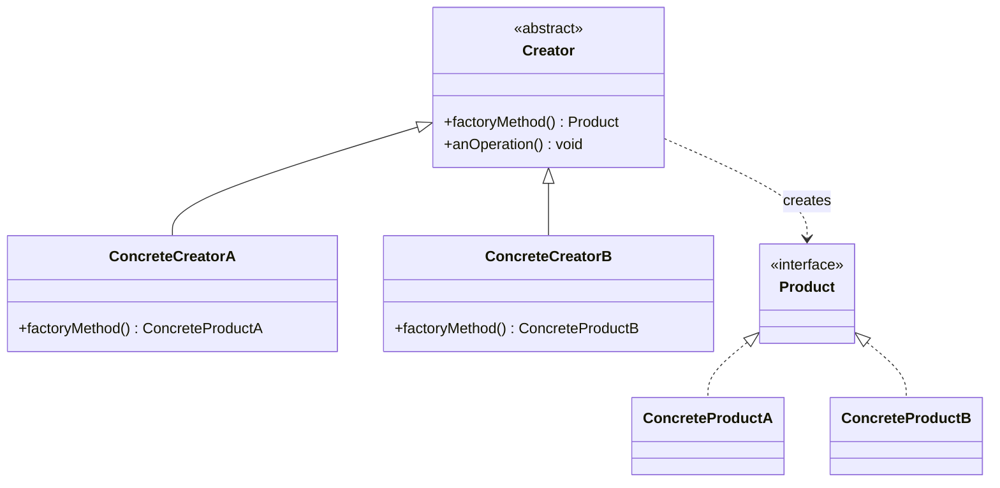
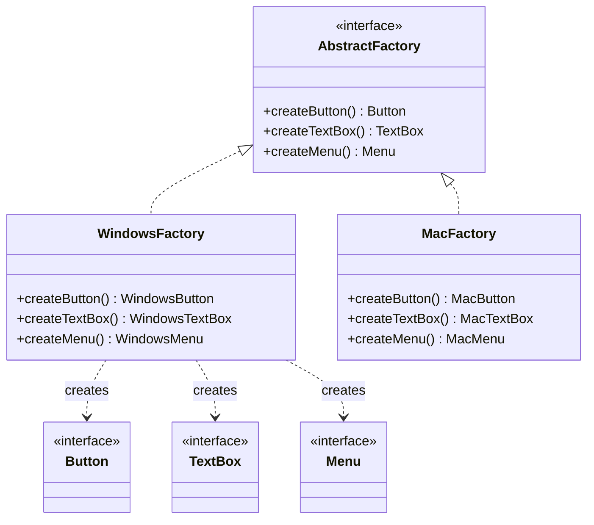
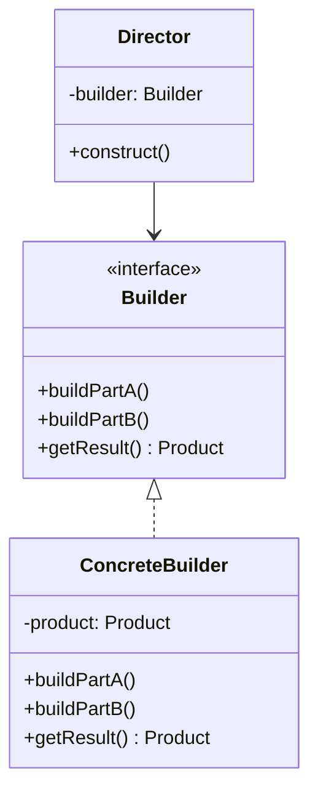
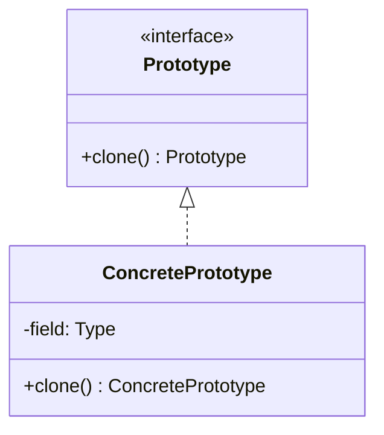
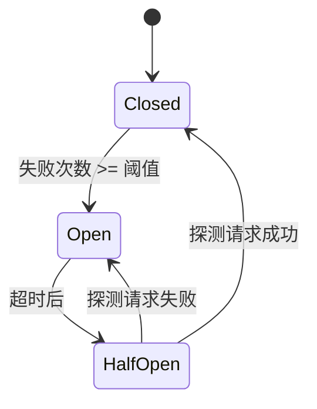
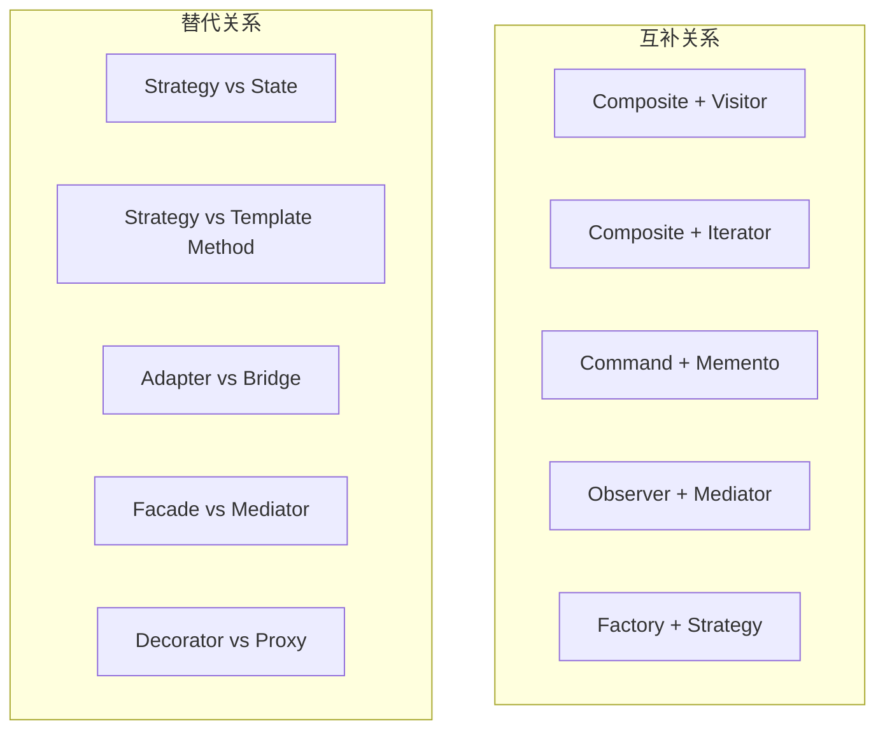
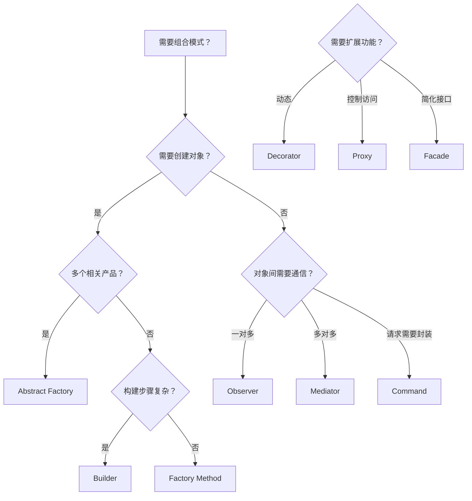

# 第29章：设计模式

## 本章概述

设计模式是软件开发中反复出现的设计问题的成熟解决方案。1994年，Erich Gamma、Richard Helm、Ralph Johnson和John Vlissides（"四人帮"，GoF）在《Design Patterns: Elements of Reusable Object-Oriented Software》一书中系统化地归纳了23种经典设计模式，奠定了这一领域的理论基础。设计模式不是可以直接套用的代码模板，而是对特定上下文中反复出现的设计结构和交互方式的抽象描述，它提供了一种开发者之间高效沟通的共同词汇。

本章从设计原则出发，首先阐述SOLID、DRY、YAGNI、KISS等指导设计决策的核心原则，这些原则是理解"为什么需要某个模式"的理论根基。随后按照GoF的分类体系，详细讲解创建型模式（Factory Method、Abstract Factory、Builder、Prototype、Singleton）、结构型模式（Adapter、Bridge、Composite、Decorator、Facade、Flyweight、Proxy）和行为型模式（Strategy、Observer、Command、Iterator、Mediator、State、Template Method、Visitor、Chain of Responsibility、Memento）共23种经典模式。在此基础上，本章还将覆盖并发模式（Active Object、Monitor、Read-Write Lock、Future/Promise）、分布式系统中广泛使用的弹性模式（Circuit Breaker、Bulkhead、Retry、Saga、Sidecar），以及现代架构中日益重要的企业级模式（Repository、Unit of Work、CQRS、Event Sourcing）。

## 学习目标

1. 深入理解SOLID原则及DRY、YAGNI、KISS等设计原则的内涵与实践边界
2. 掌握GoF 23种经典设计模式的结构、参与者、协作方式和适用场景
3. 理解创建型模式如何封装对象创建逻辑以提升系统灵活性
4. 理解结构型模式如何组合类和对象以形成更大的结构
5. 理解行为型模式如何分配职责和管理对象间的通信
6. 掌握并发模式解决线程安全和异步协作问题的方式
7. 理解分布式弹性模式（Circuit Breaker、Bulkhead、Retry、Saga、Sidecar）在微服务架构中的应用
8. 了解现代企业级模式（Repository、Unit of Work、CQRS、Event Sourcing）在DDD和事件驱动架构中的角色
9. 能够在实际项目中识别问题并选择恰当的模式进行设计

## 知识图谱

```mermaid
graph TD
    DP[设计模式] --> P[设计原则]
    DP --> C[创建型模式 5种]
    DP --> S[结构型模式 7种]
    DP --> B[行为型模式 10种]
    DP --> Co[并发模式 4种]
    DP --> D[分布式弹性模式 5种]
    DP --> E[现代企业级模式]

    P --> SOLID[SOLID]
    P --> PRIN[DRY / YAGNI / KISS]
    P --> PRIN2[组合优于继承 / 面向接口编程]

    C --> FM[Factory Method]
    C --> AF[Abstract Factory]
    C --> BU[Builder]
    C --> PR[Prototype]
    C --> SI[Singleton]

    S --> AD[Adapter]
    S --> BR[Bridge]
    S --> CO[Composite]
    S --> DE[Decorator]
    S --> FA[Facade]
    S --> FL[Flyweight]
    S --> PX[Proxy]

    B --> ST[Strategy]
    B --> OB[Observer]
    B --> CM[Command]
    B --> IT[Iterator]
    B --> ME[Mediator]
    B --> STA[State]
    B --> TM[Template Method]
    B --> VI[Visitor]
    B --> CR[Chain of Responsibility]
    B --> MEM[Memento]

    Co --> AO[Active Object]
    Co --> MO[Monitor]
    Co --> RW[Read-Write Lock]
    Co --> FP[Future/Promise]

    D --> CB[Circuit Breaker]
    D --> BK[Bulkhead]
    D --> RT[Retry]
    D --> SA[Saga]
    D --> SC[Sidecar]

    E --> RE[Repository]
    E --> UOW[Unit of Work]
    E --> CQRS[CQRS]
    E --> ES[Event Sourcing]
```



## 前置知识

- 面向对象编程基础（封装、继承、多态）
- 类与接口的设计
- 软件工程基础概念（模块化、耦合、内聚）

***

# 设计模式：理论基础

## 1. 设计原则

设计模式不是孤立存在的，它们根植于一组更基础的设计原则。理解这些原则才能理解模式存在的理由，以及在具体场景中如何变通和取舍。

### 1.1 SOLID原则

SOLID是Robert C. Martin（Uncle Bob）总结的五个面向对象设计原则的首字母缩写，是指导类和模块级设计的基石。

**S — 单一职责原则（Single Responsibility Principle, SRP）**

一个类应该只有一个引起它变化的原因。换言之，一个类只应该承担一项职责。如果一个类同时负责数据持久化和业务规则计算，那么当持久化策略变化或业务规则变化时，这个类都需要修改，两种变化的动因耦合在了一起。

```java
// 违反SRP：一个类做了两件事
class Employee {
    calculatePay() { ... }     // 薪资计算职责
    saveToDatabase() { ... }   // 持久化职责
}

// 遵循SRP：拆分为两个类
class EmployeePayCalculator {
    calculatePay(employee) { ... }
}
class EmployeeRepository {
    save(employee) { ... }
}
```

SRP的核心是"只有一个变化的轴心"。在实践中，这意味着当需求变更时，只需要修改一个地方。违反SRP的征兆包括：类名中出现"And"、方法集可明显分为两组不相关的操作、修改某功能时总需要修改该类。

**O — 开闭原则（Open-Closed Principle, OCP）**

软件实体应该对扩展开放，对修改关闭。即添加新功能时，应该通过添加新代码（扩展）实现，而不是修改已有代码。

经典实现方式是通过抽象和多态：

```java
// 违反OCP：每次新增形状都要修改AreaCalculator
class AreaCalculator {
    double calculate(shape) {
        if (shape.type == "circle") return PI * shape.r * shape.r;
        if (shape.type == "rect") return shape.w * shape.h;
        // 每次新增形状都要改这里...
    }
}

// 遵循OCP：通过多态扩展
interface Shape { double area(); }
class Circle implements Shape {
    double area() { return PI * r * r; }
}
class Rectangle implements Shape {
    double area() { return w * h; }
}
// 新增三角形只需添加新类，无需修改已有代码
class Triangle implements Shape {
    double area() { return 0.5 * base * height; }
}
```

OCP的关键在于找到系统中"可变"的部分，将其抽象为接口。Strategy模式、Template Method模式、Decorator模式都是OCP的典型体现。

**L — 里氏替换原则（Liskov Substitution Principle, LSP）**

子类型必须能够替换其基类型而不影响程序的正确性。这是Barbara Liskov在1987年提出的，其形式化表述要求子类型满足前置条件不强化、后置条件不弱化、不变量保持。

经典违反案例是"正方形是长方形"问题：

```java
// 违反LSP
class Rectangle {
    setWidth(w) { this.width = w; }
    setHeight(h) { this.height = h; }
    area() { return width * height; }
}
class Square extends Rectangle {
    setWidth(w) { this.width = w; this.height = w; }
    setHeight(h) { this.width = h; this.height = h; }
}
// 使用者期望独立设置宽高，但Square破坏了这一契约
void resize(Rectangle r) {
    r.setWidth(5);
    r.setHeight(10);
    assert r.area() == 50; // 对Square会失败
}
```

LSP告诉我们，继承关系不应该仅仅基于"is-a"的直觉判断，而应该基于行为兼容性。如果子类不能完全替换父类，就不应该使用继承，而应该使用组合。

**I — 接口隔离原则（Interface Segregation Principle, ISP）**

客户端不应该被迫依赖它不使用的接口。一个臃肿的接口应该被拆分为多个更小、更具体的接口。

```java
// 违反ISP：一个大接口强迫实现不需要的方法
interface Worker {
    work();
    eat();
    sleep();
}
class Robot implements Worker {
    work() { ... }    // Robot需要
    eat() { ... }     // Robot不需要，但被迫实现
    sleep() { ... }   // Robot不需要，但被迫实现
}

// 遵循ISP：拆分为细粒度接口
interface Workable { work(); }
interface Feedable { eat(); }
interface Sleepable { sleep(); }
class Robot implements Workable { work() { ... } }
class Human implements Workable, Feedable, Sleepable { ... }
```

ISP的关键洞察是：接口属于客户端，不属于实现者。接口应该根据客户端的需要来设计。

**D — 依赖倒置原则（Dependency Inversion Principle, DIP）**

高层模块不应该依赖低层模块，二者都应该依赖抽象。抽象不应该依赖细节，细节应该依赖抽象。

```java
// 违反DIP：高层直接依赖低层
class OrderService {
    MySQLDatabase db = new MySQLDatabase(); // 直接依赖具体实现
    save(order) { db.insert(order); }
}

// 遵循DIP：依赖抽象
interface Database { save(entity); }
class OrderService {
    Database db; // 依赖抽象
    OrderService(Database db) { this.db = db; }
    save(order) { db.save(order); }
}
class MySQLDatabase implements Database { ... }
class PostgreSQLDatabase implements Database { ... }
```

DIP是实现松耦合的核心手段。依赖注入（DI）框架（如Spring、Guice）正是这一原则的工程化实现。Factory Method、Abstract Factory等创建型模式也体现了DIP。

**SOLID五原则关系总览：**

| 原则 | 核心思想 | 解决的问题 | 体现的模式 |
|---|---|---|---|
| SRP | 一个类只有一个职责 | 类的臃肿和多变 | Facade、Mediator |
| OCP | 对扩展开放，对修改关闭 | 频繁修改已有代码 | Strategy、Decorator、Template Method |
| LSP | 子类必须能替换父类 | 继承层次的正确性 | Composite、Bridge |
| ISP | 接口要小而专 | 被迫实现不需要的方法 | Adapter、Proxy |
| DIP | 依赖抽象而非具体 | 高层与低层的紧耦合 | Factory、Abstract Factory、Observer |

### 1.2 DRY原则

**DRY（Don't Repeat Yourself）** 由Andy Hunt和Dave Thomas在《The Pragmatic Programmer》中提出："Every piece of knowledge must have a single, unambiguous, authoritative representation within a system."

DRY不仅仅是避免复制粘贴代码。它要求系统中的每一条知识（业务规则、算法、常量、校验逻辑等）都只有一个权威来源。如果业务规则在三处被编码，当规则变化时你必须找到所有三处并保持一致，这是bug的温床。

但DRY也有边界：过度消除重复可能引入不必要的耦合。如果两段代码恰好现在相同，但变化动因不同（偶然重复），强行抽取公共代码可能在一方需要变化时制造障碍。这被称为"WET原则"（Write Everything Twice）的对立面——有时候容忍适度的重复反而更健壮。

```python
# 偶然重复 vs 真正重复
# 偶然重复（WET可接受）：两段代码恰好相同，但变化动因不同
class EmailValidator:
    def validate(self, email):
        return '@' in email and len(email) < 255

class PhoneValidator:
    def validate(self, phone):
        return phone.startswith('+') and len(phone) < 20

# 真正重复（DRY必须）：相同的业务规则散落多处
# 旧代码：折扣规则在三处硬编码
if user.is_vip:
    discount = 0.8
# ... 另一个文件
if customer.vip:
    discount = 0.8

# 重构后：单一权威来源
class DiscountPolicy:
    VIP_DISCOUNT = 0.8
    def get_discount(self, user):
        if user.is_vip:
            return self.VIP_DISCOUNT
        return 1.0
```

### 1.3 YAGNI原则

**YAGNI（You Aren't Gonna Need It）** 是极限编程（XP）的核心实践之一。它告诫开发者不要为"将来可能需要"的功能编写代码。只有在确确实实需要某个功能时才去实现它。

YAGNI反对的是一种常见心理："我现在把接口设计得通用一点，以后可能会用到。" 实际上：

- 你预测的需求往往不会到来
- 即使到来了，与你预想的也往往不同
- 预先设计的"通用性"增加了当下的复杂度和维护成本

YAGNI与设计模式的关系很微妙。设计模式提供了一种"当需要扩展时再引入"的能力，但不应该在不需要扩展时提前引入。简单的if-else在只涉及两种策略时可能比Strategy模式更清晰。

### 1.4 KISS原则

**KISS（Keep It Simple, Stupid）** 强调简洁是终极的复杂。在设计中，最简单的可行方案通常是最好的。引入设计模式应该让系统更简单，而不是更复杂。

KISS的实践指导：

- 能用简单方案解决的问题不要引入复杂模式
- 一个模式如果增加了代码量和理解难度但没有带来明显的灵活性收益，就应该放弃
- 代码被阅读的次数远多于编写的次数，优先考虑可读性
- 如果一个设计需要详细的文档才能解释它，它可能太复杂了

### 1.5 其他重要原则

**组合优于继承（Composition Over Inheritance）**：继承创建的是编译时确定的静态关系，而且暴露了实现细节。组合通过持有对象引用创建运行时可变的动态关系，更灵活。Decorator、Strategy、State等模式都体现了这一原则。

**面向接口编程，而非面向实现编程**：依赖抽象而非具体类型，这是DIP的自然推论，也是实现多态的前提。

**封装变化点**：识别系统中变化的部分，将其封装在稳定的接口之后。这正是GoF设计模式的核心思想——每个模式都识别了一个变化点并提供了封装方案。

***

## 2. 创建型模式

创建型模式关注对象的创建机制，将对象的创建与使用分离，提升系统的灵活性和可扩展性。

### 2.1 Factory Method（工厂方法）

**意图**：定义一个创建对象的接口，让子类决定实例化哪个类。Factory Method使类的实例化延迟到子类。

**问题**：框架或库需要创建对象，但无法预知具体要创建什么类型。例如，一个文档处理框架需要创建"视图"对象，但具体是PDF视图还是HTML视图应由使用框架的应用程序决定。

**结构**：



**参与者**：

- **Product**：定义工厂方法创建的对象的接口
- **ConcreteProduct**：实现Product接口
- **Creator**：声明工厂方法，返回Product类型；可提供默认实现
- **ConcreteCreator**：覆盖工厂方法，返回ConcreteProduct实例

**代码示例（Java）**：

```java
// 产品接口
abstract class Button {
    abstract void render();
    abstract void onClick(Runnable handler);
}

// 具体产品
class WindowsButton extends Button {
    void render() { /* Windows风格渲染 */ }
    void onClick(Runnable handler) { /* Windows事件绑定 */ }
}
class LinuxButton extends Button {
    void render() { /* GTK风格渲染 */ }
    void onClick(Runnable handler) { /* GTK事件绑定 */ }
}

// 创建者
abstract class Dialog {
    abstract Button createButton();  // 工厂方法
    
    void renderDialog() {
        Button okButton = createButton();
        okButton.onClick(() -> close());
        okButton.render();
    }
}

class WindowsDialog extends Dialog {
    Button createButton() { return new WindowsButton(); }
}
class LinuxDialog extends Dialog {
    Button createButton() { return new LinuxButton(); }
}
```

**适用场景**：

- 当一个类不知道它要创建的对象的具体类时
- 当一个类希望由子类来指定它创建的对象时
- 当类将创建职责委托给多个辅助子类中的某一个，而你想将信息局部化到这些辅助子类中

**与简单工厂的区别**：简单工厂（Static Factory）通常用一个静态方法+条件判断来创建对象，违反OCP。Factory Method通过继承实现扩展，新增产品只需新增Creator子类。

### 2.2 Abstract Factory（抽象工厂）

**意图**：提供一个接口，用于创建一系列相关或相互依赖的对象，而无需指定它们的具体类。

**问题**：一个UI框架需要支持多套主题（Windows、macOS、Linux），每套主题包含一组风格一致的控件（按钮、文本框、菜单）。不应该混搭不同主题的控件。

**结构**：



**代码示例（Python）**：

```python
from abc import ABC, abstractmethod

class GUIFactory(ABC):
    @abstractmethod
    def create_button(self) -> 'Button': ...
    @abstractmethod
    def create_checkbox(self) -> 'Checkbox': ...

class WindowsFactory(GUIFactory):
    def create_button(self) -> 'Button':
        return WindowsButton()
    def create_checkbox(self) -> 'Checkbox':
        return WindowsCheckbox()

class MacFactory(GUIFactory):
    def create_button(self) -> 'Button':
        return MacButton()
    def create_checkbox(self) -> 'Checkbox':
        return MacCheckbox()

# 客户端代码与具体工厂解耦
def build_ui(factory: GUIFactory):
    button = factory.create_button()
    checkbox = factory.create_checkbox()
    button.paint()
    checkbox.paint()
```

**适用场景**：

- 系统需要独立于产品的创建、组合和表示
- 系统需要配置为多个产品系列中的一个
- 一系列相关产品对象的设计需要强制一起使用
- 需要提供产品类库，只暴露接口而非实现

**关键约束**：Abstract Factory最难的部分是增加新产品。如果需要在抽象工厂中新增一个`createScrollbar()`方法，所有具体工厂都必须修改。这就是"产品族扩展困难"的经典问题。

### 2.3 Builder（建造者）

**意图**：将复杂对象的构建与其表示分离，使得同样的构建过程可以创建不同的表示。

**问题**：一个对象有大量可选参数，且构造过程涉及多个步骤。用构造函数会导致参数列表过长（"telescoping constructor"反模式），或者需要大量重载。

**结构**：



**代码示例（TypeScript）**：

```typescript
class HttpRequest {
    constructor(
        public readonly method: string,
        public readonly url: string,
        public readonly headers: Map<string, string>,
        public readonly body: string | null,
        public readonly timeout: number,
        public readonly retries: number
    ) {}
}

class HttpRequestBuilder {
    private method = 'GET';
    private url = '';
    private headers = new Map<string, string>();
    private body: string | null = null;
    private timeout = 30000;
    private retries = 3;

    setMethod(m: string): this { this.method = m; return this; }
    setUrl(u: string): this { this.url = u; return this; }
    addHeader(k: string, v: string): this { this.headers.set(k, v); return this; }
    setBody(b: string): this { this.body = b; return this; }
    setTimeout(t: number): this { this.timeout = t; return this; }
    setRetries(r: number): this { this.retries = r; return this; }

    build(): HttpRequest {
        if (!this.url) throw new Error('URL is required');
        return new HttpRequest(
            this.method, this.url, this.headers,
            this.body, this.timeout, this.retries
        );
    }
}

// 使用
const request = new HttpRequestBuilder()
    .setUrl('https://api.example.com/users')
    .setMethod('POST')
    .addHeader('Content-Type', 'application/json')
    .setBody('{"name": "Alice"}')
    .setTimeout(5000)
    .build();
```

**适用场景**：

- 创建复杂对象的算法应该独立于该对象的组成部分及其装配方式
- 构造过程必须允许被构造的对象有不同的表示
- 对象有很多可选参数

**Builder vs 工厂模式**：工厂关注"创建什么"，Builder关注"如何创建"。工厂一步到位返回完整产品，Builder分步构建。

### 2.4 Prototype（原型）

**意图**：用原型实例指定创建的对象种类，并且通过复制这些原型来创建新对象。

**问题**：创建对象的成本很高（需要数据库查询、网络请求或复杂计算），而你需要大量相似对象。直接new可以，但如果对象的初始化代价高昂或者你只知道对象的接口而非具体类，就需要一种基于已有对象复制的创建方式。

**结构**：



**深拷贝 vs 浅拷贝**：

浅拷贝只复制值类型字段和引用地址，引用类型字段仍指向原对象。深拷贝递归复制所有引用对象。Prototype模式通常需要深拷贝以保证独立性。

```java
// Java实现：实现Cloneable接口
class Document implements Cloneable {
    private String title;
    private List<Page> pages;  // 引用类型
    
    @Override
    public Document clone() {
        Document copy = (Document) super.clone();
        copy.pages = new ArrayList<>();
        for (Page p : this.pages) {
            copy.pages.add(p.clone());  // 深拷贝
        }
        return copy;
    }
}
```

**适用场景**：

- 当一个系统应该独立于其产品的创建、组合和表示时
- 当要实例化的类是在运行时指定时（例如通过动态加载）
- 为了避免创建一个与产品类层次平行的工厂类层次时
- 当一个类的实例只能有几个不同状态组合中的某一个时

**注册表实现**：实践中常使用原型注册表（Prototype Registry），按名称存储预配置的原型实例，客户端通过名称获取并克隆：

```java
class PrototypeRegistry {
    private Map<String, Prototype> prototypes = new HashMap<>();
    void register(String key, Prototype p) { prototypes.put(key, p); }
    Prototype create(String key) { return prototypes.get(key).clone(); }
}
```

### 2.5 Singleton（单例）

**意图**：保证一个类只有一个实例，并提供一个全局访问点。

**问题**：某些对象在系统中应该恰好有一个实例，如数据库连接池、配置管理器、日志系统。多个实例会造成资源浪费或状态不一致。

**实现方式对比**：

```java
// 1. 饿汉式：类加载时就创建，线程安全但不支持延迟初始化
public class Singleton {
    private static final Singleton INSTANCE = new Singleton();
    private Singleton() {}
    public static Singleton getInstance() { return INSTANCE; }
}

// 2. 双重检查锁定：延迟初始化+线程安全
public class Singleton {
    private static volatile Singleton instance;
    private Singleton() {}
    public static Singleton getInstance() {
        if (instance == null) {
            synchronized (Singleton.class) {
                if (instance == null) {
                    instance = new Singleton();
                }
            }
        }
        return instance;
    }
}

// 3. 静态内部类：利用类加载机制保证线程安全+延迟初始化
public class Singleton {
    private Singleton() {}
    private static class Holder {
        private static final Singleton INSTANCE = new Singleton();
    }
    public static Singleton getInstance() { return Holder.INSTANCE; }
}

// 4. 枚举方式：最简洁，天然防序列化和反射攻击
public enum Singleton {
    INSTANCE;
    public void doSomething() { ... }
}
```

**争议与替代**：

Singleton是GoF模式中争议最大的一个。常见批评：

- 引入全局状态，使代码难以测试（无法mock）
- 隐式依赖，函数签名不能体现对单例的依赖
- 违反SRP（既管理业务逻辑又管理生命周期）

现代实践倾向于使用依赖注入容器管理对象生命周期，将"单一实例"的责任交给容器（如Spring的`@Singleton`作用域），而非在类自身内部实现。

### 2.6 创建型模式对比选型

| 模式 | 核心问题 | 关键角色 | 适用场景 | 现代替代 |
|---|---|---|---|---|
| Factory Method | 不知道要创建什么具体类 | Creator + Product | 框架/库的扩展点 | Lambda/函数引用 |
| Abstract Factory | 需要一组风格一致的产品 | AbstractFactory + 产品族 | 跨平台UI、多数据源 | 配置驱动的DI |
| Builder | 对象构建步骤复杂 | Director + Builder | 复杂配置对象、SQL构建 | 链式API、Kotlin DSL |
| Prototype | 创建成本高或类型未知 | Prototype + Registry | 缓存预热、配置克隆 | 序列化/反序列化 |
| Singleton | 全局唯一实例 | Singleton类自身 | 配置管理、连接池 | DI容器作用域 |

***

## 3. 结构型模式

结构型模式关注如何将类或对象组合成更大的结构，以实现新功能或简化设计。

### 3.1 Adapter（适配器）

**意图**：将一个类的接口转换成客户端期望的另一个接口。Adapter使得原本因接口不兼容而无法一起工作的类可以一起工作。

**类适配器**（通过多重继承）和**对象适配器**（通过组合）两种实现方式：

```python
# 对象适配器（更常用）
class EuropeanSocket:
    def voltage(self): return 230
    def live(self): return 1
    def neutral(self): return -1

class USASocketInterface:
    def voltage(self): ...
    def live(self): ...
    def neutral(self): ...

class USASocketAdapter(USASocketInterface):
    def __init__(self, european_socket):
        self.eu = european_socket
    
    def voltage(self): return 110  # 转换电压
    def live(self): return self.eu.live()
    def neutral(self): return self.eu.neutral()
```

**适用场景**：需要使用一个已有类，但其接口与需求不匹配时。特别适合整合第三方库或遗留系统。

### 3.2 Bridge（桥接）

**意图**：将抽象部分与实现部分分离，使它们可以独立变化。

**问题**：当一个抽象有多个维度的变化时（如形状×颜色），继承会导致类爆炸（RedCircle, BlueCircle, RedSquare, BlueSquare...）。

```java
// 实现接口
interface Color {
    String fill();
}
class Red implements Color { String fill() { return "红色"; } }
class Blue implements Color { String fill() { return "蓝色"; } }

// 抽象持有实现的引用
abstract class Shape {
    protected Color color;
    Shape(Color color) { this.color = color; }
    abstract String draw();
}
class Circle extends Shape {
    Circle(Color c) { super(c); }
    String draw() { return "绘制" + color.fill() + "的圆形"; }
}
class Square extends Shape {
    Square(Color c) { super(c); }
    String draw() { return "绘制" + color.fill() + "的方形"; }
}

// 使用：形状和颜色可以独立扩展
new Circle(new Red()).draw(); // "绘制红色的圆形"
```

**Bridge vs Adapter**：Adapter是事后补救，让不兼容的类一起工作。Bridge是事前设计，有意将抽象和实现分离。

### 3.3 Composite（组合）

**意图**：将对象组合成树形结构以表示"部分-整体"的层次。Composite使得用户对单个对象和组合对象的使用具有一致性。

```java
interface FileSystemComponent {
    int getSize();
    void print(String indent);
}

class File implements FileSystemComponent {
    private String name;
    private int size;
    // ...
}

class Directory implements FileSystemComponent {
    private String name;
    private List<FileSystemComponent> children = new ArrayList<>();
    
    void add(FileSystemComponent component) { children.add(component); }
    
    int getSize() {
        return children.stream().mapToInt(FileSystemComponent::getSize).sum();
    }
    
    void print(String indent) {
        System.out.println(indent + "[DIR] " + name);
        for (FileSystemComponent c : children) {
            c.print(indent + "  ");
        }
    }
}
```

**适用场景**：表示对象的部分-整体层次结构；希望客户端忽略组合对象与单个对象的差异。

**潜在问题与缓解**：Composite模式中叶子节点和容器节点共享同一接口，可能导致叶子节点被迫实现一些无意义的方法（如向叶子添加子节点）。缓解方式：使用空操作（No-Op）或抛出`UnsupportedOperationException`，或者设计不同的接口（Component vs Composite）让客户端在适当时机区分。

### 3.4 Decorator（装饰器）

**意图**：动态地给一个对象添加额外职责。Decorator提供了比继承更灵活的功能扩展方式。

```python
# 咖啡示例
class Coffee:
    def cost(self): return 5
    def description(self): return "基础咖啡"

class CoffeeDecorator(Coffee):
    def __init__(self, coffee):
        self._coffee = coffee
    def cost(self): return self._coffee.cost()
    def description(self): return self._coffee.description()

class MilkDecorator(CoffeeDecorator):
    def cost(self): return self._coffee.cost() + 2
    def description(self): return self._coffee.description() + " + 牛奶"

class SugarDecorator(CoffeeDecorator):
    def cost(self): return self._coffee.cost() + 1
    def description(self): return self._coffee.description() + " + 糖"

# 使用：动态组合
coffee = Coffee()
coffee = MilkDecorator(coffee)
coffee = SugarDecorator(coffee)
print(coffee.description())  # "基础咖啡 + 牛奶 + 糖"
print(coffee.cost())         # 8
```

**Java I/O中的Decorator**：Java I/O库是Decorator模式的经典应用。`BufferedInputStream`装饰`FileInputStream`，添加缓冲功能；`GZIPInputStream`装饰`BufferedInputStream`，添加压缩功能。

### 3.5 Facade（外观）

**意图**：为子系统中的一组接口提供一个统一的高层接口。Facade定义了一个更高层次的接口，使得子系统更加易用。

```python
class OrderFacade:
    """简化下单流程的外观"""
    def __init__(self):
        self._inventory = InventoryService()
        self._payment = PaymentService()
        self._shipping = ShippingService()
        self._notification = NotificationService()
    
    def place_order(self, user_id, product_id, amount):
        # 协调多个子系统
        if not self._inventory.check(product_id, amount):
            raise ValueError("库存不足")
        
        payment_id = self._payment.charge(user_id, amount)
        tracking = self._shipping.create_shipment(user_id, product_id)
        self._notification.send_confirmation(user_id, payment_id)
        
        return {"payment_id": payment_id, "tracking": tracking}
```

**适用场景**：为复杂子系统提供简单接口；将客户端与子系统解耦；分层系统中定义层间入口。

### 3.6 Flyweight（享元）

**意图**：运用共享技术有效地支持大量细粒度的对象。

```java
// 字符渲染示例：字符对象是共享的，位置是外部状态
class CharacterFlyweight {
    private char symbol;    // 内部状态（共享）
    private String font;
    
    void render(int row, int col) {  // 外部状态（每次调用传入）
        System.out.printf("在(%d,%d)渲染字符 %c [字体: %s]%n", 
                          row, col, symbol, font);
    }
}

class FlyweightFactory {
    private Map<String, CharacterFlyweight> pool = new HashMap<>();
    
    CharacterFlyweight get(char symbol, String font) {
        String key = symbol + ":" + font;
        return pool.computeIfAbsent(key, k -> new CharacterFlyweight(symbol, font));
    }
}
```

**内部状态 vs 外部状态**：内部状态存储在享元对象中，可被多个上下文共享；外部状态依赖于上下文，不能共享，由客户端在使用时传入。

**适用场景**：应用使用大量相似对象，造成存储开销；对象的大部分状态可以外部化。

### 3.7 Proxy（代理）

**意图**：为其他对象提供一种代理以控制对这个对象的访问。

**代理类型**：

- **远程代理**：为远程对象提供本地代表（如RMI Stub）
- **虚拟代理**：延迟创建开销大的对象（如图片懒加载）
- **保护代理**：控制对象的访问权限（如权限检查）
- **缓存代理**：缓存请求结果

```python
class Image:
    def display(self): ...

class RealImage(Image):
    def __init__(self, filename):
        self.filename = filename
        self._load_from_disk()  # 开销大
    
    def _load_from_disk(self):
        print(f"从磁盘加载 {self.filename}")
    
    def display(self):
        print(f"显示 {self.filename}")

class ProxyImage(Image):
    def __init__(self, filename):
        self.filename = filename
        self._real = None  # 延迟创建
    
    def display(self):
        if self._real is None:
            self._real = RealImage(self.filename)
        self._real.display()
```

### 3.8 结构型模式对比选型

| 模式 | 核心思想 | 关键区别 | 典型场景 |
|---|---|---|---|
| Adapter | 接口转换 | 事后补救，适配已有接口 | 整合第三方库 |
| Bridge | 抽象与实现分离 | 事前设计，两个维度独立变化 | 跨平台渲染 |
| Composite | 树形统一处理 | 部分-整体层次 | 文件系统、UI组件树 |
| Decorator | 动态添加职责 | 包装增强，不改变接口 | Java I/O、中间件 |
| Facade | 简化访问 | 单向简化，隐藏复杂性 | SDK封装、子系统入口 |
| Flyweight | 共享细粒度对象 | 内部状态共享，外部状态传入 | 字符渲染、游戏精灵 |
| Proxy | 控制访问 | 代理控制（延迟/权限/缓存） | 懒加载、AOP、远程调用 |

***

## 4. 行为型模式

行为型模式关注对象之间的职责分配和通信方式。

### 4.1 Strategy（策略）

**意图**：定义一系列算法，把它们一个个封装起来，并且使它们可以相互替换。Strategy使得算法可以独立于使用它的客户端而变化。

```java
interface SortStrategy<T extends Comparable<T>> {
    void sort(List<T> list);
}

class BubbleSort<T extends Comparable<T>> implements SortStrategy<T> {
    void sort(List<T> list) { /* 冒泡排序实现 */ }
}

class QuickSort<T extends Comparable<T>> implements SortStrategy<T> {
    void sort(List<T> list) { /* 快速排序实现 */ }
}

class Sorter<T extends Comparable<T>> {
    private SortStrategy<T> strategy;
    
    Sorter(SortStrategy<T> strategy) { this.strategy = strategy; }
    void setStrategy(SortStrategy<T> strategy) { this.strategy = strategy; }
    void sort(List<T> list) { strategy.sort(list); }
}
```

**适用场景**：许多相关的类只是行为不同；需要在运行时选择算法的不同变体；算法使用客户不应该知道的数据。

### 4.2 Observer（观察者）

**意图**：定义对象间的一种一对多依赖关系，使得每当一个对象状态改变时，所有依赖于它的对象都会得到通知并自动更新。

```python
class EventEmitter:
    def __init__(self):
        self._listeners = {}
    
    def on(self, event, callback):
        self._listeners.setdefault(event, []).append(callback)
    
    def off(self, event, callback):
        self._listeners.get(event, []).remove(callback)
    
    def emit(self, event, *args, **kwargs):
        for cb in self._listeners.get(event, []):
            cb(*args, **kwargs)

class Store:
    def __init__(self):
        self.events = EventEmitter()
        self._state = {}
    
    def set(self, key, value):
        old = self._state.get(key)
        self._state[key] = value
        self.events.emit('change', key, old, value)
        self.events.emit(f'change:{key}', old, value)
```

**推模型 vs 拉模型**：推模型由Subject向Observer发送详细信息；拉模型只发送通知，Observer按需拉取数据。现代实现多采用拉模型或事件对象封装变化数据。

**适用场景**：当一个抽象有两个方面，其中一个依赖另一个时；当对一个对象的改变需要同时改变其他对象，而不知道具体有多少对象待改变时。

### 4.3 Command（命令）

**意图**：将一个请求封装为一个对象，从而使得可以用不同的请求对客户端进行参数化，支持请求的排队、日志记录以及可撤销的操作。

```java
interface Command {
    void execute();
    void undo();  // 可选：支持撤销
}

class InsertTextCommand implements Command {
    private TextEditor editor;
    private String text;
    private int position;
    
    void execute() { editor.insertAt(position, text); }
    void undo() { editor.deleteAt(position, text.length()); }
}

class CommandHistory {
    private Deque<Command> history = new ArrayDeque<>();
    private Deque<Command> redoStack = new ArrayDeque<>();
    
    void execute(Command cmd) {
        cmd.execute();
        history.push(cmd);
        redoStack.clear();
    }
    
    void undo() {
        if (!history.isEmpty()) {
            Command cmd = history.pop();
            cmd.undo();
            redoStack.push(cmd);
        }
    }
    
    void redo() {
        if (!redoStack.isEmpty()) {
            Command cmd = redoStack.pop();
            cmd.execute();
            history.push(cmd);
        }
    }
}
```

**适用场景**：需要参数化对象以执行操作；需要在不同时刻指定、排列和执行请求；需要支持撤销操作；需要支持事务。

### 4.4 Iterator（迭代器）

**意图**：提供一种方法顺序访问一个聚合对象中的各个元素，而不暴露该对象的内部表示。

现代编程语言大多内置了迭代器协议（Java的`Iterator`接口、Python的`__iter__`和`__next__`、C++的`begin()`和`end()`），使得这一模式已高度标准化。

```python
class BinaryTree:
    def __init__(self, value, left=None, right=None):
        self.value = value
        self.left = left
        self.right = right
    
    def __iter__(self):
        return self._inorder(self)
    
    def _inorder(self, node):
        if node:
            yield from self._inorder(node.left)
            yield node.value
            yield from self._inorder(node.right)
```

### 4.5 Mediator（中介者）

**意图**：用一个中介对象来封装一系列对象的交互。中介者使各对象不需要显式地相互引用，从而使其耦合松散，可以独立改变它们之间的交互。

```python
class ChatRoom:
    """中介者：协调用户之间的消息传递"""
    def __init__(self):
        self._users = {}
    
    def register(self, user):
        self._users[user.name] = user
        user.room = self
    
    def send(self, sender, message, to=None):
        if to:
            # 私聊
            if to in self._users:
                self._users[to].receive(sender, message)
        else:
            # 群发
            for name, user in self._users.items():
                if name != sender:
                    user.receive(sender, message)

class User:
    def __init__(self, name):
        self.name = name
        self.room = None
    
    def send(self, message, to=None):
        self.room.send(self.name, message, to)
    
    def receive(self, sender, message):
        print(f"[{self.name}] 收到 {sender}: {message}")
```

**适用场景**：一组对象以定义良好但复杂的方式进行通信；对象间的通信难以理解且难以复用；想定制一个分布在多个类中的行为而又不想生成太多子类。

**Mediator vs Observer**：Observer是多对多的松散通知机制，观察者之间互相不知道对方的存在。Mediator是集中式的交互管控，所有对象都知道中介者的存在。当Observer的观察者网络变得过于复杂难以追踪时，可以引入Mediator来替代。

### 4.6 State（状态）

**意图**：允许一个对象在其内部状态改变时改变它的行为。对象看起来似乎修改了它的类。

```python
class Document:
    def __init__(self):
        self._state = DraftState()
    
    def set_state(self, state):
        self._state = state
    
    def publish(self):
        self._state.publish(self)

class State:
    def publish(self, doc): raise NotImplementedError

class DraftState(State):
    def publish(self, doc):
        print("提交审核")
        doc.set_state(ModerationState())

class ModerationState(State):
    def publish(self, doc):
        print("发布成功")
        doc.set_state(PublishedState())

class PublishedState(State):
    def publish(self, doc):
        print("已发布，不能重复发布")
```

**State vs Strategy**：两者结构类似，但意图不同。Strategy由客户端主动选择算法；State由对象内部状态自动切换行为。在Strategy中，客户端知道有哪些策略；在State中，状态转换对客户端透明。

### 4.7 Template Method（模板方法）

**意图**：定义一个操作中算法的骨架，将某些步骤延迟到子类。Template Method使得子类可以不改变算法的结构即可重定义算法的某些步骤。

```python
from abc import ABC, abstractmethod

class DataMiner(ABC):
    def mine(self):  # 模板方法
        data = self.extract_data()
        parsed = self.parse_data(data)
        analysis = self.analyze_data(parsed)
        self.send_report(analysis)
    
    @abstractmethod
    def extract_data(self): ...
    
    @abstractmethod
    def parse_data(self, raw_data): ...
    
    def analyze_data(self, parsed_data):  # 钩子方法，有默认实现
        return f"分析了 {len(parsed_data)} 条数据"
    
    def send_report(self, analysis):  # 具体方法
        print(f"报告: {analysis}")

class CSVMiner(DataMiner):
    def extract_data(self): return open("data.csv").read()
    def parse_data(self, raw): return raw.split("\n")

class JSONMiner(DataMiner):
    def extract_data(self): return open("data.json").read()
    def parse_data(self, raw): return json.loads(raw)
```

**钩子方法（Hook）**：模板方法中可以定义钩子——有默认（通常为空）实现的步骤，子类可以选择性覆盖。这让子类有机会在算法的关键点插入自定义行为。

### 4.8 Visitor（访问者）

**意图**：表示一个作用于某对象结构中的各元素的操作。可以在不改变各元素类的前提下定义作用于这些元素的新操作。

```java
interface ShapeVisitor {
    void visit(Circle circle);
    void visit(Rectangle rectangle);
    void visit(Triangle triangle);
}

interface Shape {
    void accept(ShapeVisitor visitor);
}

class Circle implements Shape {
    double radius;
    void accept(ShapeVisitor visitor) { visitor.visit(this); }
}
class Rectangle implements Shape {
    double width, height;
    void accept(ShapeVisitor visitor) { visitor.visit(this); }
}

class AreaCalculator implements ShapeVisitor {
    double totalArea = 0;
    void visit(Circle c) { totalArea += Math.PI * c.radius * c.radius; }
    void visit(Rectangle r) { totalArea += r.width * r.height; }
    void visit(Triangle t) { totalArea += 0.5 * t.base * t.height; }
}
```

**双重分派（Double Dispatch）**：Visitor的核心机制。元素的`accept`方法将自身传递给Visitor的`visit`方法，完成两次动态绑定：第一次是Element类型，第二次是Visitor类型。

**适用场景**：对象结构包含很多类，它们有不同的接口，而你想对这些对象执行一些依赖于其具体类的操作；需要对一个对象结构中的对象进行很多不同且不相关的操作。

**双刃剑**：添加新的ConcreteElement很困难（需要修改所有Visitor接口），但添加新操作很容易（只需新增Visitor）。这正好与Strategy相反。

### 4.9 Chain of Responsibility（责任链）

**意图**：使多个对象都有机会处理请求，从而避免请求的发送者和接收者之间的耦合。将这些对象连成一条链，并沿着这条链传递请求，直到有一个对象处理它为止。

```python
class Handler:
    def __init__(self, successor=None):
        self._successor = successor
    
    def handle(self, request):
        if self._successor:
            return self._successor.handle(request)
        return None

class AuthenticationHandler(Handler):
    def handle(self, request):
        if not request.get('token'):
            return "未认证"
        print("认证通过")
        return super().handle(request)

class AuthorizationHandler(Handler):
    def handle(self, request):
        if request.get('role') != 'admin':
            return "无权限"
        print("授权通过")
        return super().handle(request)

class LoggingHandler(Handler):
    def handle(self, request):
        print(f"记录请求: {request}")
        return super().handle(request)

# 构建责任链
chain = LoggingHandler(AuthenticationHandler(AuthorizationHandler()))
result = chain.handle({'token': 'abc', 'role': 'admin', 'data': '...'})
```

**适用场景**：有多个对象可以处理一个请求，具体哪个处理在运行时决定；想在不明确指定接收者的情况下向多个对象中的一个提交一个请求。

### 4.10 Memento（备忘录）

**意图**：在不破坏封装性的前提下，捕获一个对象的内部状态，并在该对象之外保存这个状态，以便之后恢复。

```python
class TextEditor:
    def __init__(self):
        self._content = ""
    
    def type(self, text):
        self._content += text
    
    def save(self) -> 'Memento':
        return Memento(self._content)
    
    def restore(self, memento: 'Memento'):
        self._content = memento.get_state()
    
    def get_content(self):
        return self._content

class Memento:
    def __init__(self, state):
        self._state = state
    
    def get_state(self):
        return self._state

class History:
    def __init__(self):
        self._states = []
    
    def push(self, memento):
        self._states.append(memento)
    
    def pop(self) -> 'Memento':
        return self._states.pop()

# 使用
editor = TextEditor()
history = History()

editor.type("Hello")
history.push(editor.save())
editor.type(" World")
history.push(editor.save())
editor.type("!!!")

editor.restore(history.pop())  # 恢复到 "Hello World"
print(editor.get_content())    # "Hello World"
```

**适用场景**：需要保存对象在某个时刻的状态，以便之后恢复；获取状态的接口会暴露实现细节，破坏封装性。

### 4.11 行为型模式对比选型

| 模式 | 核心问题 | 关键机制 | 典型场景 |
|---|---|---|---|
| Strategy | 算法族的封装与互换 | 组合+接口 | 支付方式、排序算法、验证规则 |
| Observer | 一对多依赖通知 | 注册+通知 | 事件系统、数据绑定、消息队列 |
| Command | 请求的对象化 | 封装+队列 | 撤销/重做、宏命令、任务调度 |
| Iterator | 顺序访问不暴露内部 | 迭代协议 | 集合遍历、树遍历、数据库游标 |
| Mediator | 对象交互集中管控 | 中间协调 | 聊天室、表单验证、空中交通管制 |
| State | 状态驱动行为变化 | 状态对象切换 | 订单状态机、TCP连接、游戏角色 |
| Template Method | 算法骨架固定步骤可变 | 继承+钩子 | 数据挖掘、测试框架、管道处理 |
| Visitor | 操作与结构分离 | 双重分派 | 编译器AST、报表生成、序列化 |
| Chain of Responsibility | 请求链式传递 | 链+转发 | 中间件、审批流程、日志过滤 |
| Memento | 状态保存与恢复 | 快照+恢复 | 撤销系统、游戏存档、事务回滚 |

***

## 5. 并发模式

并发模式解决多线程和异步编程中的协作与安全问题。

### 5.1 Active Object（主动对象）

**意图**：将方法执行与方法调用分离，使得每个对象拥有自己的控制线程。

Active Object模式由六个部分组成：

1. **代理（Proxy）**：提供面向客户端的接口
2. **方法请求（Method Request）**：封装调用参数
3. **激活列表（Activation List）**：缓冲待执行的请求
4. **调度器（Scheduler）**：从激活列表中选择请求执行
5. **实现者（Servant）**：真正执行业务逻辑
6. **回调/Future**：返回结果给客户端

```python
import threading
from queue import Queue
from concurrent.futures import Future

class ActiveObject:
    def __init__(self):
        self._queue = Queue()
        self._thread = threading.Thread(target=self._run, daemon=True)
        self._thread.start()
    
    def _run(self):
        while True:
            task, future = self._queue.get()
            try:
                result = task()
                future.set_result(result)
            except Exception as e:
                future.set_exception(e)
    
    def submit(self, func) -> Future:
        future = Future()
        self._queue.put((func, future))
        return future
```

**适用场景**：每个对象需要独立的执行线程；方法调用需要异步执行且调用者不阻塞。

### 5.2 Monitor（管程）

**意图**：将共享数据和对数据的操作封装在一起，通过互斥和条件同步确保线程安全。

管程是一种编程语言级别的同步机制。Java的`synchronized`关键字和`wait()/notify()`机制天然实现了管程。

```java
class BoundedBuffer<T> {
    private final Queue<T> queue = new LinkedList<>();
    private final int capacity;
    
    BoundedBuffer(int capacity) { this.capacity = capacity; }
    
    public synchronized void put(T item) throws InterruptedException {
        while (queue.size() == capacity) {
            wait();  // 满则等待
        }
        queue.add(item);
        notifyAll();  // 通知等待的消费者
    }
    
    public synchronized T take() throws InterruptedException {
        while (queue.isEmpty()) {
            wait();  // 空则等待
        }
        T item = queue.poll();
        notifyAll();  // 通知等待的生产者
        return item;
    }
}
```

### 5.3 Read-Write Lock（读写锁）

**意图**：允许多个读操作并发执行，但写操作必须独占。适用于读多写少的场景。

```python
import threading

class ReadWriteLock:
    def __init__(self):
        self._readers = 0
        self._readers_lock = threading.Lock()
        self._write_lock = threading.Lock()
    
    def acquire_read(self):
        with self._readers_lock:
            self._readers += 1
            if self._readers == 1:
                self._write_lock.acquire()
    
    def release_read(self):
        with self._readers_lock:
            self._readers -= 1
            if self._readers == 0:
                self._write_lock.release()
    
    def acquire_write(self):
        self._write_lock.acquire()
    
    def release_write(self):
        self._write_lock.release()
```

Java中`java.util.concurrent.locks.ReentrantReadWriteLock`是工业级实现，支持公平性策略、锁降级等高级特性。

**注意**：当读写比例接近1:1时，读写锁的性能可能反而不如简单的互斥锁，因为读写锁需要维护读者计数的额外开销。

### 5.4 Future/Promise

**意图**：表示一个异步计算的结果。Future代表计算的最终结果（由消费者查询），Promise代表结果的写入端（由生产者设置）。

```java
// Java CompletableFuture示例
CompletableFuture<String> future = CompletableFuture
    .supplyAsync(() -> fetchDataFromAPI())     // 异步获取
    .thenApply(data -> parseJSON(data))         // 转换
    .thenApply(parsed -> extractField(parsed))  // 进一步转换
    .exceptionally(ex -> "默认值");              // 异常处理

// 非阻塞获取结果
future.thenAccept(result -> System.out.println(result));
```

```python
# Python asyncio中的Future
import asyncio

async def fetch_data():
    await asyncio.sleep(1)  # 模拟IO
    return {"name": "Alice"}

async def main():
    future = asyncio.create_task(fetch_data())
    # 可以做其他事情...
    result = await future  # 等待结果
    print(result)
```

***

## 6. 分布式弹性模式

在微服务和云原生架构中，服务间的网络通信充满不确定性。分布式弹性模式（Resilience Patterns）帮助系统在部分失败时仍能提供可接受的服务。

### 6.1 Circuit Breaker（断路器）

**意图**：防止对一个已知失败的服务反复发起请求，避免级联故障。

**三态模型**：



- **关闭（Closed）**：正常状态，请求正常通过。维护失败计数，超过阈值则转换为Open。
- **打开（Open）**：快速失败状态，所有请求立即返回错误。经过超时后转换为Half-Open。
- **半开（Half-Open）**：允许少量请求通过以探测服务是否恢复。成功则回到Closed，失败则回到Open。

```python
import time
from enum import Enum

class State(Enum):
    CLOSED = "closed"
    OPEN = "open"
    HALF_OPEN = "half_open"

class CircuitBreaker:
    def __init__(self, failure_threshold=5, recovery_timeout=30):
        self._state = State.CLOSED
        self._failure_count = 0
        self._failure_threshold = failure_threshold
        self._recovery_timeout = recovery_timeout
        self._last_failure_time = None
    
    def call(self, func, *args, **kwargs):
        if self._state == State.OPEN:
            if time.time() - self._last_failure_time > self._recovery_timeout:
                self._state = State.HALF_OPEN
            else:
                raise Exception("Circuit is OPEN")
        
        try:
            result = func(*args, **kwargs)
            self._on_success()
            return result
        except Exception as e:
            self._on_failure()
            raise
    
    def _on_success(self):
        self._failure_count = 0
        self._state = State.CLOSED
    
    def _on_failure(self):
        self._failure_count += 1
        self._last_failure_time = time.time()
        if self._failure_count >= self._failure_threshold:
            self._state = State.OPEN
```

**实现框架**：Netflix Hystrix（已停止维护）、Resilience4j（Java）、Polly（.NET）。

### 6.2 Bulkhead（隔舱）

**意图**：将系统隔离为多个独立的单元，使得一个单元的故障不会扩散到其他单元。名称来自船舱的防水隔舱设计。

实现方式：

- **线程池隔离**：每个服务调用使用独立的线程池
- **信号量隔离**：限制对每个服务的并发请求数
- **进程隔离**：不同功能运行在不同进程中

```python
import threading
from concurrent.futures import ThreadPoolExecutor

class Bulkhead:
    def __init__(self, max_concurrent=10, max_queue=5):
        self._semaphore = threading.Semaphore(max_concurrent)
        self._executor = ThreadPoolExecutor(max_workers=max_concurrent)
    
    def execute(self, func, *args, **kwargs):
        if not self._semaphore.acquire(blocking=False):
            raise Exception("Bulkhead is full")
        try:
            return self._executor.submit(func, *args, **kwargs).result()
        finally:
            self._semaphore.release()
```

### 6.3 Retry（重试）

**意图**：当操作因瞬时故障失败时，自动进行重试。

**重试策略**：

- **固定间隔**：每次重试间隔相同
- **指数退避（Exponential Backoff）**：每次重试间隔翻倍
- **指数退避+抖动（Jitter）**：在指数退避基础上添加随机偏移，避免惊群效应

```python
import time
import random

def retry(max_attempts=3, base_delay=1.0, max_delay=60.0, 
          retryable_exceptions=(Exception,)):
    def decorator(func):
        def wrapper(*args, **kwargs):
            for attempt in range(max_attempts):
                try:
                    return func(*args, **kwargs)
                except retryable_exceptions as e:
                    if attempt == max_attempts - 1:
                        raise
                    delay = min(base_delay * (2 ** attempt), max_delay)
                    jitter = random.uniform(0, delay * 0.1)
                    time.sleep(delay + jitter)
        return wrapper
    return decorator

@retry(max_attempts=3, base_delay=1.0, retryable_exceptions=(ConnectionError,))
def call_external_api():
    # 可能因网络瞬断而失败
    response = requests.get("https://api.example.com/data")
    response.raise_for_status()
    return response.json()
```

**关键原则**：只对幂等操作进行重试；区分瞬时故障（可重试）和永久故障（不可重试）；设置最大重试次数。

### 6.4 Saga

**意图**：管理跨多个服务的分布式事务，通过一系列本地事务和补偿操作来保证最终一致性。

**两种实现方式**：

- **编排式（Choreography）**：每个服务监听事件并决定下一步行动，去中心化但难以追踪
- **协调式（Orchestration）**：由一个中心协调器指挥所有步骤，集中管理但引入单点

```python
# 协调式Saga示例
class OrderSaga:
    def __init__(self):
        self.steps = [
            SagaStep(
                action=self.reserve_inventory,
                compensation=self.release_inventory
            ),
            SagaStep(
                action=self.process_payment,
                compensation=self.refund_payment
            ),
            SagaStep(
                action=self.create_shipment,
                compensation=self.cancel_shipment
            ),
        ]
    
    def execute(self, order):
        completed = []
        try:
            for step in self.steps:
                step.action(order)
                completed.append(step)
        except Exception as e:
            # 补偿：逆序执行已完成步骤的补偿操作
            for step in reversed(completed):
                step.compensation(order)
            raise SagaFailedException(f"订单处理失败: {e}")
```

**适用场景**：跨多个微服务的业务流程需要保证数据一致性，但不需要强一致性（允许最终一致）。

### 6.5 Sidecar（边车）

**意图**：将基础设施关注点（日志、监控、安全、网络代理）从业务逻辑中分离出来，作为独立的辅助进程部署在业务服务旁边。

**典型应用**：

- **Service Mesh**：Envoy/Istio的Sidecar代理处理服务间通信
- **日志收集**：Fluentd/Fluent Bit作为Sidecar收集日志
- **配置管理**：配置热更新的Sidecar

┌─────────────────────────┐
│      Pod / Container    │
│  ┌─────────┐ ┌────────┐│
│  │ 业务服务 │ │ Sidecar││
│  │         │ │(Envoy) ││
│  │         │ │        ││
│  └────┬────┘ └───┬────┘│
│       │          │      │
│       └────┬─────┘      │
│            │             │
└────────────┼─────────────┘
             │
        Network

**优点**：业务代码无需修改即可获得基础设施能力；可以使用不同语言实现Sidecar；独立升级。

**缺点**：增加延迟（多一跳网络通信）；增加资源消耗；增加运维复杂度。

### 6.6 弹性模式组合

在生产系统中，这些弹性模式通常组合使用：

```python
# 弹性HTTP客户端：Circuit Breaker + Retry + Bulkhead
class ResilientHttpClient:
    def __init__(self):
        self._circuit = CircuitBreaker(failure_threshold=5, recovery_timeout=30)
        self._bulkhead = Bulkhead(max_concurrent=20)
        self._retry_policy = RetryPolicy(max_attempts=3, backoff='exponential')
    
    def get(self, url):
        def _call():
            return self._circuit.call(
                lambda: self._retry_policy.execute(
                    lambda: requests.get(url, timeout=5)
                )
            )
        return self._bulkhead.execute(_call)
```

***

## 7. 现代企业级模式

除了GoF经典模式，现代软件开发中还有一些广泛使用的架构级模式，它们在领域驱动设计（DDD）和事件驱动架构中尤为重要。

### 7.1 Repository（仓储）

**意图**：为领域对象提供统一的数据访问接口，隔离领域逻辑与数据持久化细节。

```python
from abc import ABC, abstractmethod

class OrderRepository(ABC):
    @abstractmethod
    def find_by_id(self, order_id: str) -> Order: ...
    
    @abstractmethod
    def find_by_user(self, user_id: str) -> list[Order]: ...
    
    @abstractmethod
    def save(self, order: Order) -> None: ...
    
    @abstractmethod
    def delete(self, order_id: str) -> None: ...

class PostgresOrderRepository(OrderRepository):
    def __init__(self, session):
        self._session = session
    
    def find_by_id(self, order_id):
        row = self._session.execute(
            "SELECT * FROM orders WHERE id = %s", (order_id,)
        ).fetchone()
        return self._map_to_domain(row) if row else None
    
    def save(self, order):
        self._session.execute(
            "INSERT INTO orders (id, user_id, total) VALUES (%s, %s, %s)",
            (order.id, order.user_id, order.total)
        )

class InMemoryOrderRepository(OrderRepository):
    """测试用内存实现"""
    def __init__(self):
        self._store = {}
    
    def find_by_id(self, order_id):
        return self._store.get(order_id)
    
    def save(self, order):
        self._store[order.id] = order
```

**核心价值**：领域层完全不知道数据存储在PostgreSQL、MongoDB还是内存中。切换存储只需替换Repository实现，无需修改任何业务代码。这完美体现了DIP原则。

### 7.2 Unit of Work（工作单元）

**意图**：维护一个事务范围内的所有变更，并在提交时一次性持久化。

```python
class UnitOfWork:
    def __init__(self, session):
        self._session = session
        self._new_objects = []
        self._dirty_objects = []
        self._deleted_objects = []
    
    def register_new(self, obj):
        self._new_objects.append(obj)
    
    def register_dirty(self, obj):
        if obj not in self._dirty_objects:
            self._dirty_objects.append(obj)
    
    def register_deleted(self, obj):
        self._deleted_objects.append(obj)
    
    def commit(self):
        # 按顺序：先插入，再更新，最后删除
        for obj in self._new_objects:
            self._session.insert(obj)
        for obj in self._dirty_objects:
            self._session.update(obj)
        for obj in self._deleted_objects:
            self._session.delete(obj)
        self._session.flush()
        
        # 清理
        self._new_objects.clear()
        self._dirty_objects.clear()
        self._deleted_objects.clear()
    
    def rollback(self):
        self._new_objects.clear()
        self._dirty_objects.clear()
        self._deleted_objects.clear()
```

**与Repository配合**：Repository负责"查什么"，UnitOfWork负责"怎么一起提交"。Repository的save方法将对象标记到UnitOfWork，UnitOfWork在commit时统一执行SQL。

### 7.3 CQRS（命令查询职责分离）

**意图**：将读操作（Query）和写操作（Command）分离到不同的模型中，各自独立优化。

```mermaid
graph LR
    Client -->|Command| CmdModel[写模型]
    Client -->|Query| QModel[读模型]
    CmdModel -->|Event| EventBus
    EventBus -->|Event| QModel
    CmdModel -->[(写库)]
    QModel -->[(读库)]
```

```python
# 命令端：负责写入，使用领域模型
class PlaceOrderCommand:
    def __init__(self, user_id, items):
        self.user_id = user_id
        self.items = items

class OrderCommandHandler:
    def __init__(self, repo, event_bus):
        self._repo = repo
        self._event_bus = event_bus
    
    def handle(self, command):
        order = Order.create(command.user_id, command.items)
        self._repo.save(order)
        self._event_bus.publish(OrderPlacedEvent(order))

# 查询端：负责读取，使用扁平化的视图模型
class OrderQueryService:
    def __init__(self, read_db):
        self._read_db = read_db
    
    def get_order_summary(self, order_id):
        # 直接查询预构建的视图，无需领域模型
        return self._read_db.query(
            "SELECT id, user_name, total, status FROM order_view WHERE id = %s",
            (order_id,)
        )
```

**适用场景**：读写比例严重不均（读远多于写）；读写模型差异大；需要独立扩展读写能力；事件驱动架构。

### 7.4 Event Sourcing（事件溯源）

**意图**：不直接存储对象的当前状态，而是存储导致状态变化的所有事件。当前状态通过重放事件序列来重建。

```python
class Order:
    def __init__(self):
        self._events = []
        self._status = None
        self._items = []
    
    # 命令方法：产生事件
    def place(self, user_id, items):
        self._events.append(OrderPlacedEvent(user_id, items))
    
    def pay(self, amount):
        if self._status != "placed":
            raise InvalidTransition()
        self._events.append(OrderPaidEvent(amount))
    
    def ship(self, tracking):
        if self._status != "paid":
            raise InvalidTransition()
        self._events.append(OrderShippedEvent(tracking))
    
    # 事件重放：从事件序列重建状态
    def _apply(self, event):
        if isinstance(event, OrderPlacedEvent):
            self._status = "placed"
            self._items = event.items
        elif isinstance(event, OrderPaidEvent):
            self._status = "paid"
        elif isinstance(event, OrderShippedEvent):
            self._status = "shipped"
    
    @classmethod
    def from_events(cls, events):
        order = cls()
        for event in events:
            order._apply(event)
        return order
```

**优势**：完整的审计日志天然形成；支持时间旅行（恢复到任意历史状态）；便于调试和问题回溯。

**挑战**：事件模式演进困难（需要upcaster）；查询需要额外的投影（Projection）；事件存储会持续增长。

### 7.5 现代模式对比

| 模式 | 解决的问题 | 核心机制 | 适用场景 |
|---|---|---|---|
| Repository | 领域与持久化隔离 | 抽象数据访问 | DDD、多数据源切换 |
| Unit of Work | 多对象事务一致性 | 变更追踪+批量提交 | 复杂领域事务 |
| CQRS | 读写性能不均衡 | 读写模型分离 | 高并发读、复杂查询 |
| Event Sourcing | 状态历史可追溯 | 事件追加存储 | 审计要求高、事件驱动 |

***

## 8. 模式之间的关系

设计模式不是孤立存在的，它们之间存在多种关系：



**互补关系**：

- Composite常与Iterator配合遍历树结构
- Visitor常与Composite配合，对树结构执行多种操作
- Command常与Memento配合实现可撤销操作
- Observer常与Mediator配合实现松耦合的组件通信
- Factory常与Strategy组合在运行时选择算法

**替代关系**：

| 模式对 | 结构相似点 | 意图区别 | 如何选择 |
|---|---|---|---|
| Strategy vs State | 都有上下文+策略/状态接口 | Strategy由客户端选择；State由内部自动切换 | 客户端主动选→Strategy；状态驱动→State |
| Strategy vs Template Method | 都封装算法变化 | Strategy用组合；Template Method用继承 | 需要运行时切换→Strategy；编译时固定→Template Method |
| Adapter vs Bridge | 都持有另一对象引用 | Adapter事后适配；Bridge事前分离 | 已有不兼容接口→Adapter；设计阶段→Bridge |
| Facade vs Mediator | 都做中间协调 | Facade单向简化；Mediator双向协调 | 简化入口→Facade；复杂交互→Mediator |
| Decorator vs Proxy | 都是包装对象 | Decorator增强功能；Proxy控制访问 | 动态加功能→Decorator；控制访问→Proxy |

**演进关系**：

- 简单工厂 → 工厂方法 → 抽象工厂（逐步增加抽象层次）
- 继承 → 组合 → 委托（逐步降低耦合度）
- 单体 → 分层 → 微服务（逐步增加模块化程度）

**反模式警示**：

- Singleton过度使用 → 全局状态泛滥
- Abstract Factory过多层级 → 过度工程
- Observer链过长 → 事件风暴难以追踪
- Decorator层层嵌套 → 调试困难
- CQRS不分场景使用 → 不必要的复杂度

***

## 参考文献

1. Gamma, E., Helm, R., Johnson, R., & Vlissides, J. (1994). *Design Patterns: Elements of Reusable Object-Oriented Software*. Addison-Wesley.
2. Freeman, E., Robson, E., Bates, B., & Sierra, K. (2004). *Head First Design Patterns*. O'Reilly Media.
3. Martin, R. C. (2017). *Clean Architecture*. Prentice Hall.
4. Martin, R. C. (2002). *Agile Software Development, Principles, Patterns, and Practices*. Prentice Hall.
5. Hunt, A., & Thomas, D. (2019). *The Pragmatic Programmer* (20th Anniversary Edition). Addison-Wesley.
6. Fowler, M. (2002). *Patterns of Enterprise Application Architecture*. Addison-Wesley.
7. Nygard, M. T. (2018). *Release It!* (2nd Edition). Pragmatic Bookshelf.
8. Evans, E. (2003). *Domain-Driven Design*. Addison-Wesley.
9. Vernon, V. (2013). *Implementing Domain-Driven Design*. Addison-Wesley.


***

# 设计模式：核心技巧

## 1. 识别模式的适用场景

设计模式最大的挑战不是"如何实现"，而是"何时使用"。以下是识别模式适用场景的实用技巧。

### 1.1 从问题出发，而非从模式出发

反模式思维："我学了Strategy模式，让我找地方用它。"
正确思维："这里有多种算法需要切换，Strategy模式可以解决。"

识别问题的信号：

- **频繁修改同一处代码** → 可能需要Strategy或Template Method来封装变化
- **条件分支过多**（大量if/else或switch） → 可能需要Strategy、State或Factory Method
- **创建逻辑复杂** → 可能需要Builder或Abstract Factory
- **对象间紧耦合** → 可能需要Observer、Mediator或Facade
- **需要在不修改类的前提下添加行为** → 可能需要Decorator或Visitor
- **树形结构需要统一操作** → 可能需要Composite
- **需要保存/恢复状态** → 可能需要Memento或State
- **需要将请求排队或支持撤销** → 可能需要Command
- **需要异步获取结果** → 可能需要Future/Promise

### 1.2 代码坏味道与模式映射

| 代码坏味道 | 可能需要的模式 | 重构方向 |
|---|---|---|
| 大量重复的创建代码 | Factory Method / Abstract Factory | 抽取创建逻辑到工厂 |
| 复杂的构造函数参数 | Builder | 引入链式构建器 |
| 长方法中的条件分支 | Strategy / State | 将分支封装为策略对象 |
| 类承担过多职责 | SRP + Facade / Mediator | 拆分职责，引入协调者 |
| 到处传递上下文对象 | Memento / Context Object | 封装状态为独立对象 |
| 紧密的双向依赖 | Observer / Mediator | 引入事件机制或中介者 |
| 子类数量爆炸 | Bridge / Strategy + 组合 | 将维度分离为独立维度 |
| 大量样板代码 | Template Method / AOP | 抽取算法骨架 |
| 大段重复的try-catch | Chain of Responsibility | 引入错误处理链 |
| 难以测试的全局依赖 | Singleton替换为DI | 通过构造函数注入依赖 |

***

## 2. 模式组合的实用技巧

### 2.1 Factory + Strategy 组合

当需要在运行时决定使用哪种算法，且算法的创建本身也有变化时：

```python
class PaymentProcessor:
    def __init__(self):
        self._strategies = {
            'alipay': AlipayStrategy,
            'wechat': WechatPayStrategy,
            'stripe': StripeStrategy,
        }
    
    def get_strategy(self, method: str) -> PaymentStrategy:
        strategy_class = self._strategies.get(method)
        if not strategy_class:
            raise ValueError(f"不支持的支付方式: {method}")
        return strategy_class()  # Factory + Strategy组合
```

### 2.2 Observer + Command 组合

实现事件驱动的可撤销操作：

```python
class UndoableEventSystem:
    def __init__(self):
        self._history = []
        self._observers = {}
    
    def on(self, event, callback):
        self._observers.setdefault(event, []).append(callback)
    
    def emit(self, event, data):
        command = UndoableCommand(event, data, self._observers.get(event, []))
        command.execute()
        self._history.append(command)
    
    def undo(self):
        if self._history:
            self._history.pop().undo()

class UndoableCommand:
    def __init__(self, event, data, handlers):
        self.event = event
        self.data = data
        self.handlers = handlers
        self.snapshots = []
    
    def execute(self):
        for handler in self.handlers:
            self.snapshots.append(handler.get_state())
            handler(self.data)
    
    def undo(self):
        for handler, snapshot in zip(self.handlers, self.snapshots):
            handler.restore_state(snapshot)
```

### 2.3 Decorator + Factory 组合

通过工厂动态组装装饰器链：

```python
class HttpClientFactory:
    @staticmethod
    def create(config):
        client = BaseHttpClient()
        
        if config.get('logging'):
            client = LoggingDecorator(client)
        if config.get('retry'):
            client = RetryDecorator(client, max_retries=3)
        if config.get('cache'):
            client = CacheDecorator(client, ttl=300)
        if config.get('auth'):
            client = AuthDecorator(client, token=config['token'])
        
        return client

# 使用
client = HttpClientFactory.create({
    'logging': True,
    'retry': True,
    'cache': True,
    'auth': {'token': 'xxx'}
})
```

### 2.4 Composite + Visitor 组合

对树形结构执行多种不相关的操作：

```java
// AST（抽象语法树）示例
interface ASTNode {
    void accept(ASTVisitor visitor);
}

class ASTVisitor {
    void visit(ProgramNode node) { ... }
    void visit(FunctionNode node) { ... }
    void visit(IfNode node) { ... }
    void visit(ReturnNode node) { ... }
}

// 不同的Visitor执行不同的操作
class TypeCheckerVisitor extends ASTVisitor { ... }
class CodeGenVisitor extends ASTVisitor { ... }
class PrettyPrinterVisitor extends ASTVisitor { ... }
```

### 2.5 模式组合决策树



***

## 3. 简化模式实现的技巧

### 3.1 用函数替代策略类

在支持一等函数的语言中，Strategy模式不必总是需要一个接口+多个实现类：

```python
# Java风格（过度工程）
class SortStrategy(ABC):
    @abstractmethod
    def sort(self, data): ...

class BubbleSortStrategy(SortStrategy):
    def sort(self, data): ...

# Python风格（简洁实用）
def bubble_sort(data): ...
def quick_sort(data): ...
def merge_sort(data): ...

class Sorter:
    def __init__(self, strategy=None):
        self._strategy = strategy or sorted  # 默认用内置排序
    
    def sort(self, data):
        return self._strategy(data)

# 使用
sorter = Sorter(strategy=quick_sort)
```

### 3.2 用字典替代工厂的条件分支

```python
# 不推荐：条件分支
def create_handler(event_type):
    if event_type == 'click':
        return ClickHandler()
    elif event_type == 'scroll':
        return ScrollHandler()
    elif event_type == 'keypress':
        return KeyPressHandler()
    # 每次新增事件类型都要修改这里...

# 推荐：注册表
class HandlerRegistry:
    _handlers = {}
    
    @classmethod
    def register(cls, event_type):
        def decorator(handler_cls):
            cls._handlers[event_type] = handler_cls
            return handler_cls
        return decorator
    
    @classmethod
    def create(cls, event_type):
        handler_cls = cls._handlers.get(event_type)
        if not handler_cls:
            raise ValueError(f"Unknown event type: {event_type}")
        return handler_cls()

@HandlerRegistry.register('click')
class ClickHandler: ...

@HandlerRegistry.register('scroll')
class ScrollHandler: ...
```

### 3.3 用Mixin替代多重继承的Visitor

```python
# 传统Visitor需要修改Element接口
class PrintableMixin:
    def print(self):
        print(f"{self.__class__.__name__}: {self.__dict__}")

class SerializableMixin:
    def to_json(self):
        return json.dumps(self.__dict__, default=str)

class ValidatableMixin:
    def validate(self):
        errors = []
        for key, value in self.__dict__.items():
            if value is None:
                errors.append(f"{key} is required")
        return errors

# 使用Mixin组合能力
class Order(PrintableMixin, SerializableMixin, ValidatableMixin):
    def __init__(self, id, amount):
        self.id = id
        self.amount = amount
```

### 3.4 用模式匹配替代Visitor（现代语言）

```python
# Python 3.10+ 模式匹配可以替代简单的Visitor
def process_shape(shape):
    match shape:
        case Circle(radius=r):
            return math.pi * r * r
        case Rectangle(width=w, height=h):
            return w * h
        case Triangle(base=b, height=h):
            return 0.5 * b * h
```

```rust
// Rust的match天然支持Visitor的双重分派效果
impl Shape {
    fn area(&amp;self) -> f64 {
        match self {
            Shape::Circle { radius } => PI * radius * radius,
            Shape::Rectangle { width, height } => width * height,
            Shape::Triangle { base, height } => 0.5 * base * height,
        }
    }
}
```

***

## 4. 反射与元编程中的模式

### 4.1 注解/装饰器驱动的模式实现

现代框架大量使用注解（Java）或装饰器（Python）来声明模式：

```python
# Flask路由：Command模式的声明式实现
@app.route('/users', methods=['GET'])
def list_users():
    return jsonify(users)

# Spring风格的依赖注入（Python模拟）
@Inject
class OrderService:
    def __init__(self, 
                 repository: OrderRepository,
                 payment: PaymentGateway):
        self.repository = repository
        self.payment = payment
```

### 4.2 动态代理实现AOP

```python
def log_calls(func):
    def wrapper(*args, **kwargs):
        print(f"调用 {func.__name__}({args}, {kwargs})")
        result = func(*args, **kwargs)
        print(f"返回 {result}")
        return result
    return wrapper

class UserService:
    @log_calls
    def find_user(self, user_id):
        return db.query(user_id)
    
    @log_calls
    def create_user(self, name, email):
        return db.insert(name, email)
```

Java中的动态代理（`java.lang.reflect.Proxy`）和CGLIB可以在运行时创建代理类，广泛用于Spring AOP。

***

## 5. 模式选型决策指南

### 5.1 创建型模式选型

需要创建对象
├─ 有复杂的构建步骤 → Builder
├─ 需要一系列相关对象 → Abstract Factory
├─ 创建逻辑需要延迟到子类 → Factory Method
├─ 创建成本高，需复制现有对象 → Prototype
└─ 系统中只能有一个实例 → Singleton（优先考虑DI容器管理）

### 5.2 结构型模式选型

需要组合/包装对象
├─ 接口不兼容，需转换 → Adapter
├─ 抽象和实现需独立变化 → Bridge
├─ 树形结构，统一处理叶子和容器 → Composite
├─ 动态添加功能，不想用继承 → Decorator
├─ 简化复杂子系统的访问 → Facade
├─ 大量相似对象，共享内部状态 → Flyweight
└─ 需要控制对象的访问 → Proxy

### 5.3 行为型模式选型

对象间的交互/行为变化
├─ 算法需在运行时切换 → Strategy
├─ 一对多通知 → Observer
├─ 请求需排队/撤销/记录 → Command
├─ 遍历集合不暴露内部 → Iterator
├─ 多对象间复杂交互 → Mediator
├─ 对象行为随状态变化 → State
├─ 算法骨架固定，步骤可变 → Template Method
├─ 对结构执行多种操作 → Visitor
├─ 请求链式传递 → Chain of Responsibility
└─ 保存/恢复对象状态 → Memento

### 5.4 并发与分布式模式选型

需要并发/分布式支持
├─ 异步方法调用 → Active Object / Future/Promise
├─ 共享资源的线程安全 → Monitor / Read-Write Lock
├─ 防止级联故障 → Circuit Breaker
├─ 隔离故障域 → Bulkhead
├─ 处理瞬时故障 → Retry
├─ 跨服务事务一致性 → Saga
└─ 基础设施能力外挂 → Sidecar

***

## 6. 测试友好的模式设计

### 6.1 依赖注入代替Singleton

```python
# 不可测试：全局状态
class UserService:
    def get_user(self, id):
        db = Database.instance()  # 紧耦合，无法mock
        return db.query(id)

# 可测试：注入依赖
class UserService:
    def __init__(self, db: Database):
        self.db = db
    
    def get_user(self, id):
        return self.db.query(id)

# 测试时注入mock
def test_get_user():
    mock_db = Mock(spec=Database)
    mock_db.query.return_value = {"id": 1, "name": "Alice"}
    service = UserService(mock_db)
    assert service.get_user(1)["name"] == "Alice"
```

### 6.2 通过接口隔离使Observer可测试

```python
class OrderObserver(ABC):
    @abstractmethod
    def on_order_placed(self, order): ...

class EmailNotifier(OrderObserver):
    def on_order_placed(self, order):
        send_email(order.customer_email, "订单已创建")

class TestableOrderService:
    def __init__(self):
        self._observers: List[OrderObserver] = []
    
    def add_observer(self, observer):
        self._observers.append(observer)
    
    def place_order(self, order):
        # ... 处理订单
        for obs in self._observers:
            obs.on_order_placed(order)

# 测试
def test_order_notification():
    service = TestableOrderService()
    mock_observer = Mock(spec=OrderObserver)
    service.add_observer(mock_observer)
    service.place_order(test_order)
    mock_observer.on_order_placed.assert_called_once()
```

### 6.3 测试模式的策略

| 模式 | 测试重点 | 测试技巧 |
|---|---|---|
| Strategy | 算法正确性+切换 | 注入Mock Strategy验证调用 |
| Observer | 通知触发+数据传递 | Mock Observer验证回调参数 |
| Command | 执行+撤销 | 执行后断言状态，撤销后恢复 |
| State | 状态转换+行为差异 | 每个状态独立测试转换条件 |
| Factory | 创建正确的类型 | 验证返回类型和初始化参数 |
| Decorator | 功能增强+链式组合 | Mock被装饰对象验证调用链 |

***

## 7. 性能考量

### 7.1 避免不必要的对象创建

Flyweight、Prototype（对象池）和Singleton都是减少对象创建的模式。在高性能场景下：

- 使用对象池代替频繁创建销毁
- Prototype的clone在初始化代价高时比new更高效
- Flyweight在大量细粒度对象时显著降低内存占用

### 7.2 装饰器链的性能影响

每层Decorator添加一层间接调用。在性能敏感的热路径上，过多的装饰器层可能造成可测量的性能下降。解决方案：

- 在热路径上使用编译时组合代替运行时装饰
- 使用AOT编译消除间接调用开销
- 将热路径的Decorator链扁平化为单一类

### 7.3 Observer的通知风暴

链式的Observer通知可能导致级联更新。解决方案：

- 使用批量通知代替逐条通知
- 引入通知合并和去抖动（debounce）
- 使用异步通知避免阻塞主线程
- 设置通知链的最大深度限制

### 7.4 断路器的超时设置

Circuit Breaker的超时阈值需要根据实际服务响应时间设置。过短导致误触发，过长导致资源浪费。建议使用P99延迟作为超时基准，并定期根据监控数据调整。


***

# 设计模式：实战案例

## 案例1：电商订单系统中的模式综合应用

### 背景

某电商平台的订单处理系统需要支持多种支付方式（支付宝、微信、银行卡、货到付款）、多种配送方式（快递、自提、同城配送）、订单状态流转（待支付→已支付→已发货→已收货→已完成/已取消），以及下单后的多种副作用通知（短信、邮件、积分、库存扣减）。

### 模式应用

**Strategy模式 — 支付和配送策略**

```python
class PaymentStrategy(ABC):
    @abstractmethod
    def pay(self, amount: Decimal, order_id: str) -> PaymentResult: ...

class AlipayStrategy(PaymentStrategy):
    def pay(self, amount, order_id):
        # 调用支付宝SDK
        return alipay_client.trade_page_pay(
            out_trade_no=order_id,
            total_amount=str(amount)
        )

class WechatPayStrategy(PaymentStrategy):
    def pay(self, amount, order_id):
        # 调用微信支付SDK
        return wechat_client.unified_order(
            out_trade_no=order_id,
            total_fee=int(amount * 100)
        )

class OrderService:
    def place_order(self, order_data, payment_method: str):
        order = self._create_order(order_data)
        payment = PaymentFactory.create(payment_method)  # Factory + Strategy
        result = payment.pay(order.total, order.id)
        # ...
```

**State模式 — 订单状态机**

```python
class OrderState(ABC):
    @abstractmethod
    def pay(self, order): raise InvalidTransition("当前状态不能支付")
    @abstractmethod
    def ship(self, order): raise InvalidTransition("当前状态不能发货")
    @abstractmethod
    def receive(self, order): raise InvalidTransition("当前状态不能确认收货")
    @abstractmethod
    def cancel(self, order): raise InvalidTransition("当前状态不能取消")

class PendingPayment(OrderState):
    def pay(self, order):
        order.set_state(PaidState())
        order.paid_at = datetime.now()
    
    def cancel(self, order):
        order.set_state(CancelledState())
        order.cancelled_at = datetime.now()

class PaidState(OrderState):
    def ship(self, order):
        order.set_state(ShippedState())
        order.shipped_at = datetime.now()
    
    def cancel(self, order):
        # 已支付需要退款
        RefundService.refund(order)
        order.set_state(CancelledState())

class Order:
    def __init__(self):
        self._state = PendingPayment()
    
    def pay(self): self._state.pay(self)
    def ship(self): self._state.ship(self)
    def receive(self): self._state.receive(self)
    def cancel(self): self._state.cancel(self)
    def set_state(self, state): self._state = state
```

**Observer模式 — 下单后的多路通知**

```python
class OrderEventBus:
    def __init__(self):
        self._handlers = defaultdict(list)
    
    def subscribe(self, event_type, handler):
        self._handlers[event_type].append(handler)
    
    def publish(self, event):
        for handler in self._handlers[type(event)]:
            handler.handle(event)

# 各种观察者
class InventoryObserver:
    def handle(self, event: OrderPlacedEvent):
        for item in event.order.items:
            inventory_service.deduct(item.sku, item.quantity)

class PointsObserver:
    def handle(self, event: OrderPlacedEvent):
        points = int(event.order.total * 0.01)
        points_service.add(event.order.user_id, points)

class NotificationObserver:
    def handle(self, event: OrderPlacedEvent):
        sms_service.send(event.order.phone, f"订单{event.order.id}已创建")
        email_service.send(event.order.email, "订单确认", ...)

# 注册
event_bus.subscribe(OrderPlacedEvent, InventoryObserver())
event_bus.subscribe(OrderPlacedEvent, PointsObserver())
event_bus.subscribe(OrderPlacedEvent, NotificationObserver())
```

### 效果

通过组合Strategy、State、Observer和Factory模式，系统实现了：

- 新增支付方式只需添加新的PaymentStrategy实现
- 订单状态转换逻辑清晰、可测试
- 下单后的副作用完全解耦，可以独立增删

***

## 案例2：Web框架中的中间件链（Chain of Responsibility + Decorator）

### 背景

构建一个轻量级Web框架，支持中间件机制。请求经过认证、日志、限流、CORS等中间件处理后到达路由处理器。

### 实现

```python
class Request:
    def __init__(self, method, path, headers, body):
        self.method = method
        self.path = path
        self.headers = headers
        self.body = body
        self.user = None  # 中间件可以添加属性

class Response:
    def __init__(self, status=200, body=""):
        self.status = status
        self.body = body
        self.headers = {}

# 中间件就是Decorator
def logging_middleware(handler):
    def wrapper(request):
        start = time.time()
        response = handler(request)
        duration = time.time() - start
        print(f"{request.method} {request.path} → {response.status} ({duration:.3f}s)")
        return response
    return wrapper

def auth_middleware(handler):
    def wrapper(request):
        token = request.headers.get('Authorization')
        if not token:
            return Response(401, "未认证")
        request.user = jwt.decode(token, SECRET_KEY)
        return handler(request)
    return wrapper

def rate_limit_middleware(handler, limit=100, window=60):
    counters = {}
    def wrapper(request):
        ip = request.headers.get('X-Forwarded-For', 'unknown')
        now = time.time()
        # 清理过期计数
        counters[ip] = [t for t in counters.get(ip, []) if now - t < window]
        if len(counters.get(ip, [])) >= limit:
            return Response(429, "请求过于频繁")
        counters.setdefault(ip, []).append(now)
        return handler(request)
    return wrapper

# 应用中间件（Decorator链）
def create_app():
    def index(request):
        return Response(200, "Hello World")
    
    app = index
    app = auth_middleware(app)
    app = rate_limit_middleware(app, limit=100)
    app = logging_middleware(app)
    return app
```

### 模式分析

这里Chain of Responsibility和Decorator完美融合：每个中间件既是责任链中的一个节点（决定是否继续传递请求），也是装饰器（在调用前后添加行为）。Express、Koa、Django等主流框架都采用了这种设计。

***

## 案例3：游戏引擎中的组件系统（Composite + Flyweight + Observer）

### 背景

一个2D游戏引擎需要管理场景中的大量游戏对象。每个对象由多个组件（渲染、物理、AI）构成，需要高效渲染大量相似的精灵。

### 实现

**Composite — 场景树**

```python
class GameObject:
    def __init__(self, name):
        self.name = name
        self.children = []
        self.components = []
        self.transform = Transform()
    
    def add_child(self, child):
        self.children.append(child)
        child.transform.parent = self.transform
    
    def add_component(self, component):
        self.components.append(component)
        component.game_object = self
    
    def update(self, dt):
        for component in self.components:
            component.update(dt)
        for child in self.children:
            child.update(dt)  # 递归更新整棵树
    
    def render(self, renderer):
        for component in self.components:
            component.render(renderer)
        for child in self.children:
            child.render(renderer)
```

**Flyweight — 精灵和纹理共享**

```python
class SpriteRenderer:
    _texture_cache = {}  # 享元：共享纹理
    
    def __init__(self, texture_path):
        self.texture = self._load_texture(texture_path)
    
    @classmethod
    def _load_texture(cls, path):
        if path not in cls._texture_cache:
            cls._texture_cache[path] = Texture.load(path)  # 只加载一次
        return cls._texture_cache[path]
    
    def render(self, renderer):
        renderer.draw_texture(
            self.texture,
            self.game_object.transform.position,
            self.game_object.transform.scale
        )

# 场景中有1000棵树，但只共享一个纹理
for i in range(1000):
    tree = GameObject(f"tree_{i}")
    tree.transform.position = random_position()
    tree.add_component(SpriteRenderer("assets/tree.png"))  # 共享纹理
```

**Observer — 碰撞事件**

```python
class CollisionSystem:
    def __init__(self):
        self._listeners = defaultdict(list)
    
    def on_collision(self, tag, callback):
        self._listeners[tag].append(callback)
    
    def check_collisions(self, objects):
        for a, b in combinations(objects, 2):
            if a.get_component(Collider).intersects(b.get_component(Collider)):
                event = CollisionEvent(a, b)
                for listener in self._listeners.get(a.tag, []):
                    listener(event)
                for listener in self._listeners.get(b.tag, []):
                    listener(event)

# 使用
collision_system.on_collision("player", lambda e: player.hit(e.damage))
collision_system.on_collision("coin", lambda e: collect_coin(e))
```

### 效果

Composite让场景管理具有统一的树形结构；Flyweight让成千上万的相似精灵共享纹理资源；Observer让碰撞检测的结果通知与具体响应解耦。

***

## 案例4：配置中心的断路器和重试（Circuit Breaker + Retry + Proxy）

### 背景

微服务从远程配置中心获取配置。配置中心可能短暂不可用，需要在不影响业务的前提下优雅处理故障。

### 实现

```python
class ConfigClient:
    """带弹性策略的配置客户端"""
    
    def __init__(self, remote_url, fallback_config):
        self._remote = RemoteConfigSource(remote_url)
        self._cache = {}
        self._fallback = fallback_config
        self._circuit = CircuitBreaker(failure_threshold=3, recovery_timeout=30)
    
    def get(self, key: str) -> str:
        # 先查本地缓存
        if key in self._cache:
            return self._cache[key]
        
        # 通过断路器+重试访问远程
        try:
            value = self._circuit.call(
                lambda: retry_call(self._remote.get, key, max_attempts=3)
            )
            self._cache[key] = value  # 更新缓存
            return value
        except CircuitOpenException:
            # 断路器打开，降级到本地缓存或默认值
            return self._cache.get(key, self._fallback.get(key))
        except Exception:
            return self._fallback.get(key)
    
    def refresh_cache(self):
        """后台定期刷新缓存"""
        try:
            configs = self._circuit.call(self._remote.get_all)
            self._cache.update(configs)
        except Exception:
            pass  # 刷新失败不影响已缓存的数据

def retry_call(func, *args, max_attempts=3):
    for attempt in range(max_attempts):
        try:
            return func(*args)
        except TransientError:
            if attempt == max_attempts - 1:
                raise
            time.sleep(2 ** attempt)
```

### 模式分析

- **Proxy**：ConfigClient是RemoteConfigSource的代理，添加了缓存和弹性策略
- **Circuit Breaker**：防止配置中心故障时的反复请求冲击
- **Retry**：处理瞬时网络故障
- **本地缓存作为Fallback**：即使配置中心完全不可用，服务也能用缓存的配置继续运行

***

## 案例5：文本编辑器的命令模式（Command + Memento）

### 背景

实现一个支持无限撤销/重做的文本编辑器核心。

### 实现

```python
class TextDocument:
    def __init__(self):
        self._content = []
    
    @property
    def content(self):
        return ''.join(self._content)
    
    def insert(self, position, text):
        for i, char in enumerate(text):
            self._content.insert(position + i, char)
    
    def delete(self, position, length):
        deleted = self._content[position:position + length]
        del self._content[position:position + length]
        return ''.join(deleted)
    
    def create_snapshot(self):
        return Memento(list(self._content))

class Memento:
    def __init__(self, state):
        self._state = state
    
    def get_state(self):
        return list(self._state)

class InsertCommand:
    def __init__(self, doc, position, text):
        self.doc = doc
        self.position = position
        self.text = text
        self._snapshot = None
    
    def execute(self):
        self._snapshot = self.doc.create_snapshot()
        self.doc.insert(self.position, self.text)
    
    def undo(self):
        self.doc._content = self._snapshot.get_state()

class DeleteCommand:
    def __init__(self, doc, position, length):
        self.doc = doc
        self.position = position
        self.length = length
        self._snapshot = None
        self._deleted_text = None
    
    def execute(self):
        self._snapshot = self.doc.create_snapshot()
        self._deleted_text = self.doc.delete(self.position, self.length)
    
    def undo(self):
        self.doc._content = self._snapshot.get_state()

class Editor:
    def __init__(self):
        self.document = TextDocument()
        self._history = []
        self._redo_stack = []
    
    def execute(self, command):
        command.execute()
        self._history.append(command)
        self._redo_stack.clear()
    
    def undo(self):
        if self._history:
            command = self._history.pop()
            command.undo()
            self._redo_stack.append(command)
    
    def redo(self):
        if self._redo_stack:
            command = self._redo_stack.pop()
            command.execute()
            self._history.append(command)

# 使用
editor = Editor()
editor.execute(InsertCommand(editor.document, 0, "Hello"))
editor.execute(InsertCommand(editor.document, 5, " World"))
print(editor.document.content)  # "Hello World"

editor.undo()
print(editor.document.content)  # "Hello"

editor.redo()
print(editor.document.content)  # "Hello World"
```

这个案例展示了Command（将操作对象化）和Memento（保存状态快照）的经典组合。Command记录"做了什么操作"，Memento记录"操作前的状态"，两者配合实现了完整的撤销/重做功能。


***

# 设计模式：常见误区

## 误区1：为了使用模式而使用模式

**现象**：开发者学习了设计模式后，到处寻找可以"应用"模式的地方。一个简单的数据转换函数被包装成Strategy模式，一个两行代码的条件分支被替换成State模式。

**问题**：模式是解决特定问题的工具，不是设计的目标。不必要的模式引入会增加代码量、类的数量和理解难度。KISS原则告诉我们，最简单的方案往往是最好的。

**正解**：从问题出发选择模式。当你感受到"代码坏味道"——重复、紧耦合、难以扩展——时再考虑模式。如果简单的if-else只有两个分支且不太可能扩展，它就是最好的方案。YAGNI原则同样适用：不要为"将来可能需要的扩展"提前引入模式。

```python
# 这里不需要Strategy
def get_discount(user_type):
    if user_type == "vip": return 0.8
    return 1.0

# 当只有2-3种策略且不太可能扩展时，简单方案更清晰
```

## 误区2：将Singleton当作全局变量的替代品

**现象**：把所有需要全局访问的服务都设计成Singleton，导致系统中到处都是`SomeService.getInstance()`调用。

**问题**：

- Singleton引入全局可变状态，使程序行为难以预测
- Singleton的隐式依赖使函数签名无法体现真实的依赖关系
- Singleton使单元测试困难——无法mock，测试间可能互相污染
- Singleton的懒加载在多线程环境下容易出错

**正解**：

- 使用依赖注入（DI）容器管理对象生命周期，将"单一实例"的语义交给容器
- 如果必须使用Singleton，至少通过构造函数参数传递依赖，而非在方法内部直接调用`getInstance()`
- Java中`@Singleton`注解、Spring中`@Scope("singleton")`是更好的实践

```python
# 不推荐：全局Singleton
class Database:
    _instance = None
    @staticmethod
    def instance():
        if not Database._instance:
            Database._instance = Database()
        return Database._instance

class UserService:
    def get_user(self, id):
        return Database.instance().query(id)  # 隐式依赖

# 推荐：依赖注入
class UserService:
    def __init__(self, db: Database):  # 显式依赖
        self.db = db
    def get_user(self, id):
        return self.db.query(id)
```

## 误区3：过度使用继承实现模式

**现象**：所有模式都通过继承实现。Strategy模式创建一个接口和十个实现类；Decorator模式创建五层继承链；Template Method创建三层抽象类。

**问题**：

- 继承是编译时确定的静态关系，不灵活
- 继承暴露实现细节，违反封装
- 深层继承层次使代码难以理解和调试
- "组合优于继承"是面向对象设计的重要原则

**正解**：

- 在支持一等函数的语言中，Strategy可以用函数/lambda代替
- Decorator优先使用组合而非继承
- 考虑使用Mixin、Trait或接口组合代替深层继承

```python
# 不推荐：继承实现Strategy
class SortStrategy(ABC): ...
class BubbleSort(SortStrategy): ...
class QuickSort(SortStrategy): ...
class MergeSort(SortStrategy): ...

# 推荐：函数实现Strategy
def sort_data(data, strategy=sorted):
    return strategy(data)

sort_data(data, strategy=lambda x: sorted(x, key=abs))
```

## 误区4：模式的"教科书式"实现照搬

**现象**：严格按GoF书中的UML类图实现模式，不考虑语言特性和实际需求。例如在Python中实现完整的Abstract Factory接口层次结构，或者在JavaScript中实现Java风格的Visitor双重分派。

**问题**：GoF的模式描述基于1990年代的C++和Smalltalk。现代语言有不同的特性（一等函数、闭包、反射、元编程、鸭子类型），模式的最优实现方式已经变化。

**正解**：

- 理解模式的意图和问题域，而非记忆具体的UML结构
- 根据语言特性选择最自然的实现方式
- GoF的分类是起点而非终点，现代模式（如Reactive模式、CQRS、Event Sourcing）同样重要

## 误区5：Observer模式的滥用和级联问题

**现象**：系统中大量使用Observer，形成复杂的事件依赖网络。一个事件触发另一个事件，再触发第三个事件，形成级联更新。

**问题**：

- 事件的传播路径难以追踪，调试困难
- 级联更新可能导致性能问题
- 循环通知可能导致无限循环
- 事件处理的顺序不确定性可能导致竞态条件

**正解**：

- 限制Observer链的深度，避免多级级联
- 使用事件总线（Event Bus）集中管理事件流
- 区分同步通知和异步通知
- 在文档中明确记录事件的传播路径
- 考虑使用Mediator模式替代多对多的Observer网络

## 误区6：忽略模式的性能影响

**现象**：在性能敏感的代码路径上不加选择地使用设计模式。例如在每秒百万次调用的热循环中使用Decorator层层包装，或者在高频交易系统中使用过多的间接调用。

**问题**：

- 每层Decorator添加一层函数调用开销
- 虚方法表查找比直接调用慢
- 大量小对象的创建增加GC压力
- Observer的通知机制在高频场景下可能成为瓶颈

**正解**：

- 性能关键路径使用内联（inline）和直接调用
- 使用Flyweight和对象池减少对象创建
- 使用编译时代码生成代替运行时间接调用
- 基于性能测试数据做决策，而非假设

## 误区7：所有分布式问题都用Saga解决

**现象**：将Saga模式应用于所有跨服务的数据一致性问题，即使简单的请求-响应模型已经足够。

**问题**：

- Saga引入补偿逻辑，增加系统复杂度
- Saga的最终一致性可能不满足业务需求（如金融场景需要强一致性）
- 编排式Saga的事件流难以追踪和调试
- 补偿操作本身可能失败

**正解**：

- 评估是否真的需要分布式事务——很多时候通过合理的数据冗余和幂等设计可以避免
- 强一致性需求考虑两阶段提交（2PC）或TCC模式
- Saga适合长时间运行的业务流程
- 补偿操作必须设计为幂等的

## 误区8：Visitor模式违反开闭原则

**现象**：频繁添加新的Element类型，每次都必须修改所有Visitor接口。

**问题**：Visitor的核心特点是"添加新操作容易，添加新Element困难"。如果系统的演化方向是频繁添加新的Element类型，Visitor就是错误的选择。

**正解**：

- 选择模式前分析系统的变化方向
- 如果主要添加新操作（如编译器的多种pass），Visitor很合适
- 如果主要添加新Element类型（如不断新增的AST节点），考虑使用多态方法或模式匹配
- 可以混合使用：核心稳定的Element用Visitor，易变的Element用多态

## 误区9：忽略CQRS的复杂度成本

**现象**：在简单CRUD应用中引入CQRS，将读写分离到两个模型和两个数据库中。

**问题**：

- CQRS引入了数据同步的复杂性（写库→事件→读库）
- 最终一致性在简单场景中是不必要的开销
- 维护两套模型需要双倍的开发和测试工作
- 事件的排序和幂等处理增加了系统复杂度

**正解**：

- 只在读写比例严重不均（如10:1以上）且读写模型差异大时才引入CQRS
- 简单应用使用传统的单模型即可
- 可以先用单一模型+缓存满足需求，必要时再演进到CQRS

## 误区10：过度设计——"一个模式都不要"

**现象**：听说"过度设计"的危害后，走向另一个极端——完全拒绝使用任何设计模式，用最原始的方式写代码。

**问题**：

- 没有Factory的代码中，对象创建逻辑散落各处
- 没有Observer的代码中，组件间紧耦合
- 没有Strategy的代码中，算法切换依赖大量if-else
- 代码最终变得难以维护和扩展

**正解**：

- 设计模式是工具箱中的工具，既不应过度使用也不应完全拒绝
- 当代码出现坏味道时，选择合适的模式来解决
- 目标是"恰到好处"的设计——不多不少


***

# 设计模式：练习方法

## 1. 思考题

### 设计原则

1. 一个`OrderService`类同时负责订单创建、价格计算和发送邮件通知，违反了哪个SOLID原则？如何重构？

2. 如果"正方形是长方形"违反了LSP，那么在实际系统中，如何处理这种"概念上是子类型但行为上不兼容"的情况？

3. YAGNI原则是否意味着不应该使用设计模式？两者的边界在哪里？

4. 在什么情况下DRY原则应该被适度违反？举例说明"偶然重复"和"真正重复"的区别。

### 创建型模式

5. Factory Method和Abstract Factory的核心区别是什么？能否用Factory Method实现Abstract Factory的效果？

6. Builder模式中Director的角色是否总是必要的？现代语言中的Builder（如链式调用）为什么经常省略Director？

7. Prototype模式的深拷贝在循环引用场景下会遇到什么问题？如何解决？

8. 为什么说Singleton是GoF模式中争议最大的一个？列举至少三种替代方案。

### 结构型模式

9. Adapter和Proxy的结构看起来很相似（都是持有另一个对象的引用），它们的本质区别是什么？

10. Decorator和Proxy在实现上都是"包装"对象，如何从意图上区分它们？

11. Composite模式中，叶子节点和容器节点共享同一个接口，这可能导致什么问题？如何缓解？

12. Flyweight模式的"内部状态"和"外部状态"如何划分？划分错误会导致什么后果？

### 行为型模式

13. Strategy和State模式的类图结构几乎相同，如何从意图和上下文角度区分它们？

14. Observer模式中，如果观察者的处理逻辑抛出异常，应该如何处理？直接吞掉还是传播出去？

15. Command模式实现撤销时，对于不可逆操作（如发送邮件），如何设计补偿机制？

16. Visitor模式的"双重分派"机制是如何工作的？为什么它需要两次动态绑定？

### 并发与分布式模式

17. Read-Write Lock在什么场景下性能反而不如简单的互斥锁？

18. Circuit Breaker的Half-Open状态为什么要限制探测请求的数量？

19. Saga模式的补偿操作如果也失败了，应该如何处理？

20. CQRS中的读写模型同步延迟如何影响用户体验？有哪些缓解策略？

***

## 2. 实践项目

### 项目A：插件系统设计

设计并实现一个支持插件的应用框架：

**要求**：

- 使用Abstract Factory定义插件接口
- 使用Strategy模式让插件提供可替换的算法
- 使用Observer模式实现插件间的事件通信
- 使用Proxy模式为插件添加安全沙箱
- 插件可以在运行时动态加载和卸载

**扩展**：添加插件依赖管理，使用Composite模式组织插件的层级结构。

### 项目B：日志框架重构

重构一个充满if-else的日志系统：

**初始代码问题**：

- 日志级别判断到处重复
- 输出目标（文件、控制台、远程）硬编码
- 日志格式不可配置

**重构要求**：

- 使用Strategy模式封装不同的格式化策略
- 使用Decorator模式组合多个输出目标
- 使用Chain of Responsibility实现日志级别过滤
- 使用Builder模式构建复杂的日志配置

### 项目C：状态机引擎

实现一个通用的有限状态机引擎：

**要求**：

- 支持状态、事件、转换的声明式定义
- 使用State模式实现状态行为
- 使用Observer模式在状态转换时触发钩子
- 使用Memento模式支持状态快照和恢复
- 支持嵌套状态（Hierarchical State Machine）

### 项目D：弹性HTTP客户端

实现一个带完整弹性策略的HTTP客户端：

**要求**：

- 使用Proxy模式添加透明的弹性层
- 使用Circuit Breaker防止级联故障
- 使用Retry + Exponential Backoff处理瞬时故障
- 使用Bulkhead限制并发请求数
- 使用Decorator模式让各策略可自由组合

### 项目E：文本编辑器命令系统

实现一个支持无限撤销/重做的文本编辑器核心：

**要求**：

- 使用Command模式封装所有编辑操作（插入、删除、替换、移动）
- 使用Memento模式保存文档状态快照
- 使用Composite模式支持宏命令（一组命令的组合）
- 支持命令的序列化和持久化

***

## 3. 阅读源码

### 推荐阅读的真实项目源码

1. **Java标准库**：`java.util.Collections`（Decorator）、`java.util.Iterator`（Iterator）、`java.io`包（Decorator）、`java.util.Observer`（Observer，已废弃但值得学习）

2. **Spring Framework**：BeanFactory（Factory/Abstract Factory）、AOP（Proxy/Decorator）、ApplicationEvent（Observer）、Template类（Template Method）

3. **Python标准库**：`collections.abc`（Iterator/Iterable）、`contextlib`（Decorator）、`functools.lru_cache`（Flyweight思想）

4. **React/Vue**：组件树（Composite）、生命周期钩子（Template Method/Observer）、高阶组件（Decorator）

5. **Kubernetes**：Operator模式（Observer + Command）、Sidecar模式、Controller（Command + Observer）

6. **DDD框架**（如Axon Framework）：Repository、Unit of Work、CQRS、Event Sourcing的完整实现

### 阅读方法

- 先理解项目的整体架构，再聚焦到具体模式的应用
- 找到模式的"骨架"（接口定义、核心抽象类），再看具体的实现
- 思考"为什么用这个模式"而非仅仅"这个模式长什么样"
- 对比不同项目中同一模式的不同实现方式
- 尝试用另一种语言或更简单的方式重新实现同一模式

***

## 4. 自测清单

完成以下自测，评估对设计模式的掌握程度：

- [ ] 能够说出GoF 23种模式的名称、意图和适用场景
- [ ] 能够识别代码中的"坏味道"并推荐合适的模式
- [ ] 能够区分意图相似的模式对（Strategy/State、Adapter/Proxy、Decorator/Proxy）
- [ ] 能够在白纸上画出至少10种模式的结构图
- [ ] 能够用至少两种编程语言实现Strategy、Observer和Decorator模式
- [ ] 能够解释为什么"组合优于继承"
- [ ] 能够说明Singleton的替代方案
- [ ] 能够解释Circuit Breaker的三态转换
- [ ] 能够设计一个使用Command+Memento实现撤销/重做的系统
- [ ] 能够识别过度使用模式的问题并提出简化方案
- [ ] 能够解释Repository和Unit of Work的协作关系
- [ ] 能够说明CQRS的适用场景和局限性
- [ ] 能够在实际项目中恰当地选择和组合设计模式


***

# 本章小结

本章系统地讲解了设计模式的理论基础、核心技巧、实战案例和常见误区。以下是关键要点回顾。

***

## 设计原则是根基

设计模式不是凭空产生的，它们根植于坚实的设计原则。SOLID原则指导类和模块级的设计决策：单一职责确保每个类只有一个变化的动因；开闭原则通过抽象和多态实现对扩展开放、对修改关闭；里氏替换原则强调行为兼容性而非直觉上的"is-a"关系；接口隔离原则要求接口服务于客户端的需要；依赖倒置原则通过依赖抽象实现松耦合。DRY、YAGNI、KISS则提供了务实的权衡指导——消除重复但不引入不必要的耦合，保持简洁而不提前设计。

## GoF 23种模式各有其位

**创建型模式**（5种）封装对象创建逻辑。Factory Method延迟实例化到子类；Abstract Factory创建一族相关对象；Builder分步构建复杂对象；Prototype通过克隆创建对象；Singleton保证唯一实例。它们的共同目标是将"创建什么"和"如何创建"分离。

**结构型模式**（7种）组合类和对象以形成更大的结构。Adapter转换接口；Bridge分离抽象与实现；Composite统一处理树形结构；Decorator动态添加职责；Facade简化子系统访问；Flyweight共享细粒度对象；Proxy控制对象访问。它们的共同目标是在不修改已有类的前提下扩展功能。

**行为型模式**（10种）管理对象间的职责分配和通信。Strategy封装可互换的算法；Observer实现一对多通知；Command将请求对象化；Iterator提供统一遍历；Mediator集中管理交互；State让行为随状态变化；Template Method定义算法骨架；Visitor分离操作与结构；Chain of Responsibility链式传递请求；Memento保存和恢复状态。它们的共同目标是让对象间的协作松散而灵活。

## 并发与分布式模式不可或缺

并发模式（Active Object、Monitor、Read-Write Lock、Future/Promise）解决多线程环境下的安全和协作问题。分布式弹性模式（Circuit Breaker、Bulkhead、Retry、Saga、Sidecar）是微服务架构的必备武器，帮助系统在部分失败时仍能提供可接受的服务。

## 现代企业级模式补充了DDD实践

Repository隔离领域逻辑与持久化；Unit of Work管理事务范围内的变更；CQRS分离读写模型以优化性能；Event Sourcing通过事件序列重建状态，提供完整的审计能力。这些模式在领域驱动设计和事件驱动架构中扮演着核心角色。

## 模式是手段而非目的

设计模式最大的陷阱是"为了使用模式而使用模式"。模式应该从问题出发选择，而非从模式出发寻找应用场景。过度使用模式会增加复杂度、降低可读性、影响性能。在"教科书式实现"和"最简实现"之间，应根据语言特性、团队能力和项目需求找到平衡点。记住KISS原则：最好的设计往往是最简单的设计。

## 组合优于继承

几乎所有结构型和行为型模式都体现了"组合优于继承"的原则。继承是编译时确定的静态关系，组合是运行时可变的动态关系。现代编程语言的一等函数、闭包、Mixin等特性进一步降低了对继承的依赖。

## 模式间的关系网络

设计模式不是孤立的：Composite常与Iterator和Visitor搭配；Command常与Memento配合实现撤销；Observer常与Mediator配合替代多对多通信；Factory常与Strategy组合在运行时选择算法。理解模式之间的互补、替代和演进关系，才能在实际项目中灵活运用。

***

## 延伸阅读

- Gamma, E. et al. *Design Patterns*（GoF原著，经典中的经典）
- Freeman, E. et al. *Head First Design Patterns*（图文并茂，适合入门）
- Martin, R. C. *Clean Architecture*（架构视角下的设计原则）
- Fowler, M. *Patterns of Enterprise Application Architecture*（企业应用模式）
- Nygard, M. T. *Release It!*（生产环境中的弹性模式）
- Hunt, A. & Thomas, D. *The Pragmatic Programmer*（DRY等原则的出处）
- Evans, E. *Domain-Driven Design*（DDD中的Repository/Unit of Work等模式）
- Vernon, V. *Implementing Domain-Driven Design*（DDD模式的实战指南）
