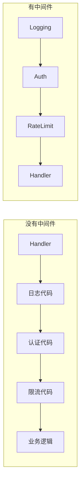
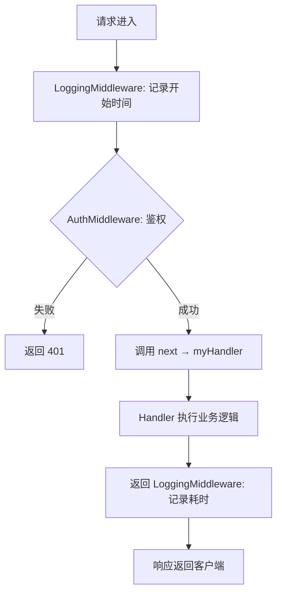
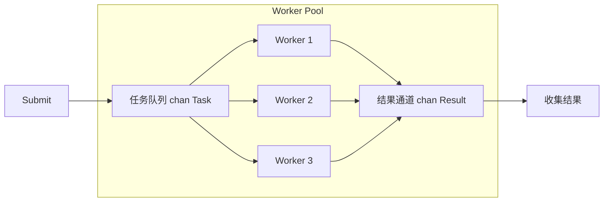
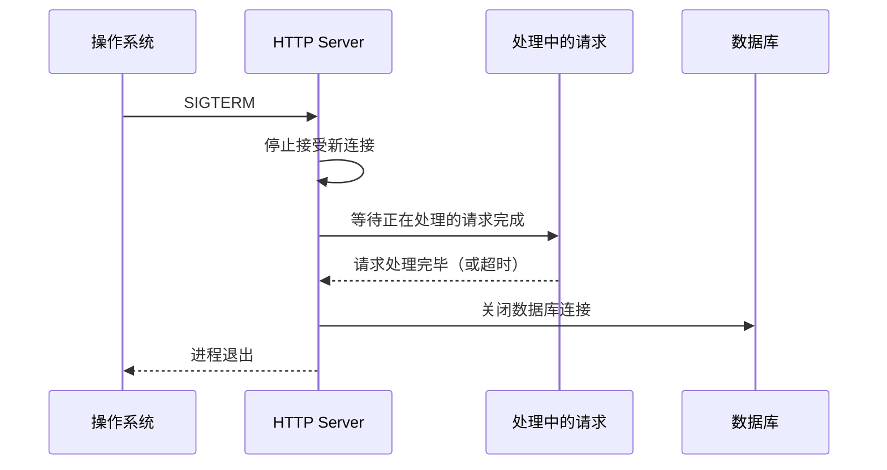

## 技巧一：Go常用模式

Go 语言的设计哲学——"少即是多"（Less is more）——决定了它的设计模式与其他语言有本质区别。没有类继承、没有（早期版本的）泛型、没有异常机制，这些"缺失"反而催生出一套独特的、以**组合优于继承**为核心的惯用模式（Idiomatic Patterns）。

与 Java/C++ 从 GoF 23 种经典模式演化出的模式体系不同，Go 的模式是从语言本身的三大支柱——**goroutine + channel 的并发模型**、**interface 的隐式契约**、**error 的多返回值**——上自然生长出来的。这意味着：

- **没有 Singleton 的 class 级实现**，但有 `sync.Once` 的并发安全单例
- **没有 Observer 的继承体系**，但有 channel 的发布-订阅
- **没有 Strategy 的接口继承**，但有函数类型和闭包

本节从实际工程角度出发，梳理 Go 中最常用、最值得掌握的七大模式，每个模式从**设计动机**讲到**实战细节**，帮助读者不仅"会用"，更"知道为什么这样用"。

---

### 1.1 Functional Options 模式

#### 设计动机

创建一个结构体时，如果字段较多且大部分使用默认值，你面临三个选择：

| 方案 | 示例 | 问题 |
|------|------|------|
| 传入全部参数 | `NewServer(host, port, timeout, maxConn, ...)` | 参数膨胀，调用方记不住顺序 |
| 传入结构体 | `NewServer(Config{Host: "x"})` | 无法设默认值，空字段语义模糊 |
| Setter 方法 | `srv.SetHost("x")` | 多步操作非原子，无法在构造时校验 |

**Functional Options** 是 Dave Cheney 在 2014 年提出的方案（[The Ultimate Go Workshop](https://dave.cheney.net/2014/10/17/functional-options-for-friendly-apis)）：用**函数闭包**封装可选配置，在构造时一次性应用。它同时解决了默认值、可读性、可扩展性三个问题。

**为什么不是普通 Config 结构体？**

```go
// Config 结构体方案的问题：零值语义模糊
type ServerConfig struct {
    Host    string        // "" 是默认值还是用户故意设为空？
    Port    int           // 0 是未设置还是用户要绑定 0 端口？
    Timeout time.Duration // 0s 是未设置还是用户不要超时？
}
srv := NewServer(ServerConfig{}) // 调用方无法区分"使用默认"和"故意设空"
```

Functional Options 通过**只在调用方显式声明的字段才被修改**，其余保持默认值，完美回避了零值语义歧义。

#### 核心实现

```go
package server

import "time"

// Server 是我们要配置的结构体
type Server struct {
    host    string
    port    int
    timeout time.Duration
    maxConn int
}

// Option 是一个函数类型，接收 *Server 并修改它
type Option func(*Server)

// WithHost 设置主机地址
func WithHost(host string) Option {
    return func(s *Server) {
        s.host = host
    }
}

// WithPort 设置端口号
func WithPort(port int) Option {
    return func(s *Server) {
        s.port = port
    }
}

// WithTimeout 设置超时时间
func WithTimeout(timeout time.Duration) Option {
    return func(s *Server) {
        s.timeout = timeout
    }
}

// WithMaxConn 设置最大连接数
func WithMaxConn(n int) Option {
    return func(s *Server) {
        s.maxConn = n
    }
}

// NewServer 创建 Server，支持可选参数
func NewServer(opts ...Option) *Server {
    s := &amp;Server{
        host:    "localhost", // 默认值
        port:    8080,
        timeout: 30 * time.Second,
        maxConn: 100,
    }
    for _, opt := range opts {
        opt(s)
    }
    return s
}
```

调用方式清晰自解释：

```go
// 只改需要的字段，其余使用默认值
srv := NewServer(
    WithHost("0.0.0.0"),
    WithPort(443),
    WithTimeout(10*time.Second),
)

// 完全使用默认值
srv := NewServer()
```

#### 进阶：带验证的 Options

实际工程中，Options 常与参数校验结合。通过将 `Option` 改为返回 `error` 的签名来实现：

```go
// OptionFunc 返回 error，允许校验失败
type OptionFunc func(*Server) error

func WithPort(port int) OptionFunc {
    return func(s *Server) error {
        if port < 1 || port > 65535 {
            return fmt.Errorf("invalid port: %d", port)
        }
        s.port = port
        return nil
    }
}

// WithMaxConn 带交叉校验：最大连接数不能超过系统限制
func WithMaxConn(n int) OptionFunc {
    return func(s *Server) error {
        if n <= 0 {
            return fmt.Errorf("maxConn must be positive, got %d", n)
        }
        if n > 10000 {
            return fmt.Errorf("maxConn %d exceeds system limit", n)
        }
        s.maxConn = n
        return nil
    }
}

func NewServer(opts ...OptionFunc) (*Server, error) {
    s := &amp;Server{
        host:    "localhost",
        port:    8080,
        timeout: 30 * time.Second,
        maxConn: 100,
    }
    for _, opt := range opts {
        if err := opt(s); err != nil {
            return nil, err // 遇到第一个错误立即返回
        }
    }
    return s, nil
}

// 使用
srv, err := NewServer(
    WithHost("0.0.0.0"),
    WithPort(99999), // 触发校验错误: invalid port: 99999
)
```

**设计要点**：校验在构造时而非使用时失败，符合"fail fast"原则——问题暴露得越早，修复成本越低。

#### 适用场景与限制

| 适用 | 不适用 |
|------|--------|
| 构造函数参数超过 3 个 | 结构体只有 2-3 个字段，直接传参更简单 |
| 字段会持续增加（API 演进友好） | 需要在多个 Option 之间共享状态 |
| 希望保持向后兼容的库/API 设计 | 性能极度敏感的热路径（闭包有少量分配开销） |
| 库的对外 API（消费者体验最佳） | 内部代码（直接传结构体更清晰） |

**性能考量**：每个 `Option` 是一个闭包，会产生一次堆分配。在极端热路径（每秒百万次调用）下，直接传结构体更快。但在 99% 的场景下，这点开销可以忽略不计。

> **最佳实践**：Functional Options 是 Go 社区事实上的标准模式，被 `gRPC`、`zap`、`docker`、`go-kit` 等主流项目广泛采用。新项目设计公共 API 时，优先考虑此模式。

---

### 1.2 中间件模式（Middleware / Decorator）

#### 设计动机

Web 服务和 CLI 工具中，横切关注点（Cross-Cutting Concerns）无处不在：日志记录、认证鉴权、限流、监控、恢复……如果将这些逻辑全部嵌入每个 Handler，会导致严重的代码重复和职责混乱。

中间件模式的核心思想：**每个功能封装为一个"包装器"，多个包装器可以自由组合叠加**。这与 Linux 的管道（pipe）哲学一脉相承。



#### 核心实现

```go
package middleware

import (
    "log"
    "net/http"
    "time"
)

// Handler 是标准 HTTP handler 的简化形式
type Handler func(http.ResponseWriter, *http.Request)

// Middleware 包装一个 Handler，返回一个新 Handler
type Middleware func(Handler) Handler

// Chain 将多个中间件按顺序串联
// 执行顺序：Logging → Auth → RateLimit → 最终Handler
func Chain(mws ...Middleware) Middleware {
    return func(final Handler) Handler {
        for i := len(mws) - 1; i >= 0; i-- {
            final = mws[i](final)
        }
        return final
    }
}

// ---------- 具体中间件 ----------

// LoggingMiddleware 记录请求方法、路径和耗时
func LoggingMiddleware(next Handler) Handler {
    return func(w http.ResponseWriter, r *http.Request) {
        start := time.Now()
        next(w, r) // 调用下一层
        log.Printf("[%s] %s %v", r.Method, r.URL.Path, time.Since(start))
    }
}

// AuthMiddleware 校验 Authorization 头
func AuthMiddleware(next Handler) Handler {
    return func(w http.ResponseWriter, r *http.Request) {
        token := r.Header.Get("Authorization")
        if !isValidToken(token) {
            http.Error(w, "Unauthorized", http.StatusUnauthorized)
            return // 短路：不调用 next，请求到此为止
        }
        next(w, r)
    }
}

// RecoverMiddleware 捕获 panic，防止服务崩溃
func RecoverMiddleware(next Handler) Handler {
    return func(w http.ResponseWriter, r *http.Request) {
        defer func() {
            if err := recover(); err != nil {
                log.Printf("panic recovered: %v", err)
                http.Error(w, "Internal Server Error", http.StatusInternalServerError)
            }
        }()
        next(w, r)
    }
}

// RateLimitMiddleware 简易限流（生产环境应使用令牌桶算法）
func RateLimitMiddleware(next Handler) Handler {
    limiter := time.NewTicker(100 * time.Millisecond) // 每 100ms 放行一个
    return func(w http.ResponseWriter, r *http.Request) {
        <-limiter.C // 阻塞直到令牌到达
        next(w, r)
    }
}
```

#### 组合与使用

```go
func main() {
    myHandler := func(w http.ResponseWriter, r *http.Request) {
        w.Write([]byte("Hello, World!"))
    }

    // 组合：从外到内依次是 Logging → Auth → 最终 Handler
    handler := Chain(
        LoggingMiddleware,
        AuthMiddleware,
    )(myHandler)

    http.HandleFunc("/api/data", handler)
    log.Fatal(http.ListenAndServe(":8080", nil))
}
```

#### 执行流程图



#### 进阶：带中间件链的 HTTP Server 封装

实际项目中，通常会将中间件链与路由绑定，按路由组分配不同的中间件组合：

```go
type Server struct {
    router *http.ServeMux
    global []Middleware // 全局中间件
}

func NewServer(mws ...Middleware) *Server {
    return &amp;Server{
        router: http.NewServeMux(),
        global: mws,
    }
}

// Handle 注册路由，自动叠加全局中间件
func (s *Server) Handle(pattern string, h Handler, mws ...Middleware) {
    // 全局中间件在最外层，路由特定中间件在内层
    all := append(s.global, mws...)
    final := Chain(all...)(h)
    s.router.HandleFunc(pattern, final)
}

// 运行
srv := NewServer(RecoverMiddleware, LoggingMiddleware)
srv.Handle("/api/public", publicHandler)                       // 无鉴权
srv.Handle("/api/private", privateHandler, AuthMiddleware)     // 有鉴权
```

**中间件排序的最佳实践**（从外到内）：

| 顺序 | 中间件 | 原因 |
|------|--------|------|
| 1（最外层） | Recover | 必须最先捕获 panic，否则后续中间件的 panic 无法恢复 |
| 2 | Logging | 记录所有请求（包括被后续中间件拒绝的） |
| 3 | RateLimit | 在认证之前限流，避免认证逻辑被恶意请求打满 |
| 4 | Auth/CORS | 认证和跨域处理 |
| 5（最内层） | 业务 Handler | 只处理已通过所有前置检查的请求 |

---

### 1.3 Worker Pool 模式（工作池）

#### 设计动机

Go 的 goroutine 虽然轻量（初始栈 2-8KB，可动态增长），但在处理大量任务时，**无限制地创建 goroutine** 会导致：

- **内存暴涨**：10 万个 goroutine 至少占用 200MB-800MB 栈内存
- **调度器压力剧增**：GMP 调度模型中，P 的本地队列溢出后需要全局锁竞争
- **下游资源被打满**：数据库连接池、HTTP 连接池有上限，并发过高会触发连接耗尽

Worker Pool 模式通过**固定数量的 goroutine** 消费任务队列，实现**受控并发**。这是 Go 并发编程中最重要的生产级模式。

#### 核心实现：基于 Channel 的 Worker Pool

```go
package workerpool

import (
    "context"
    "fmt"
    "sync"
)

// Task 代表一个待处理的任务
type Task struct {
    ID      int
    Payload string
}

// WorkerPool 管理一组工作 goroutine
type WorkerPool struct {
    tasks    chan Task     // 任务队列
    workers  int          // worker 数量
    results  chan Result   // 结果通道
    wg       sync.WaitGroup
}

// Result 处理结果
type Result struct {
    TaskID  int
    Output  string
    Err     error
}

// New 创建工作池
func New(workerCount, queueSize int) *WorkerPool {
    return &amp;WorkerPool{
        tasks:   make(chan Task, queueSize),
        workers: workerCount,
        results: make(chan Result, queueSize),
    }
}

// Submit 提交任务（队列满则阻塞）
func (p *WorkerPool) Submit(task Task) {
    p.tasks <- task
}

// Start 启动所有 worker
func (p *WorkerPool) Start(handler func(Task) Result) {
    for i := 0; i < p.workers; i++ {
        p.wg.Add(1)
        go p.worker(i, handler)
    }
}

// worker 是单个工作 goroutine 的主循环
func (p *WorkerPool) worker(id int, handler func(Task) Result) {
    defer p.wg.Done()
    for task := range p.tasks {
        result := handler(task)
        p.results <- result
    }
}

// Stop 停止 worker pool，等待所有任务完成
func (p *WorkerPool) Stop() {
    close(p.tasks)   // 关闭任务通道，worker 会退出 for-range 循环
    p.wg.Wait()      // 等待所有 worker 完成
    close(p.results) // 关闭结果通道
}

// Results 返回结果通道（只读）
func (p *WorkerPool) Results() <-chan Result {
    return p.results
}
```

#### 使用示例

```go
func main() {
    pool := workerpool.New(3, 100) // 3 个 worker，队列容量 100

    // 定义处理逻辑
    handler := func(t workerpool.Task) workerpool.Result {
        time.Sleep(time.Duration(rand.Intn(100)) * time.Millisecond)
        return workerpool.Result{
            TaskID: t.ID,
            Output: fmt.Sprintf("processed: %s", t.Payload),
        }
    }

    pool.Start(handler)

    // 提交任务
    for i := 0; i < 10; i++ {
        pool.Submit(workerpool.Task{ID: i, Payload: fmt.Sprintf("task-%d", i)})
    }

    pool.Stop()

    // 收集结果
    for result := range pool.Results() {
        fmt.Printf("Task %d: %s\n", result.TaskID, result.Output)
    }
}
```

#### 架构图



#### 进阶：带 Context 取消和错误恢复的 Worker Pool

生产环境中，Worker Pool 必须支持**优雅取消**和**单任务失败不拖垮整个池**：

```go
// WorkerWithRecovery 带 panic 恢复的 worker
func (p *WorkerPool) workerWithContext(ctx context.Context, id int, handler func(Task) Result) {
    defer p.wg.Done()
    for {
        select {
        case <-ctx.Done():
            // 上下文被取消，丢弃未处理的任务
            return
        case task, ok := <-p.tasks:
            if !ok {
                return // 通道已关闭
            }
            // 单个任务 panic 不会影响其他 worker
            func() {
                defer func() {
                    if r := recover(); r != nil {
                        p.results <- Result{
                            TaskID: task.ID,
                            Err:    fmt.Errorf("panic in worker %d: %v", id, r),
                        }
                    }
                }()
                result := handler(task)
                p.results <- result
            }()
        }
    }
}
```

#### 关键设计决策

| 决策点 | 选项 | 建议 |
|--------|------|------|
| Worker 数量 | 固定 vs 动态 | 生产环境固定，避免 goroutine 抖动 |
| 队列大小 | 有缓冲 vs 无缓冲 | 有缓冲（避免提交方频繁阻塞） |
| 关停方式 | close channel vs context | 短任务用 close，长任务用 context 取消 |
| 错误处理 | 内部重试 vs 透传结果 | 透传结果让调用方决定策略 |
| Worker 数量确定 | CPU 密集 vs IO 密集 | CPU: `runtime.NumCPU()`, IO: 10-100x CPU 核数 |

**Worker 数量的经验公式**：
- **CPU 密集型**：`N = runtime.NumCPU()`（避免过多上下文切换）
- **IO 密集型**：`N = runtime.NumCPU() * (1 + wait_time / compute_time)`
- **不确定时**：从 `NumCPU()` 开始，通过基准测试调优

---

### 1.4 Context 模式（上下文传播）

#### 设计动机

在分布式系统和并发程序中，三个问题亟待解决：

- **超时控制**：请求超过 3 秒应该放弃
- **取消传播**：用户断开连接后，下游所有操作都应停止
- **请求级元数据**：traceID、认证信息需要跨函数/协程传递

Go 1.7 引入的 `context` 包是解决这些问题的**统一机制**。它是 Go 并发模式的基础设施，几乎所有涉及并发或网络 I/O 的代码都离不开它。

#### 四种 Context 创建方式

```go
// 1. Background：根 context，永不取消（程序入口使用）
ctx := context.Background()

// 2. TODO：不确定用哪个 context 时的占位符（与 Background 行为相同）
ctx := context.TODO()

// 3. WithCancel：手动取消
ctx, cancel := context.WithCancel(context.Background())
defer cancel() // 必须调用，防止资源泄漏
go func() {
    select {
    case <-ctx.Done():
        fmt.Println("取消:", ctx.Err()) // context canceled
    }
}()
cancel() // 触发取消

// 4. WithTimeout / WithDeadline：自动超时
ctx, cancel := context.WithTimeout(context.Background(), 3*time.Second)
defer cancel()
result, err := queryDatabase(ctx) // 3 秒后自动取消
```

**各创建方式的选择指南**：

| 方式 | 何时使用 | 注意事项 |
|------|----------|----------|
| `Background()` | main 函数、初始化、测试 | 永不取消，不要在业务代码中使用 |
| `TODO()` | 重构中间态，不确定用什么 | 应视为 TODO 标记，最终要替换为具体 context |
| `WithCancel()` | 需要手动控制取消时机 | 必须调用 cancel()，否则泄漏 |
| `WithTimeout()` | HTTP 请求、RPC 调用的超时控制 | timeout 是相对时间，从调用时刻开始计算 |
| `WithDeadline()` | 需要绝对时间截止 | 比 WithTimeout 更精确，适合跨服务的全局超时 |

#### 传递 Value（请求级元数据）

```go
// 存入 context（通常在中间件中完成）
type contextKey string
const traceIDKey contextKey = "traceID"

func WithTraceID(ctx context.Context, traceID string) context.Context {
    return context.WithValue(ctx, traceIDKey, traceID)
}

// 从 context 中取出（提供类型安全的 getter）
func GetTraceID(ctx context.Context) string {
    if v := ctx.Value(traceIDKey); v != nil {
        return v.(string)
    }
    return "unknown"
}

// 在 HTTP 中间件中设置
func TracingMiddleware(next http.Handler) http.Handler {
    return http.HandlerFunc(func(w http.ResponseWriter, r *http.Request) {
        traceID := r.Header.Get("X-Trace-ID")
        if traceID == "" {
            traceID = uuid.New().String()
        }
        ctx := WithTraceID(r.Context(), traceID)
        next.ServeHTTP(w, r.WithContext(ctx))
    })
}
```

**context.Value 使用红线**：

```go
// ❌ 绝对不要这样做：
ctx = context.WithValue(ctx, "db", dbConn)          // 用裸字符串做 key，容易冲突
ctx = context.WithValue(ctx, "user", currentUser)    // 存业务对象，应该是函数参数
ctx = context.WithValue(ctx, configKey, bigConfig)   // 存大型配置，每次WithValue都拷贝

// ✅ 正确用法：
// 1. 只存请求级的元数据（traceID、userID、requestID）
// 2. 用自定义类型做 key，避免冲突
type ctxKey struct{} // 匿名结构体，不可能与其他包冲突
ctx = context.WithValue(ctx, ctxKey{}, "value")
```

#### 实战：带超时和取消的 HTTP 调用链

```go
func handleRequest(w http.ResponseWriter, r *http.Request) {
    ctx, cancel := context.WithTimeout(r.Context(), 5*time.Second)
    defer cancel()

    // 第一步：查用户信息（2秒超时）
    user, err := getUser(ctx, userID)
    if err != nil {
        // 检查是否因为超时
        if errors.Is(err, context.DeadlineExceeded) {
            http.Error(w, "Gateway Timeout", 504)
            return
        }
        http.Error(w, err.Error(), 500)
        return
    }

    // 第二步：查订单（剩余时间自动继承）
    // 如果第一步用了 2 秒，这里只剩 3 秒
    orders, err := getOrders(ctx, user.ID)
    if err != nil {
        http.Error(w, err.Error(), 500)
        return
    }

    json.NewEncoder(w).Encode(orders)
}
```

#### Context 使用原则

1. **将 Context 作为函数第一个参数**，命名为 `ctx`
2. **不要将 Context 存入结构体**，应在每次调用时显式传递
3. **不要传递 nil Context**，用 `context.TODO()` 或 `context.Background()` 代替
4. **defer cancel()** 必须紧跟 `WithCancel`/`WithTimeout`/`WithDeadline` 之后
5. **只传递请求级数据**（traceID、userID），不要滥用 Value 存业务数据
6. **Context 是并发安全的**，可以安全地在多个 goroutine 之间传递同一个 context

---

### 1.5 Error Handling 模式（错误处理）

#### 设计动机

Go 没有异常机制（`try/catch`），而是通过**多返回值**显式处理错误。这种设计虽然增加了代码量，但带来了**编译期可见性**——你不可能忽略一个未处理的错误（linter 会警告）。

Go 1.13 引入的 `errors.Is`、`errors.As`、`%w` 格式化进一步增强了错误处理能力，形成了层次清晰的错误处理模式。

#### 错误层次设计

生产级项目中，错误不应只是一个字符串，而应是有结构的层次化信息：

```go
package apperr

import (
    "fmt"
    "net/http"
)

// AppError 应用层错误，携带业务语义
type AppError struct {
    Code    int    `json:"code"`    // 业务错误码
    Message string `json:"message"` // 用户友好信息
    Err     error  `json:"-"`       // 原始错误（不暴露给用户）
}

func (e *AppError) Error() string {
    if e.Err != nil {
        return fmt.Sprintf("%s: %v", e.Message, e.Err)
    }
    return e.Message
}

func (e *AppError) Unwrap() error {
    return e.Err // 支持 errors.Is / errors.As
}

// 预定义错误工厂函数
func NotFound(resource string, id interface{}) *AppError {
    return &amp;AppError{
        Code:    40400,
        Message: fmt.Sprintf("%s not found", resource),
        Err:     fmt.Errorf("resource %s with id %v", resource, id),
    }
}

func BadRequest(msg string, err error) *AppError {
    return &amp;AppError{Code: 40000, Message: msg, Err: err}
}

func Internal(msg string, err error) *AppError {
    return &amp;AppError{Code: 50000, Message: msg, Err: err}
}

// HTTPStatus 将业务错误码映射为 HTTP 状态码
func HTTPStatus(code int) int {
    switch {
    case code >= 40000 &amp;&amp; code < 40400:
        return http.StatusBadRequest
    case code >= 40400 &amp;&amp; code < 40500:
        return http.StatusNotFound
    case code >= 50000 &amp;&amp; code < 60000:
        return http.StatusInternalServerError
    default:
        return http.StatusInternalServerError
    }
}
```

#### 三种错误策略对比

| 策略 | 适用场景 | 示例 |
|------|----------|------|
| **哨兵错误**（Sentinel） | 预定义的、全局唯一的错误值 | `var ErrNotFound = errors.New("not found")` |
| **类型错误**（Typed） | 需要携带上下文信息 | `&AppError{Code: 404, Message: "user not found"}` |
| **行为错误**（Interface） | 需要根据错误行为而非类型处理 | `type Timeout interface { Timeout() bool }` |

```go
// 哨兵错误：简单但不携带上下文
var ErrPermissionDenied = errors.New("permission denied")

func authorize(user Role, resource string) error {
    if user != Admin {
        return fmt.Errorf("authorize %s: %w", resource, ErrPermissionDenied)
    }
    return nil
}

// 类型错误：可携带结构化信息
type ValidationError struct {
    Field   string
    Message string
}

func (e *ValidationError) Error() string {
    return fmt.Sprintf("validation error on %s: %s", e.Field, e.Message)
}

func processInput(input string) error {
    return &amp;ValidationError{Field: "email", Message: "invalid format"}
}

// 行为错误：基于能力而非类型
type temporary interface {
    Temporary() bool
}

func doWithRetry(fn func() error) error {
    for i := 0; i < 3; i++ {
        err := fn()
        if err == nil {
            return nil
        }
        var t temporary
        if errors.As(err, &amp;t) &amp;&amp; t.Temporary() {
            time.Sleep(time.Duration(i+1) * 100 * time.Millisecond)
            continue
        }
        return err // 非临时错误，直接返回
    }
    return fmt.Errorf("retries exhausted")
}
```

#### 错误包装与检查

```go
import (
    "errors"
    "fmt"
)

var ErrPermissionDenied = errors.New("permission denied")

// 包装错误（保留原始错误链）
func authorize(user Role, resource string) error {
    if user != Admin {
        return fmt.Errorf("authorize %s: %w", resource, ErrPermissionDenied)
    }
    return nil
}

// 检查错误（支持链式匹配）
func handleRequest(w http.ResponseWriter, r *http.Request) {
    if err := authorize(user, "config"); err != nil {
        if errors.Is(err, ErrPermissionDenied) {
            http.Error(w, "Forbidden", http.StatusForbidden)
            return
        }
        // 其他错误...
    }
}

// 提取特定类型错误
func handleErr(err error) {
    var ve *ValidationError
    if errors.As(err, &amp;ve) {
        fmt.Printf("字段 %s 有误: %s\n", ve.Field, ve.Message)
        return
    }
    // 其他类型的错误...
}
```

#### 错误处理对照表

| 场景 | 正确做法 | 常见错误 |
|------|----------|----------|
| 已知错误类型 | `errors.Is(err, ErrXxx)` | `err == ErrXxx`（不支持包装链） |
| 已知错误类型 | `errors.As(err, &target)` | 类型断言 `err.(*Type)`（会 panic） |
| 向上层传递 | `fmt.Errorf("context: %w", err)` | `fmt.Errorf("context: %v", err)`（断裂错误链） |
| 日志记录 | `log.Errorf("operation failed: %v", err)` | 只记 `log.Error(err)` 丢失上下文 |
| 忽略错误 | `_ = doSomething()` // 显式注释 | 不写任何代码（审阅时无法区分遗漏和故意） |
| 多错误聚合 | `errors.Join(err1, err2)` (Go 1.20+) | 只返回第一个，丢失后续错误 |

#### 进阶：错误聚合模式

批量操作中，单个失败不应中断整个批次。Go 1.20 提供了内置的 `errors.Join`：

```go
// 多步验证，收集所有错误而非遇到第一个就停下
func validateAll(inputs []string) error {
    var errs []error
    for _, input := range inputs {
        if err := validate(input); err != nil {
            errs = append(errs, fmt.Errorf("input %q: %w", input, err))
        }
    }
    if len(errs) > 0 {
        return errors.Join(errs...) // 合并为一个 error
    }
    return nil
}

// 检查聚合错误中的特定错误
err := validateAll(inputs)
if err != nil {
    // errors.Is 和 errors.As 会搜索整个错误链
    var ve *ValidationError
    if errors.As(err, &amp;ve) {
        fmt.Println("validation failed:", ve.Field)
    }
}
```

---

### 1.6 Pipeline 模式（管道）

#### 设计动机

数据处理任务中，经常需要将原始数据经过**多个阶段**依次加工：解码 → 过滤 → 转换 → 输出。如果用单个函数串行处理，代码臃肿且难以复用。

Pipeline 模式借鉴 Unix 管道思想：**每个阶段是一个独立的 goroutine，通过 Channel 串联**。每个阶段专注自己的职责，阶段之间通过 Channel 自动同步。

**管道的威力在于**：每个阶段可以并发执行，数据像流水线一样在阶段之间流动，整体吞吐量取决于最慢的阶段而非所有阶段之和。

#### 核心实现

```go
package pipeline

import "sync"

// Stage 是管道中的一个处理阶段
// 输入通道 → 处理逻辑 → 输出通道
type Stage[I, O any] struct {
    Input  <-chan I
    Output chan O
    Fn     func(I) (O, error)
    Errs   chan error
}

// Run 启动一个 Stage
func Run[I, O any](input <-chan I, fn func(I) (O, error)) (<-chan O, <-chan error) {
    output := make(chan O)
    errs := make(chan error)

    go func() {
        defer close(output)
        defer close(errs)
        for item := range input {
            result, err := fn(item)
            if err != nil {
                errs <- err
                continue
            }
            output <- result
        }
    }()

    return output, errs
}

// Take 取前 N 个元素（类似 SQL LIMIT）
func Take[T any](input <-chan T, n int) <-chan T {
    output := make(chan T)
    go func() {
        defer close(output)
        for i := 0; i < n; i++ {
            val, ok := <-input
            if !ok {
                return
            }
            output <- val
        }
    }()
    return output
}

// Filter 过滤元素（保留满足条件的）
func Filter[T any](input <-chan T, pred func(T) bool) <-chan T {
    output := make(chan T)
    go func() {
        defer close(output)
        for item := range input {
            if pred(item) {
                output <- item
            }
        }
    }()
    return output
}
```

#### 实战：日志分析管道

```go
func main() {
    // 阶段 1：读取日志行
    lines := readLines("/var/log/access.log")

    // 阶段 2：过滤出错误行
    errorLines, errs1 := pipeline.Run(lines, func(line string) (string, error) {
        if strings.Contains(line, "ERROR") {
            return line, nil
        }
        return "", nil // 过滤掉
    })

    // 阶段 3：提取 IP 地址
    ips, errs2 := pipeline.Run(errorLines, func(line string) (string, error) {
        parts := strings.Fields(line)
        if len(parts) > 0 {
            return parts[0], nil
        }
        return "", fmt.Errorf("cannot parse line: %s", line)
    })

    // 阶段 4：按 IP 聚合计数（使用 map 在单个 goroutine 中完成）
    ipCounts := make(map[string]int)
    for ip := range ips {
        ipCounts[ip]++
    }

    // 输出结果
    for ip, count := range ipCounts {
        fmt.Printf("%s: %d\n", ip, count)
    }

    // 收集管道中各阶段的错误
    go func() {
        for err := range mergeErrors(errs1, errs2) {
            log.Printf("pipeline error: %v", err)
        }
    }()
}
```

#### Fan-Out / Fan-In 模式

当管道中某个阶段成为瓶颈时，可以启动多个 goroutine 并行处理（Fan-Out），再将结果汇总（Fan-In）：

```go
// Fan-Out: 启动 N 个 worker 处理同一个输入通道
func FanOut[T, R any](input <-chan T, n int, fn func(T) R) []<-chan R {
    outputs := make([]<-chan R, n)
    for i := 0; i < n; i++ {
        outputs[i] = func() <-chan R {
            out := make(chan R)
            go func() {
                defer close(out)
                for item := range input {
                    out <- fn(item)
                }
            }()
            return out
        }()
    }
    return outputs
}

// Fan-In: 将多个输入通道合并为一个
func FanIn[T any](inputs ...<-chan T) <-chan T {
    var wg sync.WaitGroup
    merged := make(chan T)

    for _, input := range inputs {
        wg.Add(1)
        go func(ch <-chan T) {
            defer wg.Done()
            for item := range ch {
                merged <- item
            }
        }(input)
    }

    go func() {
        wg.Wait()
        close(merged)
    }()

    return merged
}

// 使用：CPU 密集型任务并行化
func processLargeDataset(data []Record) []Result {
    inputCh := make(chan Record, 100)
    go func() {
        for _, r := range data {
            inputCh <- r
        }
        close(inputCh)
    }()

    // Fan-Out: 8 个 worker 并行处理
    workers := FanOut(inputCh, 8, expensiveComputation)

    // Fan-In: 汇总所有结果
    results := FanIn(workers...)

    var all []Result
    for r := range results {
        all = append(all, r)
    }
    return all
}
```

#### 与其他模式的对比

| 模式 | 数据流向 | 适用场景 | 并发模型 |
|------|----------|----------|----------|
| Pipeline | 线性，多阶段串联 | ETL、流处理、日志分析 | 每阶段一个 goroutine |
| Fan-Out/Fan-In | 一对多、多对一 | CPU 密集型任务并行化 | 多 worker + 汇总 |
| Worker Pool | 中心分发 | 任务队列消费 | 固定数量 worker |

---

### 1.7 Graceful Shutdown 模式（优雅关停）

#### 设计动机

服务在收到终止信号（SIGTERM、SIGINT）时，如果直接 `os.Exit(0)`，会导致：

- 正在处理的请求被中断，客户端收到连接重置错误
- 数据库事务未提交，数据不一致
- 临时文件未清理
- Kubernetes 认为 Pod 异常退出，触发重启风暴

优雅关停确保：**等待正在处理的请求完成，拒绝新请求，释放资源**。

#### 核心实现

```go
package graceful

import (
    "context"
    "log"
    "net/http"
    "os"
    "os/signal"
    "syscall"
    "time"
)

// Run 启动 HTTP 服务并实现优雅关停
func Run(addr string, handler http.Handler, shutdownTimeout time.Duration) error {
    srv := &amp;http.Server{
        Addr:    addr,
        Handler: handler,
    }

    // 启动服务（非阻塞）
    errCh := make(chan error, 1)
    go func() {
        log.Printf("server starting on %s", addr)
        if err := srv.ListenAndServe(); err != nil &amp;&amp; err != http.ErrServerClosed {
            errCh <- err
        }
    }()

    // 等待终止信号
    quit := make(chan os.Signal, 1)
    signal.Notify(quit, syscall.SIGINT, syscall.SIGTERM)

    select {
    case <-quit:
        log.Println("shutdown signal received")
    case err := <-errCh:
        return fmt.Errorf("server error: %w", err)
    }

    // 创建超时 context，确保关停不会无限等待
    ctx, cancel := context.WithTimeout(context.Background(), shutdownTimeout)
    defer cancel()

    log.Println("shutting down gracefully...")
    if err := srv.Shutdown(ctx); err != nil {
        return fmt.Errorf("shutdown error: %w", err)
    }

    log.Println("server stopped")
    return nil
}
```

#### 带数据库连接的完整关停流程

```go
func main() {
    db, err := sql.Open("postgres", os.Getenv("DATABASE_URL"))
    if err != nil {
        log.Fatal(err)
    }
    defer db.Close() // 程序退出前关闭连接池

    handler := setupRoutes(db)

    srv := &amp;http.Server{
        Addr:    ":8080",
        Handler: handler,
    }

    // 启动服务
    go func() {
        if err := srv.ListenAndServe(); err != http.ErrServerClosed {
            log.Fatalf("listen error: %v", err)
        }
    }()

    // 等待信号
    quit := make(chan os.Signal, 1)
    signal.Notify(quit, syscall.SIGINT, syscall.SIGTERM)
    <-quit

    // 第一阶段：停止接受新请求（立即）
    ctx, cancel := context.WithTimeout(context.Background(), 10*time.Second)
    defer cancel()

    if err := srv.Shutdown(ctx); err != nil {
        log.Printf("http shutdown error: %v", err)
    }

    // 第二阶段：等待处理中的请求完成（已由 Shutdown 处理）

    // 第三阶段：关闭外部依赖
    log.Println("closing database connection...")
    if err := db.Close(); err != nil {
        log.Printf("db close error: %v", err)
    }

    log.Println("all resources released, goodbye!")
}
```

#### 关停时序



#### Kubernetes 集成要点

在 K8s 环境中，优雅关停需要配合 Pod 生命周期管理：

```yaml
apiVersion: v1
kind: Pod
spec:
  containers:
  - name: app
    lifecycle:
      preStop:
        exec:
          command: ["/bin/sh", "-c", "sleep 5"]  # 给 Service 撤销 Endpoint 时间
    readinessProbe:
      httpGet:
        path: /healthz
        port: 8080
      periodSeconds: 5
    livenessProbe:
      httpGet:
        path: /healthz
        port: 8080
      periodSeconds: 10
  terminationGracePeriodSeconds: 30  # 必须 > 应用的 shutdown timeout
```

**关停流程**：
1. K8s 发送 SIGTERM
2. 应用停止接受新请求，等待处理中的请求完成
3. 同时 K8s 从 Service 的 Endpoints 中移除该 Pod（有延迟）
4. preStop hook 给负载均衡器时间更新路由
5. 超过 terminationGracePeriodSeconds 后，K8s 发送 SIGKILL 强制终止

---

### 1.8 常见反模式与避坑指南

以下是 Go 项目中最常见的错误用法：

#### 反模式一：忽略 Error

```go
// ❌ 错误：吞掉错误
result, _ := doSomething()

// ✅ 正确：显式处理
result, err := doSomething()
if err != nil {
    return fmt.Errorf("doSomething: %w", err)
}
```

#### 反模式二：goroutine 泄漏

```go
// ❌ 错误：channel 没有关闭，goroutine 永远阻塞
func leaky() {
    ch := make(chan int)
    go func() {
        val := <-ch // 永远等不到值
        fmt.Println(val)
    }()
    // 函数返回，ch 被 GC，但 goroutine 泄漏
}

// ✅ 正确：使用 context 或保证 channel 关闭
func safe(ctx context.Context) {
    ch := make(chan int, 1)
    go func() {
        select {
        case val := <-ch:
            fmt.Println(val)
        case <-ctx.Done():
            return // context 取消时正常退出
        }
    }()
}
```

**检测泄漏**：使用 `runtime.NumGoroutine()` 监控，或在测试中用 `goleak` 库：

```go
import "go.uber.org/goleak"

func TestNoLeak(t *testing.T) {
    defer goleak.VerifyNone(t)
    // 你的测试代码...
}
```

#### 反模式三：循环中的 goroutine 闭包陷阱

```go
// ❌ 错误（Go 1.21 之前）：所有 goroutine 共享同一个 i
for i := 0; i < 5; i++ {
    go func() {
        fmt.Println(i) // 预期 0-4，实际全输出 5
    }()
}

// ✅ 方式一：通过参数传入（适用于所有版本）
for i := 0; i < 5; i++ {
    go func(n int) {
        fmt.Println(n) // 0, 1, 2, 3, 4
    }(i)
}

// ✅ 方式二：循环内创建新变量（Go 1.22+，循环变量作用域改为每次迭代）
for i := 0; i < 5; i++ {
    go func() {
        fmt.Println(i) // 0, 1, 2, 3, 4（Go 1.22+ 语义正确）
    }()
}
```

> **Go 1.22 重要变更**：从 Go 1.22 开始，`for` 循环的变量在每次迭代中都是独立的，不再共享。如果你的项目使用 Go 1.22+，方式二的写法已经安全。但为了向后兼容，建议团队统一约定。

#### 反模式四：Context 中存放可变状态

```go
// ❌ 错误：context 存放的是快照，不是引用
type ctxKey string
const userKey ctxKey = "user"

func bad(ctx context.Context, user *User) context.Context {
    ctx = context.WithValue(ctx, userKey, user)
    user.Name = "changed" // 修改原对象
    return ctx
}

// ✅ 正确：如果要存可变对象，存指针并通过方法访问
// 但这仍然是坏设计——可变状态不应通过 context 传递
```

#### 反模式五：Channel 死锁

```go
// ❌ 错误：向无缓冲 channel 发送数据，没有接收方
func deadlock() {
    ch := make(chan int)
    ch <- 42 // 阻塞！没有 goroutine 在接收
}

// ❌ 错误：select 只有一个 case 且没有 default，超时场景下永久阻塞
func timeout() {
    ch := make(chan int)
    select {
    case v := <-ch:
        fmt.Println(v)
    }
    // 如果 ch 永远不发送，这里永远阻塞
}

// ✅ 正确：使用带超时的 select
func safeTimeout() {
    ch := make(chan int)
    select {
    case v := <-ch:
        fmt.Println(v)
    case <-time.After(5 * time.Second):
        fmt.Println("timeout")
    }
}
```

#### 反模式六：Race Condition——共享状态无保护

```go
// ❌ 错误：多个 goroutine 并发读写 map（Go 的 map 不是并发安全的）
var cache = make(map[string]string)

func handleRequest(key string) string {
    if v, ok := cache[key]; ok {
        return v
    }
    cache[key] = "value" // 并发写入 → panic: concurrent map writes
    return "value"
}

// ✅ 方案一：sync.Mutex
var (
    cacheMu sync.RWMutex
    cache   = make(map[string]string)
)

func handleRequestSafe(key string) string {
    cacheMu.RLock()
    if v, ok := cache[key]; ok {
        cacheMu.RUnlock()
        return v
    }
    cacheMu.RUnlock()

    cacheMu.Lock()
    cache[key] = "value"
    cacheMu.Unlock()
    return "value"
}

// ✅ 方案二：sync.Map（适合读多写少的场景）
var cache sync.Map

func handleRequestMap(key string) string {
    if v, ok := cache.Load(key); ok {
        return v.(string)
    }
    cache.Store(key, "value")
    return "value"
}
```

**如何检测 Race**：使用 Go 内置的 race detector：

```bash
go test -race ./...     # 测试时检测
go run -race main.go    # 运行时检测
```

---

### 1.9 模式选择速查表

根据工程需求快速选择合适的模式：

| 需求场景 | 推荐模式 | 关键考量 |
|----------|----------|----------|
| 结构体构造参数多 | Functional Options | 字段经常增加、需要默认值 |
| Web/API 横切关注点 | Middleware | 日志、鉴权、限流需要复用 |
| 并发任务处理 | Worker Pool | 控制并发度、保护下游资源 |
| 多阶段数据处理 | Pipeline | 解耦阶段、流式处理 |
| CPU 密集型并行 | Fan-Out/Fan-In | 最大化 CPU 利用率 |
| 超时控制 / 请求取消 | Context | 分布式调用链必备 |
| 错误上报与传播 | Error Wrapping | 保留错误链、区分业务与系统错误 |
| 服务上线 / 下线 | Graceful Shutdown | 有状态服务必须实现 |

#### 模式组合实战

实际项目中，这些模式往往**组合使用**。一个典型的 Go HTTP 微服务会同时用到：

Graceful Shutdown（服务生命周期）
  └── Middleware Chain（日志 → 鉴权 → 限流 → 恢复）
        └── Handler
              ├── Functional Options（配置注入）
              ├── Context（请求级超时 + traceID）
              ├── Worker Pool（异步任务处理）
              │     └── Pipeline（多阶段数据转换）
              └── Error Wrapping（结构化错误返回）

> **核心原则**：Go 的设计模式不是从 GoF 那 23 个模式照搬来的，而是在 Go 的语言特性和并发模型上自然生长出来的。理解 Go 的 channel、goroutine、interface 和 error 机制，比背诵模式名称更重要。好的 Go 代码读起来像散文，每个模式的使用都是"恰到好处"，而非"为了用而用"。
