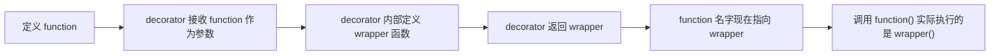
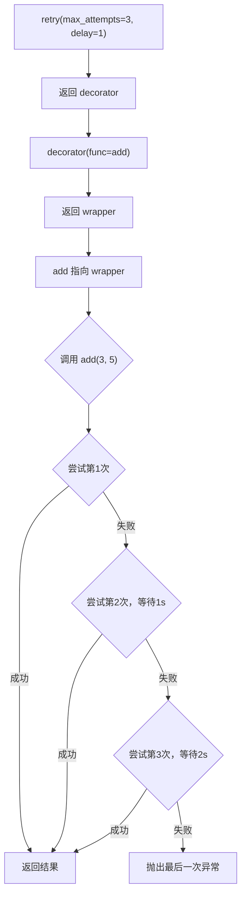

## 技巧二：Python装饰器模式

装饰器（Decorator）是 Python 最具特色的语言特性之一——函数可以像普通值一样被传递、包装和增强，而不需要修改原有代码。从 Flask 的 `@app.route` 到 Django 的 `@login_required`，从数据科学的 `@lru_cache` 到测试框架的 `@pytest.mark`，装饰器几乎渗透在 Python 生态的每一个角落。

本节从装饰器的底层机制讲起，覆盖基础语法、参数化装饰器、类装饰器、内置装饰器、实战模式、常见陷阱到高级技巧，帮助读者不仅"会写装饰器"，更"知道什么时候该用装饰器"。

---

### 1. 设计动机：为什么需要装饰器

在实际工程中，有大量逻辑需要在不改变函数本身的情况下"增强"函数行为：

| 需求 | 不用装饰器的做法 | 用装饰器的做法 |
|------|-----------------|---------------|
| 给函数添加日志 | 在每个函数开头/结尾写 print | `@log` 一行搞定 |
| 测量执行时间 | 在每个函数前后写 `time.time()` | `@timer` 一行搞定 |
| 缓存计算结果 | 每个函数内部维护 dict | `@lru_cache` 或自定义 `@cache` |
| 权限检查 | 每个路由处理函数里写 if-else | `@require_role("admin")` |
| 参数校验 | 每个函数开头写类型检查 | `@validate` 自动校验 |
| 重试逻辑 | 在函数内部写 try-except 循环 | `@retry` 一行搞定 |

装饰器的本质是一个**高阶函数**：它接收一个函数作为参数，返回一个新函数（通常是原函数的增强版）。这种"函数包装函数"的模式，让横切关注点（Cross-Cutting Concerns）与业务逻辑彻底分离。

```python
# 不用装饰器：每个 API 端点都重复写计时和日志
def get_user(user_id):
    start = time.time()
    print(f"[INFO] get_user called with {user_id}")
    result = db.query(user_id)
    print(f"[INFO] get_user completed in {time.time()-start:.2f}s")
    return result

def create_order(order_data):
    start = time.time()
    print(f"[INFO] create_order called with {order_data}")
    result = db.insert(order_data)
    print(f"[INFO] create_order completed in {time.time()-start:.2f}s")
    return result

# 用装饰器：业务逻辑干净纯粹
@timer
@log
def get_user(user_id):
    return db.query(user_id)

@timer
@log
def create_order(order_data):
    return db.insert(order_data)
```

---

### 2. 装饰器的底层机制

理解装饰器，关键是理解 Python 的一个核心事实：**函数是一等公民（First-Class Citizen）**。函数可以赋值给变量、作为参数传递、作为返回值——这意味着以下操作完全合法：

```python
def greet(name):
    return f"Hello, {name}!"

# 函数赋值给变量
say_hello = greet
print(say_hello("Alice"))  # Hello, Alice!

# 函数作为参数传递
def apply(func, value):
    return func(value)

print(apply(greet, "Bob"))  # Hello, Bob!
```

装饰器正是利用了这一特性。`@decorator` 语法糖等价于：

```python
@decorator
def function():
    pass

# 等价于
def function():
    pass
function = decorator(function)
```

展开过程可以用这个流程图理解：



### 2.1 最简装饰器的实现

```python
def simple_decorator(func):
    def wrapper(*args, **kwargs):
        print(f"调用 {func.__name__}")
        result = func(*args, **kwargs)
        print(f"{func.__name__} 返回 {result}")
        return result
    return wrapper

@simple_decorator
def add(a, b):
    return a + b

add(3, 5)
# 输出：
# 调用 add
# add 返回 8
```

这里有几个关键设计决策：

- `wrapper(*args, **kwargs)` 使用可变参数：确保装饰器能适配任何签名的被装饰函数
- `return result`：必须返回原函数的结果，否则被装饰函数的返回值会丢失
- `wrapper` 闭包捕获了 `func`：这就是 Python 闭包（Closure）的工作方式——内层函数可以访问外层函数的局部变量

### 2.2 functools.wraps：保留被装饰函数的元数据

裸装饰器有一个严重问题：被装饰函数的身份信息丢失了。

```python
@simple_decorator
def add(a, b):
    return a + b

print(add.__name__)  # wrapper  ← 原来的函数名丢了！
print(add.__doc__)   # None    ← 文档字符串也丢了！
```

这会导致调试困难、文档工具失效、序列化错误等问题。标准库 `functools.wraps` 是解决方案：

```python
import functools

def proper_decorator(func):
    @functools.wraps(func)  # 将 func 的元数据复制到 wrapper
    def wrapper(*args, **kwargs):
        """wrapper 的文档"""
        print(f"调用 {func.__name__}")
        return func(*args, **kwargs)
    return wrapper

@proper_decorator
def add(a, b):
    """两数相加"""
    return a + b

print(add.__name__)  # add       ← 名字保留了
print(add.__doc__)   # 两数相加  ← 文档也保留了
```

**经验法则：编写装饰器时，永远使用 `@functools.wraps(func)`。** 这不是可选的最佳实践，而是必须遵守的编码规范。

---

### 3. 带参数的装饰器

基础装饰器直接接收函数作为参数，但有时我们需要给装饰器传递配置参数（比如重试次数、超时时间）。这时需要"三层嵌套"——外层接收参数，中层接收函数，内层是实际的包装函数。

```python
import functools
import time

def retry(max_attempts=3, delay=1.0):
    """在失败时自动重试的装饰器（带指数退避）"""
    def decorator(func):
        @functools.wraps(func)
        def wrapper(*args, **kwargs):
            last_exception = None
            for attempt in range(1, max_attempts + 1):
                try:
                    return func(*args, **kwargs)
                except Exception as e:
                    last_exception = e
                    if attempt < max_attempts:
                        wait = delay * (2 ** (attempt - 1))  # 指数退避
                        print(f"[retry] {func.__name__} 第{attempt}次失败，{wait}s后重试: {e}")
                        time.sleep(wait)
            raise last_exception
        return wrapper
    return decorator
```

执行流程：



使用示例：

```python
@retry(max_attempts=3, delay=2.0)
def call_external_api(url):
    """调用不稳定的外部 API"""
    response = requests.get(url, timeout=5)
    response.raise_for_status()
    return response.json()
```

**调用方式的陷阱：** 很多初学者会混淆带参数和不带参数装饰器的调用语法：

```python
# ✅ 带参数装饰器：函数名后面有括号（因为调用了 decorator 工厂）
@retry(max_attempts=3)
def my_func():
    pass

# ✅ 不带参数装饰器：函数名后面没有括号
@retry
def my_func():
    pass  # ← 错误！retry(my_func) 会把 my_func 当成 max_attempts
```

如果想让装饰器既能带参数也能不带参数使用，需要检测参数类型：

```python
import functools

def flexible_retry(func=None, *, max_attempts=3, delay=1.0):
    """灵活的重试装饰器：既能 @retry 也能 @retry(max_attempts=5)"""
    def decorator(func):
        @functools.wraps(func)
        def wrapper(*args, **kwargs):
            import time
            last_exc = None
            for attempt in range(1, max_attempts + 1):
                try:
                    return func(*args, **kwargs)
                except Exception as e:
                    last_exc = e
                    if attempt < max_attempts:
                        time.sleep(delay * (2 ** (attempt - 1)))
            raise last_exc
        return wrapper

    if func is not None:
        # @retry 无括号调用
        return decorator(func)
    # @retry(max_attempts=5) 有括号调用
    return decorator
```

---

### 4. 经典实战装饰器模式

#### 4.1 计时装饰器

性能分析中最常用的装饰器。进阶版应记录最大值、平均值，而不仅仅是打印单次耗时：

```python
import functools
import time
import statistics

def timer(func):
    """测量函数执行时间，支持统计多次调用"""
    call_times = []

    @functools.wraps(func)
    def wrapper(*args, **kwargs):
        start = time.perf_counter()
        result = func(*args, **kwargs)
        elapsed = time.perf_counter() - start
        call_times.append(elapsed)
        print(f"[timer] {func.__name__}: {elapsed:.4f}s")
        return result

    def stats():
        """返回计时统计"""
        if not call_times:
            return {"count": 0}
        return {
            "count": len(call_times),
            "total": sum(call_times),
            "mean": statistics.mean(call_times),
            "median": statistics.median(call_times),
            "min": min(call_times),
            "max": max(call_times),
            "stdev": statistics.stdev(call_times) if len(call_times) > 1 else 0,
        }

    wrapper.stats = stats  # 将统计函数挂到 wrapper 上
    return wrapper

@timer
def slow_function(n):
    time.sleep(0.1)
    return sum(range(n))

# 调用多次后查看统计
for _ in range(5):
    slow_function(1000)

print(slow_function.stats())
# {'count': 5, 'total': 0.501..., 'mean': 0.100..., ...}
```

#### 4.2 缓存装饰器

Python 3.9+ 内置了 `functools.lru_cache`，但自定义缓存装饰器可以实现更多控制（过期时间、自定义淘汰策略等）：

```python
import functools
import time

def timed_cache(maxsize=128, ttl=None):
    """
    带过期时间的缓存装饰器。
    - maxsize: 最大缓存条目数
    - ttl: 缓存有效期（秒），None 表示永不过期
    """
    def decorator(func):
        cache = {}  # key -> (value, timestamp)
        order = []  # 用于 LRU 淘汰

        @functools.wraps(func)
        def wrapper(*args):
            now = time.time()

            # 检查缓存命中
            if args in cache:
                value, ts = cache[args]
                if ttl is None or (now - ts) < ttl:
                    return value
                else:
                    # 已过期，移除
                    del cache[args]
                    order.remove(args)

            # 计算新值
            result = func(*args)

            # 淘汰最旧的条目
            if len(cache) >= maxsize:
                oldest = order.pop(0)
                del cache[oldest]

            cache[args] = (result, now)
            order.append(args)
            return result

        def cache_info():
            return {"size": len(cache), "maxsize": maxsize, "ttl": ttl}

        def cache_clear():
            cache.clear()
            order.clear()

        wrapper.cache_info = cache_info
        wrapper.cache_clear = cache_clear
        return wrapper
    return decorator
```

Python 标准库 `functools.lru_cache` 用法：

```python
from functools import lru_cache

@lru_cache(maxsize=256)
def fibonacci(n):
    if n < 2:
        return n
    return fibonacci(n-1) + fibonacci(n-2)

# 查看缓存统计
print(fibonacci.cache_info())
# CacheInfo(hits=..., misses=..., maxsize=256, currsize=...)
```

Python 3.9+ 还提供了 `@functools.cache`，它是无大小限制的 LRU 缓存（等价于 `@lru_cache(maxsize=None)`），适合参数空间小且值不大的场景。

#### 4.3 日志装饰器

生产级日志装饰器应当捕获函数签名、参数、返回值和异常信息：

```python
import functools
import logging
import traceback

logger = logging.getLogger(__name__)

def log_execution(level=logging.INFO):
    """记录函数调用的详细信息"""
    def decorator(func):
        @functools.wraps(func)
        def wrapper(*args, **kwargs):
            # 构建调用描述
            arg_str = ", ".join(
                [repr(a) for a in args] +
                [f"{k}={v!r}" for k, v in kwargs.items()]
            )
            call_desc = f"{func.__name__}({arg_str})"

            logger.log(level, f"调用 {call_desc}")
            try:
                result = func(*args, **kwargs)
                logger.log(level, f"成功 {call_desc} -> {result!r}")
                return result
            except Exception as e:
                logger.error(
                    f"异常 {call_desc}: {type(e).__name__}: {e}\n"
                    f"{traceback.format_exc()}"
                )
                raise
        return wrapper
    return decorator

@log_execution(level=logging.DEBUG)
def process_order(order_id, priority=False):
    """处理订单"""
    # ... 业务逻辑
    return {"status": "ok", "order_id": order_id}
```

#### 4.4 参数校验装饰器

在函数入口自动校验参数类型和值，避免业务逻辑中充斥 if-else：

```python
import functools
import inspect
from typing import get_type_hints

def validate(**rules):
    """
    参数校验装饰器。
    用法: @validate(user_id=int, age=lambda x: 0 <= x <= 150)
    """
    def decorator(func):
        hints = get_type_hints(func)

        @functools.wraps(func)
        def wrapper(*args, **kwargs):
            # 将位置参数映射到参数名
            sig = inspect.signature(func)
            bound = sig.bind(*args, **kwargs)
            bound.apply_defaults()

            for param_name, rule in rules.items():
                if param_name not in bound.arguments:
                    continue
                value = bound.arguments[param_name]

                if callable(rule):
                    # rule 是一个谓词函数
                    if not rule(value):
                        raise ValueError(
                            f"参数 {param_name}={value!r} 不满足校验规则"
                        )
                elif rule is type:
                    # rule 是 type：校验类型
                    expected = hints.get(param_name)
                    if expected and not isinstance(value, expected):
                        raise TypeError(
                            f"参数 {param_name} 期望 {expected.__name__}，"
                            f"实际是 {type(value).__name__}"
                        )
            return func(*args, **kwargs)
        return wrapper
    return decorator

@validate(
    user_id=lambda x: isinstance(x, int) and x > 0,
    quantity=lambda x: 1 <= x <= 1000,
)
def create_order(user_id, quantity):
    return {"user_id": user_id, "quantity": quantity}
```

#### 4.5 限流装饰器

防止函数被调用过于频繁，常用于 API 客户端：

```python
import functools
import time
import threading

def rate_limit(calls_per_second=10):
    """令牌桶限流装饰器（线程安全）"""
    min_interval = 1.0 / calls_per_second

    def decorator(func):
        lock = threading.Lock()
        last_called = [0.0]

        @functools.wraps(func)
        def wrapper(*args, **kwargs):
            with lock:
                now = time.monotonic()
                elapsed = now - last_called[0]
                if elapsed < min_interval:
                    time.sleep(min_interval - elapsed)
                last_called[0] = time.monotonic()
            return func(*args, **kwargs)
        return wrapper
    return decorator

@rate_limit(calls_per_second=5)  # 每秒最多调用 5 次
def call_api(endpoint):
    import requests
    return requests.get(endpoint)
```

#### 4.6 单次执行装饰器

确保某个初始化函数只执行一次：

```python
import functools

def once(func):
    """确保函数只执行一次，后续调用返回缓存结果"""
    @functools.wraps(func)
    def wrapper(*args, **kwargs):
        if not wrapper.called:
            wrapper.result = func(*args, **kwargs)
            wrapper.called = True
        return wrapper.result
    wrapper.called = False
    return wrapper

@once
def initialize_database():
    """昂贵的数据库初始化"""
    print("正在初始化数据库连接...")
    return create_db_connection()

# 第一次调用：执行函数
db = initialize_database()  # 输出 "正在初始化数据库连接..."

# 后续调用：直接返回缓存结果
db2 = initialize_database()  # 无输出
assert db is db2  # 同一个对象
```

#### 4.7 方法注册装饰器

用于构建命令分发器、路由表等场景：

```python
import functools

class CommandRegistry:
    """命令注册表：通过装饰器注册命令"""
    def __init__(self):
        self._commands = {}

    def register(self, name):
        """装饰器：注册一个命令处理函数"""
        def decorator(func):
            @functools.wraps(func)
            def wrapper(*args, **kwargs):
                return func(*args, **kwargs)
            self._commands[name] = wrapper
            return wrapper
        return decorator

    def execute(self, name, *args, **kwargs):
        if name not in self._commands:
            raise KeyError(f"未知命令: {name}")
        return self._commands[name](*args, **kwargs)

    @property
    def commands(self):
        return dict(self._commands)

# 使用
registry = CommandRegistry()

@registry.register("greet")
def handle_greet(name):
    return f"Hello, {name}!"

@registry.register("add")
def handle_add(a, b):
    return a + b

print(registry.execute("greet", "Alice"))  # Hello, Alice!
print(registry.commands.keys())  # dict_keys(['greet', 'add'])
```

---

### 5. 类装饰器

Python 3.0+ 引入了类装饰器（Class Decorator）——用类的 `__init__` 和 `__call__` 方法实现装饰器功能。这比函数装饰器更适合需要维护复杂状态的场景。

### 5.1 用类实现装饰器

```python
import functools

class CountCalls:
    """统计函数调用次数的类装饰器"""
    def __init__(self, func):
        functools.update_wrapper(self, func)
        self.func = func
        self.count = 0

    def __call__(self, *args, **kwargs):
        self.count += 1
        print(f"[{self.func.__name__}] 第 {self.count} 次调用")
        return self.func(*args, **kwargs)

    def reset(self):
        self.count = 0

@CountCalls
def say_hello(name):
    print(f"Hello, {name}!")

say_hello("Alice")  # [say_hello] 第 1 次调用 → Hello, Alice!
say_hello("Bob")    # [say_hello] 第 2 次调用 → Hello, Bob!
print(say_hello.count)  # 2
```

类装饰器的关键方法：

| 方法 | 作用 | 调用时机 |
|------|------|---------|
| `__init__(self, func)` | 初始化，接收被装饰的函数 | `@decorator` 时（定义类时） |
| `__call__(self, *args)` | 执行增强逻辑并调用原函数 | 每次调用被装饰函数时 |
| `__get__(self, obj, cls)` | 描述符协议，让装饰器在类方法上正常工作 | 访问被装饰的方法时 |

### 5.2 带参数的类装饰器

```python
import functools

class Cache:
    """带 LRU 淘汰策略的缓存类装饰器"""
    def __init__(self, maxsize=128):
        self.maxsize = maxsize
        self._cache = {}
        self._order = []

    def __call__(self, func):
        @functools.wraps(func)
        def wrapper(*args):
            if args in self._cache:
                return self._cache[args]
            result = func(*args)
            if len(self._cache) >= self.maxsize:
                oldest = self._order.pop(0)
                del self._cache[oldest]
            self._cache[args] = result
            self._order.append(args)
            return result
        wrapper.cache_clear = self._cache.clear
        wrapper.cache_info = lambda: {"size": len(self._cache), "maxsize": self.maxsize}
        return wrapper

@Cache(maxsize=512)
def expensive_computation(n):
    return sum(i ** 2 for i in range(n))
```

### 5.3 类装饰器 vs 函数装饰器

| 维度 | 函数装饰器 | 类装饰器 |
|------|-----------|---------|
| 适用场景 | 简单的前后增强 | 需要维护状态、支持多次重置 |
| 状态存储 | 需要闭包变量或函数属性 | 天然有 `self` 存储状态 |
| 可读性 | 简洁直观 | 需要理解 `__call__` 协议 |
| 生命周期 | 与模块绑定 | 可以控制实例生命周期 |
| 调试 | 较难（函数嵌套） | 较易（可以用调试器进入 `__call__`） |

---

### 6. Python 内置装饰器

Python 提供了四个常用的内置装饰器，它们是语言层面的基础设施：

### 6.1 @property：受控的属性访问

```python
class Temperature:
    def __init__(self, celsius=0):
        self._celsius = celsius

    @property
    def celsius(self):
        """获取摄氏温度"""
        return self._celsius

    @celsius.setter
    def celsius(self, value):
        """设置摄氏温度，自动校验"""
        if value < -273.15:
            raise ValueError("温度不能低于绝对零度")
        self._celsius = value

    @property
    def fahrenheit(self):
        """华氏温度（只读计算属性）"""
        return self._celsius * 9 / 5 + 32

t = Temperature(25)
print(t.fahrenheit)  # 77.0
t.celsius = 37.5      # 走 setter，有校验
# t.celsius = -300    # ValueError: 温度不能低于绝对零度
```

### 6.2 @classmethod 与 @staticmethod

```python
class Date:
    def __init__(self, year, month, day):
        self.year = year
        self.month = month
        self.day = day

    @classmethod
    def from_string(cls, date_str):
        """工厂方法：从字符串创建 Date 对象"""
        year, month, day = map(int, date_str.split("-"))
        return cls(year, month, day)  # cls 是 Date 类本身

    @classmethod
    def today(cls):
        """获取今天日期的 Date 对象"""
        import datetime
        now = datetime.date.today()
        return cls(now.year, now.month, now.day)

    @staticmethod
    def is_valid(year, month, day):
        """静态方法：不访问类或实例，仅做工具性判断"""
        return 1 <= month <= 12 and 1 <= day <= 31

# 使用
d = Date.from_string("2026-06-25")
print(d.year, d.month, d.day)  # 2026 6 25

print(Date.is_valid(2026, 6, 25))  # True
```

| 装饰器 | 第一个参数 | 访问实例状态 | 访问类状态 | 典型用途 |
|--------|-----------|-------------|-----------|---------|
| `@property` | `self` | ✅ | ✅ | 受控属性访问 |
| `@classmethod` | `cls`（类本身） | ❌ | ✅ | 工厂方法、替代构造器 |
| `@staticmethod` | 无 | ❌ | ❌ | 纯工具函数，逻辑上属于类但不依赖状态 |

### 6.3 @functools.lru_cache：函数缓存

```python
from functools import lru_cache

@lru_cache(maxsize=128)
def fibonacci(n):
    if n < 2:
        return n
    return fibonacci(n-1) + fibonacci(n-2)

# 首次调用会递归计算，后续直接查缓存
print(fibonacci(50))  # 12586269025（瞬间完成）
print(fibonacci.cache_info())
# CacheInfo(hits=48, misses=51, maxsize=128, currsize=51)

# 注意：参数必须是 hashable 的（int, str, tuple, frozenset 等）
# list 和 dict 不能作为缓存键
```

### 6.4 @functools.total_ordering：自动生成比较方法

```python
from functools import total_ordering

@total_ordering
class Student:
    def __init__(self, name, grade):
        self.name = name
        self.grade = grade

    def __eq__(self, other):
        return self.grade == other.grade

    def __lt__(self, other):
        return self.grade < other.grade

# 只需实现 __eq__ 和 __lt__，total_ordering 自动生成
# __le__, __gt__, __ge__ 等方法
alice = Student("Alice", 85)
bob = Student("Bob", 90)
print(alice < bob)   # True
print(alice > bob)   # False
print(alice <= bob)  # True
```

---

### 7. 装饰器的叠加与执行顺序

当多个装饰器叠加使用时，执行顺序是**从下往上包装，从上往下执行**：

```python
import functools

def decorator_a(func):
    @functools.wraps(func)
    def wrapper(*args, **kwargs):
        print("A 开始")
        result = func(*args, **kwargs)
        print("A 结束")
        return result
    return wrapper

def decorator_b(func):
    @functools.wraps(func)
    def wrapper(*args, **kwargs):
        print("B 开始")
        result = func(*args, **kwargs)
        print("B 结束")
        return result
    return wrapper

@decorator_a
@decorator_b
def say_hello():
    print("Hello!")

say_hello()
# 输出：
# A 开始      ← decorator_a 先执行（最外层）
# B 开始      ← decorator_b 后执行
# Hello!      ← 原函数最后执行
# B 结束      ← decorator_b 先结束
# A 结束      ← decorator_a 后结束
```

这等价于 `decorator_a(decorator_b(say_hello))`——包装过程像洋葱一样层层嵌套，执行过程也像洋葱一样从外到内再到外。理解这一点对调试多层装饰器至关重要。

---

### 8. 常见陷阱与调试技巧

### 8.1 陷阱一：忘记使用 functools.wraps

```python
# ❌ 错误：元数据丢失
def buggy_decorator(func):
    def wrapper(*args, **kwargs):
        return func(*args, **kwargs)
    return wrapper

# ✅ 正确：保留元数据
def correct_decorator(func):
    @functools.wraps(func)
    def wrapper(*args, **kwargs):
        return func(*args, **kwargs)
    return wrapper
```

**后果：** `inspect.signature()`、`help()`、`pickle`、`unittest.mock.patch` 等工具都依赖 `__name__`、`__doc__` 等属性，元数据丢失会导致难以排查的 bug。

### 8.2 陷阱二：闭包变量延迟绑定

```python
# ❌ 经典错误：所有函数引用同一个 i
functions = []
for i in range(5):
    def func():
        return i
    functions.append(func)

print([f() for f in functions])  # [4, 4, 4, 4, 4] ← 全是 4！

# ✅ 修复：用默认参数捕获当前值
functions = []
for i in range(5):
    def func(i=i):  # i=i 在定义时求值，立即绑定当前的 i
        return i
    functions.append(func)

print([f() for f in functions])  # [0, 1, 2, 3, 4]
```

### 8.3 陷阱三：装饰器改变了函数签名

```python
import inspect

def bad_decorator(func):
    def wrapper():  # 硬编码了无参数签名
        return func()
    return wrapper

@bad_decorator
def greet(name):
    return f"Hello, {name}!"

# greet("Alice")  # TypeError! wrapper() 不接受参数

# ✅ 正确做法：用 *args, **kwargs 透传
def good_decorator(func):
    @functools.wraps(func)
    def wrapper(*args, **kwargs):
        return func(*args, **kwargs)
    return wrapper
```

### 8.4 陷阱四：装饰器无法被直接测试

被装饰后的函数在单元测试中需要特殊处理：

```python
# ❌ 测试被装饰的函数：mock 不会生效
@retry(max_attempts=3)
def call_api(url):
    return requests.get(url)

# 你无法轻易 mock 掉 retry 逻辑

# ✅ 方案一：将核心逻辑提取为独立函数
def _call_api_core(url):
    """可直接测试的核心逻辑"""
    return requests.get(url)

def call_api(url):
    """装饰后的版本"""
    return _call_api_core(url)  # 可以 mock _call_api_core

# ✅ 方案二：使用装饰器的原始函数
import functools
original_func = functools.unwrap(call_api)  # 获取被包装的原始函数
# 注意：functools.unwrap 在 Python 3.4+ 可用
```

### 8.5 调试技巧

```python
# 查看装饰器内部状态
print(call_api.__wrapped__)   # 获取被装饰的原始函数（functools.wraps 提供）
print(call_api.__name__)      # 获取原始函数名
print(call_api.__dict__)      # 查看挂载的所有属性

# 使用 inspect 模块
import inspect
print(inspect.signature(call_api))  # 查看函数签名

# 调试多层装饰器：逐层 unwrap
def debug_unwrap(func, depth=0):
    prefix = "  " * depth
    print(f"{prefix}{getattr(func, '__name__', '?')} [type={type(func).__name__}]")
    if hasattr(func, '__wrapped__'):
        debug_unwrap(func.__wrapped__, depth + 1)

debug_unwrap(my_decorated_function)
```

---

### 9. 装饰器与描述符协议

装饰器在 Python 中与描述符（Descriptor）协议密切相关。当你在类的方法上使用装饰器时，Python 的描述符协议会影响装饰器的行为：

```python
import functools

class MethodCounter:
    """记录方法调用次数（需要正确处理描述符协议）"""
    def __init__(self, func):
        functools.update_wrapper(self, func)
        self.func = func
        self.count = 0

    def __call__(self, *args, **kwargs):
        self.count += 1
        return self.func(*args, **kwargs)

    def __get__(self, obj, objtype=None):
        """关键：描述符协议，让装饰器在实例方法上正常工作"""
        if obj is None:
            return self  # 通过类访问
        # 返回绑定到实例的方法
        import functools
        return functools.partial(self, obj)

class MyService:
    @MethodCounter
    def process(self, data):
        return f"processed: {data}"

# 通过实例调用
svc = MyService()
print(svc.process("hello"))   # processed: hello
print(svc.process("world"))   # processed: world
print(svc.process.count)      # 2

# 通过类调用（不会增加 count）
print(MyService.process.count)  # 2
```

如果没有实现 `__get__`，当装饰器用在实例方法上时，`self` 会被当成装饰器的第一个位置参数，导致类型错误或逻辑错误。

---

### 10. 装饰器的设计原则

### 10.1 何时使用装饰器

| 适合使用装饰器 | 不适合使用装饰器 |
|---------------|-----------------|
| 横切关注点（日志、计时、权限） | 简单的 if-else 逻辑 |
| 多个函数需要相同的增强行为 | 一次性使用，只用在一个函数上 |
| 不想修改原函数的代码 | 装饰器内部逻辑很复杂（应封装为类） |
| 需要声明式的代码风格 | 装饰器有副作用，依赖调用顺序 |

### 10.2 装饰器的单一职责原则

一个装饰器只做一件事。不要写一个"万能装饰器"：

```python
# ❌ 反模式：万能装饰器
def do_everything(func):
    @functools.wraps(func)
    def wrapper(*args, **kwargs):
        log_call(func)
        validate_args(func, args)
        start = time.time()
        result = cache_result(func, args)
        record_metrics(func, time.time() - start)
        return result
    return wrapper

# ✅ 正确：组合使用单一职责装饰器
@timer
@log_execution()
@validate(user_id=int)
@cache_result(maxsize=128)
def get_user(user_id):
    ...
```

### 10.3 装饰器的可组合性

设计良好的装饰器应该可以自由组合，且组合顺序无关紧要（或有明确的文档说明顺序要求）：

```python
# 组合示例：Flask 风格的路由
@app.route("/users/<int:user_id>")
@require_auth
@rate_limit(calls_per_second=10)
@cache(ttl=300)
def get_user(user_id):
    ...
```

---

### 11. 与其他语言的对比

| 特性 | Python 装饰器 | Java 注解 | Go 中间件 | JavaScript 装饰器（Stage 3） |
|------|-------------|-----------|----------|---------------------------|
| 语法 | `@decorator` | `@Annotation` | `func(next)` 闭包 | `@decorator` |
| 执行时机 | 定义时 | 运行时反射 | 手动组合 | 定义时（Stage 3） |
| 能否带参数 | ✅ 三层嵌套 | ✅ | ✅ 工厂函数 | ✅ |
| 修改函数签名 | 可以 | 不能 | 不适用 | 可以 |
| 类型安全 | 弱（动态语言） | 强 | 中 | 中 |
| 生态成熟度 | 极高（Flask/Django/pytest） | 极高（Spring） | 高 | 发展中 |

---

### 12. 综合实战：构建一个完整的缓存+重试+日志系统

将多个装饰器组合成一个实用的函数增强系统：

```python
import functools
import time
import logging
import hashlib
import json

logger = logging.getLogger(__name__)

def resilient(
    max_retries=3,
    retry_delay=1.0,
    cache_ttl=None,
    cache_maxsize=128,
    log_level=logging.INFO,
):
    """
    综合装饰器：自动缓存 + 失败重试 + 调用日志。
    适用于外部 API 调用、数据库查询等不稳定操作。
    """
    def decorator(func):
        cache = {}
        cache_order = []
        cache_timestamps = {}
        stats = {"hits": 0, "misses": 0, "retries": 0}

        @functools.wraps(func)
        def wrapper(*args, **kwargs):
            # 生成缓存键
            key = (
                func.__name__,
                hashlib.md5(
                    json.dumps(args, sort_keys=True, default=str).encode()
                    + json.dumps(kwargs, sort_keys=True, default=str).encode()
                ).hexdigest()
            )

            # 检查缓存
            if cache_ttl and key in cache:
                age = time.time() - cache_timestamps[key]
                if age < cache_ttl:
                    stats["hits"] += 1
                    logger.log(log_level, f"[cache hit] {func.__name__}")
                    return cache[key]
                else:
                    del cache[key]
                    cache_timestamps.pop(key)
                    cache_order.remove(key)

            stats["misses"] += 1

            # 执行（带重试）
            last_exc = None
            for attempt in range(1, max_retries + 1):
                try:
                    logger.log(log_level, f"[call] {func.__name__} attempt={attempt}")
                    result = func(*args, **kwargs)

                    # 写入缓存
                    if cache_ttl is not None:
                        if len(cache) >= cache_maxsize:
                            oldest = cache_order.pop(0)
                            del cache[oldest]
                            cache_timestamps.pop(oldest)
                        cache[key] = result
                        cache_timestamps[key] = time.time()
                        cache_order.append(key)

                    return result

                except Exception as e:
                    last_exc = e
                    stats["retries"] += 1
                    if attempt < max_retries:
                        wait = retry_delay * (2 ** (attempt - 1))
                        logger.warning(
                            f"[retry] {func.__name__} attempt={attempt} "
                            f"failed: {e}, retrying in {wait:.1f}s"
                        )
                        time.sleep(wait)

            logger.error(f"[exhausted] {func.__name__} failed after {max_retries} attempts")
            raise last_exc

        wrapper.stats = stats
        wrapper.clear_cache = lambda: (cache.clear(), cache_order.clear(), cache_timestamps.clear())
        return wrapper
    return decorator

# 使用
@resilient(max_retries=3, retry_delay=2.0, cache_ttl=60, cache_maxsize=500)
def fetch_user_profile(user_id):
    """从外部 API 获取用户资料"""
    import requests
    resp = requests.get(f"https://api.example.com/users/{user_id}")
    resp.raise_for_status()
    return resp.json()
```

---

### 13. 常用第三方装饰器库

在实际项目中，不需要从零编写所有装饰器。以下是 Python 生态中最值得了解的装饰器库：

| 库 | 用途 | 示例 |
|----|------|------|
| `functools.lru_cache` | LRU 缓存（标准库） | `@lru_cache(maxsize=256)` |
| `tenacity` | 灵活的重试机制 | `@retry(stop=stop_after_attempt(3))` |
| `cachetools` | TTL 缓存、LFU/LRU | `@cached(ttl=300)` |
| `ratelimit` | API 限流 | `@limits(calls=10, period=60)` |
| `pydantic` | 参数校验 | Pydantic 模型自动校验 |
| `attrs` | 简化的类定义 | `@attr.s(auto_attribs=True)` |
| `wrapt` | 更强大的装饰器工具 | `@wrapt.decorator` 支持描述符协议 |
| `decorator` | 简化装饰器编写 | `@decorator` 保留签名 |

其中 `tenacity` 是生产环境中重试逻辑的事实标准：

```python
from tenacity import retry, stop_after_attempt, wait_exponential, before_sleep_log

@retry(
    stop=stop_after_attempt(5),
    wait=wait_exponential(multiplier=1, min=1, max=10),
    before_sleep=before_sleep_log(logger, logging.WARNING),
)
def call_unreliable_service():
    import requests
    resp = requests.get("https://api.example.com/data", timeout=5)
    resp.raise_for_status()
    return resp.json()
```

---

### 14. 本节小结

装饰器是 Python 工程化的核心工具。掌握装饰器，关键记住以下要点：

1. **装饰器是高阶函数**：接收函数，返回函数，`@` 语法糖等价于 `func = decorator(func)`
2. **永远使用 `@functools.wraps`**：保留被装饰函数的元数据，否则调试和文档工具都会出问题
3. **带参数的装饰器需要三层嵌套**：外层参数 → 中层函数 → 内层 wrapper
4. **类装饰器适合复杂状态管理**：通过 `__call__` 协议实现，天然支持状态持久化
5. **遵循单一职责原则**：一个装饰器只做一件事，通过叠加组合实现多功能
6. **注意陷阱**：闭包延迟绑定、签名丢失、描述符协议、测试困难
7. **善用第三方库**：`tenacity`（重试）、`cachetools`（缓存）、`wrapt`（装饰器工具）等

装饰器的最大价值在于：**让业务逻辑与横切关注点分离**。当你发现自己在多个函数中重复同样的非业务代码时，就是提取装饰器的最佳时机。
