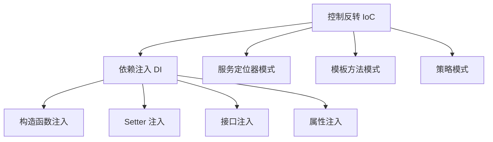
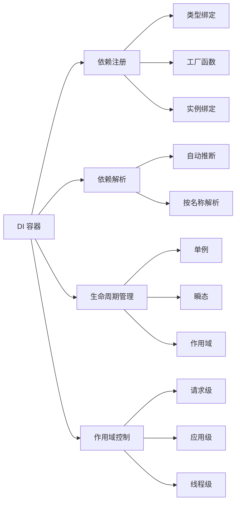
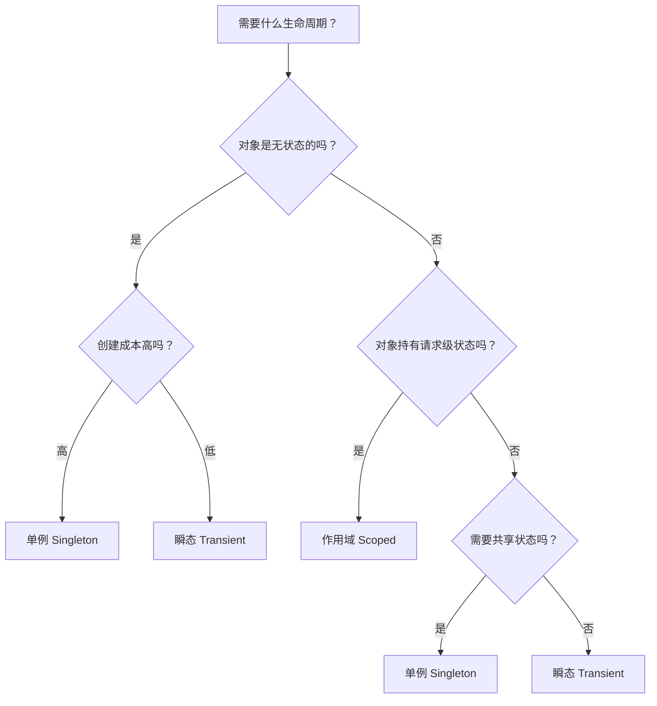

## 技巧三：依赖注入（Dependency Injection）

依赖注入（DI）是控制反转（IoC）原则最核心的实现手段，也是现代软件工程中降低耦合、提升可测试性和可维护性的关键技术。无论是 Java 的 Spring 框架、Python 的 dependency-injector、Go 的 Wire，还是前端的 Angular/NestJS，依赖注入无处不在。掌握 DI 不仅是理解框架的钥匙，更是设计高质量软件的基本功。

### 1. 核心概念：从"自己造"到"别人给"

#### 1.1 什么是依赖注入

依赖注入的本质只有一句话：**一个对象不应该自己创建它所依赖的对象，而应该由外部提供。**

想象一下你搬进新房子：如果你自己要造每一把椅子、每一个桌子才能入住，效率极低且没有必要——这些应该由家具厂（外部提供者）生产好，你只需要挑选搬进去（接收依赖）。软件开发同理。

```python
# ❌ 反面示例：紧耦合——类自己创建依赖
class UserService:
    def __init__(self):
        self.db = MySQLDatabase(host="localhost")  # 硬编码依赖
        self.mailer = SMTPEmailSender(host="smtp.example.com")  # 硬编码依赖

    def register(self, user):
        self.db.save(user)
        self.mailer.send_welcome(user.email)
```

这段代码的问题在于：`UserService` 同时承担了两个职责——业务逻辑 和 依赖管理。它直接决定了使用哪个数据库、哪个邮件服务。如果要换成 PostgreSQL 或者换成 SendGrid 发邮件，必须修改 `UserService` 本身。这违反了**单一职责原则**和**开闭原则**。

```python
# ✅ 正面示例：依赖注入——依赖从外部传入
class UserService:
    def __init__(self, db: Database, mailer: EmailSender):
        self.db = db          # 抽象依赖，具体实现由调用方决定
        self.mailer = mailer

    def register(self, user):
        self.db.save(user)
        self.mailer.send_welcome(user.email)

# 调用方负责组装
service = UserService(
    db=MySQLDatabase(host="localhost"),
    mailer=SMTPEmailSender(host="smtp.example.com")
)
```

#### 1.2 控制反转（IoC）与依赖注入的关系

控制反转是一个更广泛的设计原则，依赖注入是其最常用的实现方式：



| 概念 | 定义 | 与 DI 的关系 |
|------|------|-------------|
| 控制反转（IoC） | 对象的创建和绑定由外部容器管理，而非对象自身 | DI 是 IoC 的一种实现方式 |
| 依赖注入（DI） | 通过参数传递将依赖"注入"到对象中 | IoC 的具体实现 |
| IoC 容器 | 自动管理对象创建、依赖关系和生命周期的框架 | DI 的运行时载体 |
| 依赖注入容器 | 专门负责 DI 的容器，如 Spring IoC、Dagger、injector | IoC 容器的子集 |

**IoC 的核心思想是"控制权转移"**：在传统编程中，对象自己控制依赖的创建（你说了算）；在 IoC 模式下，外部容器控制依赖的创建并注入（别人帮你决定）。这就像从自己做饭（控制权在你）变为去餐厅吃（控制权转移给餐厅），你只需要提出需求（声明依赖），餐厅负责生产（创建并注入）。

#### 1.3 为什么需要依赖注入

**原因一：解耦。** 组件之间不再直接依赖具体实现，而是依赖抽象。修改一个组件不会影响另一个组件。

**原因二：可测试性。** 依赖注入是编写单元测试的前提。没有 DI，你几乎无法对包含外部依赖的类进行单元测试。

```python
# 测试时注入 Mock 对象
class MockDatabase(Database):
    def __init__(self):
        self.saved_items = []

    def save(self, item):
        self.saved_items.append(item)

class MockEmailSender(EmailSender):
    def __init__(self):
        self.sent_emails = []

    def send_welcome(self, email):
        self.sent_emails.append(email)

def test_user_registration():
    mock_db = MockDatabase()
    mock_mailer = MockEmailSender()
    service = UserService(db=mock_db, mailer=mock_mailer)

    service.register(User("alice", "alice@example.com"))

    assert len(mock_db.saved_items) == 1
    assert mock_db.saved_items[0].name == "alice"
    assert len(mock_mailer.sent_emails) == 1
```

**原因三：可配置性。** 同一套代码在开发环境用本地数据库，在生产环境用集群数据库，只需切换注入的实例，不需要修改业务代码。

**原因四：团队协作。** 不同团队可以并行开发接口的实现，只要接口约定好，各自独立实现和测试，最后由组装层（Composition Root）统一装配。

**原因五：多环境适配。** 一套系统在单元测试中用内存数据库（毫秒级响应），在集成测试中用 SQLite，线上用 MySQL——这三种环境的切换完全通过 DI 完成，业务代码零修改。

#### 1.4 依赖注入的核心原则

在使用 DI 之前，需要理解几条不可违背的原则：

**依赖倒置原则（DIP）：** 高层模块不应该依赖低层模块，两者都应该依赖抽象。DI 是实现 DIP 的技术手段。例如 `OrderService`（高层）不应直接依赖 `MySQLDatabase`（低层），而应依赖 `Database`（抽象）。

**显式优于隐式：** 一个类的依赖关系必须在构造函数签名中一目了然。如果调用方看到 `UserService(db, mailer)`，立刻就知道它需要数据库和邮件服务；如果看到 `UserService()`，根本不知道它内部依赖了什么。

**组合优于继承：** DI 鼓励通过组合（has-a）而非继承（is-a）来复用行为。`OrderService` 拥有一个 `Database`，而不是继承 `Database`，这样更灵活、更可测试。

### 2. 四种注入方式详解

#### 2.1 构造函数注入（Constructor Injection）

最推荐的方式。依赖通过构造函数参数传入，对象创建时依赖就已经就绪。

```python
from abc import ABC, abstractmethod

# 抽象接口
class Database(ABC):
    @abstractmethod
    def save(self, data: dict) -> None: ...

    @abstractmethod
    def find(self, id: str) -> dict: ...

class EmailSender(ABC):
    @abstractmethod
    def send(self, to: str, subject: str, body: str) -> None: ...

# 具体实现
class PostgresDatabase(Database):
    def __init__(self, connection_string: str):
        self.conn = self._connect(connection_string)

    def _connect(self, connection_string: str):
        # 实际连接 PostgreSQL
        print(f"Connecting to PostgreSQL: {connection_string}")
        return connection_string

    def save(self, data: dict) -> None:
        print(f"Saving to PostgreSQL: {data}")

    def find(self, id: str) -> dict:
        return {"id": id, "source": "postgres"}

class SendGridEmailSender(EmailSender):
    def __init__(self, api_key: str):
        self.api_key = api_key

    def send(self, to: str, subject: str, body: str) -> None:
        print(f"Sending via SendGrid to {to}: {subject}")

# 构造函数注入
class OrderService:
    def __init__(self, db: Database, mailer: EmailSender):
        self.db = db
        self.mailer = mailer

    def place_order(self, order: dict):
        self.db.save(order)
        self.mailer.send(order["email"], "订单确认", f"您的订单 {order['id']} 已确认")
```

**优势：**
- 依赖不可变（对象创建后不会被替换），保证线程安全
- 依赖完整（对象创建时所有依赖都已就绪，不会出现"半初始化"状态）
- 编译期检查（在静态类型语言中，缺少必要依赖会直接报错）
- 构造函数签名本身就是一份自文档化的依赖清单

**注意点：** 当依赖超过 4-5 个时，构造函数会变得冗长。此时应考虑：
1. 检查是否违反了单一职责——需要这么多依赖说明类承担了太多职责
2. 将相关依赖聚合为一个"上下文对象"（如 `OrderContext` 包含 `db` + `cache` + `logger`）
3. 使用 DI 容器自动解析，无需手动传参

**适用场景：** 绝大多数情况的首选方式。

#### 2.2 Setter 注入

通过 setter 方法在对象创建后设置依赖。适用于可选依赖或需要动态切换依赖的场景。

```python
class ReportGenerator:
    def __init__(self):
        self._formatter: Formatter = None
        self._exporter: Exporter = None

    def set_formatter(self, formatter: Formatter):
        self._formatter = formatter
        return self  # 支持链式调用

    def set_exporter(self, exporter: Exporter):
        self._exporter = exporter
        return self

    def generate(self, data: dict) -> str:
        if self._formatter is None:
            raise RuntimeError("Formatter not set")
        formatted = self._formatter.format(data)
        if self._exporter:
            self._exporter.export(formatted)
        return formatted

# 使用
report = ReportGenerator()
report.set_formatter(JSONFormatter()).set_exporter(PDFExporter())
```

**优势：** 支持可选依赖、支持运行时动态切换。

**风险：** 依赖可能为 None（对象可能在依赖未就绪时被使用），线程安全需要额外处理。使用 Setter 注入时，务必在文档或运行时检查中明确哪些依赖是必须的、哪些是可选的。

**最佳实践：** 如果某个 Setter 注入的依赖在对象生命周期内不会改变，优先考虑改为构造函数注入。Setter 注入最适合"可选的、可热切换的"依赖。

#### 2.3 接口注入（Interface Injection）

通过定义注入接口，让被注入方实现该接口以接受依赖。Java/Spring 中较常见，Python/Go 中不常用。

```java
// Java 示例
public interface DatabaseAware {
    void setDatabase(Database database);
}

public class UserService implements DatabaseAware {
    private Database database;

    @Override
    public void setDatabase(Database database) {
        this.database = database;
    }
}
```

**优势：** 有明确的契约，调用方知道需要注入什么。

**劣势：** 增加了接口数量，在动态语言中较少使用。每个被注入方都要实现一个额外的接口，导致类层次复杂化。

#### 2.4 属性注入（Property Injection）

直接通过公共属性设置依赖，最为简单但也最不安全。

```python
class CacheManager:
    def __init__(self):
        self.store = None  # 必须在使用前设置

    def get(self, key: str):
        if self.store is None:
            raise RuntimeError("Store not initialized")
        return self.store.get(key)

# 使用
cache = CacheManager()
cache.store = RedisStore(host="localhost")  # 直接赋值
```

**风险：** 无法保证依赖在使用前已设置，缺乏编译期检查。属性注入最大的问题是**时序依赖**——你必须确保在调用 `get()` 之前已经设置了 `store`，但没有任何机制强制保证这一点。

#### 2.5 四种方式对比

| 特性 | 构造函数注入 | Setter 注入 | 接口注入 | 属性注入 |
|------|-------------|-------------|---------|---------|
| 依赖不可变性 | ✅ 不可变 | ❌ 可变 | ❌ 可变 | ❌ 可变 |
| 可选依赖 | ❌ 不支持 | ✅ 支持 | ✅ 支持 | ✅ 支持 |
| 空状态风险 | ✅ 无 | ❌ 有 | ❌ 有 | ❌ 有 |
| 线程安全 | ✅ 天然安全 | ❌ 需同步 | ❌ 需同步 | ❌ 需同步 |
| 测试便利性 | ✅ 高 | ✅ 高 | ⚠️ 中 | ⚠️ 中 |
| 代码简洁性 | ⚠️ 参数多时冗长 | ✅ 简洁 | ❌ 需额外接口 | ✅ 最简洁 |
| 推荐程度 | ⭐⭐⭐⭐⭐ | ⭐⭐⭐ | ⭐⭐ | ⭐⭐ |

**经验法则：** 必需依赖用构造函数注入，可选依赖用 Setter 注入，尽量避免属性注入。

#### 2.6 如何处理参数过多的构造函数

当一个类的构造函数依赖超过 5 个参数时，通常意味着类的职责过多。以下几种策略可以应对：

**策略一：聚合参数。** 将相关的依赖封装为一个配置对象：

```python
# 替代方案：聚合相关依赖
@dataclass
class DatabaseConfig:
    host: str
    port: int
    username: str
    password: str

class UserService:
    def __init__(self, db: Database, db_config: DatabaseConfig, mailer: EmailSender):
        # 参数数量减少，且数据库相关配置被聚合
        ...
```

**策略二：提取子服务。** 将部分逻辑拆分为独立服务，减少主类的直接依赖：

```python
# 提取认证子服务，减少 UserService 的直接依赖
class AuthService:
    def __init__(self, token_store: TokenStore, config: AuthConfig):
        ...

class UserService:
    def __init__(self, db: Database, auth: AuthService):
        # Auth 相关的复杂依赖被封装到 AuthService 中
        ...
```

**策略三：使用 DI 容器。** 让容器自动解析依赖树，构造函数只声明"我需要什么"，不需要手动传入。

### 3. 依赖注入容器（DI Container）

手动注入在依赖关系简单时足够好用，但当依赖层级深、组件多时，手动组装代码会变得冗长且容易出错。DI 容器（也叫 IoC 容器）自动管理对象的创建、依赖解析和生命周期。

#### 3.1 容器的核心能力



**何时需要 DI 容器？** 以下信号说明你应该引入容器：
- 组件超过 10 个，手动组装变得困难
- 依赖层级超过 3 层，手动解析耗时且容易遗漏
- 多个团队共享同一套组件，需要统一管理
- 应用有明确的生命周期（启动、运行、关闭），需要容器协调

#### 3.2 Python：使用 dependency-injector 库

```python
from dependency_injector import containers, providers
from dependency_injector.wiring import inject, Provide

# 容器定义
class Container(containers.DeclarativeContainer):
    config = providers.Configuration()

    # 基础设施层
    database = providers.Singleton(
        PostgresDatabase,
        connection_string=config.db.connection_string,
    )

    email_sender = providers.Factory(
        SendGridEmailSender,
        api_key=config.email.api_key,
    )

    # 业务层（自动注入基础设施）
    order_service = providers.Factory(
        OrderService,
        db=database,
        mailer=email_sender,
    )

    user_service = providers.Factory(
        UserService,
        db=database,
        mailer=email_sender,
    )

# 使用装饰器自动注入
@inject
def handle_order(
    order: dict,
    service: OrderService = Provide[Container.order_service],
):
    service.place_order(order)

# 初始化容器
container = Container()
container.config.from_dict({
    "db": {"connection_string": "postgresql://localhost/mydb"},
    "email": {"api_key": "sg_xxxx"},
})
```

**providers 常用类型说明：**
- `Singleton`：全局唯一实例，所有请求共享同一个对象。适合数据库连接池、配置管理器等有状态的共享资源。
- `Factory`：每次获取都创建新实例。适合无状态的工具类、请求级处理器。
- `Configuration`：从字典、环境变量或配置文件加载配置。
- `Resource`：需要启动/关闭生命周期的资源（如打开文件、建立连接），容器退出时自动清理。

#### 3.3 Go：使用 Wire 编译时注入

Go 社区偏好编译时注入（而非运行时反射），Google 的 Wire 是代表：

```go
// wire.go —— 编译时依赖图定义
//go:build wireinject
//go:generate wire .

func InitializeOrderService() *OrderService {
    wire.Build(
        NewPostgresDatabase,
        NewSendGridEmailSender,
        NewOrderService,
    )
    return nil
}

// 生成的 wire_gen.go（Wire 自动生成）
func InitializeOrderService() *OrderService {
    database := NewPostgresDatabase("postgresql://localhost/mydb")
    emailSender := NewSendGridEmailSender("sg_xxxx")
    orderService := NewOrderService(database, emailSender)
    return orderService
}
```

**Go 社区偏好编译时 DI 的原因：** Go 追求简单和性能。Wire 在编译时生成纯函数代码，不依赖反射，运行时零开销。生成的代码可以被 Go 工具链直接优化，也更容易调试。相比之下，Java/Python 的运行时 DI 虽然灵活，但在启动时间和内存方面有额外开销。

#### 3.4 Java：Spring Boot 注解驱动注入

Spring 是 DI 领域最成熟的框架，注解驱动的注入方式已成为 Java 生态的事实标准：

```java
@Service
public class OrderService {
    private final Database db;
    private final EmailSender mailer;

    // 构造函数注入（Spring 自动识别，@Autowired 可省略）
    public OrderService(Database db, EmailSender mailer) {
        this.db = db;
        this.mailer = mailer;
    }
}

@Repository
public class PostgresDatabase implements Database {
    private final JdbcTemplate jdbc;

    public PostgresDatabase(DataSource dataSource) {
        this.jdbc = new JdbcTemplate(dataSource);
    }
}

@Configuration
public class AppConfig {
    @Bean
    public DataSource dataSource() {
        return DataSourceBuilder.create()
            .url("jdbc:postgresql://localhost/mydb")
            .build();
    }
}
```

**Spring 注解体系速查：**
- `@Component`：标记通用组件，由 Spring 自动扫描和管理
- `@Service`：语义化标注业务层组件（本质等同于 `@Component`）
- `@Repository`：标注数据访问层组件，自动转译数据库异常
- `@Configuration` + `@Bean`：声明式定义第三方库对象的创建方式
- `@Autowired`：标记需要自动注入的位置（构造函数注入时可省略）

#### 3.5 TypeScript/NestJS：模块化注入

```typescript
// 服务定义
@Injectable()
export class OrderService {
    constructor(
        @Inject('DATABASE') private db: Database,
        @Inject('EMAIL') private mailer: EmailSender,
    ) {}

    async placeOrder(order: Order): Promise<void> {
        await this.db.save(order);
        await this.mailer.send(order.email, '订单确认', `订单 ${order.id} 已确认`);
    }
}

// 模块定义
@Module({
    providers: [
        {
            provide: 'DATABASE',
            useClass: PostgresDatabase,
        },
        {
            provide: 'EMAIL',
            useFactory: (config: ConfigService) => {
                return new SendGridEmailSender(config.get('EMAIL_API_KEY'));
            },
            inject: [ConfigService],
        },
        OrderService,
    ],
})
export class OrderModule {}
```

**NestJS 的独特优势：** 模块化组织。每个功能模块（如 `OrderModule`、`UserModule`）声明自己的 providers 和 exports，形成清晰的依赖边界。模块间的依赖通过 `imports` 显式声明，避免了全局命名空间的污染。

### 4. 生命周期管理

DI 容器管理的对象有不同的生命周期策略，选择正确的策略对性能和正确性至关重要。

#### 4.1 三种核心生命周期

| 生命周期 | 含义 | 典型用途 | 内存影响 |
|----------|------|----------|----------|
| 单例（Singleton） | 整个应用共享一个实例 | 数据库连接池、配置、缓存 | 低（复用） |
| 瞬态（Transient/Prototype） | 每次请求创建新实例 | 无状态工具类、值对象 | 高（频繁创建） |
| 作用域（Scoped） | 每个作用域一个实例 | HTTP 请求上下文、数据库事务 | 中（按需创建） |

```python
# Python 中手动实现生命周期管理
class Container:
    def __init__(self):
        self._singletons = {}
        self._factories = {}
        self._scoped = {}
        self._scoped_instances = {}
        self._scope_id = 0

    def register_singleton(self, iface, factory):
        """注册单例：首次获取时创建，之后复用"""
        self._singletons[iface] = {"factory": factory, "instance": None}

    def register_transient(self, iface, factory):
        """注册瞬态：每次获取都创建新实例"""
        self._factories[iface] = factory

    def register_scoped(self, iface, factory):
        """注册作用域：每个 scope 内共享一个实例"""
        self._scoped[iface] = factory

    def resolve(self, iface):
        if iface in self._singletons:
            entry = self._singletons[iface]
            if entry["instance"] is None:
                entry["instance"] = entry["factory"](self)
            return entry["instance"]
        if iface in self._factories:
            return self._factories[iface](self)
        if iface in self._scoped:
            # 作用域对象：同一 scope 内共享
            if iface not in self._scoped_instances:
                self._scoped_instances[iface] = self._scoped[iface](self)
            return self._scoped_instances[iface]
        raise KeyError(f"No registration for {iface.__name__}")

    def create_scope(self):
        """创建新的作用域，清除之前的缓存"""
        self._scoped_instances = {}
```

#### 4.2 生命周期选择决策树



#### 4.3 生命周期选择的实战指南

**单例的陷阱：**
- 单例持有可变状态时，多线程并发访问会引发竞态条件
- 单例在测试中难以隔离——上一个测试的状态可能污染下一个测试
- 单例的生命周期绑定应用，如果应用不退出，单例永远不会被回收（潜在内存泄漏）

**瞬态的代价：**
- 每次获取都创建新对象，GC 压力大
- 数据库连接、HTTP 客户端等有状态资源不能用瞬态，否则每次使用都重新建立连接

**作用域的典型应用：**
- Web 框架中每个 HTTP 请求一个 scope：请求内的数据库事务、认证上下文共享同一个实例，请求结束后自动释放
- 微消息队列中每条消息一个 scope：消息处理完成后事务和临时资源自动清理

### 5. 组合根（Composition Root）

组合根是应用程序中**唯一负责组装所有依赖**的位置。它是 DI 架构中的关键概念，也是很多开发者忽视的部分。

#### 5.1 什么是组合根

```python
# 组合根：应用入口处的唯一组装点
def create_application() -> 'Application':
    """整个应用的依赖组装只在这里进行"""
    # 基础设施层
    config = load_config()
    db = PostgresDatabase(config.db_url)
    cache = RedisCache(config.redis_url)
    mailer = SendGridEmailSender(config.sendgrid_key)
    event_bus = EventBus()

    # 数据访问层
    user_repo = UserRepository(db)
    order_repo = OrderRepository(db)

    # 业务层
    user_service = UserService(user_repo, mailer, event_bus)
    order_service = OrderService(order_repo, payment, notifier, inventory)

    # 组装为应用
    return Application(
        user_service=user_service,
        order_service=order_service,
    )
```

#### 5.2 组合根的位置选择

| 应用类型 | 组合根位置 | 说明 |
|----------|-----------|------|
| 命令行工具 | `main.py` / `main.go` | 程序入口即组装入口 |
| Web 应用 | 框架启动文件 / App Factory | Flask 的 `create_app()`、Django 的 `settings.py` |
| 微服务 | 各服务的启动文件 | 每个微服务独立组装 |
| 测试 | `conftest.py` / `setUp()` | 测试用例中注入 Mock/Fake |

#### 5.3 组合根的核心规则

1. **只有一个组合根。** 整个应用的依赖组装只在一处进行，业务代码中绝对不应该 `new` 具体实现类。
2. **组合根在最外层。** 它位于依赖关系图的最顶层，知道所有具体实现，而业务层只知道接口。
3. **测试中用替代组合根。** 单元测试不需要完整的组合根，只注入测试所需的 Mock 即可。

### 6. 进阶：依赖注入的设计模式组合

DI 不是孤立的技术，它与多种设计模式协同工作，形成强大的架构组合。

#### 6.1 DI + 策略模式

```python
class PricingStrategy(ABC):
    @abstractmethod
    def calculate(self, order: dict) -> float: ...

class RegularPricing(PricingStrategy):
    def calculate(self, order: dict) -> float:
        return order["base_price"]

class VipPricing(PricingStrategy):
    def calculate(self, order: dict) -> float:
        return order["base_price"] * 0.8  # VIP 八折

class FlashSalePricing(PricingStrategy):
    def calculate(self, order: dict) -> float:
        return order["base_price"] * 0.5  # 限时五折

class CheckoutService:
    def __init__(self, pricing: PricingStrategy):
        self.pricing = pricing

    def checkout(self, order: dict) -> float:
        total = self.pricing.calculate(order)
        # ... 处理支付逻辑
        return total

# 不同场景注入不同策略
regular_checkout = CheckoutService(pricing=RegularPricing())
vip_checkout = CheckoutService(pricing=VipPricing())
flash_checkout = CheckoutService(pricing=FlashSalePricing())
```

**组合价值：** `CheckoutService` 完全不知道有几种定价策略，也不关心当前用的是哪种。新增一种定价策略（如 `StudentPricing`）只需要创建新类，无需修改 `CheckoutService` 的任何代码。

#### 6.2 DI + 装饰器模式

```python
# 注入带装饰器的组件：缓存层装饰数据库层
class CachedUserService:
    def __init__(self, db: Database, cache: Cache):
        self.db = db
        self.cache = cache

    def get_user(self, user_id: str) -> dict:
        # 先查缓存
        cached = self.cache.get(f"user:{user_id}")
        if cached:
            return cached
        # 缓存未命中，查数据库
        user = self.db.find(user_id)
        self.cache.set(f"user:{user_id}", user, ttl=300)
        return user

# 更优雅的装饰器方式：用函数包装
def cached(ttl: int = 300):
    def decorator(func):
        def wrapper(self, *args, **kwargs):
            cache_key = f"{func.__name__}:{args}:{kwargs}"
            cached_result = self.cache.get(cache_key)
            if cached_result is not None:
                return cached_result
            result = func(self, *args, **kwargs)
            self.cache.set(cache_key, result, ttl=ttl)
            return result
        return wrapper
    return decorator
```

**组合价值：** 通过 DI 注入装饰器层（如缓存、日志、权限检查），可以在不修改核心业务逻辑的前提下，透明地叠加横切关注点。

#### 6.3 DI + 观察者模式

```python
class EventBus:
    def __init__(self):
        self._handlers = {}

    def subscribe(self, event_type: str, handler):
        self._handlers.setdefault(event_type, []).append(handler)

    def publish(self, event_type: str, data):
        for handler in self._handlers.get(event_type, []):
            handler(data)

class OrderService:
    def __init__(self, db: Database, event_bus: EventBus):
        self.db = db
        self.event_bus = event_bus

    def place_order(self, order: dict):
        self.db.save(order)
        self.event_bus.publish("order_placed", order)

# 注册事件处理器（也是通过 DI 注入）
event_bus = EventBus()
event_bus.subscribe("order_placed", lambda o: send_confirmation_email(o))
event_bus.subscribe("order_placed", lambda o: update_inventory(o))
event_bus.subscribe("order_placed", lambda o: notify_warehouse(o))
```

**组合价值：** `OrderService` 只负责发布事件，不关心谁在监听。新增一个"发送优惠券"的后续操作，只需要订阅事件，无需修改 `OrderService`。这是**开闭原则**的典型体现。

#### 6.4 DI + 工厂模式

```python
class PaymentProcessor(ABC):
    @abstractmethod
    def process(self, amount: float) -> dict: ...

class AlipayProcessor(PaymentProcessor):
    def process(self, amount: float) -> dict:
        return {"provider": "alipay", "status": "success"}

class WechatPayProcessor(PaymentProcessor):
    def process(self, amount: float) -> dict:
        return {"provider": "wechat", "status": "success"}

class PaymentProcessorFactory:
    """根据支付方式创建对应的处理器"""
    _processors = {
        "alipay": AlipayProcessor,
        "wechat": WechatPayProcessor,
    }

    @classmethod
    def create(cls, method: str) -> PaymentProcessor:
        processor_class = cls._processors.get(method)
        if not processor_class:
            raise ValueError(f"不支持的支付方式: {method}")
        return processor_class()

# 在 DI 容器中注册工厂
class Container:
    payment_factory = PaymentProcessorFactory  # 工厂本身被注入

class OrderService:
    def __init__(self, payment_factory: PaymentProcessorFactory):
        self.payment_factory = payment_factory

    def checkout(self, order: dict, method: str):
        processor = self.payment_factory.create(method)
        return processor.process(order["total"])
```

#### 6.5 DI + 模板方法模式

```python
class DataPipeline(ABC):
    """模板方法定义数据处理流程，子类实现具体步骤"""

    def __init__(self, extractor: DataExtractor, transformer: DataTransformer, loader: DataLoader):
        self.extractor = extractor
        self.transformer = transformer
        self.loader = loader

    def run(self, source: str):
        """模板方法：定义固定的处理流程"""
        raw_data = self.extractor.extract(source)
        clean_data = self.transformer.transform(raw_data)
        self.loader.load(clean_data)
        self.on_complete(clean_data)  # 钩子方法

    @abstractmethod
    def on_complete(self, data):
        """子类可选的钩子"""
        pass

# 通过 DI 注入不同的提取、转换、加载策略
pipeline = DataPipeline(
    extractor=CSVExtractor(),
    transformer=NormalizeTransformer(),
    loader=PostgresLoader(),
)
```

### 7. 依赖注入的常见误区

#### 误区一：过度使用 DI 容器

**问题：** 把所有对象都注册到容器中，包括简单的值对象和工具类。

**正确做法：** 只有需要替换实现、需要统一管理生命周期、或需要在测试中 Mock 的对象才需要通过 DI 容器管理。

```python
# ❌ 过度注入：把不需要替换的东西也放进容器
class Container:
    string_builder = providers.Factory(StringBuilder)  # 完全没必要
    date_utils = providers.Factory(DateUtils)           # 工具类不需要 DI
    validator = providers.Factory(EmailValidator)       # 无状态工具不需要

# ✅ 合理注入：只管理有替换需求的组件
class Container:
    database = providers.Singleton(PostgresDatabase)
    cache = providers.Singleton(RedisCache)
    email_sender = providers.Factory(SendGridEmailSender)
```

#### 误区二：循环依赖

**问题：** A 依赖 B，B 又依赖 A，导致初始化死循环。

```python
# ❌ 循环依赖
class ServiceA:
    def __init__(self, b: ServiceB):
        self.b = b

class ServiceB:
    def __init__(self, a: ServiceA):
        self.a = a
```

**循环依赖是设计问题的信号，不是技术问题。** 它通常意味着两个组件的职责边界划分不清晰。

**解决方案一：引入协调者打破循环。**

```python
# ✅ 引入协调者打破循环
class ServiceA:
    def set_b(self, b: 'ServiceB'):
        self.b = b

class ServiceB:
    def set_a(self, a: 'ServiceA'):
        self.a = a

class Coordinator:
    def __init__(self, a: ServiceA, b: ServiceB):
        self.a = a
        self.b = b
        a.set_b(b)  # 延迟注入
        b.set_a(a)
```

**解决方案二：用事件驱动彻底解耦。**

```python
# ✅ 或者用事件驱动彻底解耦
class ServiceA:
    def __init__(self, event_bus: EventBus):
        self.event_bus = event_bus

    def do_something(self):
        self.event_bus.publish("a_done", {"data": 42})

class ServiceB:
    def __init__(self, event_bus: EventBus):
        self.event_bus = event_bus
        event_bus.subscribe("a_done", self.handle_a_done)

    def handle_a_done(self, data):
        # 响应 A 的事件，无需直接依赖 A
        pass
```

**解决方案三：提取共享逻辑到第三个组件。** A 和 B 都依赖的那部分逻辑，往往可以独立为一个新组件 C，A 和 B 各自依赖 C，循环自然消失。

#### 误区三：Service Locator 伪装成 DI

**问题：** 通过全局注册表查找依赖，表面上解耦了，实际上只是隐藏了依赖关系。

```python
# ❌ Service Locator 反模式（不是真正的 DI）
class ServiceLocator:
    _services = {}

    @classmethod
    def register(cls, name, service):
        cls._services[name] = service

    @classmethod
    def get(cls, name):
        return cls._services[name]

class UserService:
    def __init__(self):
        # 看似解耦，实际隐藏了依赖，测试时无法替换
        self.db = ServiceLocator.get("database")
        self.mailer = ServiceLocator.get("email_sender")
```

**判断标准：** 如果一个类的方法签名中看不到它的依赖，那它就不是真正的依赖注入。DI 的核心是依赖关系必须显式可见。

**Service Locator vs DI 的本质区别：** DI 中依赖在构造时传入，类的契约是明确的；Service Locator 中依赖在运行时动态查找，类的契约是隐式的。隐式的依赖关系意味着：IDE 无法自动补全、重构工具无法追踪、单元测试无法轻松替换。

#### 误区四：接口膨胀

**问题：** 为每个类都定义接口，导致接口爆炸。

**正确做法：** 只在需要替换实现的边界处定义接口。内部实现类如果只有一个实现，可以不定义接口。

```python
# ❌ 每个类都定义接口
class IUserRepository(ABC): ...    # 只有一种数据库实现
class IEmailService(ABC): ...      # 只用 SendGrid
class ILogService(ABC): ...        # 只用 Python logging

# ✅ 只在需要替换的地方定义接口
class Database(ABC): ...           # 需要切换数据库类型
class EmailSender(ABC): ...        # 需要切换邮件服务
class Logger:                      # 不需要替换，直接用具体类
    def info(self, msg): ...
```

#### 误区五：在构造函数中执行副作用

**问题：** 构造函数中进行网络请求、文件读写、数据库查询等操作。

```python
# ❌ 构造函数执行副作用
class UserService:
    def __init__(self, db_url: str):
        self.conn = psycopg2.connect(db_url)  # 阻塞 I/O
        self.config = json.load(open("config.json"))  # 文件读取

# ✅ 构造函数只做赋值
class UserService:
    def __init__(self, db: Database, config: Config):
        self.db = db          # 对象已在外部创建好
        self.config = config
```

构造函数中的副作用会导致：对象创建变慢、难以测试（测试中无法 Mock 副作用）、创建失败时错误处理困难。

### 8. 实战：完整的电商订单系统

以下是一个综合运用 DI 各项技术的完整示例：

```python
from abc import ABC, abstractmethod
from dataclasses import dataclass, field
from typing import List
from datetime import datetime

# ========== 抽象层 ==========
class OrderRepository(ABC):
    @abstractmethod
    def save(self, order: 'Order') -> str: ...

    @abstractmethod
    def find(self, order_id: str) -> 'Order': ...

class PaymentGateway(ABC):
    @abstractmethod
    def charge(self, amount: float, method: str) -> dict: ...

class NotificationService(ABC):
    @abstractmethod
    def send(self, recipient: str, subject: str, body: str) -> None: ...

class InventoryService(ABC):
    @abstractmethod
    def reserve(self, items: List[dict]) -> bool: ...

    @abstractmethod
    def release(self, items: List[dict]) -> None: ...

# ========== 具体实现 ==========
@dataclass
class Order:
    id: str = ""
    customer_id: str = ""
    items: List[dict] = field(default_factory=list)
    total: float = 0.0
    status: str = "pending"
    created_at: str = ""

class InMemoryOrderRepo(OrderRepository):
    def __init__(self):
        self._store = {}

    def save(self, order: Order) -> str:
        order.id = f"ORD-{len(self._store)+1:06d}"
        order.created_at = datetime.now().isoformat()
        self._store[order.id] = order
        return order.id

    def find(self, order_id: str) -> Order:
        return self._store.get(order_id)

class StripePayment(PaymentGateway):
    def __init__(self, api_key: str):
        self.api_key = api_key

    def charge(self, amount: float, method: str) -> dict:
        print(f"Stripe charging ${amount} via {method}")
        return {"status": "success", "transaction_id": "txn_abc123"}

class EmailNotification(NotificationService):
    def __init__(self, smtp_host: str, smtp_port: int):
        self.smtp_host = smtp_host
        self.smtp_port = smtp_port

    def send(self, recipient: str, subject: str, body: str) -> None:
        print(f"Email to {recipient}: {subject}")

class WarehouseInventory(InventoryService):
    def __init__(self, db: OrderRepository):
        self.db = db

    def reserve(self, items: List[dict]) -> bool:
        print(f"Reserving {len(items)} items in warehouse")
        return True

    def release(self, items: List[dict]) -> None:
        print(f"Releasing {len(items)} items")

# ========== 业务层 ==========
class OrderService:
    def __init__(
        self,
        repo: OrderRepository,
        payment: PaymentGateway,
        notifier: NotificationService,
        inventory: InventoryService,
    ):
        self.repo = repo
        self.payment = payment
        self.notifier = notifier
        self.inventory = inventory

    def create_order(self, customer_id: str, items: List[dict]) -> Order:
        # 1. 库存检查与预留
        if not self.inventory.reserve(items):
            raise ValueError("库存不足，无法下单")

        # 2. 计算总价
        total = sum(item["price"] * item["quantity"] for item in items)

        # 3. 创建订单
        order = Order(customer_id=customer_id, items=items, total=total)

        # 4. 支付
        payment_result = self.payment.charge(total, method="credit_card")
        if payment_result["status"] != "success":
            self.inventory.release(items)
            raise ValueError("支付失败")

        # 5. 持久化
        order.status = "confirmed"
        order_id = self.repo.save(order)

        # 6. 发送通知
        self.notifier.send(
            recipient=customer_id,
            subject=f"订单 {order_id} 确认",
            body=f"您的订单已确认，总金额 ${total}",
        )

        return order

# ========== 组装层（Composition Root）==========
def create_order_service() -> OrderService:
    """应用启动时的唯一组装点"""
    repo = InMemoryOrderRepo()
    payment = StripePayment(api_key="sk_test_xxx")
    notifier = EmailNotification(smtp_host="smtp.example.com", smtp_port=587)
    inventory = WarehouseInventory(db=repo)

    return OrderService(
        repo=repo,
        payment=payment,
        notifier=notifier,
        inventory=inventory,
    )

# ========== 测试（替代组合根）==========
def test_create_order():
    """使用 Mock 的替代组合根进行测试"""
    repo = InMemoryOrderRepo()
    mock_payment = MockPaymentGateway()
    mock_notifier = MockNotificationService()
    mock_inventory = MockInventoryService()

    service = OrderService(
        repo=repo,
        payment=mock_payment,
        notifier=mock_notifier,
        inventory=mock_inventory,
    )

    order = service.create_order(
        customer_id="test_customer",
        items=[{"name": "Test", "price": 10.0, "quantity": 2}],
    )

    assert order.status == "confirmed"
    assert order.total == 20.0
    assert mock_notifier.sent_count == 1

# ========== 运行 ==========
if __name__ == "__main__":
    service = create_order_service()
    order = service.create_order(
        customer_id="customer_42",
        items=[
            {"name": "笔记本电脑", "price": 999.99, "quantity": 1},
            {"name": "鼠标", "price": 29.99, "quantity": 2},
        ],
    )
    print(f"订单创建成功: {order.id}, 状态: {order.status}, 总金额: ${order.total}")
```

### 9. 各语言 DI 框架速查表

| 语言 | 框架 | 注入方式 | 特点 |
|------|------|---------|------|
| Java | Spring IoC | 注解 + 构造函数 | 最成熟的 DI 框架，生态完善 |
| Java | Google Guice | @Inject 注解 | 轻量，编译时校验 |
| Java | Dagger 2 | 编译时生成代码 | 零运行时开销，Android 首选 |
| Python | dependency-injector | 容器 + 装饰器 | 功能最全的 Python DI 库 |
| Python | python-inject | 注解 + 装饰器 | 轻量简洁 |
| Go | Wire | 编译时代码生成 | 零运行时开销，Google 官方 |
| Go | dig/fx | 反射 + 运行时 | Uber 出品，运行时灵活 |
| TypeScript | NestJS | 装饰器 + 模块 | Angular 理念，企业级 |
| TypeScript | InversifyJS | 装饰器 | 轻量级 TS DI |
| C# | Microsoft.Extensions.DI | 构造函数 | .NET 内置，性能优秀 |
| Rust | shaku | 特征 + 宏 | 编译时安全 |

**框架选型原则：**
- 追求零运行时开销 → 选编译时框架（Wire、Dagger 2、shaku）
- 追求开发灵活性 → 选运行时框架（Spring、dependency-injector、dig）
- 追求生态完善 → 选主流框架（Spring、NestJS、Microsoft.Extensions.DI）

### 10. DI 在微服务架构中的应用

微服务架构中，DI 的角色从"单进程内的组件组装"扩展为"跨服务的依赖管理"。

#### 10.1 服务间依赖与 DI

```python
# 每个微服务有自己的 DI 容器
class UserServiceContainer:
    def __init__(self, config):
        self.db = PostgresDatabase(config.user_db_url)
        self.cache = RedisCache(config.redis_url)
        self.http_client = HttpClient(timeout=30)

        # 注入 HTTP 客户端作为服务间通信的依赖
        self.order_client = OrderServiceClient(self.http_client, config.order_service_url)

class OrderServiceContainer:
    def __init__(self, config):
        self.db = PostgresDatabase(config.order_db_url)
        self.payment_gateway = StripePayment(config.stripe_key)

        # 注入其他服务的客户端（通过接口抽象，非直接依赖）
        self.user_client = UserServiceClient(self.http_client, config.user_service_url)
```

#### 10.2 服务间依赖的原则

1. **通过接口定义服务契约。** 服务间的调用应该通过接口抽象（如 `UserServiceClient`），而非直接依赖另一个服务的实现。
2. **在各服务的组合根中组装客户端。** 每个微服务在启动时组装自己的客户端依赖。
3. **Mock 外部服务进行测试。** 单元测试 Mock 所有外部服务客户端，集成测试使用测试替身或真实服务。

### 11. 依赖注入的测试策略

DI 使测试变得简单，但需要正确的策略来充分发挥 DI 的优势。

#### 11.1 三种测试中的 DI 使用方式

```python
# 方式一：构造函数直接传入 Mock（最常用）
def test_order_creation():
    mock_db = MockDatabase()
    mock_payment = MockPayment()
    service = OrderService(db=mock_db, payment=mock_payment)
    # ... 测试逻辑

# 方式二：使用 DI 容器的测试模式
class TestContainer(Container):
    """覆盖容器中的基础设施层实现"""
    database = providers.Factory(MockDatabase)
    payment = providers.Factory(MockPayment)

# 方式三：Fake 实现（比 Mock 更真实）
class FakeDatabase(Database):
    """内存数据库实现，行为接近真实数据库"""
    def __init__(self):
        self._data = {}

    def save(self, data):
        self._data[data["id"]] = data

    def find(self, id):
        return self._data.get(id)
```

#### 11.2 Mock vs Fake：如何选择

| 特性 | Mock | Fake |
|------|------|------|
| 实现复杂度 | 低，通常用框架生成 | 中，需要手动实现 |
| 行为真实性 | 低，只验证调用 | 高，模拟真实行为 |
| 适用场景 | 验证交互（是否调用了某方法） | 验证逻辑（结果是否正确） |
| 维护成本 | 低 | 中（需要随接口变化更新） |

**推荐：** 对于核心业务逻辑的测试，优先使用 Fake（行为更真实，测试更有价值）；对于验证组件间交互的测试，使用 Mock。

### 12. 最佳实践清单

**原则层面：**

1. **依赖抽象，不依赖具体实现。** 所有通过 DI 注入的依赖都应该是接口或基类，而非具体类。
2. **组合根（Composition Root）唯一。** 依赖的组装只在应用入口处进行，业务代码中不创建依赖。
3. **构造函数只做注入，不做逻辑。** 构造函数中不应该有业务逻辑、网络请求或 I/O 操作。
4. **最小化接口。** 只在确实需要多态替换的地方定义抽象，不要为了 DI 而强行定义接口。

**工程层面：**

5. **测试中必须使用 DI。** 单元测试中替换外部依赖为 Mock/Fake，集成测试中使用测试替身。
6. **避免循环依赖。** 如果发现循环依赖，说明组件划分有问题，应该重新设计边界。
7. **关注对象生命周期。** 单例对象注意线程安全，作用域对象注意及时释放。
8. **监控容器性能。** DI 容器的反射/代码生成开销在启动时完成，但运行时解析仍有成本。

**反模式警示：**

9. **不要用 Service Locator 替代 DI。** 全局查找表隐藏了依赖关系，使代码难以测试。
10. **不要把 DI 当万能药。** 简单脚本、一次性工具、无外部依赖的纯函数不需要 DI。
11. **不要在 DI 容器中管理所有东西。** 值对象、常量、工具函数不需要通过容器管理。
12. **不要忽视启动时间。** 大型 DI 容器的初始化可能很慢，考虑延迟初始化和懒加载。

### 13. 本节小结

依赖注入是现代软件工程中降低耦合、提升可测试性的核心技术。本节从五个层面系统讲解了 DI 的知识体系：

- **概念层：** DI 是 IoC 的实现方式，核心思想是"依赖从外部传入，而非内部创建"
- **方法层：** 四种注入方式各有适用场景，构造函数注入是默认首选
- **工具层：** DI 容器自动管理对象创建和生命周期，各语言有成熟的框架
- **架构层：** 组合根是 DI 落地的关键，测试策略是 DI 价值的最大化
- **实践层：** 合理使用 DI，避免过度设计和常见反模式

掌握 DI 的关键是理解它的设计意图：**让代码的依赖关系显式化、可替换、可测试。** 这不仅是一个技术手段，更是一种设计哲学——从"我需要什么就自己创建"变为"我需要什么就声明出来，由最合适的人提供"。
