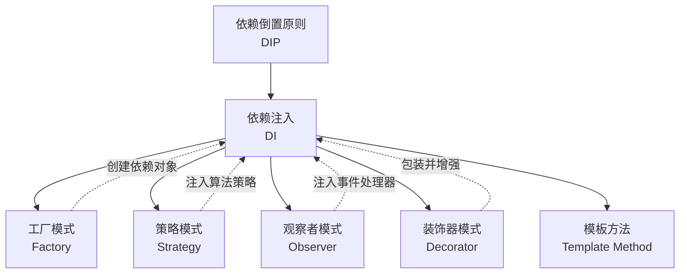

# 设计模式：核心技巧

理论基础章节系统阐述了设计原则和23种经典设计模式的结构与意图。然而，"知道"一个模式和"用好"一个模式之间存在巨大的鸿沟。本章聚焦于设计模式在实际开发中最核心的实践技巧——这些技巧不是对理论的简单复述，而是从工程实践中提炼出的、能直接提升代码质量的方法论。

本章选取三个最具代表性的技巧领域：Go语言中的设计模式实践、Python装饰器模式、以及依赖注入。这三个主题覆盖了不同语言范式下设计模式的关键落地方式，也是日常开发中最高频使用的模式技巧。

## 1. Go语言中的常用设计模式实践

Go语言的设计哲学与传统面向对象语言截然不同——没有类继承、没有泛型（Go 1.18前）、接口隐式实现、一等函数、goroutine和channel。这些语言特性使得设计模式在Go中的实现方式独具特色：更简洁、更组合化、更符合鸭子类型的哲学。

### 1.1 Go的接口设计哲学

Go的接口是隐式实现的——一个类型只要实现了接口的所有方法，就自动满足该接口，不需要显式的`implements`声明。这一特性深刻影响了设计模式在Go中的表达方式。

```go
// 定义接口
type Writer interface {
    Write(p []byte) (n int, err error)
}

// 没有任何显式声明，File自动满足Writer接口
type File struct {
    name string
}

func (f *File) Write(p []byte) (n int, err error) {
    fmt.Printf("Writing %d bytes to %s\n", len(p), f.name)
    return len(p), nil
}

// 这个函数接受任何实现了Writer的类型——无需关心具体是什么
func WriteAll(w Writer, data []byte) error {
    _, err := w.Write(data)
    return err
}
```

**设计启示**：

- **接口应该是小的**：Go社区推崇"小接口"（small interfaces）。标准库中`io.Reader`只有一个方法`Read`，`io.Writer`只有一个方法`Write`。小接口更容易被实现、组合和测试。
- **在消费方定义接口**：不要在实现方预先定义接口，而是在需要使用多态的消费方（客户端代码）定义接口。这让接口自然反映客户端的真实需求，而非实现方的功能清单。
- **Accept interfaces, return structs**：这是Go社区的经典格言。函数参数用接口（接受任何实现），返回值用具体类型（调用者直接使用）。这样既保持了灵活性，又避免了不必要的抽象。

### 1.2 策略模式（Strategy Pattern）

在传统面向对象语言中，策略模式需要定义策略接口、多个具体策略类和上下文类。Go通过一等函数和接口组合，可以大幅简化：

**传统实现（类体系）**：

```go
// 策略接口
type SortStrategy interface {
    Sort(data []int) []int
}

// 具体策略
type BubbleSort struct{}
func (b *BubbleSort) Sort(data []int) []int {
    // 冒泡排序实现
    return bubbleSortImpl(data)
}

type QuickSort struct{}
func (q *QuickSort) Sort(data []int) []int {
    // 快速排序实现
    return quickSortImpl(data)
}

// 上下文
type Sorter struct {
    strategy SortStrategy
}

func NewSorter(s SortStrategy) *Sorter {
    return &amp;Sorter{strategy: s}
}

func (s *Sorter) Sort(data []int) []int {
    return s.strategy.Sort(data)
}

// 使用
sorter := NewSorter(&amp;QuickSort{})
result := sorter.Sort([]int{3, 1, 4, 1, 5, 9})
```

**Go风格实现（函数式）**：

```go
// 直接用函数类型作为策略
type SortFunc func(data []int) []int

func BubbleSort(data []int) []int {
    // 冒泡排序实现
    result := make([]int, len(data))
    copy(result, data)
    for i := 0; i < len(result); i++ {
        for j := 0; j < len(result)-1-i; j++ {
            if result[j] > result[j+1] {
                result[j], result[j+1] = result[j+1], result[j]
            }
        }
    }
    return result
}

func QuickSort(data []int) []int {
    // 快速排序实现
    result := make([]int, len(data))
    copy(result, data)
    quickSortHelper(result, 0, len(result)-1)
    return result
}

// 上下文直接接受函数
func Sort(data []int, strategy SortFunc) []int {
    return strategy(data)
}

// 使用——非常简洁
result := Sort([]int{3, 1, 4, 1, 5, 9}, QuickSort)

// 甚至可以用匿名函数定义内联策略
result := Sort(data, func(data []int) []int {
    // 自定义排序逻辑
    slices.Sort(data)
    return data
})
```

**对比分析**：

| 维度 | 类体系实现 | 函数式实现 |
|------|-----------|-----------|
| 代码量 | 需要接口+多个类+上下文类 | 只需要函数类型+函数实现 |
| 新增策略 | 新建一个struct+实现方法 | 写一个函数即可 |
| 运行时状态 | 策略对象可持有状态 | 无状态函数，纯函数优先 |
| 测试难度 | 需要mock策略对象 | 直接传入测试函数 |
| 可读性 | Java/C++程序员熟悉 | Go程序员更习惯 |
| 适用场景 | 策略需要持有状态时 | 策略是无状态的算法时 |

### 1.3 装饰器模式（Decorator Pattern）

Go没有类继承，装饰器模式通过接口组合来实现——创建一个与被装饰对象实现相同接口的包装器：

```go
// 核心接口
type HTTPHandler interface {
    ServeHTTP(w http.ResponseWriter, r *http.Request)
}

// 装饰器基类——嵌入原始handler
type HandlerDecorator struct {
    handler HTTPHandler
}

func (d *HandlerDecorator) ServeHTTP(w http.ResponseWriter, r *http.Request) {
    d.handler.ServeHTTP(w, r)
}

// 日志装饰器
type LoggingHandler struct {
    HandlerDecorator
}

func NewLoggingHandler(handler HTTPHandler) *LoggingHandler {
    return &amp;LoggingHandler{
        HandlerDecorator: HandlerDecorator{handler: handler},
    }
}

func (l *LoggingHandler) ServeHTTP(w http.ResponseWriter, r *http.Request) {
    start := time.Now()
    log.Printf("Started %s %s", r.Method, r.URL.Path)
    l.handler.ServeHTTP(w, r)
    log.Printf("Completed in %v", time.Since(start))
}

// 认证装饰器
type AuthHandler struct {
    HandlerDecorator
    authService AuthService
}

func NewAuthHandler(handler HTTPHandler, auth AuthService) *AuthHandler {
    return &amp;AuthHandler{
        HandlerDecorator: HandlerDecorator{handler: handler},
        authService:      auth,
    }
}

func (a *AuthHandler) ServeHTTP(w http.ResponseWriter, r *http.Request) {
    token := r.Header.Get("Authorization")
    if !a.authService.Validate(token) {
        http.Error(w, "Unauthorized", http.StatusUnauthorized)
        return
    }
    a.handler.ServeHTTP(w, r)
}

// 使用——层层装饰
func main() {
    var handler HTTPHandler = &amp;MyAppHandler{}          // 核心业务
    handler = NewLoggingHandler(handler)                // 加日志
    handler = NewAuthHandler(handler, authService)      // 加认证
    handler = NewRateLimitHandler(handler, limiter)     // 加限流

    http.ListenAndServe(":8080", handler.(http.Handler))
}
```

**Go标准库中的装饰器模式**：

`net/http`包本身就是装饰器模式的经典应用：

```go
// http.Handler接口
type Handler interface {
    ServeHTTP(ResponseWriter, *Request)
}

// http.HandlerFunc是一个适配器，将普通函数适配为Handler接口
type HandlerFunc func(ResponseWriter, *Request)

func (f HandlerFunc) ServeHTTP(w ResponseWriter, r *Request) {
    f(w, r)
}

// http.TimeoutHandler就是装饰器——它包装了一个Handler并添加超时控制
func TimeoutHandler(h Handler, dt time.Duration, msg string) Handler {
    return &amp;timeoutHandler{
        handler: h,
        dt:      dt,
        msg:     msg,
    }
}

// 链式装饰
handler := http.TimeoutHandler(mux, 30*time.Second, "Timeout!")
```

### 1.4 观察者模式（Observer Pattern）

Go的channel天然支持观察者模式中的通知机制，且比传统的回调方式更安全（避免竞态条件）：

```go
// 事件系统——基于channel
type Event struct {
    Type    string
    Payload interface{}
}

type EventBus struct {
    subscribers map[string][]chan Event
    mu          sync.RWMutex
}

func NewEventBus() *EventBus {
    return &amp;EventBus{
        subscribers: make(map[string][]chan Event),
    }
}

// 订阅
func (eb *EventBus) Subscribe(eventType string) <-chan Event {
    ch := make(chan Event, 10) // 带缓冲的channel
    eb.mu.Lock()
    eb.subscribers[eventType] = append(eb.subscribers[eventType], ch)
    eb.mu.Unlock()
    return ch
}

// 发布
func (eb *EventBus) Publish(event Event) {
    eb.mu.RLock()
    defer eb.mu.RUnlock()
    for _, ch := range eb.subscribers[event.Type] {
        select {
        case ch <- event:
        default:
            log.Printf("Warning: subscriber channel full, event dropped: %s", event.Type)
        }
    }
}

// 取消订阅
func (eb *EventBus) Unsubscribe(eventType string, ch <-chan Event) {
    eb.mu.Lock()
    defer eb.mu.Unlock()
    if subs, ok := eb.subscribers[eventType]; ok {
        for i, sub := range subs {
            if sub == ch {
                close(ch)
                eb.subscribers[eventType] = append(subs[:i], subs[i+1:]...)
                break
            }
        }
    }
}

// 使用示例
func main() {
    bus := NewEventBus()

    // 订阅者A：监听用户注册事件
    userCh := bus.Subscribe("user.registered")
    go func() {
        for event := range userCh {
            user := event.Payload.(*User)
            fmt.Printf("Send welcome email to %s\n", user.Email)
        }
    }()

    // 订阅者B：同样监听用户注册事件
    analyticsCh := bus.Subscribe("user.registered")
    go func() {
        for event := range analyticsCh {
            fmt.Printf("Track registration event\n")
        }
    }()

    // 发布事件——所有订阅者都会收到
    bus.Publish(Event{
        Type:    "user.registered",
        Payload: &amp;User{Name: "Alice", Email: "alice@example.com"},
    })
}
```

### 1.5 工厂模式（Factory Pattern）

Go没有构造函数重载，但通过函数选项模式（Functional Options Pattern）可以实现灵活的对象创建：

```go
// 基础结构
type Server struct {
    host    string
    port    int
    timeout time.Duration
    maxConn int
    tls     bool
}

// Option函数类型
type Option func(*Server)

// 各种配置选项
func WithHost(host string) Option {
    return func(s *Server) { s.host = host }
}

func WithPort(port int) Option {
    return func(s *Server) { s.port = port }
}

func WithTimeout(timeout time.Duration) Option {
    return func(s *Server) { s.timeout = timeout }
}

func WithMaxConnections(max int) Option {
    return func(s *Server) { s.maxConn = max }
}

func WithTLS(enabled bool) Option {
    return func(s *Server) { s.tls = enabled }
}

// 工厂函数——使用可变参数接受多个选项
func NewServer(opts ...Option) *Server {
    // 默认值
    s := &amp;Server{
        host:    "localhost",
        port:    8080,
        timeout: 30 * time.Second,
        maxConn: 100,
    }
    // 应用所有选项
    for _, opt := range opts {
        opt(s)
    }
    return s
}

// 使用——非常清晰和灵活
server := NewServer(
    WithHost("0.0.0.0"),
    WithPort(443),
    WithTLS(true),
    WithTimeout(60*time.Second),
)

// 也可以只传需要的参数
minimalServer := NewServer(WithPort(9090))
```

**函数选项模式的优势**：

1. **向后兼容**：新增选项不会破坏现有调用代码
2. **默认值**：工厂函数内部设置合理的默认值
3. **可读性**：`WithXxx()`调用自带文档效果
4. **类型安全**：编译时检查参数类型
5. **无需构造函数重载**：Go不支持重载，这是最佳替代方案

### 1.6 Go模式实践中的常见陷阱

| 陷阱 | 表现 | 正确做法 |
|------|------|----------|
| 接口膨胀 | 定义包含10+方法的大接口 | 拆分为小接口，按需组合 |
| 过度抽象 | 简单CRUD也引入Repository/Service/Controller三层 | 根据复杂度决定架构，简单项目用直接方式 |
| 忽略零值 | 指针类型的零值为nil，直接调用会panic | 用工厂函数保证对象完整初始化 |
| goroutine泄漏 | 启动goroutine但没有退出机制 | 用context.WithCancel控制goroutine生命周期 |
| channel滥用 | 所有异步都用channel | 简单场景用WaitGroup，需要通信时才用channel |

## 2. Python装饰器模式

Python的装饰器（Decorator）是语言层面的语法糖，但它与GoF的Decorator模式解决的问题域有所不同。Python装饰器主要用于在不修改函数本身代码的前提下，为函数添加额外行为——这本质上是**函数级的AOP（面向切面编程）**。

### 2.1 装饰器的底层机制

理解装饰器的关键是理解`@`语法的等价形式：

```python
@decorator
def function():
    pass

# 等价于：
def function():
    pass
function = decorator(function)
```

装饰器本质上是一个**接受函数并返回函数的高阶函数**。返回的函数可以在调用原始函数前后添加额外逻辑。

```python
def simple_decorator(func):
    def wrapper(*args, **kwargs):
        print(f"调用 {func.__name__} 前")
        result = func(*args, **kwargs)
        print(f"调用 {func.__name__} 后")
        return result
    return wrapper

@simple_decorator
def greet(name):
    print(f"Hello, {name}!")

greet("Alice")
# 输出：
# 调用 greet 前
# Hello, Alice!
# 调用 greet 后
```

### 2.2 带参数的装饰器

当装饰器本身需要参数时，需要多一层嵌套——三层函数结构：

```python
import functools
import time

def retry(max_attempts=3, delay=1.0, exceptions=(Exception,)):
    """自动重试装饰器

    Args:
        max_attempts: 最大尝试次数
        delay: 重试间隔（秒）
        exceptions: 需要重试的异常类型元组
    """
    def decorator(func):
        @functools.wraps(func)  # 保留原函数的元信息
        def wrapper(*args, **kwargs):
            last_exception = None
            for attempt in range(1, max_attempts + 1):
                try:
                    return func(*args, **kwargs)
                except exceptions as e:
                    last_exception = e
                    if attempt < max_attempts:
                        print(f"[retry] {func.__name__} 第{attempt}次失败: {e}, "
                              f"{delay}秒后重试...")
                        time.sleep(delay)
            raise last_exception
        return wrapper
    return decorator

# 使用
@retry(max_attempts=5, delay=2.0, exceptions=(ConnectionError, TimeoutError))
def fetch_data(url):
    response = requests.get(url, timeout=10)
    response.raise_for_status()
    return response.json()
```

**关键细节**：`functools.wraps`装饰器的作用是将原函数的`__name__`、`__doc__`、`__module__`等元信息复制到wrapper函数上。如果不使用它，被装饰的函数会丢失所有元信息，导致调试困难、文档生成错误、序列化问题等。这是一个经常被忽略但极其重要的细节。

### 2.3 类装饰器

除了函数装饰器，Python还支持用类作为装饰器。类装饰器通过实现`__call__`方法来接受被装饰的函数：

```python
import functools
import time

class Timer:
    """计时装饰器——记录函数执行耗时"""

    def __init__(self, func):
        functools.update_wrapper(self, func)
        self.func = func
        self.call_count = 0
        self.total_time = 0.0

    def __call__(self, *args, **kwargs):
        self.call_count += 1
        start = time.perf_counter()
        result = self.func(*args, **kwargs)
        elapsed = time.perf_counter() - start
        self.total_time += elapsed
        return result

    def stats(self):
        """返回统计信息"""
        avg = self.total_time / self.call_count if self.call_count else 0
        return {
            "calls": self.call_count,
            "total_time": self.total_time,
            "avg_time": avg,
        }

@Timer
def process_data(items):
    return [item * 2 for item in items]

result = process_data(range(1000))
result = process_data(range(2000))
print(process_data.stats())
# {'calls': 2, 'total_time': 0.000123, 'avg_time': 0.0000615}
```

**类装饰器 vs 函数装饰器的选择**：

| 维度 | 函数装饰器 | 类装饰器 |
|------|-----------|----------|
| 适用场景 | 无状态的横切关注点 | 需要维护状态的装饰逻辑 |
| 代码复杂度 | 简单（嵌套函数） | 中等（需要`__call__`和`__init__`） |
| 可维护性 | 状态通过闭包管理 | 状态通过实例属性管理 |
| 性能 | 略快（无对象创建开销） | 略慢（每次装饰创建对象） |
| 典型用途 | 日志、权限检查、缓存 | 计数、状态机、连接池管理 |

### 2.4 装饰器链与执行顺序

多个装饰器叠加时，执行顺序是从下到上（从内到外）：

```python
def bold(func):
    def wrapper():
        return f"<b>{func()}</b>"
    return wrapper

def italic(func):
    def wrapper():
        return f"<i>{func()}</i>"
    return wrapper

def underline(func):
    def wrapper():
        return f"<u>{func()}</u>"
    return wrapper

@bold
@italic
@underline
def hello():
    return "Hello"

print(hello())
# 输出: <b><i><u>Hello</u></i></b>

# 执行链路: bold(italic(underline(hello)))
# 调用时: bold.wrapper -> italic.wrapper -> underline.wrapper -> hello
```

**记忆法则**：装饰器的执行顺序就像洋葱——`@bold`在最外层，`@underline`在最内层。函数调用时从外向内逐层进入，返回时从内向外逐层退出。

### 2.5 实用装饰器模板

以下是日常开发中最常用的装饰器模板，可直接复用：

```python
import functools
import logging
import time
from typing import Any, Callable, TypeVar

logger = logging.getLogger(__name__)
F = TypeVar('F', bound=Callable[..., Any])

def log_execution(func: F) -> F:
    """记录函数入参和返回值"""
    @functools.wraps(func)
    def wrapper(*args, **kwargs):
        args_repr = [repr(a) for a in args]
        kwargs_repr = [f"{k}={v!r}" for k, v in kwargs.items()]
        signature = ", ".join(args_repr + kwargs_repr)
        logger.info(f"调用 {func.__name__}({signature})")
        result = func(*args, **kwargs)
        logger.info(f"{func.__name__} 返回 {result!r}")
        return result
    return wrapper  # type: ignore

def cache(ttl_seconds: int = 300):
    """带过期时间的缓存装饰器"""
    def decorator(func: F) -> F:
        cache_dict = {}

        @functools.wraps(func)
        def wrapper(*args, **kwargs):
            key = (args, tuple(sorted(kwargs.items())))
            now = time.time()
            if key in cache_dict:
                result, timestamp = cache_dict[key]
                if now - timestamp < ttl_seconds:
                    return result
            result = func(*args, **kwargs)
            cache_dict[key] = (result, now)
            return result

        wrapper.cache_clear = cache_dict.clear
        return wrapper  # type: ignore
    return decorator

def require_auth(role: str = "user"):
    """权限检查装饰器"""
    def decorator(func: F) -> F:
        @functools.wraps(func)
        def wrapper(*args, **kwargs):
            # 假设从上下文获取当前用户
            current_user = get_current_user()
            if not current_user:
                raise PermissionError("未登录")
            if current_user.role != role and current_user.role != "admin":
                raise PermissionError(f"需要 {role} 权限")
            return func(*args, **kwargs)
        return wrapper  # type: ignore
    return decorator

def rate_limit(max_calls: int, period: float):
    """速率限制装饰器"""
    calls = []

    def decorator(func: F) -> F:
        @functools.wraps(func)
        def wrapper(*args, **kwargs):
            now = time.time()
            # 清除过期记录
            while calls and calls[0] <= now - period:
                calls.pop(0)
            if len(calls) >= max_calls:
                raise RuntimeError(
                    f"速率限制：{period}秒内最多调用{max_calls}次"
                )
            calls.append(now)
            return func(*args, **kwargs)
        return wrapper  # type: ignore
    return decorator
```

### 2.6 装饰器模式在Web框架中的应用

Flask和Django等框架大量使用装饰器模式：

```python
from functools import wraps
from flask import Flask, request, jsonify, g

app = Flask(__name__)

# Flask路由装饰器——最经典的装饰器应用
@app.route("/users", methods=["GET"])
def list_users():
    return jsonify(users)

@app.route("/users/<int:user_id>", methods=["GET"])
def get_user(user_id):
    return jsonify(find_user(user_id))

# 自定义装饰器：请求参数验证
def validate_json(*required_fields):
    def decorator(f):
        @wraps(f)
        def wrapper(*args, **kwargs):
            if not request.is_json:
                return jsonify({"error": "Content-Type must be application/json"}), 415
            data = request.get_json()
            missing = [field for field in required_fields if field not in data]
            if missing:
                return jsonify({"error": f"Missing fields: {missing}"}), 400
            return f(*args, **kwargs)
        return wrapper
    return decorator

@app.route("/users", methods=["POST"])
@validate_json("name", "email")
def create_user():
    data = request.get_json()
    user = User(name=data["name"], email=data["email"])
    db.session.add(user)
    db.session.commit()
    return jsonify(user.to_dict()), 201

# 装饰器组合：认证+日志+限流
@app.route("/admin/stats", methods=["GET"])
@require_auth(role="admin")
@log_execution
@rate_limit(max_calls=10, period=60)
def admin_stats():
    return jsonify(compute_stats())
```

### 2.7 Python装饰器的常见误区

| 误区 | 问题 | 正确做法 |
|------|------|----------|
| 忘记`functools.wraps` | 函数名、文档字符串丢失 | 始终使用`@functools.wraps(func)` |
| 装饰器有副作用 | 模块导入时执行装饰逻辑 | 将副作用放在wrapper内部 |
| 不支持参数解包 | wrapper忘记传递`*args, **kwargs` | 始终使用`wrapper(*args, **kwargs)` |
| 类方法装饰顺序错误 | `@staticmethod`放在自定义装饰器外面 | `@staticmethod`放在最内层（紧贴函数定义） |
| 装饰器不可逆 | 无法移除已添加的装饰器 | 设计时考虑`__wrapped__`属性 |

## 3. 依赖注入

依赖注入（Dependency Injection, DI）是依赖倒置原则（DIP）最重要的工程化实现。它的核心思想是：**不要在类内部创建依赖，而是从外部传入**。这一简单原则带来了可测试性、可替换性和可配置性的巨大提升。

### 3.1 为什么需要依赖注入

考虑一个没有DI的代码结构：

```python
# 没有DI：紧耦合
class OrderService:
    def __init__(self):
        self.db = MySQLDatabase()        # 直接创建MySQL依赖
        self.mailer = SMTPEmailService()  # 直接创建邮件服务依赖
        self.logger = FileLogger()        # 直接创建日志依赖

    def create_order(self, order):
        self.logger.info(f"Creating order: {order.id}")
        self.db.save(order)
        self.mailer.send(order.customer_email, "Order created!")
```

**问题**：

1. **不可测试**：测试`OrderService`时无法mock数据库和邮件服务，测试需要真实的MySQL和SMTP服务器
2. **不可替换**：要将MySQL换成PostgreSQL，必须修改`OrderService`代码
3. **不可配置**：数据库连接信息被硬编码在类内部
4. **违反SRP**：`OrderService`同时承担了业务逻辑和依赖创建两个职责

**DI重构后**：

```python
# 有DI：松耦合
class OrderService:
    def __init__(self, db: Database, mailer: EmailService, logger: Logger):
        self.db = db          # 依赖从外部注入
        self.mailer = mailer
        self.logger = logger

    def create_order(self, order):
        self.logger.info(f"Creating order: {order.id}")
        self.db.save(order)
        self.mailer.send(order.customer_email, "Order created!")

# 生产环境
service = OrderService(
    db=MySQLDatabase(host="prod-db"),
    mailer=SMTPEmailService(host="smtp.company.com"),
    logger=FileLogger("/var/log/orders.log"),
)

# 测试环境
service = OrderService(
    db=InMemoryDatabase(),       # 内存数据库
    mailer=FakeEmailService(),   # 虚拟邮件服务
    logger=SilentLogger(),       # 静默日志
)
```

### 3.2 三种注入方式

DI有三种基本方式：构造函数注入、Setter注入、接口注入。

```python
from abc import ABC, abstractmethod

# ===== 1. 构造函数注入（最推荐）=====
class UserService:
    def __init__(self, repo: UserRepository, cache: CacheService):
        self.repo = repo
        self.cache = cache

# 优势：依赖明确，初始化完整，不可变
# 劣势：构造函数参数过多时代码不美观

# ===== 2. Setter注入 =====
class UserService:
    def set_repo(self, repo: UserRepository):
        self.repo = repo
    def set_cache(self, cache: CacheService):
        self.cache = cache

# 优势：可以延迟设置，可选依赖灵活处理
# 劣势：对象可能处于不完整状态

# ===== 3. 属性注入（Python特有）=====
class UserService:
    repo: UserRepository = None   # 类属性作为默认值
    cache: CacheService = None

# 优势：代码简洁
# 劣势：隐式依赖，IDE支持差，运行时才暴露问题
```

**选择指南**：

```python
# 推荐：构造函数注入为主
class PaymentProcessor:
    def __init__(self, gateway: PaymentGateway, fraud_detector: FraudDetector):
        """所有核心依赖通过构造函数注入"""
        self.gateway = gateway
        self.fraud_detector = fraud_detector

    def process(self, payment):
        if self.fraud_detector.is_suspicious(payment):
            raise FraudDetected(payment)
        return self.gateway.charge(payment)

# 例外：可选依赖用Setter注入
class NotificationService:
    def __init__(self, primary: NotificationSender):
        """必选依赖用构造函数"""
        self.primary = primary
        self.secondary = None

    def set_secondary(self, sender: NotificationSender):
        """可选依赖用Setter"""
        self.secondary = sender
```

### 3.3 依赖注入容器

当项目规模增大，手动管理依赖的创建和注入变得繁琐。DI容器（也称为IoC容器）自动化了这一过程：

```python
# 轻量级DI容器实现
class Container:
    def __init__(self):
        self._factories = {}
        self._singletons = {}

    def register(self, interface, implementation=None, singleton=False):
        """注册依赖

        Args:
            interface: 接口/抽象类
            implementation: 具体实现类（不传则注册接口自身）
            singleton: 是否为单例
        """
        factory = implementation or interface
        self._factories[interface] = (factory, singleton)

    def resolve(self, interface):
        """解析依赖——自动创建并注入"""
        if interface in self._singletons:
            return self._singletons[interface]

        if interface not in self._factories:
            raise KeyError(f"No registration for {interface.__name__}")

        factory, is_singleton = self._factories[interface]

        # 分析构造函数签名，自动注入依赖
        import inspect
        sig = inspect.signature(factory.__init__)
        kwargs = {}
        for param_name, param in sig.parameters.items():
            if param_name == 'self':
                continue
            param_type = param.annotation
            if param_type != inspect.Parameter.empty:
                kwargs[param_name] = self.resolve(param_type)

        instance = factory(**kwargs)

        if is_singleton:
            self._singletons[interface] = instance

        return instance


# 定义接口
class Database(ABC):
    @abstractmethod
    def save(self, entity): pass

class EmailService(ABC):
    @abstractmethod
    def send(self, to, body): pass

class Logger(ABC):
    @abstractmethod
    def info(self, msg): pass

# 注册和使用
container = Container()

container.register(Database, MySQLDatabase, singleton=True)
container.register(EmailService, SMTPEmailService)
container.register(Logger, FileLogger)

# 自动解析——容器分析构造函数签名，递归解析所有依赖
service = container.resolve(OrderService)
# 等价于：
# db = MySQLDatabase()  # 单例
# mailer = SMTPEmailService()
# logger = FileLogger()
# service = OrderService(db=db, mailer=mailer, logger=logger)
```

### 3.4 Python主流DI框架

生产环境中建议使用成熟的DI框架而非手写容器：

```python
# ===== 方案一：dependency-injector（最流行）=====
from dependency_injector import containers, providers
from dependency_injector.wiring import inject, Provide

class Container(containers.DeclarativeContainer):
    """依赖注入容器声明"""
    config = providers.Configuration()

    # 数据库
    database = providers.Singleton(
        MySQLDatabase,
        host=config.database.host,
        port=config.database.port,
    )

    # 邮件服务
    email_service = providers.Factory(
        SMTPEmailService,
        smtp_host=config.smtp.host,
        smtp_port=config.smtp.port,
    )

    # OrderService——自动注入所有依赖
    order_service = providers.Factory(
        OrderService,
        db=database,
        mailer=email_service,
    )

# 使用
container = Container()
container.config.database.host.from_env("DB_HOST")
container.config.database.port.from_env("DB_PORT")

# 自动注入到函数参数中
@inject
def create_order_endpoint(
    order: Order,
    service: OrderService = Provide[Container.order_service],
):
    return service.create_order(order)


# ===== 方案二：Python 3.10+ dataclasses依赖注入 =====
from dataclasses import dataclass

@dataclass
class OrderService:
    db: Database
    mailer: EmailService
    logger: Logger

    def create_order(self, order):
        self.logger.info(f"Creating order")
        self.db.save(order)
        self.mailer.send(order.customer_email, "Order created!")

# dataclasses自动生成__init__，天然支持构造函数注入
# 配合typing.Protocol实现隐式接口
from typing import Protocol

class Database(Protocol):
    def save(self, entity) -> None: ...

class EmailService(Protocol):
    def send(self, to: str, body: str) -> None: ...
```

### 3.5 DI在不同语言中的实现对比

| 语言 | DI框架 | 注入方式 | 特点 |
|------|--------|----------|------|
| Java | Spring, Guice, Dagger | 注解+容器 | 注解驱动，功能最完善 |
| Python | dependency-injector, pinject | 装饰器+容器 | 轻量级，协议驱动 |
| Go | Wire, Fx | 代码生成/运行时 | Wire用编译时代码生成，零运行时开销 |
| TypeScript | InversifyJS, tsyringe | 装饰器+容器 | 装饰器语法驱动 |
| C# | .NET内置, Autofac | 构造函数+容器 | 语言级支持，最成熟 |

**Go的Wire框架**（编译时DI）：

```go
// wire.go
//go:build wireinject

func InitializeApp() *App {
    wire.Build(
        NewDatabase,
        NewEmailService,
        NewLogger,
        NewOrderService,   // Wire分析构造函数，自动注入
    )
    return &amp;App{}
}

// wire_gen.go（自动生成，非手写）
func InitializeApp() *App {
    database := NewDatabase()
    emailService := NewEmailService()
    logger := NewLogger()
    orderService := NewOrderService(database, emailService, logger)
    app := &amp;App{
        orderService: orderService,
    }
    return app
}
```

### 3.6 DI实践中的关键原则

**原则一：依赖抽象，不依赖具体**

```python
# 错误：依赖具体类
class OrderService:
    def __init__(self):
        self.db = MySQLDatabase()  # 具体类

# 正确：依赖抽象
class OrderService:
    def __init__(self, db: Database):  # 抽象类型
        self.db = db
```

**原则二：一个类只应该注入它真正需要的依赖**

```python
# 错误：注入了不使用的依赖
class UserService:
    def __init__(self, db, cache, email, sms, analytics, metrics):
        self.db = db  # 只用了db和cache
        self.cache = cache

# 正确：只注入需要的依赖
class UserService:
    def __init__(self, db: Database, cache: CacheService):
        self.db = db
        self.cache = cache
```

**原则三：DI容器不应该成为全局可变状态**

```python
# 错误：全局容器被任意修改
container.register(Database, MySQLDatabase)  # 在模块A中
container.register(Database, PostgreSQLDatabase)  # 在模块B中覆盖了！

# 正确：容器配置集中在启动阶段完成
def configure_container():
    container = Container()
    if ENV == "test":
        container.register(Database, InMemoryDatabase)
    else:
        container.register(Database, PostgreSQLDatabase)
    return container
```

**原则四：区分单例和瞬态**

```python
# 单例：全局共享的资源（数据库连接池、配置）
container.register(Database, MySQLDatabase, singleton=True)

# 瞬态：每次请求创建新实例（服务对象、处理器）
container.register(OrderService, OrderService, singleton=False)

# 错误：将有状态的服务注册为单例
container.register(CartService, CartService, singleton=True)
# 多个用户的购物车会混在一起！
```

### 3.7 DI与其他模式的关系

依赖注入不是孤立的技术，它与设计模式体系紧密相连：



- **Factory + DI**：工厂负责创建对象，DI负责传递对象。在大型系统中，DI容器通常充当全局工厂的角色。
- **Strategy + DI**：策略模式中的策略对象通过DI注入到上下文中，使策略的选择在外部完成。
- **Observer + DI**：事件监听器通过DI注入到事件源中，实现了事件源与监听器的解耦。
- **Decorator + DI**：装饰器链的组装通过DI容器完成，避免了硬编码的装饰顺序。

### 3.8 不使用框架时的DI实践

对于小型项目或不想引入框架的场景，可以采用以下轻量级模式：

```python
# 模块级工厂函数——最简单的DI
def create_order_service():
    """工厂函数：负责创建和组装依赖"""
    db = MySQLDatabase(
        host=os.getenv("DB_HOST", "localhost"),
        port=int(os.getenv("DB_PORT", "3306")),
    )
    mailer = SMTPEmailService(
        host=os.getenv("SMTP_HOST", "smtp.example.com"),
    )
    logger = logging.getLogger("orders")
    return OrderService(db=db, mailer=mailer, logger=logger)

# 在应用启动时创建
order_service = create_order_service()

# 在测试时替换
def create_test_order_service():
    return OrderService(
        db=InMemoryDatabase(),
        mailer=FakeEmailService(),
        logger=logging.getLogger("test"),
    )

# 测试代码
def test_create_order():
    service = create_test_order_service()
    order = Order(id=1, item="Widget", quantity=5)
    service.create_order(order)
    assert service.db.find(1) == order
    assert len(service.mailer.sent_emails) == 1
```

## 本章小结

本章的三个核心技巧——Go中的模式实践、Python装饰器、依赖注入——分别代表了设计模式落地的三个重要维度：

1. **语言特性驱动模式演进**：Go的隐式接口、一等函数、goroutine让经典模式以更简洁的方式表达。理解语言特性是用好模式的前提。
2. **语法糖放大模式威力**：Python装饰器用语法级支持将横切关注点的处理变得极其优雅。掌握装饰器的底层机制才能灵活运用。
3. **DI是解耦的工程基石**：依赖注入让所有模式能够真正落地——Strategy需要注入策略、Observer需要注入监听器、Decorator需要注入被装饰对象。

从理论到技巧，从知道到用好，关键在于：**识别问题本质，选择恰当工具，在约束中寻找平衡**。设计模式不是银弹，而是一套经过验证的思维工具——用对了地方，它们是利剑；用错了地方，它们是枷锁。
