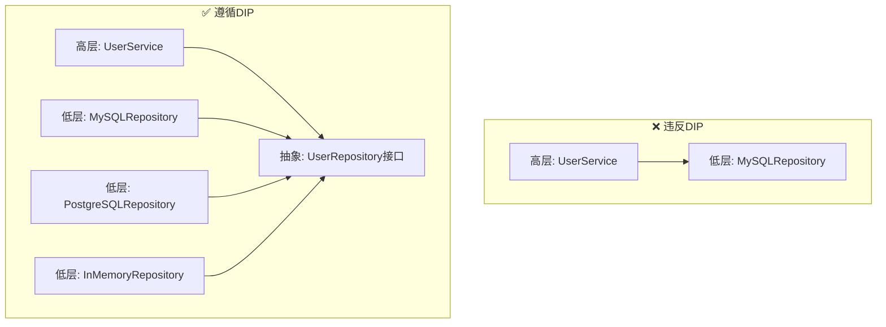
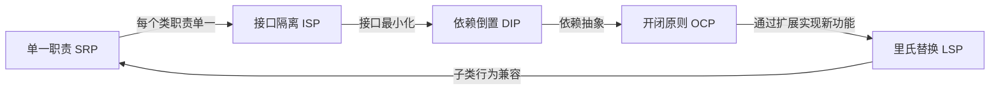

## 一、设计原则（SOLID）

设计模式的根基不在模式本身，而在设计原则。SOLID 五大原则由 Robert C. Martin（Uncle Bob）在 2000 年代初系统化提出，是面向对象设计中最广泛认可的指导方针。掌握 SOLID，你才能理解为什么某些模式有效、另一些则沦为过度设计。

### SOLID 总览

| 缩写 | 全称 | 一句话定义 | 核心问题 |
|------|------|-----------|---------|
| **S** | 单一职责原则（SRP） | 一个类只有一个引起它变化的原因 | 谁在改这个类？ |
| **O** | 开闭原则（OCP） | 对扩展开放，对修改关闭 | 加新功能要改旧代码吗？ |
| **L** | 里氏替换原则（LSP） | 子类必须能替换父类而不破坏程序正确性 | 子类能当父类用吗？ |
| **I** | 接口隔离原则（ISP） | 客户端不应被迫依赖它不使用的接口 | 接口是否臃肿？ |
| **D** | 依赖倒置原则（DIP） | 高层和低层都应依赖抽象，不互相直接依赖 | 模块之间是否硬耦合？ |

下面逐一展开。

---

### 1.1 单一职责原则（SRP）

**定义**：一个类应该只有一个引起它变化的原因（A class should have only one reason to change）。

**为什么重要**：当一个类承担多种职责时，任何一种职责的变更都可能影响其他职责，导致连锁修改和意外缺陷。SRP 通过限制变化源来降低耦合度。

#### 1.1.1 违反 SRP 的典型症状

- 修改一处逻辑，需要同时修改单元测试的多个方面
- 一个类的文件行数持续膨胀（超过 200 行需警惕）
- 多个团队都对同一个文件提交代码
- 构造函数注入大量不相关的依赖

#### 1.1.2 Go 实例：用户管理

```go
// ❌ 违反SRP：User 同时负责数据存储、业务逻辑、邮件通知
type User struct {
    Name  string
    Email string
}

func (u *User) Save() error {
    // 存入数据库——与数据访问层耦合
    return db.Insert("users", u)
}

func (u *User) SendEmail() error {
    // 发送邮件——与邮件服务耦合
    return smtp.Send(u.Email, "Welcome!")
}

func (u *User) Validate() error {
    // 业务校验——与业务规则耦合
    if u.Email == "" {
        return errors.New("email required")
    }
    return nil
}
```

这里 User 承担了三种职责：持久化、通知、校验。任何一种的变化都可能导致 User 被修改。

```go
// ✅ 遵循SRP：职责分离到各自专注的结构体
type User struct {
    Name  string
    Email string
}

// 持久化职责
type UserRepository struct {
    db *sql.DB
}

func (r *UserRepository) Save(u *User) error {
    _, err := r.db.Exec("INSERT INTO users (name, email) VALUES (?, ?)", u.Name, u.Email)
    return err
}

// 通知职责
type UserNotifier struct {
    mailer Mailer
}

func (n *UserNotifier) SendWelcome(u *User) error {
    return n.mailer.Send(u.Email, "Welcome!", "Hello from our platform")
}

// 校验职责
type UserValidator struct{}

func (v *UserValidator) Validate(u *User) error {
    if u.Name == "" {
        return errors.New("name is required")
    }
    if !strings.Contains(u.Email, "@") {
        return errors.New("invalid email format")
    }
    return nil
}
```

**关键区别**：修改数据库从 MySQL 换成 PostgreSQL，只需改 UserRepository；增加短信通知只需新增 SmsNotifier；修改校验规则只需改 UserValidator。三者互不影响。

#### 1.1.3 Python 实例：订单处理

```python
# ❌ 违反SRP：OrderService 承担了计算、持久化、通知三种职责
class OrderService:
    def __init__(self, db, mailer):
        self.db = db
        self.mailer = mailer

    def create_order(self, items):
        total = sum(item.price * item.qty for item in items)
        if total > 10000:
            total *= 0.95  # 打折逻辑
        order = {"items": items, "total": total}
        self.db.save(order)                    # 持久化
        self.mailer.send(order)                # 通知
        return order


# ✅ 职责分离
class OrderCalculator:
    def calculate_total(self, items):
        total = sum(item.price * item.qty for item in items)
        if total > 10000:
            total *= 0.95
        return total

class OrderRepository:
    def __init__(self, db):
        self.db = db

    def save(self, order):
        self.db.insert("orders", order)

class OrderNotifier:
    def __init__(self, mailer):
        self.mailer = mailer

    def notify(self, order):
        self.mailer.send(order)
```

#### 1.1.4 SRP 的常见误区

| 误区 | 纠正 |
|------|------|
| "每个方法都该在自己的类里" | SRP 针对的是变化原因，不是方法数量。一个类可以有多个方法，只要它们因同一个原因变化 |
| "SRP 就是每个类只有一个方法" | 过度拆分反而增加认知负担和间接层。关键是识别不同的变化源 |
| "SRP 只适用于大型项目" | 小项目同样适用。职责混淆在任何规模都会导致修改时的连锁反应 |

---

### 1.2 开闭原则（OCP）

**定义**：软件实体应该对扩展开放，对修改关闭（Open for extension, closed for modification）。

**核心思想**：添加新功能时，应该通过新增代码（扩展）实现，而不是修改已有代码（修改）。这避免了修改已验证、已部署的代码所引入的风险。

#### 1.2.1 为什么 OCP 如此关键

- **降低回归风险**：不修改旧代码 = 不会破坏旧功能
- **支持并行开发**：不同开发者可以扩展不同功能而不互相冲突
- **便于测试**：新增代码可独立测试，不需要重新验证整个系统

#### 1.2.2 Go 实例：支付系统

```go
// ❌ 违反OCP：每次新增支付方式都要修改 Pay 函数
func Pay(method string, amount float64) error {
    switch method {
    case "alipay":
        return payWithAlipay(amount)
    case "wechat":
        return payWithWechat(amount)
    case "stripe":
        return payWithStripe(amount)
    // 每次都要在这里加 case，修改已有代码
    }
}
```

新增一种支付方式（如 PayPal），必须修改 Pay 函数。如果 Pay 函数被 20 个地方调用，修改的风险就放大 20 倍。

```go
// ✅ 遵循OCP：通过接口扩展
type PaymentMethod interface {
    Pay(amount float64) error
}

type Alipay struct {
    apiKey string
}

func (a *Alipay) Pay(amount float64) error {
    // 调用支付宝API
    log.Printf("Alipay: paying %.2f", amount)
    return nil
}

type WechatPay struct {
    appId string
}

func (w *WechatPay) Pay(amount float64) error {
    // 调用微信支付API
    log.Printf("WechatPay: paying %.2f", amount)
    return nil
}

// 新增支付方式只需新增类型，不修改任何已有代码
type PayPal struct {
    clientId string
}

func (p *PayPal) Pay(amount float64) error {
    log.Printf("PayPal: paying %.2f", amount)
    return nil
}

// Pay 函数永远不会因为新增支付方式而被修改
func Pay(method PaymentMethod, amount float64) error {
    return method.Pay(amount)
}
```

#### 1.2.3 Python 实例：折扣策略

```python
# ❌ 违反OCP：新增折扣类型需要修改 calculate_discount
def calculate_discount(user_type, amount):
    if user_type == "vip":
        return amount * 0.8
    elif user_type == "employee":
        return amount * 0.5
    elif user_type == "new_user":
        return amount * 0.9
    # 新增类型必须修改此函数
    return amount


# ✅ 遵循OCP：策略模式 + 开闭原则
from abc import ABC, abstractmethod

class DiscountStrategy(ABC):
    @abstractmethod
    def apply(self, amount: float) -> float:
        pass

class VipDiscount(DiscountStrategy):
    def apply(self, amount):
        return amount * 0.8

class EmployeeDiscount(DiscountStrategy):
    def apply(self, amount):
        return amount * 0.5

class NewUserDiscount(DiscountStrategy):
    def apply(self, amount):
        return amount * 0.9

# 新增促销活动只需添加新类，不修改任何已有代码
class HolidayDiscount(DiscountStrategy):
    def apply(self, amount):
        return amount * 0.7

def calculate_discount(strategy: DiscountStrategy, amount: float) -> float:
    return strategy.apply(amount)
```

#### 1.2.4 OCP 的实现手段

| 手段 | 适用场景 | 示例 |
|------|---------|------|
| 接口 + 多态 | 不同实现的策略选择 | 支付方式、日志驱动 |
| 策略模式 | 算法/规则可替换 | 折扣计算、排序策略 |
| 模板方法 | 固定骨架，步骤可变 | 数据处理流水线 |
| 装饰器 | 动态增加功能 | 缓存包装、日志包装 |
| 插件机制 | 用户自定义扩展 | 编辑器插件、CI/CD 插件 |

#### 1.2.5 OCP 的常见误区

| 误区 | 纠正 |
|------|------|
| "所有代码都不能修改" | OCP 说的不是永远不改，而是增加新功能时优先用扩展。已有 bug 修复当然要修改 |
| "一开始就设计完美的抽象" | 过度预判抽象会导致过度设计。在有 2-3 个变体时再抽象更合理 |
| "switch/case 违反 OCP" | 不是所有 switch 都违反 OCP。如果 case 数量固定且不太可能扩展（如状态机），switch 是合理的 |

---

### 1.3 里氏替换原则（LSP）

**定义**：子类型必须能够替换其父类型，而不改变程序的正确性（Liskov Substitution Principle）。

**历史背景**：Barbara Liskov 在 1987 年的演讲中首次提出这一概念，后来被 Uncle Bob 纳入 SOLID 体系。

**核心含义**：如果 S 是 T 的子类，那么在使用 T 的任何地方，用 S 替换 T 后程序行为应当不变。

#### 1.3.1 经典反例：正方形与长方形

这是 LSP 最著名的反例，几乎所有设计模式教材都会引用：

```go
// ❌ 违反LSP：正方形不是长方形的正确子类
type Rectangle struct {
    Width, Height float64
}

func (r *Rectangle) SetWidth(w float64) {
    r.Width = w
}

func (r *Rectangle) SetHeight(h float64) {
    r.Height = h
}

func (r *Rectangle) Area() float64 {
    return r.Width * r.Height
}

type Square struct {
    Rectangle
}

func (s *Square) SetWidth(w float64) {
    s.Width = w
    s.Height = w  // 正方形强制宽高相等
}

func (s *Square) SetHeight(h float64) {
    s.Width = h  // 同步修改宽度
    s.Height = h
}
```

**问题暴露**：

```go
func TestRectangleArea(t *testing.T) {
    var r Rectangle = &amp;Square{}
    r.SetWidth(5)
    r.SetHeight(4)
    // 期望面积 = 5 * 4 = 20
    // 实际面积 = 4 * 4 = 16（正方形强制宽高相等）
    if r.Area() != 20 {
        t.Errorf("expected 20, got %f", r.Area())  // 测试失败！
    }
}
```

**正确设计**：正方形和长方形是同级关系，不是继承关系：

```go
// ✅ 正确设计：共享接口而非继承
type Shape interface {
    Area() float64
}

type Rectangle struct {
    Width, Height float64
}

func (r Rectangle) Area() float64 {
    return r.Width * r.Height
}

type Square struct {
    Side float64
}

func (s Square) Area() float64 {
    return s.Side * s.Side
}
```

#### 1.3.2 LSP 的四条约束（完整规范）

Robert C. Martin 总结了子类必须满足的四条约束：

| 约束 | 含义 | 反例 |
|------|------|------|
| **前置条件不能加强** | 子类方法的输入要求不能比父类更严格 | 父类接受 nil，子类拒绝 nil |
| **后置条件不能减弱** | 子类方法的输出保证不能比父类更少 | 父类保证返回非空，子类可能返回 nil |
| **不变量必须保持** | 父类的业务规则在子类中不能被破坏 | 矩形的"宽高独立"规则被正方形破坏 |
| **历史约束（History Rule）** | 对象在子类中不能表现出父类不允许的状态变化 | 父类对象不可变，子类变为可变 |

#### 1.3.3 Go 实例：Reader 的正确替换

```go
// io.Reader 的所有实现都遵循LSP
// 任何使用 io.Reader 的地方，都可以安全替换
func ReadAll(r io.Reader) ([]byte, error) {
    return io.ReadAll(r)
}

// 以下所有实现都可以替换 io.Reader：
// - *os.File      （文件读取）
// - *bytes.Buffer （内存读取）
// - *strings.Reader（字符串读取）
// - *http.Response.Body（网络读取）
// - gzip.NewReader（压缩解压）
```

这是 LSP 的正面案例：所有 Reader 实现都保证 Read 方法的行为一致（读取数据、返回 n 和 err），因此可以在任何 io.Reader 的使用处安全替换。

#### 1.3.4 LSP 的常见误区

| 误区 | 纠正 |
|------|------|
| "子类可以随意重写父类方法" | 重写必须保持行为兼容性，不能改变父类承诺的契约 |
| "LSP 只针对继承" | Go 没有传统继承，但接口的隐式实现同样适用 LSP。任何接受 interface 的地方，实现者必须保持行为一致 |
| "测试通过就说明符合 LSP" | LSP 违反往往在边界条件下才暴露，需要检查不变量和状态变化 |

---

### 1.4 接口隔离原则（ISP）

**定义**：客户端不应该被迫依赖它不使用的接口（Clients should not be forced to depend on interfaces they do not use）。

**与 SRP 的关系**：SRP 关注的是类的职责，ISP 关注的是接口的粒度。两者互补：SRP 说一个类应该只做一件事，ISP 说一个接口应该只包含调用者需要的方法。

#### 1.4.1 为什么需要接口隔离

在静态类型语言中，实现一个接口意味着必须提供所有方法的实现。如果接口包含调用者不需要的方法：

- 实现者被迫编写无意义的空实现（如 `// not implemented`）
- 接口变更会影响所有实现者，即使他们只用其中一部分
- 接口变更的连锁效应被放大

#### 1.4.2 Go 实例：Worker 接口

```go
// ❌ 胖接口：Robot 被迫实现 Eat() 和 Sleep()
type Worker interface {
    Work()
    Eat()
    Sleep()
}

type Robot struct{}
func (r *Robot) Work() { /* 正常工作 */ }
func (r *Robot) Eat() {
    // Robot 不需要吃饭，但被迫实现
    // 要么空实现，要么 panic——都是坏味道
    panic("robot doesn't eat")
}
func (r *Robot) Sleep() {
    // 同上
    panic("robot doesn't sleep")
}
```

```go
// ✅ 接口隔离：拆分为细粒度接口
type Worker interface {
    Work()
}

type Eater interface {
    Eat()
}

type Sleeper interface {
    Sleep()
}

// Human 同时实现三个接口（组合）
type Human struct {
    Name string
}
func (h *Human) Work()  { fmt.Printf("%s is working\n", h.Name) }
func (h *Human) Eat()   { fmt.Printf("%s is eating\n", h.Name) }
func (h *Human) Sleep() { fmt.Printf("%s is sleeping\n", h.Name) }

// Robot 只实现它需要的接口
type Robot struct {
    Model string
}
func (r *Robot) Work() { fmt.Printf("Robot %s is working\n", r.Model) }

// 调用者按需声明依赖
func DoWork(w Worker) { w.Work() }     // 只需要 Worker
func LunchBreak(e Eater) { e.Eat() }   // 只需要 Eater
```

#### 1.4.3 Go 的隐式接口：天然的接口隔离

Go 的接口是隐式实现的（不需要 `implements` 关键字），这让 ISP 在 Go 中更加自然：

```go
// 标准库中的典型例子：io 包
// 不是一个巨大的 IO 接口，而是拆分为：
// io.Reader    — 只读
// io.Writer    — 只写
// io.Closer    — 只关闭
// io.ReadWriter — 读写组合
// io.ReadCloser — 读 + 关闭
// io.WriteCloser — 写 + 关闭

// 你只需依赖你用到的最小接口
func ProcessData(r io.Reader, w io.Writer) error {
    data, err := io.ReadAll(r)
    if err != nil {
        return err
    }
    _, err = w.Write(data)
    return err
}
```

这就是 ISP 的最佳实践：标准库没有定义一个包含 Read、Write、Close 的巨型接口，而是拆分成最小单元，按需组合。

#### 1.4.4 Python 实例：抽象基类

```python
# ❌ 胖接口：所有动物被迫实现游泳
from abc import ABC, abstractmethod

class Animal(ABC):
    @abstractmethod
    def eat(self): pass
    @abstractmethod
    def sleep(self): pass
    @abstractmethod
    def swim(self): pass  # 鸟不会游泳，但被迫实现

class Bird(Animal):
    def eat(self): print("eating seeds")
    def sleep(self): print("sleeping in nest")
    def swim(self):
        raise NotImplementedError("Birds can't swim!")  # 灾难


# ✅ 接口隔离
class Eater(ABC):
    @abstractmethod
    def eat(self): pass

class Sleeper(ABC):
    @abstractmethod
    def sleep(self): pass

class Swimmer(ABC):
    @abstractmethod
    def swim(self): pass

class Dog(Eater, Sleeper, Swimmer):
    def eat(self): print("eating bone")
    def sleep(self): print("sleeping on bed")
    def swim(self): print("paddling in water")

class Bird(Eater, Sleeper):  # 只实现需要的接口
    def eat(self): print("eating seeds")
    def sleep(self): print("sleeping in nest")
```

#### 1.4.5 ISP 的常见误区

| 误区 | 纠正 |
|------|------|
| "接口越小越好" | 过小的接口导致大量碎片化组合，增加认知负担。目标是"刚好够用"，不是"极致拆分" |
| "ISP 只适用于静态类型语言" | 动态类型语言虽然不强制实现所有方法，但接口隔离的思想同样适用：调用者应该只依赖它实际使用的行为 |
| "Go 已经是隐式接口，ISP 自动满足" | 隐式接口只解决了编译时约束，运行时如果传入了不完整的实现（缺少方法），依然会 panic |

---

### 1.5 依赖倒置原则（DIP）

**定义**：

1. 高层模块不应该依赖低层模块，两者都应该依赖抽象
2. 抽象不应该依赖细节，细节应该依赖抽象

**直白翻译**：不要让业务逻辑直接依赖具体的数据库、HTTP 客户端或文件系统。让业务逻辑依赖接口，让具体实现去适配接口。

#### 1.5.1 依赖倒置的层次结构



**关键理解**：依赖箭头的方向"倒置"了——不再是高层指向低层，而是两者都指向抽象。低层模块"倒过来"去适配高层定义的接口。

#### 1.5.2 Go 实例：数据库访问层

```go
// ❌ 违反DIP：高层直接依赖低层具体实现
type MySQLDatabase struct {
    conn *sql.DB
}

func (db *MySQLDatabase) Query(sql string) []Row { /* ... */ }

type UserService struct {
    db *MySQLDatabase  // 直接依赖MySQL——换数据库就要改UserService
}

func (s *UserService) GetUser(id int) (*User, error) {
    rows := s.db.Query("SELECT * FROM users WHERE id = ?")
    // MySQL特定的行处理逻辑混入业务层
    return parseMySQLRow(rows)
}
```

```go
// ✅ 遵循DIP：依赖注入 + 接口抽象
type UserRepository interface {
    FindByID(id int) (*User, error)
    Save(u *User) error
    Delete(id int) error
}

// MySQL 实现
type MySQLUserRepo struct {
    conn *sql.DB
}

func (r *MySQLUserRepo) FindByID(id int) (*User, error) {
    row := r.conn.QueryRow("SELECT id, name, email FROM users WHERE id = ?", id)
    var u User
    err := row.Scan(&amp;u.ID, &amp;u.Name, &amp;u.Email)
    return &amp;u, err
}

func (r *MySQLUserRepo) Save(u *User) error {
    _, err := r.conn.Exec("INSERT INTO users (name, email) VALUES (?, ?)", u.Name, u.Email)
    return err
}

func (r *MySQLUserRepo) Delete(id int) error {
    _, err := r.conn.Exec("DELETE FROM users WHERE id = ?", id)
    return err
}

// PostgreSQL 实现（完全独立，互不影响）
type PGUserRepo struct {
    conn *pgx.Conn
}

func (r *PGUserRepo) FindByID(id int) (*User, error) {
    var u User
    err := r.conn.QueryRow(context.Background(),
        "SELECT id, name, email FROM users WHERE id = $1", id).
        Scan(&amp;u.ID, &amp;u.Name, &amp;u.Email)
    return &amp;u, err
}

func (r *PGUserRepo) Save(u *User) error {
    _, err := r.conn.Exec(context.Background(),
        "INSERT INTO users (name, email) VALUES ($1, $2)", u.Name, u.Email)
    return err
}

func (r *PGUserRepo) Delete(id int) error {
    _, err := r.conn.Exec(context.Background(), "DELETE FROM users WHERE id = $1", id)
    return err
}

// 高层业务逻辑只依赖接口
type UserService struct {
    repo UserRepository  // 依赖接口，不依赖具体实现
}

func NewUserService(repo UserRepository) *UserService {
    return &amp;UserService{repo: repo}
}

func (s *UserService) GetUser(id int) (*User, error) {
    return s.repo.FindByID(id)  // 调用接口方法，不关心具体实现
}
```

**实际好处**：

```go
// 生产环境用 MySQL
func main() {
    db, _ := sql.Open("mysql", os.Getenv("DATABASE_URL"))
    repo := &amp;MySQLUserRepo{conn: db}
    service := NewUserService(repo)
    // ...
}

// 测试环境用内存实现——不需要数据库！
func TestGetUser(t *testing.T) {
    repo := &amp;InMemoryUserRepo{users: map[int]*User{
        1: {ID: 1, Name: "Alice", Email: "alice@test.com"},
    }}
    service := NewUserService(repo)
    user, err := service.GetUser(1)
    // 快速、可靠、无副作用的单元测试
}
```

#### 1.5.3 Python 实例：Django 风格的依赖倒置

```python
# ❌ 违反DIP：业务逻辑直接依赖具体的邮件服务
class OrderService:
    def __init__(self):
        self.smtp = SMTPEmailService()  # 直接创建具体实例

    def complete_order(self, order):
        self.process_payment(order)
        self.smtp.send(order.customer_email, "Order confirmed!")

    def process_payment(self, order):
        pass


# ✅ 遵循DIP：通过构造函数注入抽象
from abc import ABC, abstractmethod

class EmailSender(ABC):
    @abstractmethod
    def send(self, to: str, subject: str, body: str) -> bool:
        pass

class SMTPEmailSender(EmailSender):
    def send(self, to, subject, body):
        # 真实的SMTP发送
        print(f"SMTP: sending to {to}")
        return True

class MockEmailSender(EmailSender):
    def __init__(self):
        self.sent = []

    def send(self, to, subject, body):
        self.sent.append({"to": to, "subject": subject, "body": body})
        return True

class OrderService:
    def __init__(self, email_sender: EmailSender):
        self.email_sender = email_sender  # 依赖接口

    def complete_order(self, order):
        self.process_payment(order)
        self.email_sender.send(order.customer_email, "Order confirmed!", "")

# 生产环境
service = OrderService(SMTPEmailSender())

# 测试环境
mock = MockEmailSender()
service = OrderService(mock)
service.complete_order(order)
assert len(mock.sent) == 1  # 验证邮件被"发送"
```

#### 1.5.4 DIP 与 DI（依赖注入）的区别

很多人混淆 DIP（设计原则）和 DI（实现技术）。它们是不同层次的概念：

| 概念 | 性质 | 作用 |
|------|------|------|
| **DIP**（依赖倒置原则） | 设计原则 | 指导模块之间的依赖方向 |
| **DI**（依赖注入） | 实现技术 | 在运行时将具体实现注入到依赖方 |
| **IoC**（控制反转） | 设计模式 | 框架控制对象的创建和生命周期 |

**关系**：DIP 是目标，DI 是达成目标的最常用手段。还有其他手段如工厂模式、服务定位器等。

#### 1.5.5 DIP 的常见误区

| 误区 | 纠正 |
|------|------|
| "每个依赖都要注入" | 工具类、标准库函数（如 `fmt.Sprintf`、`strings.TrimSpace`）不需要注入。只对会变化的外部依赖做 DIP |
| "接口应该定义在消费者旁边" | 在 Go 中，接口应在使用方定义（消费方定义接口），而不是在实现方。这降低了耦合 |
| "DIP 导致代码量膨胀" | 初期确实需要额外的接口定义，但在测试、扩展、替换方面的收益远超这点成本 |

---

### 1.6 SOLID 原则的协同关系

SOLID 不是五个孤立的规则，而是一个相互增强的体系：



**协同示例**：

1. **SRP + ISP**：一个类只做一件事（SRP），因此它依赖的接口也只包含该职责的方法（ISP）
2. **OCP + LSP**：通过扩展添加新功能（OCP），新扩展必须保持父类行为（LSP）
3. **DIP + OCP**：依赖抽象接口（DIP），新功能通过新增实现来扩展（OCP）
4. **ISP + DIP**：接口只包含调用者需要的方法（ISP），这样依赖的抽象更加聚焦（DIP）

---

### 1.7 实战检查清单

在代码审查或设计评审时，用以下清单快速检查：

**SRP 检查**
- [ ] 这个类是否有多个不相关的变化原因？
- [ ] 修改一个功能是否需要同时修改测试的多个方面？
- [ ] 是否有多个团队/开发者对同一个文件提交代码？

**OCP 检查**
- [ ] 新增功能是否需要修改已有代码？
- [ ] 是否有大量 if-else/switch 用于选择实现？
- [ ] 抽象是否在有 2-3 个变体后才引入？（避免过度设计）

**LSP 检查**
- [ ] 子类是否能安全替换父类？
- [ ] 重写的方法是否保持了父类的前置/后置条件？
- [ ] 子类是否破坏了父类的业务不变量？

**ISP 检查**
- [ ] 接口是否包含实现者不需要的方法？
- [ ] 是否有空实现或 panic 的方法？
- [ ] 接口的变更是否影响了不相关的实现者？

**DIP 检查**
- [ ] 高层模块是否直接依赖低层实现？
- [ ] 是否可以通过更换实现来做单元测试？
- [ ] 接口是否定义在消费方（而非实现方）？
