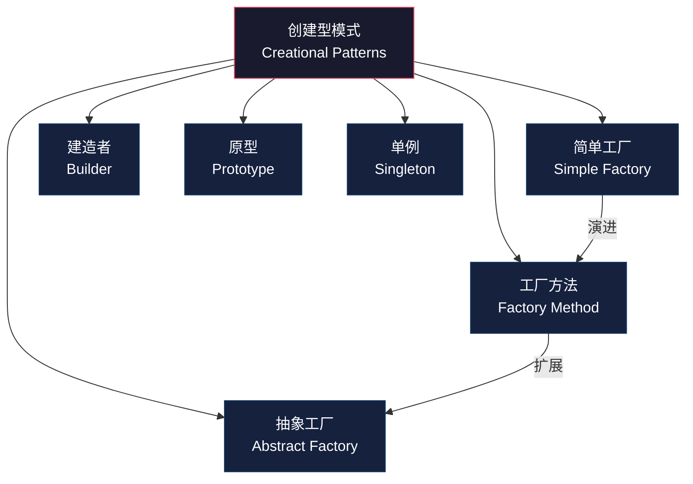
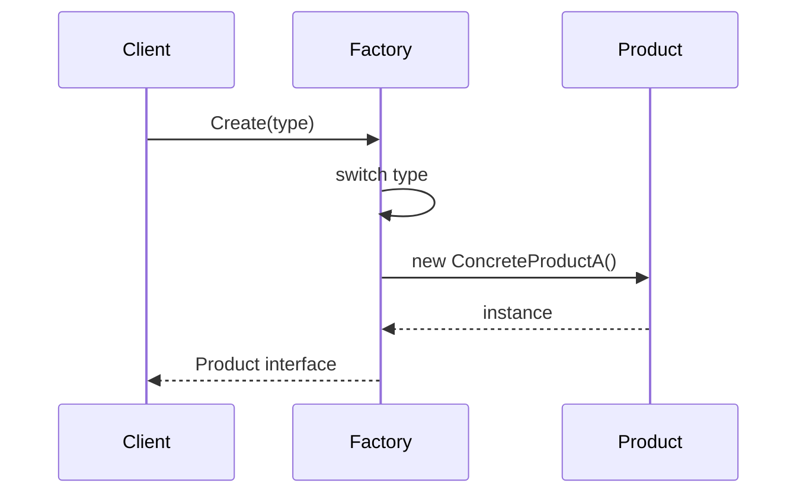
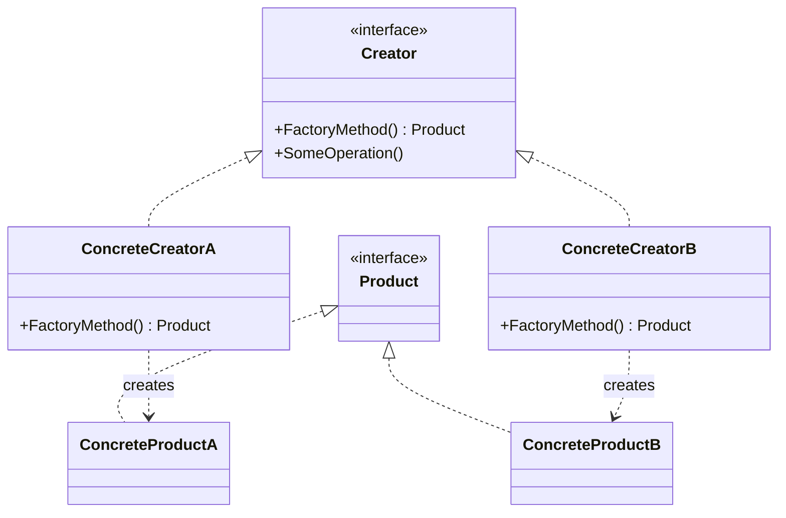
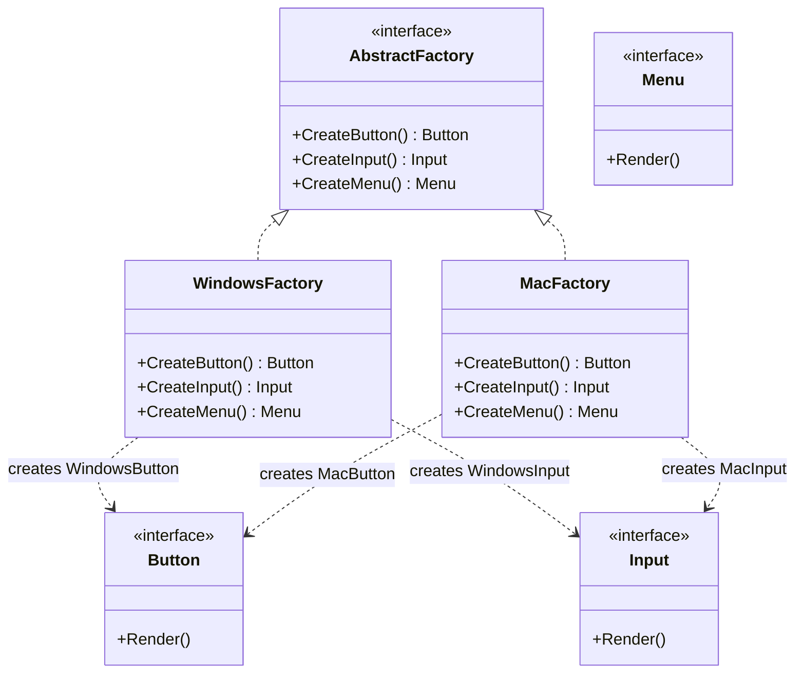
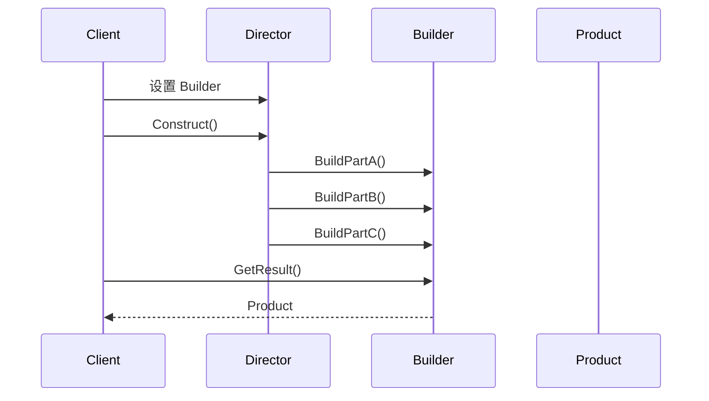
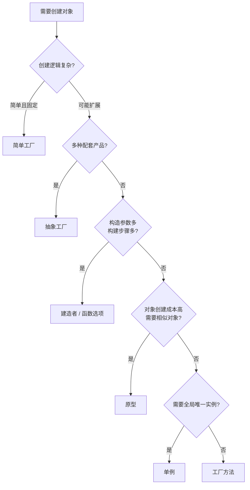

## 二、创建型模式

创建型模式（Creational Patterns）关注**对象的创建机制**，将对象的创建与使用分离，使系统在创建对象时具有更大的灵活性。GoF（Gang of Four）定义了五种经典创建型模式：工厂方法、抽象工厂、建造者、原型和单例。

### 全局视图



| 模式 | 核心思想 | 解决的问题 | 关键角色 |
|------|----------|------------|----------|
| 简单工厂 | 一个工厂创建所有产品 | 集中管理对象创建 | Factory + Product |
| 工厂方法 | 子类决定实例化哪个类 | 不违反开闭原则地扩展产品族 | Creator + ConcreteCreator + Product |
| 抽象工厂 | 创建一系列相关产品的族 | 产品族的一致性约束 | AbstractFactory + ConcreteFactory + AbstractProduct |
| 建造者 | 分步骤构造复杂对象 | 构造参数过多或构建过程复杂 | Director + Builder + Product |
| 原型 | 通过克隆已有对象来创建新对象 | 创建成本高或需要相似对象 | Prototype + Client |
| 单例 | 保证一个类只有一个实例 | 全局共享资源的唯一性 | Singleton |

---

### 2.1 简单工厂（Simple Factory）

严格来说，简单工厂不是 GoF 二十三种设计模式之一，但它是理解工厂方法的基础，实际开发中使用极为广泛。

#### 2.1.1 什么是简单工厂

简单工厂将对象的创建逻辑封装在一个静态方法（或独立函数）中，客户端无需知道具体的创建细节，只需传入参数即可获得所需的对象。



#### 2.1.2 Go 实现

```go
package factory

import (
    "fmt"
    "os"
)

// Logger 是产品接口
type Logger interface {
    Log(message string)
}

// ConsoleLogger 控制台日志
type ConsoleLogger struct{}

func (l *ConsoleLogger) Log(msg string) {
    fmt.Printf("[CONSOLE] %s\n", msg)
}

// FileLogger 文件日志
type FileLogger struct {
    file *os.File
}

func (l *FileLogger) Log(msg string) {
    l.file.WriteString(msg + "\n")
}

// DatabaseLogger 数据库日志
type DatabaseLogger struct {
    DSN string
}

func (l *DatabaseLogger) Log(msg string) {
    fmt.Printf("[DB:%s] %s\n", l.DSN, msg)
}

// NewLogger 简单工厂：根据类型创建不同的 Logger
func NewLogger(logType string) (Logger, error) {
    switch logType {
    case "console":
        return &amp;ConsoleLogger{}, nil
    case "file":
        f, err := os.OpenFile("app.log", os.O_CREATE|os.O_WRONLY|os.O_APPEND, 0644)
        if err != nil {
            return nil, fmt.Errorf("open log file: %w", err)
        }
        return &amp;FileLogger{file: f}, nil
    case "database":
        return &amp;DatabaseLogger{DSN: "localhost:5432/logs"}, nil
    default:
        return nil, fmt.Errorf("unsupported logger type: %s", logType)
    }
}
```

#### 2.1.3 优缺点

| 维度 | 说明 |
|------|------|
| 优点 | 客户端与具体类解耦；创建逻辑集中管理 |
| 缺点 | 违反开闭原则——每新增一种 Logger 都要修改工厂函数 |
| 适用场景 | 产品类型固定且不频繁变化的场景 |

#### 2.1.4 常见误区

**误区一：把所有创建逻辑都塞进简单工厂**

```go
// ❌ 错误：工厂函数变成巨型 switch，几百行代码
func CreateWhatever(kind string, a, b, c, d, e int) interface{} {
    switch kind {
    case "typeA": ...
    case "typeB": ...
    // 继续膨胀...
    }
}

// ✅ 正确：简单工厂只适合产品族较小且稳定的场景
```

**误区二：忽略错误返回值**

```go
// ❌ 错误：吞掉错误或不返回错误
func NewLogger(logType string) Logger {
    // 如果创建失败怎么办？
}

// ✅ 正确：工厂方法应该返回 (T, error)
func NewLogger(logType string) (Logger, error) { ... }
```

---

### 2.2 工厂方法模式（Factory Method）

#### 2.2.1 核心思想

工厂方法模式将对象的创建延迟到子类。定义一个创建对象的接口，但让子类决定实例化哪一个类。这是对简单工厂的改进——完全遵循开闭原则。



#### 2.2.2 Go 实现：支付系统

```go
package payment

import "fmt"

// ========== 产品接口 ==========

// PaymentProcessor 支付处理器接口
type PaymentProcessor interface {
    Pay(amount float64) error
    Refund(transactionID string) error
    Name() string
}

// ========== 具体产品 ==========

type AlipayProcessor struct{}

func (a *AlipayProcessor) Pay(amount float64) error {
    fmt.Printf("支付宝支付 %.2f 元\n", amount)
    return nil
}

func (a *AlipayProcessor) Refund(transactionID string) error {
    fmt.Printf("支付宝退款 %s\n", transactionID)
    return nil
}

func (a *AlipayProcessor) Name() string { return "支付宝" }

type WechatPayProcessor struct{}

func (w *WechatPayProcessor) Pay(amount float64) error {
    fmt.Printf("微信支付 %.2f 元\n", amount)
    return nil
}

func (w *WechatPayProcessor) Refund(transactionID string) error {
    fmt.Printf("微信退款 %s\n", transactionID)
    return nil
}

func (w *WechatPayProcessor) Name() string { return "微信支付" }

type StripeProcessor struct{}

func (s *StripeProcessor) Pay(amount float64) error {
    fmt.Printf("Stripe charge $%.2f\n", amount)
    return nil
}

func (s *StripeProcessor) Refund(transactionID string) error {
    fmt.Printf("Stripe refund %s\n", transactionID)
    return nil
}

func (s *StripeProcessor) Name() string { return "Stripe" }

// ========== 工厂方法 ==========

// PaymentFactory 支付工厂接口
type PaymentFactory interface {
    CreateProcessor() PaymentProcessor
}

type AlipayFactory struct{}

func (f *AlipayFactory) CreateProcessor() PaymentProcessor {
    return &amp;AlipayProcessor{}
}

type WechatPayFactory struct{}

func (f *WechatPayFactory) CreateProcessor() PaymentProcessor {
    return &amp;WechatPayProcessor{}
}

type StripeFactory struct{}

func (f *StripeFactory) CreateProcessor() PaymentProcessor {
    return &amp;StripeProcessor{}
}

// ========== 工厂注册表（进阶：结合反射） ==========

var factories = map[string]PaymentFactory{
    "alipay":  &amp;AlipayFactory{},
    "wechat":  &amp;WechatPayFactory{},
    "stripe":  &amp;StripeFactory{},
}

func GetPaymentFactory(method string) (PaymentFactory, error) {
    f, ok := factories[method]
    if !ok {
        return nil, fmt.Errorf("unsupported payment method: %s", method)
    }
    return f, nil
}
```

#### 2.2.3 使用示例

```go
func Checkout(method string, amount float64) error {
    factory, err := GetPaymentFactory(method)
    if err != nil {
        return err
    }
    
    processor := factory.CreateProcessor()
    fmt.Printf("使用 %s 处理支付...\n", processor.Name())
    return processor.Pay(amount)
}
```

#### 2.2.4 工厂方法 vs 简单工厂

| 对比维度 | 简单工厂 | 工厂方法 |
|----------|----------|----------|
| 创建逻辑 | 集中在单一函数 | 分散到各个子类 |
| 扩展方式 | 修改工厂函数（违反 OCP） | 新增工厂子类（遵循 OCP） |
| 类数量 | 较少 | 每种产品一个工厂，类数量翻倍 |
| 适用场景 | 产品类型固定 | 产品族可能扩展 |

#### 2.2.5 实际应用

- **Go 标准库 `database/sql`**：`sql.Open(driver, dsn)` 就是工厂方法，不同数据库驱动注册各自的 `driver.Driver`
- **Go 标准库 `io`**：`io.Reader`、`io.Writer` 接口的各种实现（`os.File`、`bytes.Buffer`）通过工厂函数创建
- **日志库**：如 `logrus` 支持多种输出格式（JSON、Text），通过工厂方法切换

---

### 2.3 抽象工厂模式（Abstract Factory）

#### 2.3.1 核心思想

抽象工厂提供一个接口，用于创建**一系列相关或相互依赖的对象**，而无需指定它们的具体类。它解决的核心问题是：**保证产品族的一致性**。



#### 2.3.2 Go 实现：跨平台 UI 组件库

```go
package ui

// ========== 抽象产品 ==========

type Button interface {
    Render() string
    OnClick(handler func())
}

type Input interface {
    Render() string
    SetValue(value string)
}

type Menu interface {
    Render() string
    AddItem(label string)
}

// ========== Windows 产品族 ==========

type WindowsButton struct {
    handler func()
}

func (b *WindowsButton) Render() string         { return "[Windows Button]" }
func (b *WindowsButton) OnClick(handler func())  { b.handler = handler }

type WindowsInput struct {
    value string
}

func (i *WindowsInput) Render() string          { return "[Windows Input]" }
func (i *WindowsInput) SetValue(value string)    { i.value = value }

type WindowsMenu struct {
    items []string
}

func (m *WindowsMenu) Render() string           { return "[Windows Menu]" }
func (m *WindowsMenu) AddItem(label string)      { m.items = append(m.items, label) }

// ========== macOS 产品族 ==========

type MacButton struct {
    handler func()
}

func (b *MacButton) Render() string             { return "(Mac Button)" }
func (b *MacButton) OnClick(handler func())      { b.handler = handler }

type MacInput struct {
    value string
}

func (i *MacInput) Render() string              { return "(Mac Input)" }
func (i *MacInput) SetValue(value string)        { i.value = value }

type MacMenu struct {
    items []string
}

func (m *MacMenu) Render() string               { return "(Mac Menu)" }
func (m *MacMenu) AddItem(label string)          { m.items = append(m.items, label) }

// ========== 抽象工厂接口 ==========

type GUIFactory interface {
    CreateButton() Button
    CreateInput() Input
    CreateMenu() Menu
}

type WindowsFactory struct{}

func (f *WindowsFactory) CreateButton() Button { return &amp;WindowsButton{} }
func (f *WindowsFactory) CreateInput() Input   { return &amp;WindowsInput{} }
func (f *WindowsFactory) CreateMenu() Menu      { return &amp;WindowsMenu{} }

type MacFactory struct{}

func (f *MacFactory) CreateButton() Button     { return &amp;MacButton{} }
func (f *MacFactory) CreateInput() Input        { return &amp;MacInput{} }
func (f *MacFactory) CreateMenu() Menu          { return &amp;MacMenu{} }
```

#### 2.3.3 使用方式——客户端无需知道具体类型

```go
func BuildUI(factory GUIFactory) {
    // 客户端完全不知道用的是 Windows 还是 Mac 组件
    btn := factory.CreateButton()
    input := factory.CreateInput()
    menu := factory.CreateMenu()
    
    btn.OnClick(func() { fmt.Println("clicked") })
    input.SetValue("hello")
    menu.AddItem("File")
    menu.AddItem("Edit")
    
    fmt.Println(btn.Render())
    fmt.Println(input.Render())
    fmt.Println(menu.Render())
}

// 运行时根据操作系统选择工厂
func main() {
    var factory GUIFactory
    if runtime.GOOS == "windows" {
        factory = &amp;WindowsFactory{}
    } else {
        factory = &amp;MacFactory{}
    }
    BuildUI(factory)
}
```

#### 2.3.4 何时选择抽象工厂 vs 工厂方法

| 场景 | 选择 |
|------|------|
| 只有一种产品需要灵活创建 | 工厂方法 |
| 多种产品必须配套使用，保证一致性 | 抽象工厂 |
| 产品族数量固定，但可能新增产品种类 | 抽象工厂（需要扩展接口） |
| 产品种类少，变化不频繁 | 简单工厂即可 |

---

### 2.4 建造者模式（Builder）

#### 2.4.1 核心思想

建造者模式将一个复杂对象的**构建过程**与**表示**分离，使同样的构建过程可以创建不同的表示。特别适合以下情况：

- 对象有大量可选参数（避免"伸缩构造函数"问题）
- 构建过程包含多个步骤，需要按序执行
- 需要创建不同配置的同类对象



#### 2.4.2 Go 实现：HTTP 服务器配置

```go
package server

import (
    "errors"
    "fmt"
    "time"
)

// Server 产品：一个 HTTP 服务器配置
type Server struct {
    Host         string
    Port         int
    ReadTimeout  time.Duration
    WriteTimeout time.Duration
    MaxConns     int
    TLS          bool
    CertFile     string
    KeyFile      string
    Middlewares   []string
    LogFormat    string
}

func (s *Server) String() string {
    return fmt.Sprintf("Server(%s:%d, TLS=%v, MaxConns=%d)",
        s.Host, s.Port, s.TLS, s.MaxConns)
}

// ServerBuilder 建造者
type ServerBuilder struct {
    server *Server
    errors []string
}

// NewServerBuilder 创建带有合理默认值的 Builder
func NewServerBuilder() *ServerBuilder {
    return &amp;ServerBuilder{
        server: &amp;Server{
            Host:         "localhost",
            Port:         8080,
            ReadTimeout:  10 * time.Second,
            WriteTimeout: 10 * time.Second,
            MaxConns:     1000,
            LogFormat:    "json",
        },
    }
}

func (b *ServerBuilder) Host(host string) *ServerBuilder {
    b.server.Host = host
    return b
}

func (b *ServerBuilder) Port(port int) *ServerBuilder {
    b.server.Port = port
    return b
}

func (b *ServerBuilder) ReadTimeout(d time.Duration) *ServerBuilder {
    b.server.ReadTimeout = d
    return b
}

func (b *ServerBuilder) WriteTimeout(d time.Duration) *ServerBuilder {
    b.server.WriteTimeout = d
    return b
}

func (b *ServerBuilder) MaxConns(n int) *ServerBuilder {
    if n <= 0 {
        b.errors = append(b.errors, "MaxConns must be positive")
    }
    b.server.MaxConns = n
    return b
}

func (b *ServerBuilder) WithTLS(cert, key string) *ServerBuilder {
    b.server.TLS = true
    b.server.CertFile = cert
    b.server.KeyFile = key
    return b
}

func (b *ServerBuilder) WithMiddleware(name string) *ServerBuilder {
    b.server.Middlewares = append(b.server.Middlewares, name)
    return b
}

func (b *ServerBuilder) LogFormat(format string) *ServerBuilder {
    b.server.LogFormat = format
    return b
}

// Build 执行构建验证并返回结果
func (b *ServerBuilder) Build() (*Server, error) {
    // 收集所有错误
    if b.server.TLS &amp;&amp; (b.server.CertFile == "" || b.server.KeyFile == "") {
        b.errors = append(b.errors, "TLS enabled but cert/key files not provided")
    }
    if b.server.Port < 1 || b.server.Port > 65535 {
        b.errors = append(b.errors, fmt.Sprintf("invalid port: %d", b.server.Port))
    }

    if len(b.errors) > 0 {
        return nil, errors.New("validation failed: " + fmt.Sprint(b.errors))
    }

    return b.server, nil
}
```

#### 2.4.3 使用示例

```go
// 简单配置
server, err := NewServerBuilder().
    Port(443).
    WithTLS("/cert.pem", "/key.pem").
    WithMiddleware("cors").
    WithMiddleware("rate-limit").
    Build()

// 默认配置（直接 Build）
server, err := NewServerBuilder().Build()
```

#### 2.4.4 与函数选项模式对比

Go 社区更常用**函数选项模式（Functional Options）**来替代经典 Builder：

```go
// 函数选项模式
type Option func(*Server)

func WithHost(host string) Option {
    return func(s *Server) { s.Host = host }
}

func WithPort(port int) Option {
    return func(s *Server) { s.Port = port }
}

func WithTLS(cert, key string) Option {
    return func(s *Server) {
        s.TLS = true
        s.CertFile = cert
        s.KeyFile = key
    }
}

func NewServer(opts ...Option) *Server {
    s := &amp;Server{
        Host: "localhost", Port: 8080,
        ReadTimeout: 10 * time.Second,
        WriteTimeout: 10 * time.Second,
        MaxConns: 1000,
    }
    for _, opt := range opts {
        opt(s)
    }
    return s
}

// 使用
server := NewServer(
    WithPort(443),
    WithTLS("/cert.pem", "/key.pem"),
)
```

| 对比维度 | Builder 模式 | 函数选项模式 |
|----------|-------------|-------------|
| 链式调用 | 支持（每个方法返回 Builder） | 不支持（参数列表式） |
| 验证时机 | Build() 时统一验证 | 可在每个 Option 内即时验证 |
| 代码量 | 多（每个字段一个方法） | 少（每个字段一个函数） |
| 可读性 | 好（链式表达意图清晰） | 好（参数语义明确） |
| Go 社区偏好 | 偏少 | **更主流**（如 gRPC、uber-go） |
| 适用场景 | 构建过程复杂、有依赖关系 | 配置项多、无构建顺序依赖 |

---

### 2.5 原型模式（Prototype）

#### 2.5.1 核心思想

原型模式通过**复制（克隆）已有对象**来创建新对象，而不是通过 `new` 关键字重新实例化。适用于：

- 对象创建成本高（如涉及网络请求、数据库查询、复杂计算）
- 需要大量相似对象，只有少量属性不同
- 运行时动态决定创建哪种类型的对象

#### 2.5.2 Go 实现：深拷贝与浅拷贝

Go 没有内置的 `clone()` 方法，需要手动实现 `Clone()` 接口：

```go
package prototype

import "time"

// Cloner 原型接口
type Cloner interface {
    Clone() *Config
}

// Config 配置对象（含不可变部分和可变部分）
type Config struct {
    AppName    string
    Version    string
    Debug      bool
    Database   DatabaseConfig
    Cache      CacheConfig
    CreatedAt  time.Time
}

type DatabaseConfig struct {
    Host     string
    Port     int
    Password string // 敏感数据
    MaxConns int
}

type CacheConfig struct {
    TTL     time.Duration
    MaxKeys int
}

// Clone 深拷贝：确保内部引用类型也独立
func (c *Config) Clone() *Config {
    cloned := *c // 浅拷贝值类型
    // 由于 DatabaseConfig 和 CacheConfig 都是值类型，浅拷贝已足够
    // 如果含有切片/map/指针，需要深拷贝
    return &amp;cloned
}
```

#### 2.5.3 含切片/map 的深拷贝

```go
// 深拷贝的典型场景：对象内部含有引用类型
type UserSession struct {
    UserID    string
    Roles     []string       // 切片需要深拷贝
    Metadata  map[string]string // map 需要深拷贝
    ExpiresAt time.Time
}

func (s *UserSession) Clone() *UserSession {
    cloned := *s

    // 深拷贝切片
    if s.Roles != nil {
        cloned.Roles = make([]string, len(s.Roles))
        copy(cloned.Roles, s.Roles)
    }

    // 深拷贝 map
    if s.Metadata != nil {
        cloned.Metadata = make(map[string]string, len(s.Metadata))
        for k, v := range s.Metadata {
            cloned.Metadata[k] = v
        }
    }

    return &amp;cloned
}
```

#### 2.5.4 原型注册表

```go
// PrototypeRegistry 管理可克隆的原型
type PrototypeRegistry struct {
    prototypes map[string]Cloner
}

func NewPrototypeRegistry() *PrototypeRegistry {
    return &amp;PrototypeRegistry{
        prototypes: make(map[string]Cloner),
    }
}

func (r *PrototypeRegistry) Register(name string, prototype Cloner) {
    r.prototypes[name] = prototype
}

func (r *PrototypeRegistry) Get(name string) (*Config, error) {
    p, ok := r.prototypes[name]
    if !ok {
        return nil, fmt.Errorf("prototype %q not found", name)
    }
    return p.Clone(), nil
}

// 使用示例
func ExamplePrototype() {
    registry := NewPrototypeRegistry()
    
    // 注册一个生产环境原型
    registry.Register("production", &amp;Config{
        AppName: "MyApp",
        Version: "1.0.0",
        Debug:   false,
        Database: DatabaseConfig{
            Host: "db.prod.internal", Port: 5432, MaxConns: 100,
        },
    })
    
    // 克隆出多个配置，各自修改
    cfg1, _ := registry.Get("production")
    cfg1.Debug = true // 只影响 cfg1
    
    cfg2, _ := registry.Get("production")
    cfg2.Database.MaxConns = 50 // 只影响 cfg2
    
    // 三者互不影响
}
```

#### 2.5.5 Go 标准库中的原型模式

- `bytes.Buffer.Clone()`、`net/http.Request.Clone()` 都是原型模式的体现
- `testing.T` 的 `t.Parallel()` 本质上也是基于克隆测试上下文

---

### 2.6 单例模式（Singleton）

#### 2.6.1 核心思想

单例模式确保一个类**只有一个实例**，并提供一个全局访问点。Go 中通常用于：

- 数据库连接池
- 配置管理器
- 日志记录器
- 缓存管理器

#### 2.6.2 Go 实现方式

**方式一：`sync.Once`（推荐）**

```go
package singleton

import (
    "sync"
)

// DBPool 数据库连接池单例
type DBPool struct {
    DSN    string
    MaxCon int
}

var (
    dbPool *DBPool
    once   sync.Once
)

// GetDBPool 获取单例实例（线程安全）
func GetDBPool() *DBPool {
    once.Do(func() {
        dbPool = &amp;DBPool{
            DSN:    "host=localhost port=5432 dbname=myapp",
            MaxCon: 25,
        }
    })
    return dbPool
}
```

**方式二：`init()` 函数**

```go
var config *AppConfig

func init() {
    config = loadConfig()
}

func GetConfig() *AppConfig {
    return config
}
```

注意：`init()` 在包导入时就执行，无法延迟初始化。如果配置加载依赖外部参数，这种方式不适用。

**方式三：带接口的单例（可测试）**

```go
// Logger 单例接口，方便测试时 mock
type Logger interface {
    Info(msg string)
    Error(msg string)
}

type fileLogger struct {
    path string
}

func (l *fileLogger) Info(msg string)  { /* 写文件 */ }
func (l *fileLogger) Error(msg string) { /* 写文件 */ }

var (
    logger Logger
    loggerOnce sync.Once
)

func GetLogger() Logger {
    loggerOnce.Do(func() {
        logger = &amp;fileLogger{path: "/var/log/app.log"}
    })
    return logger
}

// 测试时可以替换
func SetLogger(l Logger) {
    logger = l
}
```

#### 2.6.3 各实现方式对比

| 方式 | 线程安全 | 延迟初始化 | 可测试性 | 复杂度 |
|------|---------|-----------|---------|--------|
| `sync.Once` | ✅ | ✅ | 一般（需接口） | 低 |
| `init()` 函数 | ✅ | ❌（导入即执行） | 差 | 最低 |
| `sync.Mutex` | ✅ | ✅ | 一般 | 中 |
| `atomic` | ✅ | ✅ | 一般 | 中 |
| 包级变量直接初始化 | ✅ | ❌ | 差 | 最低 |

#### 2.6.4 单例的陷阱与反模式

**陷阱一：单例滥用**

```go
// ❌ 错误：把所有东西都做成单例
var UserServiceSingleton *UserService
var OrderServiceSingleton *OrderService
var PaymentServiceSingleton *PaymentService
// 整个系统变成了全局变量的集合，无法测试、无法并行

// ✅ 正确：只在真正需要全局唯一的地方用单例
// 数据库连接池、配置管理器、日志记录器 — 这些天然要求全局唯一
```

**陷阱二：单例引入隐式依赖**

```go
// ❌ 错误：函数内部直接访问单例
func ProcessOrder(orderID string) error {
    db := GetDBPool() // 隐式依赖，无法注入测试替身
    // ...
}

// ✅ 正确：通过依赖注入传递
func ProcessOrder(db *DBPool, orderID string) error {
    // db 可以是真实连接池或测试 mock
}
```

**陷阱三：单例与并发**

```go
// ❌ 错误：单例内部状态被并发修改
type Cache struct {
    data map[string]string // map 不是并发安全的！
}

var cache = &amp;Cache{data: make(map[string]string)}

// ✅ 正确：使用 sync.RWMutex 或 sync.Map
type SafeCache struct {
    mu   sync.RWMutex
    data map[string]string
}

func (c *SafeCache) Get(key string) (string, bool) {
    c.mu.RLock()
    defer c.mu.RUnlock()
    v, ok := c.data[key]
    return v, ok
}

func (c *SafeCache) Set(key, value string) {
    c.mu.Lock()
    defer c.mu.Unlock()
    c.data[key] = value
}
```

---

### 2.7 创建型模式的选择指南



### 2.8 Go 特有的创建惯用法

Go 没有类和构造函数，但有独特的创建对象惯用法：

| 惯用法 | 说明 | 示例 |
|--------|------|------|
| `NewXxx()` | 命名返回值的构造函数 | `f, err := os.Open(path)` |
| 字面量初始化 | 零值或指定字段初始化 | `s := &Server{Host: "localhost"}` |
| 函数选项 | 用闭包注入配置 | `grpc.NewServer(grpc.MaxConns(100))` |
| `sync.Once` | 线程安全的单例 | `once.Do(func() { ... })` |
| 接口+工厂 | 隐藏具体实现 | `io.Reader` + `os.Open()` |
| `Copy()` 方法 | 手动实现深拷贝 | `req.Clone(ctx)` |

### 2.9 常见误区总结

| 误区 | 正确做法 |
|------|----------|
| 滥用单例，把所有全局状态都做单例 | 只在真正需要全局唯一时使用 |
| 工厂方法中用 `switch` 硬编码类型 | 用注册表模式（map）管理类型映射 |
| Builder 忘记验证 | 在 `Build()` 中统一校验 |
| 原型浅拷贝导致引用类型共享 | 含切片/map 时必须深拷贝 |
| 抽象工厂导致类爆炸 | 产品族不多时用工厂方法即可 |
| 单例中存储可变状态 | 单例应尽量无状态，或使用并发安全的数据结构 |
| 过度设计：简单场景用复杂模式 | 根据实际需求选择，简单优先 |

---

### 本节要点

- **简单工厂**是入门，适合产品族固定的场景
- **工厂方法**遵循开闭原则，通过子类扩展产品
- **抽象工厂**保证产品族一致性，适合 UI 组件、跨平台等场景
- **建造者**解决复杂对象构建，Go 社区更偏好函数选项模式
- **原型**通过克隆避免高成本创建，注意深拷贝问题
- **单例**保证全局唯一，但应配合依赖注入使用，避免隐式依赖

选择模式的关键原则：**先确认问题，再选择方案**。不要为了用模式而用模式——大多数场景下，简单的结构体 + 函数就足够了。
