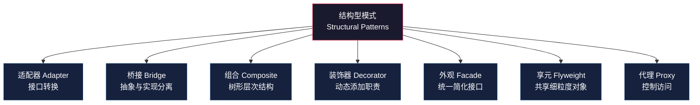
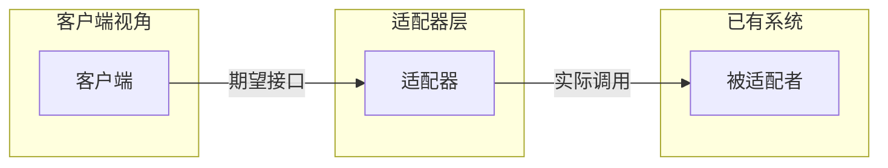
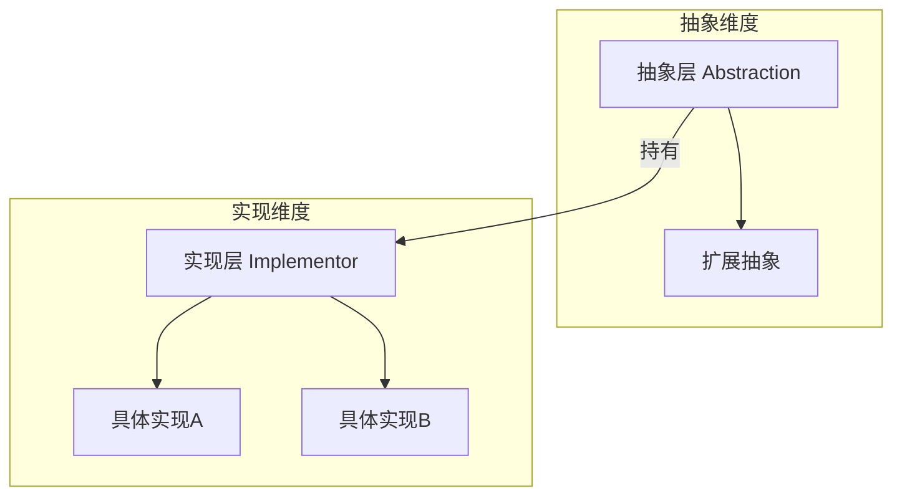
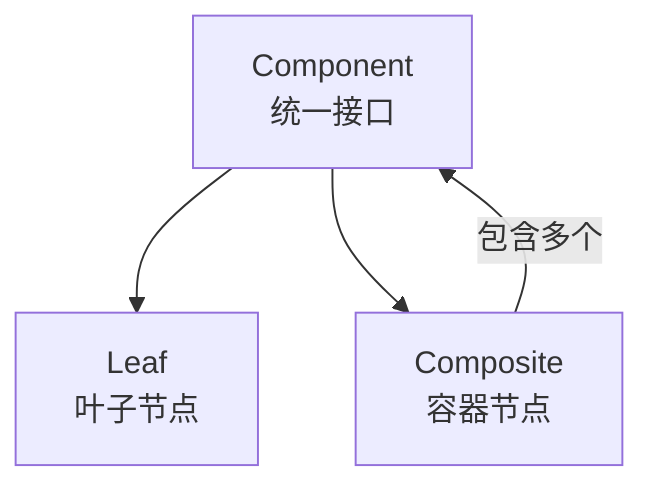
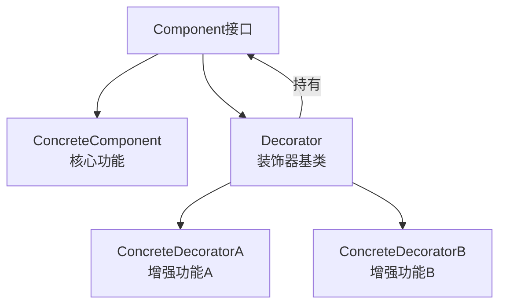
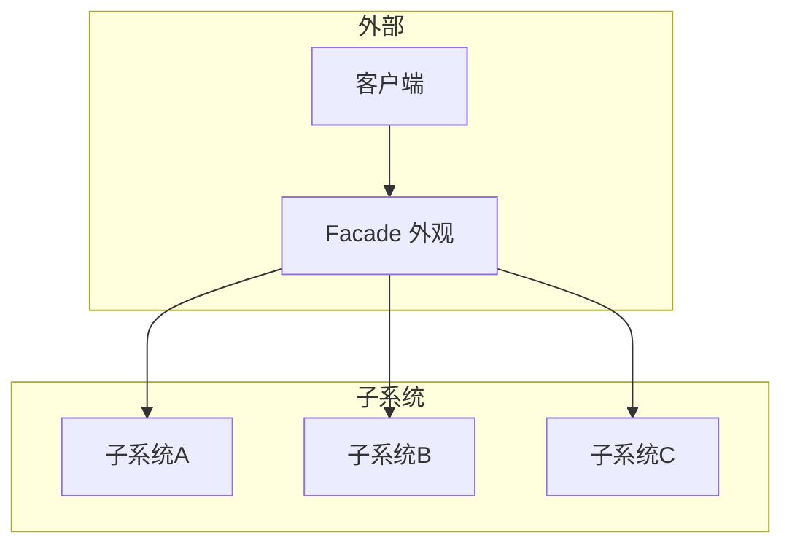
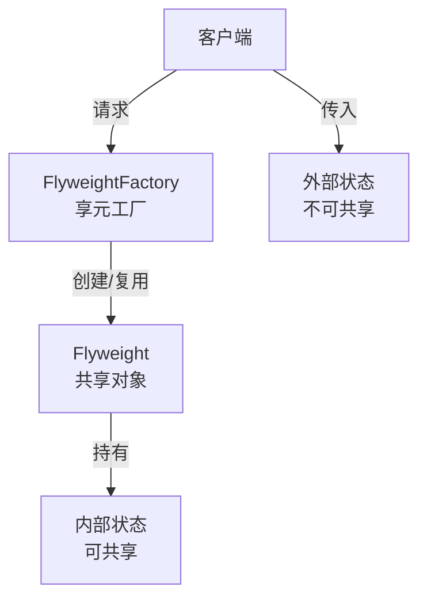
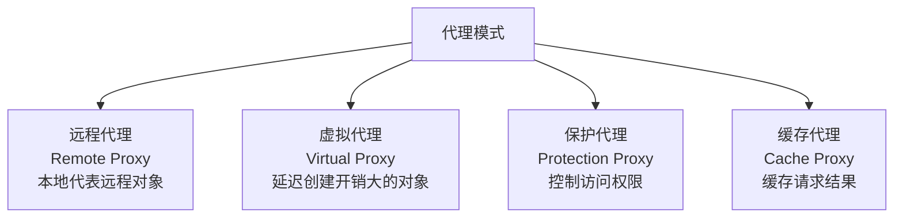

## 三、结构型模式

结构型模式关注如何将类或对象组合成更大的结构，以实现新功能或简化设计。GoF将结构型模式分为**类结构型模式**（通过继承组合接口）和**对象结构型模式**（通过对象组合关联对象）两大类。

### 为什么结构型模式如此重要？

软件工程的二八法则表明：**80%的复杂性来自组件之间的连接方式，而非组件本身**。一个算法写得再精妙，如果组件之间的组装方式混乱，系统依然难以维护。结构型模式正是解决这个"连接问题"的方法论。

从哲学层面看，结构型模式体现了三种设计智慧：

- **解耦的智慧**：Facade将复杂子系统简化为单一入口，Adapter在不兼容的接口之间架桥——本质都是降低组件间的耦合度
- **复用的智慧**：Decorator通过组合动态增强功能而非继承，Flyweight通过共享消除重复——本质都是用最小的资源实现最大的灵活性
- **统一的智慧**：Composite将叶子节点和容器节点统一为同一接口，Proxy让客户端对代理和真实对象无感知——本质都是用一致性降低认知负担

### Go语言与结构型模式的天然契合

Go语言的设计哲学与结构型模式有深层的契合关系。理解这一点，能帮助你更自然地在Go中运用这些模式：

| Go语言特性 | 对结构型模式的影响 | 典型应用 |
|------------|-------------------|----------|
| 没有类继承 | 类适配器无法实现，必须用对象组合 | Adapter、Bridge用组合而非继承 |
| 隐式接口实现 | 接口与实现解耦，适配成本极低 | Adapter可以零修改适配任意类型 |
| 一等函数 | 装饰器可用高阶函数替代 | `func(Handler) Handler` 模式 |
| `embed` 嵌入 | 模拟继承实现，简化装饰器/适配器代码 | 减少样板代码 |
| `sync.Once` | 虚拟代理的线程安全懒加载 | Proxy延迟初始化 |
| 接口组合 | 小接口拼接大接口 | Facade按需暴露功能子集 |

这意味着Go程序员**天然偏向对象结构型模式**（通过组合关联对象），而非类结构型模式（通过继承组合接口）。这是Go的设计意图——"组合优于继承"不是口号，而是语言层面的强制约束。



### 核心设计思想

结构型模式解决的核心问题是：**如何将零散的组件组装成有意义的整体**。这涉及三个层面的考量：

- **类级别**：通过继承将接口和实现组合（Adapter、Bridge）
- **对象级别**：通过组合将对象连接成更大的结构（Composite、Decorator、Facade、Flyweight、Proxy）
- **接口转换**：在不兼容的接口之间建立桥梁（Adapter）

选择结构型模式时的关键判断维度：

| 维度 | 选择依据 |
|------|----------|
| 目的 | 是简化接口（Facade）还是增强功能（Decorator）还是控制访问（Proxy）？ |
| 时机 | 是事后补救（Adapter）还是事前设计（Bridge）？ |
| 粒度 | 操作单个对象（Decorator/Proxy）还是整个子系统（Facade）？ |
| 复用方式 | 通过继承（类适配器）还是通过组合（对象适配器）？ |

---

### 3.1 适配器模式（Adapter）

#### 意图

将一个类的接口转换成客户端期望的另一个接口。Adapter使得原本因接口不兼容而无法一起工作的类可以一起工作。

**核心矛盾**：你有一个可用的组件，但它的接口与你系统的接口不匹配。你既不想修改已有组件（可能来自第三方库或遗留系统），也不想修改客户端代码。适配器在两者之间建立翻译层。



#### 两种实现方式

适配器有两种经典实现方式，各有优劣：

```go
// ==========================================
// 方式一：对象适配器（通过组合，更推荐）
// ==========================================

// 已有的第三方日志库 —— 接口与我们的系统不兼容
type ThirdPartyLogger struct{}

func (l *ThirdPartyLogger) WriteLog(level string, msg string) {
    fmt.Printf("[%s] %s\n", level, msg)
}

// 我们系统期望的日志接口
type Logger interface {
    Info(msg string)
    Error(msg string)
    Debug(msg string)
}

// 适配器：通过组合持有被适配者
type ThirdPartyLoggerAdapter struct {
    adaptee *ThirdPartyLogger
}

func NewThirdPartyLoggerAdapter(logger *ThirdPartyLogger) *ThirdPartyLoggerAdapter {
    return &amp;ThirdPartyLoggerAdapter{adaptee: logger}
}

func (a *ThirdPartyLoggerAdapter) Info(msg string) {
    a.adaptee.WriteLog("INFO", msg)
}

func (a *ThirdPartyLoggerAdapter) Error(msg string) {
    a.adaptee.WriteLog("ERROR", msg)
}

func (a *ThirdPartyLoggerAdapter) Debug(msg string) {
    a.adaptee.WriteLog("DEBUG", msg)
}

// ==========================================
// 方式二：类适配器（通过多重继承，Go不直接支持）
// Go中通过嵌入接口模拟
// ==========================================

type AnotherThirdPartyLogger struct{}

func (l *AnotherThirdPartyLogger) LegacyLog(msg string) {
    fmt.Println("LEGACY:", msg)
}

// 通过嵌入接口 + 实现方法来适配
// Go的接口是隐式实现的，所以可以这样组合
type LegacyLoggerAdapter struct {
    *AnotherThirdPartyLogger // 嵌入被适配者
}

func (a *LegacyLoggerAdapter) Info(msg string) {
    a.LegacyLog("[INFO] " + msg)
}

func (a *LegacyLoggerAdapter) Error(msg string) {
    a.LegacyLog("[ERROR] " + msg)
}
```

#### 实际场景：数据库驱动适配

一个典型的生产级适配器应用是数据库驱动适配层。系统定义统一的存储接口，不同数据库驱动通过适配器接入：

```go
// 统一存储接口
type StorageService interface {
    Store(key string, value []byte) error
    Retrieve(key string) ([]byte, error)
    Delete(key string) error
}

// --- Redis适配器 ---
type RedisClient struct {
    addr string
    conn *redis.Conn
}

func (r *RedisClient) Set(ctx context.Context, key string, value interface{}) error {
    return r.conn.Set(ctx, key, value, 0).Err()
}

func (r *RedisClient) Get(ctx context.Context, key string) (string, error) {
    return r.conn.Get(ctx, key).Result()
}

func (r *RedisClient) Del(ctx context.Context, keys ...string) error {
    return r.conn.Del(ctx, keys...).Err()
}

// Redis适配器：将Redis API适配为StorageService接口
type RedisStorageAdapter struct {
    client *RedisClient
    ctx    context.Context
}

func (a *RedisStorageAdapter) Store(key string, value []byte) error {
    return a.client.Set(a.ctx, key, value)
}

func (a *RedisStorageAdapter) Retrieve(key string) ([]byte, error) {
    return a.client.Get(a.ctx, key)
}

func (a *RedisStorageAdapter) Delete(key string) error {
    return a.client.Del(a.ctx, key)
}

// --- 本地文件系统适配器 ---
type FileStorage struct {
    dir string
}

func (f *FileStorage) Store(key string, value []byte) error {
    path := filepath.Join(f.dir, key)
    return os.WriteFile(path, value, 0644)
}

func (f *FileStorage) Retrieve(key string) ([]byte, error) {
    path := filepath.Join(f.dir, key)
    return os.ReadFile(path)
}

func (f *FileStorage) Delete(key string) error {
    path := filepath.Join(f.dir, key)
    return os.Remove(path)
}

// --- 使用示例：业务代码只依赖StorageService接口 ---
type UserCache struct {
    storage StorageService // 依赖抽象，不依赖具体实现
}

func (c *UserCache) GetUser(id string) (*User, error) {
    data, err := c.storage.Retrieve("user:" + id)
    if err != nil {
        return nil, err
    }
    var user User
    json.Unmarshal(data, &amp;user)
    return &amp;user, nil
}

// 切换存储后端只需更换适配器，业务代码无需改动
func main() {
    // 方式一：使用Redis
    // cache := &amp;UserCache{storage: &amp;RedisStorageAdapter{...}}

    // 方式二：使用本地文件（测试环境）
    cache := &amp;UserCache{storage: &amp;FileStorage{dir: "/tmp/cache"}}
    _ = cache
}
```

#### 适用场景

- 需要整合第三方库或遗留系统，但其接口与你的系统不一致
- 需要为多个不同输出格式的数据源提供统一读取接口
- 系统需要与外部系统集成，但外部系统的API不稳定或会变化
- 在遗留系统上构建新系统时，新旧系统接口不兼容

#### 与桥接模式的区别

适配器是**事后补救**——发现接口不匹配后加一层翻译；桥接是**事前设计**——一开始就将抽象和实现分离，使两者可以独立变化。适配器改变接口，桥接不改变接口。

---

### 3.2 桥接模式（Bridge）

#### 意图

将抽象部分与实现部分分离，使它们可以独立变化。

**核心问题**：当一个抽象有多个维度的变化时（如形状×颜色、平台×功能），使用继承会导致类爆炸。如果有3种形状和5种颜色，继承方案需要15个子类（RedCircle, BlueCircle, ...），而桥接方案只需3+5=8个类。



#### 代码示例：跨平台消息发送

```go
// ==========================================
// 实现维度：消息发送方式（不同平台）
// ==========================================

// 消息发送者接口（实现层）
type MessageSender interface {
    Send(title, content string) error
}

type EmailSender struct {
    smtpHost string
    smtpPort int
}

func (e *EmailSender) Send(title, content string) error {
    fmt.Printf("发送邮件 [%s]: %s\n", title, content)
    // 实际发送逻辑
    return nil
}

type SMSSender struct {
    apiKey string
}

func (s *SMSSender) Send(title, content string) error {
    fmt.Printf("发送短信 [%s]: %s\n", title, content)
    // 实际发送逻辑
    return nil
}

type WeChatSender struct {
    appId string
}

func (w *WeChatSender) Send(title, content string) error {
    fmt.Printf("发送微信 [%s]: %s\n", title, content)
    // 实际发送逻辑
    return nil
}

// ==========================================
// 抽象维度：消息类型（不同业务场景）
// ==========================================

// 消息抽象（抽象层）
type Message interface {
    Send(title, content string) error
}

// 普通消息：直接发送
type NormalMessage struct {
    sender MessageSender // 桥接：持有实现层的引用
}

func (m *NormalMessage) Send(title, content string) error {
    return m.sender.Send(title, content)
}

// 紧急消息：添加前缀并重试
type UrgentMessage struct {
    sender  MessageSender
    retries int
}

func (m *UrgentMessage) Send(title, content string) error {
    urgentTitle := "【紧急】" + title
    var lastErr error
    for i := 0; i <= m.retries; i++ {
        if err := m.sender.Send(urgentTitle, content); err != nil {
            lastErr = err
            continue
        }
        return nil
    }
    return lastErr
}

// 定时消息：延迟发送
type DelayedMessage struct {
    sender    MessageSender
    delayTime time.Duration
}

func (m *DelayedMessage) Send(title, content string) error {
    fmt.Printf("消息将在 %v 后发送\n", m.delayTime)
    time.AfterFunc(m.delayTime, func() {
        m.sender.Send(title, content)
    })
    return nil
}

// ==========================================
// 使用示例：任意组合
// ==========================================

func main() {
    // 普通邮件
    email := &amp;NormalMessage{sender: &amp;EmailSender{smtpHost: "smtp.example.com"}}
    email.Send("欢迎", "感谢注册")

    // 紧急短信（带重试）
    sms := &amp;UrgentMessage{sender: &amp;SMSSender{apiKey: "key123"}, retries: 3}
    sms.Send("系统告警", "CPU使用率超过90%")

    // 定时微信通知
    wechat := &amp;DelayedMessage{
        sender:    &amp;WeChatSender{appId: "wx123"},
        delayTime: 5 * time.Minute,
    }
    wechat.Send("会议提醒", "5分钟后开始")
}
```

#### Bridge模式的关键优势

**扩展自由度对比**（假设增加1种新发送渠道 + 1种新消息类型）：

| 方案 | 继承方案 | 桥接方案 |
|------|----------|----------|
| 增加前类数 | 4×4=16个子类 | 4+4=8个类 |
| 新增1种渠道 | 新增4个子类 | 新增1个实现类 |
| 新增1种消息 | 新增4个子类 | 新增1个抽象类 |
| 新增N种渠道×M种消息 | N×M个子类 | N+M个类 |

#### 适用场景

- 不希望或不能使用继承导致类数量大幅增长
- 抽象和实现都应该可以通过子类来扩充
- 需要跨多个平台共享实现（如跨平台GUI）
- 需要在运行时切换实现

#### 常见应用

- **跨平台GUI框架**：形状（Circle/Rect）× 渲染引擎（OpenGL/Vulkan/DirectX），避免为每种组合创建子类
- **数据库驱动抽象**：连接方式（TCP/Unix Socket/SSH）× 数据库类型（MySQL/PostgreSQL/MongoDB），驱动层独立于业务抽象
- **消息队列适配**：消息类型（普通/延迟/事务）× 中间件（Kafka/RabbitMQ/Redis Stream），业务逻辑与中间件解耦
- **支付系统**：支付方式（信用卡/支付宝/微信）× 渠道（国内/国际），新增支付方式或渠道只需新增一个类
- **日志系统**：日志级别（Debug/Info/Error）× 输出目标（文件/控制台/ELK），各维度独立演进

---

### 3.3 组合模式（Composite）

#### 意图

将对象组合成树形结构以表示"部分-整体"的层次。Composite使得用户对单个对象和组合对象的使用具有一致性。

**核心思想**：将一个树形结构中的所有节点视为同一类型（Component），叶子节点和容器节点都实现相同接口。客户端无需区分操作的是单个对象还是组合对象。



#### 代码示例：组织架构与薪资计算

```go
// ==========================================
// Component：统一接口
// ==========================================

type Employee interface {
    Name() string
    Role() string
    Salary() float64
    Level() int
    // 用于树形展示
    String() string
    Subordinates() []Employee
}

// ==========================================
// Leaf：叶子节点（普通员工）
// ==========================================

type Developer struct {
    name       string
    salary     float64
    project    string
}

func NewDeveloper(name string, salary float64, project string) *Developer {
    return &amp;Developer{name: name, salary: salary, project: project}
}

func (d *Developer) Name() string          { return d.name }
func (d *Developer) Role() string          { return "Developer" }
func (d *Developer) Salary() float64       { return d.salary }
func (d *Developer) Level() int            { return 1 }
func (d *Developer) Subordinates() []Employee { return nil }

func (d *Developer) String() string {
    return fmt.Sprintf("  [Dev] %s - 项目: %s, 薪资: %.0f", d.name, d.project, d.salary)
}

type Designer struct {
    name   string
    salary float64
    team   string
}

func NewDesigner(name string, salary float64, team string) *Designer {
    return &amp;Designer{name: name, salary: salary, team: team}
}

func (d *Designer) Name() string              { return d.name }
func (d *Designer) Role() string              { return "Designer" }
func (d *Designer) Salary() float64           { return d.salary }
func (d *Designer) Level() int                { return 1 }
func (d *Designer) Subordinates() []Employee  { return nil }

func (d *Designer) String() string {
    return fmt.Sprintf("  [Designer] %s - 团队: %s, 薪资: %.0f", d.name, d.team, d.salary)
}

// ==========================================
// Composite：容器节点（管理者）
// ==========================================

type Manager struct {
    name         string
    salary       float64
    department   string
    subordinates []Employee
}

func NewManager(name string, salary float64, department string) *Manager {
    return &amp;Manager{
        name:         name,
        salary:       salary,
        department:   department,
        subordinates: make([]Employee, 0),
    }
}

func (m *Manager) Name() string              { return m.name }
func (m *Manager) Role() string              { return "Manager" }
func (m *Manager) Salary() float64           { return m.salary }
func (m *Manager) Subordinates() []Employee  { return m.subordinates }

func (m *Manager) Level() int {
    maxLevel := 0
    for _, sub := range m.subordinates {
        if sub.Level() > maxLevel {
            maxLevel = sub.Level()
        }
    }
    return maxLevel + 1 // 比最高下属高一级
}

func (m *Manager) Add(e Employee) {
    m.subordinates = append(m.subordinates, e)
}

func (m *Manager) Remove(e Employee) {
    for i, sub := range m.subordinates {
        if sub.Name() == e.Name() {
            m.subordinates = append(m.subordinates[:i], m.subordinates[i+1:]...)
            return
        }
    }
}

// 递归计算整个部门的总薪资
func (m *Manager) TotalSalary() float64 {
    total := m.salary
    for _, sub := range m.subordinates {
        total += sub.Salary()
    }
    return total
}

func (m *Manager) String() string {
    return fmt.Sprintf("[Manager] %s - 部门: %s, 薪资: %.0f (团队总薪资: %.0f, 团队人数: %d)",
        m.name, m.department, m.salary, m.TotalSalary(), len(m.subordinates)+1)
}

// 递归打印组织架构树
func PrintTree(e Employee, indent string) {
    fmt.Println(indent + e.String())
    for _, sub := range e.Subordinates() {
        PrintTree(sub, indent+"  ")
    }
}

// ==========================================
// 使用示例
// ==========================================

func main() {
    // 构建组织架构
    ceo := NewManager("张总", 50000, "公司")

    cto := NewManager("李总", 35000, "技术部")
    cto.Add(NewDeveloper("王工程师", 20000, "后端"))
    cto.Add(NewDeveloper("赵工程师", 22000, "前端"))

    cmo := NewManager("刘总", 30000, "市场部")
    cmo.Add(NewDesigner("陈设计师", 18000, "品牌"))

    ceo.Add(cto)
    ceo.Add(cmo)

    // 一致性操作：对CEO调用与对普通员工调用接口相同
    PrintTree(ceo, "")
    // [Manager] 张总 - 部门: 公司, 薪资: 50000 (团队总薪资: 145000, 团队人数: 5)
    //   [Manager] 李总 - 部门: 技术部, 薪资: 35000 (团队总薪资: 77000, 团队人数: 3)
    //     [Dev] 王工程师 - 项目: 后端, 薪资: 20000
    //     [Dev] 赵工程师 - 项目: 前端, 薪资: 22000
    //   [Manager] 刘总 - 部门: 市场部, 薪资: 30000 (团队总薪资: 48000, 团队人数: 2)
    //     [Designer] 陈设计师 - 团队: 品牌, 薪资: 18000
}
```

#### 适用场景

- 需要表示对象的部分-整体层次结构（如文件系统、组织架构、菜单）
- 希望客户端忽略组合对象与单个对象的差异
- 树形结构中需要统一操作所有节点（如计算、搜索、序列化）
- 需要递归遍历树形结构

#### 常见应用

- 文件系统：目录包含文件和子目录
- GUI组件：容器组件包含叶子组件和其他容器组件
- DOM树：Element节点包含Text节点和其他Element节点
- 组织架构：部门包含员工和子部门

---

### 3.4 装饰器模式（Decorator）

#### 意图

动态地给一个对象添加额外职责。Decorator提供了比继承更灵活的功能扩展方式。

**核心思想**：装饰器与被装饰对象实现相同接口，内部持有被装饰对象的引用。调用时先执行自身逻辑，再委托给被装饰对象。多个装饰器可以层层嵌套，像"俄罗斯套娃"一样逐层增强功能。



#### 代码示例：HTTP中间件（Go的经典应用）

```go
// ==========================================
// Component：HTTP处理接口
// ==========================================

type Handler interface {
    ServeHTTP(w http.ResponseWriter, r *http.Request)
}

// ==========================================
// ConcreteComponent：核心业务处理
// ==========================================

type APIHandler struct{}

func (h *APIHandler) ServeHTTP(w http.ResponseWriter, r *http.Request) {
    json.NewEncoder(w).Encode(map[string]string{"message": "hello"})
}

// ==========================================
// Decorator基类 + 具体装饰器
// ==========================================

// 日志装饰器
type LoggingDecorator struct {
    handler Handler
    logger  *log.Logger
}

func NewLoggingDecorator(handler Handler, logger *log.Logger) *LoggingDecorator {
    return &amp;LoggingDecorator{handler: handler, logger: logger}
}

func (d *LoggingDecorator) ServeHTTP(w http.ResponseWriter, r *http.Request) {
    start := time.Now()
    d.logger.Printf("请求开始: %s %s", r.Method, r.URL.Path)

    // 调用被装饰对象
    d.handler.ServeHTTP(w, r)

    d.logger.Printf("请求完成: %s %s 耗时 %v", r.Method, r.URL.Path, time.Since(start))
}

// 认证装饰器
type AuthDecorator struct {
    handler  Handler
    secretKey string
}

func NewAuthDecorator(handler Handler, secret string) *AuthDecorator {
    return &amp;AuthDecorator{handler: handler, secretKey: secret}
}

func (d *AuthDecorator) ServeHTTP(w http.ResponseWriter, r *http.Request) {
    token := r.Header.Get("Authorization")
    if token == "" {
        http.Error(w, "未授权", http.StatusUnauthorized)
        return // 不调用被装饰对象，请求到此为止
    }

    // 验证token（简化示例）
    if token != "Bearer "+d.secretKey {
        http.Error(w, "认证失败", http.StatusForbidden)
        return
    }

    // 认证通过，继续调用
    d.handler.ServeHTTP(w, r)
}

// 限流装饰器
type RateLimitDecorator struct {
    handler  Handler
    limiter  *rate.Limiter
}

func NewRateLimitDecorator(handler Handler, rps rate.Limit, burst int) *RateLimitDecorator {
    return &amp;RateLimitDecorator{
        handler: handler,
        limiter: rate.NewLimiter(rps, burst),
    }
}

func (d *RateLimitDecorator) ServeHTTP(w http.ResponseWriter, r *http.Request) {
    if !d.limiter.Allow() {
        http.Error(w, "请求过于频繁", http.StatusTooManyRequests)
        return
    }
    d.handler.ServeHTTP(w, r)
}

// ==========================================
// 使用示例：层层装饰
// ==========================================

func main() {
    var handler Handler = &amp;APIHandler{}

    // 从内到外层层装饰：核心 → 认证 → 限流 → 日志
    handler = NewLoggingDecorator(handler, log.New(os.Stdout, "[LOG] ", log.LstdFlags))
    handler = NewRateLimitDecorator(handler, 10, 20)     // 每秒10请求，突发20
    handler = NewAuthDecorator(handler, "my-secret-key")

    http.ListenAndServe(":8080", handler)
}
```

#### Decorator与继承的对比

```go
// 继承方案（静态，编译时确定）
// Logger
// ├── FileLogger
// ├── BufferedLogger
// ├── TimestampedLogger
// ├── BufferedTimestampedLogger  ← 需要为每种组合创建子类
// └── FileBufferedTimestampedLogger

// 装饰器方案（动态，运行时组合）
// logger := NewFileLogger()
// logger = NewBufferedDecorator(logger)        // 添加缓冲
// logger = NewTimestampDecorator(logger)       // 添加时间戳
// 三者可以任意顺序和组合，无需预先定义所有可能的组合
```

#### 适用场景

- 需要在不修改现有代码的前提下扩展功能
- 需要动态、透明地给单个对象添加职责
- 不能用继承来扩展功能时（如final类、接口隔离）
- 功能可以自由组合时（如日志+认证+限流的任意组合）

#### 常见应用

- Go的`http.Handler`中间件链
- Java I/O流（BufferedInputStream装饰FileInputStream）
- Python的`@decorator`语法糖
- 日志框架的Appender链

---

### 3.5 外观模式（Facade）

#### 意图

为子系统中的一组接口提供一个统一的高层接口。Facade定义了一个更高层次的接口，使得子系统更加易用。

**核心思想**：将复杂的子系统操作封装在一个高层接口后面，客户端只需与Facade交互，无需了解子系统的内部细节。Facade不是禁止访问子系统，而是提供一个更便利的入口。



#### 代码示例：电商下单流程

```go
// ==========================================
// 子系统：各个独立的服务
// ==========================================

type InventoryService struct{}

func (s *InventoryService) CheckStock(productId string, quantity int) bool {
    fmt.Printf("[库存] 检查商品 %s 库存: %d 件\n", productId, quantity)
    return quantity > 0
}

func (s *InventoryService) LockStock(productId string, quantity int) error {
    fmt.Printf("[库存] 锁定商品 %s × %d\n", productId, quantity)
    return nil
}

func (s *InventoryService) ReleaseStock(productId string, quantity int) error {
    fmt.Printf("[库存] 释放商品 %s × %d\n", productId, quantity)
    return nil
}

type PaymentService struct{}

func (s *PaymentService) CreateOrder(userId string, amount float64) (string, error) {
    orderId := fmt.Sprintf("ORD-%d", time.Now().UnixMilli())
    fmt.Printf("[支付] 创建订单 %s, 金额 %.2f\n", orderId, amount)
    return orderId, nil
}

func (s *PaymentService) Charge(userId, orderId string, amount float64) error {
    fmt.Printf("[支付] 用户 %s 支付 %.2f 元\n", userId, amount)
    return nil
}

func (s *PaymentService) Refund(orderId string, amount float64) error {
    fmt.Printf("[支付] 订单 %s 退款 %.2f 元\n", orderId, amount)
    return nil
}

type ShippingService struct{}

func (s *ShippingService) CreateShipment(userId, orderId, productId string) (string, error) {
    trackingId := fmt.Sprintf("SHP-%d", time.Now().UnixMilli())
    fmt.Printf("[物流] 创建运单 %s: 用户 %s\n", trackingId, userId)
    return trackingId, nil
}

type NotificationService struct{}

func (s *NotificationService) SendOrderConfirmation(userId, orderId string) error {
    fmt.Printf("[通知] 向用户 %s 发送订单 %s 确认通知\n", userId, orderId)
    return nil
}

// ==========================================
// Facade：统一的下单入口
// ==========================================

type OrderResult struct {
    OrderId   string
    TrackingId string
    Message   string
}

type OrderFacade struct {
    inventory    *InventoryService
    payment      *PaymentService
    shipping     *ShippingService
    notification *NotificationService
}

func NewOrderFacade() *OrderFacade {
    return &amp;OrderFacade{
        inventory:    &amp;InventoryService{},
        payment:      &amp;PaymentService{},
        shipping:     &amp;ShippingService{},
        notification: &amp;NotificationService{},
    }
}

// 高层接口：一步完成下单
func (f *OrderFacade) PlaceOrder(userId, productId string, quantity int, price float64) (*OrderResult, error) {
    // 步骤1：检查库存
    if !f.inventory.CheckStock(productId, quantity) {
        return nil, fmt.Errorf("库存不足")
    }

    // 步骤2：锁定库存
    if err := f.inventory.LockStock(productId, quantity); err != nil {
        return nil, fmt.Errorf("锁定库存失败: %w", err)
    }

    // 步骤3：创建订单并支付
    amount := float64(quantity) * price
    orderId, err := f.payment.CreateOrder(userId, amount)
    if err != nil {
        f.inventory.ReleaseStock(productId, quantity) // 回滚库存
        return nil, fmt.Errorf("创建订单失败: %w", err)
    }

    if err := f.payment.Charge(userId, orderId, amount); err != nil {
        f.inventory.ReleaseStock(productId, quantity)
        return nil, fmt.Errorf("支付失败: %w", err)
    }

    // 步骤4：创建物流
    trackingId, err := f.shipping.CreateShipment(userId, orderId, productId)
    if err != nil {
        f.payment.Refund(orderId, amount) // 回滚支付
        f.inventory.ReleaseStock(productId, quantity)
        return nil, fmt.Errorf("创建物流失败: %w", err)
    }

    // 步骤5：发送通知
    f.notification.SendOrderConfirmation(userId, orderId)

    return &amp;OrderResult{
        OrderId:    orderId,
        TrackingId: trackingId,
        Message:    "下单成功",
    }, nil
}

// ==========================================
// 客户端代码：简洁清晰
// ==========================================

func main() {
    facade := NewOrderFacade()
    result, err := facade.PlaceOrder("user123", "product456", 2, 99.90)
    if err != nil {
        fmt.Println("下单失败:", err)
        return
    }
    fmt.Printf("订单: %s, 运单: %s\n", result.OrderId, result.TrackingId)
}
```

#### Facade vs 中介者

| 维度 | Facade | Mediator |
|------|--------|----------|
| 方向 | 单向：Facade调用子系统 | 双向：组件之间互相通信 |
| 职责 | 简化访问，提供便利入口 | 协调交互，管理组件间依赖 |
| 子系统感知 | 子系统不知道Facade存在 | 组件知道Mediator并主动通信 |
| 粒度 | 面向外部客户端 | 面向内部组件 |

#### 适用场景

- 为复杂子系统提供简单接口
- 将客户端与子系统解耦，减少依赖
- 分层系统中定义层间入口
- 简化遗留系统的使用方式

#### 常见应用

- **ORM框架**：GORM的链式API（`db.Where().Find()`）隐藏了SQL构建、连接池管理、结果映射等子系统细节
- **SDK封装**：云服务商的Go SDK（如AWS SDK）将认证、签名、重试、序列化等子系统封装为简洁的API调用
- **微服务网关**：API Gateway为后端数十个微服务提供统一入口，处理鉴权、限流、路由、日志等横切关注点
- **测试辅助工具**：`httptest.NewServer` 封装了HTTP服务器的创建、监听、关闭等复杂操作，一行代码启动测试服务器
- **构建工具**：`go build` 隐藏了依赖解析、编译、链接等子系统，开发者只需一条命令

---

### 3.6 享元模式（Flyweight）

#### 意图

运用共享技术有效地支持大量细粒度的对象。

**核心思想**：将对象的状态分为**内部状态**（Intrinsic，不变的、可共享的）和**外部状态**（Extrinsic，依赖上下文、不可共享的）。内部状态存储在享元对象中被多个上下文共享，外部状态由客户端在使用时传入。通过共享内部状态，大幅减少内存中的对象数量。



#### 代码示例：文本编辑器字符渲染

```go
// ==========================================
// 内部状态：字体样式（不可变，可共享）
// ==========================================

type Font struct {
    family string
    size   int
    bold   bool
    color  string
}

func FontKey(family string, size int, bold bool, color string) string {
    return fmt.Sprintf("%s:%d:%v:%s", family, size, bold, color)
}

// ==========================================
// Flyweight：字符样式（共享对象）
// ==========================================

type CharacterStyle struct {
    font Font // 内部状态：字体信息
}

func (s *CharacterStyle) Render(char rune, x, y int) {
    // 外部状态 x, y 由客户端传入
    fmt.Printf("在(%d,%d)渲染字符 '%c' [字体: %s %dpt %s %s]\n",
        x, y, char,
        s.font.family, s.font.size,
        map[bool]string{true: "粗体", false: "常规"}[s.font.bold],
        s.font.color,
    )
}

// ==========================================
// FlyweightFactory：管理共享对象
// ==========================================

type StyleFactory struct {
    styles map[string]*CharacterStyle
    mu     sync.RWMutex
}

func NewStyleFactory() *StyleFactory {
    return &amp;StyleFactory{
        styles: make(map[string]*CharacterStyle),
    }
}

func (f *StyleFactory) GetStyle(font Font) *CharacterStyle {
    key := FontKey(font.family, font.size, font.bold, font.color)

    f.mu.RLock()
    if style, ok := f.styles[key]; ok {
        f.mu.RUnlock()
        return style
    }
    f.mu.RUnlock()

    f.mu.Lock()
    defer f.mu.Unlock()

    // 双重检查
    if style, ok := f.styles[key]; ok {
        return style
    }

    style := &amp;CharacterStyle{font: font}
    f.styles[key] = style
    fmt.Printf("  [享元工厂] 创建新样式: %s\n", key)
    return style
}

func (f *StyleFactory) StyleCount() int {
    f.mu.RLock()
    defer f.mu.RUnlock()
    return len(f.styles)
}

// ==========================================
// 文档模型
// ==========================================

type Character struct {
    char  rune
    x, y  int      // 外部状态：位置
    style *CharacterStyle // 共享的样式对象
}

type Document struct {
    characters []Character
}

func (d *Document) AddCharacter(char rune, x, y int, style *CharacterStyle) {
    d.characters = append(d.characters, Character{char: char, x: x, y: y, style: style})
}

func (d *Document) Render() {
    for _, c := range d.characters {
        c.style.Render(c.char, c.x, c.y)
    }
}

// ==========================================
// 使用示例
// ==========================================

func main() {
    factory := NewStyleFactory()
    doc := &amp;Document{}

    // 定义几种字体样式
    titleFont := Font{family: "SimHei", size: 24, bold: true, color: "#000000"}
    bodyFont := Font{family: "SimSun", size: 12, bold: false, color: "#333333"}
    emphasisFont := Font{family: "SimSun", size: 12, bold: true, color: "#FF0000"}

    // 模拟一篇10000字的文章
    // 实际只需要3个样式对象，而不是10000个
    for i := 0; i < 10000; i++ {
        var font Font
        switch i % 10 {
        case 0:
            font = titleFont
        case 3, 7:
            font = emphasisFont
        default:
            font = bodyFont
        }

        style := factory.GetStyle(font)
        doc.AddCharacter(rune('A'+i%26), i*10, i*5, style)
    }

    doc.Render()
    fmt.Printf("文档包含 %d 个字符\n", len(doc.characters))
    fmt.Printf("实际只创建了 %d 个样式对象（享元）\n", factory.StyleCount())
    // 文档包含 10000 个字符
    // 实际只创建了 3 个样式对象（享元）
}
```

#### 内部状态 vs 外部状态

| 状态类型 | 存储位置 | 特征 | 示例 |
|----------|----------|------|------|
| 内部状态 | 享元对象内 | 不变的、可共享的 | 字体、颜色、材质 |
| 外部状态 | 客户端/上下文中 | 依赖上下文、不可共享 | 位置、速度、坐标 |

#### 适用场景

- 应用使用大量相似对象，造成存储开销（如文本编辑器、CAD系统）
- 对象的大部分状态可以外部化，只有少量内部状态
- 去除共享后，对象数量仍然很大（否则不如直接创建）
- 不依赖于对象身份（identity）的场景

#### 常见应用

- **字符串常量池**：JVM的字符串驻留（String Interning）和Go的`string`底层结构，相同字符串共享同一内存地址
- **线程池/协程池**：线程/协程对象被复用而非反复创建销毁，任务参数作为外部状态传入
- **数据库连接池**：连接对象是享元，查询参数和事务上下文是外部状态
- **游戏粒子系统**：数万粒子共享相同的纹理和动画参数（内部状态），各自的位置和速度是外部状态
- **棋类AI**：棋盘状态中大量重复的棋型（如"活三""死四"）可以被提取为享元对象缓存

---

### 3.7 代理模式（Proxy）

#### 意图

为其他对象提供一种代理以控制对这个对象的访问。

**核心思想**：代理与被代理对象实现相同接口，客户端无法区分两者。代理在调用前后可以添加额外逻辑（权限检查、缓存、延迟加载、日志等），实现对访问的控制。

#### 四种代理类型



#### 代码示例：四种代理的完整实现

```go
// ==========================================
// 统一接口
// ==========================================

type UserService interface {
    GetUser(id int) (*User, error)
    UpdateUser(id int, updates map[string]interface{}) error
}

type User struct {
    ID    int
    Name  string
    Email string
    Role  string
}

// ==========================================
// 真实服务：数据库查询
// ==========================================

type RealUserService struct {
    db Database
}

func (s *RealUserService) GetUser(id int) (*User, error) {
    fmt.Printf("[DB] 查询用户 %d\n", id)
    time.Sleep(100 * time.Millisecond) // 模拟数据库延迟
    return &amp;User{ID: id, Name: "Alice", Email: "alice@example.com", Role: "admin"}, nil
}

func (s *RealUserService) UpdateUser(id int, updates map[string]interface{}) error {
    fmt.Printf("[DB] 更新用户 %d: %v\n", id, updates)
    return nil
}

// ==========================================
// 1. 缓存代理（Cache Proxy）
// ==========================================

type CachedUserService struct {
    real  UserService
    cache map[int]*User
    mu    sync.RWMutex
    ttl   time.Duration
    expiry map[int]time.Time
}

func NewCachedUserService(real UserService, ttl time.Duration) *CachedUserService {
    return &amp;CachedUserService{
        real:   real,
        cache:  make(map[int]*User),
        ttl:    ttl,
        expiry: make(map[int]time.Time),
    }
}

func (p *CachedUserService) GetUser(id int) (*User, error) {
    p.mu.RLock()
    if user, ok := p.cache[id]; ok {
        if time.Now().Before(p.expiry[id]) {
            p.mu.RUnlock()
            fmt.Printf("[缓存] 命中用户 %d\n", id)
            return user, nil
        }
    }
    p.mu.RUnlock()

    // 缓存未命中，查真实服务
    user, err := p.real.GetUser(id)
    if err != nil {
        return nil, err
    }

    p.mu.Lock()
    p.cache[id] = user
    p.expiry[id] = time.Now().Add(p.ttl)
    p.mu.Unlock()

    return user, nil
}

func (p *CachedUserService) UpdateUser(id int, updates map[string]interface{}) error {
    err := p.real.UpdateUser(id, updates)
    if err == nil {
        // 更新成功后清除缓存
        p.mu.Lock()
        delete(p.cache, id)
        delete(p.expiry, id)
        p.mu.Unlock()
    }
    return err
}

// ==========================================
// 2. 保护代理（Protection Proxy）
// ==========================================

type ProtectedUserService struct {
    real       UserService
    currentUser *User
}

func NewProtectedUserService(real UserService, user *User) *ProtectedUserService {
    return &amp;ProtectedUserService{real: real, currentUser: user}
}

func (p *ProtectedUserService) GetUser(id int) (*User, error) {
    // 所有用户都可以查询
    return p.real.GetUser(id)
}

func (p *ProtectedUserService) UpdateUser(id int, updates map[string]interface{}) error {
    // 只有管理员或本人可以更新
    if p.currentUser.Role != "admin" &amp;&amp; p.currentUser.ID != id {
        return fmt.Errorf("权限不足: 用户 %d 无权修改用户 %d", p.currentUser.ID, id)
    }
    return p.real.UpdateUser(id, updates)
}

// ==========================================
// 3. 延迟加载代理（Virtual Proxy）
// ==========================================

type LazyUserService struct {
    real  *RealUserService
    once  sync.Once
    mu    sync.Mutex
}

func (p *LazyUserService) init() {
    p.once.Do(func() {
        p.mu.Lock()
        defer p.mu.Unlock()
        p.real = &amp;RealUserService{}
        fmt.Println("[延迟代理] 懒加载完成")
    })
}

func (p *LazyUserService) GetUser(id int) (*User, error) {
    p.init()
    return p.real.GetUser(id)
}

func (p *LazyUserService) UpdateUser(id int, updates map[string]interface{}) error {
    p.init()
    return p.real.UpdateUser(id, updates)
}

// ==========================================
// 4. 日志代理（Logging Proxy）
// ==========================================

type LoggingUserService struct {
    real UserService
    log *log.Logger
}

func NewLoggingUserService(real UserService, logger *log.Logger) *LoggingUserService {
    return &amp;LoggingUserService{real: real, log: logger}
}

func (p *LoggingUserService) GetUser(id int) (*User, error) {
    start := time.Now()
    p.log.Printf("调用 GetUser(%d)", id)

    user, err := p.real.GetUser(id)

    if err != nil {
        p.log.Printf("GetUser(%d) 失败: %v 耗时 %v", id, err, time.Since(start))
    } else {
        p.log.Printf("GetUser(%d) 成功: %s 耗时 %v", id, user.Name, time.Since(start))
    }

    return user, err
}

func (p *LoggingUserService) UpdateUser(id int, updates map[string]interface{}) error {
    start := time.Now()
    err := p.real.UpdateUser(id, updates)
    p.log.Printf("UpdateUser(%d) 耗时 %v, 错误: %v", id, time.Since(start), err)
    return err
}
```

#### 代理模式的组合使用

实际项目中，代理经常层层嵌套，形成中间件链：

```go
func main() {
    var svc UserService = &amp;RealUserService{}

    // 从内到外：核心 → 延迟加载 → 缓存 → 保护 → 日志
    svc = &amp;LazyUserService{real: &amp;RealUserService{}}
    svc = NewCachedUserService(svc, 5*time.Minute)
    svc = NewProtectedUserService(svc, &amp;User{ID: 1, Role: "admin"})
    svc = NewLoggingUserService(svc, log.New(os.Stdout, "[SVC] ", 0))

    // 一次调用经过四层代理
    user, err := svc.GetUser(42)
    if err != nil {
        log.Fatal(err)
    }
    fmt.Printf("结果: %+v\n", user)
}
```

#### 适用场景

- 远程代理：RPC框架中的Stub（如gRPC）
- 虚拟代理：图片懒加载、大数据对象延迟初始化
- 保护代理：权限控制、访问审计
- 缓存代理：数据库查询缓存、API响应缓存
- 日志代理：操作审计、性能监控

#### 常见应用

- Go的`net/http`反向代理（`httputil.ReverseProxy`）
- 数据库ORM中的延迟加载（GORM的`Association`）
- Spring AOP的动态代理
- gRPC的客户端Stub

---

### 3.8 模式对比与选择

#### 七种结构型模式速查表

| 模式 | 核心问题 | 解决方案 | 关键特征 |
|------|----------|----------|----------|
| Adapter | 接口不兼容 | 翻译层转换接口 | 改变接口，不改变实现 |
| Bridge | 多维度变化导致类爆炸 | 抽象与实现分离 | 事前设计，不改变接口 |
| Composite | 需要统一操作树形结构 | 树形结构，统一接口 | 部分-整体一致性 |
| Decorator | 需要动态添加功能 | 层层包装增强 | 运行时组合，不改接口 |
| Facade | 子系统太复杂 | 统一简化入口 | 单向简化，不改子系统 |
| Flyweight | 大量对象占用内存 | 共享内部状态 | 区分内外状态 |
| Proxy | 需要控制对象访问 | 代理层拦截 | 控制访问，不改实现 |

#### 易混淆模式辨析

| 对比组 | 区别要点 |
|--------|----------|
| Adapter vs Decorator | Adapter改变接口使不兼容变兼容；Decorator保持接口不变，增强功能 |
| Adapter vs Facade | Adapter适配单个类的接口；Facade简化整个子系统的访问 |
| Decorator vs Proxy | Decorator关注增强功能；Proxy关注控制访问。结构相同，意图不同 |
| Facade vs Mediator | Facade是单向简化（客户端→子系统）；Mediator是双向协调（组件↔组件） |
| Bridge vs Strategy | Bridge在设计时分离抽象和实现；Strategy在运行时切换算法。结构类似，意图不同 |

#### 模式组合实践

在实际系统中，多种结构型模式常常协同工作：

```go
// 一个典型的Web API层设计
//
// 1. Facade：为复杂的微服务调用提供统一入口
//    OrderFacade → 简化下单流程
//
// 2. Proxy：为远程服务调用提供本地代理
//    OrderServiceProxy → 缓存 + 限流 + 日志
//
// 3. Adapter：整合第三方支付SDK
//    StripeAdapter → 将Stripe API适配为PaymentService接口
//
// 4. Decorator：为Handler添加横切关注点
//    LoggingDecorator(AuthDecorator(RateLimitDecorator(handler)))
//
// 5. Composite：构建树形菜单结构
//    MenuComposite → 菜单项 + 子菜单
```

---

### 3.9 Go语言中结构型模式的独特优势

Go的设计哲学——"少即是多"（Less is more）——与结构型模式的组合思想高度契合。以下是Go语言独有的优势和惯用法：

#### 隐式接口让适配器成本趋近于零

在Java/C++中，适配器需要显式声明实现了目标接口。Go的隐式接口意味着**任何类型只要方法签名匹配，自动满足接口**，适配器的编写成本极低：

```go
// 第三方库返回的类型（我们无法修改）
type ThirdPartyResult struct {
    Data  []byte
    Error string
}

type ThirdPartyClient struct{}
func (c *ThirdPartyClient) Execute(query string) *ThirdPartyResult { ... }

// 我们系统期望的接口
type QueryResult interface {
    GetData() []byte
    IsError() bool
}

// 适配器：无需声明"implements"，方法匹配即满足接口
type ResultAdapter struct {
    result *ThirdPartyResult
}
func (a *ResultAdapter) GetData() []byte  { return a.result.Data }
func (a *ResultAdapter) IsError() bool    { return a.result.Error != "" }
```

这种零侵入式的适配能力，使得Go项目中Adapter模式的使用频率远高于其他语言。

#### 高阶函数替代装饰器

Go的一等函数特性使得许多装饰器场景可以用更简洁的函数式方式表达：

```go
// 经典装饰器：结构体实现
type LoggingHandler struct {
    next http.Handler
}
func (h *LoggingHandler) ServeHTTP(w http.ResponseWriter, r *http.Request) {
    log.Printf("请求: %s %s", r.Method, r.URL.Path)
    h.next.ServeHTTP(w, r)
}

// 函数式装饰器：更简洁
func WithLogging(next http.Handler) http.Handler {
    return http.HandlerFunc(func(w http.ResponseWriter, r *http.Request) {
        log.Printf("请求: %s %s", r.Method, r.URL.Path)
        next.ServeHTTP(w, r)
    })
}

// 使用：函数式方式更紧凑
http.Handle("/api", WithLogging(WithAuth(handler)))
```

在Go的标准库和主流框架（如Gin、Echo）中，函数式装饰器（即中间件）已经取代了结构体装饰器成为主流写法。但理解结构体装饰器仍然重要——当你需要持有状态或管理生命周期时，结构体方式更清晰。

#### `embed` 嵌入简化组合

Go 1.16引入的`embed`包和结构体嵌入机制，使得Composite和Decorator模式的代码更简洁：

```go
// 使用embed减少装饰器的样板代码
type BaseHandler struct{}
func (h *BaseHandler) ServeHTTP(w http.ResponseWriter, r *http.Request) {
    w.Write([]byte("OK"))
}

// 嵌入BaseHandler，只需覆盖需要增强的方法
type CachedHandler struct {
    BaseHandler  // 嵌入：自动继承BaseHandler的所有方法
    cache sync.Map
}

func (h *CachedHandler) ServeHTTP(w http.ResponseWriter, r *http.Request) {
    if val, ok := h.cache.Load(r.URL.Path); ok {
        w.Write(val.([]byte))
        return
    }
    h.BaseHandler.ServeHTTP(w, r)  // 显式调用被嵌入的方法
}
```

#### 小接口组合出大Facade

Go鼓励定义小接口（1-3个方法），然后通过接口组合构建复杂的Facade：

```go
// 小接口：每个只关注一个能力
type Reader interface { Read(p []byte) (n int, err error) }
type Writer interface { Write(p []byte) (n int, err error) }
type Closer interface { Close() error }

// 组合出大接口
type ReadWriteCloser interface {
    Reader
    Writer
    Closer
}

// Facade可以按需实现子集
type ReadOnlyFacade struct {
    source io.Reader  // 只暴露读能力
}
```

这种"小接口 + 组合"的模式是Go的标准惯用法，也是Facade模式在Go中最自然的表达方式。

---

### 3.10 常见误区与最佳实践

#### 误区一：过度使用适配器

```go
// 错误：为了适配而适配，不考虑是否真的需要
// 当你有源码时，直接修改原类更合理
type OverAdaptedAdapter struct {
    adaptee *OriginalClass
}

// 正确：只在无法修改原类时才用适配器
// - 第三方库
// - 遗留系统
// - 多团队协作的共享组件
```

#### 误区二：装饰器层数过深

```go
// 危险：装饰器套了10层，调试时栈回溯极深
handler = NewDecorator1(NewDecorator2(NewDecorator3(...)))

// 建议：
// 1. 每个装饰器保持单一职责
// 2. 超过5层时考虑是否应该合并部分装饰器
// 3. 使用结构化日志记录调用链路
```

#### 误区三：享元模式的共享陷阱

```go
// 危险：享元对象是共享的，如果包含可变状态会导致并发问题
type UnsafeFlyweight struct {
    sharedState string
    mutableCounter int  // 多个上下文共享时会竞态
}

// 正确：享元对象只包含不可变的内部状态
type SafeFlyweight struct {
    sharedState string  // 不可变
    // mutableCounter 不应放在这里
}
```

#### 误区四：Facade变成上帝对象

```go
// 危险：Facade承担了太多职责，成了"万能类"
type GodFacade struct {
    inventory    *InventoryService
    payment      *PaymentService
    shipping     *ShippingService
    notification *NotificationService
    analytics    *AnalyticsService      // 分析
    recommendation *RecommendationService // 推荐
    coupon       *CouponService         // 优惠券
    // ... 越加越多，最终变成上帝对象
}

// 正确：Facade应该只编排流程，不承载业务逻辑
// 复杂流程拆分为多个Facade：
//   OrderFacade（下单）
//   RefundFacade（退款）
//   PromotionFacade（促销）
```

#### 误区五：代理模式破坏透明性

```go
// 危险：代理改变了接口语义，客户端需要区分代理和真实对象
type BadProxy struct {
    real *RealService
}
func (p *BadProxy) GetUser(id int) *User {
    // 代理返回了不同结构的结果
    return &amp;User{Name: p.real.GetUser(id).Name}  // 丢失了字段
}

// 正确：代理必须保持完全透明，返回结果与真实对象一致
type GoodProxy struct {
    real *RealService
}
func (p *GoodProxy) GetUser(id int) *User {
    return p.real.GetUser(id)  // 透传，只在必要时添加横切逻辑
}
```

#### 误区六：桥接模式的过度抽象

```go
// 危险：只有一个维度变化时也强行用桥接
// 如果只有3种形状，没有颜色维度，不需要Bridge
type UnnecessaryBridge struct {
    shape ShapeInterface  // 抽象层
}

// 正确：Bridge适用于多维度独立变化的场景
// 判断标准：如果两个维度中任意一个新增类型，
// 是否会导致另一个维度的类数量也增长？
// 是 → 用Bridge；否 → 简单的接口+实现即可
```

#### 最佳实践总结

1. **先用简单方案，再引入模式**：不要为了"架构感"而引入不需要的模式
2. **组合优于继承**：Decorator和Adapter优先使用对象组合（Go天然支持）
3. **接口最小化**：Facade只暴露必要接口，不要成为"上帝对象"
4. **享元的边界**：只在对象数量真正成为性能瓶颈时使用
5. **代理的透明性**：代理应该对客户端完全透明，不要改变接口语义
6. **模式不是银弹**：90%的代码不需要任何设计模式，简单直接的实现往往是最好的
7. **重构时机**：当你第三次复制粘贴相似代码时，才是引入模式的最佳时机
