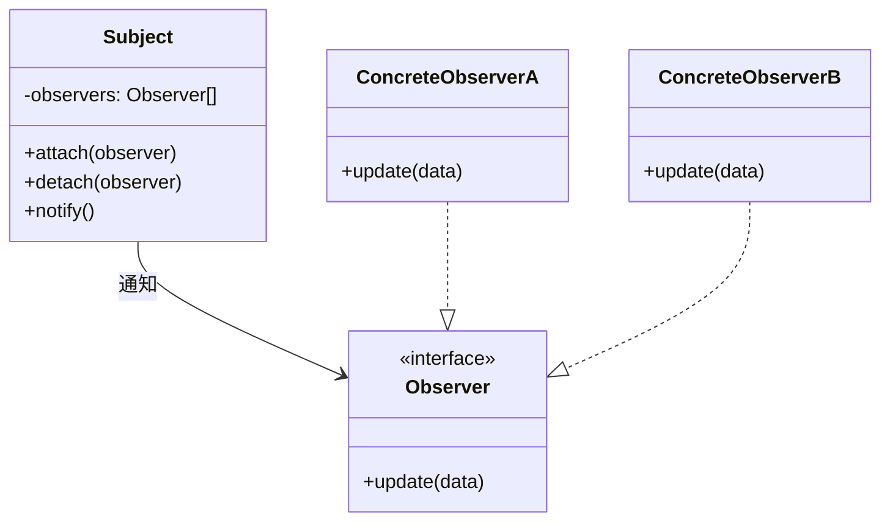
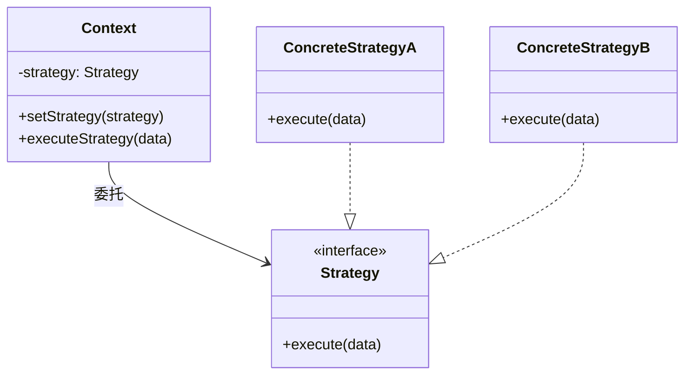
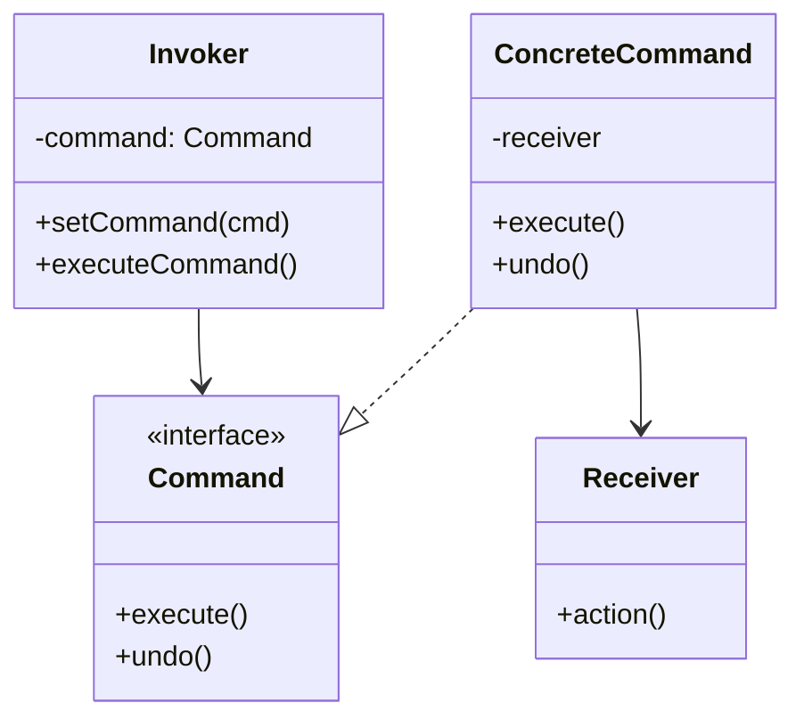
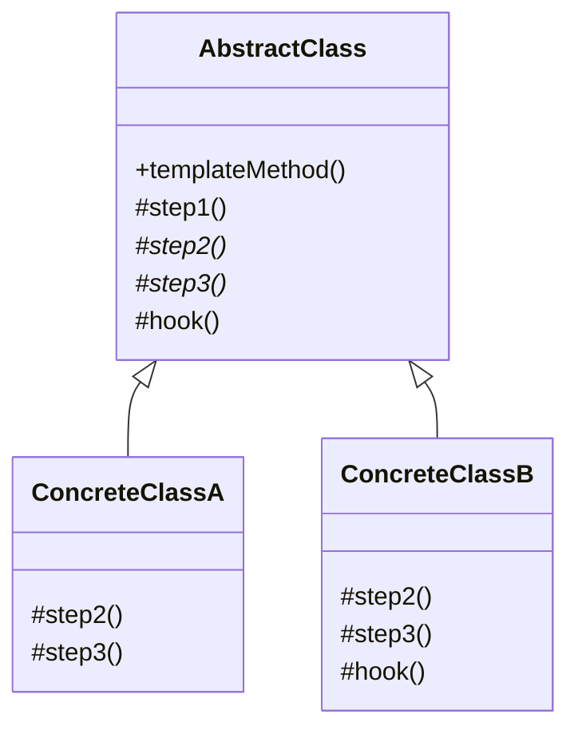
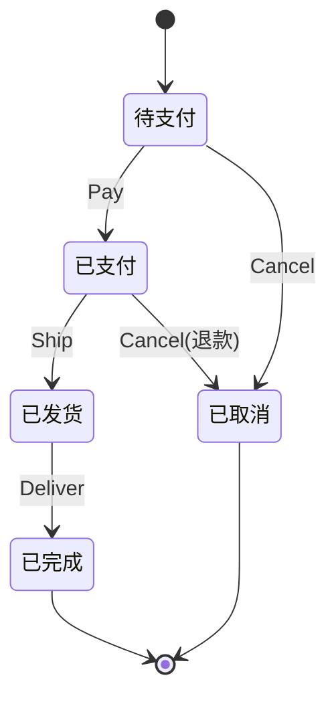

## 四、行为型模式

行为型模式（Behavioral Patterns）是 GoF 23 种设计模式中数量最多的一类，共 11 种。它们的核心关注点是**对象之间的职责分配与通信机制**——当创建型模式解决"怎么造对象"、结构型模式解决"怎么组合对象"之后，行为型模式要回答的是"对象之间怎么协作"。

行为型模式可以进一步分为两大阵营：

| 类型 | 代表模式 | 核心机制 |
|------|----------|----------|
| **类行为型** | 模板方法、解释器 | 通过继承在类之间分配职责 |
| **对象行为型** | 观察者、策略、命令、状态等 | 通过对象组合与委托分配职责 |

> 设计原则提示：GoF 原则"优先使用对象组合，而非类继承"在行为型模式中体现得最为明显——11 种模式中只有 2 种依赖继承，其余全部基于组合。

---

### 4.1 观察者模式（Observer）

#### 问题场景

一个对象（如订单服务）状态变化时，需要同时通知日志系统、库存系统、通知系统等多个对象。如果在订单服务中直接调用每个依赖方的接口，就会产生严重的耦合——新增一个依赖方就要修改订单服务的代码。

#### 模式定义

观察者模式定义了一种**一对多**的依赖关系：当一个对象（Subject/主题）状态改变时，所有依赖它的对象（Observer/观察者）都会自动收到通知并更新。又称为**发布-订阅模式**（Pub-Sub），但严格来说两者有区别——观察者模式中 Subject 直接通知 Observer，而发布订阅模式中间有事件总线（Event Broker）解耦。

#### 结构图



#### 代码实现

```go
// Subject 主题接口
type Subject interface {
    Attach(observer Observer)
    Detach(observer Observer)
    Notify(data interface{})
}

// Observer 观察者接口
type Observer interface {
    Update(data interface{})
}

// 具体主题：订单服务
type OrderService struct {
    observers []Observer
    mu        sync.RWMutex
}

func (o *OrderService) Attach(obs Observer) {
    o.mu.Lock()
    defer o.mu.Unlock()
    o.observers = append(o.observers, obs)
}

func (o *OrderService) Detach(obs Observer) {
    o.mu.Lock()
    defer o.mu.Unlock()
    for i, v := range o.observers {
        if v == obs {
            o.observers = append(o.observers[:i], o.observers[i+1:]...)
            break
        }
    }
}

func (o *OrderService) Notify(data interface{}) {
    o.mu.RLock()
    defer o.mu.RUnlock()
    for _, obs := range o.observers {
        obs.Update(data)
    }
}

// 具体观察者：日志系统
type LogObserver struct{}

func (l *LogObserver) Update(data interface{}) {
    order := data.(*Order)
    log.Printf("[LOG] 订单 %s 状态变更为: %s", order.ID, order.Status)
}

// 具体观察者：库存系统
type InventoryObserver struct{}

func (i *InventoryObserver) Update(data interface{}) {
    order := data.(*Order)
    if order.Status == "cancelled" {
        restoreStock(order.Items)
    }
}

// 使用
service := &amp;OrderService{}
service.Attach(&amp;LogObserver{})
service.Attach(&amp;InventoryObserver{})
service.Notify(&amp;Order{ID: "ORD-001", Status: "paid"})
```

#### 推送 vs 拉取模型

| 维度 | 推送模型（Push） | 拉取模型（Pull） |
|------|------------------|------------------|
| 数据传递 | Subject 把变化数据直接推给 Observer | Subject 只通知"我变了"，Observer 自己来取 |
| 耦合度 | 较高，Observer 依赖 Subject 的数据格式 | 较低，Observer 只依赖 Subject 的接口 |
| 灵活性 | 低，Observer 被动接收 | 高，Observer 按需获取 |
| 适用场景 | 数据变化频率低、格式固定 | 数据变化频繁、不同 Observer 需要不同粒度 |

#### 常见误区与纠正

1. **误区：观察者模式就是回调函数**
   纠正：回调函数是一对一的函数调用；观察者模式是多对多的注册机制，支持动态增删观察者、有统一的通知接口。

2. **误区：异步通知一定比同步好**
   纠正：异步通知（如 `go handler(event)`）引入了并发复杂性，需要处理 panic 恢复、事件丢失、顺序保证等问题。在数据一致性要求高的场景（如金融交易），同步通知更安全。

3. **误区：观察者之间没有顺序要求**
   纠正：当多个观察者之间有依赖关系时（如先扣库存再发通知），需要引入优先级机制或事件队列来保证执行顺序。

#### 实际应用场景

- **前端框架**：Vue.js 的响应式系统（Object.defineProperty / Proxy 实现数据劫持，依赖收集后通知渲染）
- **消息队列**：Kafka、RabbitMQ 本质是分布式观察者模式
- **GUI 事件系统**：按钮点击事件的多监听器机制
- **微服务事件驱动架构**：CQRS + Event Sourcing 中的事件发布

---

### 4.2 策略模式（Strategy）

#### 问题场景

一个系统需要根据不同的条件选择不同的算法。比如排序算法：小数据集用插入排序，大数据集用快速排序，需要稳定性时用归并排序。如果用 `if-else` 或 `switch-case` 堆砌，每新增一种策略就要修改原有代码，违反开闭原则。

#### 模式定义

策略模式定义一系列算法，把它们各自封装起来，并且使它们可以**互相替换**。策略模式让算法的变化独立于使用算法的客户端。

#### 结构图



#### 代码实现

```go
// 策略接口
type PriceStrategy interface {
    Calculate(price float64) float64
    Name() string
}

// 策略1：普通用户无折扣
type NormalPrice struct{}
func (n *NormalPrice) Calculate(price float64) float64 { return price }
func (n *NormalPrice) Name() string { return "普通用户" }

// 策略2：VIP 用户 8 折
type VIPPrice struct{}
func (v *VIPPrice) Calculate(price float64) float64 { return price * 0.8 }
func (v *VIPPrice) Name() string { return "VIP用户" }

// 策略3：促销活动满减
type PromotionPrice struct {
    Threshold float64 // 满多少
    Discount  float64 // 减多少
}
func (p *PromotionPrice) Calculate(price float64) float64 {
    if price >= p.Threshold {
        return price - p.Discount
    }
    return price
}
func (p *PromotionPrice) Name() string { return "促销活动" }

// 上下文
type OrderContext struct {
    strategy PriceStrategy
}

func (c *OrderContext) SetStrategy(s PriceStrategy) {
    c.strategy = s
}

func (c *OrderContext) Pay(price float64) float64 {
    finalPrice := c.strategy.Calculate(price)
    fmt.Printf("原价: %.2f, 策略: %s, 实付: %.2f\n",
        price, c.strategy.Name(), finalPrice)
    return finalPrice
}

// 使用：运行时根据用户类型切换
ctx := &amp;OrderContext{}
ctx.SetStrategy(&amp;NormalPrice{})
ctx.Pay(100) // 原价: 100.00, 策略: 普通用户, 实付: 100.00

ctx.SetStrategy(&amp;VIPPrice{})
ctx.Pay(100) // 原价: 100.00, 策略: VIP用户, 实付: 80.00

ctx.SetStrategy(&amp;PromotionPrice{Threshold: 200, Discount: 30})
ctx.Pay(250) // 原价: 250.00, 策略: 促销活动, 实付: 220.00
```

#### 策略模式 vs 简单工厂

| 维度 | 策略模式 | 简单工厂 |
|------|----------|----------|
| 关注点 | 封装可互换的算法 | 根据参数创建对象 |
| 切换时机 | 运行时动态切换 | 创建时确定，通常不可变 |
| 客户端感知 | 客户端知道策略接口 | 客户端只知道产品接口 |
| 新增策略 | 新增类，不改已有代码 | 需要修改工厂的 switch 逻辑 |

#### 常见误区与纠正

1. **误区：策略模式总是比 if-else 好**
   纠正：当策略数量少（2-3个）且变化不频繁时，简单的条件判断更直观。策略模式在策略数量多（5+）、需要动态切换、策略本身有复杂逻辑时才体现优势。

2. **误区：每个策略都要实现完整接口**
   纠正：可以使用**无状态策略**（函数类型代替结构体），减少样板代码：
   ```go
   type PriceFunc func(float64) float64

   type Order struct {
       priceFunc PriceFunc
   }
   // 策略就是一个函数
   discount := func(price float64) float64 { return price * 0.8 }
   ```

#### 实际应用场景

- **支付系统**：支付宝、微信、银行卡等支付渠道的切换
- **压缩算法**：ZIP、GZIP、Snappy 等按场景选择
- **路由算法**：网络负载均衡中的轮询、随机、加权、最少连接等策略
- **日志输出**：控制台、文件、远程服务等不同输出目标

---

### 4.3 命令模式（Command）

#### 问题场景

需要将请求封装为对象，从而支持撤销/重做、请求排队、日志记录、事务回滚等功能。直接调用方法无法保存调用历史，也无法延迟执行。

#### 模式定义

命令模式将一个**请求封装为一个对象**，使你可以用不同的请求参数化客户端，对请求排队或记录日志，以及支持可撤销操作。核心是将"发出请求的对象"与"执行请求的对象"解耦。

#### 结构图



#### 代码实现

```go
// 命令接口
type Command interface {
    Execute() error
    Undo() error
    Description() string
}

// 接收者：文本编辑器
type TextEditor struct {
    content string
}

func (e *TextEditor) InsertAt(pos int, text string) {
    e.content = e.content[:pos] + text + e.content[pos:]
}

func (e *TextEditor) DeleteAt(pos, length int) string {
    deleted := e.content[pos : pos+length]
    e.content = e.content[:pos] + e.content[pos+length:]
    return deleted
}

// 具体命令：插入文本
type InsertCommand struct {
    editor   *TextEditor
    position int
    text     string
    deleted  string // 用于 undo
}

func (c *InsertCommand) Execute() error {
    c.editor.InsertAt(c.position, c.text)
    return nil
}

func (c *InsertCommand) Undo() error {
    c.deleted = c.editor.DeleteAt(c.position, len(c.text))
    return nil
}

func (c *InsertCommand) Description() string {
    return fmt.Sprintf("插入 '%s' 到位置 %d", c.text, c.position)
}

// 具体命令：删除文本
type DeleteCommand struct {
    editor   *TextEditor
    position int
    length   int
    deleted  string
}

func (c *DeleteCommand) Execute() error {
    c.deleted = c.editor.DeleteAt(c.position, c.length)
    return nil
}

func (c *DeleteCommand) Undo() error {
    c.editor.InsertAt(c.position, c.deleted)
    return nil
}

func (c *DeleteCommand) Description() string {
    return fmt.Sprintf("删除位置 %d 起 %d 个字符", c.position, c.length)
}

// 调用者：命令管理器（支持 undo/redo）
type CommandManager struct {
    history []Command
    redo    []Command
}

func (m *CommandManager) Execute(cmd Command) error {
    if err := cmd.Execute(); err != nil {
        return err
    }
    m.history = append(m.history, cmd)
    m.redo = nil // 新命令清空 redo 栈
    return nil
}

func (m *CommandManager) Undo() error {
    if len(m.history) == 0 {
        return fmt.Errorf("没有可撤销的操作")
    }
    cmd := m.history[len(m.history)-1]
    m.history = m.history[:len(m.history)-1]
    if err := cmd.Undo(); err != nil {
        return err
    }
    m.redo = append(m.redo, cmd)
    return nil
}

func (m *CommandManager) Redo() error {
    if len(m.redo) == 0 {
        return fmt.Errorf("没有可重做的操作")
    }
    cmd := m.redo[len(m.redo)-1]
    m.redo = m.redo[:len(m.redo)-1]
    if err := cmd.Execute(); err != nil {
        return err
    }
    m.history = append(m.history, cmd)
    return nil
}

// 使用
editor := &amp;TextEditor{}
manager := &amp;CommandManager{}

manager.Execute(&amp;InsertCommand{editor: editor, position: 0, text: "Hello"})
fmt.Println(editor.content) // "Hello"

manager.Execute(&amp;InsertCommand{editor: editor, position: 5, text: " World"})
fmt.Println(editor.content) // "Hello World"

manager.Undo()
fmt.Println(editor.content) // "Hello"

manager.Redo()
fmt.Println(editor.content) // "Hello World"
```

#### 命令模式的变体

| 变体 | 特点 | 适用场景 |
|------|------|----------|
| **宏命令** | 一个命令包含多个子命令的组合 | 批量操作、自动化工作流 |
| **队列命令** | 命令放入队列异步执行 | 任务调度、消息队列 |
| **事务命令** | 命令支持 commit/rollback | 数据库事务、分布式事务 |
| **可序列化命令** | 命令可序列化存储 | 操作日志、远程调用 |

#### 常见误区与纠正

1. **误区：命令模式只是简单的函数封装**
   纠正：命令模式的价值在于**保存调用上下文**——命令对象持有接收者引用和参数，可以被存储、传递、延迟执行、撤销重做，这些是裸函数调用做不到的。

2. **误区：每个操作都需要实现 Undo**
   纠正：Undo 机制根据业务需要实现。如果操作不可逆（如发送邮件），命令只需要实现 Execute，不实现 Undo。

#### 实际应用场景

- **文本编辑器**：Ctrl+Z 撤销、Ctrl+Y 重做
- **数据库事务**：BEGIN/COMMIT/ROLLBACK 就是命令模式的体现
- **游戏系统**：玩家操作录制与回放
- **GUI 按钮/菜单**：菜单项绑定命令对象，支持快捷键复用

---

### 4.4 模板方法模式（Template Method）

#### 问题场景

多个类有相似的处理流程，但某些步骤的实现不同。如果每个类都独立实现完整流程，会有大量重复代码。

#### 模式定义

模板方法模式在一个方法中定义一个算法的**骨架**，而将某些步骤延迟到子类实现。模板方法使得子类可以在不改变算法结构的前提下，重新定义算法的某些步骤。这是基于**继承**的代码复用。

#### 结构图



#### 代码实现

```go
// 数据处理管道的模板
type DataProcessor interface {
    // 模板方法：定义处理流程骨架
    Process(filePath string) error
}

// 基础处理器：模板方法的骨架
type BaseProcessor struct{}

func (b *BaseProcessor) Process(filePath string) error {
    // 步骤1：读取数据（公共逻辑）
    raw, err := os.ReadFile(filePath)
    if err != nil {
        return fmt.Errorf("读取文件失败: %w", err)
    }

    // 步骤2：验证数据（可由子类覆盖）
    if err := b.Validate(raw); err != nil {
        return fmt.Errorf("数据验证失败: %w", err)
    }

    // 步骤3：解析数据（子类必须实现）
    records, err := b.Parse(raw)
    if err != nil {
        return fmt.Errorf("解析失败: %w", err)
    }

    // 步骤4：数据转换（子类必须实现）
    result := b.Transform(records)

    // 步骤5：保存结果（公共逻辑）
    if err := b.Save(result); err != nil {
        return fmt.Errorf("保存失败: %w", err)
    }

    // 钩子：后处理（子类可选覆盖）
    b.AfterProcess(result)

    return nil
}

// 公共步骤
func (b *BaseProcessor) Validate(raw []byte) error {
    if len(raw) == 0 {
        return fmt.Errorf("数据为空")
    }
    return nil
}

func (b *BaseProcessor) Save(result []byte) error {
    // 公共保存逻辑
    return nil
}

func (b *BaseProcessor) AfterProcess(result []byte) {
    // 默认空实现，子类可选覆盖
}

// 子类1：CSV 处理器
type CSVProcessor struct {
    BaseProcessor // 嵌入基础处理器
}

func (c *CSVProcessor) Parse(raw []byte) ([]Record, error) {
    // CSV 解析逻辑
    reader := csv.NewReader(bytes.NewReader(raw))
    return reader.ReadAll()
}

func (c *CSVProcessor) Transform(records []Record) []byte {
    // CSV 特有的转换逻辑
    // ...
    return result
}

// 子类2：JSON 处理器
type JSONProcessor struct {
    BaseProcessor
}

func (j *JSONProcessor) Parse(raw []byte) ([]Record, error) {
    var records []Record
    err := json.Unmarshal(raw, &amp;records)
    return records, err
}

func (j *JSONProcessor) Transform(records []Record) []byte {
    // JSON 特有的转换逻辑
    // ...
    return result
}

// 覆盖钩子：JSON 处理完打印统计
func (j *JSONProcessor) AfterProcess(result []byte) {
    fmt.Printf("JSON 处理完成，输出 %d 字节\n", len(result))
}
```

#### 钩子方法（Hook）机制

钩子方法是模板方法模式中最精妙的设计。它在基类中提供默认空实现或条件逻辑，子类可以选择性覆盖：

```go
// 基类中的钩子
func (b *BaseProcessor) ShouldValidate() bool {
    return true // 默认开启验证
}

// 模板方法中使用钩子
func (b *BaseProcessor) Process(filePath string) error {
    if b.ShouldValidate() { // 子类可覆盖此钩子来跳过验证
        // ... 验证逻辑
    }
    // ...
}

// 子类覆盖钩子
type FastProcessor struct {
    BaseProcessor
}

func (f *FastProcessor) ShouldValidate() bool {
    return false // 跳过验证，提高速度
}
```

#### 常见误区与纠正

1. **误区：模板方法模式违反开闭原则**
   纠正：模板方法的骨架确实难以修改（违反对修改关闭），但 GoF 认为这是合理的——骨架代表"稳定的整体结构"，变化的只是"可变的步骤"。如果骨架本身也需要变化，应改用**策略模式**。

2. **误区：Go 语言没有继承，无法用模板方法**
   纠正：Go 通过**结构体嵌入 + 接口**可以实现类似效果。嵌入的基类提供默认方法，子类覆盖特定方法。

#### 实际应用场景

- **测试框架**：JUnit 的 `setUp() -> test() -> tearDown()` 流程
- **Web 框架中间件**：请求处理的骨架（解析参数→验证→业务逻辑→响应）
- **数据导入**：不同格式文件的统一处理流程
- **编译器**：词法分析→语法分析→语义分析→代码生成的固定流程

---

### 4.5 状态模式（State）

#### 问题场景

一个对象的行为取决于其内部状态，状态转换逻辑散布在大量 `if-else` 或 `switch-case` 中。比如订单有"待支付→已支付→已发货→已完成→已取消"等多个状态，每增加一个状态就要修改所有相关方法。

#### 模式定义

状态模式允许对象在内部状态改变时改变其行为。对象看起来好像修改了它的类。每个状态都被封装为一个独立的类，状态转换由上下文对象委托给当前状态对象处理。

#### 状态模式 vs 策略模式

两者结构几乎相同，区别在于**意图**：

| 维度 | 状态模式 | 策略模式 |
|------|----------|----------|
| 切换主体 | 状态对象自己决定切换到哪个状态 | 客户端主动选择策略 |
| 意图 | 封装状态相关的行为 | 封装可替换的算法 |
| 状态感知 | 状态对象知道其他状态的存在 | 策略对象不知道其他策略 |

#### 代码实现

```go
// 状态接口
type OrderState interface {
    Pay(order *Order) error
    Ship(order *Order) error
    Deliver(order *Order) error
    Cancel(order *Order) error
    Name() string
}

// 上下文：订单
type Order struct {
    state      OrderState
    id         string
    amount     float64
}

func (o *Order) SetState(state OrderState) {
    fmt.Printf("订单 %s 状态切换: %s -> %s\n", o.id, o.state.Name(), state.Name())
    o.state = state
}

func (o *Order) Pay() error     { return o.state.Pay(o) }
func (o *Order) Ship() error    { return o.state.Ship(o) }
func (o *Order) Deliver() error { return o.state.Deliver(o) }
func (o *Order) Cancel() error  { return o.state.Cancel(o) }

// 状态1：待支付
type PendingPayState struct{}

func (s *PendingPayState) Pay(o *Order) error {
    fmt.Printf("订单 %s 支付 %.2f 元\n", o.id, o.amount)
    o.SetState(&amp;PaidState{}) // 状态转换
    return nil
}

func (s *PendingPayState) Ship(o *Order) error {
    return fmt.Errorf("未支付不能发货")
}

func (s *PendingPayState) Deliver(o *Order) error {
    return fmt.Errorf("未支付不能确认收货")
}

func (s *PendingPayState) Cancel(o *Order) error {
    fmt.Printf("订单 %s 已取消\n", o.id)
    o.SetState(&amp;CancelledState{})
    return nil
}

func (s *PendingPayState) Name() string { return "待支付" }

// 状态2：已支付
type PaidState struct{}

func (s *PaidState) Pay(o *Order) error {
    return fmt.Errorf("订单已支付，不能重复支付")
}

func (s *PaidState) Ship(o *Order) error {
    fmt.Printf("订单 %s 已发货\n", o.id)
    o.SetState(&amp;ShippedState{})
    return nil
}

func (s *PaidState) Deliver(o *Order) error {
    return fmt.Errorf("还未发货，不能确认收货")
}

func (s *PaidState) Cancel(o *Order) error {
    fmt.Printf("订单 %s 已退款并取消\n", o.id)
    o.SetState(&amp;CancelledState{})
    return nil
}

func (s *PaidState) Name() string { return "已支付" }

// 状态3：已发货
type ShippedState struct{}

func (s *ShippedState) Pay(o *Order) error {
    return fmt.Errorf("订单已发货，不能支付")
}

func (s *ShippedState) Ship(o *Order) error {
    return fmt.Errorf("订单已发货，不能重复发货")
}

func (s *ShippedState) Deliver(o *Order) error {
    fmt.Printf("订单 %s 已确认收货\n", o.id)
    o.SetState(&amp;DeliveredState{})
    return nil
}

func (s *ShippedState) Cancel(o *Order) error {
    return fmt.Errorf("已发货的订单不能直接取消，请申请退货")
}

func (s *ShippedState) Name() string { return "已发货" }

// 状态4：已完成
type DeliveredState struct{}

func (s *DeliveredState) Pay(o *Order) error     { return fmt.Errorf("订单已完成") }
func (s *DeliveredState) Ship(o *Order) error     { return fmt.Errorf("订单已完成") }
func (s *DeliveredState) Deliver(o *Order) error  { return fmt.Errorf("订单已完成") }
func (s *DeliveredState) Cancel(o *Order) error   { return fmt.Errorf("已完成订单不能取消") }
func (s *DeliveredState) Name() string            { return "已完成" }

// 状态5：已取消
type CancelledState struct{}

func (s *CancelledState) Pay(o *Order) error     { return fmt.Errorf("订单已取消") }
func (s *CancelledState) Ship(o *Order) error     { return fmt.Errorf("订单已取消") }
func (s *CancelledState) Deliver(o *Order) error  { return fmt.Errorf("订单已取消") }
func (s *CancelledState) Cancel(o *Order) error   { return fmt.Errorf("订单已取消") }
func (s *CancelledState) Name() string            { return "已取消" }

// 使用：状态转换由内部自动管理
order := &amp;Order{
    id:     "ORD-001",
    amount: 99.99,
    state:  &amp;PendingPayState{},
}

order.Pay()     // 自动从"待支付"切换到"已支付"
order.Ship()    // 自动从"已支付"切换到"已发货"
order.Deliver() // 自动从"已发货"切换到"已完成"

// 非法操作会被拒绝
order.Pay() // 返回错误：订单已完成
```

#### 状态转换图



#### 实际应用场景

- **订单系统**：电商订单的生命周期管理
- **TCP 连接**：CLOSED → LISTEN → SYN_SENT → ESTABLISHED → ...
- **游戏角色**：站立、行走、奔跑、跳跃、攻击等状态切换
- **审批流程**：草稿→待审批→审批中→已通过/已拒绝

---

### 4.6 责任链模式（Chain of Responsibility）

#### 问题场景

一个请求需要经过多个处理者，但具体由哪个处理者处理在运行时确定。如 HTTP 请求需要经过认证→限流→日志→业务逻辑等多个中间件，每个中间件都可能处理或传递请求。

#### 模式定义

责任链模式为请求创建了一个处理者对象的**链**。每个处理者包含对下一个处理者的引用。当请求到达时，每个处理者要么处理请求，要么将其传递给链中的下一个处理者。

#### 代码实现

```go
// 处理者接口
type Handler interface {
    SetNext(handler Handler) Handler
    Handle(request *Request) *Response
}

// 基础处理者：提供链式调用和默认传递逻辑
type BaseHandler struct {
    next Handler
}

func (b *BaseHandler) SetNext(handler Handler) Handler {
    b.next = handler
    return handler // 返回下一个处理者，支持链式调用
}

func (b *BaseHandler) passToNext(request *Request) *Response {
    if b.next != nil {
        return b.next.Handle(request)
    }
    return &amp;Response{StatusCode: 404, Body: "没有可用的处理者"}
}

// 处理者1：认证中间件
type AuthHandler struct {
    BaseHandler
}

func (h *AuthHandler) Handle(request *Request) *Response {
    token := request.Headers["Authorization"]
    if token == "" {
        return &amp;Response{StatusCode: 401, Body: "未授权：缺少认证令牌"}
    }
    // 验证 token 有效性...
    request.Context["userID"] = parseToken(token)
    fmt.Println("[Auth] 认证通过")
    return h.passToNext(request)
}

// 处理者2：限流中间件
type RateLimitHandler struct {
    BaseHandler
    limit   int
    counter int
}

func (h *RateLimitHandler) Handle(request *Request) *Response {
    h.counter++
    if h.counter > h.limit {
        return &amp;Response{StatusCode: 429, Body: "请求过于频繁"}
    }
    fmt.Println("[RateLimit] 限流检查通过")
    return h.passToNext(request)
}

// 处理者3：日志中间件
type LogHandler struct {
    BaseHandler
}

func (h *LogHandler) Handle(request *Request) *Response {
    start := time.Now()
    response := h.passToNext(request) // 先传递给后续处理者
    duration := time.Since(start)
    fmt.Printf("[Log] %s %s -> %d (%v)\n",
        request.Method, request.Path, response.StatusCode, duration)
    return response
}

// 处理者4：业务逻辑处理
type BusinessHandler struct {
    BaseHandler
}

func (h *BusinessHandler) Handle(request *Request) *Response {
    // 实际业务处理...
    return &amp;Response{StatusCode: 200, Body: "处理成功"}
}

// 构建责任链
chain := &amp;AuthHandler{}
chain.SetNext(&amp;RateLimitHandler{limit: 100}).
    SetNext(&amp;LogHandler{}).
    SetNext(&amp;BusinessHandler{})

// 发送请求
response := chain.Handle(&amp;Request{
    Method:  "GET",
    Path:    "/api/users",
    Headers: map[string]string{"Authorization": "Bearer xxx"},
})
```

#### 模式的两种变体

| 变体 | 特点 | 适用场景 |
|------|------|----------|
| **纯责任链** | 每个处理者要么处理，要么传递，不同时处理 | 需要唯一处理者的场景，如审批 |
| **非纯责任链** | 每个处理者处理后可以选择继续传递 | 中间件模式，如日志+认证+限流都执行 |

#### 实际应用场景

- **Web 中间件**：Express/Koa/Gin 的中间件链
- **审批流程**：员工→主管→总监→VP 的逐级审批
- **异常处理**：try-catch 的多层异常捕获
- **DOM 事件冒泡**：浏览器事件从子元素向父元素逐层传递

---

### 4.7 迭代器模式（Iterator）

#### 问题场景

需要遍历一个集合对象的元素，但不想暴露其内部结构。不同的集合（数组、链表、树、图）有不同的遍历方式，需要统一的遍历接口。

#### 模式定义

迭代器模式提供一种方法顺序访问一个聚合对象中的各个元素，而又不暴露其内部表示。Go 语言的 `range` 关键字和 `Iterator` 接口就是迭代器模式的体现。

#### 代码实现

```go
// 迭代器接口
type Iterator[T any] interface {
    HasNext() bool
    Next() T
}

// 二叉搜索树的中序迭代器
type BSTIterator struct {
    stack []*TreeNode
}

func NewBSTIterator(root *TreeNode) *BSTIterator {
    it := &amp;BSTIterator{}
    it.pushLeft(root) // 将最左路径压栈
    return it
}

func (it *BSTIterator) pushLeft(node *TreeNode) {
    for node != nil {
        it.stack = append(it.stack, node)
        node = node.Left
    }
}

func (it *BSTIterator) HasNext() bool {
    return len(it.stack) > 0
}

func (it *BSTIterator) Next() int {
    if len(it.stack) == 0 {
        panic("没有更多元素")
    }
    node := it.stack[len(it.stack)-1]
    it.stack = it.stack[:len(it.stack)-1]
    if node.Right != nil {
        it.pushLeft(node.Right)
    }
    return node.Val
}

// 使用：遍历 BST，无需知道内部结构
root := buildBST([]int{4, 2, 6, 1, 3, 5, 7})
iter := NewBSTIterator(root)
for iter.HasNext() {
    fmt.Print(iter.Next(), " ") // 1 2 3 4 5 6 7
}
```

#### 实际应用场景

- **Go range**：`for _, v := range slice/map/channel` 就是内置迭代器
- **数据库游标**：逐行获取查询结果
- **文件逐行读取**：`bufio.Scanner`
- **树/图遍历**：DFS/BFS 迭代器

---

### 4.8 中介者模式（Mediator）

#### 问题场景

多个对象之间存在复杂的交互关系，形成"网状"依赖。如聊天室中每个用户都要知道其他所有用户，修改一个用户可能影响所有其他用户。

#### 模式定义

中介者模式用一个**中介对象**封装一系列对象之间的交互，使各对象不需要显式地相互引用，从而降低耦合，且可以独立改变它们之间的交互。

#### 代码实现

```go
// 中介者接口
type ChatMediator interface {
    SendMessage(message string, user *User)
    AddUser(user *User)
}

// 具体中介者：聊天室
type ChatRoom struct {
    users []*User
}

func (r *ChatRoom) AddUser(user *User) {
    r.users = append(r.users, user)
}

func (r *ChatRoom) SendMessage(message string, sender *User) {
    for _, user := range r.users {
        if user != sender { // 不发给自己
            user.Receive(message)
        }
    }
}

// 同事类：用户
type User struct {
    name     string
    mediator ChatMediator
}

func NewUser(name string, mediator ChatMediator) *User {
    u := &amp;User{name: name, mediator: mediator}
    mediator.AddUser(u)
    return u
}

func (u *User) Send(message string) {
    fmt.Printf("%s 发送: %s\n", u.name, message)
    u.mediator.SendMessage(fmt.Sprintf("[%s]: %s", u.name, message), u)
}

func (u *User) Receive(message string) {
    fmt.Printf("%s 收到: %s\n", u.name, message)
}

// 使用
room := &amp;ChatRoom{}
alice := NewUser("Alice", room)
bob := NewUser("Bob", room)
charlie := NewUser("Charlie", room)

alice.Send("大家好！")
// Alice 发送: 大家好！
// Bob 收到: [Alice]: 大家好！
// Charlie 收到: [Alice]: 大家好！
```

#### 实际应用场景

- **聊天室/即时通讯**：消息路由与分发
- **GUI 对话框**：多个控件之间的联动（选择省份→更新城市列表→更新区县列表）
- **飞控系统**：多飞机之间的避碰协调
- **MVC 中的 Controller**：协调 Model 和 View 之间的交互

---

### 4.9 访问者模式（Visitor）

#### 问题场景

一个对象结构包含多种类型的元素，需要对这些元素执行多种不同且不相关的操作。如果把这些操作分散到各个元素类中，会导致类膨胀；如果集中到一个类中，又违反单一职责。

#### 模式定义

访问者模式将数据结构与数据操作**分离**。在不改变数据结构的前提下，定义作用于这些元素的新操作。核心是双重分派（Double Dispatch）：先根据接受者类型分派，再根据访问者类型分派。

#### 代码实现

```go
// 元素接口
type Shape interface {
    Accept(visitor ShapeVisitor)
}

// 访问者接口
type ShapeVisitor interface {
    VisitCircle(c *Circle)
    VisitRectangle(r *Rectangle)
    VisitTriangle(t *Triangle)
}

// 具体元素：圆形
type Circle struct {
    radius float64
}

func (c *Circle) Accept(v ShapeVisitor) {
    v.VisitCircle(c) // 双重分派
}

// 具体元素：矩形
type Rectangle struct {
    width, height float64
}

func (r *Rectangle) Accept(v ShapeVisitor) {
    v.VisitRectangle(r)
}

// 具体元素：三角形
type Triangle struct {
    a, b, c float64
}

func (t *Triangle) Accept(v ShapeVisitor) {
    v.VisitTriangle(t)
}

// 访问者1：面积计算
type AreaCalculator struct {
    totalArea float64
}

func (a *AreaCalculator) VisitCircle(c *Circle) {
    a.totalArea += math.Pi * c.radius * c.radius
}

func (a *AreaCalculator) VisitRectangle(r *Rectangle) {
    a.totalArea += r.width * r.height
}

func (a *AreaCalculator) VisitTriangle(t *Triangle) {
    s := (t.a + t.b + t.c) / 2
    a.totalArea += math.Sqrt(s * (s - t.a) * (s - t.b) * (s - t.c))
}

// 访问者2：绘制（伪代码）
type DrawVisitor struct {
    canvas *Canvas
}

func (d *DrawVisitor) VisitCircle(c *Circle) {
    d.canvas.DrawCircle(c.radius)
}

func (d *DrawVisitor) VisitRectangle(r *Rectangle) {
    d.canvas.DrawRect(r.width, r.height)
}

func (d *DrawVisitor) VisitTriangle(t *Triangle) {
    d.canvas.DrawPolygon(t.a, t.b, t.c)
}

// 使用：遍历所有形状，应用不同操作
shapes := []Shape{
    &amp;Circle{radius: 5},
    &amp;Rectangle{width: 4, height: 6},
    &amp;Triangle{a: 3, b: 4, c: 5},
}

// 操作1：计算总面积
areaCalc := &amp;AreaCalculator{}
for _, shape := range shapes {
    shape.Accept(areaCalc)
}
fmt.Printf("总面积: %.2f\n", areaCalc.totalArea)

// 操作2：绘制所有形状
drawVisitor := &amp;DrawVisitor{canvas: myCanvas}
for _, shape := range shapes {
    shape.Accept(drawVisitor)
}
```

#### 适用与不适用

| 适用场景 | 不适用场景 |
|----------|------------|
| 数据结构稳定，操作频繁变化 | 数据结构本身不稳定（经常新增元素类型） |
| 需要对不同类型元素执行不同操作 | 元素类型少且操作也少 |
| 编译器 AST 的语义分析、代码生成 | 元素类需要频繁新增方法 |

#### 常见误区

**误区：访问者模式是万能的**
纠正：每新增一种元素类型（如新增 `Ellipse`），所有访问者都要修改，这违反了开闭原则。访问者模式只在"**元素类型稳定、操作频繁变化**"时才有价值。

#### 实际应用场景

- **编译器**：AST 节点的类型检查、优化、代码生成
- **文档处理**：不同格式（HTML/PDF/Markdown）的渲染
- **对象序列化**：不同格式（JSON/XML/Protobuf）的编码

---

### 4.10 备忘录模式（Memento）

#### 问题场景

需要保存对象在某个时刻的内部状态，以便后续恢复。但直接暴露对象的内部状态会破坏封装性。

#### 模式定义

备忘录模式在不破坏封装性的前提下，捕获一个对象的内部状态，并在该对象之外保存这个状态，以便以后可以将该对象恢复到原先保存的状态。又称**快照模式**。

#### 代码实现

```go
// 备忘录：保存编辑器状态
type EditorMemento struct {
    content   string
    cursorPos int
    timestamp time.Time
}

// 发起人：编辑器
type Editor struct {
    content   string
    cursorPos int
}

func (e *Editor) Type(text string) {
    e.content += text
    e.cursorPos += len(text)
}

func (e *Editor) Save() *EditorMemento {
    return &amp;EditorMemento{
        content:   e.content,
        cursorPos: e.cursorPos,
        timestamp: time.Now(),
    }
}

func (e *Editor) Restore(m *EditorMemento) {
    e.content = m.content
    e.cursorPos = m.cursorPos
    fmt.Printf("恢复到 %s 的状态\n", m.timestamp.Format("15:04:05"))
}

func (e *Editor) String() string {
    return fmt.Sprintf("内容: '%s', 光标位置: %d", e.content, e.cursorPos)
}

// 管理者：历史记录管理
type HistoryManager struct {
    mementos []*EditorMemento
}

func (h *HistoryManager) Push(m *EditorMemento) {
    h.mementos = append(h.mementos, m)
}

func (h *HistoryManager) Pop() *EditorMemento {
    if len(h.mementos) == 0 {
        return nil
    }
    m := h.mementos[len(h.mementos)-1]
    h.mementos = h.mementos[:len(h.mementos)-1]
    return m
}

// 使用
editor := &amp;Editor{}
history := &amp;HistoryManager{}

editor.Type("Hello ")
history.Push(editor.Save()) // 保存快照1

editor.Type("World ")
history.Push(editor.Save()) // 保存快照2

editor.Type("!!!")
fmt.Println(editor) // 内容: 'Hello World !!!', 光标位置: 13

editor.Restore(history.Pop()) // 恢复到快照2
fmt.Println(editor) // 内容: 'Hello World ', 光标位置: 12

editor.Restore(history.Pop()) // 恢复到快照1
fmt.Println(editor) // 内容: 'Hello ', 光标位置: 6
```

#### 注意事项

- **内存开销**：每次保存快照都会复制状态，频繁快照可能导致内存压力。可采用**增量快照**（只保存变化部分）或**快照压缩**（定期合并旧快照）。
- **序列化**：在分布式系统中，备忘录可能需要序列化存储到 Redis 或数据库。

#### 实际应用场景

- **游戏存档**：保存玩家状态，支持随时读档
- **编辑器撤销**：每次编辑操作保存快照
- **数据库备份**：MVCC 的多版本并发控制本质上是备忘录模式
- **Git**：每次 commit 就是一个备忘录

---

### 4.11 解释器模式（Interpreter）

#### 问题场景

需要解释执行一种特定的语法或表达式。如计算器需要解析和计算 `3 + 5 * (2 - 1)` 这样的表达式。

#### 模式定义

解释器模式给定一个语言，定义它的文法的一种表示，并定义一个解释器，这个解释器使用该表示来解释语言中的句子。解释器模式是**基于继承**的类行为型模式。

#### 代码实现

```go
// 抽象表达式
type Expression interface {
    Interpret() int
}

// 终结符表达式：数字
type Number struct {
    value int
}

func (n *Number) Interpret() int {
    return n.value
}

// 非终结符表达式：加法
type Add struct {
    left, right Expression
}

func (a *Add) Interpret() int {
    return a.left.Interpret() + a.right.Interpret()
}

// 非终结符表达式：减法
type Subtract struct {
    left, right Expression
}

func (s *Subtract) Interpret() int {
    return s.left.Interpret() - s.right.Interpret()
}

// 非终结符表达式：乘法
type Multiply struct {
    left, right Expression
}

func (m *Multiply) Interpret() int {
    return m.left.Interpret() * m.right.Interpret()
}

// 使用：构建表达式树并计算
// 表达式: 3 + 5 * (2 - 1)
expr := &amp;Add{
    left:  &amp;Number{value: 3},
    right: &amp;Multiply{
        left: &amp;Number{value: 5},
        right: &amp;Subtract{
            left:  &amp;Number{value: 2},
            right: &amp;Number{value: 1},
        },
    },
}

fmt.Println(expr.Interpret()) // 8
```

#### 局限性

解释器模式的**缺点非常明显**：每新增一种语法规则就要新增一个类，当语法复杂时类数量会爆炸性增长。实际项目中更常用的是：

- **PEG 解析器**：如 goyac（Go 语言的 Yacc）
- **ANTLR**：通用解析器生成器
- **正则表达式引擎**：Go 的 `regexp` 包

只有在语法非常简单且固定时，解释器模式才值得使用。

---

### 四种行为型模式对比总结

| 模式 | 核心机制 | 解决的核心问题 | 典型应用 |
|------|----------|----------------|----------|
| **观察者** | 一对多通知 | 对象间的状态同步 | 事件系统、消息队列 |
| **策略** | 算法封装与切换 | 多种算法的选择 | 支付方式、排序算法 |
| **命令** | 请求对象化 | 请求的排队、撤销、日志 | 编辑器撤销、事务 |
| **模板方法** | 算法骨架 + 钩子 | 流程复用 | 测试框架、数据处理管道 |
| **状态** | 状态封装为对象 | 复杂状态转换 | 订单系统、TCP 连接 |
| **责任链** | 处理者链式传递 | 请求的多级处理 | 中间件、审批流程 |
| **迭代器** | 统一遍历接口 | 遍历不暴露结构 | 容器遍历、游标 |
| **中介者** | 集中交互控制 | 多对多通信解耦 | 聊天室、GUI 联动 |
| **访问者** | 数据结构与操作分离 | 不变结构+多操作 | 编译器、文档处理 |
| **备忘录** | 状态快照 | 对象状态恢复 | 编辑器撤销、游戏存档 |
| **解释器** | 语法树解释执行 | DSL 解析 | 简单计算器、规则引擎 |

---

### 行为型模式选择指南

面对具体问题时，按以下思路选择行为型模式：

1. **需要通知多个对象？** → 观察者模式
2. **算法需要运行时切换？** → 策略模式
3. **需要撤销/重做/排队？** → 命令模式
4. **流程骨架固定、步骤可变？** → 模板方法模式
5. **对象行为随状态变化？** → 状态模式
6. **请求需经多级处理？** → 责任链模式
7. **需要统一遍历不同结构？** → 迭代器模式
8. **多个对象交互太复杂？** → 中介者模式
9. **需要对稳定结构执行新操作？** → 访问者模式
10. **需要保存/恢复对象状态？** → 备忘录模式
11. **需要解释简单语法？** → 解释器模式

> 实际项目中，最常用的 5 种行为型模式是：观察者、策略、命令、状态、责任链。其余 6 种使用频率较低，但在特定场景下不可或缺。掌握这 11 种模式，就覆盖了面向对象设计中"对象协作"的所有经典方案。
