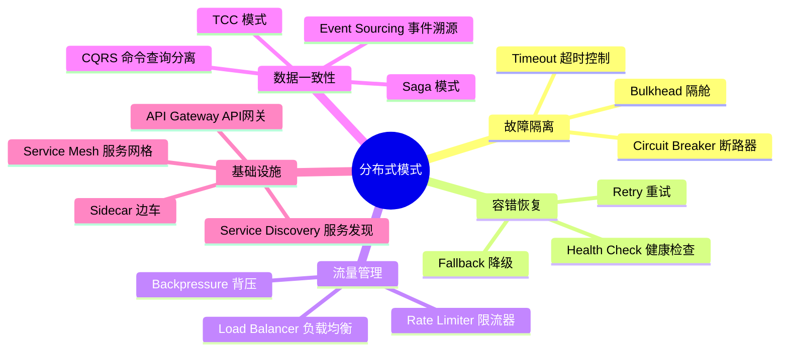
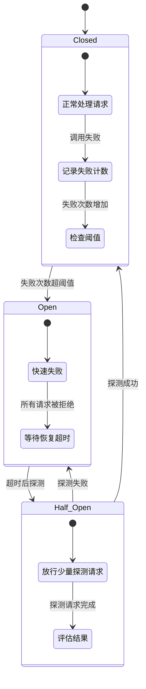
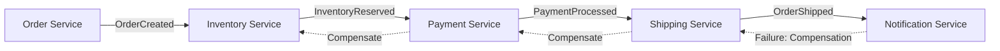
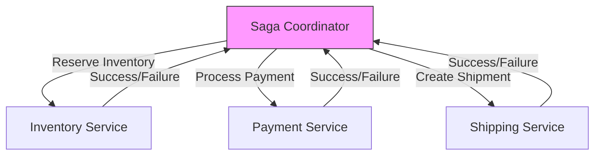
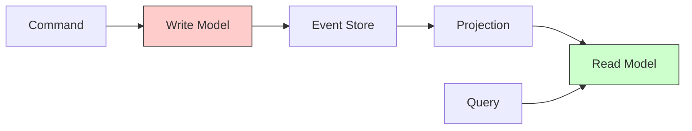
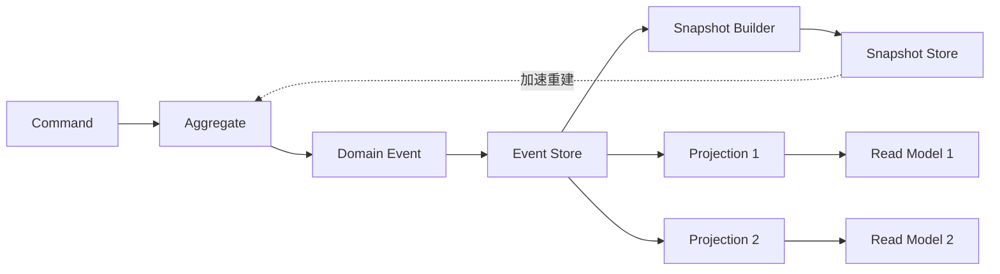
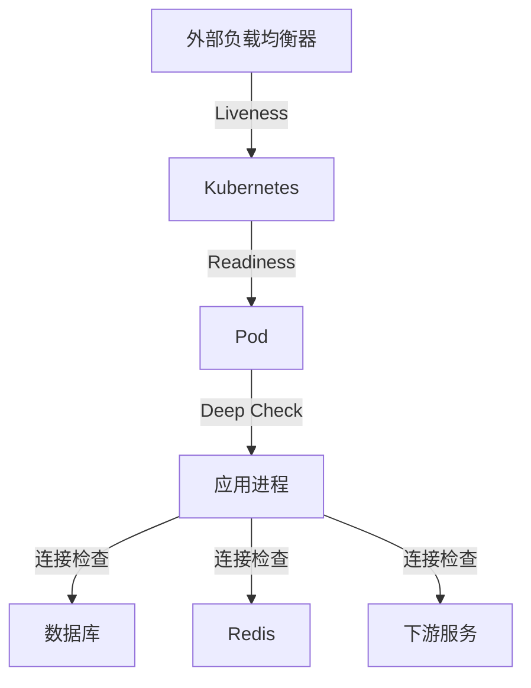
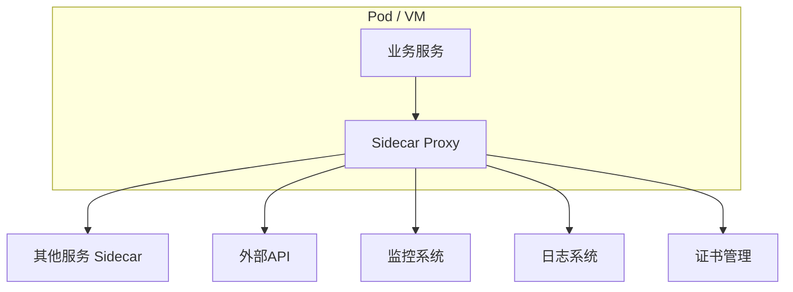
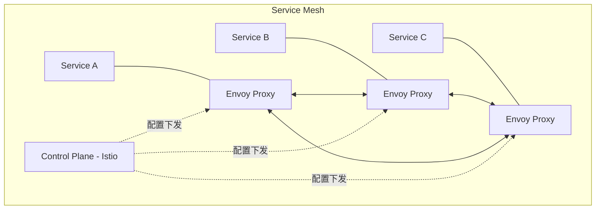

# 五、分布式模式

## 5.1 分布式模式概述

在微服务和云原生架构中，服务间的网络通信充满不确定性。分布式弹性模式（Resilience Patterns）帮助系统在部分失败时仍能提供可接受的服务。这些模式不是银弹，而是经过实战检验的解决方案库，每个模式解决特定的分布式系统挑战。

### 5.1.1 核心挑战

分布式系统面临四大根本性挑战，它们源自网络通信的物理本质：

- **网络不可靠**：网络分区、延迟、丢包是常态而非异常。根据 Google 的公开数据，其内部数据中心网络每小时约有 0.01% 的请求会遇到异常延迟，而跨区域网络这个比例更高。网络分区（Partition）是 CAP 定理中不可回避的现实。
- **部分失败**：系统中某些组件可能失败，而其他组件正常运行。单体应用中一个函数抛异常会导致整个请求失败，但在微服务中，调用链上某个服务超时不应导致整个业务不可用。
- **级联故障**：一个服务的故障可能通过依赖链传播到整个系统。经典案例：2011 年 Amazon EC2 故障导致依赖该服务的数百个内部和外部服务连锁瘫痪，恢复耗时数天。这种"故障风暴"的根源是缺乏隔离机制。
- **数据一致性**：跨服务的数据操作需要特殊的事务管理策略。CAP 定理告诉我们，在分布式环境下，一致性（Consistency）、可用性（Availability）、分区容忍性（Partition Tolerance）三者最多只能同时满足两个。实践中，大多数系统选择 AP（可用性 + 分区容忍），通过最终一致性来平衡。

### 5.1.2 模式分类体系



| 类别 | 模式 | 解决的问题 | 复杂度 |
|------|------|------------|--------|
| 故障隔离 | Circuit Breaker, Bulkhead, Timeout | 防止级联故障，隔离故障区域 | 中 |
| 容错恢复 | Retry, Fallback, Health Check | 从瞬时故障中自动恢复 | 低-中 |
| 流量管理 | Rate Limiter, Load Balancer, Backpressure | 控制流量，避免过载 | 中 |
| 数据一致性 | Saga, TCC, Event Sourcing, CQRS | 跨服务事务管理 | 高 |
| 基础设施 | Sidecar, Service Mesh, API Gateway, Service Discovery | 基础设施关注点分离 | 高 |

---

## 5.2 Circuit Breaker（断路器）

### 5.2.1 模式原理

**意图**：防止对一个已知失败的服务反复发起请求，避免级联故障。灵感来自电气工程中的断路器——当电流过大时自动断开电路以保护设备。

断路器解决的核心问题是：当远程服务不可用时，调用方不应继续浪费资源等待或重试，而应快速失败并执行降级策略。没有断路器的情况下，每个超时请求都会占用一个线程/连接，最终耗尽调用方资源，导致整个系统雪崩。

**三态模型**：



- **关闭（Closed）**：正常状态，请求正常通过。维护失败计数，超过阈值则转换为 Open。在 Closed 状态下，每次失败都会更新滑动窗口计数器。
- **打开（Open）**：快速失败状态，所有请求立即返回错误（或执行 Fallback）。经过设定的超时时间后转换为 Half-Open，允许少量探测请求通过。
- **半开（Half-Open）**：允许少量请求通过以探测服务是否恢复。探测请求成功则回到 Closed，失败则回到 Open。这个机制避免了服务恢复后大量请求同时涌入导致再次过载。

### 5.2.2 实现细节

```python
import time
import threading
from enum import Enum
from typing import Callable, Any, Optional
from collections import deque

class State(Enum):
    CLOSED = "closed"
    OPEN = "open"
    HALF_OPEN = "half_open"

class CircuitBreaker:
    def __init__(
        self,
        failure_threshold: int = 5,
        recovery_timeout: float = 30.0,
        half_open_max_calls: int = 3,
        success_threshold: int = 3,
        call_timeout: Optional[float] = 10.0,
        on_state_change: Optional[Callable] = None,
    ):
        self._state = State.CLOSED
        self._failure_count = 0
        self._failure_threshold = failure_threshold
        self._recovery_timeout = recovery_timeout
        self._half_open_max_calls = half_open_max_calls
        self._success_threshold = success_threshold
        self._half_open_calls = 0
        self._success_count = 0
        self._last_failure_time = None
        self._call_timeout = call_timeout
        self._on_state_change = on_state_change
        self._lock = threading.Lock()
        # 滑动窗口记录最近的失败时间，用于计算失败率
        self._failure_window = deque()
        self._window_size = 60  # 60秒窗口

    def call(self, func: Callable, *args, **kwargs) -> Any:
        with self._lock:
            self._check_state_transition()

            if self._state == State.OPEN:
                raise CircuitBreakerOpenError(
                    f"Circuit is OPEN since {self._last_failure_time}. "
                    f"Recovery in {self._remaining_recovery_time():.1f}s"
                )

            if self._state == State.HALF_OPEN:
                if self._half_open_calls >= self._half_open_max_calls:
                    raise CircuitBreakerOpenError("Half-open probe limit reached")

            self._half_open_calls += 1

        try:
            result = func(*args, **kwargs)
            self._on_success()
            return result
        except Exception as e:
            self._on_failure()
            raise

    def _check_state_transition(self):
        if self._state == State.OPEN:
            if time.time() - self._last_failure_time > self._recovery_timeout:
                old_state = self._state
                self._state = State.HALF_OPEN
                self._half_open_calls = 0
                self._success_count = 0
                self._notify_state_change(old_state, self._state)

    def _on_success(self):
        with self._lock:
            if self._state == State.HALF_OPEN:
                self._success_count += 1
                if self._success_count >= self._success_threshold:
                    old_state = self._state
                    self._state = State.CLOSED
                    self._failure_count = 0
                    self._failure_window.clear()
                    self._notify_state_change(old_state, self._state)
            else:
                self._failure_count = 0
                self._failure_window.clear()

    def _on_failure(self):
        with self._lock:
            now = time.time()
            self._failure_window.append(now)
            # 清理窗口外的失败记录
            while self._failure_window and self._failure_window[0] < now - self._window_size:
                self._failure_window.popleft()
            self._failure_count = len(self._failure_window)
            self._last_failure_time = now

            if self._state == State.HALF_OPEN:
                old_state = self._state
                self._state = State.OPEN
                self._notify_state_change(old_state, self._state)
            elif self._failure_count >= self._failure_threshold:
                old_state = self._state
                self._state = State.OPEN
                self._notify_state_change(old_state, self._state)

    def _remaining_recovery_time(self) -> float:
        elapsed = time.time() - self._last_failure_time
        return max(0, self._recovery_timeout - elapsed)

    def _notify_state_change(self, old_state: State, new_state: State):
        if self._on_state_change:
            try:
                self._on_state_change(old_state, new_state)
            except Exception:
                pass  # 状态回调不应影响主逻辑

    @property
    def state(self) -> State:
        return self._state

    @property
    def metrics(self) -> dict:
        return {
            "state": self._state.value,
            "failure_count": self._failure_count,
            "success_count": self._success_count,
            "failure_rate": self._failure_count / max(self._window_size, 1),
        }

    def reset(self):
        with self._lock:
            old_state = self._state
            self._state = State.CLOSED
            self._failure_count = 0
            self._half_open_calls = 0
            self._success_count = 0
            self._failure_window.clear()
            self._notify_state_change(old_state, self._state)


class CircuitBreakerOpenError(Exception):
    pass
```

### 5.2.3 生产级配置

| 参数 | 说明 | 推荐值 | 调优建议 |
|------|------|--------|----------|
| failure_threshold | 触发断路的失败次数 | 5-10次 | 低延迟服务可设低（5），高延迟服务设高（10） |
| recovery_timeout | 断路器打开后等待时间 | 30-60秒 | 设为下游服务典型恢复时间的 1.5-2 倍 |
| half_open_max_calls | 半开状态允许的探测请求数 | 3-5次 | 太少可能误判，太多则恢复期仍有风险 |
| call_timeout | 单次调用超时时间 | 根据SLA设定 | 设为下游 P99 延迟的 1.5 倍 |
| success_threshold | 半开转关闭所需成功次数 | 2-3次 | 避免单次成功就恢复导致反复断路 |

### 5.2.4 主流实现框架

| 框架 | 语言 | 特点 | 适用场景 |
|------|------|------|----------|
| Resilience4j | Java | 轻量级、函数式、模块化 | Spring Boot 微服务（推荐） |
| Sentinel | Java | 阿里开源、Dashboard、规则热更新 | 大规模微服务集群 |
| Polly | .NET | 策略组合、异步原生、.NET生态首选 | .NET 微服务 |
| go-resilience | Go | 轻量、符合 Go 风格 | Go 微服务 |
| opossum | Node.js | Promise-based、事件驱动 | Node.js/Express 服务 |
| pybreaker | Python | 简单易用、线程安全 | Python 服务 |

### 5.2.5 最佳实践

1. **设置合理的阈值**：太低会导致频繁断路（误伤），太高会导致级联故障（漏防）。通过观察正常状态下的失败率来设定基线。
2. **实现Fallback机制**：断路时返回降级响应而非直接报错。例如，推荐服务断路时返回缓存的热门商品列表。
3. **配置监控指标**：失败率、断路时间、恢复成功率、半开转关闭的平均时间。这些指标应该接入 Prometheus + Grafana。
4. **结合Fallback使用**：断路器 + Fallback = 完整的容错方案。断路器是"发现问题"，Fallback是"解决问题"。
5. **线程安全**：多线程环境下必须加锁保护状态转换，否则可能出现竞态条件导致状态不一致。
6. **避免嵌套断路器**：不要在断路器内部再调用断路器，这会导致状态判断混乱。应在最外层统一处理。

---

## 5.3 Bulkhead（隔舱）

### 5.3.1 模式原理

**意图**：将系统隔离为多个独立的单元，使得一个单元的故障不会扩散到其他单元。名称来自船舱的防水隔舱设计——即使一个船舱进水，其他船舱仍然保持干燥。

在微服务架构中，一个服务可能依赖多个下游服务。如果所有下游服务共享同一个线程池，当某个下游服务响应变慢时，会逐渐占满整个线程池，导致对其他正常下游服务的调用也被阻塞。Bulkhead 模式通过资源隔离来防止这种场景。

**实现方式**：

| 方式 | 原理 | 优点 | 缺点 | 适用场景 |
|------|------|------|------|----------|
| 线程池隔离 | 每个服务调用使用独立的线程池 | 隔离彻底、支持超时 | 线程切换开销大 | 调用链较长、超时控制重要 |
| 信号量隔离 | 限制对每个服务的并发请求数 | 轻量级、无上下文切换 | 无法超时控制、阻塞调用不适用 | I/O密集、需要严格限制并发 |
| 进程隔离 | 不同功能运行在不同进程中 | 最强隔离、故障不传播 | 资源消耗大、通信成本高 | 异构语言、关键子系统 |
| 容器隔离 | 基于容器的完全隔离 | 最强隔离、独立部署 | 运维复杂、延迟最高 | 多租户、安全敏感场景 |

### 5.3.2 实现示例

```python
import threading
import time
from concurrent.futures import ThreadPoolExecutor, TimeoutError
from typing import Callable, Any, Optional
from collections import deque

class Bulkhead:
    """基于线程池的隔舱实现"""

    def __init__(
        self,
        name: str,
        max_concurrent: int = 10,
        max_queue: int = 5,
        timeout: float = 30.0,
        on_rejected: Optional[Callable] = None,
    ):
        self._name = name
        self._max_concurrent = max_concurrent
        self._max_queue = max_queue
        self._timeout = timeout
        self._on_rejected = on_rejected
        self._semaphore = threading.Semaphore(max_concurrent)
        self._queue_count = 0
        self._queue_lock = threading.Lock()
        self._active_count = 0
        self._total_completed = 0
        self._total_rejected = 0
        self._total_timed_out = 0
        self._stats_lock = threading.Lock()

    def execute(self, func: Callable, *args, **kwargs) -> Any:
        # 检查队列是否已满
        with self._queue_lock:
            if self._queue_count >= self._max_queue:
                self._total_rejected += 1
                if self._on_rejected:
                    self._on_rejected(self._name)
                raise BulkheadFullError(
                    f"Bulkhead '{self._name}' queue full "
                    f"(queue={self._queue_count}/{self._max_queue}, "
                    f"active={self._active_count}/{self._max_concurrent})"
                )
            self._queue_count += 1

        acquired = False
        try:
            acquired = self._semaphore.acquire(timeout=self._timeout)
            if not acquired:
                self._total_timed_out += 1
                raise BulkheadTimeoutError(
                    f"Bulkhead '{self._name}' acquisition timed out "
                    f"after {self._timeout}s"
                )

            with self._stats_lock:
                self._active_count += 1
                self._queue_count -= 1

            result = func(*args, **kwargs)
            with self._stats_lock:
                self._total_completed += 1
            return result
        finally:
            if acquired:
                self._semaphore.release()
                with self._stats_lock:
                    self._active_count -= 1
            else:
                with self._queue_lock:
                    self._queue_count -= 1

    @property
    def metrics(self) -> dict:
        return {
            "name": self._name,
            "max_concurrent": self._max_concurrent,
            "max_queue": self._max_queue,
            "active_count": self._active_count,
            "queue_count": self._queue_count,
            "total_completed": self._total_completed,
            "total_rejected": self._total_rejected,
            "total_timed_out": self._total_timed_out,
        }

    def shutdown(self):
        pass


class BulkheadFullError(Exception):
    pass


class BulkheadTimeoutError(Exception):
    pass
```

### 5.3.3 隔舱 vs 断路器

| 特性 | Bulkhead | Circuit Breaker |
|------|----------|-----------------|
| 目标 | 限制并发，防止资源耗尽 | 快速失败，防止级联故障 |
| 触发条件 | 超过并发限制 | 失败次数超阈值 |
| 恢复机制 | 自动（资源释放后） | 半开状态探测 |
| 适用场景 | 资源隔离 | 故障隔离 |
| 问题根源 | 资源竞争 | 服务不可用 |

**组合使用**：Bulkhead + Circuit Breaker 是常见的最佳实践。Bulkhead 限制对每个下游服务的并发调用数量，防止资源耗尽；Circuit Breaker 检测服务是否可用，当服务持续失败时快速失败。两者互补，既防止资源耗尽又防止级联故障。

调用流程：
请求 → Bulkhead（检查并发数）→ Circuit Breaker（检查服务状态）→ 实际调用
                                         ↓
                              失败计数 → 超阈值 → Open → 快速失败

---

## 5.4 Retry（重试）

### 5.4.1 模式原理

**意图**：当操作因瞬时故障失败时，自动进行重试。适用于网络抖动、临时资源不可用、短暂过载等场景。据统计，约 30%-50% 的线上故障属于瞬时故障，重试机制可以有效应对这些场景。

**重试策略**：

| 策略 | 间隔计算 | 优点 | 缺点 | 适用场景 |
|------|----------|------|------|----------|
| 固定间隔 | 固定时间间隔 | 实现简单 | 可能加剧拥塞、形成惊群效应 | 开发测试环境 |
| 指数退避 | base_delay × 2^n | 逐步减少压力、给下游恢复时间 | 可能等待过久 | 生产环境基础选择 |
| 指数退避+抖动 | base_delay × 2^n + random | 避免惊群效应、分散请求压力 | 实现稍复杂 | 生产环境推荐 |
| 线性退避 | base_delay × n | 间隔增长平缓 | 恢复较慢 | 对延迟敏感的场景 |
| 自适应退避 | 基于系统负载动态调整 | 最优资源利用 | 实现复杂 | 大规模分布式系统 |

**惊群效应（Thundering Herd）**：当大量客户端同时对同一个服务发起重试时，会形成请求洪峰，导致下游服务再次过载。指数退避+抖动是解决此问题的标准方案——每次重试在指数退避基础上加入随机抖动，使请求在时间上分散开。

### 5.4.2 实现示例

```python
import time
import random
import logging
from typing import Callable, Type, Tuple, Optional
from functools import wraps

logger = logging.getLogger(__name__)

def retry(
    max_attempts: int = 3,
    base_delay: float = 1.0,
    max_delay: float = 60.0,
    jitter: bool = True,
    retryable_exceptions: Tuple[Type[Exception], ...] = (Exception,),
    on_retry: Optional[Callable] = None,
    on_give_up: Optional[Callable] = None,
):
    """带指数退避和抖动的重试装饰器"""

    def decorator(func: Callable):
        @wraps(func)
        def wrapper(*args, **kwargs):
            last_exception = None
            for attempt in range(max_attempts):
                try:
                    return func(*args, **kwargs)
                except retryable_exceptions as e:
                    last_exception = e
                    if attempt == max_attempts - 1:
                        # 最后一次重试失败，放弃
                        if on_give_up:
                            on_give_up(attempt + 1, e)
                        raise

                    # 计算退避时间
                    delay = min(base_delay * (2 ** attempt), max_delay)
                    if jitter:
                        # 全抖动：在 [0, delay] 范围内随机
                        delay = random.uniform(0, delay)

                    if on_retry:
                        on_retry(attempt + 1, delay, e)
                    else:
                        logger.warning(
                            f"Retry {attempt + 1}/{max_attempts} "
                            f"after {delay:.2f}s: {e}"
                        )

                    time.sleep(delay)

            raise last_exception  # 理论上不会执行到这里
        return wrapper
    return decorator


# 使用示例
@retry(
    max_attempts=3,
    base_delay=1.0,
    retryable_exceptions=(ConnectionError, TimeoutError),
    on_retry=lambda attempt, delay, exc: print(
        f"[Retry] Attempt {attempt}, waiting {delay:.1f}s: {exc}"
    ),
    on_give_up=lambda attempts, exc: print(
        f"[Give Up] Failed after {attempts} attempts: {exc}"
    ),
)
def call_external_api():
    import requests
    response = requests.get("https://api.example.com/data", timeout=5)
    response.raise_for_status()
    return response.json()
```

### 5.4.3 幂等性保障

**关键原则**：只对幂等操作进行重试。非幂等操作重试会导致数据不一致。

**幂等操作**（可安全重试）：
- GET 请求（天然幂等）
- PUT/DELETE 操作（设计为幂等）
- 带唯一幂等键的 POST 请求（服务端通过幂等键去重）

**非幂等操作**（需特殊处理才能重试）：
- 扣款、转账（需要业务层生成唯一事务 ID 作为幂等键）
- 发送邮件/短信（需要消息 ID 去重，防止重复发送）
- 创建订单（需要订单号幂等键，防止重复下单）

**幂等键实现模式**：

```python
import uuid
import hashlib

def generate_idempotency_key(operation: str, *args) -> str:
    """基于操作内容生成幂等键"""
    raw = f"{operation}:{':'.join(str(a) for a in args)}"
    return hashlib.sha256(raw.encode()).hexdigest()[:16]

# 或使用 UUID
def create_order_with_idempotency(order_data: dict):
    idempotency_key = order_data.get("idempotency_key", str(uuid.uuid4()))
    # 服务端检查：该 key 是否已处理
    # 已处理 → 返回之前的结果
    # 未处理 → 执行操作并记录 key
```

### 5.4.4 重试 vs 熔断

| 场景 | 选择 | 原因 |
|------|------|------|
| 瞬时网络抖动 | Retry | 故障可能立即恢复 |
| 服务持续故障 | Circuit Breaker | 避免无效重试浪费资源 |
| 部分请求失败 | Retry + Bulkhead | 限制并发同时重试 |
| 下游服务过载 | Retry（带退避）+ Circuit Breaker | 避免加重下游负担 |

---

## 5.5 Timeout 与 Fallback 模式

### 5.5.1 Timeout（超时控制）

**意图**：为远程调用设置最大等待时间，防止调用方无限期阻塞。超时是所有分布式模式中最基础也最重要的一个——没有超时，所有其他模式都无法正常工作。

**超时层级**：

┌─────────────────────────────────┐
│  连接超时 (Connect Timeout)      │  建立TCP连接的最长时间
├─────────────────────────────────┤
│  读取超时 (Read Timeout)         │  等待响应数据的最长时间
├─────────────────────────────────┤
│  总超时 (Total Timeout)         │  整个请求周期的最长时间
├─────────────────────────────────┤
│  空闲超时 (Idle Timeout)        │  连接空闲的最长时间
└─────────────────────────────────┘

**超时值设定原则**：
- 连接超时：通常设为 1-5 秒，过长意味着网络问题未被及时发现
- 读取超时：设为下游服务 P99 延迟的 1.5-3 倍，过短会误杀正常请求，过长会占用资源
- 总超时：考虑重试次数，确保总超时 ≥ 单次超时 × 重试次数 + 退避时间

### 5.5.2 Fallback（降级）

**意图**：当主服务不可用时，返回一个可接受的替代结果。Fallback 与 Circuit Breaker 配合使用，构成完整的容错方案。

**降级策略**：

| 策略 | 实现方式 | 适用场景 |
|------|----------|----------|
| 返回缓存数据 | 从 Redis/本地缓存读取上次结果 | 读多写少的场景 |
| 返回默认值 | 返回预设的兜底数据 | 非核心功能 |
| 简化逻辑 | 关闭非核心功能，只保留核心链路 | 大促/故障期间 |
| 请求合并 | 将多个细粒度请求合并为一个粗粒度请求 | 网关层 |

**实现示例**：

```python
from typing import Callable, Optional, Any
from datetime import datetime, timedelta
import json

class FallbackService:
    def __init__(self):
        self._cache = {}
        self._cache_ttl = timedelta(minutes=5)

    def call_with_fallback(
        self,
        primary_fn: Callable,
        fallback_fn: Callable,
        cache_key: Optional[str] = None,
    ) -> Any:
        try:
            result = primary_fn()
            # 成功时更新缓存
            if cache_key:
                self._cache[cache_key] = {
                    "data": result,
                    "timestamp": datetime.now(),
                }
            return result
        except Exception:
            # 主服务失败，尝试降级
            if cache_key and cache_key in self._cache:
                cached = self._cache[cache_key]
                if datetime.now() - cached["timestamp"] < self._cache_ttl:
                    return cached["data"]  # 返回缓存数据
            return fallback_fn()  # 执行降级逻辑


# 使用示例
def get_recommendations(user_id):
    return primary_recommendation_service.get(user_id)

def fallback_recommendations(user_id):
    # 返回热门商品（不需要个性化）
    return hot_items_cache.get(top_n=10)

service = FallbackService()
result = service.call_with_fallback(
    primary_fn=lambda: get_recommendations("user_123"),
    fallback_fn=lambda: fallback_recommendations("user_123"),
    cache_key=f"recommendations:user_123",
)
```

---

## 5.6 Saga 模式

### 5.6.1 模式原理

**意图**：管理跨多个服务的分布式事务，通过一系列本地事务和补偿操作来保证最终一致性。Saga 模式将一个长事务拆分为多个本地事务，每个本地事务都有对应的补偿操作。

Saga 最早由 Hector Garcia-Molina 和 Kenneth Salem 在 1987 年的论文中提出，用于处理长事务（Long-Lived Transactions）。在微服务架构中，Saga 成为管理跨服务事务的主流方案。

**核心概念**：
- **正向操作（T1, T2, ... Tn）**：每个服务执行的业务逻辑
- **补偿操作（C1, C2, ... Cn）**：当某个步骤失败时，回滚之前已完成的步骤
- **Saga 协调器（Coordinator）**：负责协调整个 Saga 的执行流程

**Saga 保证**：如果 T1, T2, ..., Tn 中某个 Ti 失败，则执行 Ci-1, Ci-2, ..., C1 进行补偿。最终系统要么全部成功，要么通过补偿回到一致状态（但不是原始状态，而是语义上的"回滚"）。

### 5.6.2 两种实现方式

**编排式（Choreography）**：



- 每个服务监听事件并决定下一步行动，去中心化，无单点故障
- 适合简单流程（3-4个步骤），服务间耦合低
- 缺点：难以追踪和调试，流程散落在多个服务中；修改流程需要修改多个服务

**协调式（Orchestration）**：



- 由一个中心协调器指挥所有步骤，集中管理，易于追踪和调试
- 适合复杂流程（5+步骤），补偿逻辑集中处理
- 缺点：引入单点故障（可通过高可用部署缓解）

### 5.6.3 实现示例

```python
from dataclasses import dataclass, field
from typing import List, Callable, Dict, Any
from enum import Enum
import logging
import uuid

logger = logging.getLogger(__name__)

class StepStatus(Enum):
    PENDING = "pending"
    COMPLETED = "completed"
    FAILED = "failed"
    COMPENSATED = "compensated"
    COMPENSATION_FAILED = "compensation_failed"

@dataclass
class SagaStep:
    name: str
    action: Callable
    compensation: Callable
    status: StepStatus = StepStatus.PENDING
    result: Any = None
    error: str = ""

class SagaOrchestrator:
    def __init__(self, saga_id: str = None):
        self.saga_id = saga_id or str(uuid.uuid4())
        self.steps: List[SagaStep] = []
        self.context: Dict[str, Any] = {}
        self._history: List[str] = []

    def add_step(self, name: str, action: Callable, compensation: Callable):
        self.steps.append(SagaStep(name=name, action=action, compensation=compensation))
        return self  # 支持链式调用

    def execute(self, initial_context: dict = None) -> bool:
        self.context = initial_context or {}
        completed_steps: List[SagaStep] = []

        logger.info(f"Saga {self.saga_id} started with {len(self.steps)} steps")

        for step in self.steps:
            try:
                logger.info(f"Saga {self.saga_id}: executing step '{step.name}'")
                result = step.action(self.context)
                if result:
                    self.context.update(result)
                step.status = StepStatus.COMPLETED
                step.result = result
                completed_steps.append(step)
                self._history.append(f"COMPLETED: {step.name}")
            except Exception as e:
                step.status = StepStatus.FAILED
                step.error = str(e)
                logger.error(
                    f"Saga {self.saga_id}: step '{step.name}' failed: {e}"
                )
                # 执行补偿
                self._compensate(completed_steps)
                raise SagaFailedException(
                    f"Saga {self.saga_id} failed at step '{step.name}': {e}"
                )

        logger.info(f"Saga {self.saga_id} completed successfully")
        return True

    def _compensate(self, completed_steps: List[SagaStep]):
        logger.info(
            f"Saga {self.saga_id}: compensating {len(completed_steps)} steps"
        )
        for step in reversed(completed_steps):
            try:
                logger.info(
                    f"Saga {self.saga_id}: compensating step '{step.name}'"
                )
                step.compensation(self.context)
                step.status = StepStatus.COMPENSATED
                self._history.append(f"COMPENSATED: {step.name}")
            except Exception as e:
                step.status = StepStatus.COMPENSATION_FAILED
                step.error = str(e)
                logger.error(
                    f"Saga {self.saga_id}: compensation failed for "
                    f"step '{step.name}': {e}"
                )
                # 补偿失败：记录日志，后续需要人工介入或异步重试
                self._history.append(f"COMPENSATION_FAILED: {step.name}")
                raise SagaCompensationException(
                    f"Compensation failed for step '{step.name}': {e}"
                )

    @property
    def history(self) -> List[str]:
        return self._history.copy()


class SagaFailedException(Exception):
    pass

class SagaCompensationException(Exception):
    pass
```

### 5.6.4 补偿策略

| 策略 | 说明 | 优点 | 缺点 | 适用场景 |
|------|------|------|------|----------|
| 同步补偿 | 在Saga执行过程中立即补偿 | 快速回滚、状态一致 | 阻塞主流程 | 需要快速回滚的场景 |
| 异步补偿 | 通过消息队列异步补偿 | 非阻塞、高吞吐 | 短暂不一致 | 允许短暂不一致的场景 |
| 人工补偿 | 记录日志，人工处理 | 处理复杂场景 | 响应慢 | 无法自动补偿的操作 |

### 5.6.5 Saga vs 2PC

| 特性 | Saga | 2PC (Two-Phase Commit) |
|------|------|------------------------|
| 一致性 | 最终一致性 | 强一致性 |
| 性能 | 高（无锁） | 低（全局锁） |
| 可用性 | 高 | 低（阻塞等待） |
| 实现复杂度 | 中（需设计补偿） | 高（协议复杂） |
| 适用场景 | 微服务、跨系统 | 单数据库、强一致性要求 |
| 资源锁定 | 不锁定 | 锁定直到事务完成 |
| 隔离性 | 无隔离（中间状态可见） | 有隔离 |

---

## 5.7 CQRS 与 Event Sourcing

### 5.7.1 CQRS（命令查询职责分离）

**意图**：将读操作（Query）和写操作（Command）分离到不同的模型中，优化各自的性能和扩展性。CQRS 的核心思想是：读和写有不同的特征——写操作追求一致性和完整性，读操作追求查询性能和灵活性，将它们分开可以各自独立优化。

**架构**：



**核心组件**：
- **Command Handler**：处理写操作，执行业务规则验证
- **Write Model**：包含业务逻辑的领域模型，写入 Event Store
- **Event Store**：存储所有状态变更事件（与 Event Sourcing 结合）
- **Projection**：将事件转换为查询视图（可有多个不同维度的视图）
- **Read Model**：为查询优化的数据模型（可以是数据库表、搜索引擎索引等）

**适用场景**：
- 读写比例悬殊（读多写少，如信息流、搜索）
- 读写模型差异大（写操作复杂但读操作简单）
- 需要独立扩展读写能力（读端可以水平扩展多个副本）
- 需要多种查询维度（同一数据构建不同视图）

**实现注意**：
- 读写模型之间存在延迟（最终一致性），需要在 UI 层做适当提示
- Projection 的实现需要保证幂等性，避免重复处理事件
- 需要版本管理策略来处理事件 Schema 变更

### 5.7.2 Event Sourcing（事件溯源）

**意图**：不存储当前状态，而是存储所有状态变更事件，通过重放事件重建状态。这是一种与传统 CRUD 完全不同的数据存储范式。

**核心概念**：
- **Event Store**：存储所有事件的有序日志，事件一旦写入不可修改
- **Projection**：从事件流构建查询视图，支持多个不同维度的视图
- **Snapshot**：定期保存状态快照，加速重建（避免从头重放所有事件）



**优点**：
- **完整审计追踪**：每个状态变更都有记录，天然支持审计合规
- **时间旅行**：支持回溯到任意时间点查看系统状态
- **调试友好**：可以通过重放事件复现 Bug
- **天然支持 CQRS**：事件流可以驱动多个 Projection

**缺点**：
- **存储成本高**：存储所有事件而非仅当前状态
- **查询复杂**：需要通过 Projection 查询，不能直接查询当前状态
- **事件版本管理困难**：事件 Schema 变更需要向上兼容策略
- **最终一致性**：Projection 更新存在延迟

**事件版本管理策略**：
- 事件升级器（Upcaster）：在读取旧版本事件时转换为新版本
- 多版本 Projection：为不同版本的事件维护不同的处理逻辑
- 事件替代（Event Replacement）：用新事件替代旧事件（谨慎使用）

---

## 5.8 Rate Limiter（限流器）

### 5.8.1 模式原理

**意图**：控制客户端或服务对资源的访问速率，防止过载。限流是保护系统稳定性的第一道防线，在请求到达业务逻辑之前就进行拦截。

**常见限流算法**：

| 算法 | 原理 | 优点 | 缺点 | 适用场景 |
|------|------|------|------|----------|
| 固定窗口 | 固定时间窗口内计数 | 实现简单 | 窗口边界突发问题 | 简单限流场景 |
| 滑动窗口 | 滑动时间窗口内计数 | 平滑、无边界问题 | 内存消耗较大 | 生产环境通用 |
| 漏桶（Leaky Bucket） | 请求入桶，匀速出桶 | 流量平滑 | 无法应对突发流量 | 对外API限流 |
| 令牌桶（Token Bucket） | 定期放入令牌，请求消耗令牌 | 允许合理突发、灵活 | 实现稍复杂 | 生产环境推荐 |
| 自适应限流 | 基于系统负载动态调整 | 智能、适应性强 | 实现复杂 | 高并发系统 |

**令牌桶算法详解**：
1. 以固定速率（如 100 个/秒）向桶中放入令牌
2. 桶有最大容量（如 200 个令牌），满了就不再放入
3. 每个请求需要消耗一个令牌
4. 令牌足够 → 通过；令牌不足 → 拒绝或等待
5. 桶内有令牌时允许突发（最多突发桶容量的量）

### 5.8.2 实现示例

```python
import time
import threading
from collections import defaultdict

class TokenBucketRateLimiter:
    """令牌桶限流器"""

    def __init__(self, rate: float, capacity: int):
        """
        :param rate: 每秒生成的令牌数
        :param capacity: 桶的最大容量
        """
        self._rate = rate
        self._capacity = capacity
        self._tokens = capacity
        self._last_refill = time.monotonic()
        self._lock = threading.Lock()

    def _refill(self):
        now = time.monotonic()
        elapsed = now - self._last_refill
        new_tokens = elapsed * self._rate
        self._tokens = min(self._capacity, self._tokens + new_tokens)
        self._last_refill = now

    def allow(self) -> bool:
        with self._lock:
            self._refill()
            if self._tokens >= 1:
                self._tokens -= 1
                return True
            return False

    def wait_and_allow(self, timeout: float = 5.0) -> bool:
        """等待直到获得令牌或超时"""
        deadline = time.monotonic() + timeout
        while time.monotonic() < deadline:
            if self.allow():
                return True
            time.sleep(0.01)  # 10ms 轮询间隔
        return False


class SlidingWindowRateLimiter:
    """滑动窗口限流器"""

    def __init__(self, max_requests: int, window_seconds: float):
        self._max_requests = max_requests
        self._window_seconds = window_seconds
        self._requests: dict = defaultdict(list)
        self._lock = threading.Lock()

    def allow(self, key: str = "default") -> bool:
        now = time.time()
        with self._lock:
            # 清理过期记录
            self._requests[key] = [
                t for t in self._requests[key]
                if t > now - self._window_seconds
            ]
            if len(self._requests[key]) < self._max_requests:
                self._requests[key].append(now)
                return True
            return False


# 使用示例
limiter = TokenBucketRateLimiter(rate=100, capacity=200)

# 或按用户限流
user_limiter = SlidingWindowRateLimiter(max_requests=10, window_seconds=60)

def handle_request(user_id: str):
    if not user_limiter.allow(user_id):
        raise RateLimitExceeded(f"User {user_id} rate limit exceeded")
    return process_request(user_id)


class RateLimitExceeded(Exception):
    pass
```

---

## 5.9 Health Check（健康检查）

### 5.9.1 模式原理

**意图**：定期检测服务实例的健康状态，及时发现并摘除不健康的实例。健康检查是服务发现和负载均衡的基础——没有可靠的健康检查，负载均衡器可能将请求发送到已故障的实例。

**检查类型**：

| 类型 | 检查内容 | 用途 | 开销 |
|------|----------|------|------|
| Liveness Probe | 进程是否存活 | 决定是否重启容器 | 极低 |
| Readiness Probe | 是否准备好接收流量 | 决定是否加入负载均衡池 | 低 |
| Startup Probe | 应用是否启动完成 | 防止慢启动被误杀 | 低 |
| Deep Health Check | 依赖服务是否可用 | 判断是否需要降级 | 较高 |

**健康检查层级**：



**最佳实践**：
- Liveness Probe 应该轻量且独立，不检查外部依赖（否则依赖故障会导致自身被重启）
- Readiness Probe 可以检查关键依赖，但要设置较短超时
- Deep Health Check 用于运维告警和降级决策，不应影响 Liveness/Readiness
- 健康检查端点应返回详细的依赖状态，便于排查问题

---

## 5.10 Sidecar 与 Service Mesh

### 5.10.1 Sidecar（边车）

**意图**：将基础设施关注点（日志、监控、安全、网络代理）从业务逻辑中分离出来，作为独立的辅助进程部署在业务服务旁边。Sidecar 模式的核心价值是"透明增强"——业务代码无需修改即可获得基础设施能力。

**架构示意**：



**典型应用**：

| 应用 | 工具 | 功能 |
|------|------|------|
| Service Mesh 代理 | Envoy/Istio | 负载均衡、熔断、重试、mTLS |
| 日志收集 | Fluentd/Fluent Bit | 统一日志格式、异步传输 |
| 配置热更新 | Consul Template | 配置版本管理、自动刷新 |
| 安全加固 | Vault Agent | 证书轮换、密钥注入 |
| 可观测性 | OpenTelemetry Collector | 链路追踪、指标收集 |

### 5.10.2 Service Mesh（服务网格）

Service Mesh 是 Sidecar 模式的演进——当每个服务都部署了 Sidecar 代理后，这些代理之间的通信网络就形成了"服务网格"。



**主流方案**：
- **Istio**：功能最全面，基于 Envoy，支持流量管理、安全、可观测性
- **Linkerd**：轻量级，性能优秀，CNCF 毕业项目
- **Consul Connect**：基于 Consul，与 HashiCorp 生态深度集成

### 5.10.3 优缺点分析

**优点**：
- 业务代码无需修改即可获得基础设施能力
- 可以使用不同语言实现 Sidecar
- 独立升级，不影响业务服务
- 统一的基础设施管理策略

**缺点**：
- 增加延迟（多一跳网络通信，通常增加 1-3ms）
- 增加资源消耗（每个服务多一个进程，增加约 10-20% 内存）
- 增加运维复杂度（需要管理 Sidecar 的生命周期）
- 调试困难（需要同时观察业务进程和 Sidecar 进程）

---

## 5.11 其他重要分布式模式

### 5.11.1 API Gateway

**意图**：为微服务架构提供统一的入口点，处理路由、认证、限流、协议转换等横切关注点。

**核心功能**：
- **请求路由**：将外部请求路由到内部微服务
- **认证授权**：统一的 JWT/OAuth 验证，避免每个服务重复实现
- **限流熔断**：在网关层统一保护后端服务
- **协议转换**：HTTP ↔ gRPC, REST ↔ GraphQL
- **请求聚合**：合并多个微服务的响应，减少客户端请求次数
- **API 版本管理**：支持多版本 API 并行运行

**实现框架**：Kong（基于 Nginx/OpenResty）、Tyk、AWS API Gateway、Spring Cloud Gateway、APISIX（Apache 基金会）

### 5.11.2 Service Discovery

**意图**：在动态变化的微服务环境中，自动发现和注册服务实例。在容器化环境中，服务实例的 IP 和端口频繁变化，手动维护服务地址不可行。

**两种模式**：

| 模式 | 实现 | 优点 | 缺点 | 适用场景 |
|------|------|------|------|----------|
| 客户端发现 | 客户端查询注册中心获取实例列表并负载均衡 | 无单点故障、延迟低 | 客户端复杂、多语言重复实现 | 需要精细控制的场景 |
| 服务端发现 | 通过负载均衡器/代理路由 | 客户端简单、语言无关 | 需要维护LB、增加一跳 | 通用场景 |

**实现组件**：
- **Consul**：支持健康检查、KV存储、服务网格（推荐）
- **etcd**：Kubernetes 底层存储，强一致性
- **ZooKeeper**：成熟稳定，但运维复杂
- **Eureka**：Netflix 开源，AP 模型，适合大规模部署

### 5.11.3 Backpressure（背压）

**意图**：当下游消费者处理不过来时，向上游生产者发出信号，让其减慢生产速度。Backpressure 防止了"快生产者压垮慢消费者"的场景。

**实现方式**：
- **有界队列**：队列满时拒绝新消息或阻塞生产者
- **响应式流**：消费者通过 `request(n)` 告诉生产者自己能处理多少
- **TCP 拥塞控制**：底层网络协议的背压机制（滑动窗口）

**适用场景**：消息队列消费、流式数据处理（Kafka、RabbitMQ）、数据库写入队列

---

## 5.12 模式组合与选型

### 5.12.1 常见组合

| 场景 | 推荐组合 | 原因 |
|------|----------|------|
| 微服务间调用 | Circuit Breaker + Retry + Bulkhead + Timeout | 全面的容错保护 |
| 跨服务事务 | Saga + Event Sourcing + CQRS | 最终一致性 + 审计追踪 + 读写分离 |
| 基础设施统一 | Sidecar + Service Mesh + Health Check | 关注点分离 + 自动发现 + 故障检测 |
| 外部API集成 | API Gateway + Rate Limiter + Circuit Breaker | 统一入口 + 流量控制 + 故障隔离 |
| 高并发读写 | CQRS + Rate Limiter + Bulkhead + Cache | 读写分离 + 限流 + 资源隔离 |

### 5.12.2 选型决策树

需要跨服务事务?
├── 是 → 需要强一致性?
│   ├── 是 → 单数据库? → 2PC
│   │       否 → 分布式事务框架（Seata等）
│   └── 否 → 步骤 > 4?
│       ├── 是 → 协调式 Saga + Event Sourcing
│       └── 否 → 编排式 Saga
└── 否 → 需要故障隔离?
    ├── 是 → 下游服务可替换?
    │   ├── 是 → Circuit Breaker + Fallback
    │   └── 否 → Circuit Breaker + Retry + Bulkhead
    └── 否 → 需要流量控制?
        ├── 是 → 读写比例?
        │   ├── 读 >> 写 → CQRS + Rate Limiter
        │   └── 读写均衡 → Rate Limiter + Load Balancer
        └── 否 → 需要基础设施统一?
            ├── 是 → Service Mesh / Sidecar
            └── 否 → 根据具体需求选择

---

## 5.13 常见误区与最佳实践

### 5.13.1 常见误区

| 误区 | 正确做法 | 原因 |
|------|----------|------|
| 所有服务都用断路器 | 只对关键依赖使用，避免过度保护 | 过多断路器增加系统复杂度，每个断路器都有误判风险 |
| 重试不加退避 | 必须使用指数退避+抖动 | 无退避重试会形成惊群效应，加剧下游过载 |
| Saga 补偿失败就放弃 | 实现补偿重试+人工介入机制 | 补偿失败意味着系统处于不一致状态，必须处理 |
| Sidecar 可以替代所有中间件 | Sidecar 适合网络/监控，不适合复杂业务逻辑 | Sidecar 增加延迟和资源消耗，不是万能方案 |
| 分布式模式可以替代良好的架构设计 | 模式是补充，不是替代 | 再好的模式也无法弥补糟糕的架构设计 |
| 忽略幂等性 | 所有可重试操作都必须保证幂等 | 非幂等重试会导致数据不一致 |
| 限流阈值拍脑袋定 | 基于历史流量数据和压测结果设定 | 过松无效，过紧影响正常业务 |

### 5.13.2 监控与告警

**关键指标**：

| 模式 | 指标 | 告警阈值建议 |
|------|------|--------------|
| 断路器 | 打开次数、半开成功率、平均恢复时间 | 打开率 > 5% 持续5分钟 |
| 重试 | 重试率、重试成功率、最大重试次数 | 重试率 > 20% 持续3分钟 |
| Saga | 成功率、补偿率、平均执行时间 | 补偿率 > 10% 持续5分钟 |
| Bulkhead | 拒绝率、平均等待时间、队列深度 | 拒绝率 > 1% 持续5分钟 |
| 限流 | 拒绝率、令牌桶水位 | 拒绝率 > 5% 持续3分钟 |

**监控工具链**：
- **Metrics**：Prometheus + Grafana（指标采集+可视化）
- **Tracing**：Jaeger / Zipkin（链路追踪）
- **Logging**：ELK Stack / Loki（日志聚合）
- **Alerting**：Alertmanager / PagerDuty（告警通知）

---

## 5.14 真实案例

### 5.14.1 电商订单系统

**场景**：用户下单需要检查库存、扣款、创建物流单。

**方案**：Saga + Circuit Breaker + Retry + Fallback

```python
# 电商订单Saga示例（带断路器和重试）
from functools import partial

def create_order_saga(order_id: str, amount: float):
    saga = SagaOrchestrator(f"order-{order_id}")

    # 步骤1：预扣库存（带重试）
    @retry(max_attempts=3, base_delay=0.5)
    def reserve_inventory(ctx):
        inventory_cb = CircuitBreaker(failure_threshold=3, recovery_timeout=30)
        return inventory_cb.call(
            lambda: inventory_service.reserve(
                ctx["order_id"], ctx["items"]
            )
        )

    def release_inventory(ctx):
        inventory_service.release(ctx["order_id"])

    # 步骤2：处理支付（带断路器）
    @retry(max_attempts=2, base_delay=1.0)
    def process_payment(ctx):
        payment_cb = CircuitBreaker(failure_threshold=2, recovery_timeout=60)
        return payment_cb.call(
            lambda: payment_service.charge(
                ctx["order_id"], ctx["amount"]
            )
        )

    def refund_payment(ctx):
        payment_service.refund(ctx["order_id"])

    # 步骤3：创建物流单
    def create_shipment(ctx):
        return shipping_service.create(ctx["order_id"], ctx["address"])

    def cancel_shipment(ctx):
        shipping_service.cancel(ctx["order_id"])

    saga.add_step("reserve_inventory", reserve_inventory, release_inventory)
    saga.add_step("process_payment", process_payment, refund_payment)
    saga.add_step("create_shipment", create_shipment, cancel_shipment)

    try:
        saga.execute({
            "order_id": order_id,
            "amount": amount,
            "items": ["item_1", "item_2"],
            "address": "北京市朝阳区",
        })
        return {"status": "success", "order_id": order_id}
    except SagaFailedException as e:
        log.error(f"Order saga failed: {e}")
        # 通知运维，记录补偿历史
        notify_operations(
            f"Order {order_id} failed. History: {saga.history}"
        )
        return {"status": "failed", "order_id": order_id, "error": str(e)}
```

### 5.14.2 社交媒体信息流

**场景**：用户发布内容需要写入多个服务（内容存储、索引、推荐、通知）。

**方案**：Event Sourcing + CQRS + Sidecar

- **写入**：发布内容 → 写入 Event Store → 触发 Projection 异步更新
- **读取**：查询 CQRS Read Model（预计算好的信息流）
- **基础设施**：Sidecar 处理日志收集、监控上报、mTLS 通信

**效果**：
- 写入延迟 < 50ms（只写 Event Store）
- 读取延迟 < 20ms（查询预计算的 Read Model）
- 支持"回溯到任意时间点"的信息流查看

---

## 5.15 参考资源

1. Nygard, M. T. (2018). *Release It!* (2nd Edition). Pragmatic Bookshelf. — 分布式系统稳定性的经典之作
2. Richardson, C. (2018). *Microservices Patterns*. Manning Publications. — 微服务模式的权威参考
3. Evans, E. (2003). *Domain-Driven Design*. Addison-Wesley. — 领域驱动设计，理解 Saga 等模式的理论基础
4. Fowler, M. (2002). *Patterns of Enterprise Application Architecture*. Addison-Wesley. — 企业应用架构模式的经典
5. Garcia-Molina, H. & Salem, K. (1987). *Sagas*. ACM SIGMOD Record. — Saga 模式的原始论文
6. [微软云架构模式](https://learn.microsoft.com/en-us/azure/architecture/patterns/) — 官方架构模式目录
7. [Netflix技术博客](https://netflixtechblog.com/) — 大规模微服务实践案例
8. [阿里Sentinel文档](https://sentinelguard.io/) — 中文限流熔断框架文档

---

**本节小结**：分布式模式是构建高可用、高弹性系统的关键工具。理解每个模式的适用场景和局限性，根据实际需求选择合适的模式组合，才能真正发挥这些模式的价值。记住三个原则：第一，模式是手段不是目的，架构设计的核心是平衡复杂性、性能和可维护性；第二，组合使用效果更好，单个模式无法解决所有问题；第三，监控先行，没有可观测性的模式等于盲人摸象。
