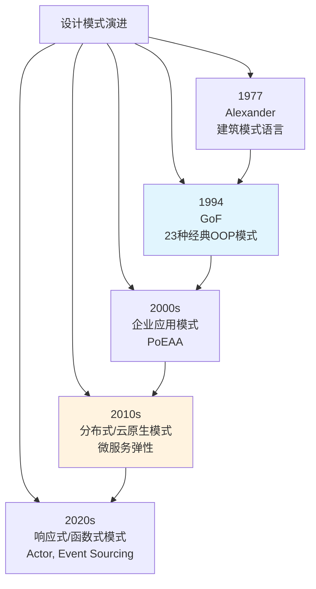
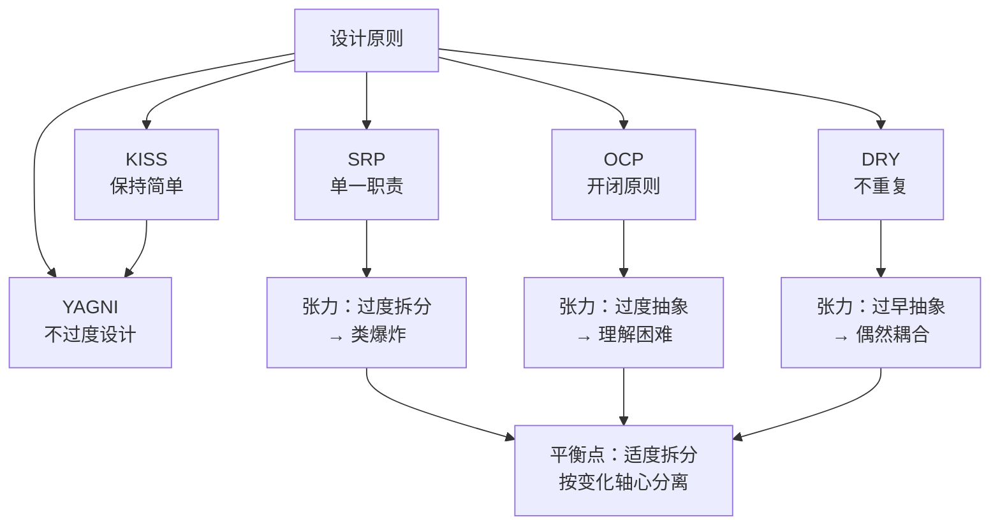
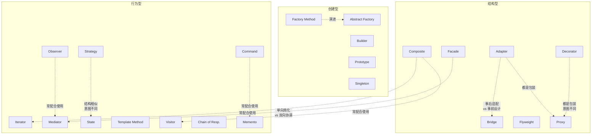
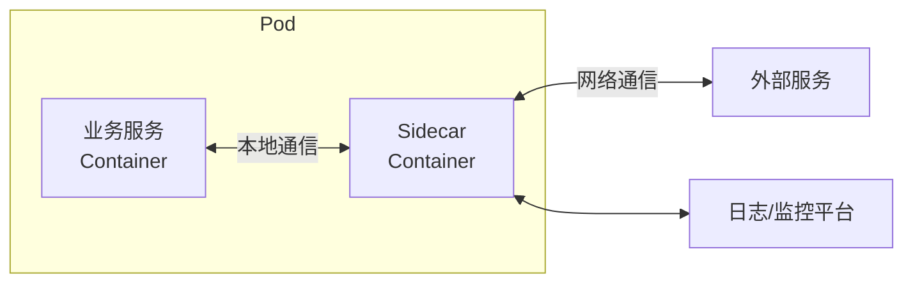

# 设计模式：理论基础

设计模式不是代码模板，而是一套经过反复验证的、针对特定设计问题的通用解决方案。它提供了一种开发者之间高效沟通的共同词汇——当你说"这里用一个Strategy"，团队立刻理解你的设计意图，而不需要逐行解释代码。本章从设计原则出发，系统阐述设计模式的理论根基，为后续的技巧应用和实战案例奠定基础。

## 1. 设计模式的起源与价值

### 1.1 历史背景

设计模式的概念源自建筑学。建筑师Christopher Alexander在1977年提出了"模式语言"（Pattern Language）的概念，描述建筑中反复出现的设计问题及其解决方案。Alexander认为好的设计不是凭灵感产生的，而是通过识别和复用经过验证的解决方案来实现的——这一理念深刻影响了后来的软件工程。

1994年，Erich Gamma、Richard Helm、Ralph Johnson和John Vlissides（"四人帮"，GoF）将这一思想引入软件工程，在《Design Patterns: Elements of Reusable Object-Oriented Software》一书中系统化地归纳了23种经典设计模式。

这23种模式并非凭空创造，而是从数十个实际项目中提炼出来的。GoF通过分析Smalltalk、C++等面向对象系统中反复出现的设计结构，识别出那些"在特定上下文中反复出现的设计问题及其解决方案的核心"。值得注意的是，GoF的书在1994年出版时，互联网尚未普及，这些模式是通过口口相传和学术会议在开发者社区中扩散的——这本身就证明了模式作为"共同词汇"的巨大价值。

在GoF之前，Ward Cunningham和Kent Beck在1987年已经开始在Smalltalk社区中实践"模式"的概念。Peter Coad在1992年出版了《Object-Oriented Patterns》，也对设计模式的形成产生了重要影响。GoF的工作是对这些早期探索的集大成和系统化。

### 1.2 为什么需要设计模式

没有设计模式的世界会怎样？

- **沟通成本极高**：每次讨论设计方案都需要从零描述，效率低下。想象一下，如果每次说"这里用一个观察者模式"都要解释"就是当一个对象状态改变时，所有依赖它的对象都会收到通知并自动更新"，团队的沟通效率会大打折扣
- **重复造轮子**：不同团队独立解决相同问题，浪费时间和精力。在设计模式被广泛认知之前，每个团队都在重新发明工厂、适配器、装饰器等解决方案
- **设计质量参差不齐**：缺少经过验证的参考方案，新手容易踩坑。一个没有经验的开发者可能会用继承来解决组合问题，导致脆弱的基类问题
- **系统难以维护**：临时拼凑的设计缺乏内在一致性，修改一处牵动全身。代码之间的隐式耦合像一张看不见的网，让每次修改都变成一次冒险

设计模式解决了这些问题。它们是经过实战检验的"最佳实践"，提供了：

1. **共同词汇**：Pattern名称本身就是精确的设计描述。说"用Facade封装这个子系统"，比描述"写一个类把所有复杂的底层调用都包装起来提供简单接口"精确得多
2. **经过验证的解决方案**：不必从零探索，站在前人肩膀上。每个模式都经历了无数项目的检验和打磨
3. **明确的权衡分析**：每个模式都说明了适用场景和局限性。设计不是非黑即白的，了解模式的代价才能做出正确的取舍
4. **可传递的设计知识**：新手可以通过学习模式快速提升设计能力。一个读过设计模式的开发者和一个没读过的，在面对相同设计问题时的思考深度和解决方案质量会有显著差异

### 1.3 模式的本质特征

GoF对设计模式的定义包含四个基本要素：

| 要素 | 说明 |
|------|------|
| **模式名称** | 用一两个词描述问题、解决方案和效果。如"Observer"、"Factory Method" |
| **问题** | 描述何时使用该模式，包括设计上下文和约束条件 |
| **解决方案** | 描述组成设计的元素、关系、职责和协作方式 |
| **效果** | 描述应用模式的利弊权衡，包括对灵活性、可扩展性、效率的影响 |

模式不是可以直接套用的代码模板。同一个模式在不同语言、不同场景中的实现可能差异很大。理解模式的意图和问题域比记忆具体的类图结构重要得多。

### 1.4 模式的层次与演进

设计模式并非一成不变的静态知识，它随着编程范式和软件架构的演进而不断扩展：



Martin Fowler在2002年出版的《Patterns of Enterprise Application Architecture》将设计模式扩展到企业应用领域，引入了Repository、Unit of Work、Data Mapper、Active Record等影响深远的架构模式。《Release It!》则聚焦于生产环境中的分布式弹性模式。近年来，随着云原生和微服务的普及，CQRS（命令查询职责分离）、Event Sourcing（事件溯源）、Saga等模式成为架构设计的新常态。

## 2. 设计原则：模式的理论根基

设计模式不是孤立存在的，它们根植于一组更基础的设计原则。理解这些原则才能理解模式存在的理由，以及在具体场景中如何变通和取舍。

### 2.1 SOLID原则

SOLID是Robert C. Martin（Uncle Bob）总结的五个面向对象设计原则的首字母缩写，是指导类和模块级设计的基石。

#### 2.1.1 单一职责原则（SRP）

**定义**：一个类应该只有一个引起它变化的原因。

换言之，一个类只应该承担一项职责。如果一个类同时负责数据持久化和业务规则计算，那么当持久化策略变化或业务规则变化时，这个类都需要修改，两种变化的动因耦合在了一起。

```java
// 违反SRP：一个类做了两件事
class Employee {
    calculatePay() { ... }     // 薪资计算职责
    saveToDatabase() { ... }   // 持久化职责
}

// 遵循SRP：拆分为两个类
class EmployeePayCalculator {
    calculatePay(employee) { ... }
}
class EmployeeRepository {
    save(employee) { ... }
}
```

**实践指导**：SRP的核心是"只有一个变化的轴心"。当需求变更时，只需要修改一个地方。违反SRP的征兆包括：

- 类名中出现"and"或"And"
- 方法集可明显分为两组不相关的操作
- 修改某功能时总需要修改该类
- 一个类依赖了多个互不相关的外部资源
- 类的import列表中包含多个不相关的包

SRP与Facade模式、Mediator模式密切相关——这些模式正是通过分离职责来降低耦合。但SRP也有边界：过度拆分会导致类爆炸，增加导航和理解的成本。Uncle Bob后来澄清，SRP中的"职责"应该理解为"变化的原因"（reason to change），而非字面意义上的"任务"。

#### 2.1.2 开闭原则（OCP）

**定义**：软件实体应该对扩展开放，对修改关闭。

即添加新功能时，应该通过添加新代码（扩展）实现，而不是修改已有代码。这是GoF设计模式最核心的指导原则之一。

```java
// 违反OCP：每次新增形状都要修改AreaCalculator
class AreaCalculator {
    double calculate(shape) {
        if (shape.type == "circle") return PI * shape.r * shape.r;
        if (shape.type == "rect") return shape.w * shape.h;
        // 每次新增形状都要改这里...
    }
}

// 遵循OCP：通过多态扩展
interface Shape { double area(); }
class Circle implements Shape {
    double area() { return PI * r * r; }
}
class Rectangle implements Shape {
    double area() { return w * h; }
}
// 新增三角形只需添加新类，无需修改已有代码
class Triangle implements Shape {
    double area() { return 0.5 * base * height; }
}
```

**关键洞察**：OCP的关键在于找到系统中"可变"的部分，将其抽象为接口。Strategy模式、Template Method模式、Decorator模式都是OCP的典型体现。但OCP也有边界——过度抽象会让系统变得不必要地复杂。当变化点不确定或变化频率很低时，简单的条件判断可能更务实。

Bertrand Meyer最早提出了OCP的概念（1988年），当时主要通过继承来实现。GoF将OCP的实现手段扩展到了多态、组合、配置等多种方式。

#### 2.1.3 里氏替换原则（LSP）

**定义**：子类型必须能够替换其基类型而不影响程序的正确性。

这是Barbara Liskov在1987年提出的，其形式化表述要求子类型满足前置条件不强化、后置条件不弱化、不变量保持。

经典违反案例——"正方形是长方形"问题：

```java
// 违反LSP
class Rectangle {
    setWidth(w) { this.width = w; }
    setHeight(h) { this.height = h; }
    area() { return width * height; }
}
class Square extends Rectangle {
    setWidth(w) { this.width = w; this.height = w; }
    setHeight(h) { this.width = h; this.height = h; }
}
// 使用者期望独立设置宽高，但Square破坏了这一契约
void resize(Rectangle r) {
    r.setWidth(5);
    r.setHeight(10);
    assert r.area() == 50; // 对Square会失败
}
```

**深层含义**：LSP告诉我们，继承关系不应该仅仅基于"is-a"的直觉判断，而应该基于行为兼容性。如果子类不能完全替换父类，就不应该使用继承，而应该使用组合。这是"组合优于继承"原则的重要理论支撑。

在实际工程中，LSP的违反往往是最难发现的bug来源之一。违反者可能在短期内工作正常，但当多态调用方引入新的使用方式时，bug就会暴露。常见的LSP违反包括：子类抛出父类未声明的异常、子类修改了父类方法的语义（如Java的`Stack`继承`Vector`导致`get`方法的语义变化）。

#### 2.1.4 接口隔离原则（ISP）

**定义**：客户端不应该被迫依赖它不使用的接口。

一个臃肿的接口应该被拆分为多个更小、更具体的接口。

```java
// 违反ISP：一个大接口强迫实现不需要的方法
interface Worker {
    work();
    eat();
    sleep();
}
class Robot implements Worker {
    work() { ... }    // Robot需要
    eat() { ... }     // Robot不需要，但被迫实现
    sleep() { ... }   // Robot不需要，但被迫实现
}

// 遵循ISP：拆分为细粒度接口
interface Workable { work(); }
interface Feedable { eat(); }
interface Sleepable { sleep(); }
class Robot implements Workable { work() { ... } }
class Human implements Workable, Feedable, Sleepable { ... }
```

**关键洞察**：ISP的核心观点是"接口属于客户端，不属于实现者"。接口应该根据客户端的需要来设计，而非根据实现者的功能清单。在现代框架设计中，ISP体现为"小接口优于大接口"的理念——Java的`java.util.Comparator`、Python的`Protocol`类都是ISP的实践。

ISP在微服务API设计中同样重要。一个API不应该返回客户端不需要的所有字段，而应该提供细粒度的端点或字段选择能力（如GraphQL的按需查询就是ISP在API层面的体现）。

#### 2.1.5 依赖倒置原则（DIP）

**定义**：高层模块不应该依赖低层模块，二者都应该依赖抽象。抽象不应该依赖细节，细节应该依赖抽象。

```java
// 违反DIP：高层直接依赖低层
class OrderService {
    MySQLDatabase db = new MySQLDatabase(); // 直接依赖具体实现
    save(order) { db.insert(order); }
}

// 遵循DIP：依赖抽象
interface Database { save(entity); }
class OrderService {
    Database db; // 依赖抽象
    OrderService(Database db) { this.db = db; }
    save(order) { db.save(order); }
}
class MySQLDatabase implements Database { ... }
class PostgreSQLDatabase implements Database { ... }
```

**工程化实现**：DIP是实现松耦合的核心手段。依赖注入（DI）框架（如Spring、Guice）正是这一原则的工程化实现。Factory Method、Abstract Factory等创建型模式也体现了DIP——它们将对象创建的细节封装在工厂中，客户端只依赖抽象的产品接口。

DIP的价值不仅在于可测试性（可以用Mock替代真实数据库），更在于系统的可演化性。当需要从MySQL迁移到PostgreSQL时，只需更换注入的实现类，业务逻辑零修改。

### 2.2 DRY原则

**DRY（Don't Repeat Yourself）** 由Andy Hunt和Dave Thomas在《The Pragmatic Programmer》中提出：

> "Every piece of knowledge must have a single, unambiguous, authoritative representation within a system."

DRY不仅仅是避免复制粘贴代码。它要求系统中的每一条知识（业务规则、算法、常量、校验逻辑等）都只有一个权威来源。如果业务规则在三处被编码，当规则变化时你必须找到所有三处并保持一致，这是bug的温床。

**DRY的边界**：过度消除重复可能引入不必要的耦合。如果两段代码恰好现在相同，但变化动因不同（"偶然重复"），强行抽取公共代码可能在一方需要变化时制造障碍。这被称为"偶然重复"与"真正重复"的区别：

| 类型 | 特征 | 处理方式 |
|------|------|----------|
| 真正重复 | 同一条知识在多处编码，变化动因相同 | 必须消除，抽取为单一来源 |
| 偶然重复 | 两段代码碰巧相似，但独立演化 | 可以容忍，甚至鼓励 |

**判断标准**：问自己"这两段代码将来会朝同一个方向变化吗？"如果答案是肯定的，合并它们；如果不确定或答案是否定的，保持分离。

### 2.3 YAGNI原则

**YAGNI（You Aren't Gonna Need It）** 是极限编程（XP）的核心实践之一。它告诫开发者不要为"将来可能需要"的功能编写代码。只有在确确实实需要某个功能时才去实现它。

YAGNI反对的是一种常见心理："我现在把接口设计得通用一点，以后可能会用到。" 实际上：

- 你预测的需求往往不会到来
- 即使到来了，与你预想的也往往不同
- 预先设计的"通用性"增加了当下的复杂度和维护成本

**与设计模式的关系**：YAGNI与设计模式的关系很微妙。设计模式提供了一种"当需要扩展时再引入"的能力，但不应该在不需要扩展时提前引入。简单的if-else在只涉及两种策略时可能比Strategy模式更清晰。模式是解决已知问题的工具，不是预防未知问题的保险。

### 2.4 KISS原则

**KISS（Keep It Simple, Stupid）** 强调简洁是终极的复杂。在设计中，最简单的可行方案通常是最好的。引入设计模式应该让系统更简单，而不是更复杂。

KISS的实践指导：

- 能用简单方案解决的问题不要引入复杂模式
- 一个模式如果增加了代码量和理解难度但没有带来明显的灵活性收益，就应该放弃
- 代码被阅读的次数远多于编写的次数，优先考虑可读性
- 当你在两个方案之间犹豫时，选择更简单的那个
- 如果你需要向团队解释一个模式为什么在这里使用，那可能就不该用它

### 2.5 其他重要原则

**组合优于继承（Composition Over Inheritance）**：继承创建的是编译时确定的静态关系，而且暴露了实现细节。组合通过持有对象引用创建运行时可变的动态关系，更灵活。Decorator、Strategy、State等模式都体现了这一原则。现代编程语言的一等函数、闭包、Mixin等特性进一步降低了对继承的依赖。

**面向接口编程，而非面向实现编程**：依赖抽象而非具体类型，这是DIP的自然推论，也是实现多态的前提。在Go中体现为隐式接口实现，在Java中体现为面向接口的变量声明。

**封装变化点**：识别系统中变化的部分，将其封装在稳定的接口之后。这正是GoF设计模式的核心思想——每个模式都识别了一个变化点并提供了封装方案。Martin Fowler说过："任何我总想着要封装的东西，都会成为一个模式的候选。"

**关注点分离（Separation of Concerns）**：每个模块应该只负责一个方面的功能。这个原则由Dijkstra在1982年提出，是SOLID原则的上层指导。前端/后端分离、MVC架构、中间件链都是关注点分离的实践。

### 2.6 原则间的张力与权衡

这些原则并非总是和谐一致的，实践中经常需要在它们之间做出权衡：



**SRP vs DRY**：将职责拆得太细可能导致同一条逻辑分散在多个类中（违反DRY），而将相关职责合并到一个类中又可能违反SRP。平衡点是按"变化的轴心"来划分职责。

**OCP vs KISS**：为实现OCP而引入的抽象层增加了系统的复杂度。如果某个分支不太可能扩展，简单的条件判断可能比引入Strategy模式更合适。

**YAGNI vs OCP**：YAGNI说不要为未来变化做准备，OCP说要对扩展开放。平衡点是：识别真正高频的变化点，在这些点上预留扩展能力；对低频变化点，接受"到时再重构"。

**DRY vs 缓解耦合**：有时候，故意保留两段相似但独立演化的代码，可以避免一个模块的变化波及另一个模块。这被称为"受控重复"（Controlled Duplication），是Martin Fowler提出的概念。

## 3. 设计模式分类体系

### 3.1 GoF分类框架

GoF将23种设计模式按**目的**分为三大类：

| 分类 | 关注点 | 模式数量 | 核心问题 |
|------|--------|----------|----------|
| **创建型模式** | 对象创建机制 | 5种 | 如何灵活地创建对象？ |
| **结构型模式** | 类和对象的组合 | 7种 | 如何将类和对象组合成更大的结构？ |
| **行为型模式** | 对象间的职责分配 | 10种 | 对象间如何分配职责和通信？ |

按**适用范围**又分为两类：

- **类模式**：处理类与子类之间的关系，编译时确定（Factory Method、Adapter、Template Method、Iterator、Chain of Responsibility）
- **对象模式**：处理对象间的关系，运行时确定（其余18种）

现代软件工程在此基础上扩展了两个重要类别：

- **并发模式**：解决多线程和异步编程中的协作与安全问题
- **分布式弹性模式**：解决微服务架构中的故障隔离和弹性问题

### 3.2 模式关系图谱

设计模式不是孤立的，它们之间存在互补、替代和演进关系：



**关键关系解读**：

- **Strategy vs State**：结构几乎相同（都持有另一个对象的引用并委托调用），但意图截然不同。Strategy由客户端主动选择算法，State由对象内部状态自动切换
- **Adapter vs Bridge vs Decorator vs Proxy**：四种模式都涉及"包装"，但意图各不相同——Adapter转换接口、Bridge分离抽象与实现、Decorator增强功能、Proxy控制访问
- **Facade vs Mediator**：都是协调多个对象，但Facade是单向的简化入口，Mediator是双向的交互中枢
- **Command + Memento**：Command记录"做了什么操作"，Memento记录"操作前的状态"，两者配合实现完整的撤销/重做功能

### 3.3 模式选型决策树

根据设计问题的特征，可以通过以下决策树选择合适的模式：

**创建型模式选型**：

需要创建对象
├─ 有复杂的构建步骤 → Builder
├─ 需要一系列相关对象 → Abstract Factory
├─ 创建逻辑需要延迟到子类 → Factory Method
├─ 创建成本高，需复制现有对象 → Prototype
└─ 系统中只能有一个实例 → Singleton（优先考虑DI容器管理）

**结构型模式选型**：

需要组合/包装对象
├─ 接口不兼容，需转换 → Adapter
├─ 抽象和实现需独立变化 → Bridge
├─ 树形结构，统一处理叶子和容器 → Composite
├─ 动态添加功能，不想用继承 → Decorator
├─ 简化复杂子系统的访问 → Facade
├─ 大量相似对象，共享内部状态 → Flyweight
└─ 需要控制对象的访问 → Proxy

**行为型模式选型**：

对象间的交互/行为变化
├─ 算法需在运行时切换 → Strategy
├─ 一对多通知 → Observer
├─ 请求需排队/撤销/记录 → Command
├─ 遍历集合不暴露内部 → Iterator
├─ 多对象间复杂交互 → Mediator
├─ 对象行为随状态变化 → State
├─ 算法骨架固定，步骤可变 → Template Method
├─ 对结构执行多种操作 → Visitor
├─ 请求链式传递 → Chain of Responsibility
└─ 保存/恢复对象状态 → Memento

### 3.4 模式选型的启发式方法

除了决策树，以下启发式方法可以帮助你在实践中更准确地选择模式：

1. **识别变化点**：问自己"系统中什么最可能变化？"变化的维度决定了应该使用哪种模式
2. **从问题出发，而非从模式出发**：先明确你面临的设计问题（如"需要在不修改现有代码的情况下添加新行为"），再寻找匹配的模式
3. **考虑语言特性**：一等函数可以大幅简化Strategy、Command、Observer等模式的实现。在函数式语言中，很多GoF模式可以用更简洁的方式实现
4. **评估变化频率**：高频变化点值得引入模式，低频变化点用简单方案即可
5. **考虑团队熟悉度**：一个团队都理解的简单方案，比一个精妙但只有架构师理解的方案更好

## 4. 创建型模式详解

创建型模式关注对象的创建机制，将对象的创建与使用分离。它们的共同目标是让客户端代码不依赖具体的产品类，从而提升系统的灵活性和可扩展性。

### 4.1 五种创建型模式概览

| 模式 | 核心机制 | 适用场景 | 复杂度 |
|------|----------|----------|--------|
| **Factory Method** | 将实例化延迟到子类 | 框架需要创建对象但不确定具体类型 | ★★☆ |
| **Abstract Factory** | 创建一族相关对象 | 需要确保产品族的一致性 | ★★★ |
| **Builder** | 分步构建复杂对象 | 对象有大量可选参数 | ★★☆ |
| **Prototype** | 通过克隆创建对象 | 创建成本高或只知道接口 | ★★☆ |
| **Singleton** | 保证唯一实例 | 全局共享资源管理 | ★☆☆ |

### 4.2 Factory Method（工厂方法）

**意图**：定义一个创建对象的接口，让子类决定实例化哪个类。

**结构**：

Creator (abstract)
├── factoryMethod(): Product  ← 抽象工厂方法
└── anOperation()             ← 调用factoryMethod()

ConcreteCreator
└── factoryMethod(): ConcreteProduct  ← 返回具体产品

Product (interface)
ConcreteProduct implements Product

**代码示例（Java）**：

```java
// 产品接口
abstract class Button {
    abstract void render();
    abstract void onClick(Runnable handler);
}

// 具体产品
class WindowsButton extends Button {
    void render() { /* Windows风格渲染 */ }
    void onClick(Runnable handler) { /* Windows事件绑定 */ }
}
class LinuxButton extends Button {
    void render() { /* GTK风格渲染 */ }
    void onClick(Runnable handler) { /* GTK事件绑定 */ }
}

// 创建者
abstract class Dialog {
    abstract Button createButton();  // 工厂方法
    
    void renderDialog() {
        Button okButton = createButton();
        okButton.onClick(() -> close());
        okButton.render();
    }
}

class WindowsDialog extends Dialog {
    Button createButton() { return new WindowsButton(); }
}
class LinuxDialog extends Dialog {
    Button createButton() { return new LinuxButton(); }
}
```

**与简单工厂的区别**：简单工厂（Static Factory）通常用一个静态方法+条件判断来创建对象，违反OCP。Factory Method通过继承实现扩展，新增产品只需新增Creator子类，无需修改已有代码。

**适用场景**：
- 当一个类不知道它要创建的对象的具体类时
- 当一个类希望由子类来指定它创建的对象时
- 框架和库的设计中，将实例化延迟到使用框架的应用程序

**在现代框架中的体现**：Spring的`FactoryBean`接口就是Factory Method模式的标准实现——容器调用`getObject()`方法获取Bean实例，具体创建逻辑由FactoryBean的实现类决定。

### 4.3 Abstract Factory（抽象工厂）

**意图**：提供一个接口，用于创建一系列相关或相互依赖的对象，而无需指定它们的具体类。

**问题**：一个UI框架需要支持多套主题（Windows、macOS、Linux），每套主题包含一组风格一致的控件（按钮、文本框、菜单）。不应该混搭不同主题的控件。

**结构**：

AbstractFactory
├── createButton(): Button
├── createTextBox(): TextBox
└── createMenu(): Menu

WindowsFactory implements AbstractFactory
├── createButton() → WindowsButton
├── createTextBox() → WindowsTextBox
└── createMenu() → WindowsMenu

MacFactory implements AbstractFactory
├── createButton() → MacButton
├── createTextBox() → MacTextBox
└── createMenu() → MacMenu

**代码示例（Python）**：

```python
from abc import ABC, abstractmethod

class GUIFactory(ABC):
    @abstractmethod
    def create_button(self) -> 'Button': ...
    @abstractmethod
    def create_checkbox(self) -> 'Checkbox': ...

class WindowsFactory(GUIFactory):
    def create_button(self) -> 'Button':
        return WindowsButton()
    def create_checkbox(self) -> 'Checkbox':
        return WindowsCheckbox()

class MacFactory(GUIFactory):
    def create_button(self) -> 'Button':
        return MacButton()
    def create_checkbox(self) -> 'Checkbox':
        return MacCheckbox()

# 客户端代码与具体工厂解耦
def build_ui(factory: GUIFactory):
    button = factory.create_button()
    checkbox = factory.create_checkbox()
    button.paint()
    checkbox.paint()
```

**关键约束**：Abstract Factory最难的部分是增加新产品。如果需要在抽象工厂中新增一个`createScrollbar()`方法，所有具体工厂都必须修改。这就是"产品族扩展困难"的经典问题。实践中可以通过以下方式缓解：

- 使用默认方法（Java 8+）或可选接口方法（Kotlin）提供默认实现
- 将产品创建委托给工厂内部的注册表
- 考虑是否真的需要Abstract Factory，还是Factory Method就够了

**在现代框架中的体现**：JDBC的`DriverManager`和各数据库驱动的关系就是Abstract Factory——不同数据库提供各自的`Connection`、`Statement`、`ResultSet`实现，保证产品族的一致性。

### 4.4 Builder（建造者）

**意图**：将复杂对象的构建与其表示分离，使得同样的构建过程可以创建不同的表示。

**问题**：一个对象有大量可选参数，且构造过程涉及多个步骤。用构造函数会导致参数列表过长（"telescoping constructor"反模式），或者需要大量重载。

**代码示例（TypeScript）**：

```typescript
class HttpRequest {
    constructor(
        public readonly method: string,
        public readonly url: string,
        public readonly headers: Map<string, string>,
        public readonly body: string | null,
        public readonly timeout: number,
        public readonly retries: number
    ) {}
}

class HttpRequestBuilder {
    private method = 'GET';
    private url = '';
    private headers = new Map<string, string>();
    private body: string | null = null;
    private timeout = 30000;
    private retries = 3;

    setMethod(m: string): this { this.method = m; return this; }
    setUrl(u: string): this { this.url = u; return this; }
    addHeader(k: string, v: string): this { this.headers.set(k, v); return this; }
    setBody(b: string): this { this.body = b; return this; }
    setTimeout(t: number): this { this.timeout = t; return this; }
    setRetries(r: number): this { this.retries = r; return this; }

    build(): HttpRequest {
        if (!this.url) throw new Error('URL is required');
        return new HttpRequest(
            this.method, this.url, this.headers,
            this.body, this.timeout, this.retries
        );
    }
}

// 使用
const request = new HttpRequestBuilder()
    .setUrl('https://api.example.com/users')
    .setMethod('POST')
    .addHeader('Content-Type', 'application/json')
    .setBody('{"name": "Alice"}')
    .setTimeout(5000)
    .build();
```

**Builder vs 工厂模式**：工厂关注"创建什么"，Builder关注"如何创建"。工厂一步到位返回完整产品，Builder分步构建。当对象的构建过程本身也很复杂时，两者可以组合使用。

**Director角色**：GoF定义了Director来封装构建过程。现代实践中，Director常被省略——Builder的链式调用本身就是构建过程的声明式描述。

**在现代框架中的体现**：Java的`StringBuilder`、Lombok的`@Builder`注解、Kotlin的`buildString`/`buildList`都是Builder模式的体现。Android开发中，`AlertDialog.Builder`是最常用的Builder实例。

### 4.5 Prototype（原型）

**意图**：用原型实例指定创建的对象种类，并且通过复制这些原型来创建新对象。

**核心问题**：创建对象的成本很高（需要数据库查询、网络请求或复杂计算），而你需要大量相似对象。

**深拷贝 vs 浅拷贝**：

浅拷贝只复制值类型字段和引用地址，引用类型字段仍指向原对象。深拷贝递归复制所有引用对象。Prototype模式通常需要深拷贝以保证独立性。

```java
// Java实现：实现Cloneable接口
class Document implements Cloneable {
    private String title;
    private List<Page> pages;  // 引用类型
    
    @Override
    public Document clone() {
        Document copy = (Document) super.clone();
        copy.pages = new ArrayList<>();
        for (Page p : this.pages) {
            copy.pages.add(p.clone());  // 深拷贝
        }
        return copy;
    }
}
```

**注册表实现**：实践中常使用原型注册表（Prototype Registry），按名称存储预配置的原型实例：

```java
class PrototypeRegistry {
    private Map<String, Prototype> prototypes = new HashMap<>();
    void register(String key, Prototype p) { prototypes.put(key, p); }
    Prototype create(String key) { return prototypes.get(key).clone(); }
}
```

**在现代框架中的体现**：JavaScript的`Object.create()`和展开运算符`{...obj}`是Prototype模式的轻量实现。序列化/反序列化（JSON.parse(JSON.stringify(obj))）也是一种深拷贝实现，虽然性能不佳。

### 4.6 Singleton（单例）

**意图**：保证一个类只有一个实例，并提供一个全局访问点。

**四种实现方式对比**：

| 实现方式 | 线程安全 | 延迟初始化 | 防反射攻击 | 防序列化攻击 | 代码复杂度 |
|----------|----------|------------|------------|--------------|------------|
| 饿汉式 | ✅ | ❌ | ✅ | ❌ | 低 |
| 双重检查锁定 | ✅ | ✅ | ❌ | ❌ | 高 |
| 静态内部类 | ✅ | ✅ | ✅ | ❌ | 中 |
| 枚举方式 | ✅ | ❌ | ✅ | ✅ | 最低 |

**争议与替代**：Singleton是GoF模式中争议最大的一个。常见批评：

- 引入全局状态，使代码难以测试（无法mock）
- 隐式依赖，函数签名不能体现对单例的依赖
- 违反SRP（既管理业务逻辑又管理生命周期）
- 在并发环境中可能成为性能瓶颈

现代实践倾向于使用依赖注入容器管理对象生命周期，将"单一实例"的责任交给容器（如Spring的`@Singleton`作用域），而非在类自身内部实现。GoF的作者之一John Vlissides也承认，Singleton在很多场景下是被滥用的——它应该只在真正需要全局唯一实例时使用（如日志记录器、配置管理器），而非作为"方便的全局变量"。

## 5. 结构型模式详解

结构型模式关注如何将类或对象组合成更大的结构，以实现新功能或简化设计。

### 5.1 七种结构型模式概览

| 模式 | 核心机制 | 适用场景 | 复杂度 |
|------|----------|----------|--------|
| **Adapter** | 接口转换 | 整合不兼容的接口 | ★★☆ |
| **Bridge** | 抽象与实现分离 | 多维度独立变化 | ★★★ |
| **Composite** | 树形结构统一处理 | 部分-整体层次结构 | ★★☆ |
| **Decorator** | 动态添加职责 | 不通过继承扩展功能 | ★★☆ |
| **Facade** | 简化子系统访问 | 复杂子系统的统一入口 | ★☆☆ |
| **Flyweight** | 共享细粒度对象 | 大量相似对象的内存优化 | ★★★ |
| **Proxy** | 控制对象访问 | 延迟加载、权限控制、缓存 | ★★☆ |

### 5.2 Adapter（适配器）

**意图**：将一个类的接口转换成客户端期望的另一个接口。Adapter使得原本因接口不兼容而无法一起工作的类可以一起工作。

适配器有两种实现方式：

- **类适配器**：通过多重继承（Java不支持，C++支持）
- **对象适配器**：通过组合（更常用）

```python
# 对象适配器（更常用）
class EuropeanSocket:
    def voltage(self): return 230
    def live(self): return 1
    def neutral(self): return -1

class USASocketInterface:
    def voltage(self): ...
    def live(self): ...
    def neutral(self): ...

class USASocketAdapter(USASocketInterface):
    def __init__(self, european_socket):
        self.eu = european_socket
    
    def voltage(self): return 110  # 转换电压
    def live(self): return self.eu.live()
    def neutral(self): return self.eu.neutral()
```

**Adapter vs Bridge**：Adapter是事后补救，让不兼容的类一起工作。Bridge是事前设计，有意将抽象和实现分离。两者结构相似但意图完全不同。

**在现代框架中的体现**：ORM框架（如Hibernate、SQLAlchemy）本质上是Adapter——将面向对象的调用适配为SQL查询。REST API的序列化/反序列化层也是一种Adapter。

### 5.3 Bridge（桥接）

**意图**：将抽象部分与实现部分分离，使它们可以独立变化。

**核心问题**：当一个抽象有多个维度的变化时（如形状×颜色），继承会导致类爆炸（RedCircle, BlueCircle, RedSquare, BlueSquare...）。

```java
// 实现接口
interface Color {
    String fill();
}
class Red implements Color { String fill() { return "红色"; } }
class Blue implements Color { String fill() { return "蓝色"; } }

// 抽象持有实现的引用
abstract class Shape {
    protected Color color;
    Shape(Color color) { this.color = color; }
    abstract String draw();
}
class Circle extends Shape {
    Circle(Color c) { super(c); }
    String draw() { return "绘制" + color.fill() + "的圆形"; }
}
class Square extends Shape {
    Square(Color c) { super(c); }
    String draw() { return "绘制" + color.fill() + "的方形"; }
}

// 使用：形状和颜色可以独立扩展
new Circle(new Red()).draw(); // "绘制红色的圆形"
```

**Bridge vs Strategy**：两者结构非常相似（抽象类持有另一个对象的引用）。区别在于意图：Bridge在设计之初就有意分离两个维度的变化，Strategy是在运行时切换算法。如果你发现自己在"为了分离两个独立变化的维度"，用Bridge；如果在"为了在运行时切换行为"，用Strategy。

### 5.4 Composite（组合）

**意图**：将对象组合成树形结构以表示"部分-整体"的层次。Composite使得用户对单个对象和组合对象的使用具有一致性。

```java
interface FileSystemComponent {
    int getSize();
    void print(String indent);
}

class File implements FileSystemComponent {
    private String name;
    private int size;
    // ...
}

class Directory implements FileSystemComponent {
    private String name;
    private List<FileSystemComponent> children = new ArrayList<>();
    
    void add(FileSystemComponent component) { children.add(component); }
    
    int getSize() {
        return children.stream().mapToInt(FileSystemComponent::getSize).sum();
    }
    
    void print(String indent) {
        System.out.println(indent + "[DIR] " + name);
        for (FileSystemComponent c : children) {
            c.print(indent + "  ");
        }
    }
}
```

**潜在问题**：叶子节点和容器节点共享同一个接口，可能导致客户端对叶子节点调用无意义的操作（如对文件调用`add()`）。缓解方式：提供`isComposite()`方法或使用单独的接口。

**在现代框架中的体现**：DOM树（`Element`和`TextNode`）、React组件树（组件可以包含子组件）、文件系统API都是Composite模式的经典实现。

### 5.5 Decorator（装饰器）

**意图**：动态地给一个对象添加额外职责。Decorator提供了比继承更灵活的功能扩展方式。

```python
# 咖啡示例
class Coffee:
    def cost(self): return 5
    def description(self): return "基础咖啡"

class CoffeeDecorator(Coffee):
    def __init__(self, coffee):
        self._coffee = coffee
    def cost(self): return self._coffee.cost()
    def description(self): return self._coffee.description()

class MilkDecorator(CoffeeDecorator):
    def cost(self): return self._coffee.cost() + 2
    def description(self): return self._coffee.description() + " + 牛奶"

class SugarDecorator(CoffeeDecorator):
    def cost(self): return self._coffee.cost() + 1
    def description(self): return self._coffee.description() + " + 糖"

# 使用：动态组合
coffee = Coffee()
coffee = MilkDecorator(coffee)
coffee = SugarDecorator(coffee)
print(coffee.description())  # "基础咖啡 + 牛奶 + 糖"
print(coffee.cost())         # 8
```

**Decorator vs Proxy**：两者结构相同（都是包装对象），但意图不同。Decorator的目的是添加新功能，Proxy的目的是控制访问。Decorator关注"增强"，Proxy关注"拦截"。

**Decorator vs Adapter**：Adapter改变接口，Decorator保持接口不变。Adapter是接口转换，Decorator是功能叠加。

**在现代框架中的体现**：Python的`@decorator`语法、Java的`InputStream`体系（`BufferedInputStream`装饰`FileInputStream`）、TypeScript/JavaScript的装饰器提案都是Decorator模式的语言级支持。

### 5.6 Facade（外观）

**意图**：为子系统中的一组接口提供一个统一的高层接口。Facade定义了一个更高层次的接口，使得子系统更加易用。

```python
class OrderFacade:
    """简化下单流程的外观"""
    def __init__(self):
        self._inventory = InventoryService()
        self._payment = PaymentService()
        self._shipping = ShippingService()
        self._notification = NotificationService()
    
    def place_order(self, user_id, product_id, amount):
        # 协调多个子系统
        if not self._inventory.check(product_id, amount):
            raise ValueError("库存不足")
        
        payment_id = self._payment.charge(user_id, amount)
        tracking = self._shipping.create_shipment(user_id, product_id)
        self._notification.send_confirmation(user_id, payment_id)
        
        return {"payment_id": payment_id, "tracking": tracking}
```

**Facade vs Mediator**：Facade是单向的——客户端调用Facade，Facade调用子系统。Mediator是双向的——组件之间通过Mediator交互。Facade简化访问，Mediator协调交互。

**Facade vs Adapter**：Facade为复杂子系统提供简化接口，关注的是简化使用。Adapter转换已有接口以满足新需求，关注的是兼容性。

**在现代框架中的体现**：Spring的`JdbcTemplate`是对JDBC API的Facade；jQuery是对原生DOM API的Facade；各种SDK都是底层API的Facade。

### 5.7 Flyweight（享元）

**意图**：运用共享技术有效地支持大量细粒度的对象。

```java
// 字符渲染示例：字符对象是共享的，位置是外部状态
class CharacterFlyweight {
    private char symbol;    // 内部状态（共享）
    private String font;
    
    void render(int row, int col) {  // 外部状态（每次调用传入）
        System.out.printf("在(%d,%d)渲染字符 %c [字体: %s]%n", 
                          row, col, symbol, font);
    }
}

class FlyweightFactory {
    private Map<String, CharacterFlyweight> pool = new HashMap<>();
    
    CharacterFlyweight get(char symbol, String font) {
        String key = symbol + ":" + font;
        return pool.computeIfAbsent(key, k -> new CharacterFlyweight(symbol, font));
    }
}
```

**内部状态 vs 外部状态**：内部状态存储在享元对象中，可被多个上下文共享（不变的、可共享的部分）；外部状态依赖于上下文，不能共享，由客户端在使用时传入（变化的部分）。划分错误会导致数据不一致。

**在现代框架中的体现**：Java的`Integer.valueOf()`（-128到127的缓存）、字符串常量池、线程池（线程是被复用的"享元"）都是Flyweight模式的体现。数据库连接池本质上也是Flyweight——连接对象被复用而非每次创建。

### 5.8 Proxy（代理）

**意图**：为其他对象提供一种代理以控制对这个对象的访问。

四种常见代理类型：

| 代理类型 | 目的 | 典型应用 |
|----------|------|----------|
| **远程代理** | 为远程对象提供本地代表 | RMI Stub、gRPC客户端 |
| **虚拟代理** | 延迟创建开销大的对象 | 图片懒加载、大对象延迟初始化 |
| **保护代理** | 控制对象的访问权限 | 权限检查、访问控制 |
| **缓存代理** | 缓存请求结果 | 数据库查询缓存、API响应缓存 |

```python
class Image:
    def display(self): ...

class RealImage(Image):
    def __init__(self, filename):
        self.filename = filename
        self._load_from_disk()  # 开销大
    
    def _load_from_disk(self):
        print(f"从磁盘加载 {self.filename}")
    
    def display(self):
        print(f"显示 {self.filename}")

class ProxyImage(Image):
    def __init__(self, filename):
        self.filename = filename
        self._real = None  # 延迟创建
    
    def display(self):
        if self._real is None:
            self._real = RealImage(self.filename)
        self._real.display()
```

**在现代框架中的体现**：Spring AOP的动态代理是Proxy模式的运行时实现；Nginx反向代理是网络层的Proxy；Redis缓存层是数据访问的缓存代理。

## 6. 行为型模式详解

行为型模式关注对象之间的职责分配和通信方式。它们定义了对象间的交互规则，使系统更灵活、更松耦合。

### 6.1 十种行为型模式概览

| 模式 | 核心机制 | 适用场景 | 复杂度 |
|------|----------|----------|--------|
| **Strategy** | 算法族的封装与互换 | 算法需要在运行时切换 | ★★☆ |
| **Observer** | 一对多依赖通知 | 状态变更的广播通知 | ★★☆ |
| **Command** | 请求的对象化 | 撤销/重做、队列、日志 | ★★☆ |
| **Iterator** | 顺序访问聚合元素 | 遍历集合不暴露内部 | ★☆☆ |
| **Mediator** | 对象交互的集中管控 | 多对象间复杂交互 | ★★★ |
| **State** | 状态驱动的行为变化 | 对象行为随状态改变 | ★★☆ |
| **Template Method** | 算法骨架的延迟步骤 | 算法骨架固定，步骤可变 | ★☆☆ |
| **Visitor** | 操作与对象结构分离 | 对结构执行多种操作 | ★★★ |
| **Chain of Responsibility** | 请求的链式传递 | 请求的多级处理 | ★★☆ |
| **Memento** | 状态的保存与恢复 | 撤销/快照/历史记录 | ★★☆ |

### 6.2 Strategy（策略）

**意图**：定义一系列算法，把它们一个个封装起来，并且使它们可以相互替换。

```java
interface SortStrategy<T extends Comparable<T>> {
    void sort(List<T> list);
}

class BubbleSort<T extends Comparable<T>> implements SortStrategy<T> {
    void sort(List<T> list) { /* 冒泡排序实现 */ }
}

class QuickSort<T extends Comparable<T>> implements SortStrategy<T> {
    void sort(List<T> list) { /* 快速排序实现 */ }
}

class Sorter<T extends Comparable<T>> {
    private SortStrategy<T> strategy;
    
    Sorter(SortStrategy<T> strategy) { this.strategy = strategy; }
    void setStrategy(SortStrategy<T> strategy) { this.strategy = strategy; }
    void sort(List<T> list) { strategy.sort(list); }
}
```

**现代简化**：在支持一等函数的语言中，Strategy可以用函数/lambda代替，不必创建接口+多个实现类。这是"理解意图，灵活实现"的典型例子。

```python
# 函数式Strategy：用lambda代替类
def sort_with(list, strategy):
    return strategy(list)

sorted_data = sort_with(data, lambda x: sorted(x))           # 内置排序
sorted_data = sort_with(data, lambda x: sorted(x, reverse=True))  # 逆序
```

**Strategy vs State**：两者结构几乎相同。关键区别在于：Strategy由外部主动选择并传入（"我决定用哪种算法"），State由对象内部状态自动切换（"我的状态变了，行为自然变了"）。

**在现代框架中的体现**：Java的`Comparator`、Python的`sort(key=...)`、JavaScript的`Array.prototype.sort(compareFn)`都是Strategy模式的函数式体现。

### 6.3 Observer（观察者）

**意图**：定义对象间的一种一对多依赖关系，使得每当一个对象状态改变时，所有依赖于它的对象都会得到通知并自动更新。

```python
class EventEmitter:
    def __init__(self):
        self._listeners = {}
    
    def on(self, event, callback):
        self._listeners.setdefault(event, []).append(callback)
    
    def off(self, event, callback):
        self._listeners.get(event, []).remove(callback)
    
    def emit(self, event, *args, **kwargs):
        for cb in self._listeners.get(event, []):
            cb(*args, **kwargs)

class Store:
    def __init__(self):
        self.events = EventEmitter()
        self._state = {}
    
    def set(self, key, value):
        old = self._state.get(key)
        self._state[key] = value
        self.events.emit('change', key, old, value)
        self.events.emit(f'change:{key}', old, value)
```

**推模型 vs 拉模型**：推模型由Subject向Observer发送详细信息；拉模型只发送通知，Observer按需拉取数据。现代实现多采用拉模型或事件对象封装变化数据。

**注意事项**：Observer的通知风暴是常见问题——链式级联更新可能导致性能问题和调试困难。解决方案包括批量通知、去抖动（debounce）、异步通知。

**Observer的现代变体**：
- **Pub/Sub模式**：与Observer类似，但引入了事件总线（Event Bus）作为中介，发布者和订阅者完全解耦
- **响应式编程（Reactive Programming）**：RxJava、RxJS将Observer模式与函数式编程结合，提供了丰富的操作符（map、filter、merge等）来处理事件流
- **Vue/React的状态管理**：Vuex、Redux本质上是Observer模式在前端状态管理中的应用

**在现代框架中的体现**：Node.js的`EventEmitter`、浏览器的DOM事件系统、Vue的响应式系统、Spring的`ApplicationEvent`都是Observer模式的直接实现。

### 6.4 Command（命令）

**意图**：将一个请求封装为一个对象，从而使得可以用不同的请求对客户端进行参数化，支持请求的排队、日志记录以及可撤销的操作。

```java
interface Command {
    void execute();
    void undo();  // 可选：支持撤销
}

class InsertTextCommand implements Command {
    private TextEditor editor;
    private String text;
    private int position;
    
    void execute() { editor.insertAt(position, text); }
    void undo() { editor.deleteAt(position, text.length()); }
}

class CommandHistory {
    private Deque<Command> history = new ArrayDeque<>();
    private Deque<Command> redoStack = new ArrayDeque<>();
    
    void execute(Command cmd) {
        cmd.execute();
        history.push(cmd);
        redoStack.clear();
    }
    
    void undo() {
        if (!history.isEmpty()) {
            Command cmd = history.pop();
            cmd.undo();
            redoStack.push(cmd);
        }
    }
}
```

**Command的三大价值**：
1. **解耦调用者和执行者**：调用者只需要调用`execute()`，不需要知道具体执行什么
2. **支持撤销/重做**：`undo()`方法让操作可逆
3. **支持队列和日志**：命令对象可以被序列化、存储、重放

**在现代框架中的体现**：数据库事务日志（WAL）是Command模式的存储层体现；Git的每次commit就是一个Command对象，支持revert操作；Redux的action/reducer是Command模式在前端状态管理中的应用。

### 6.5 Iterator（迭代器）

**意图**：提供统一的顺序访问聚合元素的方式，而不暴露其底层表示。

Iterator模式在现代编程中已经高度标准化，几乎所有语言都内置了迭代器协议：

```python
# Python的迭代器协议
class Bookshelf:
    def __init__(self):
        self._books = []
    
    def __iter__(self):
        """返回迭代器对象"""
        return iter(self._books)
    
    def __getitem__(self, index):
        """支持下标访问"""
        return self._books[index]

# 使用
shelf = Bookshelf()
for book in shelf:  # 自动调用__iter__
    print(book)
```

**现代语言中的迭代器实现**：

| 语言 | 迭代器协议 | 延迟计算 | 示例 |
|------|-----------|----------|------|
| Java | `Iterator<T>` + `Iterable<T>` | ✅ | `list.iterator()` |
| Python | `__iter__` + `__next__` | ✅ | `next(iter(obj))` |
| C++ | `begin()` + `end()` | ✅ | `std::begin(vec)` |
| JavaScript | `Symbol.iterator` | ✅ | `for...of`循环 |
| Go | `range`关键字 | ✅ | `for i, v := range slice` |

**Generator（生成器）**：Generator是Iterator模式的语法糖实现。Python的`yield`、JavaScript的`function*`、C#的`yield return`都允许用同步代码的写法实现惰性求值的迭代器，大大简化了Iterator模式的使用。

### 6.6 Mediator（中介者）

**意图**：用一个中介对象封装一系列对象之间的交互，使对象不需要显式地互相引用，从而降低耦合度。

```python
class ChatRoom:
    """聊天室作为Mediator"""
    def __init__(self):
        self._users = {}
    
    def register(self, user):
        self._users[user.name] = user
    
    def send(self, message, from_user, to_user=None):
        if to_user:
            # 私聊
            to_user.receive(message, from_user.name)
        else:
            # 广播
            for name, user in self._users.items():
                if name != from_user.name:
                    user.receive(message, from_user.name)

class User:
    def __init__(self, name, chatroom):
        self.name = name
        self._chatroom = chatroom
        chatroom.register(self)
    
    def send(self, message, to_user=None):
        self._chatroom.send(message, self, to_user)
    
    def receive(self, message, from_name):
        print(f"{self.name} 收到 {from_name}: {message}")
```

**Mediator vs Facade**：Facade为子系统提供简化的接口（单向），Mediator协调多个平等对象之间的交互（双向）。Facade隐藏子系统的复杂性，Mediator管理对象间的通信复杂性。

**Mediator的代价**：Mediator集中了所有的交互逻辑，可能变成一个巨大的"上帝对象"（God Object）。实践中应将Mediator的职责控制在合理的范围内，避免它成为系统的单点瓶颈。

**在现代框架中的体现**：MVC架构中的Controller是View和Model之间的Mediator；Air Traffic Control是飞机之间的Mediator；Vue的`$emit`事件系统也是Mediator思想的体现。

### 6.7 State（状态）

**意图**：允许一个对象在其内部状态改变时改变它的行为。对象看起来似乎修改了它的类。

```java
interface DocumentState {
    void edit(Document doc, String content);
    void publish(Document doc);
}

class DraftState implements DocumentState {
    void edit(Document doc, String content) {
        doc.setContent(content);  // 草稿可以编辑
    }
    void publish(Document doc) {
        doc.setState(new PublishedState());  // 发布后变为已发布状态
    }
}

class PublishedState implements DocumentState {
    void edit(Document doc, String content) {
        throw new IllegalStateException("已发布的文档不能直接编辑");
    }
    void publish(Document doc) {
        throw new IllegalStateException("已经发布了");
    }
}

class Document {
    private DocumentState state = new DraftState();
    
    void setState(DocumentState s) { this.state = s; }
    void edit(String content) { state.edit(this, content); }
    void publish() { state.publish(this); }
}
```

**State vs Strategy**：结构几乎相同（都通过委托实现行为切换），但意图不同。Strategy是客户端主动选择算法（"我决定用冒泡还是快排"），State是对象根据自身状态自动切换行为（"文档已发布，所以不能编辑了"）。在Strategy中，切换是显式的；在State中，切换是自动的。

**State的现代简化**：在支持一等函数的语言中，可以用字典/Map来简化状态表：

```python
class Document:
    def __init__(self):
        self._state = "draft"
        self._handlers = {
            "draft": {"edit": self._do_edit, "publish": self._do_publish},
            "published": {"edit": self._reject_edit, "publish": self._reject_publish},
        }
    
    def edit(self, content):
        self._handlers[self._state]["edit"](content)
    
    def publish(self):
        self._handlers[self._state]["publish"]()
```

**在现代框架中的体现**：TCP连接的状态机（LISTEN、SYN_SENT、ESTABLISHED等）、工作流引擎（Activiti、Camunda）的状态流转、XState（JavaScript状态机库）都是State模式的应用。

### 6.8 Template Method（模板方法）

**意图**：定义一个操作中算法的骨架，将某些步骤延迟到子类实现。Template Method使得子类可以在不改变算法结构的情况下，重新定义算法的某些步骤。

```java
abstract class DataMiner {
    // 模板方法：定义算法骨架
    final void mine() {
        openFile();
        extractData();
        parseData();
        analyzeData();
        closeFile();
    }
    
    abstract void openFile();
    abstract void extractData();
    abstract void parseData();
    
    void analyzeData() {
        // 默认实现：通用分析逻辑
        System.out.println("执行默认数据分析");
    }
    
    abstract void closeFile();
}

class CSVMiner extends DataMiner {
    void openFile() { /* 打开CSV */ }
    void extractData() { /* 按行解析 */ }
    void parseData() { /* 按逗号分隔 */ }
    void closeFile() { /* 关闭文件 */ }
}
```

**钩子方法（Hook）**：Template Method通常提供Hook方法——有默认实现但子类可以选择性覆盖的步骤。Hook让子类有机会在算法的关键点插入自定义行为，而不需要修改算法骨架。

**Template Method vs Strategy**：Template Method通过继承在编译时确定算法结构，通过覆写改变步骤。Strategy通过组合在运行时切换整个算法。Template Method更简单但耦合度更高（继承关系），Strategy更灵活但需要更多类。

**在现代框架中的体现**：JUnit的`setUp()`/`tearDown()`是Template Method；Servlet的`doGet()`/`doPost()`是Template Method；Spring的`AbstractApplicationContext.refresh()`定义了容器启动的骨架步骤。

### 6.9 Visitor（访问者）

**意图**：表示一个作用于对象结构中各元素的操作。它使你可以在不改变各元素的类的前提下定义作用于这些元素的新操作。

**核心机制**：双重分派（Double Dispatch）——元素的`accept`方法将自身传递给Visitor的`visit`方法。第一次分派确定调用哪个Visitor的`visit`方法，第二次分派确定调用Visitor中哪个`visit`重载。

```python
from abc import ABC, abstractmethod

class Element(ABC):
    @abstractmethod
    def accept(self, visitor): ...

class Paragraph(Element):
    def accept(self, visitor):
        visitor.visit_paragraph(self)

class Image(Element):
    def accept(self, visitor):
        visitor.visit_image(self)

class Visitor(ABC):
    @abstractmethod
    def visit_paragraph(self, para): ...
    @abstractmethod
    def visit_image(self, img): ...

class HTMLExporter(Visitor):
    def visit_paragraph(self, para):
        print(f"<p>{para.text}</p>")
    def visit_image(self, img):
        print(f'')

class MarkdownExporter(Visitor):
    def visit_paragraph(self, para):
        print(para.text)
    def visit_image(self, img):
        print(f"")
```

**Visitor的双刃剑**：添加新操作容易（只需新增Visitor实现），但添加新Element困难（需要修改所有Visitor接口和实现）。适用于操作频繁变化而元素结构稳定的场景。

**在现代框架中的体现**：AST（抽象语法树）的遍历是Visitor的经典应用——每种AST节点对应一个`visit`方法，编译器的不同阶段（类型检查、代码生成、优化）是不同的Visitor。ESLint的插件系统本质上也是Visitor模式。

### 6.10 Chain of Responsibility（责任链）

**意图**：使多个对象都有机会处理请求，将这些对象连成一条链，并沿着这条链传递请求，直到有一个对象处理它为止。

```python
class Handler:
    def __init__(self):
        self._next = None
    
    def set_next(self, handler):
        self._next = handler
        return handler  # 支持链式调用
    
    def handle(self, request):
        if self._next:
            return self._next.handle(request)
        return None

class AuthHandler(Handler):
    def handle(self, request):
        if not request.get("token"):
            return "未授权"
        return super().handle(request)

class RateLimitHandler(Handler):
    def handle(self, request):
        if self._is_rate_limited(request):
            return "请求过于频繁"
        return super().handle(request)

class BusinessHandler(Handler):
    def handle(self, request):
        return "处理完成"

# 构建责任链
handler = AuthHandler()
handler.set_next(RateLimitHandler()).set_next(BusinessHandler())
result = handler.handle({"token": "abc123", "action": "query"})
```

**核心价值**：将请求的发送者和接收者解耦。发送者不需要知道哪个对象会处理请求，请求沿着链传递直到被处理或到达链尾。

**责任链 vs 中间件**：Express.js、Koa、Django的中间件链是Chain of Responsibility的现代实现。区别在于中间件通常都执行某些操作（如日志记录、认证），而传统的责任链中一个处理器处理后就终止传递。

**在现代框架中的体现**：Servlet Filter链、Netty的ChannelPipeline、日志框架的Logger层级、DOM事件的冒泡和捕获机制都是Chain of Responsibility的体现。

### 6.11 Memento（备忘录）

**意图**：在不破坏封装性的前提下，捕获一个对象的内部状态，并在该对象之外保存这个状态，以便以后可以将该对象恢复到原先保存的状态。

```python
class Memento:
    """备忘录：保存状态快照"""
    def __init__(self, state):
        self._state = state
    
    def get_state(self):
        return self._state

class TextEditor:
    """原发器：需要保存状态的对象"""
    def __init__(self):
        self._content = ""
    
    def type(self, words):
        self._content += words
    
    def save(self):
        return Memento(self._content)
    
    def restore(self, memento):
        self._content = memento.get_state()
    
    def __str__(self):
        return self._content

class Caretaker:
    """管理者：负责保存和传递备忘录"""
    def __init__(self, editor):
        self._editor = editor
        self._history = []
    
    def save(self):
        self._history.append(self._editor.save())
    
    def undo(self):
        if self._history:
            self._editor.restore(self._history.pop())

# 使用
editor = TextEditor()
caretaker = Caretaker(editor)

editor.type("Hello ")
caretaker.save()
editor.type("World")
print(editor)  # "Hello World"

caretaker.undo()
print(editor)  # "Hello "
```

**Command + Memento的协作**：Command记录"做了什么操作"（what was done），Memento记录"操作前的状态"（what it was）。两者结合实现完整的撤销/重做系统：Command的`undo()`知道要撤销什么操作，Memento提供操作前的状态快照。

## 7. 并发模式

并发模式解决多线程和异步编程中的协作与安全问题。随着多核处理器的普及和异步编程的兴起，这些模式变得越来越重要。

### 7.1 Active Object（主动对象）

将方法执行与方法调用分离，使每个对象拥有自己的控制线程。客户端调用Active Object的方法时，方法不会立即执行，而是将请求放入队列，由Active Object自己的线程依次处理。

```python
import threading
from queue import Queue
from concurrent.futures import Future

class ActiveObject:
    def __init__(self):
        self._queue = Queue()
        self._thread = threading.Thread(target=self._run, daemon=True)
        self._thread.start()
    
    def _run(self):
        while True:
            task, future = self._queue.get()
            try:
                result = task()
                future.set_result(result)
            except Exception as e:
                future.set_exception(e)
    
    def submit(self, func) -> Future:
        future = Future()
        self._queue.put((func, future))
        return future
```

**Active Object的六个组成部分**：
- **Proxy（代理）**：客户端通过Proxy提交请求
- **Method Request（方法请求）**：将方法调用封装为对象
- **Activation List（激活列表）**：管理待处理的请求队列
- **Scheduler（调度器）**：决定下一个执行哪个请求
- **Servant（仆人）**：实际执行业务逻辑的对象
- **Future（回调）**：异步返回执行结果

**现代简化**：Python的`asyncio`、JavaScript的Promise/async-await、Go的goroutine+channel都是Active Object思想的简化实现。它们都实现了"调用和执行分离"的核心思想，但隐藏了底层的队列和调度细节。

### 7.2 Monitor（管程）

将共享数据和对数据的操作封装在一起，通过互斥和条件同步确保线程安全。Java的`synchronized`关键字和`wait()/notify()`机制天然实现了管程。

**Monitor的关键特征**：
- **互斥访问**：同一时刻只有一个线程可以进入Monitor
- **条件变量**：通过`wait()`和`notify()`实现线程间的条件同步
- **封装性**：共享数据的所有访问都通过Monitor的方法进行

**Monitor vs 互斥锁**：互斥锁只提供互斥访问，不提供条件同步。Monitor将数据和操作封装在一起，提供了更高层次的抽象。Java的`synchronized`方法本质上就是一个隐式的Monitor。

### 7.3 Producer-Consumer（生产者-消费者）

生产者和消费者通过共享缓冲区协作，是并发编程中最经典的模式之一。

```python
import threading
from queue import Queue

class ProducerConsumer:
    def __init__(self, buffer_size=10):
        self.buffer = Queue(maxsize=buffer_size)
    
    def produce(self, item):
        self.buffer.put(item)  # 缓冲区满时自动阻塞
        print(f"生产: {item}")
    
    def consume(self):
        item = self.buffer.get()  # 缓冲区空时自动阻塞
        print(f"消费: {item}")
        self.buffer.task_done()
        return item

# 使用
pc = ProducerConsumer(buffer_size=5)

# 生产者线程
def producer():
    for i in range(20):
        pc.produce(f"item-{i}")

# 消费者线程
def consumer():
    for _ in range(20):
        pc.consume()

threading.Thread(target=producer).start()
threading.Thread(target=consumer).start()
```

**实现方式对比**：

| 实现方式 | 适用场景 | 特点 |
|----------|----------|------|
| `queue.Queue` | Python多线程 | 内置线程安全，自动阻塞 |
| `BlockingQueue` | Java | `put()`/`take()`自动阻塞 |
| Channel | Go | `chan`实现协程间通信 |
| Ring Buffer | 高性能场景 | 固定大小，无锁实现 |

### 7.4 Read-Write Lock（读写锁）

允许多个读操作并发执行，但写操作必须独占。适用于读多写少的场景。

```python
import threading

class ReadWriteLock:
    def __init__(self):
        self._read_ready = threading.Condition(threading.Lock())
        self._readers = 0
    
    def acquire_read(self):
        with self._read_ready:
            self._readers += 1
    
    def release_read(self):
        with self._read_ready:
            self._readers -= 1
            if self._readers == 0:
                self._read_ready.notify_all()
    
    def acquire_write(self):
        self._read_ready.acquire()
        while self._readers > 0:
            self._read_ready.wait()
    
    def release_write(self):
        self._read_ready.release()
```

**需要注意的是**，当写操作频繁时，读写锁的性能可能不如简单的互斥锁——因为读写锁需要维护额外的读者计数，且写者可能饥饿（reader持续获取锁导致writer无法获取）。

### 7.5 Future/Promise

表示一个异步计算的结果。Future代表计算的最终结果（由消费者查询），Promise代表结果的写入端（由生产者设置）。

| 语言/平台 | 异步结果类型 | 特点 |
|-----------|-------------|------|
| Java | `CompletableFuture` | 支持链式组合（thenApply、thenCompose） |
| Python | `asyncio.Future` | 与async/await配合使用 |
| JavaScript | `Promise` | 链式调用（.then/.catch） |
| Go | goroutine + channel | CSP模型，无显式Future |

```python
import asyncio

async def fetch_data(url):
    """异步获取数据"""
    print(f"开始请求 {url}")
    await asyncio.sleep(2)  # 模拟网络延迟
    return f"数据来自 {url}"

async def main():
    # 并发执行多个异步任务
    results = await asyncio.gather(
        fetch_data("api/users"),
        fetch_data("api/posts"),
        fetch_data("api/comments"),
    )
    for r in results:
        print(r)

asyncio.run(main())
```

## 8. 分布式弹性模式

在微服务和云原生架构中，服务间的网络通信充满不确定性。分布式弹性模式帮助系统在部分失败时仍能提供可接受的服务。Michael T. Nygard在《Release It!》中系统化地总结了这些模式。

### 8.1 Circuit Breaker（断路器）

断路器模式模拟了电路中的保险丝：当下游服务故障频率超过阈值时，自动"断路"以防止故障级联扩散。

**三态模型**：

| 状态 | 行为 | 转换条件 |
|------|------|----------|
| **Closed** | 正常状态，请求正常通过 | 失败计数超过阈值 → Open |
| **Open** | 快速失败，所有请求立即返回错误 | 经过超时 → Half-Open |
| **Half-Open** | 允许少量请求通过以探测恢复 | 成功 → Closed；失败 → Open |

```python
import time
from enum import Enum

class State(Enum):
    CLOSED = "closed"
    OPEN = "open"
    HALF_OPEN = "half_open"

class CircuitBreaker:
    def __init__(self, failure_threshold=5, recovery_timeout=30):
        self._state = State.CLOSED
        self._failure_count = 0
        self._failure_threshold = failure_threshold
        self._recovery_timeout = recovery_timeout
        self._last_failure_time = None
    
    def call(self, func, *args, **kwargs):
        if self._state == State.OPEN:
            if time.time() - self._last_failure_time > self._recovery_timeout:
                self._state = State.HALF_OPEN
            else:
                raise Exception("Circuit is OPEN")
        
        try:
            result = func(*args, **kwargs)
            self._on_success()
            return result
        except Exception as e:
            self._on_failure()
            raise
    
    def _on_success(self):
        self._failure_count = 0
        self._state = State.CLOSED
    
    def _on_failure(self):
        self._failure_count += 1
        self._last_failure_time = time.time()
        if self._failure_count >= self._failure_threshold:
            self._state = State.OPEN
```

**实现框架**：Netflix Hystrix（已停止维护）、Resilience4j（Java）、Polly（.NET）。超时阈值需要根据实际服务响应时间设置——过短导致误触发，过长导致资源浪费。建议使用P99延迟作为超时基准。

**关键配置参数**：
- **失败阈值**：连续失败多少次触发断路。设置过低容易误触发，过高则保护不及时
- **恢复超时**：断路后等待多长时间进入Half-Open状态。通常设置为正常响应时间的2-3倍
- **半开状态请求数**：Half-Open状态下允许多少个探测请求。太多则风险高，太少则恢复慢

### 8.2 Bulkhead（隔舱）

将系统隔离为多个独立的单元，使得一个单元的故障不会扩散到其他单元。名称来自船舱的防水隔舱设计——即使一个船舱进水，其他船舱仍然保持完整，船不会沉没。

三种实现方式：

| 隔离方式 | 机制 | 优点 | 缺点 |
|----------|------|------|------|
| **线程池隔离** | 每个服务调用使用独立线程池 | 隔离彻底 | 线程切换开销大 |
| **信号量隔离** | 限制并发请求数 | 轻量高效 | 无法设置超时 |
| **进程隔离** | 不同功能运行在不同进程中 | 最强隔离 | 资源消耗最大 |

```python
import threading
from concurrent.futures import ThreadPoolExecutor

class Bulkhead:
    def __init__(self, max_concurrent=10):
        self._semaphore = threading.Semaphore(max_concurrent)
        self._max = max_concurrent
        self._current = 0
    
    def execute(self, func, *args, **kwargs):
        if not self._semaphore.acquire(blocking=False):
            raise Exception("Bulkhead full: too many concurrent requests")
        try:
            self._current += 1
            return func(*args, **kwargs)
        finally:
            self._current -= 1
            self._semaphore.release()
```

### 8.3 Retry（重试）

当操作因瞬时故障失败时，自动进行重试。

三种策略：

| 策略 | 间隔模式 | 适用场景 | 实现复杂度 |
|------|----------|----------|------------|
| **固定间隔** | 每次间隔相同 | 简单场景 | 低 |
| **指数退避** | 间隔翻倍 | 一般网络故障 | 中 |
| **指数退避+抖动** | 翻倍+随机偏移 | 避免惊群效应 | 高 |

**关键原则**：
- **只对幂等操作进行重试**：非幂等操作重试可能导致重复执行（如重复扣款）
- **区分瞬时故障和永久故障**：404 Not Found不应重试，503 Service Unavailable可以重试
- **设置最大重试次数**：避免无限重试导致资源耗尽
- **记录重试日志**：便于排查问题和调优参数

```python
import time
import random

def retry_with_backoff(func, max_retries=3, base_delay=1):
    for attempt in range(max_retries):
        try:
            return func()
        except Exception as e:
            if attempt == max_retries - 1:
                raise
            delay = base_delay * (2 ** attempt) + random.uniform(0, 1)
            time.sleep(delay)
```

### 8.4 Saga

管理跨多个服务的分布式事务，通过一系列本地事务和补偿操作来保证最终一致性。Saga模式解决了分布式系统中"要么全部成功，要么全部失败"的难题。

两种实现方式：

| 方式 | 机制 | 优点 | 缺点 |
|------|------|------|------|
| **编排式（Choreography）** | 每个服务监听事件并决定下一步行动 | 去中心化，无单点 | 难以追踪，流程分散 |
| **协调式（Orchestration）** | 由一个中心协调器指挥所有步骤 | 集中管理，流程清晰 | 引入单点，协调器复杂 |

**Saga的补偿机制**：每个参与Saga的服务都提供一个补偿操作（Compensating Transaction）。当某个服务失败时，Saga会逆序调用已完成服务的补偿操作，实现"逻辑回滚"。

订单创建Saga：
1. 创建订单 → 补偿：取消订单
2. 扣减库存 → 补偿：恢复库存
3. 扣款 → 补偿：退款
4. 发货 → 补偿：（无法补偿，需要人工处理）

如果步骤3（扣款）失败：
→ 恢复库存（步骤2的补偿）
→ 取消订单（步骤1的补偿）

**Saga vs 2PC（两阶段提交）**：2PC保证强一致性但性能差、可用性低；Saga牺牲强一致性换取最终一致性和高可用性。在微服务架构中，Saga是更常见的选择。

### 8.5 Sidecar（边车）

将基础设施关注点（日志、监控、安全、网络代理）从业务逻辑中分离出来，作为独立的辅助进程部署在业务服务旁边。



**Sidecar的典型职责**：
- **服务发现**：自动注册和发现服务实例
- **负载均衡**：在多个实例间分发请求
- **安全**：TLS终止、认证、授权
- **可观测性**：日志收集、指标采集、链路追踪
- **流量管理**：限流、熔断、重试

Service Mesh（如Istio + Envoy）是Sidecar模式最广泛的应用。Envoy作为Sidecar代理所有出入流量，业务服务无需感知网络、安全、监控等基础设施细节。

## 9. 现代架构模式

除了GoF经典模式，以下现代架构模式在当代软件开发中同样至关重要：

### 9.1 Repository（仓储）

在领域层和数据层之间建立一个抽象层，使领域模型与数据访问细节解耦。

```python
from abc import ABC, abstractmethod

class OrderRepository(ABC):
    @abstractmethod
    def find_by_id(self, order_id): ...
    @abstractmethod
    def save(self, order): ...
    @abstractmethod
    def find_by_user(self, user_id): ...

class SQLOrderRepository(OrderRepository):
    def __init__(self, session):
        self._session = session
    
    def find_by_id(self, order_id):
        return self._session.query(Order).get(order_id)
    
    def save(self, order):
        self._session.add(order)
        self._session.commit()

class InMemoryOrderRepository(OrderRepository):
    def __init__(self):
        self._store = {}
    
    def find_by_id(self, order_id):
        return self._store.get(order_id)
    
    def save(self, order):
        self._store[order.id] = order
```

Repository模式的价值：领域层不依赖任何特定的数据存储技术，可以在不修改业务代码的情况下切换数据库、引入缓存或实现内存版本用于测试。

### 9.2 CQRS（命令查询职责分离）

将读操作和写操作分离到不同的模型中，各自优化。

写端（Command）           读端（Query）
┌─────────────┐          ┌─────────────┐
│ 领域模型     │          │ 读模型       │
│ 业务规则校验 │          │ 预计算/反范式│
│ 事件发布     │──────────│→ 视图更新    │
└─────────────┘          └─────────────┘

**适用场景**：
- 读写比例极度不均衡（读远多于写）
- 读写模型差异大（写用规范化模型，读用反范式化视图）
- 需要独立扩展读和写的容量

### 9.3 Event Sourcing（事件溯源）

不存储实体的当前状态，而是存储所有导致状态变化的事件。当前状态通过重放事件序列得到。

传统存储：  { orderId: "123", status: "shipped", amount: 99 }

Event Sourcing：
  Event 1: OrderCreated { orderId: "123", items: [...], amount: 99 }
  Event 2: PaymentReceived { orderId: "123", amount: 99 }
  Event 3: OrderShipped { orderId: "123", tracking: "SF123456" }

**优势**：完整的审计日志、天然支持时间旅行（查看任意时刻的状态）、便于调试和问题排查。

**劣势**：查询需要构建投影（Projection）、事件版本管理复杂、存储量持续增长。

### 9.4 Middleware（中间件）

在请求处理管道中插入可复用的处理组件，每个组件处理请求的一部分并传递给下一个。

```python
class Middleware:
    def __init__(self, app):
        self._app = app
    
    def process(self, request):
        return self._app.process(request)

class LoggingMiddleware(Middleware):
    def process(self, request):
        print(f"[LOG] {request.method} {request.path}")
        return self._app.process(request)

class AuthMiddleware(Middleware):
    def process(self, request):
        if not request.headers.get("Authorization"):
            return {"status": 401, "body": "Unauthorized"}
        return self._app.process(request)

class RateLimitMiddleware(Middleware):
    def process(self, request):
        if self._is_rate_limited(request):
            return {"status": 429, "body": "Too Many Requests"}
        return self._app.process(request)
```

中间件是Chain of Responsibility的现代实践。Express.js、Koa、Django REST Framework、Spring WebFlux的过滤器链都是中间件模式的体现。

## 10. 常见误区

### 误区1：为了使用模式而使用模式

模式是解决特定问题的工具，不是设计的目标。不必要的模式引入会增加代码量和理解难度。从问题出发选择模式，而非从模式出发寻找应用场景。

**症状**：一个简单的CRUD操作被包装了Factory + Strategy + Observer + Command四层模式，代码量翻了五倍，但实际业务逻辑只有一行SQL。

**纠正**：先用最简单的方式实现，当真正的设计问题出现时（如需要支持多种策略、需要解耦通知）再引入模式。过早优化是万恶之源。

### 误区2：将Singleton当作全局变量的替代品

Singleton引入全局可变状态、隐式依赖、测试困难。现代实践倾向于使用依赖注入容器管理对象生命周期。

**真实案例**：某项目使用Singleton管理数据库连接，单元测试时无法Mock，导致测试必须依赖真实数据库。后来改为依赖注入后，测试速度提升了10倍。

**替代方案**：使用DI容器的单例作用域（如Spring的`@Scope("singleton")`），或者直接使用模块级别的实例。

### 误区3：过度使用继承实现模式

"组合优于继承"是面向对象设计的重要原则。在支持一等函数的语言中，Strategy可以用函数/lambda代替；Decorator优先使用组合而非继承。

**常见错误**：为了实现Observer模式，创建了Subject基类和Observer基类，然后让所有类都继承这些基类。实际上，一个简单的回调函数列表就能实现相同的功能。

### 误区4：模式的"教科书式"实现照搬

GoF的模式描述基于1990年代的C++和Smalltalk。理解模式的意图和问题域比记忆具体的类图结构重要得多。根据语言特性选择最自然的实现方式。

**现代简化示例**：

| GoF经典实现 | 现代简化 |
|-------------|----------|
| Strategy（接口+多个类） | 函数/lambda |
| Observer（Subject/Observer类） | EventEmitter/EventBus |
| Iterator（自定义Iterator类） | 语言内置迭代器协议 |
| Command（Command接口+实现类） | 函数+闭包 |
| Singleton（双重检查锁定） | 模块级实例/DI容器 |

### 误区5：Observer模式的滥用和级联问题

链式的Observer通知可能导致级联更新、性能问题和调试困难。限制Observer链的深度，使用事件总线集中管理，区分同步和异步通知。

**级联更新的典型场景**：
数据变更 → 触发Observer A → A更新UI → 触发Observer B → B更新缓存 → 触发Observer C → C更新日志...
每一层Observer都可能触发更多更新，最终导致不可预测的执行顺序和性能问题。

**解决方案**：
- 使用事件总线（Event Bus）替代直接的Observer引用
- 批量通知：收集多次变更，统一触发一次通知
- 异步通知：将通知放入事件队列，避免同步级联
- 设置通知深度限制：超过阈值后停止传播

### 误区6：忽视模式的适用边界

每个模式都有其适用场景和局限性。例如，Flyweight模式在对象数量不够多时反而增加了复杂度而没有性能收益；Visitor模式在元素类型经常变化时会导致大量Visitor实现需要修改。

**判断标准**：问自己三个问题：
1. 我面临的问题是否恰好是这个模式要解决的？
2. 引入这个模式后，系统是变简单了还是变复杂了？
3. 团队成员能否理解和维护这个实现？

## 11. 本章小结

设计模式是软件工程中经过反复验证的设计解决方案。本章从设计原则出发，构建了理解设计模式的理论框架：

1. **设计原则是根基**：SOLID、DRY、YAGNI、KISS提供了设计决策的指导方针。模式是这些原则的具体体现。理解原则比记忆模式更重要——原则告诉你"为什么"，模式告诉你"怎么做"。

2. **GoF 23种模式各有其位**：创建型模式封装对象创建逻辑；结构型模式组合类和对象形成更大结构；行为型模式管理对象间的职责分配和通信。每个模式都识别了一个特定的设计问题，并提供了经过验证的解决方案。

3. **并发与分布式模式不可或缺**：在现代云原生架构中，Active Object、Producer-Consumer、Read-Write Lock、Circuit Breaker、Bulkhead、Saga、Sidecar等模式是构建弹性系统的必备工具。忽略这些模式的系统在生产环境中往往脆弱不堪。

4. **现代架构模式持续演进**：Repository、CQRS、Event Sourcing、Middleware等模式扩展了设计模式在架构层面的应用。软件开发的复杂度在不断增长，设计模式的工具箱也在不断扩充。

5. **模式是手段而非目的**：过度使用模式会增加复杂度、降低可读性、影响性能。在"教科书式实现"和"最简实现"之间，应根据语言特性、团队能力和项目需求找到平衡点。记住KISS和YAGNI——最简单的方案往往是最好的方案。

6. **模式间的关系网络**：理解模式之间的互补、替代和演进关系，才能在实际项目中灵活运用。Composite常与Iterator和Visitor搭配；Command常与Memento配合；Observer常与Mediator配合；Strategy与State结构相似但意图不同。

**实践建议**：设计模式的学习不是一蹴而就的。建议按照以下路径循序渐进：
- **入门阶段**：先掌握5-6个最常用的模式（Strategy、Observer、Decorator、Factory Method、Facade、Adapter）
- **进阶阶段**：学习剩余的GoF模式，理解它们之间的关系和权衡
- **高级阶段**：掌握并发模式、分布式模式和现代架构模式
- **融会贯通**：在实际项目中识别模式的应用场景，形成自己的设计直觉

## 参考文献

1. Gamma, E., Helm, R., Johnson, R., & Vlissides, J. (1994). *Design Patterns: Elements of Reusable Object-Oriented Software*. Addison-Wesley.
2. Freeman, E., Robson, E., Bates, B., & Sierra, K. (2004). *Head First Design Patterns*. O'Reilly Media.
3. Martin, R. C. (2017). *Clean Architecture*. Prentice Hall.
4. Martin, R. C. (2002). *Agile Software Development, Principles, Patterns, and Practices*. Prentice Hall.
5. Hunt, A., & Thomas, D. (2019). *The Pragmatic Programmer* (20th Anniversary Edition). Addison-Wesley.
6. Fowler, M. (2002). *Patterns of Enterprise Application Architecture*. Addison-Wesley.
7. Nygard, M. T. (2018). *Release It!* (2nd Edition). Pragmatic Bookshelf.
8. Vlissides, J. (1996). *Pattern Hatching: Design Patterns Applied*. Addison-Wesley.
9. Bloch, J. (2018). *Effective Java* (3rd Edition). Addison-Wesley.
10. Richardson, C. (2018). *Microservices Patterns*. Manning Publications.
