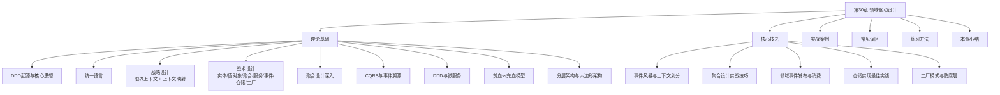

# 第30章 领域驱动设计

***

## 为什么需要领域驱动设计

软件开发的核心挑战从来不是技术本身，而是对业务领域的理解。当系统复杂度增长到一定程度时，技术团队与业务专家之间的沟通鸿沟会急剧扩大——开发人员用数据库表和API端点思考问题，业务人员用流程和规则描述世界，两者之间的翻译损耗成为项目失败的主要根源。

### 一个真实的故事

想象一个电商系统的演化过程：

**第一年**：三个人的小团队，业务简单，一个数据库搞定一切。订单表、用户表、商品表，清晰明了。

**第二年**：业务增长，开始加功能。VIP客户免运费、满减活动、优惠券叠加、预售定金、拼团……每个新规则都要在Controller里加判断，在Service里加计算，在DAO里加查询。没有人能说清"一个订单的完整创建流程到底涉及多少条业务规则"。

**第三年**：新来的开发者加入项目，产品经理说"这个促销活动应该只对新客生效"，开发者花了三天才搞清楚"新客"在代码里到底意味着什么——是注册时间小于30天？还是从未下过单？还是首单？代码里三种判断都有，散落在不同文件里。

**这就是"大泥球"（Big Ball of Mud）的典型症状**——业务逻辑散布在系统的每一个角落，没有人能掌控全局，每个改动都可能引发不可预见的连锁反应。

### DDD解决的核心问题

传统开发模式中，业务逻辑往往散布在服务层、数据访问层甚至前端代码中。一个简单的业务规则——比如"VIP客户下单满100元免运费"——可能需要修改Controller、Service、DAO三个层次的代码。随着规则数量增长，这种散布式设计导致的复杂度呈指数级增长。

DDD的核心主张是：**软件设计的复杂性应该由领域模型来管理**。

具体而言，DDD解决了三个层面的问题：

**认知层面——统一语言**：让开发者和业务专家使用同一套术语讨论系统。当产品经理说"订单已确认"，代码里必须有一个 `Order` 类，一个 `confirm()` 方法，两者含义完全一致。消除翻译损耗，让业务知识直接编码进系统。

**设计层面——领域模型**：将业务逻辑集中到领域模型中，而不是散布在各个技术层。订单的创建规则、验证逻辑、状态转换，全部封装在 `Order` 聚合中。改一个业务规则只需要改一个地方。

**架构层面——限界上下文**：将庞大的系统拆分为多个边界清晰的小系统，每个系统有自己的领域模型和统一语言。不同上下文中允许同一个词有不同含义——目录里的"产品"和库存里的"产品"是两个完全独立的概念。

### 适用场景与限制

DDD并非银弹，它最适合以下场景：

| 场景 | 适合程度 | 原因 |
|------|---------|------|
| 业务规则复杂的领域（金融、电商、医疗） | ★★★★★ | 领域模型能有效管理业务复杂度 |
| 多团队协作的大型系统 | ★★★★★ | 限界上下文为团队划分提供清晰边界 |
| 需要长期维护的核心业务系统 | ★★★★☆ | 充血模型内聚业务规则，降低维护成本 |
| 中等复杂度的业务系统 | ★★★☆☆ | 可选择性地应用部分DDD战术模式 |
| 简单的CRUD应用 | ★★☆☆☆ | 引入DDD会增加不必要的复杂度 |
| 技术驱动的系统（编解码、图像处理） | ★☆☆☆☆ | 领域模型价值有限，技术架构更重要 |
| 项目周期极短（如黑客松） | ★☆☆☆☆ | 建模投入的时间在短期项目中无法回收 |

**经验法则**：如果你的业务规则只需要一个Service方法就能搞定，DDD对你来说是过度设计。如果你发现一个业务操作需要理解5个以上Service、3个以上表的关系才能说清楚，DDD可能值得考虑。

### DDD的发展脉络

理解DDD的历史背景有助于把握其设计哲学：

- **2003年**：Eric Evans出版《Domain-Driven Design》，提出完整的方法论体系。这是DDD的奠基之作，奠定了战略设计（限界上下文、上下文映射）和战术设计（实体、值对象、聚合等）的完整框架。
- **2010年代**：随着微服务架构兴起，限界上下文作为服务边界的理论基础重新受到关注。Sam Newman的《Building Microservices》明确将限界上下文推荐为微服务划分的起点。
- **2013年**：Vaughn Vernon出版《Implementing Domain-Driven Design》，将Evans的理论转化为可操作的实践指南，对聚合设计、领域事件等战术模式做了深入阐述。
- **2016年**：Vernon的《DDD Distilled》出版，用精炼的语言为核心概念提供了快速入门路径。
- **2019年**：Alberto Brandolini出版《Introducing EventStorming》，将事件风暴确立为DDD领域建模的主流协作方法。

DDD不是过时的方法论——恰恰相反，在微服务、事件驱动架构盛行的今天，DDD的战略设计思想比以往任何时候都更有价值。

***

## 本章涵盖内容

本章从理论基础到实战应用，系统性地讲解DDD的核心概念与实践方法，共分为六个部分。

### 理论基础部分

**DDD的起源与核心思想**：从Eric Evans提出的四个核心洞见出发，理解DDD为何强调"模型即代码"，以及领域模型与传统UML图的本质区别。传统UML图是静态文档，画完就过时；DDD的领域模型是活的代码，随业务演进持续精炼。

**统一语言（Ubiquitous Language）**：这是DDD的基石。统一语言不是文档词汇表，而是活的语言——它存在于对话中、代码中、文档中、测试用例中。本节详细讲解统一语言的四个特征（精确性、完整性、一致性、可执行性）及其建立过程。核心观点：**如果一个术语只出现在文档中而不在代码中，它就不是统一语言的一部分。**

**战略设计**：关注系统的宏观结构，解决"如何将大系统拆成小系统"的问题。核心概念包括：
- **限界上下文（Bounded Context）**：DDD中最重要的战略概念，定义统一语言的边界。同一个词在不同上下文中可以有完全不同的含义，这是DDD对"单一模型"思路的根本性颠覆。
- **上下文映射（Context Map）**：描述限界上下文之间的9种集成模式（合作关系、共享内核、客户-供应商、跟随者、防腐层、开放主机服务、发布语言、各行其道、大泥球）
- **上下文映射的实践建议**：绘制映射图的具体步骤

**战术设计核心构建块**：深入讲解DDD的7个构建块：
- **实体（Entity）**：具有唯一标识的领域对象，封装业务行为。关键问题：在业务场景中，我们是否关心"它是谁"？
- **值对象（Value Object）**：通过属性值定义相等性的不可变对象。关键问题：我们是否只关心"它是什么"？
- **聚合（Aggregate）与聚合根（Aggregate Root）**：数据修改的一致性边界，包含Vaughn Vernon总结的5条设计规则。聚合是DDD中最核心也最容易被误用的概念。
- **领域服务（Domain Service）**：封装不属于任何单一领域对象的业务逻辑。核心判断标准：这个逻辑放在任何实体或值对象里都不合适吗？
- **领域事件（Domain Event）**：表示领域中已发生的有意义的事情。事件命名使用过去时态——`OrderPlaced`，不是 `PlaceOrder`。
- **仓储（Repository）**：聚合的持久化接口，向领域层隐藏数据存储细节。每个聚合根一个仓储。
- **工厂（Factory）**：封装复杂对象的创建逻辑。

**聚合设计的深入探讨**：包括Vernon的聚合设计10条原则，以及电商订单模型的正确/错误设计对比分析。聚合设计的常见陷阱：过度聚合导致性能问题和并发冲突，聚合过小导致业务不变量无法保证。

**DDD与CQRS/Event Sourcing**：讲解命令查询职责分离（CQRS）和事件溯源（Event Sourcing）与DDD的关系。CQRS解决"读写模型不同"的问题，Event Sourcing解决"需要完整审计历史"的问题。两者都是DDD的高级扩展，不是必选项。

**DDD与微服务**：限界上下文作为微服务边界的天然候选，上下文映射与微服务集成模式的对应关系。注意：一个限界上下文不等于一个微服务，限界上下文是逻辑边界，微服务是物理部署边界。

**贫血模型vs充血模型**：Martin Fowler指出的反模式与DDD主张的充血模型之间的对比。贫血模型中，`Order`类只有getter/setter，业务逻辑在`OrderService`中；充血模型中，`Order`类本身封装了创建、确认、取消等所有业务行为。代码示例和设计哲学分析。

**分层架构与六边形架构**：DDD推荐的四层架构（用户接口层→应用层→领域层→基础设施层）与Alistair Cockburn提出的六边形架构（端口与适配器模式）。核心原则：领域层不依赖任何外层，所有依赖方向指向领域层。

### 核心技巧部分

**限界上下文划分的实战方法**：
- **事件风暴（Event Storming）**：Alberto Brandolini发明的协作式建模方法。用橙色便签写领域事件，蓝色写聚合，粉色写命令，黄色写策略，紫色写读模型。5个具体步骤：识别领域事件→补充命令与聚合→识别限界上下文→设计上下文映射→精炼聚合设计。
- **子域分析**：核心域（业务核心竞争力，自研）、支撑域（非核心但必需，可选自研或外包）、通用域（所有业务都需要，用现成方案）。划分策略：先识别核心域，把最多资源投入核心域。
- **语言驱动划分**：通过分析统一语言发现上下文边界——当同一个术语在不同场景下含义不同，就是上下文的边界。

**聚合设计的实战技巧**：识别真正的不变量（强一致性vs最终一致性），小聚合的三种实现模式（聚合引用聚合根ID、通过领域事件协调、仓储查询辅助），聚合引用的设计，以及延迟加载陷阱。

**领域事件的发布与消费**：聚合内发布、仓储层发布两种模式，同步/异步消费方式，事件幂等处理。

**仓储实现的最佳实践**：与ORM集成、查询设计、规格模式（Specification）。

**工厂模式的应用**：聚合根创建工厂和重建工厂（用于从持久化存储重建聚合）的实现。

**防腐层的实现技巧**：防腐层的结构设计与具体实现。当下游需要集成一个你无法控制的外部系统（如遗留系统、第三方API）时，防腐层是保护你的领域模型不被污染的关键手段。

### 实战案例部分

通过一个完整的电商领域案例，展示如何从零开始运用DDD进行领域建模，包括限界上下文的识别、聚合的设计、领域事件的编排，以及最终的代码实现。

案例覆盖的核心流程：
1. 需求分析：从业务需求中提取领域概念
2. 战略建模：识别限界上下文、绘制上下文映射
3. 战术建模：设计实体、值对象、聚合
4. 代码实现：将领域模型转化为可执行代码
5. 持续精炼：根据新需求调整模型

### 常见误区部分

总结团队在采用DDD过程中最常见的反模式与陷阱：
- **过度设计**：在简单场景中引入完整的DDD战术模式。解药：DDD的引入应该是渐进式的，从最复杂的子域开始。
- **忽略统一语言**：开发者与业务专家使用不同的术语体系。解药：每次需求评审时，逐字确认每个术语的含义。
- **大聚合**：将过多对象放入一个聚合，导致性能问题和并发冲突。解药：问自己"这个对象真的需要在这个事务中保持一致吗？"
- **贫血模型**：领域对象退化为数据容器，业务逻辑散落到服务层。解药：把业务逻辑移到实体中，Service只负责协调。
- **忽略限界上下文**：试图用一个统一模型覆盖整个系统。解药：接受"同一个词可以有不同含义"，为不同场景建立独立的模型。

### 练习方法部分

从基础概念理解到动手实操、问题排查、性能优化、架构设计，提供渐进式的练习路径，帮助读者将理论知识转化为实践能力。

### 本章小结部分

回顾核心知识点，提炼关键公式与模型，提供最佳实践清单，并给出下一步学习建议。

***

## 本章学习目标

完成本章学习后，读者应能够：

1. **理解DDD的战略设计与战术设计的完整框架**——区分宏观的限界上下文划分与微观的聚合建模，知道何时用哪种工具
2. **掌握限界上下文的识别与划分方法**——运用事件风暴、子域分析、语言驱动三种方法，能够为一个现有系统划分限界上下文
3. **熟练运用实体、值对象、聚合等战术模式进行领域建模**——在代码中精确表达业务概念，能够从需求分析到代码实现完成一次完整的建模过程
4. **在实际项目中应用统一语言促进团队协作**——建立开发者与业务专家的共同语言，并确保术语在代码中得到一致体现
5. **识别并避免DDD实践中的常见反模式**——避免过度设计、大聚合、贫血模型等陷阱，知道何时该引入DDD、何时不该
6. **将DDD与微服务、CQRS等现代架构模式有机结合**——理解DDD在现代分布式系统中的定位，能判断项目是否需要引入CQRS或事件溯源

***

## 前置知识

本章假设读者已具备以下基础：

| 前置知识 | 来源 | 最低掌握程度 |
|---------|------|-------------|
| 分层架构和六边形架构的基本概念 | 第28章"架构风格" | 能区分两种架构的核心差异 |
| 面向对象设计原则 | 第29章"设计模式" | 理解封装、组合优于继承 |
| 数据库建模和API设计 | 项目经验 | 能设计基本的ER图和REST接口 |
| Java或C#语法 | 项目经验 | 能读懂本章的代码示例 |

如果对上述内容不够熟悉，建议先回顾相应章节再学习本章。

**关于编程语言**：本章的代码示例主要使用Java，但DDD的思想与语言无关。C#、TypeScript、Go、Python开发者同样适用——只需要将语法替换为你熟悉的语言即可。如果你不熟悉Java，建议关注代码背后的建模思想而非语法细节。

***

## 核心概念速查

在深入学习之前，先建立对关键术语的初步认知：

| 术语 | 英文 | 一句话定义 | 层级 |
|------|------|-----------|------|
| 领域 | Domain | 你的软件要解决的业务问题空间 | — |
| 限界上下文 | Bounded Context | 统一语言有且仅有一套含义的明确边界 | 战略 |
| 上下文映射 | Context Map | 描述多个限界上下文之间关系的全景图 | 战略 |
| 统一语言 | Ubiquitous Language | 开发者与业务专家共同建立并遵守的术语体系 | 战略 |
| 核心域 | Core Domain | 业务的核心竞争力，需投入最多资源 | 战略 |
| 支撑域 | Supporting Domain | 支撑核心域运行但非核心竞争力的业务功能 | 战略 |
| 通用域 | Generic Domain | 所有业务都需要的通用功能，可用现成方案 | 战略 |
| 实体 | Entity | 具有唯一标识、通过标识判断相等性的领域对象 | 战术 |
| 值对象 | Value Object | 无标识、通过属性值判断相等性的不可变领域对象 | 战术 |
| 聚合 | Aggregate | 一组相关对象的集合，作为数据修改的一致性边界 | 战术 |
| 聚合根 | Aggregate Root | 聚合的唯一入口，外部只能通过聚合根操作聚合 | 战术 |
| 领域服务 | Domain Service | 封装不属于任何单一领域对象的业务逻辑 | 战术 |
| 领域事件 | Domain Event | 表示领域中已发生的、对业务有意义的事实 | 战术 |
| 仓储 | Repository | 聚合的持久化接口，隐藏数据存储细节 | 战术 |
| 工厂 | Factory | 封装复杂对象创建逻辑的构建块 | 战术 |

> **阅读提示**：本速查表中的"层级"列区分了战略设计和战术设计两大类。战略设计关注系统间的边界划分（宏观），战术设计关注单个上下文内的模型设计（微观）。学习时建议先建立全局视野（战略），再深入细节（战术）。

***

## 关键参考文献

- Eric Evans, *Domain-Driven Design: Tackling Complexity in the Heart of Software*, Addison-Wesley, 2003 — DDD的奠基之作，提出了完整的方法论体系。重点阅读：Part II（战略设计）和Part IV（战术设计）
- Vaughn Vernon, *Implementing Domain-Driven Design*, Addison-Wesley, 2013 — 实战导向的DDD指南，对聚合设计有深入阐述。推荐作为日常参考手册
- Vaughn Vernon, *Domain-Driven Design Distilled*, Addison-Wesley, 2016 — DDD的精炼入门读物，适合快速掌握核心概念。推荐首次接触DDD的读者从这本书开始
- Martin Fowler, *Patterns of Enterprise Application Architecture*, Addison-Wesley, 2002 — 提出了贫血模型的概念和分层架构模式。理解DDD前最好先了解这本书中的反模式
- Alberto Brandolini, *Introducing EventStorming*, Leanpub, 2019 — 事件风暴方法的完整指南。掌握事件风暴后，团队协作建模的效率会显著提升
- Sam Newman, *Building Microservices*, O'Reilly, 2021 — 第二版新增了限界上下文与微服务划分的详细讨论，是理解DDD在微服务中应用的重要参考

**推荐阅读顺序**：
1. 先读 Vernon 的 *DDD Distilled*（快速入门，2-3天可读完）
2. 再读 Evans 的原著（深入理解思想来源，1-2周）
3. 同时参考 Fowler 的 *PoEAA*（理解DDD要解决的问题）
4. 实践时参考 Vernon 的 *IDDD*（操作层面的指导）

***

## 章节结构导览

**各部分的阅读优先级**（建议顺序）：

| 优先级 | 部分 | 预计时间 | 目标 |
|--------|------|---------|------|
| P0（必读） | 战略设计 + 统一语言 | 30-40分钟 | 建立全局视野，理解"为什么" |
| P0（必读） | 战术设计核心构建块 | 40-60分钟 | 掌握实体/值对象/聚合的设计方法 |
| P1（重要） | 聚合设计深入 + 实战技巧 | 30-40分钟 | 深入理解最容易出错的部分 |
| P2（进阶） | CQRS/事件溯源 + 微服务 | 20-30分钟 | 了解DDD的高级扩展 |
| P1（重要） | 实战案例 | 30-40分钟 | 将理论串联为完整的建模过程 |
| P2（进阶） | 常见误区 | 15-20分钟 | 避坑指南，建议学完后回来对照 |

***

## 学习路径建议

**入门读者**（首次接触DDD）：建议按章节顺序完整阅读，重点关注统一语言、限界上下文、实体与值对象的概念理解。不要急于学习CQRS/事件溯源等高级主题。完成每一节后，尝试用自己熟悉的业务场景（如外卖点餐、打车出行）做概念映射练习。

**有经验读者**（了解DDD基础）：可以直接跳到核心技巧部分，重点关注聚合设计实战、领域事件发布模式、防腐层实现等实操内容。建议带着一个真实项目中的痛点问题来阅读，边读边思考"这个方法能否解决我的问题"。

**团队负责人**：重点阅读战略设计部分（限界上下文划分、上下文映射）和DDD与微服务的关系，这些内容直接影响团队组织和技术架构决策。同时关注统一语言的建立方法——这是团队协作效率的关键杠杆。

**架构师**：关注DDD与微服务、CQRS/Event Sourcing的结合，以及分层架构与六边形架构的选择。理解DDD在大型系统中的定位，以及如何在现有系统中渐进式引入DDD。

***

## DDD核心原则速记

在开始深入学习之前，先记住这六条核心原则。它们是贯穿整个DDD方法论的指导思想：

1. **模型即代码**：领域模型不是文档，是代码本身。任何模型的变更都直接体现为代码变更。
2. **统一语言优先**：在写第一行代码之前，先和业务专家建立共同的术语体系。
3. **限界上下文隔离**：不要试图用一个模型覆盖整个系统。接受不同场景有不同的模型。
4. **聚合守护不变量**：聚合是一致性边界的最小单元，不是关联关系的最小单元。
5. **小聚合优于大聚合**：聚合越大，并发冲突越多，性能越差。只保留真正需要强一致性的对象在同一个聚合中。
6. **渐进式引入**：DDD不是全有或全无的。可以从一个核心子域开始，逐步扩展到其他子域。
