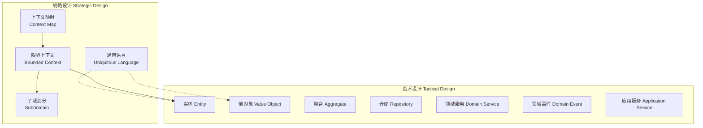
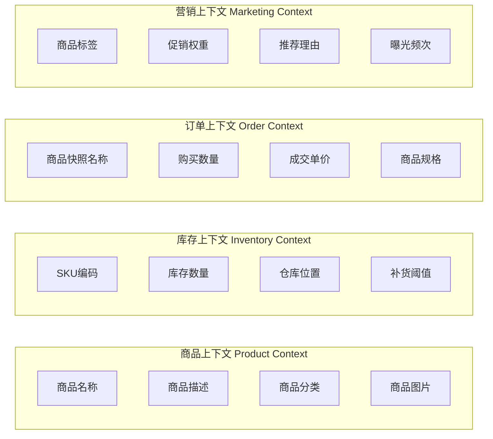
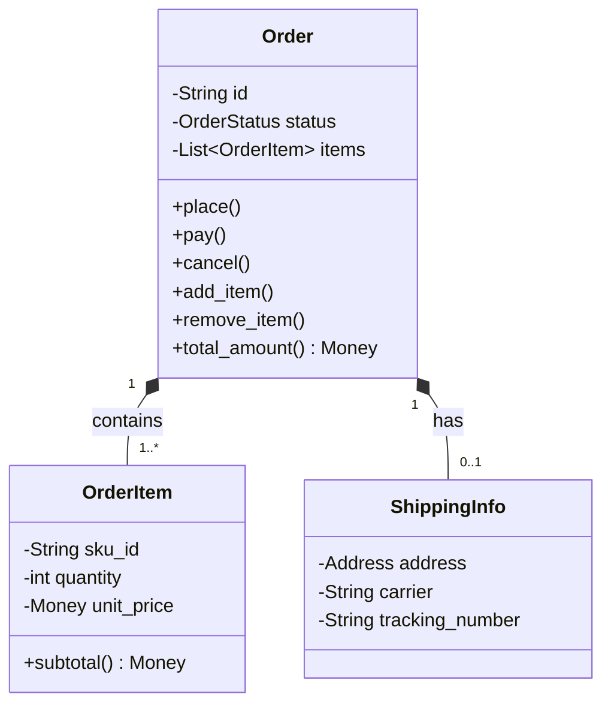
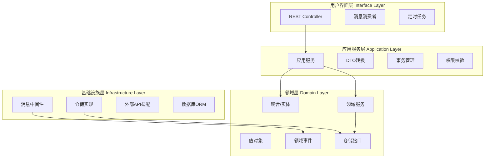

## 领域驱动设计的理论基础

### 1. DDD的起源与核心哲学

#### 1.1 什么是领域驱动设计

领域驱动设计（Domain-Driven Design，简称DDD）是由Eric Evans在其2003年的著作《Domain-Driven Design: Tackling Complexity in the Heart of Software》中首次系统提出的一套软件设计方法论。其核心思想可以用一句话概括：**软件的核心复杂性在于业务领域本身，而非技术实现**。

传统的软件开发往往从技术视角出发——先设计数据库表结构，再编写CRUD接口，最后才考虑业务逻辑。这种"数据驱动"的方式在简单系统中尚可应付，但当业务规则变得复杂时（例如金融领域的合规计算、电商平台的促销引擎、医疗系统的诊断流程），技术架构与业务模型之间的鸿沟会越来越大，最终导致：

- **代码与业务脱节**：开发者无法从代码中理解业务意图
- **沟通障碍**：技术人员与业务专家使用不同的术语体系
- **维护噩梦**：每次业务变更都需要在多处修改代码，且难以评估影响范围

DDD的哲学正是要解决这些问题。它要求开发团队以**领域**（即软件所服务的业务问题空间）为出发点，建立一套贯穿业务、设计、代码的统一模型。

#### 1.2 DDD的两大支柱

DDD可以划分为两大互补的层面：



- **战略设计（Strategic Design）**：关注宏观层面，处理如何将大型系统拆分为多个有界区域、如何定义团队边界、如何管理模型之间的集成关系。这是DDD区别于其他设计方法的关键所在——大多数方法论只关注代码层面的战术模式，而忽略了组织和系统边界的规划。

- **战术设计（Tactical Design）**：关注微观层面，提供了一套构建领域模型的代码级模式（实体、值对象、聚合等），确保模型在代码中得到精确表达。

#### 1.3 DDD适用的场景

DDD并非银弹，它有明确的适用边界：

| 场景特征 | 是否适合DDD | 原因 |
|---------|------------|------|
| 业务规则复杂，有丰富的领域逻辑 | ✅ 非常适合 | DDD的核心价值就在于管理复杂性 |
| 团队规模较大（10+人），需要明确分工 | ✅ 适合 | 战略设计提供了天然的团队边界 |
| CRUD为主的简单应用 | ❌ 不适合 | 过度设计，引入不必要的复杂度 |
| 技术驱动的系统（如基础设施中间件） | ⚠️ 部分适用 | 可借鉴战术模式，但战略设计意义不大 |
| 快速原型/MVP | ❌ 不适合 | DDD需要前期投入，不适合快速验证 |
| 领域规则频繁变化的系统 | ✅ 非常适合 | 稳定的模型能更好地吸收变化 |

---

### 2. 通用语言：DDD的根基

#### 2.1 为什么需要通用语言

通用语言（Ubiquitous Language）是DDD中最具变革性的概念。它要求**开发者和业务专家使用完全相同的术语**，且这套术语贯穿于口头讨论、文档、代码、数据库字段的所有环节。

想象一个电商系统的例子。没有通用语言时：

- 业务专家说"订单"，开发者理解为数据库中的一条`orders`记录
- 业务专家说"下单"，开发者理解为`INSERT INTO orders`
- 业务专家说"取消订单需要退款"，开发者写了一个`cancel_order()`函数去删记录

问题在于：**"订单"在业务中是一个有生命周期的实体**（创建→支付→发货→签收→完成/取消），它携带的业务规则远超一条数据库记录所能表达的内容。

通用语言的建立要求开发者**深入业务领域**，与业务专家反复对话，提炼出精确的术语体系：

订单（Order）         → 一次购买交易的完整记录
订单项（OrderItem）   → 订单中的单个商品及其数量、价格
订单状态（OrderStatus）→ 订单在生命周期中所处的阶段
下单（PlaceOrder）    → 从购物车生成订单并锁定库存
发货（ShipOrder）     → 为订单分配物流并更新状态
取消（CancelOrder）   → 终止订单，触发库存释放和退款流程

#### 2.2 通用语言的实践准则

**准则一：术语必须在代码中直接体现**

```python
# ❌ 错误：代码使用技术术语，与业务语言脱节
def process_order(data):
    data['status'] = 2
    db.update('orders', data)

# ✅ 正确：代码直接使用通用语言
class Order:
    def ship(self, shipping_info: ShippingInfo):
        """将订单状态从待发货变更为已发货"""
        if self.status != OrderStatus.PAID:
            raise InvalidOrderStateError(
                f"只有已支付的订单才能发货，当前状态: {self.status}"
            )
        self.status = OrderStatus.SHIPPED
        self.shipping = shipping_info
        self.add_event(OrderShippedEvent(self.id, shipping_info))
```

**准则二：术语在团队内部必须一致**

建立一份团队共享的术语表（Glossary），并确保所有成员遵守。当发现术语存在歧义时，必须立即讨论并统一。

| 术语 | 定义 | 易混淆概念 | 边界说明 |
|------|------|-----------|---------|
| 订单（Order） | 一次完整的购买交易记录 | 购物车（Cart） | 购物车是订单的前置状态，确认支付后才转化为订单 |
| 优惠券（Coupon） | 可抵扣金额的凭证 | 折扣（Discount） | 优惠券需要主动领取使用，折扣直接生效 |
| SKU | 最小库存单位，对应具体规格的商品 | SPU | SPU是商品品类，一个SPU下有多个SKU |

**准则三：领域专家的参与是必须的**

DDD要求开发团队与领域专家（Domain Expert）建立持续合作关系。领域专家不一定是产品经理——他们可以是业务部门的资深员工、财务人员、风控专家等。关键在于他们**深刻理解业务规则和约束**。

---

### 3. 战略设计：划清边界

#### 3.1 子域（Subdomain）

任何业务系统都可以被分解为若干子域。子域有三种类型：

**核心子域（Core Domain）**

这是业务的核心竞争力所在，是企业最擅长且最需要投入资源的地方。核心子域的模型设计应当最为精细，代码质量要求最高。

示例：电商平台
├── 核心子域：商品推荐引擎、动态定价系统、供应链调度
├── 支撑子域：订单管理、库存管理、用户账户
└── 通用子域：日志系统、权限管理、消息通知

**支撑子域（Supporting Subdomain）**

支撑子域虽然不构成核心竞争力，但也没有现成的通用方案，需要定制开发。其精细度可以低于核心子域，但仍然需要领域建模。

**通用子域（Generic Subdomain）**

通用子域是所有系统都可能需要的功能，如身份认证、邮件发送、文件存储等。对于通用子域，应当优先使用现成的开源方案或SaaS服务，而非自行开发。

子域划分的关键原则：**不要让核心子域的模型侵入到通用子域中，反之亦然**。每个子域应当有自己独立的模型。

#### 3.2 限界上下文（Bounded Context）

限界上下文是DDD战略设计中最核心的概念。它定义了**一个模型的有效边界**——在同一个限界上下文内，每个术语有且只有一个明确的含义；跨过边界后，同一个术语可以有完全不同的含义。

以"商品"为例，在不同限界上下文中的含义差异：



限界上下文的划分维度通常包括：

- **业务语义边界**：当同一个词在不同场景中含义不同时，需要划分上下文
- **团队边界**：每个限界上下文最好对应一个团队（康威定律）
- **技术边界**：不同的限界上下文可以采用不同的技术栈
- **部署边界**：每个限界上下文应能独立部署

#### 3.3 上下文映射（Context Map）

当系统由多个限界上下文组成时，上下文之间的关系需要被明确定义。Eric Evans定义了以下几种映射模式：

| 映射模式 | 含义 | 适用场景 | 典型案例 |
|---------|------|---------|---------|
| 共享内核（Shared Kernel） | 两个上下文共享一部分模型 | 关系紧密、信任度高的团队 | 订单上下文和支付上下文共享"金额"值对象 |
| 客户-供应商（Customer-Supplier） | 下游依赖上游，上游对下游有承诺 | 上下游有明确的供给关系 | 订单上下文（客户）依赖商品上下文（供应商）提供价格信息 |
| 跟随者（Conformist） | 下游完全接受上游的模型 | 弱势下游无法要求上游改变 | 第三方支付接口，只能按对方的数据格式适配 |
| 防腐层（Anti-Corruption Layer, ACL） | 在下游建立隔离层，将外部模型翻译为内部模型 | 需要与遗留系统或第三方系统集成 | 对接旧的ERP系统时，用ACL将ERP的数据格式转为新系统的模型 |
| 开放主机服务（Open Host Service） | 上游以标准化协议（REST/gRPC）暴露服务 | 一对多的服务提供 | 商品中心以REST API向外提供商品查询服务 |
| 各行其道（Separate Ways） | 两个上下文完全独立，不集成 | 业务上无关联 | 内部OA系统与面向客户的电商平台 |
| 发布语言（Published Language） | 使用标准化的数据格式进行交换 | 需要跨平台/跨组织集成 | 使用JSON Schema定义API契约 |

**上下文映射的实践原则**：

- 优先选择"客户-供应商"或"开放主机服务"模式，它们的协作关系最清晰
- 对于遗留系统集成，防腐层几乎是唯一正确选择——不要让遗留系统的数据模型污染新系统
- 共享内核需要极高的团队协作能力，容易演变为紧耦合，慎用

---

### 4. 战术设计：构建领域模型

#### 4.1 实体（Entity）

实体是具有**唯一标识**的领域对象。两个实体即使所有属性完全相同，只要标识不同，就是不同的实体。实体的核心特征是：

- **有生命周期**：创建、修改、消亡
- **唯一标识**：通过ID而非属性来区分
- **可变性**：状态会随时间变化

```python
from datetime import datetime
from typing import Optional
import uuid

class Order:
    """订单实体 —— 具有唯一标识和生命周期"""
    
    def __init__(self, order_id: str, customer_id: str, items: list[OrderItem]):
        self._id = order_id
        self._customer_id = customer_id
        self._items = items
        self._status = OrderStatus.CREATED
        self._created_at = datetime.now()
        self._events: list[DomainEvent] = []
    
    @property
    def id(self) -> str:
        return self._id
    
    def place(self):
        """下单 —— 从创建态转为已下单态"""
        if not self._items:
            raise EmptyOrderError("订单不能为空")
        self._status = OrderStatus.PLACED
        self._events.append(OrderPlacedEvent(
            order_id=self._id,
            customer_id=self._customer_id,
            total=self.total_amount()
        ))
    
    def pay(self, payment_id: str):
        """支付 —— 关联支付记录"""
        if self._status != OrderStatus.PLACED:
            raise InvalidOrderStateError("只有已下单的订单才能支付")
        self._status = OrderStatus.PAID
        self._events.append(OrderPaidEvent(self._id, payment_id))
    
    def cancel(self, reason: str):
        """取消 —— 需要满足业务约束"""
        if self._status in (OrderStatus.SHIPPED, OrderStatus.COMPLETED):
            raise InvalidOrderStateError("已发货或已完成的订单不能取消")
        self._status = OrderStatus.CANCELLED
        self._events.append(OrderCancelledEvent(self._id, reason))
    
    def total_amount(self) -> Money:
        """计算订单总金额 —— 业务规则内聚在实体中"""
        return sum(item.subtotal() for item in self._items)
    
    def add_event(self, event: DomainEvent):
        self._events.append(event)
    
    def collect_events(self) -> list[DomainEvent]:
        events = self._events.copy()
        self._events.clear()
        return events
```

**实体设计的要点**：

- **ID的设计**：优先使用业务有意义的ID（如订单号`ORD-20260626-001`），而非纯UUID。业务ID可在调试和日志中直接提供信息
- **行为内聚**：状态变更的业务规则应当封装在实体内部，而非散落在各个Service中
- **不变量（Invariant）保护**：实体的每个方法都应当确保对象在方法执行后处于合法状态

#### 4.2 值对象（Value Object）

值对象是通过**属性值**来判断相等性的不可变对象。它没有唯一标识，两个值对象只要属性完全相同就视为相等。

```python
from dataclasses import dataclass, field
from decimal import Decimal

@dataclass(frozen=True)  # frozen=True 确保不可变
class Money:
    """金额值对象 —— 不可变，通过值判断相等"""
    amount: Decimal
    currency: str = "CNY"
    
    def __post_init__(self):
        if self.amount < 0:
            raise ValueError(f"金额不能为负数: {self.amount}")
        if len(self.currency) != 3:
            raise ValueError(f"货币代码必须是3位ISO代码: {self.currency}")
    
    def add(self, other: 'Money') -> 'Money':
        if self.currency != other.currency:
            raise CurrencyMismatchError(
                f"不能直接相加不同货币: {self.currency} + {other.currency}"
            )
        return Money(self.amount + other.amount, self.currency)
    
    def multiply(self, factor: Decimal) -> 'Money':
        return Money(self.amount * factor, self.currency)
    
    def __str__(self) -> str:
        return f"{self.currency} {self.amount}"

@dataclass(frozen=True)
class Address:
    """地址值对象"""
    province: str
    city: str
    district: str
    street: str
    zip_code: str
    
    def full_address(self) -> str:
        return f"{self.province}{self.city}{self.district}{self.street}"
```

**实体 vs 值对象的判断标准**：

| 特征 | 实体 | 值对象 |
|------|------|--------|
| 唯一标识 | ✅ 有 | ❌ 无 |
| 可变性 | ✅ 可变 | ❌ 不可变 |
| 相等判断 | 比较ID | 比较所有属性 |
| 生命周期 | 有 | 无（随时可替换） |
| 典型示例 | 订单、用户、商品 | 金额、地址、日期范围 |

**什么时候应该用值对象而非实体**：当你不需要追踪一个对象的历史变化，只需要知道它当前的值时，优先使用值对象。值对象更简单、更安全、更容易测试。

#### 4.3 聚合（Aggregate）

聚合是DDD战术设计中最重要也最难掌握的概念。聚合是一组**保持一致性**的对象集合，它定义了一致性边界——聚合内部的状态在每次事务后必须保持一致（不变量约束），聚合外部的操作只能通过聚合根（Aggregate Root）进行。



上图中，`Order`是聚合根，`OrderItem`和`ShippingInfo`是聚合内部的实体和值对象。外部代码不能直接操作`OrderItem`——必须通过`Order`的方法来增删订单项：

```python
class Order:
    """订单聚合根"""
    
    def add_item(self, sku_id: str, quantity: int, unit_price: Money):
        """添加订单项 —— 聚合根控制内部一致性"""
        # 不变量检查：单个商品数量不超过上限
        if quantity > 99:
            raise QuantityLimitExceededError(f"单个商品最多购买99件，当前: {quantity}")
        
        # 不变量检查：订单项不超过上限
        if len(self._items) >= 50:
            raise OrderItemLimitExceededError("单笔订单最多包含50个商品")
        
        # 不变量检查：同一SKU不能重复添加
        for item in self._items:
            if item.sku_id == sku_id:
                item.increase_quantity(quantity)
                return
        
        self._items.append(OrderItem(sku_id, quantity, unit_price))
    
    def remove_item(self, sku_id: str):
        """移除订单项"""
        original_count = len(self._items)
        self._items = [item for item in self._items if item.sku_id != sku_id]
        if len(self._items) == original_count:
            raise OrderItemNotFoundError(f"订单中不存在SKU: {sku_id}")
        # 不变量检查：订单至少有一个商品
        if not self._items:
            raise EmptyOrderError("订单至少需要一个商品，如需取消请使用cancel方法")
```

**聚合设计的黄金原则**：

- **聚合尽量小**：每个聚合只包含保证一次事务一致性的最小对象集合。大聚合会导致并发冲突和性能问题
- **通过ID引用其他聚合**：聚合之间不要直接持有对象引用，而是通过ID引用。例如，`Order`中存储`customer_id`而非完整的`Customer`对象
- **聚合内使用立即加载，聚合间使用延迟加载**：加载聚合时，必须将聚合内的所有对象一次性加载完毕
- **一次事务只修改一个聚合**：跨聚合的一致性通过最终一致性和领域事件来保证

#### 4.4 仓储（Repository）

仓储是聚合的持久化抽象，它隐藏了底层存储的实现细节，为领域层提供类似集合的接口。

```python
from abc import ABC, abstractmethod

class OrderRepository(ABC):
    """订单仓储 —— 领域层的抽象接口"""
    
    @abstractmethod
    def find_by_id(self, order_id: str) -> Order | None:
        """根据ID查找订单"""
        ...
    
    @abstractmethod
    def find_by_customer(self, customer_id: str) -> list[Order]:
        """查找客户的全部订单"""
        ...
    
    @abstractmethod
    def save(self, order: Order) -> None:
        """保存订单（新增或更新）"""
        ...
    
    @abstractmethod
    def next_id(self) -> str:
        """生成下一个订单ID"""
        ...


class SqlOrderRepository(OrderRepository):
    """基于SQL的仓储实现 —— 基础设施层"""
    
    def __init__(self, session: DatabaseSession):
        self._session = session
    
    def find_by_id(self, order_id: str) -> Order | None:
        row = self._session.execute(
            "SELECT * FROM orders WHERE id = ?", (order_id,)
        ).fetchone()
        if not row:
            return None
        return self._map_to_domain(row)
    
    def save(self, order: Order) -> None:
        self._session.execute(
            "INSERT INTO orders (id, customer_id, status, created_at) VALUES (?, ?, ?, ?)",
            (order.id, order.customer_id, order.status.value, order.created_at)
        )
        for item in order.items:
            self._session.execute(
                "INSERT INTO order_items (order_id, sku_id, quantity, unit_price) VALUES (?, ?, ?, ?)",
                (order.id, item.sku_id, item.quantity, item.unit_price.amount)
            )
        self._session.commit()
    
    def _map_to_domain(self, row: dict) -> Order:
        """将数据库行映射为领域对象"""
        items = [
            OrderItem(row['sku_id'], row['quantity'], Money(Decimal(row['unit_price'])))
            for row in self._session.execute(
                "SELECT * FROM order_items WHERE order_id = ?", (row['id'],)
            ).fetchall()
        ]
        return Order(row['id'], row['customer_id'], items)
```

**仓储的设计原则**：

- 接口定义在领域层，实现在基础设施层（依赖倒置原则）
- 一个聚合对应一个仓储，仓储只负责聚合根的持久化
- 仓储不包含业务逻辑，只负责对象与存储之间的映射
- 查询方法返回完整的聚合对象，而非部分数据

#### 4.5 领域服务（Domain Service）

有些业务逻辑不属于任何一个实体或值对象——它涉及多个聚合的协作，或需要外部信息才能完成。这种逻辑应当封装在领域服务中。

```python
class OrderPricingService:
    """订单定价服务 —— 封装跨聚合的定价逻辑"""
    
    def __init__(self, coupon_repo: CouponRepository, 
                 pricing_policy: PricingPolicy):
        self._coupon_repo = coupon_repo
        self._pricing_policy = pricing_policy
    
    def calculate_total(self, order: Order, 
                       applied_coupons: list[str]) -> OrderPricingResult:
        """计算订单总价，包含优惠券折扣"""
        # 1. 计算商品原价小计
        subtotal = order.total_amount()
        
        # 2. 计算平台折扣
        platform_discount = self._pricing_policy.calculate_discount(order)
        
        # 3. 计算优惠券折扣
        coupon_discount = Money(Decimal("0"))
        for coupon_id in applied_coupons:
            coupon = self._coupon_repo.find_by_id(coupon_id)
            if coupon and coupon.is_valid(order):
                coupon_discount = coupon_discount.add(
                    coupon.calculate_discount(subtotal)
                )
        
        # 4. 计算最终金额
        total = subtotal.amount - platform_discount.amount - coupon_discount.amount
        total = max(total, Decimal("0.01"))  # 不变量：实付金额至少0.01元
        
        return OrderPricingResult(
            subtotal=subtotal,
            platform_discount=platform_discount,
            coupon_discount=coupon_discount,
            total=Money(total, subtotal.currency)
        )
```

**领域服务 vs 应用服务**：

| 特征 | 领域服务 | 应用服务 |
|------|---------|---------|
| 所在层 | 领域层 | 应用层 |
| 职责 | 封装不含实体内的业务逻辑 | 编排用例流程，协调技术关注点 |
| 是否感知基础设施 | 否 | 是（事务、消息、权限等） |
| 示例 | 订单定价、物流路线计算 | 创建订单的完整流程（校验→定价→持久化→发消息） |
| 依赖 | 依赖领域模型和仓储接口 | 依赖仓储、消息队列、事务管理器等 |

#### 4.6 领域事件（Domain Event）

领域事件表示领域中发生的有意义的事情。它是一种解耦聚合之间通信的机制——当一个聚合的状态发生变化时，发布领域事件，其他聚合通过订阅事件来做出响应。

```python
from dataclasses import dataclass
from datetime import datetime

@dataclass(frozen=True)
class OrderPaidEvent:
    """订单已支付事件"""
    order_id: str
    customer_id: str
    total_amount: Money
    occurred_at: datetime = field(default_factory=datetime.now)

@dataclass(frozen=True)
class OrderCancelledEvent:
    """订单已取消事件"""
    order_id: str
    reason: str
    occurred_at: datetime = field(default_factory=datetime.now)


class InventoryAdjustmentHandler:
    """库存调整处理器 —— 订阅订单事件调整库存"""
    
    def __init__(self, inventory_repo: InventoryRepository):
        self._inventory_repo = inventory_repo
    
    def handle_order_paid(self, event: OrderPaidEvent):
        """订单支付后扣减库存（悲观扣减）"""
        order = self._order_repo.find_by_id(event.order_id)
        for item in order.items:
            self._inventory_repo.decrement(item.sku_id, item.quantity)
    
    def handle_order_cancelled(self, event: OrderCancelledEvent):
        """订单取消后恢复库存"""
        order = self._order_repo.find_by_id(event.order_id)
        for item in order.items:
            self._inventory_repo.increment(item.sku_id, item.quantity)
```

**领域事件的设计原则**：

- 事件名称采用过去时（`OrderPaid`而非`PayOrder`），表示已经发生的事情
- 事件应当携带足够的信息，让订阅者无需回调就能完成处理
- 事件是不可变的值对象，只记录事实，不包含行为
- 同步事件用于同一限界上下文内的即时响应，异步事件用于跨上下文的最终一致性

---

### 5. 分层架构：组织代码结构

DDD推荐的分层架构（又称"洋葱架构"或"六边形架构"的变体）如下：



**各层职责**：

- **用户界面层（Interface Layer）**：接收外部请求，参数校验，将请求转换为应用服务的输入DTO。这一层不包含任何业务逻辑。
- **应用服务层（Application Layer）**：编排用例流程。它协调领域对象完成业务操作，管理事务边界，处理横切关注点（日志、权限、审计）。应用服务本身不包含业务规则。
- **领域层（Domain Layer）**：DDD的核心层。所有业务规则和领域模型都在这里定义。这一层不依赖任何其他层（依赖倒置）。
- **基础设施层（Infrastructure Layer）**：提供技术实现，包括数据库访问、消息发送、外部服务调用等。这一层实现领域层定义的接口。

**关键约束：依赖方向只能从外向内**。用户界面层依赖应用服务层，应用服务层依赖领域层，但领域层绝不依赖基础设施层。这意味着领域模型可以在不启动数据库、不连接消息队列的情况下独立运行和测试。

---

### 6. 关键设计原则

#### 6.1 不变量（Invariant）与一致性

不变量是在聚合的所有合法状态下都必须为真的条件。它不是代码层面的校验，而是业务规则的直接体现。

```python
class BankAccount:
    """银行账户聚合根"""
    
    def __init__(self, account_id: str, balance: Money):
        self._id = account_id
        self._balance = balance
        self._status = AccountStatus.ACTIVE
        self._daily_withdrawn = Money(Decimal("0"))
    
    def withdraw(self, amount: Money):
        # 不变量1：账户必须处于活跃状态
        if self._status != AccountStatus.ACTIVE:
            raise InactiveAccountError("只有活跃账户才能取款")
        
        # 不变量2：余额不能为负
        if self._balance.amount < amount.amount:
            raise InsufficientBalanceError(
                f"余额不足: 需要{amount}, 当前余额{self._balance}"
            )
        
        # 不变量3：单日累计取款不超过限额
        new_daily_total = self._daily_withdrawn.add(amount)
        if new_daily_total.amount > Decimal("50000"):
            raise DailyLimitExceededError(
                f"单日累计取款不超过50000元，今日已取{self._daily_withdrawn}"
            )
        
        # 所有不变量通过后，才执行状态变更
        self._balance = self._balance.amount - amount
        self._daily_withdrawn = self._daily_withdrawn.add(amount)
        self._events.append(WithdrawalEvent(self._id, amount))
```

#### 6.2 命令与查询分离（CQRS思想的简化应用）

在战术设计中，可以借鉴CQRS的思想来区分修改状态的操作和读取状态的操作：

- **命令（Command）**：改变系统状态的操作，返回值通常是void或执行结果，如`PlaceOrder`、`CancelOrder`
- **查询（Query）**：读取系统状态的操作，无副作用，返回数据，如`GetOrderById`、`ListCustomerOrders`

这种区分有助于明确每个操作的职责，并为后续引入CQRS架构模式打下基础。

#### 6.3 工厂与构建器

当聚合的创建过程复杂时（需要初始化多个子对象、计算初始状态），应当使用工厂方法或构建器模式：

```python
class OrderFactory:
    """订单工厂 —— 封装复杂的订单创建逻辑"""
    
    def __init__(self, id_generator: IdGenerator, 
                 pricing_service: OrderPricingService):
        self._id_gen = id_generator
        self._pricing = pricing_service
    
    def create_from_cart(self, cart: ShoppingCart, 
                         customer_id: str) -> Order:
        """从购物车创建订单"""
        # 1. 生成订单ID
        order_id = self._id_gen.next_order_id()
        
        # 2. 将购物车商品转换为订单项
        items = [
            OrderItem(
                sku_id=cart_item.sku_id,
                quantity=cart_item.quantity,
                unit_price=cart_item.current_price
            )
            for cart_item in cart.items
        ]
        
        # 3. 创建订单对象
        order = Order(order_id, customer_id, items)
        
        # 4. 应用业务规则
        order.place()
        
        return order
```

---

### 7. 常见误区与纠正

| 误区 | 错误做法 | 正确做法 |
|------|---------|---------|
| 把贫血模型当DDD | 实体只有getter/setter，所有逻辑放在Service中 | 实体应包含核心业务规则和状态变更逻辑 |
| 过度设计 | 为简单CRUD系统创建完整DDD分层 | 先判断复杂度，简单的系统用传统MVC即可 |
| 聚合过大 | 一个聚合包含整个子域的所有实体 | 聚合应只包含必须保证事务一致性的最小对象集合 |
| 忽略限界上下文 | 全系统共用一套模型 | 不同上下文可以有同名但不同含义的模型 |
| 仓储变Service | 在Repository中编写业务逻辑 | Repository只负责持久化，不含业务规则 |
| 忽略通用语言 | 代码中充斥技术术语而非业务术语 | 代码中的类名、方法名、变量名都应使用通用语言 |
| 跨聚合直接引用 | Order中直接持有Customer对象 | Order中只存储customer_id，需要时通过仓储查询 |

---

### 8. 总结

领域驱动设计的理论基础可以概括为三个层次：

1. **哲学层**：业务复杂性是软件的核心挑战，技术只是实现手段。这要求开发者从"技术思维"转向"业务思维"。

2. **战略层**：通过子域划分、限界上下文和上下文映射，将大型系统分解为可管理的单元，明确团队边界和模型边界。

3. **战术层**：通过实体、值对象、聚合、仓储、领域服务、领域事件等模式，在代码中精确表达业务模型，确保代码是业务逻辑的忠实映射。

DDD的实施需要持续的学习和实践。它不是一个可以一步到位的方法论，而是一种需要在整个团队中逐步建立的思维方式。关键在于：**让代码说业务的语言，让模型驱动技术的决策**。
