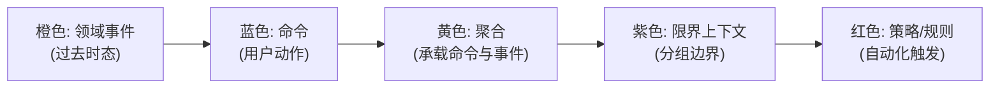
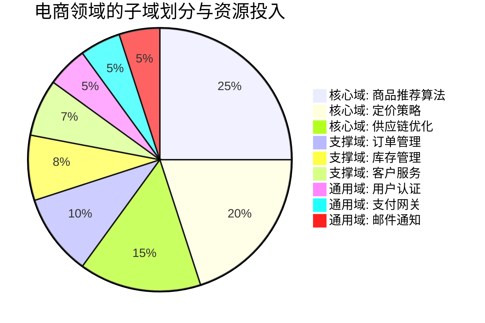
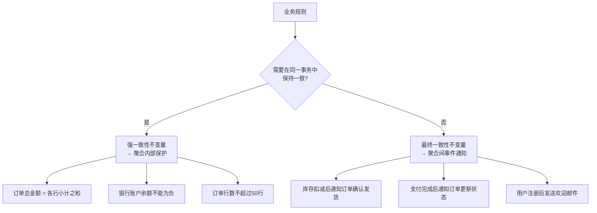
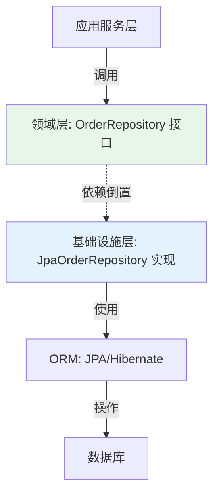
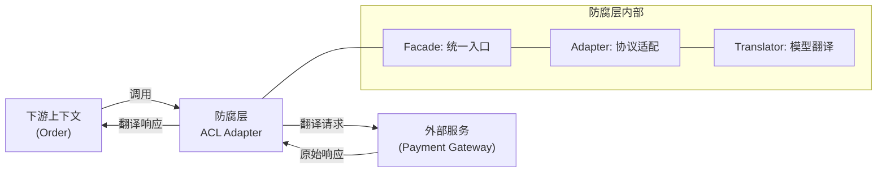
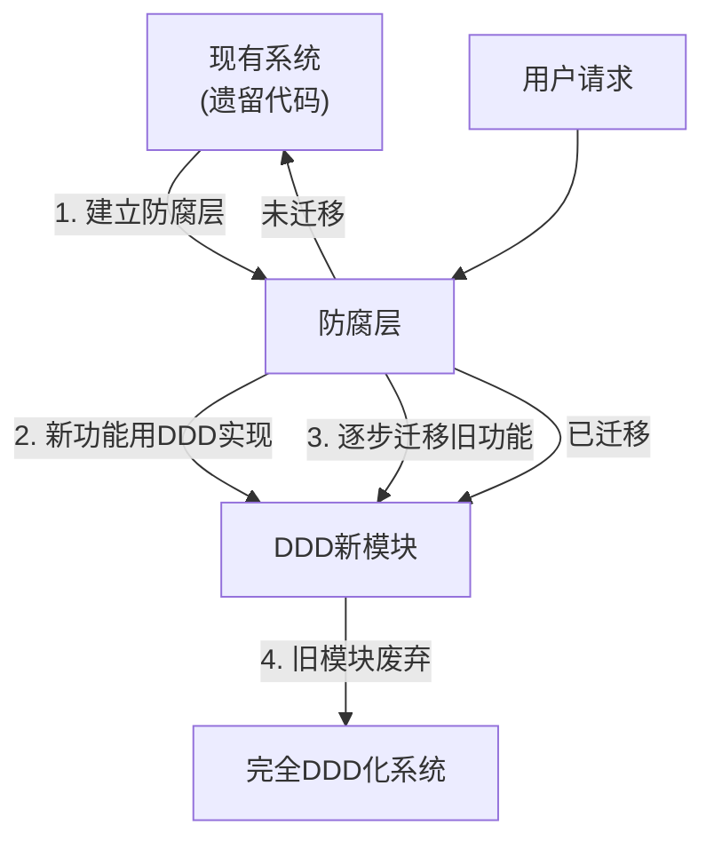
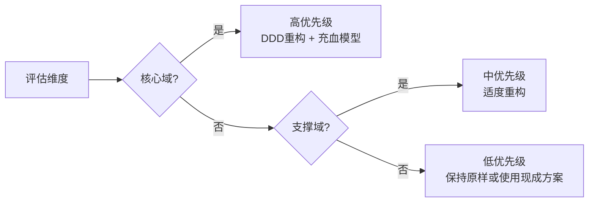

## 核心技巧

理论基础为你揭示了DDD的"是什么"和"为什么"，本节则深入"怎么做"。我们将逐一拆解DDD实践中最关键的技巧——从限界上下文划分到聚合设计，从领域事件到仓储实现，每一个技巧都配有可直接落地的代码示例和经过验证的实践模式。

---

## 30.1 限界上下文划分的实战方法

限界上下文是DDD战略设计的核心决策。划分得当，系统天然具有良好的可维护性和可扩展性；划分失误，则会制造出更多耦合和混乱。以下是三种经过实战验证的划分方法。

### 30.1.1 事件风暴（Event Storming）

事件风暴是由Alberto Brandolini在2013年发明的协作式建模方法，是发现限界上下文最有效的工具之一。它的核心思想是让业务专家和开发者在一面大墙上，用便利贴共同梳理业务流程，通过可视化的方式暴露隐藏的业务逻辑和上下文边界。



**事件风暴的五步法**：

**第一步：识别领域事件**。用橙色便利贴写下业务流程中发生的有意义的事件，按时间线排列。事件名必须使用过去时态，例如"订单已创建"、"支付已确认"、"商品已发货"。这一步的关键是让所有参与者自由发言，不遗漏任何业务细节。事件风暴的时间线不一定是严格的线性关系——并行发生的事件可以放在同一列。

**第二步：识别命令**。用蓝色便利贴写下触发事件的命令或用户动作，放在事件的左侧。如"创建订单"、"确认支付"、"申请退款"。命令是主动的动作，事件是被动的结果——一个命令产生一个或多个事件。这一步往往会暴露之前未发现的业务操作。

**第三步：识别聚合**。用黄色便利贴标出承载命令和事件的聚合（Aggregate），放在命令和事件之间。聚合是业务操作的"主人"——它接收命令，执行业务规则，产生事件。一个聚合通常对应一个领域模型的核心对象。

**第四步：识别策略与规则**。用红色便利贴标出自动触发的策略和业务规则。例如"当库存低于阈值时自动补货"、"订单超时未支付自动取消"。这些策略是连接不同事件流的胶水。

**第五步：识别限界上下文**。当所有事件、命令和聚合都被识别后，自然会出现分组——相关的事件和聚合聚集在一起，形成了视觉上的聚类。这些聚类就是潜在的限界上下文。在分组之间画线，标记上下文之间的关系和集成点。

**事件风暴的实践建议**：

| 建议 | 说明 |
|------|------|
| 邀请业务专家全程参与 | 开发者单独完成的事件风暴几乎没有价值，业务专家的参与是发现隐藏规则的关键 |
| 使用物理便利贴 | 物理操作的参与感和协作感远强于电子工具。Miro等电子工具适合远程协作，但首选仍是面对面 |
| 时间控制在4-8小时 | 过短无法充分暴露细节，过长会导致疲劳和分析瘫痪。可以分2-3天进行 |
| 不追求完美 | 事件风暴是一个发现过程，产出的模型需要后续精炼。第一次不完整是正常的 |
| 从"快乐路径"开始 | 先梳理主流程（happy path），再补充异常流程和边界条件 |
| 记录争议 | 当参与者对某个事件或规则有分歧时，这往往意味着发现了重要的认知差异——这正是事件风暴的价值所在 |

### 30.1.2 子域分析

另一种划分限界上下文的方法是通过子域（Subdomain）分析。子域是业务领域的自然划分，由业务战略决定而非技术因素。将业务领域划分为三类子域，每类子域有不同的投资策略和设计标准：

**核心域（Core Domain）**：业务的核心竞争力，是企业在市场中区别于竞争对手的根本所在。核心域需要投入最多资源和最优秀的开发者。核心域的领域模型必须是充血的、精确的、经过精心设计的。核心域的错误设计决策代价最高，因为它是业务价值的直接来源。

**支撑域（Supporting Domain）**：支撑核心域运行的业务功能。它们不是核心竞争力，但是业务必需的。支撑域可以适度简化设计，使用标准的建模方法即可。但注意不要忽视支撑域——它虽然不是核心，但设计太差会影响核心域的运行。

**通用域（Generic Domain）**：所有业务都需要的通用功能，如用户认证、邮件发送、文件存储。通用域不应投入自研资源，直接使用现成的开源方案或商业服务。



**子域划分的判断标准**：

| 子域类型 | 判断标准 | 设计投入 | 技术选型 | 团队配置 |
|----------|----------|----------|----------|----------|
| 核心域 | 直接创造业务价值，是竞争优势来源 | 最高，精雕细琢 | 自研，追求最优解 | 最资深的开发者 + 业务专家 |
| 支撑域 | 辅助核心域运行，业务必需但非竞争点 | 中等，够用即可 | 标准方案 + 适度定制 | 有经验的开发者 |
| 通用域 | 所有业务都需要的通用能力 | 最低，不自研 | 直接用开源/商业服务 | 初级开发者或外包 |

**常见误区**：很多团队会把支撑域误判为核心域，导致资源错配。例如，"订单管理"看起来很重要，但在电商领域，订单的增删改查是标准化操作，真正的核心竞争力在于推荐算法、定价策略和供应链优化。判断标准是：如果竞争对手也能轻松实现这个功能，它就不是核心域。

### 30.1.3 语言驱动划分

通过分析统一语言（Ubiquitous Language）来发现上下文边界。当同一个词在不同场景下含义不同时，就存在潜在的上下文边界：

| 术语 | 目录上下文 | 库存上下文 | 订单上下文 | 客服上下文 |
|------|-----------|-----------|-----------|-----------|
| "商品" | 展示信息（名称、图片、描述） | 存储单元（SKU、仓库位置） | 购买项（价格、数量） | 退换货对象 |
| "客户" | 浏览者、潜在买家 | — | 购买者、收货人 | 被服务者、投诉人 |
| "账户" | 登录凭证 | — | 资金载体 | 用户身份标识 |
| "状态" | 商品上下架 | 库存可用/锁定 | 订单生命周期 | 工单处理进度 |

这种语义差异是发现限界上下文的最可靠信号。当业务专家在描述不同场景时使用了同一个词但含义不同时，你应该警觉——这里很可能存在上下文边界。

**语言驱动划分的操作步骤**：
1. 收集业务文档中的术语表
2. 与业务专家逐个确认每个术语在不同场景下的精确定义
3. 当发现同名异义时，标记为潜在的上下文边界
4. 验证：如果两个上下文中的"商品"可以独立变化（目录改名不影响库存管理），则确认为不同的限界上下文

---

## 30.2 聚合设计的实战技巧

聚合设计是DDD战术设计中最关键也最困难的部分。Vaughn Vernon在《Implementing Domain-Driven Design》中总结了聚合设计的十条规则，以下是最重要的实战技巧。

### 30.2.1 识别真正的不变量

聚合边界由不变量（Invariant）决定。不变量是必须在同一事务中保持一致的业务规则。划分聚合的核心问题是：**这个规则是否必须在同一时刻（同一事务中）成立？**



**强一致性不变量（聚合内保护）**：

这些规则如果违反会立即导致业务错误，必须在同一事务中验证：
- 订单总金额必须等于各行小计之和（数据一致性）
- 银行账户余额不能为负（资金安全）
- 订单行数不能超过50行（系统限制）
- 同一航班不能超售（座位有限）

**最终一致性不变量（聚合间事件实现）**：

这些规则可以在短时间内不一致，通过领域事件异步实现最终一致：
- 库存扣减成功后，订单状态变为"已确认"
- 支付完成后，库存需要扣减
- 用户下单后，积分需要增加

**识别不变量的实操方法**：
1. 列出所有业务规则
2. 问业务专家："如果这条规则在短时间内不一致，会导致什么后果？"
3. 如果后果是严重的业务错误（如超卖、资金错误），标记为强一致性
4. 如果后果是暂时的不便（如状态延迟更新），标记为最终一致性

### 30.2.2 小聚合的实现模式

Vaughn Vernon的核心原则是"小聚合优先"。聚合越大，并发冲突越频繁，加载性能越差。以下是三种小聚合的实现模式：

**模式一：只包含值对象的聚合**。聚合根是唯一的实体，所有内部对象都是值对象。这是最简单也最常见的模式：

```java
class Order {  // 聚合根
    OrderId id;                          // 值对象标识
    CustomerId customerId;               // ID引用其他聚合
    List<OrderLine> lines;               // 值对象列表（无独立ID）
    Money total;                         // 值对象
    
    void addLine(ProductId productId, Money price, int qty) {
        // 业务规则在聚合根内部保护
        if (status != OrderStatus.CREATED) {
            throw new OrderAlreadyConfirmedException();
        }
        lines.add(new OrderLine(productId, price, qty));
        recalculateTotal();
    }
    
    void recalculateTotal() {
        total = lines.stream()
            .map(l -> l.price().multiply(l.quantity()))
            .reduce(Money.ZERO, Money::add);
    }
}
```

**模式二：包含一个实体的聚合**。聚合根加上一个内部实体，实体有独立身份但只通过聚合根访问：

```java
class Customer {  // 聚合根
    CustomerId id;
    Name name;                    // 值对象
    Address address;              // 值对象（不可变，修改时创建新实例）
    ContactInfo contactInfo;      // 值对象
    List<Preference> preferences; // 值对象列表
    
    void updateAddress(Address newAddress) {
        this.address = newAddress;  // 值对象不可变，直接替换
    }
}
```

**模式三：包含多个实体的聚合**。当聚合内部实体有独立身份和生命周期时使用。这种模式应当谨慎——只有当内部实体确实需要独立标识时才使用：

```java
class Order {  // 聚合根
    OrderId id;
    List<OrderLine> lines;  // OrderLine是实体，有lineId
    
    void addLine(ProductId productId, Money price, int qty) {
        assertStatus(OrderStatus.CREATED);
        OrderLine line = new OrderLine(new LineId(), productId, price, qty);
        lines.add(line);
        recalculateTotal();
    }
    
    void removeLine(LineId lineId) {
        assertStatus(OrderStatus.CREATED);
        lines.removeIf(l -> l.id().equals(lineId));
        recalculateTotal();
    }
}
```

### 30.2.3 聚合引用的设计：ID引用 vs 对象引用

聚合之间必须通过ID引用，而非对象引用。这是DDD最容易被忽视也最重要的规则之一。

```java
// ❌ 错误：对象引用 — 跨聚合直接引用对象
class Order {
    Customer customer;        // 直接引用Customer聚合（错误！）
    Payment payment;          // 直接引用Payment聚合（错误！）
}

// ✅ 正确：ID引用 — 只引用其他聚合的标识
class Order {
    CustomerId customerId;    // 只引用Customer的ID
    PaymentId paymentId;      // 只引用Payment的ID（可选，视业务需要）
}
```

**ID引用的核心优势**：

| 对比维度 | 对象引用 | ID引用 |
|----------|----------|--------|
| 耦合度 | 高，聚合间紧密耦合 | 低，聚合间松耦合 |
| 加载性能 | 需要加载整个关联对象图 | 只加载当前聚合 |
| 并发控制 | 修改任一关联聚合都需锁定 | 各聚合独立并发 |
| 序列化 | 复杂，循环引用风险 | 简单，ID是纯值 |
| 跨服务支持 | 不支持 | 天然支持微服务 |
| 数据库设计 | 需要JOIN查询 | 各聚合独立存储 |

**如何在需要时获取关联聚合的数据**：

```java
class OrderService {
    private final OrderRepository orderRepo;
    private final CustomerRepository customerRepo;
    
    // 需要客户信息时，通过仓储按ID查询
    OrderDetail getOrderDetail(OrderId orderId) {
        Order order = orderRepo.findById(orderId);
        // 按需查询关联聚合
        Customer customer = customerRepo.findById(order.customerId());
        return new OrderDetail(order, customer.name(), customer.address());
    }
}
```

### 30.2.4 聚合的延迟加载陷阱

**核心原则：不要在聚合内部使用延迟加载**。

聚合应该在一次数据库调用中完全加载。如果聚合太大无法一次加载，说明聚合设计有问题——需要拆分为更小的聚合。

延迟加载的危害：
- **N+1查询问题**：遍历聚合内部对象时逐个加载，导致性能灾难
- **事务边界模糊**：延迟加载可能在事务之外触发，破坏一致性
- **测试困难**：单元测试需要Mock整个持久化层
- **反模式信号**：延迟加载是"聚合太大"的症状，而非解决方案

```java
// ❌ 错误：延迟加载
class Order {
    List<OrderLine> lines;  // Hibernate @OneToMany(lazy=true)
    
    // 遍历时触发额外SQL查询
    void processLines() {
        for (OrderLine line : this.lines) {  // N+1查询！
            process(line);
        }
    }
}

// ✅ 正确：急切加载 + 小聚合
class Order {
    List<OrderLine> lines;  // 急切加载
    
    // 构造时或仓储加载时一次性加载所有数据
    // 如果 lines 太多，说明聚合需要拆分
}
```

---

## 30.3 领域事件的发布与消费

领域事件是聚合间通信的核心机制。它让聚合保持小而自治的同时，实现跨聚合的业务流程协作。理解领域事件的正确用法，是掌握事件驱动架构的关键——事件不是简单的通知机制，而是业务语义的载体，承载着"发生了什么"这一不可变的事实。

### 30.3.1 事件发布的实现模式

**模式一：聚合内收集 + 外部发布**。聚合根内部收集事件，仓储保存后由外部发布：

```java
// 聚合根：收集事件
class Order {
    private List<DomainEvent> events = new ArrayList<>();
    
    void confirm() {
        assertStatus(OrderStatus.CREATED);
        this.status = OrderStatus.CONFIRMED;
        events.add(new OrderConfirmed(this.id, this.customerId, this.totalAmount));
    }
    
    // 供仓储调用：取出并清空事件
    List<DomainEvent> pullEvents() {
        List<DomainEvent> result = new ArrayList<>(events);
        events.clear();
        return result;
    }
}

// 仓储：保存后发布事件
class JpaOrderRepository implements OrderRepository {
    @Override
    public void save(Order order) {
        jpaRepo.save(toEntity(order));
        // 保存成功后发布领域事件
        order.pullEvents().forEach(eventPublisher::publish);
    }
}
```

**模式二：事务事件发布**。确保事件发布和数据保存在同一个事务中：

```java
class OrderService {
    @Transactional
    void confirmOrder(OrderId orderId) {
        Order order = orderRepo.findById(orderId);
        order.confirm();
        orderRepo.save(order);
        // 事务提交后发布事件（通过 TransactionSynchronization）
        TransactionSynchronizationManager.registerSynchronization(
            new TransactionSynchronization() {
                @Override
                public void afterCommit() {
                    order.pullEvents().forEach(eventPublisher::publish);
                }
            }
        );
    }
}
```

**模式三：事件存储表**。将事件先写入数据库事件表，再异步发布，保证事件不丢失：

```java
// 事件存储表
@Entity
class OutboxEvent {
    @Id Long id;
    String aggregateId;
    String eventType;
    String payload;        // JSON序列化的事件数据
    Instant occurredOn;
    boolean published;     // 是否已发布
}

// 异步发布器：定时扫描未发布的事件
@Scheduled(fixedDelay = 1000)
void publishPendingEvents() {
    List<OutboxEvent> pending = eventRepo.findByPublishedFalse();
    for (OutboxEvent event : pending) {
        eventPublisher.publish(event.toDomainEvent());
        event.setPublished(true);
        eventRepo.save(event);
    }
}
```

### 30.3.2 事件的消费模式

| 消费模式 | 特点 | 适用场景 | 一致性保证 |
|----------|------|----------|-----------|
| 同步消费 | 在同一事务中处理 | 强一致性需求（如资金操作） | 强一致性 |
| 异步消费 | 通过消息队列处理 | 最终一致性需求（如通知） | 最终一致性 |
| 事件投影 | 构建读模型 | CQRS查询端 | 最终一致性 |

**事件的幂等处理**：由于消息可能重复投递（网络抖动、消费者重启等），事件处理器必须是幂等的。使用事件ID去重是最常见的方案：

```java
@Component
class OrderConfirmedHandler {
    private final ProcessedEventRepository processedRepo;
    
    void handle(OrderConfirmed event) {
        // 幂等检查：同一事件只处理一次
        if (processedRepo.existsByEventId(event.eventId())) {
            return;  // 已处理，跳过
        }
        
        // 执行业务逻辑
        inventoryService.reserveStock(event.orderId());
        loyaltyService.addPoints(event.customerId(), event.totalAmount());
        
        // 记录已处理
        processedRepo.save(new ProcessedEvent(event.eventId(), Instant.now()));
    }
}
```

### 30.3.3 事件Schema版本管理

领域事件本质上是发布者与消费者之间的契约。生产环境中，发布者（写端）往往先于消费者（读端）升级，事件Schema会不可避免地发生演进。没有版本管理策略的事件系统，在生产环境中会因Schema不兼容而导致消息反序列化失败、数据丢失或静默的数据损坏——这些故障在事件驱动架构中尤其危险，因为事件可能已经被持久化到消息队列中，无法回滚。

**版本兼容性的核心原则**：新增字段是兼容变更，删除或修改字段是破坏性变更。

| 变更类型 | 兼容性 | 处理方式 |
|----------|--------|----------|
| 新增可选字段 | 兼容 | 消费者忽略未知字段即可 |
| 新增必填字段 | 不兼容 | 需要消费者升级 |
| 删除字段 | 不兼容 | 需要发布者和消费者同步升级 |
| 修改字段类型 | 不兼容 | 需要发布者和消费者同步升级 |
| 字段重命名 | 不兼容 | 视为删除旧字段 + 新增新字段 |

**版本化事件的代码实现**：

```java
// 事件基类：携带版本信息
public abstract class DomainEvent {
    private final String eventId;
    private final Instant occurredOn;
    private final int schemaVersion;
    
    protected DomainEvent(String eventId, Instant occurredOn, int schemaVersion) {
        this.eventId = eventId;
        this.occurredOn = occurredOn;
        this.schemaVersion = schemaVersion;
    }
}

// V1事件
public class OrderConfirmedV1 extends DomainEvent {
    private final String orderId;
    private final String customerId;
    private final BigDecimal totalAmount;
    
    public OrderConfirmedV1(String eventId, Instant occurredOn,
                            String orderId, String customerId, BigDecimal totalAmount) {
        super(eventId, occurredOn, 1);
        this.orderId = orderId;
        this.customerId = customerId;
        this.totalAmount = totalAmount;
    }
}

// V2事件：新增折扣信息（兼容性变更）
public class OrderConfirmedV2 extends DomainEvent {
    private final String orderId;
    private final String customerId;
    private final BigDecimal totalAmount;
    private final BigDecimal discountAmount;  // V2新增字段
    private final String promoCode;           // V2新增字段
    
    public OrderConfirmedV2(String eventId, Instant occurredOn,
                            String orderId, String customerId,
                            BigDecimal totalAmount, BigDecimal discountAmount,
                            String promoCode) {
        super(eventId, occurredOn, 2);
        this.orderId = orderId;
        this.customerId = customerId;
        this.totalAmount = totalAmount;
        this.discountAmount = discountAmount;
        this.promoCode = promoCode;
    }
}
```

**Schema迁移器：处理版本升级**：

```java
public class OrderConfirmedMigrator {
    
    /**
     * 根据schemaVersion选择正确的反序列化逻辑。
     * 消费者收到事件后，通过版本号路由到对应的解析器。
     */
    public OrderConfirmedV2 migrate(Map<String, Object> raw, int version) {
        switch (version) {
            case 1:
                return migrateFromV1(raw);
            case 2:
                return deserializeV2(raw);
            default:
                throw new UnknownEventVersionException(version);
        }
    }
    
    private OrderConfirmedV2 migrateFromV1(Map<String, Object> raw) {
        // V1没有折扣信息，填充默认值
        return new OrderConfirmedV2(
            (String) raw.get("eventId"),
            Instant.parse((String) raw.get("occurredOn")),
            (String) raw.get("orderId"),
            (String) raw.get("customerId"),
            new BigDecimal(raw.get("totalAmount").toString()),
            BigDecimal.ZERO,           // V1无折扣，默认为0
            null                       // V1无优惠码
        );
    }
}
```

**Schema版本管理的实践建议**：

1. **向前兼容优于向后兼容**：发布新版本事件时，确保旧版消费者仍然能处理——只添加可选字段，不修改或删除已有字段。
2. **事件不可变**：已发布的事件永远不修改。如果需要修正数据，发布一个新的补偿事件（如"OrderConfirmedCorrection"）。
3. **保留旧版本至少两个发布周期**：给消费者足够的时间完成升级后再废弃旧版本。
4. **事件注册表**：维护一个中央化的事件Schema注册表（如使用Schema Registry），强制执行版本检查。

### 30.3.4 长流程编排：Saga与流程管理器

当一个业务流程跨越多个聚合或限界上下文时，单个聚合的领域事件无法协调整个流程。例如，一个电商下单流程涉及订单创建、库存扣减、支付处理、物流分配四个步骤，分布在不同的限界上下文。如果使用简单的事件链，流程中任何一步失败都难以触发补偿操作——你需要一种机制来协调分布式事务的一致性。

**编排（Orchestration）vs 协同（Choreography）**：

| 模式 | 特点 | 优点 | 缺点 | 适用场景 |
|------|------|------|------|----------|
| 协同（Choreography） | 各服务监听事件自行响应 | 去中心化，耦合低 | 流程不直观，调试困难 | 步骤少（3步以内）、流程简单 |
| 编排（Orchestration） | 中央协调器控制流程 | 流程清晰，易于监控 | 协调器是单点，增加耦合 | 步骤多、流程复杂、需要补偿 |

**Saga模式的代码实现**（编排方式）：

```java
/**
 * 订单创建Saga：协调订单、库存、支付三个聚合的协作。
 * 当某一步失败时，按逆序执行补偿操作，保证最终一致性。
 */
public class OrderCreationSaga {
    private final OrderRepository orderRepo;
    private final InventoryService inventoryService;
    private final PaymentService paymentService;
    private final SagaStateRepository stateRepo;
    
    @Transactional
    public void start(CreateOrderCommand command) {
        // 1. 创建订单
        Order order = new Order(new OrderId(), command.customerId());
        command.items().forEach(item ->
            order.addLine(item.productId(), item.price(), item.quantity()));
        orderRepo.save(order);
        
        SagaState state = new SagaState(order.id(), SagaStep.ORDER_CREATED);
        stateRepo.save(state);
        
        try {
            // 2. 预扣库存
            inventoryService.reserveStock(order.id(), order.lines());
            state.advanceTo(SagaStep.STOCK_RESERVED);
            stateRepo.save(state);
            
            // 3. 发起支付
            paymentService.initiatePayment(order.id(), order.totalAmount());
            state.advanceTo(SagaStep.PAYMENT_INITIATED);
            stateRepo.save(state);
            
        } catch (Exception e) {
            // 补偿：逆序撤销已完成的步骤
            compensate(state, order);
        }
    }
    
    private void compensate(SagaState state, Order order) {
        if (state.atLeast(SagaStep.STOCK_RESERVED)) {
            inventoryService.releaseStock(order.id());
        }
        if (state.atLeast(SagaStep.ORDER_CREATED)) {
            order.cancel();
            orderRepo.save(order);
        }
        state.advanceTo(SagaStep.COMPENSATED);
        stateRepo.save(state);
    }
}

// Saga状态跟踪
public class SagaState {
    private final OrderId orderId;
    private SagaStep currentStep;
    
    public void advanceTo(SagaStep step) {
        this.currentStep = step;
    }
    
    public boolean atLeast(SagaStep step) {
        return this.currentStep.ordinal() >= step.ordinal();
    }
}

public enum SagaStep {
    STARTED, ORDER_CREATED, STOCK_RESERVED,
    PAYMENT_INITIATED, PAYMENT_CONFIRMED, COMPLETED, COMPENSATED
}
```

**选择协同还是编排的决策流程**：
1. 流程涉及多少个参与者？3个以内用协同，3个以上用编排
2. 是否需要补偿逻辑？需要补偿用编排（补偿逻辑集中在一处更易维护）
3. 是否需要流程可视化？需要则用编排（协调器天然提供了流程的全局视图）
4. 团队是否信任各服务的自治能力？信任则用协同，否则用编排

### 30.3.5 事件设计的常见错误

| 错误 | 问题描述 | 正确做法 |
|------|----------|----------|
| 事件携带不足信息 | 消费者需要回查发布者，造成循环依赖 | 事件应包含消费者所需的全部信息 |
| 事件粒度太粗 | 一个事件触发太多不相关的处理 | 按业务语义拆分为多个细粒度事件 |
| 事件粒度太细 | 大量微事件导致系统复杂度上升 | 在业务完整性和粒度之间寻找平衡 |
| 事件命名不当 | 使用命令式命名（如"CreateOrder"） | 使用过去时态（如"OrderCreated"） |
| 事件包含实现细节 | 事件中包含数据库字段等技术细节 | 事件应只包含业务语义信息 |

---

## 30.4 仓储实现的最佳实践

仓储（Repository）是聚合的持久化接口，它向领域层隐藏了数据存储的细节，提供一个看似集合的访问接口。好的仓储设计让领域模型保持纯净，坏的仓储设计则会让领域层依赖基础设施。

### 30.4.1 仓储与ORM的集成

**分层架构中的仓储**：



```java
// 领域层：仓储接口（纯业务语言）
public interface OrderRepository {
    Optional<Order> findById(OrderId id);
    void save(Order order);
    List<Order> findPendingOrdersForCustomer(CustomerId customerId);
    long countByStatus(OrderStatus status);
}

// 基础设施层：JPA实现
@Repository
public class JpaOrderRepository implements OrderRepository {
    @PersistenceContext
    private EntityManager em;
    
    @Override
    public Optional<Order> findById(OrderId id) {
        OrderJpaEntity entity = em.find(OrderJpaEntity.class, id.value());
        return Optional.ofNullable(entity).map(this::toDomain);
    }
    
    @Override
    public void save(Order order) {
        OrderJpaEntity entity = toJpaEntity(order);
        em.merge(entity);
    }
    
    // 领域模型 ↔ JPA实体 的映射
    private Order toDomain(OrderJpaEntity entity) {
        Order order = Order.reconstitute(
            new OrderId(entity.getId()),
            new CustomerId(entity.getCustomerId()),
            OrderStatus.valueOf(entity.getStatus()),
            new Money(entity.getTotalAmount(), Currency.of(entity.getCurrency()))
        );
        entity.getLines().forEach(line ->
            order.restoreLine(new OrderLine(
                new LineId(line.getId()),
                new ProductId(line.getProductId()),
                new Money(line.getPrice(), Currency.of(line.getCurrency())),
                line.getQuantity()
            ))
        );
        return order;
    }
    
    private OrderJpaEntity toJpaEntity(Order order) {
        OrderJpaEntity entity = new OrderJpaEntity();
        entity.setId(order.id().value());
        entity.setCustomerId(order.customerId().value());
        entity.setStatus(order.status().name());
        entity.setTotalAmount(order.totalAmount().amount());
        entity.setCurrency(order.totalAmount().currency().code());
        // 映射行项...
        return entity;
    }
}
```

### 30.4.2 仓储的查询设计

**原则：仓储方法名反映业务意图**。仓储不是通用的数据访问层（DAO），它的每个方法都应该对应一个明确的业务查询需求：

```java
// ✅ 好的命名 — 业务意图清晰
interface OrderRepository {
    List<Order> findPendingOrdersForCustomer(CustomerId customerId);
    Optional<Order> findLastOrderForCustomer(CustomerId customerId);
    List<Order> findExpiredOrders(Instant expiryThreshold);
    long countActiveOrdersForCustomer(CustomerId customerId);
}

// ❌ 差的命名 — 过于通用，退化为DAO
interface OrderRepository {
    List<Order> findByField(String field, Object value);
    List<Order> findByCriteria(Map<String, Object> criteria);
    List<Order> findAll();
}
```

**仓储方法的设计原则**：

| 原则 | 说明 | 示例 |
|------|------|------|
| 业务命名 | 方法名描述业务查询意图 | `findPendingOrdersForCustomer()` |
| 限定返回 | 只返回业务需要的数据 | 返回完整聚合或特定投影 |
| 避免通配 | 不提供万能的查询方法 | 删除 `findByCriteria()` |
| 可选返回 | 查询可能无结果时用Optional | `findById()` 返回 `Optional<Order>` |
| 参数明确 | 使用领域类型而非原始类型 | `findById(OrderId id)` 而非 `findById(String id)` |

### 30.4.3 仓储的规格模式（Specification）

当查询条件复杂且需要动态组合时，使用规格模式（Specification Pattern）封装查询条件：

```java
// 规格定义：每个规格封装一个独立的查询条件
public class OrderSpecifications {
    public static Specification<Order> isPending() {
        return (root, query, cb) -> 
            cb.equal(root.get("status"), OrderStatus.PENDING);
    }
    
    public static Specification<Order> hasAmountGreaterThan(Money amount) {
        return (root, query, cb) -> 
            cb.greaterThan(root.get("totalAmount"), amount.amount());
    }
    
    public static Specification<Order> placedAfter(Instant date) {
        return (root, query, cb) -> 
            cb.greaterThan(root.get("createdAt"), date);
    }
    
    public static Specification<Order> belongingTo(CustomerId customerId) {
        return (root, query, cb) -> 
            cb.equal(root.get("customerId"), customerId.value());
    }
}

// 使用：动态组合查询条件
List<Order> result = repo.findAll(
    Specification.where(OrderSpecifications.isPending())
        .and(OrderSpecifications.hasAmountGreaterThan(new Money(100)))
        .and(OrderSpecifications.placedAfter(Instant.now().minus(Duration.ofDays(7))))
);

// 根据用户输入动态构建
Specification<Order> spec = Specification.where(null);
if (statusFilter != null) {
    spec = spec.and(isEqualTo(statusFilter));
}
if (minAmount != null) {
    spec = spec.and(hasAmountGreaterThan(minAmount));
}
```

### 30.4.4 仓储的读写分离

在CQRS（命令查询职责分离）架构中，写模型（Command Side）和读模型（Query Side）有不同的数据访问需求。写操作面向聚合，强调业务规则保护和事务一致性；读操作面向查询视图，强调查询性能和灵活的数据组合。将仓储按读写职责分离，可以让两侧各自优化而不相互牵制。

**为什么需要读写分离**：写端的仓储操作的是领域模型（聚合），加载完整聚合以执行业务规则；读端的需求往往是扁平的查询结果，关联多张表的数据，按业务场景定制。将两者放在同一个仓储接口中，会导致接口膨胀——写端需要保持领域模型纯净，读端需要高效查询，两种需求互相矛盾。

**Command Side Repository**（面向聚合，只负责写入）：

```java
public interface OrderCommandRepository {
    Optional<Order> findById(OrderId id);   // 加载完整聚合以执行命令
    void save(Order order);                  // 持久化聚合
    void delete(Order order);                // 删除聚合
}
```

**Query Side Repository**（面向读模型，只负责查询）：

```java
public interface OrderQueryRepository {
    Optional<OrderSummaryView> findSummaryById(OrderId id);
    List<OrderListItem> findOrdersByCustomer(CustomerId customerId, Pageable pageable);
    OrderStatisticsView getStatistics(Instant from, Instant to);
}

// 读模型：扁平化的查询结果，直接映射到UI需求
public class OrderListItem {
    private final String orderId;
    private final String customerName;
    private final BigDecimal totalAmount;
    private final String status;
    private final Instant createdAt;
    
    // 无领域逻辑，纯数据载体
}

// 基于数据库视图或物化视图的实现
@Repository
public class JpaOrderQueryRepository implements OrderQueryRepository {
    @PersistenceContext
    private EntityManager em;
    
    @Override
    public List<OrderListItem> findOrdersByCustomer(
            CustomerId customerId, Pageable pageable) {
        // 直接查询扁平化视图，无需加载完整聚合
        return em.createQuery(
            "SELECT new OrderListItem(o.id, c.name, o.totalAmount, o.status, o.createdAt) " +
            "FROM OrderJpaEntity o JOIN CustomerJpaEntity c ON o.customerId = c.id " +
            "WHERE o.customerId = :customerId ORDER BY o.createdAt DESC",
            OrderListItem.class
        )
        .setParameter("customerId", customerId.value())
        .setFirstResult(pageable.getOffset())
        .setMaxResults(pageable.getPageSize())
        .getResultList();
    }
}
```

**读写分离的适用场景**：

| 场景 | 是否适用 | 原因 |
|------|----------|------|
| 领域模型复杂，查询场景多样 | 适用 | 写端保护领域模型，读端灵活查询 |
| 系统有明确的CQRS架构 | 适用 | CQRS天然要求读写分离 |
| 简单CRUD应用 | 不适用 | 引入读写分离会增加不必要的复杂度 |
| 查询性能要求极高 | 适用 | 读端可独立优化，使用缓存、物化视图等手段 |

---

## 30.5 工厂模式的应用

工厂封装了复杂对象的创建逻辑。当聚合或实体的创建过程涉及多个步骤、需要验证前置条件或组装复杂对象图时，使用工厂可以确保创建出的对象处于有效状态。

### 30.5.1 聚合根的创建工厂

```java
class OrderFactory {
    private final ProductRepository productRepo;
    private final PricingService pricingService;
    private final CustomerRepository customerRepo;
    
    /**
     * 创建订单：验证客户有效、查询商品价格、组装订单
     * 工厂封装了创建过程中的所有复杂性
     */
    Order createOrder(CustomerId customerId, List<CreateOrderItem> items) {
        // 前置验证
        Customer customer = customerRepo.findById(customerId)
            .orElseThrow(() -> new CustomerNotFoundException(customerId));
        
        if (!customer.isActive()) {
            throw new InactiveCustomerException(customerId);
        }
        
        // 创建聚合根
        Order order = new Order(new OrderId(), customerId);
        
        // 组装聚合内部对象
        for (CreateOrderItem item : items) {
            Product product = productRepo.findById(item.productId());
            Money price = pricingService.calculatePrice(product, item.quantity());
            order.addLine(product.id(), price, item.quantity());
        }
        
        // 确保创建后处于有效状态
        if (order.totalAmount().isZero()) {
            throw new EmptyOrderException();
        }
        
        return order;
    }
}
```

### 30.5.2 重建工厂

从持久化存储重建聚合时，需要绕过业务规则的验证（因为数据已经是合法的），直接恢复对象状态：

```java
class OrderReconstitutor {
    /**
     * 从快照重建聚合 — 绕过业务规则验证
     * 用于从数据库或事件存储中恢复聚合状态
     */
    Order reconstitute(OrderSnapshot snapshot) {
        Order order = Order.withId(snapshot.id());
        order.restoreStatus(snapshot.status());
        order.restoreTotalAmount(snapshot.totalAmount());
        snapshot.lines().forEach(line -> order.restoreLine(line));
        return order;
    }
}

// 聚合根提供恢复方法（不触发业务规则）
class Order {
    // 恢复方法：不触发业务规则，用于重建
    static Order withId(OrderId id) {
        Order order = new Order();
        order.id = id;
        return order;
    }
    
    void restoreStatus(OrderStatus status) {
        this.status = status;  // 直接设置，不触发状态检查
    }
    
    void restoreLine(OrderLineSnapshot line) {
        this.lines.add(line.toOrderLine());
    }
}
```

**工厂 vs 构造函数 vs 静态方法的选择**：

| 创建方式 | 适用场景 | 优点 | 缺点 |
|----------|----------|------|------|
| 构造函数 | 简单对象，参数少 | 直观，编译时检查 | 复杂创建逻辑不适用 |
| 工厂类 | 需要外部依赖（仓储、服务） | 封装复杂性，可测试 | 需要额外的类 |
| 聚合根静态方法 | 创建逻辑简单，不需要外部依赖 | 自包含，使用方便 | 无法注入外部依赖 |

---

## 30.6 防腐层的实现技巧

防腐层（Anticorruption Layer，ACL）是上下文映射中最重要的集成模式。它在两个限界上下文的边界处建立翻译层，防止上游模型污染下游的统一语言。

### 30.6.1 防腐层的结构

防腐层通常由三个组件组成：



```java
// 1. 外部服务接口（原始协议）
public interface ExternalPaymentGateway {
    ExternalPaymentResponse charge(ExternalPaymentRequest request);
}

// 2. 防腐层：翻译外部模型为领域模型
public class PaymentGatewayAdapter {
    private final ExternalPaymentGateway gateway;
    
    // 对外提供领域语言的接口
    public PaymentResult processPayment(OrderId orderId, Money amount) {
        // 翻译：领域模型 → 外部模型
        ExternalPaymentRequest request = mapToExternal(orderId, amount);
        
        // 调用外部服务
        ExternalPaymentResponse response = gateway.charge(request);
        
        // 翻译：外部模型 → 领域模型
        return mapToDomain(response);
    }
    
    private ExternalPaymentRequest mapToExternal(OrderId orderId, Money amount) {
        return new ExternalPaymentRequest(
            orderId.value(),
            amount.amount(),
            amount.currency().code()
        );
    }
    
    private PaymentResult mapToDomain(ExternalPaymentResponse response) {
        if (response.isSuccess()) {
            return PaymentResult.success(
                new PaymentId(response.getTransactionId())
            );
        } else {
            return PaymentResult.failure(response.getErrorMessage());
        }
    }
}
```

### 30.6.2 防腐层的测试策略

防腐层是集成测试的重点区域，需要覆盖以下场景：

| 测试场景 | 测试目的 | 示例 |
|----------|----------|------|
| 正常映射路径 | 验证请求和响应的正确翻译 | 金额、订单号正确转换 |
| 异常情况处理 | 外部服务返回错误时的优雅处理 | 超时、拒绝、系统错误 |
| 数据格式边界 | 字段为空、超长、特殊字符 | 货币代码不存在 |
| 外部模型变化 | 上游接口变更时的兼容性 | 新增必填字段 |
| 网络异常 | 连接超时、DNS失败 | 重试机制验证 |

```java
@Test
void should_translate_success_response_to_domain_model() {
    // Given
    when(gateway.charge(any()))
        .thenReturn(new ExternalPaymentResponse("TXN-123", true, null));
    
    // When
    PaymentResult result = adapter.processPayment(
        new OrderId("ORD-1"), new Money(100, Currency.CNY)
    );
    
    // Then
    assertTrue(result.isSuccess());
    assertEquals(new PaymentId("TXN-123"), result.paymentId());
}

@Test
void should_handle_payment_declined() {
    // Given
    when(gateway.charge(any()))
        .thenReturn(new ExternalPaymentResponse(null, false, "余额不足"));
    
    // When
    PaymentResult result = adapter.processPayment(
        new OrderId("ORD-1"), new Money(100, Currency.CNY)
    );
    
    // Then
    assertFalse(result.isSuccess());
    assertEquals("余额不足", result.errorMessage());
}
```

### 30.6.3 防腐层的使用场景

| 场景 | 说明 | 是否需要ACL |
|------|------|------------|
| 集成遗留系统 | 旧系统的模型与新系统差异大 | 必须 |
| 集成第三方服务 | 外部API的模型不受你控制 | 强烈建议 |
| 集成其他团队的服务 | 对方的模型可能变更 | 建议 |
| 集成同一团队的服务 | 模型完全一致 | 不需要 |

---

## 30.7 领域层的测试策略

领域层是DDD中最值得投入测试的部分。领域模型封装了核心业务规则，测试领域模型就是测试业务规则的正确性。这一投入的回报在于：当业务规则发生变化时，测试用例就是最早发现回归问题的防线。

### 30.7.1 聚合的单元测试

聚合的单元测试应该覆盖所有业务规则和状态转换。测试应该用业务语言编写，让非技术人员也能理解：

```java
class OrderTest {
    @Test
    void should_not_allow_adding_line_to_confirmed_order() {
        // Given: 一个已创建的订单
        Order order = new Order(new OrderId(), new CustomerId());
        order.confirm();  // 已确认
        
        // When &amp; Then: 确认后不能添加商品
        assertThrows(OrderCannotBeModifiedException.class, () -> {
            order.addLine(new ProductId(), Money.of(100), 2);
        });
    }
    
    @Test
    void should_recalculate_total_when_line_added() {
        // Given
        Order order = new Order(new OrderId(), new CustomerId());
        
        // When
        order.addLine(new ProductId(), Money.of(100), 2);  // 100 * 2 = 200
        order.addLine(new ProductId(), Money.of(50), 3);   // 50 * 3 = 150
        
        // Then
        assertEquals(Money.of(350), order.totalAmount());
    }
    
    @Test
    void should_not_exceed_maximum_lines() {
        // Given
        Order order = new Order(new OrderId(), new CustomerId());
        
        // When: 添加50行（达到上限）
        for (int i = 0; i < 50; i++) {
            order.addLine(new ProductId(), Money.of(10), 1);
        }
        
        // Then: 第51行应该抛出异常
        assertThrows(TooManyOrderLinesException.class, () -> {
            order.addLine(new ProductId(), Money.of(10), 1);
        });
    }
    
    @Test
    void should_publish_event_when_confirmed() {
        // Given
        Order order = new Order(new OrderId(), new CustomerId());
        order.addLine(new ProductId(), Money.of(100), 1);
        
        // When
        order.confirm();
        
        // Then: 验证领域事件被正确生成
        List<DomainEvent> events = order.pullEvents();
        assertEquals(1, events.size());
        assertInstanceOf(OrderConfirmed.class, events.get(0));
    }
}
```

### 30.7.2 领域服务的测试

领域服务涉及多个聚合的协作，测试时需要Mock仓储以隔离数据库：

```java
class TransferServiceTest {
    private TransferService transferService;
    private AccountRepository accountRepo;
    
    @BeforeEach
    void setUp() {
        accountRepo = mock(AccountRepository.class);
        transferService = new TransferService(accountRepo);
    }
    
    @Test
    void should_transfer_money_between_accounts() {
        // Given
        Account from = Account.create(new AccountId(), Money.of(1000));
        Account to = Account.create(new AccountId(), Money.of(500));
        
        when(accountRepo.findById(from.id())).thenReturn(from);
        when(accountRepo.findById(to.id())).thenReturn(to);
        
        // When
        TransferResult result = transferService.transfer(
            from.id(), to.id(), Money.of(200)
        );
        
        // Then
        assertTrue(result.isSuccess());
        assertEquals(Money.of(800), from.balance());
        assertEquals(Money.of(700), to.balance());
    }
    
    @Test
    void should_reject_transfer_when_insufficient_funds() {
        // Given
        Account from = Account.create(new AccountId(), Money.of(100));
        Account to = Account.create(new AccountId(), Money.of(500));
        
        when(accountRepo.findById(from.id())).thenReturn(from);
        when(accountRepo.findById(to.id())).thenReturn(to);
        
        // When
        TransferResult result = transferService.transfer(
            from.id(), to.id(), Money.of(200)
        );
        
        // Then
        assertFalse(result.isSuccess());
        assertEquals(TransferError.INSUFFICIENT_FUNDS, result.error());
        assertEquals(Money.of(100), from.balance());  // 余额不变
    }
}
```

### 30.7.3 集成测试：Testcontainers实战

单元测试验证了业务逻辑的正确性，但仓储的实现涉及真实的数据库操作——ORM映射是否正确、SQL是否能执行、事务边界是否合理——这些只有通过集成测试才能发现。Testcontainers在Docker中启动真实的数据库实例，让集成测试在与生产环境一致的数据库上运行，而无需依赖外部环境。

**为什么用Testcontainers而非H2**：H2是内存数据库，虽然速度快，但其SQL方言、索引行为、事务隔离级别与MySQL/PostgreSQL等生产数据库存在差异。这些差异可能在生产环境中暴露——例如H2不支持MySQL的某些锁行为，导致并发测试通过但生产环境死锁。Testcontainers使用真实的数据库镜像，测试结果与生产环境完全一致。

```java
@Testcontainers
@SpringBootTest
class JpaOrderRepositoryIntegrationTest {
    
    @Container
    static PostgreSQLContainer<?> postgres = new PostgreSQLContainer<>("postgres:16")
        .withDatabaseName("test_db")
        .withUsername("test")
        .withPassword("test");
    
    @DynamicPropertySource
    static void configureProperties(DynamicPropertyRegistry registry) {
        registry.add("spring.datasource.url", postgres::getJdbcUrl);
        registry.add("spring.datasource.username", postgres::getUsername);
        registry.add("spring.datasource.password", postgres::getPassword);
    }
    
    @Autowired
    private OrderCommandRepository repository;
    
    @Autowired
    private EntityManager em;
    
    @Test
    void should_save_and_retrieve_order_with_lines() {
        // Given: 构造一个完整的订单聚合
        Order order = new Order(new OrderId("ORD-001"), new CustomerId("CUST-001"));
        order.addLine(new ProductId("PROD-A"), Money.of(99.99), 2);
        order.addLine(new ProductId("PROD-B"), Money.of(49.50), 1);
        
        // When: 保存到真实数据库
        repository.save(order);
        em.flush();
        em.clear();  // 清除一级缓存，强制从数据库重新加载
        
        // Then: 从数据库加载并验证
        Optional<Order> loaded = repository.findById(new OrderId("ORD-001"));
        assertTrue(loaded.isPresent());
        
        Order reloaded = loaded.get();
        assertEquals(new CustomerId("CUST-001"), reloaded.customerId());
        assertEquals(Money.of(249.48), reloaded.totalAmount());
        assertEquals(2, reloaded.lines().size());
    }
    
    @Test
    void should_enforce_unique_order_id() {
        // Given: 两个相同ID的订单
        Order order1 = new Order(new OrderId("ORD-DUPLICATE"), new CustomerId("CUST-001"));
        order1.addLine(new ProductId("PROD-A"), Money.of(10), 1);
        
        Order order2 = new Order(new OrderId("ORD-DUPLICATE"), new CustomerId("CUST-002"));
        order2.addLine(new ProductId("PROD-B"), Money.of(20), 1);
        
        // When &amp; Then: 第二次保存应抛出异常
        repository.save(order1);
        em.flush();
        
        assertThrows(DataIntegrityViolationException.class, () -> {
            repository.save(order2);
            em.flush();
        });
    }
    
    @Test
    void should_find_pending_orders_for_customer() {
        // Given
        Order pending = new Order(new OrderId("ORD-P1"), new CustomerId("CUST-001"));
        pending.addLine(new ProductId("PROD-A"), Money.of(10), 1);
        repository.save(pending);
        
        Order confirmed = new Order(new OrderId("ORD-C1"), new CustomerId("CUST-001"));
        confirmed.addLine(new ProductId("PROD-B"), Money.of(20), 1);
        confirmed.confirm();
        repository.save(confirmed);
        
        em.flush();
        
        // When
        List<Order> results = repository.findPendingOrdersForCustomer(
            new CustomerId("CUST-001")
        );
        
        // Then: 只返回状态为CREATED的订单
        assertEquals(1, results.size());
        assertEquals(new OrderId("ORD-P1"), results.get(0).id());
    }
}
```

### 30.7.4 测试策略的分层

| 测试类型 | 测试对象 | 速度 | 依赖 | 覆盖率目标 |
|----------|----------|------|------|-----------|
| 单元测试 | 聚合、值对象 | 毫秒级 | 无外部依赖 | >90% |
| 集成测试 | 领域服务 + 仓储 | 秒级 | 数据库（Testcontainer） | >80% |
| 契约测试 | 上下文间集成 | 秒级 | Mock外部服务 | 关键路径100% |
| 端到端测试 | 完整业务流程 | 分钟级 | 完整系统 | 核心场景100% |

**关键原则**：领域层的单元测试不依赖任何外部资源（数据库、网络、文件系统）。这使得测试可以毫秒级执行，让开发者有信心频繁运行。

---

## 30.8 重构到DDD的渐进策略

大多数团队不是从零开始使用DDD，而是在已有系统上逐步引入。"大爆炸"式的重写几乎必然失败，渐进式重构才是务实的选择。

### 30.8.1 绞杀者模式（Strangler Fig）

绞杀者模式（Strangler Fig Pattern）是Martin Fowler提出的一种渐进式迁移策略，灵感来自热带雨林中绞杀榕缠绕宿主树木并最终取代它的自然现象。



**四步迁移法**：

1. **建立防腐层**：在现有系统边界处建立防腐层，隔离新旧模型。这一步不改变任何现有功能，只是为后续迁移做准备。

2. **新功能用DDD实现**：所有新需求都使用DDD方法建模和实现。旧功能暂时保持不变。这一步让团队积累DDD经验，同时避免破坏现有系统。

3. **逐步迁移旧功能**：按照业务优先级，逐个模块将旧代码替换为DDD实现。每次迁移一个限界上下文，通过防腐层保持新旧系统的兼容。

4. **废弃旧系统**：当所有功能迁移完成后，旧系统可以安全下线。

### 30.8.2 迁移优先级的识别

并非所有代码都值得用DDD重构。正确的优先级策略是：



| 优先级 | 子域类型 | 重构策略 | 投入产出比 |
|--------|----------|----------|-----------|
| 高 | 核心域 | 完整DDD重构，充血模型 | 高（核心竞争力） |
| 中 | 支撑域 | 适度重构，简化模型 | 中（满足当前需求） |
| 低 | 通用域 | 保持原样或替换为开源方案 | 低（不值得自研） |

### 30.8.3 迁移实施清单

以下清单按阶段组织，团队可将其作为DDD迁移的执行框架，每个阶段完成后进行评审，确认质量达标后再进入下一阶段。

| 阶段 | 步骤 | 检查项 | 完成标准 |
|------|------|--------|----------|
| 准备 | 1. 现状评估 | 梳理现有代码的模块边界和依赖关系；识别当前系统的痛点（性能、可维护性、交付速度） | 产出系统现状分析报告 |
| 准备 | 2. 团队对齐 | 统一DDD核心概念的理解；确定试点限界上下文（选择复杂度适中、业务价值明确的模块） | 团队通过DDD基础培训，试点模块确定 |
| 准备 | 3. 基础设施准备 | 搭建事件驱动的基础设施（消息队列、事件存储）；配置Testcontainers用于集成测试 | 基础设施可运行，CI/CD流水线就绪 |
| 建模 | 4. 事件风暴 | 与业务专家开展事件风暴，识别领域事件、命令、聚合和限界上下文 | 产出事件风暴结果图，识别出核心域、支撑域 |
| 建模 | 5. 统一语言 | 定义限界上下文内的术语表，消除同一术语的歧义 | 术语表经业务专家确认，代码命名严格遵循 |
| 建模 | 6. 聚合设计 | 识别不变量，确定聚合边界；验证小聚合原则 | 每个聚合有明确的不变量清单，通过代码评审 |
| 实现 | 7. 领域模型实现 | 实现充血模型，编写聚合的单元测试；建立仓储接口 | 领域层单元测试覆盖率 > 90% |
| 实现 | 8. 防腐层 | 在试点上下文与旧系统的边界处建立防腐层 | 防腐层集成测试通过，新旧系统可并行运行 |
| 实现 | 9. 事件发布与消费 | 实现领域事件的发布和消费；实现幂等处理 | 事件端到端测试通过，幂等性验证通过 |
| 切换 | 10. 灰度发布 | 通过流量切换逐步将请求从旧模块导向新模块 | 灰度10%流量下无异常 |
| 切换 | 11. 全量切换 | 确认灰度无异常后，全量切换到新模块 | 全量流量正常，监控指标无退化 |
| 清理 | 12. 旧代码下线 | 下线旧模块代码；清理残留的临时适配代码 | 旧模块代码删除，CI通过 |

**关键提醒**：不要跳过任何阶段。很多团队急于实现，在没有充分建模的情况下就开始编码，结果发现模型设计不合理，被迫返工。建模阶段的投入会大幅减少实现阶段的返工量。

### 30.8.4 团队能力建设

DDD的成功不仅取决于技术实践，更取决于团队的协作方式和思维模式的转变。

**渐进式学习路径**：

1. **第一阶段（1-2个月）**：从一个限界上下文开始试点。选择一个复杂度适中、业务价值明确的模块，用DDD方法重新建模。团队在这个过程中学习基本概念（聚合、值对象、领域事件）。

2. **第二阶段（2-4个月）**：扩展到2-3个限界上下文。建立上下文映射，实践领域事件的跨上下文通信。开始引入事件风暴作为建模工具。

3. **第三阶段（4-6个月）**：全面推行DDD。建立团队的DDD代码评审标准，定期进行事件风暴和模型精炼。考虑引入CQRS和事件溯源等高级模式。

**团队协作的关键实践**：
- 建立统一语言的词汇表，并在代码、文档、对话中严格执行
- 定期与业务专家进行事件风暴，持续精炼领域模型
- 建立DDD代码评审标准，确保模型的一致性
- 跨团队的上下文映射图应该定期更新，反映系统的实际状态

---

## 30.9 常见误区与最佳实践速查

| 误区 | 问题描述 | 正确做法 |
|------|----------|----------|
| 贫血模型 | 领域对象退化为数据容器，业务逻辑散落在Service层 | 充血模型：领域对象封装业务规则和行为 |
| 过度设计 | 每个实体都建立完整的聚合、仓储、工厂 | 按需使用：简单模块用简单方案 |
| 万能仓储 | Repository提供findAll、findByCriteria等通用方法 | 业务命名：每个方法对应一个业务查询 |
| 忽略限界上下文 | 试图用一个模型满足所有场景 | 允许不同上下文有不同的模型 |
| 同步一切 | 所有跨聚合操作都用强一致性事务 | 区分强一致和最终一致，事件驱动异步通信 |
| 忽略业务专家 | 开发者独自建模，不与业务人员沟通 | 业务专家全程参与事件风暴和模型精炼 |
| 聚合太大 | 聚合包含太多对象，导致性能和并发问题 | 小聚合优先，通过ID引用和事件协作 |
| 忽视事件版本 | 领域事件Schema随意修改，消费者反序列化失败 | 事件版本管理：向前兼容，字段只增不减 |
| 单体式Saga | 所有跨聚合流程都用分布式事务 | 使用Saga模式，通过补偿操作实现最终一致性 |
| 测试依赖外部环境 | 集成测试依赖本地安装的数据库 | 使用Testcontainers，测试在容器化数据库上运行 |

---

## 参考文献

1. Eric Evans, *Domain-Driven Design: Tackling Complexity in the Heart of Software*, Addison-Wesley, 2003
2. Vaughn Vernon, *Implementing Domain-Driven Design*, Addison-Wesley, 2013
3. Vaughn Vernon, *Domain-Driven Design Distilled*, Addison-Wesley, 2016
4. Alberto Brandolini, "Introducing EventStorming", 2013
5. Sam Newman, *Building Microservices*, O'Reilly, 2015
6. Martin Fowler, "StranglerFigApplication", martinfowler.com, 2004
7. Martin Fowler, *Patterns of Enterprise Application Architecture*, Addison-Wesley, 2002
