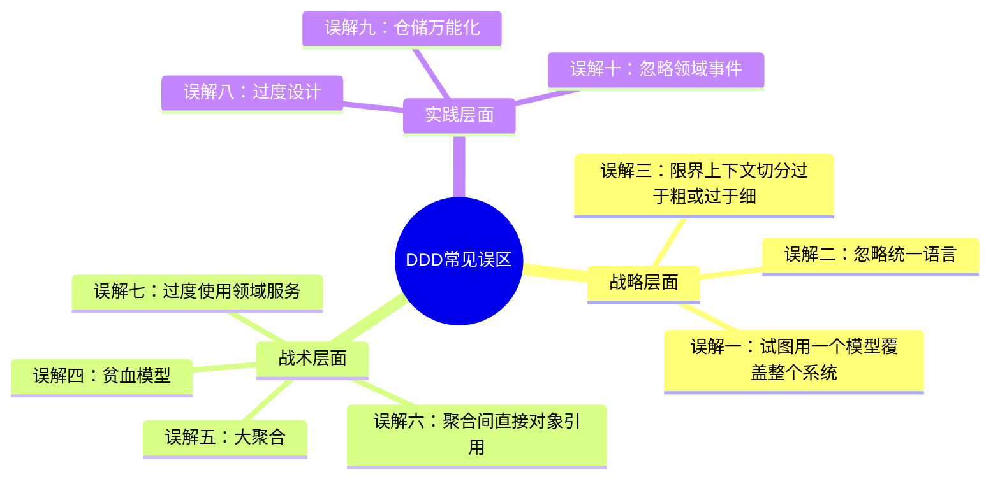
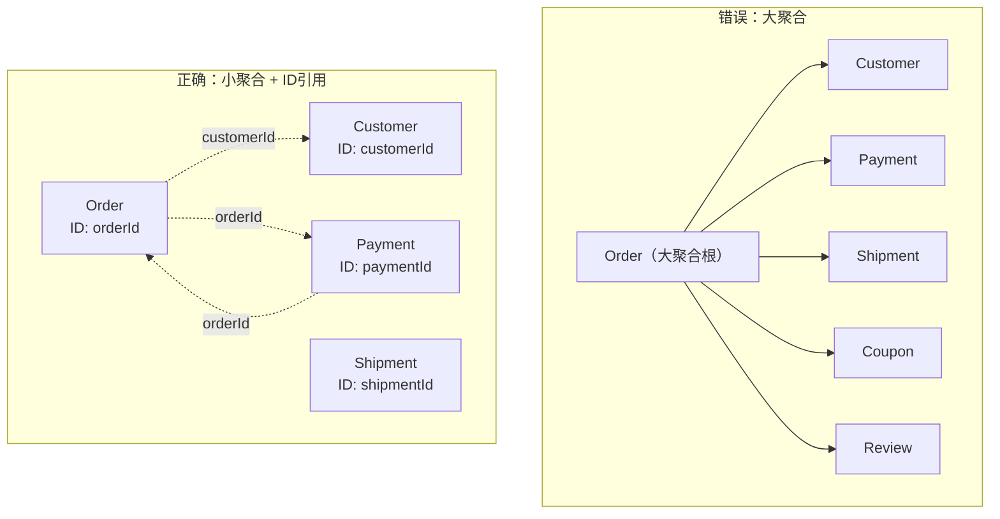
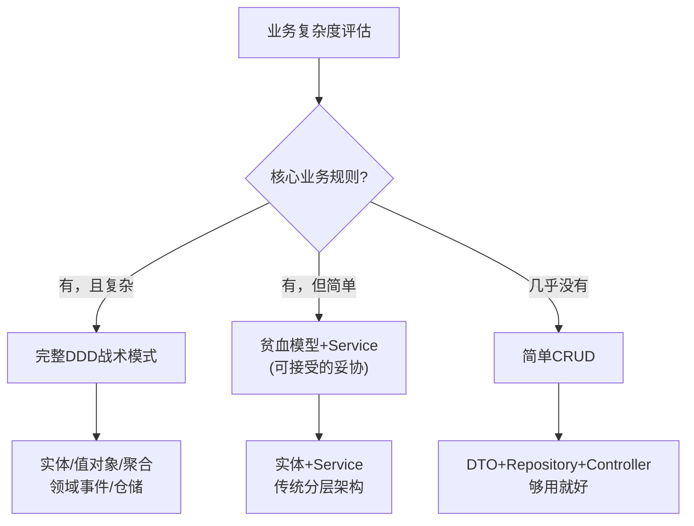
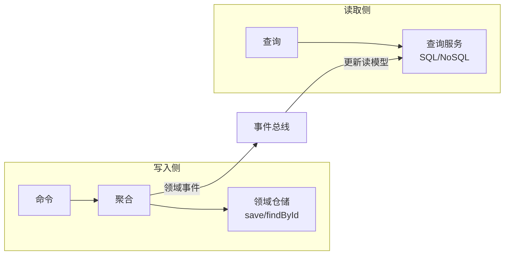
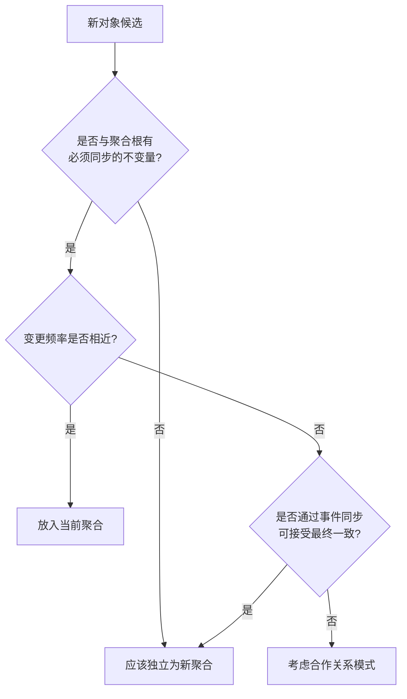

# 常见误区与反模式

DDD不是银弹，更不是一套可以机械套用的模板。团队在引入DDD的过程中，最容易犯的错误恰恰是"学了DDD，却用错了DDD"。本节总结实践中最高频的十大误区，每个误区都配以错误示例和正确做法的对比，帮助读者在实际项目中避开这些陷阱。



***

## 误区一：用一个统一模型覆盖整个系统

### 问题描述

这是DDD实践中最具破坏力的误区。团队试图定义一个"万能模型"——一个包含所有业务概念的超级领域模型，让所有模块、所有团队共用同一套实体和值对象。表面上看这很"统一"，实际上违反了DDD的战略设计基本原则。

Eric Evans在提出限界上下文时就明确指出：**同一个术语在不同上下文中可以有不同含义，而这种差异是合理的**。试图抹平这些差异，恰恰丧失了DDD的核心价值。

### 典型症状

- 系统中存在一个巨大的 `Product` 类，包含目录展示信息、库存数量、价格策略、物流规格等所有字段
- 每次新增业务场景，都在这个巨型类上添加字段和方法
- 修改一个业务场景时，不得不检查对其他场景的影响
- 团队之间围绕同一个模型争执不休——目录团队想要展示图片字段，库存团队想要仓库编码字段

### 错误示例

```java
// 错误：一个Product承载所有上下文的职责
public class Product {
    private String id;
    private String name;           // 目录上下文
    private String description;    // 目录上下文
    private String imageUrl;       // 目录上下文
    private int stockQuantity;     // 库存上下文
    private String warehouseCode;  // 库存上下文
    private BigDecimal price;      // 定价上下文
    private PriceStrategy strategy;// 定价上下文
    private double weight;         // 物流上下文
    private String category;       // 分类上下文
    // ... 持续膨胀
}
```

### 正确做法

按照限界上下文的边界，为每个上下文定义独立的 `Product` 模型：

```java
// 目录上下文的Product
public class ProductCatalog {
    private final ProductId id;
    private ProductName name;
    private ProductDescription description;
    private ImageUrl imageUrl;
    // 只包含与展示相关的属性
}

// 库存上下文的Product
public class ProductStock {
    private final ProductId id;
    private StockQuantity quantity;
    private WarehouseCode warehouseCode;
    // 只包含与库存管理相关的属性
}

// 定价上下文的Product
public class ProductPricing {
    private final ProductId id;
    private Money price;
    private PriceStrategy strategy;
    // 只包含与定价相关的属性
}
```

三个模型共享同一个 `ProductId`，通过上下文映射保持数据同步，但各自独立演进、互不干扰。

### 核心原则

限界上下文不是技术分层的产物，而是业务边界的反映。当同一术语在不同场景下的含义出现分歧时，这不是需要消除的"不一致"，而是需要拥抱的"有界差异"。

***

## 误区二：忽略统一语言

### 问题描述

统一语言（Ubiquitous Language）是DDD的基石概念，但在实践中最容易被忽视。团队花大量时间讨论架构、设计模式、技术选型，却从不认真与业务专家对齐术语。结果就是：代码里叫 `OrderService`，业务人员叫"采购申请单"，测试用例里又叫 `PurchaseRequest`——同一个业务概念三种说法。

Martin Fowler对此有一个精准的判断：**如果代码中的命名与业务人员口中的术语不一致，那么你的代码就不是在描述业务，而是在描述你对技术实现的想象**。

### 典型症状

- 代码中的类名、方法名充斥着 `handle`、`process`、`manage`、`util` 等技术性词汇
- 业务人员看不懂代码结构，也无法通过代码理解业务流程
- 会议上开发者和业务人员说的"同一个词"其实含义不同
- 术语表（如果有的话）写完就再没人看
- 同一个业务概念在代码库中有多个名字

### 错误示例

```java
// 错误：技术性命名，丢失业务语义
public class OrderService {
    public void process(Object data) { ... }
    public void handleEvent(Object event) { ... }
    public void manageStatus(String id, int status) { ... }
    public void updateInfo(String id, Map<String, Object> params) { ... }
}

// 对比：业务语言命名，精确表达意图
public class OrderApplicationService {
    public OrderId placeOrder(CustomerId customer, List<OrderItem> items) { ... }
    public void confirmOrder(OrderId orderId) { ... }
    public void cancelOrder(OrderId orderId, String reason) { ... }
    public void shipOrder(OrderId orderId, TrackingNumber trackingNo) { ... }
}
```

### 正确做法

统一语言的建立不是写一份词汇表文档就完事，而是一套贯穿团队日常工作的实践：

**1. 代码命名即业务语言**

```java
// 所有命名直接反映业务概念
public class Order {
    public void addLine(Product product, int quantity) { ... }
    public void confirm() { ... }
    public void cancel(String reason) { ... }
    public Money calculateShippingFee(VipStatus vipStatus) { ... }
}
```

**2. 测试用例即业务规格**

```gherkin
场景：VIP客户免运费
  假如 客户是VIP会员
  当 客户下单金额满100元
  那么 运费应为0元

场景：普通客户超重加收运费
  假如 客户是普通会员
  当 订单商品总重量超过5公斤
  那么 应加收10元超重费
```

**3. 与业务专家的持续对话**

每次讨论业务规则时，记录双方使用的术语。当发现歧义（例如"下单"到底是"提交订单"还是"确认订单"？），立即对齐，形成唯一的业务定义，并确保代码中的命名与之一致。

### 核心原则

统一语言不是文档中的词汇表，而是活在代码、对话、测试中的共同约定。如果你的代码读起来不像业务人员的对话，你的统一语言就还没建立起来。

***

## 误区三：贫血模型（Anemic Domain Model）

### 问题描述

贫血模型是Martin Fowler在2003年提出的反模式，也是DDD实践中最隐蔽的陷阱。表面上看，你的代码中有实体、有值对象、有分层架构，符合DDD的"形状"。但仔细一看，所有业务逻辑都散落在 `Service` 类中，领域对象退化成了纯粹的数据容器。

Vaughn Vernon对此有过深刻的批评：**贫血模型是对面向对象设计的背叛——你用对象来组织数据，却用过程式的函数来组织行为，这和用C语言写结构体有什么区别？**

### 典型症状

- 实体类只有getter和setter，没有任何业务方法
- 所有业务规则都写在 `XxxService` 类中
- 领域对象被设计为可变的"数据传输对象"（DTO）
- 测试时发现领域对象无法独立使用，总是需要配合Service类
- 业务规则散落在多个Service类中，同一个规则可能在不同Service中被重复实现

### 错误示例

```java
// 贫血模型：Order只是数据容器
public class Order {
    private String id;
    private String customerId;
    private List<OrderLine> lines;
    private BigDecimal totalAmount;
    private String status;
    // 只有getter和setter，没有任何业务方法
    public String getId() { return id; }
    public void setStatus(String status) { this.status = status; }
    public BigDecimal getTotalAmount() { return totalAmount; }
    // ...
}

// 业务逻辑全部在Service中
public class OrderService {
    public void confirmOrder(String orderId) {
        Order order = orderRepository.findById(orderId);
        if (order.getStatus().equals("CREATED")) {
            if (order.getTotalAmount().compareTo(BigDecimal.ZERO) > 0) {
                order.setStatus("CONFIRMED");
                orderRepository.save(order);
            } else {
                throw new BusinessException("空订单不能确认");
            }
        } else {
            throw new BusinessException("只有待确认的订单可以确认");
        }
    }
}
```

这段代码有两个严重问题：一是业务规则（空订单不能确认、状态转换条件）全部在Service中，无法从领域对象本身理解业务；二是 `status` 用字符串表示，编译器无法检查合法性。

### 正确做法

```java
// 充血模型：Order封装了自身的业务规则
public class Order {
    private final OrderId id;
    private final CustomerId customerId;
    private final List<OrderLine> lines;
    private Money totalAmount;
    private OrderStatus status;

    public void confirm() {
        // 业务规则由Order自己守护
        if (this.status != OrderStatus.CREATED) {
            throw new OrderCannotBeConfirmedException(
                this.id, this.status);
        }
        if (this.lines.isEmpty()) {
            throw new EmptyOrderCannotBeConfirmedException(this.id);
        }
        this.status = OrderStatus.CONFIRMED;
    }

    public void cancel(String reason) {
        if (this.status == OrderStatus.SHIPPED) {
            throw new ShippedOrderCannotBeCancelledException(this.id);
        }
        this.status = OrderStatus.CANCELLED;
        this.cancellationReason = reason;
    }

    public Money calculateShippingFee(VipStatus vipStatus) {
        if (vipStatus == VipStatus.VIP &amp;&amp; this.totalAmount.isGreaterOrEqual(Money.of(100))) {
            return Money.ZERO;
        }
        // 普通客户按重量计费
        return this.lines.stream()
            .map(OrderLine::weightFee)
            .reduce(Money.ZERO, Money::add);
    }
}

// Service变得薄而简单
public class OrderApplicationService {
    public void confirmOrder(OrderId orderId) {
        Order order = orderRepository.findById(orderId);
        order.confirm();  // 业务逻辑在领域对象中
        orderRepository.save(order);
    }
}
```

### 贫血模型 vs 充血模型对比

| 维度 | 贫血模型 | 充血模型 |
|------|---------|---------|
| 数据与行为 | 分离（数据在实体，行为在Service） | 内聚（数据和行为在同一实体） |
| 业务规则位置 | 散落在多个Service中 | 封装在领域对象内部 |
| 代码可读性 | 需要阅读Service才能理解业务 | 从实体代码就能理解业务 |
| 可测试性 | 需要Mock依赖才能测试业务逻辑 | 领域对象可以独立单元测试 |
| 面向对象程度 | 本质上是过程式编程 | 真正的面向对象设计 |
| 适用场景 | 简单CRUD | 业务规则复杂的领域 |

***

## 误区四：大聚合（Mega Aggregate）

### 问题描述

聚合是DDD中一致性边界的定义工具，但很多团队误解了"一致性"的含义，把整个业务域中的所有关联对象都塞进一个聚合。这种"大聚合"设计直接违反了Vaughn Vernon的聚合设计原则，导致严重的性能和并发问题。

核心误解在于：**一致性的范围不是越大越好，而是越精准越好**。聚合越大，事务范围越大，并发冲突越频繁，性能瓶颈越明显。

### 典型症状

- 一个聚合包含几十个甚至上百个内部对象
- 加载一个聚合根需要执行大量联表查询
- 多个用户同时操作同一聚合时频繁出现乐观锁冲突
- 聚合的方法签名变得复杂，参数列表越来越长
- 修改聚合内部的任何小功能都需要理解整个聚合的代码

### 错误示例

```java
// 错误：订单聚合包含太多不相关的对象
public class Order {
    private OrderId id;
    private List<OrderLine> lines;
    private Money totalAmount;
    private Customer customer;           // 为什么要把客户信息放进来？
    private List<Address> addresses;     // 历史收货地址全部加载？
    private Payment payment;             // 支付信息？
    private Shipment shipment;           // 物流信息？
    private List<ReturnItem> returns;    // 退货记录？
    private Coupon appliedCoupon;        // 优惠券详情？
    private List<Review> reviews;        // 评价？
    // 这个Order已经变成了一个微型数据库
}
```

### 正确做法

Vaughn Vernon总结了聚合设计的核心原则：**聚合应该尽可能小，只包含满足业务不变量所需的最少对象**。

```java
// 正确：小聚合设计
public class Order {
    private final OrderId id;
    private final CustomerId customerId;    // 通过ID引用客户
    private final List<OrderLine> lines;    // 只包含订单行
    private Money totalAmount;
    private OrderStatus status;

    // 不变量1：订单行数不超过50
    // 不变量2：已确认订单不能修改
    public void addLine(ProductId productId, Money unitPrice, int quantity) {
        if (this.status != OrderStatus.CREATED) {
            throw new OrderAlreadyConfirmedException(this.id);
        }
        if (lines.size() >= 50) {
            throw new TooManyOrderLinesException(this.id);
        }
        lines.add(new OrderLine(productId, unitPrice, quantity));
        recalculateTotal();
    }

    public void confirm() { ... }
    public void cancel(String reason) { ... }
}

// 客户、支付、物流各自是独立聚合
public class Customer {
    private final CustomerId id;
    private CustomerName name;
    private VipStatus vipStatus;
    // 只关注客户相关的不变量
}

public class Payment {
    private final PaymentId id;
    private final OrderId orderId;   // 通过ID引用Order
    private Money amount;
    private PaymentStatus status;
}
```

### 小聚合的设计原则



**关键区分**：如果一个业务操作需要同时修改多个聚合，说明这些修改不是同一个事务的一致性边界。使用最终一致性（通过领域事件）来协调聚合间的变更，而不是把它们放进同一个聚合。

***

## 误区五：聚合间直接对象引用

### 问题描述

与"大聚合"密切相关的一个误区是聚合间的直接对象引用。开发者习惯性地在聚合内部持有对其他聚合的完整对象引用，而不是ID引用。这看似"方便"，实则破坏了聚合的封装性，导致了隐式的跨聚合事务和级联加载问题。

Vaughn Vernon的聚合设计规则明确要求：**聚合之间通过ID引用，不通过对象引用**。

### 错误示例

```java
// 错误：Order直接持有Customer和Payment的对象引用
public class Order {
    private OrderId id;
    private Customer customer;       // 直接引用Customer聚合
    private Payment payment;         // 直接引用Payment聚合
    private List<OrderLine> lines;
}

// 加载Order时，不得不级联加载Customer和Payment
Order order = orderRepository.findById(orderId);
// 此时order.customer和order.payment都已经被加载到内存
// 即使你只需要order.lines
```

### 正确做法

```java
// 正确：通过ID引用其他聚合
public class Order {
    private final OrderId id;
    private final CustomerId customerId;   // 只持有ID
    private List<OrderLine> lines;
    private Money totalAmount;

    // 需要客户信息时，通过应用服务从Repository获取
}

// 应用服务负责协调多个聚合的交互
public class OrderApplicationService {
    public OrderDetailDTO getOrderDetail(OrderId orderId) {
        Order order = orderRepository.findById(orderId);
        Customer customer = customerRepository.findById(order.customerId());
        // 组装DTO
        return OrderDetailDTO.from(order, customer);
    }
}
```

### ID引用 vs 对象引用

| 维度 | 对象引用 | ID引用 |
|------|---------|-------|
| 内存开销 | 每次加载都带出关联聚合 | 只加载当前聚合 |
| 耦合度 | 聚合之间紧耦合 | 聚合之间松耦合 |
| 并发控制 | 隐式跨聚合事务 | 聚合边界清晰 |
| 事务范围 | 可能涉及多个聚合 | 严格限定在单个聚合内 |
| 性能 | 级联加载开销大 | 按需加载，高效 |

***

## 误区六：过度使用领域服务

### 问题描述

领域服务（Domain Service）是DDD中处理"不属于任何单个实体或值对象的业务逻辑"的工具。但很多开发者把领域服务当成了一个"万能口袋"——任何不知道放在哪里的逻辑都往领域服务里塞。结果就是领域服务膨胀成一个巨型类，实质上退化成了传统的Service层，领域对象反而变得更贫血了。

领域服务被过度使用的根本原因通常是**聚合设计不当**：逻辑本该属于某个聚合，但因为聚合设计过于简陋（贫血模型），逻辑无处安放，只好挪到领域服务中。

### 错误示例

```java
// 错误：领域服务承载了本应属于Order的逻辑
public class OrderDomainService {
    public Money calculateTotal(Order order) {
        // 这个逻辑完全应该属于Order自身
        return order.getLines().stream()
            .map(line -> line.getPrice().multiply(line.getQuantity()))
            .reduce(Money.ZERO, Money::add);
    }

    public void validateOrder(Order order) {
        // 状态检查逻辑应该在Order.confirm()中
        if (order.getStatus() != "CREATED") {
            throw new InvalidOrderStateException();
        }
        if (order.getLines().isEmpty()) {
            throw new EmptyOrderException();
        }
    }

    public void updateOrderStatus(Order order, String newStatus) {
        // 直接修改领域对象状态，绕过了实体的行为封装
        order.setStatus(newStatus);
    }
}
```

### 正确做法

**判断标准**：一个业务逻辑是否应该放在领域服务中，问三个问题：
1. 这个逻辑是否涉及多个聚合的协作？（是→领域服务）
2. 这个逻辑是否需要外部资源？（是→可能需要防腐层或应用服务）
3. 这个逻辑是否只涉及一个聚合？（是→放在聚合内部）

```java
// 正确：领域服务只处理真正跨聚合的逻辑
public class OrderDomainService {
    // 只有这种跨聚合的操作才属于领域服务
    public void transferOrderToWarehouse(Order order, Warehouse warehouse) {
        if (!warehouse.canAccept(order.totalWeight())) {
            throw new WarehouseCapacityExceededException(warehouse.id());
        }
        order.assignWarehouse(warehouse.id());
        warehouse.reserveCapacity(order.totalWeight());
    }
}

// 聚合自身的逻辑回到聚合内部
public class Order {
    public Money calculateTotal() {
        return this.lines.stream()
            .map(OrderLine::subtotal)
            .reduce(Money.ZERO, Money::add);
    }

    public void confirm() {
        if (this.status != OrderStatus.CREATED) {
            throw new OrderCannotBeConfirmedException(this.id);
        }
        if (this.lines.isEmpty()) {
            throw new EmptyOrderCannotBeConfirmedException(this.id);
        }
        this.status = OrderStatus.CONFIRMED;
    }
}
```

### 领域服务的正确使用清单

| 场景 | 放在领域服务 | 放在聚合内部 |
|------|:-----------:|:-----------:|
| 跨两个聚合的转账操作 | ✓ | |
| 单个订单的金额计算 | | ✓ |
| 需要调用外部风控系统判断 | ✓ | |
| 订单状态转换 | | ✓ |
| 多个聚合之间的数据同步 | ✓ | |
| 单个实体的规则校验 | | ✓ |

***

## 误区七：过度设计（DDD for CRUD）

### 问题描述

DDD是为复杂业务领域设计的方法论。但在实践中，很多团队把DDD当作一种"高级架构模式"，在所有项目中强行套用——即使是简单的CRUD管理后台，也要创建实体、值对象、仓储、领域事件、工厂全套构建块。

Eric Evans自己也明确表示：**DDD不是为所有软件设计的**。对于业务逻辑简单的系统（如内容管理系统、配置管理后台），引入完整的DDD战术模式只会增加不必要的复杂度，得不偿失。

### 典型症状

- 一个只有增删改查的管理页面，却设计了5个实体、3个值对象、2个领域服务
- 领域对象中没有真正的业务规则，只有数据验证
- 仓储接口和实现之间只有一层薄薄的转发
- 代码量是功能实现的5倍以上
- 团队花在"正确建模"上的时间远超实现业务需求的时间

### 错误示例

```java
// 错误：为简单的字典管理创建完整DDD模型
public class DictionaryItem {  // 实体
    private final DictionaryItemId id;
    private DictionaryItemKey key;       // 值对象
    private DictionaryItemValue value;   // 值对象
    private SortOrder sortOrder;         // 值对象
    private DictionaryItemType type;     // 枚举

    public void updateValue(DictionaryItemValue newValue) {
        if (this.type != DictionaryItemType.EDITABLE) {
            throw new DictionaryItemNotEditableException(this.id);
        }
        this.value = newValue;
    }
    // ... 还有工厂、仓储、领域事件...
}

// 实际上这个业务规则几乎为零
```

### 正确做法

**根据业务复杂度选择合适的设计级别**：



对于简单的字典管理，直接用贫血模型：

```java
// 对于简单CRUD场景，贫血模型是务实的选择
public class DictionaryItem {
    private Long id;
    private String key;
    private String value;
    private int sortOrder;
    private String type;
    // getter/setter即可
}

public class DictionaryItemService {
    public void create(DictionaryItemDTO dto) { ... }
    public void update(Long id, DictionaryItemDTO dto) { ... }
    public void delete(Long id) { ... }
}
```

### DDD适用性的判断框架

| 判断维度 | 建议使用DDD | 建议不使用DDD |
|---------|:-----------:|:-----------:|
| 业务规则复杂度 | 有复杂的业务不变量和状态转换 | 主要是数据验证和CRUD操作 |
| 领域专家参与度 | 有领域专家可以持续协作 | 没有业务专家，纯技术项目 |
| 系统生命周期 | 核心系统，需要长期维护 | 短期项目或工具性系统 |
| 团队规模 | 多团队协作，需要清晰的边界 | 单人或小团队项目 |
| 变更频率 | 业务规则频繁变化 | 功能相对固定 |

***

## 误区八：仓储万能化

### 问题描述

仓储（Repository）是DDD中负责聚合持久化的接口。但很多团队把仓储变成了"万能查询工具"——在仓储中实现各种复杂的查询方法、分页逻辑、排序规则，甚至跨表联查。仓储接口膨胀成一个包含几十个方法的巨型接口，违反了接口隔离原则，也让领域层对持久化细节产生了不必要的依赖。

仓储的本质目的是**向领域层隐藏持久化的实现细节**，让领域层只关心"保存"和"查找"，不关心底层是MySQL、MongoDB还是文件系统。当仓储承担了过多的查询职责，它就不再是领域层的基础设施，而是变成了数据访问层的API。

### 错误示例

```java
// 错误：仓储承载了过多的查询职责
public interface OrderRepository {
    Order findById(OrderId id);
    void save(Order order);
    void delete(OrderId id);

    // 以下是不应该出现在领域层仓储中的方法
    List<Order> findByStatusAndDateRange(String status, Date start, Date end);
    Page<Order> search(String keyword, int page, int size);
    List<Order> findTop10ExpensiveOrders();
    Map<String, Long> countOrdersByStatus();
    List<Order> findOrdersWithExpiredCoupons();
    // 仓储变成了一个查询API
}
```

### 正确做法

**领域仓储**只保留聚合的持久化操作，查询职责交给专门的查询服务：

```java
// 领域仓储：只负责聚合的持久化
public interface OrderRepository {
    Order findById(OrderId id);
    void save(Order order);
}

// 查询服务：负责读取操作
public class OrderQueryService {
    public List<OrderSummary> findOrders(OrderQuery query) {
        // 直接使用ORM或原生SQL
        // 不经过领域层
    }

    public Map<String, Long> countByStatus() {
        // 统计查询
    }
}
```

### CQRS模式下的仓储职责分离



***

## 误区九：忽略领域事件

### 问题描述

领域事件（Domain Event）是DDD中实现聚合间最终一致性的核心机制。但在实践中，很多团队要么完全忽略领域事件，让聚合间的协作退化为直接的方法调用；要么把领域事件当作广播工具，任何状态变更都发布事件，导致事件泛滥、消费者疲于应对。

领域事件的核心价值是**解耦聚合间的协作**：当一个聚合的状态变更需要触发其他聚合的响应时，不直接调用其他聚合，而是发布一个领域事件，让感兴趣的消费者异步响应。

### 典型症状：完全忽略领域事件

```java
// 错误：应用服务直接协调多个聚合的变更
public class OrderApplicationService {
    public void confirmOrder(OrderId orderId) {
        Order order = orderRepository.findById(orderId);
        order.confirm();
        orderRepository.save(order);

        // 直接调用库存服务——强耦合
        inventoryService.reduceStock(order.items());
        // 直接调用积分服务——强耦合
        loyaltyService.addPoints(order.customerId(), order.totalAmount());
        // 直接调用通知服务——强耦合
        notificationService.sendOrderConfirmed(order.customerId(), orderId);
    }
}
```

这段代码中 `confirmOrder` 方法承担了过多职责，每增加一个新的下游响应都要修改这个方法。

### 正确做法

```java
// 正确：通过领域事件解耦
public class Order {
    private List<DomainEvent> domainEvents = new ArrayList<>();

    public void confirm() {
        if (this.status != OrderStatus.CREATED) {
            throw new OrderCannotBeConfirmedException(this.id);
        }
        this.status = OrderStatus.CONFIRMED;
        this.domainEvents.add(new OrderConfirmed(
            this.id, this.customerId, this.totalAmount));
    }

    public List<DomainEvent> pullDomainEvents() {
        List<DomainEvent> events = new ArrayList<>(domainEvents);
        domainEvents.clear();
        return events;
    }
}

// 应用服务只关注当前聚合
public class OrderApplicationService {
    public void confirmOrder(OrderId orderId) {
        Order order = orderRepository.findById(orderId);
        order.confirm();
        orderRepository.save(order);

        // 发布领域事件，下游自行消费
        eventPublisher.publishAll(order.pullDomainEvents());
    }
}

// 各消费者独立响应
@EventHandler
public class InventoryEventHandler {
    public void on(OrderConfirmed event) {
        inventoryService.reduceStock(event.orderId());
    }
}

@EventHandler
public class LoyaltyEventHandler {
    public void on(OrderConfirmed event) {
        loyaltyService.addPoints(event.customerId(), event.totalAmount());
    }
}
```

### 另一个极端：事件泛滥

```java
// 错误：过度发布事件
public class Order {
    public void addLine(OrderLine line) {
        this.lines.add(line);
        // 每个微小操作都发布事件，完全没有必要
        publishEvent(new OrderLineAdded(this.id, line));
        publishEvent(new OrderTotalChanged(this.id, recalculateTotal()));
        publishEvent(new OrderModified(this.id, Instant.now()));
    }
}
```

**事件发布的判断标准**：只有当一个状态变更会触发其他聚合或外部系统的响应时，才发布领域事件。同一聚合内部的状态变更不发布事件。

***

## 误区十：聚合粒度判断错误

### 问题描述

聚合的粒度是DDD设计中最微妙的决策之一。太大会导致性能和并发问题（误区四），太小则会导致聚合数量爆炸、跨聚合协调成本飙升。很多团队在两种极端之间摇摆不定，始终找不到合适的粒度。

正确的粒度判断依赖于对**业务不变量**的准确识别。不变量是"必须始终满足的业务规则"，它决定了聚合的边界。聚合内部的对象必须在每个事务结束后保持一致状态，而聚合之间则通过最终一致性来协调。

### 识别不变量的方法

**1. 从业务规则中提取**

问业务专家："什么情况下，系统必须保证这些数据同时一致？"

业务规则："同一个订单中，所有商品的库存必须同时扣减，不能出现部分扣减的情况"
→ 不变量：订单行的库存扣减必须在同一事务中完成
→ 聚合：Order + OrderLine 应在同一聚合中

业务规则："客户修改地址时，不需要同时更新历史订单的收货地址"
→ 不变量：无（地址修改是独立的）
→ 聚合：Address 和 Order 应该是不同的聚合

**2. 从并发场景中验证**

场景：两个用户同时编辑同一个订单
→ 如果需要强一致性 → 应在同一聚合
→ 如果可以各自修改最终合并 → 应在不同聚合

### 粒度判断决策树



### 粒度过小的代价

| 问题 | 说明 |
|------|------|
| 跨聚合事务成本 | 每次业务操作需要协调多个聚合 |
| 最终一致性复杂度 | 事件驱动的异步同步增加了系统复杂度 |
| 查询性能下降 | 需要多次查询才能组装完整的业务视图 |
| 上下文切换频繁 | 代码在多个聚合之间跳转，理解成本高 |

***

## 误区自检清单

在项目中引入DDD时，使用以下清单定期自检：

### 战略层面

- [ ] 是否为每个业务能力定义了清晰的限界上下文？
- [ ] 是否避免了"万能模型"——每个上下文有独立的领域模型？
- [ ] 上下文之间的集成模式是否明确（上下文映射）？
- [ ] 统一语言是否在代码、测试、文档中保持一致？

### 战术层面

- [ ] 实体是否封装了业务行为，而不是只有getter/setter？
- [ ] 值对象是否不可变、自验证？
- [ ] 聚合是否尽可能小，只包含满足不变量的最少对象？
- [ ] 聚合之间是否通过ID引用，而非对象引用？
- [ ] 领域服务是否只处理真正跨聚合的逻辑？
- [ ] 仓储是否只负责聚合的持久化？
- [ ] 领域事件是否被用于解耦聚合间的协作？

### 实践层面

- [ ] 简单CRUD场景是否避免了过度设计？
- [ ] 团队是否持续与业务专家对齐统一语言？
- [ ] 代码审查时是否检查领域模型的合理性？
- [ ] 是否定期重构领域模型，而不是让它腐化？

***

## 误区速查表

| 误区 | 核心问题 | 根本原因 | 解决方案 |
|------|---------|---------|---------|
| 统一模型 | 所有上下文共用一个模型 | 忽略了限界上下文 | 为每个上下文定义独立模型 |
| 忽略统一语言 | 代码命名与业务术语脱节 | 缺少与业务专家的协作 | 建立持续的术语对齐机制 |
| 贫血模型 | 业务逻辑散落在Service中 | 面向对象设计不到位 | 让实体封装业务行为和规则 |
| 大聚合 | 聚合包含太多对象 | 一致性边界识别不准 | 小聚合 + ID引用 |
| 对象引用 | 聚合间持有完整对象引用 | 对聚合边界理解不足 | 聚合间通过ID引用 |
| 过度领域服务 | 领域服务变成万能口袋 | 聚合设计过于贫血 | 将逻辑放回聚合内部 |
| 过度设计 | 简单CRUD强行套DDD | 未评估业务复杂度 | 按复杂度选择设计级别 |
| 仓储万能化 | 仓储承担过多查询职责 | 职责边界不清 | 读写分离 + 查询服务 |
| 忽略领域事件 | 聚合间直接方法调用 | 对最终一致性缺乏信心 | 用事件解耦聚合间协作 |
| 粒度失当 | 聚合太大或太小 | 不变量识别不准确 | 从不变量出发确定边界 |

***

## 本节小结

DDD的误区归根结底可以归结为两类：

**第一类：该用DDD的地方没用好**。统一语言没有建立、贫血模型泛滥、聚合设计不当、领域事件被忽视——这些问题的根源是对DDD核心原则的理解不够深入。解决方案是回归Eric Evans和Vaughn Vernon的经典著作，从不变量和限界上下文的角度重新审视设计。

**第二类：不该用DDD的地方硬要用**。在简单CRUD场景中强行套用完整的DDD战术模式，结果是代码量膨胀、维护成本增加，却没有获得DDD的核心收益。解决方案是务实评估业务复杂度，选择合适的设计级别。

记住DDD的核心精神：**模型即设计，设计即模型**。当你的代码能够精确、清晰地反映业务领域的概念和规则时，DDD的价值就体现出来了。当代码变得比业务本身还复杂时，说明你走偏了——回到与业务专家的对话中去，答案就在那里。
