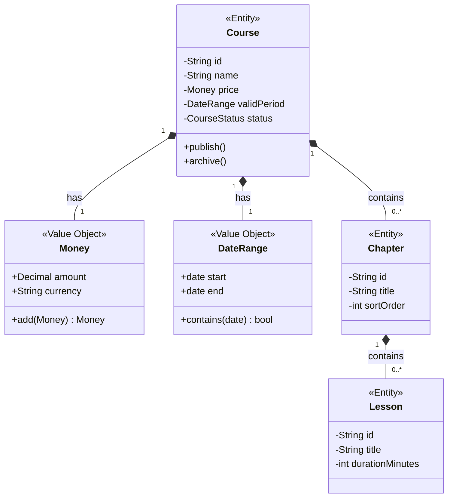
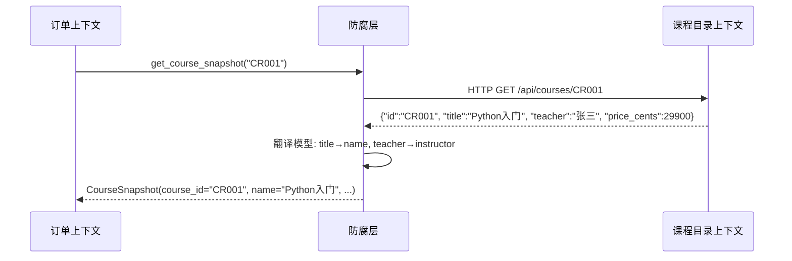
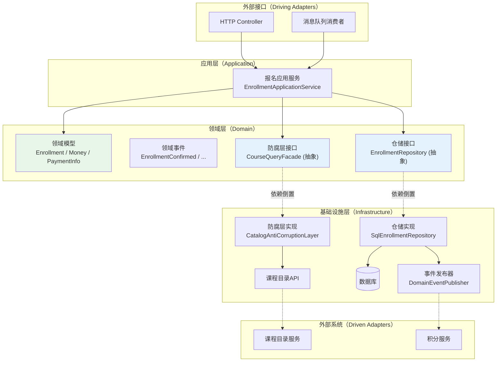

## 练习方法

理论基础、核心技巧、实战案例和常见误区为你构建了完整的 DDD 知识框架，但知识只有通过主动练习才能转化为真正的工程能力。本节提供五组递进式练习，从概念理解到架构设计，每组练习都配有具体场景、操作步骤和验收标准。建议按顺序完成，每组练习完成后对照检查标准自评，未达标的部分反复打磨。

---

## 练习一：统一语言与领域建模（预计 45 分钟）

### 目标

能够围绕一个真实业务场景建立统一语言词汇表，识别核心领域概念，并判断实体与值对象的边界。

### 场景说明

你所在的团队正在开发一个**在线教育平台**，核心业务包括：课程管理、学员报名、在线考试、学习进度跟踪、证书发放。请基于这个场景完成以下练习。

### 步骤一：建立统一语言词汇表（15 分钟）

阅读业务描述，列出至少 15 个业务术语，并为每个术语给出精确定义、易混淆概念和边界说明。

**参考示例（自行扩展）：**

| 术语 | 精确定义 | 易混淆概念 | 边界说明 |
|------|---------|-----------|---------|
| 课程（Course） | 一门完整的教学内容单元，包含多个章节 | 课时（Lesson） | 课程由多个课时组成，课时是最小教学单位 |
| 课时（Lesson） | 课程中的单个视频或直播教学单元 | 章节（Chapter） | 章节是课时的逻辑分组，一个章节包含多个课时 |
| 报名（Enrollment） | 学员注册某门课程的行为记录 | 订单（Order） | 报名是业务行为，订单是支付记录，两者通过 ID 关联 |
| 学习进度（Progress） | 学员在某门课程中的学习完成百分比 | 学习记录（StudyRecord） | 进度是聚合后的百分比值，学习记录是每次学习的明细 |

**操作要求：**

1. 自行完成至少 15 个术语的定义（不要直接复制上面的示例）
2. 特别关注以下容易产生歧义的词：\"课程\"、\"考试\"、\"成绩\"、\"证书\"
3. 标记哪些术语在不同场景下含义不同（这些是限界上下文的候选边界）

### 步骤二：识别实体与值对象（15 分钟）

基于你的词汇表，设计以下领域对象的 Python 代码：

1. **实体**：`Course`（课程实体）——包含唯一标识、生命周期（草稿→发布→归档）、可变状态
2. **值对象**：`Money`（金额）——不可变、通过属性值判断相等性
3. **值对象**：`DateRange`（日期范围）——表示课程的有效学习时间段

**关键判断标准：**

问自己三个问题来区分实体和值对象：
1. 这个对象需要追踪它的历史变化吗？→ 需要 = 实体，不需要 = 值对象
2. 两个属性完全相同的实例，业务上是"同一个"还是"不同"？→ 同一个 = 值对象，不同 = 实体
3. 这个对象有唯一标识吗？→ 有 = 实体，没有 = 值对象

**代码示例：**

```python
from dataclasses import dataclass
from datetime import datetime, date
from decimal import Decimal
from enum import Enum
import uuid


# --- 值对象：金额 ---
@dataclass(frozen=True)
class Money:
    """金额值对象 —— 不可变，通过值判断相等性"""
    amount: Decimal
    currency: str = "CNY"

    def __post_init__(self):
        if self.amount < 0:
            raise ValueError(f"金额不能为负数: {self.amount}")

    def add(self, other: 'Money') -> 'Money':
        if self.currency != other.currency:
            raise ValueError(f"货币不一致: {self.currency} vs {other.currency}")
        return Money(self.amount + other.amount, self.currency)


# --- 值对象：日期范围 ---
@dataclass(frozen=True)
class DateRange:
    """日期范围值对象 —— 表示课程的有效学习时间段"""
    start: date
    end: date

    def __post_init__(self):
        if self.start > self.end:
            raise ValueError(f"起始日期不能晚于结束日期: {self.start} > {self.end}")

    def contains(self, d: date) -> bool:
        return self.start <= d <= self.end

    @property
    def duration_days(self) -> int:
        return (self.end - self.start).days


# --- 实体：课程 ---
class CourseStatus(Enum):
    DRAFT = "draft"
    PUBLISHED = "published"
    ARCHIVED = "archived"


class Course:
    """课程实体 —— 具有唯一标识和生命周期"""

    def __init__(self, name: str, price: Money, valid_period: DateRange):
        self._id = str(uuid.uuid4())
        self._name = name
        self._price = price
        self._valid_period = valid_period
        self._status = CourseStatus.DRAFT
        self._created_at = datetime.now()

    @property
    def id(self) -> str:
        return self._id

    @property
    def status(self) -> CourseStatus:
        return self._status

    def publish(self):
        """发布课程 —— 从草稿态转为发布态"""
        if self._status != CourseStatus.DRAFT:
            raise InvalidCourseStateError(
                f"只有草稿状态的课程可以发布，当前状态: {self._status.value}"
            )
        self._status = CourseStatus.PUBLISHED

    def archive(self):
        """归档课程 —— 已发布的课程才能归档"""
        if self._status != CourseStatus.PUBLISHED:
            raise InvalidCourseStateError(
                f"只有已发布的课程可以归档，当前状态: {self._status.value}"
            )
        self._status = CourseStatus.ARCHIVED
```

### 步骤三：绘制领域模型关系图（15 分钟）

用 Mermaid 画出课程领域的类图，标注以下内容：

- 实体和值对象的区别（用不同颜色或标注）
- 聚合边界（哪些对象属于同一个聚合）
- 聚合根是谁

**参考图：**



### 检查标准

- [ ] 统一语言词汇表包含 15+ 个术语，每个术语有精确定义
- [ ] 能够清晰解释实体与值对象的区别，并说明每个对象的判断理由
- [ ] 代码中值对象使用 `frozen=True` 确保不可变性
- [ ] 实体封装了状态变更的业务规则（如 `publish()` 方法的状态检查）
- [ ] Mermaid 图正确标注了实体、值对象和聚合边界

---

## 练习二：限界上下文划分（预计 60 分钟）

### 目标

能够运用事件风暴方法识别领域事件，发现聚合，并划分合理的限界上下文。

### 场景说明

继续使用在线教育平台的场景。假设业务需求如下：

- 学员可以浏览课程目录、搜索课程、查看课程详情
- 学员可以报名课程并在线支付
- 学员可以观看视频课时，系统记录学习进度
- 讲师可以创建和发布课程、上传视频
- 平台定期组织在线考试，学员考试通过后获得证书
- 平台有积分系统，学习和考试都能获得积分

### 步骤一：列出领域事件（20 分钟）

按照时间线列出所有业务流程中发生的有意义的事件。事件名必须使用过去时态。

**输出格式示例：**

学员已注册 → 课程已创建 → 课程已发布 → 课程已浏览 →
课程已报名 → 支付已确认 → 课时已观看 → 学习进度已更新 →
考试已创建 → 考试已参加 → 考试成绩已录入 → 证书已颁发 →
积分已发放

**操作要求：**

1. 至少列出 15 个领域事件
2. 用橙色标注事件，用蓝色标注触发事件的命令
3. 找出事件之间的因果关系和并行关系

### 步骤二：识别聚合（20 分钟）

为每个事件找到它的"主人"——即负责执行业务规则并产生该事件的聚合。

**操作方法：**

对每个事件问自己：
1. 这个事件是哪个业务对象的行为结果？
2. 这个对象需要维护什么不变量？
3. 它应该包含哪些内部对象？

如果两个事件需要修改同一个对象的状态来保持一致性，
它们就属于同一个聚合。

**参考映射：**

| 事件 | 命令 | 聚合 |
|------|------|------|
| 课程已创建 | 创建课程 | Course（课程聚合） |
| 课程已发布 | 发布课程 | Course（课程聚合） |
| 课程已报名 | 报名课程 | Enrollment（报名聚合） |
| 支付已确认 | 确认支付 | Payment（支付聚合） |
| 学习进度已更新 | 更新进度 | Progress（进度聚合） |
| 考试成绩已录入 | 录入成绩 | ExamResult（考试结果聚合） |
| 证书已颁发 | 颁发证书 | Certificate（证书聚合） |

### 步骤三：划分限界上下文（20 分钟）

根据聚合之间的耦合关系和业务语义差异，将聚合分组到不同的限界上下文。

**操作方法：**

1. 画出所有聚合
2. 识别聚合之间的数据流向
3. 当同一个术语在不同聚合中含义不同时，标记为上下文边界
4. 考虑团队组织结构（康威定律）

**你的输出应包含：**

- 限界上下文名称和职责描述
- 每个上下文包含的聚合
- 上下文之间的集成模式（ACL / OHS / Customer-Supplier / Partnership 等）

**参考答案：**

| 限界上下文 | 核心聚合 | 职责范围 |
|------------|---------|---------|
| 课程目录（Catalog） | Course, Chapter, Lesson | 课程信息管理、搜索、展示 |
| 交易（Trading） | Enrollment, Payment | 报名、支付、退款 |
| 学习（Learning） | Progress, StudyRecord | 学习进度跟踪、课时记录 |
| 考试（Exam） | Exam, ExamResult | 考试管理、成绩录入 |
| 证书（Certificate） | Certificate | 证书生成和颁发 |
| 积分（Points） | PointsAccount, PointsRecord | 积分发放和消费 |

### 检查标准

- [ ] 至少识别出 15 个领域事件，全部使用过去时态命名
- [ ] 每个事件都映射到了正确的聚合
- [ ] 至少划分出 4 个限界上下文
- [ ] 能够解释每个限界上下文的边界依据（语义边界 / 团队边界 / 技术边界）
- [ ] 标注了上下文之间的集成模式

---

## 练习三：聚合设计实战（预计 60 分钟）

### 目标

能够设计符合 Vernon 原则的小聚合，正确使用 ID 引用，实现不变量保护。

### 场景说明

基于练习二的在线教育平台，深入设计以下两个聚合：

1. **Enrollment（报名聚合）**：管理学员报名、支付、退款的完整生命周期
2. **Progress（进度聚合）**：跟踪学员在单门课程中的学习进度

### 步骤一：识别不变量（15 分钟）

对每个聚合，列出所有业务不变量，并判断每个不变量是强一致性还是最终一致性。

**不变量分析模板：**

聚合：Enrollment（报名聚合）

不变量1：报名金额必须大于0
  → 判断：强一致性（金额为零的报名没有业务意义）
  → 保护方式：聚合内部校验

不变量2：已退款的报名不能再次退款
  → 判断：强一致性（重复退款是资金安全问题）
  → 保护方式：聚合内部状态检查

不变量3：报名后24小时内可以免费取消
  → 判断：强一致性（取消规则是报名的核心业务逻辑）
  → 保护方式：聚合内部时间校验

不变量4：报名成功后通知学习上下文创建进度记录
  → 判断：最终一致性（允许短暂延迟）
  → 保护方式：领域事件

**请自行完成 Progress 聚合的不变量分析，至少列出 3 个不变量。**

### 步骤二：编写聚合代码（30 分钟）

按照以下设计约束编写 Enrollment 聚合的完整代码：

**设计约束：**

1. Enrollment 是聚合根，包含 EnrollmentId（值对象标识）
2. 通过 CustomerId（ID 引用）关联客户上下文，不持有 Customer 对象
3. 通过 CourseId（ID 引用）关联课程上下文，不持有 Course 对象
4. PaymentInfo（支付信息）作为值对象嵌入聚合内部
5. 所有状态变更方法封装在聚合根内部
6. 聚合内部收集领域事件，通过 `pull_events()` 方法供外部发布

**参考实现：**

```python
from dataclasses import dataclass, field
from datetime import datetime, timedelta
from decimal import Decimal
from enum import Enum
from typing import List, Optional
import uuid


@dataclass(frozen=True)
class Money:
    amount: Decimal
    currency: str = "CNY"


@dataclass(frozen=True)
class PaymentInfo:
    """支付信息值对象 —— 嵌入报名聚合内部"""
    transaction_id: str
    amount: Money
    paid_at: datetime
    method: str  # "wechat" / "alipay" / "card"


class EnrollmentStatus(Enum):
    PENDING = "pending"       # 待支付
    CONFIRMED = "confirmed"   # 已确认（已支付）
    CANCELLED = "cancelled"   # 已取消
    REFUNDED = "refunded"     # 已退款
    EXPIRED = "expired"       # 已过期（超时未支付）


class Enrollment:
    """报名聚合根 —— 管理报名的完整生命周期"""

    def __init__(self, customer_id: str, course_id: str, amount: Money):
        self._id = str(uuid.uuid4())
        self._customer_id = customer_id    # ID引用客户聚合
        self._course_id = course_id        # ID引用课程聚合
        self._amount = amount
        self._status = EnrollmentStatus.PENDING
        self._payment: Optional[PaymentInfo] = None
        self._created_at = datetime.now()
        self._cancelled_at: Optional[datetime] = None
        self._events: list = []

    @property
    def id(self) -> str:
        return self._id

    @property
    def status(self) -> EnrollmentStatus:
        return self._status

    def confirm_payment(self, payment: PaymentInfo):
        """确认支付 —— 从待支付转为已确认"""
        if self._status != EnrollmentStatus.PENDING:
            raise InvalidEnrollmentStateError(
                f"只有待支付的报名可以确认支付，当前状态: {self._status.value}"
            )
        if payment.amount.amount <= 0:
            raise ValueError("支付金额必须大于零")
        self._payment = payment
        self._status = EnrollmentStatus.CONFIRMED
        self._events.append(EnrollmentConfirmed(
            enrollment_id=self._id,
            customer_id=self._customer_id,
            course_id=self._course_id,
            amount=self._amount
        ))

    def cancel(self, reason: str):
        """取消报名 —— 24小时内可免费取消"""
        if self._status not in (EnrollmentStatus.PENDING, EnrollmentStatus.CONFIRMED):
            raise InvalidEnrollmentStateError(
                f"当前状态不可取消: {self._status.value}"
            )
        # 不变量：已确认的报名需要在24小时内取消才免手续费
        if self._status == EnrollmentStatus.CONFIRMED:
            hours_since_enrollment = (
                datetime.now() - self._created_at
            ).total_seconds() / 3600
            if hours_since_enrollment > 24:
                raise CancellationNotAllowedError(
                    f"已超过24小时免费取消期限（已过{hours_since_enrollment:.1f}小时）"
                )
        self._status = EnrollmentStatus.CANCELLED
        self._cancelled_at = datetime.now()
        self._events.append(EnrollmentCancelled(
            enrollment_id=self._id,
            customer_id=self._customer_id,
            course_id=self._course_id,
            reason=reason
        ))

    def request_refund(self, reason: str):
        """申请退款 —— 只有已确认的报名可以退款"""
        if self._status != EnrollmentStatus.CONFIRMED:
            raise RefundNotAllowedError(
                f"只有已确认的报名可以退款，当前状态: {self._status.value}"
            )
        self._status = EnrollmentStatus.REFUNDED
        self._events.append(EnrollmentRefunded(
            enrollment_id=self._id,
            customer_id=self._customer_id,
            course_id=self._course_id,
            amount=self._amount,
            reason=reason
        ))

    def expire(self):
        """过期 —— 待支付超时自动过期"""
        if self._status != EnrollmentStatus.PENDING:
            return  # 只有待支付状态可以过期
        self._status = EnrollmentStatus.EXPIRED
        self._events.append(EnrollmentExpired(
            enrollment_id=self._id,
            course_id=self._course_id
        ))

    def pull_events(self) -> list:
        """取出并清空领域事件 —— 供仓储或应用服务发布"""
        events = self._events.copy()
        self._events.clear()
        return events


# --- 领域事件 ---
@dataclass(frozen=True)
class EnrollmentConfirmed:
    enrollment_id: str
    customer_id: str
    course_id: str
    amount: Money

@dataclass(frozen=True)
class EnrollmentCancelled:
    enrollment_id: str
    customer_id: str
    course_id: str
    reason: str

@dataclass(frozen=True)
class EnrollmentRefunded:
    enrollment_id: str
    customer_id: str
    course_id: str
    amount: Money
    reason: str

@dataclass(frozen=True)
class EnrollmentExpired:
    enrollment_id: str
    course_id: str
```

### 步骤三：编写单元测试（15 分钟）

为 Enrollment 聚合编写至少 5 个测试用例，覆盖正常流程和异常场景：

```python
import pytest
from datetime import datetime, timedelta
from decimal import Decimal


class TestEnrollment:
    """报名聚合单元测试"""

    def _create_pending_enrollment(self) -> Enrollment:
        """创建一个待支付的报名"""
        return Enrollment(
            customer_id="C001",
            course_id="CR001",
            amount=Money(Decimal("299.00"))
        )

    def test_create_enrollment_is_pending(self):
        """新建报名状态应为待支付"""
        enrollment = self._create_pending_enrollment()
        assert enrollment.status == EnrollmentStatus.PENDING

    def test_confirm_payment_changes_status(self):
        """确认支付后状态应变为已确认"""
        enrollment = self._create_pending_enrollment()
        payment = PaymentInfo(
            transaction_id="TX001",
            amount=Money(Decimal("299.00")),
            paid_at=datetime.now(),
            method="wechat"
        )
        enrollment.confirm_payment(payment)
        assert enrollment.status == EnrollmentStatus.CONFIRMED

    def test_confirm_payment_emits_event(self):
        """确认支付后应产生 EnrollmentConfirmed 事件"""
        enrollment = self._create_pending_enrollment()
        payment = PaymentInfo(
            transaction_id="TX001",
            amount=Money(Decimal("299.00")),
            paid_at=datetime.now(),
            method="wechat"
        )
        enrollment.confirm_payment(payment)
        events = enrollment.pull_events()
        assert len(events) == 1
        assert isinstance(events[0], EnrollmentConfirmed)
        assert events[0].customer_id == "C001"

    def test_cancel_within_24h_succeeds(self):
        """24小时内取消应成功"""
        enrollment = self._create_pending_enrollment()
        enrollment.confirm_payment(PaymentInfo(
            transaction_id="TX001",
            amount=Money(Decimal("299.00")),
            paid_at=datetime.now(),
            method="wechat"
        ))
        # enrollment._created_at 默认为当前时间，在24小时内
        enrollment.cancel("不感兴趣")
        assert enrollment.status == EnrollmentStatus.CANCELLED

    def test_cancel_after_24h_fails(self):
        """超过24小时取消应失败"""
        enrollment = self._create_pending_enrollment()
        enrollment._created_at = datetime.now() - timedelta(hours=25)
        enrollment.confirm_payment(PaymentInfo(
            transaction_id="TX001",
            amount=Money(Decimal("299.00")),
            paid_at=datetime.now(),
            method="wechat"
        ))
        with pytest.raises(CancellationNotAllowedError):
            enrollment.cancel("不感兴趣")

    def test_double_refund_fails(self):
        """重复退款应失败"""
        enrollment = self._create_pending_enrollment()
        enrollment.confirm_payment(PaymentInfo(
            transaction_id="TX001",
            amount=Money(Decimal("299.00")),
            paid_at=datetime.now(),
            method="wechat"
        ))
        enrollment.request_refund("课程不满意")
        assert enrollment.status == EnrollmentStatus.REFUNDED
        with pytest.raises(RefundNotAllowedError):
            enrollment.request_refund("再退一次")

    def test_cancel_emits_event(self):
        """取消后应产生 EnrollmentCancelled 事件"""
        enrollment = self._create_pending_enrollment()
        enrollment.cancel("不买了")
        events = enrollment.pull_events()
        assert len(events) == 1
        assert isinstance(events[0], EnrollmentCancelled)
        assert events[0].reason == "不买了"
```

**请自行补全异常类的定义（`InvalidEnrollmentStateError`、`CancellationNotAllowedError`、`RefundNotAllowedError`）并运行全部测试。**

### 检查标准

- [ ] Enrollment 聚合包含不超过 5 个内部对象/值对象（符合小聚合原则）
- [ ] 通过 `customer_id` / `course_id` 引用其他聚合，不持有对象引用
- [ ] 所有状态变更方法都有前置条件检查（不变量保护）
- [ ] 领域事件在聚合内部收集，通过 `pull_events()` 对外暴露
- [ ] 至少 7 个测试用例覆盖正常流程和异常场景
- [ ] 测试能够独立运行，不需要 Mock 外部依赖

---

## 练习四：领域事件与上下文集成（预计 45 分钟）

### 目标

能够实现跨聚合的领域事件发布与消费，设计防腐层隔离外部系统模型。

### 场景说明

在线教育平台中，报名成功后需要触发以下后续流程：

1. 通知学习上下文创建进度记录（`EnrollmentConfirmed` 事件）
2. 通知积分上下文发放报名积分（`EnrollmentConfirmed` 事件）
3. 订单上下文需要获取课程信息来生成订单快照（防腐层）

### 步骤一：事件发布器实现（15 分钟）

实现一个简单的事件发布器，支持同步和异步两种消费模式：

```python
from typing import Callable, Dict, List, Any
from collections import defaultdict
import threading


class DomainEventPublisher:
    """领域事件发布器 —— 支持同步和异步订阅"""

    def __init__(self):
        self._handlers: Dict[type, List[Callable]] = defaultdict(list)
        self._async_handlers: Dict[type, List[Callable]] = defaultdict(list)

    def subscribe(self, event_type: type, handler: Callable):
        """注册同步事件处理器"""
        self._handlers[event_type].append(handler)

    def subscribe_async(self, event_type: type, handler: Callable):
        """注册异步事件处理器"""
        self._async_handlers[event_type].append(handler)

    def publish(self, event: Any):
        """发布事件：先同步处理，再异步处理"""
        event_type = type(event)

        # 同步处理器：在同一执行流中依次调用
        for handler in self._handlers.get(event_type, []):
            handler(event)

        # 异步处理器：在独立线程中调用（生产环境建议用消息队列）
        for handler in self._async_handlers.get(event_type, []):
            thread = threading.Thread(target=handler, args=(event,))
            thread.start()


# --- 使用示例：报名确认事件的订阅与发布 ---

publisher = DomainEventPublisher()

# 学习上下文的处理器：创建进度记录
def create_progress_on_enrollment(event: EnrollmentConfirmed):
    print(f"[Learning] 为学员 {event.customer_id} 创建课程 {event.course_id} 的进度记录")
    # 实际实现：progress_repo.create(event.customer_id, event.course_id)

# 积分上下文的处理器：发放积分
def award_points_on_enrollment(event: EnrollmentConfirmed):
    points = int(event.amount.amount)  # 每消费1元获得1积分
    print(f"[Points] 为学员 {event.customer_id} 发放 {points} 积分")
    # 实际实现：points_account.add(event.customer_id, points)

# 注册处理器
publisher.subscribe(EnrollmentConfirmed, create_progress_on_enrollment)
publisher.subscribe_async(EnrollmentConfirmed, award_points_on_enrollment)

# 模拟发布事件
enrollment = Enrollment("C001", "CR001", Money(Decimal("299.00")))
enrollment.confirm_payment(PaymentInfo(
    transaction_id="TX001",
    amount=Money(Decimal("299.00")),
    paid_at=datetime.now(),
    method="wechat"
))
for event in enrollment.pull_events():
    publisher.publish(event)
```

### 步骤二：防腐层设计（20 分钟）

订单上下文在生成订单时需要课程信息（名称、价格、讲师），但不应直接依赖课程目录上下文的内部模型。设计防腐层实现翻译。

**请实现以下接口和类：**

```python
from abc import ABC, abstractmethod


# --- 订单上下文中定义的防腐层接口 ---
class CourseQueryFacade(ABC):
    """课程查询防腐层 —— 定义在订单上下文中"""

    @abstractmethod
    def get_course_snapshot(self, course_id: str) -> 'CourseSnapshot':
        """获取课程快照信息"""
        ...


@dataclass(frozen=True)
class CourseSnapshot:
    """课程快照值对象 —— 订单上下文使用的课程信息"""
    course_id: str
    name: str
    instructor: str
    price: Money
    thumbnail_url: str


# --- 防腐层实现：翻译课程目录上下文的模型 ---
class CatalogAntiCorruptionLayer(CourseQueryFacade):
    """课程目录防腐层实现"""

    def __init__(self, catalog_client):
        self._catalog_client = catalog_client  # 调用课程目录的HTTP API

    def get_course_snapshot(self, course_id: str) -> CourseSnapshot:
        # 1. 调用上游API获取课程数据
        upstream_data = self._catalog_client.get_course(course_id)

        # 2. 翻译为本上下文的模型（只保留订单需要的信息）
        return CourseSnapshot(
            course_id=upstream_data["id"],
            name=upstream_data["title"],          # "title" → "name"（术语翻译）
            instructor=upstream_data["teacher"],   # "teacher" → "instructor"
            price=Money(Decimal(str(upstream_data["price_cents"])) / 100),
            thumbnail_url=upstream_data["cover_image"]
        )
```

**操作要求：**

1. 画出防腐层的数据流图（Mermaid）
2. 说明防腐层隔离了哪些上游模型的变化
3. 思考：如果课程上下文把 `title` 字段改名为 `name`，对订单上下文有什么影响？

**防腐层数据流图：**



### 步骤三：事件幂等处理（10 分钟）

实现一个幂等的事件处理器，确保同一事件不会被重复处理：

```python
class ProcessedEventTracker:
    """已处理事件追踪器 —— 保证事件幂等"""

    def __init__(self):
        self._processed: set = set()

    def is_processed(self, event_id: str) -> bool:
        return event_id in self._processed

    def mark_processed(self, event_id: str):
        self._processed.add(event_id)


class IdempotentEnrollmentHandler:
    """幂等的报名事件处理器"""

    def __init__(self, tracker: ProcessedEventTracker, progress_service):
        self._tracker = tracker
        self._progress_service = progress_service

    def handle(self, event: EnrollmentConfirmed, event_id: str):
        # 幂等检查：同一事件只处理一次
        if self._tracker.is_processed(event_id):
            print(f"[Skip] 事件 {event_id} 已处理，跳过")
            return

        # 执行业务逻辑
        self._progress_service.create(
            customer_id=event.customer_id,
            course_id=event.course_id
        )

        # 标记已处理
        self._tracker.mark_processed(event_id)
```

**请编写测试验证幂等性：同一个事件发送两次，进度记录只创建一次。**

### 检查标准

- [ ] 事件发布器支持同步和异步两种订阅模式
- [ ] 每个领域事件至少有一个处理器
- [ ] 防腐层正确隔离了上游模型，订单上下文不直接依赖课程目录的内部模型
- [ ] 幂等处理器通过事件 ID 去重，重复事件不会导致重复处理
- [ ] 能够解释为什么事件幂等在分布式系统中是必需的

---

## 练习五：综合架构设计（预计 90 分钟）

### 目标

能够将前面练习的成果整合为一个完整的 DDD 架构方案，包括分层架构、仓储设计、项目结构和代码组织。

### 场景说明

基于在线教育平台的报名子系统，设计一个完整的六边形架构方案，覆盖从 HTTP 入口到数据库持久化的完整链路。

### 步骤一：设计分层架构（20 分钟）

画出六边形架构图，明确每一层的职责和依赖关系：



**关键原则：**

- 领域层（绿色）零外部依赖——不依赖框架、不依赖数据库、不依赖消息中间件
- 领域层定义的接口（蓝色）由基础设施层实现——依赖倒置原则
- 应用服务只负责编排——加载聚合、调用领域行为、保存、发布事件
- 外部适配器只负责协议转换——HTTP JSON ↔ 领域对象，数据库行 ↔ 领域对象

### 步骤二：设计仓储接口与实现（20 分钟）

```python
from abc import ABC, abstractmethod


# --- 领域层：仓储接口 ---
class EnrollmentRepository(ABC):
    """报名仓储接口 —— 定义在领域层，零框架依赖"""

    @abstractmethod
    def find_by_id(self, enrollment_id: str) -> Enrollment | None:
        """根据ID查找报名"""
        ...

    @abstractmethod
    def find_by_customer_and_course(self, customer_id: str, course_id: str) -> Enrollment | None:
        """查找学员在某课程的报名"""
        ...

    @abstractmethod
    def save(self, enrollment: Enrollment) -> None:
        """保存报名（新增或更新）"""
        ...

    @abstractmethod
    def next_id(self) -> str:
        """生成下一个报名ID"""
        ...


# --- 基础设施层：SQL实现 ---
class SqlEnrollmentRepository(EnrollmentRepository):
    """基于SQL的报名仓储实现"""

    def __init__(self, session, event_publisher: DomainEventPublisher):
        self._session = session
        self._event_publisher = event_publisher

    def find_by_id(self, enrollment_id: str) -> Enrollment | None:
        row = self._session.execute(
            "SELECT * FROM enrollments WHERE id = ?", (enrollment_id,)
        ).fetchone()
        if not row:
            return None
        return self._to_domain(row)

    def save(self, enrollment: Enrollment) -> None:
        # 1. 持久化聚合状态
        self._session.execute(
            """INSERT INTO enrollments (id, customer_id, course_id, amount, currency, status, created_at)
               VALUES (?, ?, ?, ?, ?, ?, ?)
               ON CONFLICT(id) DO UPDATE SET status = ?, amount = ?""",
            (enrollment.id, enrollment._customer_id, enrollment._course_id,
             enrollment._amount.amount, enrollment._amount.currency,
             enrollment.status.value, enrollment._created_at,
             enrollment.status.value, enrollment._amount.amount)
        )
        self._session.commit()

        # 2. 持久化后发布领域事件
        for event in enrollment.pull_events():
            self._event_publisher.publish(event)

    def _to_domain(self, row: dict) -> Enrollment:
        """将数据库行映射为领域对象（重构工厂）"""
        enrollment = Enrollment.__new__(Enrollment)
        enrollment._id = row["id"]
        enrollment._customer_id = row["customer_id"]
        enrollment._course_id = row["course_id"]
        enrollment._amount = Money(Decimal(row["amount"]), row["currency"])
        enrollment._status = EnrollmentStatus(row["status"])
        enrollment._created_at = row["created_at"]
        enrollment._events = []
        return enrollment
```

### 步骤三：设计应用服务（20 分钟）

```python
class EnrollmentApplicationService:
    """报名应用服务 —— 编排领域对象，不含业务规则"""

    def __init__(
        self,
        enrollment_repo: EnrollmentRepository,
        course_facade: CourseQueryFacade,
        event_publisher: DomainEventPublisher
    ):
        self._enrollment_repo = enrollment_repo
        self._course_facade = course_facade
        self._event_publisher = event_publisher

    def enroll(self, customer_id: str, course_id: str) -> str:
        """学员报名流程"""
        # 1. 通过防腐层获取课程信息（不直接依赖课程上下文模型）
        course_snapshot = self._course_facade.get_course_snapshot(course_id)

        # 2. 检查是否已报名（查询不通过聚合，直接读仓储）
        existing = self._enrollment_repo.find_by_customer_and_course(customer_id, course_id)
        if existing and existing.status in (
            EnrollmentStatus.PENDING, EnrollmentStatus.CONFIRMED
        ):
            raise DuplicateEnrollmentError(customer_id, course_id)

        # 3. 创建报名聚合
        enrollment = Enrollment(customer_id, course_id, course_snapshot.price)

        # 4. 持久化
        self._enrollment_repo.save(enrollment)

        # 5. 返回ID（应用服务返回ID，不返回领域对象给外部）
        return enrollment.id

    def confirm_payment(self, enrollment_id: str, transaction_id: str):
        """确认支付"""
        enrollment = self._enrollment_repo.find_by_id(enrollment_id)
        if not enrollment:
            raise EnrollmentNotFoundError(enrollment_id)

        # 调用领域行为
        enrollment.confirm_payment(PaymentInfo(
            transaction_id=transaction_id,
            amount=enrollment._amount,
            paid_at=datetime.now(),
            method="wechat"
        ))

        # 持久化并发布事件
        self._enrollment_repo.save(enrollment)
```

### 步骤四：设计项目结构（15 分钟）

画出完整的目录结构，说明每个目录的职责：

enrollment-context/
├── domain/                          # 领域层（零外部依赖）
│   ├── model/
│   │   ├── enrollment.py            # 报名聚合根
│   │   ├── enrollment_status.py     # 报名状态枚举
│   │   ├── money.py                 # 金额值对象
│   │   └── payment_info.py          # 支付信息值对象
│   ├── event/
│   │   ├── enrollment_confirmed.py  # 报名确认事件
│   │   ├── enrollment_cancelled.py  # 报名取消事件
│   │   └── enrollment_refunded.py   # 报名退款事件
│   ├── repository/
│   │   └── enrollment_repository.py # 仓储接口（抽象）
│   └── facade/
│       └── course_query_facade.py   # 防腐层接口（抽象）
│
├── application/                     # 应用层（编排领域对象）
│   ├── enrollment_application_service.py  # 应用服务
│   └── enrollment_event_handler.py        # 事件处理器
│
├── infrastructure/                  # 基础设施层
│   ├── persistence/
│   │   ├── sql_enrollment_repository.py   # 仓储实现
│   │   └── enrollment_mapper.py           # 领域对象 ↔ 数据库行
│   ├── anti_corruption/
│   │   └── catalog_acl.py                # 防腐层实现
│   ├── event/
│   │   └── domain_event_publisher.py     # 事件发布器
│   └── config/
│       └── dependency_injection.py       # 依赖注入配置
│
└── tests/                           # 测试
    ├── domain/
    │   ├── test_enrollment.py       # 聚合单元测试
    │   └── test_money.py            # 值对象测试
    ├── application/
    │   └── test_enrollment_service.py  # 应用服务测试
    └── infrastructure/
        └── test_sql_repository.py   # 仓储集成测试

### 步骤五：自评与反思（15 分钟）

回顾你设计的方案，回答以下问题：

1. **你的领域层是否真的零外部依赖？** 检查 `domain/` 目录下的文件是否 import 了任何框架（Spring、Django、SQLAlchemy 等）。如果有，说明你的分层被破坏了。

2. **你的聚合大小是否合理？** Enrollment 聚合是否只包含维持一致性所必需的最小对象集合？如果你发现聚合内有 5+ 个实体，考虑是否可以拆分。

3. **你的仓储接口是否只暴露领域概念？** 仓储方法名应该使用业务语言（`find_by_customer_and_course`），不暴露数据库细节（`select_by_sql`）。

4. **你的应用服务是否足够薄？** 应用服务只做三件事：加载聚合、调用领域行为、保存并发布事件。如果应用服务里有 `if-else` 业务逻辑，说明这些逻辑应该下沉到领域层。

5. **你是否识别出了所有限界上下文的边界？** 在这个子系统中，你依赖了课程目录上下文（通过防腐层）和积分上下文（通过事件）。这些依赖是否被正确隔离？

### 检查标准

- [ ] 六边形架构图正确标注了各层职责和依赖方向
- [ ] 领域层零外部依赖，仓储和防腐层接口定义在领域层
- [ ] 应用服务只负责编排，不含业务规则
- [ ] 项目结构清晰，每层职责明确
- [ ] 能够解释为什么这样分层，以及每层可以独立替换的理由
- [ ] 完成了自评反思的 5 个问题

---

## 练习进阶路径

完成以上五组基础练习后，可以根据自身水平选择进阶方向：

### 初级进阶：从零建模

选择一个你熟悉的业务场景（如博客系统、任务管理、餐厅点餐），从头开始走完完整的 DDD 流程：统一语言 → 事件风暴 → 限界上下文划分 → 聚合设计 → 代码实现。用不同语言（Java / TypeScript / Python）各实现一遍，体会语言特性对 DDD 表达力的影响。

### 中级进阶：重构遗留代码

找一个你项目中的 CRUD 模块，尝试用 DDD 重构。关键步骤：

1. 先识别业务不变量——哪些规则散落在 Service 层中
2. 将不变量下沉到领域对象中
3. 拆分大聚合为小聚合
4. 引入领域事件解耦跨聚合操作
5. 用绞杀者模式逐步替换旧代码

### 高级进阶：CQRS + 事件溯源

在测试项目中实现一个完整的 CQRS 架构：

1. 写侧使用丰富的领域模型 + 事件溯源
2. 读侧使用投影模型 + 独立的查询数据库
3. 实现事件重放和快照机制
4. 处理事件版本兼容和迁移

### 团队协作进阶

在团队中组织一次 Event Storming 工作坊：

1. 邀请 3-5 位业务专家和 3-5 位开发者
2. 准备一面大墙和大量便利贴
3. 按照五步法完成完整的事件风暴
4. 产出领域事件流、聚合识别、限界上下文划分
5. 将工作坊产出转化为代码结构

---

## 常见问题解答

**Q：我做的聚合测试总是需要 Mock 很多外部依赖，怎么办？**

A：这通常说明你的聚合设计有问题。DDD 的核心原则之一是领域层零外部依赖——聚合的行为方法不应该调用任何外部服务（数据库、消息队列、HTTP API）。如果你发现聚合内部需要 `@Autowired` 或 `__init__` 注入外部服务，说明这些逻辑应该下沉到领域层的纯业务逻辑中，或者上移到应用服务层。好的聚合应该像上面的 `Enrollment` 一样，所有方法只操作内部状态，测试时不需要任何 Mock。

**Q：事件风暴产出的限界上下文太多/太少，怎么判断是否合理？**

A：有几个启发式规则：
- 如果一个上下文包含超过 5 个聚合，考虑是否可以拆分
- 如果两个上下文之间的数据流非常频繁（每次操作都需要跨上下文调用），考虑是否应该合并
- 每个上下文最好对应一个独立团队（康威定律）
- 上下文数量一般不超过「核心子域数 + 2-3 个支撑域」

**Q：我不知道一个业务规则应该放在聚合内还是聚合外，怎么判断？**

A：核心判断标准是**一致性要求**。如果这条规则违反会立即导致业务错误（如超卖、资金错误），且必须在同一事务中检查，它就是聚合内的不变量。如果规则涉及多个聚合的状态协调，或者允许短暂的不一致，它就应该通过领域事件在聚合间实现最终一致性。不确定时，先问业务专家：「如果这条规则在 1 秒内不一致，会出什么问题？」

**Q：我的项目是简单的 CRUD，需要引入 DDD 吗？**

A：不需要。DDD 是为管理业务复杂度而设计的方法论。如果系统的核心逻辑是「接收请求 → 查数据库 → 写数据库 → 返回结果」，传统分层架构已经足够。引入 DDD 只会增加不必要的复杂度。DDD 的价值在于：当你发现业务规则越来越复杂、修改一个功能需要改动多处代码、团队对同一个术语的理解不一致时——这些信号说明你需要 DDD 了。

**Q：代码中值对象和实体的判断总是拿不准，有没有更简单的规则？**

A：记住一个实用技巧——**\"能不能换一个新的？\"** 如果你可以直接用一个新对象替换当前对象，业务上没有任何区别（比如换一张 100 元纸币），它就是值对象。如果你替换后业务上会丢失信息（比如换一个订单 ID，之前的订单历史就没了），它就是实体。
