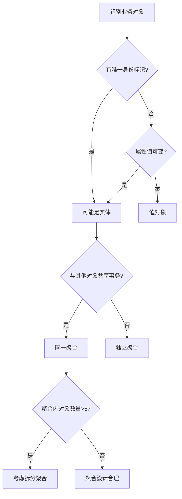

## 本章小结

领域驱动设计（Domain-Driven Design，DDD）不是一套僵化的技术方案，而是一种以业务复杂度为核心驱动力的软件设计哲学。本章从理论基础出发，经过核心技巧、实战案例、常见误区和练习方法，系统性地构建了一套完整的 DDD 知识体系。本节将回顾全章核心内容，提炼关键决策框架，并为读者指明持续精进的方向。

---

## 一、核心知识体系回顾

### 1.1 战略设计：划清边界，统一语言

战略设计是 DDD 的第一道防线，解决的是"系统该怎么拆"的根本问题。

**限界上下文（Bounded Context）** 是战略设计的核心工具。每个限界上下文拥有独立的领域模型、统一语言和数据存储，上下文之间通过明确的集成模式通信。划分限界上下文的三种主要方法：

| 方法 | 核心思路 | 适用场景 | 关键产出 |
|------|----------|----------|----------|
| 事件风暴（Event Storming） | 从领域事件出发逆向推导聚合与上下文 | 新项目启动、遗留系统重构 | 事件流图、聚合识别、上下文边界 |
| 子域分析 | 按业务能力拆分为核心域/支撑域/通用域 | 业务架构梳理、团队分工 | 子域划分图、投资优先级 |
| 语言驱动划分 | 以统一语言的语义边界划定上下文 | 术语歧义严重的复杂业务 | 统一语言词汇表、上下文地图 |

**上下文地图（Context Map）** 描述了限界上下文之间的集成关系，核心集成模式包括：

- **防腐层（ACL）**：隔离外部系统的数据模型，保护本上下文的领域模型不被侵蚀
- **开放主机服务（OHS）+ 发布语言**：通过标准化协议（REST/gRPC）暴露能力
- **客户-供应商（Customer-Supplier）**：上游提供能力，下游消费并提出需求
- **合作关系（Partnership）**：两个上下文紧密协作，共同演进
- **共享内核（Shared Kernel）**：两个上下文共享部分模型（需严格管理变更）
- **跟随者（Conformist）**：下游完全遵从上游模型，无议价能力
- **各行其道（Separate Ways）**：上下文之间无集成需求
- **道别层（Open Host Service）**：上游开放标准接口，下游自由适配
- **遵奉者（Conformist）与各行其道**：当集成成本高于收益时的务实选择

**统一语言（Ubiquitous Language）** 是战略设计的灵魂。它要求开发团队与业务专家使用同一套术语，并且这套术语直接体现在代码的类名、方法名、变量名中。当发现业务人员说"下单"而代码里叫 `createOrder`，同时另一个地方叫 `placeOrder`、第三个地方叫 `submitOrder` 时，这就是统一语言缺失的典型信号——必须统一为一个术语。

### 1.2 战术设计：构建精确的领域模型

战术设计是 DDD 的核心战场，解决的是"模型该怎么建"的技术问题。

**实体（Entity）** 与 **值对象（Value Object）** 是领域模型的两大基石：

| 对比维度 | 实体 | 值对象 |
|----------|------|--------|
| 身份标识 | 有唯一 ID，通过 ID 比较 | 无 ID，通过属性值比较 |
| 可变性 | 生命周期内状态可变 | 创建后不可变（Immutable） |
| 典型示例 | `Order`、`User`、`Product` | `Money`、`Address`、`DateRange` |
| 设计要点 | 聚焦生命周期管理与状态转换 | 确保不可变性，提供工厂方法 |

**聚合（Aggregate）** 是 DDD 中最精妙也最容易被误用的概念。聚合是一致性边界——聚合内部的所有变更必须在同一事务中完成，聚合之间通过 ID 引用而非对象引用。

Vernon 的聚合设计十原则中，最核心的三条：

1. **设计小聚合**：每个聚合只包含一个实体和紧密相关的值对象，聚合内的不变量（Invariant）要尽可能少
2. **通过 ID 引用其他聚合**：聚合之间只保持 ID 引用关系，不持有对方的对象引用，避免级联加载和跨聚合事务
3. **在聚合边界内执行业务规则**：不变量必须在聚合内部通过断言或状态校验来保证，不依赖外部服务或数据库约束

**领域服务（Domain Service）** 处理那些不属于任何单一实体或值对象的业务逻辑。判断标准：如果一段逻辑需要协调多个聚合的状态变化，或者需要外部基础设施的能力（如发送消息、调用外部服务），就应该放入领域服务而非实体方法。

**领域事件（Domain Event）** 是聚合之间解耦的关键机制。一个聚合发布领域事件，其他聚合或上下文订阅并响应，形成最终一致性的事件驱动架构。事件发布的三种模式：

- **聚合内部发布**：在聚合的业务方法中直接记录事件，由 Repository 在持久化时统一发布
- **应用服务发布**：在应用服务层调用 Repository 之后发布事件，适合需要保证事件一定在持久化之后发出的场景
- **事件存储发布**：通过 Event Sourcing 机制，事件本身就是持久化的内容，天然具备发布能力

**工厂（Factory）** 封装了复杂的对象创建逻辑。当实体或聚合的创建过程涉及多个步骤（如校验、关联创建、事件记录），工厂模式能将创建逻辑从使用方隔离出来。工厂分为创建工厂（新建对象）和重构工厂（从持久化存储重建对象）。

**Repository（仓储）** 是聚合的持久化抽象层。每个聚合对应一个 Repository，Repository 接口定义在领域层，实现在基础设施层。设计要点：

- Repository 的接口方法以领域概念命名（如 `findById`、`findByStatus`），不暴露底层存储细节
- 使用规约模式（Specification Pattern）封装复杂的查询条件，避免 Repository 接口膨胀
- 查询操作可以绕过聚合直接读取投影数据（尤其在 CQRS 架构中）

### 1.3 高级模式：应对极端复杂度

**CQRS（命令查询职责分离）** 将系统的写操作（Command）和读操作（Query）分离到不同的模型中。写侧使用丰富的领域模型保证业务规则，读侧使用面向查询优化的投影模型提升查询性能。

**事件溯源（Event Sourcing）** 不存储实体的当前状态，而是存储所有发生过的领域事件。当前状态通过重放事件序列来重建。优势是完整的审计追踪和时间旅行能力，代价是查询复杂度增加（需要快照机制和投影模型来优化）。

**Saga 模式** 解决跨聚合、跨服务的业务流程编排问题。每个 Saga 步骤失败时执行补偿操作，将系统回滚到一致状态。Saga 的两种实现方式：编排式（中央协调器）和协同式（事件驱动链式调用）。

**防腐层（ACL）** 是隔离外部系统影响的关键手段。当你的系统需要对接一个术语和模型都与你不同的外部系统时，ACL 在两者之间建立翻译层，确保外部模型的变化不会侵蚀你的领域模型。

### 1.4 架构演进：渐进式迁移

将遗留系统迁移到 DDD 架构，**绞杀者模式（Strangler Fig Pattern）** 是最稳妥的策略：

1. **识别切分点**：找到现有系统中与领域边界对齐的模块边界
2. **逐步抽取**：将核心域的逻辑从遗留系统中剥离，用 DDD 重新实现
3. **双写过渡**：新旧系统并行运行，通过数据同步保证一致性
4. **最终切换**：验证新系统稳定后，切断旧系统的流量入口

关键原则：不要试图一次性重写整个系统，而是在日常迭代中逐步迁移，每次迁移都是可回滚的。

---

## 二、关键决策框架

### 2.1 何时使用 DDD？

| 信号 | 适合 DDD | 不适合 DDD |
|------|----------|------------|
| 业务复杂度 | 业务规则多变、术语体系复杂 | 简单 CRUD、规则固定 |
| 团队规模 | 5人以上、需要明确分工 | 小团队、沟通成本低 |
| 项目生命周期 | 长期维护、持续演进 | 一次性脚本、短期项目 |
| 领域专家 | 有业务专家深度参与 | 纯技术驱动的工具类项目 |
| 系统耦合 | 需要与多个外部系统集成 | 单一职责的独立服务 |

### 2.2 聚合设计决策树



### 2.3 架构模式选择

| 模式 | 适用场景 | 复杂度 | 性能特点 |
|------|----------|--------|----------|
| 经典分层架构 | 中小项目、DDD 入门 | 低 | 读写统一模型，中等 |
| 六边形架构 | 需要多端适配、测试优先 | 中 | 端口灵活切换，良好 |
| CQRS | 读写比例差异大、查询复杂 | 中高 | 读写独立优化，优秀 |
| Event Sourcing | 需要完整审计、时间旅行 | 高 | 写入快、查询需投影 |
| 微服务 + DDD | 大规模分布式系统 | 高 | 可独立扩展，优秀 |

---

## 三、核心公式与模型

| 概念 | 公式/模型 | 说明 |
|------|-----------|------|
| 聚合大小 | 聚合内实体数 ≤ 3-5 | Vernon 建议的小聚合原则 |
| 不变量复杂度 | 不变量判断逻辑 ≤ 10 行 | 复杂不变量应拆分到领域服务 |
| 上下文数量 | 上下文数 ≈ 核心子域数 + 2-3 支撑域 | 过多上下文增加集成成本 |
| 事件延迟 | 端到端延迟 = 生产者写入 + 消息投递 + 消费者处理 | 关注最终一致性窗口 |
| CQRS 读写比 | 读:写 ≥ 10:1 时 CQRS 收益明显 | 低读写比下 CQRS 增加不必要复杂度 |
| 迁移阶段 | 每次迁移 ≤ 1-2 个聚合 | 保证每次迁移可回滚 |

---

## 四、最佳实践清单

### 设计阶段

- [ ] 完成事件风暴工作坊，产出领域事件流和聚合识别结果
- [ ] 建立统一语言词汇表，确保业务术语与代码命名一致
- [ ] 划分限界上下文，明确上下文之间的集成模式
- [ ] 每个聚合不超过 3-5 个实体，不变量保持简洁
- [ ] 聚合之间只通过 ID 引用，不持有对象引用
- [ ] 识别核心域，集中最优秀的团队成员和最多的资源
- [ ] 设计防腐层隔离外部系统的影响

### 实现阶段

- [ ] 领域模型不依赖任何基础设施框架（无 ORM 注解、无 Spring 注解）
- [ ] Repository 接口定义在领域层，实现在基础设施层
- [ ] 使用规约模式封装复杂查询条件，Repository 方法以领域概念命名
- [ ] 领域事件在聚合内部记录，由 Repository 或应用服务统一发布
- [ ] 工厂封装复杂对象创建逻辑，区分创建工厂和重构工厂
- [ ] 编写聚合级别的单元测试，覆盖所有不变量校验
- [ ] 领域服务的测试关注业务逻辑正确性，不关注基础设施行为

### 测试阶段

- [ ] 聚合单元测试覆盖所有状态转换和业务规则
- [ ] 领域服务测试验证跨聚合协调逻辑
- [ ] 集成测试验证 Repository 持久化和查询的正确性
- [ ] 端到端测试验证事件驱动的完整业务流程
- [ ] Saga 补偿测试验证异常场景下的回滚逻辑

### 运维阶段

- [ ] 监控事件投递的延迟和失败率
- [ ] 跟踪最终一致性窗口的长度
- [ ] 定期审视上下文地图，识别需要调整的集成关系
- [ ] 持续重构领域模型，保持与业务发展的同步
- [ ] 记录和分享统一语言的演进过程

---

## 五、反模式速查表

| 反模式 | 表现 | 纠正方法 |
|--------|------|----------|
| 贫血领域模型 | 实体只有 getter/setter，业务逻辑全在 Service 中 | 将业务行为放入实体方法，Service 只负责协调 |
| 聚合过大 | 一个聚合包含 10+ 个实体，加载慢、并发冲突多 | 拆分为多个小聚合，通过事件保持最终一致 |
| 跨聚合事务 | 多个聚合共享一个数据库事务 | 用领域事件 + Saga 替代分布式事务 |
| 上下文泄漏 | 上下文 A 直接查询上下文 B 的数据库表 | 通过 Repository 接口或事件投影获取数据 |
| 忽略统一语言 | 代码中的术语与业务人员描述不一致 | 建立词汇表并在代码审查中强制执行 |
| 过度设计 | 简单 CRUD 项目引入全套 DDD 模式 | 评估复杂度，简单场景用传统分层架构即可 |
| 聚合间对象引用 | 聚合 A 持有聚合 B 的对象引用，级联加载 | 改为 ID 引用，需要时通过 Repository 查询 |
| 事件滥用 | 每个操作都发事件，系统变成事件风暴 | 只在聚合状态变更需要跨上下文通知时发事件 |

---

## 六、推荐学习路径

### 入门路径（1-2 个月）

1. **精读原著**：Eric Evans《领域驱动设计》核心章节，理解战略设计与战术设计的完整框架
2. **掌握基础**：实体/值对象/聚合/领域服务的概念与区别，能在白板上画出领域模型
3. **小项目实践**：选一个你熟悉的业务（如博客系统、任务管理），用 DDD 从零建模

### 进阶路径（3-6 个月）

1. **Vernon 精读**：Vaughn Vernon《实现领域驱动设计》中的聚合设计和事件驱动章节
2. **Event Storming 实践**：在团队中组织一次完整的事件风暴工作坊
3. **CQRS + Event Sourcing**：在测试项目中实现一个完整的 CQRS 架构，体验读写分离
4. **架构迁移**：在遗留项目中尝试绞杀者模式，逐步引入 DDD

### 精通路径（6-12 个月）

1. **多语言实践**：用 Java、TypeScript、Python 分别实现 DDD 项目，体会不同语言的表达差异
2. **微服务 + DDD**：设计一个完整的微服务架构，用限界上下文划分服务边界
3. **Saga 编排**：实现复杂的跨服务业务流程，包括补偿逻辑和最终一致性保障
4. **团队推广**：编写团队 DDD 实践指南，组织内部分享，建立团队统一语言

### 推荐资源

| 类型 | 资源 | 适用阶段 | 核心价值 |
|------|------|----------|----------|
| 经典著作 | Eric Evans《领域驱动设计》 | 入门 | DDD 的思想源头与核心概念 |
| 实战指南 | Vaughn Vernon《实现领域驱动设计》 | 进阶 | 聚合设计原则与落地方法 |
| 模式参考 | Martin Fowler《企业应用架构模式》 | 入门-进阶 | DDD 相关的架构模式详解 |
| 事件驱动 | Alberto Brandolini《Introducing EventStorming》 | 进阶 | Event Storming 方法论完整指南 |
| 社区实践 | ddd-crew/ddd-starter-modelling-process (GitHub) | 进阶 | DDD 建模流程的实操模板 |
| 框架参考 | Axon Framework / EventStoreDB 文档 | 精通 | CQRS + Event Sourcing 的工业级实现 |
| 在线课程 | DDD Europe 会议视频 (YouTube) | 进阶-精通 | 业界一线实践者的经验分享 |

---

## 七、思考题

1. **战略设计层面**：在一个电商系统中，"商品"这个概念在商品上下文、订单上下文和库存上下文中的含义有何不同？如何通过限界上下文避免术语歧义？
2. **聚合设计层面**：订单聚合中，订单项（OrderLine）应该是值对象还是独立实体？判断依据是什么？如果允许订单项的数量动态变化，设计会有什么不同？
3. **事件驱动层面**：下单成功后需要通知库存、物流、营销三个系统，应该使用同步调用还是异步事件？如果使用事件，如何保证事件投递的可靠性？
4. **CQRS 选择**：一个系统的读写比是 3:1，是否值得引入 CQRS？引入后会带来哪些额外的运维成本？
5. **迁移策略**：一个 50 万行的遗留系统，如何确定第一个应该迁移到 DDD 的模块？选择核心域还是支撑域作为试点？为什么？
6. **反模式识别**：以下代码有什么问题？如何改进？

```java
// OrderService.java
public class OrderService {
    @Autowired private OrderRepository orderRepo;
    @Autowired private ProductRepository productRepo;
    @Autowired private UserRepository userRepo;
    @Autowired private PaymentService paymentService;
    @Autowired private NotificationService notificationService;

    public void createOrder(String userId, List<OrderItemDTO> items) {
        User user = userRepo.findById(userId);
        if (user == null) throw new RuntimeException("用户不存在");

        List<Product> products = new ArrayList<>();
        for (OrderItemDTO item : items) {
            Product p = productRepo.findById(item.getProductId());
            if (p == null) throw new RuntimeException("商品不存在");
            if (p.getStock() < item.getQuantity()) {
                throw new RuntimeException("库存不足");
            }
            p.setStock(p.getStock() - item.getQuantity());
            products.add(p);
        }

        Order order = new Order();
        order.setUserId(userId);
        order.setItems(items);
        order.setStatus("PENDING");
        order.setTotalAmount(calculateTotal(products, items));

        orderRepo.save(order);
        productRepo.saveAll(products);
        paymentService.createPayment(order.getId(), order.getTotalAmount());
        notificationService.sendOrderCreated(order.getId());
    }

    private BigDecimal calculateTotal(List<Product> products, List<OrderItemDTO> items) {
        // ... 金额计算逻辑
    }
}
```

---

## 八、全章关键要点速记

> **一句话理解 DDD**：让代码结构直接反映业务结构，让开发团队和业务团队说同一种语言。

> **聚合设计口诀**：小而完整，ID 相连，不变量自治，事件解耦。

> **架构选择原则**：复杂度决定架构，不要用大炮打蚊子，也不要用弹弓打坦克。

> **迁移心法**：绞杀渐进，每次可逆，核心优先，小步快跑。

DDD 的学习没有终点。它不仅是一种技术手段，更是一种思维方式——始终从业务本质出发，用模型驱动设计，让软件真正服务于业务价值。当你发现自己在与业务人员沟通时开始自然地使用统一语言，在设计代码时本能地思考聚合边界和不变量约束，DDD 就已经融入了你的工程直觉。
