# 第30章 领域驱动设计

***

## 为什么需要领域驱动设计

软件开发的核心挑战从来不是技术本身，而是对业务领域的理解。当系统复杂度增长到一定程度时，技术团队与业务专家之间的沟通鸿沟会急剧扩大——开发人员用数据库表和API端点思考问题，业务人员用流程和规则描述世界，两者之间的翻译损耗成为项目失败的主要根源。

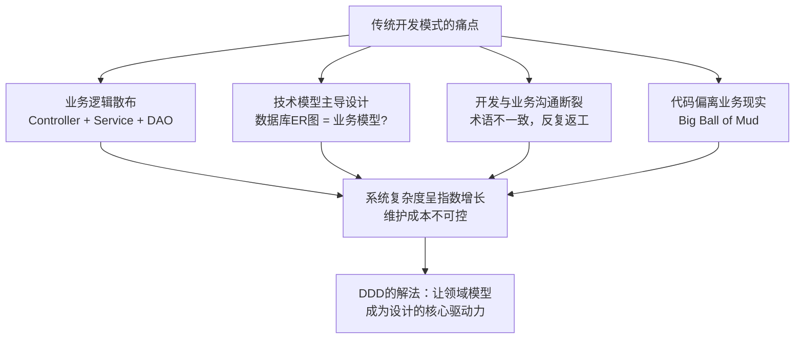

领域驱动设计（Domain-Driven Design，简称DDD）正是Eric Evans在2003年的经典著作中提出的系统性方法论，旨在弥合这一鸿沟。DDD不是一种技术框架，也不是某种具体的架构模式，而是一套思维工具和实践原则，帮助团队将软件设计的焦点从技术实现转向业务领域本身。

***

## 本章涵盖内容

本章从理论基础到实战应用，系统性地讲解DDD的核心概念与实践方法：

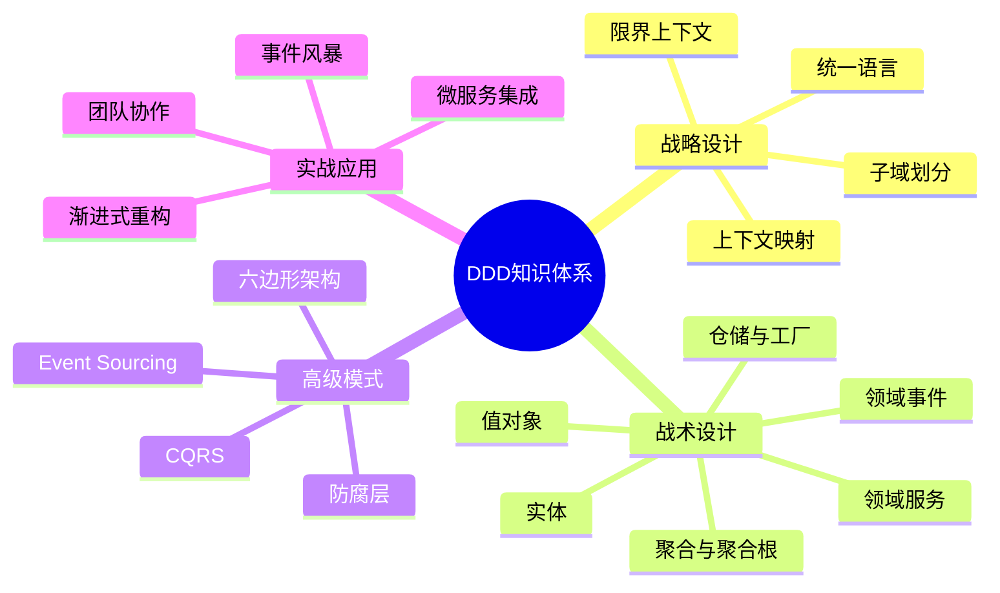

**战略设计层面**：我们首先探讨限界上下文（Bounded Context）的划分原则，这是DDD最重要的战略决策——如何将一个庞大的业务领域拆分为多个自治的、边界清晰的上下文。随后分析上下文映射（Context Map）中各种集成模式，以及统一语言（Ubiquitous Language）如何成为团队协作的基石。

**战术设计层面**：我们逐一深入DDD的构建块——实体（Entity）、值对象（Value Object）、聚合（Aggregate）与聚合根（Aggregate Root）、领域服务（Domain Service）、领域事件（Domain Event）、仓储（Repository）和工厂（Factory）。每个构建块都有其适用场景和设计约束，理解它们的边界与交互方式是掌握DDD的关键。

**高级主题**：我们将探讨DDD与CQRS（命令查询职责分离）和事件溯源（Event Sourcing）的关系，DDD在微服务架构中的应用，以及贫血模型与充血模型之争背后的深层设计哲学。

**实践指导**：通过完整的电商领域案例，展示如何从零开始运用DDD进行领域建模。同时总结团队在采用DDD过程中最常见的误区与陷阱，以及循序渐进的学习路径。

***

## 本章学习目标

完成本章学习后，读者应能够：

1. 理解DDD的战略设计与战术设计的完整框架
2. 掌握限界上下文的识别与划分方法
3. 熟练运用实体、值对象、聚合等战术模式进行领域建模
4. 在实际项目中应用统一语言促进团队协作
5. 识别并避免DDD实践中的常见反模式
6. 将DDD与微服务、CQRS等现代架构模式有机结合

***

## 前置知识

本章假设读者已具备以下基础：

- 第28章"架构风格"中关于分层架构和六边形架构的基本概念
- 第29章"设计模式"中关于面向对象设计原则的理解
- 基本的数据库建模和API设计经验

***

## 关键参考文献

- Eric Evans, *Domain-Driven Design: Tackling Complexity in the Heart of Software*, Addison-Wesley, 2003
- Vaughn Vernon, *Implementing Domain-Driven Design*, Addison-Wesley, 2013
- Vaughn Vernon, *Domain-Driven Design Distilled*, Addison-Wesley, 2016
- Martin Fowler, *Patterns of Enterprise Application Architecture*, Addison-Wesley, 2002


***

# 领域驱动设计：理论基础

***

## 30.1 DDD的起源与核心思想

### 30.1.1 软件复杂性的本质

软件项目失败的原因很少是技术能力不足。Eric Evans在《Domain-Driven Design》中深刻指出，大多数失败源于对业务领域理解的不足。当系统复杂度增长时，代码逐渐偏离业务现实，开发者陷入技术细节的泥沼，而业务规则的散落、不一致和遗漏则成为系统维护的噩梦。

传统开发模式中，业务逻辑往往散布在服务层、数据访问层甚至前端代码中。一个简单的业务规则——比如"VIP客户下单满100元免运费"——可能需要修改Controller、Service、DAO三个层次的代码。随着规则数量增长，这种散布式设计导致的复杂度呈指数级增长，最终形成Big Ball of Mud。

DDD的核心主张是：**软件设计的复杂性应该由领域模型来管理**。领域模型不是数据库ER图，不是UML类图，而是团队对业务领域的共同理解在代码中的精确映射。

### 30.1.2 Evans的核心洞见

Eric Evans在2003年提出DDD时，给出了几个革命性的洞见：

**洞见一：模型是设计的核心**。传统方法中，模型（如UML图）是文档，设计是代码，两者之间存在翻译损耗。DDD主张模型即代码、代码即模型——领域模型直接体现在代码结构中，任何对模型的修改都直接反映为代码变更。

**洞见二：统一语言是协作的基石**。开发者和业务专家必须使用同一套术语进行沟通。当业务人员说"订单"时，代码中必须存在一个叫"Order"的概念，且两者含义完全一致。这不是简单的命名约定，而是一种深层的组织实践。

**洞见三：模型驱动设计需要持续精炼**。领域模型不是一蹴而就的设计产物，而是通过持续的探索、实验和重构逐步精炼的。每一次与业务专家的深入对话，都可能触发模型的重构和进化。

**洞见四：技术与领域必须深度绑定**。传统的分层架构试图将业务逻辑与技术实现完全分离，但这导致了贫血模型——领域对象退化为数据容器，业务逻辑散落到服务层。DDD主张在领域层深度使用面向对象技术，让领域对象封装业务规则和行为。

***

## 30.2 统一语言（Ubiquitous Language）

### 30.2.1 什么是统一语言

统一语言是DDD的基石。它是一套在特定限界上下文中，由开发者和领域专家共同建立并严格遵守的术语体系。统一语言不是文档词汇表，而是活的语言——它存在于对话中、代码中、文档中、测试用例中。

统一语言的关键特征：

- **精确性**：每个术语有且只有一个明确含义。"客户"在销售上下文中指购买者，在客服上下文中指服务对象，两者是不同的概念。
- **完整性**：覆盖领域的所有重要概念，没有遗漏。
- **一致性**：在同一个限界上下文中，同一概念只有一种表达方式。不能一会儿叫"订单"，一会儿叫"购买记录"。
- **可执行性**：术语直接映射到代码中的类、方法和属性。

### 30.2.2 统一语言的建立过程

建立统一语言不是一次性的词汇表编写活动，而是一个持续的协作过程：

**第一步：领域对话**。开发者与业务专家进行深入对话，讨论业务流程、规则和约束。在对话中注意业务专家使用的自然语言，记录反复出现的关键术语。

**第二步：术语提炼**。从对话记录中提取核心术语，明确定义每个术语的含义、边界和与其他术语的关系。注意识别同义词和歧义词。

**第三步：模型表达**。将术语映射为代码结构——类名、方法名、属性名必须与术语一一对应。如果业务专家说"客户下了一个订单"，代码中就应该有 `customer.placeOrder()` 这样的方法。

**第四步：持续精炼**。在每次迭代中，当发现模型与业务现实不符时，与业务专家重新讨论术语的含义，修正模型。统一语言是活的，会随着团队对领域理解的深入而进化。

### 30.2.3 统一语言的实践原则

**原则一：代码即语言**。代码中的命名不是技术命名，而是业务语言。避免使用 `processData()`、`handleEvent()` 这样技术性的命名，而应使用 `approveLoan()`、`shipOrder()` 这样表达业务意图的命名。

**原则二：测试即规格**。测试用例应该用统一语言编写，描述业务场景而非技术行为。使用行为驱动开发（BDD）风格的测试：

```gherkin
Given 客户是VIP会员
When 订单金额超过100元
Then 运费应为0元
```

**原则三：拒绝妥协**。当开发者和业务专家对术语理解不一致时，必须深入讨论直到达成共识。不要用模糊的命名来掩盖分歧。

***

## 30.3 战略设计

战略设计关注的是系统的宏观结构——如何将一个庞大的业务领域分解为多个可管理的部分，以及这些部分之间如何协作。

### 30.3.1 限界上下文（Bounded Context）

限界上下文是DDD中最重要的战略概念。它定义了一个明确的边界，在这个边界内，统一语言有且仅有一套含义。

**为什么需要限界上下文？**

在大型系统中，同一个术语在不同场景下往往有不同的含义。"产品"在目录上下文中指商品的展示信息（名称、图片、描述），在库存上下文中指可售数量和仓库位置，在定价上下文中指价格策略和折扣规则。试图用一个统一的"Product"模型来满足所有场景，必然导致模型臃肿、充满条件分支和妥协。

限界上下文的解决方案是：允许在不同上下文中存在同名但不同义的概念。目录上下文的"Product"和库存上下文的"Product"是两个完全独立的模型，各自封装各自领域的业务规则。

**限界上下文的划分原则**：

1. **业务能力驱动**：每个限界上下文对应一个业务能力，而非一个技术层。订单管理、支付处理、库存管理各是一个限界上下文。
2. **团队自治**：一个限界上下文由一个团队负责，团队对上下文内的模型有完全的决策权。
3. **语言边界**：当发现同一术语在不同场景下含义不同时，就应该考虑划分限界上下文。
4. **变更频率**：变更频率相近的功能应放在同一上下文中，避免一个简单变更波及多个上下文。

**限界上下文与微服务的关系**：

限界上下文是微服务划分的理想起点。一个限界上下文通常对应一个微服务，但并非绝对——小型系统中，一个微服务可以包含多个限界上下文，大型限界上下文也可能拆分为多个微服务。

### 30.3.2 上下文映射（Context Map）

限界上下文不是孤岛，它们之间需要协作和集成。上下文映射描述了限界上下文之间的关系模式。以下是一张完整的上下文映射图示例：

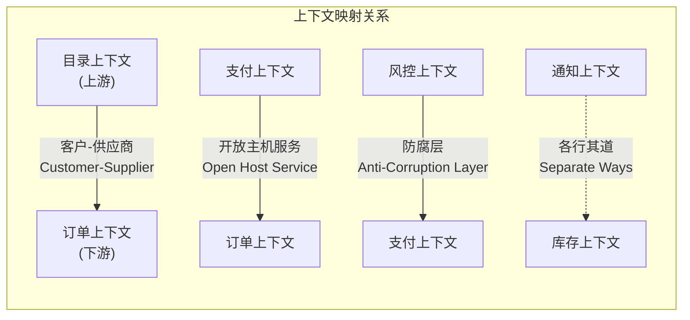

**合作关系（Partnership）**：两个上下文紧密协作，共同规划和演进。当一个上下文的变更需要另一个上下文配合时，双方共同制定计划。

**共享内核（Shared Kernel）**：两个上下文共享一小部分模型代码。共享内核必须小而稳定，任何修改都需要双方团队同意。这是一种高耦合的集成方式，应谨慎使用。

**客户-供应商（Customer-Supplier）**：上游（供应商）上下文为下游（客户）上下文提供服务。下游对上游有需求，上游需要考虑下游的需求但保留最终决策权。

**跟随者（Conformist）**：下游上下文完全遵循上游的模型和接口。当上游不关心下游需求时，下游只能被动接受上游的模型。

**防腐层（Anticorruption Layer，ACL）**：当下游上下文需要与上游上下文集成，但又不想被上游模型污染时，在边界处建立一个翻译层。防腐层将上游模型转换为下游模型，保护下游的统一语言不受侵蚀。

**开放主机服务（Open Host Service，OHS）**：上游上下文通过定义良好的协议（如REST API、消息队列）为多个下游上下文提供服务。上游定义标准化的访问协议，下游自行适配。

**发布语言（Published Language，PL）**：上下文之间通过共享的数据格式（如JSON Schema、Protobuf、Avro）进行通信。发布语言降低了上下文之间的耦合，但需要维护格式的兼容性。

**各行其道（Separate Ways）**：两个上下文完全独立，不进行任何集成。当集成的成本超过收益时，这是合理的选择。

**大泥球（Big Ball of Mud）**：系统中存在没有清晰边界的区域。识别大泥球是战略重构的起点。

### 30.3.3 上下文映射的实践建议

绘制上下文映射图时，建议使用以下步骤：

1. 列出系统中的所有限界上下文
2. 识别上下文之间的数据流动和依赖关系
3. 为每对相邻的上下文确定集成模式
4. 评估集成模式是否符合团队的组织结构（康威定律）
5. 定期审查映射关系，随着业务变化调整

***

## 30.4 战术设计：核心构建块

战术设计关注的是单个限界上下文内部的模型设计。DDD提供了一套丰富的构建块，用于在代码中精确表达领域概念。

### 30.4.1 实体（Entity）

实体是具有唯一标识的领域对象。即使两个实体的所有属性都相同，只要标识不同，它们就是不同的实体。

**实体的关键特征**：

- **唯一标识**：实体在创建时获得一个标识符，该标识符在实体的整个生命周期中保持不变，即使实体的其他属性发生变化。
- **生命周期管理**：实体有明确的创建、修改和销毁过程。
- **行为封装**：实体不是数据容器，它封装了与自身状态相关的业务规则和行为。

**实体标识的设计**：

```java
// 使用UUID作为标识符
public class Order {
    private final OrderId id;  // 值对象，封装UUID
    private OrderStatus status;
    private List<OrderLine> lines;
    
    public Order(OrderId id) {
        this.id = id;
        this.status = OrderStatus.CREATED;
        this.lines = new ArrayList<>();
    }
    
    public void addLine(Product product, int quantity) {
        // 业务规则：已确认的订单不能添加商品
        if (this.status != OrderStatus.CREATED) {
            throw new OrderAlreadyConfirmedException(this.id);
        }
        this.lines.add(new OrderLine(product, quantity));
    }
}
```

**实体相等性**：实体通过标识判断相等，而非属性。两个 `Order` 对象即使属性完全相同，只要 `id` 不同就不相等。

### 30.4.2 值对象（Value Object）

值对象是没有唯一标识的领域对象，通过其属性值来定义相等性。

**值对象的关键特征**：

- **无标识**：值对象没有ID，两个值对象的所有属性相同则认为相等。
- **不可变**：值对象一旦创建就不应修改。需要改变时，创建一个新的值对象来替换。
- **自验证**：值对象在创建时验证自身的有效性，确保不存在非法状态。
- **行为丰富**：值对象可以包含与自身相关的业务逻辑。

**经典示例：Money**

```java
public final class Money {
    private final BigDecimal amount;
    private final Currency currency;
    
    public Money(BigDecimal amount, Currency currency) {
        if (amount == null || currency == null) {
            throw new IllegalArgumentException("金额和货币不能为空");
        }
        if (amount.scale() > currency.getDefaultFractionDigits()) {
            throw new IllegalArgumentException("金额精度超出货币允许范围");
        }
        this.amount = amount;
        this.currency = currency;
    }
    
    public Money add(Money other) {
        if (!this.currency.equals(other.currency)) {
            throw new CurrencyMismatchException(this.currency, other.currency);
        }
        return new Money(this.amount.add(other.amount), this.currency);
    }
    
    public Money multiply(int factor) {
        return new Money(this.amount.multiply(BigDecimal.valueOf(factor)), this.currency);
    }
    
    // equals和hashCode基于amount和currency
}
```

**值对象与实体的选择**：

判断一个概念应该是实体还是值对象，关键问题不是"它有没有ID"，而是"在业务场景中，我们是否关心它的身份"。地址在物流上下文中可能是实体（因为需要跟踪地址的变更历史），而在订单上下文中通常是值对象（只关心当前的收货地址是什么）。

### 实体 vs 值对象：对比总结

| 维度 | 实体（Entity） | 值对象（Value Object） |
|------|---------------|----------------------|
| 标识 | 有唯一标识（ID） | 无标识，通过属性值判断相等 |
| 相等性 | ID相同即相等 | 所有属性值相同才相等 |
| 可变性 | 有生命周期，状态可变 | 不可变，改变时创建新实例 |
| 设计重点 | 身份和状态转换 | 属性值和业务行为 |
| 典型示例 | Order、Customer、Product | Money、Address、DateRange |
| 持久化 | 通常独立持久化 | 通常嵌入实体中存储 |
| 选择标准 | 业务上是否关心"它是谁" | 业务上是否只关心"它是什么" |

### 30.4.3 聚合（Aggregate）与聚合根（Aggregate Root）

聚合是DDD中最核心也最容易被误解的概念。聚合是一组相关对象的集合，作为数据修改的一致性边界。

**聚合的目的**：

在复杂的领域模型中，对象之间存在大量关联关系。如果没有一致性的边界，修改一个对象可能需要同时修改多个关联对象，导致事务管理和并发控制变得极其复杂。聚合通过定义明确的一致性边界，简化了这个问题。

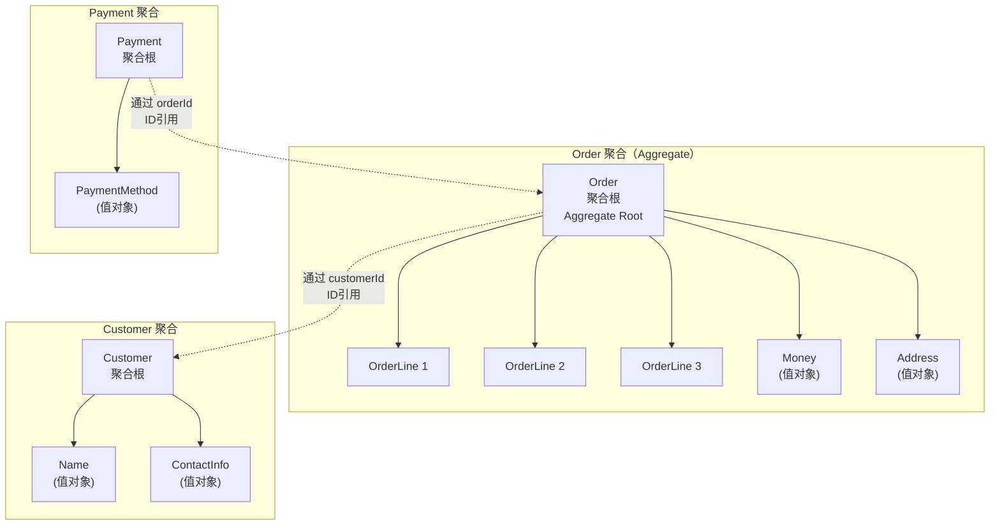

**聚合的设计规则（Vaughn Vernon总结）**：

**规则一：在聚合边界内保护业务不变量（Invariants）**。聚合内的所有对象必须在每次事务完成后处于一致状态。不变量是必须始终满足的业务规则。

**规则二：聚合作为一致性边界**。一个事务只修改一个聚合。如果一个业务操作需要修改多个聚合，使用最终一致性而非强一致性。

**规则三：通过聚合根引用聚合内的对象**。外部对象只能持有对聚合根的引用，不能直接引用聚合内部的对象。

**规则四：聚合间通过ID引用**。聚合之间不要通过对象引用关联，而是通过ID（通常是聚合根的ID）进行引用。这降低了聚合之间的耦合。

**规则五：小聚合优先**。聚合应该尽可能小，只包含满足不变量所需的最少对象。过大的聚合会导致性能问题和并发冲突。

**示例：订单聚合**

```java
public class Order {  // 聚合根
    private final OrderId id;
    private CustomerId customerId;  // 通过ID引用其他聚合
    private List<OrderLine> lines;  // 聚合内部对象
    private Money totalAmount;
    private OrderStatus status;
    
    public void addLine(ProductId productId, Money unitPrice, int quantity) {
        // 业务不变量：已确认订单不能修改
        assertStatus(OrderStatus.CREATED);
        
        // 业务不变量：订单行数不超过50
        if (lines.size() >= 50) {
            throw new TooManyOrderLinesException();
        }
        
        OrderLine line = new OrderLine(productId, unitPrice, quantity);
        lines.add(line);
        recalculateTotal();
    }
    
    private void recalculateTotal() {
        this.totalAmount = lines.stream()
            .map(OrderLine::subtotal)
            .reduce(Money.ZERO, Money::add);
    }
}
```

**聚合设计的常见错误**：

1. **过度设计**：将过多对象放入一个聚合，导致性能问题。
2. **忽略不变量**：没有识别真正的业务不变量，导致聚合边界过大或过小。
3. **聚合间对象引用**：跨聚合直接引用对象，破坏了聚合的封装性。

### 30.4.4 领域服务（Domain Service）

有些业务操作不属于任何一个实体或值对象，因为它们涉及多个聚合的协作，或者需要访问外部资源。领域服务封装了这些不属于任何单一领域对象的业务逻辑。

**领域服务的特征**：

- **无状态**：领域服务不持有状态，它的所有输入都是参数，所有输出都是返回值。
- **业务导向**：领域服务封装的是业务逻辑，不是技术逻辑。不要将数据库访问、消息发送等基础设施逻辑放在领域服务中。
- **命名反映业务**：领域服务的方法名应该反映业务动作，如 `TransferService.transfer(from, to, amount)`。

**领域服务的使用场景**：

1. **跨聚合的业务逻辑**：转账操作涉及两个账户聚合的协作，不属于任何一个账户。
2. **复杂计算**：涉及多个领域对象的复杂计算，如风险评估、推荐算法。
3. **策略选择**：根据运行时条件选择不同的业务策略。

```java
public class TransferService {
    private final AccountRepository accountRepo;
    
    public TransferResult transfer(AccountId fromId, AccountId toId, Money amount) {
        Account from = accountRepo.findById(fromId);
        Account to = accountRepo.findById(toId);
        
        // 业务规则验证
        if (!from.canDebit(amount)) {
            return TransferResult.insufficientFunds(fromId);
        }
        
        // 执行转账
        from.debit(amount);
        to.credit(amount);
        
        // 保存变更
        accountRepo.save(from);
        accountRepo.save(to);
        
        return TransferResult.success(fromId, toId, amount);
    }
}
```

**注意**：不要将所有逻辑都放入领域服务。如果逻辑只涉及一个聚合，应该放在聚合内部。领域服务被过度使用往往意味着聚合设计有问题。

### 30.4.5 领域事件（Domain Event）

领域事件表示领域中发生的有意义的事情。它是对过去事实的记录——已经发生的、对业务有意义的事件。

**领域事件的特征**：

- **过去时态命名**：事件名使用过去时态，如 `OrderPlaced`、`PaymentReceived`、`ShipmentDispatched`。
- **不可变**：领域事件一旦发生就不能改变或撤销。
- **携带足够的上下文信息**：事件应该包含消费者所需的全部信息，避免消费者回查事件发布者。

```java
public class OrderPlaced {
    private final OrderId orderId;
    private final CustomerId customerId;
    private final Money totalAmount;
    private final List<OrderLineSnapshot> lines;
    private final Instant occurredOn;
    
    // 构造函数、getter...
}
```

**领域事件的用途**：

1. **聚合间通信**：一个聚合的变更通过事件通知其他聚合，实现最终一致性。
2. **审计追踪**：领域事件是天然的审计日志，记录系统中发生的所有业务操作。
3. **系统集成**：通过消息中间件将领域事件发布到外部系统，实现跨系统的业务流程。
4. **事件溯源**：基于领域事件重建聚合状态。

**领域事件（Domain Event）vs 集成事件（Integration Event）**：

在实践中，经常混淆领域事件和集成事件。两者虽然都是事件，但用途和设计有本质区别：

| 维度 | 领域事件（Domain Event） | 集成事件（Integration Event） |
|------|------------------------|---------------------------|
| 作用范围 | 单个限界上下文内部 | 跨限界上下文或跨系统 |
| 命名粒度 | 细粒度，反映业务动作 | 粗粒度，反映业务结果 |
| 发布时机 | 聚合状态变更时立即发布 | 事务提交后发布 |
| 消费者 | 同一上下文内的其他聚合 | 其他上下文或其他系统 |
| 数据格式 | 直接使用领域模型类型 | 使用外部友好的DTO格式 |
| 持久化 | 可以不持久化（进程内事件） | 必须持久化（确保可靠投递） |
| 示例 | `OrderLineAdded`、`StatusChanged` | `OrderPaid`、`CustomerRegistered` |

```java
// 领域事件：细粒度，上下文内部使用
public class OrderLineAdded {
    private final OrderId orderId;
    private final ProductId productId;
    private final int quantity;
}

// 集成事件：粗粒度，跨上下文传播
public class OrderPaidEvent {
    private final String orderId;        // 字符串而非值对象
    private final String customerId;
    private final BigDecimal amount;     // 基础类型而非值对象
    private final String currency;
    private final Instant occurredOn;
    private final String eventId;        // 用于幂等去重
}
```

**设计原则**：一个领域事件可以触发一个或多个集成事件的发布，但不要让集成事件反向污染领域层。集成事件的定义和发布应该在应用层或基础设施层完成。

### 30.4.6 仓储（Repository）

仓储是聚合的持久化接口。它向领域层隐藏了数据存储的细节，提供了一个看似集合的访问接口。

**仓储的设计原则**：

- **每个聚合根一个仓储**：只有聚合根才有仓储，聚合内部对象通过聚合根访问。
- **接口在领域层，实现在基础设施层**：仓储接口定义在领域层，具体的数据库访问实现在基础设施层。
- **返回完整聚合**：仓储的查询方法返回完整的聚合实例，而不是部分数据。
- **只提供必要的查询方法**：仓储不是通用的数据访问层，只提供业务需要的查询方法。

```java
// 领域层：仓储接口
public interface OrderRepository {
    Order findById(OrderId id);
    void save(Order order);
    List<Order> findByCustomerId(CustomerId customerId);
}

// 基础设施层：仓储实现
@Repository
public class JpaOrderRepository implements OrderRepository {
    @Autowired
    private OrderJpaRepository jpaRepo;
    
    @Override
    public Order findById(OrderId id) {
        OrderEntity entity = jpaRepo.findById(id.value())
            .orElseThrow(() -> new OrderNotFoundException(id));
        return OrderMapper.toDomain(entity);
    }
    
    @Override
    public void save(Order order) {
        OrderEntity entity = OrderMapper.toEntity(order);
        jpaRepo.save(entity);
    }
}
```

### 30.4.7 工厂（Factory）

工厂封装了复杂对象的创建逻辑。当聚合或实体的创建过程涉及多个步骤、需要组装复杂对象图时，使用工厂可以简化客户端代码并确保创建出的对象处于有效状态。

**工厂的使用场景**：

1. **复杂聚合的创建**：创建一个聚合需要同时创建多个内部对象。
2. **对象重建**：从持久化存储中重建领域对象时，需要恢复对象的完整状态。
3. **策略选择**：根据参数创建不同类型的对象。

工厂可以是独立的工厂类、聚合根的静态方法，或者仓储的创建方法。选择哪种形式取决于具体的业务场景。

### 30.4.8 应用服务（Application Service）

应用服务是领域层的协调者，负责编排领域对象完成业务用例。与领域服务不同，应用服务不包含业务逻辑，它只负责流程编排、事务管理和安全性控制。

**应用服务与领域服务的关键区别**：

| 维度 | 应用服务（Application Service） | 领域服务（Domain Service） |
|------|-------------------------------|--------------------------|
| 层级 | 应用层 | 领域层 |
| 职责 | 编排用例流程，管理事务 | 封装跨聚合的业务逻辑 |
| 业务逻辑 | 不包含业务规则 | 包含业务规则 |
| 依赖 | 仓储、领域服务、事件发布器 | 仓储、其他领域对象 |
| 命名风格 | `PlaceOrderUseCase`、`CancelOrderUseCase` | `TransferService`、`PricingService` |
| 可替换性 | 用例逻辑可变化 | 业务规则应稳定 |

**应用服务的职责清单**：

1. **用例编排**：协调领域对象、仓储和领域服务完成业务流程
2. **事务管理**：确保一个业务操作在同一个事务中完成
3. **安全控制**：验证用户身份和权限
4. **事件发布**：在事务提交后发布领域事件
5. **日志审计**：记录关键业务操作的日志
6. **防腐层协调**：在需要时调用防腐层转换外部模型

**代码示例**：

```java
// 应用服务：不包含业务逻辑，只做编排
@Service
public class PlaceOrderUseCase {
    private final OrderRepository orderRepo;
    private final ProductRepository productRepo;
    private final PricingService pricingService;
    private final EventPublisher eventPublisher;

    @Transactional
    public OrderId execute(PlaceOrderCommand command) {
        // 1. 加载聚合
        CustomerId customerId = new CustomerId(command.customerId());
        Order order = OrderFactory.create(customerId);

        // 2. 编排领域对象
        for (OrderItemCommand item : command.items()) {
            Product product = productRepo.findById(new ProductId(item.productId()));
            Money price = pricingService.calculatePrice(product, item.quantity());
            order.addLine(product.id(), price, item.quantity());
        }

        // 3. 确认订单
        order.confirm();

        // 4. 持久化
        orderRepo.save(order);

        // 5. 发布事件
        eventPublisher.publishAll(order.pullEvents());

        return order.id();
    }
}

// 领域服务：包含业务逻辑
@Service
public class PricingService {
    public Money calculatePrice(Product product, int quantity) {
        Money basePrice = product.basePrice();
        // 业务规则：批量购买打折
        if (quantity >= 10) {
            return basePrice.multiply(quantity).multiply(0.9); // 9折
        }
        return basePrice.multiply(quantity);
    }
}
```

**反模式：胖应用服务**。当应用服务中出现了if-else判断、业务规则验证、金额计算等逻辑时，说明业务逻辑从领域层泄漏到了应用层。正确的做法是将这些逻辑移回聚合或领域服务中。

### 30.4.9 战术构建块总览

| 构建块 | 职责 | 核心特征 | 使用场景 |
|--------|------|---------|---------| 
| 实体（Entity） | 封装有身份的对象及其行为 | 有唯一标识，生命周期管理 | 需要跟踪身份和状态变化的业务概念 |
| 值对象（Value Object） | 封装无身份的描述性概念 | 无标识、不可变、自验证 | Money、Address、DateRange等描述性概念 |
| 聚合（Aggregate） | 定义一致性边界 | 包含一个聚合根和关联对象 | 保护业务不变量的事务边界 |
| 领域服务（Domain Service） | 跨聚合的业务逻辑 | 无状态、业务导向 | 转账、风险评估等跨聚合操作 |
| 领域事件（Domain Event） | 记录已发生的业务事实 | 过去时态、不可变 | 聚合间通信、审计追踪、系统集成 |
| 仓储（Repository） | 聚合的持久化接口 | 接口在领域层、返回完整聚合 | 聚合的存取和查询 |
| 工厂（Factory） | 复杂对象的创建 | 封装创建逻辑 | 复合聚合的组装和重建 |
| 应用服务（Application Service） | 用例编排和事务管理 | 不含业务逻辑，协调领域对象 | 下单、支付等业务流程的入口 |

***

## 30.5 聚合设计的深入探讨

聚合设计是DDD战术设计中最关键也最困难的部分。Vaughn Vernon在《Implementing Domain-Driven Design》中提出了系统化的聚合设计方法。

### 30.5.1 聚合设计的十条原则

1. **保护真实不变量**：只在聚合边界内保护那些必须在同一事务中保持一致的业务规则。
2. **小聚合**：聚合应该尽可能小。理想的聚合只包含一个实体（聚合根）和若干值对象。
3. **通过ID引用其他聚合**：聚合之间不要通过对象引用，使用ID引用降低耦合。
4. **一个事务一个聚合**：一个事务只修改一个聚合。跨聚合的修改使用领域事件实现最终一致性。
5. **使用乐观锁**：通过版本号实现乐观并发控制，避免分布式锁。
6. **更新其他聚合使用异步处理**：一个聚合的状态变更通过领域事件异步通知其他聚合。
7. **在聚合根上暴露业务行为**：聚合根是聚合的唯一入口，所有业务操作都通过聚合根的方法执行。
8. **只在聚合根上使用仓储**：外部只能通过仓储加载和保存聚合根。
9. **设计小聚合不代表放弃一致性**：通过领域事件和最终一致性，小聚合同样可以保证业务规则的正确性。
10. **考虑用户意图**：聚合的设计应该反映用户的业务意图，而不是数据结构。

### 30.5.2 聚合设计的实例分析

**场景**：设计一个电商系统的订单模型。

**错误设计（大聚合）**：

```java
class Order {
    OrderId id;
    Customer customer;       // 直接引用Customer聚合
    List<OrderLine> lines;
    Payment payment;         // 直接引用Payment聚合
    Shipment shipment;       // 直接引用Shipment聚合
}
```

这个设计的问题：

- Order聚合太大，包含了太多不属于同一事务的内容
- 直接引用其他聚合对象，导致加载Order时需要加载整个关联对象图
- 并发修改Order的任何部分都需要锁定整个聚合

**正确设计（小聚合 + ID引用）**：

```java
class Order {
    OrderId id;
    CustomerId customerId;   // ID引用
    List<OrderLine> lines;
    OrderStatus status;
    Money totalAmount;
    
    // 只包含订单本身的一致性规则
    void addLine(ProductId productId, Money price, int qty) {
        assertCanModify();
        lines.add(new OrderLine(productId, price, qty));
        recalculateTotal();
    }
    
    void confirm() {
        assertCanConfirm();
        this.status = OrderStatus.CONFIRMED;
        // 发布领域事件
        DomainEventPublisher.publish(new OrderConfirmed(this.id, this.customerId, this.totalAmount));
    }
}
```

Payment和Shipment是独立的聚合，通过领域事件与Order异步协作。

***

## 30.6 DDD与CQRS/Event Sourcing

### 30.6.1 CQRS（命令查询职责分离）

CQRS将系统的读操作和写操作分离到不同的模型中。命令模型（写模型）专注于业务逻辑的处理，查询模型（读模型）专注于数据的展示。

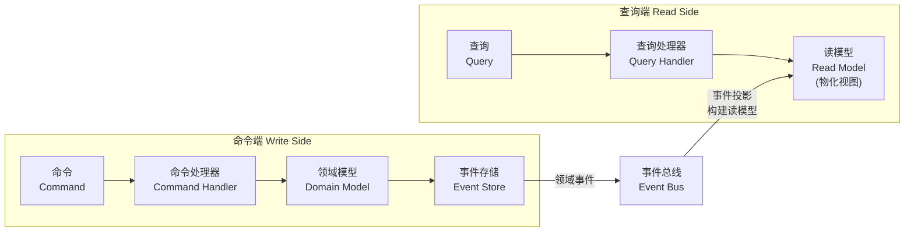

**CQRS与DDD的关系**：

- DDD的领域模型天然适合CQRS的命令模型。聚合根封装业务逻辑，接收命令并产生领域事件。
- 查询模型不需要领域模型的复杂性，可以直接使用数据库查询或专门的读优化视图。
- CQRS不是DDD必须的，但对于复杂的读写不对称场景，CQRS可以显著简化领域模型的设计。

### 30.6.2 事件溯源（Event Sourcing）

事件溯源将聚合的状态以领域事件序列的形式持久化，而不是存储当前状态。聚合的状态可以通过重放事件序列来重建。

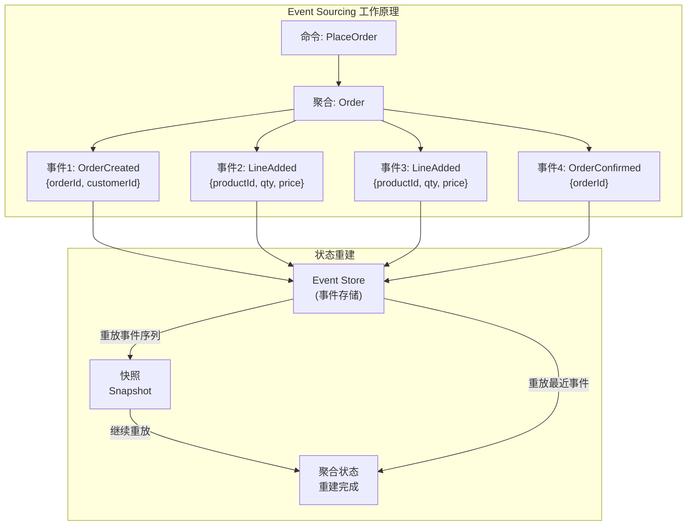

**事件溯源的优势**：

- **完整的审计追踪**：每个状态变更都有记录。
- **时间旅行**：可以重建任意时间点的聚合状态。
- **与CQRS的天然配合**：命令端产生事件，查询端消费事件构建读视图。

**事件溯源的挑战**：

- **事件版本管理**：当事件结构变化时，需要处理事件的向上兼容。
- **查询复杂度**：查询历史状态需要重放事件，性能较差。通常需要配合CQRS的读模型。
- **最终一致性**：事件的处理存在延迟，读模型可能暂时与写模型不一致。

### 30.6.3 Saga模式与过程管理（Process Manager）

当一个业务流程跨越多个聚合、需要在多个步骤之间协调状态时，单一的领域事件处理已经不够了。Saga模式和过程管理器（Process Manager）是处理复杂跨聚合业务流程的两种核心模式。

**Saga与Process Manager的区别**：

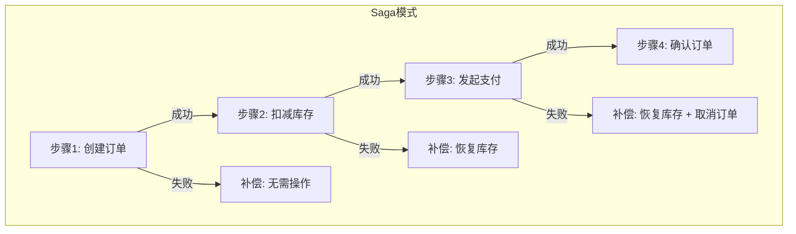

**Saga**：一种补偿事务模式。每个步骤失败时，执行一系列补偿操作来回滚之前已完成的步骤。Saga不维护中央状态，而是由每个步骤自行决定下一步和补偿逻辑。

```java
// Saga实现：订单创建流程
public class CreateOrderSaga {
    private final OrderRepository orderRepo;
    private final InventoryService inventoryService;
    private final PaymentService paymentService;

    public void start(CreateOrderCommand command) {
        // 步骤1：创建订单
        Order order = OrderFactory.create(command);
        orderRepo.save(order);

        // 步骤2：扣减库存
        try {
            inventoryService.deductStock(order.lines());
        } catch (InsufficientStockException e) {
            // 补偿：取消订单
            order.cancel();
            orderRepo.save(order);
            throw new SagaFailedException("库存不足，订单已取消", e);
        }

        // 步骤3：发起支付
        try {
            paymentService.initiatePayment(order.id(), order.totalAmount());
        } catch (PaymentException e) {
            // 补偿：恢复库存 + 取消订单
            inventoryService.restoreStock(order.lines());
            order.cancel();
            orderRepo.save(order);
            throw new SagaFailedException("支付失败，订单已取消", e);
        }
    }
}
```

**Process Manager**：一种中央协调模式。与Saga不同，Process Manager维护一个独立的状态机，追踪整个业务流程的当前状态，根据当前状态和接收到的事件决定下一步操作。

```java
// Process Manager实现
public class OrderProcessManager {
    private ProcessManagerState state;

    public void on(OrderCreated event) {
        // 订单已创建，下一步：扣减库存
        state = state.transitionTo(OrderProcessState.STOCK_DEDUCTING);
        commandGateway.send(new DeductStockCommand(event.orderId()));
    }

    public void on(StockDeducted event) {
        // 库存已扣减，下一步：发起支付
        state = state.transitionTo(OrderProcessState.PAYMENT_INITIATING);
        commandGateway.send(new InitiatePaymentCommand(event.orderId()));
    }

    public void on(PaymentSucceeded event) {
        // 支付成功，下一步：确认订单
        state = state.transitionTo(OrderProcessState.CONFIRMING);
        commandGateway.send(new ConfirmOrderCommand(event.orderId()));
    }

    public void on(PaymentFailed event) {
        // 支付失败，需要补偿
        state = state.transitionTo(OrderProcessState.COMPENSATING);
        commandGateway.send(new RestoreStockCommand(event.orderId()));
        commandGateway.send(new CancelOrderCommand(event.orderId()));
    }
}
```

**Saga vs Process Manager：选择指南**：

| 维度 | Saga | Process Manager |
|------|------|-----------------|
| 状态管理 | 无中央状态，步骤间隐式传递 | 有中央状态机，显式追踪流程状态 |
| 适用场景 | 简单线性流程（3-5步） | 复杂分支流程，需要条件判断 |
| 实现复杂度 | 较低 | 较高 |
| 可调试性 | 较差，状态分散 | 较好，状态集中管理 |
| 补偿逻辑 | 分散在每个步骤中 | 集中在Process Manager中 |
| 典型实现 | Axon Saga注解 | Axon Process Manager |

**事件驱动的事务补偿原则**：

1. **每一步都必须有补偿操作**：Sagas中的每一步都需要定义失败时的回滚策略
2. **补偿操作必须是幂等的**：补偿可能被多次调用
3. **补偿操作必须是最终成功的**：不能让补偿操作本身失败导致数据不一致
4. **使用死信队列（DLQ）兜底**：补偿失败的消息进入DLQ，由人工或自动重试机制处理

### 同步事件 vs 异步事件：对比分析

| 维度 | 同步事件处理 | 异步事件处理 |
|------|-------------|-------------|
| 一致性 | 强一致性，同一事务内完成 | 最终一致性，存在时间窗口 |
| 延迟 | 低延迟，立即生效 | 有延迟，取决于消息队列 |
| 耦合度 | 发布者与消费者紧耦合 | 发布者与消费者松耦合 |
| 可用性 | 消费者故障会影响发布者 | 消费者故障不影响发布者 |
| 吞吐量 | 受限于单事务处理能力 | 高吞吐，可水平扩展 |
| 适用场景 | 金融交易、库存扣减等强一致性需求 | 通知发送、数据同步等可容忍延迟的场景 |
| 实现复杂度 | 较低，直接方法调用 | 较高，需要消息中间件和幂等处理 |

***

## 30.7 DDD与微服务

### 30.7.1 限界上下文作为微服务边界

DDD的限界上下文是微服务划分的天然候选。每个限界上下文：

- 有独立的统一语言
- 有自治的团队
- 有明确的边界和接口
- 可以独立部署和演进

这与微服务的原则高度吻合。

### 30.7.2 上下文映射与微服务集成

上下文映射中的集成模式直接映射到微服务间的通信方式：

- **REST API**：对应开放主机服务
- **消息队列**：对应事件驱动的集成
- **防腐层**：在微服务边界处实现数据格式转换
- **API Gateway**：对应上下文映射中的入口点

### 30.7.3 实践建议

1. 先进行战略设计，划分限界上下文，再决定微服务的边界
2. 不要过早拆分微服务——先在单体中建立清晰的限界上下文边界
3. 使用领域事件驱动微服务间的异步通信
4. 每个微服务拥有自己的数据库，避免共享数据库

***

## 30.8 贫血模型 vs 充血模型

### 30.8.1 贫血模型（Anemic Domain Model）

贫血模型是Martin Fowler指出的反模式。在贫血模型中，领域对象只有getter和setter，没有业务行为。业务逻辑全部放在Service层。

```java
// 贫血模型
class Order {
    private String status;
    private BigDecimal totalAmount;
    // 只有getter和setter
}

// 业务逻辑在Service中
class OrderService {
    void confirmOrder(Order order) {
        if (!"CREATED".equals(order.getStatus())) {
            throw new RuntimeException("只能确认新建状态的订单");
        }
        order.setStatus("CONFIRMED");
    }
}
```

贫血模型的问题：

- 业务规则散落在Service中，难以维护
- 领域对象退化为数据容器，违背面向对象原则
- 不同的Service可能对同一领域概念有不一致的理解

### 30.8.2 充血模型（Rich Domain Model）

充血模型将业务逻辑封装在领域对象内部。领域对象不仅有数据，还有行为。

```java
// 充血模型
class Order {
    private OrderStatus status;
    private Money totalAmount;
    
    void confirm() {
        if (this.status != OrderStatus.CREATED) {
            throw new OrderCannotBeConfirmedException(this.id, this.status);
        }
        this.status = OrderStatus.CONFIRMED;
    }
}
```

充血模型的优势：

- 业务规则内聚在领域对象中
- 对象封装了自身的不变量
- 更容易测试和维护

**DDD强烈主张充血模型**。领域模型的价值在于封装业务逻辑，如果领域对象只有数据没有行为，那么DDD的核心价值就无从体现。

### 贫血模型 vs 充血模型：详细对比

| 维度 | 贫血模型（Anemic Domain Model） | 充血模型（Rich Domain Model） |
|------|-------------------------------|------------------------------|
| 业务逻辑位置 | 散落在Service层 | 封装在领域对象内部 |
| 领域对象 | 仅包含getter/setter，退化为数据容器 | 既包含数据也包含业务行为 |
| 面向对象原则 | 违反——对象只有状态没有行为 | 符合——对象封装状态和行为 |
| 代码可读性 | 业务规则难以从Service中找到 | 业务规则在聚合内自明 |
| 测试难度 | 需要构造完整的Service依赖链 | 聚合可以独立单元测试 |
| 维护成本 | 高——修改规则需搜索多个Service | 低——修改规则集中在领域对象 |
| 适用场景 | 简单CRUD系统，业务逻辑极少 | 复杂业务系统，有丰富的业务规则 |
| DDD立场 | 明确的反模式 | DDD的核心主张 |

DDD主张充血模型的深层原因在于：业务规则和行为与数据是不可分割的整体。将它们分离到不同的层次中，不仅破坏了封装性，还导致业务逻辑在多个Service中重复出现，最终形成"伪DDD"——使用了Entity、Repository这些术语，但并未体现DDD的核心价值。

***

## 30.9 分层架构与六边形架构

### 30.9.1 经典分层架构

DDD最初推荐四层架构，每一层只依赖其下方的层：

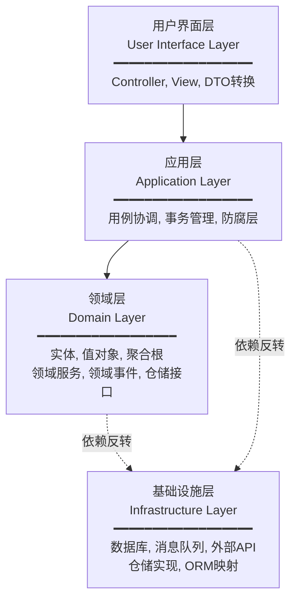

**各层职责**：

1. **用户界面层**：负责展示和用户交互，包括REST Controller、前端模板、DTO转换等。这一层将外部请求转换为应用层可以理解的命令或查询。
2. **应用层**：协调领域对象完成业务用例，不包含业务逻辑。应用层负责事务管理、安全认证、事件发布等横切关注点。它是"指挥官"角色，协调领域对象完成任务。
3. **领域层**：包含业务模型和业务逻辑，是DDD的核心。所有业务规则、不变量、领域事件都定义在这一层。领域层不依赖任何外部技术。
4. **基础设施层**：提供技术支撑，如数据库访问、消息发送、外部API调用。基础设施层实现了领域层定义的端口（如仓储接口）。

### 30.9.2 六边形架构（端口与适配器）

Alistair Cockburn提出的六边形架构与DDD高度契合。核心思想是：领域层在中心，外部世界通过端口和适配器与领域层交互。

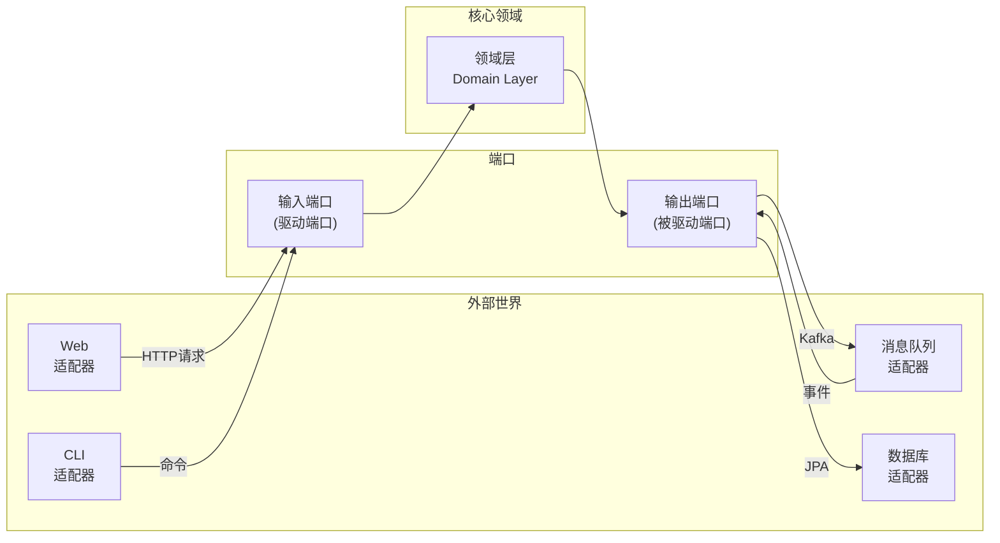

- **端口（Port）**：领域层定义的接口，如仓储接口、事件发布接口。输入端口（Driving Port）定义了外部如何与领域交互，输出端口（Driven Port）定义了领域如何与外部交互。
- **适配器（Adapter）**：基础设施层对端口接口的实现，如JPA仓储实现、Kafka事件发布实现。

这种架构确保了领域层不依赖任何外部技术，可以独立测试和演进。当需要更换数据库或消息中间件时，只需更换适配器，领域层代码无需改动。

### 30.9.3 DDD的性能优化策略

DDD的充血模型和聚合设计虽然带来了清晰的业务逻辑，但也引入了特定的性能挑战。以下是关键的优化策略：

**聚合加载优化**：

聚合应该整体加载，但当聚合内部包含大量子实体时，需要权衡加载策略。Vaughn Vernon建议的"小聚合"原则本身就能缓解这个问题——如果你的聚合需要分页加载子实体，说明聚合设计过大，应该拆分为多个小聚合。

```java
// 问题：Order聚合包含1000个OrderLine，全量加载性能差
// 解决：拆分为OrderHeader和OrderLineList两个聚合

// Order聚合（轻量）
class Order {
    OrderId id;
    CustomerId customerId;
    Money totalAmount;
    OrderStatus status;
    int lineCount;  // 冗余计数，避免每次查询Line聚合
}

// OrderLine聚合（独立）
class OrderLine {
    OrderLineId id;
    OrderId orderId;  // ID引用
    ProductId productId;
    Money unitPrice;
    int quantity;
}
```

**仓储查询优化**：

DDD强调"只提供业务需要的查询方法"，但这不意味着放弃查询性能。对于复杂的报表和仪表板查询，绕过领域模型直接使用读优化查询是合理的——这正是CQRS的核心思想。

```java
// 绕过领域模型的直接查询（用于报表）
@Repository
public class OrderReportQuery {
    @PersistenceContext
    private EntityManager em;

    public List<OrderSummaryDTO> findMonthlyRevenue(int year, int month) {
        return em.createQuery("""
            SELECT new OrderSummaryDTO(o.status, COUNT(o), SUM(o.totalAmount))
            FROM OrderJpaEntity o
            WHERE YEAR(o.createdAt) = :year AND MONTH(o.createdAt) = :month
            GROUP BY o.status
            """, OrderSummaryDTO.class)
            .setParameter("year", year)
            .setParameter("month", month)
            .getResultList();
    }
}
```

**缓存策略**：

在DDD中，缓存应该作用在正确的层级。仓储层的缓存可以减少数据库访问，但必须注意缓存失效策略与领域事件的一致性。

| 缓存层级 | 缓存对象 | 适用场景 | 失效策略 |
|---------|---------|---------|---------|
| 仓储层 | 聚合实例 | 读多写少的聚合（如商品目录） | 领域事件触发失效 |
| 应用层 | 查询结果 | 报表和仪表板查询 | 定时失效或版本号失效 |
| 领域层 | 值对象 | 不可变值对象（如地区编码） | 永不过期 |

**数据库层面**：

- 使用乐观锁（版本号）而非悲观锁，减少数据库锁竞争
- 聚合的根实体和内部实体使用单表存储，避免JOIN查询
- 领域事件表使用追加写入（append-only），配合时间分区表提升查询性能
- 读模型使用反范式化设计，以空间换时间

### 30.9.4 架构选择指南

| 场景 | 推荐架构 | 理由 |
|------|---------|------|
| 简单CRUD系统 | 经典三层架构 | 业务复杂度低，不需要DDD的深度分层 |
| 中等复杂度业务 | DDD分层架构 | 需要领域模型但集成需求简单 |
| 高度复杂业务 | 六边形架构 | 需要灵活替换外部依赖，便于测试 |
| 多渠道接入 | 六边形架构 | 多个驱动端口（Web、MQ、CLI）自然支持 |
| 微服务架构 | 六边形架构 + DDD | 每个服务内部用六边形架构，服务间用DDD限界上下文划分 |

***

## 本节小结

DDD的理论基础可以概括为三个层次：

1. **哲学层**：软件设计的核心是对业务领域的理解，而非技术实现
2. **战略层**：通过限界上下文和上下文映射管理系统复杂度
3. **战术层**：通过实体、值对象、聚合等构建块在代码中精确表达领域模型

理解这些理论基础是正确实践DDD的前提。下一节我们将探讨DDD实践中的核心技巧和最佳实践。

***

## 参考文献

1. Eric Evans, *Domain-Driven Design: Tackling Complexity in the Heart of Software*, Addison-Wesley, 2003
2. Vaughn Vernon, *Implementing Domain-Driven Design*, Addison-Wesley, 2013
3. Vaughn Vernon, *Domain-Driven Design Distilled*, Addison-Wesley, 2016
4. Martin Fowler, "AnemicDomainModel", martinfowler.com, 2003
5. Alistair Cockburn, "Hexagonal Architecture", 2005
6. Martin Fowler, *Patterns of Enterprise Application Architecture*, Addison-Wesley, 2002


***

# 领域驱动设计：核心技巧

***

## 30.1 限界上下文划分的实战方法

### 30.1.1 事件风暴（Event Storming）

事件风暴是由Alberto Brandolini发明的协作式建模方法，是发现限界上下文最有效的工具之一。它的核心思想是让业务专家和开发者在一面大墙上，用便利贴共同梳理业务流程。

**事件风暴的步骤**：

**第一步：识别领域事件**。用橙色便利贴写下业务流程中发生的有意义的事件，按时间线排列。事件名使用过去时态，如"订单已创建"、"支付已确认"、"商品已发货"。

**第二步：识别命令**。用蓝色便利贴写下触发事件的命令或用户动作，放在事件的左侧。如"创建订单"、"确认支付"。

**第三步：识别聚合**。用黄色便利贴标出承载命令和事件的聚合，放在命令和事件之间。

**第四步：识别限界上下文**。当所有事件、命令和聚合都被识别后，自然会出现分组——相关的事件和聚合聚集在一起，这些分组就是潜在的限界上下文。

**第五步：识别上下文边界**。在分组之间画线，标记上下文之间的关系和集成点。

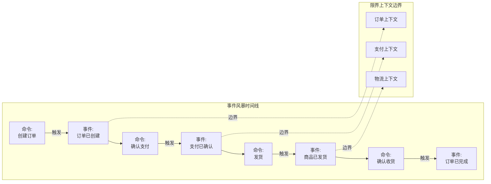

**事件风暴的实践建议**：

- 邀请业务专家全程参与，不要让开发者单独完成
- 使用物理便利贴而非电子工具，物理操作的参与感更强
- 时间限制在4-8小时内完成，避免过度分析
- 不追求完美，事件风暴是一个发现过程，产出的模型需要后续精炼

### 30.1.2 子域分析

另一种划分限界上下文的方法是通过子域分析。子域是业务领域的自然划分：

**核心域（Core Domain）**：业务的核心竞争力，需要投入最多资源和最优秀的开发者。核心域的模型必须是充血的、精确的、经过精心设计的。

**支撑域（Supporting Domain）**：支撑核心域运行的业务功能，不是核心竞争力但业务必需。可以适度简化设计。

**通用域（Generic Domain）**：所有业务都需要的通用功能，如用户认证、邮件发送。可以使用现成的解决方案。

电商领域示例：
├── 核心域：商品推荐、定价策略、供应链优化
├── 支撑域：订单管理、库存管理、客户服务
└── 通用域：用户认证、支付网关、邮件通知

**核心域的识别标准**：

| 判断维度 | 核心域特征 | 支撑域特征 | 通用域特征 |
|---------|-----------|-----------|-----------|
| 竞争优势 | 提供独特价值，竞争对手难以复制 | 业务必需但非差异化因素 | 所有企业都相同 |
| 变更频率 | 频繁变化，需要快速响应 | 中等频率变化 | 几乎不变 |
| 业务规则复杂度 | 复杂的业务规则和状态转换 | 中等复杂度 | 简单或标准化 |
| 投入优先级 | 最优先，投入最多资源 | 次优先，适度投入 | 最低，使用现成方案 |
| 人才需求 | 需要最优秀的开发者 | 普通开发者即可 | 可使用外部服务 |

### 30.1.3 语言驱动划分

通过分析统一语言来发现上下文边界。当同一个词在不同场景下含义不同时，就存在潜在的上下文边界：

- "商品"在目录中是展示信息，在库存中是存储单元，在订单中是购买项
- "客户"在销售中是购买者，在客服中是被服务者，在风控中是信用评估对象
- "账户"在登录中是认证凭证，在财务中是资金载体

### 30.1.4 领域建模方法对比

除了事件风暴，还有多种领域建模方法可以选择。根据团队规模、业务复杂度和时间约束选择合适的方法：

**事件风暴（Event Storming）**：适合复杂业务流程梳理，强调团队协作。时间4-8小时，产出事件流和限界上下文。

**领域故事讲述（Domain Storytelling）**：由Stefan Hofer和Axel Uck提出的建模方法。与事件风暴不同，领域故事讲述以"故事"为单位组织业务流程，强调角色（Actor）、工作项（Work Object）和活动（Activity）三要素。

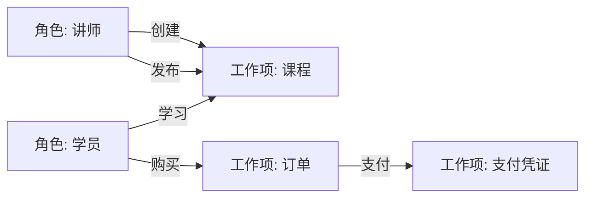

领域故事讲述的优势在于：用自然语言描述业务流程，降低了业务专家的参与门槛；通过"故事"的形式组织，更容易发现遗漏的业务场景。

**四色建模法（Color Modeling）**：由Peter Coad提出，用四种颜色区分不同类型的模型元素：
- **黄色**：实体（Thing）——代表业务中的关键概念
- **角色**（Role）：实体在特定场景中扮演的角色
- **时刻-时段**（Moment-Interval）：记录业务活动的时间点
- **描述**（Description）：对实体的补充描述信息

**方法选择指南**：

| 方法 | 适用场景 | 团队规模 | 时间投入 | 学习曲线 |
|------|---------|---------|---------|---------|
| 事件风暴 | 复杂业务流程，限界上下文划分 | 5-15人 | 4-8小时 | 中等 |
| 领域故事讲述 | 业务流程梳理，统一语言建立 | 3-10人 | 2-4小时 | 较低 |
| 四色建模法 | 领域模型细粒度设计 | 2-5人 | 2-4小时 | 较高 |
| 统一语言工作坊 | 术语对齐，消除歧义 | 3-8人 | 1-2小时 | 低 |

***

## 30.2 聚合设计的实战技巧

### 30.2.1 识别真正的不变量

聚合边界由不变量决定。不变量是必须在同一事务中保持一致的业务规则。关键问题是：**这个规则是否必须在同一时刻（同一事务中）成立？**

**强一致性不变量（聚合内）**：

- 订单行数不能超过50
- 订单总金额必须等于各行小计之和
- 银行账户余额不能为负

**最终一致性不变量（聚合间）**：

- 库存扣减后通知订单服务确认发货
- 支付完成后通知订单服务更新状态
- 用户注册后发送欢迎邮件

### 30.2.2 小聚合的实现模式

**模式一：只包含值对象的聚合**

```java
class Order {  // 聚合根
    OrderId id;
    CustomerId customerId;
    List<OrderLine> lines;  // 值对象列表
    Money total;
}
```

**模式二：包含一个实体的聚合**

```java
class Customer {  // 聚合根
    CustomerId id;
    Name name;
    Address address;  // 值对象
    ContactInfo contactInfo;  // 值对象
}
```

**模式三：包含多个实体的聚合**

```java
class Order {  // 聚合根
    OrderId id;
    List<OrderLine> lines;  // OrderLine是实体，有lineId
    
    void addLine(ProductId productId, Money price, int qty) {
        OrderLine line = new OrderLine(new LineId(), productId, price, qty);
        lines.add(line);
    }
}
```

### 30.2.3 聚合引用的设计

**ID引用 vs 对象引用**：

```java
// 错误：对象引用
class Order {
    Customer customer;  // 直接引用Customer聚合
}

// 正确：ID引用
class Order {
    CustomerId customerId;  // 只引用Customer的ID
}
```

ID引用的好处：

- 降低聚合之间的耦合
- 避免加载整个关联对象图
- 支持跨数据库或跨服务的聚合引用
- 简化序列化和缓存

### 30.2.4 聚合的延迟加载陷阱

不要在聚合内部使用延迟加载。聚合应该在一次数据库调用中完全加载。如果聚合太大无法一次加载，说明聚合设计有问题——需要拆分为更小的聚合。

***

## 30.3 领域事件的发布与消费

### 30.3.1 事件发布的实现模式

**模式一：聚合内发布**

```java
class Order {
    private List<DomainEvent> events = new ArrayList<>();
    
    void confirm() {
        this.status = OrderStatus.CONFIRMED;
        events.add(new OrderConfirmed(this.id, this.totalAmount));
    }
    
    List<DomainEvent> pullEvents() {
        List<DomainEvent> result = new ArrayList<>(events);
        events.clear();
        return result;
    }
}
```

**模式二：仓储层发布**

```java
class JpaOrderRepository implements OrderRepository {
    @Override
    public void save(Order order) {
        jpaRepo.save(toEntity(order));
        order.pullEvents().forEach(eventPublisher::publish);
    }
}
```

### 30.3.2 事件的消费模式

**同步消费**：在同一个事务中处理事件。适用于需要强一致性的场景。

**异步消费**：通过消息队列异步处理事件。适用于最终一致性的场景，也是更常见的做法。

**事件的幂等处理**：由于消息可能重复投递，事件处理器必须是幂等的。使用事件ID去重是最常见的方案。

```java
@Component
public class OrderPaidEventHandler {
    private final EnrollmentRepository enrollmentRepo;
    private final ProcessedEventRepository processedRepo;
    
    @TransactionalEventListener
    public void handle(OrderPaid event) {
        // 幂等检查：如果事件已处理，直接返回
        if (processedRepo.existsByEventId(event.eventId())) {
            return;
        }
        
        Enrollment enrollment = new Enrollment(
            new EnrollmentId(),
            event.studentId(),
            event.courseId()
        );
        enrollmentRepo.save(enrollment);
        
        // 记录已处理的事件
        processedRepo.save(new ProcessedEvent(event.eventId()));
    }
}
```

### 30.3.3 事件驱动的完整流程

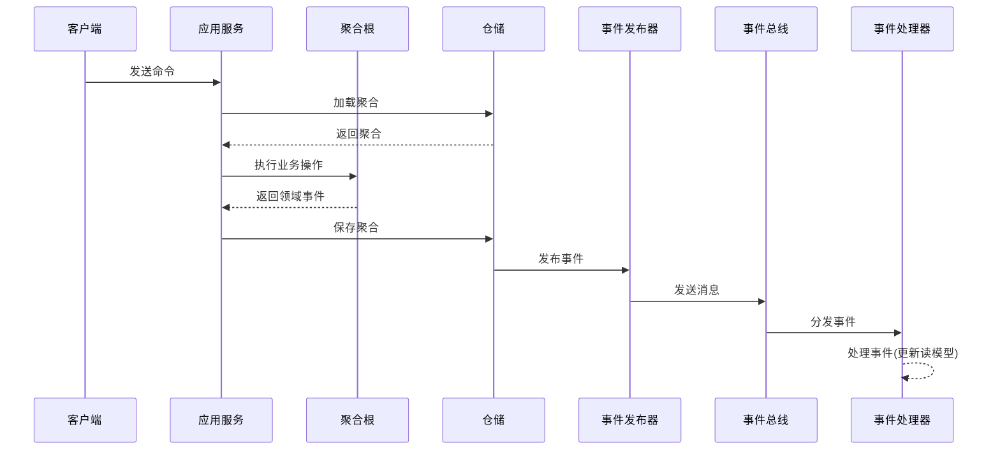

***

## 30.4 仓储实现的最佳实践

### 30.4.1 仓储与ORM的集成

```java
// 领域层：仓储接口
public interface OrderRepository {
    Optional<Order> findById(OrderId id);
    void save(Order order);
    List<Order> findByStatus(OrderStatus status);
}

// 基础设施层：JPA实现
@Repository
public class JpaOrderRepository implements OrderRepository {
    @PersistenceContext
    private EntityManager em;
    
    @Override
    public Optional<Order> findById(OrderId id) {
        OrderJpaEntity entity = em.find(OrderJpaEntity.class, id.value());
        return Optional.ofNullable(entity).map(this::toDomain);
    }
    
    @Override
    public void save(Order order) {
        OrderJpaEntity entity = toJpaEntity(order);
        em.merge(entity);
    }
    
    private Order toDomain(OrderJpaEntity entity) {
        // 映射逻辑
    }
}
```

### 30.4.2 仓储的查询设计

**原则：仓储方法名反映业务意图**

```java
// 好的命名
interface OrderRepository {
    List<Order> findPendingOrdersForCustomer(CustomerId customerId);
    Optional<Order> findLastOrderForCustomer(CustomerId customerId);
}

// 差的命名（过于通用）
interface OrderRepository {
    List<Order> findByField(String field, Object value);
    List<Order> findByCriteria(Map<String, Object> criteria);
}
```

### 30.4.3 仓储的规格模式（Specification）

当查询条件复杂时，使用规格模式封装查询条件：

```java
public class OrderSpecifications {
    public static Specification<Order> isPending() {
        return (root, query, cb) -> cb.equal(root.get("status"), OrderStatus.PENDING);
    }
    
    public static Specification<Order> hasAmountGreaterThan(Money amount) {
        return (root, query, cb) -> cb.greaterThan(root.get("totalAmount"), amount);
    }
}

// 使用
repo.findAll(Specification.where(isPending()).and(hasAmountGreaterThan(new Money(100))));
```

### 仓储（Repository）vs 数据访问对象（DAO）：对比分析

| 维度 | 仓储（Repository） | DAO（Data Access Object） |
|------|-------------------|--------------------------|
| 抽象层次 | 面向聚合根的集合语义 | 面向数据库表的CRUD操作 |
| 返回类型 | 返回完整的领域对象 | 返回数据库记录或数据传输对象 |
| 接口定义位置 | 领域层（业务接口） | 数据访问层（技术接口） |
| 方法命名 | 反映业务意图（findPendingOrders） | 反映数据库操作（selectByStatus） |
| 操作对象 | 只操作聚合根 | 直接操作任意数据库表 |
| 关注点 | 业务查询语义 | 数据库访问细节 |
| 设计理念 | 隐藏持久化细节，模拟内存集合 | 封装数据库访问，隔离技术复杂度 |
| DDD定位 | 战术模式，领域层的核心接口 | 传统分层架构的数据访问抽象 |

***

## 30.5 工厂模式的应用

### 30.5.1 聚合根的创建工厂

```java
class OrderFactory {
    private final ProductRepository productRepo;
    private final PricingService pricingService;
    
    Order createOrder(CustomerId customerId, List<CreateOrderItem> items) {
        Order order = new Order(new OrderId(), customerId);
        
        for (CreateOrderItem item : items) {
            Product product = productRepo.findById(item.productId());
            Money price = pricingService.calculatePrice(product, item.quantity());
            order.addLine(product.id(), price, item.quantity());
        }
        
        return order;
    }
}
```

### 30.5.2 重建工厂

从持久化存储重建聚合时，可能需要特殊的处理逻辑：

```java
class OrderReconstitutor {
    Order reconstitute(OrderSnapshot snapshot) {
        Order order = Order.withId(snapshot.id());
        order.restoreStatus(snapshot.status());
        snapshot.lines().forEach(line -> order.restoreLine(line));
        return order;
    }
}
```

***

## 30.6 防腐层的实现技巧

### 30.6.1 防腐层的结构

```java
// 外部服务接口
public interface ExternalPaymentGateway {
    ExternalPaymentResponse charge(ExternalPaymentRequest request);
}

// 防腐层
public class PaymentGatewayAdapter {
    private final ExternalPaymentGateway gateway;
    
    public PaymentResult processPayment(OrderId orderId, Money amount) {
        ExternalPaymentRequest request = mapToExternal(orderId, amount);
        ExternalPaymentResponse response = gateway.charge(request);
        return mapToDomain(response);
    }
    
    private ExternalPaymentRequest mapToExternal(OrderId orderId, Money amount) {
        // 将领域模型映射为外部模型
        return new ExternalPaymentRequest(orderId.value(), amount.amount(), amount.currency().code());
    }
    
    private PaymentResult mapToDomain(ExternalPaymentResponse response) {
        // 将外部模型映射为领域模型
        if (response.isSuccess()) {
            return PaymentResult.success(new PaymentId(response.getTransactionId()));
        } else {
            return PaymentResult.failure(response.getErrorMessage());
        }
    }
}
```

### 30.6.2 防腐层的测试策略

防腐层是测试的重点，需要覆盖：

- 正常映射路径
- 异常情况处理（外部服务返回错误）
- 数据格式转换的边界情况
- 外部模型变化时的兼容性

***

## 30.7 领域层的测试策略

### 30.7.1 聚合的单元测试

```java
@Test
void should_not_allow_adding_line_to_confirmed_order() {
    Order order = new Order(new OrderId(), new CustomerId());
    order.confirm();
    
    assertThrows(OrderCannotBeModifiedException.class, () -> {
        order.addLine(new ProductId(), Money.of(100), 2);
    });
}

@Test
void should_recalculate_total_when_line_added() {
    Order order = new Order(new OrderId(), new CustomerId());
    order.addLine(new ProductId(), Money.of(100), 2);
    order.addLine(new ProductId(), Money.of(50), 3);
    
    assertEquals(Money.of(350), order.totalAmount());
}
```

### 30.7.2 领域服务的测试

```java
@Test
void should_transfer_money_between_accounts() {
    Account from = new Account(new AccountId(), Money.of(1000));
    Account to = new Account(new AccountId(), Money.of(500));
    
    when(accountRepo.findById(from.id())).thenReturn(from);
    when(accountRepo.findById(to.id())).thenReturn(to);
    
    TransferResult result = transferService.transfer(from.id(), to.id(), Money.of(200));
    
    assertTrue(result.isSuccess());
    assertEquals(Money.of(800), from.balance());
    assertEquals(Money.of(700), to.balance());
}
```

### 30.7.3 集成测试

测试仓储与数据库的集成，以及领域事件的发布与消费。

***

## 30.8 重构到DDD的渐进策略

### 30.8.1 绞杀者模式（Strangler Fig）

绞杀者模式（Strangler Fig Pattern）是由Martin Fowler在2004年提出的渐进式迁移策略，灵感来自热带雨林中绞杀榕缠绕宿主树木、逐步替代其功能的自然现象。在软件领域，它的核心思想是：不推倒重来，而是在现有系统边界处建立新模型，逐步替换旧功能。

**完整迁移流程**：

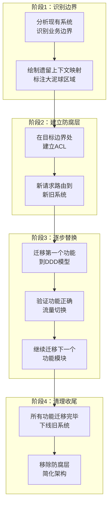

**具体步骤**：

1. **建立反向代理层**：在API Gateway或反向代理层添加路由规则，将特定路径的请求转发到新系统，其余请求继续走旧系统。这是迁移的基础设施，确保流量可以无缝切换。

2. **选择第一个迁移模块**：选择业务价值最高、技术复杂度适中的模块作为起点。不要选最简单的（无法验证DDD的效果），也不要选最复杂的（风险太高）。

3. **在旧系统边界建立防腐层**：新系统通过防腐层读取旧系统的数据，通过反向代理接收新请求。防腐层隔离了新旧模型的差异。

4. **并行运行与流量切换**：新旧系统并行运行一段时间，通过影子流量（shadow traffic）验证新系统的正确性。确认无误后逐步切换流量比例：1% → 10% → 50% → 100%。

5. **数据迁移与同步**：在流量切换的同时完成数据迁移。使用CDC（Change Data Capture）工具（如Debezium）捕获旧系统的数据变更，实时同步到新系统。

6. **下线旧模块**：确认新系统稳定运行后，下线旧系统的对应模块，释放资源。

**常见陷阱**：

- **迁移范围过大**：试图一次性迁移整个系统，导致周期过长、风险不可控
- **忽略数据一致性**：新旧系统并行期间的数据同步问题
- **防腐层过于复杂**：试图将旧系统的所有模型都映射到新模型，实际上只需要映射迁移部分
- **没有回滚计划**：迁移失败时无法快速回退到旧系统

### 30.8.2 数据迁移策略

从传统架构迁移到DDD时，数据迁移是最具挑战性的环节之一。以下是三种常用的迁移策略：

**策略一：双写（Dual Write）**

在迁移期间，新旧系统同时写入各自的数据存储。通过消息队列确保两个系统的写入操作最终一致。

应用层 → 新系统写入 + 消息队列 → 旧系统写入

优点：实现简单，迁移期间旧系统可随时回退。缺点：需要维护两套写入逻辑，数据一致性需要额外保证。

**策略二：CDC（Change Data Capture）**

使用Debezium等CDC工具捕获旧数据库的变更日志，实时同步到新系统。旧系统继续处理请求，新系统被动接收数据变更。

旧数据库 → Debezium → Kafka → 新系统投影器 → 新数据库

优点：不需要修改旧系统代码，数据同步实时性好。缺点：需要维护CDC管道，复杂表结构的映射较困难。

**策略三：逐步切换（Strangler Fig）**

按模块逐步迁移，每个模块迁移时完成该模块的数据迁移。先迁移读流量到新系统，再迁移写流量。

优点：风险可控，每个模块独立迁移。缺点：迁移周期较长，需要维护数据同步逻辑。

| 策略 | 适用场景 | 实现复杂度 | 数据一致性 | 迁移周期 |
|------|---------|-----------|-----------|---------|
| 双写 | 中小系统，模块少 | 低 | 最终一致 | 短 |
| CDC | 大型系统，数据量大 | 中 | 近实时一致 | 中 |
| 逐步切换 | 超大型系统，模块多 | 高 | 逐模块一致 | 长 |

### 30.8.3 识别优先级

1. 先改造核心域，投入最多的精力
2. 支撑域适度改造，满足当前需求即可
3. 通用域使用现成方案，不值得自研

### 30.8.4 团队能力建设

DDD的成功不仅依赖于技术实践，更依赖于团队的协作模式和组织能力。以下是渐进式的团队能力建设路径：

**第一阶段：概念普及（1-2周）**

- 组织DDD读书会，共读Evans的《Domain-Driven Design》前8章或Vernon的《DDD Distilled》
- 在团队内部进行15-30分钟的DDD概念分享（实体vs值对象、聚合设计等）
- 建立统一语言词汇表，让团队习惯用业务语言讨论问题

**第二阶段：试点项目（1-2个月）**

- 选择一个低风险的新功能或小模块作为试点
- 从事件风暴开始，让业务专家参与建模过程
- 在代码评审中引入DDD检查项：是否充血模型？聚合边界是否合理？
- 记录试点过程中的经验和教训，形成团队的DDD实践指南

**第三阶段：扩展推广（3-6个月）**

- 将DDD实践扩展到更多模块
- 建立DDD代码评审标准和最佳实践文档
- 定期进行模型精炼（Model Refinement）会议，持续优化领域模型
- 培养团队中的DDD Champion（倡导者），负责推广和答疑

**第四阶段：持续优化（长期）**

- 参与DDD社区讨论（DDD Europe、EventStorming社区）
- 定期回顾和更新领域模型
- 将DDD实践融入团队的日常开发流程
- 分享DDD实践经验，提升团队影响力

***

## 参考文献

1. Alberto Brandolini, "Introducing EventStorming", 2013
2. Vaughn Vernon, *Implementing Domain-Driven Design*, Addison-Wesley, 2013
3. Sam Newman, *Building Microservices*, O'Reilly, 2015


***

# 领域驱动设计：实战案例

***

## 30.1 案例背景：在线教育平台

### 30.1.1 业务场景

我们以一个在线教育平台为例，展示如何运用DDD进行领域建模。平台的核心业务包括：

- **课程管理**：讲师创建、编辑、发布课程
- **学员学习**：学员购买课程、观看视频、完成作业
- **考试评估**：在线考试、自动评分、证书发放
- **支付结算**：学员付款、讲师分成、平台抽成

### 30.1.2 团队组成

- 产品经理2人
- 后端开发者5人
- 前端开发者3人
- 测试工程师2人

***

## 30.2 事件风暴：发现限界上下文

### 30.2.1 第一轮事件风暴

团队在白板前进行了4小时的事件风暴。以下是识别出的核心领域事件：

学员注册 → 课程创建 → 课程发布 → 学员购买课程 → 支付完成
→ 课程解锁 → 学员观看视频 → 学员完成作业 → 考试开始
→ 考试提交 → 自动评分 → 证书生成 → 讲师收到分成

### 30.2.2 识别限界上下文

通过事件风暴，团队识别出以下限界上下文：

**课程上下文（Course Context）**：
- 事件：课程创建、课程发布、课程更新
- 聚合：Course, Lesson, Chapter
- 职责：课程内容管理、课程结构维护

**学习上下文（Learning Context）**：
- 事件：课程解锁、视频观看、作业提交、学习进度更新
- 聚合：Enrollment, LearningProgress, Assignment
- 职责：学员学习行为跟踪、学习进度管理

**考试上下文（Exam Context）**：
- 事件：考试开始、考试提交、自动评分、证书生成
- 聚合：Exam, Question, Answer, Certificate
- 职责：考试管理、自动评分、证书发放

**支付上下文（Payment Context）**：
- 事件：购买发起、支付完成、退款处理、讲师分成
- 聚合：Order, Payment, Settlement
- 职责：订单管理、支付处理、结算分成

**用户上下文（User Context）**：
- 事件：学员注册、讲师认证、信息更新
- 聚合：User, StudentProfile, InstructorProfile
- 职责：用户管理、身份认证

***

## 30.3 上下文映射

### 30.3.1 上下文关系图

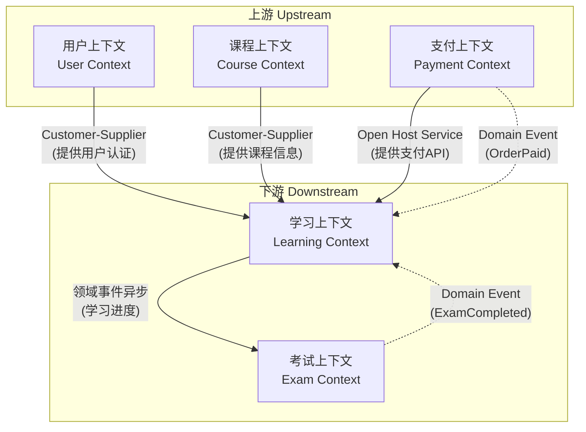

### 30.3.2 集成模式

**学习上下文 → 课程上下文**：Customer-Supplier关系。学习上下文需要课程信息，但课程上下文是上游，学习上下文通过防腐层隔离课程模型的变化。

**学习上下文 → 支付上下文**：通过领域事件异步集成。支付完成事件触发课程解锁。

**学习上下文 → 考试上下文**：通过领域事件异步集成。学习进度达到阈值时触发考试开放。

***

## 30.4 战术设计：核心聚合建模

### 30.4.1 课程上下文的聚合设计

```java
// 聚合根
public class Course {
    private final CourseId id;
    private CourseName name;
    private CourseDescription description;
    private InstructorId instructorId;  // ID引用
    private CourseStatus status;
    private List<Chapter> chapters;     // 聚合内部实体
    private Money price;
    
    public void publish() {
        if (chapters.isEmpty()) {
            throw new EmptyCourseCannotBePublishedException(id);
        }
        if (chapters.stream().noneMatch(Chapter::hasLessons)) {
            throw new CourseWithoutLessonsException(id);
        }
        this.status = CourseStatus.PUBLISHED;
        DomainEventPublisher.publish(new CoursePublished(id, instructorId));
    }
    
    public void addChapter(ChapterName name) {
        assertCourseIsDraft();
        chapters.add(new Chapter(new ChapterId(), name, chapters.size() + 1));
    }
}

// 值对象
public final class CourseName {
    private final String value;
    
    public CourseName(String value) {
        if (value == null || value.isBlank()) {
            throw new IllegalArgumentException("课程名称不能为空");
        }
        if (value.length() > 100) {
            throw new IllegalArgumentException("课程名称不能超过100字");
        }
        this.value = value;
    }
}
```

### 30.4.2 学习上下文的聚合设计

```java
// 聚合根
public class Enrollment {
    private final EnrollmentId id;
    private final StudentId studentId;
    private final CourseId courseId;  // ID引用，不引用Course对象
    private EnrollmentStatus status;
    private LearningProgress progress;
    private LocalDateTime enrolledAt;
    
    public void recordVideoWatched(LessonId lessonId, Duration watchedDuration) {
        assertEnrollmentActive();
        progress.recordWatch(lessonId, watchedDuration);
        
        if (progress.isCourseCompleted()) {
            DomainEventPublisher.publish(
                new CourseCompleted(id, studentId, courseId)
            );
        }
    }
}

// 值对象
public final class LearningProgress {
    private final Map<LessonId, WatchRecord> watchRecords;
    private final double completionRate;
    
    public void recordWatch(LessonId lessonId, Duration duration) {
        watchRecords.merge(lessonId, 
            new WatchRecord(duration), 
            WatchRecord::merge);
        recalculateCompletionRate();
    }
}
```

### 30.4.3 支付上下文的聚合设计

```java
// 聚合根
public class Order {
    private final OrderId id;
    private final StudentId studentId;
    private final CourseId courseId;
    private Money amount;
    private OrderStatus status;
    private PaymentId paymentId;
    
    public void markPaid(PaymentId paymentId) {
        assertOrderPending();
        this.paymentId = paymentId;
        this.status = OrderStatus.PAID;
        DomainEventPublisher.publish(
            new OrderPaid(id, studentId, courseId, amount)
        );
    }
}
```

***

## 30.5 领域事件驱动的业务流程

### 30.5.1 购买课程的完整流程

1. 学员发起购买 → 创建Order (支付上下文)
2. 调用支付网关 → 支付成功
3. Order标记已支付 → 发布OrderPaid事件
4. 学习上下文接收OrderPaid → 创建Enrollment
5. 课程上下文接收OrderPaid → 记录销售统计
6. 发布CourseUnlocked事件 → 学员可以开始学习

### 30.5.2 事件处理代码示例

```java
// 支付上下文：处理支付回调
@Component
public class PaymentCallbackHandler {
    private final OrderRepository orderRepo;
    
    @Transactional
    public void handlePaymentSuccess(PaymentCallback callback) {
        Order order = orderRepo.findById(callback.orderId());
        PaymentId paymentId = new PaymentId(callback.paymentId());
        order.markPaid(paymentId);
        orderRepo.save(order);
    }
}

// 学习上下文：监听支付事件
@Component
public class OrderPaidEventHandler {
    private final EnrollmentRepository enrollmentRepo;
    
    @TransactionalEventListener
    public void handle(OrderPaid event) {
        Enrollment enrollment = new Enrollment(
            new EnrollmentId(),
            event.studentId(),
            event.courseId()
        );
        enrollmentRepo.save(enrollment);
    }
}
```

### 30.5.3 购买课程的时序图

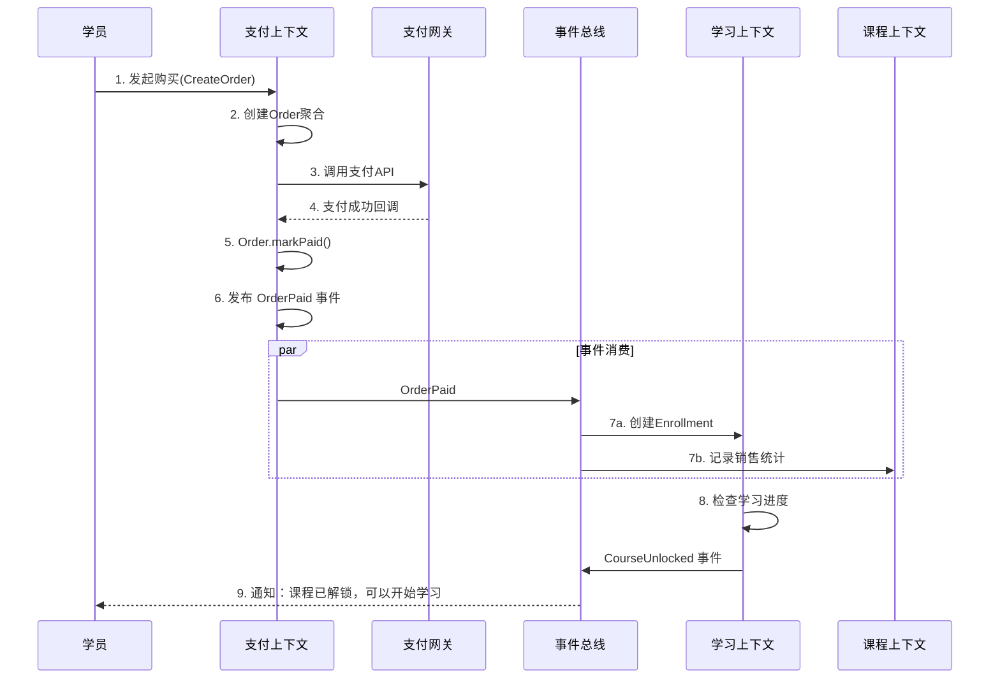

***

## 30.6 关键设计决策记录

### 30.6.1 决策一：课程与学习的聚合边界

**问题**：学员的学习进度是否应该放在课程聚合内部？

**分析**：学习进度是每个学员独立的，一个课程可能有成千上万学员，如果将学习进度放在课程聚合内，聚合会变得巨大，且每个学员的学习进度更新都会锁定课程聚合。

**决策**：学习进度是独立的聚合，通过CourseId引用课程。学习进度的一致性通过领域事件与课程同步。

### 30.6.2 决策二：支付与订单的聚合设计

**问题**：支付信息是否应该包含在订单聚合内？

**分析**：支付和订单有不同的生命周期。订单可以创建但不支付，支付可以失败后重试。将它们放在同一个聚合会导致聚合过大。

**决策**：订单和支付是独立的聚合，通过PaymentId关联。订单状态通过监听支付事件异步更新。

***

## 30.7 项目成果

### 30.7.1 代码结构

src/
├── course/                    # 课程上下文
│   ├── domain/
│   │   ├── model/
│   │   │   ├── Course.java
│   │   │   ├── Chapter.java
│   │   │   └── CourseName.java
│   │   ├── repository/
│   │   │   └── CourseRepository.java
│   │   └── event/
│   │       └── CoursePublished.java
│   ├── application/
│   │   └── CourseService.java
│   └── infrastructure/
│       └── JpaCourseRepository.java
│
├── learning/                  # 学习上下文
│   ├── domain/
│   │   ├── model/
│   │   │   ├── Enrollment.java
│   │   │   └── LearningProgress.java
│   │   └── event/
│   │       └── CourseCompleted.java
│   └── infrastructure/
│       └── OrderPaidEventHandler.java
│
├── payment/                   # 支付上下文
│   ├── domain/
│   │   ├── model/
│   │   │   ├── Order.java
│   │   │   └── Payment.java
│   │   └── event/
│   │       └── OrderPaid.java
│   └── infrastructure/
│       └── PaymentCallbackHandler.java
│
└── exam/                      # 考试上下文
    └── ...

### 30.7.2 团队反馈

**正面反馈**：

- 代码结构清晰，新人上手快
- 业务逻辑内聚，修改影响范围小
- 单元测试覆盖充分，重构信心足

**挑战**：

- 事件驱动的最终一致性需要额外的监控和补偿机制
- 聚合设计的边界判断需要持续学习
- 初期建模投入较大，但长期收益明显

***

## 参考文献

1. Eric Evans, *Domain-Driven Design*, Addison-Wesley, 2003
2. Vaughn Vernon, *Implementing Domain-Driven Design*, Addison-Wesley, 2013
3. Alberto Brandolini, "EventStorming", 2013


***

# 领域驱动设计：常见误区

***

## 误区一：DDD等于微服务

**错误理解**：采用DDD就必须拆分微服务，每个限界上下文都是一个微服务。

**实际情况**：DDD是一种设计方法论，微服务是一种架构风格，两者独立存在。你可以在单体应用中实践DDD——在单体内建立清晰的限界上下文边界，使用模块（Module）而非服务来隔离上下文。实际上，很多DDD专家建议先在单体中验证限界上下文的划分，再逐步拆分为微服务。

**正确做法**：

- 先进行战略设计，划分限界上下文
- 在单体中用模块隔离限界上下文
- 当单体的复杂度或团队规模需要时，再拆分为微服务
- 微服务的边界应与限界上下文对齐，但不必一一对应

***

## 误区二：所有领域都要用DDD

**错误理解**：每个项目、每个模块都应该用DDD的方式建模。

**实际情况**：DDD的投入成本很高——需要深入的领域分析、复杂的模型设计、持续的精炼和重构。对于CRUD型的简单业务，传统的贫血模型+Service层就足够了。过度设计比不设计更糟糕。

**正确做法**：

- 核心域（Core Domain）：投入最多的精力，使用充血模型
- 支撑域（Supporting Domain）：适度设计，满足当前需求即可
- 通用域（Generic Domain）：使用现成方案，不需要自研

**判断标准**：如果业务逻辑只是简单的增删改查，没有复杂的业务规则和状态转换，就不需要DDD。DDD的价值在于管理业务复杂度，而非技术复杂度。

***

## 误区三：聚合设计越大越好

**错误理解**：聚合应该包含所有相关的对象，保持数据的完整性。

**实际情况**：过大的聚合会导致：

- **性能问题**：加载一个聚合需要加载大量关联数据
- **并发冲突**：多个用户同时修改聚合的不同部分会导致冲突
- **事务时间过长**：大聚合的事务持续时间长，占用数据库连接

**正确做法**：

- 聚合应该尽可能小，只包含必须在同一事务中保持一致的对象
- 聚合间通过ID引用，而非对象引用
- 跨聚合的一致性通过领域事件实现最终一致性
- 优先考虑业务不变量，而非数据完整性

***

## 误区四：贫血模型就是DDD

**错误理解**：只要使用了Entity、Repository这些概念，就是DDD。

**实际情况**：贫血模型——只有getter和setter的领域对象，业务逻辑全部在Service层——是Martin Fowler明确指出的反模式。如果领域对象只是数据容器，没有封装业务规则，那么你只是用了DDD的术语，而非DDD的思想。

**正确做法**：

- 领域对象应该封装业务行为，而非只有数据
- 业务规则应该在聚合内部，而非Service层
- Service层只负责协调，不包含业务逻辑

**反例**：

```java
// 贫血模型（伪DDD）
class Order {
    private String status;
    // 只有getter和setter
}

class OrderService {
    void cancel(Order order) {
        if (!"CREATED".equals(order.getStatus())) {
            throw new RuntimeException("不能取消");
        }
        order.setStatus("CANCELLED");
    }
}
```

**正例**：

```java
// 充血模型（真正的DDD）
class Order {
    private OrderStatus status;
    
    void cancel() {
        if (status != OrderStatus.CREATED) {
            throw new OrderCannotBeCancelledException(id, status);
        }
        this.status = OrderStatus.CANCELLED;
    }
}
```

***

## 误区五：统一语言只是命名规范

**错误理解**：统一语言就是在代码中使用业务术语命名变量和方法。

**实际情况**：统一语言是一种组织实践，不仅仅是命名规范。它要求：

- 开发者和业务专家使用同一套术语进行沟通
- 代码中的概念与业务术语一一对应
- 当发现理解不一致时，必须深入讨论并达成共识
- 统一语言随业务理解的深入而持续进化

**正确做法**：

- 在事件风暴和需求讨论中使用统一语言
- 代码命名与统一语言严格一致
- 测试用例使用统一语言描述业务场景
- 定期与业务专家对齐术语理解

***

## 误区六：仓储就是DAO

**错误理解**：仓储（Repository）只是DAO（Data Access Object）的另一个名字。

**实际情况**：两者有本质区别：

- **DAO**：面向数据库表的CRUD操作，返回数据对象
- **Repository**：面向聚合根的集合语义接口，返回领域对象

**关键区别**：

- Repository接口定义在领域层，实现在基础设施层
- Repository只操作聚合根，不直接操作聚合内部对象
- Repository返回的是完整的领域对象，不是数据库记录
- Repository的方法名反映业务意图，不是数据库操作

***

## 误区七：领域事件必须异步处理

**错误理解**：领域事件必须通过消息队列异步发送和处理。

**实际情况**：领域事件是一种设计概念，不是技术实现。事件可以：

- **同步发布**：在同一个事务中处理，适用于需要强一致性的场景
- **进程内事件**：通过观察者模式在进程内分发，不需要消息中间件
- **异步消息**：通过消息队列异步处理，适用于最终一致性场景

**正确做法**：根据业务需求选择事件的处理方式，不要教条地认为所有事件都必须异步。

***

## 误区八：过早引入CQRS/Event Sourcing

**错误理解**：DDD必须配合CQRS和Event Sourcing才有价值。

**实际情况**：CQRS和Event Sourcing是高级模式，它们增加了系统的复杂度：

- CQRS需要维护读写两套模型
- Event Sourcing需要处理事件版本管理、快照、最终一致性等问题

**正确做法**：

- 先掌握DDD的基本战术模式
- 在有明确需求时再引入CQRS（读写不对称）
- 只在需要完整审计追踪或时间旅行时才使用Event Sourcing
- 不要为了"架构先进性"而引入不必要的复杂度

***

## 误区九：忽略限界上下文的战略价值

**错误理解**：DDD的重点是战术设计（Entity、Value Object、Aggregate），限界上下文是可选的。

**实际情况**：战略设计比战术设计更重要。没有清晰的限界上下文，再精美的聚合设计也会被大泥球淹没。限界上下文的划分决定了系统的宏观结构，战术设计只影响单个上下文内部。

**正确做法**：

- 先进行战略设计，划分限界上下文
- 再在每个上下文内部进行战术设计
- 上下文映射指导系统集成方式
- 统一语言在上下文边界内生效

***

## 误区十：过度追求模型的"完美"

**错误理解**：领域模型必须完美反映业务现实，不允许任何简化。

**实际情况**：领域模型是对业务的抽象，不是业务的镜像。过度追求模型的完美会导致：

- 分析瘫痪：无休止的讨论和建模，无法交付
- 过度设计：模型过于复杂，难以理解和维护
- 忽视实践：关注模型的理论完美性，忽视实际的可实现性

**正确做法**：

- 模型应该"足够好"而非"完美"
- 持续精炼：在每次迭代中逐步改进模型
- 实践驱动：模型的有效性由实际使用验证，而非理论分析
- 接受简化：在不影响核心业务逻辑的地方，允许简化

***

## 十大误区总结

| 误区编号 | 误区 | 核心误解 | 正确理解 |
|---------|------|---------|---------|
| 1 | DDD等于微服务 | DDD必须拆微服务 | DDD是方法论，可在单体中实践 |
| 2 | 所有领域都用DDD | 每个项目都该DDD | 只在核心域使用，简单CRUD不需要 |
| 3 | 聚合越大越好 | 大聚合保证完整性 | 小聚合优先，用最终一致性补偿 |
| 4 | 贫血模型就是DDD | 用了Entity就是DDD | 充血模型才是DDD的核心主张 |
| 5 | 统一语言只是命名 | 好名字就够了 | 统一语言是组织协作实践 |
| 6 | 仓储就是DAO | Repository = DAO | 集合语义 vs CRUD语义 |
| 7 | 事件必须异步 | 所有事件走消息队列 | 根据一致性需求选择同步/异步 |
| 8 | 过早引入CQRS/ES | DDD必须配合CQRS | 高级模式按需引入 |
| 9 | 忽略战略设计 | 聚合设计最重要 | 限界上下文比聚合设计更关键 |
| 10 | 追求完美模型 | 模型要100%映射现实 | 持续精炼，接受简化 |

***

## 总结

DDD是一把双刃剑。正确使用可以显著降低系统复杂度，错误使用则会增加不必要的复杂度。关键在于：

1. **理解本质**：DDD的核心是领域建模和统一语言，不是Entity、Repository这些模式
2. **适度应用**：只在复杂的业务领域使用DDD，简单的CRUD不需要
3. **渐进引入**：先从战略设计开始，再逐步引入战术设计
4. **持续精炼**：领域模型是活的，会随业务理解的深入而进化
5. **避免教条**：根据实际情况灵活应用DDD的原则，不要死守规则

***

## 参考文献

1. Martin Fowler, "AnemicDomainModel", martinfowler.com, 2003
2. Vaughn Vernon, *Domain-Driven Design Distilled*, Addison-Wesley, 2016
3. Eric Evans, *Domain-Driven Design*, Addison-Wesley, 2003

***

# 领域驱动设计：工具与框架

采用DDD进行实际开发时，选择合适的工具和框架可以大幅降低基础设施层面的工作量，让团队专注于领域建模本身。本节介绍主流的DDD支撑工具和框架。

***

## DDD框架总览

不同技术栈下都有成熟的DDD支撑框架，它们提供了事件溯源、CQRS、聚合管理等基础设施能力。

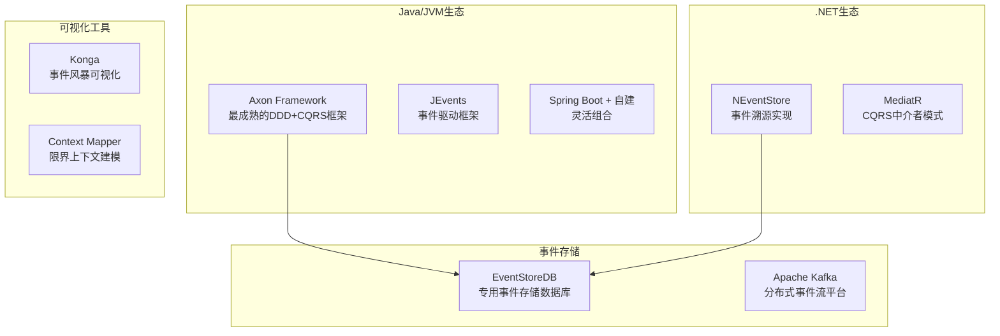

## Axon Framework

Axon Framework是Java生态中最成熟的DDD框架，它提供了开箱即用的CQRS和事件溯源支持。Axon的核心能力包括：聚合的事件溯源仓储、命令/事件总线、查询模型投影、以及分布式聚合的Saga协调。

```java
// Axon聚合根示例：使用注解驱动的事件溯源
@Aggregate
public class OrderAggregate {

    @AggregateIdentifier
    private OrderId orderId;
    private OrderStatus status;
    private Money totalAmount;

    // 命令处理器：Axon通过注解自动发现
    @CommandHandler
    public OrderAggregate(CreateOrderCommand cmd) {
        // 发布事件
        ApplyEventsMessage.apply(
            new OrderCreatedEvent(cmd.getOrderId(), cmd.getCustomerId())
        ).publish(eventBus);
    }

    // 事件处理器：重建聚合状态
    @EventSourcingHandler
    public void on(OrderCreatedEvent event) {
        this.orderId = event.getOrderId();
        this.status = OrderStatus.CREATED;
        this.totalAmount = Money.ZERO;
    }

    @CommandHandler
    public void handle(ConfirmOrderCommand cmd) {
        if (status != OrderStatus.CREATED) {
            throw new OrderCannotBeConfirmedException(orderId, status);
        }
        // 发布确认事件
        ApplyEventsMessage.apply(
            new OrderConfirmedEvent(orderId)
        ).publish(eventBus);
    }

    @EventSourcingHandler
    public void on(OrderConfirmedEvent event) {
        this.status = OrderStatus.CONFIRMED;
    }
}
```

Axon Framework还提供了分布式Saga（Saga Manager）来编排跨聚合的业务流程。例如，一个订单从创建到支付完成需要协调多个聚合，Saga监听领域事件并发送补偿命令，确保整个业务流程的最终一致性。

## EventStoreDB

EventStoreDB是一个专为事件溯源设计的开源数据库。与传统关系型数据库不同，EventStoreDB以不可变的事件流为核心存储单元，天然支持事件溯源模式。

EventStoreDB的核心概念包括：事件流（Stream）、投影（Projection）和持久订阅（Persistent Subscription）。事件流按照聚合根ID组织，投影将事件流转换为查询模型，持久订阅实现事件的可靠消费。

```javascript
// EventStoreDB JavaScript客户端示例
const { EventStoreDBClient } = require("@eventstore/db-client");

const client = EventStoreDBClient.connectionString(
    "esdb://localhost:2113?tls=false"
);

// 向订单事件流追加事件
await client.appendToStream("order-12345", [
    {
        eventType: "OrderCreated",
        data: {
            orderId: "12345",
            customerId: "cust-001",
            totalAmount: { amount: 299, currency: "CNY" }
        }
    }
]);

// 读取订单事件流并重建状态
const events = client.readStream("order-12345");
let order = { status: "none" };
for await (const { event } of events) {
    switch (event.eventType) {
        case "OrderCreated":
            order = { ...order, ...event.data, status: "CREATED" };
            break;
        case "OrderConfirmed":
            order.status = "CONFIRMED";
            break;
    }
}
```

## Context Mapper

Context Mapper是一个开源的限界上下文建模工具，它提供了领域特定语言（DSL）来描述限界上下文和上下文映射关系，并能自动生成上下文映射图和防腐层代码框架。

## Konga（事件风暴工具）

Konga是一个在线协作的事件风暴工具，支持团队在分布式环境下进行事件风暴。它提供了便利贴模拟、时间线排列、限界上下文分组等功能，让事件风暴不再受物理空间限制。

## 框架选型指南

| 需求场景 | 推荐方案 | 理由 |
|---------|---------|------|
| Java微服务 + CQRS + ES | Axon Framework | 功能最完整，社区活跃 |
| Java项目，轻量DDD | Spring Boot + 自建 | 灵活，不引入额外框架 |
| 事件溯源需要专用存储 | EventStoreDB | 原生支持事件溯源 |
| 高吞吐事件流 | Apache Kafka | 分布式事件流平台，高吞吐 |
| .NET项目 | MediatR + NEventStore | .NET生态主流选择 |
| 团队协作建模 | Konga / EventStorming工具 | 支持分布式事件风暴 |

***

# DDD在现代技术栈中的实践

DDD不是Java的专利。任何支持面向对象编程或结构化编程的语言都可以实践DDD。本节探讨DDD在TypeScript、Python和Go三种主流语言中的实践方式。

***

## TypeScript中的DDD

TypeScript的类型系统和接口机制使其成为实践DDD的理想语言之一。TypeScript的结构化类型（Structural Typing）特别适合值对象的实现，而接口（Interface）则可以精确定义仓储和领域服务的契约。

```typescript
// 值对象：Money
class Money {
    private readonly amount: number;
    private readonly currency: string;

    constructor(amount: number, currency: string) {
        if (amount < 0) {
            throw new Error("金额不能为负数");
        }
        if (!["CNY", "USD", "EUR"].includes(currency)) {
            throw new Error(`不支持的货币类型: ${currency}`);
        }
        this.amount = amount;
        this.currency = currency;
    }

    add(other: Money): Money {
        if (this.currency !== other.currency) {
            throw new Error("货币类型不匹配");
        }
        return new Money(this.amount + other.amount, this.currency);
    }

    equals(other: Money): boolean {
        return this.amount === other.amount &amp;&amp; this.currency === other.currency;
    }
}

// 聚合根：Order
class Order {
    private readonly id: string;
    private status: OrderStatus;
    private readonly lines: OrderLine[];
    private totalAmount: Money;

    constructor(id: string, customerId: string) {
        this.id = id;
        this.status = "CREATED";
        this.lines = [];
        this.totalAmount = new Money(0, "CNY");
    }

    addLine(productId: string, price: Money, quantity: number): void {
        if (this.status !== "CREATED") {
            throw new Error("已确认的订单不能添加商品");
        }
        this.lines.push({ productId, price, quantity });
        this.recalculateTotal();
    }

    private recalculateTotal(): void {
        this.totalAmount = this.lines.reduce(
            (sum, line) => sum.add(line.price.multiply(line.quantity)),
            new Money(0, "CNY")
        );
    }
}

// 仓储接口
interface OrderRepository {
    findById(id: string): Promise<Order | null>;
    save(order: Order): Promise<void>;
}

// 领域事件
interface OrderPlacedEvent {
    orderId: string;
    customerId: string;
    totalAmount: Money;
    occurredOn: Date;
}
```

TypeScript生态中的DDD相关工具包括：TypeORM（Repository模式支持）、NestJS（支持六边形架构的模块化框架）、以及EventStoreDB的TypeScript客户端。

***

## Python中的DDD

Python虽然不是强类型语言，但通过类型注解（Type Annotations）和Pydantic模型可以实现接近静态语言的DDD实践。Python的优势在于简洁的语法和丰富的数据处理生态。

```python
from dataclasses import dataclass, field
from enum import Enum
from typing import List
from decimal import Decimal
import uuid

# 值对象：Money
@dataclass(frozen=True)  # frozen=True 保证不可变
class Money:
    amount: Decimal
    currency: str

    def __post_init__(self):
        if self.amount < 0:
            raise ValueError("金额不能为负数")
        if self.currency not in ("CNY", "USD", "EUR"):
            raise ValueError(f"不支持的货币类型: {self.currency}")

    def add(self, other: "Money") -> "Money":
        if self.currency != other.currency:
            raise ValueError("货币类型不匹配")
        return Money(amount=self.amount + other.amount, currency=self.currency)

    def multiply(self, factor: int) -> "Money":
        return Money(amount=self.amount * factor, currency=self.currency)

# 聚合根：Order
class OrderStatus(Enum):
    CREATED = "CREATED"
    CONFIRMED = "CONFIRMED"
    CANCELLED = "CANCELLED"

@dataclass
class OrderLine:
    product_id: str
    unit_price: Money
    quantity: int

    @property
    def subtotal(self) -> Money:
        return self.unit_price.multiply(self.quantity)

class Order:
    def __init__(self, order_id: str, customer_id: str):
        self._id = order_id
        self._customer_id = customer_id
        self._status = OrderStatus.CREATED
        self._lines: List[OrderLine] = []
        self._total_amount = Money(Decimal("0"), "CNY")
        self._events: list = []

    @property
    def id(self) -> str:
        return self._id

    @property
    def total_amount(self) -> Money:
        return self._total_amount

    def add_line(self, product_id: str, price: Money, quantity: int) -> None:
        """添加订单行项"""
        if self._status != OrderStatus.CREATED:
            raise ValueError(f"已确认的订单不能添加商品, 当前状态: {self._status}")
        if quantity <= 0:
            raise ValueError("数量必须大于0")

        self._lines.append(OrderLine(product_id, price, quantity))
        self._recalculate_total()

    def confirm(self) -> None:
        """确认订单"""
        if self._status != OrderStatus.CREATED:
            raise ValueError("只能确认新建状态的订单")
        if not self._lines:
            raise ValueError("空订单不能确认")
        self._status = OrderStatus.CONFIRMED
        self._events.append(OrderConfirmed(self._id, self._total_amount))

    def _recalculate_total(self) -> None:
        total = Money(Decimal("0"), "CNY")
        for line in self._lines:
            total = total.add(line.subtotal)
        self._total_amount = total

# 领域事件
@dataclass(frozen=True)
class OrderConfirmed:
    order_id: str
    total_amount: Money
```

Python生态中推荐使用Pydantic作为值对象和事件的验证层，使用SQLAlchemy的Repository模式作为仓储实现。FastAPI的依赖注入机制可以很好地支撑六边形架构中的端口-适配器模式。

***

## Go中的DDD

Go语言的结构体（Struct）和接口（Interface）机制可以实现DDD。Go没有类继承，但通过组合（Composition）和接口实现多态，非常适合聚合根的设计。Go的显式错误处理机制也与DDD中的"让非法状态不可表示"理念相契合。

```go
package domain

import (
    "errors"
    "github.com/google/uuid"
)

// 值对象：Money
type Money struct {
    Amount   int64  // 使用最小货币单位（分），避免浮点精度问题
    Currency string
}

func NewMoney(amount int64, currency string) (Money, error) {
    if amount < 0 {
        return Money{}, errors.New("金额不能为负数")
    }
    if currency != "CNY" &amp;&amp; currency != "USD" {
        return Money{}, errors.New("不支持的货币类型")
    }
    return Money{Amount: amount, Currency: currency}, nil
}

func (m Money) Add(other Money) (Money, error) {
    if m.Currency != other.Currency {
        return Money{}, errors.New("货币类型不匹配")
    }
    return Money{Amount: m.Amount + other.Amount, Currency: m.Currency}, nil
}

// 值对象：OrderStatus
type OrderStatus string

const (
    OrderStatusCreated   OrderStatus = "CREATED"
    OrderStatusConfirmed OrderStatus = "CONFIRMED"
    OrderStatusCancelled OrderStatus = "CANCELLED"
)

// 聚合根：Order
type Order struct {
    id          OrderID
    customerID  CustomerID
    status      OrderStatus
    lines       []OrderLine
    totalAmount Money
    events      []DomainEvent
}

type OrderID string
type CustomerID string

type OrderLine struct {
    ProductID string
    UnitPrice Money
    Quantity  int
}

func (ol OrderLine) Subtotal() Money {
    return Money{
        Amount:   ol.UnitPrice.Amount * int64(ol.Quantity),
        Currency: ol.UnitPrice.Currency,
    }
}

// 创建订单
func NewOrder(customerID CustomerID) *Order {
    return &amp;Order{
        id:          OrderID(uuid.New().String()),
        customerID:  customerID,
        status:      OrderStatusCreated,
        lines:       make([]OrderLine, 0),
        totalAmount: Money{Amount: 0, Currency: "CNY"},
        events:      make([]DomainEvent, 0),
    }
}

// 添加订单行项
func (o *Order) AddLine(productID string, price Money, quantity int) error {
    if o.status != OrderStatusCreated {
        return errors.New("已确认的订单不能添加商品")
    }
    if quantity <= 0 {
        return errors.New("数量必须大于0")
    }
    o.lines = append(o.lines, OrderLine{
        ProductID: productID,
        UnitPrice: price,
        Quantity:  quantity,
    })
    return o.recalculateTotal()
}

func (o *Order) recalculateTotal() error {
    total := Money{Amount: 0, Currency: "CNY"}
    for _, line := range o.lines {
        subtotal := line.Subtotal()
        var err error
        total, err = total.Add(subtotal)
        if err != nil {
            return err
        }
    }
    o.totalAmount = total
    return nil
}

// 确认订单
func (o *Order) Confirm() error {
    if o.status != OrderStatusCreated {
        return errors.New("只能确认新建状态的订单")
    }
    if len(o.lines) == 0 {
        return errors.New("空订单不能确认")
    }
    o.status = OrderStatusConfirmed
    o.events = append(o.events, OrderConfirmedEvent{
        OrderID:     o.id,
        TotalAmount: o.totalAmount,
    })
    return nil
}
```

Go的接口隐式实现（Duck Typing）使得仓储的定义和实现天然解耦。Go社区推荐使用go-kit或go-micro作为微服务基础设施，配合自建的Repository接口实现DDD。

***

## 现代技术栈中DDD实践的共性原则

无论使用哪种语言，DDD的实践都遵循以下共性原则：

1. **值对象使用不可变类型**：TypeScript用readonly属性、Python用frozen dataclass、Go用值接收者方法。
2. **聚合根封装业务不变量**：所有状态变更必须通过聚合根的方法，由聚合根内部验证业务规则。
3. **仓储接口与实现分离**：在六边形架构中，端口（接口）在领域层，适配器（实现）在基础设施层。
4. **领域事件作为聚合间通信机制**：聚合产生事件，外部通过事件总线消费，避免聚合间的直接依赖。
5. **测试驱动领域模型**：领域层的单元测试不应依赖任何基础设施（数据库、网络），纯粹测试业务逻辑。

| 语言 | 值对象实现方式 | 聚合模式 | 推荐框架/库 | 生态成熟度 |
|------|-------------|---------|------------|-----------|
| TypeScript | readonly class / interface | class + 工厂方法 | NestJS, TypeORM, Axon TS | 成熟 |
| Python | frozen dataclass / Pydantic | class + __post_init__ | FastAPI, SQLAlchemy, Pydantic | 快速成长 |
| Go | struct + 值接收者 | struct + 工厂函数 | go-kit, gorm, go-eventstore | 新兴 |
| Java | final class + equals/hashCode | class + Axon注解 | Spring Boot, Axon, Hibernate | 最成熟 |
| C# | record type / struct | class + MediatR | .NET, NEventStore, MassTransit | 成熟 |

***

# 领域驱动设计：练习方法

***

## 30.1 基础练习：理解核心概念

### 练习一：识别实体与值对象

**目标**：训练区分实体和值对象的能力（Entity vs Value Object discrimination）。

**任务**：分析以下业务场景，判断每个概念应该是实体还是值对象，并说明理由：

1. 电商系统中的"地址"
2. 银行系统中的"账户"
3. 社交网络中的"评论"
4. 物流系统中的"包裹"
5. 航空系统中的"机票"
6. 医疗系统中的"处方"
7. 图书管理系统中的"ISBN"
8. 游戏系统中的"角色装备"

**思考要点**：

- 这个概念在业务中是否有唯一标识？
- 如果两个对象的属性完全相同，业务上是否认为它们是同一个？
- 这个概念是否有生命周期？是否需要跟踪它的状态变化？
- 这个概念在不同的限界上下文中是否可能是不同类型的对象？

**预期成果**：每个概念的分类判断 + 至少3条理由说明。

**评估标准**：
- [ ] 能正确区分实体（有标识、有生命周期）和值对象（无标识、不可变）
- [ ] 能识别同一概念在不同上下文中的类型差异（如"地址"在物流中是实体，在订单中是值对象）
- [ ] 理由说明中引用了业务场景而非技术特征

---

### 练习二：设计值对象

**目标**：掌握值对象的设计原则（Value Object Design）。

**任务**：为以下业务概念设计值对象，包含必要的验证逻辑和业务行为：

1. **Money**：包含金额和货币，支持加减乘除和货币校验
2. **Address**：包含省、市、区、街道，支持地址格式验证
3. **PhoneNumber**：支持国际格式，包含格式验证
4. **DateRange**：表示时间区间，支持区间重叠判断
5. **EmailAddress**：包含格式验证和域名提取

**要求**：

- 值对象必须是不可变的（Immutable）
- 构造函数中进行完整性验证（Self-Validation）
- 实现equals和hashCode
- 封装与值相关的业务行为（Rich Behavior）

**预期成果**：每个值对象的完整Java/TypeScript实现，包含验证、行为和测试。

---

### 练习三：识别聚合边界

**目标**：训练聚合边界划分的能力（Aggregate Boundary Design）。

**任务**：分析以下业务场景，设计聚合边界：

**场景**：一个论坛系统，包含以下概念：

- 帖子（Post）
- 评论（Comment）
- 用户（User）
- 标签（Tag）
- 点赞（Like）

**思考要点**：

- 哪些对象必须在同一事务中保持一致？（Identify Invariants）
- 哪些一致性可以通过最终一致性保证？
- 聚合应该多小？是否可以进一步拆分？（Small Aggregate Principle）
- 聚合之间如何引用？对象引用还是ID引用？（ID Reference vs Object Reference）

**预期成果**：聚合设计文档，包含聚合图和不变量说明。

---

## 30.2 进阶练习：限界上下文划分

### 练习四：事件风暴模拟

**目标**：体验事件风暴的完整过程（Event Storming Simulation）。

**任务**：选择一个熟悉的业务领域（如外卖平台、打车软件、在线银行），进行事件风暴：

1. **识别领域事件**：列出业务流程中的所有重要事件
2. **识别命令**：找出触发事件的命令
3. **识别聚合**：确定承载命令和事件的聚合
4. **划分限界上下文**：将相关事件和聚合分组
5. **确定上下文映射**：定义上下文之间的集成模式

**建议**：

- 与同事一起进行，模拟业务专家参与
- 使用便利贴或白板工具
- 时间控制在2-4小时
- 不追求完美，重点是发现过程

**预期成果**：
- 至少20个领域事件的完整列表
- 事件风暴看板照片或电子工具截图
- 至少3个限界上下文的初步划分方案

---

### 练习五：上下文映射设计

**目标**：掌握上下文映射的各种模式（Context Mapping Patterns）。

**任务**：为练习四中识别的限界上下文设计上下文映射：

1. 确定每个上下文之间的关系类型
2. 为每对上下文选择合适的集成模式（Partnership / Customer-Supplier / ACL / Open Host Service 等）
3. 识别需要防腐层的地方
4. 设计领域事件的传播路径

**输出**：绘制上下文映射图，标注每个关系的集成模式。

---

## 30.3 实战练习：完整建模

### 练习六：电商系统建模

**目标**：完成一个完整的DDD建模过程（End-to-End DDD Modeling）。

**任务**：为一个简化的电商系统进行领域建模：

**业务规则**：

- 商品有名称、描述、价格、库存
- 用户可以浏览商品、加入购物车、下单购买
- 订单包含多个商品项，有总价计算逻辑
- 订单有状态：待支付、已支付、已发货、已完成、已取消
- 支付可以通过支付宝、微信、银行卡
- 库存扣减在下单时进行，库存不足时下单失败
- 订单取消时恢复库存

**要求**：

1. 识别限界上下文（至少3个）
2. 设计聚合和聚合根（至少5个聚合）
3. 定义领域事件（至少8个事件）
4. 设计仓储接口
5. 识别领域服务
6. 编写关键业务方法的代码（至少覆盖下单、支付、取消三个核心流程）

**预期成果**：完整的领域模型设计文档 + 核心代码实现。

---

### 练习七：重构到DDD

**目标**：练习从贫血模型重构到充血模型（Anemic to Rich Domain Model Refactoring）。

**任务**：将以下贫血模型代码重构为充血模型：

```java
// 贫血模型
class Order {
    private Long id;
    private String status;
    private BigDecimal totalAmount;
    private List<OrderItem> items;
    // getter/setter
}

class OrderService {
    public void addItem(Order order, Product product, int quantity) {
        if (!"CREATED".equals(order.getStatus())) {
            throw new RuntimeException("不能修改已确认的订单");
        }
        OrderItem item = new OrderItem();
        item.setProductId(product.getId());
        item.setPrice(product.getPrice());
        item.setQuantity(quantity);
        order.getItems().add(item);
        
        BigDecimal total = BigDecimal.ZERO;
        for (OrderItem i : order.getItems()) {
            total = total.add(i.getPrice().multiply(new BigDecimal(i.getQuantity())));
        }
        order.setTotalAmount(total);
    }
    
    public void cancel(Order order) {
        if ("SHIPPED".equals(order.getStatus()) || 
            "COMPLETED".equals(order.getStatus())) {
            throw new RuntimeException("不能取消已发货的订单");
        }
        order.setStatus("CANCELLED");
    }
}
```

**重构步骤**：

1. 识别业务不变量和规则（Identify Invariants）
2. 将业务逻辑移到Order聚合内部（Encapsulate Business Logic）
3. 引入值对象（Money、OrderStatus等）
4. 设计领域事件（OrderPlaced, OrderCancelled）
5. 重构OrderService为应用服务（Application Service）

**预期成果**：重构后的充血模型代码 + 对比说明。

---

## 30.4 高级练习：CQRS与事件溯源

### 练习八：CQRS实现

**目标**：理解CQRS的读写分离（Command Query Responsibility Segregation）。

**任务**：为练习六中的订单系统实现CQRS：

1. 设计命令模型（写模型）：包含完整的业务逻辑
2. 设计查询模型（读模型）：针对查询场景优化
3. 实现命令处理器（Command Handler）
4. 实现查询处理器（Query Handler）
5. 设计读模型的更新机制（Read Model Projection）

**预期成果**：CQRS架构的完整实现 + 读写模型对比说明。

---

### 练习九：事件溯源实现

**目标**：理解事件溯源的工作原理（Event Sourcing Pattern）。

**任务**：为一个简单的账户系统实现事件溯源：

1. 定义领域事件：AccountCreated, MoneyDeposited, MoneyWithdrawn
2. 实现基于事件存储的仓储（Event Store Repository）
3. 实现事件重放机制（Event Replay）
4. 实现快照机制优化性能（Snapshot Mechanism）

**预期成果**：事件溯源的完整实现 + 事件重放和快照的演示。

---

## 30.5 团队练习

### 练习十：DDD代码评审

**目标**：培养DDD的代码评审能力（DDD Code Review Skills）。

**任务**：评审一段使用DDD风格编写的代码，识别以下问题：

- 是否存在贫血模型？
- 聚合边界是否合理？
- 是否正确使用了值对象？
- 领域事件是否正确发布？
- 仓储接口是否在领域层？

**评估标准**：

| 检查项 | 通过标准 |
|--------|----------|
| 充血模型 | 领域对象封装业务行为，非纯getter/setter |
| 聚合边界 | 不变量在同一事务中保证，聚合间ID引用 |
| 值对象 | 不可变、自验证、有业务行为 |
| 领域事件 | 命名规范、携带足够上下文、发布时机正确 |
| 仓储 | 接口在领域层、返回领域对象、方法名反映业务意图 |

---

### 练习十一：DDD技术分享

**目标**：加深对DDD概念的理解（Teaching as Learning）。

**任务**：选择一个DDD概念（如聚合设计、限界上下文、领域事件），准备一个15分钟的技术分享：

- 概念的定义和目的
- 实际案例说明
- 常见的误用和纠正
- 代码示例

---

## 30.6 学习路径建议

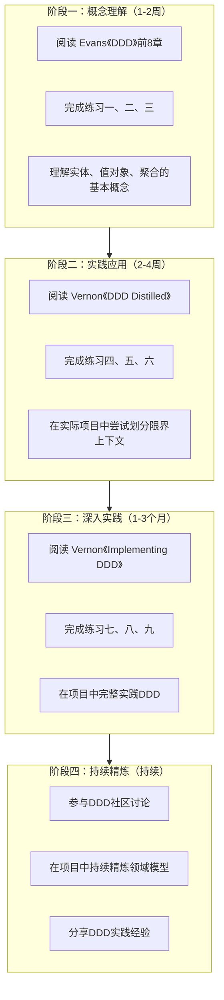

### 阶段一：概念理解（1-2周）

1. 阅读Eric Evans的《Domain-Driven Design》前8章
2. 完成练习一、二、三
3. 理解实体、值对象、聚合的基本概念

### 阶段二：实践应用（2-4周）

1. 阅读Vaughn Vernon的《Domain-Driven Design Distilled》
2. 完成练习四、五、六
3. 在实际项目中尝试划分限界上下文

### 阶段三：深入实践（1-3个月）

1. 阅读Vaughn Vernon的《Implementing Domain-Driven Design》
2. 完成练习七、八、九
3. 在项目中完整实践DDD

### 阶段四：持续精炼（持续）

1. 参与DDD社区讨论
2. 在项目中持续精炼领域模型
3. 分享DDD实践经验

***

## 参考资源

- Eric Evans, *Domain-Driven Design*, Addison-Wesley, 2003
- Vaughn Vernon, *Implementing Domain-Driven Design*, Addison-Wesley, 2013
- Vaughn Vernon, *Domain-Driven Design Distilled*, Addison-Wesley, 2016
- Martin Fowler, *Patterns of Enterprise Application Architecture*, Addison-Wesley, 2002
- EventStorming.com: https://www.eventstorming.com
- DDD Community: https://www.dddcommunity.org


***

## DDD实施清单

在实际项目中应用DDD时，按以下清单逐步推进：

**战略设计阶段**：

- [ ] 进行事件风暴（Event Storming），识别领域事件和限界上下文
- [ ] 划分子域：核心域（Core Domain）、支撑域（Supporting Domain）、通用域（Generic Domain）
- [ ] 绘制上下文映射图（Context Map），确定集成模式
- [ ] 建立统一语言（Ubiquitous Language），编写术语表
- [ ] 评估DDD的投入产出比，确认业务复杂度值得投入

**战术设计阶段**：

- [ ] 为每个限界上下文设计聚合（Aggregate）和聚合根（Aggregate Root）
- [ ] 识别实体（Entity）和值对象（Value Object）
- [ ] 定义领域事件（Domain Event），确定命名规范
- [ ] 设计仓储接口（Repository），确保接口在领域层
- [ ] 识别领域服务（Domain Service），确保无状态
- [ ] 设计工厂（Factory），封装复杂创建逻辑
- [ ] 设计应用服务（Application Service），确保不含业务逻辑，只做编排
- [ ] 区分领域事件和集成事件，确定各自的命名和发布策略
- [ ] 识别需要Saga/Process Manager的跨聚合业务流程

**架构设计阶段**：

- [ ] 选择架构风格：分层架构 / 六边形架构 / 洋葱架构
- [ ] 确定领域层的依赖方向：领域层不依赖任何外部技术
- [ ] 评估是否需要CQRS（读写是否不对称）
- [ ] 评估是否需要Event Sourcing（是否需要完整审计追踪）
- [ ] 设计领域事件的发布和消费机制
- [ ] 评估性能需求：聚合大小、缓存策略、读模型设计

**实施与演进阶段**：

- [ ] 编写领域层的单元测试，覆盖核心业务规则
- [ ] 建立DDD代码评审标准
- [ ] 定期进行模型精炼（Model Refinement）
- [ ] 监控领域事件的处理延迟和失败率
- [ ] 逐步重构：先核心域，后支撑域，最后通用域
- [ ] 如果是从遗留系统迁移：建立防腐层，按模块逐步迁移，确保数据同步

***

## DDD反模式速查表

| 反模式 | 症状 | 危害 | 正确做法 |
|--------|------|------|----------|
| 贫血模型（Anemic Domain Model） | 领域对象只有getter/setter，业务逻辑在Service层 | 违反OOP原则，业务规则散落 | 将业务逻辑封装到领域对象内部 |
| 上帝聚合（God Aggregate） | 一个聚合包含太多实体和值对象 | 性能差、并发冲突、事务过长 | 小聚合原则，聚合间ID引用 |
| 跨聚合对象引用 | 聚合A直接持有聚合B的对象引用 | 加载整个对象图，并发冲突 | 聚合间通过ID引用 |
| 数据库驱动建模 | 先设计数据库表，再反推领域模型 | 领域模型被数据库结构绑架 | 先领域建模，再设计持久化方案 |
| 仓储变DAO | 仓储接口定义在基础设施层，方法反映数据库操作 | 领域层依赖基础设施 | 仓储接口在领域层，方法名反映业务意图 |
| 过度使用领域服务 | 本应放在聚合内的逻辑放到领域服务 | 充血模型退化为贫血模型 | 只将跨聚合的逻辑放到领域服务 |
| 忽略限界上下文 | 整个系统用一套统一语言和模型 | 模型臃肿，概念歧义 | 按业务能力划分限界上下文 |
| 过早引入CQRS/ES | 简单CRUD也用CQRS和Event Sourcing | 不必要的复杂度 | 只在有明确需求时引入 |
| 统一语言流于形式 | 只做命名规范，不做团队协作实践 | 开发与业务理解脱节 | 事件风暴+持续对话+代码即语言 |
| 追求完美模型 | 无休止讨论和建模，无法交付 | 分析瘫痪 | 持续精炼，模型"足够好"即可 |
| 胖应用服务 | 应用服务中包含业务规则判断和计算逻辑 | 业务逻辑泄漏到应用层，无法复用 | 业务逻辑归聚合/领域服务，应用服务只做编排 |
| 领域事件与集成事件混淆 | 将细粒度的领域事件直接发布到外部系统 | 外部耦合领域内部模型变化 | 领域事件内部消费，集成事件跨上下文传播 |
| Saga补偿逻辑缺失 | 跨聚合操作失败时没有补偿机制 | 数据不一致，脏数据残留 | 每个Saga步骤必须定义补偿操作并保证幂等 |

***

# 本章小结

***

## 核心概念关系图

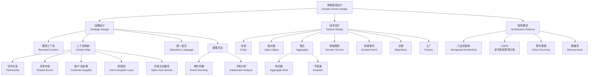

***

## 核心要点回顾

本章系统性地讲解了领域驱动设计（DDD）的理论基础、核心技巧、实战应用和常见误区。以下是关键要点：

***

### 一、DDD的本质

DDD不是一种技术框架，而是一种思维方法论。它的核心主张是：**软件设计的复杂性应该由领域模型来管理**。DDD的价值在于帮助团队将设计焦点从技术实现转向业务领域，通过统一语言和精确的领域模型来管理业务复杂度。

***

### 二、战略设计优先

**限界上下文**（Bounded Context）是DDD最重要的战略概念。在进行战术设计之前，必须先通过战略设计明确系统的宏观结构：

- **限界上下文**：定义统一语言的边界，每个上下文有独立的模型和术语
- **上下文映射**：描述上下文之间的集成关系，指导系统集成方式
- **统一语言**：团队协作的基石，代码即语言、语言即代码

***

### 三、战术设计的构建块

DDD提供了一套丰富的战术构建块，每个都有明确的职责和设计约束：

| 构建块 | 核心特征 | 设计约束 |
|--------|----------|----------|
| 实体（Entity） | 有唯一标识，有生命周期 | 通过标识判断相等，封装业务行为 |
| 值对象（Value Object） | 无标识，不可变 | 通过属性判断相等，构造时验证 |
| 聚合（Aggregate） | 一致性边界 | 保护不变量，事务只修改一个聚合 |
| 聚合根（Aggregate Root） | 聚合唯一入口 | 外部只能通过聚合根访问 |
| 领域服务（Domain Service） | 无状态，业务导向 | 只封装跨聚合的逻辑 |
| 领域事件（Domain Event） | 过去时态，不可变 | 携带完整上下文，幂等消费 |
| 仓储（Repository） | 面向聚合根的集合语义 | 接口在领域层，实现在基础设施层 |
| 应用服务（Application Service） | 用例编排，事务管理 | 不含业务逻辑，只做协调 |

***

### 四、聚合设计的核心原则

聚合设计是DDD中最关键也最困难的部分，需要遵循以下原则：

1. **小聚合优先**：只包含必须在同一事务中保持一致的对象
2. **ID引用**：聚合间通过ID引用，而非对象引用
3. **一个事务一个聚合**：跨聚合的修改使用领域事件实现最终一致性
4. **保护真实不变量**：只在聚合边界内保护必须强一致性的业务规则

***

### 五、DDD与现代架构

DDD不是孤立的，它与现代架构模式有天然的配合关系：

- **微服务**：限界上下文是微服务划分的理想起点
- **CQRS**：分离读写模型，简化领域模型的复杂度
- **事件溯源**：以领域事件为基础，实现完整的审计追踪和时间旅行
- **六边形架构**：领域层在中心，通过端口和适配器与外部世界隔离
- **Saga/Process Manager**：编排跨聚合的复杂业务流程，确保最终一致性

***

### 六、贫血模型 vs 充血模型

DDD强烈主张充血模型（Rich Domain Model）。领域对象应该封装业务行为，而非只有getter和setter。贫血模型（Anemic Domain Model）是Martin Fowler指出的反模式——业务逻辑散落在Service层，领域对象退化为数据容器。

***

### 七、渐进式采用

DDD的引入应该是渐进的：

1. **先战略后战术**：先划分限界上下文，再设计领域模型
2. **先核心后外围**：核心域投入最多精力，通用域使用现成方案
3. **先单体后微服务**：在单体中验证限界上下文，再拆分微服务
4. **先实践后精炼**：在每次迭代中逐步改进模型

***

## 关键决策清单

在实际项目中应用DDD时，需要做出以下关键决策：

| 决策点 | 评估方法 | 产出物 |
|--------|----------|--------|
| 是否需要DDD？ | 评估业务复杂度、规则数量、状态转换复杂度 | 可行性分析报告 |
| 如何划分限界上下文？ | 事件风暴 + 子域分析 + 语言边界识别 | 限界上下文列表 |
| 上下文之间如何集成？ | 分析数据流向和依赖关系 | 上下文映射图 |
| 聚合边界在哪里？ | 识别业务不变量（Invariants） | 聚合设计文档 |
| 聚合间如何引用？ | 评估一致性和性能需求 | ID引用方案 |
| 是否需要CQRS？ | 评估读写模型是否不对称 | CQRS架构决策记录 |
| 是否需要事件溯源？ | 评估审计追踪和时间旅行需求 | Event Sourcing决策记录 |

***

## 推荐阅读路径

**入门**：

- Vaughn Vernon,《Domain-Driven Design Distilled》
- 本章的理论基础和核心技巧部分

**深入**：

- Eric Evans,《Domain-Driven Design》
- Vaughn Vernon,《Implementing Domain-Driven Design》
- 本章的实战案例部分

**实践**：

- 完成本章练习方法中的所有练习
- 在实际项目中尝试应用DDD

***

## 最后的建议

DDD不是银弹，它有自己的适用场景和学习曲线。以下建议帮助你正确使用DDD：

1. **不要教条**：DDD是指导原则，不是必须遵守的规则。根据实际情况灵活应用。
2. **持续学习**：领域建模是一项需要长期练习的技能，不可能一蹴而就。
3. **团队协作**：DDD需要开发者和业务专家的紧密协作，技术再好也无法替代业务理解。
4. **接受不完美**：领域模型是活的，它会随着业务理解的深入而进化。不要追求一步到位的完美设计。
5. **实践出真知**：阅读书籍和文章只能提供理论基础，真正的理解来自实际项目中的实践。

***

## 参考文献

1. Eric Evans, *Domain-Driven Design: Tackling Complexity in the Heart of Software*, Addison-Wesley, 2003
2. Vaughn Vernon, *Implementing Domain-Driven Design*, Addison-Wesley, 2013
3. Vaughn Vernon, *Domain-Driven Design Distilled*, Addison-Wesley, 2016
4. Martin Fowler, *Patterns of Enterprise Application Architecture*, Addison-Wesley, 2002
5. Martin Fowler, "AnemicDomainModel", martinfowler.com, 2003
