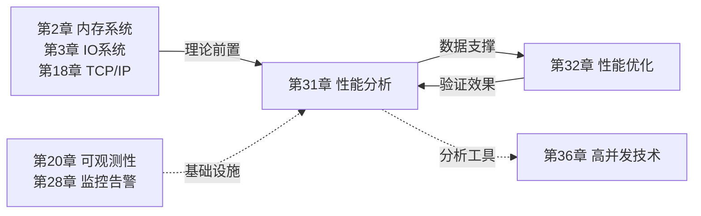
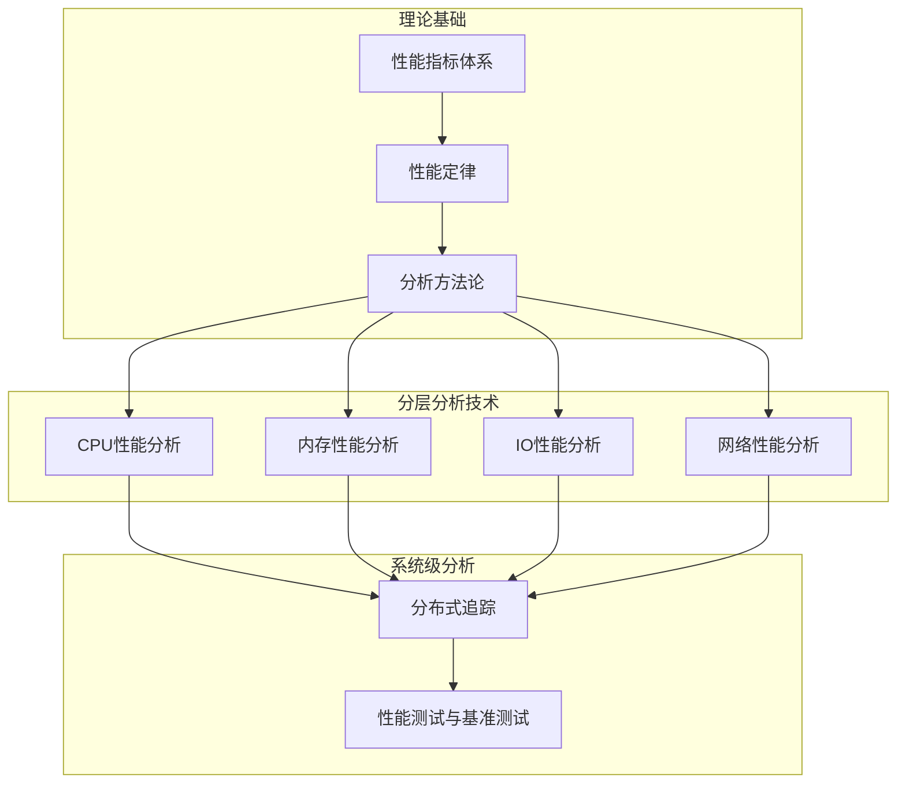
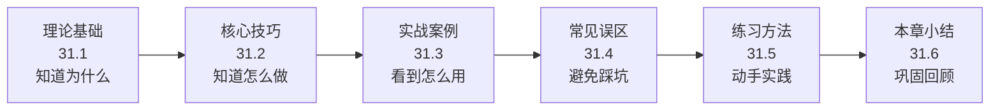
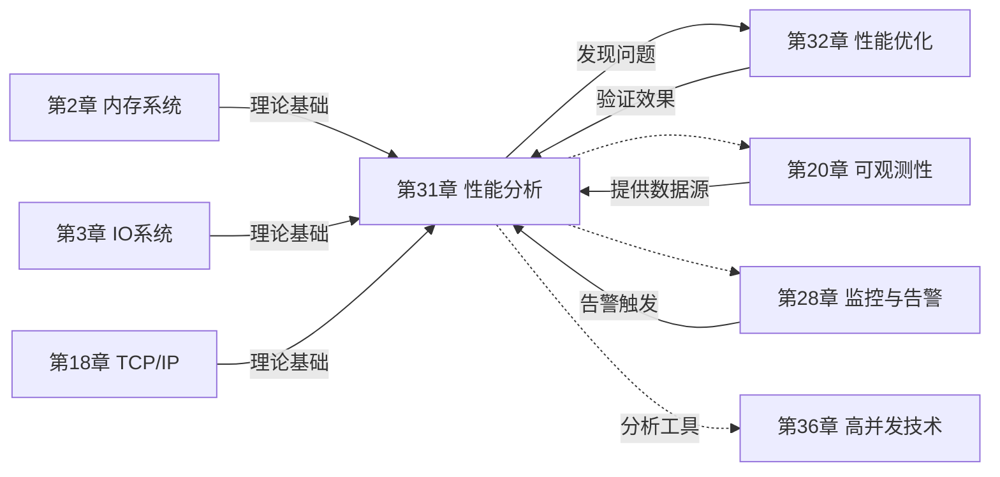

# 第31章 性能分析 · 章节概览

## 章节定位

性能分析（Performance Analysis）是软件工程中通过系统性测量、数据采集和瓶颈定位来量化系统行为、指导优化决策的关键工程实践。

为什么要专门学习性能分析？因为在真实的工程环境中，"系统变慢了"是最常见的模糊问题，而"我猜是数据库慢了"是最常见的错误直觉。没有性能数据支撑的优化决策，要么优化了不该优化的地方（浪费资源和时间），要么忽略了真正的瓶颈（问题依旧）。一组经典数据：Google 的 SRE 实践中，90% 的性能优化决策都是在拿到 profiling 数据后才做出的，而非凭经验猜测。Facebook 的 Scuba 系统让工程师在 10 秒内拿到任意指标的历史趋势——这说明业界对"用数据说话"的重视程度。

在本书的知识体系中，本章处于**性能工程的核心枢纽位置**：

- **向前承接**：第2章（内存系统）提供缓存层次和虚拟内存基础，第3章（IO系统）提供存储架构知识，第18章（TCP/IP协议栈）提供网络分析的理论底座。没有这些基础，性能分析只能停留在表面指标采集层面，无法深入到硬件事件级别的根因定位。
- **向后输出**：第32章（性能优化）的每一个优化手段都需要通过本章的分析方法来验证效果。第36章（高并发技术）的系统性能评估直接依赖本章工具。
- **横向关联**：第20章（可观测性）提供 Metrics/Logging/Tracing 三支柱，第28章（监控与告警）提供持续监控基础设施——两者都是本章性能分析能力的延伸和落地载体。

性能分析不是"出了问题再查"的应急手段，而是一种**持续性的工程能力**。这种能力体现在三个层面：设计阶段的瓶颈预判、日常运维中的状态感知、故障发生时的快速定位。一个具备优秀性能分析能力的工程师，面对"系统变慢了"时不是盲目尝试，而是能够快速建立分析框架——先用 USE 方法做资源级全面扫描，定位瓶颈层级；再用 profiling/tracing 做精准定位，找到根因；最后用数据量化影响并指导优化方案。这个从宏观到微观、从扫描到聚焦的工作流，贯穿本章始终。

## 核心问题

本章围绕以下关键问题展开：

1. **度量什么**：性能分析的核心指标有哪些？延迟、吞吐量、并发度、资源利用率之间是什么数学关系？尾延迟在大规模系统中为什么会被放大？
2. **理论边界在哪里**：阿姆达尔定律和古斯塔夫森定律如何定义并行化加速的理论上限？排队理论如何解释"负载一高就崩"的现象？
3. **怎么系统性分析**：USE 方法和 RED 方法分别适用于什么场景？Profiling、Tracing、Metrics 三种观测手段各自回答什么问题？
4. **各层怎么查**：CPU 层的缓存未命中怎么分析？内存泄漏怎么检测？IO 瓶颈怎么定位？网络延迟怎么分解？
5. **分布式系统怎么追踪**：跨服务的请求如何串联？OpenTelemetry 的统一框架怎么落地？
6. **性能测试怎么设计**：负载测试、压力测试、基准测试的区别和适用场景？如何用测试数据指导容量规划？

## 术法道贯通

本章的知识体系遵循"道法术器"的递进逻辑：

### 道：性能的本质规律

性能分析的"道"层面，是理解系统性能的**内在数学规律和物理约束**。这些规律不随工具更迭而变化，是性能分析能力的根基：

- **排队理论**是性能分析的数学基石。M/M/1 和 M/M/c 模型揭示了一个残酷的真相：当资源利用率接近 100% 时，延迟趋向无穷大。这不是工具能解决的问题，而是物理规律的约束——就像高速公路在车流量接近车道容量时必然堵车一样。理解这一点，你就知道为什么 CPU 利用率长期超过 70% 需要扩容，为什么磁盘队列长度大于 2 意味着 IO 瓶颈。
- **阿姆达尔定律**揭示了并行化加速的硬上限：即使有 99% 的代码可并行化，16 核的实际加速比也只有 13.5 倍，远低于直觉上的"16 倍"。这个定律提醒我们：优化串行瓶颈比增加核数更有价值。
- **利特尔定律**（L = λ × W）建立了并发度、吞吐量和延迟之间的精确数学关系，且对请求分布和服务时间没有任何假设。它是容量规划和限流策略设计的理论基础。

### 法：分析的方法论框架

性能分析的"法"层面，是**系统性分析的方法论和工作流程**：

- **USE 方法**（Utilization/Saturation/Errors）用于资源级分析。它的核心价值不在于三个指标本身，而在于"系统性"——它强制你逐一检查每个资源的三个维度，避免遗漏。实践中最常见的错误就是"只看了 CPU 利用率就下结论"，而忽略了饱和度和错误维度。
- **RED 方法**（Rate/Errors/Duration）用于服务级分析。在微服务架构中，一个用户请求可能经过 10+ 个服务，RED 方法让你从服务维度快速定位哪个服务异常。
- **自顶向下的分析工作流**：先从全局指标（RED）定位异常服务，再用 USE 方法扫描资源层级，最后用 profiling 精准定位代码热点。这个三层递进的工作流是本章反复强调的核心方法论。

### 术：分层分析的具体技术

性能分析的"术"层面，是**每一层的具体分析技术和工具用法**：

| 分析层级 | 核心分析技术 | 关键工具 | 典型判断依据 |
|---------|-------------|---------|-------------|
| CPU 层 | 缓存未命中分析、分支预测统计、调度延迟测量 | perf、火焰图、c2c | IPC < 1 可能存在缓存问题，cache-miss 率 > 5% 需优化 |
| 内存层 | 泄漏检测、TLB Miss 分析、NUMA 局部性检查、碎片评估 | Valgrind、ASan、numactl、pmap | 数小时运行后 RSS 持续增长 = 泄漏，NUMA 远程访问 > 30% = 需绑定 |
| IO 层 | 调度器行为分析、合并策略评估、异步 IO 模式识别 | iostat、blktrace、fio | await > 10ms 且 %util > 80% = 磁盘瓶颈 |
| 网络层 | 延迟分解、重传分析、拥塞窗口观测、连接状态检查 | tcpdump、ss、iperf3、netstat | 重传率 > 1% 或 RTO 频繁触发 = 网络问题 |

### 器：性能分析的工具链

性能分析的"器"层面，是**具体的工具安装、配置和使用方法**。本章涉及 16+ 种工具，从内核级的 perf 到应用级的 JMH，从单机分析的 Valgrind 到分布式追踪的 Jaeger，构成了覆盖全栈的工具矩阵。每个工具都有明确的使用场景和局限性——理解"什么时候用什么工具"比"会用多少工具"更重要。

## 核心主题速览

本章围绕以下六大核心主题展开，构建了从"知道看什么"到"知道怎么改"的完整知识链路：

### 1. 性能指标体系

延迟（Latency）、吞吐量（Throughput）、并发度（Concurrency）、资源利用率（Resource Utilization）构成了性能度量的四大支柱。理解这些指标之间的关系和权衡——特别是尾延迟在大规模系统中的放大效应、利特尔定律（Little's Law）揭示的三者数学关系——是进行有效性能分析的前提。

本节详细讲解四大指标的度量方法、尾延迟的概率放大公式（1 - 0.99^n）、利特尔定律的三种经典应用场景（容量推算、限流设计、延迟预测），以及排队理论中 M/M/1 和 M/M/c 模型的关键结论。这些不是数学练习——排队理论直接解释了"为什么 CPU 利用率到 80% 就必须扩容"这个工程决策背后的物理原理。

### 2. 性能定律

**阿姆达尔定律**（Amdahl's Law）揭示了并行化加速的理论上限：即使无限增加处理器，加速比也被串行部分比例所限制。一个 95% 可并行化的程序，16 核只能加速 7.6 倍而非 16 倍——这个差距在工程决策中意味着：优化串行瓶颈（从 5% 降到 1%）比增加核数（从 16 核增到 64 核）的投入产出比高得多。

**古斯塔夫森定律**（Gustafson's Law）从问题规模可变的角度说明了水平扩展的可行性。在大数据场景中，数据量随计算资源增长而增大（如从 1TB 扩展到 100TB 的分析），此时加速比可以接近线性。两个定律共同定义了性能优化的理论边界，帮助工程师在垂直扩展和水平扩展之间做出正确选择。

### 3. 分析方法论

- **USE 方法**（Utilization / Saturation / Errors）：由 Brendan Gregg 提出，用于系统资源级别的全面检查，对 CPU、内存、磁盘、网络逐一评估利用率、饱和度和错误率。本节给出完整的 USE 检查清单——包括具体的命令和阈值判断标准。
- **RED 方法**（Rate / Errors / Duration）：面向服务级别的监控方法论，关注请求速率、错误率和延迟分布。本节给出 Prometheus 查询示例和 Grafana Dashboard 配置建议。
- **三种观测手段**：Profiling（性能剖析）回答"哪个函数慢"，Tracing（追踪）回答"请求经过了哪些服务"，Metrics（指标）回答"系统整体状态如何"。三者不是互相替代，而是层层递进——Metrics 发现异常、Tracing 定位服务、Profiling 定位代码。

### 4. 分层分析技术

从硬件到应用的每一层都有特定的分析维度：

| 层级 | 分析焦点 | 关键工具 | 本节深度 |
|------|---------|---------|---------|
| CPU层 | 缓存未命中、分支预测失败、调度延迟、False Sharing | perf、火焰图、c2c、PMC | 从 perf stat 到 perf c2c 的完整分析路径 |
| 内存层 | 泄漏检测、碎片分析、TLB Miss、NUMA局部性 | Valgrind、ASan、numactl、pmap | 三种泄漏检测方法的优劣对比 |
| IO层 | 调度器选择、合并策略、异步IO模式、文件系统开销 | iostat、blktrace、fio、biotop | 从 iostat 指标到 blktrace 根因的定位流程 |
| 网络层 | 延迟分解、重传分析、拥塞控制、连接状态 | tcpdump、ss、iperf3、netstat | tcpdump 过滤器语法和延迟分解实战 |

### 5. 分布式追踪

在微服务架构下，单个用户请求可能经过数十个服务节点。本节系统讲解 OpenTelemetry 的统一观测框架——从 Span/Trace 核心概念，到 SDK 埋点和 Collector 部署，再到 Jaeger/Zipkin 后端的数据存储和查询。重点讲解跨服务的延迟瀑布图分析、关键路径识别、以及如何从追踪数据中提取 SLO 所需的 SLI 指标。

### 6. 性能测试与基准测试

性能测试不是"跑个压力测试就行"——本节系统讲解三类测试的区别和设计要点：

- **负载测试**：在预期流量下验证系统表现，确认 SLO 达标。关键参数：并发数、持续时间、爬坡策略。
- **压力测试**：探索系统极限承载能力，识别崩溃点和降级行为。关键观察：错误率拐点、延迟跳变点、资源饱和点。
- **容量规划**：基于测试数据预测扩容需求。关键公式：目标容量 = 当前峰值 × 1.5（余量系数）÷ 利用率目标。

工具覆盖：sysbench（综合基准）、fio（磁盘IO）、wrk（HTTP）、JMH（Java 微基准），每种工具的典型使用模式和结果解读方法。

## 本章结构导航

本章内容按照"理论→方法→实操→纠错→练习→总结"的认知路径组织，每个小节都服务于"建立完整的性能分析能力"这一目标：

这个顺序不是随意安排的：

- **理论先行（31.1）**：不讲理论直接上工具，就像不学解剖就拿手术刀——可能割对了地方，也可能割错了。排队理论、阿姆达尔定律、USE/RED 方法论是后续所有实操的认知基础。
- **技巧承接（31.2）**：理论落地为可执行的工作流——从"知道要看什么"到"知道具体怎么操作"。本节重点讲分析思路而非工具操作（操作在 31.1 已覆盖），包括自顶向下分析法、火焰图深度解读、内存模式识别等"判断力"层面的内容。
- **案例印证（31.3）**：真实场景的完整诊断过程。从"系统变慢了"的模糊描述，到逐步定位到具体代码行的完整过程——提供可模仿的分析范式。
- **误区纠偏（31.4）**：七类典型错误的深入剖析。误区不是"知道就行"的列表，每个误区都有"为什么会犯"和"怎么纠正"的详细分析。
- **练习巩固（31.5）**：从 USE 方法实践到端到端优化项目的三档练习，附带评估标准和进阶路径。
- **小结收束（31.6）**：核心知识点回顾和技能清单，帮助读者查漏补缺。

| 小节 | 内容 | 适合谁 | 阅读时间 |
|------|------|--------|---------|
| **31.1 理论基础** | 性能指标、阿姆达尔/古斯塔夫森定律、USE/RED方法论、CPU/内存/IO/网络四层分析技术、分布式追踪、性能测试与基准测试工具 | 所有读者——这是全章的知识底座 | 2-3小时 |
| **31.2 核心技巧** | 系统性分析工作流、自顶向下分析法、火焰图深度解读、内存使用模式识别、IO模式识别、网络延迟诊断 | 有一定基础的工程师——侧重分析思路和实战判断 | 1.5-2小时 |
| **31.3 实战案例** | 真实场景下的性能问题诊断与解决过程（含CPU/内存/IO/网络/分布式全栈案例） | 希望看到理论落地的工程师——提供可模仿的分析范式 | 1-1.5小时 |
| **31.4 常见误区** | 七类典型错误：过度优化、忽视测量基线、混淆不同层级指标、孤立分析、忽视硬件影响、基准测试误导、过度依赖工具 | 所有读者——避免走弯路 | 30-45分钟 |
| **31.5 练习方法** | 基础/进阶/高级三档练习、持续学习路径、推荐资源 | 希望动手实践的读者——从USE方法实践到端到端优化项目 | 按需 |
| **31.6 本章小结** | 核心知识点回顾、关键技能清单、实践建议 | 所有读者——快速回顾和查漏补缺 | 15-20分钟 |

## 学习目标

完成本章学习后，读者应能建立三个层面的能力：

**知识层面——能解释"为什么"：**

1. 解释延迟、吞吐量、并发度、资源利用率四个核心指标的含义，说明利特尔定律 L = λ × W 如何约束三者关系，以及尾延迟在 n 路扇出请求中的放大概率公式 1 - 0.99^n
2. 说明阿姆达尔定律 S(n) = 1/((1-p) + p/n) 的工程含义：为什么"优化串行瓶颈"比"增加核数"往往更有价值，以及两个定律如何指导垂直扩展 vs 水平扩展的决策
3. 区分 USE 方法和 RED 方法的适用范围——前者用于资源分析（CPU/内存/IO/网络的 Utilization/Saturation/Errors），后者用于服务分析（Rate/Errors/Duration），并解释为什么两种方法不能互相替代

**技能层面——能执行"怎么做"：**

4. 使用 USE 方法对 Linux 系统的 CPU、内存、IO、网络资源进行系统性检查，给出具体的命令和阈值判断标准（如：`mpstat -P ALL 1` 看 CPU 利用率，`vmstat 1` 的 r 列看饱和度，`perf stat` 看硬件错误）
5. 使用 perf 采集数据并生成火焰图，通过"宽平顶=热点、尖顶=向下查"的判断规则准确定位 CPU 热点函数
6. 使用 Valgrind 或 ASan 检测内存泄漏，使用 numactl 优化 NUMA 访问，能区分三种内存分析方法（Valgrind 精确但慢、ASan 快但有侵入性、pmap 无侵入但信息有限）的适用场景
7. 使用 iostat 和 blktrace 分析 IO 瓶颈，能从 iostat 指标（%util、await、avgqu-sz）推断瓶颈类型，再用 blktrace 定位到具体的 IO 模式
8. 使用 tcpdump 和 ss 诊断网络延迟问题，能编写基本的 tcpdump 过滤器提取目标流量

**工程层面——能做出"正确的决策"：**

9. 设计和执行负载测试、压力测试方案，基于测试结果进行容量规划——包括选择正确的测试参数（并发数、爬坡策略、持续时间）和解读关键拐点（错误率跳变、延迟陡升）
10. 在分布式系统中实施基于 OpenTelemetry 的端到端性能追踪，能够从追踪数据中识别关键路径和瓶颈服务
11. 规避常见的性能分析误区，建立"先测量再决策"的科学工作流——面对"系统变慢了"的模糊描述时，能按照 USE→Profiling→Tracing 的三层递进路径系统性地定位根因

## 与其他章节的关系

本章是性能工程知识体系的核心枢纽，与多个章节形成紧密关联：

| 关联章节 | 关系 | 说明 |
|---------|------|------|
| **第2章 内存系统** | 理论前置 | 本章的内存分析依赖第2章介绍的缓存层次、虚拟内存、TLB 等基础知识。不理解 L1/L2/L3 缓存的延迟差异（10倍递增），就无法理解为什么 cache-miss 是性能杀手 |
| **第3章 IO系统** | 理论前置 | 本章的IO分析需要第3章的存储架构知识。不理解块设备、文件系统、页缓存的关系，就无法正确解读 iostat 指标 |
| **第18章 TCP/IP协议栈** | 理论前置 | 网络性能分析需要TCP拥塞控制、滑动窗口等概念。不理解拥塞窗口和重传机制，就无法从 tcpdump 数据中诊断网络瓶颈 |
| **第20章 可观测性** | 技术互补 | 可观测性是性能分析的基础设施。Metrics/Logging/Tracing 三支柱贯穿本章——Metrics 提供全局视图，Tracing 提供请求级追踪，两者共同支撑性能分析的数据采集层 |
| **第32章 性能优化** | 直接后续 | 本章"分析"为第32章"优化"提供数据支撑，优化结果又需要通过本章的方法验证。两者构成"分析→优化→验证"的闭环 |
| **第36章 高并发技术** | 场景关联 | 高并发场景是性能分析的典型战场。本章工具可直接用于第36章系统的性能评估，第36章的限流、熔断、降级等手段也会产生新的性能分析需求 |

## 核心工具速查

本章涉及的主要工具及其适用场景。每个工具的详细用法在对应小节中讲解，此处提供安装方式和核心用途的快速参考：

| 工具 | 用途 | 安装方式 | 详见 |
|------|------|---------|------|
| `perf` | CPU采样、硬件事件统计、调用图分析 | Linux内核自带（`apt install linux-tools-$(uname -r)`） | 31.1 CPU分析 |
| `FlameGraph` | 将perf数据可视化为火焰图 | `git clone github.com/brendangregg/FlameGraph` | 31.1 火焰图 |
| `Valgrind` | 内存泄漏检测、缓存分析 | `apt install valgrind` | 31.1 内存分析 |
| `AddressSanitizer` | 运行时内存错误检测 | 编译选项 `-fsanitize=address` | 31.1 内存分析 |
| `iostat` | 磁盘IO性能监控 | `apt install sysstat` | 31.1 IO分析 |
| `blktrace` | 块设备IO追踪 | `apt install blktrace` | 31.1 IO分析 |
| `numactl` | NUMA拓扑查看与进程绑定 | `apt install libnuma-dev` | 31.1 内存分析 |
| `tcpdump` | 网络抓包分析 | 通常预装 | 31.1 网络分析 |
| `ss` | 套接字统计与连接状态 | `apt install iproute2` | 31.1 网络分析 |
| `sysbench` | 综合基准测试（CPU/内存/IO/DB） | `apt install sysbench` | 31.1 性能测试 |
| `fio` | 磁盘IO基准测试 | `apt install fio` | 31.1 性能测试 |
| `wrk` | HTTP基准测试 | 需编译安装 | 31.1 性能测试 |
| `JMH` | Java微基准测试 | Maven依赖 `org.openjdk.jmh` | 31.1 性能测试 |
| `OpenTelemetry` | 分布式追踪框架 | SDK + Collector | 31.1 分布式追踪 |
| `Jaeger` | 分布式追踪后端 | Docker / Kubernetes | 31.1 分布式追踪 |
| `Prometheus` | 指标采集与告警 | Docker / Helm | 31.1 RED方法 |

## 预备知识

阅读本章前，建议具备以下基础。如果某些基础不具备，不影响阅读——但会限制理解深度：

**必备基础（直接影响阅读理解）：**

- **操作系统基础**：理解进程/线程模型、虚拟内存、文件系统等概念（参见第1-7章）。不理解虚拟内存的页表映射，就无法理解 TLB Miss 的分析意义。
- **Linux命令行**：能够使用 `top`、`free`、`df` 等基础监控命令。本章的所有工具都在 Linux 环境下运行，需要基本的命令行操作能力。

**推荐基础（影响理解深度）：**

- **网络基础**：了解TCP/IP协议栈的基本工作原理（参见第18-19章）。网络性能分析章节涉及 TCP 拥塞控制和重传机制，不理解这些概念会影响对 tcpdump 数据的解读。
- **编程经验**：至少熟悉一门系统级语言（C/C++/Go/Rust/Java），能够理解性能相关的代码。火焰图中看到的函数名、perf 的硬件事件统计，都需要一定的编程背景来解读。

本章的代码示例主要使用Linux环境下的命令行工具，部分涉及Python和C语言。即使不熟悉这些语言，工具的使用逻辑和分析思路同样适用于其他平台。

## 本章要点速查

本表汇总本章的核心知识点，每个概念都附带一句解释和一个关键数据点。适合快速回顾和面试准备：

| 关键概念 | 一句话解释 | 关键数据 |
|---------|-----------|---------|
| 尾延迟（Tail Latency） | P99/P999延迟在大规模扇出请求中会被概率放大——100个并行调用中至少一个命中P99的概率约63% | 1 - 0.99^100 ≈ 0.634 |
| 利特尔定律 | L = λ × W，并发数 = 吞吐量 × 延迟，三者相互约束，对分布无假设 | 适用于任意到达分布和服务时间分布 |
| 阿姆达尔定律 | 固定问题规模下，并行加速上限 = 1/(1-串行比例)，99%可并行→最大100x加速 | 16核+95%并行=实际7.6x加速 |
| 古斯塔夫森定律 | 可变问题规模下，加速比随处理器数量线性增长，指导水平扩展决策 | 大数据场景适用 |
| USE方法 | 每种资源检查 Utilization / Saturation / Errors 三个维度，避免遗漏 | 适用于CPU/内存/磁盘/网络 |
| RED方法 | 每个服务监控 Rate / Errors / Duration 三个指标，适用于微服务监控 | 与Prometheus深度集成 |
| 火焰图 | X轴=采样比例，Y轴=调用栈深度，宽平顶=CPU热点，尖顶=向下查找子函数 | 采样频率99Hz，开销<1% |
| Cache Miss | L1→L2→L3→主存，每层延迟差10倍，缓存友好性决定性能数量级 | L1=4周期，主存=300周期 |
| NUMA | 多路服务器中，本地内存访问比远程快2-3倍，进程绑定是关键优化 | numactl --cpunodebind + --membind |
| IO调度器 | SSD用none/mq-deadline，数据库用deadline，桌面用bfq | NVMe推荐none，SAS/SATA推荐mq-deadline |
| 分布式追踪 | 通过TraceID串联跨服务调用链，实现端到端延迟分析 | OpenTelemetry为CNCF标准 |
| 排队理论 | 当利用率接近100%时，排队延迟趋向无穷大——这是物理约束，不是工具能解决的 | 利用率>80%时延迟急剧上升 |
