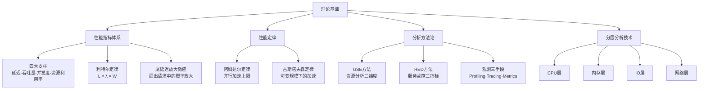
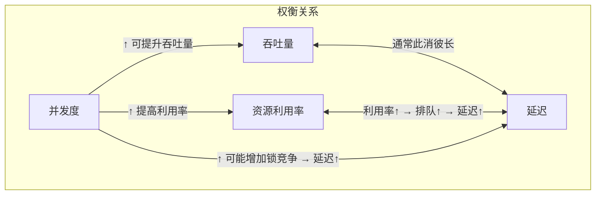
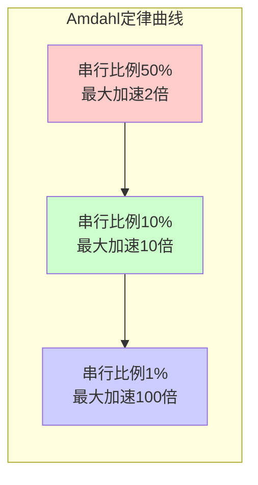
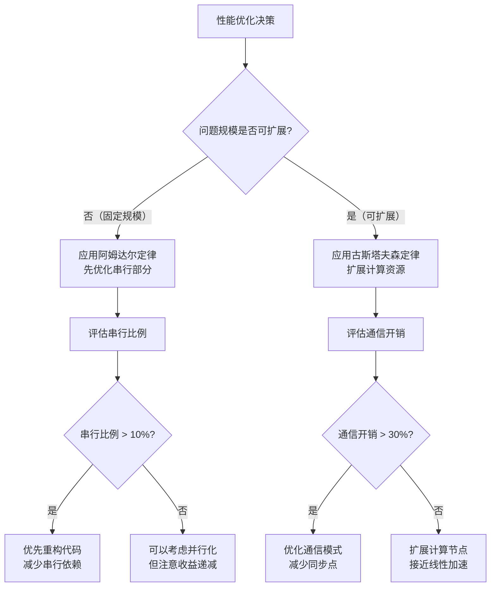
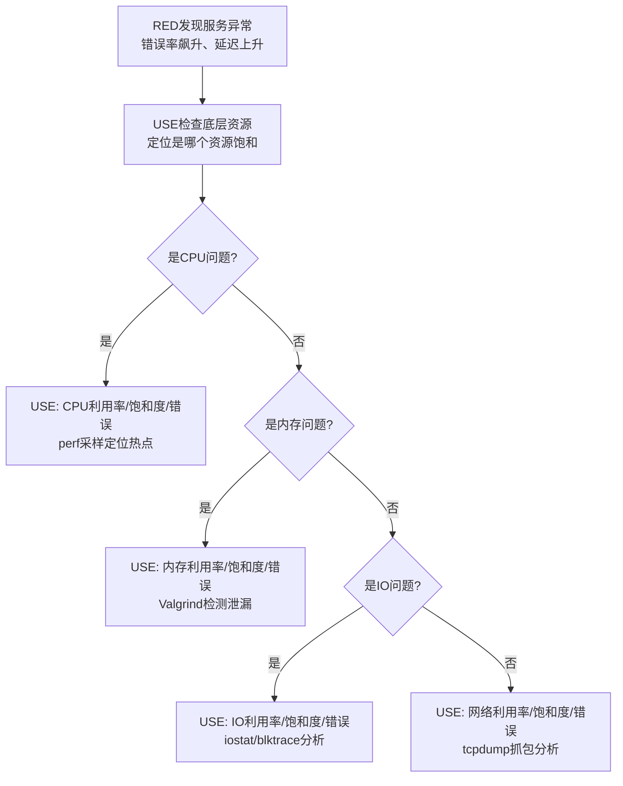
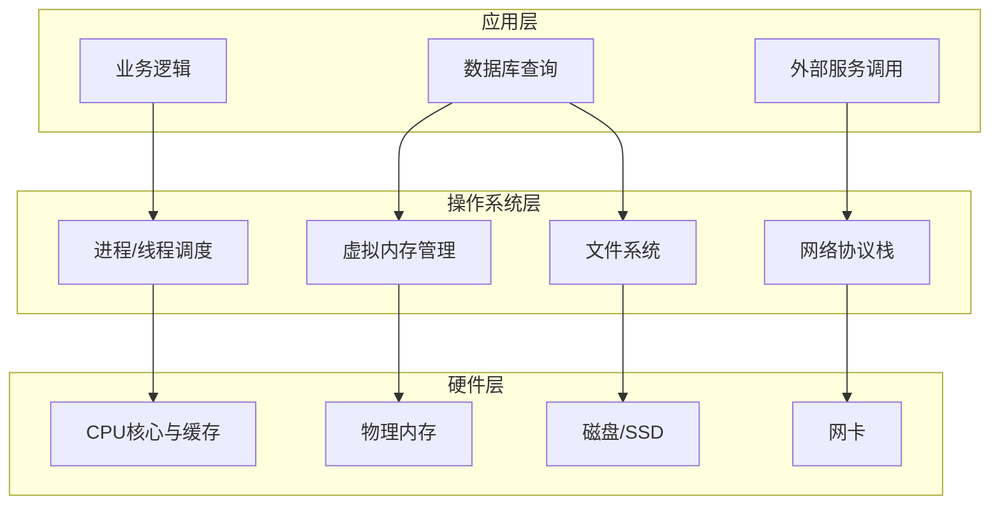
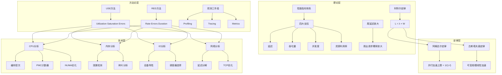

# 31.1 理论基础

性能分析不是凭直觉猜、凭经验改——它是一门有严格数学基础和系统方法论的工程学科。本节从性能指标体系、经典性能定律、分析方法论、分层分析技术四个维度，构建性能分析的理论知识底座。这些理论不是"知道就行"的背景知识，而是你在每一次性能诊断中真正会用到的分析框架和判断依据。

---

## 1. 性能指标体系

性能分析的第一步是明确"用什么尺子量"。延迟、吞吐量、并发度、资源利用率构成了性能度量的四大支柱，但单独看任何一个指标都可能产生误导——真正的性能判断来自于理解它们之间的数学关系。

### 1.1 四大核心指标

| 指标 | 定义 | 度量单位 | 适用场景 | 典型陷阱 |
|------|------|----------|----------|----------|
| **延迟（Latency）** | 从请求发出到收到响应的时间间隔 | 毫秒(ms)、微秒(μs) | 用户体验、实时系统 | 平均延迟掩盖了尾延迟问题 |
| **吞吐量（Throughput）** | 单位时间内成功处理的请求数量 | QPS、TPS、RPS | 容量规划、系统能力评估 | 以牺牲延迟为代价提升吞吐量 |
| **并发度（Concurrency）** | 同时处于处理中的请求数量 | 无量纲（请求数） | 连接池设计、限流策略 | 并发数≠线程数，异步架构下差异巨大 |
| **资源利用率（Utilization）** | 资源被有效使用的时间比例 | 百分比(%) | 瓶颈识别、容量规划 | 利用率100%不等于最优，可能意味着饱和 |

#### 延迟的细分维度

延迟不是一个单一数字，它通常由多个阶段组成。理解延迟的构成是诊断问题的前提：

总延迟 = 网络传输延迟 + 排队等待延迟 + 处理延迟 + 网络返回延迟

其中：
- 网络传输延迟：数据包在网络链路上的传输时间（受距离、带宽、拥塞影响）
- 排队等待延迟：请求在缓冲区、队列中等待被处理的时间（高负载时急剧增加）
- 处理延迟：CPU实际执行业务逻辑的时间（代码效率决定）
- 网络返回延迟：响应数据包返回的时间

在实际系统中，还需要区分：

- **客户端感知延迟**：从用户视角看的端到端延迟，包含DNS解析、TCP握手、TLS握手等
- **服务端处理延迟**：服务端收到请求到开始响应的时间，是后端优化的核心指标
- **骨架延迟（Skeleton Latency）**：去掉已知固定开销后的延迟，用于比较不同实现的纯处理效率

#### 吞吐量与并发度的关系

吞吐量和并发度之间存在一个经常被忽视的数学关系。很多人认为增加并发就能提升吞吐量，但实际上：

当并发数低于最优并发点时：
  吞吐量 ≈ 并发数 / 延迟   （并发数增加，吞吐量线性增长）

当并发数超过最优并发点时：
  吞吐量不再增长甚至下降   （资源争抢导致延迟急剧上升）

最优并发点 = 资源数量 × 目标利用率

这个关系可以通过利特尔定律（Little's Law）精确描述，详见1.2节。

#### 资源利用率的"甜蜜区间"

资源利用率并不是越高越好。实践中存在一个"甜蜜区间"：

| 利用率区间 | 状态 | 典型表现 |
|------------|------|----------|
| 0%-60% | **空闲区** | 资源大量闲置，性能良好但成本浪费 |
| 60%-80% | **甜蜜区** | 性能与成本的最佳平衡，排队延迟可忽略 |
| 80%-90% | **警戒区** | 排队延迟开始显著增长，需要关注但不必恐慌 |
| 90%-100% | **危险区** | 排队延迟指数级增长，吞吐量可能反降 |

对于延迟敏感型系统（如支付、交易），目标利用率应控制在60%以下；对于吞吐量优先型系统（如批处理），可以接受到85%。

### 1.2 利特尔定律（Little's Law）

利特尔定律是排队论中最基础也最有用的公式，它揭示了并发度、吞吐量和延迟三者之间的精确数学关系：

$$L = \lambda \times W$$

| 变量 | 含义 | 单位 |
|------|------|------|
| L | 系统中的平均请求数（并发度） | 个 |
| λ | 平均到达率（吞吐量） | 个/秒 |
| W | 平均逗留时间（延迟） | 秒 |

**这个公式的强大之处在于：**

1. **三者互相约束**：知道了其中任意两个，就能算出第三个
2. **与系统内部无关**：不管系统是单线程还是多线程、用什么算法，这个关系永远成立
3. **诊断能力强**：可以用来反推隐藏的性能问题

**实际应用示例：**

假设一个API服务的监控数据显示：
- 平均QPS（吞吐量）：1000 请求/秒
- 平均响应时间（延迟）：100ms = 0.1秒

根据利特尔定律，系统中同时处理的平均请求数为：

L = λ × W = 1000 × 0.1 = 100 个请求

这意味着系统需要至少100个并发处理单元（线程、协程等）才能维持这个吞吐量。如果线程池只配置了50个线程，那么排队等待时间会显著增加，实际延迟会远超100ms。

**利特尔定律的扩展应用：**

- **容量规划**：如果目标是1000 QPS、延迟<50ms，那么最大允许并发数 = 1000 × 0.05 = 50
- **瓶颈定位**：如果发现实际并发数远高于公式计算值，说明存在排队（饱和）
- **SLA验证**：如果已知并发数和延迟，可以反推实际吞吐量是否满足业务需求

### 1.3 尾延迟与放大效应

在大规模系统中，平均延迟往往不够用——真正影响用户体验的是尾延迟（Tail Latency），即P95、P99、P999延迟。

**尾延迟放大效应的数学原理：**

当一个用户请求扇出（Fan-Out）到N个后端服务时，整体延迟取决于最慢的那个：

P(至少一个请求超过P99延迟) = 1 - (1 - 0.01)^N

当 N = 100  时，概率 = 1 - 0.99^100 ≈ 63.4%
当 N = 50   时，概率 = 1 - 0.99^50  ≈ 39.5%
当 N = 10   时，概率 = 1 - 0.99^10  ≈ 9.6%

这意味着：即使每个后端服务的P99延迟都是100ms，一个扇出100个服务的前端请求有63%的概率遇到超过100ms的延迟。这是Google在其SRE实践中反复强调尾延迟控制的根本原因。

**应对策略：**

| 策略 | 原理 | 适用场景 |
|------|------|----------|
| 请求重试（ hedged request） | 发送多个相同请求，取最快的结果 | 读操作，允许少量冗余计算 |
| 预留容量（headroom） | 保持足够的空闲容量来吸收延迟尖峰 | 延迟敏感型服务 |
| 超时控制 | 设置合理的超时时间，避免慢请求拖累系统 | 所有服务调用 |
| 异步化 | 将非关键路径的操作异步执行 | 用户体验敏感的主路径 |

### 1.4 指标间的权衡关系

四大指标之间存在天然的权衡关系，理解这些权衡是性能优化的决策基础：

**常见的权衡场景：**

1. **批处理 vs 在线服务**：批处理追求吞吐量最大化（大缓冲区、批量提交），在线服务追求延迟最小化（小缓冲区、逐条处理）
2. **缓存 vs 实时性**：增加缓存层可以降低延迟、提升吞吐量，但引入了数据一致性问题
3. **压缩 vs CPU开销**：压缩减少网络传输延迟，但增加CPU处理延迟
4. **同步 vs 异步**：同步调用简单但延迟叠加，异步降低整体延迟但增加复杂度

---

## 2. 性能定律

性能定律是性能分析的数学基础，它们不是抽象的理论公式，而是直接决定优化方向和上限的工程工具。

### 2.1 阿姆达尔定律（Amdahl's Law）

1967年，Gene Amdahl提出了并行计算加速比的理论上限：

$$S(N) = \frac{1}{(1 - f) + \frac{f}{N}}$$

| 变量 | 含义 |
|------|------|
| S(N) | 使用N个处理器时的加速比 |
| f | 程序中可并行化的比例（0 ≤ f ≤ 1） |
| 1-f | 程序中必须串行执行的比例 |
| N | 处理器数量 |

**核心洞察：** 即使无限增加处理器（N→∞），加速比也被串行部分限制为：

$$S_{max} = \frac{1}{1 - f}$$

**实际意义举例：**

| 串行比例(f) | 理论最大加速比 | 含义 |
|-------------|---------------|------|
| 50% | 2倍 | 一半代码必须串行，再多CPU也没用 |
| 90% | 10倍 | 90%可并行，但上限只有10倍 |
| 95% | 20倍 | 看似很高，但需要大量CPU才能接近 |
| 99% | 100倍 | 1%的串行代码决定了100倍的上限 |

**工程启示：**

- **先优化串行部分，再考虑并行化**：如果你的程序有10%是串行的，那么投入再多CPU也只能加速10倍。与其买更多服务器，不如优化那10%的串行代码
- **并行化的收益递减**：从1核到2核可能提升1.8倍，但从100核到200核可能只提升1.1倍
- **Amdahl定律适用于固定问题规模**：当问题规模固定时，增加处理器的收益会迅速递减

**图形化理解：**

### 2.2 古斯塔夫森定律（Gustafson's Law）

1988年，John Gustafson提出了与阿姆达尔定律互补的观点。他认为实际应用中问题规模通常随处理器数量增加而扩大：

$$S(N) = N - f \times (N - 1)$$

| 变量 | 含义 |
|------|------|
| S(N) | 使用N个处理器时的加速比 |
| f | 串行比例 |
| N | 处理器数量 |

**核心洞察：** 当问题规模可以扩展时，加速比可以接近线性增长：

$$S(N) \approx N \times (1 - f) + f$$

**两个定律的对比：**

| 维度 | 阿姆达尔定律 | 古斯塔夫森定律 |
|------|-------------|---------------|
| 问题规模 | 固定 | 可变（随处理器数增长） |
| 关注点 | 固定任务的加速上限 | 可扩展任务的加速潜力 |
| 串行比例影响 | 严重限制加速比 | 影响相对较小 |
| 适用场景 | 无法扩展的问题（如单次查询） | 可以扩展的问题（如大规模数据处理） |
| 实际含义 | 并行化有天花板 | 扩展能力几乎无限 |

**工程启示：**

- **阿姆达尔定律告诉你"上限在哪"，古斯塔夫森定律告诉你"天花板可以抬高"**
- 如果你的问题可以随计算资源扩展（如机器学习训练、大数据分析），那么增加CPU确实能带来接近线性的加速
- 如果你的问题是固定规模的（如单个HTTP请求的处理），阿姆达尔定律才是真正的约束

### 2.3 两个定律的综合应用

在实际工程中，两个定律不是非此即彼的关系，而是需要根据具体场景判断：

### 2.4 性能建模的实用方法

性能定律提供了理论框架，但实际性能分析还需要结合具体场景建模：

**排队论模型（M/M/1）：**

对于单服务台的排队系统，平均等待时间为：

$$W_q = \frac{\lambda}{\mu(\mu - \lambda)}$$

| 变量 | 含义 |
|------|------|
| λ | 请求到达率（请求数/秒） |
| μ | 服务速率（请求数/秒） |
| ρ = λ/μ | 利用率（必须 < 1 系统才能稳定） |

**关键特性：** 当利用率ρ接近1时，等待时间趋向无穷大。这就是为什么利用率超过80%后性能急剧下降的根本原因。

**阿姆达尔定律在缓存中的应用：**

假设缓存命中率为h，缓存访问时间为T_cache，主存访问时间为T_main：

$$T_{avg} = h \times T_{cache} + (1 - h) \times T_main$$

例：L1缓存命中率95%，L1延迟1ns，主存延迟100ns
T_avg = 0.95 × 1 + 0.05 × 100 = 1.45ns
加速比 = 100 / 1.45 ≈ 69倍

这解释了为什么CPU缓存命中率对性能影响如此巨大——即使只有5%的缓存未命中，也会让平均延迟从1ns飙升到1.45ns，看起来不大，但如果这个访问在热路径上执行10亿次，差异就是秒级的。

---

## 3. 分析方法论

有了指标和定律作为基础，接下来需要一套系统化的分析框架来指导实际的诊断工作。USE方法、RED方法和观测三手段构成了性能分析方法论的核心。

### 3.1 USE方法——资源级分析框架

USE方法由Brendan Gregg在2012年提出，专门用于系统资源级别的全面检查。它将每种资源的分析简化为三个维度：

| 维度 | 含义 | 度量方式 | 告警阈值参考 |
|------|------|----------|-------------|
| **U**tilization（利用率） | 资源被使用的时间比例 | 时间采样、计数器 | CPU > 80%，IO > 70% |
| **S**aturation（饱和度） | 资源排队等待的程度 | 队列长度、等待时间 | 运行队列 > CPU核数，IO队列 > 1 |
| **E**rrors（错误数） | 资源产生的错误事件 | 错误计数、错误日志 | 任何非零错误都值得关注 |

**USE方法在各资源上的应用：**

| 资源 | Utilization | Saturation | Errors |
|------|-------------|------------|--------|
| **CPU** | `mpstat -P ALL 1` 中 us+sy 百分比 | `vmstat 1` 中 r 列 > CPU核数 | `perf stat` 中硬件错误 |
| **内存** | `free -h` 中 used/total | `vmstat 1` 中 si/so 列 > 0 | `dmesg` 中 OOM killer 日志 |
| **磁盘** | `iostat -xz 1` 中 %util | `iostat -xz 1` 中 avgqu-sz > 1 | `smartctl` 中重分配扇区 |
| **网络** | `sar -n DEV 1` 中带宽利用率 | `ss -s` 中 SYN-RECV 积压 | `ip -s link` 中 errors/drops |

**USE方法的使用原则：**

1. **按资源逐一检查**：CPU → 内存 → 磁盘 → 网络，不跳过任何一种
2. **三个维度都要看**：利用率正常不代表没有问题（可能是饱和度高），饱和度正常不代表没有错误
3. **异常值定位**：找到异常资源后，再深入该资源的具体维度
4. **交叉验证**：多个指标同时异常时，关注它们的因果关系

**USE方法的局限性：**

- 不适用于应用层分析（如Java GC、数据库慢查询）
- 只关注"资源不够"的情况，无法诊断"资源够但用不好"的问题
- 需要结合RED方法进行服务级分析

### 3.2 RED方法——服务级监控框架

RED方法由Tom Wilkie在2015年提出，专门用于微服务架构下的服务级监控：

| 维度 | 含义 | 度量方式 | 典型实现 |
|------|------|----------|----------|
| **R**ate（速率） | 每秒处理的请求数 | 计数器/秒 | Prometheus counter |
| **E**rrors（错误） | 每秒失败的请求数 | 错误计数器/秒 | HTTP 5xx 计数 |
| **D**uration（延迟） | 请求处理时间分布 | 直方图/分位数 | Prometheus histogram |

**RED方法的黄金信号（Google SRE）：**

| 信号 | 含义 | 预警条件 |
|------|------|----------|
| 延迟 | 服务处理请求的时间 | P99延迟突然上升 |
| 流量 | 请求速率 | 请求量突然增加或下降 |
| 错误 | 失败请求比例 | 错误率超过阈值（如0.1%） |
| 饱和度 | 资源使用程度 | CPU/内存/连接池接近上限 |

**USE vs RED 的选择指南：**

| 维度 | USE方法 | RED方法 |
|------|---------|---------|
| **分析对象** | 系统资源（CPU/内存/IO/网络） | 服务/应用 |
| **适用阶段** | 底层瓶颈定位 | 上层问题发现 |
| **数据来源** | 系统计数器、硬件事件 | 应用日志、指标采集 |
| **典型工具** | perf、iostat、ss | Prometheus、Jaeger |
| **使用时机** | 已知某资源异常，深入分析 | 不确定问题在哪，先全面扫描 |

**实际工作中的组合使用：**

### 3.3 观测三手段——Profiling、Tracing、Metrics

性能观测有三种基本手段，它们各有侧重，互为补充：

| 手段 | 采样方式 | 数据粒度 | 开销 | 适用场景 |
|------|----------|----------|------|----------|
| **Profiling（剖析）** | 统计采样 | 函数级、调用栈级 | 低（1-5%） | CPU热点定位、内存分配热点 |
| **Tracing（追踪）** | 事件记录 | 请求级、事件级 | 中（5-15%） | 分布式调用链、延迟分解 |
| **Metrics（指标）** | 聚合统计 | 服务级、系统级 | 极低（<1%） | 监控告警、趋势分析、容量规划 |

**三种手段的详细对比：**

| 维度 | Profiling | Tracing | Metrics |
|------|-----------|---------|---------|
| **数据模型** | 树状调用图 | 有向无环图（Trace链） | 时间序列 |
| **典型产出** | 火焰图、调用树 | 调用链时序图 | 仪表盘、告警曲线 |
| **时间维度** | 全局采样（非全量） | 每个请求一条记录 | 聚合后的统计值 |
| **信息量** | 最丰富（完整调用栈） | 丰富（跨服务调用） | 最少（只有统计值） |
| **存储成本** | 中等 | 高（每请求一条） | 低（只有聚合值） |
| **延迟影响** | 通常可忽略 | 每次请求增加一次记录 | 几乎无影响 |

**观测手段的选择策略：**

监控告警（平时）    →  Metrics   （Prometheus + Grafana）
问题发现（告警触发）→  Metrics   （确认异常指标）
深入分析（定位根因）→  Profiling + Tracing
性能验证（优化后）  →  Metrics + Profiling  （对比前后差异）

**Profiling 的类型细分：**

| 类型 | 采集内容 | 工具 | 适用问题 |
|------|----------|------|----------|
| CPU采样 | 哪些函数消耗CPU最多 | perf、async-profiler | CPU密集型瓶颈 |
| 内存剖析 | 哪些代码分配内存最多 | Valgrind、heaptrack | 内存分配热点、泄漏 |
| 锁分析 | 哪些锁竞争最激烈 | perf lock、Mutex Profiler | 并发瓶颈 |
| IO剖析 | 哪些代码执行IO最多 | strace、perf trace | IO密集型瓶颈 |

**Tracing 的关键概念：**

| 概念 | 含义 | 作用 |
|------|------|------|
| TraceID | 全局唯一标识，贯穿整个请求链路 | 关联同一请求的所有跨度 |
| SpanID | 单个操作的唯一标识 | 标识调用链中的每个环节 |
| Span | 一个具体操作的执行记录 | 记录操作的开始时间、结束时间、状态 |
| 采样率 | 决定多少请求被完整记录 | 控制存储成本和性能影响 |

---

## 4. 分层分析技术

现代计算机系统是分层架构，从硬件到应用层每一层都有特定的性能特征和分析方法。理解每一层的性能关键点，才能准确判断瓶颈所在。

### 4.1 分层架构与性能关键点

| 层级 | 性能关键点 | 分析焦点 | 关键工具 |
|------|-----------|----------|----------|
| **应用层** | 算法效率、数据库查询、服务调用 | 哪个函数慢、哪个查询慢、哪个服务慢 | Profiler、APM、慢查询日志 |
| **OS层** | 调度延迟、内存分配、IO调度、协议栈 | 上下文切换、页面缺失、IO等待、TCP重传 | perf、vmstat、iostat、ss |
| **硬件层** | 缓存命中率、内存带宽、IO吞吐、网卡中断 | Cache Miss、TLB Miss、DMA延迟 | perf stat、numactl、blktrace |

### 4.2 CPU层分析

CPU层是性能分析最复杂的层级，涉及缓存层次、分支预测、超标量执行等多个维度。

#### CPU缓存层次的延迟差异

CPU缓存的访问延迟呈数量级递增，这是CPU性能分析最重要的背景知识：

| 缓存层级 | 典型延迟 | 相对L1延迟 | 典型大小（2024年） |
|----------|----------|-----------|-------------------|
| L1指令缓存 | ~1 ns | 1x | 32-64 KB/核 |
| L1数据缓存 | ~1 ns | 1x | 32-64 KB/核 |
| L2缓存 | ~3-5 ns | 3-5x | 256 KB-1 MB/核 |
| L3缓存（共享） | ~10-20 ns | 10-20x | 8-64 MB |
| 主内存 | ~50-100 ns | 50-100x | 数十到数百GB |

**关键洞察：** L1缓存未命中一次（去L2取数据）相当于浪费了约4个时钟周期；L1未命中去主存取数据相当于浪费了约100个时钟周期。对于一个每秒执行数十亿次的热循环来说，这个差异是巨大的。

#### 硬件性能计数器（PMC）

现代CPU内置了大量硬件性能计数器，perf工具可以直接读取这些计数器来量化CPU行为：

| 计数器 | 含义 | 优化方向 |
|--------|------|----------|
| `instructions` | 执行的指令总数 | 减少指令数（算法优化） |
| `cycles` | CPU时钟周期数 | 减少周期数（减少等待） |
| `cache-misses` | 缓存未命中次数 | 优化数据局部性 |
| `branch-misses` | 分支预测失败次数 | 减少不可预测分支 |
| `context-switches` | 上下文切换次数 | 减少线程切换 |
| `page-faults` | 缺页中断次数 | 优化内存访问模式 |

**IPC（Instructions Per Cycle）：** 每个时钟周期执行的指令数，是衡量CPU执行效率的核心指标：

IPC = instructions / cycles

典型值：
- 计算密集型代码：IPC ≈ 1.0-2.0（受限于数据依赖）
- 内存密集型代码：IPC ≈ 0.1-0.5（大量时间等待内存）
- 优化目标：让IPC接近CPU的理论峰值（通常2-4）

#### NUMA架构的影响

在多路服务器中，NUMA（Non-Uniform Memory Access）架构对性能有决定性影响：

| 访问类型 | 延迟 | 带宽 | 典型场景 |
|----------|------|------|----------|
| 本地内存访问 | ~80 ns | ~50 GB/s | 进程在CPU 0，访问CPU 0的内存 |
| 远程内存访问 | ~150 ns | ~30 GB/s | 进程在CPU 0，访问CPU 1的内存 |
| 延迟差异 | **约2倍** | **约1.6倍** | 跨NUMA节点访问的代价 |

**NUMA优化原则：**

1. 将进程绑定到特定NUMA节点，确保所有内存分配在本地节点
2. 使用`numactl --cpunodebind=0 --membind=0`绑定进程
3. 使用`numactl --hardware`查看NUMA拓扑
4. 数据库、缓存等内存密集型应用的NUMA优化效果最显著

### 4.3 内存层分析

内存层分析的核心是理解虚拟内存到物理内存的映射机制，以及各种内存问题的表现。

#### 虚拟内存到物理内存的映射

应用程序视角：  [虚拟地址空间 0x0000 - 0xFFFF]
                      ↓ 页表映射
操作系统视角：  [物理内存页帧]
                      ↓
硬件视角：     [DRAM芯片组]

| 内存问题 | 表现 | 检测方法 | 修复方向 |
|----------|------|----------|----------|
| **内存泄漏** | 内存使用持续增长，不释放 | Valgrind、ASan、heaptrack | 修复资源未释放代码 |
| **内存碎片** | 总空闲内存足够，但无法分配大块 | `/proc/buddyinfo`、`slabtop` | 使用内存池、jemalloc |
| **OOM Killer** | 进程被内核强制终止 | `dmesg | grep -i oom` | 优化内存使用、调整cgroup限制 |
| **Swap频繁** | 系统响应变慢，si/so指标高 | `vmstat 1`、`sar -B 1` | 增加物理内存、优化工作集 |
| **页面缓存效率低** | 磁盘IO高，但内存有空闲 | `cachestat`、`slabtop` | 调整读写模式、使用mmap |

#### 内存泄漏检测方法

| 方法 | 原理 | 开销 | 适用场景 |
|------|------|------|----------|
| **Valgrind Massif** | 拦截所有内存分配/释放 | 极高（10-50x） | 离线分析，精确追踪分配来源 |
| **AddressSanitizer** | 编译时插桩检测越界和泄漏 | 高（2-3x） | 开发测试阶段 |
| **jemalloc profiling** | 内置分配统计和泄漏检测 | 低（<5%） | 生产环境 |
| **eBPF工具** | 内核级内存事件追踪 | 极低（<1%） | 生产环境持续监控 |
| **GC日志分析** | 分析垃圾回收行为 | 低（配置即可） | Java/Go等GC语言 |

### 4.4 IO层分析

IO层分析需要理解存储设备特性、IO调度器、文件系统等多个维度。

#### 存储设备性能特性

| 设备类型 | 随机读延迟 | 顺序读带宽 | IOPS上限 | 适用场景 |
|----------|-----------|-----------|---------|----------|
| HDD（7200RPM） | 5-10 ms | 100-200 MB/s | 100-200 | 冷数据存储、归档 |
| SATA SSD | 50-100 μs | 500-550 MB/s | 50,000-90,000 | 通用存储、Web服务器 |
| NVMe SSD | 10-20 μs | 3,000-7,000 MB/s | 500,000-1,000,000 | 高性能数据库、缓存 |
| Intel Optane | 5-10 μs | 2,000-2,500 MB/s | 550,000-500,000 | 超低延迟需求 |

**关键对比：** NVMe SSD的随机读延迟是HDD的500倍，IOPS是HDD的5000倍。对于随机读密集型应用（如数据库），SSD的性能优势是数量级的。

#### IO调度器选择指南

| 调度器 | 设计目标 | 适用场景 | Linux内核版本 |
|--------|----------|----------|--------------|
| **none/noop** | 最小开销 | NVMe SSD、虚拟化 | 2.6+ |
| **mq-deadline** | 保证延迟、防止饥饿 | 通用场景、数据库 | 3.13+（多队列） |
| **bfq** | 公平带宽分配 | 桌面、交互式应用 | 4.12+ |
| **cfq** | 公平队列调度 | 已过时，被bfq替代 | 2.6-5.0 |

**选择原则：**

- NVMe SSD：使用`none`，设备本身足够快，调度器反而是开销
- SATA SSD + 数据库：使用`mq-deadline`，保证读写延迟可预测
- 桌面/笔记本：使用`bfq`，保证交互式应用的响应性

#### IO模式分析

| IO模式 | 特征 | 分析指标 | 典型应用 |
|--------|------|----------|----------|
| **顺序读** | 连续读取大块数据 | 带宽(MB/s) | 日志分析、视频播放 |
| **顺序写** | 连续写入大块数据 | 带宽(MB/s) | 日志系统、数据导入 |
| **随机读** | 不连续的小块读取 | IOPS | 数据库查询、缓存 |
| **随机写** | 不连续的小块写入 | IOPS、写放大 | 数据库更新、WAL |
| **混合读写** | 同时存在读和写 | 读写比例、队列深度 | OLTP数据库 |

### 4.5 网络层分析

网络层分析的核心是理解TCP/IP协议栈的行为，以及如何量化网络延迟的各个组成部分。

#### 网络延迟分解

总延迟 = DNS解析 + TCP握手 + TLS握手 + 请求传输 + 服务处理 + 响应传输

典型值（跨地域）：
- DNS解析：       1-50 ms（首次查询，后续有缓存）
- TCP握手：       1 RTT ≈ 20-200 ms（取决于距离）
- TLS 1.3握手：   1 RTT ≈ 20-200 ms（可复用时0 RTT）
- HTTP请求传输：  < 1 ms（小请求体）
- 服务处理：      1-1000 ms（取决于业务复杂度）
- HTTP响应传输：  < 10 ms（小响应体，取决于大小）

#### TCP关键性能指标

| 指标 | 含义 | 异常判断 | 优化方向 |
|------|------|----------|----------|
| **RTT** | 往返时间 | > 100ms 需要关注 | CDN、就近部署、协议优化 |
| **重传率** | 重传包占总包比例 | > 0.1% 需要排查 | 排查网络拥塞、设备故障 |
| **拥塞窗口** | TCP发送窗口大小 | 持续较小说明有拥塞 | 启用BBR、优化带宽 |
| **连接数** | 活跃TCP连接数 | 接近文件描述符上限 | 连接池复用、长连接 |
| **TIME_WAIT** | 等待关闭的连接数 | 大量堆积说明连接创建频繁 | 复用连接、调整内核参数 |

#### 网络层常见性能问题

| 问题 | 表现 | 排查方法 | 解决方案 |
|------|------|----------|----------|
| **TCP缓冲区过小** | 吞吐量远低于链路带宽 | `ss -tm` 查看缓冲区大小 | 调整`net.core.rmem_max`等参数 |
| **Nagle算法** | 小包延迟高 | 抓包看到40ms延迟 | 设置`TCP_NODELAY` |
| **连接复用不足** | TIME_WAIT堆积 | `ss -s` 查看连接状态 | 使用连接池、HTTP/2 |
| **DNS解析慢** | 首次请求延迟高 | dig测试DNS响应时间 | 使用本地DNS缓存、预解析 |
| **MTU不匹配** | 包分片、性能下降 | `ping -M do -s 1472` 测试 | 调整MTU或启用Jumbo Frame |

---

## 5. 性能分析的知识图谱

将以上理论整合，可以形成一个完整的性能分析知识图谱：

## 6. 理论到实践的桥梁

本节的理论知识在后续章节中会有具体的应用场景：

| 理论知识点 | 后续应用 | 对应小节 |
|-----------|---------|---------|
| USE方法 | 60秒系统体检清单 | 31.2 技巧一 |
| RED方法 | 服务级监控指标设计 | 31.2 技巧六 |
| CPU缓存层次 | 火焰图解读、cache miss优化 | 31.2 技巧二 |
| 内存泄漏检测 | Valgrind/ASan实操 | 31.2 技巧三 |
| IO调度器 | iostat/blktrace分析 | 31.2 技巧四 |
| 网络延迟分解 | tcpdump/ss诊断 | 31.2 技巧五 |
| 阿姆达尔定律 | 优化方向评估 | 31.3 案例分析 |
| 尾延迟放大 | 高并发系统设计 | 31.4 常见误区 |

## 7. 本节小结

性能分析的理论基础由四个层面构成：

1. **指标体系**：延迟、吞吐量、并发度、资源利用率四大支柱，以及利特尔定律揭示的数学关系和尾延迟的放大效应
2. **性能定律**：阿姆达尔定律定义并行加速的上限，古斯塔夫森定律说明可扩展问题的加速潜力，两者共同划定优化的理论边界
3. **分析方法论**：USE方法用于资源级诊断，RED方法用于服务级监控，Profiling/Tracing/Metrics三种观测手段各司其职
4. **分层分析技术**：CPU/内存/IO/网络四层各有关键点——缓存层次决定CPU性能、泄漏和碎片影响内存、设备和调度器决定IO效率、延迟分解指导网络优化

这些理论不是独立的知识点，而是一个互相支撑的分析框架。在实际诊断中，你通常会先用RED方法发现服务异常，再用USE方法定位底层资源瓶颈，然后用分层分析技术深入具体层级，最后用性能定律评估优化的理论上限。掌握这个框架，性能分析就不再是盲目试错，而是有章法的系统性工程。

---

> **下一步阅读：** 理论基础为性能分析提供了"看什么"的知识，[31.2 核心技巧](../02-核心技巧.md)将告诉你"怎么想"和"怎么做"——从60秒系统体检到火焰图深度解读，从内存模式识别到网络延迟诊断，六大核心技巧构成完整的实战分析链路。
