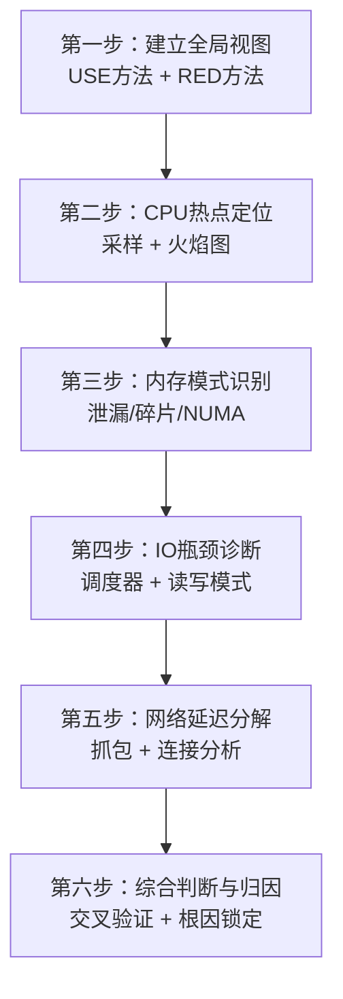
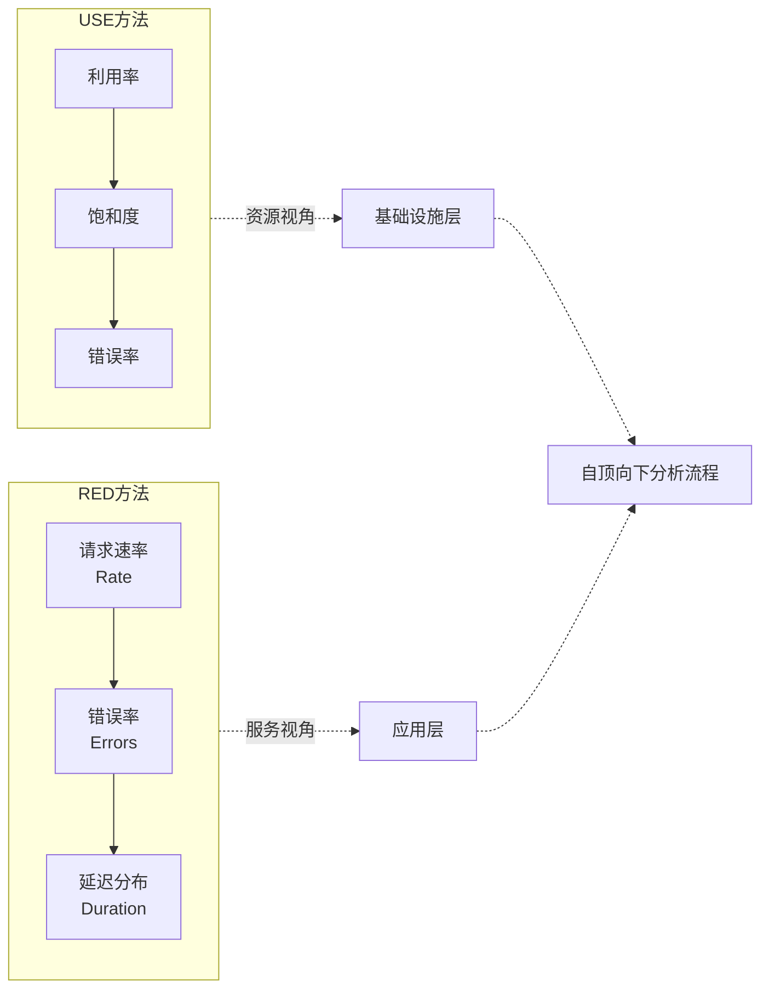
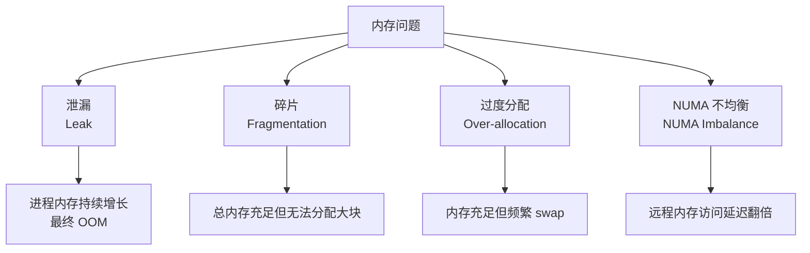
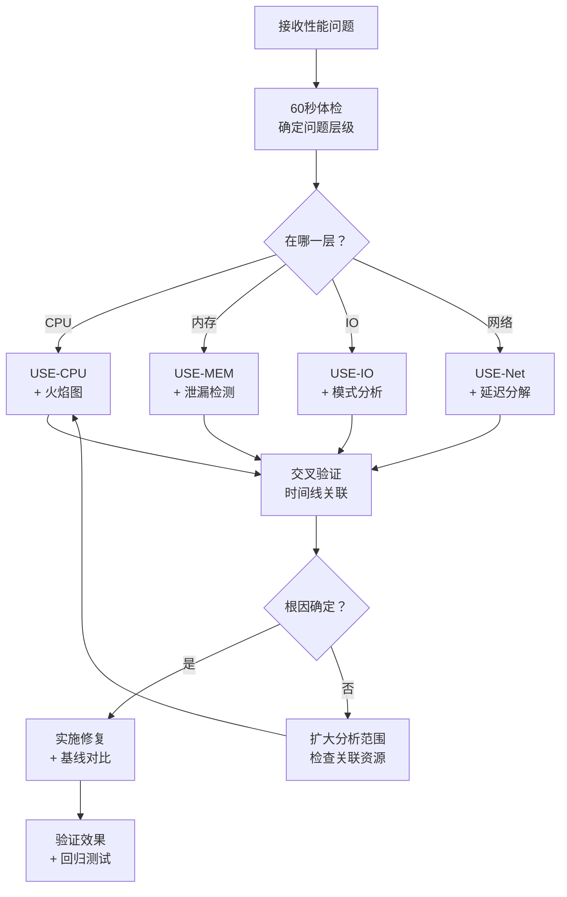

# 31.2 核心技巧

理论基础告诉你"看什么"，本节告诉你"怎么想"和"怎么做"。性能分析不是盲目地跑命令，而是一套有章法的思维流程：先建立全局视图，再逐层缩小范围，最终锁定根因。以下六大核心技巧按照实际分析的先后顺序组织，构成从宏观到微观的完整分析链路。



---

## 技巧一：系统性分析工作流——自顶向下方法论

性能问题最常见的错误是"看到什么查什么"——系统CPU 95%就去优化代码，看到内存飙高就去加内存。这种无序排查往往耗时数小时甚至数天，最终发现真正的问题在另一个层级。

**自顶向下（Top-Down）方法**的核心思想是：先用最小成本确定问题所在的层级，再在该层级深入分析。

### 1.1 第一层：系统级快速体检（60秒内完成）

在接触任何性能问题时，先用 Brendan Gregg 的 **60秒检查清单** 快速建立全局认知。这套方法只需要一条命令行界面，不需要安装额外工具：

```bash
# === 60秒系统体检 ===

# 1. 系统负载与运行时间（1秒）
uptime
# 关注 load average 的三个值（1/5/15分钟）
# 如果 load > CPU核数 × 2，系统可能在排队
# 三个值的关系：
#   1分钟值 > 5分钟值 > 15分钟值 → 负载正在上升
#   1分钟值 < 5分钟值 < 15分钟值 → 负载正在下降
#   三个值接近 → 负载稳定

# 2. 内核错误和丢失消息（1秒）
dmesg -T | tail -20
# 查看是否有 OOM killer、硬件错误、网络丢包等
# dmesg -T 显示人类可读的时间戳

# 3. 统计级概览（1秒）
vmstat 1 3
# 关注 r（运行队列）、b（阻塞进程）、si/so（swap IO）
# r > CPU核数 说明 CPU 饱和
# b > 0 持续存在 说明有进程在等待IO

# 4. CPU时间分解（1秒）
mpstat -P ALL 1 3
# 区分 us（用户态）、sy（内核态）、id（空闲）、wa（IO等待）
# wa > 20% 说明 IO 是瓶颈
# sy 比例异常高 说明内核态开销大（可能是频繁系统调用）
# si（软中断）高 说明网络包处理压力大

# 5. 内存使用（1秒）
free -h
# 关注 available（可用内存）和 swap 使用量
# swap 持续使用说明物理内存不足
# 注意：Linux 会主动用空闲内存做页面缓存（buff/cache），
# 这是正常行为，看 available 而非 free

# 6. 磁盘IO（1秒）
iostat -xz 1 3
# 关注 %util（利用率）、r/s w/s（IOPS）、await（平均延迟）
# SSD 的 %util 意义不大（SSD 可并行处理），看 await 和 IOPS
# await 包含了排队时间 + 设理时间
# svctm（已废弃但仍可见）只含设备处理时间
# await >> svctm 说明排队严重

# 7. 网络概览（1秒）
ss -s
# 查看 TCP 连接状态分布
# ESTABLISHED 过多或 TIME_WAIT 积压都是信号
# SYN-RECV 积压可能是 SYN Flood 或连接风暴

# 8. 进程概览（1秒）
top -bn1 | head -20
# 快速识别 CPU/内存消耗最高的进程
# 按 Shift+P 排序 CPU，按 Shift+M 排序内存
# 关注 %wa 列：如果 top 里看到大量 %wa，确认是 IO 问题
```

**关键判断逻辑**：体检完成后，你应该能回答一个问题——瓶颈在 CPU、内存、IO 还是网络？

| 体检指标 | 瓶颈信号 | 指向的资源 |
|---------|---------|-----------|
| load average > CPU核数 × 2 | r（运行队列）持续大于 CPU 核数 | CPU 饱和 |
| wa（IO wait）> 20% | %util 接近 100%，await 升高 | 磁盘 IO 瓶颈 |
| available < 总内存 20% | swap si/so 持续非零 | 内存不足 |
| TIME_WAIT 积压 | ESTABLISHED 连接数异常高 | 网络/连接管理问题 |
| si（软中断）持续偏高 | 网络包处理跟不上接收速率 | 网卡/协议栈瓶颈 |
| b（阻塞进程）> 0 | 大量进程等待IO完成 | IO子系统瓶颈 |

### 1.2 第二层：USE 方法——逐资源深入

确定可疑资源后，用 **USE 方法**（Utilization / Saturation / Errors）对该资源做三维度检查。USE 方法的威力在于它的系统性——你不会遗漏任何一个维度。

#### CPU 的 USE 检查

```bash
# Utilization（利用率）
mpstat -P ALL 1 5
# 查看每个 CPU 核心的 us + sy 占比
# 也看 %usr（用户态）vs %sys（内核态）的比例
# 如果 %sys 持续 > 30%，可能是频繁系统调用或锁竞争
# 如果单个核心 100% 而其他空闲，说明程序未充分利用多核

# Saturation（饱和度）
vmstat 1 5
# 看 r 列：运行队列长度，持续 > CPU核数 说明 CPU 饱和
# 或用 /proc/stat 中的 procs_running 字段
# 也可用：cat /proc/loadavg 查看瞬时负载

# 上下文切换分析（与饱和度相关）
vmstat 1 5
# 看 cs 列（context switch）
# cs > 100,000/秒 可能意味着线程过多或锁竞争严重
# 结合 perf sched analyze 进一步分析调度延迟

# Errors（错误）
perf stat -e cache-misses,branch-misses -a sleep 5
# 硬件级错误包括：缓存未命中、分支预测失败
# 虽然不是传统意义的"错误"，但在 USE 方法中视为"硬件层面的效率问题"
```

#### 内存的 USE 检查

```bash
# Utilization
free -h
# available / total 即为利用率的反面
# buff/cache 是内核主动缓存，不算"已用"
# 判断标准：available < total × 20% 时需要关注

# Saturation（以 swap 使用为代理指标）
cat /proc/vmstat | grep -E "pswpin|pswpout"
# 观察一段时间内 swap 的 IO 次数变化
# 有 swap 活动即为饱和
# 也可用：vmstat 1 看 si/so 列
# si > 0 说明有页面被换入（从swap读回内存）
# so > 0 说明有页面被换出（内存写入swap）

# 页面缺失（Page Faults）分析
vmstat 1 5
# 看 in 列（page in，从磁盘读入内存）
# 大量 page in 说明工作集超出物理内存
# minor fault（缺页但不需要IO）通常无害
# major fault（缺页需要磁盘IO）严重影响性能

# Errors
dmesg -T | grep -i "oom\|out of memory\|killed process"
# OOM killer 触发是内存错误的极端表现
# 关注被 kill 的是哪个进程、当时的内存状态
```

#### 磁盘 IO 的 USE 检查

```bash
# Utilization
iostat -xz 1 3
# %util 表示设备繁忙时间比例
# 注意：SSD 和虚拟设备的 %util 可能不准确
# SSD 的 IO 是并行的，%util=100% 不意味着饱和
# 判断 SSD 是否饱和应看 await 和 IOPS

# Saturation
iostat -xz 1 3
# 看 avgqu-sz（平均队列长度）
# > 1 表示有 IO 请求在排队
# 对于 SSD：avgqu-sz > 4 才算明显饱和
# 对于 HDD：avgqu-sz > 1 就应关注

# Errors
smartctl -a /dev/sda | grep -E "Reallocated|Pending|Uncorrectable"
# 查看磁盘 SMART 错误
# Reallocated（重分配扇区）> 0：磁盘可能即将故障
# Pending（待确认扇区）> 0：有数据可能损坏
# 以及内核日志中的 IO 错误
dmesg -T | grep -i "io error\|buffer I/O"
```

#### 网络的 USE 检查

```bash
# Utilization
sar -n DEV 1 5
# 查看接口的 rxKB/s、txKB/s
# 与网卡带宽对比（如 1Gbps ≈ 125MB/s）
# 带宽利用率 > 70% 需要关注

# Saturation
ip -s link show eth0
# 查看 overruns（接收溢出）、dropped（丢弃）
# overruns > 0 说明接收缓冲区溢出，网络饱和
# dropped > 0 说明内存不足无法分配缓冲区
# 也可用：netstat -s | grep -i drop

# Errors
ip -s link show eth0
# 查看 errors 列
# 以及 netstat -s | grep -i error
# CRC错误、帧错误通常指向物理层问题（网线/交换机）
```

### 1.3 第三层：RED 方法——面向服务的分析

对于微服务架构中的具体服务，USE 方法不够用，需要 **RED 方法**（Rate / Errors / Duration）从请求视角分析：

```bash
# 使用 curl 模拟请求并测量延迟
for i in $(seq 1 100); do
  curl -s -o /dev/null -w "%{http_code} %{time_total}\n" \
    http://localhost:8080/api/endpoint
done | awk '{
  count[$1]++
  total+=$2
  if($2>max) max=$2
}
END {
  for(code in count) printf "HTTP %s: %d次\n", code, count[code]
  printf "平均延迟: %.3fs, 最大延迟: %.3fs\n", total/NR, max
}'

# 或使用 wrk 进行更专业的压测
wrk -t4 -c100 -d30s --latency http://localhost:8080/api/endpoint
```



**USE 和 RED 的分工**：USE 方法用于基础设施资源（CPU、内存、磁盘、网卡）的全面体检，RED 方法用于应用服务级别的请求质量监控。实际分析中两者交替使用：先用 RED 发现某个服务延迟升高，再用 USE 检查该服务所在机器的资源状态。

---

## 技巧二：CPU 热点定位——采样与火焰图

确定 CPU 是瓶颈后，下一步是找出**哪个函数**消耗了最多 CPU 时间。这就是 CPU Profiling 的核心任务。

### 2.1 采样原理与 On-CPU / Off-CPU 区分

CPU Profiling 不是每时每刻记录调用栈（那样开销太大），而是以固定频率对 CPU 上正在执行的代码进行**快照采样**。采样次数越多，结果越准确，但对系统的影响也越大。

| 采样频率 | 开销 | 适用场景 |
|---------|------|---------|
| 99 Hz（perf 默认） | < 1% CPU | 生产环境长时间 profiling |
| 499 Hz | 1-3% CPU | 开发环境，需要更高精度 |
| 997 Hz | 3-5% CPU | 短时间精确分析 |
| 9999 Hz | 5-10% CPU | 微基准测试，追求极致精度 |

**On-CPU vs Off-CPU 的关键区别：**

| 维度 | On-CPU Profiling | Off-CPU Profiling |
|------|-----------------|-------------------|
| **采集什么** | CPU 正在执行的代码 | 进程不在 CPU 上的时间 |
| **回答什么问题** | 哪些函数消耗了 CPU 时间 | 进程花时间在等什么（IO/锁/睡眠） |
| **适用场景** | CPU 密集型瓶颈 | IO 密集型、锁等待、阻塞调用 |
| **工具** | `perf record -g` | `perf record -e sched:sched_switch` 或 BCC offcputime |
| **火焰图表现** | 宽的叶子函数 = CPU 热点 | 宽的叶子函数 = 等待热点 |

> **经验法则**：如果 CPU 利用率不高但系统仍然慢，优先做 Off-CPU profiling——问题大概率在等待（IO、锁、网络）而非计算。

### 2.2 使用 perf 采集 CPU 热点数据

```bash
# === On-CPU Profiling ===

# 采集系统级 CPU 热点（全局采样，适合定位整体瓶颈）
sudo perf record -a -g -F 99 -o perf.data sleep 30
# -a: 采样所有 CPU
# -g: 记录调用栈（call graph）
# -F 99: 采样频率 99 Hz
# sleep 30: 采样 30 秒

# 采集特定进程的热点（适合定位单个服务的 CPU 消耗）
sudo perf record -p <PID> -g -F 997 -o perf.data -- sleep 15
# 对目标进程使用更高采样频率

# 生成文本报告
sudo perf report --stdio --no-children | head -50
# --no-children: 只显示自身消耗，不累加子调用
# 这样你能看到哪些函数自身（而非调用的子函数）消耗最多 CPU

# === Off-CPU Profiling ===

# 使用 BCC 工具分析 Off-CPU 时间（需要 bcc-tools 包）
sudo offcputime-bpfcc -df -p <PID> 30
# 输出每个函数在 off-CPU 上花费的时间
# -d: 显示每个函数的总时间（含子调用）
# -f: 折叠格式（可直接喂给火焰图工具）

# 使用 perf 做 Off-CPU 分析（不需要 BCC）
sudo perf record -e sched:sched_switch -e sched:sched_wakeup -a -g -F 999 -o offcpu.data sleep 30
sudo perf script -i offcpu.data | stackcollapse-perf.pl > offcpu.folded
flamegraph.pl --title="Off-CPU" offcpu.folded > offcpu.svg
```

### 2.3 实时热点追踪——perf top

当需要**实时**查看 CPU 热点（无需录制数据），`perf top` 是最快的方式：

```bash
# 实时查看系统级热点函数
sudo perf top
# 类似 top 命令，但显示的是 CPU 热点函数
# 输出：Overhead（CPU占比）、Shared Object（所属库）、Symbol（函数名）
# 按 a 键可以切换到 Annotation 模式，查看汇编级热点

# 实时查看特定进程
sudo perf top -p <PID>

# 实时查看特定事件
sudo perf top -e cache-misses -p <PID>
# 切换到 cache miss 热点视角
```

### 2.4 火焰图深度解读

火焰图是将采样数据可视化的最强大工具。安装方法：

```bash
# 克隆 FlameGraph 工具集
git clone https://github.com/brendangregg/FlameGraph.git
export PATH=$PATH:$(pwd)/FlameGraph
```

生成火焰图的完整流程：

```bash
# 1. 采集数据
sudo perf record -a -g -F 99 -o perf.data sleep 30

# 2. 生成折叠栈（perf script 转换格式）
sudo perf script -i perf.data | stackcollapse-perf.pl > perf.folded

# 3. 生成 SVG 火焰图
flamegraph.pl perf.folded > flamegraph.svg
```

**火焰图的阅读方法**：

Y 轴（纵向）：调用栈深度
├── 最底层是入口函数（如 main、http_handler）
├── 向上是逐层调用
└── 最顶层是实际执行的叶子函数（CPU 在这里做计算）

X 轴（横向）：采样占比（宽度 = 该函数及其子函数的 CPU 时间占比）
├── 越宽 = 消耗 CPU 越多
├── 宽且平的顶 = CPU 热点（flat profile 大的函数）
└── X 轴顺序无意义（不代表执行先后）

颜色：
├── 红色/橙色：用户态代码（常见热点）
├── 蓝色：内核态代码（系统调用、IO 处理）
└── 颜色本身不代表好坏，仅用于区分

**关键阅读模式**：

| 模式 | 火焰图表现 | 含义 | 优化方向 |
|------|-----------|------|---------|
| 宽平顶 | 某个叶子函数占据很大宽度 | CPU 密集型热点 | 优化算法、SIMD 加速 |
| 高窄塔 | 调用栈极深但每层很窄 | 递归或深层调用链 | 减少调用层级、尾递归优化 |
| 大片蓝色（内核态） | 火焰图底部大量蓝色区域 | 系统调用开销大 | 减少系统调用次数、批量操作 |
| 分散热点 | 多个中等宽度的函数 | CPU 时间分散在多处 | 整体架构层面优化 |
| 顶部"毛刺" | 单个函数突然变宽 | 偶发热点 | 检查是否有周期性任务或缓存失效 |

### 2.5 差分火焰图——对比优化前后

差分火焰图是定位"改了什么导致性能变化"的利器：

```bash
# 采集优化前的数据
sudo perf record -a -g -F 99 -o before.data sleep 30
# 采集优化后的数据
sudo perf record -a -g -F 99 -o after.data sleep 30

# 生成差分火焰图
sudo perf script -i before.data | stackcollapse-perf.pl > before.folded
sudo perf script -i after.data | stackcollapse-perf.pl > after.folded
difffolded.pl before.folded after.folded | flamegraph.pl > diff.svg
```

在差分火焰图中：**红色**表示优化后新增/增加的热点，**蓝色**表示优化后减少/消失的热点。这让你一目了然地看到优化是否生效。

### 2.6 硬件级 CPU 分析——perf stat

火焰图告诉你"哪个函数慢"，但不告诉你"为什么慢"。`perf stat` 可以揭示硬件层面的原因：

```bash
# 查看硬件计数器
perf stat -d -- sleep 5
# 输出示例：
# 15,234,567  cycles           # CPU 周期数
#  3,456,789  instructions     # 指令数
#       4.2   insn per cycle   # IPC（每周期指令数）
#    123,456  cache-misses     # 缓存未命中
#      5.23%  cache-miss-rate  # 缓存未命中率
#     12,345  branch-misses    # 分支预测失败
#      1.23%  branch-miss-rate # 分支预测失败率

# 对特定进程分析
perf stat -d -p <PID> -- sleep 10

# 查看更详细的缓存信息
perf stat -e L1-dcache-load-misses,L1-dcache-loads,LLC-load-misses,LLC-loads -- sleep 5
```

**关键指标判读**：

| 指标 | 健康值 | 异常含义 | 优化方向 |
|------|--------|---------|---------|
| IPC（insns per cycle） | > 1.0 | < 0.5 说明 CPU 流水线经常停顿（可能在等内存） | 优化数据局部性、减少间接访问 |
| L1 dcache miss rate | < 5% | > 10% 说明数据局部性差，需要优化数据结构布局 | 使用 SoA 替代 AoS、减少指针跳转 |
| L2/L3 cache miss rate | < 1% | > 5% 说明工作集太大，超出缓存容量 | 分块处理（tiling）、减少数据集大小 |
| branch miss rate | < 2% | > 5% 说明分支预测不友好（大量随机分支） | 用位运算替代条件分支、排序数据 |

### 2.7 锁竞争与调度分析——perf lock / perf sched

CPU 热点有时不是计算本身，而是锁竞争或调度延迟：

```bash
# === 锁竞争分析 ===
# 采集锁事件
sudo perf lock record -a -- sleep 10

# 查看锁竞争报告
sudo perf lock report
# 输出：Contended（竞争次数）、Total Wait（总等待时间）、Avg Wait（平均等待时间）
# 找到等待时间最长的锁，定位持有者

# === 调度延迟分析 ===
# 采集调度事件
sudo perf sched record -a -- sleep 10

# 查看调度延迟报告
sudo perf sched latency --sort max
# 按最大延迟排序，找到调度延迟最高的进程

# 查看调度器时间线
sudo perf sched map
# 可视化每个 CPU 上的进程调度情况
# 找到 CPU 空闲但进程在排队的时间段
```

---

## 技巧三：内存使用模式识别

内存问题比 CPU 问题更隐蔽，因为它们往往不会立即崩溃系统，而是在数小时甚至数天后才显现。

### 3.1 内存问题分类



### 3.2 内存泄漏检测

**方法一：运行时监控（生产环境适用）**

```bash
# 记录进程内存随时间的变化
while true; do
  ps -p <PID> -o pid,rss,vsz,pmem --no-headers
  sleep 60
done | tee memory_timeline.log

# 或使用更精确的 smaps
cat /proc/<PID>/smaps_rollup
# Pss: 按比例分摊的物理内存（共享库按进程数均摊）
# Rss: 实际占用的物理内存（包含共享部分）
# Swap: 被换出的内存
# 如果 Pss 持续增长且不回落，大概率存在泄漏

# 使用 pidstat 持续采集内存指标
pidstat -r -p <PID> 60
# %MEM: 内存占系统总量的百分比
# VSZ: 虚拟内存大小（包含未实际分配的部分）
# RSS: 驻留集大小（实际使用的物理内存）
```

**方法二：Valgrind Massif（开发环境适用）**

```bash
# 使用 Valgrind 的内存分析器
valgrind --tool=massif --pages-as-heap=yes ./my_program
ms_print massif.out.<PID>
# 输出为 ASCII 形式的内存分配时间线图
# 可以看到每个时间点的内存分配总量和调用栈

# 分析结果
# 横轴是时间（采样点），纵轴是内存使用量
# 宽且持续增长的区域 = 可能的泄漏点
# 使用 ms_print --detailed <file> 查看调用栈详情
```

**方法三：AddressSanitizer（编译期检测）**

```bash
# C/C++ 编译时启用 ASan
gcc -fsanitize=address -g -O1 -o my_program my_program.c
# 运行时自动检测：缓冲区溢出、use-after-free、内存泄漏
# 发现错误时输出详细的调用栈和内存操作历史

# 检测泄漏
ASAN_OPTIONS=detect_leaks=1 ./my_program
# 进程退出时报告所有未释放的内存及其分配来源

# 也可启用 MSA（Memory Sanitizer）检测未初始化内存读取
# gcc -fsanitize=memory -g -O1 -o my_program my_program.c
```

**方法四：eBPF/BCC 实时监控（生产环境低开销）**

```bash
# 使用 BCC 工具追踪内存分配
sudo memleak-bpfcc -p <PID> -a 10
# 每 10 秒打印一次仍在增长的内存分配
# 显示：地址、大小、分配次数、调用栈
# 适合发现缓慢的内存泄漏

# 使用 slabtop 查看内核 slab 分配器状态
sudo slabtop -o -s c
# 按缓存大小排序，找到占用最多的内核缓存
# dentry/inode cache 过大说明文件操作频繁
# 排名靠前的 kmem_cache 有异常增长需关注
```

### 3.3 内存碎片分析

```bash
# 查看系统碎片情况
cat /proc/buddyinfo
# 每行是一个 NUMA 节点
# 每列是 order（0=4KB, 1=8KB, ... 9=2MB, 10=4MB）
# 数字表示该大小的连续空闲块数量

# 可视化碎片
cat /proc/pagetypeinfo
# 每种迁移类型下的连续空闲页分布

# 判断碎片严重程度：
# 如果大块（order >= 4, 即 64KB+）持续为 0，碎片严重
# 可以触发内存压缩：echo 1 > /proc/sys/vm/compact_memory

# 查看内存压缩状态
cat /proc/vmstat | grep compact
# compact_stall: 被迫同步压缩的次数（越多越糟糕）
# compact_success: 压缩成功的次数
# compact_fail: 压缩失败的次数
# compact_fail / (compact_success + compact_fail) > 30% 说明碎片严重
```

### 3.4 NUMA 分析与优化

在多路服务器（2颗以上 CPU）上，内存访问存在**局部性**：CPU 访问本地内存（同一 NUMA 节点）比访问远程内存快 2-3 倍。

```bash
# 查看 NUMA 拓扑
numactl --hardware
# 输出示例：
# available: 2 nodes (0-1)
# node 0 cpus: 0 1 2 3 4 5 6 7
# node 0 size: 32768 MB
# node 1 cpus: 8 9 10 11 12 13 14 15
# node 1 size: 32768 MB
# node distances: node   0   1
#                   0:  10  21    ← 本地10，远程21（延迟差2倍+）

# 查看进程的 NUMA 内存分布
numastat -p <PID>
# 如果 remote access > local access，说明进程频繁跨节点访问
# local_node 和 other_node 的比例是关键判断指标

# 查看全局 NUMA 统计
numastat
# numa_hit: 本地节点内存访问成功次数
# numa_miss: 远程节点内存访问次数（应尽量避免）
# numa_foreign: 本节点被其他节点分配的次数

# 绑定进程到特定 NUMA 节点
numactl --cpunodebind=0 --membind=0 ./my_program
# 强制进程使用节点 0 的 CPU 和内存

# 自动内存放置策略
numactl --interleave=all ./my_program
# 交错分配：在所有节点间轮转分配内存
# 适用于内存访问模式不可预测的大型应用

# 查看 NUMA 相关的内核活动
cat /proc/vmstat | grep numa
# numa_hit/numa_miss 的变化趋势能反映 NUMA 亲和性
```

---

## 技巧四：IO 模式识别与诊断

IO 瓶颈是生产环境中最常见的性能问题之一，但 IO 层次多（应用 → 文件系统 → 块设备 → 硬件），需要逐层分析。

### 4.1 识别 IO 瓶颈类型

```bash
# 第一步：确认 IO 是否是瓶颈
iostat -xz 1 5

# 关键输出字段解读：
# Device  r/s   w/s   rkB/s  wkB/s  await  svctm  %util
# sda    500   200   8000   12000   15.3    1.2   84.2
#                ↑ IOPS    ↑ 带宽    ↑ 延迟    ↑ 利用率

# %util ≈ 100% 但 await < 1ms：SSD 正常（SSD 可并行处理）
# %util ≈ 100% 且 await > 10ms：真正的 IO 瓶颈
# await >> svctm：请求在队列中等待时间长，IO 调度器可能有问题
# r/s + w/s > 设备标称 IOPS：设备已饱和
```

### 4.2 IO 读写模式分析

```bash
# 使用 biolatency 追踪块IO延迟分布（bpftrace 工具）
sudo bpftrace -e '
tracepoint:block:block_rq_issue {
    @start[args->dev, args->sector] = nsecs;
}
tracepoint:block:block_rq_complete /@start[args->dev, args->sector]/ {
    @usecs = hist((nsecs - @start[args->dev, args->sector]) / 1000);
    delete(@start[args->dev, args->sector]);
}
'

# 或使用 biosnoop 观察每一次 IO 请求
sudo biosnoop
# 输出每次 IO 的时间戳、进程、延迟、大小、偏移
# 识别：大块顺序 IO vs 小块随机 IO

# 使用 iotop 查看哪个进程在做 IO
sudo iotop -o -d 1
# -o: 只显示有 IO 活动的进程
# -d 1: 每秒刷新
# 找到 IO 最重的进程，然后用 strace 追踪其系统调用模式
```

### 4.3 文件系统级分析

```bash
# 查看文件系统挂载选项（影响 IO 性能的关键配置）
mount | grep " / "
# ext4: noatime 减少元数据写入，data=writeback 减少日志开销
# xfs: nobarrier 提升写入性能（有断电丢数据风险）

# 查看文件系统统计
df -i
# 关注 inode 使用率（100% 时无法创建新文件，即使磁盘有空间）

# strace 追踪应用的系统调用模式
strace -c -p <PID> -e trace=read,write,fsync
# 看 read/write 的次数、总字节数、耗时比例
# fsync 占比过高 = 写放大问题
# 大量小 read/write = 应用未使用缓冲IO

# 查看文件系统 IO 统计
cat /proc/diskstats
# 字段：设备名 读完成数 读合并数 读扇区数 读耗时 写完成数 ...
# 读合并数/读完成数 > 1 说明有 IO 合并（好的现象）
```

### 4.4 IO 调度器选择

不同的 IO 调度器适用于不同的工作负载：

| 调度器 | 特点 | 适用场景 |
|-------|------|---------|
| `none`（noop） | 无调度，直接下发 | NVMe SSD、虚拟化环境（已有虚拟调度） |
| `mq-deadline` | 多队列截止时间调度 | 数据库服务器、混合读写工作负载 |
| `bfq` | 预算公平队列 | 桌面系统（需要响应式 IO） |
| `kyber` | 双队列深度控制 | 快速设备（高速 SSD） |

```bash
# 查看当前调度器
cat /sys/block/sda/queue/scheduler

# 切换调度器（临时）
echo mq-deadline | sudo tee /sys/block/sda/queue/scheduler

# 持久化（通过 udev 规则）
cat > /etc/udev/rules.d/60-io-scheduler.rules << 'EOF'
ACTION=="add|change", KERNEL=="sd[a-z]", ATTR{queue/rotational}=="0", ATTR{queue/scheduler}="none"
ACTION=="add|change", KERNEL=="sd[a-z]", ATTR{queue/rotational}=="1", ATTR{queue/scheduler}="mq-deadline"
EOF
```

---

## 技巧五：网络延迟分解与诊断

网络延迟看似简单（ping 一下就知道），但真实的网络延迟问题远比 "ping 不通" 复杂。应用层面感知的延迟包括：DNS 解析、TCP 握手、TLS 协商、请求传输、服务处理、响应传输等多个阶段。

### 5.1 延迟分解方法

```bash
# 使用 curl 分解 HTTP 请求各阶段延迟
curl -w "\
DNS解析:      %{time_namelookup}s\n\
TCP连接:      %{time_connect}s\n\
TLS握手:      %{time_appconnect}s\n\
首字节到达:   %{time_starttransfer}s\n\
总耗时:       %{time_total}s\n\
\
DNS到TCP:     %{time_connect}-%{time_namelookup}s\n\
TCP到TLS:     %{time_appconnect}-%{time_connect}s\n\
TLS到首字节:  %{time_starttransfer}-%{time_appconnect}s\n\
首字节到完成: %{time_total}-%{time_starttransfer}s\n\
" -o /dev/null -s https://example.com/api/data

# 输出示例：
# DNS解析:      0.012s       ← DNS 慢，考虑本地缓存
# TCP连接:      0.045s       ← TCP 握手 = 网络 RTT
# TLS握手:      0.089s       ← TLS = 1-2 个 RTT
# 首字节到达:   0.156s       ← TTFB = 网络 RTT + 服务处理时间
# 总耗时:       0.234s       ← 剩余 = 响应体传输时间
```

**延迟分解示意**：

|<-- DNS -->|<-- TCP -->|<-- TLS -->|<-- 服务处理 -->|<-- 响应传输 -->|
|  0.012s   |  0.033s  |  0.044s   |     0.067s     |    0.078s      |

DNS到TCP = 0.033s (TCP三次握手)
TCP到TLS = 0.044s (TLS 1.3握手 = 1-RTT)
TLS到TTFB = 0.067s (请求传输+服务处理)
TTFB到完成 = 0.078s (响应体传输)

### 5.2 TCP 连接状态分析

```bash
# 查看所有 TCP 连接的状态分布
ss -ant | awk 'NR>1 {state[$1]++} END {for(s in state) printf "%s: %d\n", s, state[s]}'
# 常见状态和含义：
# ESTABLISHED: 正常连接
# TIME_WAIT: 主动关闭方的等待态（2MSL 后消失）
# CLOSE_WAIT: 被动关闭方未 close()——常见 bug 信号
# SYN_RECV: 半连接积压——可能是 SYN Flood 攻击或客户端连接风暴
# FIN_WAIT2: 被动关闭方尚未收到 FIN（可能是应用层未关闭）

# 查看特定状态的连接详情
ss -tnp state close-wait
# 如果 CLOSE_WAIT 大量存在：应用没有正确关闭 socket（代码 bug）
# 查看 -p 选项能显示进程信息，定位到具体进程

# 查看连接的详细 TCP 信息
ss -tinp dst :8080
# 可以看到：拥塞窗口(cwnd)、RTT、重传次数等
# cwnd 很小且重传多 → 网络拥塞或丢包
```

### 5.3 网络抓包分析

```bash
# 抓取特定端口的包（只抓前 100 个，带时间戳和详细信息）
sudo tcpdump -i any port 8080 -c 100 -nn -tttt

# 保存为 pcap 文件，用 Wireshark 分析
sudo tcpdump -i eth0 port 8080 -w capture.pcap

# 使用 tshark（命令行版 Wireshark）分析 TCP 重传
tshark -r capture.pcap -q -z io,stat,1 \
  -z "tree,tcp.analysis.retransmission" \
  -z "tree,tcp.analysis.duplicate_ack"

# TCP 重传率判断：
# 重传率 < 0.1%：正常
# 重传率 0.1%-1%：轻微问题，关注网络质量
# 重传率 > 1%：严重问题，网络拥塞或丢包
```

### 5.4 网络延迟与带宽区分

```bash
# 测量延迟（使用 ping，关注 p99 而非平均值）
ping -c 100 -i 0.01 target_ip | tail -2
# rtt min/avg/max/mdev = 0.1/0.5/2.3/0.4 ms
# mdev 较大说明抖动（jitter）严重

# 测量带宽（使用 iperf3）
# 服务端
iperf3 -s
# 客户端
iperf3 -c target_ip -t 30 -P 4
# -P 4: 4个并行流，模拟多连接场景
# 关注 retransmit 列：高重传说明网络质量问题

# HTTP 层带宽测试
curl -o /dev/null -w "Speed: %{speed_download} bytes/s\n" \
  http://target_ip/large_file.bin
```

### 5.5 eBPF 网络诊断工具

现代 Linux 内核提供了基于 eBPF 的高效网络诊断工具，开销极低，适合生产环境：

```bash
# tcplife：追踪每个 TCP 连接的生命周期和吞吐量
sudo tcplife-bpfcc
# 输出：PID、进程名、本地地址、远程地址、发送字节、接收字节、存活时间
# 快速识别：短命连接（频繁建连）和大流量连接

# tcpconnect：追踪主动 TCP 连接（出站）
sudo tcpconnect-bpfcc
# 发现应用在连接哪些外部服务，延迟如何

# tcpaccept：追踪被动 TCP 连接（入站）
sudo tcpaccept-bpfcc
# 监控服务器接受连接的频率和来源

# tcpretrans：追踪 TCP 重传
sudo tcpretrans-bpfcc
# 实时显示重传包，包含源/目的地址和重传次数
# 重传集中在某个目标 → 可能是链路问题
# 重传分散 → 可能是拥塞
```

---

## 技巧六：综合判断与根因锁定

前面五个技巧分别聚焦单一资源。真实世界的性能问题往往是多因素叠加：CPU 高可能是因为内存泄漏触发了频繁 GC，内存飙高可能是因为 IO 慢导致请求堆积。**交叉验证**是锁定真正根因的关键。

### 6.1 交叉验证方法

```bash
# 同时采集多维度数据（使用多窗口或 tmux）
# 窗口1：CPU
mpstat -P ALL 1 > /tmp/cpu.log &amp;
PID_CPU=$!

# 窗口2：内存
vmstat 1 > /tmp/mem.log &amp;
PID_MEM=$!

# 窗口3：IO
iostat -xz 1 > /tmp/io.log &amp;
PID_IO=$!

# 窗口4：网络
sar -n DEV 1 > /tmp/net.log &amp;
PID_NET=$!

# 运行压力测试...
# 停止采集
kill $PID_CPU $PID_MEM $PID_IO $PID_NET
```

### 6.2 时间线关联分析

将不同维度的数据对齐到同一时间轴，观察异常是否同步出现：

| 时间 | CPU % | Memory RSS | IO await | Net retrans | 判断 |
|------|-------|-----------|----------|-------------|------|
| 10:00 | 45% | 2.1GB | 2ms | 0 | 基线正常 |
| 10:05 | 78% | 2.8GB | 15ms | 3 | IO 变慢→请求堆积→CPU 升高 |
| 10:10 | 92% | 4.5GB | 50ms | 12 | 内存飙升→GC 压力→CPU 进一步升高 |
| 10:15 | 35% | 4.5GB | 3ms | 0 | GC 回收完成，但内存未释放→泄漏 |

**关键推理**：IO 延迟升高先于 CPU 升高（10:05），说明 IO 是初始触发因素，CPU 和内存问题是连锁反应。根因应从 IO 层面入手。

### 6.3 常见根因模式

| 现象组合 | 典型根因 | 排查方向 |
|---------|---------|---------|
| CPU 高 + 上下文切换高（cs > 10 万/秒） | 线程过多、锁竞争 | `perf sched` 查看调度延迟，`perf lock` 查看锁竞争 |
| CPU 高 + IPC 低（< 0.5） | 缓存未命中严重 | 火焰图 + perf stat 查看 cache miss rate |
| CPU 高 + CPU 利用率不高 | 锁等待、IO 等待 | `top` 看 %usr vs %wa，`strace` 追踪系统调用 |
| 内存持续增长 + swap 使用 | 内存泄漏 | Valgrind/ASan 检测，或 RSS 时间线分析 |
| IO await 高 + %util 高 | 磁盘过载 | 检查是否可以批量合并 IO、增加缓存 |
| 网络延迟高 + 重传率高 | 网络质量问题 | tcpdump 抓包分析，联系网络团队 |
| TIME_WAIT 大量堆积 | 短连接过多 | 调整内核参数或使用连接池 |
| CPU 低 + 延迟高 + 内存正常 | Off-CPU 问题（IO/锁/网络等待） | Off-CPU profiling，strace -c 看系统调用时间 |
| 内存正常 + 大量 page fault | mmap 预读不足或工作集过大 | `perf stat -e page-faults`，调整 madvise 策略 |

### 6.4 分析工作流总结



---

## 工具速查表

| 阶段 | 工具 | 命令示例 | 适用场景 |
|------|------|---------|---------|
| 快速体检 | uptime / vmstat / mpstat / free / iostat / ss / top | 一键检查系统状态 | 任何性能问题的第一步 |
| CPU 分析 | perf record + FlameGraph | `perf record -a -g -F 99 -o perf.data sleep 30` | 定位 CPU 热点函数 |
| CPU 实时 | perf top | `sudo perf top -p <PID>` | 实时查看热点函数 |
| CPU 硬件 | perf stat | `perf stat -d -- sleep 5` | 分析 IPC、缓存命中率、分支预测 |
| 锁竞争 | perf lock | `sudo perf lock record -a -- sleep 10` | 定位高竞争锁 |
| 调度延迟 | perf sched | `sudo perf sched latency` | 分析进程调度延迟 |
| 内存泄漏 | Valgrind / ASan | `valgrind --tool=massif ./app` | 开发环境内存问题检测 |
| 内存监控 | memleak-bpfcc | `sudo memleak-bpfcc -p <PID>` | 生产环境低开销内存泄漏检测 |
| 内存拓扑 | numactl / numastat | `numactl --hardware` | NUMA 服务器内存优化 |
| IO 分析 | iostat / blktrace / biosnoop | `iostat -xz 1` | 磁盘 IO 瓶颈定位 |
| IO 实时 | iotop | `sudo iotop -o -d 1` | 定位 IO 最重的进程 |
| 网络延迟 | curl -w / tcpdump / tshark | `curl -w "%{time_total}\n" url` | HTTP 请求各阶段延迟分解 |
| 网络诊断 | tcplife / tcpretrans-bpfcc | `sudo tcplife-bpfcc` | 生产环境网络连接分析 |
| 连接状态 | ss | `ss -ant \| awk '...'` | TCP 连接状态分布分析 |
| 基准测试 | wrk / fio / sysbench | `wrk -t4 -c100 -d30s url` | 性能基线建立与回归测试 |
| 综合分析 | tmux + 多窗口并行采集 | 同时监控 CPU/MEM/IO/Net | 多维度时间线关联分析 |

---

## 实用技巧锦囊

### 技巧 A：避免过度采集

性能分析本身会消耗系统资源。采样频率越高、工具越复杂，对目标系统的干扰越大。经验法则：

- 生产环境：采样频率 ≤ 99 Hz，单次采集 ≤ 60 秒
- 开发环境：采样频率 ≤ 997 Hz，单次采集 ≤ 30 秒
- 诊断环境（非生产）：可以使用更高频率和更重的工具

### 技巧 B：建立性能基线

没有基线就没有对比，没有对比就不知道优化是否有效。每次系统稳定运行时，记录关键指标作为基线：

```bash
# 生成基线报告
echo "=== Performance Baseline $(date) ===" > baseline.txt
echo "--- System ---" >> baseline.txt
nproc >> baseline.txt
free -h >> baseline.txt
echo "--- CPU ---" >> baseline.txt
perf stat -d -- sleep 5 >> baseline.txt 2>&amp;1
echo "--- IO ---" >> baseline.txt
iostat -xz 1 3 >> baseline.txt
echo "--- Network ---" >> baseline.txt
ss -s >> baseline.txt
```

### 技巧 C：区分"慢"和"负载高"

系统响应慢 ≠ 系统负载高。一个正常的高流量系统可能负载很高但响应很快（资源充足，队列短）；一个低流量系统可能负载很低但响应很慢（资源被少数慢请求独占）。分析时始终以**用户体验的延迟**为第一指标，资源利用率为辅助指标。

### 技巧 D：关注尾延迟而非平均值

平均延迟是"骗人"的指标。99 个请求 1ms，1 个请求 1000ms，平均延迟 = 11ms，看起来很好，但有 1% 的用户体验了 1000ms 的延迟。始终关注 P95、P99、P999 延迟：

```bash
# wrk 自动输出延迟分布
wrk -t4 -c100 -d30s --latency http://target/api
# Latency Distribution
#    50%    2.1ms
#    75%    3.5ms
#    90%    8.2ms
#    99%   45.0ms    ← 关注这个！
#   100%  120.3ms   ← 极端值
```

### 技巧 E：性能分析的"三角定位法"

不要依赖单一工具或指标下结论。用至少三个独立数据源交叉验证：

1. **系统级指标**（vmstat/iostat/mpstat）确认资源层面的异常
2. **应用级指标**（火焰图/profiler/日志）确认代码层面的热点
3. **用户级指标**（延迟/错误率/吞吐量）确认对用户的实际影响

三者指向同一个方向时，根因判断的置信度最高。

### 技巧 F：容器与云环境的特殊考量

在 Docker/Kubernetes 环境中，性能分析有额外的陷阱：

```bash
# 容器内的 top/ps 看到的是宿主机的 CPU 核数，不是容器配额
# 使用 cgroup 限制的实际 CPU：
cat /sys/fs/cgroup/cpu/cpu.cfs_quota_us  # -1 表示无限
cat /sys/fs/cgroup/cpu/cpu.cfs_period_us  # 通常 100000 (100ms)

# 容器实际可用 CPU = quota / period
# 如果 quota=200000, period=100000 → 容器最多用 2 核

# 在容器内获取准确的 CPU 使用率
cat /sys/fs/cgroup/cpuacct/cpuacct.usage  # 纳秒级 CPU 时间
# 差值 / 时间间隔 = 容器的 CPU 使用率

# 容器内存限制
cat /sys/fs/cgroup/memory/memory.limit_in_bytes  # 内存上限
cat /sys/fs/cgroup/memory/memory.usage_in_bytes   # 当前使用量

# cgroup v2 路径不同：
# /sys/fs/cgroup/<cgroup-name>/cpu.max
# /sys/fs/cgroup/<cgroup-name>/memory.max
```

**容器环境常见陷阱：**

| 陷阱 | 表现 | 解决方案 |
|------|------|---------|
| CPU 配额限制 | 容器内看到 96 核但只能用 2 核 | 查看 cgroup cpu.max，调整 requests/limits |
| 内存限制触发 OOM | 容器被 Kill，宿主机日志无记录 | 查看 kubelet 日志和 Pod events |
| 网络命名空间隔离 | 容器内 tcpdump 抓不到外部包 | 使用宿主机网络命名空间或 eBPF |
| overlay 文件系统 IO | 文件操作比宿主机慢 | 使用 volume 挂载或 hostPath |

### 技巧 G：语言特定的 Profiling 工具

不同编程语言有各自生态中的 profiling 最佳实践：

```bash
# === Go 应用 ===
# Go 内置 pprof，无需额外安装
import _ "net/http/pprof"
go http.ListenAndServe("localhost:6060", nil)

# 采集 CPU profile
go tool pprof http://localhost:6060/debug/pprof/profile?seconds=30
# 交互式查看：top、list、web（生成 SVG 调用图）

# 采集内存 profile
go tool pprof http://localhost:6060/debug/pprof/heap

# 采集阻塞 profile（分析锁等待）
go tool pprof http://localhost:6060/debug/pprof/block

# === Java 应用 ===
# async-profiler（推荐，开销极低）
./profiler.sh -d 30 -f profile.html <PID>
# 自动生成火焰图 HTML，支持 CPU/allocation/lock 事件

# JFR（Java Flight Recorder，JDK 内置）
jcmd <PID> JFR.start duration=30s filename=recording.jfr
jfr print recording.jfr  # 查看记录

# === Python 应用 ===
# cProfile（内置，开销中等）
python -m cProfile -o profile.dat my_script.py
python -m pstats profile.dat  # 交互式分析

# py-spy（采样式，生产安全）
py-spy top --pid <PID>
py-spy record --pid <PID> -o profile.svg  # 生成火焰图
```

### 技巧 H：性能问题的"五问法"

面对性能问题，连续问五个"为什么"来深入根因：

问题：API 响应慢
├── 为什么慢？ → P99 延迟从 50ms 升到 500ms
├── 为什么 P99 升高？ → 数据库查询偶尔超过 200ms
├── 为什么数据库查询慢？ → 查询未命中索引，走了全表扫描
├── 为什么未命中索引？ → 新版本的查询条件多了一个字段
└── 为什么多了一个字段没有加索引？ → 发布流程缺少慢查询预检环节

这种追问方式能避免停留在表面症状，直达流程和制度层面的根因。

---

## 本节小结

六大核心技巧构成了从宏观到微观的完整性能分析链路：

| 技巧 | 核心问题 | 关键工具 | 产出 |
|------|---------|---------|------|
| 一、系统性分析工作流 | 瓶颈在哪一层？ | uptime/vmstat/mpstat/free/iostat/ss | 问题层级定位 |
| 二、CPU 热点定位 | 哪个函数慢？为什么慢？ | perf/FlameGraph/perf stat | 热点函数 + 硬件瓶颈 |
| 三、内存模式识别 | 有泄漏/碎片/NUMA 问题吗？ | Valgrind/ASan/numactl/smaps | 内存问题定位 |
| 四、IO 瓶颈诊断 | IO 是瓶颈吗？什么模式？ | iostat/biosnoop/iotop/strace | IO 瓶颈类型和来源 |
| 五、网络延迟分解 | 延迟花在哪了？ | curl -w/tcpdump/ss/tcplife | 延迟构成和网络质量 |
| 六、综合判断与归因 | 真正的根因是什么？ | 交叉验证 + 时间线关联 | 根因确认 + 修复方向 |

> **下一步阅读：** 核心技巧为你提供了完整的分析工具箱，[31.3 实战案例](../03-实战案例.md)将展示这些技巧在真实场景中的综合应用——从"服务器变慢了"到"定位到具体代码行"的完整诊断过程。
