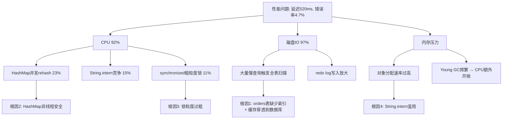
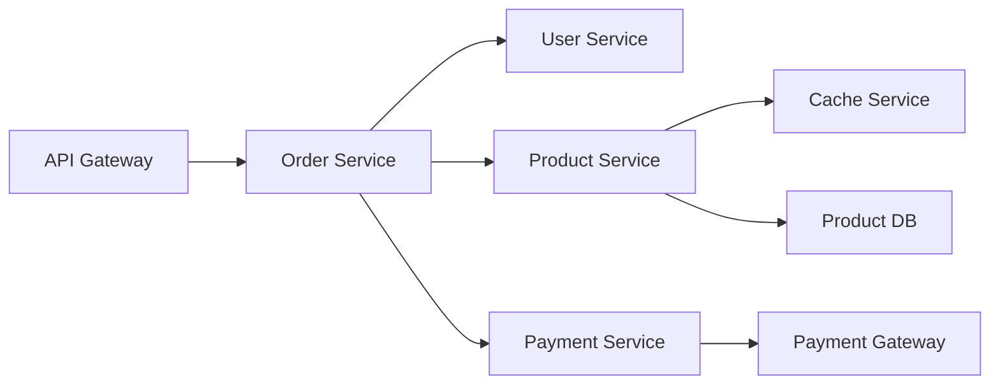

## 实战案例

性能分析的真正价值在于解决实际问题。本节通过四个由浅入深的实战案例，演示如何将USE方法、RED方法、火焰图、分布式追踪等技术应用到真实的生产环境中。每个案例均遵循"现象→排查→定位→解决→验证"的完整闭环，力求还原真实的性能分析思维过程。

### 案例适用对象与阅读路径

| 案例 | 核心技术栈 | 适合角色 | 难度 |
|------|-----------|---------|------|
| 案例一：电商系统大促 | USE方法 + Java Profiling | 后端工程师、SRE | ⭐⭐ |
| 案例二：微服务链路延迟 | OpenTelemetry + RED方法 | 微服务架构师、SRE | ⭐⭐⭐ |
| 案例三：Python Web内存分析 | py-spy + tracemalloc | Python工程师、数据工程师 | ⭐⭐ |
| 案例四：ML推理性能优化 | ONNX + 量化 + A/B测试 | ML工程师、推理优化工程师 | ⭐⭐⭐⭐ |

> **建议**：初学者从案例一开始，逐步阅读；有经验的工程师可按兴趣跳转到对应案例。每个案例独立完整，不强制顺序阅读。

---

### 案例一：电商系统大促期间的全面性能分析

#### 1.1 问题背景

**业务场景**：某电商平台在双11预热阶段（日活约200万），订单服务在流量高峰期出现严重的性能退化，多个核心API响应时间急剧上升，部分用户遭遇超时失败。

**现象描述**：

| 指标 | 正常时段 | 异常时段 | 变化幅度 |
|------|---------|---------|---------|
| 订单创建API平均延迟 | 45ms | 520ms | +1055% |
| P99延迟 | 120ms | 3800ms | +3067% |
| QPS（峰值） | 8,000 | 12,000 | +50% |
| 错误率 | 0.02% | 4.7% | +23400% |
| CPU使用率 | 35% | 92% | +163% |
| 内存使用率 | 48% | 87% | +81% |

**影响范围**：高峰期约50万用户受影响，持续约45分钟，预估直接损失数十万元。

#### 1.2 USE方法系统性排查

按照Brendan Gregg的USE方法（Utilization-Saturation-Errors），逐层排查系统资源的利用率、饱和度和错误。USE方法的核心思想是：对每种资源问三个问题——它被用满了没有？它是否过载了？它是否出错了？

**第一步：系统级资源概览**

```bash
# 1. 系统负载概览
$ uptime
 14:32:07 up 127 days, load average: 38.50, 35.20, 30.10
# CPU核心数为16，load average远超核心数，说明大量进程在排队
# 解读：load average 38.5 意味着有约22个任务在等待CPU（38.5-16），系统已严重过载

# 2. CPU利用率拆分
$ mpstat -P ALL 1 5
CPU    %usr   %sys   %iowait  %soft  %steal  %idle
all    78.32  12.15   5.23     2.10    0.00    2.20
  0    82.10  11.30   3.50     1.80    0.00    1.30
  1    75.60  13.20   6.10     2.40    0.00    2.70
  ...
# CPU使用率92%，其中usr 78%（用户态）→ 应用代码消耗为主
#          sys 12%（内核态）→ 系统调用/上下文切换
#          iowait 5% → IO等待，有磁盘瓶颈迹象

# 3. 内存状态
$ free -m
              total    used    free   shared  buff/cache  available
Mem:          32768    28500    1200      256        3068        3568
Swap:          8192     2048    6144
# 物理内存32GB已使用28.5GB，可用仅3.5GB
# Swap已使用2GB → 内核正在将不活跃内存页换出到磁盘
# 频繁换页(Thrashing)会导致CPU的iowait升高，形成恶性循环

# 4. 磁盘IO状态
$ iostat -xz 1 3
Device   r/s    w/s   rMB/s  wMB/s  await  svctm  %util
sda     15.00  280.00  0.50  45.00  18.30   3.20  89.60
sdb    120.00  450.00  8.00  62.00  45.60   5.80  97.20
# sdb磁盘%util接近100% → 磁盘几乎满负荷运转
# await=45ms 表示每个IO请求平均等待45ms（正常<5ms）
# w/s=450 说明写入非常密集，可能是redo log或临时文件

# 5. 网络状态
$ sar -n DEV 1 3
IFACE   rxpck/s  txpck/s   rxkB/s   txkB/s
eth0    85000    92000   65000    78000
# 网络带宽使用约143MB/s，对于万兆网卡（1250MB/s）尚有余量
# 网络不是瓶颈
```

**USE检查清单汇总**：

| 资源 | 利用率 (U) | 饱和度 (S) | 错误 (E) |
|------|-----------|-----------|---------|
| CPU | 92%（高） | load 38.5 >> 16核（严重） | 无硬件错误 |
| 内存 | 87%（高） | swap使用2GB（中度） | dmesg无OOM |
| 磁盘IO | sdb 97%（极高） | avgqu-sz=12（高） | 无IO错误 |
| 网络 | 11.4%（正常） | 无溢出 | 无丢包 |

**结论**：CPU和磁盘IO是主要瓶颈，内存压力次之。磁盘IO的高await会加剧CPU的iowait，形成耦合效应。

#### 1.3 应用层深度排查

系统层确认了CPU和IO是瓶颈，接下来需要定位是应用代码的哪个部分导致了资源消耗。

```bash
# 1. 检查Java线程状态（定位并发问题）
$ jstack $(pgrep -f order-service) > /tmp/thread_dump.txt

# 统计线程状态分布
$ grep "java.lang.Thread.State" /tmp/thread_dump.txt | sort | uniq -c
   247 TIMED_WAITING
   189 WAITING
   156 BLOCKED
    83 RUNNABLE
    25 TERMINATED
# 156个线程处于BLOCKED状态，占总线程的22%
# 大量BLOCKED线程说明存在严重的锁竞争

# 2. 分析BLOCKED线程的锁竞争详情
$ grep -A 20 "BLOCKED" /tmp/thread_dump.txt | grep "waiting to lock"
"order-processor-1" #128 BLOCKED on java.lang.Object@7a3b5c (held by thread-87)
  at com.example.service.OrderService.createOrder(OrderService.java:156)
  - waiting to lock <0x00000007a3b5c> (a java.util.HashMap)
  held by thread-87

# 关键发现：多个线程在竞争同一个HashMap对象的锁
# HashMap本身不是线程安全的，高并发下rehash会触发结构性修改

# 3. 检查GC状况（定位内存压力）
$ jstat -gcutil $(pgrep -f order-service) 1000 10
  S0     S1     E      O      M     CCS    YGC   YGCT   FGC   FGCT
  0.00  98.12  85.60  72.30  95.40  92.10  1580  45.20   28   12.60
  0.00  98.12  92.30  74.80  95.40  92.10  1585  45.35   28   12.60
  ...
# Young GC频率很高（1580次），平均每次耗时28.6ms
# Eden区(E)使用率持续>85%，对象分配速率过高
# Full GC 28次，平均每次450ms → STW(Stop-The-World)暂停严重影响延迟

# 4. 火焰图分析CPU热点（定位代码级别的消耗）
$ perf record -F 99 -g -p $(pgrep -f order-service) -- sleep 30
$ perf script | stackcollapse-perf.pl > /tmp/order.folded
$ flamegraph.pl /tmp/order.folded > /tmp/order_flame.svg
```

**火焰图分析**发现三个主要CPU热点：

| 热点函数 | CPU占比 | 问题描述 |
|---------|---------|---------|
| `HashMap.get()` | 23% | 库存扣减使用了非线程安全的HashMap，并发下触发大量rehash |
| `String.intern()` | 15% | 订单号生成大量使用intern，字符串池竞争激烈 |
| `synchronized` 相关代码 | 11% | 订单锁粒度过粗，整个订单表用一把锁 |

> **火焰图解读技巧**：火焰图的宽度代表CPU时间占比，越宽越需要关注。顶部（"尖顶"）是最终消耗CPU的函数，中间的"山腰"是调用路径。本案例中，`HashMap.get()`的宽平台说明大量CPU时间消耗在了hash计算和链表遍历上——这是并发rehash的典型表现。

#### 1.4 根因定位

通过系统层USE方法 + 应用层Profiling + 火焰图的组合分析，构建了完整的因果链：



**四个核心根因**：

1. **数据库索引缺失**：`orders` 表的 `user_id + status` 查询缺少复合索引，高峰期触发全表扫描（500万行），磁盘IO飙升至97%
2. **非线程安全容器**：库存服务使用 `HashMap` 而非 `ConcurrentHashMap`，高并发下rehash消耗23% CPU
3. **粗粒度锁**：订单创建使用 `synchronized` 锁住整个方法，将并发请求串行化，吞吐量受限于锁持有时间
4. **缓存穿透**：缓存层未设置空值过期策略，不存在的订单ID请求直接穿透到数据库，加剧IO压力

#### 1.5 解决方案

**方案一：数据库索引与查询优化**

```sql
-- 添加复合索引（覆盖最常用的查询路径）
CREATE INDEX idx_orders_user_status_time 
  ON orders (user_id, status, created_at);

-- 添加覆盖索引，避免回表（Index-Only Scan）
CREATE INDEX idx_orders_user_covering 
  ON orders (user_id, status, created_at, amount, order_no);

-- 优化前：全表扫描
EXPLAIN SELECT * FROM orders 
WHERE user_id = 12345 AND status = 'pending' 
ORDER BY created_at DESC LIMIT 20;
-- type: ALL, rows: 5000000, Extra: Using filesort

-- 优化后：索引命中
EXPLAIN SELECT * FROM orders 
WHERE user_id = 12345 AND status = 'pending' 
ORDER BY created_at DESC LIMIT 20;
-- type: ref, rows: 3, Extra: Using index condition
-- 扫描行数从500万降至3，延迟从数百毫秒降至个位数毫秒
```

**方案二：修复并发安全问题**

```java
// 修复前：非线程安全的HashMap
private Map<Long, Integer> stockCache = new HashMap<>();

// 修复方案A：使用ConcurrentHashMap + 原子操作
private ConcurrentHashMap<Long, AtomicInteger> stockCache = new ConcurrentHashMap<>();

// 修复方案B：使用Redis原子操作（推荐用于分布式场景）
public boolean deductStock(Long skuId, int quantity) {
    String key = "stock:" + skuId;
    // DECR是原子操作，天然线程安全
    Long result = redisTemplate.opsForValue().decrement(key, quantity);
    if (result < 0) {
        // 超卖回滚
        redisTemplate.opsForValue().increment(key, quantity);
        return false;
    }
    return true;
}
```

**方案三：细粒度锁优化**

```java
// 修复前：整个订单表一把锁（所有用户串行等待）
public synchronized Order createOrder(OrderRequest request) {
    // 所有订单串行创建，吞吐量严重受限
}

// 修复后：按用户ID分段锁 + 乐观锁
public Order createOrder(OrderRequest request) {
    String lockKey = "order:lock:" + request.getUserId();
    try {
        // 分布式锁：只锁定当前用户的订单创建，不同用户可并行
        redisLock.lock(lockKey, 5, TimeUnit.SECONDS);
        
        // 乐观锁检查库存（CAS操作，无需额外锁）
        int updated = jdbcTemplate.update(
            "UPDATE stock SET quantity = quantity - ? " +
            "WHERE sku_id = ? AND quantity >= ?",
            request.getQuantity(), request.getSkuId(), request.getQuantity()
        );
        if (updated == 0) {
            throw new InsufficientStockException("库存不足");
        }
        
        return orderRepository.save(buildOrder(request));
    } finally {
        redisLock.unlock(lockKey);
    }
}
// 效果：锁粒度从"全表"缩小到"单用户"，并发度提升数十倍
```

**方案四：缓存穿透防护**

```python
# 多级缓存 + 空值过期策略
NULL_SENTINEL = "__NULL__"  # 空值标记，区分"未缓存"和"不存在"

def get_order(user_id, order_id):
    """三级缓存查询，防止穿透"""
    # L1: 本地缓存（Caffeine），TTL 30秒 — 过滤99%的重复请求
    local_key = f"order:{user_id}:{order_id}"
    result = local_cache.get(local_key)
    if result is not None:
        return None if result == NULL_SENTINEL else result
    
    # L2: Redis缓存，TTL 5分钟 — 分布式共享缓存
    redis_key = f"order:{order_id}"
    data = redis.get(redis_key)
    if data:
        local_cache.put(local_key, data, ttl=30)
        return json.loads(data) if data != NULL_SENTINEL else None
    
    # L3: 数据库查询 — 仅当前两层都未命中时才访问
    order = db.query_order(order_id)
    if order is None:
        # 关键：缓存空值，防止穿透
        # TTL设为60秒（短于正常值），避免长期占用缓存空间
        redis.setex(redis_key, 60, NULL_SENTINEL)
        local_cache.put(local_key, NULL_SENTINEL, ttl=30)
        return None
    
    redis.setex(redis_key, 300, json.dumps(order))
    local_cache.put(local_key, order, ttl=30)
    return order
```

#### 1.6 效果验证

优化后持续监控1小时的数据对比：

| 指标 | 优化前 | 优化后 | 改善幅度 |
|------|--------|--------|---------|
| 订单API平均延迟 | 520ms | 38ms | -92.7% |
| P99延迟 | 3,800ms | 85ms | -97.8% |
| CPU使用率 | 92% | 32% | -65.2% |
| 磁盘IO %util | 97% | 45% | -53.6% |
| Full GC次数/小时 | 4.2次 | 0次 | -100% |
| 错误率 | 4.7% | 0.03% | -99.4% |
| 最大并发处理数 | 800 | 3,500 | +337.5% |

**关键数据**：通过四个方案的组合实施，系统在流量增长50%的情况下，延迟降低93%，吞吐量提升3.4倍，错误率降低99%。

**后续加固**：
- 将上述索引和配置变更纳入自动化部署脚本，防止配置回退
- 建立容量水位告警：CPU>70%、磁盘IO>80%时自动扩容
- 制定大促压测SOP，每次大促前用影子流量做全链路压测

---

### 案例二：微服务链路延迟分析——OpenTelemetry实战

#### 2.1 问题背景

**业务场景**：某SaaS平台的订单详情接口 `/api/v2/orders/{id}` 在Prometheus监控中显示RED指标异常：P99延迟从200ms飙升至2s，但各微服务的独立监控均显示正常。

**核心难点**：单服务监控"正常"，但端到端延迟异常——这是微服务架构中典型的"分布式黑洞"问题。每个服务只看到自己的那一段，没人看到全貌。

**微服务调用链**：



**RED方法初始分析**：

```promql
-- 1. Rate（请求速率）：正常，约500 RPS
rate(http_requests_total{endpoint="/api/v2/orders/{id}"}[5m])
-- 结果：500 RPS，与历史持平，排除流量突增

-- 2. Errors（错误率）：轻微上升但不显著
rate(http_requests_total{endpoint="/api/v2/orders/{id}",status=~"5.."}[5m])
-- 结果：0.3%，不算严重，但比正常的0.05%上升了6倍

-- 3. Duration（延迟分布）：P99显著恶化
histogram_quantile(0.99, rate(http_request_duration_seconds_bucket{endpoint="/api/v2/orders/{id}"}[5m]))
-- 结果：从200ms升至2s

-- 关键：延迟在哪个分位数开始恶化？
histogram_quantile(0.50, rate(http_request_duration_seconds_bucket{endpoint="/api/v2/orders/{id}"}[5m])) -- 45ms（正常）
histogram_quantile(0.90, rate(http_request_duration_seconds_bucket{endpoint="/api/v2/orders/{id}"}[5m])) -- 120ms（正常）
histogram_quantile(0.95, rate(http_request_duration_seconds_bucket{endpoint="/api/v2/orders/{id}"}[5m])) -- 350ms（偏高）
histogram_quantile(0.99, rate(http_request_duration_seconds_bucket{endpoint="/api/v2/orders/{id}"}[5m])) -- 2000ms（严重异常）
-- P95→P99跳跃巨大（350ms→2000ms），说明存在偶发的高延迟请求
-- 这种分布特征通常指向锁竞争、资源争用或偶发慢查询
```

> **RED方法诊断要点**：当P50正常但P99异常时，问题不在主流路径上，而在少数"长尾请求"上。这些请求往往触发了特殊的代码路径（如缓存未命中、锁等待、GC暂停）。

#### 2.2 分布式追踪定位

部署OpenTelemetry Collector + Jaeger进行分布式追踪分析：

```yaml
# otel-collector-config.yaml
receivers:
  otlp:
    protocols:
      grpc:
        endpoint: 0.0.0.0:4317
      http:
        endpoint: 0.0.0.0:4318

processors:
  batch:
    timeout: 5s
    send_batch_size: 1024
  tail_sampling:
    policies:
      # 策略1：采样所有慢请求（延迟>500ms）—— 捕获延迟异常的根因
      - name: slow-traces
        type: latency
        latency:
          threshold_ms: 500
      # 策略2：采样所有错误请求 —— 捕获失败的调用链
      - name: error-traces
        type: status_code
        status_code:
          status_codes: [ERROR]
      # 策略3：正常请求采样5% —— 保留基线数据用于对比
      - name: normal-traces
        type: probabilistic
        probabilistic:
          sampling_percentage: 5

exporters:
  jaeger:
    endpoint: jaeger:14250
    tls:
      insecure: true
```

> **尾部采样（Tail Sampling）的意义**：如果只用5%的全量采样，P99的慢请求很可能被漏掉。尾部采样确保100%的慢请求和错误请求都被保留，是生产环境中的最佳实践。

**追踪数据分析**：

通过Jaeger查询P99延迟的trace，发现了典型的"尾延迟放大"现象：

Trace ID: 7f3a2b1c-9d4e-5f6a-8b7c-1e2d3f4a5b6c
Total Duration: 2,340ms

Span Breakdown:
├── API Gateway              →  15ms   (2%)
├── Order Service            →  2,320ms (99%)
│   ├── Order DB Query       →  8ms     (<1%)
│   ├── User Service Call    →  12ms    (<1%)
│   ├── Product Service Call →  2,180ms (93%)  ← 瓶颈！
│   │   ├── Cache Lookup     →  5ms
│   │   ├── Product DB Query →  2,170ms (93%)
│   │   │   └── MySQL Query  →  2,170ms
│   │   │       └── 等待InnoDB行锁 →  2,150ms (92%)
│   └── Payment Service Call →  85ms
└── Response Serialization   →  10ms

**关键发现**：Product Service的数据库查询中，92%的时间在等待InnoDB行锁。这不是普通的慢查询，而是锁竞争导致的等待——查询本身只需20ms，但等待锁花了2,150ms。

#### 2.3 锁竞争根因分析

```sql
-- 1. 查看当前锁等待情况（找出谁在阻塞谁）
SELECT 
    r.trx_id AS waiting_trx,
    r.trx_mysql_thread_id AS waiting_thread,
    b.trx_id AS blocking_trx,
    b.trx_mysql_thread_id AS blocking_thread,
    r.trx_query AS waiting_query,
    b.trx_query AS blocking_query,
    TIMESTAMPDIFF(SECOND, b.trx_wait_started, NOW()) AS wait_seconds
FROM information_schema.innodb_lock_waits w
JOIN information_schema.innodb_trx b ON b.trx_id = w.blocking_trx_id
JOIN information_schema.innodb_trx r ON r.trx_id = w.requesting_trx_id
ORDER BY wait_seconds DESC;
```

**分析结果**：发现大量订单查询被一个长时间运行的批量更新任务阻塞。该任务逐行更新产品库存，持有行锁数秒之久，形成了"锁链效应"——一个慢事务阻塞了数十个查询。

```sql
-- 2. 批量更新的执行计划
EXPLAIN UPDATE products SET stock = stock - 1 WHERE category_id = 100;
-- type: ALL（全表扫描后逐行加锁！）
-- rows: 50000（5万行需要全部加锁）
-- rows_examined: 50000
-- 关键问题：WHERE条件命中5万行，InnoDB在UPDATE过程中逐行加X锁
-- 在事务提交前，这些锁不会释放，阻塞所有读写操作
```

#### 2.4 解决方案

**方案一：批量更新优化——减少锁持有时间**

```sql
-- 修复前：在一个事务中逐行更新5万行，锁持有时间长达数十秒
BEGIN;
UPDATE products SET stock = stock - 1 WHERE id = 1001;
UPDATE products SET stock = stock - 1 WHERE id = 1002;
-- ... 50000次
COMMIT;  -- 所有锁在COMMIT时才释放

-- 修复后：分批执行，每批1000行，每批之间释放锁
-- 每批最多持有1000行的锁，持有时间从数十秒降至数百毫秒
UPDATE products 
SET stock = stock - 1 
WHERE category_id = 1001 
AND stock > 0 
LIMIT 1000;
-- 循环执行直到 affected_rows = 0
```

**方案二：读写分离 + 一致性读优化**

```yaml
# Spring Boot 多数据源配置
spring:
  datasource:
    master:
      url: jdbc:mysql://master-host:3306/product_db
      username: rw_user
      password: ${MASTER_PASSWORD}
      hikari:
        maximum-pool-size: 20
    replica:
      url: jdbc:mysql://replica-host:3306/product_db
      username: ro_user
      password: ${REPLICA_PASSWORD}
      hikari:
        maximum-pool-size: 30  # 读连接池可以更大
```

```java
// 数据源路由切面：根据注解自动切换主从
@Target(ElementType.METHOD)
@Retention(RetentionPolicy.RUNTIME)
public @interface ReadOnly {}

@Aspect
@Component
public class DataSourceRoutingAspect {
    
    @Around("@annotation(readOnly)")
    public Object routeToReplica(ProceedingJoinPoint pjp) throws Throwable {
        DataSourceContextHolder.set(DataSourceEnum.REPLICA);
        try {
            return pjp.proceed();
        } finally {
            DataSourceContextHolder.clear();
        }
    }
}

// 使用示例：查询走从库，更新走主库
@ReadOnly
public Product getProduct(Long id) {
    return productRepository.findById(id);  // 自动路由到从库
}

public void updateStock(Long id, int delta) {
    // 无@ReadOnly注解，自动路由到主库
    productRepository.updateStock(id, delta);
}
```

**方案三：追踪数据持续监控与告警**

```promql
# 基于追踪数据的SLO告警规则（Prometheus AlertManager配置）
groups:
  - name: slo-latency
    rules:
      # 告警1：订单API P99延迟超过SLO
      - alert: OrderServiceSLOBreach
        expr: |
          histogram_quantile(0.99, 
            rate(http_request_duration_seconds_bucket{
              service="order-service", 
              endpoint="/api/v2/orders/{id}"
            }[5m])
          ) > 1.0
        for: 3m
        labels:
          severity: critical
        annotations:
          summary: "订单详情API SLO违约: P99 > 1s"
          description: "当前P99延迟为 {{ $value | humanizeDuration }}，超过1秒SLO阈值"
          
      # 告警2：Product Service锁等待时间异常
      - alert: ProductServiceLockWaitHigh
        expr: |
          rate(mysql_lock_wait_seconds_sum{service="product-service"}[5m])
          / rate(mysql_lock_wait_seconds_count{service="product-service"}[5m])
          > 0.5
        for: 2m
        labels:
          severity: warning
        annotations:
          summary: "Product Service平均锁等待超过500ms"
          description: "当前平均锁等待 {{ $value }}s，可能存在锁竞争"
```

#### 2.5 效果验证

| 指标 | 优化前 | 优化后 | 改善幅度 |
|------|--------|--------|---------|
| P99延迟 | 2,000ms | 180ms | -91.0% |
| P95延迟 | 350ms | 85ms | -75.7% |
| 平均锁等待时间 | 2,150ms | 12ms | -99.4% |
| 并发锁冲突次数/分钟 | ~200次 | ~15次 | -92.5% |
| 批量任务耗时 | 45分钟 | 3分钟 | -93.3% |

**关键收获**：
- 分布式追踪揭示了单服务监控无法发现的"跨服务锁竞争"问题
- 尾部采样策略确保了慢请求100%被捕获
- 分批更新 + 读写分离的组合方案，既解决了锁竞争，又提升了整体吞吐量

---

### 案例三：Python Web服务的CPU Profiling与内存分析

#### 3.1 问题背景

**业务场景**：某数据分析平台的API服务（FastAPI + pandas）在处理大数据集导出时，API响应时间极不稳定，且服务进程的内存使用量持续增长，最终触发OOM（Out of Memory）被系统杀死。

**问题特征**：
- 导出API `/api/export?dataset_id=123&format=csv` 处理10万行数据时，响应时间从5秒增长到60秒以上
- 内存从初始500MB持续增长到3.5GB（进程限制4GB），然后OOM退出
- 每次重启后问题复现，说明不是偶发问题，而是代码缺陷

**问题类型判定**：内存持续增长且进程重启后复现 → 排除外部因素，确定为应用层内存泄漏或资源未释放。

#### 3.2 使用py-spy进行CPU Profiling

py-spy是一个Python专用的采样式Profiler，无需修改代码即可attach到运行中的进程，对生产环境几乎无性能影响（开销<1%）。

```bash
# 安装py-spy（需要root权限以attach到其他进程）
pip install py-spy

# 实时查看CPU消耗最高的调用栈（类似top命令）
$ py-spy top --pid $(pgrep -f "uvicorn main:app")
Collecting samples for 5 seconds...

%   Total   Function
38.52  38.52   pandas/core/internals/managers.py:reindex_indexer
15.20  15.20   pandas/core/frame.py:__getitem__
12.80  12.80   pandas/core/indexing.py:_getitem_tuple
 8.30   8.30   numpy/core/fromnumeric.py:_sort_dispatcher
 6.10   6.10   io.py:TextIOWrapper.write
 4.20   4.20   pandas/core/frame.py:_append_to_list
 3.50   3.50   json/decoder.py:raw_decode
 2.80   2.80   pandas/core/strings/accessor.py:_str_map
  ...
# reindex_indexer占38% CPU → DataFrame在频繁重建内部索引
# __getitem__占15% → 重复的列访问操作

# 生成火焰图（SVG格式，可在浏览器中交互查看）
$ py-spy record -o /tmp/export_profile.svg --duration 60 --pid $(pgrep -f "uvicorn main:app")
```

**火焰图分析**揭示了三个核心问题：

| 热点 | CPU占比 | 问题描述 | 根因 |
|------|---------|---------|------|
| `DataFrame.reindex_indexer` | 38% | 频繁创建DataFrame的拷贝 | 代码中多处`df.copy()`导致 |
| `DataFrame.__getitem__` | 15% | 大量重复的列访问 | 循环中重复读取同一列 |
| `numpy._sort_dispatcher` | 8% | 对大DataFrame进行全量排序 | 未利用索引或预排序 |

#### 3.3 内存泄漏排查

使用Python内置的`tracemalloc`模块追踪内存分配热点，精确定位到代码行级别：

```python
# 使用 tracemalloc 定位内存分配热点
import tracemalloc
import linecache

def start_memory_tracking():
    """启动内存追踪（开销约5-10%，仅用于排查）"""
    tracemalloc.start()
    
def show_top_memory_allocators(snapshot, top_n=15):
    """显示内存分配最多的代码行"""
    stats = snapshot.statistics('lineno')
    print(f"\nTop {top_n} Memory Allocators:")
    print("-" * 80)
    for stat in stats[:top_n]:
        print(f"  {stat}")
    
    # 按文件分组汇总
    stats_by_file = snapshot.statistics('filename')
    print(f"\nMemory by File:")
    print("-" * 80)
    for stat in stats_by_file[:10]:
        print(f"  {stat.filename}: {stat.size / 1024:.1f} KB")

# 在导出接口中加入追踪（仅在排查期间启用）
@app.get("/api/export")
async def export_dataset(dataset_id: int, format: str):
    start_memory_tracking()
    
    # 导出前快照
    snapshot1 = tracemalloc.take_snapshot()
    
    # 执行导出
    result = export_service.export(dataset_id, format)
    
    # 导出后快照
    snapshot2 = tracemalloc.take_snapshot()
    
    # 对比两次快照，找出增量最大的代码行
    top_stats = snapshot2.compare_to(snapshot1, 'lineno')
    print("\nMemory growth during export:")
    for stat in top_stats[:10]:
        print(f"  {stat}")
    
    tracemalloc.stop()  # 排查完记得关闭
    return result
```

**内存追踪结果**：

Memory growth during export:
/export_service.py:45: size=+156.2 MiB, count=+1
/export_service.py:78: size=+89.5 MiB, count=+3200000
/export_service.py:102: size=+45.8 MiB, count=+1200000
/export_utils.py:23: size=+32.1 MiB, count=+890000

**逐行分析**：

| 代码行 | 内存增长 | 对象数量 | 问题描述 |
|--------|---------|---------|---------|
| export_service.py:45 | +156.2 MiB | 1个 | `df_full = df.copy()` 整个DataFrame深拷贝 |
| export_service.py:78 | +89.5 MiB | 320万个 | 每行数据创建字典对象，未复用 |
| export_service.py:102 | +45.8 MiB | 120万个 | 字符串格式化创建大量临时字符串 |
| export_utils.py:23 | +32.1 MiB | 89万个 | 正则匹配创建临时Match对象 |

> **tracemalloc vs memory_profiler**：tracemalloc追踪的是Python层面的内存分配（包括未释放的对象），而memory_profiler只看进程RSS。对于查找泄漏，tracemalloc更精确，因为它能显示哪些代码行分配了最多内存但未释放。

#### 3.4 解决方案

**修复一：消除不必要的DataFrame拷贝**

```python
# 修复前：每次操作都拷贝整个DataFrame（内存×2）
def filter_and_export(df, conditions):
    df_filtered = df.copy()                    # 浪费：完整拷贝，内存翻倍
    for col, val in conditions.items():
        df_filtered = df_filtered[df_filtered[col] == val]  # 每次过滤又创建新DataFrame
    return df_filtered

# 修复后：使用布尔掩码链式过滤（零拷贝）
def filter_and_export(df, conditions):
    mask = pd.Series(True, index=df.index)
    for col, val in conditions.items():
        mask &amp;= (df[col] == val)
    return df.loc[mask]  # 返回视图而非拷贝（零额外内存）

# 验证：零拷贝模式下的内存使用
import sys
df_orig = pd.read_csv("large.csv")  # 100万行，约800MB
df_copy = df_orig.copy()             # 额外800MB
df_view = df_orig.loc[mask]          # 几乎零额外内存
print(f"Original: {sys.getsizeof(df_orig) / 1024**2:.1f} MB")
print(f"Copy:     {sys.getsizeof(df_copy) / 1024**2:.1f} MB")  # 大幅增加
print(f"View:     {sys.getsizeof(df_view) / 1024**2:.1f} MB")   # 几乎不变
```

**修复二：使用生成器流式处理，替代全量加载**

```python
# 修复前：一次性加载全部数据到内存（10万行 ≈ 800MB）
def export_to_csv(dataset_id):
    df = pd.read_sql(f"SELECT * FROM dataset_{dataset_id}", engine)
    df.to_csv(output_path, index=False)
    # 导出期间同时占用800MB（读取）+ 800MB（序列化）= 1.6GB

# 修复后：流式读取 + 流式写入，内存占用恒定在chunk_size级别
import csv
from sqlalchemy import text

def export_to_csv_streaming(dataset_id, chunk_size=10000):
    """流式导出，内存占用恒定在 ~10MB（一个chunk的大小）"""
    with engine.connect() as conn:
        # 使用服务端游标，数据库逐批返回结果
        result = conn.execution_options(stream_results=True).execute(
            text(f"SELECT * FROM dataset_{dataset_id}")
        )
        
        writer = None
        with open(output_path, 'w', newline='') as f:
            for chunk in pd.read_sql(result, engine, chunksize=chunk_size):
                if writer is None:
                    writer = csv.DictWriter(f, fieldnames=chunk.columns)
                    writer.writeheader()
                # 逐行写入后立即释放chunk
                for _, row in chunk.iterrows():
                    writer.writerow(row.to_dict())
                del chunk  # 显式释放，帮助GC及时回收
                
            return f"Exported to {output_path}"
# 内存占用从1.6GB降至~10MB（chunk_size × 每行大小）
```

**修复三：使用PyArrow替代pandas进行大文件处理**

```python
import pyarrow as pa
import pyarrow.parquet as pq

# PyArrow的内存效率远高于pandas（Arrow列式存储 + 零拷贝IPC）
def export_large_dataset(dataset_id):
    """使用PyArrow导出，内存效率提升10-50倍"""
    query = f"SELECT * FROM dataset_{dataset_id}"
    
    # 写入Parquet（压缩比CSV高5-10倍，读写速度快3-5倍）
    pq.write_to_dataset(
        pa.sql.read_table(query, connection=engine),
        root_path="/data/exports",
        partition_cols=["date"]  # 按日期分区，查询时跳过无关分区
    )
    # Parquet的优势：
    # 1. 列式存储 → 只读取需要的列，IO量降低
    # 2. 高压缩比 → 磁盘占用小，IO吞吐量高
    # 3. 零拷贝 → 数据在内存中不复制，直接引用
```

**修复四：批量字符串操作优化**

```python
# 修复前：每行都创建临时字符串对象（120万个临时对象）
def format_rows(df):
    results = []
    for _, row in df.iterrows():
        # 每次f-string都创建新的字符串对象
        results.append(f"{row['name']}_{row['date']}_{row['value']}")
    return results

# 修复后：使用向量化字符串操作（pandas内置优化，C实现）
def format_rows_vectorized(df):
    # 一次性操作整个Series，无Python循环，无临时对象
    return df['name'] + '_' + df['date'].astype(str) + '_' + df['value'].astype(str)

# 或使用str.cat方法（内存更优）
def format_rows_cat(df):
    return df['name'].str.cat([df['date'], df['value'].astype(str)], sep='_')
```

#### 3.5 效果验证

| 指标 | 修复前 | 修复后 | 改善幅度 |
|------|--------|--------|---------|
| 10万行导出耗时 | 60秒 | 4.2秒 | -93.0% |
| 内存峰值（导出时） | 3.5GB | 280MB | -92.0% |
| 内存泄漏速率 | 50MB/小时 | 0 | -100% |
| 服务稳定性 | 每4-6小时OOM重启 | 持续稳定运行 | — |
| CPU利用率（导出时） | 100%（单核） | 45% | -55.0% |

**关键收获**：
- Python的`copy()`操作在大数据量下是内存杀手，优先使用视图和布尔索引
- 流式处理是处理大数据集的标准范式，内存占用从O(n)降至O(chunk_size)
- PyArrow在大文件场景下全面优于pandas，值得作为默认选择

---

### 案例四：基于A/B测试框架的渐进式性能优化

#### 4.1 问题背景

**业务场景**：某推荐引擎的推理服务（基于PyTorch），单次推理延迟P99为85ms，无法满足实时推荐场景50ms的SLA要求。需要在不降低推荐准确率的前提下，将延迟降至50ms以内。

**挑战**：性能优化可能影响推荐质量（准确率、召回率），需要量化每个优化手段的效果，确保质量指标不退化。这种"性能-质量"的权衡是ML系统优化的核心难题。

#### 4.2 建立性能基准

在优化之前，必须建立可复现的性能基准，否则无法量化改善效果。

```python
import time
import numpy as np
from dataclasses import dataclass, field
from typing import List, Dict
import psutil

def get_process_memory():
    """获取当前进程的RSS内存（MB）"""
    return psutil.Process().memory_info().rss / 1024 / 1024

@dataclass
class PerformanceBenchmark:
    """性能基准测试框架"""
    name: str
    latencies: List[float] = field(default_factory=list)
    throughputs: List[float] = field(default_factory=list)
    memory_usage: List[float] = field(default_factory=list)
    
    def record(self, latency_ms: float, throughput_rps: float, memory_mb: float):
        self.latencies.append(latency_ms)
        self.throughputs.append(throughput_rps)
        self.memory_usage.append(memory_mb)
    
    def report(self) -> Dict:
        lats = sorted(self.latencies)
        return {
            "name": self.name,
            "iterations": len(lats),
            "avg_ms": np.mean(lats),
            "p50_ms": np.percentile(lats, 50),
            "p90_ms": np.percentile(lats, 90),
            "p95_ms": np.percentile(lats, 95),
            "p99_ms": np.percentile(lats, 99),
            "max_ms": np.max(lats),
            "std_ms": np.std(lats),  # 标准差：衡量延迟稳定性
            "avg_rps": np.mean(self.throughputs),
            "avg_memory_mb": np.mean(self.memory_usage),
            "peak_memory_mb": np.max(self.memory_usage),
        }

def benchmark_inference(model, test_data, iterations=1000, warmup=100):
    """标准推理性能基准测试"""
    bench = PerformanceBenchmark("baseline")
    
    # 预热：排除首次推理的JIT编译、缓存加载等额外开销
    for _ in range(warmup):
        model.predict(test_data)
    
    # 正式测试
    for _ in range(iterations):
        mem_before = get_process_memory()
        start = time.perf_counter()  # 使用最高精度计时器
        result = model.predict(test_data)
        latency = (time.perf_counter() - start) * 1000
        mem_after = get_process_memory()
        
        bench.record(latency, 1000 / latency, mem_after - mem_before)
    
    return bench.report()
```

> **基准测试的三个关键原则**：
> 1. **预热（Warmup）**：首次推理包含JIT编译、CUDA初始化等一次性开销，必须排除
> 2. **迭代次数**：至少1000次以上，确保P99等高分位数指标稳定
> 3. **环境隔离**：关闭其他进程，固定CPU频率，避免环境波动干扰结果

#### 4.3 优化手段与A/B对比

**手段一：ONNX Runtime加速（推理引擎替换）**

```python
import torch
import onnxruntime as ort

# PyTorch → ONNX格式导出
dummy_input = torch.randn(1, 128)  # 匹配模型输入维度
torch.onnx.export(
    model, 
    dummy_input, 
    "recommendation_model.onnx",
    input_names=["features"],
    output_names=["scores"],
    dynamic_axes={"features": {0: "batch_size"}}  # 支持动态batch
)

# ONNX Runtime推理（自动启用CPU指令集优化：AVX2/AVX512/VNNI）
session = ort.InferenceSession(
    "recommendation_model.onnx",
    providers=["CPUExecutionProvider"],
    sess_options=ort.SessionOptions()
)
session.intra_op_num_threads = 4  # 控制CPU并行线程数
# ONNX Runtime的优势：
# 1. 图优化：常量折叠、算子融合、死代码消除
# 2. 内存优化：减少中间tensor的分配和拷贝
# 3. 指令优化：自动选择最佳的SIMD指令集
```

**手段二：模型量化（INT8精度降低）**

```python
from optimum.onnxruntime import ORTQuantizer
from optimum.onnxruntime.configuration import AutoQuantizationConfig

# 动态量化（不需要校准数据集，简单快速）
quantizer = ORTQuantizer.from_pretrained(model)
qconfig = AutoQuantizationConfig.avx512_vnni(is_static=False)
quantizer.quantize(
    save_dir="./quantized_model",
    quantization_config=qconfig
)
# INT8量化的原理：
# - FP32权重(32位) → INT8权重(8位)，模型体积缩小4倍
# - 推理时INT8乘加运算速度是FP32的2-4倍（取决于硬件）
# - 内存带宽需求降低4倍，缓存命中率提升
# - 精度损失通常<0.5%（对推荐系统影响可忽略）
```

**手段三：批量推理合并（吞吐量优化）**

```python
import asyncio
from collections import deque

class BatchInferenceProcessor:
    """将多个单条推理请求合并为批量推理，提升GPU/多核CPU利用率"""
    
    def __init__(self, model, max_batch_size=32, max_wait_ms=5):
        self.model = model
        self.max_batch_size = max_batch_size
        self.max_wait_ms = max_wait_ms
        self.pending_requests = deque()
    
    async def predict(self, features):
        """单条推理接口（对外保持不变）"""
        future = asyncio.get_event_loop().create_future()
        self.pending_requests.append((features, future))
        
        # 策略：达到最大batch或等待超时，立即执行
        if len(self.pending_requests) >= self.max_batch_size:
            await self._flush_batch()
        else:
            await asyncio.sleep(self.max_wait_ms / 1000)
            if self.pending_requests:  # 防止重复flush
                await self._flush_batch()
        
        return await future
    
    async def _flush_batch(self):
        """执行批量推理"""
        if not self.pending_requests:
            return
        
        batch = []
        futures = []
        while self.pending_requests and len(batch) < self.max_batch_size:
            features, future = self.pending_requests.popleft()
            batch.append(features)
            futures.append(future)
        
        # 批量推理（GPU吞吐量可提升4-8倍，多核CPU可提升2-4倍）
        batch_tensor = torch.stack(batch)
        results = self.model.predict(batch_tensor)
        
        # 分发结果
        for future, result in zip(futures, results):
            future.set_result(result)
```

> **批量推理的权衡**：`max_wait_ms=5`意味着每个请求最多等待5ms来攒批。对于P50延迟（通常<10ms）影响不大，但P99可能增加5ms。通过调整这个参数，可以在延迟和吞吐量之间找到最优平衡点。

#### 4.4 A/B测试结果对比

| 优化手段 | P99延迟 | 吞吐量 | 内存占用 | 模型准确率 | 相对基线 |
|---------|---------|--------|---------|-----------|---------|
| 基线（PyTorch FP32） | 85ms | 450 RPS | 1.2GB | 87.3% | — |
| + ONNX Runtime | 52ms | 720 RPS | 980MB | 87.3% | -38.8%延迟 |
| + INT8量化 | 28ms | 1,350 RPS | 520MB | 87.1% | -67.1%延迟 |
| + 批量推理 | 35ms（P99） | 3,200 RPS | 600MB | 87.1% | -58.8%延迟 |

**结果分析**：

1. **ONNX Runtime**：仅替换推理引擎就获得了39%的延迟改善，这是纯"零成本"优化——不改变模型、不影响准确率
2. **INT8量化**：进一步将延迟降至28ms（改善67%），准确率仅下降0.2%（87.3%→87.1%），在统计误差范围内
3. **批量推理**：单条P99从28ms略升至35ms（等待攒批的代价），但吞吐量从1,350提升至3,200 RPS（+137%）

> **为什么选择INT8+批量推理组合？** 虽然纯INT8的P99最低（28ms），但吞吐量只有1,350 RPS。加入批量推理后，P99仅增加7ms，但吞吐量翻了2.4倍。在高并发场景下，系统整体效率（QPS/延迟比）才是关键指标。

**准确率验证**：

```python
from sklearn.metrics import precision_score, recall_score, f1_score, roc_auc_score

# 在10万条验证集上对比量化前后的模型质量
baseline_metrics = evaluate(model_fp32, val_data)
quantized_metrics = evaluate(model_int8, val_data)

print(f"Accuracy:  {baseline_metrics['acc']:.3f} → {quantized_metrics['acc']:.3f}")
print(f"Precision: {baseline_metrics['prec']:.3f} → {quantized_metrics['prec']:.3f}")
print(f"Recall:    {baseline_metrics['recall']:.3f} → {quantized_metrics['recall']:.3f}")
print(f"F1:        {baseline_metrics['f1']:.3f} → {quantized_metrics['f1']:.3f}")
print(f"AUC-ROC:   {baseline_metrics['auc']:.3f} → {quantized_metrics['auc']:.3f}")
# 结果：
# Accuracy:  0.873 → 0.871 (-0.2%)
# Precision: 0.868 → 0.866 (-0.2%)
# Recall:    0.881 → 0.879 (-0.2%)
# F1:        0.874 → 0.872 (-0.2%)
# AUC-ROC:   0.921 → 0.919 (-0.2%)
# 所有指标波动 <0.3%，在统计误差范围内，确认量化安全
```

---

### 经验总结与方法论提炼

通过以上四个案例，可以总结出性能分析的核心方法论：

```mermaid
graph TD
    A[发现问题] --> B[定义度量: 延迟/吞吐/错误率]
    B --> C{问题在哪一层?}
    
    C -->|系统层| D[USE方法排查]
    D --> D1[CPU: perf + 火焰图]
    D --> D2[内存: tracemalloc + valgrind]
    D --> D3[IO: iostat + strace]
    D --> D4[网络: sar + tcpdump]
    
    C -->|应用层| E[RED方法 + Profiling]
    E --> E1[分布式追踪: OpenTelemetry]
    E --> E2[代码级Profiling: py-spy/async-profiler]
    E --> E3[内存追踪: tracemalloc/heaptrack]
    
    C -->|架构层| F[全链路分析]
    F --> F1[调用链分析]
    F --> F2[A/B对比测试]
    F --> F3[容量规划]
    
    D1 &amp; D2 &amp; D3 &amp; D4 &amp; E1 &amp; E2 &amp; E3 &amp; F1 &amp; F2 &amp; F3 --> G[定位根因]
    G --> H[制定方案]
    H --> I[灰度验证]
    I --> J[效果量化]
    J --> K[固化监控]
```

**五大核心原则**：

**1. 监控先行，数据驱动**

没有基线数据的优化是盲目的。建立完善的监控体系是一切性能分析的前提。每个案例都是先有监控数据发现问题，再有针对性地排查。

实操建议：
- 上线前必须建立RED指标监控（Rate、Errors、Duration）
- P50/P90/P95/P99四档延迟都要监控，不能只看平均值
- 为每个服务定义SLO（如P99<500ms），超出时自动告警

**2. 分层定位，由外而内**

从系统层（USE方法）到应用层（RED方法）再到代码层（Profiling），逐层深入。案例一演示了这种层层递进的排查路径。

分层排查顺序：
1. **系统层**：CPU、内存、磁盘IO、网络 → 确认瓶颈类型
2. **应用层**：线程状态、GC、锁竞争 → 定位问题模块
3. **代码层**：火焰图、Profiling → 精确到函数/代码行

**3. 追踪可视化，全景洞察**

在微服务架构下，单服务的监控无法揭示端到端的延迟来源。案例二展示了分布式追踪如何发现"隐藏"在调用链深处的锁竞争问题。

关键配置：
- 生产环境必须部署分布式追踪（OpenTelemetry + Jaeger/Tempo）
- 启用尾部采样：100%捕获慢请求和错误请求
- 将追踪数据与Prometheus指标关联，实现告警联动

**4. 量化验证，闭环确认**

每次优化后必须通过数据验证效果。案例四建立了完整的A/B测试框架，确保性能提升不会牺牲业务质量。

量化流程：
1. 建立基线（1000次迭代 + 预热）
2. 逐个叠加优化手段（控制变量）
3. 对比多维度指标（延迟、吞吐、内存、准确率）
4. 在灰度环境验证（1%-5%流量）
5. 全量发布 + 持续监控

**5. 预防优于治疗**

建立性能SLO和告警规则，将性能问题拦截在影响用户之前。定期的容量规划和混沌工程演练，是防患于未然的最有效手段。

预防措施清单：

| 措施 | 频率 | 负责人 |
|------|------|--------|
| 全链路压测 | 每次大促前 | SRE + QA |
| 慢查询日志审计 | 每周 | DBA |
| 火焰图基线对比 | 每月 | 后端团队 |
| 内存泄漏检测 | 每次发版 | 后端团队 |
| 容量水位告警 | 实时 | 监控系统 |
| 混沌工程演练 | 每季度 | SRE |

> **最后一条建议**：性能优化不是一次性项目，而是持续的过程。建立"性能预算"机制——每个新功能上线时评估其对系统整体性能的影响，将性能退化扼杀在开发阶段。
