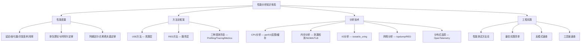
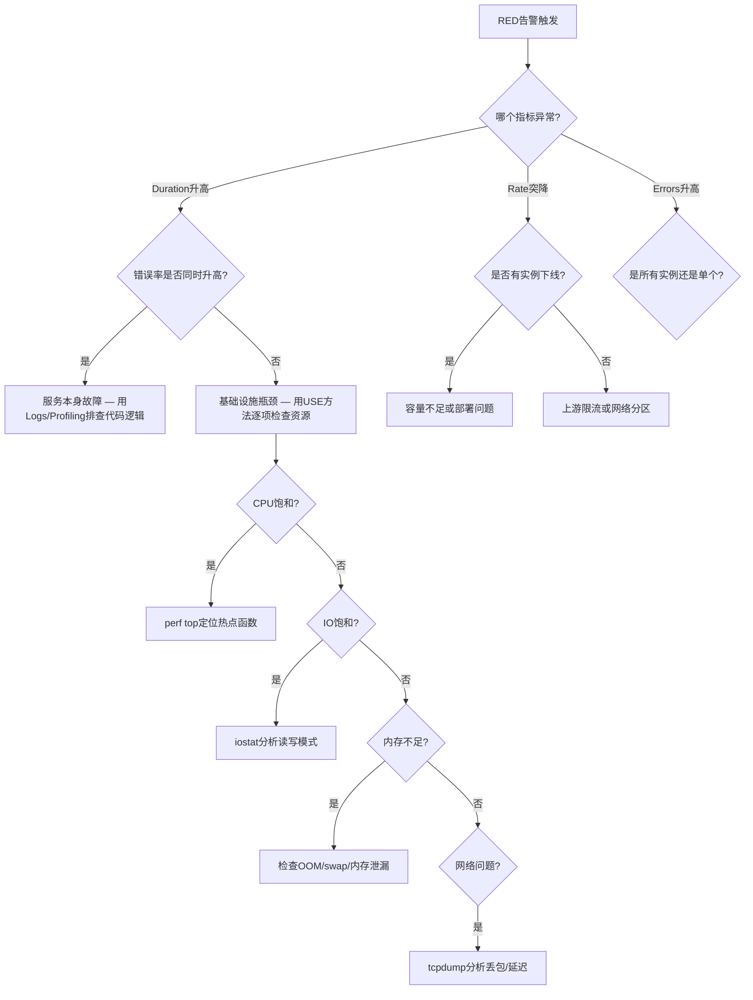
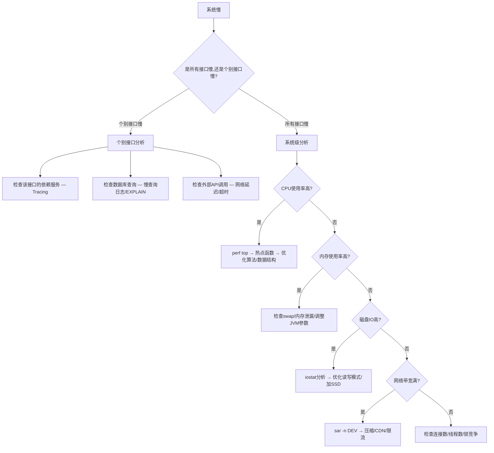

## 本章小结

性能分析是将"感觉系统慢"转化为"精确定位瓶颈"的系统化工程实践。本章从性能度量的基本指标出发，建立了USE/RED方法论框架，覆盖了CPU、内存、IO、网络四大子系统的分析技术，并延伸到分布式追踪与性能测试。以下是对全章知识体系的完整回顾与提炼。

---

### 一、全章知识体系总览



---

### 二、核心知识体系回顾

#### 1. 性能度量四支柱

本章建立了以延迟、吞吐量、并发度、资源利用率为核心的性能度量体系。这四个指标并非孤立存在，而是通过排队理论和利特尔定律（L = λ × W）紧密关联。

| 指标 | 定义 | 度量方式 | 工程意义 |
|------|------|----------|----------|
| 延迟（Latency） | 单次操作完成时间 | P50/P90/P99/P999分位数 | 直接影响用户体验；尾延迟在大规模扇出场景下被放大 |
| 吞吐量（Throughput） | 单位时间完成操作数 | RPS/QPS/IOPS/Bytes/s | 衡量系统处理能力上限 |
| 并发度（Concurrency） | 系统同时处理的请求数 | 利特尔定律：L = λ × W | 连接池、线程池容量规划的理论依据 |
| 资源利用率（Utilization） | 资源繁忙程度 | 百分比（CPU/内存/磁盘/网络） | 超过70%时排队延迟急剧上升（曲棍球棒效应） |

**关键洞察**：M/M/1排队模型揭示了当利用率ρ接近1时响应时间趋向无穷大的本质原因。这意味着"让CPU跑满"恰恰是性能最差的状态。理解这一点是性能工程的起点——**高利用率不等于高效率，恰恰相反，它是系统即将劣化的危险信号**。

**四指标的联动关系**：当延迟升高时，需要判断是吞吐量不足（系统处理能力到顶）还是资源利用率过高（排队延迟）。如果并发度持续增长但吞吐量不再提升，说明系统已进入饱和区——此时盲目增加请求只会加剧排队，正确做法是限流或扩容。

#### 2. 并行计算两大定律

**阿姆达尔定律**（固定问题规模）：S(n) = 1 / ((1-p) + p/n)，其中p为可并行化比例。即使处理器数量趋向无穷，加速比上限为1/(1-p)。这意味着优化串行瓶颈是提升并行性能的关键——10%的串行代码将100%地限制加速上限为10倍。

**古斯塔夫森定律**（可变问题规模）：S(n) = n - (1-p)×(n-1)。当问题规模随处理器数量增大时，可并行化比例p本身也会增大，实际加速比远高于阿姆达尔定律的预测。这解释了为什么大数据集群可以通过增加机器来处理更大规模的数据。

**工程决策框架**：

| 场景 | 主导定律 | 优化策略 |
|------|----------|----------|
| 实时交易系统（延迟敏感，问题规模固定） | 阿姆达尔定律 | 识别并消除串行瓶颈，优化关键路径 |
| 大数据分析（吞吐敏感，数据量持续增长） | 古斯塔夫森定律 | 水平扩展，增加节点处理更大规模 |
| 混合负载（如微服务集群） | 两者共同作用 | 既优化热点服务的串行路径，也设计可扩展架构 |

**实践中的判断标准**：如果你的系统瓶颈是"单个请求太慢"，用阿姆达尔定律思考；如果瓶颈是"系统总处理量不够"，用古斯塔夫森定律思考。大多数互联网系统同时面临两种压力——用户体验依赖低延迟（阿姆达尔），业务增长依赖高吞吐（古斯塔夫森）。

#### 3. 方法论框架

**USE方法**（Utilization/Saturation/Errors）——面向系统资源的检查清单：

对每种资源（CPU、内存、磁盘、网络）分别检查三个维度：

- **利用率**：资源繁忙时间占比。CPU用`mpstat -P ALL 1`，磁盘用`iostat -xz 1`的%util列
- **饱和度**：排队等待程度。CPU用`vmstat 1`的runq列，内存用si/so列（换入换出）
- **错误**：硬件/软件错误事件。CPU用`perf stat`的硬件错误计数，内存用`dmesg | grep -i "out of memory"`

USE方法的价值在于它提供了一个**穷举式检查框架**，确保不会遗漏任何资源类型的任何问题维度。当你面对一台"不知道哪里慢"的服务器时，USE方法能让你系统化地逐项排查，而不是凭直觉随机尝试。

**RED方法**（Rate/Errors/Duration）——面向服务级别的监控：

- **Rate**：每秒请求数 = requests_total / time_window
- **Errors**：每秒失败请求数 = error_requests / time_window
- **Duration**：请求延迟的直方图分布

RED方法的Prometheus实现：

```promql
# 请求速率（5分钟窗口）
rate(http_requests_total[5m])

# 错误率（5xx状态码）
rate(http_requests_total{status=~"5.."}[5m])

# P99延迟
histogram_quantile(0.99, rate(http_request_duration_seconds_bucket[5m]))
```

**USE vs RED的定位差异**：

- USE用于排查基础设施层问题：服务器CPU为什么100%？磁盘IO为什么饱和？
- RED用于排查服务层问题：哪个微服务延迟升高？哪个接口错误率飙升？
- 两者互补：**先用RED定位问题服务，再用USE定位该服务所在机器的资源瓶颈**

**故障排查决策路径**：



#### 4. 三种观测手段的分工

| 手段 | 核心能力 | 适用场景 | 开销 | 代表工具 |
|------|----------|----------|------|----------|
| Profiling（性能剖析） | 深入函数/代码行级别的资源消耗 | 定位热点代码、锁竞争、内存分配 | 中-高 | perf、pprof、async-profiler |
| Tracing（分布式追踪） | 跨服务的完整请求调用链 | 定位分布式系统中的延迟传播 | 低-中 | OpenTelemetry、Jaeger、Zipkin |
| Metrics（指标聚合） | 时间序列的系统状态快照 | 实时监控、趋势分析、告警 | 极低 | Prometheus、Grafana、Datadog |

三者的关系：**Metrics告诉你"系统出问题了"，Tracing告诉你"哪个服务/调用出了问题"，Profiling告诉你"具体哪行代码出了问题"**。一个成熟的可观测性体系需要三者协同——Metrics作为第一道防线持续监控，Tracing用于跨服务的问题定位，Profiling用于深度根因分析。

**开销与精度的权衡**：Metrics开销最低（仅计数器自增），适合100%覆盖；Tracing有采样开销，通常在生产环境使用1%-10%的采样率；Profiling开销最高（CPU采样5%-10%，内存profiling可达2-3倍），一般只在复现问题时短期开启。三者的典型使用比例是：Metrics 100%部署 → Tracing 1%-10%采样 → Profiling 按需触发。

#### 5. CPU性能分析技术栈

**perf工具体系**：

- `perf top`：实时查看热点函数，适合快速定位CPU密集型瓶颈
- `perf record -g -p <pid>` + `perf report`：离线分析调用图，适合深度剖析
- `perf stat -e cycles,instructions,cache-misses,branch-misses`：硬件事件统计，量化CPU微架构效率

**火焰图**（Flame Graph）：将perf的采样数据转化为可视化热力图。X轴宽度代表采样占比（越宽=越热），Y轴是调用栈深度。核心阅读技巧：找**平顶**（自身耗时多的函数）和**宽顶**（被大量调用路径经过的函数）。差分火焰图（differential flame graph）用于对比两次采样的差异，快速定位性能回退。

**缓存未命中分析**：

- 缓存层次：L1（1-4周期）→ L2（10-20周期）→ L3（30-50周期）→ 主存（100-300周期）
- 每一级缓存未命中都带来**数量级**的延迟惩罚
- 分析命令：`perf stat -e L1-dcache-load-misses,L1-dcache-loads`、`perf c2c record -g`
- 优化关键：行优先遍历（空间局部性）、数据结构紧凑（减少缓存行浪费）

**分支预测失败分析**：

- 预测失败导致流水线冲刷，惩罚10-20个周期
- 分析命令：`perf stat -e branch-misses,branches`
- 优化策略：数据排序使分支可预测、无分支代码（bitmask技巧）、`__builtin_expect`提示编译器

#### 6. 内存性能分析技术栈

**内存泄漏检测**：

- Valgrind Memcheck：精确但慢（5-50倍减速），适合开发环境
- AddressSanitizer (ASan)：运行时开销约2倍，支持多种内存错误检测，适合CI集成
- `MALLOC_CHECK_=3`：glibc级的轻量检测

**内存碎片**：

- 外部碎片：空闲内存被分割成小块，无法满足大块分配。检测：`cat /proc/buddyinfo`
- 内部碎片：分配器对齐和元数据开销导致分配大于请求。缓解：使用jemalloc/tcmalloc等现代分配器

**TLB未命中**：虚拟地址到物理地址的映射缓存失效。优化手段：HugePages（2MB/1GB大页）、提高数据局部性、减少工作集大小。

**NUMA分析**：多路服务器中本地内存访问比远程快2-3倍。工具：`numactl --hardware`查看拓扑，`numastat -p <pid>`查看内存分布。优化：`numactl --cpunodebind=0 --membind=0`绑定进程到特定NUMA节点。

#### 7. IO与网络分析

**磁盘IO分析**：

- `iostat -xz 1`是核心命令：%util（利用率）、await（平均等待时间）、avgqu-sz（队列长度）
- 顺序IO vs 随机IO的性能差异可达**100倍以上**（HDD上尤为明显）
- 优化方向：合并写入、使用异步IO（io_uring）、调整预读策略

**网络分析**：

- `sar -n DEV 1`：带宽利用率监控
- `ss -s`：连接状态统计
- `tcpdump` + Wireshark：协议级深度分析
- RED方法应用于网络层：连接成功率、重传率、RTT分布

#### 8. 分布式追踪

在微服务架构下，一个用户请求可能穿越数十个服务。端到端的性能分析需要分布式追踪的支持：

- **OpenTelemetry**：CNCF标准，统一Traces/Metrics/Logs三大支柱
- **Jaeger/Zipkin**：追踪数据的存储与可视化
- **采样策略**：全量采样（开发环境）→ 概率采样（生产环境）→ 尾部采样（只采样慢请求/异常请求）

**采样策略选择指南**：

| 策略 | 适用环境 | 优势 | 劣势 |
|------|----------|------|------|
| 全量采样 | 开发/测试 | 不遗漏任何请求 | 生产环境存储和带宽开销巨大 |
| 概率采样 | 生产环境（低流量） | 实现简单，开销可控 | 可能遗漏关键慢请求 |
| 尾部采样 | 生产环境（高流量） | 只保留有意义的trace | 需要协调多节点的采样决策，实现复杂 |
| 自适应采样 | 生产环境（大规模） | 自动调整采样率 | 需要完善的基础设施支持 |

#### 9. 性能测试方法论

| 测试类型 | 目标 | 负载模式 | 关键指标 |
|----------|------|----------|----------|
| 基准测试（Benchmark） | 建立性能基线 | 固定条件下的标准测试 | 绝对数值 |
| 负载测试（Load Test） | 验证预期负载下的表现 | 逐步增加到预期峰值 | 延迟、吞吐量、错误率 |
| 压力测试（Stress Test） | 找到系统崩溃点 | 超过预期峰值 | 系统降级行为、恢复能力 |
| 浸泡测试（Soak Test） | 检测长时间运行的退化 | 持续中等负载数小时/天 | 内存泄漏、连接泄漏 |

**性能测试的常见陷阱**：

- **客户端瓶颈**：负载生成器自身成为瓶颈，导致测出的不是服务器性能而是客户端性能。解决：监控load generator的CPU/网络，确保客户端资源充足
- **冷启动偏差**：首次请求因JIT编译、缓存预热等原因偏慢。解决：预热阶段数据不计入统计
- **网络延迟掩盖**：测试环境网络延迟远低于生产环境。解决：使用tc/netem注入与生产一致的延迟
- **测试数据偏差**：测试数据与生产数据分布不一致。解决：从生产环境脱敏后导出真实数据集

---

### 三、关键公式速查表

| 概念 | 公式/模型 | 工程应用 |
|------|-----------|----------|
| 利特尔定律 | L = λ × W | 连接池容量 = 预期QPS × 平均请求延迟 |
| M/M/1排队 | W = 1/(μ - λ) | 利用率超过70%时延迟急剧上升 |
| 阿姆达尔定律 | S(n) = 1/((1-p) + p/n) | 并行化的理论加速上限 |
| 古斯塔夫森定律 | S(n) = n - (1-p)(n-1) | 水平扩展的实际收益 |
| 尾延迟放大 | P99扇出 ≈ 1 - (0.99)^N | 100个并行调用中63%会遇到P99延迟 |
| 缓存命中率 | 命中率 = 命中数 / 总访问数 | 99%命中率 vs 99.9%命中率的延迟差异巨大 |

**尾延迟放大效应详解**：当一个请求需要扇出调用N个后端服务时，只要其中任意一个服务出现尾延迟，整个请求就会变慢。假设单个服务P99延迟为100ms，扇出50个服务时，用户遇到至少一次P99延迟的概率为：1 - 0.99^50 ≈ 39.5%。扇出100个服务时概率为63.4%。这就是为什么微服务架构中的尾延迟问题远比单体架构严重——**扇出放大了尾延迟，而尾延迟决定了用户体验**。

---

### 四、最佳实践清单

#### 设计阶段

- [ ] 明确性能指标的SLA要求（延迟P99 < 200ms？吞吐量 > 10K QPS？）
- [ ] 选择合适的技术方案（异步还是同步？单体还是微服务？）
- [ ] 设计容错和降级方案（熔断器模式、限流策略、优雅降级）
- [ ] 规划监控和告警体系（USE方法覆盖所有资源，RED方法覆盖所有服务）
- [ ] 制定容量规划（基于利特尔定律估算资源需求）
- [ ] 定义性能预算（每个模块/服务的延迟配额，防止整体劣化）

#### 开发阶段

- [ ] 编写性能意识代码（避免N+1查询、减少内存分配、利用缓存友好数据结构）
- [ ] 使用Profile-Guided Optimization（PGO）指导编译器优化
- [ ] 在CI中集成性能基准测试（防止性能回退）
- [ ] 代码审查时关注性能反模式（大对象复制、不必要的锁竞争、同步IO）
- [ ] 选择合适的数据结构（数组 vs 链表、哈希表 vs 平衡树、连续内存 vs 分散分配）

#### 测试与部署阶段

- [ ] 建立性能基准线（每个版本的基准测试结果存档对比）
- [ ] 执行负载测试和压力测试（在预发布环境模拟生产负载）
- [ ] 配置合理的资源限制（cgroup/K8s资源配额）
- [ ] 设置多层监控告警（基础设施层USE + 服务层RED + 业务指标）
- [ ] 制定回滚方案和应急预案
- [ ] 进行混沌工程测试（注入故障验证系统韧性）

#### 运维阶段

- [ ] 每日巡检监控面板（关注趋势而非瞬时值）
- [ ] 定期分析火焰图（检测新引入的热点）
- [ ] 持续优化热点代码（80/20法则：20%的代码占用80%的执行时间）
- [ ] 每季度更新容量规划（根据业务增长调整资源）
- [ ] 维护性能知识库（记录每次排查过程和根因分析）
- [ ] 跟踪技术债务中的性能债（标记性能相关的TODO/FIXME）

---

### 五、常见性能反模式速查

| 反模式 | 问题描述 | 解决方案 |
|--------|----------|----------|
| 没有基准就优化 | 不知道当前性能水平就开始改代码 | 先建立性能基准，再做针对性优化 |
| 过早优化 | 在非瓶颈处投入大量优化精力 | 用Profiler定位真正的热点，聚焦80/20 |
| 忽视尾延迟 | 只看平均延迟，忽略P99/P999 | 平均值掩盖了长尾问题，必须关注分位数 |
| 盲目加缓存 | 不分析命中率就引入多级缓存 | 缓存命中率低于99%时需重新评估策略 |
| 忽视IO瓶颈 | CPU和内存正常，但系统很慢 | 使用iostat检查%util和await，IO往往是隐藏瓶颈 |
| 过度日志 | 生产环境打大量DEBUG日志 | 分级日志 + 采样日志 + 结构化日志 |
| 硬编码连接池 | 连接池大小写死不调整 | 基于利特尔定律动态计算，配合监控调优 |
| 忽略NUMA效应 | 多路服务器上进程跨NUMA访问 | numactl绑定 + 监控远程访问比例 |
| 线程过多 | 创建远超CPU核心数的线程 | 线程数 ≈ CPU核心数（CPU密集）或按IO等待比调整 |
| 同步阻塞IO | 在请求路径上做同步文件/网络IO | 改用异步IO（io_uring/epoll）或独立IO线程池 |

---

### 六、工具链速查

#### 系统级分析

| 工具 | 用途 | 关键命令 |
|------|------|----------|
| perf | CPU性能剖析 | `perf top` / `perf record -g -p <pid>` / `perf stat` |
| vmstat | 系统级概览 | `vmstat 1`（关注r列、si/so列） |
| iostat | 磁盘IO分析 | `iostat -xz 1`（关注%util、await、avgqu-sz） |
| mpstat | CPU多核分析 | `mpstat -P ALL 1` |
| sar | 历史性能数据 | `sar -u 1` / `sar -n DEV 1` |
| strace | 系统调用追踪 | `strace -c -p <pid>`（统计系统调用耗时） |
| eBPF/BCC | 内核级动态追踪 | `funccount` / `trace` / `opensnoop` / `biosnoop` |
| numactl/numastat | NUMA拓扑与内存分布 | `numactl --hardware` / `numastat -p <pid>` |

#### 应用级分析

| 工具 | 语言/环境 | 用途 |
|------|-----------|------|
| pprof | Go | CPU/内存/goroutine分析 |
| async-profiler | Java | CPU/锁/内存分配分析 |
| py-spy | Python | 无侵入式Python profiling |
| Valgrind | C/C++ | 内存泄漏检测 |
| AddressSanitizer | C/C++/Go | 运行时内存错误检测 |
| flamegraph.pl | 通用 | 火焰图可视化 |
| dotnet-trace | .NET | CPU/内存/线程分析 |

#### 分布式追踪

| 工具 | 特点 | 适用场景 |
|------|------|----------|
| OpenTelemetry | CNCF标准，统一三大支柱 | 新项目的首选方案 |
| Jaeger | Uber开源，CNCF毕业 | 中大规模微服务追踪 |
| Zipkin | Twitter开源，成熟稳定 | 已有Brave客户端的项目 |
| Datadog APM | 商业方案，开箱即用 | 预算充足、希望快速落地 |

---

### 七、性能问题快速诊断决策树

面对一个"系统慢"的问题，以下决策树帮助你快速定位方向：



---

### 八、下一步学习建议

#### 深入方向

1. **排队理论**：深入学习M/M/c、M/G/1等排队模型，理解并发系统的性能边界。推荐阅读Kleinrock的《Queueing Systems》两卷本
2. **硬件性能计数器**：研究PMC（Performance Monitoring Counter）的完整事件集，理解CPU微架构（流水线、超标量、乱序执行）对性能的影响
3. **内核性能分析**：学习eBPF/BCC工具链，掌握内核级别的动态追踪能力。eBPF是现代Linux性能分析的革命性技术，能在不修改内核的前提下安全地插入探针
4. **可观测性工程**：从性能分析扩展到全链路可观测性（Observability），学习OpenTelemetry生态、日志聚合（Loki/ELK）、异常检测
5. **容量工程**：学习基于排队理论和历史数据的容量规划方法论，建立自动化的容量预警机制
6. **性能回归检测**：研究自动化性能基准测试框架（如Google的Benchmark CI、GitHub的持续性能分析），将性能守护集成到开发流程中

#### 推荐资源

**书籍**：

- 《Systems Performance》(Brendan Gregg) —— 系统性能分析的权威著作，覆盖Linux/Unix系统性能的方方面面
- 《Java Performance》(Scott Oaks) —— JVM性能分析的实战指南，深入GC、JIT、线程模型
- 《Flame Graphs》(Brendan Gregg) —— 火焰图方法论的系统阐述
- 《Site Reliability Engineering》(Google) —— SRE视角的性能工程，包含完整的SLO/SLI体系
- 《Designing Data-Intensive Applications》(Martin Kleppmann) —— 分布式系统设计中性能权衡的深度分析

**工具文档**：

- perf手册：`man perf-stat` / `man perf-record` / `man perf-report`
- Brendan Gregg的性能分析工具站：https://www.brendangregg.com/linuxperf.html
- OpenTelemetry官方文档：https://opentelemetry.io/docs/
- eBPF/BCC工具集：https://github.com/iovisor/bcc

**在线课程**：

- Stanford CS244B: Advanced Topics in Networking（网络性能）
- MIT 6.172: Performance Engineering of Software Systems（系统性能工程）
- Brendan Gregg的性能分析演讲与教程（YouTube/Blog）

---

### 九、思考题

1. **理论理解**：当一个Web服务的P99延迟是100ms，一个用户请求需要并行调用50个后端服务，用户遇到至少一次P99延迟的概率是多少？这对系统设计有什么启示？（提示：用尾延迟放大公式 1 - (0.99)^N 计算，并讨论减少扇出和降低尾延迟两种应对策略的权衡）

2. **方法论应用**：你负责一个新上线的微服务集群，RED监控显示某个服务的Duration突然升高。请描述你使用USE方法逐步排查该服务所在服务器的完整流程。（提示：按CPU→内存→磁盘→网络的顺序，每种资源检查利用率/饱和度/错误三个维度）

3. **工具实践**：用`perf stat`分析一个排序算法时，发现L1-dcache-load-misses率高达15%。请分析可能的原因，并给出至少三种优化方向。（提示：考虑数据局部性、数据结构布局、缓存行大小等因素）

4. **架构设计**：一个系统有5%的代码必须串行执行（阿姆达尔定律），当前使用16核处理器。请计算理论最大加速比，并讨论在什么情况下改用古斯塔夫森定律的视角更合适。（提示：阿姆达尔上限 = 1/0.05 = 20倍，但当问题规模可增长时，古斯塔夫森预测的加速比如何变化？）

5. **工程权衡**：在生产环境中，Profiling、Tracing和Metrics三种观测手段的开销各不相同。如何在观测精度和系统开销之间找到平衡？请给出具体的采样率/采样策略建议。（提示：考虑Metrics 100%覆盖 + Tracing 1%-10%采样 + Profiling按需触发的分层策略）
