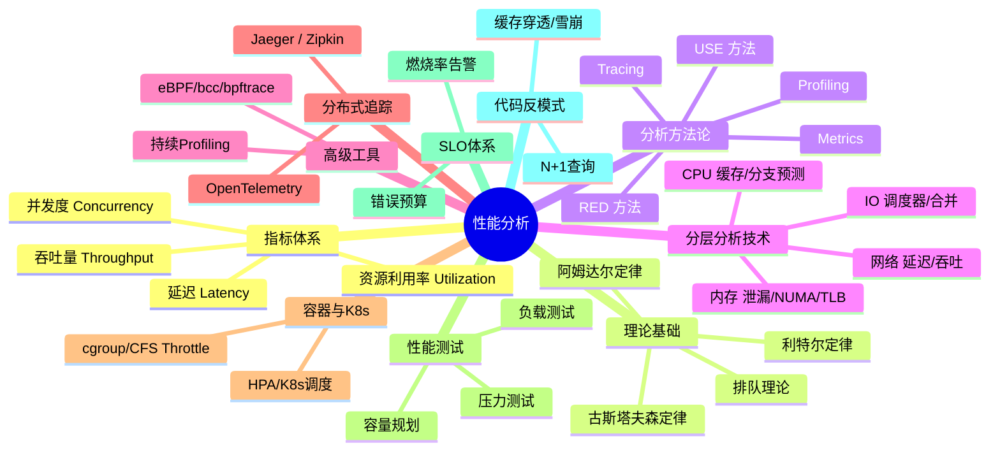
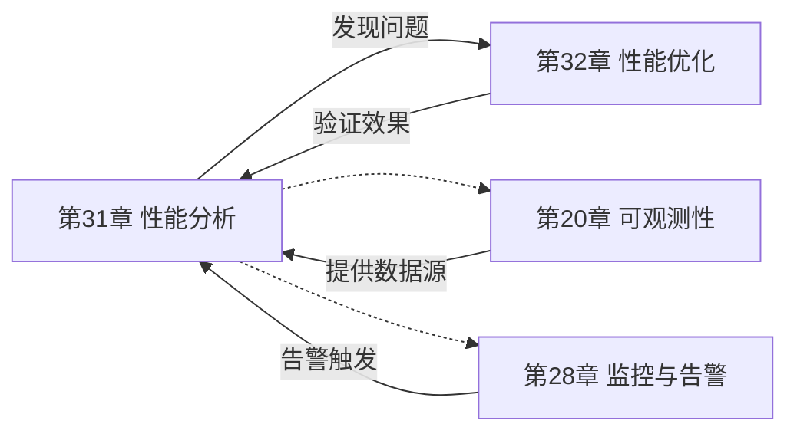
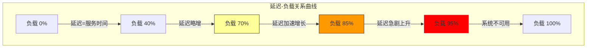
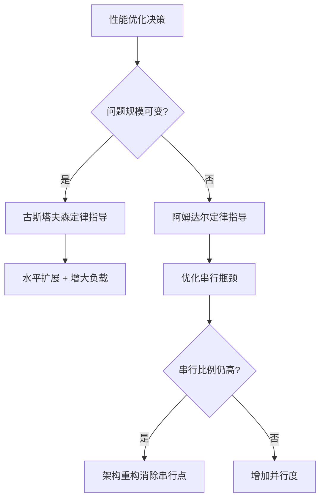
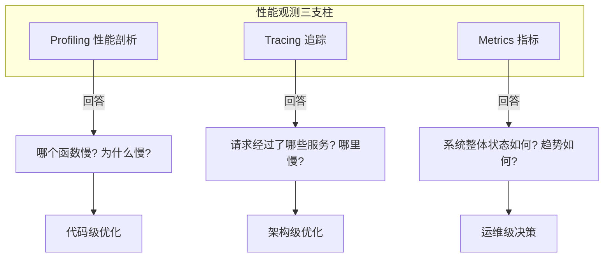
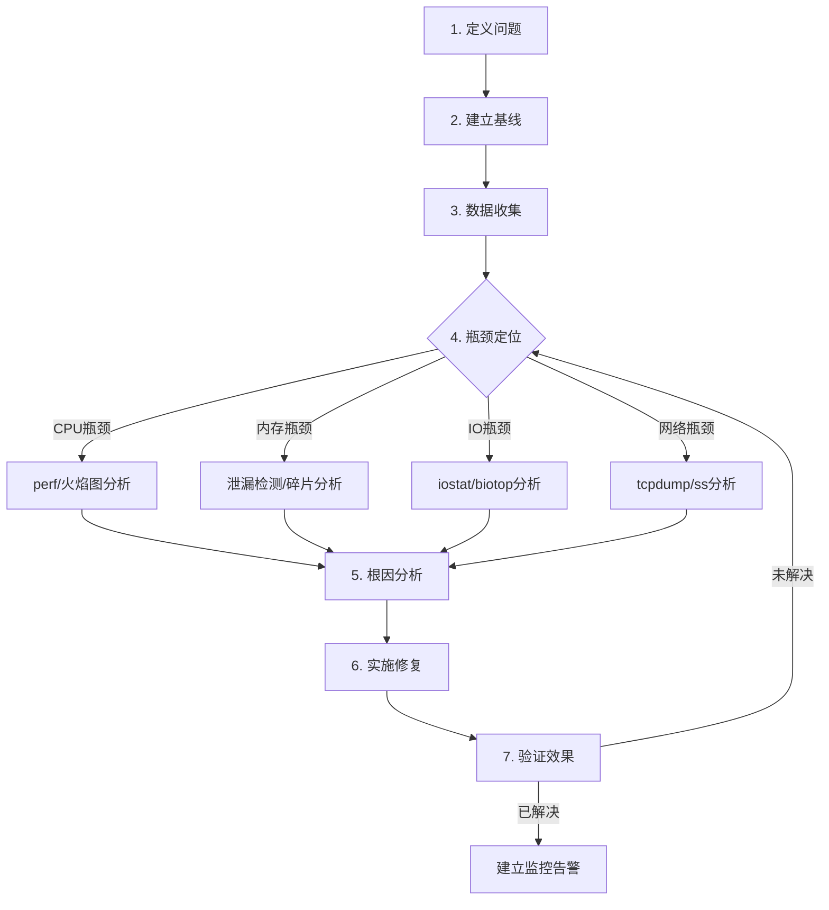

# 第31章 性能分析

## 章节定位

性能分析是软件工程中识别系统瓶颈、量化资源消耗、指导优化方向的关键实践。本章系统性地介绍性能分析的理论基础、工具链和方法论，帮助工程师建立从宏观到微观的性能观测能力。

性能分析的核心价值在于：**用数据替代猜测**。没有性能数据支撑的优化决策，往往导致"优化了不该优化的地方"或"忽略了真正的瓶颈"。一个合格的性能工程师，应当能够在面对"系统变慢了"这类模糊描述时，快速建立分析框架、定位瓶颈根因、给出可量化的优化建议。

## 核心主题

本章围绕以下核心主题展开：



**性能指标体系**：延迟（Latency）、吞吐量（Throughput）、并发度（Concurrency）、资源利用率（Resource Utilization）构成了性能度量的四大支柱。理解这些指标之间的关系和权衡，是进行有效性能分析的前提。

**性能定律**：阿姆达尔定律（Amdahl's Law）揭示了并行化加速的上限，古斯塔夫森定律（Gustafson's Law）则从另一个角度说明了问题规模对并行效率的影响。这两个定律为性能优化提供了理论边界。

**分析方法论**：USE方法（Utilization/Saturation/Errors）用于系统资源分析，RED方法（Rate/Errors/Duration）用于服务级别分析，Profiling、Tracing和Metrics三种观测手段相互补充，构成了完整的性能观测体系。

**分层分析技术**：从CPU层面的缓存未命中和分支预测分析，到内存层面的泄漏检测和NUMA分析，再到IO层面的调度器优化和网络层面的延迟分析，每一层都有其特定的分析工具和技术。eBPF/bcc/bpftrace提供了内核可编程的现代分析能力。

**分布式追踪**：在微服务架构下，OpenTelemetry、Jaeger、Zipkin等工具提供了跨服务的请求追踪能力，使端到端的性能分析成为可能。持续性能剖析（Pyroscope/Parca）则在生产环境持续采集性能数据，实现性能回归的自动检测。

**容器与Kubernetes**：容器化环境引入了cgroup CPU throttle、网络overlay开销、存储卷映射等新的性能维度。Kubernetes的HPA、资源Request/Limit设置、调度策略都会影响应用性能。

**性能测试**：负载测试、压力测试和容量规划是验证系统性能的重要手段，基准测试工具为性能评估提供了标准化的度量方法。

**SLO/SLI/SLA体系**：错误预算和燃烧率告警将技术指标与业务目标对齐，指导性能优化的优先级决策。

**代码级反模式**：N+1查询、缓存穿透/雪崩/击穿、同步阻塞调用链、锁粒度过粗等常见反模式，是生产环境中性能问题的主要来源。

## 学习目标

完成本章学习后，读者应能：

1. 理解核心性能指标及其相互关系，能够运用排队理论解释性能现象
2. 运用USE和RED方法进行系统性性能分析
3. 使用perf、火焰图、eBPF（bcc/bpftrace）等工具进行CPU性能分析
4. 掌握内存、IO、网络各层的性能分析技术
5. 在生产环境中实施持续性能剖析（Pyroscope/Parca）
6. 在分布式系统中实施端到端的性能追踪（OpenTelemetry）
7. 诊断容器和Kubernetes环境中的性能问题（cgroup throttle、HPA）
8. 设计和执行有效的性能测试方案
9. 建立SLO/SLI/SLA体系，设计错误预算和燃烧率告警
10. 识别和修复常见的代码级性能反模式

## 与其他章节的关系

本章与第32章（性能优化）构成"分析-优化"的完整闭环。性能分析为优化提供数据支撑，优化结果又需要通过分析来验证。同时，本章的技术与第20章（可观测性）、第28章（监控与告警）密切相关，共同构成了系统运维的技术基础。此外，容器和Kubernetes性能分析与第35章（容器化与编排）有直接关联。



***

# 31.1 理论基础

## 31.1.1 性能分析概述

性能分析（Performance Analysis）是通过系统性地收集、测量和分析系统运行数据，识别性能瓶颈并指导优化决策的过程。在现代软件系统中，性能直接影响用户体验、系统可靠性和运营成本。

### 核心性能指标

性能度量围绕四个核心指标展开：

**延迟（Latency）**：完成单次操作所需的时间。延迟是最直接影响用户体验的指标。常见的延迟度量包括：

```text
延迟分布指标：
  P50（中位数）：50%的请求在此时间内完成
  P90：90%的请求在此时间内完成
  P99：99%的请求在此时间内完成
  P999：99.9%的请求在此时间内完成（尾延迟）
```

尾延迟（Tail Latency）在大规模系统中尤为重要。当一个用户请求需要调用多个后端服务时，整体延迟取决于最慢的那个调用。如果单个服务的P99延迟是100ms，一个请求需要并行调用100个服务，那么大约63%的请求会遇到至少一次P99延迟（计算：1 - 0.99^100 ≈ 0.634）。这就是为什么Google在其SRE实践中要求P99甚至P999级别的延迟控制。

| 分位数 | 含义 | 典型应用场景 | 业界参考值 |
|--------|------|-------------|-----------|
| P50 | 中位数延迟 | 典型用户体验 | < 100ms |
| P90 | 90%请求在此完成 | 大多数用户体验 | < 200ms |
| P99 | 99%请求在此完成 | 敏感用户体验 | < 500ms |
| P999 | 99.9%请求在此完成 | 长尾延迟控制 | < 1s |
| Max | 最大延迟 | 极端情况 | — |

**吞吐量（Throughput）**：单位时间内完成的操作数量。吞吐量的度量单位取决于具体场景：

```text
常见吞吐量指标：
  - HTTP服务：Requests Per Second (RPS)
  - 数据库：Queries Per Second (QPS)
  - 消息队列：Messages Per Second
  - 网络：Bytes Per Second / Packets Per Second
  - 存储：IOPS (IO Operations Per Second)
```

**并发度（Concurrency）**：系统同时处理的请求数量。并发度与吞吐量和延迟的关系可以用利特尔定律（Little's Law）描述：

```text
L = λ × W

其中：
  L = 系统中的平均请求数（并发度）
  λ = 平均到达率（吞吐量）
  W = 平均处理时间（延迟）
```

利特尔定律的强大之处在于它对分布和服务时间没有任何假设——无论请求到达是泊松过程还是突发流量，无论服务时间是指数分布还是确定性的，这个等式都成立。在实际工程中，利特尔定律常用于：(1) 已知两个指标推算第三个；(2) 评估系统容量（当延迟要求固定时，吞吐量受限于系统能容纳的最大并发数）；(3) 设计限流策略（通过控制L来保护后端服务）。

**资源利用率（Resource Utilization）**：系统资源的使用程度。关键资源包括CPU、内存、磁盘IO、网络带宽等。资源利用率过高会导致排队延迟急剧上升，通常建议保持在70%以下以留有余量。

### 性能指标之间的关系

这四个指标之间存在复杂的相互关系。延迟和吞吐量之间的关系通常呈现"曲棍球棒"形状：在低负载时延迟基本稳定，当负载接近系统容量时延迟急剧上升。这种关系可以用排队理论（Queueing Theory）来描述。

#### 排队理论基础

排队理论是性能分析的数学基石。现实世界中，几乎所有系统都可以建模为"请求到达→排队等待→接受服务→离开"的过程。

**M/M/1队列**（泊松到达、指数服务时间、单服务台）：

```text
平均响应时间：W = 1 / (μ - λ)
平均队列长度：Lq = ρ² / (1 - ρ)
利用率：ρ = λ / μ

其中：
  μ = 服务速率
  λ = 到达速率
  ρ = λ/μ = 利用率
```

当ρ接近1时，响应时间趋向无穷大。这解释了为什么系统在高负载下性能急剧恶化。

**M/M/c队列**（多服务台）更贴近实际多核/多线程系统：

```text
M/M/c 关键特性：
  - 当利用率 ρ = λ/(c×μ) < 0.7 时，排队延迟很小
  - 当 ρ > 0.85 时，排队延迟急剧上升
  - 当 ρ → 1 时，延迟趋向无穷大

实际指导意义：
  CPU利用率长期>70% → 需要扩容或优化
  磁盘队列长度>2 → IO瓶颈
  线程池使用率>80% → 需要增加线程或优化处理时间
```



## 31.1.2 阿姆达尔定律与古斯塔夫森定律

### 阿姆达尔定律（Amdahl's Law）

阿姆达尔定律描述了在固定问题规模下，增加处理器数量对程序加速比的限制：

```text
S(n) = 1 / ((1 - p) + p/n)

其中：
  S(n) = 使用n个处理器的加速比
  p = 程序中可并行化的比例
  (1-p) = 程序中必须串行执行的比例
  n = 处理器数量
```

阿姆达尔定律的关键洞察：即使无限增加处理器数量，加速比的上限是 1/(1-p)。如果程序有10%是串行的，最大加速比只有10倍。

| 并行比例 (p) | 最大加速比 | 16核实际加速比 | 加速效率 |
|:---:|:---:|:---:|:---:|
| 50% | 2x | 1.6x | 80% |
| 75% | 4x | 2.9x | 73% |
| 90% | 10x | 5.1x | 51% |
| 95% | 20x | 7.6x | 38% |
| 99% | 100x | 13.5x | 14% |

从表中可以直观看出：即使有99%的代码可以并行化，使用16核也只获得13.5倍加速，远低于直觉上的"16倍"。这就是阿姆达尔定律的核心约束。

### 古斯塔夫森定律（Gustafson's Law）

古斯塔夫森定律从另一个角度看待并行计算：随着处理器数量增加，问题规模也会增大：

```text
S(n) = n - (1 - p) × (n - 1)

等价形式：
S(n) = (1 - p) + p × n

其中：
  S(n) = 使用n个处理器的加速比
  p = 并行部分所占时间的比例（随问题规模变化）
  n = 处理器数量
```

古斯塔夫森定律的实际意义：在大规模系统中，可以通过增大问题规模来充分利用更多的处理器。这解释了为什么现代数据中心能够通过增加机器来处理更大的负载。

### 两个定律的工程启示

| 维度 | 阿姆达尔定律 | 古斯塔夫森定律 |
|------|-------------|---------------|
| 假设前提 | 问题规模固定 | 计算时间固定 |
| 适用场景 | 单任务优化 | 大规模数据处理 |
| 优化策略 | 减少串行瓶颈 | 增大问题规模 |
| 典型例子 | 加速单个查询 | 处理更多数据 |
| 扩展方式 | 垂直扩展（加CPU） | 水平扩展（加机器） |



## 31.1.3 性能分析方法论

### USE方法（Utilization/Saturation/Errors）

USE方法由Brendan Gregg提出，用于系统性地检查所有系统资源的性能状态。USE代表三个维度：

**利用率（Utilization）**：资源在特定时间窗口内的繁忙程度，通常用百分比表示。

**饱和度（Saturation）**：资源的过载程度，通常表现为等待队列的长度。

**错误（Errors）**：资源相关的错误事件计数。

| 资源 | 利用率指标 | 饱和度指标 | 错误指标 |
|------|-----------|-----------|---------|
| CPU | `mpstat -P ALL 1` | `vmstat 1` (r列) | `perf stat` (硬件错误) |
| 内存 | `free -m` (已用/总量) | `vmstat 1` (si/so) | `dmesg \| grep OOM` |
| 磁盘 | `iostat -xz 1` (%util) | `iostat -xz 1` (avgqu-sz) | `smartctl -a /dev/sda` |
| 网络 | `sar -n DEV 1` (带宽%) | `netstat -s` (overflow) | `netstat -s` (errors) |

USE方法的核心价值在于**系统性**——它强制你逐一检查每个资源的三个维度，避免遗漏。很多性能问题之所以迟迟无法定位，就是因为分析者跳过了某些资源的检查。

### RED方法（Rate/Errors/Duration）

RED方法专注于服务级别的监控，适用于微服务架构：

**Rate（速率）**：每秒请求数，反映服务的流量。

**Errors（错误率）**：每秒失败请求数，反映服务的健康状态。

**Duration（延迟）**：请求处理时间的分布，反映服务的性能。

```yaml
# RED方法实施：Prometheus示例
# Rate（请求速率）
rate(http_requests_total[5m])

# Errors（错误率）
rate(http_requests_total{status=~"5.."}[5m])
# 错误率 = 错误请求速率 / 总请求速率

# Duration（延迟分布）
histogram_quantile(0.99, rate(http_request_duration_seconds_bucket[5m]))
histogram_quantile(0.95, rate(http_request_duration_seconds_bucket[5m]))
histogram_quantile(0.50, rate(http_request_duration_seconds_bucket[5m]))
```

### USE vs RED 对比

| 维度 | USE方法 | RED方法 |
|------|---------|---------|
| 关注对象 | 系统资源（CPU/内存/IO） | 服务（API/微服务） |
| 适用层次 | 基础设施层 | 应用层 |
| 核心指标 | 利用率/饱和度/错误 | 速率/错误/延迟 |
| 典型使用者 | SRE/运维 | 开发者/架构师 |
| 工具支持 | vmstat/iostat/mpstat | Prometheus/Grafana |

### Profiling vs Tracing vs Metrics

三种观测手段各有侧重，互为补充：



**Profiling（性能剖析）**：通过采样或插桩收集程序运行时的详细信息，用于分析CPU使用、内存分配、锁竞争等。

```text
Profiling技术对比：
┌──────────────────────────────────────────────────────────┐
│ 采样式（Sampling）                                        │
│   原理：周期性中断程序执行，记录当前调用栈                    │
│   开销：<5%，适合生产环境                                   │
│   精度：可能遗漏短暂事件（微秒级）                            │
│   工具：perf、pprof、async-profiler                       │
├──────────────────────────────────────────────────────────┤
│ 插桩式（Instrumentation）                                 │
│   原理：在代码中插入探针，记录每次执行                        │
│   开销：10-200%，适合测试环境                               │
│   精度：100%精确，无遗漏                                   │
│   工具：Valgrind、DTrace、eBPF                            │
└──────────────────────────────────────────────────────────┘
```

**Tracing（追踪）**：记录请求在系统中的完整执行路径，特别适合分布式系统。

```text
Tracing技术：
  日志追踪：
    - 通过TraceID关联跨服务的日志
    - 实现简单，但需要应用层配合

  分布式追踪：
    - 自动注入追踪上下文
    - 构建请求的完整调用链
    - 工具：OpenTelemetry、Jaeger、Zipkin
```

**Metrics（指标）**：聚合的时间序列数据，用于监控系统整体状态。

```text
Metrics四种类型：
  计数器（Counter）：单调递增的值，如请求总数、错误总数
  仪表盘（Gauge）：可增可减的值，如当前连接数、队列深度
  直方图（Histogram）：值的分布，如延迟分布（推荐）
  摘要（Summary）：类似直方图，但在客户端计算分位数（高基数问题）
```

## 31.1.4 CPU性能分析

### perf工具

perf是Linux内核自带的性能分析工具，利用硬件性能计数器和内核追踪点进行性能分析。它是Linux性能分析的瑞士军刀。

```bash
# 系统级CPU分析
perf top                          # 实时显示热点函数（类似top）
perf record -g -p <pid>           # 记录进程的性能数据
perf report                        # 分析记录的数据

# 硬件事件统计（最常用的性能诊断入口）
perf stat -e cycles,instructions,cache-misses,branch-misses ./program

# 输出解读：
#   instructions: 执行的指令数
#   cycles: CPU周期数
#   IPC = instructions/cycles：每周期执行指令数（>1表示高效）
#   cache-misses: 缓存未命中数
#   branch-misses: 分支预测失败数

# 调用图分析（带调用栈）
perf record -g --call-graph dwarf ./program
perf report --call-graph=graph,0.5,caller

# 追踪内核事件
perf trace -e 'syscalls:sys_enter_read' -p <pid>

# 缓存分析
perf stat -e L1-dcache-load-misses,L1-dcache-loads ./program
```

### 火焰图（Flame Graph）

火焰图是Brendan Gregg开发的性能可视化工具，通过调用栈的采样数据生成直观的性能热力图。

```bash
# 火焰图生成完整流程：

# 1. 安装工具
git clone https://github.com/brendangregg/FlameGraph.git

# 2. 采集数据（99Hz采样，开销<1%）
perf record -F 99 -g -p <pid> -- sleep 30

# 3. 生成折叠栈
perf script | stackcollapse-perf.pl > out.folded

# 4. 生成SVG火焰图
flamegraph.pl out.folded > flamegraph.svg

# 5. 在浏览器中打开 flamegraph.svg 进行交互分析
```

```text
火焰图解读指南：
  X轴：采样数量（宽度 = 该函数在采样中出现的比例）
  Y轴：调用栈深度（从下到上是调用链）
  颜色：随机颜色，无特殊含义（仅用于区分相邻帧）

  关键判断：
    宽的函数 = 热点函数（占用CPU时间多）
    平顶函数 = 自身执行时间多（而非调用其他函数）→ 优先优化
    尖顶函数 = 主要时间花在调用的子函数中 → 向下查找

  交互操作：
    点击某帧：放大该函数及其子调用
    搜索框：高亮包含关键词的函数
    Reset Zoom：恢复全局视图
```

### CPU Cache Miss分析

现代CPU的多级缓存架构对性能有重大影响。缓存未命中（Cache Miss）会导致显著的性能下降。

```text
缓存层次结构与延迟：
┌──────────┬──────────────┬──────────────┬─────────────────┐
│ 缓存层级  │ 典型容量       │ 访问延迟      │ 相对主存倍数      │
├──────────┼──────────────┼──────────────┼─────────────────┤
│ L1 Cache  │ 32-64KB/核    │ 1-4周期       │ ~100x           │
│ L2 Cache  │ 256KB-1MB/核  │ 10-20周期     │ ~30x            │
│ L3 Cache  │ 4-64MB/共享   │ 30-50周期     │ ~10x            │
│ 主内存    │ GB级          │ 100-300周期   │ 1x (基准)       │
└──────────┴──────────────┴──────────────┴─────────────────┘

缓存未命中的类型：
  强制未命中（Compulsory Miss）：首次访问数据，不可避免
  容量未命中（Capacity Miss）：工作集超过缓存容量
  冲突未命中（Conflict Miss）：缓存行映射冲突（组相联缓存）
```

分析工具：

```bash
# L1缓存未命中率
perf stat -e L1-dcache-load-misses,L1-dcache-loads ./program
# 关注 L1-dcache-load-misses / L1-dcache-loads 比值
# < 1% 优秀，1-5% 可接受，> 5% 需要优化

# LLC（Last Level Cache）未命中率
perf stat -e LLC-load-misses,LLC-loads ./program
# LLC未命中意味着必须访问主存，延迟代价最高

# 缓存行竞争分析（检测False Sharing）
perf c2c record -g ./program
perf c2c report
```

缓存友好的数据访问模式：

```python
# 缓存不友好：列优先遍历二维数组
# 每次访问跳过整行（stride = 行大小）
for j in range(cols):
    for i in range(rows):
        process(matrix[i][j])  # 跨行访问，缓存行利用率低

# 缓存友好：行优先遍历二维数组
# 连续内存访问，每次缓存行加载的数据都被利用
for i in range(rows):
    for j in range(cols):
        process(matrix[i][j])  # 连续访问，缓存友好
```

### 分支预测失败分析

现代CPU使用分支预测器来预测条件分支的方向。预测失败会导致流水线冲刷，带来10-20个周期的惩罚。在循环密集的代码中，分支预测失败率的优化可能带来数倍的性能提升。

```bash
# 统计分支未命中
perf stat -e branch-misses,branches ./program
# 关注 branch-misses / branches 比值
# < 1% 优秀，1-5% 可接受，> 5% 需要优化
```

```c
// 优化策略1：数据排序使分支可预测
// 排序前：随机数据，分支预测率约50%
// 排序后：连续数据，分支预测率>95%
qsort(data, n, sizeof(int), compare);

// 优化策略2：使用无分支代码（Branchless）
// 分支版本（依赖预测）
if (x > threshold) {
    result = a;
} else {
    result = b;
}

// 无分支版本（确定性执行）
// 使用算术运算替代条件跳转
int mask = -(x > threshold);  // 全0(-1)或全1(0)
result = (a &amp; mask) | (b &amp; ~mask);

// 优化策略3：使用编译器提示
// GCC/Clang的__builtin_expect告诉编译器哪个分支更可能执行
if (__builtin_expect(error_condition, 0)) {
    // 错误处理路径（标记为不太可能）
    // 编译器会将此代码放到冷路径（.unlikely section）
}
```

### eBPF性能分析

eBPF（extended Berkeley Packet Filter）是Linux内核的可编程框架，允许在内核空间安全地运行自定义程序，是现代Linux性能分析的革命性技术。与传统工具相比，eBPF具有零拷贝、低开销（<2%）、可编程性强的优势。

```text
eBPF技术栈架构：
┌─────────────────────────────────────────────────────────┐
│                   用户空间应用                            │
│  bcc tools │ bpftrace │ cilium │ falco │ parca/pyroscope │
├─────────────────────────────────────────────────────────┤
│                   eBPF 虚拟机                            │
│  JIT编译 → 本地机器码（近原生性能）                        │
├─────────────────────────────────────────────────────────┤
│                   内核钩子点                              │
│  kprobes │ tracepoints │ USDT │ XDP │ cgroups            │
├─────────────────────────────────────────────────────────┤
│                   Linux 内核                              │
│  调度器 │ 内存管理 │ 网络栈 │ 文件系统 │ 安全模块           │
└─────────────────────────────────────────────────────────┘

eBPF vs 传统工具：
  传统工具（perf/strace）：
    ✓ 成熟稳定，社区广泛
    ✗ 功能固定，无法定制
    ✗ strace开销高（10-100x）

  eBPF工具（bcc/bpftrace）：
    ✓ 可编程，按需定制分析逻辑
    ✓ 内核态聚合，仅传递结果（极低开销）
    ✓ 可跟踪内核和用户空间事件
    ✗ 需要较新的内核版本（4.9+，推荐5.x+）
    ✗ 学习曲线较陡
```

#### bcc工具集

bcc（BPF Compiler Collection）提供了大量现成的性能分析工具：

```bash
# 安装bcc-tools（Ubuntu/Debian）
sudo apt install bpfcc-tools linux-headers-$(uname -r)

# 安装bcc-tools（CentOS/RHEL）
sudo yum install bcc-tools

# 工具位于 /usr/share/bcc/tools/ 或直接使用命令
```

```text
bcc核心工具速查：

CPU/调度分析：
  runqlat        — CPU运行队列延迟分布（调度延迟）
  runqlen        — CPU运行队列长度
  cpudist        — CPU使用时间分布
  profile        — CPU采样火焰图（替代perf record）

内存分析：
  memleak        — 内存泄漏检测（跟踪未释放的分配）
  cachestat      — 页缓存命中率统计
  oomkill        — OOM Killer事件追踪
  slabratetop    — 内核slab缓存分配速率

IO分析：
  biolatency     — 块IO延迟分布直方图
  biosnoop       — 每个块IO请求的详情
  biotop         — 进程级IO监控（类似top）
  ext4slower     — 慢文件系统操作追踪
  xfsslower      — XFS慢操作追踪

网络分析：
  tcplife        — TCP连接生命周期（持续时间+字节数）
  tcpconnect     — 主动TCP连接追踪
  tcpaccept      — 被动TCP连接追踪
  tcpretrans     — TCP重传追踪
  tcplatenency   — TCP连接建立延迟
  socketsnoop    — Socket系统调用追踪

文件系统：
  filetop        — 文件IO热点（按进程/文件）
  fileslower     — 慢文件操作
  opensnoop      — 文件打开追踪
  vfsstat        — VFS操作统计
```

```bash
# 实战：使用bcc工具分析系统性能

# 1. CPU调度延迟分析（诊断"卡顿"问题）
/usr/share/bcc/tools/runqlat 10 1
# 输出：调度延迟直方图
# 如果P99 > 10ms，说明CPU竞争严重

# 2. 内存泄漏检测（持续跟踪未释放的分配）
/usr/share/bcc/tools/memleak -p <pid> -a -o 30
# 每30秒输出一次未释放内存的调用栈
# -a 显示所有分配（不仅是泄漏）

# 3. 块IO延迟分析（定位IO瓶颈）
/usr/share/bcc/tools/biolatency -D 10 1
# -D 按设备分组
# 关注P99延迟和分布形状

# 4. TCP重传分析（网络质量问题）
/usr/share/bcc/tools/tcpretrans
# 显示每个重传事件的源/目标/原因
# 有助于定位网络拥塞或丢包
```

#### bpftrace：一行命令的eBPF分析

bpftrace是eBPF的高级追踪语言，适合快速定制分析：

```bash
# 安装bpftrace
sudo apt install bpftrace

# 实战：单行命令分析

# 追踪系统调用延迟（按调用类型分组）
bpftrace -e 'tracepoint:syscalls:sys_exit { @[comm] = hist(args->ret); }'

# 追踪特定进程的IO延迟
bpftrace -e 'tracepoint:block:block_rq_complete /pid == TARGET_PID/ { @us = hist(args->nr_sector); }'

# 追踪文件打开事件
bpftrace -e 'tracepoint:syscalls:sys_enter_openat { printf("%-16s %s\n", comm, str(args->filename)); }'

# 追踪TCP连接延迟
bpftrace -e '
kprobe:tcp_v4_connect { @start[tid] = nsecs; }
kretprobe:tcp_v4_connect /@start[tid]/ {
    @connect_us = hist((nsecs - @start[tid]) / 1000);
    delete(@start[tid]);
}'

# 追踪页面缓存命中/未命中
bpftrace -e '
tracepoint:vmscan:mm_filemap_add_to_page_cache { @miss++; }
tracepoint:vmscan:mm_filemap_delete_from_page_cache { @hit++; }
interval:s:1 { printf("hit: %d, miss: %d, ratio: %.2f%%\n", @hit, @miss, @hit*100.0/(@hit+@miss)); clear(@hit); clear(@miss); }'
```

#### eBPF性能分析最佳实践

```text
eBPF使用决策树：

需要分析内核行为？
  ├── 是 → eBPF是最佳选择（bcc/bpftrace）
  └── 否 → 需要用户空间profiling？
            ├── 是 → perf/pprof/async-profiler
            └── 否 → 需要系统级概览？
                      ├── 是 → vmstat/iostat/mpstat
                      └── 否 → 需要网络分析？
                                ├── 是 → tcpdump/ss + eBPF辅助
                                └── 否 → strace/ltrace（仅调试）

生产环境eBPF注意事项：
  1. 内核版本要求：Linux 4.9+（基础eBPF），5.x+（完整功能）
  2. 权限要求：需要CAP_BPF或root权限
  3. 开销控制：bcc工具通常<2%，但复杂tracepoint可能更高
  4. 安全性：eBPF程序经过内核验证器检查，不会crash内核
  5. 与容器共存：需要privileged模式或特定的security context
```

## 31.1.5 内存性能分析

### 内存泄漏检测

内存泄漏是程序未能释放不再使用的内存，导致内存使用量持续增长。内存泄漏的检测需要区分"快泄漏"（分钟级可观察）和"慢泄漏"（天/周级才显现）。

```text
内存泄漏检测工具对比：
┌──────────────────────┬────────────┬──────────┬──────────────────┐
│ 工具                  │ 检测类型    │ 性能开销   │ 适用环境          │
├──────────────────────┼────────────┼──────────┼──────────────────┤
│ Valgrind --memcheck   │ 编译期检测  │ 20-50x   │ 测试/开发环境     │
│ AddressSanitizer(ASan)│ 编译期检测  │ 2x       │ 测试/CI环境       │
│ LeakSanitizer(LSan)   │ 运行时检测  │ <1%      │ 生产环境(采样)    │
│ jemalloc prof         │ 运行时检测  │ 5-10%    │ 生产环境(按需开启) │
│ jmap + MAT            │ 快照分析    │ 停顿      │ Java应用          │
│ pprof (Go)            │ 运行时检测  │ <5%      │ Go应用            │
└──────────────────────┴────────────┴──────────┴──────────────────┘
```

```bash
# Valgrind — 最彻底的内存错误检测
valgrind --leak-check=full --show-leak-kinds=all ./program

# 输出解读：
#   definitely lost：确定泄漏的内存 → 必须修复
#   indirectly lost：因主块泄漏而无法访问的内存 → 修复主块即可
#   possibly lost：可能泄漏的内存 → 需要人工确认
#   still reachable：程序结束时仍可访问但未释放的内存 → 通常可忽略

# AddressSanitizer (ASan) — 运行时检测，开销更低
gcc -fsanitize=address -g program.c -o program
# 优势：运行时开销约2倍，支持检测缓冲区溢出、use-after-free等
# 推荐在CI中对所有C/C++项目启用

# malloc调试环境变量
MALLOC_CHECK_=3 ./program    # glibc：检测到错误时abort
```

### 内存碎片

内存碎片分为外部碎片和内部碎片：

```text
外部碎片：
  现象：空闲内存总量充足，但被分割成小块，无法满足大块分配请求
  检测：cat /proc/buddyinfo
  缓解：echo 1 > /proc/sys/vm/compact_memory（内存整理）

内部碎片：
  现象：分配的内存块大于实际请求的大小
  原因：内存对齐（通常8/16字节对齐）、分配器元数据
  影响：jemalloc比glibc malloc的内部碎片率更低

碎片化指标：
  # 查看不同大小的连续空闲块分布
  cat /proc/buddyinfo
  # 每列显示不同order的连续空闲块数量
  # order 0 = 4KB, order 1 = 8KB, ..., order 10 = 4MB

  # 查看slab缓存碎片
  cat /proc/slabinfo
```

### TLB Miss分析

TLB（Translation Lookaside Buffer）缓存虚拟地址到物理地址的映射。TLB未命中需要查页表（多级页表可能需要4-5次内存访问），开销很大。

```bash
# TLB性能分析
perf stat -e dTLB-load-misses,dTLB-loads ./program
perf stat -e iTLB-load-misses,iTLB-loads ./program
# dTLB = 数据TLB, iTLB = 指令TLB
# 关注 miss/load 比值

# 优化策略：使用大页内存（HugePages）
# 2MB大页：TLB覆盖范围 = 2MB × 512 = 1GB
# 1GB大页：TLB覆盖范围 = 1GB × 4 = 4GB
# 普通4KB页：TLB覆盖范围 = 4KB × 512 = 2MB

# 配置大页内存
echo 1024 > /proc/sys/vm/nr_hugepages  # 预留1024个2MB大页

# 或在程序中使用mmap
mmap(addr, size, PROT_READ|PROT_WRITE,
     MAP_PRIVATE|MAP_ANONYMOUS|MAP_HUGETLB, -1, 0)
```

### NUMA分析

NUMA（Non-Uniform Memory Access）架构中，访问本地内存比访问远程内存快2-3倍。在多路服务器上，NUMA配置不当可能导致严重的性能问题。

```bash
# 查看NUMA拓扑
numactl --hardware
lstopo                     # hwloc工具，图形化显示NUMA拓扑

# 查看进程的NUMA内存分布
cat /proc/<pid>/numa_maps
# 输出示例：0 default anon=12345 dirty=12345 N0=8000 N1=4345
# N0=8000 表示8000页在node 0, N1=4345 表示4345页在node 1

# NUMA性能统计
numastat -p <pid>
# 关注 numa_hit 和 numa_miss
# numa_miss 高表示大量远程内存访问

# 优化策略：
# 1. 绑定进程到特定CPU和内存节点
numactl --cpunodebind=0 --membind=0 ./program

# 2. 交错分配（适合大块内存池，均匀分布到所有节点）
numactl --interleave=all ./program

# 3. 查看远程内存访问比例
perf stat -e node-loads,node-load-misses ./program
```

## 31.1.6 IO性能分析

### iostat详解

iostat是分析磁盘IO性能的核心工具：

```bash
iostat -xz 1
```

```text
iostat 输出解读：
Device    r/s     w/s   rMB/s   wMB/s  avgrq-sz  avgqu-sz  await  %util
sda      100.0   50.0   10.0    5.0    128.0     2.0       15.0   75.0

关键指标：
  r/s, w/s     — 每秒读/写请求数（IOPS）
  rMB/s, wMB/s — 读/写吞吐量
  avgrq-sz     — 平均请求大小（扇区，512B/扇区）
  avgqu-sz     — 平均队列长度（>1表示有排队，>2通常有性能问题）
  await        — 平均IO等待时间（ms）= 排队时间 + 服务时间
  %util        — 设备繁忙百分比（>70%可能有性能问题）

  注意：svctm 已废弃，不准确，不要使用。
  对于SSD/NVMe，%util 参考价值降低（多队列设备可以并行处理）。
  更可靠的判断方式：观察 await 是否持续增长。
```

### IO调度器

Linux内核提供多种IO调度器，针对不同场景优化：

| 调度器 | 原理 | 适用场景 | 延迟特性 |
|--------|------|---------|---------|
| noop | 不调度，直接下发 | SSD、虚拟化、NVMe | 最低延迟 |
| cfq | 每进程独立队列 | 桌面、通用场景 | 支持IO优先级 |
| deadline | 请求截止时间保证 | 数据库、延迟敏感 | 防止请求饿死 |
| mq-deadline | 多队列deadline | NVMe多队列设备 | 高并发低延迟 |
| bfq | 预算公平调度 | 桌面、交互式 | 低延迟高公平 |

```bash
# 查看和设置IO调度器
cat /sys/block/sda/queue/scheduler
# 输出示例：[mq-deadline] kyber bfq none

echo mq-deadline > /sys/block/sda/queue/scheduler

# NVMe设备通常使用none（直接绕过调度器）
echo none > /sys/block/nvme0n1/queue/scheduler
```

### IO合并

IO合并将多个相邻的小IO请求合并为一个大请求，减少IO操作次数：

```bash
# 查看合并统计
cat /sys/block/sda/queue/nr_requests
iostat -xz 1  # 观察 avgrq-sz 变化

# 调整合并参数
echo 128 > /sys/block/sda/queue/nr_requests    # 最大队列请求数
echo 256 > /sys/block/sda/queue/read_ahead_kb  # 预读大小（KB）

# 禁用合并（调试用，可观察原始IO模式）
echo 0 > /sys/block/sda/queue/nomerges
```

## 31.1.7 网络性能分析

### tcpdump与网络抓包

tcpdump是网络性能分析的基础工具：

```bash
# 抓取特定端口的流量
tcpdump -i eth0 port 80 -w capture.pcap

# 抓取特定主机的流量
tcpdump -i eth0 host 192.168.1.100

# 显示TCP连接状态
tcpdump -i eth0 'tcp[tcpflags] &amp; (tcp-syn|tcp-fin) != 0'

# 分析HTTP请求
tcpdump -i eth0 -A 'tcp port 80 and (((ip[2:2] - ((ip[0]&amp;0xf)<<2)) - ((tcp[12]&amp;0xf0)>>2)) != 0)'

# Wireshark / tshark 分析
tshark -r capture.pcap -z conv,ip     # IP会话统计
tshark -r capture.pcap -z conv,tcp    # TCP会话统计
```

### ss命令

ss（Socket Statistics）是netstat的现代替代，性能更好：

```bash
# 查看所有TCP连接
ss -tunap

# 查看连接统计摘要
ss -s

# 查看特定状态的连接
ss -t state established
ss -t state time-wait
ss -t state close-wait    # 关注：大量CLOSE_WAIT可能表示连接泄漏

# 查看Socket缓冲区使用
ss -tunap | grep -E 'Send-Q|Recv-Q'

# 查看TCP内部信息（重传、拥塞窗口等）
ss -ti
# 关注 cwnd（拥塞窗口）和 retrans（重传）

# 过滤特定条件
ss -t '( dport = :80 or sport = :80 )'
```

### 网络延迟分析

网络延迟由多个组成部分：

```text
网络延迟分解：
  传播延迟：信号在介质中传播的时间（光速限制，约5μs/km）
  传输延迟：数据包在链路上的传输时间 = 数据大小 / 带宽
  处理延迟：路由器/交换机处理数据包的时间（μs级）
  排队延迟：数据包在队列中等待的时间（波动最大）
```

```bash
# 端到端延迟测量
ping -c 100 target_host
# 关注 avg 和 mdev（标准差），mdev大表示延迟不稳定

# 路由追踪（识别延迟来源跳数）
traceroute target_host
mtr -c 100 target_host    # 持续追踪，更准确

# TCP连接延迟分解
curl -o /dev/null -s -w "dns: %{time_namelookup}s\nconnect: %{time_connect}s\nttfb: %{time_starttransfer}s\ntotal: %{time_total}s\n" http://target/

# 带宽测试
iperf3 -c target_host -t 30    # 30秒带宽测试
iperf3 -c target_host -t 30 -P 10  # 10并发流
```

## 31.1.8 分布式追踪

### OpenTelemetry

OpenTelemetry是CNCF的可观测性标准，提供统一的追踪、指标和日志收集框架。它已经合并了OpenTracing和OpenCensus两个项目。

```text
OpenTelemetry架构：
  ┌──────────────────────────────────────────────┐
  │              应用程序                         │
  │  ┌──────────┐ ┌──────────┐ ┌──────────┐     │
  │  │ Trace API │ │ Metrics  │ │ Log API  │     │
  │  └──────────┘ └──────────┘ └──────────┘     │
  ├──────────────────────────────────────────────┤
  │              SDK层                           │
  │  采样策略 | 资源发现 | 上下文传播              │
  ├──────────────────────────────────────────────┤
  │            OTel Collector                    │
  │  Receiver → Processor → Exporter             │
  │  (OTLP)    (batch/filter)  (Jaeger/Prom)    │
  └──────────────────────────────────────────────┘

核心概念：
  Trace：一次请求的完整执行路径（由唯一TraceID标识）
  Span：Trace中的一个操作单元（有名称、时间、状态）
  Context：跨服务传播的追踪上下文（W3C TraceContext标准）
```

```python
# Python示例：OpenTelemetry集成
from opentelemetry import trace
from opentelemetry.sdk.trace import TracerProvider
from opentelemetry.sdk.trace.export import BatchSpanProcessor
from opentelemetry.exporter.jaeger.thrift import JaegerExporter

# 初始化TracerProvider
provider = TracerProvider()
jaeger_exporter = JaegerExporter(
    agent_host_name="localhost",
    agent_port=6831,
)
provider.add_span_processor(BatchSpanProcessor(jaeger_exporter))
trace.set_tracer_provider(provider)

tracer = trace.get_tracer(__name__)

# 创建Span（自动记录时间、异常、属性）
with tracer.start_as_current_span("parent-span") as parent:
    parent.set_attribute("user.id", "12345")
    parent.add_event("cache.miss", {"key": "user:12345"})

    with tracer.start_as_current_span("child-span") as child:
        child.set_attribute("db.statement", "SELECT * FROM users WHERE id = ?")
        # 业务逻辑...
```

### Jaeger与Zipkin对比

| 特性 | Jaeger | Zipkin |
|------|--------|--------|
| 开源方 | Uber | Twitter |
| 存储后端 | Cassandra/ES/Kafka | Cassandra/ES/MySQL |
| 部署复杂度 | 中等（多组件） | 简单（单体可选） |
| UI功能 | 强大（依赖分析） | 基础 |
| OpenTelemetry | 原生支持 | 通过adapter |
| 采样策略 | 丰富（自适应/尾采样） | 基础 |
| 适用规模 | 大规模生产 | 中小规模 |

```bash
# Docker部署Jaeger
docker run -d --name jaeger \
  -p 16686:16686 \
  -p 6831:6831/udp \
  jaegertracing/all-in-one:latest

# Docker部署Zipkin
docker run -d --name zipkin \
  -p 9411:9411 \
  openzipkin/zipkin:latest
```

### 持续性能剖析（Continuous Profiling）

传统profiling是临时性的——遇到问题时手动采集30秒数据。持续性能剖析（Continuous Profiling）则在生产环境中持续、低开销地收集性能数据，使性能退化在发生时就能被发现，而非等到用户投诉。

```text
传统Profiling vs 持续Profiling：

传统模式（临时profiling）：
  问题发生 → 登录服务器 → 手动采集30s → 分析 → 修复
  缺点：问题可能已持续数小时/天，且采集时机可能错过关键现场

持续模式（continuous profiling）：
  部署agent → 持续采样（19-99Hz） → 存储 → 变更关联 → 自动告警
  优点：性能退化即时可见，可回溯任意时间点，与代码变更关联
```

```text
持续Profiling工具对比：

┌──────────────┬─────────────┬────────────┬──────────────┬─────────────┐
│ 工具          │ 开源/商业    │ 支持语言     │ 存储后端       │ 部署方式     │
├──────────────┼─────────────┼────────────┼──────────────┼─────────────┤
│ Pyroscope    │ 开源+商业    │ Java/Go/    │ 本地/S3/     │ Agent模式    │
│              │             │ Python/Node │ ClickHouse  │             │
├──────────────┼─────────────┼────────────┼──────────────┼─────────────┤
│ Parca        │ 开源        │ 多语言(eBPF)│ 本地对象存储   │ eBPF Agent  │
│              │             │            │              │             │
├──────────────┼─────────────┼────────────┼──────────────┼─────────────┤
│ Datadog      │ 商业        │ 多语言      │ SaaS         │ Agent模式    │
│ Continuous   │             │            │              │             │
│ Profiler     │             │            │              │             │
├──────────────┼─────────────┼────────────┼──────────────┼─────────────┤
│ Google Cloud │ 商业        │ 多语言      │ GCP          │ Agent模式    │
│ Profiler     │             │            │              │             │
├──────────────┼─────────────┼────────────┼──────────────┼─────────────┤
│ Speedscope   │ 开源        │ 浏览器端    │ 本地          │ 手动上传     │
│ (前端分析)    │             │            │              │             │
└──────────────┴─────────────┴────────────┴──────────────┴─────────────┘
```

```python
# Pyroscope集成示例（Python）
# pip install pyroscope

from pyroscope import Pyroscope
from pyroscope.agent import PyroscopeAgent

# 初始化Pyroscope agent
Pyroscope.configure(
    application_name="my-web-app",
    server_address="http://pyroscope:4040",
    # 采样率：19Hz（每秒19次采样），开销约1-2%
    sample_rate=19,
    # 标签：便于按维度筛选
    tags={
        "version": "v1.2.3",
        "environment": "production",
        "region": "us-east-1"
    }
)

# 自动采集CPU和内存profile
# 应用运行时持续上报性能数据到Pyroscope服务器
```

```text
持续Profiling最佳实践：

1. 采样率选择
   CPU profiling：99Hz（开销<1%，足够精确）
   内存 profiling：分配率采样（不用99Hz，按分配事件采样）
   锁竞争：事件驱动（不需要持续采样）

2. 存储策略
   短期（7天）：高精度原始数据（用于即时排查）
   中期（30天）：降采样聚合数据（用于趋势分析）
   长期（1年）：仅保留关键指标摘要（用于容量规划）

3. 与部署关联
   将profile数据与CI/CD流水线关联：
   - 每次部署自动标记版本标签
   - 性能回归自动告警（与上一版本对比）
   - 定位到具体的代码提交引入的性能退化

4. 告警策略
   - CPU时间增长>20% → 告警
   - 内存分配速率突增 → 告警
   - 新函数出现在热点Top10 → 通知
```

## 31.1.9 性能测试

### 负载测试

负载测试验证系统在预期负载下的性能表现：

```text
负载测试方法论：

1. 确定测试目标
   目标RPS（如1000 RPS）
   目标延迟（如P99 < 200ms）
   目标错误率（如 < 0.1%）

2. 设计测试场景
   稳态负载：持续的固定负载（验证稳定性）
   渐进负载：逐步增加负载（找到拐点）
   脉冲负载：突发流量（验证弹性）
```

```bash
# 使用wrk进行基础负载测试
wrk -t12 -c400 -d30s --latency http://target/api/endpoint
```

```javascript
// 使用k6进行复杂场景测试
import http from 'k6/http';
import { check, sleep } from 'k6';

export let options = {
  stages: [
    { duration: '2m', target: 100 },   // 升压
    { duration: '5m', target: 100 },   // 稳态
    { duration: '2m', target: 0 },     // 降压
  ],
  thresholds: {
    http_req_duration: ['p(99)<200'],     // P99延迟<200ms
    http_req_failed: ['rate<0.01'],       // 错误率<1%
  },
};

export default function () {
  let response = http.get('http://target/api/endpoint');
  check(response, { 'status is 200': (r) => r.status === 200 });
  sleep(1);
}
```

### 压力测试

压力测试验证系统在极限负载下的行为：

```text
压力测试策略：

1. 找到系统瓶颈
   逐步增加负载直到系统崩溃
   记录各阶段的性能指标
   识别首先达到瓶颈的资源（CPU? 内存? IO? 连接数?）

2. 验证系统恢复能力
   在高负载后恢复正常流量
   观察系统是否能自动恢复
   记录恢复时间（MTTR）

3. 确定安全边界
   找到性能急剧下降的拐点
   设置合理的容量告警阈值（通常为最大容量的70%）
```

### 容量规划

容量规划基于历史数据和增长预测，规划未来的资源需求：

```text
容量规划步骤：

1. 收集历史数据
   各时段的流量模式（日/周/月/季节性）
   资源使用趋势
   特殊事件的流量峰值（促销、活动）

2. 建立模型
   流量增长预测（如每月增长10%）
   资源使用与流量的关系（线性? 超线性?）
   考虑冗余和突发容量（通常预留30%）

3. 制定计划
   确定扩容时间节点
   评估扩容成本
   制定自动化扩容策略（HPA/K8s）
```

## 31.1.10 基准测试工具

### sysbench

sysbench是多线程基准测试工具，支持CPU、内存、磁盘IO、数据库等测试：

```bash
# CPU测试
sysbench cpu --cpu-max-prime=20000 --threads=4 run

# 内存测试
sysbench memory --memory-block-size=1M --memory-total-size=10G --threads=4 run

# 文件IO测试
sysbench fileio --file-total-size=10G --file-test-mode=rndrw --time=300 --threads=4 prepare
sysbench fileio --file-total-size=10G --file-test-mode=rndrw --time=300 --threads=4 run
sysbench fileio --file-total-size=10G cleanup

# MySQL测试
sysbench oltp_read_write --table-size=1000000 --mysql-db=test --mysql-user=root prepare
sysbench oltp_read_write --table-size=1000000 --mysql-db=test --mysql-user=root --time=300 --threads=16 run
```

### fio

fio是专业的磁盘IO基准测试工具，支持数十种IO引擎和测试模式：

```bash
# 顺序读测试（模拟大文件读取）
fio --name=seqread --ioengine=libaio --direct=1 --bs=128k \
    --size=10G --numjobs=4 --rw=read --group_reporting

# 随机读写测试（模拟OLTP场景）
fio --name=randrw --ioengine=libaio --direct=1 --bs=4k \
    --size=10G --numjobs=4 --rw=randrw --rwmixread=70 \
    --iodepth=32 --group_reporting

# 延迟测试（单队列深度，测量纯粹的IO延迟）
fio --name=latency --ioengine=libaio --direct=1 --bs=4k \
    --size=1G --numjobs=1 --rw=randread --iodepth=1

# fio关键指标：
#   IOPS：每秒IO操作数（数据库场景最重要）
#   BW：带宽（MB/s）（大文件读写场景最重要）
#   lat：延迟分布（avg, p50, p99, p999）
```

### wrk

wrk是高性能HTTP基准测试工具：

```bash
# 基本测试（12线程，400连接，30秒）
wrk -t12 -c400 -d30s http://target/

# 带自定义Lua脚本
wrk -t12 -c400 -d30s -s script.lua http://target/
```

```lua
-- script.lua：自定义HTTP请求
wrk.method = "POST"
wrk.body   = '{"key": "value"}'
wrk.headers["Content-Type"] = "application/json"

response = function(status, headers, body)
    if status ~= 200 then
        print("Error: " .. status)
    end
end
```

### JMH（Java Microbenchmark Harness）

JMH是Java平台的微基准测试框架，由OpenJDK团队维护：

```java
// JMH基准测试示例：比较String拼接方式的性能
@BenchmarkMode(Mode.AverageTime)
@OutputTimeUnit(TimeUnit.NANOSECONDS)
@Warmup(iterations = 5, time = 1)       // 预热5轮，每轮1秒
@Measurement(iterations = 10, time = 1)  // 正式测量10轮
@Fork(2)                                 // 启动2个JVM实例
@State(Scope.Benchmark)
public class StringConcatBenchmark {

    @Param({"10", "100", "1000"})
    private int size;

    @Benchmark
    public String stringConcat() {
        String result = "";
        for (int i = 0; i < size; i++) {
            result += i;  // 每次创建新String对象，O(n²)
        }
        return result;
    }

    @Benchmark
    public String stringBuilder() {
        StringBuilder sb = new StringBuilder();
        for (int i = 0; i < size; i++) {
            sb.append(i);  // 内部缓冲区扩容，O(n)
        }
        return sb.toString();
    }

    public static void main(String[] args) throws RunnerException {
        Options opt = new OptionsBuilder()
            .include(StringConcatBenchmark.class.getSimpleName())
            .build();
        new Runner(opt).run();
    }
}
```

## 31.1.12 SLO/SLI/SLA体系

性能分析的最终目标是将技术指标与业务目标对齐。SLO/SLI/SLA体系提供了这个桥梁。

```text
概念定义：
  SLI（Service Level Indicator）：服务级别指标
    → 可量化的性能度量（如P99延迟、错误率）

  SLO（Service Level Objective）：服务级别目标
    → SLI的目标值（如P99延迟 < 200ms）

  SLA（Service Level Agreement）：服务级别协议
    → 对外承诺，包含违约后果（如99.9%可用性，违约赔偿）

层级关系：
  SLI（度量什么）→ SLO（目标是什么）→ SLA（承诺是什么）
```

```text
SLI设计原则：
  1. 与用户体验直接相关
     好的SLI：请求成功率、P99延迟、吞吐量
     差的SLI：CPU使用率、内存使用率（间接指标）

  2. 可以持续自动度量
     好的SLI：Prometheus自动采集
     差的SLI：需要人工定期检查

  3. 覆盖关键用户旅程
     例：电商的下单流程SLI = 订单创建成功率 + P99延迟

SLO设定参考：
  可用性目标 → 错误预算：
    99.9% (3个9) → 每月允许43分钟不可用
    99.95%       → 每月允许21分钟不可用
    99.99% (4个9) → 每月允许4.3分钟不可用
    99.999% (5个9) → 每月允许26秒不可用
```

### 错误预算（Error Budget）

错误预算是SLO的"反面"——它量化了系统在不违反SLO的前提下可以容忍多少失败。

```text
错误预算计算：

  错误预算 = 1 - SLO目标
  
  示例：SLO = 99.9% 可用性
    月度错误预算 = 0.1% = 0.001
    月度允许不可用时间 = 30天 × 24小时 × 60分 × 0.001 = 43.2分钟
    季度错误预算 = 43.2 × 3 = 129.6分钟

  错误预算的使用决策：
    预算充足（剩余>50%）→ 可以进行有风险的变更（新功能发布、架构调整）
    预算告警（剩余20-50%）→ 减少风险变更，优先修复可靠性问题
    预算耗尽（剩余<20%）→ 冻结非必要变更，全力恢复稳定性
    预算超支（已耗尽）→ 回滚最近变更，暂停功能开发，专注可靠性
```

```yaml
# Prometheus告警规则：错误预算消耗速率
groups:
  - name: slo-burn-rate
    rules:
      # 快速消耗告警（5分钟内消耗速度过快）
      - alert: HighErrorBudgetBurnFast
        expr: |
          (
            1 - (
              sum(rate(http_requests_total{status!~"5.."}[5m]))
              /
              sum(rate(http_requests_total[5m]))
            )
          ) > (14.4 * 0.001)
          # 14.4 = 月错误预算在5分钟内的消耗速率
          # 0.001 = 0.1%的月错误预算
        for: 2m
        labels:
          severity: critical
        annotations:
          summary: "错误预算快速消耗"
          description: "5分钟窗口内错误预算消耗速率超过阈值，需立即处理"

      # 慢速消耗告警（1小时内持续消耗）
      - alert: HighErrorBudgetBurnSlow
        expr: |
          (
            1 - (
              sum(rate(http_requests_total{status!~"5.."}[1h]))
              /
              sum(rate(http_requests_total[1h]))
            )
          ) > (3 * 0.001)
          # 3 = 月错误预算在1小时内的消耗速率
        for: 1h
        labels:
          severity: warning
        annotations:
          summary: "错误预算持续消耗"
          description: "1小时窗口内错误预算消耗速率偏高，建议排查"
```

### SLO告警设计：多窗口多燃烧率

Google SRE实践中推荐的告警策略，使用两个时间窗口交叉验证，减少误报：

```text
多窗口燃烧率告警矩阵：

  窗口组合        │ 燃烧率阈值 │ 持续时间 │ 严重级别 │ 响应时间
  ────────────────┼────────────┼─────────┼─────────┼──────────
  5m窗口 + 1h窗口 │   14.4x    │  2分钟   │ 紧急     │ 立即处理
  30m窗口 + 6h窗口│    6.0x    │  15分钟  │ 严重     │ 1小时内
  6h窗口 + 3天窗口│    1.0x    │  3小时   │ 警告     │ 下个工作日

  原理：
    长窗口（如1h）：提供稳定的燃烧率趋势（抗噪声）
    短窗口（如5m）：快速响应突变（低延迟）
    两者同时触发：既有趋势确认，又有快速响应

  为什么不用单一窗口？
    单一短窗口（5m）：噪声大，误报多
    单一长窗口（1h）：响应慢，错过快速恶化
    双窗口组合：兼顾准确性和响应速度
```

### SLO实践框架

```text
SLO实施路线图：

阶段1：建立度量体系
  ├── 识别关键用户旅程（登录、搜索、下单、支付）
  ├── 定义SLI（可用性、延迟、正确性）
  └── 设置初始SLO（先宽松，后收紧）

阶段2：建立告警体系
  ├── 基于错误预算燃烧率告警（非绝对阈值）
  ├── 配置多窗口多燃烧率规则
  └── 与PagerDuty/飞书/钉钉集成

阶段3：建立决策框架
  ├── 错误预算充足 → 可以快速迭代
  ├── 错误预算告警 → 减少风险变更
  └── 错误预算耗尽 → 冻结变更，专注可靠性

阶段4：持续改进
  ├── 每月审查SLO达成率
  ├── 根据业务变化调整SLO
  └── 分析错误预算消耗模式，识别系统性问题

常见SLI指标参考：
  Web服务：
    - 可用性：成功请求数 / 总请求数
    - 延迟：P99请求延迟
    - 正确性：返回正确结果的请求比例

  数据库：
    - 可用性：成功查询数 / 总查询数
    - 延迟：P99查询延迟
    - 数据新鲜度：复制延迟

  消息队列：
    - 吞吐量：每秒处理消息数
    - 延迟：消息从发布到消费的端到端延迟
    - 可靠性：消息不丢失率

  缓存：
    - 命中率：缓存命中数 / 总请求数
    - 延迟：P99缓存访问延迟
```

***

## 参考资料

1. Gregg, B. (2020). *Systems Performance: Enterprise and the Cloud*. Addison-Wesley.
2. Gregg, B. (2016). *BPF Performance Tools*. Addison-Wesley.
3. Amdahl, G. M. (1967). Validity of the single-processor approach to achieving large-scale computing capabilities. *AFIPS Conference Proceedings*.
4. Gustafson, J. L. (1988). Reevaluating Amdahl's Law. *Communications of the ACM*.
5. OpenTelemetry Documentation. https://opentelemetry.io/docs/
6. Brendan Gregg's Performance Tools. https://www.brendangregg.com/linuxperf.html
7. Beyer, B. et al. (2016). *Site Reliability Engineering*. O'Reilly. (SLO/SLI/SLA)
8. Pyroscope Documentation. https://grafana.com/docs/pyroscope/
9. bcc Tools. https://github.com/iovisor/bcc
10. bpftrace Reference Guide. https://github.com/bpftrace/bpftrace/blob/master/docs/reference_guide.md


***

# 31.2 核心技巧

## 31.2.1 性能分析工作流程

### 系统性分析方法

性能分析不应是随机的探索，而应遵循系统性的方法论。一个完整的性能分析流程包括以下步骤：



```text
性能分析六步法：

1. 定义问题
   ├── 明确性能目标（延迟/吞吐量/资源使用）
   ├── 收集用户反馈和监控告警
   └── 确定分析范围（单服务/分布式系统）

2. 建立基线
   ├── 记录当前性能指标（正常状态下的数据）
   ├── 确定正常工作负载模式（时间模式、负载模式）
   └── 识别历史性能趋势（是否有渐进恶化）

3. 数据收集
   ├── 系统级指标（CPU/内存/IO/网络）
   ├── 应用级指标（请求延迟/错误率/吞吐量）
   └── 业务级指标（用户操作成功率/转化率）

4. 瓶颈定位
   ├── 使用USE方法检查各资源
   ├── 分析火焰图识别热点
   └── 关联分析多个指标（时间对齐）

5. 根因分析
   ├── 代码级定位（profiling → 定位到具体函数/行）
   ├── 配置级分析（系统参数/应用配置是否合理）
   └── 架构级分析（组件瓶颈/扩展性设计缺陷）

6. 验证修复
   ├── 对比修复前后的性能数据（同条件对比）
   ├── 进行回归测试（确保不引入新问题）
   └── 持续监控改进效果（至少观察一周）
```

### 自顶向下分析法

从用户体验指标出发，逐层深入到具体瓶颈：

```text
自顶向下分析：
  第1层：用户体验
    响应时间变长？→ 进入第2层
    错误率上升？→ 检查错误日志和告警

  第2层：服务级别
    哪个接口变慢？→ 进入第3层
    是所有请求还是特定请求？（特定参数/特定时段）

  第3层：资源级别
    CPU饱和？→ 使用perf分析
    内存不足？→ 分析内存使用（泄漏? 配置不足?）
    IO等待？→ 使用iostat分析
    网络延迟？→ 使用tcpdump分析

  第4层：代码级别
    哪个函数是热点？→ 火焰图分析
    有什么优化空间？→ 算法/数据结构/并发模型
```

## 31.2.2 CPU分析技巧

### 火焰图的深度解读

火焰图不仅要看宽度，还要理解其结构模式：

```text
火焰图模式识别：

1. 宽平顶模式
   ┌────────────────────────────┐
   │        hot_function         │  ← 自身消耗大量CPU
   └────────────────────────────┘
   解读：函数本身的计算密集，考虑优化算法或使用缓存
   行动：检查算法复杂度、数据局部性、是否有更高效的实现

2. 宽尖顶模式
   ┌──┬──┬──┬──┬──┬──┬──┬──┬──┐
   │  │  │  │  │  │  │  │  │  │  ← 多个子函数
   ├──┴──┴──┴──┴──┴──┴──┴──┴──┤
   │        parent_function     │
   └───────────────────────────┘
   解读：时间分散在多个子函数中，需要整体优化调用模式
   行动：减少不必要的子调用、批量处理、缓存结果

3. 多层栈深模式
   ┌──────┐
   │      │
   │      │ ← 深层递归或复杂调用链
   │      │
   │      │
   └──────┘
   解读：可能存在递归或过度抽象
   行动：检查递归是否有终止条件问题、减少抽象层级

4. 稀疏分散模式
   ┌─┐┌─┐┌─┐┌─┐┌─┐
   │ ││ ││ ││ ││ │  ← 大量小函数
   └─┘└─┘└─┘└─┘└─┘
   解读：可能是过度碎片化的调用模式
   行动：考虑内联优化、减少虚函数调用
```

### CPU Cache优化策略

```c
// Cache友好的数据结构设计：

// 1. 数据对齐和填充 — 避免False Sharing
struct AlignedData {
    alignas(64) std::atomic<int> counter;  // 缓存行对齐（64字节）
    // 避免多个原子变量共享同一缓存行导致的伪共享问题
};

// 2. 数据布局优化
// Array of Structures (AoS) — 缓存不友好（遍历时跳跃访问）
struct Point { float x, y, z; };
Point points[N];

// Structure of Arrays (SoA) — 缓存友好（连续访问同一字段）
struct Points {
    float x[N], y[N], z[N];
};

// 3. 分块处理（Blocking/Tiling） — 提高缓存命中率
// 矩阵乘法分块：将大矩阵分成能放入缓存的小块
for (int i = 0; i < N; i += BLOCK) {
    for (int j = 0; j < N; j += BLOCK) {
        for (int k = 0; k < N; k += BLOCK) {
            // 处理BLOCK×BLOCK的子矩阵
            // 子矩阵可以放入L1/L2缓存
        }
    }
}
```

## 31.2.3 内存分析技巧

### 内存使用模式分析

```bash
# 内存分析清单

# 1. RSS vs VSZ
# RSS（Resident Set Size）：实际使用的物理内存 ← 关注这个
# VSZ（Virtual Memory Size）：虚拟内存大小（通常很大，不重要）
cat /proc/<pid>/status | grep -E "VmRSS|VmSize"

# 2. 内存分配模式跟踪
# 使用strace跟踪内存系统调用
strace -e trace=mmap,brk,munmap -p <pid>

# 使用bcc工具跟踪malloc（需要root权限）
/usr/share/bcc/tools/mallocstat -p <pid>

# 3. 内存分配火焰图
perf record -e 'probe_libc:malloc' -g -p <pid>
# 生成分配火焰图，识别分配热点

# 4. 堆分析
# jemalloc profiling
MALLOC_CONF="prof:true,prof_prefix:jeprof" ./program
jeprof --svg ./program jeprof.*.heap > heap_alloc.svg

# Go pprof
curl http://localhost:6060/debug/pprof/heap > heap.prof
go tool pprof heap.prof
```

### 常见内存问题诊断

```text
内存问题诊断模式：

1. 内存持续增长（泄漏）
   观察：RSS随时间单调递增，GC后不下降
   诊断：valgrind、ASan、jemalloc prof、jmap+MAT
   关键：对比快照，找到增量最大的对象

2. 内存突然增长（大分配）
   观察：RSS突然跳升（如从2GB到5GB）
   诊断：bpftrace跟踪大块分配、jmap dump对比
   关键：找到触发大分配的代码路径

3. 频繁GC（内存压力）
   观察：GC暂停时间长、频率高、吞吐量下降
   诊断：GC日志分析（-Xlog:gc*）、GCEasy工具
   关键：调整堆大小、优化对象分配模式

4. 内存碎片（可用但无法分配）
   观察：可用内存充足但分配失败
   诊断：cat /proc/buddyinfo、jemalloc stats
   关键：使用jemalloc/tcmalloc替代默认分配器
```

## 31.2.4 IO分析技巧

### IO模式识别

```text
IO模式分类：

1. 顺序读写
   特征：大块连续IO（avgrq-sz > 128扇区）
   典型场景：日志写入、大文件读取、备份恢复
   工具：iostat观察avgrq-sz
   优化：增大预读窗口、使用write-behind

2. 随机读写
   特征：小块分散IO（avgrq-sz < 32扇区）
   典型场景：数据库OLTP、键值存储
   工具：iostat观察IOPS和await
   优化：使用SSD、减少IO次数（缓存/合并）

3. 混合模式
   特征：同时存在顺序和随机IO
   典型场景：应用服务器（日志+数据库）
   工具：blktrace精确分析IO分布
   优化：分离顺序IO和随机IO到不同设备
```

```bash
# IO瓶颈定位工具链
# 使用biotop（bcc工具）查看进程级IO
/usr/share/bcc/tools/biotop    # 类似top，但显示IO

# 使用biosnoop跟踪每个IO请求的详情
/usr/share/bcc/tools/biosnoop  # 显示每次IO的延迟、大小、设备

# 使用ext4slower跟踪慢IO（超过10ms的文件系统操作）
/usr/share/bcc/tools/ext4slower 10
```

### 异步IO性能分析

```bash
# 异步IO分析：对比不同iodepth下的性能
fio --name=test --ioengine=libaio --iodepth=1 ...   # 同步IO基准
fio --name=test --ioengine=libaio --iodepth=32 ...  # 异步IO
fio --name=test --ioengine=libaio --iodepth=128 ... # 高并发异步IO

# io_uring（Linux 5.1+最新异步IO接口）
fio --name=test --ioengine=io_uring --iodepth=64 ...

# 关键观察点：
#   iodepth增加时IOPS是否线性增长？（是=IO设备未饱和）
#   延迟是否在可接受范围内？（异步会增加延迟）
#   CPU使用率是否合理？（高iodepth可能增加CPU开销）
```

## 31.2.5 网络分析技巧

### 网络延迟诊断

```bash
# 网络延迟诊断流程：

# 1. 确定延迟来源（DNS? TCP连接? 服务器处理?）
curl -w "dns: %{time_namelookup}s\nconnect: %{time_connect}s\nttfb: %{time_starttransfer}s\ntotal: %{time_total}s\n" \
  -o /dev/null -s http://target/

# 2. 分析网络路径（哪一跳延迟异常？）
mtr -c 100 target
# 关注每跳的 Loss% 和 Avg 延迟

# 3. 分析TCP状态
ss -s                     # 连接状态分布
netstat -s | grep -E "timeout|retransmit|reset"  # TCP异常

# 4. 分析网络缓冲（是否有丢包？）
ss -tnpi                  # Socket缓冲区使用情况
netstat -s | grep overflow # 缓冲区溢出计数
```

### 网络吞吐量分析

```bash
# 带宽测试
iperf3 -s                              # 服务端
iperf3 -c server -t 30 -P 10          # 客户端（10并发流，30秒）

# 包速率分析
sar -n DEV 1
# 关注指标：
#   rxpck/s, txpck/s — 包速率
#   rxkB/s, txkB/s — 字节速率
#   rxerr/s, txerr/s — 错误率
#   rxdrop/s, txdrop/s — 丢包率

# TCP重传分析
ss -ti | grep retrans
# retrans: 0/0 表示无重传（良好）
# retrans: 5/10 表示10次传输中5次重传（严重问题）

# 网络软中断分析（检测CPU是否处理不过来网络包）
cat /proc/softnet_stat
# 第一列：处理的包数
# 第二列：被丢弃的包数（>0 表示CPU处理不及时）
# 第三列：时间片溢出次数
```

## 31.2.6 分布式系统分析技巧

### 分布式追踪最佳实践

```text
分布式追踪实施要点：

1. 上下文传播
   - 确保TraceContext在所有服务间正确传播
   - HTTP: 通过 traceparent / tracestate 头（W3C标准）
   - gRPC: 通过 metadata
   - 消息队列: 通过消息属性（Kafka headers, RabbitMQ headers）
   - 数据库: 通过注释/标签（如MySQL的SET @trace_id）

2. Span命名规范（避免高基数问题）
   好的命名：GET /api/users/{id}
   差的命名：GET /api/users/123（导致无限Span名，无法聚合）

   好的命名：query-user-by-id
   差的命名：query-123（无法按类型聚合统计）

3. 采样策略
   固定采样：1%的请求被追踪（简单但可能遗漏问题）
   动态采样：根据负载调整采样率（高负载时降低采样率）
   尾采样：对慢请求和错误请求100%采样（推荐，最有效）
   自适应采样：OpenTelemetry Collector根据目标速率自动调整

4. 关联分析
   将Trace与Metrics、Logs关联（三大支柱打通）：
   - TraceID写入日志（便于从日志跳转到Trace）
   - Metrics中标注服务/Span维度
   - 从告警自动跳转到相关Trace（Grafana Tempo集成）
```

### 性能关联分析

```text
多维度关联分析：

1. 时间维度关联
   将多个指标按时间对齐，识别相关事件：
   - CPU使用率上升 → GC频率增加 → 响应变慢
   - IO等待增加 → 数据库慢查询 → 接口超时
   - 网络延迟增加 → 下游服务超时 → 错误率上升

2. 请求维度关联
   通过TraceID关联一次请求的所有指标：
   - 请求延迟分解（哪部分耗时最多）
   - 资源使用情况（该请求消耗了多少CPU/内存）
   - 错误发生位置（在哪个服务/方法出错）

3. 拓扑维度关联
   在服务拓扑图上展示性能指标：
   - 哪条链路延迟最高
   - 哪个节点是瓶颈
   - 流量分布是否均匀
```

## 31.2.7 容器与Kubernetes性能分析

### 容器环境的性能挑战

容器化环境引入了新的性能分析维度：cgroup资源限制、容器网络overlay、存储卷映射、Kubernetes调度等都可能成为瓶颈。

```text
容器环境特有的性能问题：

1. cgroup资源限制
   CPU限制 → CFS调度器的throttle（节流）
     现象：CPU使用率看起来不高，但应用响应变慢
     诊断：cat /sys/fs/cgroup/cpu/docker/<id>/cpu.stat
            nr_throttled 增长 = 被CFS节流

   内存限制 → OOM Kill
     现象：容器被突然杀死
     诊断：kubectl describe pod <name> | grep -A5 "Last State"
            kubectl logs <pod> --previous  # 查看OOM前的日志

2. 网络overlay开销
   Bridge模式：额外的NAT和路由开销（+10-30%延迟）
   overlay网络（Calico/Flannel）：封装解封装开销
   诊断：对比容器内外的网络延迟（ping + iperf3）

3. 存储卷性能
   emptyDir：使用宿主机存储（性能好，不持久）
   hostPath：直接挂载宿主机目录（有安全隐患）
   PVC/NFS：网络存储（延迟高，IOPS低）
   诊断：fio测试容器内存储性能
```

```bash
# 容器性能分析工具集

# 1. cgroup级别的资源使用统计
# 查看容器的CPU使用（精确到纳秒）
cat /sys/fs/cgroup/cpu/docker/<container_id>/cpuacct.usage
cat /sys/fs/cgroup/cpu/docker/<container_id>/cpu.stat
# nr_periods: 调度周期总数
# nr_throttled: 被节流的周期数（>0说明CPU限制太紧）

# 查看容器的内存使用
cat /sys/fs/cgroup/memory/docker/<container_id>/memory.usage_in_bytes
cat /sys/fs/cgroup/memory/docker/<container_id>/memory.stat
# cache: 页缓存
# rss: 常驻内存（实际使用）
# failcnt: 内存分配失败次数（接近限制时增加）

# 2. 容器级别的perf分析（需要privileged或SYS_ADMIN权限）
# 方法1：在宿主机上对容器进程进行perf分析
pid=$(docker inspect --format '{{.State.Pid}}' <container>)
perf record -g -p $pid -- sleep 30

# 方法2：使用kinside（容器感知的perf）
# 从宿主机分析容器内的性能
nsenter -t $pid -p -m perf top

# 3. cAdvisor（容器资源监控）
# Kubernetes内置的容器指标采集
kubectl top pods                    # Pod级CPU/内存使用
kubectl top nodes                   # Node级资源使用
kubectl top pods --sort-by=memory   # 按内存排序

# 4. 前提：部署metrics-server（kubectl top依赖）
kubectl apply -f https://github.com/kubernetes-sigs/metrics-server/releases/latest/download/components.yaml
```

### Kubernetes性能分析

```bash
# K8s性能分析实战

# 1. Pod性能问题诊断
# 查看Pod状态和事件
kubectl describe pod <pod-name>
# 关注：
#   Events: 调度失败、拉取镜像慢、OOMKilled
#   Conditions: Ready/Initialized/Scheduled
#  容器状态：Restart Count（频繁重启=有问题）

# 查看Pod资源使用
kubectl top pod <pod-name> --containers
# NAME    CPU(cores)   MEMORY(bytes)
# app     250m         512Mi
# sidecar 50m          64Mi

# 2. Node性能分析
kubectl describe node <node-name>
# 关注：
#   Allocatable vs Allocating：资源是否即将耗尽
#   Conditions：MemoryPressure/DiskPressure/PIDPressure
#   Pods：该Node上运行的Pod列表

# 3. 服务级别的性能分析
kubectl get svc <service-name> -o yaml
kubectl get endpoints <service-name>
# 确认所有Pod都接入了Service的Endpoints

# 4. HPA（水平自动扩缩）分析
kubectl get hpa <hpa-name>
kubectl describe hpa <hpa-name>
# 关注：
#   Current/Desired Replicas：当前/期望副本数
#   Target：目标CPU/内存使用率
#   Conditions：AbleToRecover=True/False
```

```yaml
# HPA配置示例：基于多指标自动扩缩
apiVersion: autoscaling/v2
kind: HorizontalPodAutoscaler
metadata:
  name: web-app-hpa
spec:
  scaleTargetRef:
    apiVersion: apps/v1
    kind: Deployment
    name: web-app
  minReplicas: 2
  maxReplicas: 20
  metrics:
    # CPU使用率目标
    - type: Resource
      resource:
        name: cpu
        target:
          type: Utilization
          averageUtilization: 70
    # 内存使用率目标
    - type: Resource
      resource:
        name: memory
        target:
          type: Utilization
          averageUtilization: 80
    # 自定义指标：每秒请求数
    - type: Pods
      pods:
        metric:
          name: http_requests_per_second
        target:
          type: AverageValue
          averageValue: "1000"
  behavior:
    scaleUp:
      stabilizationWindowSeconds: 60   # 扩容稳定窗口
      policies:
        - type: Pods
          value: 4
          periodSeconds: 60            # 每60秒最多扩4个Pod
    scaleDown:
      stabilizationWindowSeconds: 300  # 缩容稳定窗口（5分钟）
      policies:
        - type: Percent
          value: 10
          periodSeconds: 60            # 每60秒最多缩10%
```

```text
容器性能优化清单：

资源Request/Limit设置原则：
  CPU Request：基于历史P95使用量设置
  CPU Limit：可选（不设=不限制，设了会throttle）
  内存Request：基于历史P95使用量设置
  内存 Limit：必须设置（防止OOM影响其他Pod）

  常见误区：
    ✗ Request=Limit（会导致调度不灵活）
    ✗ Limit远大于实际使用（浪费集群资源）
    ✓ Request略高于实际使用，Limit=Request×1.5

Pod调度优化：
  使用nodeSelector或affinity将Pod调度到合适的Node
  避免单Node过载（使用Pod反亲和性分散Pod）
  为有状态服务使用NodeAffinity固定到特定Node

容器网络优化：
  使用hostNetwork（极低延迟，但失去网络隔离）
  使用Calico的BGP模式（避免overlay开销）
  同Node Pod通信使用Pod IP直接通信（避免Service代理）

存储优化：
  使用emptyDir+内存盘（tmpfs）处理临时文件
  使用本地SSD盘（Local PV）替代NFS
  使用ReadWriteOncePod（K8s 1.27+）保证存储独占
```

## 31.2.8 性能测试技巧

### 负载测试设计

```text
负载测试设计要点：

1. 工作负载建模
   真实工作负载 = 请求类型分布 + 参数分布 + 访问模式

   请求类型分布示例：
     读操作：80%   写操作：15%   删除操作：5%

   访问模式示例：
     热点数据：20%的数据被80%的请求访问（帕累托分布）
     长尾分布：大部分数据很少被访问

2. 测试数据准备
   # 使用生产数据的脱敏版本（保持数据分布特征）
   pg_dump --data-only production_db | anonymize > test_data.sql

   # 或使用数据生成工具（保持统计特征）
   faker --locale zh_CN generate --rows 1000000 > users.json

3. 渐进式加压（不要一开始就用最大负载）
   预热 → 小负载 → 中等负载 → 目标负载 → 极限负载
   每个阶段观察系统响应，记录性能数据

4. 测试持续时间
   稳态测试：至少15-30分钟（排除冷启动影响）
   疲劳测试：24-72小时（发现内存泄漏、连接泄漏等）
   突发测试：观察突发后的恢复速度
```

### 结果分析方法

```text
性能测试结果分析：

1. 统计指标
   别只看平均值，要分析分布：
   - 平均值（Mean）：容易被极端值影响
   - 中位数（P50）：典型用户体验
   - P90/P99/P999：尾延迟（用户体验的短板）
   - 标准差：稳定性指标

2. 瓶颈识别速查表
   CPU瓶颈信号：
     - CPU使用率 > 80%
     - 用户态CPU高 → 应用代码问题
     - 系统态CPU高 → 内核/系统调用问题
     - IO等待高 → 不是CPU瓶颈（是IO瓶颈）

   内存瓶颈信号：
     - 内存使用率 > 85%
     - 频繁GC（Java）或大量page fault
     - OOM Killer触发

   IO瓶颈信号：
     - IO等待（%iowait）> 20%
     - 磁盘队列长度 > 2
     - await持续增长

   网络瓶颈信号：
     - 带宽使用率 > 70%
     - TCP重传率 > 1%
     - Socket缓冲区溢出

3. 容量评估
   根据测试结果计算容量：
   - 最大QPS（系统能承受的最大负载）
   - 安全工作负载（通常为最大负载的70%）
   - 扩展阈值（触发自动扩容的负载水平）
```

## 31.2.8 生产环境分析

### 生产环境分析原则

```text
生产环境分析四大原则：

1. 最小化影响
   - 使用采样式分析而非全量分析（perf -F 99）
   - 限制profiling的持续时间和频率（30秒/次）
   - 使用eBPF等低开销工具（<2%）
   - 避免在业务高峰期进行分析

2. 安全第一
   - 不要在生产环境运行未知工具（先在测试环境验证）
   - 准备回滚方案（如果分析导致问题）
   - 限制分析工具的权限范围

3. 快速定位
   - 使用USE方法快速检查（5分钟内覆盖所有资源）
   - 先看系统级指标，再深入应用级
   - 关注变化而非绝对值（相对基线的偏移）

4. 持续观测
   - 建立性能基线（正常状态的指标快照）
   - 设置性能告警（基于SLO阈值）
   - 定期审查性能趋势（每周/月）
```

### 性能分析检查清单

```text
快速性能分析检查清单：

系统级：
  □ CPU使用率和分布（用户态/系统态/IO等待/软中断）
  □ 内存使用率和分布（已用/缓存/空闲/swap）
  □ 磁盘IO（IOPS、吞吐量、延迟、队列长度）
  □ 网络（带宽、连接数、重传率、丢包率）

应用级：
  □ 请求延迟分布（P50/P90/P99）
  □ 请求错误率
  □ 连接池使用率（数据库/Redis/HTTP）
  □ 线程池使用率
  □ GC指标（频率、暂停时间、回收量）

数据库级：
  □ 查询延迟分布
  □ 慢查询数量和趋势
  □ 连接数使用率
  □ 缓冲池命中率

缓存级：
  □ 命中率（>90% 为良好）
  □ 驱逐率（突然升高表示内存不足）
  □ 内存使用率
```

## 31.2.10 代码级性能反模式

性能问题往往根植于代码设计。以下是生产环境中最常见的性能反模式，按影响程度排序：

```text
反模式1：N+1查询问题（数据库性能杀手）

  现象：查询一次列表，再逐条查询详情
  影响：数据库查询次数 = 1 + N（N为列表长度）
  
  问题代码（Python/SQLAlchemy）：
    users = session.query(User).all()           # 1次查询
    for user in users:
        orders = session.query(Order).filter_by(user_id=user.id).all()  # N次查询
    
  修复方案：
    # 方案1：JOIN查询
    results = session.query(User, Order).join(Order).all()
    
    # 方案2：IN批量查询
    user_ids = [u.id for u in users]
    orders = session.query(Order).filter(Order.user_id.in_(user_ids)).all()
    orders_by_user = {}
    for o in orders:
        orders_by_user.setdefault(o.user_id, []).append(o)
    
    # 方案3：预加载（ORM eager loading）
    users = session.query(User).options(selectinload(User.orders)).all()
```

```text
反模式2：大对象序列化/反序列化

  现象：频繁序列化大JSON/XML对象，CPU和内存消耗高
  
  影响：每次请求都要完整序列化/反序列化
  典型场景：API网关转发大响应体、微服务间传递大对象
  
  修复方案：
    1. 使用二进制协议（Protobuf/Avro）替代JSON
    2. 流式处理：边生成边序列化，避免完整对象驻留内存
    3. 字段裁减：只传输必要字段（GraphQL的字段选择）
    4. 压缩：对大响应体启用gzip/brotli压缩
```

```text
反模式3：同步阻塞调用链

  现象：关键路径上同步调用多个外部服务，延迟叠加
  
  问题代码（伪代码）：
    result_a = call_service_a()  # 延迟200ms
    result_b = call_service_b()  # 延迟300ms
    result_c = call_service_c()  # 延迟150ms
    # 总延迟 = 200+300+150 = 650ms
  
  修复方案：
    # 并行调用（CompletableFuture / asyncio / goroutine）
    future_a = async_call_service_a()  # 立即返回
    future_b = async_call_service_b()  # 立即返回
    future_c = async_call_service_c()  # 立即返回
    result_a, result_b, result_c = await_all(future_a, future_b, future_c)
    # 总延迟 = max(200, 300, 150) = 300ms
```

```text
反模式4：频繁的大内存分配

  现象：循环内反复创建大对象，触发频繁GC
  
  影响：GC暂停时间增加，吞吐量下降
  典型场景：日志解析、数据转换、模板渲染
  
  修复方案：
    1. 对象池化：复用频繁创建的大对象
    2. 预分配：在循环外分配，循环内复用
    3. 流式处理：避免一次性加载全部数据
    4. 使用StringBuilder替代字符串拼接

  示例（Java）：
    // 反模式
    for (String item : items) {
        result += item + ",";  // 每次创建新String对象
    }
    
    // 优化
    StringBuilder sb = new StringBuilder(items.size() * 10);
    for (String item : items) {
        sb.append(item).append(',');
    }
```

```text
反模式5：不当的缓存策略

  缓存三大陷阱：

  陷阱1：缓存穿透（Cache Penetration）
    现象：查询不存在的数据，缓存永远miss，直达数据库
    修复：布隆过滤器前置拦截 + 空值缓存（短TTL）

  陷阱2：缓存雪崩（Cache Avalanche）
    现象：大量缓存同时过期，请求瞬间涌入数据库
    修复：过期时间加随机偏移 + 互斥锁重建缓存

  陷阱3：缓存击穿（Cache Breakdown）
    现象：热点key过期瞬间，大量并发请求同时查询数据库
    修复：互斥锁（singleflight/分布式锁）+ 永不过期+异步更新

  反模式6：锁粒度过粗
    现象：用一把大锁保护整个模块，所有操作串行化
    影响：高并发下吞吐量急剧下降
    修复：
      1. 细粒度锁：按数据维度加锁（如ConcurrentHashMap的分段锁）
      2. 读写锁：读操作用共享锁，写操作用排他锁
      3. 无锁方案：CAS原子操作、CopyOnWrite
      4. 乐观锁：版本号机制，减少锁持有时间
```

```text
反模式速查表：

  反模式              │ 检测信号              │ 修复方向
  ───────────────────┼──────────────────────┼─────────────────
  N+1查询             │ SQL日志中大量重复查询  │ JOIN/IN批量/预加载
  大对象序列化         │ CPU profiling中JSON  │ Protobuf/流式/压缩
  同步阻塞            │ 追踪中延迟线性叠加    │ 并行化/异步
  频繁大分配          │ GC频率高/暂停长       │ 对象池/预分配
  缓存穿透/雪崩/击穿  │ 缓存miss率突增       │ 布隆过滤器/随机TTL
  锁粒度过粗          │ BLOCKED线程多        │ 细粒度锁/无锁
  连接池耗尽          │ 等待连接超时          │ 增大池/复用/回收
  日志IO阻塞          │ 写日志时延迟突增      │ 异步日志/批量写入
```

***

## 参考资料

1. Gregg, B. (2020). *Systems Performance: Enterprise and the Cloud*. Addison-Wesley.
2. Gregg, B. (2016). *BPF Performance Tools*. Addison-Wesley.
3. Jain, R. (1991). *The Art of Computer Systems Performance Analysis*.
4. Schwarz, T. (2014). *Performance Analysis of Communication Networks*.
5. Beyer, B. et al. (2016). *Site Reliability Engineering*. O'Reilly. (SLO/SLI/SLA)
6. OpenTelemetry Documentation. https://opentelemetry.io/docs/
7. Brendan Gregg's Performance Tools. https://www.brendangregg.com/linuxperf.html
8. Pyroscope Documentation. https://grafana.com/docs/pyroscope/
9. Kubernetes Documentation - Resource Management. https://kubernetes.io/docs/concepts/configuration/manage-resources-containers/
10. Google SRE Workbook - SLO Engineering. https://sre.google/workbook/implementing-slos/


***

# 31.3 实战案例

## 31.3.1 案例一：Web服务延迟突增诊断

### 问题背景

某电商平台在促销活动期间，API网关的P99延迟从正常的200ms突增到5s以上，导致大量用户请求超时。监控显示CPU使用率仅为40%，内存使用率正常，但请求队列持续增长。

### 诊断过程

**第一步：系统级USE分析**

```bash
# CPU分析
$ mpstat -P ALL 1
CPU    %usr  %nice  %sys  %iowait  %irq  %soft  %steal  %idle
all    35.0   0.0   4.5    0.5     0.0    0.5     0.0   59.5
  0    38.0   0.0   5.0    0.3     0.0    0.3     0.0   56.4
  1    32.0   0.0   4.0    0.7     0.0    0.7     0.0   62.6

# CPU使用率不高（40%），排除CPU瓶颈
# 注意%soft（软中断）正常，排除网络中断问题

# 内存分析
$ vmstat 1
procs -----------memory---------- ---swap--
 r  b   swpd   free   buff  cache   si   so
 8  0      0  2048000  512000  4096000  0    0

# 内存充足（free + cache = 6GB+），无swap活动
# b=0 表示无阻塞进程

# IO分析
$ iostat -xz 1
Device  r/s    w/s   rMB/s  wMB/s  avgrq-sz  avgqu-sz  await  %util
sda     100    50    10     5      128       0.5       5.0    25.0

# IO正常：队列长度0.5，等待时间5ms，利用率25%
```

**第二步：应用级分析**

```bash
# 分析请求延迟分布（通过Prometheus）
$ curl -s http://localhost:9090/api/v1/query?query=histogram_quantile(0.99,rate(http_request_duration_seconds_bucket[5m]))
# 结果显示P99延迟在某些接口达到5s+

# 分析线程状态（Java应用）
$ jstack <pid> | grep -c "RUNNABLE"
45
$ jstack <pid> | grep -c "BLOCKED"
120    # ← 异常！大量线程被阻塞
$ jstack <pid> | grep -c "WAITING"
80
```

**第三步：锁竞争分析**

```bash
# 使用async-profiler进行锁竞争分析
$ ./profiler.sh -e lock -d 30 -f lock.html <pid>

# 火焰图分析结果：
# - 70%的锁等待集中在 InventoryService.checkStock()
# - 该方法使用synchronized保护库存数据
# - 高并发下所有请求串行等待该锁
```

**第四步：根因确认**

分析代码发现`InventoryService.checkStock()`使用了粗粒度的`synchronized`锁，在促销高并发场景下成为瓶颈：

```java
// 问题代码：粗粒度的synchronized锁
public class InventoryService {
    private final Map<String, Integer> stock = new HashMap<>();

    public synchronized boolean checkStock(String productId, int quantity) {
        Integer current = stock.get(productId);
        return current != null &amp;&amp; current >= quantity;
    }

    public synchronized void deductStock(String productId, int quantity) {
        Integer current = stock.get(productId);
        if (current != null &amp;&amp; current >= quantity) {
            stock.put(productId, current - quantity);
        }
    }
    // 问题：所有操作共用同一把锁，不同商品的查询也被串行化
}
```

### 解决方案

```java
// 优化后：使用ConcurrentHashMap + 原子操作
public class InventoryService {
    private final ConcurrentHashMap<String, AtomicInteger> stock = new ConcurrentHashMap<>();

    public boolean checkStock(String productId, int quantity) {
        AtomicInteger current = stock.get(productId);
        return current != null &amp;&amp; current.get() >= quantity;
    }

    public boolean deductStock(String productId, int quantity) {
        AtomicInteger current = stock.get(productId);
        if (current == null) return false;

        while (true) {
            int val = current.get();
            if (val < quantity) return false;
            if (current.compareAndSet(val, val - quantity)) {
                return true;
            }
            // CAS失败时重试（无锁方案）
        }
    }
    // 优化点：不同商品的库存操作可以完全并行
}
```

### 效果验证

优化后P99延迟从5s降至150ms，BLOCKED线程数从120降至0。吞吐量从2000 RPS提升至15000 RPS。

***

## 31.3.2 案例二：数据库查询性能退化

### 问题背景

某社交平台的用户动态查询接口响应时间逐渐变慢，从最初的50ms增长到500ms，持续了一个月。

### 诊断过程

**第一步：数据库级别分析**

```sql
-- 查看慢查询（PostgreSQL pg_stat_statements）
SELECT query, calls, mean_time, total_time
FROM pg_stat_statements
ORDER BY mean_time DESC
LIMIT 10;

-- 发现主要慢查询
SELECT * FROM posts WHERE user_id = ? AND created_at > ?
ORDER BY created_at DESC LIMIT 20;

-- 分析查询计划
EXPLAIN (ANALYZE, BUFFERS)
SELECT * FROM posts WHERE user_id = 12345 AND created_at > '2024-01-01'
ORDER BY created_at DESC LIMIT 20;

-- 输出显示 Seq Scan（全表扫描！）
Seq Scan on posts  (cost=0.00..50000.00 rows=100000 width=200)
  Filter: ((user_id = 12345) AND (created_at > '2024-01-01'))
  Rows Removed by Filter: 9999000  -- ← 扫描了1000万行才过滤出结果
```

**第二步：索引和数据量分析**

```sql
-- 查看现有索引
SELECT indexname, indexdef FROM pg_indexes WHERE tablename = 'posts';
-- 发现只有主键索引，缺少(user_id, created_at)复合索引

-- 分析表大小和增长趋势
SELECT pg_size_pretty(pg_total_relation_size('posts'));
-- 结果：250GB

SELECT date_trunc('day', created_at) as day, count(*)
FROM posts GROUP BY day ORDER BY day DESC LIMIT 10;
-- 每天新增100万条记录
```

### 解决方案

```sql
-- 1. 创建复合索引（在线创建，不阻塞写入）
CREATE INDEX CONCURRENTLY idx_posts_user_created
ON posts (user_id, created_at DESC);

-- 2. 按时间范围分区（减少扫描范围）
CREATE TABLE posts_2024_q1 PARTITION OF posts
FOR VALUES FROM ('2024-01-01') TO ('2024-04-01');

-- 3. 针对头部用户的优化
-- 对于帖子数量超过10万的用户，使用异步加载和缓存
```

### 效果验证

```sql
-- 优化后的查询计划
EXPLAIN (ANALYZE, BUFFERS)
SELECT * FROM posts WHERE user_id = 12345 AND created_at > '2024-01-01'
ORDER BY created_at DESC LIMIT 20;

-- 使用 Index Scan，延迟从500ms降至5ms
Index Scan using idx_posts_user_created on posts
  Index Cond: ((user_id = 12345) AND (created_at > '2024-01-01'))
  Rows: 20
  Planning Time: 0.1ms
  Execution Time: 5.2ms  -- ← 100倍提升
```

***

## 31.3.3 案例三：微服务链路性能优化

### 问题背景

某金融系统的贷款审批流程需要调用5个微服务，端到端延迟从目标的2s增长到8s，用户体验严重下降。

### 诊断过程

**第一步：分布式追踪分析**

使用Jaeger追踪一次完整的贷款审批请求：

```text
Trace: loan-approval-12345
Total Duration: 8.2s

├── api-gateway (0.5ms)
│   └── validate-request (0.3ms)
│
├── user-service (1.2s) ← 异常慢
│   ├── query-user-info (200ms)
│   ├── query-credit-score (800ms) ← 主要瓶颈
│   └── query-loan-history (200ms)
│
├── risk-service (2.5s) ← 异常慢
│   ├── calculate-risk-score (2.0s) ← 主要瓶颈
│   └── check-blacklist (500ms)
│
├── product-service (300ms)
│   └── query-product-rates (300ms)
│
└── approval-service (4.0s) ← 异常慢
    ├── waiting-for-dependencies (3.7s) ← 大部分时间在等上游
    └── generate-approval (300ms)
```

**第二步：依赖关系分析**

```text
当前调用关系（全部串行）：
api-gateway → user-service → risk-service → product-service → approval-service

依赖分析：
  user-service需要用户信息和信用评分
  risk-service依赖user-service的结果
  product-service独立（不依赖其他服务）
  approval-service需要所有服务的结果

优化机会：
  ✓ product-service可以与user-service并行调用
  ✓ user-service内部的三个查询可以并行化
```

### 解决方案

```java
// 1. 并行化独立的微服务调用
public LoanApprovalResult processLoan(LoanRequest request) {
    // user-service 和 product-service 无依赖，可以并行
    CompletableFuture<UserInfo> userFuture = CompletableFuture
        .supplyAsync(() -> userService.getUserInfo(request.getUserId()));

    CompletableFuture<ProductInfo> productFuture = CompletableFuture
        .supplyAsync(() -> productService.getProductRates(request.getProductId()));

    CompletableFuture.allOf(userFuture, productFuture).join();
    UserInfo user = userFuture.join();
    ProductInfo product = productFuture.join();

    // risk-service 依赖 user-service 的结果，必须串行
    RiskScore risk = riskService.calculateRisk(user, request);

    return approvalService.generateApproval(user, risk, product);
}

// 2. 缓存外部API调用（征信评分变化不频繁）
@Cacheable(value = "creditScores", key = "#userId", ttl = "24h")
public CreditScore getCreditScore(String userId) {
    return creditApi.getScore(userId);  // 外部API延迟800ms → 缓存命中时<1ms
}

// 3. ML模型优化
// - 使用模型量化（FP32→INT8）减少计算量
// - 预计算部分特征并缓存
// - 使用GPU加速推理
```

### 效果验证

```text
优化前：Total = 8.2s（全部串行）
  user-service: 1.2s
  risk-service: 2.5s
  product-service: 0.3s
  approval-service: 4.0s (大部分是等待)

优化后：Total = 1.8s（部分并行）
  user-service + product-service (并行): 0.8s
    user-service: 0.8s (征信评分缓存命中)
    product-service: 0.3s
  risk-service: 0.6s (GPU加速)
  approval-service: 0.4s
```

***

## 31.3.4 案例四：内存泄漏定位

### 问题背景

某长时间运行的数据处理服务，内存使用量每天增长约1GB，每周需要重启一次。

### 诊断过程

**第一步：内存增长确认**

```bash
# 使用ps监控内存增长
$ ps -p <pid> -o rss,vsz,etime
  RSS    VSZ     ELAPSED
10485760 20971520 7-00:00:00
# RSS从启动时的2GB增长到10GB（7天增长8GB）

# 使用smem查看详细内存使用
$ smem -p -k -P <pid>
```

**第二步：堆内存分析**

```bash
# 使用jmap生成堆转储（Java应用）
$ jmap -dump:live,format=b,file=heap.hprof <pid>

# 使用Eclipse MAT分析
# 找到Dominator Tree中的大对象
# 发现一个ConcurrentHashMap持有大量缓存数据

# 或者使用jemalloc持续监控（C/C++应用）
$ MALLOC_CONF="prof:true,prof_active:true" ./program
$ jeprof --svg ./program jeprof.*.heap > heap.svg
```

**第三步：泄漏点定位**

```text
MAT分析结果：

Problem Suspect 1:
  1 instances of "com.app.CacheManager" loaded by "app classloader"
  Retained Heap: 8,589,934,592 bytes (82.3%)
  Referenced by:
    com.app.ServiceManager.cacheManager

Dominator Tree:
  com.app.CacheManager
    └── ConcurrentHashMap
        └── 50,000,000 entries  ← 5000万条缓存记录！
            └── Each entry: CacheEntry{data=byte[1024]}
```

**第四步：代码审查**

```java
// 问题代码：无限增长的缓存（没有驱逐策略）
public class CacheManager {
    private final ConcurrentHashMap<String, CacheEntry> cache = new ConcurrentHashMap<>();

    public void put(String key, Object value) {
        cache.put(key, new CacheEntry(value, System.currentTimeMillis()));
        // 问题：没有过期策略、没有大小限制、没有LRU驱逐
    }

    public Object get(String key) {
        CacheEntry entry = cache.get(key);
        return entry != null ? entry.getValue() : null;
    }
}
```

### 解决方案

```java
// 使用带驱逐策略的缓存
public class CacheManager {
    private final Cache<String, Object> cache = CacheBuilder.newBuilder()
        .maximumSize(1_000_000)           // 最大100万条目
        .expireAfterWrite(Duration.ofHours(1))  // 写入后1小时过期
        .recordStats()                    // 记录命中率等统计
        .build();

    public void put(String key, Object value) {
        cache.put(key, value);
    }

    public Object get(String key) {
        return cache.getIfPresent(key);   // 不存在时返回null
    }
    // 内存使用稳定在固定范围，不再持续增长
}
```

### 效果验证

优化后内存使用稳定在2.5GB左右，不再持续增长。缓存命中率>85%，业务影响最小。

***

## 31.3.5 案例五：Kubernetes集群CPU Throttle诊断

### 问题背景

某微服务部署在Kubernetes集群中，用户反馈接口响应变慢，但应用日志和Prometheus监控显示CPU使用率仅为35%（远低于limit的2核）。运维团队一度认为"CPU不是瓶颈"而排查方向错误。

### 诊断过程

**第一步：USE方法分析**

```bash
# 系统级指标正常
$ kubectl top pod microservice-abc-xyz
NAME                        CPU(cores)   MEMORY(bytes)
microservice-abc-xyz        700m         1.2Gi

# CPU limit = 2核，实际使用35%，看似正常
# 但注意：这是request=700m，limit=2000m的Pod
```

**第二步：发现CFS Throttle**

```bash
# 检查cgroup的CPU节流统计（关键步骤！）
$ cat /sys/fs/cgroup/cpu/kubepods.slice/.../cpu.stat
nr_periods 100000
nr_throttled 25000        # ← 25%的调度周期被节流！
throttled_time 15000000000  # 累计被节流15秒

# CFS throttle率 = 25000/100000 = 25%
# 这意味着：每4个CPU调度周期中，有1个被CFS强制节流
# 即使总CPU使用率看起来不高，但爆发时被限制了
```

```text
根因分析：

Kubernetes的CPU limit通过Linux CFS（完全公平调度器）实现。
CFS以100ms为一个调度周期（cfs_period_us=100000）。
当Pod在一个周期内使用的CPU超过配额（quota），CFS会暂停该进程直到下一个周期。

关键问题：
  request=700m → 调度器保证至少700m CPU
  limit=2000m → 最多可用2000m CPU
  
  但实际CPU使用模式是"脉冲式"的：
  - 平均使用700m（35% of 2000m）
  - 峰值瞬间达到1800m（90% of 2000m）
  - 在峰值期间，CFS会节流该Pod

  用户感知的"变慢"正是这些峰值期间的节流导致的。
```

**第三步：eBPF精确定位节流时刻**

```bash
# 使用bpftrace追踪CFS节流事件
$ sudo bpftrace -e '
tracepoint:sched:sched_stat_runtime
/args->comm == "java"/
{
    @runtime[args->pid] = hist(args->runtime / 1000);
    @throttled++;
}
interval:s:5 {
    printf("5秒内调度事件: %d\n", @throttled);
    clear(@throttled);
}'
# 追踪Java进程的CPU调度运行时间分布
# 确认调度延迟是否异常
```

**第四步：分析CPU使用模式**

```bash
# 使用mpstat查看CPU使用的时间分布
$ mpstat -P ALL 1 60
# 观察到：某些核的%usr周期性飙到90%+，然后被压到0%
# 这正是CFS节流的典型表现

# 使用perf分析CPU burst期间的热点
$ perf record -g -p <pid> -- sleep 30
$ perf report
# 发现JSON序列化和GC占了大量CPU时间
```

### 解决方案

```yaml
# 方案1：调整CPU limit（最直接）
apiVersion: v1
kind: Pod
spec:
  containers:
  - name: app
    resources:
      requests:
        cpu: "1000m"    # 提高request到实际使用量
      limits:
        cpu: "3000m"    # 提高limit，避免throttle
        # 注意：需要确保Node有足够资源
```

```text
# 方案2：CPU限流告警（持续监控）
# 在Prometheus中配置throttle监控告警

# 监控CPU throttle率（通过cAdvisor暴露的指标）
# container_cpu_cfs_throttled_periods_total / container_cpu_cfs_periods_total > 0.25
# 含义：throttle率超过25%时告警
```

```yaml
# 方案3：使用Guaranteed QoS class（最佳实践）
apiVersion: v1
kind: Pod
spec:
  containers:
  - name: app
    resources:
      requests:
        cpu: "1000m"
        memory: "1.5Gi"
      limits:
        cpu: "1000m"     # request = limit → Guaranteed QoS
        memory: "1.5Gi"  # 不会被evict，调度优先级最高
```

### 效果验证

```text
优化前：
  CPU throttle率 = 25%
  P99延迟 = 800ms（峰值期间）
  接口超时率 = 2%

优化后（调整limit + Guaranteed QoS）：
  CPU throttle率 = 0%
  P99延迟 = 200ms
  接口超时率 = 0.01%

关键教训：
  ✓ "CPU使用率低"不等于"CPU不是瓶颈"
  ✓ CFS throttle是Kubernetes中最隐蔽的性能杀手
  ✓ 必须监控cpu.stat中的nr_throttled指标
  ✓ eBPF工具可以精确定位throttle发生的时刻
```

***

## 31.3.6 关键经验总结

```text
性能分析经验总结：

1. 从系统级开始，逐步深入到应用级和代码级（避免一开始就看代码）
2. 使用数据驱动的方法，不要猜测瓶颈位置（先测量再优化）
3. 关注尾延迟（P99/P999），而非平均值（平均值会掩盖问题）
4. 分布式系统中，瓶颈往往在最慢的环节（木桶效应）
5. 缓存是解决性能问题的常用手段，但要注意缓存策略（过期/淘汰/一致性）
6. 锁竞争是高并发系统中最常见的性能杀手（细粒度锁/无锁方案）
7. 外部依赖（API、数据库）往往是性能瓶颈（异步化/缓存/降级）
8. 持续监控比事后分析更重要（建立SLO告警体系）
```

***

# 31.4 常见误区

## 误区一：只看平均值，忽略分布

### 错误表现

```python
# 只关注平均延迟 — 这是初学者最常犯的错误
avg_latency = sum(latencies) / len(latencies)
if avg_latency < 200:  # 平均值达标
    print("性能合格")
```

### 问题分析

平均值会掩盖性能问题。假设1000个请求中：
- 990个请求延迟10ms
- 10个请求延迟19000ms

```text
平均延迟 = (990×10 + 10×19000) / 1000 = 200ms

看起来"平均200ms"达标，但实际上1%的用户经历了19秒的延迟！
如果每天有10万请求，就有1000个用户体验极差。
```

### 正确做法

```python
# 分析延迟分布
import numpy as np

latencies = np.array(latencies)
print(f"P50: {np.percentile(latencies, 50):.1f}ms")   # 典型用户体验
print(f"P90: {np.percentile(latencies, 90):.1f}ms")   # 大多数用户体验
print(f"P99: {np.percentile(latencies, 99):.1f}ms")   # 敏感用户体验
print(f"P999: {np.percentile(latencies, 99.9):.1f}ms") # 长尾延迟
print(f"Max: {np.max(latencies):.1f}ms")

# 设置多维度的目标（基于SLI定义）
targets = {
    'P50': 50,    # 中位数<50ms
    'P90': 100,   # 90%<100ms
    'P99': 200,   # 99%<200ms
    'P999': 500,  # 99.9%<500ms
}
```

## 误区二：过早优化

### 错误表现

```java
// 在不需要的地方过度优化
public String processData(List<String> items) {
    // 使用StringBuilder，但items通常只有3-5个元素
    // String concat对小列表更简单，性能差异可忽略
    StringBuilder sb = new StringBuilder();
    for (String item : items) {
        sb.append(item).append(",");
    }
    return sb.toString();
}

// 或者在业务逻辑未确定时优化数据结构
public class UserService {
    // 使用复杂的BloomFilter，但用户量只有1万
    // BloomFilter适合亿级数据集，1万数据用HashSet更合适
    private BloomFilter<String> emailFilter = BloomFilter.create(...);
}
```

### 正确做法

```text
优化时机（数据驱动）：
1. 先让功能工作正确
2. 通过性能测试确认瓶颈（用数据说话）
3. 只优化被证明是瓶颈的地方（80/20法则）
4. 优化后验证效果（对比数据）

Knuth名言：
"过早优化是万恶之源"
（Premature optimization is the root of all evil）

注意：这不是说不考虑性能，而是不要在没有数据支持的情况下优化。
在设计阶段考虑性能是好的（选择正确的数据结构和算法），
但不要在实现阶段就做微优化（如循环展开、手动内联）。
```

## 误区三：在生产环境进行不当的性能分析

### 错误表现

```bash
# 在生产环境运行重量级profiling — 可能导致服务不可用！
$ valgrind --tool=memcheck --leak-check=full ./production_server
# Valgrind使程序慢20-50倍，可能导致请求超时

# 在生产环境进行全量追踪 — 可能耗尽CPU和磁盘I/O
$ strace -p <production-pid> -e trace=all
# 每个系统调用都记录，开销巨大

# 在生产环境运行压力测试 — 可能压垮服务
$ ab -n 1000000 -c 1000 http://production-server/api/
# 1000并发可能超出服务容量，影响真实用户
```

### 正确做法

```text
生产环境分析安全准则：

1. 使用低开销工具
   推荐：perf（<1%）、eBPF（<2%）、async-profiler（<5%）
   避免：Valgrind（20-50x）、strace（高系统调用量）

2. 限制分析范围和时间
   # 只分析30秒
   perf record -g -p <pid> -- sleep 30
   # 只分析特定事件
   perf record -e cpu-cycles -g -p <pid> -- sleep 10
   # 99Hz采样，开销<1%
   perf record -F 99 -g -p <pid>

3. 使用采样而非全量
   # 采样99次/秒 = <1%开销
   # 全量记录 = 可能100%+开销

4. 先在测试环境验证
   - 确认工具行为正常
   - 评估工具的开销
   - 准备回滚方案（如果分析导致问题）
```

## 误区四：忽略系统性瓶颈，只优化局部

### 错误表现

```text
优化顺序错误：
1. 优化算法，从O(n²)到O(n log n) ✓
2. 优化数据库查询，从100ms到10ms ✓
3. 优化网络调用，从200ms到50ms ✓

但是：
- 总延迟从300ms降到60ms
- 用户体验没有明显改善
- 因为真正的瓶颈是前端渲染（2s）— 没有被分析到！
```

### 正确做法

```text
系统性优化方法：

1. 端到端分析
   使用分布式追踪获取完整链路延迟
   识别占比最大的瓶颈（阿姆达尔定律）

2. 按影响排序
   瓶颈A：占总延迟60% → 优先优化
   瓶颈B：占总延迟20% → 其次优化
   瓶颈C：占总延迟10% → 最后优化（或不优化）

3. 验证整体效果
   优化后重新测量端到端延迟
   确认用户体验是否改善（而不仅是某个指标改善）
```

## 误区五：忽视硬件和基础设施的影响

### 错误表现

```python
# 代码层面优化到极致
# 使用最高效的算法
# 使用最紧凑的数据结构
# 但是忽略了：
# - 数据库服务器使用的是HDD而非SSD（IOPS差100倍）
# - 应用服务器和数据库不在同一个机房（网络延迟5ms→50ms）
# - 网络带宽只有100Mbps（大型响应传输慢）
# - 内存条故障导致降频运行
```

### 正确做法

```text
基础设施检查清单：

1. 存储
   - HDD（100 IOPS）vs SSD（10K IOPS）vs NVMe（100K+ IOPS）
   - RAID配置（RAID5写惩罚、RAID10性能与冗余平衡）
   - 存储网络带宽（iSCSI/NFS的网络瓶颈）

2. 计算
   - CPU频率和核心数
   - CPU架构（x86 vs ARM，指令集差异）
   - GPU加速（ML推理、图形处理、加密计算）

3. 网络
   - 带宽（1Gbps vs 10Gbps vs 25Gbps）
   - 延迟（同机房<1ms, 跨城<10ms, 跨国>100ms）
   - 网络拓扑（交换机层级、是否有拥塞点）

4. 内存
   - 容量是否充足
   - 速度（DDR4 vs DDR5, 频率差异）
   - NUMA架构（多路服务器必须关注）
```

## 误区六：基准测试结果误导

### 错误表现

```text
在理想环境下测试：
  - 本地网络，延迟<1ms
  - 空数据库，无并发
  - 顶级硬件
  - 测试数据量小（可完全放入缓存）

结果：100,000 QPS

期望生产环境也能达到100,000 QPS — 这是不现实的！
```

### 正确做法

```text
基准测试最佳实践：

1. 模拟真实环境
   - 使用与生产相同的硬件配置
   - 使用真实的数据量和数据分布
   - 模拟真实的并发模式（读写比例、热点分布）

2. 明确测试条件（透明记录）
   硬件配置、数据规模、并发数、测试时长、软件版本

3. 测试多种场景
   读多写少、写多读少、读写均衡、突发流量

4. 保持谨慎的期望
   生产环境性能通常为基准测试的50-70%
   预留30%的性能余量（用于应对突发流量）
```

## 误区七：过度依赖工具，忽视理解原理

### 错误表现

```text
# 看到火焰图，知道某个函数是热点
# 但不知道为什么是热点（是算法问题？数据局部性问题？锁竞争？）
# 盲目尝试各种优化

# 看到缓存未命中率高
# 不理解缓存工作原理（关联映射？组相联？替换策略？）
# 随机尝试不同的缓存策略
```

### 正确做法

```text
工具使用原则：

1. 理解工具的原理
   perf是如何采样的？（PMU硬件中断 + 调用栈回溯）
   火焰图的X轴和Y轴代表什么？（X=采样数, Y=调用栈深度）
   缓存未命中的类型有哪些？（Compulsory/Capacity/Conflict）

2. 理解硬件的原理
   CPU缓存层次结构（L1→L2→L3→主存，延迟逐级增大）
   分支预测的工作原理（BTB、分支历史表）
   内存访问模式的影响（顺序vs随机，步长对缓存行的影响）

3. 理解软件的原理
   操作系统的调度策略（CFS、实时调度）
   内存分配器的行为（glibc malloc的arena、jemalloc的extent）
   运行时的优化机制（JIT、GC分代策略）

4. 工具是手段，理解是目的
   工具提供数据，理解提供洞察
   没有理解的优化是盲目的（可能优化了错误的地方）
```

***

## 总结

```text
性能分析中的常见误区可以归纳为：

1. 数据误区：只看平均值、基准测试误导
   → 纠正：关注分布（P99/P999），模拟真实环境测试

2. 方法误区：过早优化、局部优化、忽视系统性
   → 纠正：数据驱动决策，端到端分析，按影响排序

3. 工具误区：生产环境不当使用、过度依赖工具
   → 纠正：低开销工具+采样策略，理解工具原理

4. 认知误区：忽视硬件影响、不理解原理
   → 纠正：全栈视角，深入理解底层机制

避免这些误区的关键是：
  ✓ 基于数据做决策（而非猜测）
  ✓ 系统性地分析问题（USE/RED方法）
  ✓ 理解工具和系统的原理（知其然也知其所以然）
  ✓ 在正确的时机做正确的优化（避免过早/过度优化）
```

***

# 31.5 练习方法

## 31.5.1 基础练习

### 练习一：USE方法实践

**目标**：掌握USE方法进行系统性资源分析

```bash
# 1. 选择一个正在运行的服务
pid=$(pgrep -f "your-service")

# 2. 使用USE方法检查各资源

# CPU
mpstat -P ALL 1 5        # 利用率
vmstat 1 5               # 饱和度（r列=运行队列长度）

# 内存
free -m                  # 利用率
cat /proc/$pid/status | grep -E "VmRSS|VmSize"
dmesg | grep -i "out of memory"  # 错误

# IO
iostat -xz 1 5           # 利用率(%util) + 饱和度(avgqu-sz)

# 网络
sar -n DEV 1 5           # 利用率(带宽)
ss -s                    # 饱和度(连接数)
netstat -s | grep -i error  # 错误

# 3. 记录各资源的利用率、饱和度和错误
# 4. 识别最可能的瓶颈资源（哪个资源的饱和度最高？）
# 5. 与实际负载情况对比验证
```

### 练习二：火焰图生成与解读

**目标**：学会生成和解读火焰图

```bash
# 1. 安装火焰图工具
git clone https://github.com/brendangregg/FlameGraph.git

# 2. 对一个CPU密集型程序进行采样
perf record -F 99 -g -p <pid> -- sleep 30

# 3. 生成火焰图
perf script | ./FlameGraph/stackcollapse-perf.pl | ./FlameGraph/flamegraph.pl > flamegraph.svg

# 4. 在浏览器中分析火焰图
# 识别最宽的函数（热点）
# 分析调用链深度
# 确定优化方向

# 5. 实施优化后重新生成火焰图对比
```

### 练习三：内存泄漏检测

**目标**：使用工具检测和定位内存泄漏

```c
// 1. 编写一个有内存泄漏的程序
// memory_leak.c
#include <stdlib.h>
#include <string.h>

void process_request() {
    char *buffer = malloc(1024);
    memset(buffer, 0, 1024);
    // 故意不释放buffer — 内存泄漏！
}

int main() {
    for (int i = 0; i < 100000; i++) {
        process_request();
    }
    return 0;
}
```

```bash
# 编译并检测
gcc -g memory_leak.c -o memory_leak

# 使用Valgrind检测
valgrind --leak-check=full ./memory_leak
# 查看 "definitely lost" 和具体的泄漏位置

# 使用ASan检测（开销更低）
gcc -fsanitize=address -g memory_leak.c -o memory_leak_asan
./memory_leak_asan
# 查看 "detected memory leaks" 报告
```

## 31.5.2 进阶练习

### 练习四：IO性能分析

**目标**：分析和优化IO性能

```bash
# 1. 使用fio测试不同IO模式
# 顺序读
fio --name=seqread --ioengine=libaio --direct=1 --bs=128k \
    --size=1G --numjobs=4 --rw=read --group_reporting

# 随机读
fio --name=randread --ioengine=libaio --direct=1 --bs=4k \
    --size=1G --numjobs=4 --rw=randread --iodepth=32 --group_reporting

# 2. 对比IOPS、带宽、延迟

# 3. 调整IO调度器，重复测试
echo mq-deadline > /sys/block/sda/queue/scheduler
# 重复fio测试，对比结果

# 4. 调整预读大小，重复测试
echo 256 > /sys/block/sda/queue/read_ahead_kb
# 重复fio测试，对比结果

# 5. 记录不同配置下的性能差异，形成配置最佳实践文档
```

### 练习五：分布式追踪实践

**目标**：在微服务环境中实施分布式追踪

```bash
# 1. 使用Docker部署Jaeger
docker run -d --name jaeger \
  -p 16686:16686 \
  -p 6831:6831/udp \
  jaegertracing/all-in-one:latest

# 2. 编写一个简单的微服务应用（A→B→C三层调用）

# 3. 集成OpenTelemetry SDK
# 配置trace exporter指向Jaeger

# 4. 发送请求并查看追踪
# 访问 http://localhost:16686 查看Jaeger UI

# 5. 分析追踪数据
# 识别各服务的延迟占比
# 找出最慢的服务
# 分析调用链深度和扇出

# 6. 优化后重新追踪对比
```

### 练习六：负载测试设计与执行

**目标**：设计和执行有效的负载测试

```bash
# 1. 选择一个HTTP服务进行测试

# 2. 使用wrk进行基础测试
wrk -t4 -c100 -d30s --latency http://target/api/
```

```javascript
// 3. 使用k6进行复杂场景测试
import http from 'k6/http';
import { check, sleep } from 'k6';

export let options = {
  stages: [
    { duration: '1m', target: 50 },    // 升压到50用户
    { duration: '3m', target: 50 },    // 稳态3分钟
    { duration: '1m', target: 100 },   // 增加到100用户
    { duration: '3m', target: 100 },   // 稳态3分钟
    { duration: '1m', target: 0 },     // 降压
  ],
};

export default function () {
  let response = http.get('http://target/api/');
  check(response, { 'status is 200': (r) => r.status === 200 });
  sleep(1);
}
```

```bash
# 4. 运行并分析结果
k6 run load_test.js
# 关注：延迟分布、错误率、RPS
# 绘制延迟分布图
# 识别性能拐点
# 确定系统容量
```

## 31.5.3 高级练习

### 练习七：端到端性能优化项目

**目标**：完成一个完整的性能分析和优化项目

```text
项目要求：

1. 选择一个有性能问题的应用
   可以是：自己开发的应用、开源项目、模拟的性能问题场景

2. 执行完整的性能分析流程
   a. 建立性能基线（正常状态的指标快照）
   b. 使用USE方法识别瓶颈（系统级）
   c. 使用profiling工具深入分析（应用级）
   d. 确定根因（代码/配置/架构）

3. 设计和实施优化方案
   a. 制定优化计划（按影响排序）
   b. 实施优化（一次只改一个变量）
   c. 验证优化效果（同条件对比）

4. 编写性能分析报告
   a. 问题描述（现象+影响+时间线）
   b. 分析过程（工具+数据+结论）
   c. 优化方案（方案+权衡+实施步骤）
   d. 效果对比（优化前后数据对比表）
   e. 经验总结（可复用的分析模式）
```

### 练习八：性能监控系统搭建

**目标**：搭建完整的性能监控系统

```bash
# 1. 部署Prometheus
docker run -d --name prometheus \
  -p 9090:9090 \
  -v /path/to/prometheus.yml:/etc/prometheus/prometheus.yml \
  prom/prometheus

# 2. 部署Grafana
docker run -d --name grafana \
  -p 3000:3000 \
  grafana/grafana

# 3. 配置应用暴露metrics
# Java: micrometer + prometheus exporter
# Python: prometheus_client
# Go: prometheus/http handler

# 4. 创建性能仪表板
# - CPU使用率（按服务/实例）
# - 内存使用率
# - 请求延迟分布（P50/P90/P99）
# - 错误率
# - 吞吐量（RPS/QPS）

# 5. 配置告警规则
# - P99延迟超过SLO阈值
# - 错误率超过1%
# - 资源使用率超过80%

# 6. 模拟性能问题，验证告警触发
```

## 31.5.4 持续学习路径

```text
初级阶段（1-3个月）：
  ✓ 掌握基本的性能分析工具（perf, iostat, mpstat）
  ✓ 能够进行简单的CPU和内存分析
  ✓ 理解基本的性能指标（延迟、吞吐量、利用率）
  ✓ 能够使用USE方法进行系统性检查
  ✓ 理解容器基础概念（cgroup、namespace）

中级阶段（3-6个月）：
  ✓ 掌握系统性的分析方法（自顶向下）
  ✓ 能够进行IO和网络分析
  ✓ 能够生成和解读火焰图
  ✓ 能够在分布式系统中使用追踪工具
  ✓ 能够使用bcc工具集进行基础eBPF分析
  ✓ 诊断常见的Kubernetes性能问题（CPU throttle、OOM）

高级阶段（6-12个月）：
  ✓ 能够进行端到端的性能优化
  ✓ 能够设计性能监控体系（SLO/SLI）
  ✓ 能够使用eBPF进行高级分析（自定义bpftrace脚本）
  ✓ 能够部署和使用持续Profiling工具（Pyroscope/Parca）
  ✓ 能够指导团队进行性能优化
  ✓ 设计错误预算和燃烧率告警

专家阶段（12个月以上）：
  ✓ 深入理解硬件和操作系统原理
  ✓ 能够进行架构级别的性能设计
  ✓ 能够解决复杂的跨层性能问题
  ✓ 能够建立团队的性能工程文化
  ✓ 能够在Kubernetes集群级别进行容量规划和性能调优
  ✓ 能够设计端到端的可观测性体系（Metrics+Traces+Logs+Profiles）
```

## 31.5.5 推荐学习资源

```text
书籍：
  《Systems Performance》 - Brendan Gregg（必读经典）
  《BPF Performance Tools》 - Brendan Gregg（eBPF深度指南）
  《High Performance Browser Networking》 - Ilya Grigorik
  《Database Internals》 - Alex Petrov
  《The Art of Computer Systems Performance Analysis》 - Raj Jain
  《Site Reliability Engineering》 - Google SRE团队（SLO/SLI/SLA体系）

在线资源：
  Brendan Gregg的性能分析博客：https://www.brendangregg.com/
  Linux性能分析的60秒：https://netflix.github.io/BrendanGregg/flamegraphs.html
  OpenTelemetry官方文档：https://opentelemetry.io/docs/
  Brendan Gregg的Linux性能工具图：https://www.brendangregg.com/linuxperf.html
  Pyroscope持续Profiling文档：https://grafana.com/docs/pyroscope/
  Google SRE Workbook：https://sre.google/workbook/table-of-contents/

工具文档：
  perf官方文档：man perf-stat, man perf-record
  eBPF/BCC工具集：https://github.com/iovisor/bcc
  bpftrace参考指南：https://github.com/bpftrace/bpftrace/blob/master/docs/reference_guide.md
  Prometheus文档：https://prometheus.io/docs/
  fio文档：https://fio.readthedocs.io/
  Kubernetes资源管理：https://kubernetes.io/docs/concepts/configuration/manage-resources-containers/

实践环境：
  使用Docker搭建练习环境（Prometheus + Grafana + 示例应用）
  使用kind/minikube搭建Kubernetes练习集群
  参与开源项目的性能优化（如Redis、Nginx、PostgreSQL）
  在工作中应用所学知识（从监控告警开始，逐步深入）
```

***

## 总结

性能分析的练习应该循序渐进：

1. **基础练习**：掌握工具使用和基本分析方法
2. **进阶练习**：在复杂场景中应用分析方法
3. **高级练习**：完成端到端的性能优化项目
4. **持续学习**：不断深入理解原理，扩展技能范围

关键是：**多实践，多思考，多总结**。性能分析是一门实践性很强的技能，只有通过不断的练习才能真正掌握。


***

# 31.6 本章小结

## 核心知识点回顾

本章系统性地介绍了性能分析的理论基础、工具链和方法论。以下是核心知识点：

### 性能指标体系

性能度量围绕四个核心指标展开：

- **延迟**：单次操作的完成时间，关注分布而非平均值（P50/P90/P99/P999）
- **吞吐量**：单位时间内的操作数量，反映系统的处理能力
- **并发度**：同时处理的请求数量，通过利特尔定律（L=λ×W）与延迟和吞吐量关联
- **资源利用率**：系统资源的使用程度，过高（>70%）会导致排队延迟急剧上升

### 性能定律

- **阿姆达尔定律**：并行加速的上限由串行比例决定（S = 1/((1-p)+p/n)），指导我们优先优化串行瓶颈
- **古斯塔夫森定律**：问题规模可以随处理器增加而增大（S = (1-p)+p×n），指导水平扩展设计

### 分析方法论

- **USE方法**：系统性地检查所有资源的Utilization/Saturation/Errors
- **RED方法**：服务级别的Rate/Errors/Duration监控
- **Profiling**：采样或插桩收集程序运行时信息
- **Tracing**：记录请求的完整执行路径
- **Metrics**：聚合的时间序列数据监控

### 分层分析技术

| 层次 | 关键工具 | 核心指标 | 优化方向 |
|------|----------|----------|---------|
| CPU | perf, 火焰图, eBPF | IPC, 缓存未命中率, 分支预测失败率 | 算法优化, 数据局部性 |
| 内存 | Valgrind, ASan, jemalloc, memleak | RSS, 泄漏速率, TLB Miss | 内存管理, NUMA优化 |
| IO | iostat, fio, biotop, biolatency | IOPS, 延迟, 队列长度 | IO调度, 预读, 异步IO |
| 网络 | tcpdump, ss, iperf3, tcpretrans | 带宽, 延迟, 重传率 | TCP调优, 协议优化 |

### 高级分析工具

- **eBPF/bcc/bpftrace**：内核可编程的性能分析框架，低开销（<2%），可定制分析逻辑
- **持续性能剖析（Continuous Profiling）**：Pyroscope/Parca等工具在生产环境持续采集性能数据，与部署关联实现性能回归自动告警
- **容器性能分析**：cgroup CPU throttle诊断、K8s HPA分析、容器网络overlay开销评估

### 分布式追踪

- **OpenTelemetry**：统一的可观测性标准（Trace + Metrics + Logs）
- **Jaeger/Zipkin**：分布式追踪系统
- 通过TraceID关联跨服务的请求，实现端到端性能分析

### SLO/SLI/SLA体系

- **错误预算**：SLO的"反面"，量化系统可容忍的失败程度
- **多窗口多燃烧率告警**：Google SRE实践，双窗口交叉验证减少误报
- **实践框架**：建立度量体系 → 告警体系 → 决策框架 → 持续改进

### 性能测试

- **负载测试**：验证预期负载下的性能（渐进式加压，关注拐点）
- **压力测试**：找到系统的极限和瓶颈（找到崩溃点和恢复时间）
- **容量规划**：基于数据预测未来的资源需求（预留30%余量）

### 代码级性能反模式

- **N+1查询**：数据库性能杀手，使用JOIN/IN批量/预加载修复
- **缓存穿透/雪崩/击穿**：缓存三大陷阱，分别用布隆过滤器/随机TTL/互斥锁修复
- **同步阻塞调用链**：延迟线性叠加，使用并行化/异步修复
- **锁粒度过粗**：高并发杀手，使用细粒度锁/无锁方案修复

## 关键技能

完成本章学习后，应掌握以下关键技能：

1. **系统性分析能力**：使用USE/RED方法进行系统性的性能分析，而不是随机尝试
2. **工具使用能力**：熟练使用perf、火焰图、iostat、eBPF（bcc/bpftrace）等工具进行各层分析
3. **瓶颈定位能力**：快速识别系统的性能瓶颈，确定优化方向
4. **分布式分析能力**：在微服务架构中进行端到端的性能追踪和分析
5. **容器性能能力**：诊断Kubernetes环境中的CFS throttle、资源限制、网络overlay等特有问题
6. **SLO建设能力**：设计错误预算、多窗口燃烧率告警，将性能指标与业务目标对齐
7. **测试设计能力**：设计有效的性能测试方案，获取可靠的性能数据
8. **反模式识别**：识别和修复常见的代码级性能反模式（N+1查询、缓存陷阱、锁竞争等）

## 实践建议

```text
性能分析实践建议：

1. 建立性能基线
   在系统正常运行时记录各项性能指标
   作为后续分析的对比基准

2. 定期进行性能审计
   不要等到问题出现才分析
   定期检查系统性能趋势（每周/月）

3. 建立性能文化
   将性能作为代码审查的一部分
   在设计阶段考虑性能影响
   设立SLO并监控达成率

4. 持续学习
   性能分析技术不断发展（eBPF、持续profiling）
   关注新的工具和方法
   跟踪Brendan Gregg等专家的最新分享

5. 记录和分享
   记录性能分析的过程和结果
   与团队分享经验和教训
   建立团队的性能问题知识库
```

## 与后续章节的关系

本章（性能分析）与下一章（性能优化）构成完整的"分析-优化"闭环：

- 本章提供**发现问题**的方法（从数据到洞察）
- 下一章提供**解决问题**的技术（从洞察到行动）
- 两者结合形成完整的性能改进流程

性能分析为优化提供数据支撑，避免盲目优化；优化结果需要通过分析来验证效果。这种数据驱动的方法是现代性能工程的核心。

***

## 本章要点速查

```text
□ 性能四大指标：延迟、吞吐量、并发度、资源利用率
□ 排队理论：利用率>70%时排队延迟急剧上升
□ 性能定律：阿姆达尔定律（固定问题）、古斯塔夫森定律（可变问题）
□ 分析方法：USE（资源级）、RED（服务级）
□ 观测三支柱：Profiling（代码级）、Tracing（链路级）、Metrics（系统级）
□ CPU分析：perf stat/top/record、火焰图、缓存分析、分支预测
□ 内存分析：泄漏检测（Valgrind/ASan）、碎片分析、TLB、NUMA
□ IO分析：iostat指标解读、IO调度器选择、IO合并优化
□ 网络分析：tcpdump抓包、ss连接分析、延迟分解、带宽测试
□ eBPF分析：bcc工具集（runqlat/biolatency/tcpretrans）、bpftrace一行命令
□ 持续Profiling：Pyroscope/Parca部署、采样率选择、与CI/CD关联
□ 分布式追踪：OpenTelemetry标准、Jaeger/Zipkin部署、采样策略
□ 容器/K8s分析：cgroup CPU throttle诊断、HPA分析、资源Request/Limit设置
□ 性能测试：负载测试（渐进加压）、压力测试（找拐点）、容量规划
□ 基准工具：sysbench（多场景）、fio（磁盘）、wrk（HTTP）、JMH（Java）
□ SLO体系：SLI→SLO→SLA、错误预算计算、多窗口多燃烧率告警
□ 代码反模式：N+1查询、缓存穿透/雪崩/击穿、同步阻塞、锁粒度过粗
□ 七大误区：平均值陷阱、过早优化、生产环境误用、局部优化、忽视硬件、基准测试误导、工具依赖
```
