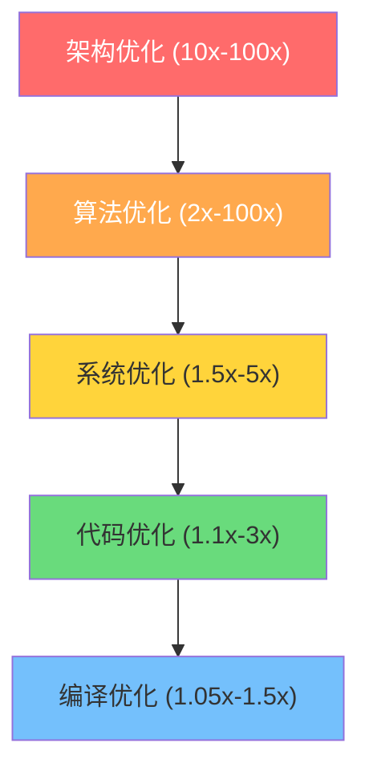
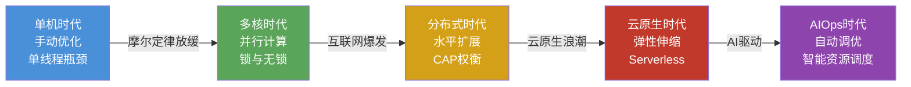
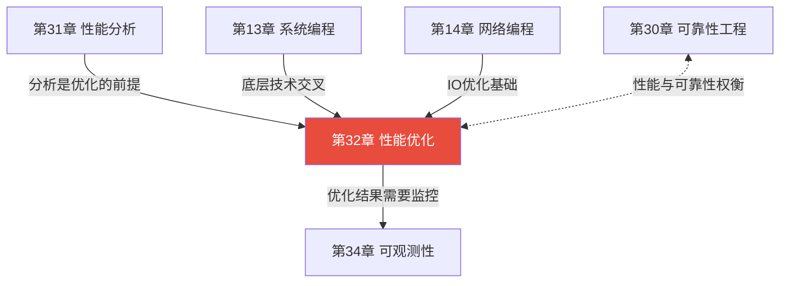
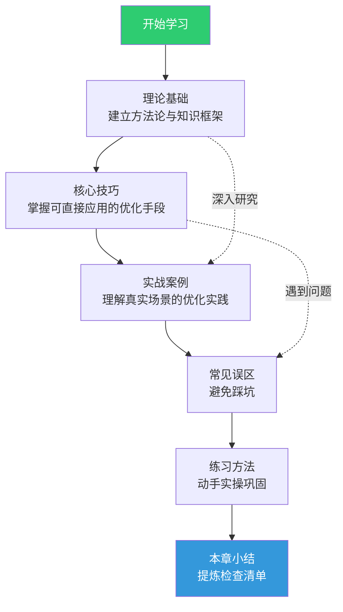

# 第32章 性能优化

## 章节定位

性能优化是将"能跑"的软件变成"跑得好"的软件的关键工程能力。本章位于第31章（性能分析）之后——因为优化必须以测量为前提，没有分析的优化是盲目冒险。同时本章与第30章（可靠性工程）形成核心权衡：性能与可靠性往往此消彼长，工程实践的本质是在两者间找到正确的平衡点。

本章覆盖从底层硬件指令到上层架构设计的全栈优化技术，适用于系统软件工程师、后端开发者、数据库内核开发者、游戏引擎程序员等对性能有硬性要求的场景。

## 为什么性能优化值得专门研究

性能优化不是"让代码跑快一点"的技巧集合，而是一门系统工程：

- **经济价值**：延迟降低10ms可能意味着数百万美元的营收提升。Google研究显示，搜索结果延迟400ms会导致用户量下降0.59%。AWS的数据显示，每100ms的延迟增加导致销售额下降1%。
- **用户体验**：用户对响应时间的容忍阈值——Web页面2秒以内（否则40%用户离开）、移动端5秒以内（否则53%用户放弃）。性能直接决定留存率。
- **资源效率**：优化良好的系统可以用更少的硬件服务更多用户。Facebook通过Memcache优化将单机QPS从数百提升到数十万，直接节省了数万台服务器。
- **工程能力**：性能优化要求工程师同时理解CPU微架构、操作系统调度、编译器行为、网络协议栈——这种全栈理解力是高级工程师的核心竞争力。

## 优化方法论：先测量后优化

Donald Knuth的名言常被断章取义。完整原文是：

> "We should forget about small efficiencies, say about 97% of the time: premature optimization is the root of all evil. Yet we should not pass up our opportunities in that critical 3%."

这不是说不优化，而是说**优化必须基于数据**。正确的优化流程：

**关键原则**：
- **一次只改一个变量**：同时改三个地方，你无法知道哪个改动有效
- **先找瓶颈，再动手术**：USE方法（Utilization/Saturation/Errors）系统性排查资源瓶颈
- **目标要可量化**："提升性能"不是目标，"将P99延迟从200ms降到100ms"才是目标
- **优化有上限**：阿姆达尔定律决定了并行优化的理论天花板——如果串行部分占30%，无论多少核，加速比上限是3.33x

## 优化的五个层次

不同层次的优化，影响量级差异巨大：

| 层次 | 典型手段 | 影响量级 | 适用场景 |
|------|---------|---------|---------|
| 架构优化 | 微服务拆分、异步化、多级缓存、CDN | 10x-100x | 系统级瓶颈，单机无法解决 |
| 算法优化 | 选择O(n log n)替代O(n²)、空间换时间 | 2x-100x | 热点路径的计算密集型代码 |
| 系统优化 | OS参数调优、NUMA绑定、HugePages | 1.5x-5x | IO密集型、内存敏感型场景 |
| 代码优化 | 缓存友好布局、循环展开、SIMD向量化 | 1.1x-3x | 已确认的热点代码路径 |
| 编译优化 | LTO链接时优化、PGO性能引导优化 | 1.05x-1.5x | 追求最后几个百分点的场景 |

**实践建议**：80%的性能收益来自架构和算法层面的优化。先确认瓶颈在哪里，再决定在哪一层投入精力。

## 本章内容导览

### 第一节：理论基础

建立性能优化的完整知识框架：

- **优化方法论**：先测量后优化的科学流程、阿姆达尔定律与Amdahl极限、尼尔森定律（用户体验与响应时间的关系）
- **算法与数据结构优化**：时间复杂度分析、空间换时间策略（预计算、缓存、查找表、倒排索引）、缓存友好的数据结构设计（内存布局优化、数据导向设计）
- **CPU优化**：分支预测友好的代码编写、SIMD向量化（SSE/AVX/NEON）、指令级并行（多累加器、流水线友好代码）、循环展开、软件预取
- **内存优化**：内存池与对象池实现、Slab分配器、Arena分配器、大页内存（HugePages）、内存对齐与缓存行优化
- **IO优化**：批量IO与合并写、异步IO（epoll/io_uring）、Direct IO绕过页缓存、预读策略与readahead调优
- **并发优化**：无锁数据结构（CAS、Lock-Free Queue）、线程池参数调优、协程与纤程、读写锁与RCU
- **编译器与运行时优化**：内联策略、LTO链接时优化、PGO性能引导优化、JIT运行时优化
- **数据库与缓存优化**：索引优化与查询计划分析、多级缓存架构、缓存穿透/击穿/雪崩的防御策略
- **序列化优化**：零拷贝技术、Protocol Buffers与FlatBuffers对比、gRPC与REST性能差异

### 第二节：核心技巧

聚焦可直接应用的优化技巧，按场景分类：

- **热点代码优化**：如何定位热点、profile-guided优化的具体步骤
- **内存分配优化**：减少堆分配、栈分配优先、jemalloc/tcmalloc实战
- **并发编程优化**：锁竞争分析与消除、无锁编程的正确姿势、Go调度器与GMP模型
- **网络IO优化**：连接池调优、TCP参数优化（nodelay/nodelay）、HTTP/2与QUIC

### 第三节：实战案例

来自真实生产环境的优化案例：

- **案例一**：电商大促场景下的高并发优化——从单机3K QPS到分布式百万QPS的架构演进
- **案例二**：分布式存储系统的一致性与性能权衡——Raft协议的性能调优实践
- **案例三**：实时数据处理的低延迟优化——从秒级到毫秒级的流处理架构改造
- **案例四**：数据库查询优化——一条慢SQL从30秒优化到50毫秒的完整过程

### 第四节：常见误区

列出性能优化中最容易踩的坑：

- **误区一**：盲目优化热点之外的代码（违反先测量后优化原则）
- **误区二**：过度使用缓存导致一致性问题（缓存雪崩、穿透、击穿）
- **误区三**：过早的微服务拆分引入分布式事务开销（架构优化的副作用）
- **误区四**：忽视锁竞争的本质，用更复杂的锁替代架构改进
- **误区五**：benchmark脱离真实负载（微基准测试的常见陷阱）

### 第五节：练习方法

从理论到实践的阶梯式练习：

- **入门练习**：使用perf/flamegraph定位Python/Go/C++程序的热点函数
- **进阶练习**：实现一个无锁队列，对比有锁版本在高并发下的性能差异
- **高级练习**：对一个真实的Web服务进行端到端性能优化，从分析到实施到验证

### 第六节：本章小结

总结性能优化的核心要点，提炼可复用的优化检查清单。

## 技术演进脉络

每个时代都催生了新的优化范式：

- **单机时代**：优化集中在算法和数据结构，"写出O(n log n)替代O(n²)"就是性能优化的全部
- **多核时代**：摩尔定律放缓，单核频率触及物理极限，性能提升转向多核并行，锁竞争成为新瓶颈
- **分布式时代**：单机无法承载海量请求，水平扩展成为主流，但引入了一致性、分区容错等新挑战
- **云原生时代**：容器化与编排技术让弹性伸缩成为可能，资源利用率优化（right-sizing）成为新课题
- **AIOps时代**：机器学习驱动的自动性能调优开始落地，如Google的Autopilot自动调整资源配额

## 与其他章节的关系

- **与第31章（性能分析）**：分析是优化的输入。没有分析报告就动手优化，如同没有X光片就做手术。本章假设读者已掌握perf、flamegraph、pprof等分析工具的使用。
- **与第13章（系统编程）**：系统调用、内存管理、进程间通信等底层机制是系统层优化的基础。理解mmap、splice、io_uring等工作原理，才能做出正确的IO优化决策。
- **与第14章（网络编程）**：网络IO优化是后端服务性能优化的高频场景。TCP调优、连接池设计、协议选择（HTTP/1.1 vs HTTP/2 vs gRPC vs QUIC）等知识点在两章中互补。
- **与第30章（可靠性工程）**：性能与可靠性是一对核心权衡。降低超时时间可以提升吞吐量，但可能导致更多请求失败；异步化可以提升响应速度，但增加了消息丢失的风险。好的优化方案必须同时考虑两者。
- **与第34章（可观测性）**：优化后的系统需要持续监控，确保性能改善不是昙花一现。Prometheus指标、分布式追踪、日志分析是验证优化效果的关键手段。

## 关键指标速查

在开始优化之前，你需要明确要优化什么。以下是性能优化中最常用的指标：

| 指标 | 定义 | 目标范围 | 测量工具 |
|------|------|---------|---------|
| 延迟（Latency） | 请求发出到响应返回的时间 | P50 < 50ms, P99 < 200ms | Prometheus Histogram, OpenTelemetry |
| 吞吐量（Throughput） | 单位时间内处理的请求数 | 因业务而异，通常 > 1K QPS | wrk, ab, vegeta |
| 错误率（Error Rate） | 失败请求占总请求的比例 | < 0.1% | 应用日志, Prometheus |
| CPU利用率 | CPU忙碌时间占比 | < 70%（留余量应对突发） | top, mpstat, vmstat |
| 内存使用率 | 已用内存占总内存比例 | < 80%（避免OOM） | free, /proc/meminfo |
| GC暂停时间 | 垃圾回收导致的STW时间 | < 10ms（Java/Go） | jstat, GODEBUG=gctrace=1 |
| IO等待时间 | 等待磁盘IO完成的时间占比 | < 10% | iostat, blktrace |

## 本章学习路径

建议的学习路径：

1. **先读理论基础**：建立正确的优化方法论和全局视野，避免陷入局部优化的陷阱
2. **再学核心技巧**：掌握具体的优化工具和手段，按场景（CPU/内存/IO/并发）分类学习
3. **对照实战案例**：将理论和技巧放到真实场景中理解，学习完整的优化流程
4. **回顾常见误区**：对照自己的经验，看看是否踩过这些坑
5. **动手做练习**：性能优化是实践性极强的技能，只看不练等于没学
