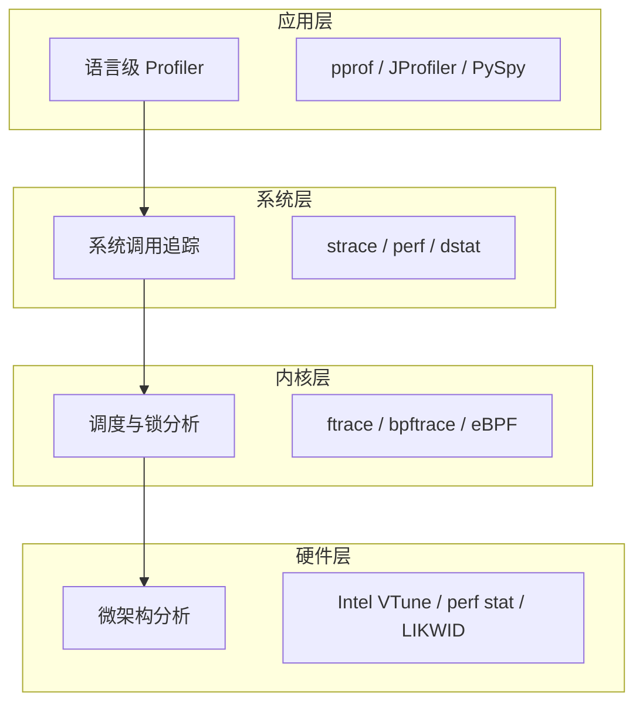
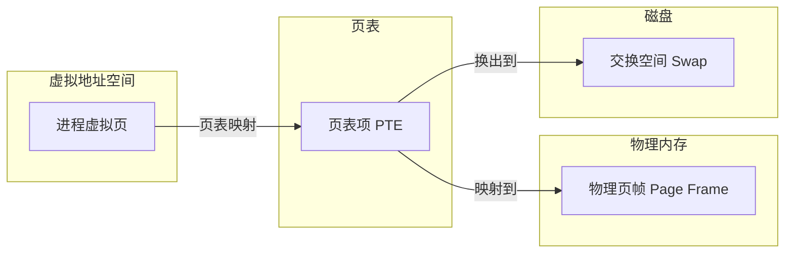
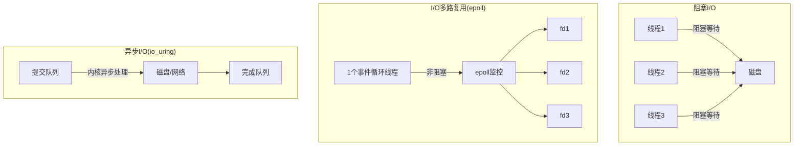
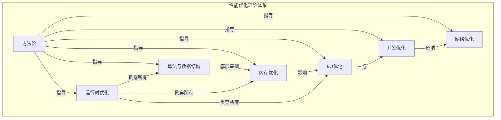

# 第32章-性能优化 — 理论基础

性能优化是软件工程中最具挑战性的领域之一，它要求工程师同时理解硬件特性、操作系统机制、编程语言运行时和应用业务逻辑。本章从性能优化的方法论出发，系统性地讲解算法优化、内存优化、I/O优化、并发优化、网络优化和运行时优化的理论基础。

## 1. 性能优化方法论

### 1.1 核心原则：先测量，后优化

没有数据支撑的优化是盲目的。性能优化必须遵循科学的方法论，而非凭直觉行事。大量工程实践表明，开发者凭直觉判断的"瓶颈"，有超过 70% 的情况并非真正的性能热点。只有通过系统化的测量和分析，才能找到真正的性能瓶颈。

性能优化遵循一个闭环迭代过程：


- **测量（Measure）**：使用 profiling 工具采集真实运行数据，建立性能基线（baseline）。关键指标包括：吞吐量（throughput）、延迟（latency）、资源利用率（utilization）和错误率（error rate）
- **分析（Analyze）**：根据测量数据定位瓶颈，区分 CPU 密集型、内存密集型、I/O 密集型或网络密集型问题。使用火焰图（flame graph）、调用栈分析等手段找到热点路径
- **优化（Optimize）**：针对瓶颈采取具体措施。每次只改一个变量，确保可观测到效果
- **验证（Verify）**：用基准测试（benchmark）确认优化效果，防止回归。同时检查副作用：优化是否影响了代码可读性、可维护性或其他指标

### 1.2 经典性能定律

性能优化有三条基本定律，理解它们能帮助你判断优化的理论上限和正确方向。

**阿姆达尔定律（Amdahl's Law）**

阿姆达尔定律决定了串行系统中并行优化的理论加速上限：

加速比 S = 1 / ((1 - P) + P / N)

P = 可并行化的时间占比
N = 处理器数量

示例: P = 0.8, N = 16
S = 1 / (0.2 + 0.8/16) = 1 / 0.25 = 4x

即使无限增加处理器（N → ∞），加速比也不会超过 1/(1-P) = 5x

核心启示：系统的串行部分决定了并行优化的天花板。当 P = 0.95 时，即使有 1000 个处理器，加速比也仅为 17.8x。因此优化应集中在串行瓶颈（占比最大的部分）上，而非追求局部完美。

**古斯塔夫森定律（Gustafson's Law）**

阿姆达尔定律假设问题规模固定，但现实中我们经常需要处理更大的数据。古斯塔夫森定律从另一个角度描述并行加速：

加速比 S = N - (1 - P) × (N - 1)

含义：当问题规模随处理器数量增长时，
并行加速比可以接近线性增长

实际意义：在大数据处理、科学计算等场景中，更多的处理器意味着能处理更大的问题，而不仅仅是更快地解决同样的问题。

**利特尔定律（Little's Law）**

利特尔定律描述了系统中平均并发请求数、吞吐量和平均响应时间之间的关系：

L = λ × W

L = 系统中的平均请求数（并发数）
λ = 请求到达速率（吞吐量/请求速率）
W = 平均响应时间

实际应用：
- 已知吞吐量和响应时间，可推算出系统承载的并发量
- 已知并发限制和响应时间，可推算出系统最大吞吐量
- 优化响应时间（W）可以直接降低系统并发压力（L）

**排队论基础（Queuing Theory）**

在实际系统中，请求并非瞬间到达并瞬间处理，排队是不可避免的。排队论中的 M/M/1 模型揭示了一个重要规律：

系统利用率 ρ = λ / μ（到达率 / 服务率）

平均等待时间 = ρ / (μ × (1 - ρ))

当 ρ 接近 1 时，等待时间趋向无穷大！

这就是为什么系统在 70% 利用率时表现良好，但到了 90% 就突然变慢——延迟与利用率之间不是线性关系，而是指数级增长。工程上通常建议将系统利用率控制在 70-80% 以下。

### 1.3 性能指标体系

在优化之前，必须建立清晰的性能指标体系。以下是关键指标：

| 指标类别 | 具体指标 | 含义 | 目标方向 |
|----------|----------|------|----------|
| 延迟 | P50（中位数） | 50% 请求的响应时间 | 越低越好 |
| 延迟 | P99（尾延迟） | 99% 请求的响应时间 | 越低越好 |
| 延迟 | P999 | 99.9% 请求的响应时间 | 越低越好 |
| 吞吐量 | QPS/TPS | 每秒处理的请求数/事务数 | 越高越好 |
| 资源利用率 | CPU 利用率 | CPU 工作时间占比 | 70-80% 为宜 |
| 资源利用率 | 内存利用率 | 内存使用量/总量 | 保留 20-30% 余量 |
| 稳定性 | 错误率 | 失败请求/总请求 | 越低越好 |
| 稳定性 | 可用性 | 正常运行时间/总时间 | 99.9%+ (三个九) |

**为什么关注 P99 而不是平均值？** 平均延迟会掩盖长尾问题。假设系统平均每秒处理 1000 个请求，平均延迟 50ms，但 P99 延迟高达 2 秒——这意味着每 100 个请求就有 1 个体验极差。在高并发系统中，长尾延迟直接影响用户体验和服务等级协议（SLA）。

### 1.4 性能分析层次

不同层次的性能问题需要不同的工具和方法：



| 层次 | 工具 | 关注指标 | 适用场景 |
|------|------|----------|----------|
| 应用层 | pprof, JProfiler, PySpy, perfume.js | CPU时间, 内存分配, 调用栈, GC暂停 | 业务代码热点定位 |
| 系统层 | perf, strace, dstat, vmstat | 系统调用次数, 上下文切换, 中断频率 | I/O瓶颈, 调度问题 |
| 内核层 | ftrace, bpftrace, eBPF, /proc | 调度延迟, 锁竞争, 页面错误, 网络栈延迟 | 内核行为, 驱动问题 |
| 硬件层 | Intel VTune, perf stat, LIKWID, perf bench | 缓存命中率, 分支预测率, 指令流水线, NUMA访问 | 微架构优化 |

**性能分析的 60 秒速查清单**（Brendan Gregg 提出的 Linux 性能分析方法论）：

1. ** uptime **：查看负载趋势（1分钟/5分钟/15分钟平均值）
2. ** dmesg -T | tail **：检查内核消息（OOM kill、硬件错误）
3. ** vmstat 1 **：查看整体 CPU、内存、I/O 状态
4. ** mpstat -P ALL 1 **：查看各 CPU 核心的使用率（检测负载不均）
5. ** pidstat 1 **：查看各进程的 CPU 使用率
6. ** iostat -xz 1 **：查看磁盘 I/O 详情（await、%util）
7. ** free -h **：查看内存使用情况
8. ** sar -n DEV 1 **：查看网络吞吐量
9. ** sar -n TCP,ETCP 1 **：查看 TCP 连接统计
10. ** top **：汇总查看资源消耗最高的进程

## 2. 算法与数据结构优化

算法复杂度是性能优化的天花板。选择正确的算法和数据结构往往比任何微优化都更有效——从 O(n²) 改为 O(n log n) 带来的收益，远超对 O(n²) 代码的任何手写汇编优化。

### 2.1 复杂度对比

| 操作 | 数组 | 链表 | 哈希表 | 平衡树(BST) | B+树 |
|------|------|------|--------|------------|------|
| 随机查找 | O(n) | O(n) | O(1)平均/O(n)最坏 | O(log n) | O(log n) |
| 顺序查找 | O(log n)* | O(n) | O(n) | O(log n) | O(log n) |
| 插入 | O(n) | O(1) | O(1)平均/O(n)最坏 | O(log n) | O(log n) |
| 删除 | O(n) | O(1) | O(1)平均/O(n)最坏 | O(log n) | O(log n) |
| 内存开销 | 低 | 中（指针） | 高（桶+链表） | 中 | 低（磁盘友好） |
| 缓存友好 | 极好 | 差 | 好 | 中等 | 极好 |

*注：数组顺序查找需先排序，使用二分查找

**关键认知**：哈希表的 O(1) 是平均情况，在极端哈希冲突下会退化为 O(n)。在对延迟敏感的场景中（如交易系统），平衡树的 O(log n) 最坏情况保证反而更可靠。

### 2.2 缓存友好的数据结构

CPU 缓存对性能的影响远超大多数人的直觉。现代 CPU 访问 L1 缓存需要约 1ns，L2 约 3ns，L3 约 10ns，而访问主内存需要约 100ns——差距达 100 倍。

```go
// 反面示例: 链表遍历（缓存不友好）
// 每个节点散落在堆的不同位置，每次 next 跳转都可能触发缓存未命中
type Node struct {
    value int
    next  *Node  // 指针跳转 → 预取器无法预测 → 缓存未命中
}

// 正面示例: 切片遍历（缓存友好）
// 连续内存布局，CPU预取器可以批量加载缓存行
type Slice struct {
    data []int  // 连续内存 → 硬件预取生效 → 缓存命中率极高
}

// 实测性能差异: 遍历100万元素时，切片比链表快 10-100 倍
```

**SoA vs AoS 布局**（Structure of Arrays vs Array of Structures）：

```go
// AoS: 传统布局 — 适合单个对象的完整访问
type ParticleAoS struct {
    particles [N]struct {
        x, y, z float64
        r, g, b float64
    }
}

// SoA: 分离布局 — 适合批量处理单一属性
type ParticleSoA struct {
    x [N]float64  // 连续的 x 坐标
    y [N]float64  // 连续的 y 坐标
    z [N]float64  // 连续的 z 坐标
    r [N]float64
    g [N]float64
    b [N]float64
}

// 如果只需要批量更新 x 坐标，SoA 的缓存命中率远高于 AoS
// 因为 SoA 中每次缓存行加载都是有用的 x 数据
// 而 AoS 中每次缓存行加载都包含大量不需要的 y/z/r/g/b 数据
```

### 2.3 缓存行（Cache Line）与伪共享

现代 CPU 缓存行大小通常为 64 字节。当多个 CPU 核心同时修改同一缓存行上的不同变量时，会发生伪共享（False Sharing），导致性能急剧下降：

```go
// 伪共享问题示例
type BadCounter struct {
    countA int64  // 8字节
    countB int64  // 8字节  ← 两个字段在同一个 64 字节缓存行中
}

// 当 Core 0 修改 countA，Core 1 修改 countB 时：
// 尽管它们修改的是不同变量，但因为共享同一个缓存行，
// 缓存一致性协议(MESI)会导致两个核心不断互相失效对方的缓存
// 性能可能下降 10 倍以上

// 修复方案1: 缓存行填充（Cache Line Padding）
type GoodCounter struct {
    countA int64
    _      [56]byte  // 填充 56 字节，确保 countB 在下一个缓存行
    countB int64
}

// 修复方案2: Go 1.19+ 使用 atomic.Int64 配合 align
// 修复方案3: 将频繁修改的字段分配到不同的结构体中
```

### 2.4 常见优化技巧

| 技巧 | 原理 | 适用场景 | 注意事项 |
|------|------|----------|----------|
| 空间换时间 | 预计算/查表/缓存避免重复计算 | 重复计算密集、读多写少 | 注意内存开销和缓存失效 |
| 惰性计算 | 延迟到真正需要时才计算 | 计算昂贵但可能不需要 | 注意生命周期管理 |
| 批量处理 | 减少单位操作的固定开销 | 循环中的重复操作 | 合理选择批次大小 |
| 索引加速 | 预建索引加速查找 | 频繁查找/查询 | 写入时维护索引有开销 |
| SIMD向量化 | 单指令处理多个数据 | 数值计算、图像处理 | 需要数据对齐 |
| 零拷贝 | 避免不必要的数据复制 | 大数据传输、流处理 | 增加接口复杂度 |

## 3. 内存优化

内存管理是性能优化的核心战场，涉及内存分配策略、垃圾回收调优、内存布局优化等多个方面。

### 3.1 内存分配器原理

理解内存分配器的工作原理，才能有效减少分配开销：

```go
// Go语言内存分配器（基于TCMalloc思想的分层设计）
//
// 分配层级：
// ┌─────────────┐
// │   mcache     │  ← per-P 本地缓存，无锁快速分配
// │  (每个P一个)  │     小对象(0-32KB)直接从此分配
// └──────┬──────┘
//        │ 缓存不足时
// ┌──────▼──────┐
// │   mcentral   │  ← per-size-class 中心缓存，需要锁
// │  (按大小分类) │     从 mheap 批量补充到 mcache
// └──────┬──────┘
//        │ 批量不足时
// ┌──────▼──────┐
// │    mheap     │  ← 全局堆，管理大块内存
// │  (全局唯一)   │     大对象(>32KB)直接从这里分配
// └─────────────┘

// 微对象(≤16B)的特殊处理：
// 被合并到固定的内存块中，多个微对象共享一次分配
// 这大幅减少了微小对象的分配和GC压力
```

**不同语言的内存分配器对比**：

| 语言/运行时 | 分配器 | 特点 |
|------------|--------|------|
| Go | mcache+mcentral+mheap (TCMalloc变体) | per-P缓存，减少锁竞争 |
| Java (JVM) | TLAB + G1/ZGC | 线程本地分配缓冲区 |
| Rust | jemalloc / system allocator | 零成本抽象，可切换分配器 |
| C/C++ | glibc malloc / jemalloc / mimalloc | 取决于链接的分配器库 |
| Python | pymalloc + 系统 malloc | 小对象专用池化分配器 |

### 3.2 减少内存分配的策略

```go
// 策略1: 对象池（sync.Pool）
// 适用场景：频繁创建和销毁的临时对象（如 buffer、临时结构体）
var bufferPool = sync.Pool{
    New: func() interface{} { return make([]byte, 4096) },
}

func processRequest() {
    buf := bufferPool.Get().([]byte)
    defer bufferPool.Put(buf)
    // 使用 buf...
    // 注意：Pool中的对象可能在GC时被回收，不要假设持久性
}

// 策略2: 预分配
// 反面: 循环中反复扩容，每次扩容都分配新内存并复制
for i := 0; i < n; i++ {
    slice = append(slice, data)  // 可能触发多次扩容（1→2→4→8→...→n）
}

// 正面: 预分配足够容量，一次分配到位
slice := make([]Type, 0, n)
for i := 0; i < n; i++ {
    slice = append(slice, data)  // 不会扩容，零额外分配
}

// 策略3: 结构体内联 vs 指针
// 反面: 多个指针字段 → 每个字段一次堆分配
type Point struct { x, y *float64 }  // 3次分配：结构体 + x + y

// 正面: 值类型字段 → 零额外分配，连续内存布局
type Point struct { x, y float64 }   // 1次分配：结构体本身

// 策略4: 字符串与 []byte 转换避免拷贝（Go 1.22+）
// 利用 unsafe 零拷贝转换（谨慎使用，需确保生命周期正确）
func stringToBytes(s string) []byte {
    return unsafe.Slice(unsafe.StringData(s), len(s))
}
```

### 3.3 内存对齐与填充

结构体的字段排列顺序影响内存占用和访问速度：

```go
// 反面: 字段排列导致大量填充
type BadLayout struct {
    a bool     // 1字节 + 7字节填充（对齐到8）
    b int64    // 8字节
    c bool     // 1字节 + 7字节填充（对齐到8）
    d int32    // 4字节 + 4字节填充（对齐到8）
}
// 总大小: 32字节（实际有效数据仅14字节，利用率44%）

// 正面: 按大小降序排列
type GoodLayout struct {
    b int64    // 8字节
    d int32    // 4字节
    a bool     // 1字节
    c bool     // 1字节 + 2字节填充（对齐到4）
}
// 总大小: 16字节（利用率87%）
```

**实际影响**：在需要存储百万级对象的场景中，良好的字段排列可节省数 MB 内存，并因更好的缓存利用率提升访问速度 20-40%。

### 3.4 虚拟内存与页面管理

理解操作系统的虚拟内存机制对内存优化至关重要：



关键概念：
- **页面大小**：Linux 默认 4KB，大页（Huge Page）支持 2MB 和 1GB，减少 TLB miss
- **页面错误**：分为缺页中断（页面不在内存）和保护错误（权限不足）
- **NUMA 架构**：多路服务器中，每个 CPU 有本地内存和远程内存，访问本地内存延迟约为远程的一半
- **Swapping**：当物理内存不足时，操作系统将不活跃的页面换出到磁盘，导致性能断崖式下降

**大页内存优化**：对于内存密集型应用（如数据库、JVM），启用大页可以显著减少 TLB miss：

```bash
# 查看系统大页配置
cat /proc/meminfo | grep Huge

# 配置 2MB 大页数量（为应用预留）
echo 1024 > /proc/sys/vm/nr_hugepages

# Go应用使用大页（需要操作系统支持）
# JVM: -XX:+UseLargePages
```

### 3.5 内存泄漏检测

常见内存泄漏场景及检测方法：

| 泄漏类型 | 原因 | 检测工具 | 修复方法 |
|----------|------|----------|----------|
| 全局缓存无限增长 | 缓存没有过期/淘汰机制 | heap profile, Prometheus监控 | 添加TTL、LRU淘汰、大小限制 |
| goroutine泄漏 | 未正确退出的goroutine | runtime.NumGoroutine(), pprof goroutine profile | 确保所有goroutine有退出路径 |
| slice底层数组引用 | 切片引用了大数组的一部分 | heap dump分析 | 复制需要的部分，断开引用 |
| finalizer不当使用 | finalizer持有引用阻止GC | runtime.NumFinalizer()监控 | 避免在finalizer中持有引用 |
| 闭包捕获大对象 | 闭包捕获了不需要的大变量 | 代码审查 + heap profile | 在闭包中只捕获需要的字段 |

```go
// 反面: slice引用导致内存泄漏
// 即使函数返回后不再使用data，但因为返回的字节引用了data的底层数组
// 整个底层数组（可能几百MB）都无法被GC回收
func getFirstElement(data []byte) byte {
    return data[0]  // 编译器可能优化，但如果返回后持有引用就会泄漏
}

// 正面: 显式复制，断开对原数组的引用
func getFirstElement(data []byte) byte {
    result := make([]byte, 1)
    copy(result, data[:1])
    return result[0]
}

// 正面2: 如果只需要检查而不返回，直接操作即可
func hasData(data []byte) bool {
    return len(data) > 0 &amp;&amp; data[0] != 0
}
```

## 4. I/O 优化

I/O 通常是系统最大的性能瓶颈——磁盘 I/O 延迟比内存访问慢 5-6 个数量级，网络 I/O 延迟比内存访问慢 3-4 个数量级。优化 I/O 是提升整体性能的关键。

### 4.1 I/O 模型对比



| 模型 | 线程开销 | 编程复杂度 | 上下文切换 | 吞吐量 | 适用场景 |
|------|----------|------------|-----------|--------|----------|
| 阻塞I/O | 高（每连接一线程） | 低 | 高 | 低 | 连接数少、逻辑简单 |
| 非阻塞I/O+轮询 | 中 | 高 | 中 | 中 | 短连接、简单协议 |
| I/O多路复用 | 低 | 中 | 低 | 高 | 高并发连接（epoll/kqueue） |
| 信号驱动I/O | 低 | 高 | 低 | 中 | 异步通知场景 |
| 异步I/O | 最低 | 高 | 最低 | 最高 | 高吞吐量（io_uring/AIO） |

### 4.2 批量 I/O 与缓冲

```python
# 反面: 逐条写入（N次系统调用，每次都有上下文切换开销）
for record in records:  # 假设1万条记录 = 1万次syscall
    db.execute("INSERT INTO t VALUES (?)", record)

# 正面: 批量写入（1次系统调用，减少上下文切换）
db.executemany("INSERT INTO t VALUES (?)", records)  # 1次syscall

# 正面: 使用COPY命令（PostgreSQL原生批量导入，绕过SQL解析）
# 比 executemany 快 5-10 倍，因为跳过了SQL解析和单行处理逻辑
with db.cursor() as cur:
    cur.copy_from(StringIO(csv_data), 't', sep=',')

# 正面: 使用事务包裹批量操作
# 没有显式事务时，每条INSERT都隐式开启/提交事务 = 额外的 fsync 开销
with db.transaction():
    db.executemany("INSERT INTO t VALUES (?)", records)
```

**缓冲策略对比**：

| 策略 | 原理 | 优点 | 缺点 |
|------|------|------|------|
| 无缓冲 | 每次操作直接写入 | 实时性好 | 系统调用开销大 |
| 定长缓冲 | 累积到固定大小后写入 | 简单可控 | 可能等待填满，尾延迟高 |
| 定时缓冲 | 固定时间间隔批量写入 | 延迟可预测 | 可能写入空数据 |
| 背压缓冲 | 下游处理不过来时暂停写入 | 自适应流量 | 实现复杂 |

### 4.3 预读与写合并

```c
// Linux 预读机制
// 内核检测到顺序读模式时，自动预读后续数据到 Page Cache
// 默认预读窗口从 128KB 起步，最大可达 256KB

// 显式预读提示：告诉内核即将进行顺序读取
posix_fadvise(fd, 0, file_size, POSIX_FADV_SEQUENTIAL);

// 随机读取提示：禁用预读，节省 I/O 带宽
posix_fadvise(fd, 0, file_size, POSIX_FADV_RANDOM);

// 不再需要提示内核缓存（如大文件一次性读取）
posix_fadvise(fd, 0, file_size, POSIX_FADV_DONTNEED);

// 直接I/O（绕过 Page Cache）
// 适用于：大文件顺序读（如数据库）、缓存已由应用自行管理的场景
// 不适用于：小文件、随机读（会丧失 Page Cache 加速）
int fd = open("data.bin", O_RDONLY | O_DIRECT);
// 注意：直接 I/O 要求缓冲区和读取大小按文件系统块大小对齐（通常 512 字节或 4KB）
```

### 4.4 异步 I/O 与 io_uring

io_uring 是 Linux 5.1（2019）引入的高性能异步 I/O 框架，解决了传统 AIO 的诸多限制：

```c
// io_uring 基本流程
// 两个共享内存队列：提交队列(SQ)和完成队列(CQ)
// 用户空间写入 SQ，内核从 SQ 消费请求
// 内核将结果写入 CQ，用户空间从 CQ 读取结果
// 通过 mmap 实现零拷贝的队列通信

struct io_uring ring;
io_uring_queue_init(256, &amp;ring, 0);  // 队列深度 256

// 1. 提交异步读请求到提交队列
struct io_uring_sqe *sqe = io_uring_get_sqe(&amp;ring);
io_uring_prep_read(sqe, fd, buf, buf_len, offset);
sqe->user_data = (uint64_t)request_id;  // 关联请求标识
io_uring_submit(&amp;ring);

// 2. 从完成队列获取结果（支持批量获取）
struct io_uring_cqe *cqe;
io_uring_wait_cqe(&amp;ring, &amp;cqe);
int result = cqe->res;  // 实际读取的字节数，负值为错误码
uint64_t id = cqe->user_data;  // 关联的请求标识
io_uring_cqe_seen(&amp;ring, cqe);

// 3. 支持的操作类型
// - 文件读写（支持向量化 scatter/gather I/O）
// - 网络收发（支持 accept/connect/send/recv）
// - 文件注册（注册文件描述符避免重复 open/close）
// - 定时器（timeout 操作）
// - 内存缓冲区注册（避免每次 I/O 都 pin 内存）
```

**io_uring 相比传统 epoll 的优势**：
- 减少用户态和内核态之间的系统调用次数（通过批量提交/完成）
- 支持文件和网络的统一异步接口
- 通过共享内存实现零拷贝的请求/响应传递
- 支持链式操作（一个完成触发下一个提交）

## 5. 并发优化

并发编程的目标是在正确性的前提下最大化系统吞吐量。并发优化的核心挑战是：如何在减少锁竞争的同时保证数据一致性。

### 5.1 锁优化策略

```go
// 策略1: 减小锁粒度 — 从大锁到分段锁
// 反面: 大锁保护所有操作 — 任何操作都阻塞所有其他操作
type Cache struct {
    mu    sync.Mutex
    items map[string]*Item
    stats Stats  // 统计信息也用同一把锁，不必要的竞争
}

// 正面: 分段锁（Sharded Lock）— 将全局锁拆分为 N 个子锁
type ShardedCache struct {
    shards [256]struct {
        mu    sync.RWMutex  // 读写锁，读多写少时更优
        items map[string]*Item
    }
}

func (c *ShardedCache) getShard(key string) *shard {
    // 使用哈希将 key 映射到固定的分片
    h := fnv.New32a()
    h.Write([]byte(key))
    return &amp;c.shards[h.Sum32()%256]
}

// 策略2: 读写锁分离
// RWMutex 在读多写少场景中显著优于 Mutex
// 原理：多个读者可以并发持有读锁，只有写者需要互斥
var rwMu sync.RWMutex
rwMu.RLock()    // 读锁（可多个 goroutine 并发持有）
// ... 读操作 ...
rwMu.RUnlock()
rwMu.Lock()     // 写锁（独占，等待所有读锁释放）
// ... 写操作 ...
rwMu.Unlock()

// 策略3: 原子操作替代锁
// 对于简单的计数器、标志位等操作，atomic 包比 Mutex 快 10 倍以上
var counter int64
atomic.AddInt64(&amp;counter, 1)  // 原子加法，无锁 CAS 操作
atomic.LoadInt64(&amp;counter)    // 原子读取
atomic.CompareAndSwapInt64(&amp;counter, old, new)  // CAS 操作

// 策略4: 无锁数据结构
// 使用 CAS 操作实现无锁的栈、队列、哈希表等
// 适用于高竞争场景，但实现复杂，需要仔细处理 ABA 问题
```

### 5.2 锁的性能特性

```go
// 不同锁类型的性能对比（典型场景）
// 场景：100 个 goroutine 并发读写

// Mutex: 所有操作互斥，简单但竞争大
// 读写混合时性能中等

// RWMutex: 读操作并发，写操作互斥
// 读多写少（>90%读）时比 Mutex 快 2-5 倍
// 读写各半时反而比 Mutex 慢（因为 RWMutex 本身开销更大）

// sync.Map: 内部使用 read-only map + dirty map 的双缓冲结构
// 适合：key 稳定的场景（一次写入，多次读取）
// 不适合：频繁写入的场景

// atomic: 最快，但只适用于简单的原子操作
// 不能用于复杂的复合操作
```

| 锁类型 | 读并发 | 写并发 | 适用场景 | 注意事项 |
|--------|--------|--------|----------|----------|
| sync.Mutex | 互斥 | 互斥 | 通用 | 简单可靠 |
| sync.RWMutex | 并发 | 互斥 | 读多写少 | 写饥饿问题 |
| sync.Map | 并发 | 序列化 | 读多写少/稳定的key | 不适合频繁写入 |
| atomic | 并发 | CAS | 简单计数器/标志位 | 只能操作单个变量 |
| 分段锁 | 并发(分段内互斥) | 并发(分段内互斥) | 高竞争map | 分段数需权衡 |

### 5.3 并发模型选择

| 模型 | 核心思想 | 适用场景 | 代表技术 | 优势 | 劣势 |
|------|----------|----------|----------|------|------|
| 线程池 | 固定数量线程处理任务队列 | CPU密集型、任务可拆分 | Go goroutine, Java ThreadPool | 实现简单，资源可控 | 线程上下文切换有开销 |
| 事件驱动 | 单线程事件循环 | I/O密集型、高连接数 | Node.js, Nginx, asyncio | 无锁、低开销 | 不能利用多核、回调地狱 |
| Actor模型 | 每个Actor独立状态+消息传递 | 大规模并发、容错 | Akka, Erlang/OTP, Ray | 天然隔离、分布式友好 | 消息传递有延迟 |
| CSP | 通过通道通信 | 结构化并发 | Go channel, Kotlin Flow | 编译时安全检查 | 通道缓冲需合理设置 |
| 数据并行 | 分割数据到多个处理器 | 批量计算、数值模拟 | SIMD, MapReduce, rayon | 吞吐量高 | 通信开销需控制 |

### 5.4 协作式取消与超时

```go
// Go 中通过 context 实现优雅取消和超时控制
func handleRequest(ctx context.Context) error {
    ctx, cancel := context.WithTimeout(ctx, 5*time.Second)
    defer cancel()

    // 使用 select 实现协作式取消
    select {
    case result := <-doWork(ctx):
        return processResult(result)
    case <-ctx.Done():
        return ctx.Err()  // 返回 deadline exceeded 或 canceled 错误
    }
}

// 常见错误：忽略 context 取消
func badWork(ctx context.Context) {
    // ❌ 这个循环可能永远不会退出，即使 context 已取消
    for {
        result := expensiveComputation()
        select {
        case ch <- result:
        default:
        }
    }
}

// 正确做法：始终检查 context
func goodWork(ctx context.Context, ch chan<- Result) {
    for {
        // 每次循环都检查取消信号
        select {
        case <-ctx.Done():
            return
        default:
        }
        result := expensiveComputation()
        select {
        case ch <- result:
        case <-ctx.Done():
            return
        }
    }
}
```

## 6. 网络优化

网络延迟是分布式系统中最难优化的部分——光速限制了信号传输的物理下限，跨大洲的往返延迟通常在 100-300ms。

### 6.1 TCP 优化

```bash
# TCP 连接建立的延迟优化
# 1. TCP Fast Open (TFO) — 允许在 SYN 包中携带数据，节省一个 RTT
sysctl -w net.ipv4.tcp_fastopen=3

# 2. 连接复用 — 避免频繁建立/销毁连接
# HTTP Keep-Alive、连接池

# 3. TCP 窗口调优
# 增大接收窗口，提高带宽利用率（高延迟网络尤为重要）
sysctl -w net.ipv4.tcp_rmem="4096 87380 16777216"
sysctl -w net.ipv4.tcp_wmem="4096 65536 16777216"

# 4. 启用拥塞控制算法 BBR（Google开发，适合高延迟高带宽网络）
sysctl -w net.ipv4.tcp_congestion_control=bbr
```

### 6.2 连接优化

```python
# 反面: 每次请求建立新连接
# TCP三次握手 = 1个RTT，TLS握手 = 1-2个RTT
# 对于100ms延迟的跨洋连接，新建连接至少200ms开销
for request in requests:
    conn = create_connection(host, port)  # 每次都三次握手
    conn.send(request)
    conn.close()  # 还需要四次挥手

# 正面: 连接池复用
pool = ConnectionPool(host, port, max_size=100, idle_timeout=30)
for request in requests:
    conn = pool.get()  # 复用已有连接，零握手开销
    conn.send(request)
    pool.put(conn)  # 归还到池中
```

### 6.3 协议优化

| 协议 | 传输效率 | 特点 | 适用场景 |
|------|----------|------|----------|
| HTTP/1.1 | 低 | 队头阻塞，头部冗余 | 简单API、兼容性要求高 |
| HTTP/2 | 高 | 多路复用、头部压缩、服务端推送 | Web应用、微服务 |
| gRPC | 高 | 基于HTTP/2的RPC，protobuf序列化 | 微服务内部通信 |
| WebSocket | 中 | 全双工，持久连接 | 实时通信、推送 |
| QUIC/HTTP/3 | 最高 | UDP基础上实现可靠传输，0-RTT建连 | 移动端、高延迟网络 |

**Protocol Buffers vs JSON 性能对比**：

| 指标 | JSON | Protocol Buffers | 差异 |
|------|------|------------------|------|
| 序列化大小 | 基准 | 小3-10倍 | 显著减少网络传输 |
| 序列化速度 | 基准 | 快2-6倍 | 减少CPU开销 |
| 反序列化速度 | 基准 | 快2-5倍 | 减少CPU开销 |
| 人类可读 | 是 | 否 | 调试时不便 |
| Schema演进 | 灵活 | 需要兼容性规则 | 需要规划 |

### 6.4 数据传输优化

```python
# 优化1: 只传输需要的字段（减少序列化/反序列化和网络传输量）
# 反面: 传输完整记录（假设每条记录20个字段，每个100字节 = 2000字节）
response = {"status": "ok", "data": full_record_with_all_fields}

# 正面: 字段投影（只传输3个字段 = 300字节，减少85%传输量）
response = {"status": "ok", "data": {k: record[k] for k in requested_fields}}

# 优化2: 分页（控制单次响应大小）
response = {"data": records[offset:offset+limit], "total": len(records)}

# 优化3: 压缩（根据数据特征选择压缩算法）
# gzip: 通用压缩，压缩比中等，CPU开销低
# brotli: Web内容压缩，压缩比高，CPU开销中等
# zstd: 通用压缩，压缩比和速度的最佳平衡
# lz4: 极速压缩，压缩比低，适合实时场景

# 优化4: 增量传输（避免全量同步）
# 使用 ETag/If-None-Match 实现条件请求
# 使用 timestamp/version 实现增量拉取
```

## 7. 运行时优化

### 7.1 编译器优化

编译器在编译阶段可以自动进行多种优化，了解这些优化有助于编写"编译器友好"的代码：

| 优化技术 | 原理 | 效果 | 编写建议 |
|----------|------|------|----------|
| 内联展开 | 将小函数体直接嵌入调用处 | 消除函数调用开销 | 保持函数短小（<10行） |
| 循环展开 | 减少循环控制开销，提高指令级并行 | 减少分支预测失败 | 循环体尽量简单 |
| 循环不变量外提 | 将不变的计算移到循环外 | 减少重复计算 | 将不变量赋值放到循环前 |
| 死代码消除 | 移除永远不会执行的代码 | 减少代码体积 | 不要害怕写清晰的条件判断 |
| 常量折叠 | 编译时计算常量表达式 | 运行时零开销 | 使用 const/constexpr |
| 向量化(SIMD) | 一条指令处理多个数据 | 吞吐量提升4-16倍 | 数据连续、对齐 |
| 尾调用优化 | 复用当前栈帧 | 避免栈溢出 | 递归函数的最后一步调用自身 |

### 7.2 JVM 运行时优化

```bash
# JVM GC 选择策略
# G1GC（默认，JDK 9+）：平衡延迟和吞吐量
-XX:+UseGGC -XX:MaxGCPauseMillis=200

# ZGC（JDK 15+）：超低延迟（<10ms暂停），适合延迟敏感应用
-XX:+UseZGC

# Shenandoah（JDK 12+）：并发压缩GC，类似ZGC
-XX:+UseShenandoahGC

# 关键 JVM 参数
-Xmx4g              # 最大堆内存
-Xms4g              # 初始堆内存（设为相同避免扩容开销）
-XX:MaxMetaspaceSize=256m  # 元空间限制
-XX:+HeapDumpOnOutOfMemoryError  # OOM时自动dump
-XX:HeapDumpPath=/tmp/heapdump.hprof
```

### 7.3 Go 运行时优化

```go
// 编译器指令控制
//go:noinline  // 禁止内联（通常用于 benchmark，避免编译器过度优化导致测量不准）
//go:nosplit   // 禁止栈增长检查（极度性能敏感的底层代码使用）
//go:linkname  // 访问runtime内部函数（危险操作，版本升级可能不兼容）
//go:noescape  // 告诉编译器参数不会逃逸到堆上（减少堆分配）

// GC 调优
// GOGC: 控制 GC 触发频率
// 默认值 100 表示：当堆增长到上次GC后存活量的 2 倍时触发GC
// 设为 200：堆增长到 3 倍时触发（减少GC频率，增加内存使用）
// 设为 50：堆增长到 1.5 倍时触发（增加GC频率，减少内存使用）
// GOGC=off：完全禁用GC（仅适用于明确知道内存模式的场景）

// GOMEMLIMIT（Go 1.19+）：软内存上限
// 当内存接近限制时，GC 会更积极地回收
// 配合 GOGC=off 使用：由内存限制而非堆增长比例触发GC
GOGC=off GOMEMLIMIT=1GiB

// GOMAXPROCS: 设置同时执行 goroutine 的操作系统线程数
// 默认等于 CPU 核心数，通常不需要修改
runtime.GOMAXPROCS(8)
```

### 7.4 Profile-Guided Optimization (PGO)

PGO 是一种利用运行时行为数据指导编译器优化的技术：

```bash
# Go PGO 工作流（Go 1.21+ 原生支持）

# 步骤1: 在生产环境或模拟环境中收集 CPU profile
go test -cpuprofile=cpu.prof -memprofile=mem.prof .
# 或者从运行中的服务采集
curl -o cpu.prof http://localhost:6060/debug/pprof/profile?seconds=30

# 步骤2: 将 profile 放到项目根目录
cp cpu.prof ./default.pgo  # Go 1.21+ 自动查找此文件名

# 步骤3: 使用 profile 重新编译
go build -o optimized_binary .
# Go 1.21+ 自动检测并使用 default.pgo

# 步骤4: 验证优化效果
benchstat old.txt new.txt  # 对比基准测试结果

# PGO 可以实现 2-15% 的性能提升，具体取决于应用特征
# 主要优化内容：
# - 热点函数内联（编译器对热点函数更积极地内联）
# - 分支预测优化（根据实际执行频率优化分支布局）
# - 接口调用去虚拟化（如果接口通常只有单个实现，直接调用具体方法）
# - 冷路径代码分离（将不常执行的代码移到单独的内存页，提高指令缓存命中率）
```

### 7.5 Benchmark 驱动优化

```go
// Go 基准测试框架：编写规范的 benchmark
func BenchmarkFunction(b *testing.B) {
    // Setup: 准备测试数据（不计入benchmark时间）
    data := setupTestData()

    // ResetTimer: 重置计时器，排除setup时间
    b.ResetTimer()

    // Run parallel benchmark
    b.RunParallel(func(pb *testing.PB) {
        for pb.Next() {
            Function(data)  // 被测量的函数
        }
    })
}

// 运行 benchmark
// go test -bench=. -benchmem -count=5 -cpuprofile=cpu.prof
// -benchmem: 显示内存分配统计
// -count=5: 运行5次取平均值，减少随机误差

// 分析结果
// go tool pprof cpu.prof    # 查看 CPU profile
// go tool pprof mem.prof    # 查看内存 profile
// go tool pprof -http=:8080 cpu.prof  # Web界面查看火焰图
```

## 本节小结



性能优化的理论基础涵盖了从算法选择到硬件特性的完整知识体系。核心原则：

1. **先测量后优化**：用数据驱动决策，不要凭直觉猜测瓶颈
2. **理解优化上限**：阿姆达尔定律决定并行加速上限，排队论决定延迟特性
3. **优先消除最大瓶颈**：80/20法则——80%的性能问题来自20%的代码
4. **选择正确的抽象层次**：算法选择 > 架构设计 > 代码优化 > 微优化
5. **理解底层原理**：CPU缓存、内存布局、I/O模型、操作系统调度——这些决定了微优化的天花板

记住 Donald Knuth 的名言："过早优化是万恶之源"——但合理的架构设计和算法选择不在此列。真正的智慧在于知道何时优化、优化什么、以及优化到什么程度。
