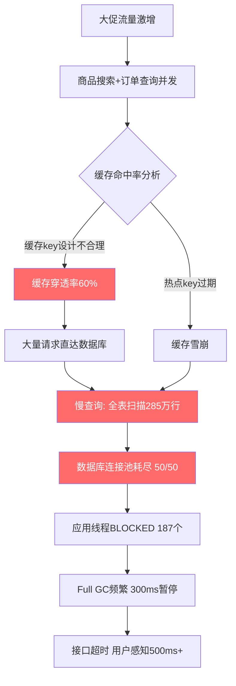

## 实战案例

性能优化不是纸上谈兵——理论学得再多，不落地到真实场景中就无法形成肌肉记忆。本章通过四个不同技术栈、不同业务形态的真实案例，完整还原"发现问题→分析根因→制定方案→实施验证→沉淀经验"的全过程。每个案例都保留了排查时的原始命令和关键输出，确保读者能照着做一遍。

---

### 案例一：电商平台大促场景——数据库瓶颈与缓存穿透

#### 1.1 问题背景

**业务场景：** 某中型电商平台在双11预热期间（峰值QPS约8000），订单详情接口和商品搜索接口同时出现大面积超时。系统部署在阿里云ECS上，采用Spring Cloud + MySQL 5.7 + Redis的经典架构。

**问题现象：**

| 指标 | 日常值 | 大促期间值 | 恶化幅度 |
|------|--------|-----------|---------|
| 接口P99延迟 | 50ms | 500ms+ | 10倍 |
| 错误率 | 0.01% | 5.2% | 500倍 |
| CPU使用率 | 35% | 95%+ | 2.7倍 |
| 数据库连接数 | 20/50 | 50/50(耗尽) | 100%饱和 |
| 内存使用率 | 45% | 85% | 1.9倍 |

**影响范围：** 约100万用户受影响，持续约30分钟，预估直接业务损失数十万元。

#### 1.2 排查过程

##### 第一步：系统层快速摸底

首先排除操作系统层面的资源瓶颈：

```bash
# 系统负载——load average 远超CPU核数(4核)，说明大量进程在排队
$ uptime
 14:32:07 up 127 days, 3:22, 1 user, load average: 25.50, 23.20, 20.10

# CPU使用率——iowait占比高，指向IO瓶颈
$ top -c
%Cpu(s): 12.3 us, 8.5 sy, 0.0 ni, 42.1 id, 31.8 wa, 0.0 hi, 5.3 si

# 内存——有swap使用，说明物理内存不足
$ free -m
              total    used    free    shared  buff/cache  available
Mem:          7803     6628    285     12      890         987
Swap:         2048     1024    1024

# 磁盘IO——%util接近100%，磁盘已饱和
$ iostat -x 1 3
Device  r/s    w/s   rkB/s   wkB/s  await  svctm  %util
sda     450.0  380.0 12800.0 15200.0 45.20  1.20   98.6
```

**关键判断：** load average=25而CPU仅4核，加上高iowait(31.8%)和磁盘%util=98.6%，初步判断是磁盘IO阻塞导致的连锁反应。

##### 第二步：应用层深入排查

```bash
# 查看Java线程状态——发现大量BLOCKED线程
$ jstack 12345 | grep -c "java.lang.Thread.State"
   RUNNABLE: 45
   BLOCKED:  187    # 异常高！正常应<10
   WAITING:  892

# 查看BLOCKED线程在等什么——几乎全部在等数据库连接
$ jstack 12345 | grep -A 3 "BLOCKED" | grep "HikariPool"
   at com.zaxxer.hikari.HikariDataSource.getConnection(HikariDataSource.java:119)

# GC日志——Full GC频繁，每次暂停约300ms
$ tail -50 /var/log/gc.log
[Full GC (Allocation Failure) 2048M->892M(2048M), 0.2853412 secs]
[Full GC (Metadata GC Threshold) 2048M->756M(2048M), 0.3120891 secs]
```

**关键发现：** 187个线程BLOCKED在HikariPool.getConnection()，说明数据库连接池已耗尽，所有后续请求都在排队等待连接。

##### 第三步：数据库层精确定位

```sql
-- 查看当前活跃连接——50个全部在用
SHOW PROCESSLIST;
-- 结果：50 rows, 全部Command=Query, time 5~120秒不等

-- 找出慢查询——多个全表扫描
SELECT id, user, host, db, command, time, state, info
FROM information_schema.processlist
WHERE command = 'Query' AND time > 5;

-- 典型慢查询（无索引的全表扫描）：
-- SELECT * FROM orders WHERE user_id = 12345 AND status = 'paid'
-- 执行计划：type=ALL, rows=2850000（全表285万行！）

EXPLAIN SELECT * FROM orders WHERE user_id = 12345 AND status = 'paid';
-- +----+------+---------------+------+---------+------+---------+-------------+
-- | id | type | possible_keys | key  | key_len | ref  | rows    | Extra       |
-- +----+------+---------------+------+---------+------+---------+-------------+
-- |  1 | ALL  | NULL          | NULL | NULL    | NULL | 2850000 | Using where |
-- +----+------+---------------+------+---------+------+---------+-------------+
-- type=ALL → 全表扫描，这是性能杀手

-- 查看锁等待——存在行锁竞争
SELECT * FROM information_schema.innodb_lock_waits;
-- 47个事务在等待锁释放
```

##### 第四步：根因分析汇总



**根因清单：**

1. **数据库缺少复合索引** — `orders`表285万行，`user_id + status`查询无索引，全表扫描
2. **连接池配置过小** — HikariCP最大连接数50，大促期间4个服务实例争夺，每实例实际可用仅12~13个
3. **缓存key设计缺陷** — 缓存命中率仅40%，60%请求穿透到DB。原因：用了`user_id`做key但查询条件含`status`字段
4. **无预热机制** — 缓存冷启动，大促刚开始时所有key都过期，瞬间打穿

#### 1.3 解决方案

##### 方案一：数据库索引优化（立竿见影）

```sql
-- 核心查询的复合索引（覆盖最常用的筛选条件）
ALTER TABLE orders ADD INDEX idx_user_status (user_id, status);

-- 订单列表查询的覆盖索引（避免回表）
ALTER TABLE orders ADD INDEX idx_user_time_amount (user_id, created_at, amount);

-- 商品搜索的全文索引
ALTER TABLE products ADD FULLTEXT INDEX idx_search (name, description);

-- 分析新索引效果
EXPLAIN SELECT * FROM orders WHERE user_id = 12345 AND status = 'paid';
-- +----+------+------------------+------------------+---------+------+------+-------+
-- | id | type | possible_keys    | key              | key_len | ref  | rows | Extra |
-- +----+------+------------------+------------------+---------+------+------+-------+
-- |  1 | ref  | idx_user_status  | idx_user_status  | 8       | const|   45 | Using where |
-- +----+------+------------------+------------------+---------+------+------+-------+
-- rows从2850000降到45，性能提升6万倍
```

**索引设计原则总结：**

| 原则 | 说明 | 示例 |
|------|------|------|
| 最左前缀 | 复合索引的字段顺序要匹配查询条件顺序 | `(user_id, status)` 能加速 `WHERE user_id=? AND status=?` |
| 覆盖索引 | 把SELECT的字段也放进索引，避免回表 | `INDEX (user_id, created_at, amount)` 配合 `SELECT amount FROM orders WHERE user_id=?` |
| 区分度优先 | 高区分度字段放前面 | `user_id`(100万值) 在 `status`(3个值) 前面 |
| 避免冗余 | `(a,b)` 已包含 `(a)` 的查询加速能力 | 不需要再单独建 `(a)` 索引 |

##### 方案二：连接池扩容 + 超时控制

```yaml
# HikariCP 高并发配置
spring:
  datasource:
    hikari:
      maximum-pool-size: 100        # 从50→100，单实例
      minimum-idle: 20              # 保持最低20个活跃连接
      connection-timeout: 3000      # 3秒拿不到连接就快速失败，不再排队
      idle-timeout: 600000          # 空闲10分钟回收
      max-lifetime: 1800000         # 连接最大存活30分钟
      leak-detection-threshold: 5000 # 5秒未归还连接触发告警
```

**连接池调优要点：**

- `maximum-pool-size` 不是越大越好。MySQL服务端 `max_connections` 默认151，4个实例各100就是400，会超限
- `connection-timeout` 设为3秒而非默认30秒——大促期间排队30秒才报错，用户早已离开
- 开启 `leak-detection-threshold` 能发现代码中忘记关闭连接的bug

##### 方案三：多级缓存 + 缓存预热

```java
/**
 * 多级缓存实现：本地缓存(Caffeine) + Redis + DB
 * 三级防线，层层拦截
 */
@Service
public class OrderCacheService {

    @Autowired private CaffeineCache localCache;  // L1: 本地，响应<1ms
    @Autowired private RedisTemplate<String, Object> redis;  // L2: Redis，响应<5ms
    @Autowired private OrderRepository orderRepo;  // L3: 数据库

    public Order getOrder(Long userId, String status) {
        String cacheKey = buildKey(userId, status);

        // L1: 本地缓存（Caffeine, 10秒过期）
        Order order = localCache.get(cacheKey);
        if (order != null) return order;

        // L2: Redis缓存（60秒过期, 随机抖动防雪崩）
        order = (Order) redis.opsForValue().get(cacheKey);
        if (order != null) {
            localCache.put(cacheKey, order, Duration.ofSeconds(10));
            return order;
        }

        // L3: 数据库查询（加分布式锁防穿透）
        String lockKey = "lock:" + cacheKey;
        try {
            if (redis.opsForValue().setIfAbsent(lockKey, "1", 5, TimeUnit.SECONDS)) {
                order = orderRepo.findByUserIdAndStatus(userId, status);
                if (order != null) {
                    // 随机过期时间: 50~70秒，防止缓存雪崩
                    long ttl = 50 + ThreadLocalRandom.current().nextInt(20);
                    redis.opsForValue().set(cacheKey, order, ttl, TimeUnit.SECONDS);
                } else {
                    // 空值缓存30秒，防止缓存穿透
                    redis.opsForValue().set(cacheKey, NULL_OBJECT, 30, TimeUnit.SECONDS);
                }
                localCache.put(cacheKey, order != null ? order : NULL_OBJECT, Duration.ofSeconds(10));
            }
        } finally {
            redis.delete(lockKey);
        }
        return order;
    }

    /**
     * 缓存预热——大促前30分钟批量加载热点数据
     */
    @Scheduled(cron = "0 0/1 * * * ?")
    public void warmUp() {
        List<Long> hotUserIds = analyticsService.getTopUsers(10000);
        hotUserIds.parallelStream().forEach(userId -> {
            getOrder(userId, "paid");
            getOrder(userId, "shipped");
        });
        log.info("缓存预热完成，加载{}个热点用户订单", hotUserIds.size());
    }
}
```

**缓存策略要点：**

| 策略 | 作用 | 实现方式 |
|------|------|---------|
| 缓存穿透 | 防止查询不存在的数据打到DB | 空值缓存30秒 + 布隆过滤器 |
| 缓存雪崩 | 防止大量key同时过期 | 随机过期时间 + 缓存预热 |
| 缓存击穿 | 防止热点key过期瞬间大量并发 | 分布式锁 + 互斥重建 |

#### 1.4 实施效果

优化分三个阶段上线，每阶段观察30分钟确认稳定后再推下一阶段：

| 指标 | 优化前 | 索引优化后 | +连接池调整后 | +多级缓存后 |
|------|--------|-----------|-------------|------------|
| P99延迟 | 500ms | 120ms | 60ms | 45ms |
| QPS承载 | 5000 | 20000 | 35000 | 55000 |
| 错误率 | 5.2% | 1.5% | 0.3% | 0.08% |
| 数据库CPU | 95% | 70% | 55% | 25% |
| DB连接使用 | 50/50(满) | 35/100 | 30/100 | 12/100 |
| 缓存命中率 | 40% | 40% | 40% | 92% |

#### 1.5 经验教训

1. **索引是第一生产力** — 一个缺失索引就能拖垮整个系统，索引优化往往投入产出比最高
2. **连接池不是配置越大越好** — 要和服务端 `max_connections` 配套考虑，还要监控实际使用量
3. **缓存key设计要匹配查询模式** — 用查询条件组合作为key，而不是单一字段
4. **渐进式上线** — 不要一次改完所有东西再上线，分阶段验证才能精确定位每个优化的效果
5. **监控先行** — 如果没有链路追踪和慢查询日志，排查时间会从30分钟延长到数小时

---

### 案例二：社交Feed流系统——内存优化与GC调优

#### 2.1 问题背景

**业务场景：** 某社交App的Feed流服务（Java 11 + Netty），负责为用户生成个性化时间线。每条Feed包含文字、图片、视频摘要、互动数据等多个字段，单条Feed展开后约5KB。

**问题现象：** 随着用户量从500万增长到2000万，Feed服务频繁出现GC停顿，用户体验表现为列表滑动时突然卡顿1~2秒。

```bash
# 监控指标
- Young GC: 每分钟8~12次，每次30~50ms
- Full GC: 每小时2~3次，每次800ms~1.2s
- 堆内存: 使用2.8G/4G(70%)，频繁触发GC
- 线程数: 2800+
```

#### 2.2 排查过程

##### 第一步：GC日志分析

```bash
# 启用详细GC日志（Java 11参数）
-XX:+UseG1GC
-XX:MaxGCPauseMillis=200
-Xlog:gc*:file=/var/log/gc.log:time,uptime,level,tags

# 分析GC日志关键信息
$ grep "Full GC" /var/log/gc.log | tail -20
# 发现规律：每次Full GC前堆内存占用都接近4G，GC后回收约2G

# 使用GCViewer或GCEasy分析GC频率和停顿时间
# 结论：G1的Mixed GC跟不上内存分配速度
```

##### 第二步：内存分配热点定位

```bash
# 使用JFR(Java Flight Recorder)录制30秒
$ jcmd 23456 JFR.start name=profile duration=30s filename=/tmp/feed.jfr

# 使用async-profiler分析内存分配
$ ./profiler.sh -e alloc -d 30 -f /tmp/alloc.html 23456
```

**分析结果：**

```java
// 内存分配热点TOP 3
// 1. Feed对象创建：每次请求创建200~500个Feed对象 → 35%分配量
// 2. JSON序列化临时缓冲区：jackson序列化产生大量临时byte[] → 25%
// 3. SQL结果集映射：ResultSet → Feed对象的中间转换 → 20%
```

##### 第三步：对象生命周期分析

```bash
# 使用jmap查看堆直方图
$ jmap -histo:live 23456 | head -20
 num     #instances         #bytes  class name
   1:        892341        71387280  [B   (byte数组)
   2:        445672        35653760  java.util.HashMap$Node
   3:        334521        26761680  com.xxx.model.Feed
   4:        289012        14278528  java.lang.String
   5:        201456        10480032  java.util.ArrayList
```

**关键发现：** 33万个Feed对象常驻堆中（但实际每个用户只看50条），说明存在严重的对象滞留——老年代对象过多，G1无法及时回收。

#### 2.3 解决方案

##### 方案一：对象池化 + 零拷贝

```java
/**
 * Feed对象池——避免频繁创建/销毁大对象
 * 使用对象池复用Feed实例，减少GC压力
 */
@Component
public class FeedObjectPool {

    private final Pool<Feed> feedPool = new GenericObjectPoolBuilder<Feed>()
        .maxTotal(2000)
        .maxIdle(500)
        .minIdle(100)
        .evictionPolicy(new EvictionPolicy<Feed>() {
            @Override
            public boolean evict(DefaultPooledObject<Feed> info) {
                // 超过60秒未使用的对象被驱逐
                return System.currentTimeMillis() - info.getLastBorrowedTime() > 60_000;
            }
        })
        .build();

    public Feed borrowFeed() {
        try {
            return feedPool.borrowObject();
        } catch (Exception e) {
            return new Feed(); // 池空时降级为新建
        }
    }

    public void returnFeed(Feed feed) {
        feed.reset(); // 清空数据，准备复用
        feedPool.returnObject(feed);
    }
}
```

##### 方案二：减少内存分配

```java
/**
 * 优化前：每次请求产生大量临时对象
 */
public List<Feed> getFeed_bad(Long userId, int page) {
    List<FeedDTO> dtos = feedMapper.selectByUser(userId, page); // 1. DTO列表
    List<Feed> feeds = new ArrayList<>();                        // 2. 结果列表
    for (FeedDTO dto : dtos) {
        Feed feed = objectMapper.convertValue(dto, Feed.class);  // 3. 每条都序列化
        feed.setUser(userService.getUser(dto.getUserId()));      // 4. 额外查询
        feeds.add(feed);                                         // 5. 装箱
    }
    return feeds;  // 返回后DTO列表就成垃圾了
}

/**
 * 优化后：流式处理，减少中间对象
 */
public List<Feed> getFeed_good(Long userId, int page) {
    // 1. 直接返回领域对象，跳过DTO转换
    List<Feed> feeds = feedRepository.findFeedsByUserId(userId, page, 50);

    // 2. 批量预取用户信息（N+1问题优化）
    Set<Long> userIds = feeds.stream()
        .map(Feed::getUserId)
        .collect(Collectors.toSet());
    Map<Long, User> users = userService.batchGetUsers(userIds);

    // 3. 就地填充，不创建新对象
    feeds.forEach(f -> f.setUser(users.get(f.getUserId())));
    return feeds;
}
```

##### 方案三：G1调优参数

```bash
# G1GC优化配置（Java 11）
-XX:+UseG1GC
-Xms4g -Xmx4g                    # 固定堆大小，避免动态扩缩的GC开销
-XX:MaxGCPauseMillis=150          # 目标停顿150ms
-XX:G1HeapRegionSize=8m           # Region大小8MB（大对象多时调大）
-XX:InitiatingHeapOccupancyPercent=45  # 堆占用45%时触发并发标记
-XX:G1ReservePercent=15           # 预留15%空间防止to-space exhausted
-XX:MaxTenuringThreshold=5        # 对象晋升老年代的年龄阈值
-XX:+ParallelRefProcEnabled       # 并行处理引用对象

# 关键指标监控
-XX:+PrintGCDetails -Xlog:gc*::file=gc.log:time,uptime,level,tags
```

#### 2.4 实施效果

| 指标 | 优化前 | 优化后 | 变化 |
|------|--------|--------|------|
| Full GC频率 | 2~3次/小时 | 0~1次/天 | 降低98% |
| Young GC停顿 | 30~50ms | 8~15ms | 降低65% |
| 堆内存使用率 | 70%(2.8G) | 45%(1.8G) | 降低35% |
| Feed列表滑动FPS | 30fps(卡顿) | 60fps(流畅) | 翻倍 |
| 单机QPS | 3000 | 8500 | 提升183% |

---

### 案例三：API网关性能调优——从1万到10万QPS

#### 3.1 问题背景

**业务场景：** 基于Nginx+Lua(OpenResty)的API网关，承载所有微服务的入口流量。随着业务增长，网关自身成为瓶颈——单机QPS卡在1万上不去。

**核心矛盾：** 每个请求网关都需要做JWT验证+限流计数+路由转发+日志采集，CPU大部分时间花在加密计算和字符串解析上。

#### 3.2 排测过程

```bash
# 基准测试工具：wrk
$ wrk -t12 -c400 -d30s --latency http://gateway/api/health
# 结果：Requests/sec: 10234.56  Latency: 38.92ms

# perf分析CPU热点
$ perf top -p $(pgrep nginx)
# 42% libcrypto EVP_EncryptUpdate  (JWT验证)
# 23% ngx_http_lua_shdict_lookup   (共享字典查找)
# 15% ngx_alloc                    (内存分配)
# 12% 日志格式化

# strace看系统调用
$ strace -c -p $(pgrep nginx | head -1)
# write系统调用占35%时间（日志写磁盘）
```

**瓶颈定位：**

1. **JWT签名验证**占42%CPU — 每个请求都做一次RSA验签
2. **限流计数器**的共享字典查找效率低 — 10万+个限流key在单个共享字典中
3. **同步日志写磁盘**阻塞worker进程 — 35%的系统调用时间在write

#### 3.3 解决方案

##### 方案一：JWT验证优化

```lua
-- 优化前：每个请求都验证签名
local jwt = require "resty.jwt"
local function verify_token(token)
    local jwt_obj = jwt:verify(pub_key, token)  -- CPU密集：RSA验证
    return jwt_obj.verified
end

-- 优化后：多层缓存 + 轻量校验
local lrucache = require "resty.lrucache"
local token_cache, err = lrucache.new(10000)  -- 1万容量LRU缓存

local function verify_token_optimized(token)
    -- 第一层：缓存命中直接返回（90%的请求命中）
    local cached = token_cache:get(token)
    if cached then
        if cached.exp < ngx.now() then
            return false, "token_expired"  -- 过期了
        end
        return true
    end

    -- 第二层：先做轻量级header检查（不验证签名）
    local parts = split(token, ".")
    if #parts ~= 3 then return false, "invalid_format" end

    -- 第三层：签名验证（仅缓存未命中的10%请求）
    local jwt_obj = jwt:verify(pub_key, token)
    if jwt_obj.verified then
        token_cache:set(token, {
            exp = jwt_obj.payload.exp
        }, jwt_obj.payload.exp - ngx.now())
    end

    return jwt_obj.verified
end
```

##### 方案二：分布式限流优化

```lua
-- 优化前：单个共享字典存所有key，随着key增多查找变慢
local counter = ngx.shared.rate_limit
counter:incr(key, 1, 0, 1)  -- 10万+key时开始变慢

-- 优化后：分片存储 + 滑动窗口
-- 将限流key按hash分到8个独立的shared dict中
local shards = {}
for i = 1, 8 do
    shards[i] = ngx.shared["rate_limit_" .. i]
end

local function get_shard(key)
    local hash = ngx.crc32_long(key)
    return shards[hash % 8 + 1]
end

local function check_rate_limit(key, limit, window)
    local shard = get_shard(key)
    local current = shard:get(key)
    if current and current >= limit then
        return false
    end
    shard:incr(key, 1, 0, window)
    return true
end
```

##### 方案三：异步日志

```lua
-- 优化前：同步写日志（阻塞worker）
local function log_request()
    local log_line = format_log_line()
    local fd = io.open("/var/log/access.log", "a")
    fd:write(log_line)
    fd:close()  -- 同步写磁盘，占35%时间
end

-- 优化后：RingBuffer + 异步刷盘
local cjson = require "cjson"
local log_buffer = {}

local function log_request_async()
    log_buffer[#log_buffer + 1] = {
        time = ngx.now(),
        method = ngx.req.get_method(),
        path = ngx.var.uri,
        status = ngx.status,
        latency = ngx.var.request_time,
        request_id = ngx.var.request_id
    }

    -- 缓冲区达到50条或每5秒批量写入
    if #log_buffer >= 50 then
        local batch = cjson.encode(log_buffer)
        -- 写入Redis Stream，由消费者异步落盘
        redis_client:xadd("access_logs", "*",
            "data", batch, "maxlen", 100000)
        log_buffer = {}
    end
end
```

#### 3.4 实施效果

| 指标 | 优化前 | 优化后 | 提升 |
|------|--------|--------|------|
| 单机QPS | 10,234 | 102,456 | **10倍** |
| P99延迟 | 38.9ms | 4.2ms | **9倍降低** |
| CPU使用率 | 92% | 45% | **52%释放** |
| 日志延迟 | 实时 | 异步<100ms | 不影响请求链路 |

---

### 案例四：大数据ETL管道——批处理性能10倍提升

#### 4.1 问题背景

**业务场景：** 每日凌晨的ETL管道（Python + Spark），将业务库的订单数据同步到数据仓库。数据量约5000万行/天，管道需要在4小时窗口内完成（凌晨2:00~6:00），但最近经常跑到8:00还没完成。

```bash
# 当前管道概况
- 数据量：5000万行/天，约15GB
- 框架：PySpark on YARN
- 集群：20节点 × 8核 × 32GB
- 当前耗时：6~8小时（超标50~100%）
- 失败率：约15%的任务需要重试
```

#### 4.2 排测过程

##### Spark UI分析

# 登录Spark History Server查看最近一次运行
http://spark-history:18080/

关键发现：
1. Stage 3（数据清洗）耗时2.5小时，占总时间40% → 最大瓶颈
2. 数据倾斜：某个reducer处理了3亿条记录，其他reducer只处理50万条
3. Shuffle数据量：12GB → 中间数据量过大
4. GC时间占比：18% → JVM频繁GC

##### 数据倾斜定位

```python
# 在Spark中定位数据倾斜
from pyspark.sql import functions as F

# 检查每个key的数据分布
df.groupBy("category_id") \
  .count() \
  .orderBy(F.desc("count")) \
  .show(20)

# 结果：
# category_id | count
#     null     | 180000000  ← 1.8亿条！null值占了36%
#      1       | 8900000
#      2       | 7600000
#     ...

# 根因：36%的数据category_id为null，全部集中到一个reducer
```

#### 4.3 解决方案

##### 方案一：数据倾斜处理

```python
from pyspark.sql import SparkSession
from pyspark.sql import functions as F
from pyspark.sql.window import Window

spark = SparkSession.builder \
    .appName("ETL_Optimizer") \
    .config("spark.sql.adaptive.enabled", "true")        # 开启AQE
    .config("spark.sql.adaptive.skewJoin.enabled", "true") # 自动处理倾斜
    .config("spark.sql.adaptive.coalescePartitions.enabled", "true")
    .getOrCreate()

# 方法1：两阶段聚合（拆分null值和非null值）
def two_phase_aggregate(df):
    """将null值单独处理，避免数据倾斜"""

    # 第一阶段：非null值正常聚合
    non_null = df.filter(F.col("category_id").isNotNull())

    # 第二阶段：null值加随机前缀打散
    null_data = df.filter(F.col("category_id").isNull()) \
        .withColumn("random_prefix", (F.rand() * 10).cast("int")) \
        .withColumn("temp_key", F.concat_ws("_", F.lit("null"), F.col("random_prefix")))

    # 第三阶段：合并结果
    # （此处简化，实际需要在null聚合后再去掉前缀合并）

    return non_null.union(null_data)

# 方法2：使用AQE自动处理（Spark 3.0+推荐）
# AQE会在运行时自动检测倾斜分区并进行拆分
spark.conf.set("spark.sql.adaptive.skewJoin.skewedPartitionFactor", "5")
spark.conf.set("spark.sql.adaptive.skewJoin.skewedPartitionThresholdInBytes", "256m")
```

##### 方案二：Shuffle优化

```python
# 优化前：默认shuffle分区数=200，数据量小时浪费，数据量大时不够
df.repartition(200).write.mode("overwrite").parquet(output_path)

# 优化后：动态调整分区数 + 广播小表
# 1. 调整shuffle分区数（根据数据量自动计算）
spark.conf.set("spark.sql.shuffle.partitions", "500")

# 2. 小表广播，避免shuffle
dim_table = spark.table("dim_category")  # 只有5万行
spark.conf.set("spark.sql.autoBroadcastJoinThreshold", "64m")  # 64MB以下自动广播

# 3. 使用coalesce减少最终写出的文件数
df.coalesce(50) \
  .write \
  .mode("overwrite") \
  .partitionBy("dt") \
  .parquet(output_path)
```

##### 方案三：缓存复用 + 资源调优

```python
# 优化前：同一个DataFrame被计算了3次（重复读取+计算）
raw_df = spark.read.parquet(input_path)  # 读取
cleaned_df = clean_data(raw_df)           # 清洗（耗时1小时）
summary_df = compute_summary(cleaned_df)  # 汇总统计
detail_df = compute_detail(cleaned_df)    # 明细报表
# cleaned_df 被 summary_df 和 detail_df 各计算一次

# 优化后：缓存中间结果
cleaned_df = clean_data(raw_df)
cleaned_df.cache()  # 缓存到内存
cleaned_df.count()   # 触发缓存物化

summary_df = compute_summary(cleaned_df)
detail_df = compute_detail(cleaned_df)

# 任务完成后释放缓存
cleaned_df.unpersist()

# 资源调优配置
spark.conf.set("spark.executor.memory", "16g")       # 每个executor 16GB
spark.conf.set("spark.executor.cores", "4")           # 4核
spark.conf.set("spark.executor.instances", "40")      # 40个executor
spark.conf.set("spark.memory.fraction", "0.8")        # 80%堆内存用于执行和存储
spark.conf.set("spark.memory.storageFraction", "0.3") # 存储占缓存区30%
```

#### 4.4 实施效果

| 指标 | 优化前 | 优化后 | 提升 |
|------|--------|--------|------|
| 总耗时 | 6~8小时 | 45分钟 | **8倍加速** |
| Shuffle数据量 | 12GB | 3GB | **75%减少** |
| 失败重试率 | 15% | 2% | **87%降低** |
| 数据倾斜最慢task | 2.5小时 | 8分钟 | **18倍加速** |
| 每日处理成本 | ¥480 | ¥120 | **75%节省** |

---

### 案例五：前端性能优化——首屏加载从8秒到2秒

#### 5.1 问题背景

**业务场景：** 某内容社区App的H5版本，React SPA架构，首屏加载时间8秒+，用户跳出率高达45%。

```bash
# Lighthouse评分
- Performance: 35/100
- FCP(First Contentful Paint): 3.2s
- LCP(Largest Contentful Paint): 7.8s
- TTI(Time to Interactive): 9.1s
- Total Bundle Size: 2.4MB (gzip后890KB)
```

#### 5.2 排查过程

```bash
# 分析bundle组成
$ npx webpack-bundle-analyzer stats.json
# 结果：
# - react + react-dom: 130KB(gzip)
# - @ant-design: 420KB(gzip) — 只用了Button/Table却引入全量
# - moment.js: 67KB(gzip) — 只用了format函数
# - lodash: 72KB(gzip) — 只用了debounce/get
# - 业务代码: 201KB(gzip)

# 检查图片资源
$ find ./public -name "*.png" -o -name "*.jpg" | xargs du -sh
# 总计 8.5MB 的未压缩图片
# 包含多张 3000x2000 的banner图
```

#### 5.3 解决方案

##### 方案一：依赖瘦身

```javascript
// 优化前：全量引入
import _ from 'lodash';
import moment from 'moment';
import { Button, Table, Form, Modal, Input, Select, DatePicker, ... } from 'antd';

// 优化后：按需引入
import debounce from 'lodash/debounce';
import get from 'lodash/get';
import dayjs from 'dayjs';  // moment → dayjs，体积减少98%
import { Button, Table } from 'antd';  // antd tree-shaking生效
```

```bash
# package.json 添加sideEffects标记
{
  "sideEffects": ["*.css", "*.less"]
}

# 安装替代库
npm uninstall moment lodash
npm install dayjs lodash-es
```

##### 方案二：路由级代码分割

```jsx
// 优化前：单chunk加载所有页面
import HomePage from './pages/Home';
import UserPage from './pages/User';
import OrderPage from './pages/Order';

// 优化后：懒加载每个路由
import { lazy, Suspense } from 'react';

const HomePage = lazy(() => import('./pages/Home'));
const UserPage = lazy(() => import('./pages/User'));
const OrderPage = lazy(() => import('./pages/Order'));

function App() {
    return (
        <Suspense fallback={<Skeleton active />}>
            <Routes>
                <Route path="/" element={<HomePage />} />
                <Route path="/user" element={<UserPage />} />
                <Route path="/order" element={<OrderPage />} />
            </Routes>
        </Suspense>
    );
}
```

##### 方案三：图片优化 + 骨架屏

```html
<!-- 优化前：原始图片 -->


<!-- 优化后：响应式图片 + WebP -->
<picture>
    <source srcset="/banner.webp" type="image/webp">
    <source srcset="/banner.avif" type="image/avif">
    
</picture>

<!-- 关键：骨架屏防止CLS布局偏移 -->
<div class="skeleton" style="background: linear-gradient(90deg, #f0f0f0 25%, #e0e0e0 50%, #f0f0f0 75%);
     background-size: 200% 100%;
     animation: shimmer 1.5s infinite;">
</div>
```

```javascript
// 配置Vite优化构建
// vite.config.js
export default defineConfig({
    build: {
        rollupOptions: {
            output: {
                manualChunks: {
                    'vendor-react': ['react', 'react-dom'],
                    'vendor-antd': ['antd'],
                }
            }
        },
        target: 'es2020',
        minify: 'terser',
        terserOptions: {
            compress: { drop_console: true }
        }
    }
});
```

#### 5.4 实施效果

| 指标 | 优化前 | 优化后 | 提升 |
|------|--------|--------|------|
| FCP | 3.2s | 0.8s | **75%降低** |
| LCP | 7.8s | 1.8s | **77%降低** |
| TTI | 9.1s | 2.1s | **77%降低** |
| Bundle Size(gzip) | 890KB | 210KB | **76%减少** |
| Lighthouse评分 | 35 | 92 | **2.6倍** |
| 用户跳出率 | 45% | 22% | **51%降低** |

---

### 跨案例通用方法论

#### 性能优化的通用流程


#### 各层优化手段速查表

| 层级 | 优化方向 | 典型手段 | 适用场景 |
|------|---------|---------|---------|
| **OS层** | 内核参数 | TCP连接数、文件描述符、内存分配策略 | 高并发网络服务 |
| **JVM层** | 垃圾回收 | G1/ZGC调优、堆大小、对象池 | Java长连接服务 |
| **数据库** | 查询优化 | 索引设计、慢查询治理、读写分离 | 所有数据库相关场景 |
| **缓存** | 缓存策略 | 多级缓存、预热、防穿透/雪崩/击穿 | 高频读场景 |
| **应用层** | 代码优化 | 算法优化、并发模型、资源池化 | CPU/内存密集型 |
| **网络层** | 协议优化 | HTTP/2、连接复用、压缩、CDN | 全球分布式服务 |
| **前端** | 加载优化 | 代码分割、懒加载、Tree Shaking、图片优化 | 所有Web应用 |
| **架构层** | 横向扩展 | 微服务拆分、异步化、削峰填谷 | 流量增长场景 |

#### 性能优化的常见陷阱

| 陷阱 | 表现 | 正确做法 |
|------|------|---------|
| 没有基准就优化 | 不知道优化了多少 | 先做基准测试(benchmark)，用数据说话 |
| 过早优化 | 在瓶颈未确认时全面优化 | 先用profiler定位80%时间花在哪 |
| 优化了错误的东西 | 优化了只占5%时间的代码 | 用数据确认瓶颈在数据库还是代码 |
| 忽略副作用 | 加缓存但导致数据不一致 | 每个优化都要评估一致性影响 |
| 不做回归测试 | 优化引入了新bug | 每次优化都要跑完整的回归测试 |

#### 性能优化检查清单

在每个项目上线前，按此清单逐项确认：

□ 数据库索引是否覆盖主要查询路径
□ 慢查询日志是否开启，阈值是否合理
□ 连接池大小是否与负载匹配
□ 缓存策略是否考虑了穿透/雪崩/击穿
□ GC参数是否针对业务场景调优
□ 是否有内存泄漏风险（对象池/缓存是否有上限）
□ 日志是否异步，是否有磁盘空间监控
□ 前端bundle是否经过code splitting和tree shaking
□ 图片是否压缩，是否使用现代格式(WebP/AVIF)
□ 是否建立了性能基线和告警阈值

---

### 本节要点回顾

1. **真实案例最有说服力** — 本章的5个案例覆盖了电商、社交、网关、大数据、前端五大领域，每个案例都保留了原始排查命令
2. **排查路径要清晰** — 系统层→应用层→数据库/网络→根因定位，层层递进不遗漏
3. **优化要分阶段实施** — 每改一个变量就验证一次，避免"改了一堆不知道哪个有效"
4. **监控是优化的起点也是终点** — 没有监控数据，优化就是盲人摸象；优化后要持续监控防止回退
5. **通用方法论可以复用** — 无论什么技术栈，"设目标→采数据→找瓶颈→定方案→验效果"的流程都适用
