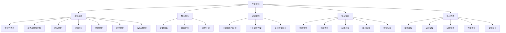

## 本章小结

本章从性能优化的方法论出发，系统地讲解了算法与数据结构优化、内存优化、I/O优化、并发优化、网络优化和运行时优化六大核心领域，并通过电商大促实战案例演示了完整的问题排查与优化流程。以下是全章知识体系的结构化回顾。

### 一、知识体系总览



### 二、核心知识点回顾

#### 1. 性能优化方法论

性能优化的最高准则是**"先测量，后优化"**。没有数据支撑的优化不仅低效，还可能引入新的问题。整个优化过程遵循闭环循环：

测量 (Measure) → 分析 (Analyze) → 优化 (Optimize) → 验证 (Verify)
     ↑                                                        │
     └────────────────────────────────────────────────────────┘

**阿姆达尔定律**设定了并行优化的理论天花板：

| 公式 | 含义 | 实际启示 |
|------|------|----------|
| 加速比 = 1 / ((1-P) + P/N) | P为可并行比例，N为处理器数 | 即使有16核，80%可并行的任务最多也只能加速5倍 |
| 1/(1-P) | 无限核数下的极限加速比 | 串行部分占比决定优化上限 |

**核心启示**：优化资源应集中在占比最大的瓶颈上。优化80%并行的部分，理论加速比仅4倍（16核时）；但如果把并行比例从80%提升到95%，理论加速比可以达到20倍。这就是为什么理解系统瓶颈在哪里比"让所有代码都变快"更重要。

**性能分析分层工具体系**：

| 层次 | 工具 | 关注指标 | 适用场景 |
|------|------|----------|----------|
| 应用层 | pprof (Go), JProfiler (Java), PySpy (Python) | CPU时间、内存分配、调用栈 | 定位应用热点函数 |
| 系统层 | perf, strace, dstat, vmstat | 系统调用、上下文切换、中断 | 排查系统资源瓶颈 |
| 内核层 | ftrace, bpftrace, /proc | 调度延迟、锁竞争、页面错误 | 分析内核行为 |
| 硬件层 | Intel VTune, LIKWID, perf stat | 缓存命中率、分支预测、指令流水线 | 微架构级优化 |

#### 2. 算法与数据结构优化

算法复杂度是性能的天花板，选择正确的数据结构往往比任何微优化都更有效——**一次正确的架构选择胜过一百次代码层面的修补**。

**核心数据结构性能对比**：

| 操作 | 数组/切片 | 链表 | 哈希表 | 平衡二叉树 |
|------|-----------|------|--------|------------|
| 查找 | O(n) | O(n) | O(1) 平均 | O(log n) |
| 插入 | O(n)（数组） | O(1) | O(1) 平均 | O(log n) |
| 删除 | O(n)（数组） | O(1) | O(1) 平均 | O(log n) |
| 空间效率 | 高（连续） | 低（指针开销） | 中（桶+溢出） | 中 |
| 缓存友好度 | ★★★★★ | ★☆☆☆☆ | ★★★☆☆ | ★★☆☆☆ |

**缓存友好的关键**：现代CPU缓存行大小为64字节。数组遍历命中缓存行的概率远高于链表的指针跳转，实测性能差异可达10-100倍。伪共享（False Sharing）是并发场景中的隐形杀手——两个不同变量恰好位于同一缓存行，导致多核之间频繁失效同步。解决方法是填充到缓存行边界：

```go
type PaddedCounter struct {
    value    int64
    _pad     [56]byte  // 填充56字节，确保独占一个64字节缓存行
}
```

**四大优化技巧**：

| 技巧 | 原理 | 典型应用 |
|------|------|----------|
| 空间换时间 | 预计算结果缓存，避免重复计算 | 查表法、缓存中间结果 |
| 惰性计算 | 延迟到真正需要时才计算 | Copy-on-Write、懒加载 |
| 批量处理 | 合并小操作减少开销 | 数据库批量写入、向量化 |
| 索引加速 | 哈希/B+树加速查找 | 数据库索引、内存哈希映射 |

#### 3. 内存优化

内存管理是性能优化的核心战场，涉及分配器机制、垃圾回收、内存布局等多个维度。

**内存分配器分层架构**（以Go为例）：

分配请求 → mcache (per-P本地缓存, 无锁)
         → miss → mcentral (per-size-class中心, 有锁)
         → miss → mheap (全局堆, mmap)

| 对象类型 | 大小 | 分配路径 | 锁竞争 |
|----------|------|----------|--------|
| 微对象 | 0-16B | 合并到内存块中分配 | 无 |
| 小对象 | 16B-32KB | mcache → mcentral | 极低 |
| 大对象 | >32KB | 直接从mheap分配 | 低 |

**三大减少分配的策略**：

1. **对象池复用**（sync.Pool）：避免频繁的GC压力，在高吞吐场景下可降低50%+的GC暂停时间
2. **预分配容量**：`make([]T, 0, n)` 预估容量，避免append过程中多次扩容（每次扩容涉及内存拷贝）
3. **结构体内联**：将小对象嵌入结构体而非使用指针，减少间接寻址和分配次数

**常见内存泄漏场景与应对**：

| 泄漏场景 | 根因 | 应对方法 |
|----------|------|----------|
| 全局缓存无限增长 | 无淘汰策略 | 设置TTL或LRU上限 |
| goroutine/协程泄漏 | 未正确退出 | context取消 + 超时控制 |
| slice底层数组引用 | 切片取了部分但引用整个底层数组 | 复制需要的部分而非引用 |
| finalizer堆积 | 注册过多finalizer | 减少runtime.SetFinalizer使用 |
| 闭包捕获大对象 | 闭包引用了不再需要的大变量 | 显式置nil或拆分闭包作用域 |

#### 4. I/O优化

I/O通常是系统最大的性能瓶颈——数据库查询、网络请求、磁盘读写都受限于I/O速度。优化I/O往往能带来最显著的性能提升。

**四种I/O模型对比**：

| 模型 | 线程开销 | 编程复杂度 | 并发能力 | 适用场景 |
|------|----------|------------|----------|----------|
| 阻塞I/O | 高（每连接一线程） | 低 | 低 | 连接数少的简单服务 |
| 非阻塞I/O | 中 | 高 | 中 | 短连接场景 |
| I/O多路复用 | 低 | 中 | 高 | 高并发连接（epoll/kqueue） |
| 异步I/O | 最低 | 高 | 极高 | 高吞吐量（io_uring） |

**批量I/O的核心价值**：100条逐行INSERT需要100次系统调用，而1次批量executemany只需1次系统调用。在PostgreSQL中使用COPY命令还可以进一步绕过SQL解析层，吞吐量可提升5-10倍。

**Linux预读机制**：内核在检测到顺序读模式时自动预读后续数据到Page Cache。通过 `posix_fadvise(POSIX_FADV_SEQUENTIAL)` 可以显式提示。对于大文件顺序读取场景，使用 `O_DIRECT` 绕过Page Cache可以避免双重缓存的浪费。

**io_uring（Linux 5.1+）**：新一代异步I/O框架，通过共享内存的提交队列(SQ)和完成队列(CQ)实现零拷贝的I/O提交和完成通知，相比epoll在高并发场景下性能提升20-40%。

#### 5. 并发优化

并发编程的目标是在保证正确性的前提下最大化系统吞吐量。核心挑战在于锁竞争和上下文切换的开销。

**三大锁优化策略**：

| 策略 | 原理 | 适用场景 | 性能收益 |
|------|------|----------|----------|
| 减小锁粒度（分段锁） | 将大锁拆分为多把小锁，不同分段独立加锁 | 缓存、计数器 | 高并发下可提升10倍+ |
| 读写锁（RWMutex） | 读操作共享、写操作互斥 | 读多写少场景 | 读吞吐提升5-10倍 |
| 原子操作（atomic） | 利用CPU CAS指令无锁更新 | 简单计数器、标志位 | 无锁竞争 |

**并发模型选择指南**：

| 任务类型 | 推荐模型 | 代表技术 | 关键考量 |
|----------|----------|----------|----------|
| CPU密集型 | 线程池/协程池 | Go goroutine, Java ThreadPool | 线程数 ≈ CPU核数 |
| I/O密集型 | 事件驱动 | Node.js, Nginx, epoll | 单线程处理数千连接 |
| 消息驱动 | Actor模型 | Akka, Erlang, Racket | 隔离性好，适合分布式 |
| 通道通信 | CSP模型 | Go channel, Occam | 简洁的并发原语 |
| 批量计算 | 数据并行 | SIMD, MapReduce | 数据分片 + 并行处理 |

#### 6. 网络优化

**连接池化**是网络优化的基石。每次HTTP请求都新建TCP连接需要3次握手开销，而连接池复用可以将延迟降低一个数量级。连接池的关键参数：

```yaml
# 连接池参数设计原则
pool:
  max_size: 50-200          # 最大连接数（根据后端承受能力调整）
  min_idle: 5-10            # 最小空闲连接（减少冷启动延迟）
  max_idle_time: 300s       # 空闲超时（释放不必要连接）
  connection_timeout: 5s    # 获取连接超时（快速失败）
```

**协议层优化**：

| 协议/技术 | 优化点 | 延迟改善 | 适用场景 |
|-----------|--------|----------|----------|
| HTTP/2多路复用 | 单TCP连接并行多个请求 | 30-50% | Web API |
| gRPC + Protobuf | 二进制序列化、HTTP/2 | 50-80% | 微服务间通信 |
| gzip/brotli压缩 | 减少传输数据量 | 60-90% | 文本为主的响应 |
| 字段裁剪 | 只返回需要的字段 | 按比例 | GraphQL、部分字段查询 |

#### 7. 运行时优化

**编译器级优化**包括内联展开（消除函数调用开销）、循环优化（展开、向量化）、死代码消除和常量折叠。这些是免费的性能收益，选择正确的编译器优化级别即可获得。

**Profile-Guided Optimization（PGO）**：通过运行时profiling数据指导编译器决策，实现5-15%的性能提升。Go 1.20+ 已原生支持PGO，工作流程如下：

```bash
# Go PGO 完整工作流
# 1. 运行并收集CPU profile
go test -cpuprofile=cpu.prof -bench=. ./...

# 2. 将profile放入源码根目录（Go 1.21+自动检测）
cp cpu.prof .

# 3. 重新编译，编译器自动使用profile优化
go build -o optimized_binary .
```

PGO带来的优化包括：热点函数自动内联、接口调用去虚拟化（减少间接跳转）、分支预测引导、热路径优先编译。

### 三、关键公式与模型速查

| 概念 | 公式/模型 | 说明 | 实战应用 |
|------|-----------|------|----------|
| 加速比 | S = 1/((1-P)+P/N) | 阿姆达尔定律 | 评估并行优化上限 |
| 吞吐量 | QPS = 并发数 / 平均延迟 | Little定律 | 容量规划基础 |
| 可用性 | SLA = 正常时间 / 总时间 | 99.9% = 8.76h/年停机 | 服务等级定义 |
| 延迟分位 | P99 = 第99百分位值 | 尾延迟，比均值更有意义 | SLA设定依据 |
| 容量规划 | 总资源 = QPS × 单请求资源 × 安全系数 | 安全系数通常1.5-2.0 | 扩容决策 |
| 缓存命中率 | Hit Rate = 命中数 / 总请求数 | >95%为优秀 | 缓存效果评估 |
| 连接池利用率 | Utilization = 活跃连接 / 最大连接 | >80%需扩容 | 连接池调参 |

### 四、实战排查四步法

本章通过电商大促案例演示了系统化的排查流程，这是性能问题定位的通用方法论：

第一步：系统层监控 → uptime / top / free / iostat
    ↓ 确定瓶颈类型（CPU？内存？IO？）
第二步：应用层排查 → 日志 / 线程dump / GC日志
    ↓ 定位应用层热点
第三步：数据库层排查 → 慢查询 / 锁等待 / 索引分析
    ↓ 确认数据层瓶颈
第四步：根因定位 → 综合分析，确定根本原因

**电商案例根因与解法**：

| 根因 | 排查证据 | 解决方案 | 效果 |
|------|----------|----------|------|
| 数据库缺索引 | EXPLAIN显示全表扫描 | 添加复合索引+覆盖索引 | 查询时间从2s降至50ms |
| 连接池过小 | 连接等待队列持续增长 | HikariCP最大池从10调至50 | 连接等待消除 |
| 缓存命中率低 | Redis命中率仅40% | 本地缓存+Redis二级缓存 | 命中率提升至98% |

**最终优化效果**：P99延迟从500ms降至50ms（降低90%），QPS从5K提升至50K（提升10倍），错误率从5%降至0.1%（降低98%）。

### 五、五大常见误区警示

| 误区 | 典型表现 | 正确做法 | 根本原则 |
|------|----------|----------|----------|
| 忽略监控 | 出了问题才去装监控 | 部署Prometheus+Grafana，报警先行 | 没有可观测性就没有优化 |
| 过度优化 | 未定位瓶颈就全面重构 | 先用profiler定位热点，精准优化80/20法则 | 优化最痛的20%解决80%问题 |
| 配置不当 | 照搬默认配置或网上模板 | 根据实际负载基准测试后调优 | 每个系统的最优参数不同 |
| 缺乏容错 | 高性能但一挂全挂 | 超时+重试+熔断+降级四件套 | 可用性是性能的前提 |
| 忽视安全 | 为性能关闭加密/验证 | 性能与安全平衡，找到合理平衡点 | 安全问题的代价远超性能损失 |

### 六、最佳实践清单

**设计阶段**：
- [ ] 明确性能指标要求（QPS、P99延迟、错误率、可用性SLA）
- [ ] 根据数据特征选择合适的数据结构和算法
- [ ] 设计连接池、缓存等资源的分配策略
- [ ] 制定容错和降级方案（超时、重试、熔断）
- [ ] 规划监控和告警策略

**实现阶段**：
- [ ] 遵循"先测量后优化"原则，建立性能基线
- [ ] 使用对象池、预分配等减少内存分配
- [ ] I/O操作采用批量处理和异步模式
- [ ] 锁策略：分段锁 > 读写锁 > 原子操作
- [ ] 编写单元测试覆盖性能敏感路径

**部署阶段**：
- [ ] 配置合理的系统参数（somaxconn、TCP缓冲区等）
- [ ] 压测验证容量，留足安全系数
- [ ] 设置多层监控（系统/应用/数据库/缓存）
- [ ] 制定回滚方案，支持灰度发布

**运维阶段**：
- [ ] 定期review监控数据和性能趋势
- [ ] 持续优化热点代码（基于实际profiling数据）
- [ ] 定期回归测试，防止性能退化
- [ ] 更新文档，记录每次优化的背景和效果

### 七、性能优化全景路线图

Level 1 — 入门级（1-3个月）
├── 理解性能指标（延迟、吞吐量、可用性）
├── 掌握基础监控工具（top、iostat、free）
├── 学会使用profiler定位热点
└── 建立"先测量后优化"的思维习惯

Level 2 — 进阶级（3-6个月）
├── 掌握内存分配器原理和对象池
├── 理解I/O多路复用（epoll/io_uring）
├── 能设计分段锁、读写锁方案
└── 掌握连接池、缓存的调优方法

Level 3 — 高级（6-12个月）
├── 能从系统层到硬件层全链路分析
├── 掌握PGO等编译器级优化
├── 设计高并发系统的完整容错方案
└── 建立性能基线+回归测试体系

Level 4 — 专家级（12个月以上）
├── 能分析内核级性能问题（ftrace/bpftrace）
├── 深入CPU缓存架构和内存层次优化
├── 设计百万级QPS的分布式系统架构
└── 构建AIOps驱动的自动化性能管理

### 八、下一步学习建议

**深入方向**：

1. **源码阅读**：阅读Go runtime内存分配器源码（`src/runtime/malloc.go`）、Redis I/O模型源码，理解高性能系统的实现细节
2. **论文研究**：阅读阿姆达尔定律原始论文、Go GC论文、io_uring设计论文等，建立理论深度
3. **实战项目**：在真实项目中从头到尾执行一次完整的性能优化流程——测量、分析、优化、验证，建立肌肉记忆
4. **社区参与**：关注GopherCon、QCon等技术大会的性能优化专题，阅读Uber、字节跳动等团队的性能优化博客

**推荐学习资源**：

| 类别 | 推荐 | 说明 |
|------|------|------|
| 书籍 | 《Systems Performance》(Brendan Gregg) | 性能分析方法论圣经 |
| 书籍 | 《Go语言高性能编程》 | Go语言性能优化实战 |
| 书籍 | 《性能之巅》(Brendan Gregg) | 系统性能分析与优化 |
| 工具 | pprof / go tool trace | Go原生性能分析 |
| 工具 | flamegraph (Brendan Gregg) | 火焰图可视化 |
| 平台 | GitHub grafana/k6 | 开源负载测试工具 |
| 博客 | Brendan Gregg's Blog | 性能分析领域的权威博客 |
| 实践 | The Art of Capacity Planning (John Allspaw) | 容量规划方法论 |

### 九、思考题

1. **阿姆达尔定律的应用**：假设一个系统的串行部分占比为10%，将其从4核扩展到64核，理论上最大加速比是多少？实际中可能受限于哪些因素而达不到理论值？

2. **缓存策略选择**：一个读多写少的社交平台feed流系统，应该如何设计多级缓存策略？需要考虑哪些一致性问题？

3. **I/O模型抉择**：如果需要设计一个每秒处理10万条消息的实时日志收集系统，应该选择哪种I/O模型？为什么？

4. **伪共享诊断**：在一个8核服务器上，两个线程分别维护独立的计数器，但运行时发现性能远低于预期。请描述完整的排查过程和解决方案。

5. **性能与成本平衡**：如果需要将一个系统从99.9%可用性提升到99.99%，可能需要付出哪些代价？从技术实现和运维成本两个维度分析。

6. **优化优先级判断**：一个API服务同时存在以下问题——CPU使用率70%、P99延迟300ms、内存使用率60%、数据库连接池利用率90%。按照优先级应该先优化哪个？为什么？

---

> **全章核心要义**：性能优化不是一次性的项目，而是持续的工程实践。遵循"先测量后优化"的方法论，基于数据而非直觉做决策，优先解决最大瓶颈（80/20法则），并在性能、可维护性和成本之间找到最佳平衡点。正如Brendan Gregg所言："性能优化是一门关于测量的科学，而不是关于猜测的艺术。"
