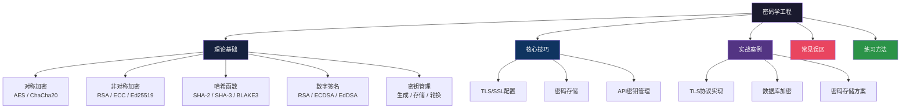
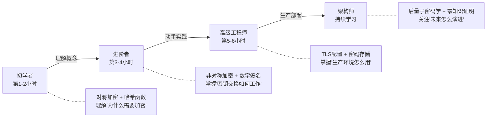

# 第33章 密码学——章节概览

## 为什么每个软件工程师都需要密码学

你每天都在使用密码学——登录网站时浏览器地址栏的那把小锁、手机上的指纹解锁、微信消息的端到端加密——背后都是密码学在运作。然而，大多数开发者对密码学的认知停留在"调用加密库 API"的层面，对其底层原理、安全边界和工程陷阱知之甚少。

这种认知缺失的代价极其惨重：

- **索尼 PlayStation Network 2011年事件**：1.02亿用户数据泄露，根因是密码学实现缺陷
- **Heartbleed 漏洞（2014年）**：OpenSSL的心跳扩展未做边界检查，导致密钥等敏感内存被窃取，影响全球约17%的安全Web服务器
- **Log4Shell（2021年）**：看似与密码学无关，但其攻击链条中涉及的签名验证和信任链机制，本质是密码学工程的失败

密码学不是"安全团队的事"，而是每个写代码的人都必须理解的基础能力。本章将带你从密码学的数学根基出发，一路走到生产环境的工程实践。

## 本章知识体系全景

## 四大安全目标：密码学的根基

在深入具体算法之前，必须先理解密码学要解决的四个核心问题：

| 安全目标 | 英文 | 核心问题 | 典型实现 |
|----------|------|----------|----------|
| **机密性** | Confidentiality | 谁能看懂数据？ | AES加密、RSA加密 |
| **完整性** | Integrity | 数据有没有被篡改？ | SHA-256、HMAC |
| **认证性** | Authentication | 对方是谁？ | 数字签名、TLS证书 |
| **不可否认性** | Non-repudiation | 能否证明某人确实做过某事？ | 数字签名（私钥唯一性） |

这四个目标不是孤立的，而是相互依存的。例如，只做加密（机密性）但不做完整性校验，攻击者可以篡改密文触发可预测的解密行为（Padding Oracle攻击）。因此，现代密码学工程几乎总是组合使用多种原语。

## 章节内容导读

### 第一部分：理论基础（建议阅读时间：90分钟）

理论基础是整章的基石，包含五个核心模块：

#### 1. 对称加密——AES与ChaCha20

对称加密是最古老也最高效的加密方式：加密和解密使用同一把密钥。本节深入讲解：

- **AES算法结构**：128位分组、S-Box替换、行移位、列混合、轮密钥加，以及128/192/256三种密钥长度对应的10/12/14轮变换
- **工作模式的选择**：ECB（绝不使用）、CBC（需要填充，需注意Padding Oracle）、CTR（支持并行）、GCM（认证加密，推荐首选）
- **ChaCha20-Poly1305**：在无AES硬件加速的设备上性能优于AES-GCM，Google在YouTube和Android上的实际部署验证了其可靠性

#### 2. 非对称加密——RSA、ECC与Ed25519

非对称加密解决了密钥分发的根本难题：通信双方无需预先共享密钥。

- **RSA**：基于大整数分解难题，讲解密钥生成（选择大素数、计算n和欧拉函数）、加密/解密的数学过程、OAEP填充的必要性
- **ECC（椭圆曲线密码）**：基于椭圆曲线离散对数问题，256位ECC密钥的安全性等同于3072位RSA密钥，讲解曲线选择（P-256 vs Curve25519）和实际性能对比
- **Ed25519**：基于扭曲爱德华曲线的签名算法，具有固定密钥长度、抗侧信道攻击、确定性签名等优势

#### 3. 哈希函数——SHA-2、SHA-3与BLAKE3

哈希函数是密码学的"瑞士军刀"，用于数字签名、密码存储、区块链、数据完整性校验等场景：

- **核心安全属性**：原像抗性（给定哈希值无法找到输入）、第二原像抗性（给定输入无法找到另一相同哈希的输入）、碰撞抵抗性（无法找到任意两不同输入产生相同哈希）
- **算法演进**：MD5（2004年已破解）→ SHA-1（2017年Google实际碰撞）→ SHA-2（至今安全）→ SHA-3（Keccak海绵结构，作为备用方案）
- **BLAKE3**：速度是SHA-256的14倍，安全性比肩SHA-2，适用于高性能场景

#### 4. 数字签名——证明"我确实说过这句话"

数字签名是非对称加密的重要应用，提供了认证性和不可否认性：

- **签名与验证流程**：用私钥签名、公钥验证，数学保证签名与消息的绑定关系
- **RSA签名 vs ECDSA vs EdDSA**：密钥长度、签名大小、性能、安全性的全面对比
- **确定性签名（EdDSA）vs 随机性签名（ECDSA）**：确定性签名消除了随机数管理的风险（Sony PS3的ECDSA漏洞正是因为重复使用了随机数k）

#### 5. 密钥管理——密码学的"阿喀琉斯之踵"

密码学界有句名言："加密很简单，密钥管理才是难题。"本节覆盖密钥的完整生命周期：

- **生成**：必须使用密码学安全伪随机数生成器（CSPRNG），如/dev/urandom、os.urandom()、libsodium的randombytes()
- **存储**：硬件安全模块（HSM）、密钥管理服务（KMS）、密钥保险库（Vault）的选型与对比
- **分发**：Diffie-Hellman密钥交换、TLS中的密钥协商
- **轮换**：定期更换密钥的最佳实践，自动化轮换方案
- **销毁**：密钥的安全擦除，内存中密钥的保护

### 第二部分：核心技巧（建议阅读时间：40分钟）

从理论到工程，这一部分聚焦生产环境中最常见的密码学应用场景：

#### 1. TLS/SSL配置

TLS是互联网安全通信的基石，错误的配置可能让加密形同虚设：

- TLS 1.3 vs TLS 1.2的握手流程对比（1-RTT vs 2-RTT）
- 证书链验证：从根CA到终端证书的信任链
- 密码套件的选择：优先AEAD（AES-GCM、ChaCha20-Poly1305），禁用过时套件
- HSTS、OCSP Stapling等安全增强配置
- 常见配置错误：证书过期、中间证书缺失、SNI配置错误

#### 2. 密码存储最佳实践

永远不要明文存储用户密码，也不要只用MD5或SHA-256直接哈希：

- **口令哈希函数**：PBKDF2（NIST推荐）、scrypt（内存密集型）、Argon2id（2015年密码哈希竞赛冠军）
- **加盐（Salting）**：每个密码使用独立的随机盐值，防止彩虹表攻击
- **工作因子选择**：如何平衡安全性和用户体验（登录延迟<500ms为宜）
- **密码哈希迁移**：从旧算法平滑迁移到新算法的策略

#### 3. API密钥管理

API密钥是现代微服务架构中常见的认证凭证：

- 密钥的生成、分发、存储、轮换的完整流程
- 密钥权限最小化原则
- 密钥泄露的应急响应
- JWT令牌的安全使用（签名算法选择、过期策略、刷新机制）

### 第三部分：实战案例与误区（建议阅读时间：45分钟）

- **实战案例**：TLS协议在真实系统中的实现、数据库字段级加密、密码存储的完整方案
- **常见误区**：
  - "加密了就安全"——缺少完整性校验的加密可能更危险
  - "自创加密算法比标准算法更适合我的场景"——密码学的奥卡姆剃刀
  - "密钥可以写在代码里"——密钥管理的基本禁忌
  - "使用ECB模式加密结构化数据"——ECB泄露数据模式的经典攻击
  - "MD5还可以用来校验文件完整性"——碰撞攻击的实际威胁

## 密码学工程五条铁律

在开始学习之前，请牢记这五条铁律，它们是本章反复强调的核心原则：

> **铁律一：永远不要自己发明密码学算法。** 使用经过公开审查的标准算法（AES、SHA-256、Ed25519）和成熟密码库（libsodium、cryptography、OpenSSL）。即便你是密码学博士，个人发明的算法也极可能有未被发现的漏洞。

> **铁律二：永远不要使用ECB模式。** ECB对每个分组独立加密，相同的明文块产生相同的密文块，泄露数据模式。必须使用AEAD（如AES-GCM）或至少CBC+HMAC。

> **铁律三：密钥管理重于算法选择。** 再好的算法也会因密钥管理不当而失效。密钥必须通过CSPRNG生成、安全存储、定期轮换、安全销毁。

> **铁律四：加密≠安全。** 加密只保证机密性，不保证完整性和认证性。必须使用AEAD（认证加密）或Encrypt-then-MAC模式。

> **铁律五：为密码敏捷性而设计。** 系统应支持密码组件的快速替换。今天安全的算法明天可能被破解，后量子密码学时代的到来更是加速了这一需求。

## 学习路径建议

根据你的基础和目标，推荐以下学习路径：

- **如果你是初学者**：先从对称加密和哈希函数入手，理解密码学要解决的基本问题
- **如果你有基础**：重点学习非对称加密和数字签名，理解现代密码体系的全貌
- **如果你准备上生产**：聚焦TLS/SSL配置和密码存储最佳实践，避免常见部署陷阱
- **如果你关注前沿**：了解后量子密码学、零知识证明、同态加密等方向

## 关键指标速查表

在密码学工程实践中，以下指标直接影响方案选型：

| 指标 | 说明 | AES-256-GCM | ChaCha20-Poly1305 | RSA-2048 | Ed25519 |
|------|------|-------------|-------------------|----------|---------|
| 密钥长度 | 安全强度 | 256位 | 256位 | 2048位（≈112位安全） | 256位（≈128位安全） |
| 加密速度 | 硬件加速 | AES-NI加速下极快 | 无硬件加速时更快 | 不适用于大数据加密 | 不适用于加密 |
| 签名大小 | 传输开销 | 不适用 | 不适用 | 256字节 | 64字节 |
| 握手开销 | TLS协商 | 1-RTT | 1-RTT | 较大 | 较小 |
| 安全现状 | 当前威胁 | 安全 | 安全 | 安全（密钥需≥2048位） | 安全 |

## 算法选型决策树

面对具体场景时，可按以下逻辑快速选型：

- **加密数据存储** → AES-256-GCM（有硬件加速时）或 ChaCha20-Poly1305（无硬件加速时）
- **加密通信** → TLS 1.3，优先选择 AES-256-GCM 或 ChaCha20-Poly1305 密码套件
- **数字签名** → Ed25519（首选，性能好、实现简单）或 ECDSA（需兼容旧系统时）
- **密钥交换** → X25519（首选）或 ECDH P-256（需兼容时）
- **密码存储** → Argon2id（首选）或 scrypt / PBKDF2-SHA256（需合规时）
- **文件完整性校验** → SHA-256（通用）或 BLAKE3（高性能场景）
- **HMAC消息认证** → HMAC-SHA-256（通用）

## 与其他章节的关系

本章是整本书安全体系的数学基础，与以下章节紧密关联：

- **第34章 系统安全**：密码学为安全系统提供底层支撑，系统安全的设计需要正确应用密码学原语
- **第19章 API设计**：认证授权机制（OAuth、JWT）建立在数字签名和哈希函数之上
- **第10章 网络编程**：TCP/UDP之上的TLS层是密码学最广泛的应用场景
- **第25章 数据库设计**：字段级加密、透明数据加密（TDE）等数据库安全方案离不开密码学

密码学不是孤立的知识点，而是贯穿软件工程各个层面的基础能力。掌握本章内容，你将具备构建安全系统的核心素养。
