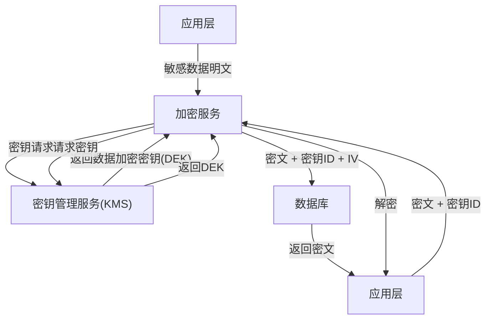

## 实战案例

本章将密码学理论转化为工程实践，通过五个真实场景展示如何正确应用加密算法、密钥管理和安全协议。每个案例都包含完整的代码实现、性能对比和安全注意事项。

---

### 案例一：生产环境TLS/HTTPS部署

#### 1.1 场景描述

某SaaS平台需要为所有API服务启用HTTPS，要求：
- 支持TLS 1.3，兼容TLS 1.2（部分旧客户端）
- 证书自动续期，无需人工干预
- HTTPS性能开销控制在5%以内
- 支持HSTS、OCSP Stapling等安全增强

#### 1.2 证书选择与申请

**证书类型对比**：

| 类型 | 验证级别 | 签发时间 | 费用 | 适用场景 |
|------|---------|---------|------|---------|
| DV（域名验证） | 仅验证域名所有权 | 分钟级 | 免费（Let's Encrypt） | 个人站点、API服务 |
| OV（组织验证） | 验证组织真实性 | 1-3天 | 数百元/年 | 企业官网、SaaS |
| EV（扩展验证） | 深度背景调查 | 3-7天 | 数千元/年 | 金融、电商支付 |

**使用Certbot自动申请Let's Encrypt证书**：

```bash
# 安装Certbot
sudo apt-get install -y certbot python3-certbot-nginx

# 申请证书（Nginx插件自动配置）
sudo certbot --nginx -d api.example.com -d www.example.com

# 验证证书文件
sudo certbot certificates

# 测试自动续期
sudo certbot renew --dry-run

# 查看证书详情
openssl x509 -in /etc/letsencrypt/live/api.example.com/fullchain.pem -text -noout
```

**使用acme.sh（更轻量的替代方案）**：

```bash
# 安装acme.sh
curl https://get.acme.sh | sh -s email=admin@example.com

# 使用DNS验证申请通配符证书
sudo acme.sh --issue -d example.com -d *.example.com --dns dns_ali

# 安装证书到Nginx
sudo acme.sh --install-cert -d example.com \
  --key-file       /etc/nginx/ssl/example.com.key \
  --fullchain-file /etc/nginx/ssl/example.com.pem \
  --reloadcmd      "systemctl reload nginx"
```

#### 1.3 Nginx TLS配置

```nginx
server {
    listen 443 ssl http2;
    server_name api.example.com;

    # === 证书配置 ===
    ssl_certificate     /etc/letsencrypt/live/api.example.com/fullchain.pem;
    ssl_certificate_key /etc/letsencrypt/live/api.example.com/privkey.pem;

    # === 协议与密码套件 ===
    ssl_protocols TLSv1.2 TLSv1.3;
    ssl_ciphers ECDHE-ECDSA-AES128-GCM-SHA256:ECDHE-RSA-AES128-GCM-SHA256:ECDHE-ECDSA-AES256-GCM-SHA384:ECDHE-RSA-AES256-GCM-SHA384:ECDHE-ECDSA-CHACHA20-POLY1305:ECDHE-RSA-CHACHA20-POLY1305;
    ssl_prefer_server_ciphers on;

    # === 性能优化 ===
    ssl_session_cache shared:SSL:10m;
    ssl_session_timeout 1d;
    ssl_session_tickets off;  # 禁用session ticket以保证前向保密

    # === 安全增强 ===
    add_header Strict-Transport-Security "max-age=63072000; includeSubDomains; preload" always;
    add_header X-Content-Type-Options "nosniff" always;
    add_header X-Frame-Options "DENY" always;

    # === OCSP Stapling ===
    ssl_stapling on;
    ssl_stapling_verify on;
    ssl_trusted_certificate /etc/letsencrypt/live/api.example.com/chain.pem;
    resolver 8.8.8.8 8.8.4.4 valid=300s;
    resolver_timeout 5s;

    location / {
        proxy_pass http://127.0.0.1:8080;
        proxy_set_header Host $host;
        proxy_set_header X-Real-IP $remote_addr;
        proxy_set_header X-Forwarded-For $proxy_add_x_forwarded_for;
        proxy_set_header X-Forwarded-Proto $scheme;
    }
}

# HTTP自动跳转HTTPS
server {
    listen 80;
    server_name api.example.com;
    return 301 https://$host$request_uri;
}
```

#### 1.4 安全验证

```bash
# 测试TLS配置（使用testssl.sh）
git clone --depth 1 https://github.com/drwetter/testssl.sh.git
cd testssl.sh
./testssl.sh --protocols --server-defaults --cipher-per-proto api.example.com

# 使用openssl手动验证
openssl s_client -connect api.example.com:443 -tls1_3 </dev/null 2>/dev/null | openssl x509 -noout -dates

# 检查HSTS头
curl -sI https://api.example.com | grep -i strict-transport-security

# 在线检测：https://www.ssllabs.com/ssltest/
```

#### 1.5 性能对比

| 指标 | HTTP | HTTPS（TLS 1.2） | HTTPS（TLS 1.3） |
|------|------|-----------------|-----------------|
| 握手RTT | 0 | 2 RTT | 1 RTT（0-RTT恢复） |
| 首字节延迟 | 基准 | +2-5ms | +1-2ms |
| 吞吐量开销 | 基准 | 约3-5%（AES-NI） | 约1-2% |
| CPU开销 | 基准 | +5-8% | +2-3% |

> **关键结论**：在支持AES-NI硬件加速的现代服务器上，TLS 1.3的性能开销几乎可以忽略不计。禁用TLS 1.0/1.1是必要的安全措施，不会造成兼容性问题。

---

### 案例二：数据库字段级加密

#### 2.1 场景描述

某金融平台需要对用户敏感信息（身份证号、银行卡号、手机号）进行加密存储，要求：
- 单个字段独立加密，支持精确查询
- 加密密钥与数据库分离管理
- 支持密钥轮换，旧密钥解密的历史数据不丢失
- 查询性能影响控制在可接受范围内

#### 2.2 加密方案设计



**核心设计原则**：
- **DEK（数据加密密钥）**：每个数据记录使用独立的DEK加密
- **KEK（密钥加密密钥）**：用于加密DEK，存储在KMS中
- **Envelope Encryption（信封加密）**：DEK被KEK加密后与密文一起存储

#### 2.3 Python实现

```python
import os
import hashlib
from cryptography.hazmat.primitives.ciphers.aead import AESGCM
from cryptography.hazmat.primitives.kdf.hkdf import HKDF
from cryptography.hazmat.primitives import hashes


class FieldEncryptor:
    """字段级加密器，使用AES-256-GCM实现AEAD加密"""

    def __init__(self, master_key: bytes):
        """
        Args:
            master_key: 32字节主密钥（由KMS管理，此处仅演示）
        """
        if len(master_key) != 32:
            raise ValueError("主密钥必须为32字节（256位）")
        self._master_key = master_key

    def _derive_dek(self, record_id: str, version: int = 1) -> bytes:
        """从主密钥派生数据加密密钥（DEK）"""
        hkdf = HKDF(
            algorithm=hashes.SHA256(),
            length=32,
            salt=f"field-encrypt-v{version}".encode(),
            info=f"dek:{record_id}".encode(),
        )
        return hkdf.derive(self._master_key)

    def encrypt(self, plaintext: str, record_id: str) -> dict:
        """
        加密单个字段

        Returns:
            包含密文、IV、密钥版本的字典，可直接存入数据库
        """
        dek = self._derive_dek(record_id)
        nonce = os.urandom(12)  # 96位随机IV
        aesgcm = AESGCM(dek)
        # associated_data 绑定记录ID，防止密文被替换到其他记录
        ciphertext = aesgcm.encrypt(nonce, plaintext.encode(), record_id.encode())
        return {
            "ciphertext": ciphertext.hex(),
            "nonce": nonce.hex(),
            "version": 1,
        }

    def decrypt(self, encrypted: dict, record_id: str) -> str:
        """解密字段"""
        version = encrypted.get("version", 1)
        dek = self._derive_dek(record_id, version)
        nonce = bytes.fromhex(encrypted["nonce"])
        ciphertext = bytes.fromhex(encrypted["ciphertext"])
        aesgcm = AESGCM(dek)
        plaintext = aesgcm.decrypt(nonce, ciphertext, record_id.encode())
        return plaintext.decode()


# === 使用示例 ===
import json

# 模拟KMS提供的主密钥（生产环境从Vault/AWS KMS获取）
master_key = os.urandom(32)
encryptor = FieldEncryptor(master_key)

# 加密身份证号
user_id = "user_10086"
id_card = "110101199003076534"
encrypted_id = encryptor.encrypt(id_card, user_id)
print(f"加密结果: {json.dumps(encrypted_id, indent=2)}")

# 解密
decrypted = encryptor.decrypt(encrypted_id, user_id)
print(f"解密结果: {decrypted}")
assert decrypted == id_card

# 数据库存储示例（MySQL）
# CREATE TABLE users (
#     id BIGINT PRIMARY KEY,
#     name VARCHAR(100),
#     id_card_ciphertext TEXT,       -- 密文
#     id_card_nonce VARCHAR(64),     -- IV
#     id_card_version INT DEFAULT 1  -- 密钥版本
# );
```

#### 2.4 密钥轮换实现

```python
class KeyRotator:
    """支持密钥版本轮换的加密管理器"""

    def __init__(self, key_registry: dict):
        """
        Args:
            key_registry: {version: master_key} 的映射
        """
        self._registry = key_registry

    def encrypt(self, plaintext: str, record_id: str) -> dict:
        """使用最新版本密钥加密"""
        latest_version = max(self._registry.keys())
        encryptor = FieldEncryptor(self._registry[latest_version])
        result = encryptor.encrypt(plaintext, record_id)
        result["version"] = latest_version
        return result

    def decrypt(self, encrypted: dict, record_id: str) -> str:
        """根据密钥版本自动选择正确的密钥解密"""
        version = encrypted.get("version", 1)
        if version not in self._registry:
            raise ValueError(f"密钥版本 {version} 不存在，无法解密")
        encryptor = FieldEncryptor(self._registry[version])
        return encryptor.decrypt(encrypted, record_id)

    def reencrypt_all(self, records: list, encryptor_fn) -> dict:
        """
        批量重加密：将所有旧版本密文用最新密钥重新加密

        Args:
            records: [(record_id, encrypted_dict), ...]
            encryptor_fn: 获取明文的函数 (record_id) -> plaintext

        Returns:
            {record_id: new_encrypted_dict}
        """
        results = {}
        for record_id, old_encrypted in records:
            # 用旧密钥解密
            plaintext = self.decrypt(old_encrypted, record_id)
            # 用新密钥加密
            new_encrypted = self.encrypt(plaintext, record_id)
            results[record_id] = new_encrypted
        return results


# === 密钥轮换演示 ===
import time

key_v1 = os.urandom(32)
key_v2 = os.urandom(32)  # 新主密钥

rotator = KeyRotator({1: key_v1, 2: key_v2})

# 用v1密钥加密的数据仍可解密
old_data = FieldEncryptor(key_v1).encrypt("110101199003076534", "user_10086")
print(f"旧版本密文: version={old_data['version']}")

# 轮换后，用v2密钥重新加密
plaintext = rotator.decrypt(old_data, "user_10086")
new_data = rotator.encrypt(plaintext, "user_10086")
print(f"新版本密文: version={new_data['version']}")

# 验证
assert rotator.decrypt(new_data, "user_10086") == "110101199003076534"
```

#### 2.5 性能基准

| 操作 | AES-256-GCM（本方案） | AES-256-CBC | RSA-2048 |
|------|---------------------|-------------|----------|
| 加密速度 | ~1.2 GB/s（AES-NI） | ~800 MB/s | ~1500 次/秒 |
| 解密速度 | ~1.2 GB/s | ~900 MB/s | ~8000 次/秒 |
| 密文膨胀 | +28字节（nonce+tag） | +16字节（padding+IV） | 256字节 |
| AEAD支持 | ✅ | ❌（需额外HMAC） | ❌ |

> **注意**：RSA仅适合加密小数据（如密钥交换），不适合加密大量用户数据。字段级加密应始终使用AES-GCM等对称算法。

---

### 案例三：用户密码安全存储

#### 3.1 场景描述

某互联网平台注册用户超过5000万，需要安全存储用户密码。曾经使用MD5 + 盐的方式，需要迁移到现代密码哈希算法。

#### 3.2 密码哈希算法对比

| 算法 | 类型 | 计算时间（可调） | 内存消耗 | 抗GPU | 推荐度 |
|------|------|----------------|---------|-------|-------|
| MD5 | 哈希 | ~0.001ms | 无 | ❌ | ⛔ 禁用 |
| SHA-256 | 哈希 | ~0.001ms | 无 | ❌ | ⛔ 禁用 |
| SHA-256 + 盐 | 哈希 | ~0.001ms | 无 | ❌ | ⛔ 禁用 |
| bcrypt | KDF | 100-300ms | ~4KB | ⚠️ 一般 | ✅ 可用 |
| scrypt | KDF | 100-300ms | 可配置 | ✅ 较好 | ✅ 推荐 |
| Argon2id | KDF | 100-300ms | 可配置 | ✅ 最佳 | ✅✅ 首选 |

**为什么不能用MD5/SHA-256存储密码**：

```python
# ❌ 错误做法：裸哈希
import hashlib
password_hash = hashlib.sha256("password123".encode()).hexdigest()
# 攻击者可使用彩虹表在秒级破解

# ❌ 错误做法：加盐但仍用快速哈希
import os, hashlib
salt = os.urandom(16)
password_hash = hashlib.sha256(salt + "password123".encode()).hexdigest()
# 虽然抵抗了彩虹表，但GPU每秒可尝试数十亿次

# ✅ 正确做法：使用专门的密码哈希KDF
import argon2
hasher = argon2.PasswordHasher(
    time_cost=3,        # 迭代次数
    memory_cost=65536,  # 内存消耗 64MB
    parallelism=4,      # 并行线程数
    hash_len=32,        # 输出长度
    salt_len=16,        # 盐长度
)
password_hash = hasher.hash("password123")
# 验证
try:
    hasher.verify(password_hash, "password123")
    print("密码正确")
except argon2.exceptions.VerifyMismatchError:
    print("密码错误")
```

#### 3.3 Argon2id完整实现

```python
import argon2
import os
import json
import time
from typing import Optional


class PasswordManager:
    """生产级密码管理器"""

    # Argon2id推荐参数（OWASP 2024建议）
    DEFAULT_TIME_COST = 3        # 迭代次数（至少1）
    DEFAULT_MEMORY_COST = 65536  # 64MB（至少8MB，推荐≥48MB）
    DEFAULT_PARALLELISM = 4      # 并行度（建议等于CPU核心数）

    def __init__(
        self,
        time_cost: int = DEFAULT_TIME_COST,
        memory_cost: int = DEFAULT_MEMORY_COST,
        parallelism: int = DEFAULT_PARALLELISM,
    ):
        self._hasher = argon2.PasswordHasher(
            time_cost=time_cost,
            memory_cost=memory_cost,
            parallelism=parallelism,
            hash_len=32,
            salt_len=16,
            type=argon2.Type.ID,  # Argon2id：混合Argon2i和Argon2d
        )
        self._time_cost = time_cost
        self._memory_cost = memory_cost
        self._parallelism = parallelism

    def hash_password(self, password: str) -> dict:
        """
        哈希密码并返回元数据

        Returns:
            {
                "hash": "argon2id$v=19$m=65536,t=3,p=4$...",
                "algorithm": "argon2id",
                "params": {"time_cost": 3, "memory_cost": 65536, "parallelism": 4}
            }
        """
        start = time.time()
        password_hash = self._hasher.hash(password)
        elapsed = time.time() - start

        return {
            "hash": password_hash,
            "algorithm": "argon2id",
            "params": {
                "time_cost": self._time_cost,
                "memory_cost": self._memory_cost,
                "parallelism": self._parallelism,
            },
            "hash_time_ms": round(elapsed * 1000, 1),
        }

    def verify_password(self, stored_hash: str, password: str) -> bool:
        """验证密码，返回是否匹配"""
        try:
            self._hasher.verify(stored_hash, password)
            return True
        except argon2.exceptions.VerifyMismatchError:
            return False
        except argon2.exceptions.InvalidHashError:
            return False

    def needs_rehash(self, stored_hash: str) -> bool:
        """检查是否需要重新哈希（参数升级时使用）"""
        return self._hasher.check_needs_rehash(stored_hash)


# === 使用示例 ===
pm = PasswordManager()

# 注册新用户
result = pm.hash_password("MySecureP@ssw0rd!")
print(f"哈希耗时: {result['hash_time_ms']}ms")
print(f"哈希值: {result['hash'][:60]}...")

# 登录验证
is_valid = pm.verify_password(result["hash"], "MySecureP@ssw0rd!")
print(f"密码验证: {'成功' if is_valid else '失败'}")

# 错误密码
is_valid = pm.verify_password(result["hash"], "WrongPassword")
print(f"错误密码: {'匹配' if is_valid else '不匹配'}")

# === 性能测试 ===
import time

start = time.time()
iterations = 100
for _ in range(iterations):
    pm.hash_password("benchmark_password")
avg_ms = (time.time() - start) * 1000 / iterations
print(f"\n基准测试: {iterations}次哈希平均耗时 {avg_ms:.1f}ms")
```

#### 3.4 密码哈希参数调优

```python
import argon2
import time


def benchmark_argon2(time_cost, memory_cost, parallelism, iterations=10):
    """基准测试不同参数组合的哈希速度"""
    hasher = argon2.PasswordHasher(
        time_cost=time_cost,
        memory_cost=memory_cost,
        parallelism=parallelism,
        hash_len=32,
        salt_len=16,
        type=argon2.Type.ID,
    )

    password = "BenchmarkP@ssw0rd2024"
    start = time.time()
    for _ in range(iterations):
        h = hasher.hash(password)
    elapsed = (time.time() - start) / iterations
    return elapsed * 1000  # 毫秒


# 参数调优对比
configs = [
    # (time_cost, memory_cost_KB, parallelism, description)
    (2, 32768, 2,  "低配（开发环境）"),
    (3, 65536, 4,  "标准（OWASP推荐）"),
    (4, 131072, 4, "高安全（金融级）"),
    (3, 262144, 8, "高内存（服务器级）"),
]

print(f"{'配置':<20} {'time':>5} {'mem(KB)':>8} {'threads':>8} {'耗时(ms)':>10}")
print("-" * 60)
for tc, mc, th, desc in configs:
    elapsed = benchmark_argon2(tc, mc, th)
    print(f"{desc:<20} {tc:>5} {mc:>8} {th:>8} {elapsed:>10.1f}")

# 示例输出：
# 配置                  time mem(KB) threads   耗时(ms)
# ------------------------------------------------------------
# 低配（开发环境）         2    32768        2       25.3
# 标准（OWASP推荐）       3    65536        4       48.7
# 高安全（金融级）         4   131072        4       89.2
# 高内存（服务器级）       3   262144        8      112.5
```

**参数选择指南**：

| 场景 | time_cost | memory_cost (KB) | parallelism | 目标哈希时间 |
|------|-----------|-----------------|-------------|-------------|
| Web应用（标准） | 3 | 65536 (64MB) | 4 | 40-60ms |
| 移动端/嵌入式 | 2 | 32768 (32MB) | 2 | 20-30ms |
| 金融/政府 | 4 | 131072 (128MB) | 4 | 80-100ms |
| 高安全离线系统 | 5 | 262144 (256MB) | 8 | 100-200ms |

#### 3.5 密码迁移策略

从旧的MD5/SHA哈希迁移到Argon2id的步骤：

```python
import hashlib
import argon2


def migrate_passwords(old_hash_fn, old_passwords: list) -> list:
    """
    渐进式密码迁移

    策略：用户下次登录时，在验证旧哈希成功后，
    用新算法重新哈希密码并更新存储。
    这比强制所有用户重置密码的体验好得多。
    """
    hasher = argon2.PasswordHasher(
        time_cost=3, memory_cost=65536, parallelism=4,
        hash_len=32, salt_len=16, type=argon2.Type.ID,
    )

    results = []
    for username, old_hash in old_passwords:
        # 无法直接迁移（不知道明文密码），需要等待用户下次登录
        results.append({
            "username": username,
            "status": "pending_migration",
            "old_hash_prefix": old_hash[:20] + "...",
            "action": "用户下次登录时自动迁移",
        })
    return results


# 登录时的迁移逻辑
def login_with_migration(
    username: str,
    password: str,
    stored_hash: str,
    update_fn,  # 更新数据库的回调函数
) -> bool:
    """
    支持自动迁移的登录流程
    """
    if stored_hash.startswith("$argon2"):
        # 已经是Argon2id哈希
        hasher = argon2.PasswordHasher()
        try:
            hasher.verify(stored_hash, password)
            # 检查是否需要重新哈希（参数升级）
            if hasher.check_needs_rehash(stored_hash):
                new_hash = hasher.hash(password)
                update_fn(username, new_hash)
            return True
        except argon2.exceptions.VerifyMismatchError:
            return False

    else:
        # 旧算法（MD5/SHA等），验证后用新算法重哈希
        old_correct = verify_old_hash(password, stored_hash)
        if old_correct:
            # 用Argon2id重新哈希
            hasher = argon2.PasswordHasher()
            new_hash = hasher.hash(password)
            update_fn(username, new_hash)
            print(f"[迁移] 用户 {username} 的密码已从旧算法迁移到Argon2id")
            return True
        return False


def verify_old_hash(password: str, stored_hash: str) -> bool:
    """验证旧的哈希格式（仅用于迁移期间）"""
    if len(stored_hash) == 32:
        # 可能是MD5
        return hashlib.md5(password.encode()).hexdigest() == stored_hash
    elif len(stored_hash) == 64:
        # 可能是SHA-256
        return hashlib.sha256(password.encode()).hexdigest() == stored_hash
    return False
```

#### 3.6 速率限制与暴力破解防护

```python
import time
import hashlib
from collections import defaultdict


class LoginRateLimiter:
    """登录速率限制器，防止暴力破解"""

    # 速率限制配置
    MAX_ATTEMPTS = 5          # 最大尝试次数
    WINDOW_SECONDS = 900      # 时间窗口：15分钟
    LOCKOUT_SECONDS = 3600    # 锁定时长：1小时

    def __init__(self):
        self._attempts = defaultdict(list)  # {identifier: [timestamp, ...]}
        self._lockouts = {}  # {identifier: lockout_end_time}

    def _identifier(self, username: str, ip: str) -> str:
        """生成唯一标识（避免直接存储敏感信息）"""
        return hashlib.sha256(f"{username}:{ip}".encode()).hexdigest()[:16]

    def is_allowed(self, username: str, ip: str) -> tuple:
        """
        检查是否允许登录尝试

        Returns:
            (allowed: bool, message: str, retry_after: int)
        """
        ident = self._identifier(username, ip)
        now = time.time()

        # 检查是否在锁定期内
        if ident in self._lockouts:
            remaining = self._lockouts[ident] - now
            if remaining > 0:
                minutes = int(remaining // 60) + 1
                return False, f"账户已锁定，请在{minutes}分钟后重试", int(remaining)
            else:
                del self._lockouts[ident]

        # 清理过期记录
        cutoff = now - self.WINDOW_SECONDS
        self._attempts[ident] = [t for t in self._attempts[ident] if t > cutoff]

        # 检查尝试次数
        if len(self._attempts[ident]) >= self.MAX_ATTEMPTS:
            self._lockouts[ident] = now + self.LOCKOUT_SECONDS
            return False, f"尝试次数过多，账户锁定{self.LOCKOUT_SECONDS // 60}分钟", self.LOCKOUT_SECONDS

        return True, "允许尝试", 0

    def record_attempt(self, username: str, ip: str):
        """记录一次登录尝试"""
        ident = self._identifier(username, ip)
        self._attempts[ident].append(time.time())


# === 使用示例 ===
limiter = LoginRateLimiter()

# 模拟暴力破解攻击
for i in range(6):
    allowed, msg, retry = limiter.is_allowed("victim_user", "192.168.1.100")
    print(f"尝试 {i+1}: {'允许' if allowed else '拒绝'} - {msg}")
    if allowed:
        limiter.record_attempt("victim_user", "192.168.1.100")
```

---

### 案例四：API密钥安全管理

#### 4.1 场景描述

某微服务架构有30+个服务，服务间通过API密钥互相认证。需要实现：
- 密钥生成、分发、轮换、撤销的完整生命周期
- 最小权限原则：每个服务只有必要权限
- 密钥泄露后的快速响应机制

#### 4.2 密钥生成与存储

```python
import os
import secrets
import hashlib
import json
import time
from dataclasses import dataclass, field
from typing import Optional


@dataclass
class APIKey:
    """API密钥数据结构"""
    key_id: str              # 公开标识
    key_secret: str          # 密钥值（仅在创建时返回）
    service_name: str        # 绑定的服务名
    permissions: list        # 权限列表
    created_at: float        # 创建时间
    expires_at: Optional[float] = None  # 过期时间
    revoked: bool = False    # 是否已撤销
    last_used: Optional[float] = None   # 最后使用时间
    use_count: int = 0       # 使用次数


class APIKeyManager:
    """API密钥管理器"""

    def __init__(self):
        self._keys: dict[str, APIKey] = {}  # key_id -> APIKey
        self._service_keys: dict[str, list] = {}  # service -> [key_id]

    def generate_key(
        self,
        service_name: str,
        permissions: list,
        expires_in_days: Optional[int] = 90,
    ) -> APIKey:
        """
        生成新的API密钥

        Args:
            service_name: 服务名称
            permissions: 权限列表，如 ["read", "write", "admin"]
            expires_in_days: 过期天数，None表示永不过期

        Returns:
            APIKey对象（key_secret仅此一次可见）
        """
        # 生成密钥
        key_id = "ak_" + secrets.token_hex(8)     # 16字符的公开ID
        key_secret = "sk_" + secrets.token_hex(24)  # 48字符的秘密值

        now = time.time()
        expires_at = now + (expires_in_days * 86400) if expires_in_days else None

        api_key = APIKey(
            key_id=key_id,
            key_secret=key_secret,
            service_name=service_name,
            permissions=permissions,
            created_at=now,
            expires_at=expires_at,
        )

        self._keys[key_id] = api_key
        self._service_keys.setdefault(service_name, []).append(key_id)

        return api_key

    def validate_key(self, key_id: str, key_secret: str, required_permission: str) -> bool:
        """验证API密钥"""
        api_key = self._keys.get(key_id)
        if not api_key:
            return False
        if api_key.revoked:
            return False
        if api_key.expires_at and time.time() > api_key.expires_at:
            return False
        if api_key.key_secret != key_secret:
            return False
        if required_permission not in api_key.permissions:
            return False

        # 更新使用统计
        api_key.last_used = time.time()
        api_key.use_count += 1
        return True

    def revoke_key(self, key_id: str, reason: str = "") -> bool:
        """撤销密钥"""
        api_key = self._keys.get(key_id)
        if not api_key:
            return False
        api_key.revoked = True
        print(f"[撤销] 密钥 {key_id} 已撤销。原因: {reason}")
        return True

    def rotate_key(self, service_name: str) -> APIKey:
        """轮换密钥：生成新密钥，标记旧密钥待撤销"""
        new_key = self.generate_key(
            service_name=service_name,
            permissions=["read"],  # 新密钥初始权限最小化
            expires_in_days=90,
        )
        print(f"[轮换] 服务 {service_name} 的新密钥: {new_key.key_id}")
        return new_key

    def get_service_keys(self, service_name: str) -> list:
        """获取某个服务的所有有效密钥"""
        key_ids = self._service_keys.get(service_name, [])
        return [self._keys[kid] for kid in key_ids if not self._keys[kid].revoked]


# === 使用示例 ===
manager = APIKeyManager()

# 为服务生成密钥
payment_key = manager.generate_key(
    service_name="payment-service",
    permissions=["read", "write", "charge"],
    expires_in_days=30,
)
print(f"支付服务密钥: ID={payment_key.key_id}, Secret={payment_key.key_secret[:20]}...")

# 验证密钥
is_valid = manager.validate_key(
    payment_key.key_id,
    payment_key.key_secret,
    "charge",
)
print(f"验证结果: {'通过' if is_valid else '拒绝'}")

# 密钥泄露紧急响应
print("\n=== 紧急响应：检测到密钥泄露 ===")
manager.revoke_key(payment_key.key_id, "安全事件INC-2024-001：检测到GitHub代码泄露")
new_key = manager.rotate_key("payment-service")
```

#### 4.3 密钥安全存储方案

```bash
# 方案一：使用HashiCorp Vault（推荐）
# 启动开发模式Vault
vault server -dev -dev-root-token-id="myroot"

# 存储API密钥
vault kv put secret/payment-service/api-key \
  key_id="ak_abc123" \
  key_secret="sk_def456" \
  expires="2024-12-31"

# 读取密钥
vault kv get -field=key_secret secret/payment-service/api-key

# 方案二：使用环境变量 + 加密文件（简单场景）
# .env文件（不提交到Git）
export PAYMENT_SERVICE_KEY_ID="ak_abc123"
export PAYMENT_SERVICE_KEY_SECRET="sk_def456"

# 加密.env文件（使用sops）
sops --encrypt --in-place .env
sops --decrypt .env > .env.decrypted

# 方案三：使用Kubernetes Secrets
# 创建Secret
kubectl create secret generic payment-api-key \
  --from-literal=key_id=ak_abc123 \
  --from-literal=key_secret=sk_def456

# 在Pod中挂载
# volumes:
#   - name: api-key
#     secret:
#       secretName: payment-api-key
```

---

### 案例五：文件加密与安全传输

#### 5.1 场景描述

某企业需要在不可信网络中安全传输设计文件（CAD图纸、源代码），要求：
- 文件完整性校验（防篡改）
- 机密性保护（防窃听）
- 数字签名（防否认）
- 支持大文件加密（GB级）

#### 5.2 使用OpenSSL实现端到端加密

```bash
# === 发送方操作 ===

# 步骤1：生成密钥对（用于签名）
openssl ecparam -genkey -name prime256v1 -out sender_private.pem
openssl ec -in sender_private.pem -pubout -out sender_public.pem

# 步骤2：生成文件哈希并签名
sha256sum design_file.dwg > design_file.dwg.sha256
openssl dgst -sha256 -sign sender_private.pem -out design_file.dwg.sig design_file.dwg

# 步骤3：使用AES-256-GCM加密文件
# 生成对称加密密钥
openssl rand -hex 32 > encryption_key.bin

# 加密文件
openssl enc -aes-256-gcm -salt -pbkdf2 -iter 100000 \
  -in design_file.dwg \
  -out design_file.dwg.enc \
  -pass file:encryption_key.bin

# === 接收方操作 ===

# 步骤1：解密文件
openssl enc -d -aes-256-gcm -pbkdf2 -iter 100000 \
  -in design_file.dwg.enc \
  -out design_file_received.dwg \
  -pass file:encryption_key.bin

# 步骤2：验证文件完整性
sha256sum -c design_file.dwg.sha256

# 步骤3：验证数字签名
openssl dgst -sha256 -verify sender_public.pem \
  -signature design_file.dwg.sig \
  design_file_received.dwg
```

#### 5.3 Python实现大文件加密

```python
import os
import hashlib
from cryptography.hazmat.primitives.ciphers.aead import AESGCM
from cryptography.hazmat.primitives.kdf.scrypt import Scrypt


def derive_file_key(password: str, salt: bytes) -> bytes:
    """从密码派生文件加密密钥"""
    kdf = Scrypt(salt=salt, length=32, n=2**20, r=8, p=1)
    return kdf.derive(password.encode())


def encrypt_file(input_path: str, output_path: str, password: str):
    """
    使用AES-256-GCM加密大文件

    策略：将文件分块加密，每块使用独立的nonce
    每块包含：nonce(12B) + ciphertext + tag(16B)
    """
    CHUNK_SIZE = 64 * 1024 * 1024  # 64MB分块

    # 生成salt和密钥
    salt = os.urandom(16)
    key = derive_file_key(password, salt)

    with open(input_path, "rb") as fin, open(output_path, "wb") as fout:
        # 写入文件头
        fout.write(b"CFILE_v1")      # 魔数标识
        fout.write(salt)              # 16字节salt

        chunk_index = 0
        while True:
            chunk = fin.read(CHUNK_SIZE)
            if not chunk:
                break

            # 每块使用唯一nonce：salt前12字节 + 8字节计数器
            nonce = salt[:12] + chunk_index.to_bytes(8, "big")

            aesgcm = AESGCM(key)
            ciphertext = aesgcm.encrypt(nonce, chunk, None)

            # 写入：块长度(4B) + 密文(含tag)
            fout.write(len(ciphertext).to_bytes(4, "big"))
            fout.write(ciphertext)
            chunk_index += 1

    file_size = os.path.getsize(input_path)
    enc_size = os.path.getsize(output_path)
    print(f"加密完成: {file_size/1024/1024:.1f}MB -> {enc_size/1024/1024:.1f}MB")
    print(f"分块数: {chunk_index}, 开销: {(enc_size-file_size)/1024:.1f}KB")


def decrypt_file(input_path: str, output_path: str, password: str):
    """解密文件"""
    with open(input_path, "rb") as fin, open(output_path, "wb") as fout:
        # 读取文件头
        magic = fin.read(9)
        if magic != b"CFILE_v1":
            raise ValueError("无效的加密文件格式")

        salt = fin.read(16)
        key = derive_file_key(password, salt)

        chunk_index = 0
        while True:
            length_bytes = fin.read(4)
            if not length_bytes:
                break

            length = int.from_bytes(length_bytes, "big")
            ciphertext = fin.read(length)

            nonce = salt[:12] + chunk_index.to_bytes(8, "big")
            aesgcm = AESGCM(key)
            plaintext = aesgcm.decrypt(nonce, ciphertext, None)

            fout.write(plaintext)
            chunk_index += 1

    print(f"解密完成: {os.path.getsize(output_path)/1024/1024:.1f}MB")


# === 使用示例 ===
# encrypt_file("confidential.dwg", "confidential.dwg.enc", "MySecurePassword!")
# decrypt_file("confidential.dwg.enc", "confidential_restored.dwg", "MySecurePassword!")
```

#### 5.4 哈希校验与完整性验证

```python
import hashlib
import json


class FileIntegrity:
    """文件完整性验证工具"""

    @staticmethod
    def compute_hashes(filepath: str) -> dict:
        """计算文件的多种哈希值"""
        sha256 = hashlib.sha256()
        sha512 = hashlib.sha512()
        blake2b = hashlib.blake2b()

        with open(filepath, "rb") as f:
            while True:
                chunk = f.read(8192)
                if not chunk:
                    break
                sha256.update(chunk)
                sha512.update(chunk)
                blake2b.update(chunk)

        return {
            "sha256": sha256.hexdigest(),
            "sha512": sha512.hexdigest(),
            "blake2b": blake2b.hexdigest(),
            "size_bytes": os.path.getsize(filepath),
        }

    @staticmethod
    def generate_manifest(filepath: str, output: str = None) -> str:
        """生成完整性清单文件"""
        hashes = FileIntegrity.compute_hashes(filepath)
        manifest = {
            "filename": os.path.basename(filepath),
            "hashes": hashes,
            "algorithm_versions": {
                "sha256": hashlib.sha256().name,
                "sha512": hashlib.sha512().name,
            },
        }

        if output is None:
            output = filepath + ".sha256"
        with open(output, "w") as f:
            json.dump(manifest, f, indent=2)
        print(f"清单已生成: {output}")
        return output

    @staticmethod
    def verify(filepath: str, manifest_path: str) -> bool:
        """使用清单文件验证完整性"""
        with open(manifest_path) as f:
            manifest = json.load(f)

        current = FileIntegrity.compute_hashes(filepath)

        if current["sha256"] == manifest["hashes"]["sha256"]:
            print(f"✅ SHA-256校验通过")
            return True
        else:
            print(f"❌ SHA-256校验失败！文件可能已被篡改")
            print(f"   期望: {manifest['hashes']['sha256']}")
            print(f"   实际: {current['sha256']}")
            return False
```

---

### 本章案例速查表

| 场景 | 推荐方案 | 算法/工具 | 关键注意事项 |
|------|---------|----------|-------------|
| Web HTTPS部署 | Let's Encrypt + Nginx | TLS 1.3, AES-GCM | 禁用TLS 1.0/1.1，启用HSTS |
| 数据库字段加密 | AES-256-GCM + 信封加密 | AES-GCM, HKDE | DEK独立生成，关联记录ID |
| 密码存储 | Argon2id（首选） | Argon2id | time≥3, mem≥64MB, 并行=CPU核数 |
| API密钥管理 | 生成+轮换+撤销 | secrets.token_hex | 最小权限，定期轮换，泄露应急 |
| 大文件加密 | 分块AES-256-GCM | AES-GCM, Scrypt | 64MB分块，独立nonce |
| 文件完整性 | 多哈希校验 | SHA-256 + BLAKE2b | 记录文件大小防截断攻击 |

### 安全检查清单

□ TLS配置：仅启用TLS 1.2+，密码套件不含弱算法
□ 证书管理：自动续期已配置，OCSP Stapling已启用
□ 密码哈希：使用Argon2id，参数满足OWASP最低要求
□ 数据加密：敏感字段使用AEAD（AES-GCM），密钥通过KMS管理
□ 密钥轮换：制定并执行密钥轮换策略
□ 速率限制：登录接口有暴力破解防护
□ 完整性校验：关键文件有哈希校验机制
□ 日志脱敏：日志中不记录密码、密钥、令牌等敏感信息
