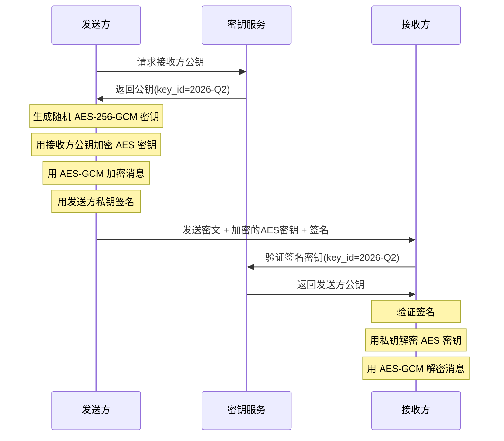

# 密码学练习方法

密码学是"做中学"的学科——只读理论不动手，永远无法真正理解密钥交换的脆弱点在哪里、Padding Oracle攻击为何能实时解密密文。本节提供5个由浅入深的实践练习，覆盖对称加密、哈希函数、RSA密钥生成、TLS配置和密钥管理五大模块。每个练习都配有具体的命令、代码和验证步骤，确保你能看到真实的输出结果。

## 练习一：对称加密与AEAD实操（预计45分钟）

### 目标

掌握AES-GCM和ChaCha20-Poly1305的加密/解密流程，理解Nonce、认证标签（Tag）的作用，亲手复现ECB模式的模式泄露缺陷。

### 前置准备

```bash
# 安装 OpenSSL（Ubuntu/Debian）
sudo apt-get update &amp;&amp; sudo apt-get install -y openssl

# 验证版本（需1.1.1+，支持AEAD）
openssl version
# 输出示例: OpenSSL 3.0.2 15 Mar 2022

# 安装 Python cryptography 库（用于编程实操）
pip install cryptography
```

### 步骤1：用 OpenSSL 体验 AES-GCM

```bash
# 生成256位随机密钥
openssl rand -hex 32
# 输出类似: a1b2c3d4e5f6a7b8c9d0e1f2a3b4c5d6e7f8a9b0c1d2e3f4a5b6c7d8e9f0a1b2

# 生成12字节（96位）随机 Nonce
openssl rand -hex 12
# 输出类似: 0123456789abcdef01234567

# 加密文件
KEY="a1b2c3d4e5f6a7b8c9d0e1f2a3b4c5d6e7f8a9b0c1d2e3f4a5b6c7d8e9f0a1b2"
NONCE="0123456789abcdef01234567"

echo "这是一段需要加密的敏感消息" > plaintext.txt

# 加密并输出密文和认证标签
openssl enc -aes-256-gcm -in plaintext.txt -out ciphertext.bin \
  -K $KEY -iv $NONCE

# 验证：解密并查看认证标签
openssl enc -aes-256-gcm -d -in ciphertext.bin -out decrypted.txt \
  -K $KEY -iv $NONCE

cat decrypted.txt
# 输出: 这是一段需要加密的敏感消息
```

**理解要点**：

| 参数 | 作用 | 要求 |
|------|------|------|
| Key（密钥） | 控制加密/解密 | 256位随机生成，通过CSPRNG |
| Nonce（随机数） | 确保相同明文产生不同密文 | 同一密钥下绝不可重复使用 |
| Tag（认证标签） | 保证密文完整性 | 128位，解密时自动验证 |

### 步骤2：复现ECB模式的模式泄露

```bash
# 创建一个包含重复模式的文件
python3 -c "
data = b'A' * 48  # 48个相同的字节（3个AES分组）
with open('ecb_test.bin', 'wb') as f:
    f.write(data)
"

# 用ECB模式加密
openssl enc -aes-256-ecb -in ecb_test.bin -out ecb_cipher.bin \
  -K $KEY

# 观察密文：3个分组产生完全相同的密文块！
xxd ecb_cipher.bin | head -5
# 你会发现3行完全一样的16字节十六进制串

# 对比：用CBC模式加密相同内容
openssl enc -aes-256-cbc -in ecb_test.bin -out cbc_cipher.bin \
  -K $KEY -iv 00000000000000000000000000000000

xxd cbc_cipher.bin | head -5
# 3个分组的密文完全不同
```

**核心结论**：ECB模式下，相同的明文块 → 相同的密文块，攻击者可以通过统计分析推断明文结构。这就是为什么ECB不适合加密任何有模式的数据（如图片、数据库记录）。

### 步骤3：用Python实现AEAD加解密

```python
from cryptography.hazmat.primitives.ciphers.aead import AESGCM, ChaCha20Poly1305
import os

# === AES-256-GCM 示例 ===
key = AESGCM.generate_key(bit_length=256)
nonce = os.urandom(12)  # 96位Nonce

# 加密
aesgcm = AESGCM(key)
plaintext = b"API Secret: sk-proj-abc123def456"
aad = b"metadata=context"  # 附加认证数据（AAD）
ciphertext = aesgcm.encrypt(nonce, plaintext, aad)

print(f"密文长度: {len(ciphertext)} 字节")
print(f"认证标签已附加在密文末尾（16字节）")

# 解密（自动验证认证标签）
decrypted = aesgcm.decrypt(nonce, ciphertext, aad)
print(f"解密结果: {decrypted.decode()}")

# 篡改检测：修改密文的一个字节
tampered = bytearray(ciphertext)
tampered[0] ^= 0x01
try:
    aesgcm.decrypt(nonce, bytes(tampered), aad)
except Exception as e:
    print(f"篡改检测: {type(e).__name__}")  # InvalidTag

# === ChaCha20-Poly1305 示例 ===
chacha_key = ChaCha20Poly1305.generate_key()
chacha_nonce = os.urandom(12)
chacha = ChaCha20Poly1305(chacha_key)

ct = chacha.encrypt(chacha_nonce, plaintext, aad)
pt = chacha.decrypt(chacha_nonce, ct, aad)
print(f"ChaCha20解密: {pt.decode()}")
```

### 检查标准

- [ ] 能用 OpenSSL 命令行完成 AES-GCM 加解密
- [ ] 能解释 Nonce 重复使用的危害（密钥流重用 → 明文异或可恢复）
- [ ] 能亲手验证 ECB 的模式泄露
- [ ] 能用 Python `cryptography` 库实现 AEAD 加解密和篡改检测

---

## 练习二：哈希函数与密码存储（预计50分钟）

### 目标

理解哈希函数的三大安全属性，掌握口令哈希函数（Argon2、PBKDF2）的参数选择，亲手演示彩虹表攻击和加盐防御。

### 步骤1：体验哈希函数的基本特性

```python
import hashlib
import time

# 雪崩效应：输入改变1比特，输出天翻地覆
msg1 = b"Hello, Cryptography!"
msg2 = b"Hello, Cryptography?"  # 仅最后1个字符不同

h1 = hashlib.sha256(msg1).hexdigest()
h2 = hashlib.sha256(msg2).hexdigest()

print(f"msg1 SHA-256: {h1}")
print(f"msg2 SHA-256: {h2}")
print(f"相同位数: {sum(a == b for a, b in zip(h1, h2))}/{len(h1)}")
# 输出: 相同位数约 2-4/64，其余全部不同

# 确定性：相同输入永远产生相同输出
assert hashlib.sha256(b"test").hexdigest() == hashlib.sha256(b"test").hexdigest()

# 计算速度对比
data = b"x" * 1_000_000  # 1MB

for algo in ['md5', 'sha1', 'sha256', 'sha512']:
    start = time.time()
    for _ in range(100):
        hashlib.new(algo, data).digest()
    elapsed = time.time() - start
    print(f"{algo:8s}: {elapsed:.3f}s (100次 × 1MB)")
```

**观察**：MD5 和 SHA-1 最快但已被破解，SHA-256 是当前推荐标准。

### 步骤2：演示"不加盐"的危险

```bash
# 安装 hashcat（密码破解工具）
# 注意：仅用于学习，不要用于非法用途
sudo apt-get install -y hashcat

# 创建一个简单的密码哈希文件（不加盐的MD5）
python3 -c "
import hashlib
passwords = ['password123', 'admin', 'letmein', 'qwerty']
with open('unsalted.txt', 'w') as f:
    for pwd in passwords:
        h = hashlib.md5(pwd.encode()).hexdigest()
        f.write(f'user:{h}\n')
        print(f'{pwd:12s} → MD5: {h}')
"

cat unsalted.txt
```

**危险演示**：攻击者可以预先计算常见密码的 MD5 哈希值（彩虹表），然后直接查表。对于 MD5，每秒可计算数十亿次——一个8位纯字母数字密码在几分钟内就能被破解。

### 步骤3：用 Argon2id 安全存储密码

```bash
pip install argon2-cffi
```

```python
from argon2 import PasswordHasher
from argon2.exceptions import VerifyMismatchError
import time

# 创建密码哈希器（参数说明见下方表格）
ph = PasswordHasher(
    time_cost=3,        # 迭代次数（时间开销）
    memory_cost=65536,   # 内存使用 64MB（阻止GPU/ASIC加速）
    parallelism=4,       # 并行线程数
    hash_len=32,         # 输出哈希长度（字节）
    salt_len=16          # 随机盐长度（字节）
)

# 安全存储密码
password = "MyStr0ng!P@ssw0rd"
start = time.time()
hash_value = ph.hash(password)
elapsed = time.time() - start

print(f"哈希结果: {hash_value}")
print(f"耗时: {elapsed:.3f}s")
print(f"哈希长度: {len(hash_value)} 字符")
# 输出类似: $argon2id$v=19$m=65536,t=3,p=4$c29tZXNhbHQ...$hash...

# 验证密码
try:
    ph.verify(hash_value, password)
    print("验证通过 ✓")
except VerifyMismatchError:
    print("验证失败 ✗")

# 错误密码验证
try:
    ph.verify(hash_value, "wrongpassword")
except VerifyMismatchError:
    print("错误密码被正确拒绝 ✓")

# 工作因子调整建议
print("\n=== Argon2id 参数选型建议 ===")
print(f"{'场景':12s} {'时间成本':8s} {'内存(MB)':10s} {'并行度':8s} {'说明'}")
print(f"{'开发环境':12s} {'1':8s} {'16':10s} {'1':8s} {'快速迭代'}")
print(f"{'Web应用':12s} {'3':8s} {'64':10s} {'4':8s} {'平衡安全与性能'}")
print(f"{'高安全场景':12s} {'5':8s} {'256':10s} {'4':8s} {'银行/支付'}")
```

| 参数 | 含义 | 推荐值 | 调优原则 |
|------|------|--------|----------|
| time_cost | 迭代轮数 | 3 | 增大使每次哈希更慢 |
| memory_cost | 内存消耗（KB） | 65536（64MB） | 阻止GPU并行破解 |
| parallelism | 并行线程 | 4 | 匹配服务器CPU核心数 |
| hash_len | 输出长度（字节） | 32 | 256位已足够 |
| salt_len | 盐长度（字节） | 16 | 128位随机盐 |

### 步骤4：从旧算法迁移到 Argon2

```python
import hashlib
from argon2 import PasswordHasher

def is_argon2_hash(stored_hash: str) -> bool:
    """判断是否为 Argon2 格式的哈希"""
    return stored_hash.startswith("$argon2")

def needs_rehash(stored_hash: str, ph: PasswordHasher) -> bool:
    """检查是否需要重新哈希（参数过旧或算法过时）"""
    if not is_argon2_hash(stored_hash):
        return True  # 非 Argon2，需要迁移
    try:
        ph.check_needs_rehash(stored_hash)
        return True  # 参数已过时
    except Exception:
        return False

# 模拟登录验证 + 透明迁移
ph = PasswordHasher()
legacy_hash = hashlib.pbkdf2_hmac('sha256', b'password', b'salt', 100000).hex()

print(f"旧格式哈希: {legacy_hash[:32]}...")
print(f"需要迁移: {needs_rehash(legacy_hash, ph)}")  # True

# 在用户下次成功登录时，静默升级哈希
def login_and_migrate(username, password, stored_hash):
    """验证旧哈希 → 计算新哈希 → 更新存储"""
    # 验证旧哈希（简化：假设你知道如何验证旧格式）
    if verify_legacy(legacy_hash, password):
        # 重新用 Argon2id 哈希
        new_hash = ph.hash(password)
        print(f"迁移完成: {new_hash[:40]}...")
        return True
    return False
```

**迁移策略要点**：不要一次性强制所有用户重新设置密码。采用"登录时透明迁移"——用户下次成功登录时，用新算法重新哈希并替换旧记录。

### 检查标准

- [ ] 能解释哈希函数三大安全属性的区别
- [ ] 能演示不加盐哈希的脆弱性
- [ ] 能用 Argon2id 正确存储和验证密码
- [ ] 能设计从旧算法到 Argon2 的透明迁移方案

---

## 练习三：RSA密钥生成与数字签名（预计60分钟）

### 目标

亲手生成RSA密钥对，实现签名和验证流程，理解密钥长度对安全性的影响，体验密钥泄露的危害。

### 步骤1：用 OpenSSL 生成 RSA 密钥对

```bash
# 生成2048位RSA私钥（生产环境推荐4096位）
openssl genpkey -algorithm RSA \
  -pkeyopt rsa_keygen_bits:2048 \
  -out private_key.pem

# 查看私钥信息
openssl pkey -in private_key.pem -text -noout | head -20
# 显示: modulus (n), publicExponent (e=65537), privateExponent (d)...

# 从私钥导出公钥
openssl pkey -in private_key.pem -pubout -out public_key.pem

# 对比：Ed25519 密钥生成（更快、更安全）
openssl genpkey -algorithm Ed25519 -out ed25519_private.pem
openssl pkey -in ed25519_private.pem -pubout -out ed25519_public.pem

# 对比密钥大小
ls -la private_key.pem ed25519_private.pem
# Ed25519 私钥文件明显更小
```

**密钥长度选型参考**：

| 安全等级 | RSA 密钥长度 | ECC 密钥长度 | 推荐用途 |
|---------|------------|------------|---------|
| 80位（已过时） | 1024位 | 160位 | ❌ 禁止使用 |
| 112位（至2030年） | 2048位 | 224位 | 一般Web应用 |
| 128位（推荐） | 3072位 | 256位 | 敏感数据 |
| 192位 | 7680位 | 384位 | 高安全场景 |
| 256位 | 15360位 | 512位 | 国防级 |

### 步骤2：实现数字签名与验证

```python
from cryptography.hazmat.primitives import hashes, serialization
from cryptography.hazmat.primitives.asymmetric import rsa, padding, ed25519
import time

# === RSA 签名 ===
private_key = rsa.generate_private_key(public_exponent=65537, key_size=2048)
public_key = private_key.public_key()

message = b"Transfer $1000 to account 12345"

# 使用 PSS 填充（推荐，比 PKCS#1 v1.5 更安全）
start = time.time()
signature = private_key.sign(
    message,
    padding.PSS(
        mgf=padding.MGF1(hashes.SHA256()),
        salt_length=padding.PSS.MAX_LENGTH
    ),
    hashes.SHA256()
)
rsa_time = time.time() - start
print(f"RSA-2048 签名耗时: {rsa_time*1000:.1f}ms, 签名大小: {len(signature)} 字节")

# RSA 签名验证
start = time.time()
public_key.verify(
    signature, message,
    padding.PSS(mgf=padding.MGF1(hashes.SHA256()), salt_length=padding.PSS.MAX_LENGTH),
    hashes.SHA256()
)
rsa_verify_time = time.time() - start
print(f"RSA-2048 验证耗时: {rsa_verify_time*1000:.1f}ms")

# 篡改消息后验证失败
tampered_msg = b"Transfer $99999 to account 12345"
try:
    public_key.verify(signature, tampered_msg,
        padding.PSS(mgf=padding.MGF1(hashes.SHA256()), salt_length=padding.PSS.MAX_LENGTH),
        hashes.SHA256())
except Exception as e:
    print(f"篡改检测: {type(e).__name__}")  # InvalidSignature

# === Ed25519 签名（对比） ===
ed_private = ed25519.Ed25519PrivateKey.generate()
ed_public = ed_private.public_key()

start = time.time()
ed_sig = ed_private.sign(message)
ed_time = time.time() - start
print(f"\nEd25519 签名耗时: {ed_time*1000:.3f}ms, 签名大小: {len(ed_sig)} 字节")

start = time.time()
ed_public.verify(ed_sig, message)
ed_verify_time = time.time() - start
print(f"Ed25519 验证耗时: {ed_verify_time*1000:.3f}ms")

print(f"\n=== 性能对比 ===")
print(f"{'算法':12s} {'签名速度':12s} {'验证速度':12s} {'签名大小'}")
print(f"{'RSA-2048':12s} {rsa_time*1000:>8.1f}ms   {rsa_verify_time*1000:>8.1f}ms   {len(signature)}字节")
print(f"{'Ed25519':12s} {ed_time*1000:>8.3f}ms   {ed_verify_time*1000:>8.3f}ms   {len(ed_sig)}字节")
```

**关键发现**：Ed25519 签名速度比 RSA 快数十倍，签名大小仅为 RSA 的1/4（64字节 vs 256字节），且安全性更高。除非需要兼容旧系统，否则应优先选择 Ed25519。

### 步骤3：体验ECDSA随机数重复的灾难

```python
from cryptography.hazmat.primitives.asymmetric import ec
import hashlib

# 模拟 Sony PS3 的 ECDSA 随机数重复漏洞
# 正常 ECDSA 签名每次应使用不同的随机数 k
# 如果 k 重复，私钥可以被直接计算出来

def ecdsa_sign_with_fixed_k(private_key, message, fixed_k):
    """故意使用固定 k 签名（模拟漏洞）"""
    # 这里简化演示原理，实际需要直接操作底层数学
    # 完整推导见下方数学说明
    pass

# 数学推导：
# 如果两条消息 m1, m2 使用相同的 k 签名：
# s1 = k^(-1) * (hash(m1) + r * private_key) mod n
# s2 = k^(-1) * (hash(m2) + r * private_key) mod n
# 则: s1 - s2 = k^(-1) * (hash(m1) - hash(m2)) mod n
# 从而: k = (hash(m1) - hash(m2)) * (s1 - s2)^(-1) mod n
# 再代入: private_key = (s1 * k - hash(m1)) * r^(-1) mod n

print("=== ECDSA 随机数重复攻击演示 ===")
print("若两条签名使用相同 k：")
print("  k = (hash(m1) - hash(m2)) × (s1 - s2)^(-1) mod n")
print("  privateKey = (s1 × k - hash(m1)) × r^(-1) mod n")
print("\n→ 私钥被完全恢复，攻击者可伪造任意签名！")
print("\n防御方案：使用 EdDSA（确定性签名，k = Hash(privateKey || message)）")
```

### 检查标准

- [ ] 能用 OpenSSL 生成 RSA 和 Ed25519 密钥对
- [ ] 能用 Python 实现签名和验证
- [ ] 能解释为什么 Ed25519 优于 ECDSA
- [ ] 能复述 ECDSA 随机数重复攻击的数学原理

---

## 练习四：TLS证书配置与验证（预计45分钟）

### 目标

搭建本地 TLS 服务器，生成自签名证书，验证 TLS 握手过程，识别常见配置错误。

### 步骤1：生成自签名证书链

```bash
# 创建实验目录
mkdir -p tls_lab &amp;&amp; cd tls_lab

# 生成 CA 私钥和自签名证书
openssl req -x509 -newkey rsa:2048 -nodes \
  -keyout ca.key -out ca.crt \
  -days 365 -subj "/CN=Lab Root CA"

# 生成服务器私钥和证书签名请求（CSR）
openssl req -newkey rsa:2048 -nodes \
  -keyout server.key -out server.csr \
  -subj "/CN=localhost"

# 用 CA 签发服务器证书
openssl x509 -req -in server.csr \
  -CA ca.crt -CAkey ca.key -CAcreateserial \
  -out server.crt -days 365

# 验证证书链
openssl verify -CAfile ca.crt server.crt
# 输出: server.crt: OK

# 查看证书详情
openssl x509 -in server.crt -text -noout | grep -E "Subject:|Issuer:|Not Before|Not After"
```

### 步骤2：启动TLS服务器并测试

```bash
# 启动一个简单的 TLS 服务器（Python）
python3 -c "
import ssl, http.server, threading

context = ssl.SSLContext(ssl.PROTOCOL_TLS_SERVER)
context.load_cert_chain('server.crt', 'server.key')
# 禁用旧协议
context.minimum_version = ssl.TLSVersion.TLSv1_2

handler = http.server.SimpleHTTPRequestHandler
httpd = http.server.HTTPServer(('localhost', 8443), handler)
httpd.socket = context.wrap_socket(httpd.socket, server_side=True)
print('TLS server running on https://localhost:8443')
httpd.serve_forever()
" &amp;

sleep 2

# 用 curl 测试（指定 CA 证书进行验证）
curl --cacert ca.crt https://localhost:8443/ 2>&amp;1 | head -5

# 查看 TLS 握手详情
curl -v --cacert ca.crt https://localhost:8443/ 2>&amp;1 | grep -E "SSL|TLS|subject|issuer|expire"

# 测试协议版本
openssl s_client -connect localhost:8443 -tls1_2 2>&amp;1 | grep "Protocol"
openssl s_client -connect localhost:8443 -tls1_3 2>&amp;1 | grep "Protocol"
# TLS 1.2 应该成功，TLS 1.3 取决于 OpenSSL 版本
```

### 步骤3：识别常见TLS配置错误

```bash
# 错误1：证书过期
openssl req -x509 -newkey rsa:2048 -nodes \
  -keyout expired.key -out expired.crt \
  -days 0 -subj "/CN=expired.local"  # 0天=立即过期

openssl verify -CAfile ca.crt expired.crt 2>&amp;1
# 输出: expired.crt: certificate has expired

# 错误2：主机名不匹配
# 证书 CN=example.com，但访问 localhost
curl --cacert ca.crt https://localhost:8443/ 2>&amp;1 | grep -i "mismatch\|verify"

# 错误3：使用自签名证书（不信任链）
curl -k https://localhost:8443/ 2>&amp;1 | head -3
# -k 参数跳过验证——生产环境绝对禁止！

# 错误4：弱密码套件检测
nmap --script ssl-enum-ciphers -p 8443 localhost 2>/dev/null | head -20
# 应该只看到 TLS_AES_256_GCM_SHA384 等强套件

# 停止测试服务器
kill %1 2>/dev/null
```

**TLS配置安全检查清单**：

| 检查项 | 安全配置 | 危险配置 |
|--------|---------|---------|
| 协议版本 | TLS 1.2 / 1.3 | SSLv3, TLS 1.0, TLS 1.1 |
| 密码套件 | AES-GCM, ChaCha20 | RC4, DES, 3DES, NULL |
| 证书密钥 | RSA ≥2048位 / ECC ≥256位 | RSA 1024位 |
| HSTS | `Strict-Transport-Security` 启用 | 未配置 |
| 证书链 | 完整（包含中间证书） | 只有终端证书 |

### 检查标准

- [ ] 能生成完整的证书链（CA → 服务器证书）
- [ ] 能启动和验证 TLS 服务器
- [ ] 能识别至少3种常见的TLS配置错误
- [ ] 能使用 `openssl s_client` 和 `curl -v` 分析握手过程

---

## 练习五：密钥管理全流程（预计50分钟）

### 目标

体验密钥的完整生命周期：安全生成 → 加密存储 → 使用 → 轮换 → 安全销毁。理解为什么密钥管理比算法选择更重要。

### 步骤1：安全生成密钥

```python
import os
import secrets
import json
from datetime import datetime

# === 使用 CSPRNG 生成密钥 ===

# 方法1：os.urandom（Python标准库，底层调用 /dev/urandom）
key_aes = os.urandom(32)  # 256位AES密钥
print(f"AES密钥(hex): {key_aes.hex()}")
print(f"密钥熵: {len(key_aes) * 8} 位")

# 方法2：secrets模块（Python 3.6+，更安全的API）
key_api = secrets.token_hex(32)  # 64字符十六进制字符串
print(f"API密钥: {key_api}")

# 验证随机性（简单统计测试）
random_bytes = os.urandom(1024)
bit_counts = bin(int.from_bytes(random_bytes, 'big')).count('1')
expected = 1024 * 8 / 2  # 理想值: 4096
print(f"位统计: {bit_counts} (理想值: {expected}, 偏差: {abs(bit_counts-expected)/expected*100:.1f}%)")
# 偏差应小于 3%

# 绝对禁止的做法
# key = "my-secret-key".encode()  # ❌ 硬编码密钥
# key = hashlib.md5(b"password").digest()  # ❌ 从弱密码派生
# key = bytes.fromhex("00000000000000000000000000000000")  # ❌ 全零密钥
```

### 步骤2：加密存储密钥（Envelope Encryption）

```python
import json
import os
from cryptography.hazmat.primitives.ciphers.aead import AESGCM

# 模拟"信封加密"模式：用主密钥加密数据密钥
def generate_master_key():
    """生成主密钥（实际应存入HSM或KMS）"""
    return AESGCM.generate_key(bit_length=256)

def encrypt_data_key(master_key, data_key):
    """用主密钥加密数据密钥"""
    nonce = os.urandom(12)
    aesgcm = AESGCM(master_key)
    encrypted_dk = aesgcm.encrypt(nonce, data_key, b"data-key-encryption")
    return nonce + encrypted_dk  # Nonce + 加密密钥

def decrypt_data_key(master_key, encrypted_blob):
    """解密数据密钥"""
    nonce = encrypted_blob[:12]
    ciphertext = encrypted_blob[12:]
    aesgcm = AESGCM(master_key)
    return aesgcm.decrypt(nonce, ciphertext, b"data-key-encryption")

# 完整流程演示
master_key = generate_master_key()
data_key = os.urandom(32)

print("=== 信封加密流程 ===")
print(f"1. 主密钥生成: {master_key.hex()[:32]}...")
print(f"2. 数据密钥生成: {data_key.hex()[:32]}...")

# 加密存储数据密钥
encrypted_dk_blob = encrypt_data_key(master_key, data_key)
print(f"3. 加密后的数据密钥: {encrypted_dk_blob.hex()[:32]}...")

# 用数据密钥加密实际数据
aesgcm = AESGCM(data_key)
nonce = os.urandom(12)
secret_data = b"数据库连接字符串: postgresql://user:pass@db:5432/prod"
encrypted_data = aesgcm.encrypt(nonce, secret_data, None)
print(f"4. 加密数据: {encrypted_data.hex()[:32]}...")

# 解密流程
recovered_dk = decrypt_data_key(master_key, encrypted_dk_blob)
aesgcm2 = AESGCM(recovered_dk)
decrypted = aesgcm2.decrypt(nonce, encrypted_data, None)
print(f"5. 解密结果: {decrypted.decode()}")
```

### 步骤3：密钥轮换

```python
import time
from dataclasses import dataclass, field
from typing import List

@dataclass
class KeyVersion:
    key_id: str
    key_material: bytes
    created_at: str
    status: str = "active"  # active | retired | destroyed
    encrypted_data: List[bytes] = field(default_factory=list)

class KeyRotator:
    def __init__(self):
        self.keys: List[KeyVersion] = []

    def rotate(self, new_key_material: bytes = None):
        """轮换密钥：旧密钥退役，生成新密钥"""
        # 退役旧密钥
        for key in self.keys:
            if key.status == "active":
                key.status = "retired"
                print(f"  旧密钥 {key.key_id} 状态: active → retired")

        # 生成新密钥
        new_id = f"key-{int(time.time())}"
        material = new_key_material or os.urandom(32)
        new_key = KeyVersion(
            key_id=new_id,
            key_material=material,
            created_at=time.strftime("%Y-%m-%d %H:%M:%S"),
            status="active"
        )
        self.keys.append(new_key)
        print(f"  新密钥 {new_id} 已创建（status: active）")
        return new_key

    def get_active_key(self):
        for key in self.keys:
            if key.status == "active":
                return key
        raise RuntimeError("没有可用的活动密钥")

    def destroy_key(self, key_id: str):
        """安全销毁密钥"""
        for key in self.keys:
            if key.key_id == key_id:
                # 用随机数据覆盖内存
                key.key_material = os.urandom(len(key.key_material))
                key.key_material = b'\x00' * len(key.key_material)
                key.status = "destroyed"
                print(f"  密钥 {key_id} 已安全销毁")
                return
        raise KeyError(f"密钥 {key_id} 不存在")

# 演示密钥轮换流程
rotator = KeyRotator()

print("=== 密钥轮换流程 ===")
print("\n--- 第1轮：初始密钥 ---")
k1 = rotator.rotate()

print("\n--- 第2轮：轮换 ---")
k2 = rotator.rotate()

print("\n--- 第3轮：再次轮换 ---")
k3 = rotator.rotate()

print("\n--- 销毁退役密钥 ---")
for key in rotator.keys:
    if key.status == "retired":
        rotator.destroy_key(key.key_id)

print(f"\n--- 当前状态 ---")
for key in rotator.keys:
    print(f"  {key.key_id}: {key.status}")
```

### 步骤4：用 HashiCorp Vault 模拟KMS（选做）

```bash
# 如果有 Docker 环境，可以体验 Vault
docker run -d --name vault -p 8200:8200 \
  -e 'VAULT_DEV_ROOT_TOKEN_ID=myroot' \
  hashicorp/vault:latest

# 写入密钥
curl -s -H "X-Vault-Token: myroot" \
  -X POST -d '{"data":{"key":"a1b2c3d4..."}}' \
  http://localhost:8200/v1/secret/data/my-api-key

# 读取密钥
curl -s -H "X-Vault-Token: myroot" \
  http://localhost:8200/v1/secret/data/my-api-key

# 启用自动轮换（配置示例）
# vault write secret/roles/my-key \
#   vault.rotate.type=aes256 \
#   rotation_period=720h \
#   rotation_schedule="0 0 1 * *"

docker stop vault &amp;&amp; docker rm vault
```

### 检查标准

- [ ] 能用 CSPRNG 安全生成密钥（理解为什么不能用 `random` 模块）
- [ ] 能实现信封加密（主密钥保护数据密钥）
- [ ] 能设计密钥轮换策略（active → retired → destroyed）
- [ ] 理解 HSM、KMS、Vault 的区别和适用场景

---

## 综合挑战：设计一个安全的消息系统（预计90分钟）

将前四个练习的知识综合应用，设计并实现一个端到端加密的简单消息系统。

### 需求

1. 发送方用接收方的公钥加密消息
2. 接收方用私钥解密
3. 消息附带数字签名，确保来源可信
4. 支持密钥轮换
5. 记录审计日志

### 参考架构



### 检查标准

- [ ] 混合加密方案正确（RSA/Ed25519 + AES-GCM）
- [ ] 数字签名验证消息来源和完整性
- [ ] 密钥轮换后旧消息仍可解密
- [ ] 审计日志记录所有密钥操作

---

## 速查：密码学工具箱

| 工具 | 用途 | 安装 |
|------|------|------|
| `openssl` | 证书/密钥生成、TLS测试 | `apt install openssl` |
| `cryptography` | Python密码学库 | `pip install cryptography` |
| `argon2-cffi` | Argon2密码哈希 | `pip install argon2-cffi` |
| `hashcat` | 密码强度测试（仅学习） | `apt install hashcat` |
| `nmap` | TLS配置审计 | `apt install nmap` |
| `step-cli` | 现代证书管理 | `brew install step` |
| `age` | 简单文件加密 | `apt install age` |
| `sops` | 密钥加密的配置文件 | `brew install sops` |
