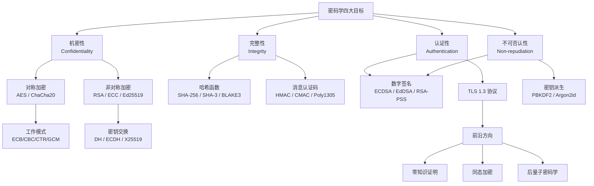

## 本章小结

本章从理论基础到工程实践，系统讲解了密码学的核心概念、关键算法和最佳实践。密码学是信息安全的数学基石，为数据的机密性、完整性、认证性和不可否认性提供技术保障。以下是本章核心知识的系统回顾。

---

### 一、核心知识体系总览

---

### 二、核心知识点回顾

#### 1. 密码学基础框架

**四大安全目标及其关系**：

| 安全目标 | 英文 | 核心问题 | 典型实现手段 |
|----------|------|----------|-------------|
| 机密性 | Confidentiality | 未授权者无法读取数据 | 对称加密（AES）、非对称加密（RSA/ECC） |
| 完整性 | Integrity | 数据未被篡改 | 哈希函数（SHA-256）、MAC（HMAC） |
| 认证性 | Authentication | 通信对方是真实身份 | 数字签名、证书体系 |
| 不可否认性 | Non-repudiation | 发送方无法否认已发送 | 数字签名（非对称密钥对） |

**柯克霍夫原则（Kerckhoffs's Principle）**：密码系统的安全性完全依赖于密钥的保密性，而非算法的保密性。这意味着算法应当公开接受密码分析审查，密钥应当可以随时轮换而无需更换算法。

**密码学原语分类速查**：

| 原语类型 | 代表算法 | 安全目标 | 典型应用场景 |
|----------|----------|----------|-------------|
| 对称加密 | AES-256-GCM, ChaCha20-Poly1305 | 机密性 | 文件加密、数据库加密、TLS数据传输 |
| 非对称加密 | RSA-2048, ECIES (P-256) | 机密性（小数据） | 密钥交换、数字信封 |
| 哈希函数 | SHA-256, SHA-3, BLAKE3 | 完整性 | 密码存储（经KDF）、数据指纹、区块链 |
| 消息认证码 | HMAC-SHA256, AES-CMAC, Poly1305 | 认证+完整性 | API请求签名、TLS记录认证 |
| 数字签名 | Ed25519, ECDSA, RSA-PSS | 认证+不可否认性 | 代码签名、TLS证书、区块链交易 |
| 密钥派生 | PBKDF2, scrypt, Argon2id | 密钥生成 | 口令哈希、会话密钥派生 |
| 密钥交换 | X25519, ECDH (P-256), DH (2048-bit) | 共享密钥协商 | TLS握手、Signal协议 |

#### 2. 对称加密

**AES（Advanced Encryption Standard）**是当前最广泛使用的对称加密算法：

- **分组大小**：128位（16字节）
- **密钥长度**：128/192/256位，对应10/12/14轮
- **核心组件**：S-Box（非线性替换）+ ShiftRows（行移位）+ MixColumns（列混合）+ AddRoundKey（轮密钥加）
- **安全性**：抵抗已知的线性密码分析和差分密码分析，无已知的实用攻击

**AES工作模式对比**：

| 模式 | 全称 | 并行性 | 需要填充 | 认证 | 推荐场景 |
|------|------|--------|----------|------|----------|
| ECB | 电子密码本 | 加密可并行 | 是 | 无 | ❌ 不应使用 |
| CBC | 密码块链接 | 解密可并行 | 是（PKCS#7） | 无 | 遗留系统兼容 |
| CTR | 计数器模式 | 加解密均可并行 | 否 | 无 | 随机访问需求 |
| GCM | Galois/Counter | 加解密均可并行 | 否 | ✅ AEAD | **首选**，TLS 1.3默认 |
| ChaCha20-Poly1305 | — | 加解密均可并行 | 否 | ✅ AEAD | 无AES-NI硬件的平台 |

**关键规则**：
- 永远不要使用ECB模式——它泄露数据模式，相同明文产生相同密文
- 优先选择AEAD模式（AES-GCM或ChaCha20-Poly1305），同时提供加密和认证
- GCM模式下Nonce长度推荐96位，绝不在同一密钥下重复使用Nonce
- 同一密钥加密的数据量不应超过2³²条记录（GCM的生日界限）

**ChaCha20-Poly1305**优势：
- 基于ARX（Add-Rotate-XOR）操作，纯软件实现效率高
- 在无AES-NI指令的ARM移动设备上性能优于AES
- 签名过程确定性，不依赖随机数生成器
- 被TLS 1.3、WireGuard VPN、SSH广泛采用

#### 3. 非对称加密

**RSA**基于大整数分解的计算困难性：

密钥生成：
  1. 选择大素数 p, q（各2048位+）
  2. 计算 n = p × q
  3. 计算 φ(n) = (p-1)(q-1)
  4. 选择 e，通常 e = 65537
  5. 计算 d ≡ e⁻¹ (mod φ(n))

公钥: (n, e)    私钥: (n, d)
加密: c ≡ mᵉ (mod n)
解密: m ≡ cᵈ (mod n)

**RSA安全参数**：

| 安全等级 | RSA密钥长度 | 保护年限 | ECC密钥长度 | RSA与ECC密钥比 |
|----------|------------|---------|------------|---------------|
| 80位 | 1024位 | 已不安全 | 160位 | 6:1 |
| 112位 | 2048位 | 至2030年 | 224位 | 9:1 |
| 128位 | 3072位 | 至2030年+ | 256位 | 12:1 |
| 192位 | 7680位 | 长期 | 384位 | 20:1 |
| 256位 | 15360位 | 长期 | 512位 | 30:1 |

**ECC（椭圆曲线密码学）**基于椭圆曲线离散对数问题（ECDLP）：
- 同等安全级别下密钥更短、计算更快、带宽消耗更少
- 特别适合移动设备、IoT、嵌入式场景
- 常用曲线：NIST P-256/P-384、Curve25519、secp256k1（比特币）

**Diffie-Hellman密钥交换**：
- 允许双方在不安全信道上协商共享密钥
- **前向保密（Forward Secrecy）**：使用临时密钥对（DHE/ECDHE），即使长期私钥泄露，历史会话仍安全
- TLS 1.3强制使用ECDHE或X25519，不再支持静态DH

**Ed25519/EdDSA**是当前推荐的签名算法：
- 签名64字节，公钥32字节，速度约10,000-50,000次/秒
- 确定性签名（无需随机数），避免了ECDSA因随机数质量问题导致的安全漏洞
- 天然抵抗侧信道攻击
- 被Signal协议、Tor、SSH、区块链广泛采用

#### 4. 哈希函数

**三大安全属性**：

| 属性 | 定义 | 攻击模型 | 强度要求 |
|------|------|----------|----------|
| 原像抗性 | 给定h，找m使H(m)=h | 单向攻击 | 2ⁿ（n为输出位数） |
| 第二原像抗性 | 给定m₁，找m₂≠m₁使H(m₁)=H(m₂) | 碰撞攻击 | 2ⁿ |
| 抗碰撞性 | 找任意m₁≠m₂使H(m₁)=H(m₂) | 生日攻击 | 2^(n/2) |

**主流哈希算法对比**：

| 算法 | 输出长度 | 构造方式 | 性能特点 | 主要应用 |
|------|----------|----------|----------|----------|
| SHA-256 | 256位 | Merkle-Damgård | 硬件加速后极快 | TLS、证书、比特币 |
| SHA-3-256 | 256位 | 海绵构造 | 无硬件加速时较慢 | 后备标准、NIST推荐 |
| BLAKE3 | 可变 | Merkle树 | 64核并行可达14GB/s | 文件校验、大文件哈希 |
| SHA-512 | 512位 | Merkle-Damgård | 64位平台更快 | 高安全需求场景 |

**口令哈希（KDF）**是保护用户密码的关键环节：

| 算法 | 设计特点 | 推荐参数 | 适用场景 |
|------|----------|----------|----------|
| PBKDF2 | 迭代哈希，标准化 | 至少600,000次迭代（SHA-256） | 遗留系统兼容 |
| scrypt | 内存硬函数 | N=2^20, r=8, p=1 | 中等安全需求 |
| Argon2id | 2015年密码哈希竞赛冠军 | 内存64MB+，迭代3次+ | **首选方案** |
| bcrypt | Blowfish密钥扩展 | cost=12+ | 遗留系统（PHP/Laravel） |

#### 5. 数字签名与消息认证

**数字签名工作原理**：
- 签名：使用私钥对消息摘要进行签名
- 验证：使用公钥验证签名的有效性
- 保证：认证性（身份确认）+ 不可否认性（无法抵赖）

**主要签名算法对比**：

| 算法 | 密钥长度 | 签名大小 | 速度 | 安全性 | 推荐度 |
|------|----------|----------|------|--------|--------|
| Ed25519 | 32字节公钥 | 64字节 | 极快 | 128位 | ⭐⭐⭐ 首选 |
| ECDSA (P-256) | 32字节公钥 | 64字节 | 快 | 128位 | ⭐⭐ 通用 |
| RSA-PSS (2048) | 256字节公钥 | 256字节 | 中等 | 112位 | ⭐ 兼容 |

**消息认证码（MAC）**：
- **HMAC**：基于哈希函数（如HMAC-SHA256），通用且安全
- **CMAC**：基于分组密码（如AES-CMAC），适合硬件实现
- **Poly1305**：一次性MAC，与ChaCha20配对使用，极快

**Encrypt-then-MAC vs MAC-then-Encrypt**：
- ✅ **Encrypt-then-MAC**（推荐）：先加密再认证，先验证MAC再解密
- ❌ MAC-then-Encrypt：先认证再加密，容易受到填充预言攻击
- ✅ **AEAD**（最佳）：AES-GCM/ChaCha20-Poly1305，加密和认证同时完成

#### 6. 密钥管理

密钥管理是密码学工程中最容易出错的环节——"密钥管理重于算法选择"。

**密钥生命周期**：

| 阶段 | 操作 | 安全要求 |
|------|------|----------|
| 生成 | 使用CSPRNG（如/dev/urandom） | 密钥必须是密码学安全的随机数 |
| 存储 | 硬件安全模块（HSM）、密钥保险库 | 禁止明文存储、禁止硬编码 |
| 分发 | 密封信封（RSA加密）、密钥协商（DH） | 仅限AES-GCM+密钥封装 |
| 使用 | 内存中最小化暴露时间 | 使用后立即清零 |
| 轮换 | 定期更换密钥 | 旧密钥解密历史数据后销毁 |
| 销毁 | 安全擦除（覆写内存） | 密钥使用后立即销毁 |

**密钥存储方案优先级**：
1. **HSM（硬件安全模块）**：最高安全级别，密钥永不离开硬件
2. **云KMS**：AWS KMS、GCP KMS、Azure Key Vault
3. **密钥保险库**：HashiCorp Vault、etcd加密存储
4. **环境变量**：仅限开发环境，生产环境禁止
5. ❌ **硬编码在源代码中**：绝对禁止，密钥一旦进入版本控制就已泄露

**密钥轮换策略**：
- 对称密钥：每90天轮换，或加密数据量超过阈值
- 非对称密钥对：每年轮换，或怀疑泄露时立即轮换
- TLS证书：Let's Encrypt提供90天自动续签
- 密码哈希：当计算能力提升导致当前参数不够安全时升级参数

#### 7. TLS 1.3协议

TLS 1.3是当前安全通信的标准协议，大幅简化了握手流程：

**TLS 1.3握手流程（1-RTT）**：
客户端                                    服务端
  |                                         |
  |  ClientHello                            |
  |  + supported_versions: TLS 1.3          |
  |  + key_share: X25519公钥                |
  |  + signature_algorithms: Ed25519        |
  |  + psk_key_exchange_modes               |
  |  ──────────────────────────────────→    |
  |                                         |
  |            ServerHello                   |
  |            + key_share: X25519公钥       |
  |            + encrypted_extensions       |
  |            + certificate                |
  |            + certificate_verify         |
  |            + finished                   |
  |  ←──────────────────────────────────    |
  |                                         |
  |  [客户端验证证书，计算主密钥]              |
  |  finished                               |
  |  ──────────────────────────────────→    |
  |                                         |
  |  ═══════ 加密数据传输 ═══════            |

**TLS 1.3 vs TLS 1.2**：

| 特性 | TLS 1.2 | TLS 1.3 |
|------|---------|---------|
| 握手RTT | 2-RTT | 1-RTT（支持0-RTT） |
| 密钥交换 | RSA/DHE/ECDHE | 仅DHE/ECDHE/X25519 |
| 对称加密 | AES-CBC/GCM, 3DES等 | 仅AES-256-GCM, AES-128-GCM, ChaCha20-Poly1305 |
| 哈希 | SHA-256/384 | 仅SHA-256/384 |
| 前向保密 | 可选 | 强制 |
| 压缩 | 支持 | 禁止（防CRIME攻击） |
| 安全性 | 遗留算法带来风险 | 无妥协 |

**TLS密码套件选择指南**：
- **首选**：`TLS_AES_256_GCM_SHA384`（服务器有AES-NI时）
- **移动优先**：`TLS_CHACHA20_POLY1305_SHA256`（无AES硬件加速时）
- **兼容**：`TLS_AES_128_GCM_SHA256`（低资源设备）

#### 8. 前沿密码学方向

| 方向 | 核心思想 | 当前状态 | 潜在应用 |
|------|----------|----------|----------|
| 零知识证明（ZKP） | 证明知道某信息而不泄露信息本身 | zk-SNARK/zk-STARK已在区块链应用 | 隐私保护身份验证、可验证计算 |
| 同态加密（HE） | 对密文直接计算，结果解密后等同于对明文计算 | 部分同态实用，全同态仍慢百万倍 | 隐私保护机器学习、云计算 |
| 后量子密码学（PQC） | 抵抗量子计算机攻击的算法 | NIST已标准化CRYSTALS-Kyber/Dilithium | 密钥封装、数字签名 |
| 安全多方计算（MPC） | 多方联合计算而不泄露各自输入 | 金融、医疗领域开始应用 | 隐私保护数据分析 |
| 可搜索加密（SE） | 对加密数据进行搜索 | 研究阶段 | 云存储隐私保护 |

**后量子密码学关键算法（NIST 2024标准）**：
- **CRYSTALS-Kyber**（密钥封装）：基于格（Lattice）问题，推荐参数ML-KEM-768
- **CRYSTALS-Dilithium**（数字签名）：基于格问题，推荐参数ML-DSA-65
- **SPHINCS+**（哈希签名）：作为备用签名方案

---

### 三、密码学工程五条铁律

这五条铁律是本章最重要的工程实践指导，贯穿整个密码学应用：

| 铁律 | 内容 | 常见违反方式 |
|------|------|-------------|
| ① 不要自己发明算法 | 使用标准算法（AES、SHA-256）和成熟库（libsodium、cryptography） | 自创加密方案、使用MD5/SHA-1 |
| ② 永远不用ECB | ECB泄露数据模式，使用AEAD或至少CBC+HMAC | 视频/图像加密使用ECB模式 |
| ③ 密钥管理重于算法 | 密钥必须通过CSPRNG生成、安全存储、定期轮换 | 密钥硬编码在源码中、不轮换 |
| ④ 加密≠安全 | 加密只保证机密性，必须使用AEAD或Encrypt-then-MAC | 只加密不认证、MAC-then-Encrypt |
| ⑤ 为密码敏捷性设计 | 系统应支持密码组件快速替换，为后量子迁移做准备 | 算法硬编码在协议中、无法替换 |

---

### 四、密码原语选型决策树

面对具体场景时，如何选择正确的密码原语：

需要加密数据？
├── 是 → 数据量大（文件/流）？
│   ├── 是 → 对称加密
│   │   ├── 有AES硬件加速？→ AES-256-GCM
│   │   └── 无AES硬件加速？→ ChaCha20-Poly1305
│   └── 否 → 数据量小（密钥/令牌）？
│       ├── 是 → 非对称加密（RSA-OAEP或ECIES）
│       └── 否 → 混合加密（RSA/ECDH交换对称密钥 + AES-GCM）
├── 否 → 需要完整性验证？
│   ├── 是 → 数据已有密钥保护？
│   │   ├── 是 → HMAC-SHA256（有密钥时）
│   │   └── 否 → SHA-256（无密钥时）
│   └── 否 → 需要身份认证？
│       ├── 是 → 需要不可否认性？
│       │   ├── 是 → 数字签名（Ed25519首选）
│       │   └── 否 → MAC（HMAC/CMAC）
│       └── 否 → 需要密钥派生？
│           └── 是 → 口令→密钥：Argon2id
│               高速密钥派生：HKDF-SHA256

---

### 五、最佳实践清单

**算法与协议选择**：

- [ ] 使用标准算法，不自行发明加密方案
- [ ] 对称加密优先选择AES-256-GCM或ChaCha20-Poly1305（AEAD模式）
- [ ] 签名优先选择Ed25519，兼容场景可选ECDSA (P-256)
- [ ] 密钥交换使用X25519或ECDHE，确保前向保密
- [ ] 口令哈希使用Argon2id，最低参数：内存64MB、迭代3次
- [ ] 哈希函数使用SHA-256或SHA-3，不再使用MD5和SHA-1
- [ ] TLS版本使用1.3，最低兼容1.2

**密钥管理**：

- [ ] 密钥使用CSPRNG生成（/dev/urandom或crypto.randomBytes）
- [ ] 密钥不硬编码在源代码中，不提交到版本控制
- [ ] 生产环境密钥存储在HSM或云KMS中
- [ ] 对称密钥定期轮换（建议90天或加密数据量阈值）
- [ ] 旧密钥安全销毁（覆写内存，不依赖GC）
- [ ] 密钥派生使用HKDF或PBKDF2，不直接使用原始随机数

**实现安全**：

- [ ] 使用成熟密码库（libsodium、cryptography、OpenSSL）
- [ ] 不自行实现密码学原语
- [ ] Nonce/IV使用随机生成或计数器，绝不重复
- [ ] 使用Encrypt-then-MAC或AEAD，不使用MAC-then-Encrypt
- [ ] 比较签名使用常量时间比较（hmac.compare_digest）
- [ ] 密码比较使用常量时间函数，避免时序攻击

**部署与运维**：

- [ ] 证书使用ACME自动续签（如Let's Encrypt + certbot）
- [ ] 配置HSTS头，启用证书固定（Certificate Pinning）
- [ ] 定期扫描TLS配置（使用testssl.sh或ssllabs.com）
- [ ] 监控证书过期时间，提前告警
- [ ] 为后量子迁移预留密码敏捷性（算法可替换架构）

---

### 六、常见密码学误用速查表

| 误用方式 | 危害 | 正确做法 |
|----------|------|----------|
| 使用ECB模式加密 | 数据模式完全泄露 | 使用AES-GCM或AES-CBC+HMAC |
| MD5/SHA-1做密码哈希 | 碰撞攻击可行，彩虹表破解 | 使用Argon2id配高迭代参数 |
| 自创加密算法 | 几乎必然存在未知漏洞 | 使用AES-256-GCM |
| 硬编码密钥在源码中 | 密钥泄露到版本控制 | 使用环境变量或KMS |
| 比较签名使用== | 时序侧信道泄露 | 使用hmac.compare_digest() |
| RSA不使用OAEP填充 | 选择密文攻击 | 使用RSA-OAEP |
| ECB模式加密视频 | 视频内容轮廓清晰可见 | 使用AES-GCM |
| 口令直接做密钥 | 口令空间太小，暴力破解 | 通过Argon2id/PBKDF2派生密钥 |
| 随机数使用Math.random() | 可预测，不满足密码学安全 | 使用crypto.randomBytes() |
| 忽略密钥轮换 | 长期使用增加泄露风险 | 定期轮换密钥 |

---

### 七、性能参考数据

**AES-256-GCM在不同平台的吞吐量**（参考值）：

| 平台 | 硬件特性 | AES-256-GCM吞吐量 | ChaCha20-Poly1305吞吐量 |
|------|----------|-------------------|------------------------|
| Intel Xeon (Skylake+) | AES-NI + AVX-512 | ~5 GB/s | ~2 GB/s |
| AMD Ryzen (Zen 2+) | AES-NI + AVX2 | ~4 GB/s | ~1.5 GB/s |
| ARM Cortex-A76 | 无AES-NI | ~300 MB/s | ~800 MB/s |
| Apple M1/M2 | AES-NI | ~3 GB/s | ~1.5 GB/s |

**关键结论**：在有AES-NI硬件加速的x86平台上AES-GCM更快；在ARM移动设备上ChaCha20-Poly1305更快。TLS 1.3客户端通常会根据服务器支持情况自动选择最优密码套件。

---

### 八、下一步学习建议

**深入学习方向**：

1. **密码学理论深化**：
   - 理解可证明安全（Provable Security）框架
   - 学习归约证明（Reduction Proof）方法论
   - 了解随机预言机模型（ROM）与标准模型的区别

2. **高级协议分析**：
   - TLS 1.3完整规范（RFC 8446）
   - Signal协议的双棘轮算法（Double Ratchet）
   - OAuth 2.0 / OpenID Connect中的密码学应用

3. **后量子密码学准备**：
   - 学习格密码（Lattice-based Cryptography）基础
   - 了解NIST后量子密码标准化进程
   - 测试CRYSTALS-Kyber和CRYSTALS-Dilithium的集成

4. **实战项目推荐**：
   - 用OpenSSL/libsodium实现一个简单的安全聊天协议
   - 搭建私有CA并签发证书
   - 实现一个基于Ed25519的代码签名工具
   - 用零知识证明实现隐私保护的身份验证Demo

**推荐资源**：

| 类型 | 推荐 | 说明 |
|------|------|------|
| 入门书籍 | 《图解密码学》（结城浩） | 零基础友好，图文并茂 |
| 经典教材 | 《应用密码学》（Bruce Schneier） | 工程实践经典 |
| 理论教材 | 《密码编码学与网络安全》（Stallings） | 学术与工程平衡 |
| 在线课程 | Coursera: Cryptography I（Dan Boneh） | 斯坦福大学，免费 |
| 实践指南 | Practical Cryptography for Developers（Svetlin Nakov） | 代码导向 |
| 官方规范 | RFC 8446（TLS 1.3）、NIST SP 800-57（密钥管理） | 权威标准 |
| 工具库 | libsodium、cryptography (Python)、OpenSSL | 生产级密码库 |
| 在线工具 | testssl.sh、ssllabs.com、hashcat | 安全测试与审计 |

---

### 九、思考题

**基础理解**：

1. 为什么柯克霍夫原则是现代密码学的基石？如果违背这个原则会导致什么后果？请举例说明"隐蔽式安全"的失败案例。

2. 对比AES-GCM和ChaCha20-Poly1305各自的优劣势。在什么场景下应该优先选择ChaCha20-Poly1305？

3. 解释为什么ECB模式不能用于加密结构化数据（如数据库记录、图像），而CTR模式可以。用具体例子说明。

**进阶应用**：

4. 在一个微服务架构中，如何设计端到端的密钥管理方案？考虑服务间通信、数据库加密、日志脱敏等场景，画出密钥流转架构图。

5. TLS 1.3为什么强制要求前向保密（Forward Secrecy）？如果没有前向保密，长期密钥泄露会造成什么后果？结合实际泄露事件分析。

6. 为什么口令存储必须使用Argon2id而不是简单的SHA-256哈希？从彩虹表攻击、GPU并行攻击、时间-存储权衡攻击三个角度分析。

**前沿思考**：

7. 后量子密码学迁移面临哪些工程挑战？对于一个已经部署了RSA-2048和ECDHE的系统，应该如何规划迁移路径？

8. 零知识证明在隐私保护身份验证中的工作原理是什么？与传统密码学认证有何本质区别？

9. 如果你需要设计一个"密码敏捷"的系统，使得未来可以无缝替换底层密码算法，你会如何设计架构？考虑协议版本协商、密钥格式、证书兼容性等因素。

---

*软件工程核心知识体系 · 第33章 · 本章小结*
