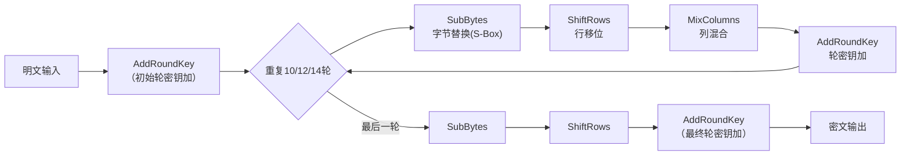
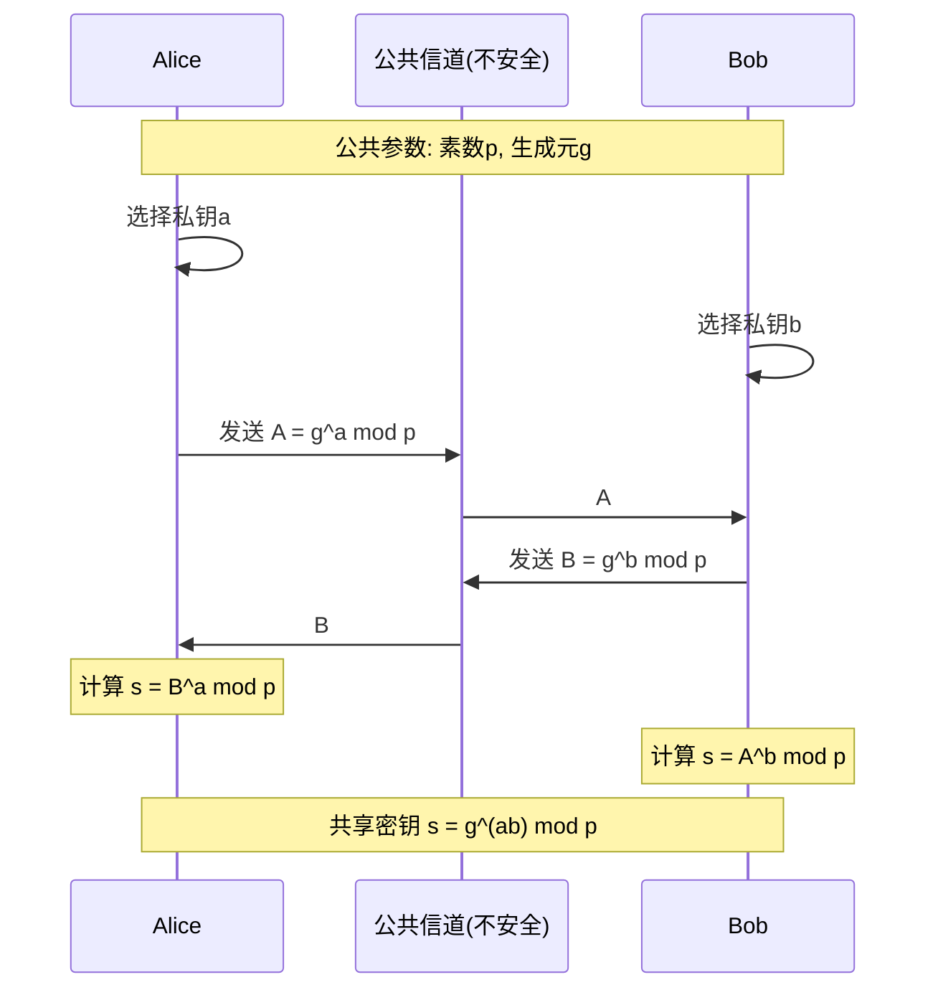
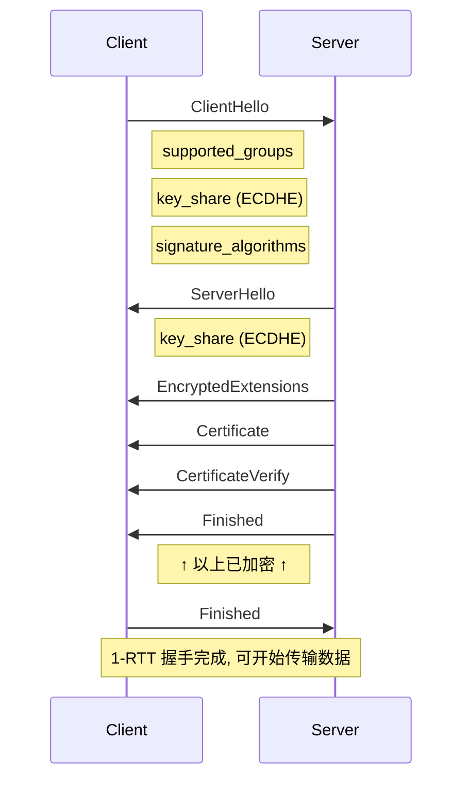
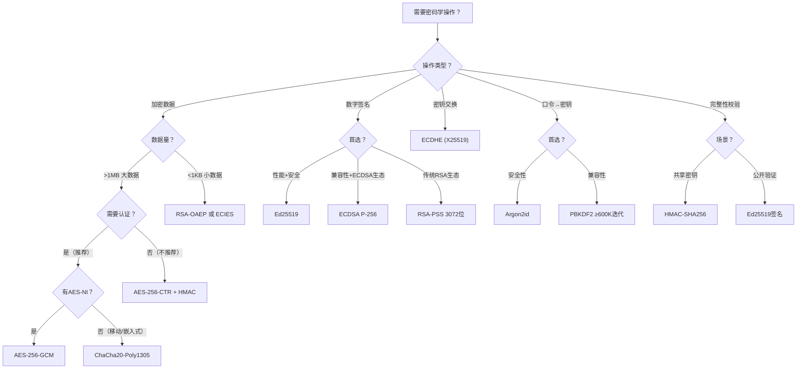
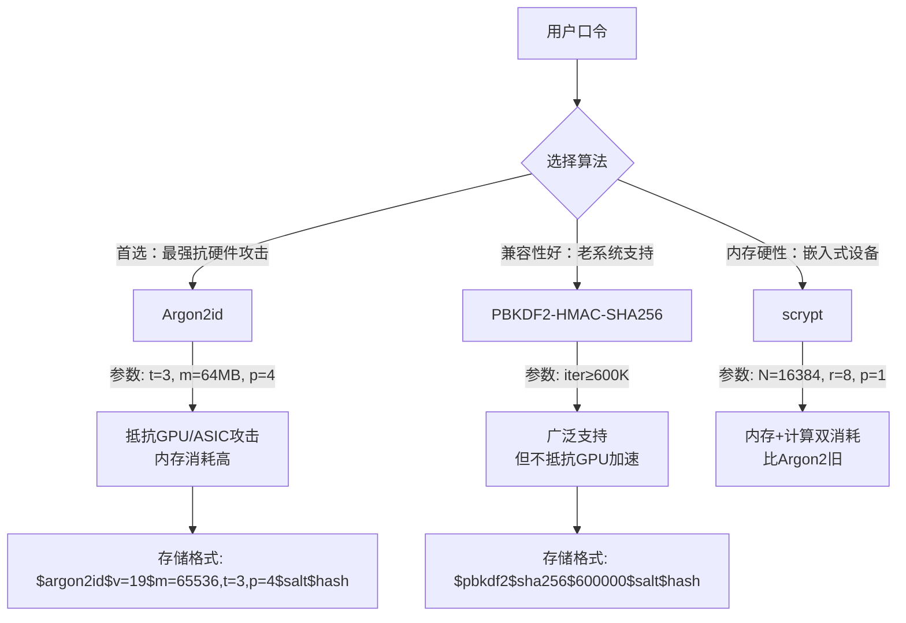
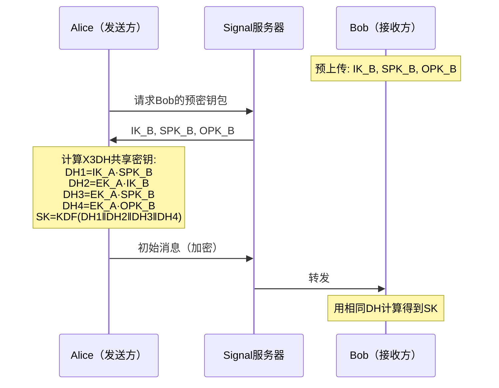

# 第33章 密码学

## 章节定位

密码学（Cryptography）是信息安全的数学基础，为数据的机密性、完整性、认证性和不可否认性提供理论支撑和技术手段。本章从AES内部结构到后量子密码学迁移，覆盖密码学工程的完整知识链。

### 为什么软件工程师需要学习密码学

密码学不是"加密"这么简单——它是现代数字世界信任链的基石。一次密码学工程失误就可能危及数百万用户的数据安全：Heartbleed漏洞（2014）因OpenSSL的内存泄露暴露了私钥和会话数据，影响了全球约17%的安全Web服务器；Log4Shell（2021）虽主要是注入漏洞，但在许多系统中触发了对密码学组件的连锁攻击；LastPass（2022）因为信封加密的密钥保护层实现不当，导致用户加密的密码库被攻击者窃取。这些事件的共同特点是：问题不在于算法本身，而在于**工程实现**——错误的模式选择、不安全的密钥管理、未经验证的自定义方案。

本书作为软件工程师的参考指南，我们不期望你成为密码学家，但你必须能够：正确选择算法和工作模式、理解API的安全边界、识别常见的密码学误用、与安全团队有效沟通。以下五条铁律是贯穿本章的核心原则。

**密码学工程的五条铁律**：

1. **永远不要自己发明密码学算法**：使用经过审查的标准算法（AES、SHA-256、Ed25519）和成熟库（libsodium、cryptography、OpenSSL）
2. **永远不要使用ECB模式**：ECB泄露数据模式，必须使用AEAD（如AES-GCM）或至少CBC+HMAC
3. **密钥管理重于算法选择**：再好的算法也会因密钥管理不当而失效——密钥必须通过CSPRNG生成、安全存储、定期轮换
4. **加密≠安全**：加密只保证机密性，不保证完整性和认证性。必须使用AEAD或Encrypt-then-MAC
5. **为密码敏捷性而设计**：系统应支持密码组件的快速替换，为后量子迁移做好准备

## 核心主题

**密码学基础**：机密性（Confidentiality）、完整性（Integrity）、认证性（Authentication）、不可否认性（Non-repudiation）构成了信息安全的四大支柱，密码学为这四个目标提供技术实现。

**对称加密**：AES（Advanced Encryption Standard）是当前最广泛使用的对称加密算法。本章深入讲解AES的S-Box设计、轮函数结构、密钥扩展机制，以及ECB、CBC、CTR、GCM等工作模式的区别和适用场景。ChaCha20作为新兴的流密码算法，在移动设备和TLS中得到广泛应用。

**非对称加密**：RSA基于大数分解的数学难题，ECC（椭圆曲线密码）基于离散对数难题，Diffie-Hellman密钥交换实现了不安全信道上的密钥协商。本章讲解这些算法的数学原理和工程实现。

**哈希函数**：SHA-256、SHA-3 Keccak、BLAKE3等哈希算法的设计原理和安全属性，包括抗碰撞性、原像抗性、第二原像抗性等概念。

**数字签名与消息认证**：RSA签名、ECDSA、EdDSA等数字签名算法，HMAC、CMAC等消息认证码，以及PBKDF2、scrypt、Argon2等密钥派生函数。

**高级密码学概念**：TLS中的密码学应用、零知识证明、同态加密、后量子密码学等前沿话题。

## 知识体系导图

```mermaid
graph TD
    CRYPTO["密码学"] --> SYM["对称加密"]
    CRYPTO --> ASYM["非对称加密"]
    CRYPTO --> HASH["哈希函数"]
    CRYPTO --> SIGN["数字签名"]
    CRYPTO --> KDF["密钥派生"]
    CRYPTO --> TLS["TLS协议"]
    CRYPTO --> ADV["前沿方向"]

    SYM --> AES["AES-128/192/256"]
    SYM --> CHACHA["ChaCha20-Poly1305"]
    SYM --> MODE["工作模式: ECB/CBC/CTR/GCM"]
    
    ASYM --> RSA["RSA (大数分解)"]
    ASYM --> ECC["ECC (椭圆曲线)"]
    ASYM --> DH["Diffie-Hellman (密钥交换)"]
    ASYM --> ED["Ed25519 (EdDSA)"]
    
    HASH --> SHA256["SHA-256"]
    HASH --> SHA3["SHA-3 (Keccak)"]
    HASH --> BLAKE["BLAKE3"]
    
    KDF --> PBKDF2["PBKDF2"]
    KDF --> SCRYPT["scrypt"]
    KDF --> ARGON["Argon2id"]
    
    TLS --> TLS13["TLS 1.3"]
    TLS --> CERT["证书体系"]
    
    ADV --> ZKP["零知识证明"]
    ADV --> HE["同态加密"]
    ADV --> PQC["后量子密码学"]
```



## 学习目标

1. 理解密码学四大安全目标（机密性、完整性、认证性、不可否认性）及其相互关系
2. 掌握对称加密（AES、ChaCha20）和非对称加密（RSA、ECC、Ed25519）的原理与适用场景
3. 理解哈希函数的安全属性和数字签名的工作机制
4. 能够根据实际需求正确选择密码原语（加密、签名、密钥交换、口令哈希）
5. 掌握密钥管理的完整生命周期：生成、存储、轮换、销毁
6. 理解TLS 1.3握手流程中密码学原语的综合应用
7. 了解零知识证明、同态加密、后量子密码学等前沿方向

## 与其他章节的关系

本章与第34章（系统安全）在安全技术上紧密相关。密码学为安全系统提供底层支撑，而安全系统的设计需要正确应用密码学原语。与第19章（API设计）中的认证授权机制也有直接联系。

## 本章文件导航

本章覆盖从AES内部结构到后量子密码学迁移的完整知识链，包含理论、实践和工程三个维度。建议先通读理论基础建立概念框架，再通过核心技巧和实战案例掌握工程方法。

| 文件 | 内容 | 建议阅读时间 |
|------|------|-------------|
| 01-理论基础.md | 对称加密（AES内部结构）、非对称加密（RSA/ECC）、哈希函数、数字签名、密钥派生、TLS密码学、后量子密码学 | 120分钟 |
| 02-核心技巧.md | 密码原语选型决策树、密钥管理最佳实践、AEAD实战、密码学性能优化、实现安全（常量时间编程） | 50分钟 |
| 03-实战案例.md | TLS证书链验证、数据库字段加密、JWT认证、密码重置、端到端加密消息系统 | 40分钟 |
| 04-常见误区.md | 十大密码学误用陷阱及正确做法 | 20分钟 |
| 05-练习方法.md | 动手实验、CTF挑战、密码敏捷性架构设计 | 30分钟 |
| 06-本章小结.md | 核心要点回顾、速查表、面试题 | 10分钟 |

***

*软件工程核心知识体系 · 第33章*


***

# 密码学：理论基础

## 33.1 密码学概述

### 33.1.1 密码学的四大安全目标

密码学（Cryptography）源自希腊语"kryptos"（隐藏）和"graphein"（书写），是一门研究如何在不安全环境中安全通信的学科。现代密码学建立在严格的数学定义和可证明安全性的基础之上，为信息安全提供四大核心保障：

**机密性（Confidentiality）**：确保信息只能被授权方读取。通过加密算法将明文（Plaintext）转换为密文（Ciphertext），只有持有正确密钥的接收方才能恢复明文。机密性是密码学最直观的目标——即使攻击者截获了通信内容，也无法理解其含义。

**完整性（Integrity）**：确保信息在传输或存储过程中未被篡改。通过哈希函数或消息认证码（MAC）生成消息摘要，接收方可以验证消息是否被修改。任何对消息的微小改动都会导致摘要值发生巨大变化。

**认证性（Authentication）**：确认通信对方的身份确实是其所声称的身份。通过数字签名、消息认证码或零知识证明等机制实现。认证性确保你正在与正确的人通信，而不是冒充者。

**不可否认性（Non-repudiation）**：确保发送方无法事后否认其发送过的消息。通过数字签名实现——只有持有私钥的人才能生成有效签名，而任何人都可以用公钥验证。这在电子商务和法律场景中至关重要。

### 33.1.2 柯克霍夫原则

柯克霍夫原则（Kerckhoffs's Principle）是现代密码学的基本假设：密码系统的安全性不应依赖于算法的保密性，而应完全依赖于密钥的保密性。换言之，即使攻击者完全了解加密和解密的算法，只要密钥没有泄露，系统仍然是安全的。

这个原则的实际意义在于：
- 算法可以公开审查，经过充分的密码分析
- 密钥可以定期更换，而算法无需更改
- 安全性可以通过数学证明来验证
- 避免"隐蔽式安全"（Security by Obscurity）的陷阱

### 33.1.3 密码学原语分类

现代密码学建立在几类基础原语之上：

| 原语类型 | 代表算法 | 主要用途 |
|----------|----------|----------|
| 对称加密 | AES, ChaCha20 | 数据加密 |
| 非对称加密 | RSA, ECIES | 密钥交换、小数据加密 |
| 哈希函数 | SHA-256, SHA-3, BLAKE3 | 完整性校验、指纹 |
| 消息认证码 | HMAC, CMAC | 认证 + 完整性 |
| 数字签名 | ECDSA, EdDSA | 认证 + 不可否认性 |
| 密钥派生 | PBKDF2, Argon2 | 口令到密钥的转换 |

***

## 33.2 对称加密

对称加密使用同一密钥进行加密和解密，是密码学中效率最高、应用最广泛的加密方式。其核心挑战在于密钥分发——通信双方如何在不安全信道上安全地共享密钥。

### 33.2.1 AES详解

AES（Advanced Encryption Standard）于2001年由NIST选定为美国联邦政府加密标准，取代了老旧的DES。AES由比利时密码学家Joan Daemen和Vincent Rijmen设计的Rijndael算法发展而来。

**基本参数**：
- 分组大小：128位（16字节）
- 密钥长度：128/192/256位
- 轮数：10轮（AES-128）、12轮（AES-192）、14轮（AES-256）

**状态矩阵（State Matrix）**：

AES将128位输入组织为4×4的字节矩阵，每个元素为8位：

┌────┬────┬────┬────┐
│ a₀₀│ a₀₁│ a₀₂│ a₀₃│
├────┼────┼────┼────┤
│ a₁₀│ a₁₁│ a₁₂│ a₁₃│
├────┼────┼────┼────┤
│ a₂₀│ a₂₁│ a₂₂│ a₂₃│
├────┼────┼────┼────┤
│ a₃₀│ a₃₁│ a₃₂│ a₃₃│
└────┴────┴────┴────┘

**S-Box（替换盒）**：

S-Box是AES的核心非线性组件，提供混淆（Confusion）特性。其构造分两步：
1. 在GF(2⁸)域上求乘法逆元，将0映射到自身
2. 对结果进行仿射变换

S-Box的设计目标是最大化非线性度、差分均匀性和代数复杂度，抵抗线性密码分析和差分密码分析。AES的S-Box是公开固定的，不是密钥相关的。

**轮函数结构**：

每轮（最后一轮除外）包含四个操作（最后一轮省略MixColumns）：



1. **SubBytes（字节替换）**：使用S-Box对状态矩阵的每个字节进行非线性替换
   S(x) = A · x⁻¹ ⊕ b  （在GF(2⁸)域上）

2. **ShiftRows（行移位）**：将状态矩阵的每一行循环左移不同的偏移量
   - 第0行：不移位
   - 第1行：左移1字节
   - 第2行：左移2字节
   - 第3行：左移3字节

3. **MixColumns（列混合）**：对每一列进行线性变换，使用GF(2⁸)上的矩阵乘法
   ┌ 2 3 1 1 ┐   ┌ a₀ ┐   ┌ b₀ ┐
   │ 1 2 3 1 │ × │ a₁ │ = │ b₁ │
   │ 1 1 2 3 │   │ a₂ │   │ b₂ │
   └ 3 1 1 2 ┘   └ a₃ ┘   └ b₃ ┘
   MixColumns提供扩散（Diffusion）特性，使每个输出字节依赖于所有输入字节。

4. **AddRoundKey（轮密钥加）**：将状态矩阵与轮密钥进行异或

最后一轮省略MixColumns操作，这是AES的一个安全设计特征。

**密钥扩展（Key Expansion）**：

AES将初始密钥扩展为一系列轮密钥。以AES-128为例：
- 初始密钥128位 → 扩展为11个128位轮密钥
- 扩展使用RotWord、SubWord和Rcon操作
- 相邻轮密钥之间存在强依赖关系

密钥扩展的设计目标是：
- 即使攻击者获得某一轮密钥，也无法轻易推导出初始密钥
- 扩展过程足够快，不影响整体性能

### 33.2.2 AES工作模式

分组密码本身只能加密固定长度的数据块。工作模式（Mode of Operation）定义了如何将分组密码应用于任意长度的数据。

**ECB（电子密码本模式）**：

P₁ → E(K) → C₁
P₂ → E(K) → C₂
P₃ → E(K) → C₃

- 每个分组独立加密
- 相同明文产生相同密文（模式泄露）
- 不提供语义安全性
- ❌ **不应在生产环境使用**

**CBC（密码块链接模式）**：

IV → ⊕ → E(K) → C₁
            ⊕ → E(K) → C₂
                      ⊕ → E(K) → C₃

- 每个明文块在加密前与前一个密文块异或
- 使用随机IV确保相同明文产生不同密文
- 加密过程串行，无法并行化
- 解密可以并行化
- 填充方式：PKCS#7

**CTR（计数器模式）**：

Nonce||0 → E(K) → S₁
Nonce||1 → E(K) → S₂    P₁ ⊕ S₁ → C₁
Nonce||2 → E(K) → S₃    P₂ ⊕ S₂ → C₂
                          P₃ ⊕ S₃ → C₃

- 将分组密码转换为流密码
- 使用Nonce + 计数器生成密钥流
- 加密和解密都可并行化
- 随机访问：可独立解密任意分组
- ⚠️ **同一密钥下Nonce绝不能重复**

**GCM（Galois/Counter Mode）**：

GCM = CTR模式加密 + GHASH认证

- 同时提供加密和认证（AEAD）
- 硬件加速：AES-NI + PCLMULQDQ
- TLS 1.3的默认密码套件
- 性能优异，适合高吞吐场景
- 认证标签（Tag）通常为128位

### 33.2.3 ChaCha20-Poly1305

ChaCha20由Daniel Bernstein设计，是Salsa20的改进版本。

**设计特点**：
- 基于ARX（Add-Rotate-XOR）操作，不依赖S-Box
- 天然适合软件实现，无需硬件查找表
- 在没有AES-NI指令的平台上（如早期ARM）比AES快
- 20轮操作，每轮包含4次quarter-round

**ChaCha20核心操作**：
初始化状态（16个32位字）：
┌──────────────────────────────────────┐
│ "expa"  │ "nd 3"  │ "2-by"  │ "te k" │  ← 常量
├─────────────────┼───────────────────┤
│     Key[0:3]    │    Key[4:7]       │  ← 256位密钥
├─────────────────┼───────────────────┤
│     Key[8:11]   │    Key[12:15]     │
├─────────────────┼───────────────────┤
│    Counter      │     Nonce         │  ← 计数器 + 随机数
└─────────────────┴───────────────────┘

**Poly1305消息认证码**：与ChaCha20配对使用，提供AEAD能力，认证标签128位。

**应用场景**：TLS 1.3中的`TLS_CHACHA20_POLY1305_SHA256`密码套件、WireGuard VPN、SSH协议。

***

## 33.3 非对称加密

非对称加密（公钥密码学）使用一对密钥：公钥用于加密或验证签名，私钥用于解密或生成签名。公钥可以公开分发，解决了对称加密中的密钥分发问题。

### 33.3.1 RSA数学原理

RSA由Rivest、Shamir和Adleman于1978年提出，基于大整数分解问题的计算困难性。

**密钥生成**：
1. 选择两个大素数 p 和 q（各2048位以上）
2. 计算 n = p × q（模数）
3. 计算 φ(n) = (p-1)(q-1)（欧拉函数）
4. 选择 e 满足 gcd(e, φ(n)) = 1，通常 e = 65537 = 2¹⁶+1
5. 计算 d ≡ e⁻¹ (mod φ(n))（私钥指数）

公钥：(n, e)，私钥：(n, d)

**加密**：c ≡ mᵉ (mod n)
**解密**：m ≡ cᵈ (mod n)

**安全性基础**：已知n分解为p和q是计算上困难的。目前最好的算法（数域筛法）的时间复杂度为亚指数级。2048位RSA密钥被认为在2030年前是安全的。

**RSA-OAEP填充**：原始RSA是确定性的，不满足语义安全性。OAEP（Optimal Asymmetric Encryption Padding）通过随机化填充实现了IND-CCA2安全性。

### 33.3.2 椭圆曲线密码学（ECC）

椭圆曲线密码学基于椭圆曲线离散对数问题（ECDLP）：给定点P和Q = kP，求k是计算上困难的。

**椭圆曲线定义**（Weierstrass方程）：
y² = x³ + ax + b  (mod p)
其中 4a³ + 27b² ≠ 0（避免奇异曲线）

**NIST P-256曲线参数**：
- p = 2²⁵⁶ - 2²²⁴ + 2¹⁹² + 2⁹⁶ - 1
- 基点G的阶为n（大素数）

**ECC优势**：
| 安全等级 | RSA密钥长度 | ECC密钥长度 | 比率 |
|---------|------------|------------|------|
| 128位 | 3072位 | 256位 | 12:1 |
| 192位 | 7680位 | 384位 | 20:1 |
| 256位 | 15360位 | 512位 | 30:1 |

ECC在同等安全级别下密钥更短、计算更快、带宽消耗更少，特别适合移动设备和IoT场景。

**NIST曲线 vs Curve25519：透明度之争**

椭圆曲线的参数选择直接影响安全性。NIST P-256曲线由NSA参与设计，其种子参数的生成过程缺乏透明度，引发了学术界对潜在后门的担忧。相比之下，Daniel J. Bernstein设计的Curve25519（也称X25519用于密钥交换）遵循"安全优先"的设计哲学：参数选择完全透明，使用蒙哥马利曲线形式（y² = x³ + 486662x² + x，模2²⁵⁵-19），在设计时就考虑了常量时间实现和侧信道攻击抵抗。

**当前推荐**：新建系统优先使用Curve25519/X25519（密钥交换）和Ed25519（签名），它们提供更好的安全透明性和实现安全性。NIST P-256仅在需要兼容现有生态（如X.509证书、银行系统）时使用。如果必须使用NIST曲线，至少选择P-384以获得192位安全等级。

### 33.3.3 Diffie-Hellman密钥交换

Diffie-Hellman（DH）密钥交换允许两个从未通信过的方在不安全信道上协商出共享密钥。

**协议流程**：



**协议流程文字描述**：
Alice                           Bob
─────                           ───
选择私钥 a                       选择私钥 b
计算 A = gᵃ mod p              计算 B = gᵇ mod p
     ─── A ────→
     ←── B ────
计算 s = Bᵃ mod p              计算 s = Aᵇ mod p
      s = gᵃᵇ mod p            s = gᵃᵇ mod p

**安全性**：基于离散对数问题（DLP）。攻击者知道 g, p, A, B，但无法在多项式时间内计算出 gᵃᵇ mod p。

**ECDH（椭圆曲线DH）**：将DH协议移植到椭圆曲线上，使用标量乘法替代模幂运算，效率更高。

**前向保密（Forward Secrecy）**：使用临时DH密钥（DHE/ECDHE），每次会话使用新的密钥对。即使长期私钥泄露，历史会话仍无法解密。

### 33.3.4 Ed25519与EdDSA

EdDSA（Edwards-curve Digital Signature Algorithm）是基于扭曲爱德华兹曲线的数字签名算法。

**Ed25519特性**：
- 曲线：Curve25519（y² = x³ + 486662x² + x，模 2²⁵⁵ - 19）
- 签名大小：64字节
- 公钥大小：32字节
- 签名速度：约10,000-50,000次/秒
- 确定性签名（无需随机数生成器）
- 抵抗侧信道攻击

与ECDSA相比，EdDSA实现更简单、更不容易出错，且签名过程是确定性的，避免了ECDSA中因随机数质量问题导致的安全漏洞。

***

## 33.4 哈希函数

密码学哈希函数将任意长度的输入映射为固定长度的输出（摘要），是构建完整性和认证性的基础工具。

### 33.4.1 哈希函数的安全属性

**原像抗性（Pre-image Resistance）**：给定哈希值h，找到任意消息m使得H(m) = h在计算上是困难的。也称为"单向性"。

**第二原像抗性（Second Pre-image Resistance）**：给定消息m₁，找到另一个消息m₂ ≠ m₁使得H(m₁) = H(m₂)在计算上是困难的。

**抗碰撞性（Collision Resistance）**：找到任意两个不同的消息m₁ ≠ m₂使得H(m₁) = H(m₂)在计算上是困难的。注意：由于生日悖论，n位哈希的碰撞抵抗强度约为n/2位。

### 33.4.2 SHA-256

SHA-256是SHA-2家族的成员，输出256位摘要。

**算法结构**：
- 基于Merkle-Damgård构造
- 消息分组大小：512位
- 处理64轮压缩函数
- 使用8个32位工作变量（a-h）

**压缩函数核心操作**：
Σ₀(x) = ROTR²(x) ⊕ ROTR¹³(x) ⊕ ROTR²²(x)
Σ₁(x) = ROTR⁶(x) ⊕ ROTR¹¹(x) ⊕ ROTR²⁵(x)
σ₀(x) = ROTR⁷(x) ⊕ ROTR¹⁸(x) ⊕ SHR³(x)
σ₁(x) = ROTR¹⁷(x) ⊕ ROTR¹⁹(x) ⊕ SHR¹⁰(x)

Ch(x,y,z) = (x ∧ y) ⊕ (¬x ∧ z)
Maj(x,y,z) = (x ∧ y) ⊕ (x ∧ z) ⊕ (y ∧ z)

SHA-256广泛用于TLS、数字证书、区块链等领域。

### 33.4.3 SHA-3（Keccak）

SHA-3基于Keccak算法，于2015年被NIST标准化。与SHA-2不同，SHA-3采用了全新的海绵构造（Sponge Construction）。

**海绵构造**：
- 状态：1600位（5×5×64位矩阵）
- 比特率（r）：1088位（SHA3-256）
- 容量（c）：512位
- 安全性取决于容量c

**轮函数**：24轮，每轮包含5个步骤：
1. θ（Theta）：列奇偶校验
2. ρ（Rho）：位移
3. π（Pi）：置换
4. χ（Chi）：非线性变换
5. ι（Iota）：轮常数异或

**SHA-3变体**：
- SHA3-224/256/384/512：不同输出长度
- SHAKE128/256：可扩展输出函数（XOF）
- cSHAKE：可自定义函数名的SHA-3变体，避免多协议间的泛碰撞攻击
- KMAC：基于Keccak的MAC，支持可变密钥长度和输出长度
- TupleHash：对多输入元组进行哈希，适用于需要认证多个相关值的场景
- ParallelHash：利用Keccak的并行能力，高效处理大块数据

### 33.4.4 BLAKE3

BLAKE3是2020年发布的哈希函数，是BLAKE2的继承者。

**设计特点**：
- 基于BLAKE2s的压缩函数
- 使用Merkle树结构实现并行化
- 支持任意长度输出（XOF）
- SIMD优化，单核速度可达每秒数千兆字节

**性能对比**（现代x86-64平台）：
| 算法 | 吞吐量（MB/s） | 安全等级 |
|------|---------------|---------|
| SHA-256 | ~500（SHA-NI） | 128位 |
| SHA-3 | ~300 | 128位 |
| BLAKE3 | ~4000 | 128位 |

BLAKE3的并行化设计使其在多核处理器上能进一步提升吞吐量。

***

## 33.5 数字签名

数字签名是公钥密码学的核心应用，同时提供认证性、完整性和不可否认性。

### 33.5.1 RSA签名

RSA签名基于RSA公钥密码系统：

**签名过程**：
1. 计算消息摘要：h = H(m)
2. 使用填充方案（PSS）处理摘要
3. 使用私钥进行签名：s = padded_hashᵈ mod n

**验证过程**：
1. 使用公钥恢复：padded_hash = sᵉ mod n
2. 检查填充和摘要是否匹配

**RSA-PSS（Probabilistic Signature Scheme）**：
- 比原始的PKCS#1 v1.5签名更安全
- 引入随机盐值，签名是概率性的
- 可证明安全（在随机预言机模型下）

### 33.5.2 ECDSA

ECDSA（Elliptic Curve Digital Signature Algorithm）是DSA的椭圆曲线版本。

**签名过程**：
1. 选择随机数k ∈ [1, n-1]
2. 计算 (x₁, y₁) = kG
3. 计算 r = x₁ mod n（若r=0则重选k）
4. 计算 s = k⁻¹(H(m) + dr) mod n（若s=0则重选k）
5. 签名 = (r, s)

**验证过程**：
1. 计算 u₁ = H(m)s⁻¹ mod n
2. 计算 u₂ = rs⁻¹ mod n
3. 计算 (x₁, y₁) = u₁G + u₂Q
4. 验证 r ≡ x₁ mod n

**ECDSA的安全隐患**：随机数k必须是密码学安全的随机数。若k重复使用或可预测，私钥可以被完全恢复。索尼PS3的ECDSA实现曾因k值固定而被破解。

### 33.5.3 EdDSA

EdDSA使用扭曲爱德华兹曲线，签名过程更简洁：

**Ed25519签名**：
1. 计算 r = H(h_b...h_{2b-1} || m) mod L（确定性随机数）
2. 计算 R = rG
3. 计算 S = (r + H(R || A || m) · a) mod L
4. 签名 = (R, S)

其中 h_b...h_{2b-1} 是私钥哈希的后半部分，确保签名的确定性。

**EdDSA优势**：
- 确定性签名，无需随机数生成器
- 实现简单，不易出错
- 批量验证效率高
- 抵抗侧信道攻击

***

## 33.6 消息认证码（MAC）

消息认证码将完整性校验和认证结合在一起，使用共享密钥验证消息的来源和完整性。

### 33.6.1 HMAC

HMAC（Hash-based MAC）使用哈希函数和密钥构造MAC：

HMAC(K, m) = H((K' ⊕ opad) || H((K' ⊕ ipad) || m))

其中：
- K' 是密钥（若长度超过块大小则先哈希）
- ipad = 0x36重复
- opad = 0x5c重复

**安全证明**：HMAC的安全性可以归约到底层哈希函数的压缩函数是伪随机函数（PRF）的假设。

**应用**：TLS的PRF、JWT签名（HS256）、API认证。

### 33.6.2 CMAC

CMAC（Cipher-based MAC）基于分组密码构造：

- 使用CBC模式的最后一个输出块
- 对密钥进行派生得到子密钥
- 适用于无法使用哈希函数的场景

***

## 33.7 密钥派生函数（KDF）

密钥派生函数从低熵输入（如用户口令）生成密码学安全的密钥。

### 33.7.1 PBKDF2

PBKDF2（Password-Based Key Derivation Function 2）：
DK = PBKDF2(PRF, Password, Salt, c, dkLen)
- 使用HMAC作为PRF
- c为迭代次数（建议≥100,000）
- 通过多次迭代增加计算成本
- ⚠️ 不抵抗GPU/ASIC攻击

### 33.7.2 scrypt

scrypt由Colin Percival设计：
- 同时消耗CPU时间和内存
- 通过大量内存访问抵抗硬件加速
- 参数：N（内存成本）、r（块大小）、p（并行度）
- 适合需要内存硬性的场景

### 33.7.3 Argon2

Argon2是2015年密码哈希竞赛（PHC）的获胜者：

**Argon2d**：数据依赖内存访问，抵抗GPU攻击
**Argon2i**：数据独立内存访问，抵抗侧信道攻击
**Argon2id**：混合模式，推荐使用

**参数**：
- t（迭代次数）：时间成本
- m（内存大小KB）：内存成本
- p（并行度）：线程数
- 推荐：Argon2id, t=3, m=64MB, p=4

### 33.7.4 密钥派生的工程原则

在实际工程中使用密钥派生时，还需注意以下原则：

1. **上下文绑定**：每次派生必须包含唯一的上下文信息（如协议名称、版本号），防止跨协议密钥重用攻击
2. **密钥分离**：不同用途的密钥必须独立派生，绝不能用同一个密钥同时加密和认证
3. **确定性验证**：派生过程必须是确定性的（相同的输入产生相同的输出），便于验证
4. **参数版本化**：派生参数（迭代次数、内存大小）必须记录在密文或密钥元数据中，支持未来参数升级

### 33.7.5 密钥包装（Key Wrapping）

密钥包装是一种特殊的对称加密操作，专门用于保护密钥本身。在企业密钥管理系统中，密钥需要以加密形式传输和存储，密钥包装为此提供了标准化方案：

- **AES-KW（RFC 3394）**：使用AES密钥包装算法将一个密钥（待包装密钥）加密为密文。支持256位、192位、128位密钥，输出密文比输入密钥多8字节（完整性校验标签）。适用于HSM间密钥分发、密钥层次结构中的上层密钥保护下层密钥。
- **AES-KWP（RFC 5649）**：AES密钥包装填充方案，支持任意长度（非8字节倍数）的密钥。当待包装密钥不是8字节的整数倍时使用此方案。
- **信封加密中的角色**：信封加密本质上就是密钥包装的应用——用KEK（密钥加密密钥）包装DEK（数据加密密钥），AWS KMS、HashiCorp Vault等服务的核心操作即基于此。

**工程实践**：在HSM环境中，密钥包装通常是原生支持的硬件操作，避免了密钥在软件层以明文形式出现。如果自行实现密钥包装，必须使用标准算法（如AES-KW），不要发明自己的包装方案。

***

## 33.8 TLS中的密码学

TLS（Transport Layer Security）协议是密码学原语的综合应用典范。

### 33.8.1 TLS 1.3握手

TLS 1.3大幅简化了握手过程：



**明文阶段握手消息**：
Client                                Server
  ─── ClientHello ──────────────→
      supported_groups
      key_share (ECDHE)
      signature_algorithms
  ←── ServerHello ──────────────
      key_share (ECDHE)
  ←── EncryptedExtensions ──────
  ←── Certificate ──────────────
  ←── CertificateVerify ───────
  ←── Finished ─────────────────
  ─── Finished ──────────────→

**关键改进**：
- 1-RTT握手（TLS 1.2需要2-RTT）
- 移除不安全的密码套件
- 强制前向保密（仅支持(ECDHE）
- 0-RTT恢复模式

> ⚠️ **0-RTT安全警告**：TLS 1.3的0-RTT数据**缺乏重放保护**（replay protection），攻击者可以截获并重放0-RTT数据包。因此，0-RTT仅适用于**幂等请求**（如GET，多次执行结果相同），**绝不能用于**：
> - POST/PUT/DELETE等修改操作
> - 涉及资金转移的交易请求
> - 任何需要防重放的敏感操作
> - 执行一次即产生不可逆后果的API调用
>
> 配置0-RTT时，服务端必须实施应用层的重放检测（如使用带时间戳的一次性令牌），或仅接受GET等安全方法的0-RTT数据。

### 33.8.2 TLS密码套件

TLS 1.3支持的密码套件：
TLS_AES_128_GCM_SHA256
TLS_AES_256_GCM_SHA384
TLS_CHACHA20_POLY1305_SHA256
TLS_AES_128_CCM_SHA256
TLS_AES_128_CCM_8_SHA256

每个套件由AEAD算法 + 哈希函数组成。

***

## 33.9 前沿密码学概念

### 33.9.1 零知识证明

零知识证明（Zero-Knowledge Proof, ZKP）允许证明者向验证者证明某个陈述为真，而不泄露任何额外信息。

**三个性质**：
- 完整性：若陈述为真，诚实的证明者可以说服验证者
- 可靠性：若陈述为假，任何证明者都无法说服验证者
- 零知识性：验证者除了陈述为真外，不获得任何其他信息

**应用**：区块链隐私（Zcash的zk-SNARKs）、身份认证、匿名投票。

### 33.9.2 同态加密

同态加密允许在密文上直接进行计算，解密后得到的结果与对明文计算的结果相同。

**类型**：
- 部分同态：支持一种运算（如Paillier的加法同态）
- 有限同态：支持有限次两种运算
- 全同态：支持任意计算（如BFV、CKKS方案）

**应用场景**：隐私计算、外包计算、联邦学习中的模型聚合。

### 33.9.3 密码敏捷性（Crypto Agility）

密码敏捷性是指系统能够在不大幅重构的情况下快速替换密码学组件的能力。随着后量子时代的临近，密码敏捷性变得至关重要。

**实现密码敏捷性的关键原则**：

1. **算法抽象层**：所有密码学操作通过统一接口调用，不直接依赖特定算法实现
   ```python
   # ✅ 通过接口抽象，可轻松切换算法
   class CryptoProvider:
       def encrypt(self, key, data): ...
       def sign(self, key, data): ...
   
   # 底层实现可随时替换：AES→后量子加密，Ed25519→Dilithium
   ```

2. **算法标识与协商**：在协议头部包含算法标识符，支持运行时协商
3. **密钥格式中立**：使用ASN.1或类似格式存储密钥，包含算法元数据
4. **配置驱动**：密码套件通过配置文件管理，而非硬编码在源码中

**后量子迁移的时间线建议**：
- 2024-2026：评估当前密码学资产，识别需要迁移的组件
- 2026-2030：实施混合模式（经典+后量子），逐步过渡
- 2030+：完成向纯后量子方案的迁移

### 33.9.4 后量子密码学

量子计算机对现有公钥密码学构成威胁：
- Shor算法可以在多项式时间内分解大整数和求解离散对数
- RSA、ECC、DH等将不再安全
- 对称加密和哈希函数受影响较小（Grover算法仅将安全等级减半）

**NIST后量子标准**（2024年正式发布）：
- **ML-KEM（Module-Lattice-Based Key-Encapsulation Mechanism）**：基于模块格的密钥封装，用于替代RSA和ECC的密钥交换。密钥大小约800-1568字节（公钥），远大于ECC的32字节，但安全性可抵御量子计算攻击
- **ML-DSA（Module-Lattice-Based Digital Signature Algorithm）**：基于模块格的数字签名，用于替代Ed25519和ECDSA。签名大小约2424-4595字节
- **SLH-DSA（Stateless Hash-Based Digital Signature Algorithm）**：基于哈希的无状态签名，安全性仅依赖哈希函数的抗碰撞性，是最保守的后量子选择。但签名较大（7856-49856字节）

**后量子迁移的工程挑战**：

| 挑战 | 说明 | 应对策略 |
|------|------|----------|
| 密钥大小增大 | ML-KEM公钥约1KB vs ECC的32字节 | 协议层适配，带宽预算调整 |
| 性能退化 | 格运算比椭圆曲线运算慢10-100倍 | 硬件加速、混合模式 |
| 协议兼容性 | TLS、SSH等协议需扩展支持 | 分阶段 rollout，混合密钥交换 |
| 参数选择 | 格参数影响安全性和性能平衡 | 跟随NIST标准，避免自行调参 |

**推荐迁移路径**：采用混合模式（Hybrid Mode），同时使用经典算法和后量子算法，取两者的交集安全性。例如：`X25519 + ML-KEM-768` 作为TLS密钥交换，即使其中一种算法被攻破，另一种仍提供保护。

***

## 参考资料

1. Ferguson, N., Schneier, B., & Kohno, T. *Cryptography Engineering: Design Principles and Practical Applications* — 密码学工程实践权威参考
2. Katz, J., & Lindell, Y. *Introduction to Modern Cryptography* (3rd Edition) — 现代密码学理论教材
3. NIST FIPS 197: *Advanced Encryption Standard* — AES官方标准文档
4. NIST FIPS 202: *SHA-3 Standard: Permutation-Based Hash and Extendable-Output Functions* — SHA-3官方标准
5. RFC 8446: *The Transport Layer Security (TLS) Protocol Version 1.3* — TLS 1.3协议规范
6. Bernstein, D. J. *ChaCha, a variant of Salsa20* — ChaCha20设计论文
7. RFC 8032: *Edwards-Curve Digital Signature Algorithm (EdDSA)* — Ed25519标准
8. NIST SP 800-63B: *Digital Identity Guidelines* — 口令安全指南
9. RFC 9106: *Argon2 Memory-Hard Hash Function* — Argon2标准
10. NIST PQC Standardization: *FIPS 203/204/205* — 后量子密码学标准（2024）

***

## 33.10 密码学工程库选型

选择正确的密码学库是工程实践的第一步。一个成熟的密码学库不仅提供正确的算法实现，还保证常量时间操作、安全的内存处理和经过审查的API设计。以下是主流密码学库的对比：

### 库选型对比

| 库 | 语言 | API安全性 | FIPS认证 | 性能 | 推荐场景 |
|----|------|----------|---------|------|---------|
| **OpenSSL** | C | 低（复杂API，易误用） | ✅ FIPS 140-2 | ⭐⭐⭐⭐ | TLS基础设施、遗留系统 |
| **libsodium** | C | ⭐⭐⭐⭐⭐（安全默认，不可误用） | ❌ | ⭐⭐⭐⭐ | 新项目首选、应用层加密 |
| **BoringSSL** | C | 中（Google内部维护） | ❌ | ⭐⭐⭐⭐⭐ | Chromium/Android内部 |
| **Mbed TLS** | C | 中 | ✅ FIPS 140-2 | ⭐⭐⭐ | 嵌入式/IoT设备 |
| **Go crypto/stdlib** | Go | 高（内存安全语言） | ❌ | ⭐⭐⭐⭐ | Go服务端应用 |
| **Python cryptography** | Python | 高（Pythonic封装） | ✅（底层OpenSSL） | ⭐⭐⭐ | Python应用、脚本工具 |

### 选型建议

**首选libsodium**（新项目）：libsodium由Daniel J. Bernstein的密码学哲学驱动，API设计遵循"安全默认"原则——每个函数都是常量时间的，没有ECB模式，没有不带认证的加密。API简洁到几乎不可能误用：

```python
# libsodium（通过pynacl）：安全默认，无法犯错
from nacl.secret import SecretBox
from nacl.utils import random

key = random(SecretBox.KEY_SIZE)  # 必须256位
box = SecretBox(key)
nonce = random(SecretBox.NONCE_SIZE)
ciphertext = box.encrypt(plaintext, nonce)
plaintext = box.decrypt(ciphertext)  # 自动验证认证标签
```

**OpenSSL**：虽然API复杂且容易误用，但它是TLS和证书生态的基础设施，几乎所有语言的密码学库底层都依赖它。学习OpenSSL有助于理解底层机制，但在应用层编码中应优先使用更安全的封装。

**BoringSSL**：Google维护的OpenSSL分支，用于Chromium和Android。不对外承诺API稳定性，不适合一般应用直接使用。

**Go标准库**：Go的`crypto/`包在语言层面提供内存安全保证，且性能接近C实现。对于Go项目，标准库通常是最佳选择。

**Python cryptography**：是OpenSSL的Pythonic封装，提供类型安全的高层API。适合Python应用快速开发，底层继承了OpenSSL的FIPS认证。

**核心原则**：无论选择哪个库，都应使用其高层安全API（如AEAD接口），避免直接使用底层原语。如果你不确定，使用libsodium或语言的标准库。

***

*软件工程核心知识体系 · 第33章 · 理论基础*


***

# 第33章-密码学：核心技巧

## 33.1 密码原语选型指南

### 33.1.1 加密算法选型决策树

在工程实践中，选择正确的密码原语至关重要。以下是实用的选型指南：



**需要加密数据？**
- 大量数据（>1MB）→ 对称加密（AES-256-GCM 或 ChaCha20-Poly1305）
- 小量数据（<1KB）→ 非对称加密（RSA-OAEP 或 ECIES）
- 需要同时加密和认证 → AEAD模式（GCM、CCM、ChaCha20-Poly1305）

**需要验证完整性？**
- 共享密钥场景 → HMAC-SHA256 或 AES-CMAC
- 公钥场景 → 数字签名（Ed25519 或 ECDSA-P256）

**需要从口令派生密钥？**
- 一般场景 → Argon2id（首选）或 scrypt
- 兼容性要求高 → PBKDF2-HMAC-SHA256（迭代≥100,000）

### 33.1.2 密钥长度推荐

| 安全等级 | 对称密钥 | RSA | ECC | 哈希输出 |
|---------|---------|-----|-----|---------|
| 128位（2025+） | AES-128 | 3072位 | P-256 | SHA-256 |
| 192位（2030+） | AES-192 | 7680位 | P-384 | SHA-384 |
| 256位（2035+） | AES-256 | 15360位 | P-521 | SHA-512 |

**实用建议**：默认使用AES-256-GCM + Ed25519，除非有明确的性能约束需要降级到AES-128。

### 33.1.3 工作模式选择

需要认证（AEAD）？
├── 是 → GCM（有AES-NI）或 ChaCha20-Poly1305（无AES-NI）
└── 否 → 仍然使用AEAD（安全性更好）
    └── 仅需加密？
        ├── CBC + HMAC（Encrypt-then-MAC）
        └── CTR + HMAC（不推荐单独使用CTR）

**黄金法则**：永远不要使用ECB模式。永远不要单独使用CTR模式而不加认证。

***

## 33.8 密码学实现安全

密码算法的安全性不仅取决于数学设计，还取决于实现方式。即使是最安全的算法，如果实现中存在时序泄露、缓存泄露或错误处理差异，都可能被侧信道攻击利用。

### 时序侧信道攻击

**什么是时序攻击**：攻击者通过测量密码学操作的执行时间，推断密钥信息。原因是大多数CPU的分支预测、缓存命中、内存访问模式等操作会因数据不同而产生可测量的时间差异。

**历史案例——AES时序攻击**：2005年，Bernstein发表了对AES的缓存时序攻击论文。通过精确测量AES加密每轮的时间差异（纳秒级），攻击者可以在几小时内恢复完整密钥。攻击利用了AES S-Box查找操作依赖密钥和明文，导致不同的缓存行被访问，从而产生可测量的时间差。

### 常量时间编程原则

**核心原则**：密码学操作的执行时间不应依赖于任何秘密数据（密钥、明文、随机数）。

**实践指南**：

1. **避免秘密依赖的分支**：不要根据密钥或明文值决定代码路径
   ```python
   # ❌ 不安全：时间依赖于密钥
   def bad_compare(a, b):
       if a == b:  # 分支泄漏相等信息
           return True
       return False

   # ✅ 安全：常量时间比较
   def constant_time_compare(a, b):
       """常量时间字节比较，防止时序攻击"""
       if len(a) != len(b):
           return False
       result = 0
       for x, y in zip(a, b):
           result |= x ^ y  # 异或累积差异
       return result == 0    # 仅最终结果决定返回值
   ```

2. **避免秘密依赖的数组索引**：不要用密钥或明文作为数组下标
   ```python
   # ❌ 不安全：索引依赖秘密数据
   sbox_val = SBOX[secret_byte]  # 缓存行访问模式泄露信息

   # ✅ 安全：使用位运算替代查表
   def ct_sbox_lookup(byte_val):
       """常量时间S-Box替代方案"""
       # 使用CMOV或位运算实现，或使用硬件AES-NI指令
       result = 0
       for i in range(256):
           # 常量时间选择：掩码技术
           mask = -(i == byte_val)  # 全0或全1
           result = (result &amp; ~mask) | (SBOX[i] &amp; mask)
       return result
   ```

3. **使用硬件常量时间指令**：现代CPU提供CMOV（条件移动）等常量时间指令，编译器和密码学库会自动使用这些指令

### 关键警告

> ⚠️ **永远不要自己实现密码学原语。使用保证常量时间操作的库。** 即使你理解了上述原则，在实际编译环境中实现常量时间代码仍然极其困难——编译器优化、CPU乱序执行、内存层次结构都可能打破"常量时间"的假设。让经过严格审查的库（如libsodium、BoringSSL）处理这些问题。

***

## 33.2 密钥管理最佳实践

### 33.2.1 密钥生成

**使用CSPRNG**：密码学安全的伪随机数生成器是所有密钥安全的基础。

```python
# Python - 使用secrets模块（底层调用OS CSPRNG）
import secrets
key = secrets.token_bytes(32)  # 256位密钥

# 不要使用random模块！
# bad_key = random.randbytes(32)  # ❌ 不安全
```

```c
// C/Linux - 使用getrandom系统调用
#include <sys/random.h>
unsigned char key[32];
ssize_t ret = getrandom(key, 32, 0);  // 阻塞直到有足够熵
```

```go
// Go - 使用crypto/rand
import "crypto/rand"
key := make([]byte, 32)
_, err := rand.Read(key)
```

### 33.2.2 密钥存储

**绝不硬编码密钥**：密钥不应出现在源代码中。

```python
# ❌ 错误做法
API_KEY = "sk-1234567890abcdef"

# ✅ 正确做法 - 环境变量
import os
API_KEY = os.environ.get("API_KEY")

# ✅ 正确做法 - 密钥管理服务
import boto3
kms = boto3.client('kms')
response = kms.decrypt(CiphertextBlob=encrypted_key)
plaintext_key = response['Plaintext']
```

**密钥存储层次**：
1. 硬件安全模块（HSM）→ 最高安全等级
2. 密钥管理服务（AWS KMS, HashiCorp Vault）→ 云环境首选
3. 操作系统密钥环（Linux Secret Service）→ 桌面应用
4. 加密的配置文件 → 最低限度

### 33.2.3 密钥轮换

密钥应定期轮换，降低泄露风险：

```mermaid
stateDiagram-v2
    [*] --> 生成: CSPRNG
    生成 --> 激活: 安全存储后启用
    激活 --> 使用: 加密/签名数据
    使用 --> 轮换: 定期/事件触发
    轮换 --> 使用: 新密钥激活
    轮换 --> 退役: 旧密钥停止加密新数据
    退役 --> 销毁: 保留期满后安全擦除
    销毁 --> [*]
    
    note right of 使用: 加密密钥: 每90天或每2³²分组
签名密钥: 每1年
TLS证书: 每90天
```

**密钥轮换的核心原则**：

- **加密密钥轮换**：每90天或加密数据达到2³²个分组（约64GB）时轮换。超过此限制，GCM模式的安全性会因 nonce 重用概率增大而下降
- **签名密钥轮换**：每年轮换一次，使用密钥ID（kid）机制实现无缝过渡
- **TLS证书轮换**：每90天自动续签（如Let's Encrypt），支持双证书过渡期
- **数据库加密密钥**：采用信封加密（DEK + KEK），仅轮换DEK，KEK在HSM中长期保存

**轮换策略**：
- 对称加密密钥：每90天或每加密一定数据量（2³²个分组）
- TLS证书：每90天（Let's Encrypt自动化）
- JWT签名密钥：支持密钥ID（kid）机制，实现无缝轮换
- 数据库加密密钥：信封加密（DEK + KEK）

***

## 33.3 AEAD模式实战

### 33.3.1 AES-GCM使用要点

```python
from cryptography.hazmat.primitives.ciphers.aead import AESGCM
import os

# 加密
key = AESGCM.generate_key(bit_length=256)
aesgcm = AESGCM(key)
nonce = os.urandom(12)  # 96位随机nonce
ciphertext = aesgcm.encrypt(nonce, plaintext, associated_data)

# 解密
plaintext = aesgcm.decrypt(nonce, ciphertext, associated_data)
```

**关键注意事项**：

1. **Nonce管理**：GCM模式下同一密钥的nonce绝不能重复
   - 随机nonce：96位随机数，碰撞概率在2⁴⁸次加密前可忽略
   - 计数器nonce：需要可靠的持久化计数器

2. **认证标签大小**：推荐使用128位标签（默认），不要使用96位或更短

3. **关联数据（AAD）**：不加密但需要认证的数据（如协议头、版本号）

4. **消息大小限制**：单个消息不超过2³² - 2个分组（约64GB）

### 33.3.2 ChaCha20-Poly1305使用

```python
from cryptography.hazmat.primitives.ciphers.aead import ChaCha20Poly1305
import os

# 加密
key = ChaCha20Poly1305.generate_key()
chacha = ChaCha20Poly1305(key)
nonce = os.urandom(12)
ciphertext = chacha.encrypt(nonce, plaintext, associated_data)
```

**适用场景**：
- 没有AES-NI硬件支持的平台（旧ARM设备）
- 需要常量时间实现（避免时序攻击）
- WireGuard VPN、QUIC协议

***

## 33.4 数字签名实践

### 33.4.1 Ed25519签名示例

```python
from cryptography.hazmat.primitives.asymmetric.ed25519 import Ed25519PrivateKey

# 生成密钥对
private_key = Ed25519PrivateKey.generate()
public_key = private_key.public_key()

# 签名
signature = private_key.sign(message)

# 验证
try:
    public_key.verify(signature, message)
    print("签名有效")
except Exception:
    print("签名无效")
```

### 33.4.2 ECDSA签名（带ASN.1编码）

```python
from cryptography.hazmat.primitives.asymmetric import ec
from cryptography.hazmat.primitives import hashes

# 生成密钥对
private_key = ec.generate_private_key(ec.SECP256R1())
public_key = private_key.public_key()

# 签名
signature = private_key.sign(
    message,
    ec.ECDSA(hashes.SHA256())
)

# 验证
public_key.verify(signature, message, ec.ECDSA(hashes.SHA256()))
```

### 33.4.3 JWT签名实现

```python
import jwt
import time

# Ed25519 JWT
private_key = Ed25519PrivateKey.generate()
public_key = private_key.public_key()

# 签发token
payload = {
    "sub": "user123",
    "exp": int(time.time()) + 3600,
    "iat": int(time.time()),
    "roles": ["admin"]
}
token = jwt.encode(payload, private_key, algorithm="EdDSA")

# 验证token
decoded = jwt.decode(token, public_key, algorithms=["EdDSA"])
```

***

## 33.5 口令安全存储

### 33.5.1 口令哈希方案

```python
# 使用argon2-cffi
from argon2 import PasswordHasher

ph = PasswordHasher(
    time_cost=3,        # 迭代次数
    memory_cost=65536,  # 64MB内存
    parallelism=4,      # 4个线程
    hash_len=32,        # 32字节输出
    salt_len=16         # 16字节盐值
)

# 哈希口令
hash = ph.hash("user_password")

# 验证口令
try:
    ph.verify(hash, "user_password")
    print("口令正确")
except Exception:
    print("口令错误")

# 检查是否需要重新哈希（参数升级）
if ph.check_needs_rehash(hash):
    hash = ph.hash("user_password")  # 使用新参数重新哈希
```

### 口令哈希算法对比



### 33.5.2 PBKDF2兼容方案

```python
import hashlib
import os

def hash_password(password: str, salt: bytes = None, iterations: int = 600_000) -> str:
    if salt is None:
        salt = os.urandom(16)
    dk = hashlib.pbkdf2_hmac('sha256', password.encode(), salt, iterations)
    return f"$pbkdf2$sha256${iterations}${salt.hex()}${dk.hex()}"

def verify_password(stored: str, password: str) -> bool:
    parts = stored.split('$')
    iterations = int(parts[3])
    salt = bytes.fromhex(parts[4])
    expected = bytes.fromhex(parts[5])
    dk = hashlib.pbkdf2_hmac('sha256', password.encode(), salt, iterations)
    return dk == expected
```

***

## 33.6 常见加密模式代码模式

### 33.6.1 信封加密（Envelope Encryption）

```python
import os
from cryptography.hazmat.primitives.ciphers.aead import AESGCM

class EnvelopeEncryptor:
    """信封加密：用KEK加密DEK，用DEK加密数据"""
    
    def __init__(self, kek: bytes):
        self.kek = AESGCM(kek)
    
    def encrypt(self, plaintext: bytes) -> dict:
        # 生成数据加密密钥
        dek = AESGCM.generate_key(bit_length=256)
        dek_nonce = os.urandom(12)
        data_nonce = os.urandom(12)
        
        # 用DEK加密数据
        aesgcm = AESGCM(dek)
        ciphertext = aesgcm.encrypt(data_nonce, plaintext, None)
        
        # 用KEK加密DEK
        encrypted_dek = self.kek.encrypt(dek_nonce, dek, None)
        
        return {
            "encrypted_dek": encrypted_dek,
            "dek_nonce": dek_nonce,
            "data_nonce": data_nonce,
            "ciphertext": ciphertext
        }
    
    def decrypt(self, envelope: dict) -> bytes:
        # 用KEK解密DEK
        dek = self.kek.decrypt(
            envelope["dek_nonce"], 
            envelope["encrypted_dek"], 
            None
        )
        # 用DEK解密数据
        aesgcm = AESGCM(dek)
        return aesgcm.decrypt(
            envelope["data_nonce"],
            envelope["ciphertext"],
            None
        )
```

### 33.6.2 密钥派生链

```python
import hashlib

def derive_key(master_key: bytes, context: str, length: int = 32) -> bytes:
    """从主密钥派生子密钥"""
    return hashlib.pbkdf2_hmac(
        'sha256', 
        master_key, 
        context.encode(), 
        iterations=1,
        dklen=length
    )

# 使用不同上下文派生不同用途的密钥
encryption_key = derive_key(master, "encryption-v1")
mac_key = derive_key(master, "mac-v1")
iv_key = derive_key(master, "iv-generation-v1")
```

***

## 33.7 密码学性能优化

### 33.7.1 硬件加速

**AES-NI指令集**：现代x86-64处理器内置AES加速，性能提升10倍以上。

```bash
# 检查CPU是否支持AES-NI
grep -o aes /proc/cpuinfo | head -1

# OpenSSL性能测试
openssl speed -evp aes-256-gcm
openssl speed -evp chacha20-poly1305
```

**ARM Cryptography Extensions**：ARMv8+处理器支持AES、SHA-256等硬件加速。

### 33.7.2 批量加密策略

- 使用流式API处理大文件，避免将整个文件加载到内存
- 对于数据库字段加密，使用确定性加密（SIV模式）支持等值查询
- TLS会话复用减少握手开销

### 33.7.3 格式保留加密（FPE）

在某些场景中，加密后的数据必须保持原始格式。例如，银行卡号加密后仍然必须是一个有效的16位数字字符串，身份证号加密后仍然是18位。传统的加密算法（AES-GCM等）会将密文扩展为二进制数据，破坏了下游系统的格式要求。

**格式保留加密（Format-Preserving Encryption, FPE）** 通过NIST SP 800-38G标准化，支持在指定格式的空间内进行加密：

- **FF1（FPE with Feistel）**：使用Feistel网络结构，将分组密码（如AES）的输出空间映射到任意长度的数字或字符空间
- **FF3-1**：FF3的修正版本（原版FF3存在安全缺陷），使用可调整的Feistel网络

```python
# FPE应用场景示例（概念性代码）
# 银行卡号：4111-1111-1111-1111 → 7291-8347-5023-6614
# 加密后仍然是16位数字，满足数据库字段长度约束和下游校验
```

**适用场景**：
- 银行卡号、身份证号等格式化敏感数据的数据库加密
- 需要保持数据长度和格式不变的遗留系统改造
- 需要对加密数据进行范围查询或排序的场景

**注意事项**：FPE的安全性取决于底层分组密码和Feistel轮数。FF3-1要求至少10轮Feistel迭代。FPE不提供语义安全性（相同明文+相同密钥 = 相同密文），因此通常需要配合随机化的tweak值使用。

***

## 参考资料

1. OWASP Cryptographic Storage Cheat Sheet
2. NIST SP 800-38D: *Recommendation for GCM*
3. libsodium文档：https://doc.libsodium.org/
4. Google Tink密码学库：https://github.com/google/tink

***

*软件工程核心知识体系 · 第33章 · 核心技巧*


***

# 第33章-密码学：实战案例

## 案例一：TLS证书链验证系统

### 背景

某微服务架构需要实现服务间的mTLS（双向TLS）认证。系统包含100+微服务，需要自动化的证书签发和轮换机制。

### 架构设计

┌──────────────┐     ┌───────────────┐     ┌──────────────┐
│   Root CA    │────→│ Intermediate  │────→│ Service Cert │
│  (离线HSM)   │     │     CA        │     │  (有效期30天) │
└──────────────┘     │  (Vault PKI)  │     └──────────────┘
                     └───────────────┘

### 实现要点

```python
# 证书签发流程（使用cryptography库）
from cryptography import x509
from cryptography.x509.oid import NameOID
from cryptography.hazmat.primitives import hashes
from cryptography.hazmat.primitives.asymmetric import ed25519
import datetime

def issue_service_cert(ca_key, ca_cert, service_name):
    # 生成服务密钥对
    service_key = ed25519.Ed25519PrivateKey.generate()
    
    # 构建证书
    subject = x509.Name([
        x509.NameAttribute(NameOID.COMMON_NAME, service_name),
        x509.NameAttribute(NameOID.ORGANIZATION_NAME, "MyOrg"),
    ])
    
    cert = (
        x509.CertificateBuilder()
        .subject_name(subject)
        .issuer_name(ca_cert.subject)
        .public_key(service_key.public_key())
        .serial_number(x509.random_serial_number())
        .not_valid_before(datetime.datetime.utcnow())
        .not_valid_after(datetime.datetime.utcnow() + datetime.timedelta(days=30))
        .add_extension(
            x509.SubjectAlternativeName([
                x509.DNSName(f"{service_name}.svc.cluster.local"),
            ]),
            critical=False,
        )
        .sign(ca_key, hashes.SHA256())
    )
    
    return service_key, cert
```

### 密钥轮换策略

1. 服务证书有效期30天，到期前7天自动续签
2. 支持双证书过渡期（新旧证书同时有效）
3. Root CA每5年轮换，Intermediate CA每年轮换
4. 使用Vault的PKI Secrets Engine自动化管理

***

## 案例二：数据库字段级加密

### 背景

金融系统需要对敏感字段（身份证号、银行卡号）进行加密存储，同时支持等值查询。

### 方案：信封加密 + 确定性加密

```python
import os
from cryptography.hazmat.primitives.ciphers.aead import AESGCM, AESSIV

class FieldEncryptor:
    def __init__(self, kek: bytes):
        self.kek = AESGCM(kek)
        self.siv_key = AESSIV.generate_key(256)
    
    def encrypt_searchable(self, plaintext: str) -> bytes:
        """确定性加密，支持等值查询"""
        siv = AESSIV(self.siv_key)
        # SIV模式对相同明文产生相同密文
        return siv.encrypt(plaintext.encode(), associated_data=None)
    
    def encrypt_randomized(self, plaintext: bytes) -> dict:
        """随机化加密，更高安全性"""
        dek = AESGCM.generate_key(bit_length=256)
        nonce = os.urandom(12)
        
        aesgcm = AESGCM(dek)
        ciphertext = aesgcm.encrypt(nonce, plaintext, None)
        
        # 用KEK加密DEK
        encrypted_dek = self.kek.encrypt(os.urandom(12), dek, None)
        
        return {
            "encrypted_dek": encrypted_dek,
            "nonce": nonce,
            "ciphertext": ciphertext
        }
```

### 查询流程

```sql
-- 应用层先加密查询值
encrypted_id = encrypt_searchable("110101199001011234")
-- 然后在加密字段上查询
SELECT * FROM users WHERE encrypted_id_card = ?
```

***

## 案例三：JWT认证系统

### 背景

某API网关需要支持10万+QPS的JWT验证，同时支持密钥无缝轮换。

### 实现：JWKS + Ed25519

```python
import jwt
import time
from dataclasses import dataclass
from typing import Optional

@dataclass
class JWK:
    kid: str
    private_key: bytes
    public_key: bytes
    created_at: float

class JWTService:
    def __init__(self):
        self.keys: dict[str, JWK] = {}
        self.current_kid: Optional[str] = None
    
    def rotate_key(self):
        """轮换签名密钥"""
        from cryptography.hazmat.primitives.asymmetric.ed25519 import Ed25519PrivateKey
        
        key = Ed25519PrivateKey.generate()
        kid = f"key-{int(time.time())}"
        
        self.keys[kid] = JWK(
            kid=kid,
            private_key=key.private_bytes_raw(),
            public_key=key.public_key().public_bytes_raw(),
            created_at=time.time()
        )
        self.current_kid = kid
    
    def sign(self, payload: dict) -> str:
        """签发JWT"""
        jwk = self.keys[self.current_kid]
        payload["kid"] = self.current_kid
        return jwt.encode(payload, jwk.private_key, algorithm="EdDSA")
    
    def verify(self, token: str) -> dict:
        """验证JWT，支持所有活跃密钥"""
        header = jwt.get_unverified_header(token)
        kid = header.get("kid")
        
        if kid not in self.keys:
            raise ValueError(f"Unknown key: {kid}")
        
        jwk = self.keys[kid]
        return jwt.decode(token, jwk.public_key, algorithms=["EdDSA"])
```

### 高性能验证架构

Client → API Gateway → JWT验证（本地密钥缓存）→ 后端服务
                          │
                    JWKS端点（每5分钟刷新）

使用本地JWKS缓存避免每次验证都请求密钥服务器，密钥轮换时支持新旧密钥同时验证。

***

## 案例四：安全的密码重置流程

### 设计要点

```python
import secrets
import hashlib
import time

class PasswordReset:
    TOKEN_TTL = 3600  # 1小时
    
    def generate_token(self, user_id: str) -> str:
        """生成密码重置令牌"""
        # 使用密码学安全随机数
        raw_token = secrets.token_urlsafe(32)
        # 存储哈希值而非明文
        token_hash = hashlib.sha256(raw_token.encode()).hexdigest()
        
        self.store.set(
            f"reset:{token_hash}",
            f"{user_id}:{time.time() + self.TOKEN_TTL}",
            ex=self.TOKEN_TTL
        )
        return raw_token
    
    def verify_token(self, raw_token: str) -> str:
        """验证并消费令牌"""
        token_hash = hashlib.sha256(raw_token.encode()).hexdigest()
        data = self.store.get(f"reset:{token_hash}")
        
        if data is None:
            raise ValueError("Invalid or expired token")
        
        user_id, expires = data.split(":")
        if time.time() > float(expires):
            raise ValueError("Token expired")
        
        # 使用后立即删除（一次性令牌）
        self.store.delete(f"reset:{token_hash}")
        return user_id
```

### 安全要点

1. 令牌使用CSPRNG生成，不可预测
2. 数据库只存储令牌的哈希值
3. 令牌设置过期时间（1小时）
4. 令牌使用后立即失效（一次性）
5. 不泄露令牌是否有效（统一错误消息）
6. 限制重置请求频率（防暴力破解）

***

## 案例五：端到端加密消息系统

### Signal协议核心概念

Signal协议结合了多种密码学原语实现端到端加密：

发送方                              接收方
──────                              ──────
X3DH密钥协商 ──────────────────→   预密钥包（PreKey Bundle）
        ↓
生成共享密钥SK                    生成共享密钥SK
        ↓
Double Ratchet算法                Double Ratchet算法
        ↓
每条消息独立密钥                  每条消息独立密钥

**X3DH（Extended Triple Diffie-Hellman）**：实现异步密钥交换，即使接收方离线也能完成。协议使用身份密钥（IK）、已签名预密钥（SPK）、一次性预密钥（OPK）三个密钥层级：



**Double Ratchet**：结合对称棘轮（发送/接收链密钥）和DH棘轮（前向保密），每条消息使用独立密钥。DH棘轮周期性地发起新的密钥交换，即使某一阶段的密钥泄露，也不会影响其他阶段的消息安全。对称棘轮在每条消息后推进链密钥，确保单条消息泄露不会影响其他消息（后向保密）。

**Signal协议的安全属性总结**：

| 属性 | 实现机制 | 安全意义 |
|------|----------|----------|
| 前向保密 | DH棘轮定期更新 | 长期密钥泄露不影响历史消息 |
| 后向保密 | 对称棘轮逐消息更新 | 单条消息泄露不影响后续消息 |
| 异步通信 | X3DH预密钥机制 | 接收方离线仍可建立安全通道 |
| 身份认证 | IK绑定+证书验证 | 防止中间人攻击 |

***

## 参考资料

1. Signal协议规范：https://signal.org/docs/
2. OWASP密码存储备忘录
3. Google BeyondCorp零信任架构
4. Vault PKI文档：https://www.vaultproject.io/docs/secrets/pki

***

*软件工程核心知识体系 · 第33章 · 实战案例*


***

# 第33章-密码学：常见误区

## 误区一：自己实现加密算法

### 问题描述

许多开发者尝试自己设计加密算法或对标准算法进行"改进"，例如自己编写XOR加密、自定义替换密码等。

### 为什么危险

密码学算法的安全性需要经过严格的数学证明和广泛的密码分析。一个看似"随机"的算法可能存在：
- 统计偏差导致密文可分析
- 密钥空间不足可被暴力破解
- 侧信道泄露（时序、缓存、功耗）

### 正确做法

永远使用经过验证的标准算法和成熟库：

```python
# ❌ 自己实现的"加密"
def my_encrypt(data, key):
    return bytes([b ^ key[i % len(key)] for b, i in enumerate(data)])

# ✅ 使用标准库
from cryptography.hazmat.primitives.ciphers.aead import AESGCM
aesgcm = AESGCM(key)
ciphertext = aesgcm.encrypt(nonce, data, None)
```

***

## 误区二：使用ECB模式加密数据

### 问题描述

ECB模式对每个分组独立加密，相同的明文块总是产生相同的密文块。

### 经典案例

著名的"ECB企鹅"图片：用ECB模式加密位图后，图像轮廓仍然清晰可见，因为相同颜色的像素块被加密为相同的密文块。

### 正确做法

始终使用带认证的加密模式（AEAD）：
- AES-256-GCM
- ChaCha20-Poly1305
- 或至少使用CBC模式 + HMAC（Encrypt-then-MAC）

***

## 误区三：随机数生成不当

### 问题描述

ECDSA签名要求每次签名使用密码学安全的随机数k。如果k重复使用或可预测，私钥可以被完全恢复。

### 历史事件

- **索尼PS3**：ECDSA实现中k值固定，导致主私钥被提取
- **Android Java SecureRandom**：2013年发现某些Android设备的随机数生成器存在缺陷
- **Debian OpenSSL漏洞**：2008年移除了关键的熵源代码

### 正确做法

```python
# ❌ 使用普通随机数
import random
k = random.randint(1, n-1)  # 可预测！

# ✅ 使用CSPRNG
import secrets
k = secrets.randbelow(n - 1) + 1

# ✅ 更好：使用EdDSA（确定性签名，无需随机数）
from cryptography.hazmat.primitives.asymmetric.ed25519 import Ed25519PrivateKey
# EdDSA内部自动处理随机性
```

***

## 误区四：密钥硬编码在源代码中

### 问题描述

将API密钥、加密密钥、数据库密码等直接写在源代码中，提交到版本控制系统。

### 后果

- 代码泄露导致密钥泄露
- Git历史中永久保留密钥
- 所有fork和备份都包含密钥
- 无法有效轮换密钥

### 正确做法

```bash
# 检查代码中的密钥泄露
# 使用工具如 git-secrets、truffleHog、gitleaks
git-secrets --scan
trufflehog git file://. --only-verified
```

```python
# 正确的密钥管理
import os

# 方式1：环境变量
key = os.environ["ENCRYPTION_KEY"]

# 方式2：密钥管理服务
import boto3
kms = boto3.client('kms')
response = kms.decrypt(CiphertextBlob=encrypted_key)

# 方式3：配置文件（不提交到Git）
# .gitignore中排除 *.env, secrets.*
```

***

## 误区五：不验证证书链

### 问题描述

在HTTPS请求中禁用证书验证，或使用不完整的证书链。

```python
# ❌ 禁用证书验证
requests.get(url, verify=False)

# ❌ 接受自签名证书而不验证
response = urllib.request.urlopen(url, context=ssl._create_unverified_context())
```

### 正确做法

```python
# ✅ 正确配置TLS
import ssl
import requests

# 方式1：使用系统证书存储
response = requests.get(url)  # 默认验证证书

# 方式2：指定自定义CA证书
response = requests.get(url, verify='/path/to/ca-bundle.crt')

# 方式3：严格的TLS配置
context = ssl.create_default_context()
context.minimum_version = ssl.TLSVersion.TLSv1_2
context.check_hostname = True
context.verify_mode = ssl.CERT_REQUIRED
```

***

## 误区六：使用过时的哈希算法

### 问题描述

仍然使用MD5或SHA-1进行安全相关的哈希操作。

### 为什么不安全

- MD5：2004年已被证明可碰撞，实际攻击成本极低
- SHA-1：2017年Google的SHAttered攻击实现了实际碰撞

### 正确做法

```python
import hashlib

# ❌ 不安全的哈希
h = hashlib.md5(data).digest()
h = hashlib.sha1(data).digest()

# ✅ 安全的哈希
h = hashlib.sha256(data).digest()     # 一般用途
h = hashlib.sha3_256(data).digest()   # 推荐
h = hashlib.blake2b(data).digest()    # 高性能场景
```

***

## 误区七：将编码等同于加密

### 问题描述

许多开发者将Base64编码误认为加密，用它来保护敏感数据：

```python
# ❌ 严重的安全误解
import base64
encoded = base64.b64encode("password123".encode())
# 存储 encoded 到数据库，认为"已加密"
```

### 为什么危险

Base64是**编码方案**，不是加密算法：

| 特征 | Base64编码 | 真正的加密 |
|------|-----------|-----------|
| 密钥 | 不需要 | 必须有 |
| 可逆性 | 任何人可解码 | 只有密钥持有者可解密 |
| 安全性 | 无安全保证 | 数学证明的安全性 |
| 用途 | 数据传输编码 | 数据保护 |

任何看到Base64字符串的人都可以一条命令还原明文：`echo "cGFzc3dvcmQxMjM=" | base64 -d` → `password123`

### 正确做法

使用标准加密算法保护敏感数据：
```python
from cryptography.hazmat.primitives.ciphers.aead import AESGCM
import os
key = AESGCM.generate_key(bit_length=256)
aesgcm = AESGCM(key)
ciphertext = aesgcm.encrypt(os.urandom(12), sensitive_data.encode(), None)
# ciphertext 才是真正的密文
```

***

## 误区八：口令存储使用普通哈希

### 问题描述

直接对用户口令进行SHA-256哈希存储，即使加盐也不安全。

### 为什么不够

- SHA-256设计为快速哈希，GPU每秒可计算数十亿次
- 彩虹表攻击可快速查找常见口令
- 不抵抗离线暴力破解

### 正确做法

使用专用的口令哈希算法：
```python
# ✅ Argon2id（首选）
from argon2 import PasswordHasher
ph = PasswordHasher(time_cost=3, memory_cost=65536, parallelism=4)
hash = ph.hash(password)
ph.verify(hash, password)

# ✅ PBKDF2（兼容性好）
import hashlib
dk = hashlib.pbkdf2_hmac('sha256', password.encode(), salt, iterations=600_000)
```

***

## 误区九：加密即安全

### 问题描述

认为只要加密了数据就是安全的，忽视了完整性保护。

### 为什么不够

不带认证的加密（如纯AES-CBC、纯AES-CTR）无法检测密文是否被篡改。攻击者可以在不知道密钥的情况下，通过精心构造的修改使解密后的明文产生可预测的变化：

- **Padding Oracle攻击（CBC模式）**：攻击者利用服务器对填充错误和解密错误的不同响应，逐字节推断明文内容。2010年ASP.NET的Padding Oracle漏洞（CVE-2010-3332）允许攻击者解密任意Cookie
- **Bit-Flipping攻击（CTR模式）**：由于CTR模式使用XOR生成密文，攻击者翻转密文中的某一位，解密后对应明文位也会翻转。例如将`admin=false`篡改为`admin=true`
- **重放攻击**：不带认证的加密无法检测消息是否被重复发送，攻击者可截获并重放有效密文

### 正确做法

始终使用AEAD模式，同时提供加密和认证：
```python
# ✅ AES-GCM（加密+认证）
aesgcm = AESGCM(key)
ciphertext = aesgcm.encrypt(nonce, plaintext, aad)  # 自动认证

# ❌ 仅加密不认证
ciphertext = aes.encrypt(plaintext)  # 易受篡改攻击
```

***

## 误区十：忽视密钥轮换

### 问题描述

生成密钥后永久使用，从不轮换。

### 风险

- 密钥泄露后影响范围无限
- 不符合合规要求（PCI DSS、GDPR）
- 密钥使用量过大降低安全性（GCM模式限制）

### 正确做法

建立密钥轮换机制：
1. 支持多版本密钥同时存在
2. 新数据使用新密钥加密
3. 旧密钥保留用于解密历史数据
4. 定期审计密钥使用情况

***

## 总结：密码学安全检查清单

| 检查项 | 状态 |
|--------|------|
| 使用标准算法和成熟库 | □ |
| 使用AEAD模式（GCM/ChaCha20-Poly1305） | □ |
| 密钥通过CSPRNG生成 | □ |
| 密钥不在源代码中硬编码 | □ |
| 口令使用Argon2id/PBKDF2哈希 | □ |
| TLS证书正确验证 | □ |
| 使用SHA-256+（不用MD5/SHA-1） | □ |
| 有密钥轮换机制 | □ |
| 使用EdDSA/ECDSA而非旧签名方案 | □ |

***

*软件工程核心知识体系 · 第33章 · 常见误区*


***

# 第33章-密码学：练习方法

## 基础练习

### 练习一：AES加密实验

**目标**：理解AES的工作模式差异

**步骤**：
1. 使用Python `cryptography` 库对同一段明文分别用ECB和GCM模式加密
2. 观察ECB模式下相同明文块的密文是否相同
3. 修改密文中的一个字节，验证GCM模式的完整性检查

```python
from cryptography.hazmat.primitives.ciphers import Cipher, algorithms, modes
from cryptography.hazmat.primitives.ciphers.aead import AESGCM
import os

# ECB模式实验
key = os.urandom(16)
plaintext = b"Hello World!!!!" * 4  # 64字节，4个相同块
cipher = Cipher(algorithms.AES(key), modes.ECB())
ecb_ciphertext = cipher.encryptor().update(plaintext)
print("ECB密文（每16字节）:", [ecb_ciphertext[i:i+16].hex() for i in range(0, 64, 16)])

# GCM模式实验
aesgcm = AESGCM(key)
nonce = os.urandom(12)
gcm_ciphertext = aesgcm.encrypt(nonce, plaintext, None)
# 尝试篡改
try:
    aesgcm.decrypt(nonce, bytes([gcm_ciphertext[0] ^ 1]) + gcm_ciphertext[1:], None)
except Exception as e:
    print(f"篡改检测: {e}")
```

**思考题**：
- 为什么ECB模式不适合加密结构化数据？
- GCM模式检测篡改的原理是什么？

***

### 练习二：RSA密钥生成与签名

**目标**：理解RSA签名的完整流程

**步骤**：
1. 生成2048位RSA密钥对
2. 对消息进行签名
3. 验证签名
4. 尝试用错误的消息验证（应失败）

```python
from cryptography.hazmat.primitives.asymmetric import rsa, padding
from cryptography.hazmat.primitives import hashes

# 生成密钥对
private_key = rsa.generate_private_key(
    public_exponent=65537,
    key_size=2048
)
public_key = private_key.public_key()

# 签名
message = b"Important message"
signature = private_key.sign(
    message,
    padding.PSS(
        mgf=padding.MGF1(hashes.SHA256()),
        salt_length=padding.PSS.MAX_LENGTH
    ),
    hashes.SHA256()
)

# 验证
try:
    public_key.verify(
        signature, message,
        padding.PSS(
            mgf=padding.MGF1(hashes.SHA256()),
            salt_length=padding.PSS.MAX_LENGTH
        ),
        hashes.SHA256()
    )
    print("签名有效")
except Exception:
    print("签名无效")
```

***

### 练习三：口令哈希比较

**目标**：理解不同口令哈希算法的性能差异

**步骤**：
1. 分别使用PBKDF2、scrypt、Argon2对同一口令哈希
2. 测量各算法的执行时间
3. 调整参数观察性能变化

```python
import time
import hashlib
from argon2 import PasswordHasher

password = b"test_password_123"
salt = os.urandom(16)

# PBKDF2
start = time.time()
dk = hashlib.pbkdf2_hmac('sha256', password, salt, 600_000)
print(f"PBKDF2: {time.time()-start:.3f}s")

# Argon2
ph = PasswordHasher()
start = time.time()
h = ph.hash(password.decode())
print(f"Argon2: {time.time()-start:.3f}s")
```

**思考题**：
- 为什么Argon2比PBKDF2更安全？
- 如何选择合适的参数？

***

## 进阶练习

### 练习四：实现简单的JWT服务

**目标**：理解JWT的签发和验证流程

**要求**：
1. 使用Ed25519生成密钥对
2. 实现token签发（包含过期时间）
3. 实现token验证（检查签名和过期时间）
4. 支持密钥轮换（多个kid）

***

### 练习五：TLS握手分析

**目标**：理解TLS 1.3握手过程

**步骤**：
1. 使用Wireshark捕获TLS握手过程
2. 分析ClientHello和ServerHello消息
3. 识别密码套件协商和密钥交换过程

```bash
# 使用openssl s_client观察握手
openssl s_client -connect example.com:443 -tls1_3 -msg

# 使用Wireshark
# 过滤器: tls.handshake
```

***

### 练习六：密码学CTF挑战

**推荐平台**：
- CryptoHack（https://cryptohack.org/）
- Cryptopals（https://cryptopals.com/）
- OverTheWire Krypton

**入门题目**：
1. XOR单字节密钥破解
2. ECB模式的字节翻转攻击
3. Padding Oracle攻击
4. RSA低指数攻击

***

### 练习七：密码敏捷性架构设计

**目标**：设计一个支持算法替换的密码学系统架构

**要求**：
1. 定义统一的密码学接口（加密、解密、签名、验证、哈希、密钥交换）
2. 实现AES-256-GCM和ChaCha20-Poly1305两个加密后端
3. 通过配置文件切换后端，不修改业务代码
4. 记录算法版本和参数在密文头部，支持未来算法升级

**思考**：如何设计密文格式，使得系统能在不解密的情况下判断使用了哪种算法？

***

## 思考题

1. 为什么AES的S-Box不使用密钥相关的替换表？
2. Diffie-Hellman密钥交换如何抵抗中间人攻击？（提示：结合数字证书）
3. 同态加密的实际应用瓶颈是什么？（提示：从计算性能和噪声管理两个角度思考）
4. 为什么TLS 1.3移除了RSA密钥交换模式？（提示：前向保密）
5. 后量子密码学对现有系统迁移有哪些实际挑战？（提示：密钥大小、性能退化、协议兼容性）
6. 在什么场景下应该选择确定性加密（如AES-SIV）而非随机化加密（如AES-GCM）？
7. 如果你要设计一个支持10万+QPS的JWT验证系统，有哪些密码学层面的优化策略？

***

*软件工程核心知识体系 · 第33章 · 练习方法*


***

# 第33章-密码学：本章小结

## 核心要点回顾

### 密码学四大安全目标

| 目标 | 机制 | 代表技术 |
|------|------|----------|
| 机密性 | 加密 | AES-GCM, ChaCha20-Poly1305 |
| 完整性 | 哈希/MAC | SHA-256, HMAC |
| 认证性 | 签名/MAC | Ed25519, ECDSA |
| 不可否认性 | 数字签名 | RSA-PSS, EdDSA |

### 对称加密关键知识

- AES是当前标准，支持128/192/256位密钥
- 工作模式首选GCM（AEAD），ChaCha20-Poly1305作为备选
- 永远不要使用ECB模式
- Nonce管理是AEAD使用的关键难点

### 非对称加密关键知识

- RSA基于大数分解，ECC基于椭圆曲线离散对数
- ECC在同等安全级别下密钥更短、性能更好
- Diffie-Hellman实现前向保密的密钥交换
- Ed25519是当前推荐的签名算法

### 哈希与签名

- SHA-256/SHA-3用于完整性校验
- 数字签名 = 哈希 + 非对称加密
- HMAC提供共享密钥场景的认证

### 密钥管理

- 使用CSPRNG生成密钥
- 密钥不在源代码中硬编码
- 建立密钥轮换机制
- 口令使用Argon2id哈希

### TLS中的密码学

- TLS 1.3强制前向保密（ECDHE）
- 1-RTT握手，支持0-RTT恢复
- 默认密码套件：AES-256-GCM + SHA-384

### 前沿方向

- **零知识证明**：区块链隐私、身份认证
- **同态加密**：隐私计算、联邦学习
- **后量子密码学**：NIST标准化ML-KEM（Kyber）、ML-DSA（Dilithium）

***

## 速查表

| 用途 | 首选方案 | 备选方案 | 关键参数 |
|------|----------|----------|----------|
| 数据加密 | AES-256-GCM | ChaCha20-Poly1305 | Nonce 96位，Tag 128位 |
| 小数据加密 | ECIES (P-256) | RSA-OAEP (3072位) | 避免RSA加密大数据 |
| 数字签名 | Ed25519 | ECDSA P-256 | Ed25519无需随机数 |
| 哈希校验 | SHA-256 | SHA-3-256, BLAKE3 | 不用MD5/SHA-1 |
| 口令哈希 | Argon2id | PBKDF2 (≥600K) | 加盐，每用户唯一 |
| 密钥交换 | X25519 | ECDHE P-256 | 必须使用临时密钥 |
| 消息认证 | HMAC-SHA256 | AES-CMAC | 密钥≥256位 |
| 密钥存储 | 信封加密(DEK+KEK) | HSM/Vault | 定期轮换KEK |
| TLS配置 | TLS 1.3 + AES-256-GCM | ChaCha20-Poly1305 | 强制前向保密 |
| 后量子迁移 | ML-KEM (Kyber) | ML-DSA (Dilithium) | 混合模式过渡 |

***

## 常见面试问题

1. **AES的S-Box有什么作用？**
   - 提供非线性混淆，抵抗线性密码分析和差分密码分析

2. **为什么GCM模式比CBC模式更好？**
   - GCM是AEAD模式，同时提供加密和认证；CBC需要额外的MAC

3. **什么是前向保密？**
   - 即使长期私钥泄露，历史会话仍无法解密

4. **ECDSA签名为什么需要安全的随机数？**
   - 随机数重复使用可导致私钥泄露（索尼PS3事件）

5. **如何安全存储用户口令？**
   - 使用Argon2id或PBKDF2，加盐，高迭代次数

***

*软件工程核心知识体系 · 第33章 · 本章小结*
