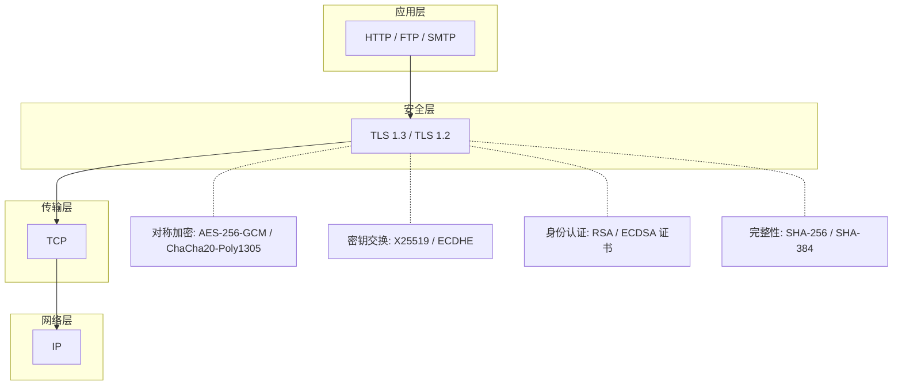
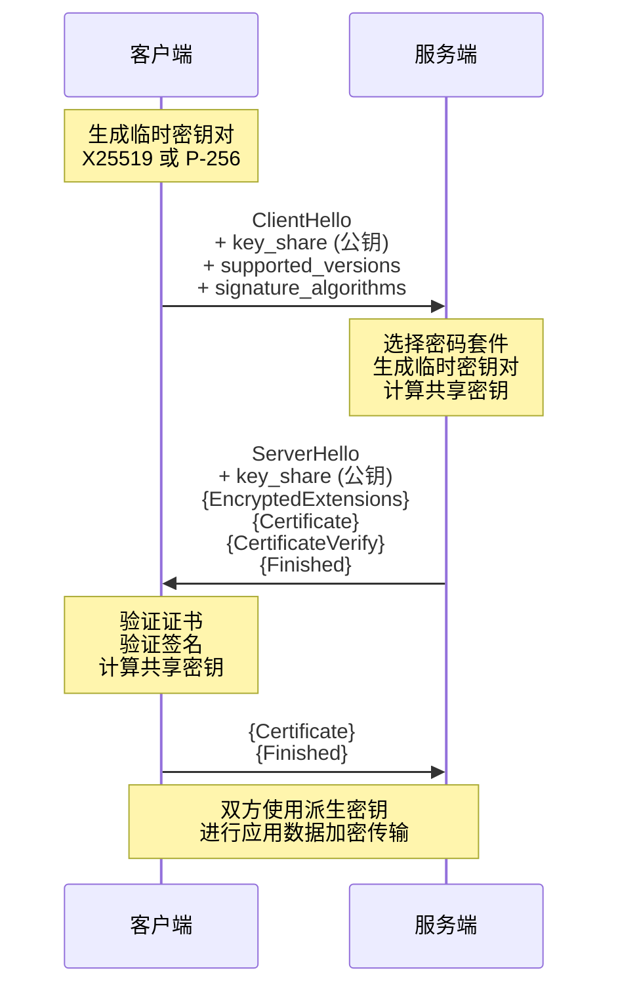
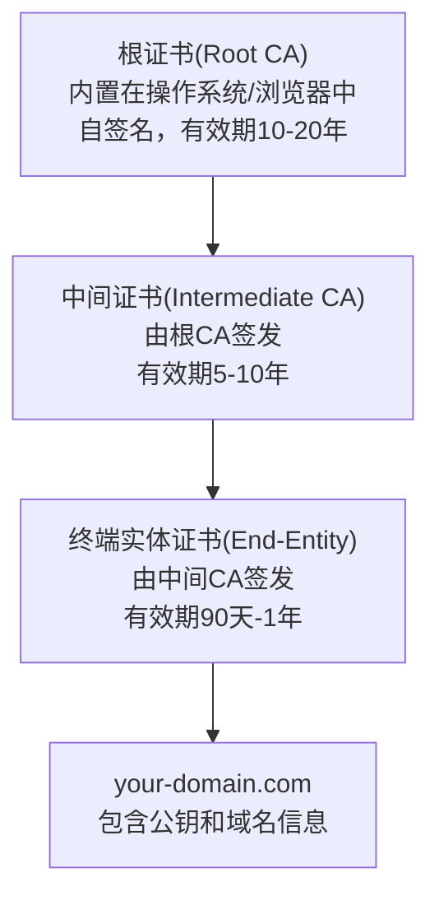

# 技巧一：TLS/SSL配置

TLS（Transport Layer Security）是保护网络通信安全的核心协议，SSL（Secure Sockets Layer）是其前身。今天所说的"SSL证书""SSL加密"实际上指的都是TLS——SSL 3.0及更早版本因存在严重安全漏洞已被废弃。正确配置TLS/SSL是每个后端工程师、运维工程师和安全工程师的必备技能。

本节从TLS协议原理出发，系统讲解证书管理、服务器配置、密码套件选择、性能优化和安全审计的完整实践方法。

---

## 1. TLS协议原理

### 1.1 TLS在协议栈中的位置



TLS协议在传输层（TCP）之上、应用层之下，为上层协议提供透明的安全保护。应用层协议只需将通信重定向到TLS端口（通常443），即可获得加密、认证和完整性保护。

### 1.2 TLS 1.3 vs TLS 1.2：关键差异

TLS 1.3于2018年（RFC 8446）正式发布，相比TLS 1.2进行了大幅简化和安全增强：

| 特性 | TLS 1.2 (RFC 5246) | TLS 1.3 (RFC 8446) |
|------|--------------------|--------------------|
| 握手轮次 | 2-RTT | 1-RTT（支持0-RTT恢复） |
| 密钥交换 | RSA / DHE / ECDHE | 仅限 (EC)DHE / PSK |
| 密码套件数 | 数十个（含不安全选项） | 5个（全部AEAD） |
| 前向保密 | 可选（RSA密钥交换不支持） | 强制（所有密钥交换都使用临时密钥） |
| 压缩 | 支持（存在CRIME攻击风险） | 已移除 |
| 重协商 | 支持（存在安全风险） | 已移除 |
| 对称加密 | AES-CBC、RC4等不安全选项 | 仅AES-GCM、ChaCha20-Poly1305等 |

**TLS 1.3移除的密码组件**：

| 移除的组件 | 原因 |
|-----------|------|
| RSA密钥交换 | 不提供前向保密 |
| CBC模式 | 存在BEAST、Lucky13等攻击 |
| RC4流密码 | 存在统计偏差，已被破解 |
| 3DES | 64位块大小，Sweet32攻击 |
| SHA-1 | 碰撞攻击（SHAttered） |
| 静态DH / ECDH | 不提供前向保密 |
| 压缩 | CRIME攻击 |

### 1.3 TLS 1.3握手流程

TLS 1.3将握手从2-RTT压缩到1-RTT，同时将密钥协商与身份认证解耦：



大括号 `{...}` 表示在握手密钥保护下的加密消息。TLS 1.3将大部分握手信息在服务端第一条响应消息后就开始加密，大幅减少了中间人可观察到的信息量。

### 1.4 TLS会话恢复

TLS支持两种会话恢复机制，避免每次连接都进行完整的密钥交换：

**Session Ticket（会话票据）**：
- 服务端生成加密的Session Ticket发送给客户端
- 客户端在后续连接时携带Ticket
- 服务端解密Ticket恢复会话参数
- 支持跨服务器恢复（Ticket加密密钥共享）

**Pre-Shared Key（PSK，TLS 1.3原生支持）**：
- 基于上次会话派生的密钥建立PSK
- 支持0-RTT恢复（早期数据Early Data）
- ⚠️ 0-RTT数据不具有前向保密性和重放保护

---

## 2. 数字证书体系

### 2.1 证书链结构



证书验证遵循信任链路径：客户端从终端实体证书出发，逐级向上验证签名，直到找到一个自己信任的根证书。如果中间证书未包含在TLS握手中，客户端需要自行下载——这可能导致连接失败。

**证书验证流程**：
1. 检查证书是否在有效期内（notBefore <= 当前时间 <= notAfter）
2. 验证证书域名是否匹配请求的域名（CN或SAN字段）
3. 验证证书签名链是否指向受信任的根CA
4. 检查证书吊销状态（OCSP或CRL）
5. 检查证书透明度（Certificate Transparency）日志

### 2.2 证书类型对比

| 类型 | 验证级别 | 签发时间 | 价格范围 | 适用场景 |
|------|---------|---------|---------|---------|
| DV（Domain Validation） | 仅验证域名所有权 | 几分钟 | 免费（Let's Encrypt）~ $10/年 | 个人站点、博客 |
| OV（Organization Validation） | 验证组织真实性 | 1-3天 | $50-200/年 | 企业官网 |
| EV（Extended Validation） | 深度验证企业资质 | 1-2周 | $200-1000/年 | 金融、电商 |
| 通配符（Wildcard） | DV/OV级别 | 几分钟~3天 | $50-500/年 | 多子域名场景 |
| SAN（多域名） | DV/OV级别 | 几分钟~3天 | $10-300/年 | 多域名共用证书 |
| 自签名证书 | 无第三方验证 | 即时 | 免费 | 开发测试、内部系统 |

### 2.3 证书关键字段

一个X.509 v3证书包含以下核心字段：

Certificate:
    Data:
        Version: 3 (0x2)
        Serial Number: 1a:2b:3c:4d:...
        Signature Algorithm: sha256WithRSAEncryption
        Issuer: CN = Let's Encrypt Authority X3
        Validity
            Not Before: Jan  1 00:00:00 2024 GMT
            Not After : Apr  1 00:00:00 2024 GMT
        Subject: CN = example.com
        Subject Public Key Info:
            Public Key Algorithm: id-ecPublicKey
            Public-Key: (256 bit)
                ASN1 OID: prime256v1
        X509v3 extensions:
            X509v3 Basic Constraints: CA:FALSE
            X509v3 Key Usage: Digital Signature
            X509v3 Extended Key Usage: TLS Web Server Authentication
            X509v3 Subject Alternative Name:
                DNS:example.com
                DNS:www.example.com
                DNS:*.example.com

**关键注意事项**：
- **SAN（Subject Alternative Name）**：现代浏览器优先使用SAN而非CN进行域名匹配，两者都应配置
- **Key Usage**：TLS服务器证书必须包含 digitalSignature 和 keyEncipherment
- **Basic Constraints**：终端实体证书必须设置 CA:FALSE
- **密钥类型**：RSA（传统，兼容性最好）或 ECDSA（更短、更快、更安全）

---

## 3. Nginx TLS配置实战

### 3.1 获取免费证书（Let's Encrypt）

```bash
# 安装 certbot
sudo apt-get install -y certbot python3-certbot-nginx

# 获取证书并自动配置Nginx
sudo certbot --nginx -d example.com -d www.example.com

# 手动获取证书（不修改Nginx配置）
sudo certbot certonly --nginx -d example.com

# 证书文件位置
# /etc/letsencrypt/live/example.com/fullchain.pem  (证书+中间证书)
# /etc/letsencrypt/live/example.com/privkey.pem    (私钥)
```

**证书自动续期**：
```bash
# 测试续期
sudo certbot renew --dry-run

# 确认自动续期定时任务
systemctl list-timers | grep certbot
# 或手动添加crontab
# 0 3 * * * certbot renew --quiet --deploy-hook "systemctl reload nginx"
```

### 3.2 Nginx TLS生产配置

以下是经过安全审计的Nginx TLS配置模板，适用于TLS 1.2 + TLS 1.3兼容环境：

```nginx
# /etc/nginx/conf.d/ssl.conf

# --- TLS 1.3 密码套件 ---
# TLS 1.3密码套件由IANA统一定义，无需手动指定
# 但可以控制密钥交换的优先顺序
ssl_ecdh_curve X25519:P-256:P-384;

# --- TLS 1.2 密码套件 ---
# 仅允许前向保密的AEAD密码套件
ssl_ciphers 'ECDHE-ECDSA-AES128-GCM-SHA256:ECDHE-RSA-AES128-GCM-SHA256:ECDHE-ECDSA-AES256-GCM-SHA384:ECDHE-RSA-AES256-GCM-SHA384:ECDHE-ECDSA-CHACHA20-POLY1305:ECDHE-RSA-CHACHA20-POLY1305';
ssl_prefer_server_ciphers on;

# --- 协议版本 ---
ssl_protocols TLSv1.2 TLSv1.3;

# --- 会话恢复 ---
ssl_session_cache shared:SSL:10m;
ssl_session_timeout 1d;
ssl_session_tickets on;
# 可选：自定义Session Ticket密钥（多服务器共享）
# ssl_session_ticket_key /etc/nginx/ssl/ticket.key;

# --- OCSP Stapling ---
ssl_stapling on;
ssl_stapling_verify on;
resolver 8.8.8.8 1.1.1.1 valid=300s;
resolver_timeout 5s;

# --- DH参数（TLS 1.2 DHE密钥交换使用） ---
ssl_dhparam /etc/nginx/ssl/dhparam.pem;

server {
    listen 443 ssl http2;
    listen [::]:443 ssl http2;
    server_name example.com www.example.com;

    ssl_certificate     /etc/letsencrypt/live/example.com/fullchain.pem;
    ssl_certificate_key /etc/letsencrypt/live/example.com/privkey.pem;

    # --- 安全响应头 ---
    # HSTS：强制浏览器使用HTTPS（含所有子域名）
    add_header Strict-Transport-Security "max-age=63072000; includeSubDomains; preload" always;

    # 防止MIME类型嗅探
    add_header X-Content-Type-Options "nosniff" always;

    # 点击劫持防护
    add_header X-Frame-Options "SAMEORIGIN" always;

    # XSS防护（现代浏览器已内置，但保留兼容性）
    add_header X-XSS-Protection "0" always;

    # Referrer策略
    add_header Referrer-Policy "strict-origin-when-cross-origin" always;

    # CSP（根据业务需求自定义）
    add_header Content-Security-Policy "default-src 'self'" always;
}

# --- HTTP → HTTPS 强制跳转 ---
server {
    listen 80;
    listen [::]:80;
    server_name example.com www.example.com;

    # Let's Encrypt ACME挑战
    location /.well-known/acme-challenge/ {
        root /var/www/certbot;
    }

    location / {
        return 301 https://$host$request_uri;
    }
}
```

### 3.3 生成DH参数文件

```bash
# 生成2048位DH参数（TLS 1.2 DHE使用）
# 生成时间约30秒
openssl dhparam -out /etc/nginx/ssl/dhparam.pem 2048

# 更安全的4096位（生成时间较长）
openssl dhparam -out /etc/nginx/ssl/dhparam.pem 4096
```

> **注意**：如果只使用ECDHE（不使用DHE），可以不配置DH参数。TLS 1.3不需要DH参数。

### 3.4 验证Nginx配置

```bash
# 检查语法
sudo nginx -t

# 重新加载配置（不中断连接）
sudo nginx -s reload
```

---

## 4. Apache TLS配置实战

### 4.1 Apache生产配置

```apache
# /etc/apache2/sites-available/your-site-ssl.conf

<VirtualHost *:443>
    ServerName example.com
    ServerAlias www.example.com
    DocumentRoot /var/www/html

    # --- SSL引擎 ---
    SSLEngine on
    SSLCertificateFile      /etc/letsencrypt/live/example.com/fullchain.pem
    SSLCertificateKeyFile   /etc/letsencrypt/live/example.com/privkey.pem

    # --- 协议版本（仅TLS 1.2和1.3） ---
    SSLProtocol all -SSLv3 -TLSv1 -TLSv1.1

    # --- 密码套件 ---
    SSLCipherSuite ECDHE-ECDSA-AES128-GCM-SHA256:ECDHE-RSA-AES128-GCM-SHA256:ECDHE-ECDSA-AES256-GCM-SHA384:ECDHE-RSA-AES256-GCM-SHA384:ECDHE-ECDSA-CHACHA20-POLY1305:ECDHE-RSA-CHACHA20-POLY1305
    SSLCipherSuite TLSv1.3 TLS_AES_256_GCM_SHA384:TLS_CHACHA20_POLY1305_SHA256:TLS_AES_128_GCM_SHA256
    SSLHonorCipherOrder on

    # --- OCSP Stapling ---
    SSLUseStapling on
    SSLStaplingCache "shmcb:logs/ssl_stapling(32768)"

    # --- 会话缓存 ---
    SSLSessionCache "shmcb:logs/ssl_scache(512000)"
    SSLSessionTimeout 1d

    # --- 安全头 ---
    Header always set Strict-Transport-Security "max-age=63072000; includeSubDomains; preload"
    Header always set X-Content-Type-Options "nosniff"

    # --- DH参数 ---
    SSLOpenSSLConfCmd DHParameters "/etc/ssl/dhparam.pem"
</VirtualHost>

# --- HTTP → HTTPS 跳转 ---
<VirtualHost *:80>
    ServerName example.com
    ServerAlias www.example.com
    Redirect permanent / https://example.com/
</VirtualHost>
```

```bash
# 启用必要模块
sudo a2enmod ssl
sudo a2enmod headers
sudo a2enmod socache_shmcb

# 测试并重启
sudo apachectl configtest
sudo systemctl restart apache2
```

---

## 5. 密码套件详解与选型

### 5.1 现代TLS密码套件组成

TLS 1.3的密码套件命名格式为：
TLS_<密钥交换>_<认证加密>_<哈希算法>

例如 `TLS_AES_256_GCM_SHA384` 表示：
- 密钥交换：由握手过程决定（ECHE或PSK）
- 认证加密：AES-256-GCM
- 哈希算法：SHA-384

### 5.2 推荐密码套件

**Tier 1 — 首选（最高安全性和性能）**：

| 密码套件 | 密钥交换 | 加密 | 哈希 | 安全性 | 性能 |
|---------|---------|------|------|--------|------|
| TLS_AES_256_GCM_SHA384 | ECDHE | AES-256-GCM | SHA-384 | ★★★★★ | ★★★★ |
| TLS_CHACHA20_POLY1305_SHA256 | ECDHE | ChaCha20-Poly1305 | SHA-256 | ★★★★★ | ★★★★★(无AES-NI) |
| TLS_AES_128_GCM_SHA256 | ECDHE | AES-128-GCM | SHA-256 | ★★★★★ | ★★★★★ |

**Tier 2 — 备选（兼容旧客户端）**：

| 密码套件 | 密钥交换 | 加密 | 哈希 |
|---------|---------|------|------|
| ECDHE-ECDSA-AES256-GCM-SHA384 | ECDHE + ECDSA | AES-256-GCM | SHA-384 |
| ECDHE-RSA-AES256-GCM-SHA384 | ECDHE + RSA | AES-256-GCM | SHA-384 |
| ECDHE-ECDSA-CHACHA20-POLY1305 | ECDHE + ECDSA | ChaCha20-Poly1305 | SHA-256 |

### 5.3 ChaCha20 vs AES-GCM选型

ChaCha20-Poly1305和AES-GCM是TLS 1.3的两种主要加密算法，选择依据主要是客户端硬件：

| 维度 | AES-GCM | ChaCha20-Poly1305 |
|------|---------|-------------------|
| 硬件加速 | AES-NI指令集（x86服务器） | 无专用硬件 |
| 软件实现 | 慢（无AES-NI时） | 快（纯软件ARX操作） |
| 移动设备 | 一般 | 快（ARM NEON优化） |
| 内存访问模式 | 查表（可能有缓存侧信道） | 常数时间 |
| Nonce要求 | 96位，禁止重复 | 96位，禁止重复 |
| TLS 1.3支持 | 全平台 | 全平台 |

**选择建议**：
- 有AES-NI的服务器（Intel/AMD）：优先AES-GCM
- 移动设备和ARM服务器：优先ChaCha20-Poly1305
- BoringSSL/Chrome会自动根据客户端能力选择最优密码套件

---

## 6. HSTS与证书安全增强

### 6.1 HSTS（HTTP Strict Transport Security）

HSTS告知浏览器在指定时间内只使用HTTPS访问该站点，即使用户输入http://也会自动重定向。

Strict-Transport-Security: max-age=63072000; includeSubDomains; preload

**参数说明**：
- `max-age=63072000`：有效期2年（Google推荐值）
- `includeSubDomains`：应用于所有子域名
- `preload`：提交到浏览器HSTS预加载列表

**HSTS预加载提交步骤**：
1. 确保所有子域名都支持HTTPS
2. 确保根域名提供有效的301重定向到HTTPS
3. 确保HSTS头包含max-age>=31536000（1年）和preload
4. 在 https://hstspreload.org 提交域名
5. 审核通过后，所有主流浏览器将内置你的域名到HTTPS强制列表

> ⚠️ HSTS预加载是**不可轻易撤销**的——提交前务必确认站点长期支持HTTPS。

### 6.2 证书透明度（Certificate Transparency）

CT要求所有公开信任的CA将签发的证书记录到公开的可验证日志中。其价值在于：

- **异常检测**：域名所有者可以监控是否有未授权的证书被签发
- **CA审计**：公开日志使得CA的签发行为可被任何人审计
- **快速发现**：误签发的证书可以在几分钟内被发现

现代浏览器要求证书包含SCT（Signed Certificate Timestamp），这是CT合规的证据。

### 6.3 证书吊销机制

当私钥泄露或证书信息错误时，需要吊销证书：

**OCSP（Online Certificate Status Protocol）**：
客户端 → OCSP响应器: 证书状态查询
OCSP响应器 → 客户端: good / revoked / unknown

**OCSP Stapling**：服务器主动查询证书状态并在TLS握手中附加OCSP响应，避免客户端单独查询（保护隐私、加速连接）。

**CRL（Certificate Revocation List）**：CA定期发布被吊销证书的序列号列表。缺点是列表可能很大、更新不及时。

**对比**：
| 维度 | OCSP | CRL | OCSP Stapling |
|------|------|-----|--------------|
| 实时性 | 高（在线查询） | 低（定期更新） | 高 |
| 隐私性 | 差（CA知道谁在查询） | 好 | 好（由服务器查询） |
| 性能 | 每次连接需查询 | 本地缓存 | 服务器缓存，零额外延迟 |
| 后备机制 | soft-fail可被利用 | N/A | 后备OCSP |

---

## 7. 客户端TLS验证（mTLS）

### 7.1 双向TLS（mTLS）

mTLS要求客户端也向服务端出示证书，实现双向身份认证。适用于微服务间通信、API安全、零信任架构。

```nginx
# Nginx mTLS配置
server {
    listen 443 ssl http2;
    server_name api.internal.example.com;

    ssl_certificate     /etc/nginx/ssl/server.crt;
    ssl_certificate_key /etc/nginx/ssl/server.key;

    # 要求客户端证书
    ssl_client_certificate /etc/nginx/ssl/ca.crt;
    ssl_verify_client on;
    ssl_verify_depth 2;

    # 可选：CRL吊销列表
    ssl_crl /etc/nginx/ssl/ca.crl;

    location / {
        # 将客户端证书信息传递给后端
        proxy_set_header X-Client-Cert-DN $ssl_client_s_dn;
        proxy_set_header X-Client-Cert-Serial $ssl_client_serial;
        proxy_pass http://backend;
    }
}
```

### 7.2 生成mTLS客户端证书

```bash
# 1. 创建CA（如没有现成CA）
openssl req -x509 -newkey rsa:4096 -sha256 -days 3650 \
    -keyout ca-key.pem -out ca.crt \
    -subj "/CN=Internal CA" -nodes

# 2. 生成客户端密钥和CSR
openssl req -newkey rsa:2048 -nodes \
    -keyout client-key.pem -out client.csr \
    -subj "/CN=service-a/O=MyOrg"

# 3. 用CA签发客户端证书
openssl x509 -req -in client.csr -CA ca.crt -CAkey ca-key.pem \
    -CAcreateserial -out client.crt -days 365 \
    -extfile <(echo "extendedKeyUsage=clientAuth")

# 4. 验证
openssl verify -CAfile ca.crt client.crt
```

---

## 8. 性能优化

### 8.1 TLS握手性能基准

一次完整的TLS 1.3握手的计算成本：
- RSA-2048签名验证：~0.5ms
- ECDSA P-256签名：~0.1ms
- X25519密钥交换：~0.05ms
- AES-256-GCM（1KB数据）：~0.001ms

**影响TLS性能的关键因素**：
1. 握手次数（会话恢复可减少）
2. 密钥交换算法（RSA最慢，X25519最快）
3. 密码算法（有AES-NI则AES最快，否则ChaCha20更快）
4. 证书大小（链越长、密钥越长越慢）

### 8.2 优化策略

**1. 启用HTTP/2或HTTP/3**

HTTP/2的多路复用使一个TCP连接可以并行传输多个请求/响应，大幅减少了TLS握手次数。HTTP/3基于QUIC协议，将TLS 1.3内建到传输层，首次连接实现0-RTT。

```nginx
# Nginx启用HTTP/2
listen 443 ssl http2;

# HTTP/3（需要nginx 1.25.0+和QUIC模块）
listen 443 quic reuseport;
add_header Alt-Svc 'h3=":443"; ma=86400';
```

**2. 会话恢复**

```nginx
# 共享会话缓存（10MB足够约40,000个会话）
ssl_session_cache shared:SSL:10m;
ssl_session_timeout 1d;

# Session Ticket密钥轮换（每天更换）
# 生成初始密钥
openssl rand 80 > /etc/nginx/ssl/ticket.key
# crontab: 0 0 * * * openssl rand 80 > /etc/nginx/ssl/ticket.key.new &amp;&amp; mv /etc/nginx/ssl/ticket.key.new /etc/nginx/ssl/ticket.key &amp;&amp; nginx -s reload
```

**3. 证书链优化**

```bash
# 验证证书链是否完整
openssl s_client -connect example.com:443 -showcerts </dev/null 2>/dev/null | \
    grep -E "^ [0-9]|s:|i:" | head -20

# 正确的链：终端证书 → 中间证书 → 根证书（根证书通常不需要发送）
# fullchain.pem 应包含：终端证书 + 中间证书（不含根证书）
```

**4. OCSP Stapling**

```nginx
# 预获取OCSP响应
openssl ocsp -issuer /etc/letsencrypt/live/example.com/chain.pem \
    -cert /etc/letsencrypt/live/example.com/cert.pem \
    -url http://x1.c.lencr.org/ -resp_text -no_nonce

# Nginx启用OCSP Stapling（前面已配置）
ssl_stapling on;
ssl_stapling_verify on;
```

### 8.3 性能测试

```bash
# 使用 openssl 测量TLS握手时间
time echo | openssl s_client -connect example.com:443 2>/dev/null | grep "Verification"

# 使用 curl 测量完整请求时间
curl -w "DNS: %{time_namelookup}s\nConnect: %{time_connect}s\nTLS: %{time_appconnect}s\nTotal: %{time_total}s\n" \
    -o /dev/null -s https://example.com

# 使用 wrk 压测
wrk -t4 -c100 -d30s https://example.com

# 使用 hey 进行更精细的测试
hey -n 10000 -c 200 -enable-keepalive https://example.com
```

---

## 9. 安全审计与检测

### 9.1 在线检测工具

| 工具 | 地址 | 功能 |
|------|------|------|
| Qualys SSL Labs | ssllabs.com/ssltest | 综合TLS评分（A+到F） |
| testssl.sh | testssl.sh | 本地命令行扫描 |
| Mozilla Observatory | observatory.mozilla.org | 安全头+TLS综合评估 |
| Hardenize | hardenize.com | 企业级安全配置分析 |

### 9.2 使用testssl.sh本地审计

```bash
# 安装
git clone --depth 1 https://github.com/drwetter/testssl.sh.git
cd testssl.sh

# 基本扫描
./testssl.sh example.com

# 详细扫描（包含所有测试）
./testssl.sh --sneaky -U -S -P -B example.com

# 输出JSON报告
./testssl.sh -oJ /tmp/ssl-report.json example.com
```

### 9.3 常见TLS配置缺陷

| 缺陷 | 风险等级 | 检测方法 | 修复方案 |
|------|---------|---------|---------|
| 支持SSLv3 | 🔴 严重 | testssl.sh扫描 | 禁用SSLv3 |
| 支持TLS 1.0/1.1 | 🟠 高 | 同上 | 仅允许TLS 1.2+ |
| 弱密码套件（RC4, 3DES） | 🔴 严重 | 同上 | 使用AEAD套件 |
| 无前向保密 | 🟠 高 | 检查是否使用静态RSA | 仅使用ECDHE |
| 证书即将过期 | 🟡 中 | openssl检查notAfter | 设置续期提醒 |
| 中间证书缺失 | 🟡 中 | openssl s_client | 配置完整证书链 |
| 无HSTS头 | 🟡 中 | curl -I | 添加HSTS头 |
| HSTS max-age过短 | 🟡 中 | curl -I | 设置>=31536000 |
| 无OCSP Stapling | 🟢 低 | testssl.sh | 启用stapling |
| Server头泄露版本 | 🟢 低 | curl -I | 配置server_tokens off |
| TLS压缩开启 | 🔴 严重 | testssl.sh | 禁用compression |

### 9.4 自动化监控脚本

```bash
#!/bin/bash
# tls-monitor.sh — 监控证书过期和TLS配置变化
DOMAIN=$1
ALERT_DAYS=${2:-14}

# 证书过期检查
EXPIRY=$(echo | openssl s_client -connect "${DOMAIN}:443" -servername "${DOMAIN}" 2>/dev/null | \
    openssl x509 -noout -enddate | cut -d= -f2)
EXPIRY_EPOCH=$(date -d "$EXPIRY" +%s)
NOW_EPOCH=$(date +%s)
DAYS_LEFT=$(( (EXPIRY_EPOCH - NOW_EPOCH) / 86400 ))

if [ "$DAYS_LEFT" -lt "$ALERT_DAYS" ]; then
    echo "⚠️  ${DOMAIN} 证书将在 ${DAYS_LEFT} 天后过期！"
    echo "   过期时间: ${EXPIRY}"
    # 这里可以接入告警通知：邮件、钉钉、飞书等
    exit 1
fi

# TLS版本检查
SUPPORTED=$(echo | openssl s_client -connect "${DOMAIN}:443" -servername "${DOMAIN}" 2>/dev/null | \
    grep "Protocol" | awk '{print $NF}')
echo "✅ ${DOMAIN} — 证书剩余 ${DAYS_LEFT} 天，TLS版本: ${SUPPORTED}"
```

---

## 10. 常见误区与最佳实践

### 10.1 常见误区

**误区一：使用自签名证书上线**
自签名证书不受CA信任，浏览器会显示安全警告。生产环境必须使用CA签发的证书。自签名证书仅适用于开发测试或内部系统（配合客户端证书固定）。

**误区二：开启TLS压缩以提升性能**
TLS压缩存在CRIME攻击漏洞，攻击者可以通过压缩比的差异推导出加密内容中的秘密信息。TLS 1.3已彻底移除压缩支持。

**误区三：忽略证书链完整性**
只配置终端实体证书而不包含中间证书，会导致部分客户端验证失败。正确的做法是配置完整链（终端证书+中间证书），但不需要包含根证书。

**误区四：认为加密=安全**
TLS提供的是传输通道安全（机密性+完整性+认证性），不能替代应用层安全措施。SQL注入、XSS、CSRF等攻击在HTTPS下同样有效。

**误区五：证书过期后才处理**
证书过期导致网站不可访问，影响用户体验和SEO。应建立证书监控和自动续期机制。

**误区六：混合使用RSA和ECDSA密钥**
一些站点同时配置RSA和ECDSA证书以兼容不同客户端，但这增加了管理复杂度。现代客户端（2015年后）基本都支持ECDSA，建议统一使用ECDSA。

### 10.2 最佳实践清单

TLS/SSL配置安全检查清单
========================

[协议与密码]
  □ 禁用SSLv3、TLS 1.0、TLS 1.1
  □ 仅启用TLS 1.2和TLS 1.3
  □ TLS 1.2密码套件仅包含ECDHE+AEAD组合
  □ 优先使用X25519作为密钥交换
  □ 设置ssl_prefer_server_ciphers on（Nginx）

[证书管理]
  □ 使用受信任CA签发的证书
  □ 配置完整的证书链（fullchain）
  □ SAN字段包含所有需要覆盖的域名
  □ 启用自动续期（certbot renew）
  □ 监控证书过期时间（提前14天告警）
  □ 私钥权限设置为600（仅root可读）

[安全头]
  □ 配置HSTS（max-age >= 31536000）
  □ 包含includeSubDomains
  □ 考虑提交到HSTS预加载列表
  □ 配置X-Content-Type-Options: nosniff

[性能优化]
  □ 启用OCSP Stapling
  □ 配置SSL Session Cache和Session Timeout
  □ 启用HTTP/2
  □ 考虑启用HTTP/3（QUIC）
  □ DH参数 >= 2048位

[运维]
  □ 配置HTTP→HTTPS 301重定向
  □ 保护私钥文件权限
  □ 定期运行SSL Labs扫描
  □ 建立证书过期监控
  □ 记录TLS配置变更历史

---

## 11. 环境准备与一键部署

### 11.1 系统要求

| 组件 | 最低要求 | 推荐配置 |
|------|---------|---------|
| 操作系统 | Ubuntu 20.04 / CentOS 8 | Ubuntu 22.04 LTS |
| 内存 | 1GB | 2GB+ |
| Nginx | 1.18+ | 1.24+ |
| OpenSSL | 1.1.1+ | 3.0+（支持TLS 1.3） |
| 磁盘 | 100MB（证书和配置） | SSD推荐 |

### 11.2 快速部署脚本

```bash
#!/bin/bash
# deploy-tls.sh — 一键部署TLS配置
set -euo pipefail

DOMAIN=${1:?"用法: $0 <域名>"}
EMAIL=${2:-"admin@${DOMAIN}"}

echo "=== 1. 更新系统和安装依赖 ==="
apt-get update
apt-get install -y nginx certbot python3-certbot-nginx openssl curl

echo "=== 2. 生成DH参数（如果不存在） ==="
DH_PARAM="/etc/nginx/ssl/dhparam.pem"
if [ ! -f "$DH_PARAM" ]; then
    mkdir -p /etc/nginx/ssl
    openssl dhparam -out "$DH_PARAM" 2048
    echo "DH参数生成完成"
fi

echo "=== 3. 获取证书 ==="
certbot certonly --nginx -d "$DOMAIN" -d "www.${DOMAIN}" \
    --non-interactive --agree-tos -m "$EMAIL"

echo "=== 4. 配置Nginx ==="
cat > /etc/nginx/sites-available/${DOMAIN}.conf << 'NGINX_CONF'
# 此处插入上面第3.2节的Nginx配置模板
# （实际部署时替换域名和证书路径）
NGINX_CONF

ln -sf /etc/nginx/sites-available/${DOMAIN}.conf /etc/nginx/sites-enabled/

echo "=== 5. 测试并重载 ==="
nginx -t
systemctl reload nginx

echo "=== 6. 验证 ==="
curl -sI "https://${DOMAIN}" | head -5
echo ""
echo "=== 部署完成！==="
echo "SSL Labs测试: https://www.ssllabs.com/ssltest/analyze.html?d=${DOMAIN}"
```

### 11.3 命令速查

```bash
# 查看远程服务器TLS配置
echo | openssl s_client -connect example.com:443 -servername example.com 2>/dev/null | openssl x509 -noout -text

# 检查支持的TLS版本
for v in tls1 tls1_1 tls1_2 tls1_3; do
    echo -n "$v: "
    echo | openssl s_client -connect example.com:443 -"$v" 2>&amp;1 | grep -c "CONNECTED" | \
        xargs -I{} sh -c '[ {} -gt 0 ] &amp;&amp; echo "SUPPORTED" || echo "NOT SUPPORTED"'
done

# 检查证书链
openssl s_client -connect example.com:443 -showcerts </dev/null 2>/dev/null | \
    awk '/Certificate chain/,/---/'

# 生成自签名证书（开发测试用）
openssl req -x509 -newkey rsa:2048 -sha256 -days 365 \
    -keyout key.pem -out cert.pem -nodes \
    -subj "/CN=localhost"

# 手动续期证书
certbot renew --force-renewal

# 查看证书详情
openssl x509 -in cert.pem -noout -subject -issuer -dates -fingerprint
```

---

## 本节小结

TLS/SSL配置是网络安全的第一道防线。核心要点回顾：

1. **协议选择**：优先TLS 1.3，兼容TLS 1.2，彻底禁用SSLv3和TLS 1.0/1.1
2. **密码套件**：仅使用AEAD加密（AES-GCM、ChaCha20-Poly1305），强制前向保密（ECDHE）
3. **证书管理**：使用受信任CA签发的完整链证书，配置自动续期和监控
4. **安全加固**：HSTS、OCSP Stapling、安全响应头，消除常见配置缺陷
5. **性能优化**：会话恢复、HTTP/2多路复用、OCSP Stapling，减少握手开销
6. **持续审计**：定期使用SSL Labs或testssl.sh扫描，保持配置的安全基线

TLS配置不是一次性的任务——密码学标准在演进，攻击手段在更新，需要持续关注和维护。建议将TLS配置纳入基础设施即代码（IaC）管理，配合自动化审计和监控，确保安全配置的持续合规。
